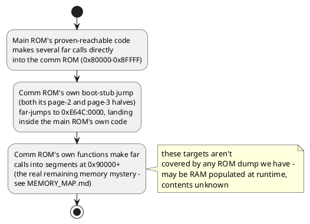

# Jump map

Control-flow relationships between major code regions, as activity
diagrams. Starts high-level (system boot, major subsystem boundaries)
and drills into more detail in later sections as specific routines get
understood — add new, more detailed diagrams here rather than
replacing the high-level one, so the overview stays readable.

Every step below is a directly observed jump/call in the disassembly
(see `disasm/sysrom_3532_3633.lst` and `disasm/160-2998-14.lst` for the
raw instructions) — addresses are physical (`chip:offset` per
`disasm/NOTES.md`'s address map). Where the *purpose* of a step is
inferred rather than confirmed, it's marked "(guess)".

## Level 0: system boot, high level

## Level 0: main ROM <-> comm ROM relationship

## Level 1 detail: (none yet)

As specific subsystem-init calls (`0xE3B1`, `0xFDB3`, `0xF9FE`,
`0xF156`, `0xE75C`, `0xFBCF`, `0xE925`, `0xE723`, ...) get identified,
add a Level-1 diagram here per subsystem showing its own internal
control flow, and link back to this file from `disasm/NOTES.md` and
`TODO.md`.
