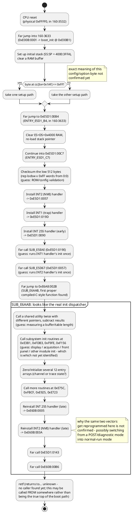
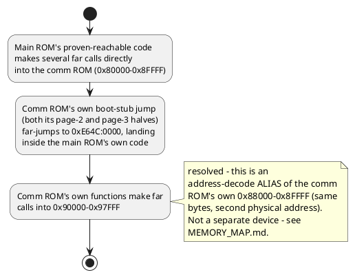
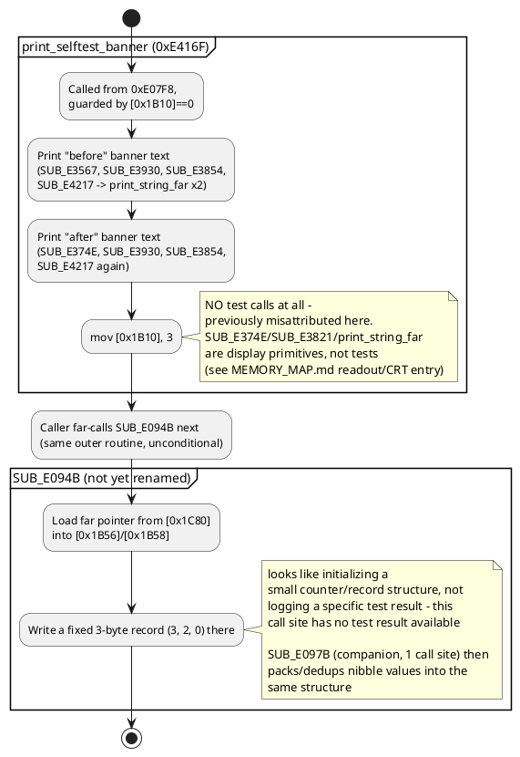
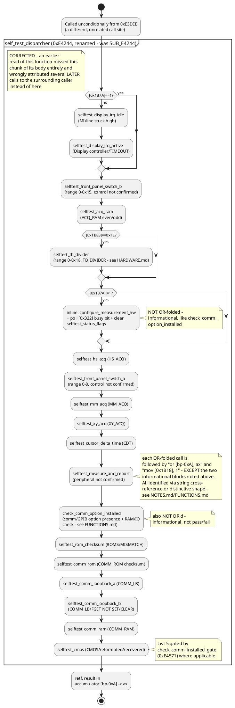
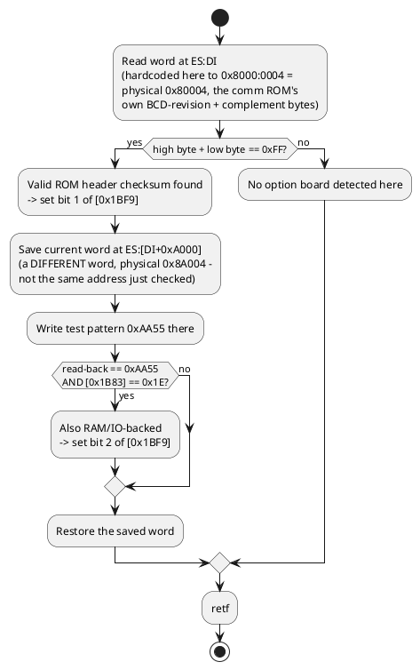

# Jump map

Control-flow relationships between major code regions, as activity
diagrams. Starts high-level (system boot, major subsystem boundaries)
and drills into more detail in later sections as specific routines get
understood — add new, more detailed diagrams here rather than
replacing the high-level one, so the overview stays readable.

Every step below is a directly observed jump/call in the disassembly
(see `disasm/sysrom_3532_3633.lst` and `disasm/160-2998-14.lst` for the
raw instructions) — addresses are physical (`chip:offset` per
`disasm/NOTES.md`'s address map). Where the *purpose* of a step is
inferred rather than confirmed, it's marked "(guess)".

## Level 0: system boot, high level

## Level 0: main ROM <-> comm ROM relationship

## Level 1 detail: self-test dispatcher

**Corrected this session**: `0xE416F` was misnamed `self_test_dispatcher`
- it actually contains zero test calls, just banner-printing. Renamed
to `print_selftest_banner`. The real OR-fold test dispatcher is
`0xE4244`, called from an unrelated site (`0xE3DEE`). Both routines
happen to be called near each other inside the same outer
report-printing function (`SUB_E07B4`), which is what caused the
original mix-up. See `disasm/NOTES.md` "self_test_dispatcher was
misnamed".

`check_comm_option_installed` itself:

**Cross-ROM handoff found**: `comm_rom_boot_init` (`0x9628C`, comm ROM)
is called exactly once, from the main ROM at `0xE6D5A`, gated on
`[0x1BF9]!=0` (i.e. only when `check_comm_option_installed` found the
option board present, per the checksum diagram above) - this is the
main boot sequence handing off to the comm ROM's own initialization
(`init_far_pointer_table`, `init_comm_device_type_and_defaults`,
`poll_dip_switch_change`, reading the rear-panel DIP switch bank - see
`HARDWARE.md`) once its presence is confirmed.

## Level 1 detail: (more as identified)

As the remaining subsystem-test subroutines above get identified, add
a Level-1 diagram here per subsystem showing its own internal control
flow (and update `FUNCTIONS.md` + the relevant `.symbols.json` at the
same time). Still open (still-unnamed, per `TODO.md`'s renaming
tracker): `SUB_F156E`/`SUB_F1581` and `SUB_FBCF3`.
