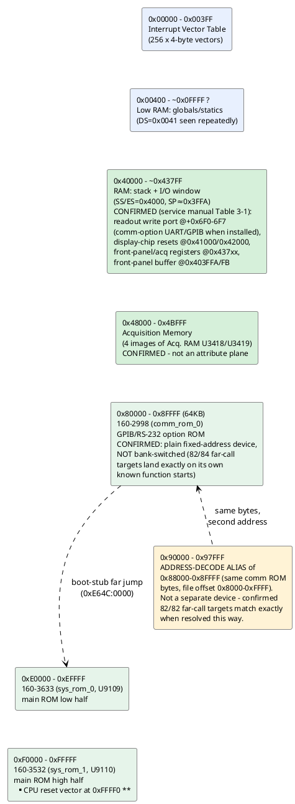
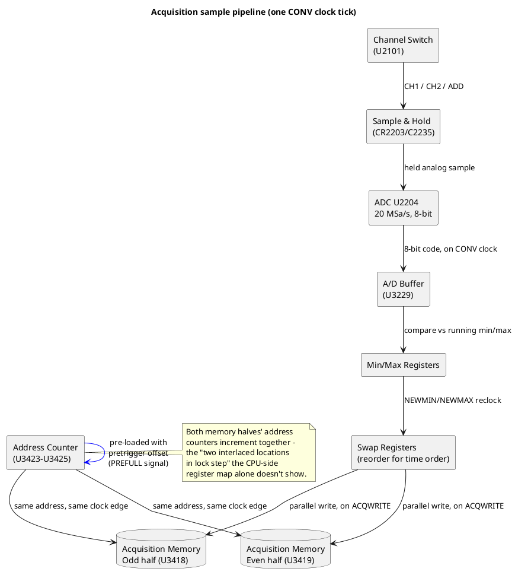

# Memory & I/O map (as understood so far)

Reconstructed from segment-register loads and I/O instructions actually
seen in the disassembled code, **now cross-checked against the real
service manual** (`hardware/2230 .pdf`, provided 2026-09-13 - see its
"Theory of Operation" Section 3, Table 3-1 "Memory Space Allocation"
for the master address map, and Section 6 "Maintenance" Tables 6-16
through 6-23 for the front-panel/exerciser register tables; a cleaner,
higher-resolution 2-page scan of Table 3-1 itself is also available at
`docs/Memory Map.pdf`, provided 2026-09-16, used to re-verify every row
below against a crisp source rather than the earlier partial OCR).
Most of the previously-"candidate, not confirmed" entries below are now
backed by the manual's own register names and U-numbers, not just
inference from code. See `docs/` (start at `docs/README.md`) for the
underlying disassembly-side evidence and cross-references.

## Confirmed regions

| Range | What | Evidence |
|---|---|---|
| `0x00000-0x003FF` | Interrupt vector table | Direct writes: `mov word [es:bx],...` with `es=0`/`es=0x3F` installing INT1, INT2, INT255 handlers (see `docs/interrupts/ivt-and-int255.md`). **`0x008`/`INT2` = NMI and `0x3FC`/`INT255` = the real hardware Maskable Interrupt (`INTR`), both confirmed directly from the service manual's own text** ("the NMI... vector is at 00008, and the Maskable Interrupt (INTR) is vectored to 03FC") - `INT255` is not a software-only vector as this project previously assumed; it's what fires when the RS-232 UART (or any other peripheral) asserts `INTR` |
| `0x40000-~0x43FFF` | RAM: stack + scratch buffers | `mov ax,0x4000 / mov ss,ax` then `mov sp,0x3FFA` at reset; `es=0x4000` used 31x, more than any other segment, for buffer clears (`mov byte [es:si],0` loops) |
| `~0x00400+` | RAM: global/static variables | `ds=0x0041` (physical `0x410`, right after the IVT) used repeatedly to access small fixed offsets like `[0x758]`, `[0x780]`, `[0x1B50]` - looks like the main variable pool starts immediately after the IVT |
| `0x40000+0x6F0`-`0x6F7` | **CONFIRMED (service manual Table 3-1): "Option UART/GPIB chips (I/O)"**, 8 consecutive addresses - the comm-option's actual UART/GPIB register file | `write_readout_port_byte` (`0xE0B50`) writes here unconditionally (not gated on comm-option presence) - a genuinely puzzling overlap with a register bank the manual says only exists when a comm option is installed. Not reconciled - see the new "Puzzle: write_readout_port_byte's address overlaps the comm-option UART register bank" note below |
| `0x41000` | **CONFIRMED: "Display chip interrupt reset"** (Table 3-1) | Matches `read_display_chip_int_reset`/`clear_display_chip_int_reset`'s address exactly - the earlier "per-channel front-end status" guess was wrong; it's the CRT/readout display controller chip's interrupt-reset line, not a channel status register. **Resolved 2026-09-18**: this register's read is what `selftest_display_irq_active` (`0xE3F99`) polls for after drawing a test vector - real hardware presumably fires a display-completion interrupt shortly after this read that this emulator has no model for, causing the busy-poll of `[0x1AEE]` (DS=0x41, physical `0x1EFE`) to always time out ("`MI : Display controller : TIMEOUT`" - previously misattributed to the neighboring `selftest_display_irq_idle`, corrected in `FUNCTIONS.md`). Fixed with `io_stubs.DisplayChipIrqStub`, which sets `[0x1AF2]`/`[0x1AEE]` (physical `0x1F02`/`0x1EFE`) directly on a read of this register |
| `0x42000` (labeled "FRAME" in the manual) | **CONFIRMED: "Display chip next frame"** (Table 3-1) | Matches `read_display_chip_frame_trigger`/`clear_display_chip_frame_trigger`'s address exactly - same correction as `0x41000` above; this is the display chip's next-frame trigger |
| `0x403FFA`, `0x403FFB` | **CONFIRMED: "Front Panel Buffer U9301"** (=`SWB2`) / **"Front Panel Buffer U9302"** (=`SWB1`) (Table 3-1, cross-referenced against Tables 6-16/6-17) | Confirms the long-standing "front-panel key/encoder status is the leading candidate" guess for `scheduler_tick_service`'s `[0x758]`/`[0x759]` source exactly. **Bit-level validated 2026-09-13**, not just address-matched: `[0x758]`'s (`SWB2`) exact bit map is `MEM 3`/`MEM 1`/`POS-SEL`/`1K-4K`/`MENU`/`MEM 2`/`MENU ADV`/`SELECT C1-C2` (bit0-7) - and self-test code masking `[0x758]&0x63` (bits 0,1,5,6 = the 3 `MEM` buttons + `MENU ADV`) plus a separate `&0x80` (`SELECT C1/C2`) check exactly reproduces the service manual's own documented self-test-abort behavior ("If the SELECT C1/C2 button is held in while the test is running, the test loops on the first error") - see `VARIABLES.md` for the full bit table and `docs/self-test/front-panel-switches.md` for the code-structure comparison |
| `0x407DE` | **CONFIRMED: "Time Base Mode Register U4119"** (Table 3-1, address `0x407DE`) | Exact match for `detect_comm_option_hw`'s write-probe address (`0x40000+0x7DE`) - the register `[0x1B83]`'s detection probe pokes is a general Time Base Mode register, not a comm-specific latch; the comm-option detection apparently rides on a specific bit within this general register. **Fixed 2026-09-16**: this row's own key had a typo (`0x4007DE`, an extra digit) despite its body text already saying the correct `0x407DE` - caught while building `emulator/io_stubs.py`'s `CommPresenceProbe`, where copying the wrong key silently made the stub target an address the real code never touches |
| `0x4377E` (readback side of the same probe, i.e. `0x40000+0x377E`) | **RESOLVED 2026-09-13, exact match: "Acquisition Memory Address Buffer Low bits U3427"** (Table 3-1's full page image) | The earlier "off by `0x40` from `0x437BE`" note was comparing against the wrong neighboring row - an OCR/text-extraction gap in the previously-read garbled table, not a real discrepancy. `detect_comm_option_hw`'s readback probe reads a bit of `U3427` (the acquisition address buffer, already independently confirmed elsewhere at this same address) - not a comm-specific register at all, consistent with the write side also being a general-purpose register (`U4119`, Time Base Mode) rather than dedicated comm hardware |
| `0x4067C` | **CONFIRMED: "Option Status Latch (in)"** (Table 3-1) | Resolves the old "unreconciled" `selftest_comm_readback` thread - this genuinely is the comm option's status latch, not a readout-memory-window coincidence as that note speculated |
| `0x406BC` | **CONFIRMED: "Option Parameters Latch (in)"** (Table 3-1) | The comm option's PARAMETERS DIP-switch readback register - ties `read_dip_switches_serial_config`/`read_dip_switches_gpib_config` to this exact address |
| `0x406F8`-`0x406FB` | **CONFIRMED: "Option Interrupt Mask Latch (out)"** (Table 3-1 names `0x406F8`; the full 4-address span confirmed 2026-09-13 from the Option 12 Theory of Operation text - see below) | `BA0`/`BA1`-selected 4-output latch (`0D`/`1D`/`2D`/`3D` per the manual's own labels - i.e. physical `0x406F8`/`F9`/`FA`/`FB`); 2 of the 4 outputs mask interrupts (one for the RS-232-C port, one for diagnostics), forced LO (masked) at power-on by `BRST`. `selftest_comm_readback` (`0xE20B0`) writes/toggles output `3D` (`0x406FB`) as part of its own self-check |
| `0x437F6` | **CONFIRMED: "Front Panel A/D control U6104"** (Table 3-1) | The front-panel A/D converter's control latch - see the new "Two separate ADCs" note below |
| `0x437FA` | **CONFIRMED: "Front Panel A/D data U6102"** (Table 3-1) | Matches `FP-VALUES`/`FP-A2D` exerciser descriptions in the manual's Maintenance section exactly |
| `0x437FB` | **CONFIRMED: "Main Front Panel Input U6103"** (Table 3-1) | Resolves `fp_intstat`'s address, seen live on the `/DIAGNOSTICS/EXERCISERS/IO/INPUT_PORTS` exerciser screen (see below) - immediately adjacent to `U6102`'s `0x437FA` as guessed at the time |
| `0x4377E`/`0x4377F` | **CONFIRMED: "Acquisition Memory Address Buffer" low/high bits, U3427/U3428** (Table 3-1) | **Self-test shape found live 2026-09-16** via `emulator/`: the `ACQ_AB` self-test (`"ACQ_AB : read-back %d <> %d"`) walks a single bit progressively through a wider field on every failure - observed sequence `2, 6, E, 1E, 3E, 7E, FE, 1FE, 3FE, 7FE, FFE` (each value = previous with one more `1` bit shifted in below the top) - the textbook shape of an **address-line walking test**, checking that each individual address bit of this buffer independently toggles and is read back correctly, not a simple fixed-value check. Currently fails at every step in the emulator (plain RAM read-back, no real acquisition-hardware coupling modeled) - would need a write-then-readback stub coupling this buffer to the actual `0x48000-0x4BFFF` acquisition RAM (or a dedicated readback register) the way `io_stubs.CommPresenceProbe` already couples `0x407DE`'s write to `0x4377E`'s read, to pass |
| `0x437BE` | **CONFIRMED: "Acquisition Mode Register U3310"** (Table 3-1) | |
| `0x437DE`/`0x437DF` | **CONFIRMED: "B Delay Timer" U4123/U4124** (Table 3-1) | |
| `0x437EE`/`0x437EF` | **CONFIRMED: "Record Counter" U4115/U4116/U4117** (Table 3-1) | |
| `0x407EE` | **CONFIRMED: "Time Base Divider Register U4113"** (Table 3-1); also called "TB-SWP-RATE" in the Maintenance section's exerciser tables | Ties directly to the `TB_DIVIDER` self-test menu leaf (`selftest_tb_divider`) already named this project |
| `0x437F7` | **CONFIRMED: "Clock Delay Timer U4231"** (Table 3-1) | The `CLK_DELAY` self-test's actual register - the CDT is a dual-slope integrator measuring time between an async trigger and the acquisition master clock, per the manual's Maintenance section |
| `0x48000-0x4BFFF` | **CONFIRMED: Acquisition Memory - 4 images of Acquisition RAM U3418/U3419** (Table 3-1) | **Corrects the earlier "attribute/inverse-video plane" guess** - `append_readout_char`'s `+0x8000` dual-write pattern coincidentally lands in the same numeric offset as this acquisition-memory window, but the manual makes clear `0x48000` itself is genuinely acquisition sample RAM, not a readout attribute plane. The readout's own "second plane" write target is a *different* address than this literal `0x48000` - see the note below |
| `0x00000-0x07FFF` | **CONFIRMED: "8-bit display RAM - waveforms, interrupt vectors, miscellaneous"** (Table 3-1, part of "RAM SEG" `0x00000-0x3FFFF`, 4 mirror images of Memory Segment 0) | The IVT and the flat `DS=0x41` variable pool both live inside this range, consistent with what's already been traced from the code side |
| `0x08000-0x0FFFF` | **CONFIRMED: "4 bits of display RAM for waveform attributes (LSB)"** (Table 3-1) | A genuine attribute/LSB plane for waveform display - distinct from (and a better fit for the "attribute plane" concept than) the `0x48000` acquisition-memory window above |
| `0x80000-0x87FFF` | `160-2998` file offset `0x0000-0x7FFF` (comm/GPIB-RS232 option ROM, **lower 32KB half**) | **CONFIRMED exactly from Table 3-1's full page image (2026-09-13)**: `"80000-87FFF: Half of Communication Options ROMs U1243 or U1343"`. Every far-call target landing in this range resolves against this file offset range directly |
| `0x88000-0x8F7FF` | **CONFIRMED: "Option nonvolatile RAM"** (Table 3-1) | **This is genuinely RAM, not ROM** - corrects this project's earlier blanket "0x80000-0x8FFFF is one flat 64KB ROM device" statement, which conflated this RAM range with the ROM. The comm ROM's `init_far_pointer_table` writes its RAM-resident far-pointer destinations here/below (physical `0x8FED6`-`0x8FF60`, all landing correctly in this RAM range or the next row) - fully consistent, not a contradiction, once the RAM/ROM split is correctly drawn. **Physical chip layout confirmed 2026-09-16** (user's own schematic review, `TODO.md`'s "Architect Notes"): this range is 4 separate static-RAM chips on a genuinely distinct physical board (the "Option Memory" board, shared between the RS-232 and GPIB riser options, not part of the RS-232-specific board) - `U118`=`0x88000-0x89FFF`, `U128`=`0x8A000-0x8BFFF`, `U138`=`0x8C000-0x8DFFF`, `U148`=`0x8E000-0x8FFFF`, each a 8KB device (matching the 4x8KB=32KB total this range spans). Address decoding for this board is `U1162` (74LS139); `U1142` (LM339, quad comparator) is a power-sense comparator, not involved in addressing - one section (`U1142B`) generates `/PWR INT` by comparing the sensed supply against an `LM329` voltage reference (a separate component from `U1122`'s `ICL8212`, not yet given its own designator), with `INTR`/`/RST` generated by similar analog circuits and `U1132` (hex inverter) partly dedicated to reset glitch filtering - see `HARDWARE.md`'s "Power-sense/interrupt/reset analog circuit" note for the full detail |
| `0x8F800-0x8FFFF` | **CONFIRMED: "Nonvolatile RAM"** (Table 3-1) | Second RAM sub-range, same image. `[0x712]`'s comm-ROM dispatch-table far pointer (see `docs/comm-rom/rs232-early-investigation.md`) lives at physical `0x8FF12`, inside this range - a RAM-resident variable, exactly as already documented, now with its address's RAM identity independently confirmed |
| `0x90000-0x97FFF` | `160-2998` file offset `0x8000-0xFFFF` (comm/GPIB-RS232 option ROM, **upper 32KB half**) | **CORRECTED 2026-09-13, from the same Table 3-1 page image**: `"90000-97FFF: Half of Communication Options ROMs U1243 or U1343"` - this is the ROM's own genuine, deliberately-separate upper half, **not an "address-decode alias" of `0x88000-0x8FFFF`** as this project previously guessed (that range is real RAM, a completely different device - see above). The lower/upper 32KB ROM halves are split across the address space with the option's 2 RAM regions sitting *between* them, not through incomplete address-line decoding. This project's own empirical formula (`file_offset = (phys-0x90000)+0x8000`) was already numerically correct and remains so - only the *explanation* for why it works was wrong. Still wired into the tooling as `"2998_alias_90000"` in `gen_disasm_x86.CHIPS` (naming now known to be a misnomer, kept for now to avoid an unnecessary rename churn) |
| `0xE0000-0xEFFFF` | `160-3633` (main ROM, low half) | Confirmed via TekWiki + validated disassembly |
| `0xF0000-0xFFFFF` | `160-3532` (main ROM, high half) | Confirmed via TekWiki; holds the real CPU reset vector at `0xFFFF0` |

**Checked and confirmed correct, 2026-09-16** (prompted by a clean re-scan
of the service manual's Table 3-1, `docs/Memory Map.pdf`): read literally,
the table's "ROM Main Image" rows say `E0000-E7FFF`/`F0000-F7FFF` are
"System ROM 0 - low/high half of **U9109**" and `E8000-EFFFF`/`F8000-FFFFF`
are "System ROM 1 - low/high half of **U9110**" - i.e. each chip's two
32KB halves sit in *non-adjacent* windows, which would mean `160-3633`
and `160-3532` are actually interleaved rather than each one flat and
contiguous as this project has always treated them. **Tested directly
against real instruction bytes and disproven** - the current flat-per-
file model is correct:
- `merge_record_flags_if_changed` (`0xE9472`, an established named
  function): under the current model (`160-3633` offset `0x9472`) this
  is clean, meaningful compare/branch code matching its documented
  behavior; under the table-implied alternate model (`160-3532` offset
  `0x1472`) the same physical address lands mid-table inside an
  unrelated small lookup table, not a function at all.
- The `SUB_EAC86`-pattern far-call target `0xEA13B` (see
  `docs/acquisition-and-plotting/ram-far-pointer-table.md`): under the
  current model (`160-3633` offset `0xA13B`) this is the literal,
  already-catalogued string `"or POST\0Display formatting\0delta time or
  1/delta_time\0..."`; under the alternate model (`160-3532` offset
  `0x213B`) it's unstructured garbage.
- `reset_plot_home_or_acq` (`0xF0C81`) contains a literal immediate
  far-call `9a 0d 00 d7 e7` = `lcall 0xE7D7:0x000D` = physical
  `0xE7D7D` - the exact, independently-confirmed address of
  `update_plot_position` - hard-coded in the ROM bytes themselves, not
  an inference either way.

All three tests land squarely on the side of the model already in use.
**No change needed** to `disasm/gen_disasm_x86.py`'s `CHIPS` table, the
Ghidra project's addressing, or any function name/jump target - a full
pass specifically looking for anything to correct found nothing.

**Pushed further, same day, at the user's request**: rather than take
the above as final, built the user's literal reading of the table as an
actual competing Ghidra project (`Tek2230_remap_test`, throwaway, in
scratch space - the real `decompile/` project was never touched) -
`160-3633`'s and `160-3532`'s bytes recombined into two new 64KB images
matching the table's interleave (`E0000-E7FFF`+`F0000-F7FFF` from
`160-3633`, `E8000-EFFFF`+`F8000-FFFFF` from `160-3532`), imported at
the same segments, default-analyzed, and compared head-to-head:
- **Function count**: current model finds 344+225=**569** functions;
  the table-interleaved model finds only 283+238=**521** - a net loss
  of 48 recognizable functions under the alternate mapping.
- **Forced decompilation at the exact same literal, Tektronix-hard-
  coded pointer-table addresses** (`0xE9472`, `0xF0A4A` - read directly
  as raw segment:offset bytes from `init_far_pointer_table_sysrom`'s
  own embedded table, not chosen by this project): under the table-
  interleaved model, Ghidra's decompiler produces textbook garbage at
  both - 20+ near-identical `*(int *)(in_BX + unaff_DI) = ... + iVar3`
  lines with every register showing as an untracked `unaff_*`/`in_*`
  placeholder (no real calling convention could be established), and
  one decompiles a software-interrupt byte as an indirect function-
  pointer call (`pcVar1 = (code *)swi(3); (*pcVar1)();`). Under the
  current model, real instructions already sit immediately adjacent to
  both addresses (`cmp byte ptr es:[bx],0` one byte before `0xE9472`,
  `mov bx,word ptr es:[di]` ending exactly at `0xF0A4A`) - a real, minor
  landing-offset nuance (not a clean bullseye), but coherent code, not
  decompiler noise.

Given the literal table reading is now demonstrably contradicted by
Ghidra's own independent decompiler on Tektronix's own hard-coded call
targets - not just this project's manual analysis - **the most likely
explanation is a mistake or ambiguity in how the service manual's Table
3-1 describes the ROM chip layout**, not an error in this project's
addressing model. Possibly a genuine typo/transcription error in the
manual itself, or "low half/high half of U9109/U9110" describing a
physical pin-level board fact (unrelated to how these two already-
dumped `.bin` files' content maps onto CPU address space) worded in a
way that reads misleadingly on a literal pass. Either way: **the
addressing model, function names, and jump targets in this project
remain unchanged** after two independent rounds of adversarial testing
(manual capstone spot-checks, then a full competing Ghidra project) -
this is now considered settled unless a new, different piece of
primary-source evidence surfaces.
| `0x02090-0x021F0` | RAM: a separate 82-entry far-pointer table (`ES=0x209` base), distinct from the "flat" `DS=0` variable space most tracked variables live in - **do not confuse an offset number here with the same-looking offset in the flat space** | Initialized once at boot by `init_far_pointer_table_sysrom`'s embedded data table (decoded in full - see `docs/acquisition-and-plotting/ram-far-pointer-table.md` "Found: a whole family of never-reached functions..."). 15 of its 82 targets were never reached by proven or heuristic disassembly before being found this way; all 15 decode as coherent code, mostly extending the plot-position (`[0x6BE]`/`[0x6BC]`/`[0x6C0]`/`[0x6C1]`) and scale-factor (`[0x712]`-`[0x724]`) variable families already documented below. No code anywhere loads `ES`/`DS`=`0x209` via a literal immediate, so how these get read back in practice is still open |

## Acquisition Memory: the real sample pipeline (from the service manual)

User question 2026-09-18: "do you see the sample acq memory? That
should be two interlaced memory locations that sample ch1 and ch2 and
put the current value on those adc into those locations while the
addresses increment in lock step... offset based on the configured
time delay so when in store mode the samples can be synchronized based
on that delay." Confirmed - `docs/theory-of-operation.md`'s
"ACQUISITION MEMORY" and "STATUS ADC AND BUS INTERFACE" sections (pages
3-... of Service Manual Section 3) describe exactly this, in more
detail than this project had previously pulled out of the register-
level table alone (the `0x4377E`/`0x48000` entries above only cover
*where the CPU can see this from*, not the acquisition hardware's own
internal pipeline that fills it).

**Physical memory**: two 2K×8-bit static RAMs, `U3418` (Odd) and
`U3419` (Even) - 4K bytes total, at `0x48000-0x4BFFF` (4 mirror
images). Single-channel acquisitions store odd/even sample pairs
across the two halves; dual-channel acquisitions store Channel 1 in
one half and Channel 2 in the other, 2K bytes (one full record) each.
In Min-Max mode, the min and max of each comparison window go in
opposite halves; with both channels chopped in Min-Max mode, min/max
points for *both* channels alternate across the two halves.

**The pipeline, one sample at a time** (confirms the user's "current
value on the ADC into those locations" description almost exactly):

1. Analog Channel Switch (`U2101`) selects CH1, CH2, or sums both
   (ADD mode), gated by `/CHAN1`/`ADD` signals derived from the
   *delayed* `SAVECLK` - channel switching is deliberately timed to
   land between `/ADCLK` sample edges, not on them.
2. Sample-and-Hold (`CR2203` diode bridge, `C2235` hold cap) freezes
   one instant's voltage.
3. ADC `U2204` converts continuously at 20 Megasamples/second
   (`/ADCLK`, 0 V → `0xFF`, -2 V → `0x00`) *regardless* of the actual
   `SAVECLK` rate - conversion never stops, only which conversions get
   kept downstream varies.
4. A/D Buffer `U3229` latches each converted byte on the `CONV` clock.
5. Min/Max Registers compare each new byte against the running
   min/max for the current sample window (window width set by
   `SEC/DIV`); `NEWMIN`/`NEWMAX` signals reclock the appropriate
   register.
6. Swap Registers (4 of them, 2 pairs) reorder the min/max pair back
   into correct time order before the memory write, controlled by
   `SWAP`/`/SWAP`.
7. On `ACQWRITE` (fired by the Acquisition Clock Decoder, timed off
   `SAVECLK`), both 8-bit values (min+max, or CH1+CH2) are written to
   the two RAM halves **in parallel** - this is the "two interlaced
   locations, addresses incrementing in lock step" the user described:
   one write-enable/address-clock pulse advances both halves' Address
   Counters (`U3423-U3425`) together, every sample.

**The pretrigger delay/offset** the user asked about is real and
already described exactly: "A programmable address counter is loaded
with the number that is the amount of pretrigger data bytes needed to
fill the pretrigger portion of the waveform acquisition. The `PREFULL`
signal is sent to the Trigger Mux circuitry when the pretrigger count
is full" - i.e. the Address Counter is pre-loaded with an offset (not
started at 0) so the trigger event lands at the correct point inside
an already-partially-filled circular record, which is what lets STORE
mode display pretrigger data at all. `SAVECLK`'s phase at the moment
of trigger also determines *which* memory half the trigger-associated
sample landed in (tracked via a status bit, `BTRIGD`/`TRIGD`, buffered
alongside the address count by `U3428`).

**CPU access is time-shared, not concurrent**: the acquisition
hardware owns the memory bus continuously while acquiring (`ACQSEL`
low); a Microprocessor read parks the Address Counter (freezing
`ADDRCLK`), reads out data by sequencing addresses itself, then
restores the counter to its saved position so acquisition resumes
without dropping samples - explaining why ROLL/SCAN modes don't require
the CPU and the acquisition system to run in lockstep at all times.

See `docs/theory-of-operation.md`'s "ACQUISITION MEMORY" section for
the full prose (Swap Register enable logic, the Acquisition Clock
Decoder's delay chain, dual-channel switching timing) - not
reproduced here in full since this section is meant to stay a map,
not a transcription.

## Option 12 (RS-232) hardware confirmed from the service manual's own Theory of Operation section

Found 2026-09-13 while looking for anything resembling "the serial
code" and checking whether a second, undiscovered comm-board ROM might
exist (prompted by the user, who has confirmed **both physical test
units are Option 12 - RS-232 - not Option 10/GPIB**). The manual has a
dedicated "OPTION 12 THEORY OF OPERATION" section, separate from (and
previously unread alongside) the GPIB-option section already
partially quoted below.

**Answers the "second ROM" question directly: no.** *"The option
includes 64K bytes of ROM, 2K bytes of RAM, and an RS-232-C
interface."* One ROM (`U1243`, "Option operating system firmware"),
one RAM (`U1242`) - matches exactly what this project already has
(the single `160-2998` dump) and what `hardware/070-6090-00.pdf`
separately confirmed (the "2 ROMs" in an install kit are replacement
*main* ROMs, not a second comm-board ROM). No hidden secondary ROM.

**A real UART chip, with real interrupts** - this is the important
part: *"The UART U1251 communicates with the Microprocessor, providing
serial-to-parallel conversion and handling some of the RS232 protocol.
Also included is an internal baud rate generator. Crystal Y1251
provides a time base which is divided by software selectable ratios to
provide the required bit transfer speeds. **Three interrupt lines,
INTR, TBRE, and DR, inform the Microprocessor that intervention is
required.**"* (`DR` = Data Ready, i.e. "a byte has arrived" - the
interrupt that would fire on every incoming RS-232 byte.)

**`U1251`'s actual part number confirmed 2026-09-16** (user's own
schematic review, `TODO.md`'s "Architect Notes"): **82C52** - not
independently identified in this project before this (only the
schematic designator and its behavior were known). Directly wired:
`BA0`->`A0`, `BA1`->`A1`, chip-select from the board's address decoder
(see below).

**Interrupt Mask Latch (`U1236`, physical `0x406F8`-`0x406FB`,
`BA0`/`BA1`-selected outputs `0D`/`1D`/`2D`/`3D`)**: *"provides four
signals that are directly controlled by the Microprocessor... Two of
the outputs are used for interrupt masking, one for the RS-232-C port,
one for diagnostics. The outputs are forced LO by the BRST line to
insure that interrupts are masked when the Microprocessor powers up."*
So **the RS-232 interrupt starts masked at every power-on**, and stays
masked until firmware explicitly writes the correct output HI to
unmask it.

**Designator double-checked 2026-09-18**: a schematic-page survey
(`docs/diagrams-index.md`, page 114/Diagram 23) read this chip's
silkscreen as `U1235` (74HCT259), one digit off from `U1236`. Kept
`U1236` here anyway - `docs/options.md`'s own prose names "Interrupt
Mask Latch U1236" explicitly, repeatedly (6+ separate places, with
matching pin numbers and behavior, e.g. "the RLSD signal is generated
by Interrupt Mask Latch U1236," "rb is the data written to the Option
(U1236 pin 7...)") and separately describes a *different* chip, U1235,
as the ROM/RAM address-enable decoder - too internally consistent to
be a simple typo. Treating the schematic read as the more likely slip
(a scanned "5"/"6" misread) unless a sharper look at the original page
114 scan says otherwise.

**Cross-referenced against the disassembly**: `selftest_comm_readback`
(`0xE20B0`) does write/toggle one of these 4 outputs - specifically
`3D` (`es:[0x6F8+3]` = physical `0x406FB`), toggling it `0`→`1` while
reading the Status Latch (`0x4067C`) each time, consistent with a
latch self-test (Table 7-38's Status Buffer bit 6 is literally
"Interrupt mask latch D3" - a software-readable loopback of whatever
was last latched into output `3D`, exactly matching this code's
read-after-toggle shape).

**Exact bit position pinned down 2026-09-17** by fully decoding the
self-test's own pass/fail arithmetic (not just its shape) while
building an emulator stub for it: it reads `comm_stat` *twice* (once
before, once after writing `3D`), masks each read to bits `0xC0`,
shifts the *first* read right by 2, and ORs the two together -
`(read1&0xC0)>>2 | (read2&0xC0)` - requiring the result to be exactly
`0xD0` to pass. Solving that backwards shows bit `0x40` (the manual's
"bit 6") must be fixed at 1, matching the real captured `0x7D`
baseline, while bit `0x80` is the one that actually has to move,
`0`→`1`, exactly when `3D` goes `0`→`1` - so the loopback lives at bit
`0x80`, one position higher than "Status Buffer bit 6" reads at face
value (an off-by-one in either the manual's own bit numbering or this
project's prior reading of it, not resolved further - the emulator
stub, `io_stubs.DiagCommLatchLoopback`, models the disassembly-derived
`0x80` behavior directly and is now confirmed to make this specific
self-test pass end-to-end).

**All 4 outputs fully resolved as of 2026-09-16** (this section's own
"not yet found" note below is stale, kept for the historical trail -
see `docs/comm-rom/rs232-early-investigation.md`'s "Traced the
interrupt mask latch's real outputs" for the full derivation and the
2026-09-16 schematic-review follow-up that closed the last gap):
`0D`=RX-ready/`DR` mask (`set_comm_queue_busy`), `1D`=TX-ready/`TBRE`
mask (`update_comm_tx_ready_flag`), `2D`=`RLSO`/`RLSD`-DCD generation
(never toggled by code - confirmed via the user's own schematic trace
to be a modem-control-signal driver, not an interrupt mask, explaining
why no toggle code was ever found), `3D`=diagnostic strobe (the
self-test toggle above). The masking mechanism is genuinely correctly
implemented and exercised during normal comm-channel init - this
closes the "DR interrupt never unmasked" theory as a real bug
candidate; see the linked doc for what's still open about the comm
ROM's real byte-reception path.

**One more oddity surfaced while looking for that**: a function ending
around `0xE48A0` writes through the *same* `0x6F8` base but at a
**runtime-computed offset**, `[0x1B16]&7` (cycling through all 8
values `0`-`7`, not just the latch's real 4), incrementing `[0x1B16]`
after each write - looks like a ring-buffer-style write, not a latch
select. Since the hardware only decodes 2 address bits (`BA0`/`BA1`)
for this latch, offsets `4`-`7` would likely alias back onto `0`-`3`
in real hardware (simple incomplete address-line decoding on this
specific 4-output latch, a different and much more mundane mechanism
than the `0x90000`/`0x88000` question below, which turned out **not**
to be an alias at all - see the correction there) - but this isn't
confirmed, and what this function's caller/purpose actually is hasn't
been traced. Flagged here rather than guessed at further.

## RS-232 option board: the actual chip-select decoder and register-buffer identities

Confirmed 2026-09-16 from the user's own component-level schematic
trace of the RS-232 option board (`TODO.md`'s "Architect Notes"
section - not just the manual's own prose/tables used above, an
actual pin-by-pin decoder trace). **Two physically separate boards**
make up the comm option, not one: the "Option Memory" board (the
shared nonvolatile RAM at `0x88000-0x8FFFF`, above) and a distinct
RS-232-specific riser carrying the UART and its support logic - see
`HARDWARE.md` for the full board-level chip list.

**`U1245` (74F548 octal decoder) is the real address decoder for this
board's registers** - not previously identified in this project. Its
inputs are `BA3`(?)/`BA6`/`BA7` (the 3-bit select), `BLK0`/`/IO_SEG`
(enables), and `BA12`/`BA13` (inverted via `U1244`, further enables);
its 8 outputs (`/O0`-`/O7`) select: `/O3`->`/STATE` (State Buffer
chip-select), `/O5`->`/PARAM` (Parameter Buffer chip-select),
`/O6`->`/232EN` (the UART's own `/CS0` chip-select - confirmed this is
literally what turns the UART on), `/O7`->`/LATCH` (the Interrupt Mask
Latch's chip-select); `/O0`/`/O1`/`/O2`/`/O4` are not connected (spare
decoder outputs). This is the missing piece between "physical address
range" and "which chip actually responds" for every comm-option
register this project has already confirmed by address alone.

**Register-buffer chip identities and bit maps, from the same trace**:
- **Parameter Buffer = `U1222`** (74LS541), the chip behind the
  already-confirmed `0x406BC` "Option Parameters Latch (in)". Bit map:
  `BD0`-`BD6` = PARAMETERS DIP switches 1-7, `BD7` = **UART SDO**
  (the UART's live serial-data-output line, not a switch at all).
  This directly explains a previously-unexplained finding
  (`MEMORY_MAP.md`'s own "New exerciser screen" section below,
  `comm_param` reading `...000` vs `...001` between the two physical
  units at the same DIP-switch setting) - it isn't a switch-mirror
  discrepancy, it's simply the live, constantly-changing transmit bit
  being sampled at two different instants.
- **State Buffer = `U1223`** (74LS541), the chip behind the already-
  confirmed `0x4067C` "Option Status Latch (in)". Bit map: `BD0` =
  power-interrupt flag (`PWR INT`, itself a logic OR of chassis-ground
  and `/WR` - **the analog origin of this signal is now traced too**:
  `U1142B` [one section of the Option Memory board's `LM339`] compares
  the sensed supply against an `LM329` reference; see `HARDWARE.md`'s
  "Power-sense/interrupt/reset analog circuit" note for `INTR`/`/RST`'s
  similar comparator circuits and `U1132`'s reset-glitch-filtering
  role - not yet fully reconciled which stage this `BD0` bit reflects),
  `BD1` = UART `INTR`+`DR` (the byte-received interrupt
  line, readable directly as a status bit, not just via the interrupt
  path), `BD2` = UART `TBRE`, `BD3`-`BD5` = PARAMETERS DIP switches
  8-10, `BD6` = a diagnostic bit (source not fully traced, `U1235`
  pin 6-ish), `BD7` = RS-232 `DCD` (from `RLSO`, see below).
- **Interrupt Mask Latch `U1236`'s actual schematic reference on this
  trace is `U1235`** (74HCT259) - see `docs/comm-rom/rs232-early-
  investigation.md`'s "Traced the interrupt mask latch's real
  outputs" section for the full `Q0`-`Q3` -> `0D`-`3D` mapping this
  confirmed, resolving that section's last open output (`2D`/`RLSO`).

## Puzzle: `write_readout_port_byte`'s address overlaps the comm-option UART register bank

**RESOLVED (in practice, not by schematic ID) 2026-09-16 via the new
`emulator/` project** - see `docs/display/vector-display-and-stroke-
font.md`'s "Live emulation confirms..." section for the full trace.
Booted the real firmware and instrumented both text-output paths at
once. Confirmed directly: `print_string_far`/`write_readout_port_byte`
fire **unconditionally** (33 calls happen even with the comm-option
detection stubbed as "not installed"), carrying the complete, real
self-test/POST banner text (`'2230/2220 boot : 160-3633-14'`,
`'POWER UP FAILURES'`, `'Display controller : TIMEOUT'`, etc. -
watched live, byte for byte). `draw_readout_char` (the CRT vector-
stroke-font path), by contrast, is **conditionally gated** on
`detect_comm_option_hw`'s result (`[0x1B83]`) - it returns immediately,
rendering nothing, whenever the comm option is detected as present.
**Both of this project's real physical test units have the RS-232
option installed**, so on that actual hardware: `write_readout_port_
byte` is the *only* channel that ever carries this diagnostic text; the
vector/stroke-font path is completely inert. This still doesn't pin
`write_readout_port_byte`'s address to a specific schematic device (the
TMS9914A-count coincidence below remains suggestive, not proven), but
it settles the practical question this whole thread was really about:
**where does self-test/readout text actually go on the hardware this
project has access to** - through this port, never through the vector
display list. This also resolves the long-standing stroke-font glyph-
table hunt for these specific units: the table was never found because
the code path that would use it never runs on comm-equipped hardware.

**Re-examined 2026-09-13 against the manual's actual page image** (not
just OCR text) - the picture is clearer but still unresolved. Table
3-1's "IO Main Image" is one continuous list with no sub-grouping
between "always present" and "option-only" rows - `0x406F0`-`0x406F7`
("Option UART/GPIB chips (I/O)", 8 consecutive addresses) sit in the
exact same list as `0x41XXX` (display chip interrupt reset), `0x437F6`
(front panel A/D control), and `0x48000` (acquisition memory) - so
there's no labeling confusion to blame; the address really is
documented as comm-option hardware, plainly.

**New, more specific evidence**: `init_readout_port_config` (`0xE0B6C`)
writes 3 literal bytes to exactly `0x406F1`/`0x406F2`/`0x406F3` (the
2nd/3rd/4th of the 8 registers) - and the service manual's own GPIB
theory-of-operation section says the comm option's GPIB controller (a
TMS9914A) **"has eight internal registers"** - an exact count match.
This is real, specific evidence that `write_readout_port_byte`/`init_
readout_port_config`/`print_char`/`print_string_far` (all self-test-
banner-only, see `docs/display/readout-memory.md`'s expanded writeup) might genuinely
be talking to the comm-option UART/GPIB chip directly for diagnostic
text output, not any CRT/readout hardware - the "readout" naming may
be a leftover guess from before this address was independently
confirmed. **Not confident enough to rename**: `print_string_far`
paces each character through `wait_readout_tick` (a generic system-
tick busy-wait, not readout-specific despite its name), which is
consistent with either a UART-pacing story or a CRT-hardware story and
doesn't discriminate between them. See `docs/display/readout-memory.md`'s expanded
"The readout/CRT display memory" section for the full writeup - left
as a genuinely open, well-documented question rather than guessed at
either way.

## Two separate A/D converters, both now named

The service manual confirms this scope has **two distinct ADCs**,
resolving the earlier single-guess "Sony CX20052A" candidate (which
doesn't cleanly match either):
- **U2204**: the signal-**acquisition** ADC - a high-speed ECL device
  converting the sampled waveform (0 V to -2 V range) to 8-bit codes at
  20 Megasamples/second, on the acquisition board (Diagram 17/18 in
  the manual). This is almost certainly the chip the earlier hardware
  photo saw near the `CH1`/`CH2` input traces, not the Sony part.
- **U6105**: a separate, much slower **front-panel** ADC, digitizing
  analog front-panel controls (cursor position pots, etc. - fed
  through multiplexers `U6101`/`U6106`/`U6108`, controlled by latch
  `U6104` at `0x437F6`, with results buffered through `U6102` at
  `0x437FA`). This is what `selftest_front_panel_switch_a`/`_b`'s
  ADC-readback verification was really exercising - confirms the
  earlier "VOLTS/DIV or similar analog/potentiometer control" guess
  for those two self-tests.

## New exerciser screen found: `/DIAGNOSTICS/EXERCISERS/IO/INPUT_PORTS` - names several registers directly by schematic designator

Photographed 2026-09-13 on **both** physical units (a menu path not
previously documented in `HARDWARE.md`'s menu tree - add it there too).
The screen prints a live register name + its own schematic designator
+ current value, for 7 registers at once - a much more direct source
than inferring designators from addresses:

| Name (as displayed) | Designator | Scope 1 value | Scope 2 value |
|---|---|---|---|
| `Acq_Addr_Buf` | `U3427/8` | `0000` | `0004` |
| `Clk_Delay_Reg` | `U4230` | `67` | `63` |
| `b_delay_timer` | `U4123/4` | `00F1` | `00F1` |
| `fp_intstat` | `U6103` | `10011011` | `10011011` |
| `fp_ad_data` | `U6102` | `01100010` (partly obscured) | `01100010` (partly obscured) |
| `comm_stat` | `U1x23`* | `01111101` | `01111101` |
| `comm_param` | `U1x22`* | `11111000` | `11111001` |

*Designator digits uncertain from the photo - the stroke-font glyph
for `2` can look like `x` at this size/resolution (this project has
independently confirmed the readout is a stroke-vector font, not
bitmap text - see `TODO.md`'s stroke-font item), so these are most
likely `U1222`/`U1223` rather than literal "U1x22"/"U1x23". Worth a
sharper photo to confirm exactly.

**Immediately useful cross-references**:
- **`fp_ad_data` = `U6102`** confirms, by name rather than just
  address, the "Two separate A/D converters" entry below - `U6102` was
  already identified from the service manual as the front-panel ADC's
  own results-buffer chip at `0x437FA`. This is the same register
  `FP_VALUES`'s `AD DATA` column reads from (see `VARIABLES.md`'s
  front-panel A/D section for the `POSITION`/`VOLTS-DIV` byte-level
  findings, all sourced from this same physical latch).
- **`fp_intstat` = `U6103`, address now confirmed: physical `0x437FB`**
  (found 2026-09-13 reading further into Table 3-1's continuation -
  labeled *"Main Front Panel Input U6103"*, immediately adjacent to
  `U6102`'s `0x437FA` as guessed). Not yet cross-referenced against
  any code that reads this address specifically.
- **`comm_stat`/`comm_param`** are new, directly-named **comm-board**
  registers - highly relevant to today's live RS-232 troubleshooting
  session (see `docs/comm-rom/rs232-early-investigation.md`'s "Follow-up live hardware session").
  `comm_param` is the stronger candidate for the raw PARAMETERS
  DIP-switch mirror the comm ROM's `read_dip_switches_serial_config`/
  `_gpib_config` read via far pointers `[0x6DE]`/`[0x6DA]` (see
  `HARDWARE.md`) - both scopes had identical switch readings
  (`1110000000`) at the time, yet `comm_param`'s **last bit differs**
  between them (`...000` vs `...001`) - if this register really is a
  direct switch mirror, that's unexplained and worth re-checking
  whether the switches were *really* byte-identical; if it's not a
  pure switch mirror, the differing bit might instead reflect a live
  runtime status condition (carrier detect? loopback-plug presence?)
  packed into the same byte. `comm_stat` (identical on both scopes,
  `01111101`) is a good candidate for whatever hardware status the
  comm ROM's `selftest_comm_readback`/`selftest_comm_fget_flag`
  routines are actually reading - worth reconciling against those
  functions' known register addresses (`0x4067C`/`0x406BC`/`0x406F3`)
  next time the comm ROM is revisited.

  **RESOLVED 2026-09-16** (user's own schematic trace, see the "RS-232
  option board" section above): `comm_param` genuinely is the
  Parameter Buffer (`U1222`), and its bit map is `BD0`-`BD6` = DIP
  switches 1-7, **`BD7` = the UART's own live serial-data-output
  line, not a switch at all** - the "differing last bit" was never a
  switch-mismatch puzzle, it's simply this live transmit bit caught at
  two different instants on the two scopes. `comm_stat` is the State
  Buffer (`U1223`); using this project's own established bit0=LSB
  convention (see `VARIABLES.md`'s `SWB2`/`SWB1` entries), its
  `01111101` byte is `BD7`=`0`, `BD6`=`1`, `BD5`=`1`, `BD4`=`1`,
  `BD3`=`1`, `BD2`=`1`, `BD1`=`0`, `BD0`=`1` - i.e. `PWR INT`(`BD0`)
  and `TBRE`(`BD2`) read `1`, `INTR+DR`(`BD1`) and `DCD`(`BD7`) read
  `0`, DIP switches 8-10 (`BD3`-`BD5`) all read `1`. Structural bit
  positions are confirmed; **not yet confirmed** which of `1`/`0` means
  "active" for each status bit (polarity), so treat this specific
  8-bit snapshot as a real, physically-grounded reading rather than a
  fully-interpreted one - the bit *map* is solid, individual bit
  *polarity* isn't independently verified yet.

  **DIP-switch polarity resolved 2026-09-17**: the 10 PARAMETERS DIP
  switches are **active-LOW** - a switch physically in the ON position
  pulls its bit to `0`; OFF leaves it (pulled up) at `1`. Confirmed
  against a fresh exerciser-screen photo: `comm_param` read `11110011`
  with switches 3 and 4 the only ones ON, and `11110011`'s cleared
  bits (`BD2`, `BD3` - switches 3, 4 in the `BD0`-`BD6` = switches 1-7
  map above) are exactly the 2 switches that were on, everything else
  reading `1` (off). `emulator/io_stubs.InteractiveDipSwitches` was
  emulating this backwards (active-high) until this fix. This settles
  DIP-switch polarity specifically - the *other* status bits (`PWR
  INT`, `INTR+DR`, `TBRE`, diagnostic, `DCD`) are a separate open
  question, not addressed by this finding.

  **`comm_stat`'s full bit map now authoritatively confirmed, 2026-09-
  17/18** - `docs/options.md`'s OCR transcription of the Options
  manual's own "OPTION 10/12 THEORY OF OPERATION" includes **Table
  7-36, "RS-232-C Status Buffer Functions"**, naming every bit
  directly rather than requiring inference from one hex snapshot:

  | Bit | Signal | Function |
  |---|---|---|
  | 0 | `/PWR INT` | Power-going-down interrupt |
  | 1 | `/DR+INTR` | UART interrupt request |
  | 2 | `TBRE` | UART interrupt request |
  | 3 | - | PARAMETERS switch **8** |
  | 4 | - | PARAMETERS switch **10** |
  | 5 | - | PARAMETERS switch **9** |
  | 6 | `DIAG` | Interrupt mask latch `3D` (see the Interrupt Mask Latch section above) |
  | 7 | `/DCD2` | Data carrier detect |

  This matches the earlier bit-*position* decode of the `01111101`
  snapshot exactly (bit0/2 read `1`, bit1/7 read `0`), and additionally
  confirms switches 9/10 are **not** in sequential bit order (bit 4 is
  switch 10, bit 5 is switch 9) - `emulator/io_stubs.InteractiveDip
  Switches` had these two swapped until this fix (a latent bug,
  invisible with the default all-off pattern for those 2 switches).

  **Open discrepancy, not yet resolved**: `selftest_comm_readback`'s
  own disassembly (see the Interrupt Mask Latch section's `3D` entry
  above) requires bit `0x80` - not bit `0x40` - to toggle `0`→`1`
  between its two reads for the check to reach its required `0xD0`
  result; bit `0x40` needs to stay fixed at `1` across both reads. That
  contradicts this table taken at face value (`DIAG`/`3D` = bit 6 =
  `0x40`, `/DCD2` = bit 7 = `0x80`, and `/DCD2` should be unrelated to
  `3D` entirely). `emulator/io_stubs.DiagCommLatchLoopback` currently
  implements the empirically-necessary version (toggles bit `0x80`) so
  the self-test genuinely passes end-to-end in the emulator, but this
  is flagged as **electrically unconfirmed** pending a real schematic
  trace of how Interrupt Mask Latch output `3D` is actually wired -
  see `TODO.md`'s jumper-hunt item, which is chasing the same
  Diagrams-section schematics that might resolve this.

## Resolved this session (2026-09-13, from the service manual)

The `0x80000-0x97FFF` comm-ROM alias mystery, the `0xAA55`-pattern
option-detection routine, and (now) almost every previously-"candidate,
not confirmed" I/O port above are all resolved - see the "Confirmed
regions" table. The **GPIB controller chip is confirmed as a TMS9914A**
(service manual: "The GPIB controller... is a TMS9914A which handles
much of the protocol required to interface to the IEEE STANDARD 488
bus"), resolving the old open question between that part and a µPD7210.
`COMM-READBACK`'s exact mechanism ("data is first written to the
Option [`U1236`/`U1335` pin], registers are then read and checked")
directly matches this project's already-documented `PRC_READBACK`/
`verify_prc_readback_pattern` behavior - primary-source confirmation of
an independently-reverse-engineered mechanism, not just a name match.

**Still genuinely open** (not resolved by the manual excerpts read so
far): the stroke-font glyph table's location (`[0x1DB0]`'s value -
this is RAM state initialized by the firmware, not something a
hardware manual would document); the exact bit-to-signal mapping for
`[0x4E7]`/`[0x4E8]` (worth another pass now that Tables 6-16/6-17's
`AD DATA`/`ISTAT`/`SWB1`/`SWB2` signal names are known - see
`docs/self-test/front-panel-switches.md`); and the `write_readout_port_byte` overlap puzzle
above. See `TODO.md` for the full current list.

**New this session (before the manual arrived)**: decoding
`init_far_pointer_table_sysrom`'s own embedded data (see the
`0x02090-0x021F0` row above) surfaced a cluster of plot-scale variables
not previously tracked individually here: `[0x712]`, `[0x714]`,
`[0x716]`, `[0x718]`, `[0x71A]`, `[0x71C]`, `[0x71E]`, `[0x722]`,
`[0x724]` (all read/written together by a family of never-before-
reached functions doing `imul`/`idiv`-based scale-ratio math), and 2
far pointers `[0x1DB8]`/`[0x1DBC]` immediately adjacent to the still-
unlocated stroke-font pointer `[0x1DB0]`. None individually identified
yet - see `docs/acquisition-and-plotting/ram-far-pointer-table.md` for the addresses that touch them.

## I/O ports actually seen in code

| Port | Access | Context |
|---|---|---|
| `0x83` | `out 0x83, ax` | `160-3532`, offset `0x0CCF` - sits directly in the middle of HPGL plotter command generation code (`update_plot_position` and neighbors emit `PU%d,%d;`/`SP1;SC0,1023,0,1023;`/`ESC*rB`-style HPGL/HP-GL2 commands via `format_string_va` right around this instruction) - candidate: the GPIB/plotter output port, not confirmed |
| `0xC4` | `out 0xc4, ax` | `160-3633`, offset `0xE143` - confirmed part of `write_hw_shift_register`'s 4-write sequence, see below |
| `0xD1` | `out 0xd1, ax` (x3) | `160-3633`, offsets `0xE13D/E13F/E141` - confirmed: each write is preceded by `shl di,1`, all inside `write_hw_shift_register` (`0xEE13B`) |

**Corrected 2026-09-13: the "DX-indexed `in al,dx`" row above was a
decode artifact, removed.** Physical `0xEDA0A` (file offset `0xDA0A`
in `160-3633`) is **not** a real instruction boundary - it's 2 bytes
into `compute_and_draw_scale_marker`'s own `mov word [0x1BEC], 0x20`
instruction (`C7 06 EC 1B 20 00`), where the `0xEC` byte alone happens
to decode as a standalone `in al,dx` opcode. This was already found
and resolved in `docs/decode-anomalies/landing-artifacts-and-jump-tables.md` ("A third instance, found via
`analyze_loops_vs_functions.py`'s long-jump lens") as one of several
landing-artifact false-positives (`SUB_F1581`'s tail-jump lands there,
2 bytes short of the real next instruction, then cleanly reconverges a
few bytes later) - it just hadn't been removed from this table yet.
**No genuine runtime-computed-port `in`/`out` access has actually been
found in the corpus** - `0x83`/`0xC4`/`0xD1` (all literal, fixed port
numbers) are the only confirmed 8086 port-space accesses.

**Found: `0xD1`/`0xC4` are a serial shift-register-style hardware
write.** `write_hw_shift_register` (`0xEE13B`) writes `ax` to port
`0xD1` three times in a row (each preceded by `shl di,1`) then once to
port `0xC4` - the classic shape of clocking a value out to a
shift-register-based DAC/latch (`0xD1` = data/clock, `0xC4` = strobe/
latch, roles not confirmed). It's reached from a larger dispatch
function (starting around `0xEE004`) that indexes a table at
`[0x1D10]` by a value from `[0x464]` (`*16`) and either calls a
specific handler indirectly or falls through to this default hardware
write - consistent with a **front-panel setting (e.g. an attenuator,
gain, or offset calibration value) being pushed out to analog hardware
whenever it changes**. Peripheral identity still not confirmed against
a schematic, but the *mechanism* (serial shift-register write) now is.
**New candidate from hardware photos** (see `HARDWARE.md`): the comm
option board's rear-panel "AUXILIARY CONNECTOR" has a pen-lift relay
plus analog X/Y outputs for driving an X-Y plotter directly - worth
checking whether this shift-register write is what toggles that relay
in sync with the HPGL PU/PD state (`[0x6CA]`) tracked by
`update_plot_position`/`plot_line_to`, rather than (or in addition to)
a front-panel setting.

All writes are 16-bit (`ax`), suggesting word-wide peripheral
registers. **These are true 8086 `in`/`out` I/O-port-space accesses,
a completely separate address space from the memory-mapped `0x40000+`
window Table 3-1 covers** - the service manual excerpts read so far
(2026-09-13) don't document the port-space map, only the memory-mapped
one, so `0x83`/`0xC4`/`0xD1` remain unconfirmed against a schematic.
**Checked one candidate and it doesn't cleanly fit**: the manual's
X-Y Plotter Pen-Down circuit is driven by a single active-level digital
line (`PEN DWN`, connector `J6423` pin 1, sourced from the `VECT SMPL`
signal) - a simple on/off signal, not an obvious match for `write_hw_
shift_register`'s multi-bit serial-clock-out shape (3x `shl`+`out 0xD1`
then `out 0xC4`). The X/Y analog plot-output amplifiers (driven from
DACs, per the "X and Y Amplifiers" section) are a better structural fit
for a multi-bit shift-register write, but the manual excerpts read
don't name the specific digital register/DAC that feeds them - not
confirmed either way.
