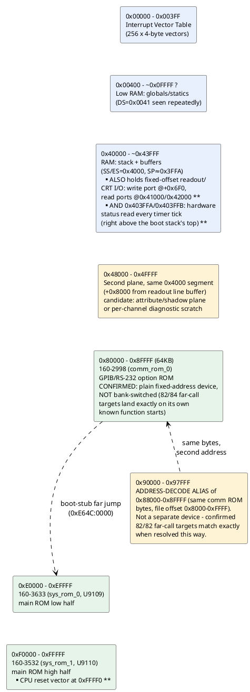

# Memory & I/O map (as understood so far)

Reconstructed from segment-register loads and I/O instructions actually
seen in the disassembled code — not from a schematic, so treat physical
region *boundaries* as approximate until confirmed against the service
manual. See `disasm/NOTES.md` for the underlying evidence.

## Confirmed regions

| Range | What | Evidence |
|---|---|---|
| `0x00000-0x003FF` | Interrupt vector table | Direct writes: `mov word [es:bx],...` with `es=0`/`es=0x3F` installing INT1, INT2, INT255 handlers (see `disasm/NOTES.md`) |
| `0x40000-~0x43FFF` | RAM: stack + scratch buffers | `mov ax,0x4000 / mov ss,ax` then `mov sp,0x3FFA` at reset; `es=0x4000` used 31x, more than any other segment, for buffer clears (`mov byte [es:si],0` loops) |
| `~0x00400+` | RAM: global/static variables | `ds=0x0041` (physical `0x410`, right after the IVT) used repeatedly to access small fixed offsets like `[0x758]`, `[0x780]`, `[0x1B50]` - looks like the main variable pool starts immediately after the IVT |
| `0x40000+0x6F0` | Readout/CRT character-generator write port (candidate) | `write_readout_port_byte` (`0xE0B50`) writes an arbitrary passed byte to this **fixed** address, called once per character by `print_char`→`print_string_far` while looping over a string - a fixed destination for every character strongly implies a hardware port with its own internal cursor, not plain RAM. See `disasm/NOTES.md` "The readout/CRT display memory" |
| `0x41000`, `0x42000` | Single-byte **read/write** ports, `read_channel1_status`/`clear_channel1_status` and `read_channel2_status`/`clear_channel2_status` (candidate - likely per-channel front-end status, not confirmed) | Confirmed as real R/W hardware registers: separate functions read and write (with `0`) the *same* fixed physical addresses. Read side called alternately in a self-test loop that takes repeated readings, spaced by `wait_readout_tick` delays - consistent with a per-channel status/calibration readback on a 2-channel scope, but peripheral identity not confirmed against a schematic |
| `0x403FFA`, `0x403FFB` | Hardware status bytes, read every timer tick by `scheduler_tick_service` | Confirmed as a real fixed hardware read, polled unconditionally on every `INT2` tick - source of `[0x758]`/`[0x759]`. Sits immediately above the boot-time stack's initial top (`SS:SP=4000:3FFA`), a classic "stack placed just below a fixed I/O window" layout. Front-panel key/encoder status is the leading candidate given `[0x758]`'s other uses, not confirmed |
| `0x40377E`, `0x4007DE` | Comm-option-board hardware probe/ack pair (bit `0x1000` of a word read at `0x40377E`, poked by writing to `0x4007DE`) | Confirmed as a real write-then-readback hardware probe, source of `[0x1B83]` via `detect_comm_option_hw`. Also read/acknowledged bit-by-bit by `ack_comm_hw_status_bits` (bits `0x80`/`0x20`/`0x40`, clearing each in `0x4007DE` once both a caller's request bit and the matching status bit are set). Also part of the `PRC_READBACK` self-test's register table (`init_selftest_register_group`, group 1) alongside the readout second plane (`0x48000`) and several `0x437xx` registers - which specific readback result means "installed" isn't fully resolved - see `disasm/NOTES.md` "Found: the actual source of [0x1B83]" |
| `0x406F3`, `0x4067C`, `0x406BC` | A second comm-option handshake trio: `0x406F3` is a command-byte write register (same `0x40000+0x6F0` readout-window base as the CRT write port, `+3`); `0x4067C` bit `0x4` and `0x406BC` bit `0x80` are status readbacks | Confirmed by `selftest_comm_fget_flag` (the real body of `selftest_comm_loopback_b`): writes command byte `0x86` then `6`, expects the "FGET" status bit at `0x4067C` to set then clear, reporting "FGET NOT SET"/"FGET NOT CLEAR" on failure. A second, distinct probe pair from `0x40377E`/`0x4007DE` above - peripheral identity not confirmed |
| `0x48000-0x4FFFF` | Second "plane" of the readout line buffer, `+0x8000` from a base pointer that otherwise tracks the same `0x4000`-segment buffer at `[0x1AF4]`/`[0x1CC4]` | `append_readout_char` (`0xE39F0`) writes one byte at the current write pointer and a second byte at the same offset `+0x8000`; `SUB_E0BA3` separately reads raw bytes back out of a pointer initialized to exactly `0x48000` and re-prints them - candidate: attribute/inverse-video plane, or a per-channel diagnostic scratch area reused for self-test report values |
| `0x80000-0x8FFFF` | `160-2998` (comm/GPIB-RS232 option ROM) | **Confirmed a plain fixed-address 64KB device, not bank-switched** - every far-call target landing here resolves against this file's own function-start signatures (82/84 exact matches), and the main ROM's already-proven code calls directly into it |
| `0x90000-0x97FFF` | **Address-decode alias of `0x88000-0x8FFFF`** (same comm ROM, file offset `0x8000-0xFFFF`) | Not a separate device - brute-forcing every possible base offset against 82 observed far-call targets found `base=0x88000` gives 82/82 exact matches against the comm ROM's own function starts. Likely incomplete address-line decoding in the comm ROM's chip-select logic. Wired into the tooling as `"2998_alias_90000"` in `gen_disasm_x86.CHIPS` (a `slice` of the same file) so the recursive descent follows it automatically |
| `0xE0000-0xEFFFF` | `160-3633` (main ROM, low half) | Confirmed via TekWiki + validated disassembly |
| `0xF0000-0xFFFFF` | `160-3532` (main ROM, high half) | Confirmed via TekWiki; holds the real CPU reset vector at `0xFFFF0` |
| `0x02090-0x021F0` | RAM: a separate 82-entry far-pointer table (`ES=0x209` base), distinct from the "flat" `DS=0` variable space most tracked variables live in - **do not confuse an offset number here with the same-looking offset in the flat space** | Initialized once at boot by `init_far_pointer_table_sysrom`'s embedded data table (decoded in full - see `disasm/NOTES.md` "Found: a whole family of never-reached functions..."). 15 of its 82 targets were never reached by proven or heuristic disassembly before being found this way; all 15 decode as coherent code, mostly extending the plot-position (`[0x6BE]`/`[0x6BC]`/`[0x6C0]`/`[0x6C1]`) and scale-factor (`[0x712]`-`[0x724]`) variable families already documented below. No code anywhere loads `ES`/`DS`=`0x209` via a literal immediate, so how these get read back in practice is still open |

## Unidentified / open

Nothing left in the address-map department right now - the
`0x80000-0x97FFF` region that used to be flagged here as a mystery is
fully accounted for (see above). The `0xAA55` pattern that originally
suggested "generic RAM-size test" turned out to be part of a specific
option-board-presence/RAM-detection routine - see
`disasm/NOTES.md` "Found: the option-board presence/RAM-detection
routine" for the full explanation (prompted by the user asking whether
it might be an install-check, and whether it might be RAM/IO on the
comm board specifically - both turned out to be correct, as two stages
of the same probe).

**New this session**: decoding `init_far_pointer_table_sysrom`'s own
embedded data (see the `0x02090-0x021F0` row above) surfaced a cluster
of plot-scale variables not previously tracked individually here:
`[0x712]`, `[0x714]`, `[0x716]`, `[0x718]`, `[0x71A]`, `[0x71C]`,
`[0x71E]`, `[0x722]`, `[0x724]` (all read/written together by a family
of never-before-reached functions doing `imul`/`idiv`-based scale-
ratio math), and 2 far pointers `[0x1DB8]`/`[0x1DBC]` immediately
adjacent to the still-unlocated stroke-font pointer `[0x1DB0]`. None
individually identified yet - see `disasm/NOTES.md` for the addresses
that touch them.

Next open items are more about *understanding* what's already mapped
than finding new address space - see `TODO.md` (the self-test
dispatcher's ~14 not-yet-identified subsystem-test subroutines are the
most promising lead for matching the I/O ports below to real
peripherals). One correction this session: three routines previously
counted among those unidentified subsystem-test subroutines
(`SUB_E374E`, `SUB_E3821`, and `SUB_E0AF5`/now `print_string_far`) are
actually display/print primitives, not tests - found by tracing the
literal far-pointer arguments they're called with back to a fixed
string-table segment. See `disasm/NOTES.md` "self_test_dispatcher was
misnamed" and "The readout/CRT display memory".

## I/O ports actually seen in code

| Port | Access | Context |
|---|---|---|
| `0x83` | `out 0x83, ax` | `160-3532`, offset `0x0CCF` - sits directly in the middle of HPGL plotter command generation code (`update_plot_position` and neighbors emit `PU%d,%d;`/`SP1;SC0,1023,0,1023;`/`ESC*rB`-style HPGL/HP-GL2 commands via `format_string_va` right around this instruction) - candidate: the GPIB/plotter output port, not confirmed |
| `0xC4` | `out 0xc4, ax` | `160-3633`, offset `0xE143` - confirmed part of `write_hw_shift_register`'s 4-write sequence, see below |
| `0xD1` | `out 0xd1, ax` (x3) | `160-3633`, offsets `0xE13D/E13F/E141` - confirmed: each write is preceded by `shl di,1`, all inside `write_hw_shift_register` (`0xEE13B`) |
| (in DX) | `in al, dx` | `160-3633`, offset `0xDA0A` - port number computed at runtime, not a literal, so this reads from a *range* of ports (a peripheral with multiple addressable registers, or a scan loop) |

**Found: `0xD1`/`0xC4` are a serial shift-register-style hardware
write.** `write_hw_shift_register` (`0xEE13B`) writes `ax` to port
`0xD1` three times in a row (each preceded by `shl di,1`) then once to
port `0xC4` - the classic shape of clocking a value out to a
shift-register-based DAC/latch (`0xD1` = data/clock, `0xC4` = strobe/
latch, roles not confirmed). It's reached from a larger dispatch
function (starting around `0xEE004`) that indexes a table at
`[0x1D10]` by a value from `[0x464]` (`*16`) and either calls a
specific handler indirectly or falls through to this default hardware
write - consistent with a **front-panel setting (e.g. an attenuator,
gain, or offset calibration value) being pushed out to analog hardware
whenever it changes**. Peripheral identity still not confirmed against
a schematic, but the *mechanism* (serial shift-register write) now is.
**New candidate from hardware photos** (see `HARDWARE.md`): the comm
option board's rear-panel "AUXILIARY CONNECTOR" has a pen-lift relay
plus analog X/Y outputs for driving an X-Y plotter directly - worth
checking whether this shift-register write is what toggles that relay
in sync with the HPGL PU/PD state (`[0x6CA]`) tracked by
`update_plot_position`/`plot_line_to`, rather than (or in addition to)
a front-panel setting.

All writes are 16-bit (`ax`), suggesting word-wide peripheral
registers. No documentation yet on which physical device these
correspond to (candidates per the hardware overview in `CONTEXT.md`:
the Sony CX20052A A/D converter, front-panel switch/LED controller, or
GPIB/RS-232 UART) - worth checking the service manual's I/O map when
available, or narrowing down by what surrounding code does with the
read/written values.
