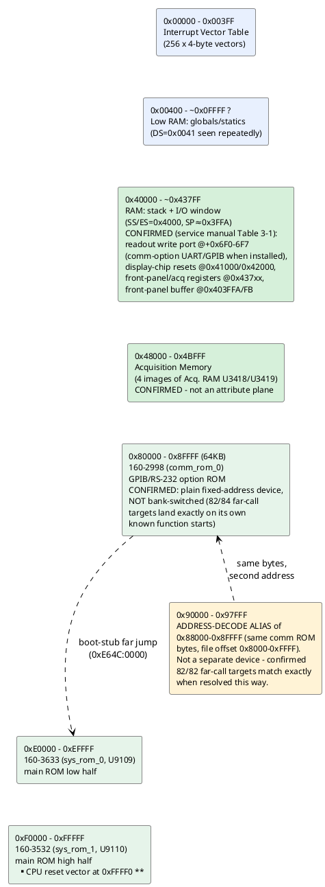

# Memory & I/O map (as understood so far)

Reconstructed from segment-register loads and I/O instructions actually
seen in the disassembled code, **now cross-checked against the real
service manual** (`hardware/2230 .pdf`, provided 2026-09-13 - see its
"Theory of Operation" Section 3, Table 3-1 "Memory Space Allocation"
for the master address map, and Section 6 "Maintenance" Tables 6-16
through 6-23 for the front-panel/exerciser register tables). Most of
the previously-"candidate, not confirmed" entries below are now backed
by the manual's own register names and U-numbers, not just inference
from code. See `disasm/NOTES.md` for the underlying disassembly-side
evidence and cross-references.

## Confirmed regions

| Range | What | Evidence |
|---|---|---|
| `0x00000-0x003FF` | Interrupt vector table | Direct writes: `mov word [es:bx],...` with `es=0`/`es=0x3F` installing INT1, INT2, INT255 handlers (see `disasm/NOTES.md`) |
| `0x40000-~0x43FFF` | RAM: stack + scratch buffers | `mov ax,0x4000 / mov ss,ax` then `mov sp,0x3FFA` at reset; `es=0x4000` used 31x, more than any other segment, for buffer clears (`mov byte [es:si],0` loops) |
| `~0x00400+` | RAM: global/static variables | `ds=0x0041` (physical `0x410`, right after the IVT) used repeatedly to access small fixed offsets like `[0x758]`, `[0x780]`, `[0x1B50]` - looks like the main variable pool starts immediately after the IVT |
| `0x40000+0x6F0`-`0x6F7` | **CONFIRMED (service manual Table 3-1): "Option UART/GPIB chips (I/O)"**, 8 consecutive addresses - the comm-option's actual UART/GPIB register file | `write_readout_port_byte` (`0xE0B50`) writes here unconditionally (not gated on comm-option presence) - a genuinely puzzling overlap with a register bank the manual says only exists when a comm option is installed. Not reconciled - see the new "Puzzle: write_readout_port_byte's address overlaps the comm-option UART register bank" note below |
| `0x41000` | **CONFIRMED: "Display chip interrupt reset"** (Table 3-1) | Matches `read_display_chip_int_reset`/`clear_display_chip_int_reset`'s address exactly - the earlier "per-channel front-end status" guess was wrong; it's the CRT/readout display controller chip's interrupt-reset line, not a channel status register |
| `0x42000` (labeled "FRAME" in the manual) | **CONFIRMED: "Display chip next frame"** (Table 3-1) | Matches `read_display_chip_frame_trigger`/`clear_display_chip_frame_trigger`'s address exactly - same correction as `0x41000` above; this is the display chip's next-frame trigger |
| `0x403FFA`, `0x403FFB` | **CONFIRMED: "Front Panel Buffer U9301"** (=`SWB2`) / **"Front Panel Buffer U9302"** (=`SWB1`) (Table 3-1, cross-referenced against Tables 6-16/6-17) | Confirms the long-standing "front-panel key/encoder status is the leading candidate" guess for `scheduler_tick_service`'s `[0x758]`/`[0x759]` source exactly. **Bit-level validated 2026-09-13**, not just address-matched: `[0x758]`'s (`SWB2`) exact bit map is `MEM 3`/`MEM 1`/`POS-SEL`/`1K-4K`/`MENU`/`MEM 2`/`MENU ADV`/`SELECT C1-C2` (bit0-7) - and self-test code masking `[0x758]&0x63` (bits 0,1,5,6 = the 3 `MEM` buttons + `MENU ADV`) plus a separate `&0x80` (`SELECT C1/C2`) check exactly reproduces the service manual's own documented self-test-abort behavior ("If the SELECT C1/C2 button is held in while the test is running, the test loops on the first error") - see `VARIABLES.md` for the full bit table and `disasm/NOTES.md` for the code-structure comparison |
| `0x4007DE` | **CONFIRMED: "Time Base Mode Register U4119"** (Table 3-1, address `0x407DE`) | Exact match for `detect_comm_option_hw`'s write-probe address (`0x40000+0x7DE`) - the register `[0x1B83]`'s detection probe pokes is a general Time Base Mode register, not a comm-specific latch; the comm-option detection apparently rides on a specific bit within this general register |
| `0x40377E` (readback side of the same probe) | Close to, but not an exact match for, the manual's `0x437BE` ("Acquisition Mode Register U3310") - off by `0x40` | Not reconciled - the readback address `detect_comm_option_hw` actually reads doesn't land exactly on a named register in Table 3-1's excerpted rows; may be a sub-bit of Acquisition Mode Register reached through incomplete address decoding (the same phenomenon already confirmed for the `0x90000` alias), or a register the excerpted table rows didn't cover. Worth re-reading the full manual page image if resolving this matters |
| `0x4067C` | **CONFIRMED: "Option Status Latch (in)"** (Table 3-1) | Resolves the old "unreconciled" `selftest_comm_readback` thread - this genuinely is the comm option's status latch, not a readout-memory-window coincidence as that note speculated |
| `0x406BC` | **CONFIRMED: "Option Parameters Latch (in)"** (Table 3-1) | The comm option's PARAMETERS DIP-switch readback register - ties `read_dip_switches_serial_config`/`read_dip_switches_gpib_config` to this exact address |
| `0x406F8` | **CONFIRMED: "Option Interrupt Mask Latch (out)"** (Table 3-1) | |
| `0x437F6` | **CONFIRMED: "Front Panel A/D control U6104"** (Table 3-1) | The front-panel A/D converter's control latch - see the new "Two separate ADCs" note below |
| `0x437FA` | **CONFIRMED: "Front Panel A/D data U6102"** (Table 3-1) | Matches `FP-VALUES`/`FP-A2D` exerciser descriptions in the manual's Maintenance section exactly |
| `0x4377E`/`0x4377F` | **CONFIRMED: "Acquisition Memory Address Buffer" low/high bits, U3427/U3428** (Table 3-1) | |
| `0x437BE` | **CONFIRMED: "Acquisition Mode Register U3310"** (Table 3-1) | |
| `0x437DE`/`0x437DF` | **CONFIRMED: "B Delay Timer" U4123/U4124** (Table 3-1) | |
| `0x437EE`/`0x437EF` | **CONFIRMED: "Record Counter" U4115/U4116/U4117** (Table 3-1) | |
| `0x407EE` | **CONFIRMED: "Time Base Divider Register U4113"** (Table 3-1); also called "TB-SWP-RATE" in the Maintenance section's exerciser tables | Ties directly to the `TB_DIVIDER` self-test menu leaf (`selftest_tb_divider`) already named this project |
| `0x437F7` | **CONFIRMED: "Clock Delay Timer U4231"** (Table 3-1) | The `CLK_DELAY` self-test's actual register - the CDT is a dual-slope integrator measuring time between an async trigger and the acquisition master clock, per the manual's Maintenance section |
| `0x48000-0x4BFFF` | **CONFIRMED: Acquisition Memory - 4 images of Acquisition RAM U3418/U3419** (Table 3-1) | **Corrects the earlier "attribute/inverse-video plane" guess** - `append_readout_char`'s `+0x8000` dual-write pattern coincidentally lands in the same numeric offset as this acquisition-memory window, but the manual makes clear `0x48000` itself is genuinely acquisition sample RAM, not a readout attribute plane. The readout's own "second plane" write target is a *different* address than this literal `0x48000` - see the note below |
| `0x00000-0x07FFF` | **CONFIRMED: "8-bit display RAM - waveforms, interrupt vectors, miscellaneous"** (Table 3-1, part of "RAM SEG" `0x00000-0x3FFFF`, 4 mirror images of Memory Segment 0) | The IVT and the flat `DS=0x41` variable pool both live inside this range, consistent with what's already been traced from the code side |
| `0x08000-0x0FFFF` | **CONFIRMED: "4 bits of display RAM for waveform attributes (LSB)"** (Table 3-1) | A genuine attribute/LSB plane for waveform display - distinct from (and a better fit for the "attribute plane" concept than) the `0x48000` acquisition-memory window above |
| `0x80000-0x8FFFF` | `160-2998` (comm/GPIB-RS232 option ROM) | **Confirmed a plain fixed-address 64KB device, not bank-switched** - every far-call target landing here resolves against this file's own function-start signatures (82/84 exact matches), and the main ROM's already-proven code calls directly into it. **Now also confirmed from the manual's side**: "The GPIB occupies all of the addresses in the COM-SEG range (80000H to BFFFFH)" and "Two images of Memory Segment 2" at `0x80000-0xBFFFF` - matches this project's own finding exactly, including the *reason* a `0x90000` alias exists (mirrored images within the decoded COM-SEG range) |
| `0x90000-0x97FFF` | **Address-decode alias of `0x88000-0x8FFFF`** (same comm ROM, file offset `0x8000-0xFFFF`) | Not a separate device - brute-forcing every possible base offset against 82 observed far-call targets found `base=0x88000` gives 82/82 exact matches against the comm ROM's own function starts. Likely incomplete address-line decoding in the comm ROM's chip-select logic. Wired into the tooling as `"2998_alias_90000"` in `gen_disasm_x86.CHIPS` (a `slice` of the same file) so the recursive descent follows it automatically |
| `0xE0000-0xEFFFF` | `160-3633` (main ROM, low half) | Confirmed via TekWiki + validated disassembly |
| `0xF0000-0xFFFFF` | `160-3532` (main ROM, high half) | Confirmed via TekWiki; holds the real CPU reset vector at `0xFFFF0` |
| `0x02090-0x021F0` | RAM: a separate 82-entry far-pointer table (`ES=0x209` base), distinct from the "flat" `DS=0` variable space most tracked variables live in - **do not confuse an offset number here with the same-looking offset in the flat space** | Initialized once at boot by `init_far_pointer_table_sysrom`'s embedded data table (decoded in full - see `disasm/NOTES.md` "Found: a whole family of never-reached functions..."). 15 of its 82 targets were never reached by proven or heuristic disassembly before being found this way; all 15 decode as coherent code, mostly extending the plot-position (`[0x6BE]`/`[0x6BC]`/`[0x6C0]`/`[0x6C1]`) and scale-factor (`[0x712]`-`[0x724]`) variable families already documented below. No code anywhere loads `ES`/`DS`=`0x209` via a literal immediate, so how these get read back in practice is still open |

## Puzzle: `write_readout_port_byte`'s address overlaps the comm-option UART register bank

**Re-examined 2026-09-13 against the manual's actual page image** (not
just OCR text) - the picture is clearer but still unresolved. Table
3-1's "IO Main Image" is one continuous list with no sub-grouping
between "always present" and "option-only" rows - `0x406F0`-`0x406F7`
("Option UART/GPIB chips (I/O)", 8 consecutive addresses) sit in the
exact same list as `0x41XXX` (display chip interrupt reset), `0x437F6`
(front panel A/D control), and `0x48000` (acquisition memory) - so
there's no labeling confusion to blame; the address really is
documented as comm-option hardware, plainly.

**New, more specific evidence**: `init_readout_port_config` (`0xE0B6C`)
writes 3 literal bytes to exactly `0x406F1`/`0x406F2`/`0x406F3` (the
2nd/3rd/4th of the 8 registers) - and the service manual's own GPIB
theory-of-operation section says the comm option's GPIB controller (a
TMS9914A) **"has eight internal registers"** - an exact count match.
This is real, specific evidence that `write_readout_port_byte`/`init_
readout_port_config`/`print_char`/`print_string_far` (all self-test-
banner-only, see `disasm/NOTES.md`'s expanded writeup) might genuinely
be talking to the comm-option UART/GPIB chip directly for diagnostic
text output, not any CRT/readout hardware - the "readout" naming may
be a leftover guess from before this address was independently
confirmed. **Not confident enough to rename**: `print_string_far`
paces each character through `wait_readout_tick` (a generic system-
tick busy-wait, not readout-specific despite its name), which is
consistent with either a UART-pacing story or a CRT-hardware story and
doesn't discriminate between them. See `disasm/NOTES.md`'s expanded
"The readout/CRT display memory" section for the full writeup - left
as a genuinely open, well-documented question rather than guessed at
either way.

## Two separate A/D converters, both now named

The service manual confirms this scope has **two distinct ADCs**,
resolving the earlier single-guess "Sony CX20052A" candidate (which
doesn't cleanly match either):
- **U2204**: the signal-**acquisition** ADC - a high-speed ECL device
  converting the sampled waveform (0 V to -2 V range) to 8-bit codes at
  20 Megasamples/second, on the acquisition board (Diagram 17/18 in
  the manual). This is almost certainly the chip the earlier hardware
  photo saw near the `CH1`/`CH2` input traces, not the Sony part.
- **U6105**: a separate, much slower **front-panel** ADC, digitizing
  analog front-panel controls (cursor position pots, etc. - fed
  through multiplexers `U6101`/`U6106`/`U6108`, controlled by latch
  `U6104` at `0x437F6`, with results buffered through `U6102` at
  `0x437FA`). This is what `selftest_front_panel_switch_a`/`_b`'s
  ADC-readback verification was really exercising - confirms the
  earlier "VOLTS/DIV or similar analog/potentiometer control" guess
  for those two self-tests.

## Resolved this session (2026-09-13, from the service manual)

The `0x80000-0x97FFF` comm-ROM alias mystery, the `0xAA55`-pattern
option-detection routine, and (now) almost every previously-"candidate,
not confirmed" I/O port above are all resolved - see the "Confirmed
regions" table. The **GPIB controller chip is confirmed as a TMS9914A**
(service manual: "The GPIB controller... is a TMS9914A which handles
much of the protocol required to interface to the IEEE STANDARD 488
bus"), resolving the old open question between that part and a µPD7210.
`COMM-READBACK`'s exact mechanism ("data is first written to the
Option [`U1236`/`U1335` pin], registers are then read and checked")
directly matches this project's already-documented `PRC_READBACK`/
`verify_prc_readback_pattern` behavior - primary-source confirmation of
an independently-reverse-engineered mechanism, not just a name match.

**Still genuinely open** (not resolved by the manual excerpts read so
far): the stroke-font glyph table's location (`[0x1DB0]`'s value -
this is RAM state initialized by the firmware, not something a
hardware manual would document); the exact bit-to-signal mapping for
`[0x4E7]`/`[0x4E8]` (worth another pass now that Tables 6-16/6-17's
`AD DATA`/`ISTAT`/`SWB1`/`SWB2` signal names are known - see
`disasm/NOTES.md`); and the `write_readout_port_byte` overlap puzzle
above. See `TODO.md` for the full current list.

**New this session (before the manual arrived)**: decoding
`init_far_pointer_table_sysrom`'s own embedded data (see the
`0x02090-0x021F0` row above) surfaced a cluster of plot-scale variables
not previously tracked individually here: `[0x712]`, `[0x714]`,
`[0x716]`, `[0x718]`, `[0x71A]`, `[0x71C]`, `[0x71E]`, `[0x722]`,
`[0x724]` (all read/written together by a family of never-before-
reached functions doing `imul`/`idiv`-based scale-ratio math), and 2
far pointers `[0x1DB8]`/`[0x1DBC]` immediately adjacent to the still-
unlocated stroke-font pointer `[0x1DB0]`. None individually identified
yet - see `disasm/NOTES.md` for the addresses that touch them.

## I/O ports actually seen in code

| Port | Access | Context |
|---|---|---|
| `0x83` | `out 0x83, ax` | `160-3532`, offset `0x0CCF` - sits directly in the middle of HPGL plotter command generation code (`update_plot_position` and neighbors emit `PU%d,%d;`/`SP1;SC0,1023,0,1023;`/`ESC*rB`-style HPGL/HP-GL2 commands via `format_string_va` right around this instruction) - candidate: the GPIB/plotter output port, not confirmed |
| `0xC4` | `out 0xc4, ax` | `160-3633`, offset `0xE143` - confirmed part of `write_hw_shift_register`'s 4-write sequence, see below |
| `0xD1` | `out 0xd1, ax` (x3) | `160-3633`, offsets `0xE13D/E13F/E141` - confirmed: each write is preceded by `shl di,1`, all inside `write_hw_shift_register` (`0xEE13B`) |
| (in DX) | `in al, dx` | `160-3633`, offset `0xDA0A` - port number computed at runtime, not a literal, so this reads from a *range* of ports (a peripheral with multiple addressable registers, or a scan loop) |

**Found: `0xD1`/`0xC4` are a serial shift-register-style hardware
write.** `write_hw_shift_register` (`0xEE13B`) writes `ax` to port
`0xD1` three times in a row (each preceded by `shl di,1`) then once to
port `0xC4` - the classic shape of clocking a value out to a
shift-register-based DAC/latch (`0xD1` = data/clock, `0xC4` = strobe/
latch, roles not confirmed). It's reached from a larger dispatch
function (starting around `0xEE004`) that indexes a table at
`[0x1D10]` by a value from `[0x464]` (`*16`) and either calls a
specific handler indirectly or falls through to this default hardware
write - consistent with a **front-panel setting (e.g. an attenuator,
gain, or offset calibration value) being pushed out to analog hardware
whenever it changes**. Peripheral identity still not confirmed against
a schematic, but the *mechanism* (serial shift-register write) now is.
**New candidate from hardware photos** (see `HARDWARE.md`): the comm
option board's rear-panel "AUXILIARY CONNECTOR" has a pen-lift relay
plus analog X/Y outputs for driving an X-Y plotter directly - worth
checking whether this shift-register write is what toggles that relay
in sync with the HPGL PU/PD state (`[0x6CA]`) tracked by
`update_plot_position`/`plot_line_to`, rather than (or in addition to)
a front-panel setting.

All writes are 16-bit (`ax`), suggesting word-wide peripheral
registers. **These are true 8086 `in`/`out` I/O-port-space accesses,
a completely separate address space from the memory-mapped `0x40000+`
window Table 3-1 covers** - the service manual excerpts read so far
(2026-09-13) don't document the port-space map, only the memory-mapped
one, so `0x83`/`0xC4`/`0xD1` remain unconfirmed against a schematic.
**Checked one candidate and it doesn't cleanly fit**: the manual's
X-Y Plotter Pen-Down circuit is driven by a single active-level digital
line (`PEN DWN`, connector `J6423` pin 1, sourced from the `VECT SMPL`
signal) - a simple on/off signal, not an obvious match for `write_hw_
shift_register`'s multi-bit serial-clock-out shape (3x `shl`+`out 0xD1`
then `out 0xC4`). The X/Y analog plot-output amplifiers (driven from
DACs, per the "X and Y Amplifiers" section) are a better structural fit
for a multi-bit shift-register write, but the manual excerpts read
don't name the specific digital register/DAC that feeds them - not
confirmed either way.
