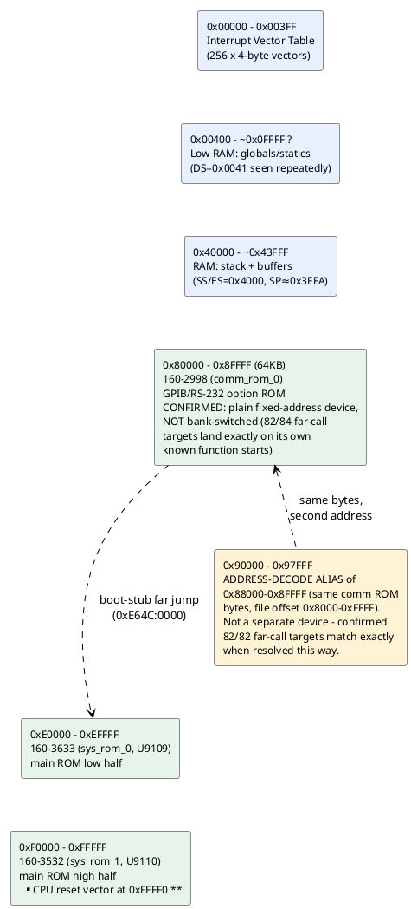

# Memory & I/O map (as understood so far)

Reconstructed from segment-register loads and I/O instructions actually
seen in the disassembled code — not from a schematic, so treat physical
region *boundaries* as approximate until confirmed against the service
manual. See `disasm/NOTES.md` for the underlying evidence.

## Confirmed regions

| Range | What | Evidence |
|---|---|---|
| `0x00000-0x003FF` | Interrupt vector table | Direct writes: `mov word [es:bx],...` with `es=0`/`es=0x3F` installing INT1, INT2, INT255 handlers (see `disasm/NOTES.md`) |
| `0x40000-~0x43FFF` | RAM: stack + scratch buffers | `mov ax,0x4000 / mov ss,ax` then `mov sp,0x3FFA` at reset; `es=0x4000` used 31x, more than any other segment, for buffer clears (`mov byte [es:si],0` loops) |
| `~0x00400+` | RAM: global/static variables | `ds=0x0041` (physical `0x410`, right after the IVT) used repeatedly to access small fixed offsets like `[0x758]`, `[0x780]`, `[0x1B50]` - looks like the main variable pool starts immediately after the IVT |
| `0x80000-0x8FFFF` | `160-2998` (comm/GPIB-RS232 option ROM) | **Confirmed a plain fixed-address 64KB device, not bank-switched** - every far-call target landing here resolves against this file's own function-start signatures (82/84 exact matches), and the main ROM's already-proven code calls directly into it |
| `0x90000-0x97FFF` | **Address-decode alias of `0x88000-0x8FFFF`** (same comm ROM, file offset `0x8000-0xFFFF`) | Not a separate device - brute-forcing every possible base offset against 82 observed far-call targets found `base=0x88000` gives 82/82 exact matches against the comm ROM's own function starts. Likely incomplete address-line decoding in the comm ROM's chip-select logic. Wired into the tooling as `"2998_alias_90000"` in `gen_disasm_x86.CHIPS` (a `slice` of the same file) so the recursive descent follows it automatically |
| `0xE0000-0xEFFFF` | `160-3633` (main ROM, low half) | Confirmed via TekWiki + validated disassembly |
| `0xF0000-0xFFFFF` | `160-3532` (main ROM, high half) | Confirmed via TekWiki; holds the real CPU reset vector at `0xFFFF0` |

## Unidentified / open

Nothing left in the address-map department right now - the
`0x80000-0x97FFF` region that used to be flagged here as a mystery is
fully accounted for (see above). The `0xAA55` pattern that originally
suggested "generic RAM-size test" turned out to be part of a specific
option-board-presence/RAM-detection routine - see
`disasm/NOTES.md` "Found: the option-board presence/RAM-detection
routine" for the full explanation (prompted by the user asking whether
it might be an install-check, and whether it might be RAM/IO on the
comm board specifically - both turned out to be correct, as two stages
of the same probe).

Next open items are more about *understanding* what's already mapped
than finding new address space - see `TODO.md` (the self-test
dispatcher's ~20 not-yet-identified subsystem-test subroutines are the
most promising lead for matching the I/O ports below to real
peripherals).

## I/O ports actually seen in code

| Port | Access | Context |
|---|---|---|
| `0x83` | `out 0x83, ax` | `160-3532`, offset `0x0CCF` |
| `0xC4` | `out 0xc4, ax` | `160-3633`, offset `0xE143` |
| `0xD1` | `out 0xd1, ax` (x3) | `160-3633`, offsets `0xE13D/E13F/E141` - written 3x in a row, possibly a multi-register peripheral or a retry/settle pattern |
| (in DX) | `in al, dx` | `160-3633`, offset `0xDA0A` - port number computed at runtime, not a literal, so this reads from a *range* of ports (a peripheral with multiple addressable registers, or a scan loop) |

All writes are 16-bit (`ax`), suggesting word-wide peripheral
registers. No documentation yet on which physical device these
correspond to (candidates per the hardware overview in `CONTEXT.md`:
the Sony CX20052A A/D converter, front-panel switch/LED controller, or
GPIB/RS-232 UART) - worth checking the service manual's I/O map when
available, or narrowing down by what surrounding code does with the
read/written values.
