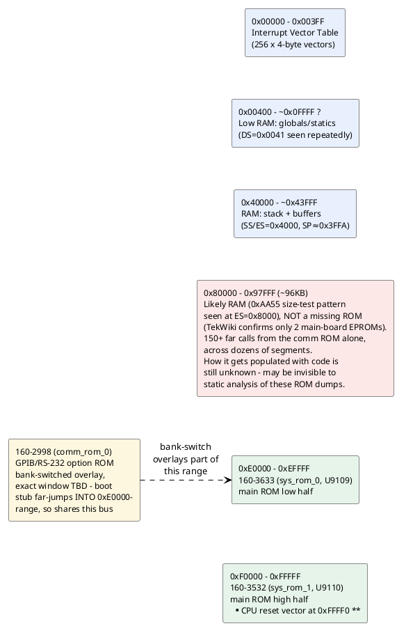

# Memory & I/O map (as understood so far)

Reconstructed from segment-register loads and I/O instructions actually
seen in the disassembled code (`disasm/sysrom_3532_3633.lst`) — not
from a schematic, so treat physical region *boundaries* as approximate
until confirmed against the service manual. See `disasm/NOTES.md` for
the underlying evidence (interrupt vector table writes, the shared
`0x9470`/`0x8xxxx-0x97xxx` service-call region, etc.).

## Confirmed regions

| Range | What | Evidence |
|---|---|---|
| `0x00000-0x003FF` | Interrupt vector table | Direct writes: `mov word [es:bx],...` with `es=0`/`es=0x3F` installing INT1, INT2, INT255 handlers (see `disasm/NOTES.md`) |
| `0x40000-~0x43FFF` | RAM: stack + scratch buffers | `mov ax,0x4000 / mov ss,ax` then `mov sp,0x3FFA` at reset; `es=0x4000` used 31x, more than any other segment, for buffer clears (`mov byte [es:si],0` loops) |
| `~0x00400+` | RAM: global/static variables | `ds=0x0041` (physical `0x410`, right after the IVT) used repeatedly to access small fixed offsets like `[0x758]`, `[0x780]`, `[0x1B50]` - looks like the main variable pool starts immediately after the IVT |
| `0xE0000-0xEFFFF` | `160-3633` (main ROM, low half) | Confirmed via TekWiki + validated disassembly |
| `0xF0000-0xFFFFF` | `160-3532` (main ROM, high half) | Confirmed via TekWiki; holds the real CPU reset vector at `0xFFFF0` |

## Unidentified / open

- **`0x80000-0x97FFF` (~96KB): very likely RAM, not a missing ROM -
  but its contents are invisible to static analysis.** Originally
  flagged as a handful of mystery call targets; now confirmed much
  bigger. Once the comm ROM was fully disassembled, it turned out to
  make **150+ distinct far calls** into this range, spanning dozens of
  separate segments (`8006`, `802c`, `81ae`, `82c9`, `839f`, `8511`,
  `85eb`, `911e`, `92cf`, `941f`, `9470`, `9628`, `9687`, `96f5`,
  `97c6`, ...) from `0x80000` up to `0x97C95`. TekWiki confirms there
  is no third ROM chip for the 2230 - just the two 27512s on A10 and
  the comm option ROM - so this can't be a ROM we're simply missing a
  dump of.

  Direct evidence it's RAM: the main ROM contains a classic
  save/write-0xAA55/read-back/restore sequence targeting `es=0x8000`
  (`160-3633` offsets `0x4544`/`0x4566`) - the textbook non-destructive
  RAM presence/size test pattern, run at a range of addresses to
  detect how much memory is actually installed.

  What's still unresolved: **how code ends up living there for the
  comm ROM to call into.** Checked several call sites of a generic
  memcpy-style utility function (`SUB_FBC09`, `160-3532`/`160-3633`)
  looking for a block copy targeting `0x80000+`; none found among the
  ones checked so far (out of 5 total call sites, 2 checked - both
  copied within the normal low-RAM globals area instead). Either the
  loading mechanism is elsewhere (not yet found), or this RAM is
  populated some other way (downloaded over GPIB/RS-232, generated at
  runtime, or loaded via a mechanism this static analysis can't see at
  all since it only exists once the system is actually running).
  **This means there may be a hard ceiling on what these three ROM
  dumps alone can reveal about what actually executes in that ~96KB** -
  worth keeping in mind when assessing "how much is left to reverse."
- **Comm ROM (`160-2998`) bank-switch window**: known to overlay *part*
  of the address space the main ROM also occupies (its boot stub far-
  jumps to physical `0xE64C0`, inside `0xE0000-0xEFFFF`), but the exact
  addressing/bank-select mechanism (which port or memory-mapped
  register selects it, and what window size) isn't confirmed.

## I/O ports actually seen in code

| Port | Access | Context |
|---|---|---|
| `0x83` | `out 0x83, ax` | `160-3532`, offset `0x0CCF` |
| `0xC4` | `out 0xc4, ax` | `160-3633`, offset `0xE143` |
| `0xD1` | `out 0xd1, ax` (x3) | `160-3633`, offsets `0xE13D/E13F/E141` - written 3x in a row, possibly a multi-register peripheral or a retry/settle pattern |
| (in DX) | `in al, dx` | `160-3633`, offset `0xDA0A` - port number computed at runtime, not a literal, so this reads from a *range* of ports (a peripheral with multiple addressable registers, or a scan loop) |

All writes are 16-bit (`ax`), suggesting word-wide peripheral
registers. No documentation yet on which physical device these
correspond to (candidates per the hardware overview in `CONTEXT.md`:
the Sony CX20052A A/D converter, front-panel switch/LED controller, or
GPIB/RS-232 UART) - worth checking the service manual's I/O map when
available, or narrowing down by what surrounding code does with the
read/written values.
