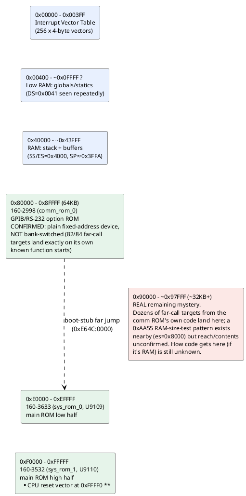

# Memory & I/O map (as understood so far)

Reconstructed from segment-register loads and I/O instructions actually
seen in the disassembled code — not from a schematic, so treat physical
region *boundaries* as approximate until confirmed against the service
manual. See `disasm/NOTES.md` for the underlying evidence.

## Confirmed regions

| Range | What | Evidence |
|---|---|---|
| `0x00000-0x003FF` | Interrupt vector table | Direct writes: `mov word [es:bx],...` with `es=0`/`es=0x3F` installing INT1, INT2, INT255 handlers (see `disasm/NOTES.md`) |
| `0x40000-~0x43FFF` | RAM: stack + scratch buffers | `mov ax,0x4000 / mov ss,ax` then `mov sp,0x3FFA` at reset; `es=0x4000` used 31x, more than any other segment, for buffer clears (`mov byte [es:si],0` loops) |
| `~0x00400+` | RAM: global/static variables | `ds=0x0041` (physical `0x410`, right after the IVT) used repeatedly to access small fixed offsets like `[0x758]`, `[0x780]`, `[0x1B50]` - looks like the main variable pool starts immediately after the IVT |
| `0x80000-0x8FFFF` | `160-2998` (comm/GPIB-RS232 option ROM) | **Confirmed a plain fixed-address 64KB device, not bank-switched** - every far-call target landing here resolves against this file's own function-start signatures (82/84 exact matches), and the main ROM's already-proven code calls directly into it |
| `0xE0000-0xEFFFF` | `160-3633` (main ROM, low half) | Confirmed via TekWiki + validated disassembly |
| `0xF0000-0xFFFFF` | `160-3532` (main ROM, high half) | Confirmed via TekWiki; holds the real CPU reset vector at `0xFFFF0` |

## Unidentified / open

- **`0x90000` and up (~32KB+, real extent unconfirmed): the actual
  remaining mystery.** What used to be called "the `0x80000-0x97FFF`
  mystery region" turned out to be mostly a mapping mistake on this
  project's part - the lower half (`0x80000-0x8FFFF`) is just the comm
  ROM at its correct address (see above). The genuine open question is
  what's at `0x90000` and beyond: the comm ROM's own code makes far
  calls into segments like `911e`, `92cf`, `941f`, `9470`, `9628`,
  `9687`, `96f5`, `97c6` (up to physical `0x97C95`), and none of that
  is covered by any ROM dump we have. TekWiki confirms there's no third
  ROM chip for the 2230, so if this is real and populated, it's either
  RAM or something not yet accounted for.

  A `0xAA55` non-destructive RAM-size-test pattern exists in the main
  ROM targeting `es=0x8000` - suggestive of real RAM somewhere in this
  neighborhood, but whether that probe's actual range extends as far
  as `0x90000+` hasn't been confirmed.

  Still open: how code would get INTO that region for the comm ROM to
  call into it. Checked 2 of 5 call sites of a generic memcpy-style
  utility (`SUB_FBC09`) looking for a copy targeting there; found
  nothing so far. If it's RAM populated only at runtime (GPIB/RS-232
  download, runtime code generation, or something not yet considered),
  its contents may be invisible to static analysis of these three ROM
  dumps alone - worth factoring into any estimate of how much of this
  system can ultimately be reverse-engineered from what we have.

## I/O ports actually seen in code

| Port | Access | Context |
|---|---|---|
| `0x83` | `out 0x83, ax` | `160-3532`, offset `0x0CCF` |
| `0xC4` | `out 0xc4, ax` | `160-3633`, offset `0xE143` |
| `0xD1` | `out 0xd1, ax` (x3) | `160-3633`, offsets `0xE13D/E13F/E141` - written 3x in a row, possibly a multi-register peripheral or a retry/settle pattern |
| (in DX) | `in al, dx` | `160-3633`, offset `0xDA0A` - port number computed at runtime, not a literal, so this reads from a *range* of ports (a peripheral with multiple addressable registers, or a scan loop) |

All writes are 16-bit (`ax`), suggesting word-wide peripheral
registers. No documentation yet on which physical device these
correspond to (candidates per the hardware overview in `CONTEXT.md`:
the Sony CX20052A A/D converter, front-panel switch/LED controller, or
GPIB/RS-232 UART) - worth checking the service manual's I/O map when
available, or narrowing down by what surrounding code does with the
read/written values.
