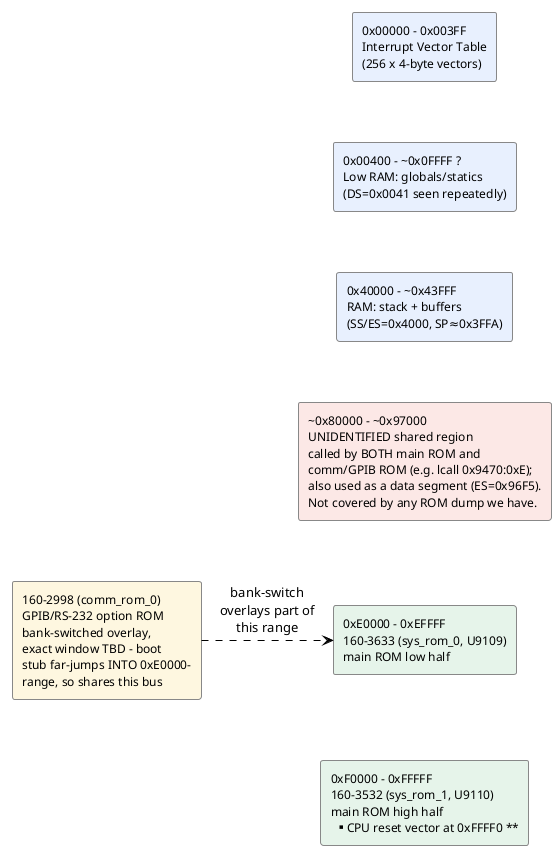

# Memory & I/O map (as understood so far)

Reconstructed from segment-register loads and I/O instructions actually
seen in the disassembled code (`disasm/sysrom_3532_3633.lst`) — not
from a schematic, so treat physical region *boundaries* as approximate
until confirmed against the service manual. See `disasm/NOTES.md` for
the underlying evidence (interrupt vector table writes, the shared
`0x9470`/`0x8xxxx-0x97xxx` service-call region, etc.).

## Confirmed regions

| Range | What | Evidence |
|---|---|---|
| `0x00000-0x003FF` | Interrupt vector table | Direct writes: `mov word [es:bx],...` with `es=0`/`es=0x3F` installing INT1, INT2, INT255 handlers (see `disasm/NOTES.md`) |
| `0x40000-~0x43FFF` | RAM: stack + scratch buffers | `mov ax,0x4000 / mov ss,ax` then `mov sp,0x3FFA` at reset; `es=0x4000` used 31x, more than any other segment, for buffer clears (`mov byte [es:si],0` loops) |
| `~0x00400+` | RAM: global/static variables | `ds=0x0041` (physical `0x410`, right after the IVT) used repeatedly to access small fixed offsets like `[0x758]`, `[0x780]`, `[0x1B50]` - looks like the main variable pool starts immediately after the IVT |
| `0xE0000-0xEFFFF` | `160-3633` (main ROM, low half) | Confirmed via TekWiki + validated disassembly |
| `0xF0000-0xFFFFF` | `160-3532` (main ROM, high half) | Confirmed via TekWiki; holds the real CPU reset vector at `0xFFFF0` |

## Unidentified / open

- **`~0x80000-0x97000`**: referenced by far calls from *both* the main
  ROM (12+ call targets) and the comm/GPIB ROM (`lcall 0x9470, 0xE`,
  called 4 times in one small function alone), and also used as a data
  segment (`es=0x96F5`). This is neither of our two confirmed ROM
  regions nor the low/stack RAM areas - it's most likely either RAM
  holding a dynamically-loaded overlay (code paged in from a ROM we
  don't have a dump of) or a third ROM/RAM device entirely missing
  from `binary/`. Both boards treating it as a stable, shared call
  target smells like a documented low-level service API - exactly the
  kind of thing a plug-in option board would need without having to
  know the main firmware's real internal addresses.
- **Comm ROM (`160-2998`) bank-switch window**: known to overlay *part*
  of the address space the main ROM also occupies (its boot stub far-
  jumps to physical `0xE64C0`, inside `0xE0000-0xEFFFF`), but the exact
  addressing/bank-select mechanism (which port or memory-mapped
  register selects it, and what window size) isn't confirmed.

## I/O ports actually seen in code

| Port | Access | Context |
|---|---|---|
| `0x83` | `out 0x83, ax` | `160-3532`, offset `0x0CCF` |
| `0xC4` | `out 0xc4, ax` | `160-3633`, offset `0xE143` |
| `0xD1` | `out 0xd1, ax` (x3) | `160-3633`, offsets `0xE13D/E13F/E141` - written 3x in a row, possibly a multi-register peripheral or a retry/settle pattern |
| (in DX) | `in al, dx` | `160-3633`, offset `0xDA0A` - port number computed at runtime, not a literal, so this reads from a *range* of ports (a peripheral with multiple addressable registers, or a scan loop) |

All writes are 16-bit (`ax`), suggesting word-wide peripheral
registers. No documentation yet on which physical device these
correspond to (candidates per the hardware overview in `CONTEXT.md`:
the Sony CX20052A A/D converter, front-panel switch/LED controller, or
GPIB/RS-232 UART) - worth checking the service manual's I/O map when
available, or narrowing down by what surrounding code does with the
read/written values.
