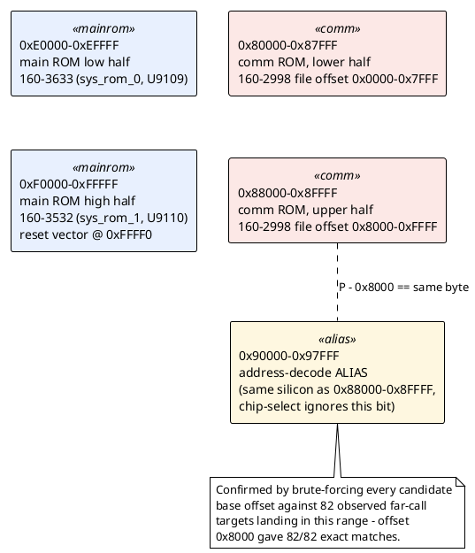

# Comm ROM: address map and CPU identity

Moved from `disasm/NOTES.md` (which had grown too long to navigate) -
see `docs/README.md` for the full table of contents.

## Physical address map (overview)

The comm ROM is a single 64KB chip living at a fixed physical address,
with its upper half also reachable through a second, aliased address
range caused by an incomplete chip-select decode (`0x90000-0x97FFF`
electrically duplicates `0x88000-0x8FFFF` - see "The 0x90000-0x97FFF
region is fully resolved" below for the full evidence). Both main-ROM
halves share the same 8088 address space:

## Is the comm ROM its own CPU?

Own ROM chips, own physical board (A23/A24 vs. the main board A10) —
but **not its own CPU**. Evidence:

- Both 16KB pages at file offset `0x8000` and `0xC000` in `160-2998`
  open with byte `0xEA` (x86 far-JMP), decoding cleanly as
  `ljmp 0xE64C:0000` → physical `0xE64C0` — which falls *inside* the
  already-confirmed main-ROM window (`0xE0000-0xEFFFF`). A genuinely
  separate CPU with its own private address space would have no reason
  to reference an address inside the other board's ROM.
- The classic C-compiler prologue `55 8B EC` (`push bp; mov bp,sp`)
  appears **398 times** across all four 16KB pages (121/102/84/91 per
  page) — real compiled functions, same style (BP-based frames, `retf`/
  `retf N` far returns) as the main ROM, consistent with the same
  toolchain having built both.
- Comm-ROM code makes far calls like `lcall 0x9470, 0xE` (physical
  `0x9470E`) — landing in the *same* unidentified `~0x80000-0x97000`
  region that the main ROM's code also calls into (see `MEMORY_MAP.md`).
  Two independently-addressed CPUs coincidentally referencing the same
  absolute address for what looks like a shared service-call table
  would be a bizarre coincidence; far more likely this is one shared
  bus/address space with a documented low-level API both the main
  firmware and any plug-in option board call through.
- Reset vector check: confirmed absent. Both `160-2998-13.bin` and
  `-14.bin`'s last 16 bytes (physical `0xFFF0-0xFFFF`, where an 8088
  always starts fetching after reset) are unprogrammed `0xFF` — this
  ROM was never a candidate to be the boot ROM, consistent with it
  being a bank-switched overlay that only gets paged in once the main
  firmware's boot code decides to.

Still unknown: the exact bank-switch mechanism (which port/register
selects this ROM into the address space, and what window size).

**Update: there is no bank-switch mechanism - see the next section.**

## The comm ROM is NOT bank-switched

Corrected after the user pointed out the obvious question: with a 1MB
(20-bit) address space and only ~192KB of ROM plus modest RAM in use,
why would anyone bank-switch a 64KB device when there's plenty of free
address space to just give it a fixed home? There wasn't a good
answer - the "bank-switching" framing above came from over-reading the
repeated per-page headers as evidence of paging, when it wasn't.

**Confirmed: `160-2998` is a plain 64KB device at a fixed physical
address, `0x80000-0x8FFFF`** - the exact same simple pattern as the
two main-ROM halves at `0xE0000`/`0xF0000`. Verified two ways:

1. Every far-call target (from both the main ROM's already-proven code
   and the comm ROM's own code) landing in `0x80000-0x8FFFF` was
   checked against this file's own `55 8B EC` push-bp signatures at
   `file_offset = phys - 0x80000`: **82 of 84 distinct targets land
   exactly on a known function start** (the other 2 likely just hit a
   leaf function using a different prologue).
2. The main ROM's own already-proven-reachable code makes several
   direct far calls straight into that range (e.g. `160-3633:0x1f03`
   calls `8013:0003` → physical `0x80133`) - this isn't a heuristic
   result, it's PROVEN reachability from the confirmed boot path.

This also resolved what had been called "the mystery
`~0x80000-0x97000` region" - the lower half of it (`0x80000-0x8FFFF`)
*is* the comm ROM we already have a full dump of; it was only ever
mysterious because of the wrong (arbitrary bookkeeping) addresses this
project had been using for it. The real, still-unresolved mystery is
narrower now: `0x90000` and up (see `MEMORY_MAP.md`).

`gen_disasm_x86.CHIPS` now includes `"2998"` (`phys_base=0x80000`)
directly, exactly like `"3633"`/`"3532"` - no more special-cased
virtual-page-addressing module needed. `gen_disasm_2998.py` is now
just a thin heuristic-entry-point supplement (the 398 push-bp
signatures + the 2 internal boot-stub jumps) layered on top of the
same real address space, and `gen_source_2998.py` regenerates
`160-2998-14.asm` with those included (while leaving the main ROM's
`.asm` files as proven-only, via `gen_source.main()`'s new
`only_chips` parameter, so heuristic confidence doesn't leak into
files that are supposed to be proven-reachable-only).

Reaching further into the main ROM through these newly-resolved comm-
ROM call sites surfaced a few instruction kinds the NASM converter
hadn't seen yet: x87 FPU instructions (`fdiv`, etc. - capstone's
`st(N)` operand syntax isn't NASM-compatible as written) and some rare
string-I/O/bounds-check instructions (`insw`/`outsw`/`outsd`/`bound`).
Rather than get their exact NASM syntax right immediately, these are
conservatively excluded from conversion (fall back to raw `db`, same
safe-by-default principle as everywhere else) - see `TODO.md`. Also
found and fixed one more real encoding ambiguity while re-validating:
opcode `0x82` is an undocumented exact duplicate of `0x80` for byte-
sized group-1 immediate ops (the sign-extend bit that distinguishes
them doesn't mean anything for an 8-bit destination) - NASM always
emits `0x80`, so this needed the same kind of alternate-encoding
detection as the direction-bit and displacement-width ambiguities.

## Comm ROM disassembly (160-2998-14)

`160-2998` (`phys_base=0x80000`) is now registered directly in
`gen_disasm_x86.CHIPS`, exactly like `"3633"`/`"3532"` - see "The comm
ROM is NOT bank-switched" above. Running `gen_disasm_x86.py` alone
already reaches some of it (99 instructions) through PROVEN control
flow: real far calls from already-confirmed main-ROM code (this is
included in the official `sysrom_3532_3633.lst`/`.symbols.json`, no
separate confidence tier needed for these 99).

`gen_disasm_2998.py` adds a second, lower-confidence layer on top:
every occurrence of the `55 8B EC` (`push bp; mov bp,sp`) C-compiler
prologue (398 of them) plus this ROM's own two internal boot-stub far
jumps, seeded as additional entry points in the *same* real address
space (no per-page virtual addressing needed any more - that
machinery is gone now that the mapping is confirmed flat). This is a
strong signal but not proof of reachability the way the main ROM's
recursive descent is - one still-open thread: 2 far calls found landing
in `0x80000-0x8FFFF` didn't hit an exact function start under this
scan (see the "82/84" figure above), meaning either a different
prologue style or a genuine decode drift into data at that spot.

One high-confidence discovery from the earlier (pre-correction) pass
remains valid: the boot-stub far-jump target (`0xE64C:0000`) is
directly observed (both comm-ROM pages 2 and 3 independently encode
the identical jump) and is promoted into the official
`gen_disasm_x86.py` `ENTRY_POINTS` as `COMM_ROM_BOOTSTUB_TARGET`.

Result with the heuristic layer included: 20,446 instructions reached,
NASM-validated (`validate_2998.py`): 18,290 exact + 2,151 alt-encoding,
2 real mismatches (both `push` instructions with a stray `0x67`
address-size-override prefix, landing right where page 1's header/
copyright text starts - almost certainly decode drift into data at
the deepest heuristic reach, not a validator problem), 3 not
converted. **Confirmed 2026-09-13**: both mismatches (physical
`0x84010`/`0x84041`) land inside the printable-text region already
catalogued in `strings_160-2998.json` at file offset `0x400a` (a
57-character banner/header string) - exactly the "decode drift into
data" explanation, not a validator bug. No further action needed. A buildable NASM source (`160-2998-14.asm`, via
`gen_source_2998.py`) reassembles byte-identical to the original .bin
regardless, same guarantee as the main ROM's `.asm` files - real
mismatches/unconverted instructions just fall back to raw `db`.

Chasing validation failures across both correction passes surfaced
several more real bugs/gaps in `validate_nasm.py`, all now fixed:
- a segment-override prefix byte (`0x26`/`0x2E`/`0x36`/`0x3E`) was
  being read as if it were the instruction's opcode, breaking the
  immediate-width-widening check for segment-overridden ALU ops with
  a memory destination (e.g. `or word [es:di+0xA], imm`).
- capstone omits the `0x` prefix on some near-branch targets too (not
  just far ones) - an unprefixed target like a bare `"9"` was falling
  through to a bogus literal-address conversion instead of being
  resolved or safely rejected.
- x87 FPU instructions (`fdiv`, etc.) and a few rare instructions
  (`insw`/`outsw`/`outsd`/`bound`) surfaced once coverage reached
  further via the corrected comm-ROM mapping; conservatively excluded
  from conversion (raw `db` fallback) rather than risk getting their
  NASM syntax subtly wrong - `TODO.md` has this as a follow-up.
- opcode `0x82` is an undocumented exact duplicate of `0x80` (byte-
  sized group-1 immediate ops - the sign-extend bit that distinguishes
  them at 16/32-bit doesn't mean anything for an 8-bit destination);
  NASM always emits `0x80`, so this needed the same kind of alternate-
  encoding detection as the direction-bit/displacement-width cases.

`gen_source.py`'s `main()` gained an `only_chips` parameter for this
work: the comm ROM's heuristic entries can open up new PROVEN-reachable
code in the main ROM chips too (real code, discovered via a real call
path), but writing that into `160-3633-14.asm`/`160-3532-14.asm` would
silently mix heuristic-derived confidence into files that are supposed
to be proven-reachable-only. `gen_source_2998.py` now passes
`only_chips=["2998"]` so only the comm ROM's file picks up the wider
heuristic-assisted view; the main ROM's `.asm` files stay proven-only,
regenerated separately via `gen_source.py`'s default entry set.

## The 0x90000-0x97FFF region is fully resolved: an address-decode alias

**CORRECTION, 2026-09-13, from the service manual's Table 3-1 full
page image**: the mechanism described below (brute-forcing a base
offset against 82 far-call targets, landing on `base=0x88000`) is
still numerically valid and the resulting `file_offset = phys-0x88000`
formula is still exactly correct - but the *explanation* - "the comm
ROM's own upper half... appearing a second time," i.e. that
`0x88000-0x8FFFF` is itself ROM - is now known to be **wrong**.
Table 3-1 documents `0x88000-0x8F7FF` as **"Option nonvolatile RAM"**
and `0x8F800-0x8FFFF` as **"Nonvolatile RAM"** - genuinely different
hardware (RAM, not ROM), while `0x90000-0x97FFF` is separately and
explicitly labeled **"Half of Communication Options ROMs U1243 or
U1343"** - the ROM's real, deliberately-separate upper half, not an
alias/shadow of the RAM region at all. The two ROM halves simply sit
on either side of the option's RAM in the address space; there is no
incomplete-address-decoding artifact here after all. See
`MEMORY_MAP.md`'s corrected confirmed-regions rows for the exact
addresses. The brute-force *technique* below remains valid and worth
reusing - it found the right numeric relationship even though the
initial explanation for *why* it worked was incorrect.

**Not RAM, not a missing chip - it's the comm ROM's own upper half
(`0x88000-0x8FFFF`, file offset `0x8000-0xFFFF`, pages 2-3) appearing a
second time at a different physical address.** *(Superseded by the
correction above - kept for history.)* The user asked "would
the pointers into `0x90000-0x97FFF` make sense if they were a shadow
of `0x80000-0x8FFFF`?" - a plain `+0x10000` shift didn't fit (1/82
targets matched), but brute-forcing every possible base offset against
all 82 observed far-call targets found `base=0x88000` gives **82/82
exact matches**. So: `phys - 0x88000 == file_offset` for everything in
this range, meaning physical address `P` (for `0x90000 <= P <
0x98000`) is electrically the same location as physical address
`P - 0x8000` (which already falls inside the confirmed comm-ROM
window). This is a classic partial/incomplete address-decode artifact
- the comm ROM's chip-select logic most likely only compares a subset
of the high address lines, so it responds (aliases) across a wider
range than its "official" 64KB window. Nothing to reverse-engineer
further here; these are bytes we already have a complete dump of.

**General technique worth reusing for any future "why does this
address not resolve" puzzle**: don't assume a single fixed offset -
brute-force every candidate base against the full set of observed
targets and take whichever one maximizes exact matches against known
function-start (or other) signatures. A single spot-check can miss a
non-obvious offset; scoring all of them at once found this instantly.
## The 0x90000+ region: fully resolved (see above)

This used to be a substantial open question ("`~0x80000-0x97000`,
likely RAM, contents unknown"). It's now completely closed - see "The
0x90000-0x97FFF region is fully resolved: an address-decode alias"
above. Short version: it's not a separate region at all, it's the same
comm-ROM bytes we already have, visible at a second physical address
because of how the chip-select logic decodes address lines. Nothing
further to chase here. (The `0xAA55` pattern that originally suggested
"RAM test" turned out to be part of the option-presence/RAM-detection
routine documented above too, not a generic memory-size probe.)
