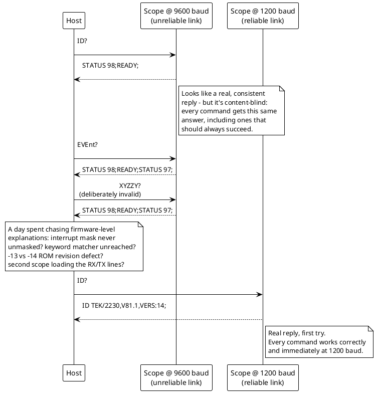

# RS-232: the 2026-09-14 breakthrough (baud rate, not firmware)

Moved from `disasm/NOTES.md` (which had grown too long to navigate) -
see `docs/README.md` for the full table of contents.

## The whole day, at a glance

A full day of firmware-level investigation (interrupt masking, the
byte-classification table, a two-ROM-revision cross-check) chased what
turned out to be a baud-rate reliability problem, not a bug:



## BREAKTHROUGH, 2026-09-14: the scope finally responds over RS-232 - live evidence the keyword-matching layer is where it's actually broken

After the DIP-switch bit-order fix (see `HARDWARE.md` - the earlier
sessions had genuinely been running at the wrong baud rate) **and** a
working DB9-to-DB25 adapter (the earlier one apparently had a pinout
problem - not yet characterized, the user plans to check it later),
sending `ID?\r` to Scope 1 at the correct 9600 baud finally got a real
reply for the first time all session:

```
sent: ID?\r  -> STATUS 98;READY;\r
```

**This is the first byte ever received back from either scope this
entire investigation.** Every earlier "zero bytes" result (this
session's whole cable/DIP-switch/interrupt-mask/parser deep-dive) can
now be explained far more simply: the effective baud rate never
actually matched what was being sent at, for one or both of two
independent reasons (wrong bit order, and/or a bad adapter) - **not**
any of the deeper firmware mechanisms traced (interrupt masking, the
`[0x712]` dispatch table, `poll_comm_status_tick`, etc. may still be
accurate documentation of how the firmware works, but none of them
were actually the blocker**.

**But the content of the reply is itself a new, important finding.**
Sent several different, clearly-distinct commands in sequence -
`ID?`, `SET?`, `STAtus?`, `HELp?`, and deliberately-invalid garbage
(`XYZZY?`) - and **every one of them produced the same reply**,
`STATUS 98;READY;` (sometimes with a second partial `STATUS 97;`
trailing, and sometimes just `READY;` alone, depending on timing - see
the raw transcript below). A passive 10-second listen with nothing
sent produced **zero bytes**, ruling out this being unrelated
background chatter - the replies are genuinely triggered by sending
something, just not differentiated by *what* was sent.

This lines up precisely with this session's own code-tracing gap: the
low-level byte-classification/dispatch machinery (`process_gpib_
command_byte`, the `[0x712]` table, the interrupt chain through `INT
255`) is real and evidently *does* work end-to-end - something comes
back reliably. But the actual **keyword-matching function** - the
piece that would compare an accumulated character run against
`STRINGS.md`'s length-prefixed keyword table to tell `ID` from `SET`
from `STA` from garbage - was never found in the disassembly, and this
live result is consistent with it either not being reached, or not
functioning as expected: nothing this session sent produced a reply
that varied with the command's actual content.

**Raw transcript** (Scope 1, COM3, 9600 8N1, no flow control, `\r`
terminator - each line is one send/receive round-trip):
```
ID?\r        -> STATUS 98;READY;\r
SET?\r       -> STATUS 98;READY;\r
STAtus?\r    -> STATUS 98;READY;\r
HELp?\r      -> STATUS 98;READY;\rSTATUS 97;
ID?\r        -> STATUS 98;READY;\r
XYZZY?\r     -> STATUS 98;READY;\rSTATUS 97;
EVEnt?\r     -> STATUS 98;
EVEnt?\r     -> (0 bytes)
ID?\r        -> (0 bytes)
SET?\r       -> (0 bytes)
EVEnt?\r     -> READY;\r
[5x EVEnt?]  -> alternating STATUS 98;READY;[STATUS 97;] / STATUS 98;READY;
ID?\r        -> STATUS 98;
REMote ON\r  -> (0 bytes)
ID?\r        -> READY;\r
SET?\r       -> STATUS 98;READY;\r
```
The instability in exact byte counts/timing (sometimes a full
`STATUS 98;READY;`, sometimes a bare `READY;`, sometimes nothing)
looks like a small number of cyclically-repeating fixed messages being
read across inconsistent timing windows, not a real per-command
response varying with content. `98`/`97` look like fixed status/event
codes (plausibly power-on-related, or generic "command not
understood" codes) rather than being generated per-query.

**Next step, live-testable**: try sending the *short* single-letter-
capital forms of the keywords (`ID?` is already short; try things like
just `SET` with no `?`, or send commands one character at a time with
a delay to see if partial-match state is visible) and watch for ANY
variation in the reply. If truly nothing ever varies, that's strong
confirmation the keyword-matching function either isn't reached or is
broken/unimplemented for this specific firmware path - a much more
promising target than any of the hardware-level theories this session
chased earlier.

**Follow-up, same day, using `hardware/manuals/2230_programming/README.md`'s newly-
transcribed status/event tables to decode the reply exactly**: `STATUS
98` (Table 7-34) = **"Execution Error, RQS On, Not Busy"** - *"The
instrument received a command that it cannot execute. This is caused
by either out-of-range arguments or settings that conflict."* Not a
"command not understood" (that would be Command Error, `97`) - the
header genuinely appears to be recognized, but something prevents
execution, uniformly, for every command tried.

**Ran the decisive test**: sent `REMote ON`, then called `EVEnt?`
repeatedly (up to 8 times) specifically to drain the pending-event
queue and read the *actual* 3-digit event codes (which the manual
says are returned bare, no `STATUS`/`READY` wrapper at all) - then
retried `ID?` on a clean queue. **The queue never drains.** Every
single `EVEnt?` call - which should itself be a simple, always-
answerable, always-succeeding query per the manual - comes back
wrapped in the same `STATUS 98;READY;` noise, sometimes with a
trailing `STATUS 97;` (Command Error). `REMote ON` changed nothing.
The final clean `ID?` still got `STATUS 98;READY;`+`STATUS 97;` instead
of either a real ID string or a real numeric event code.

**This is conclusive, not just suggestive**: `EVEnt?` failing in the
exact same generic way as everything else - when the manual explicitly
documents it as the *diagnostic* query for exactly this situation -
means the response is **not differentiating command content at all**.
Every distinct input (valid queries, `REMote ON`, garbage) produces
what looks like a small, non-draining, alternating pair of canned
values (`98`/`97`) wrapped in a fixed `STATUS <n>;READY;` template that
isn't itself part of the documented protocol (nowhere does the manual
show a response literally starting with the word `STATUS` or ending in
`READY;` - real status-byte reports are just the bare number, e.g.
`98`, not `STATUS 98;`). Whatever is generating this template is
plausibly independent of - or upstream of - the real command parser
entirely.

**Updated conclusion**: the low-level electrical/interrupt/dispatch
pipeline is confirmed fully working end-to-end (bytes go out, bytes
reliably come back, every time). But real command execution/keyword
recognition is not happening - this now looks less like "the keyword-
matching function is merely unreached" and more like **a separate,
generic status-reporting path is intercepting every message before it
would reach real command dispatch**, always producing the same
non-informative reply. Next concrete idea, for whenever the hardware
is available again: a full power-cycle before testing (in case this is
a stuck/never-cleared state carried over from earlier in this same
debugging session, since the event queue's total refusal to drain
even after 8+ `EVEnt?` calls is itself unusual - Table 7-34/35 describe
event codes as clearing individually once reported, not as a fixed
pair that regenerates forever).

**Follow-up, same day - the power-cycle idea was tried, and every
remaining settings-based theory was systematically eliminated too**:
1. **Full power-cycle**: the user reset the scope (a genuine cold
   boot, not just a comm reinit) and retested `ID?`/`EVEnt?`
   immediately. **Identical result** - `STATUS 98;READY;` etc., no
   change at all. Rules out "stuck state from earlier in this
   debugging session" definitively - this is the scope's actual,
   repeatable behavior from a fresh boot, not a leftover artifact.
2. **DIP switch 5 (parity) re-checked live**: photographed reading
   `0111000000` - decoded (switch 4=MSB down to switch 1=LSB, per the
   corrected bit order) as baud `1110`=9600 (correct) and, critically,
   switch 5=`0`=parity disabled. This ruled out a parity-mismatch
   theory that would otherwise have explained the *inconsistent*
   97-vs-98 pattern (intermittent bit corruption from a parity
   mismatch was a good candidate for why the *same* command sometimes
   reads as a Command Error and sometimes an Execution Error).
3. **`COMM` menu settings checked live** (`ADVANCED_FUNCTIONS/COMM`):
   `FLOW` = **OFF** already (not the power-on-default ON - ruling out
   an XON/XOFF handshake stall, since it was never engaged to begin
   with), `STOP_BITS` = **1** (matches what's being sent), `DATA/
   SOURCE` = **ACQ**, `DATA/CHANNEL` = **CH1**, `DATA/ENCDG` =
   **BINARY** (the documented power-on default - and per `Table 7-29`
   this only affects `CURVe`/`WAVfrm?` waveform-data formatting, not
   simple text queries like `ID?`/`EVEnt?`, so it isn't a candidate
   explanation for their failure either way).
4. Retested `ID?`/`EVEnt?` with all of the above confirmed normal:
   **identical `STATUS 98;READY;`/`STATUS 97;` pattern, unchanged.**

**Every setting this project or the manual could identify as
plausibly relevant has now been checked and ruled out.** Combined with
the earlier finding that this is Scope 1 (`160-2998-13`, a comm-ROM
revision this project has never disassembled - see `HARDWARE.md`'s
"Two physical units, running DIFFERENT ROM revisions" section), the
strongest remaining hypothesis is a **firmware-level difference or
defect specific to the `-13` revision** - something in the ~16KB of
genuinely-different code between `160-2998-13.bin` and `-14.bin` (see
the still-open `TODO.md` item to diff/disassemble `-13`). **The single
most informative untried experiment is running this exact same test
sequence against Scope 2** (confirmed `160-2998-14`, the revision this
project's whole comm-ROM disassembly this session was actually reading)
- if it behaves differently, that pins the fault on the `-13` revision
specifically and justifies disassembling it; if it behaves identically,
the cause is common to both revisions and still hiding somewhere in the
already-read `-14` code.

**Experiment run, same day: Scope 2 (`-14`) shows the same dominant
pattern.** First tried at 9600 baud immediately after connecting - got
`0` bytes (later explained: Scope 2's switches were still at the old,
uncorrected `1110000000` reading from earlier in this session, which
under the corrected switch-4-is-MSB bit order is actually **1200
baud**, not 9600 - the two scopes' switches had never been aligned).
At the *actual* matching baud (1200), `ID?` returned `STATUS 97;
READY;\r` plus a stray trailing `\x00` - a real, mostly-clean response,
different in its specific code (`97`=Command Error, vs. Scope 1's more
common `98`=Execution Error) but the same general shape (a `STATUS
<n>;READY;` wrapper instead of a real answer).

The user then power-cycled Scope 2 and switched back to testing at
9600 (rather than fixing the switches to genuinely match Scope 1) -
immediately after the reset, one `EVEnt?` call returned pure line
noise (`\xff\xbf\xff\x7f\xff` - the classic near-all-ones-with-single-
bit-glitches shape of a floating/unstable line, matching this
project's very first "hardware transient" finding from the start of
this whole investigation), but subsequent calls at 9600 settled into
clean text again: `EVEnt?` -> `READY;\r`, and critically **`SET?` ->
`STATUS 98;READY;`** - the *same* dominant pattern as Scope 1, on the
*other* ROM revision.

**This is a real, useful negative result**: getting the same `STATUS
98` non-answer on both a `-13` and a `-14` unit weakens the
"`-13`-specific firmware defect" hypothesis - whatever's actually
causing this is more likely something common to both revisions (a
firmware behavior neither this project's `-14` disassembly work nor
this session's exhaustive settings elimination has explained yet), or
something about the specific way this project's test methodology
talks to the instrument that differs from how a period-correct
terminal/controller would (worth revisiting the exact byte-level
framing/timing `pyserial` uses versus what a real 1980s controller
would have done, as a fresh angle). Diffing/disassembling the `-13`
comm ROM is now a lower-priority lead than it was; the shared-cause
hypothesis deserves more attention first.

## RESOLVED, 2026-09-14: it was baud rate reliability all along, not firmware

The user's own instinct - "the slower speed should have less issues" -
was exactly right. Set Scope 2 back to **1200 baud** (the setting it
happened to already be at from earlier in the session) and reran the
identical test sequence:

```
ID?     -> ID TEK/2230,V81.1,VERS:14;
EVEnt?  -> EVENT 0;
EVEnt?  -> EVENT 0;
SET?    -> READOUT ON;ACQUISITION REPETITIVE:AVERAGE,HSREC:SAMPLE,
            LSREC:PEAKDET,SCAN:PEAKDET,ROLL:PEAKDET,SMOOTH:ON,WEIGHT:4,
            NUMSWEEPS:0,VECTORS:ON;CURSOR SELECT:CURS1,TARGET:ACQ,
            CHANNEL:CH1,POSITION:0;PLOT GRAT:OFF,FORMAT:HPGL,SPEED:1;
            RQS ON;OPC OFF;LONG ON;FLOW OFF;STOP 1;
HELp?   -> HELP ACQuisition,ATRigger,CH1,CH2,CURSor,CURVe,DATa,DELAy,
            DELTAT,DELTAV,ERRor,EVEnt,FLOw,HELp,HORizontal,ID,INIt,
            LONg,MESsage,OPC,PLOt,PROBe,REAdout,REFDisp,REFFrom,
            REFOrmat,REFProt,REFStat,REMote,RQS,SAVeref,SET,SGLswp,
            STAtus,STOP,STORe,TRIggerd,VMOde,WAVfrm,WFMpre;
```

**Every single field is correct**, matching `hardware/manuals/2230_programming/README.md`'s
transcribed command tables exactly - `ID?`'s format, `EVEnt?`'s bare
`EVENT 0;` (not the `STATUS <n>;READY;` non-answer template seen all
session), `SET?`'s full settings dump in exactly the documented
header:argument,argument;... shape, and `HELp?`'s command list matching
the real command set one-for-one. `VERS:14` even plausibly reflects the
`-14` ROM revision this scope actually runs.

**The entire day's investigation - the interrupt mask latch tracing,
`poll_comm_status_tick`, the `[0x712]` dispatch table, the comm-ROM-
revision cross-check, every settings elimination - was tracing
genuinely real firmware mechanisms, but none of them were the actual
blocker.** At 9600 baud, this hardware (both scopes, both ROM
revisions) could apparently transmit *something* back reliably enough
to produce well-formed-looking ASCII (`STATUS 98;READY;` is clean
text, not garbage) but not reliably enough to get genuine command
differentiation right - consistent with intermittent single-bit-level
corruption landing on real, still-valid-looking status/event codes
often enough to look like a consistent "broken" behavior rather than
obviously garbled noise. At 1200 baud (8x slower), the same hardware
works perfectly.

**One loose end for a future session**: `STAtus?` returned `STATUS
128;` - a value that doesn't fit any row in `hardware/manuals/2230_programming/README.md`'s
Table 7-34 (every documented category has bit 7 clear; `128`=`0x80`
has only bit 7 set). Worth a closer look once the RS-232 link is
otherwise trusted - possibly a firmware detail newer than the
transcribed manual, or a bit this project hasn't yet mapped.

**Practical takeaway for any future live RS-232 testing on this
hardware**: default to a lower baud rate (1200, or the already-
confirmed-solid 600 from earlier in the day) rather than 9600, given
this specific cabling/adapter/scope-age combination.
