# 2230 Operators Manual

Transcribed from `hardware/070-4998-02.pdf` (OCR'd scan, Artek Media) via `hardware/gen_manual_markdown.py`. Headings are detected from the OCR layer's own font-size data (body text ≈ 9.0pt); pages with under 500 characters of body text are rendered as images instead of transcribed (heuristic for "probably a figure/schematic/photo page", not perfect - see the script's docstring). Tables read as plain paragraphs, not reconstructed markdown tables - OCR column alignment isn't reliable enough for that. OCR errors (e.g. "tlon" for "tion") are left as-is.

<!-- page 1 of 188 -->

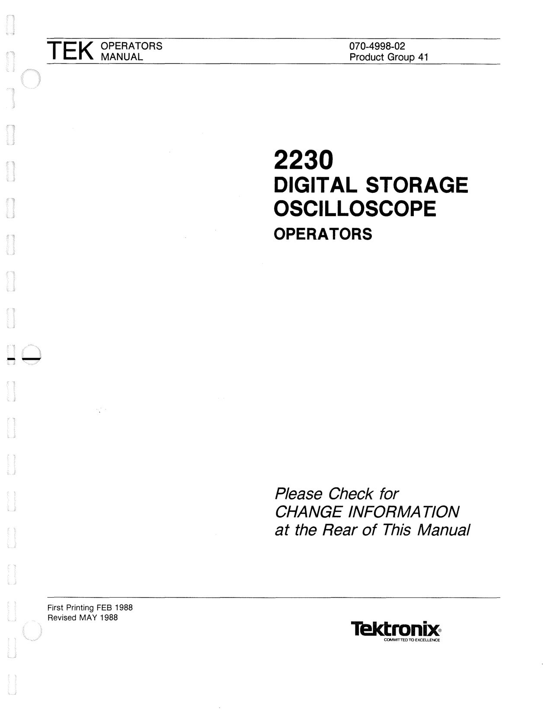

OCR text on this page

--

TEK

OPERATORS MANUAL

First Printing FEB 1988 Revised MAY 1988

## 2230

070-4998-02 Product Group 41

## DIGIT AL STORAGE

## OSCILLOSCOPE

## OPERATORS

## Please Check for

## CHANGE INFORMATION

## at the Rear of This Manual

COMMITTED TO EXCELLENCE

<!-- page 2 of 188 -->

Copyright ® 1985, 1986, 1988 Tektronix, Inc. All rights reserved. Contents of this publication may not be reproduced in any form without the written permission of Tektronix, Inc.

Products of Tektronix, Inc. and its subsidiaries are covered by U.S. and foreign patents and/or pending patents.

## TEKTRONIX, TEK, SCOPE-MOBILE, and ~

are registered trademarks of Tektronix, Inc. TELEQUIPMENT is a registered trademark of Tektronix U.K. Limited.

Printed in U.S.A. Specification and price change privileges are reserved.

INSTRUMENT SERIAL NUMBERS

Each instrument has a serial number on a panel insert, tag, or stamped on the chassis. The first number or letter designates the country of manufacture. The last five digits of the serial number are assigned sequentially and are unique to each instrument. Those manufactured in the United States have six unique digits. The country of manufacture is identified as follows:

### 8000000

### 100000

### 200000

### 300000

### 700000

Tektronix, Inc., Beaverton, Oregon, USA

Tektronix Guernsey, Ltd., Channel Islands

Tektronix United Kingdom, Ltd., London

Sony/Tektronix, Japan

Tektronix Holland, NV, Heerenveen, The Netherlands

<!-- page 3 of 188 -->

--

Certificate of the Manufacturer/Importer

### We hereby certify that the ________

### 2_2_30_O_S_C_IL_L_O_S_C_O_P_E _________ _

AND ALL INSTALLED OPTIONS

complies with the RF Interference Suppression requirements of Amtsbl.-Vfg 1046/1984.

The German Postal Service was notified that the equipment is being marketed.

The German Postal Service has the right to re-test the series and to verify that it complies.

TEKTRONIX

Bescheinigung des Herstellers/lmporteurs

### Hiermit wird bescheinigt, daB der/die/das ______

### 2_2_3_0_O_S_C_IL_L_O_S_C_O_P_E _____ _

AND ALL INSTALLED OPTIONS

in Ubereinstimmung mit den Bestimmungen der Amtsblatt-Verfugung 1046/1984 funkentstort ist.

Der Deutschen Bundespost wurde das lnverkehrbringen dieses Gerates angezeigt und die Berechtigung zur Uberprufung der Serie auf Einhalten der Bestimmungen eingeraumt.

TEKTRONIX

NOTICE to the user/operator:

The German Postal Service requires that Systems assembled by the operator/user of this instrument must also comply with Postal Regulation, Vfg. 1046/1984, Par. 2, Sect. 1.

HINWEIS fur den Benutzer/Betreiber:

Die vom Betreiber zusammengestellte Anlage, innerhalb derer dies Gerat eingesetzt wird, muB ebenfalls den Voraussetzungen nach Par. 2, Ziff. 1 der Vfg. 1046/1984 genugen.

NOTICE to the user/operator:

The German Postal Service requires that this equipment, when used in a test setup, may only be operated if the requirements of Postal Regulation, Vfg. 1046/1984, Par. 2, Sect. 1.7.1 are complied with.

HINWEIS fur den Benutzer/Betreiber:

Dies Gerat dart in MeBaufbauten nur betrieben werden, wenn die Voraussetzungen des Par. 2, Ziff. 1. 7.1 der Vfg. 1046/1984 eingehalten werden.

<!-- page 4 of 188 -->

<!-- page 5 of 188 -->

2230 Operators

## TABLE OF CONTENTS

Page

LIST OF ILLUSTRATIONS . . .. .. .. . .. .. . .. .. .. .. .. .. ... . .. . .. . . .. . .. . iii LIST OF TABLES .. . .. .. . . .. .. . . . .. . . . .. . . . .. .. . . . .. . .. . .. .. . . .. ... .. .. . .. v OPERATORS SAFETY SUMMARY............................. vii

Section 1 GENERAL INFORMATION

INTRODUCTION................................... SPECIFICATION...................................

Section 2 PREPARATION FOR USE

SAFETY................................................ LINE VOLTAGE.................................... POWER CORD..................................... LINE FUSE ........................................... INSTRUMENT COOLING..................... START-UP............................................ REPACKAGING....................................

Section 3 CONTROLS, CONNECTORS, - - AND INDICATORS

POWER AND DISPLAY....................... VERTICAL . ... .. ..... ..... ....... .... ...... ..... ... .. . HORIZONTAL....................................... TRIGGER.............................................. STORAGE CONTROLS....................... 3-12 MENU SELECTED FUNCTIONS ......... 3-14 REAR PANEL ....................................... 3-16 SIDE PANEL ......................................... 3-16 CRT READOUT.................................... 3-17

Section 4 OPERATING CONSIDERATIONS

GRATICULE......................................... GROUNDING........................................ SIGNAL CONNECTIONS ..................... INPUT-COUPLING CAPACITOR PRECHARGING .............

Section 5 OPERATOR'S CHECKS AND

ADJUSTMENTS

INITIAL SETUP..................................... TRACE ROTATION ADJUSTMENT...................................... PROBE COMPENSATION................... HORIZONTAL ACCURACY CHECK..................................................

Page

Section 6 BASIC APPLICATIONS

INTRODUCTION ....................................... OSCILLOSCOPE DISPLAYS.................... NON STORE DISPLAYS...................... DIGITAL STORAGE DISPLAYS.......... MAKING DIGITAL STORAGE MEASUREMENTS.................................... Ac Peak-To-Peak Voltage Using Cursors....................................... Ground Referenced De Voltage........... Time Duration .......... ... .. ............ ... .. ....... Frequency . . . . . . . . . . . . . . . . . . . . . . . . . . . . . . . . . . . . . . . . . . . . . Rise Time.............................................. Waveform Comparison......................... Time Difference Between

Repetitive Pulses ............. ............... ...... Time Difference Between Two Time-Related Pulses............................. 6-10

Phase Difference Between Sinusoidal Signals................................. 6-10 Slope ..................................................... 6-12 Low-Level Signal Measurements . .. ..... ......... .. ... ........ .. .. .. .. 6-12 Observing and Removing Aliases in Store Mode.......................... 6-13 MAKING NONSTORAGE MEASUREMENTS.................................... 6-16

AC PEAK-TO-PEAK VOLTAGE ........... 6-16 GROUND REFERENCED DC VOLTAGE ............................................. 6-17 ALGEBRAIC ADDITION....................... 6-18 COMMON-MODE REJECTION ............ 6-18 TIME DURATION ................................. 6-19 AMPLITUDE COMPARISON ............... 6-20 FREQUENCY ........................................ 6-21 RISE TIME ............................................ 6-21 TIME DIFFERENCE BETWEEN TWO TIME-RELATED PULSES .................... 6-22 PHASE DIFFERENCE .......................... 6-23 TIME COMPARISON ........................... 6-24 TV LINE SIGNAL.. ................................ 6-25 TV FIELD SIGNAL................................ 6-25 DELA YEO-SWEEP MAGNIFICATION ................................. 6-25 DELAYED-SWEEP TIME MEASUREMENTS ............................... 6-27

<!-- page 6 of 188 -->

2230 Operators

## TABLE OF CONTENTS (cont)

Page

Section 7 OPTIONS AND ACCESSORIES

INTRODUCTION....................................... GENERAL INFORMATION....................... STANDARD ACCESSORIES............... OPTIONAL ACCESSORIES................. INTERNATIONAL POWER CORD OPTIONS.............................................. OPTION 10 ........................................... OPTION 12 ........................................... OPTION 33 ........................................... COMMUNICATIONS OPTION OPERATION.............................................. ADVANCED FUNCTION MENU (for the 2230 only) . . .. .. .. . .. .. .. .. .. ... .. . . . . .. .. NON-VOLATILE EXTENDED MEMORY (for the 2230 only)............... OPTION 10 GPIB OPERATORS INFORMATION..................................... OPTION 12 RS-232-C OPERATORS INFORMATION ..................................... 7-10 RS-232-C PROGRAMMING ................. 7-15 COMMUNICATION AND WAVEFORM TRANSFER ................................................ 7-17

READOUT/MESSAGE COMMAND CHARACTER SET ............................... 7-17 MESSAGES AND COMMUNICATION PROTOCOL .......................................... 7-17 WAVEFORM TRANSFERS .................. 7-21 COMMUNICATION COMMANDS ........ 7-24 STATUS BYTES AND EVENT CODES ................................................. 7-47 2221 SPECIFIC COMMANDS ............. 7-51

Appendix A PERFORMANCE CHECK PROCEDURE

ii

INTRODUCTION ....................................... A-1 PURPOSE............................................. A-1 PERFORMANCE CHECK INTERVAL.. A-1 STRUCTURE........................................ A-1

Page

TEST EQUIPMENT REQUIRED.......... A-1 LIMITS AND TOLERANCES ................ A-1 PREPARATION FOR CHECKS ........... A-1 INDEX TO PERFORMANCE CHECK STEPS..................................... A-3 VERTICAL................................................. A-4

INITIAL CONTROL SETTINGS............ A-4 PROCEDURE STEPS.......................... A-4 HORIZONTAL. ........................................... A-11

INITIAL CONTROL SETTINGS ............ A-11 PROCEDURE STEPS .......................... A-11 TRIGGER ................................................... A-15

INITIAL CONTROL SETTINGS ............ A-15 PROCEDURE STEPS .......................... A-15 EXTERNAL Z-AXIS, PROBE ADJUST, EXTERNAL CLOCK, AND X-Y PLOTTER .................................. A-18

INITIAL CONTROL SETTINGS ............ A-18 PROCEDURE STEPS .......................... A-18

Appendix B

RS-232-C DEVICE INTERCONNECTION ................................ B-1 INTRODUCTION................................... B-1 DETERMINING DEVICE TYPE............ B-1 INTERCONNECTION RULES.............. B-2 INTERCONNECTION CABLE TYPE IDENTIFICATION.................................. B-3 RS-232-C INTERCONNECTION CABLE-TYPE ILLUSTRATIONS.......... B-3 INTERCONNECTION CABLE PART NUMBERS................................. B-7 PRINTER/PLOTTER OPERATION ........... B-10

PLOTTER TYPES ................................. B-10 QUESTIONS AND ANSWERS ................. B-17

CHANGE INFORMATION

<!-- page 7 of 188 -->

2230 Operators

## LIST OF ILLUSTRATIONS

Figure Page

The 2230 Digital Storage Oscilloscope....................................................................................... vi

Maximum input voltage vs frequency derating curve for CH 1 OR X, CH 2 ORY, and EXT INPUT connectors ................................................................................... 1-14 Physical dimensions of the 2230 Oscilloscope........................................................................... 1-15

Securing the detachable power cord to the instrument............................................................. Optional power-cord data ........................................................................................................... 2-2 Fuse holder and detachable power-cord connector...................................................................

Power and display controls and power-on indicator.................................................................. Vertical controls and connectors ................................................................................................ 3-3 Horizontal controls . . . . . . . . . . . . . . . . . . . . . . . . . . . . . . . . . . . . . . . . . . . . . . . . . . . . . . . . . . . . . . . . . . . . . . . . . . . . . . . . . . . . . . . . . . . . . . . . . . . . . . . . . . . . . . . . . . . . . . 3-6 Trigger controls, connector, and indicator.................................................................................. 3-9 Storage controls .......................................................................................................................... 3-12 Rear panel ................................................................................................................................... 3-16 Side panel .................................................................................................................................... 3-17 X-Y Plotter interfacing ................................................................................................................. 3-18 Crt readout display ...................................................................................................................... 3-19

Graticule measurement markings . .. ... .. ... .. .. .. ... .. .. ..... .. ... .. ..... ..... ... ... . . . .... ..... ....... .. ... .. ... .. ... ... .. .. .. -- Probe compensation.................................................................................................................... 5-2

Ac peak-to-peak voltage, cursor method ................................................................................... 6-5 Ground referenced de voltage, cursor method........................................................................... 6-6 Time duration, cursor method..................................................................................................... 6-6 Rise-time setup, five-division display.......................................................................................... 6-7 Rise time, cursor method............................................................................................................ 6-8 Waveform comparison ................................................................................................................ 6-9 Time difference between repetitive pulses.................................................................................. 6-9 Time difference between two time-related pulses . .. .. .. ... .. ... . .. .. ... ... .. . ... .. . . ... .. ... .. .. .. . .. ... .. ... ... .. .. .. 6-10 Phase difference between sinusoidal signals . .. .. ... .. .. .. . .. .. . ... .. .. . .. .. . .. . ... .. .. ... .. .. . .. .. ... .. ... .. ... ... .. .... 6-11 Slope using cursors ..................................................................................................................... 6-12 Low-level signal, STORE mode .................................................................................................. 6-13 Low-level signal, AVERAGE mode ............................................................................................. 6-13 Anti-aliasing ................................................................................................................................. 6-14 Glitch display, ACCPEAK Store mode ........................................................................................ 6-14 Glitch display, STORE mode using B HORIZONTAL MODE .................................................... 6-15 Missing Pulse, ACCPEAK STORE mode ................................................................................... 6-16 Peak-to-peak waveform voltage . .. .. .. ... .. . . . .. . . ... .. .. .. . .. .. ... .. ... .. ... .. ... . .. . ... .. .. .. ... .. ... .. .. ... .. ... ..... ... .. .. . 6-17 Ground-referenced voltage measurement . .. .. . .. .. .. .. . .. .. . .. .. . . . .. ... .. . .. . . .. ... .. . ... . . . . . . . . . . .. . .. .. . .. . . . .. . . . .. .. 6-18 Algebraic addition . . . . . . . . . . . . . . . . . . . . . . . . . . . . . . . . . . . . . . . . . . . . . . . . . . . . . . . . . . . . . . . . . . . . . . . . . . . . . . . . . . . . . . . . . . . . . . . . . . . . . . . . . . . . . . . . . . . . . . . . 6-19 Common-mode rejection ............................................................................................................. 6-19 Time duration ............................................................................................................................... 6-20 Rise time ...................................................................................................................................... 6-21 Time difference between two time-related pulses ... .. .. .. ... ... ..... ... .. . ... ... .. . ... . .. .. . . .. ... ... .. . .. ... ... .. .. .. 6-22

iii

<!-- page 8 of 188 -->

2230 Operators

iv

## LIST OF ILLUSTRATIONS (cont)

Figure Page

Phase difference . . . . . . . . . . . . . . . . . . . . . . . . . . . . . . . . . . . . . . . . . . . . . . . . . . . . . . . .. . .. . . . . . . . . . . . . . . . . . . . . . . . . . . . . . . . . . . . . . . . . . . . . . . . . . . . . . . . . . . . . . . 6-23 High-resolution phase difference................................................................................................. 6-24 Delayed-sweep magnification ...................................................................................................... 6-26 Time difference between repetitive pulses .................................................................................. 6-27 Rise time, differential time method ................................................ ... .. ............................. ... .. ... .. . 6-28 Time difference between two time-related pulses, differential time method.............................. 6-29

7 -1 Option 1 O side panel . .. .. .. .. .. .. .. .. .. . .. .. .. .. .. .. . .. .. . .. .. . .. . .. .. .. .. .. .. . .. .. .. .. .. .. .. . .. . .. .. . .. . .. .. .. .. .. .. .. .. .. .. .. .. .. .. .. 7 -5 SRQ, ADDR, and PLOT indicators............................................................................................. 7-7 Option 12 side panel ................................................................................................................... 7-11

Null Modem cable wiring............................................................................................................. 8-2 Type A Connections-DTE male to DCE female....................................................................... 8-4 Type A 1 Connections-DTE female to DCE female.................................................................. 8-5 Type A2 Connections-DTE male to DCE male........................................................................ 8-6 Type 8 Connections-DTE male to DTE male and DCE male to DCE male........................... 8-7 Type 81 Connections-DTE female to DTE male and DCE female to DCE male................... Type 82 Connections-DTE female to DTE female and DCE female to DCE female............. Option 12 RS-232-C Printer/Plotter interconnects ..................................................................... 8-11 Option 12 RS-232-C communication parameters ...................................................................... 8-11 HP 7470A and HP 7475A plotter RS-232-C switch settings ..................................................... 8-12 Option 12 PARAMETERS switch settings for HP-GL compatible plotters ............................... 8-12 Epson FX-Series printer RS-232-C switch settings ................................................................... 8-13 Option 12 PARAMETERS switch settings for Epson printers ................................................... 8-13 HP ThinkJet RS-232-C switch settings ...................................................................................... 8-14 Option 12 PARAMETERS switch settings for HP ThinkJet printer ........................................... 8-14 Option 10 GPl8 Interface PARAMETERS switch ...................................................................... 8-15 Option 10 PARAMETERS switch settings for compatible GPl8 printers/plotters .................... 8-15 Switch settings for compatible GPl8 plotters ............................................................................ 8-16 Option 1 O Setup Flow-chart ........................................................................................................ 8-21 Option 12 Setup Flow-chart ........................................................................................................ 8-22

<!-- page 9 of 188 -->

Table

-- ---,

2230 Operators

## LIST OF TABLES

Page

Electrical Characteristics . . . . . . . . . . . . . . . . . . . . . . . . . . . . . . . . . . . . . . . . . . . . . . . . . . . . . . . . . . . . . . . . . . . . . . . . . . .. . .. . . . . . . . . . . .. . . . . . . . . . . . . . . . . . . 1-3 Environmental Characteristics . . . . . . . . . . . . . . . . . . . . . . . . . . . . . .. . . . . . . .. . . . .. . . . . . . . . . . . . . . .. . . . . . . . . . . . . . . . . . . . . . . . . . . . . . . . . . . . . . . . . 1-13 Physical Characteristics . . . . . . . . . . . . . . . . . . . . . . . . . . . . . . . . . . . . . . . . . . . . .. . .. . . . .. . . . .. . . . .. . . . . . . . . . . . . .. . . . . . . . . .. . . . . . .. . . . . . . .. .. . . . . . 1-14

Probe Coding............................................................................................................................... 3-4 Default Digital Storage Modes.................................................................................................... 3-6 Repetitive Store Sampling Data Acquisition............................................................................... 3-7 Auxiliary Connector ..................................................................................................................... 3-16

Extended Memory Specification .. .. ....... .. .. .. .. . . . .. ... ... . . .. ... . .. ... . . .. . .. ... .. . ..... ... ... . . .. ... ... .. ... .. . .. ... .. .. . .. Functions Subsets Implemented................................................................................................. 7-4 Specific Format Choices .. . .. ... . . .. .. .. . .. .. .. ........... ... .. . .. .. ... ... .. ... .. ... .. ... .. ..... . ... . .. .. ... ... .. ..... .. . .. . .. .. ... .. Implementation of Specific Features ...... .. .. .. .. ... .. ... .. .. .... .. .. ...... .. ... .. .. .. . .. .. .......... ... .. .......... ...... .. . 7-5 GPIB Connector.......................................................................................................................... 7-6 GPIB PARAMETERS Switch...................................................................................................... 7-6 Specific Format Choices for Option 12 . .. .. .. ... .. .. .......... ........ .. .... ...... .. .... ...... .. ... ... .. .......... ... .. ... .. 7 -10 Implementation of Specific Features for Option 12 .................................................................... 7-11 RS-232-C DTE Connector .......................................................................................................... 7-11 RS-232-C DCE Connector .......................................................................................................... 7-12 RS-232-C PARAMETERS Switch .............................................................................................. 7-13 Baud Rate ................................................................................................................................... 7-13 Parity Selection ........................................................................................................................... 7-14 Readout/M ESsage Command Character Set ... .. ... .. .. .... .... ... ... ....... .. .. ... . .... ..... .. ... .. ... .. .... .. .. ... .. . 7-18 ASCII Code Chart ....................................................................................................................... 7-19 Numeric Argument Format for Commands ................................................................................ 7-21 Typical 8-Bit Binary-Encoded Waveform Data ........................................................................... 7-22 Typical 16-Bit Binary-Encoded Waveform Data ......................................................................... 7-23 Typical 8-bit Hexadecimal-Encoded Waveform Data ................................................................. 7-23 Typical 16-bit Hexadecimal-Encoded Waveform Data ............................................................... 7-24 Typical ASCII-Encoded Waveform Data ..................................................................................... 7-24 Vertical Commands ..................................................................................................................... 7-26 Horizontal Commands ................................................................................................................. 7-27 Trigger Commands ...................................................................................................................... 7-28 Cursors Commands .................................................................................................................... 7-29 Display Commands ..................................................................................................................... 7-31 Acquisition Commands ................................................................................................................ 7-32 Save and Recall Reference Commands .. .. .. ... .. .. .. .... . .... .. .. .... .. ... .. ... .. .. ... . ...... .. ... . . ... .. ... ... ... .. ... .. . 7-34 Waveform Commands ................................................................................................................. 7-38 Waveform Preamble Fields ......................................................................................................... 7-40 Miscellaneous Commands .......................................................................................................... 7-44 Service Request Group Commands . . . .. .. . . . .. .. . . . . . . . ... . . .. . .. . .. ... .. .. . .. . .. . . . . ... . . .. ... . . . .. .. . . . ... .. . . . . . . .. .. . .. .. 7-45 RS-232-C Specific Commands ................................................................................................... 7-46 Status Event and Error Categories ............................................................................................ 7-47 Event Codes ................................................................................................................................ 7 -48 2221 Commands, Short Form List ............................................................................................. 7-51

V

<!-- page 10 of 188 -->

2230 Operators

vi

Table

A-1 A-2 A-3 A-4 A-5 A-6

B-2

## LIST OF TABLES ( cont)

Page

Test Equipment Required............................................................................................................ A-2

Deflection Accuracy Limits.......................................................................................................... A-4 Storage Deflection Accuracy....................................................................................................... A-5 Settings for Bandwidth Checks.................................................................................................. A-7 Settings for Timing Accuracy Checks ........................................................................................ A-12 Switch Combinations for Triggering Checks .............................................................................. A-15

Cable-Type Identification ............................................................................................................. B-3

RS-232-C Transfer Rates ........................................................................................................... B-17

-""""

<!-- page 11 of 188 -->

- ----,

2230 Operators

## OPERA TORS SAFETY SUMMARY

The general safety information in this part of the summary is for both operating and servicing personnel. Specific warnings and cautions will be found throughout the manual where they apply and do not appear in this summary.

Terms in This Manual

CAUTION statements identify conditions or practices that could result in damage to the equipment or other property.

WARNING statements identify conditions or practices that could result in personal injury or loss of life.

Terms as Marked on Equipment

CAUTION indicates a personal injury hazard not immedi- ately accessible as one reads the markings, or a hazard to property, including the equipment itself.

DANGER indicates a personal injury hazard immediately accessible as one reads the marking.

Symbols in This Manual

This symbol indicates where applicable cau- tionary or other information is to be found. For maximum input voltage see Table 1-1 .

Symbols as Marked on Equipment

~ DANGER - High voltage.

@ Protective gound (earth) terminal. ,& ATTENTION - Refer to manual.

Power Source

This product is intended to operate from a power source that does not apply more than 250 volts rms between the supply conductors or between either supply conductor and ground. A protective ground connection by way of the grounding conductor in the power cord is essential for safe operation.

Grounding the Product

This product is grounded through the grounding conductor of the power cord. To avoid electrical shock, plug the power cord into a properly wired receptacle before con- necting to the product input or output terminals. A protec- tive ground connection by way of the grounding conductor in the power cord is essential for safe operation.

Danger Arising from Loss of Ground

Upon loss of the protective-ground connection, all accessi- ble conductive parts (including knobs and controls that may appear to be insulating) can render an electric shock.

Use the Proper Power Cord

Use only the power cord and connector specified for your product.

Use only a power cord that is in good condition.

For detailed information on power cords and connectors, see Figure 2-2.

Use the Proper Fuse

To avoid fire hazard, use only a fuse of the correct type, voltage rating and current rating as specified in the parts list for your product.

Do Not Operate in Explosive Atmospheres

To avoid explosion, do not operate this product in an explosive atmosphere unless it has been specifically certified for such operation.

Do Not Remove Covers or Panels

To avoid personal injury, do not remove the product cov- ers or panels. Do not operate the product without the cov- ers and panels properly installed.

vii

<!-- page 12 of 188 -->

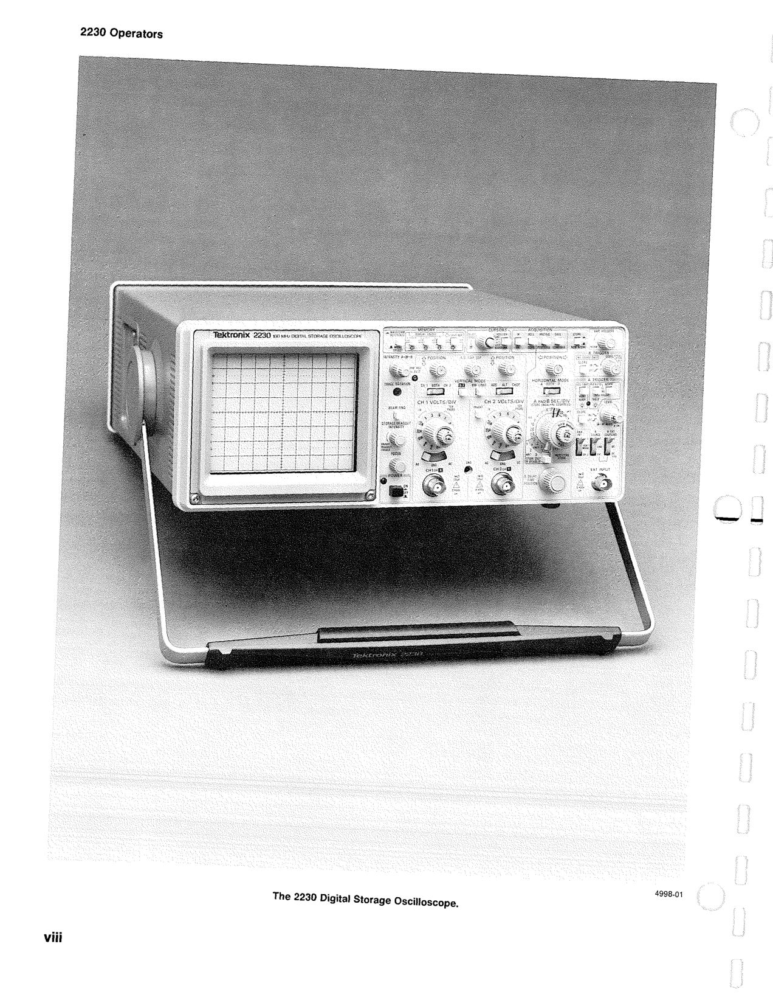

OCR text on this page

2230 Operators

--

The 2230 Digital Storage Oscilloscope. 4998-01

viii

<!-- page 13 of 188 -->

--

Section 1-2230 Operators

## GENERAL INFORMATION

### INTRODUCTION

The TEKTRONIX 2230 Oscilloscope is a combination nonstorage and digital storage dual-channel 100 MHz bandwidth instrument. It is a rugged, lightweight oscillo- scope featuring microprocessor operation and alphanumeric crt readout of many of the front-panel con- trols. In the digital storage mode, up to three waveform sets (CH 1 and/or CH 2) may be stored in a SAVE REF memory and recalled for display at a later time. The verti- cal system provides calibrated deflection factors from 2 mV per division to 5 V per division. The horizontal sys- tem provides calibrated sweep speeds from 50 ns per divi- sion to 0.5 s per division for nonstorage mode with three slower sweep speeds (1 s, 2 s, and 5 s per division) added for store mode operation. A X10 magnifier extends the maximum sweep speed to 5 ns per division.

The digital storage sampling rate is 20 megasamples per second maximum, and the acquired record length is 4K samples (1 K may also be selected) for a single channel or 2K samples for dual-channel (CHOP or ALT) displays. Any contiguous 1 K sample of an acquired record is displayable. The fast sampling rate can capture a glitch with a pulse width of at least 100 ns. A 4K compress feature enables a 4K record length acquisition to be compressed to 1 K in length for ease in viewing or storing in the SAVE REF memory. If compression is not desired, all 4K or any 1 K portion of a 4K record may be stored in the SAVE REF memory. The SAVE store mode stops the waveform acquisition in progress, allowing a particular display to be stored or examined before further acquisi- tions cause a waveform update.

Cursors may be used to obtain voltage measurements, time difference measurements, and delay-time measure- ments on any of the store mode waveform displays. Delta volts, delay time, delta time, and 1/delta time (either delta time or 1/delta time is selectable via the MENU) are displayed in the crt readout for ease in obtaining precise measurement results. The cursors are positioned to any displayed store mode waveform to make measurements. An alternate use of the cursor-positioning control is to hor- izontally position the 1 K display window to any location within a 4K record length waveform acquisition. The displayed portion of a 4K acquisition is stored when the SAVE REF feature is used.

The instrument is shipped with the following standard accessories:

1 Operators Manual 1 Users Reference Guide 2 Probe Packages 1 Front Panel Cover 1 Accessory Pouch 1 Power Cord 1 Fuse 1 DB-9 Male Connector and Connector Shell 1 Loop Clamp 1 Flat Washer 1 Self-Tapping Screw

For part numbers and further information about both standard and optional accessories, refer to ''Options and Accessories" (Section 7) of this manual. Your Tektronix representative, local Tektronix Field Office, or Tektronix products catalog can also provide additional accessories information.

### SPECIFICATION

The following electrical characteristics (Table 1-1) are valid when the instrument has been adjusted at an ambient temperature between +20°C and +30°C, has had a warm-up period of at least 20 minutes, and is operating at an ambient temperature between 0°C and

+50°C (unless otherwise noted).

Items listed in the "Performance Requirements" column are verifiable qualitative or quantitative limits that define the measurement capabilities of the instrument.

Environmental characteristics are given in Table 1-2. This instrument meets the requirements of MIL-T-28800C for Type Ill, Class 5 equipment, except where noted other- wise.

Physical characteristics of the instrument are listed in Table 1-3.

<!-- page 14 of 188 -->

General lnformation-2230 Operators

Finite resolution affects any measurement using discrete numbers. All digital storage stores amplitude values as discrete numbers and associates those ampli- tude numbers with discretely numbered times. Many mea- surements must be rounded or truncated. The size of the truncation or rounding becomes a part of the measure- ment error. For example, the following line is 1.5 units long. If it must be drawn as a line connecting points one unit apart, then it may be drawn as a line one unit long or two units long, depending on how it occurs relative to the points.

Case 1: Line approaches three points:

Input line Measurement resolution Output line

Case 2: Line approaches two points:

Input line Measurement resolution Output line

There are several places where measurements are quantified, and a one-count error in the measurement can- not be detected. The input channels are digitized to an 8- bit resolution, where one division is (ignoring expansion and compression) 25 counts. This means there is an inherent error of 1 /25 of a division in any voltage measure- ment at acquisition time. Averaging can increase the reso- lution of a voltage measurement above the sampler's eight-bit limit. To use the increased resolution, the display has a 10-bit dynamic range in the vertical axis, as well as

the horizontal axis. An averaged signal has a resolution of 100 points per division (ignoring expansion and compres- sion). In addition, the averaged number is stored with up to twelve bits of resolution. Expansion is required to view the eleventh and twelfth bits of increased resolution.

Time is quantified to determine when each sample occurred and which display interval gets each sample. Time is resolved by storing, for example, 4K points. If 4K points are stored, 4K time intervals are represented. How- ever, in 4K mode, not all of the 4K-point resolution may be displayed on the 10-bit (1 K-point) screen. Therefore, if 4K COMPRESS is selected to present the whole picture on- screen at once, only 1 K resolution remains in the display. When peak-detected information is acquired, events with high-frequency content such as fast steps, or short pulses, can only be located within the time interval from which the peaks came. Even though two display points result from the interval, the event cannot be tied with certainty to the first or second point in the interval.

Time is also quantified to determine where to put points in REPETITIVE acquisitions, where the points acquired at 50 ns intervals fill only part of the screen. A counting device produces a number to represent the portion of 50 ns between the samples acquired and the ones that would have included the trigger. This number ranges from 0 to about 205, which allows accurate placement into the display record. The display record will have at most 100 slots to choose from on the basis of the 0-205 number - ""'! (this is where each slot represents 0.5 ns of acquisition time, and the counter's resolution is about 0.244 ns per count).

<!-- page 15 of 188 -->

--

Characteristics

Table 1-1

Electrical Characteristics

General lnformation-2230 Operators

Performance Requirements

VERTICAL DEFLECTION SYSTEM

Deflection Factor

Range 2 mV/div to 5 V/div in a 1-2-5 sequence.

DC Accuracy (NON STORE)

+ 15°C to +35°C Within ±2%.

0°c to +50°C Within ±3%.

For 5 mV /div to 5 V /div VOL TS/DIV switch settings, the gain is set at a VOLTS/DIV switch setting of 10 mV/div.

2 mV /div gain is set with the VOL TS/DIV switch set to 2 mV /div.

On Screen DC Accuracy (STORE)

+15°C to +35°C Within ±2%.

0°C to +50°C Within ±3%.

STORE Mode gain set with the VOL TS/DIV switch set to 5 mV/div.

Storage Acquisition Vertical Resolution 8 bits, 25 levels per division. 10.24 divisions dynamic range.

Range of VOL TS/DIV Variable Control Continuously variable between settings. Increases deflection fac- tor by at least 2.5 to 1.

Step Response (NON STORE)

Rise Time

0°c to +35°C

5 mV/div to 5 V/div 3.5 ns or less.

2 mV/div 4.4 ns or less.

+35°C to +50°C

5 mV/div to 5 V/div 3.9 ns or less.

2 mV/div 4.4 ns or less.

Rise time is calculated from:

0.35 Rise Time=

Bandwidth (-3 dB)

Step Response (STORE Mode)

Useful Storage Rise Time Single Trace CHOP/ALT

SAMPLE SEC/DIV x 1.6 SEC/DIV x 1.6 s s 100 50

PEAKDET or ACCPEAK with SMOOTH SEC/DIV x 1.6 SEC/DIV x 1.6 s s 50 25

Rise time is limited to 3.5 ns minimum with derating over tempera- ture (see NON STORE Rise Time).

<!-- page 16 of 188 -->

General lnformation-2230 Operators

Table 1-1 (cont)

Characteristics Performance Requirements

Aberrations (NON STORE and STORE in Default Modes)

2 mV/div to 50 mV/div +4%, -4%, 4% p-p.

3% or less at 25°C with cabinet installed.

0.1 V/div to 0.5 V/div +6%, -6%, 6% p-p.

5% or less at +25°C with cabinet installed.

1 V/div to 5 V/div +12%, -12%, 12% p-p.

10% or less at +25°C with cabinet installed.

### Measured with a five-division reference signal, from a 50 n source

### driving a 50 n coaxial cable terminated in 50 n at the input con-

nector with the VOL TS/DIV Variable control in the CAL detent. Vertically center the top of the reference signal.

NON STORE Bandwidth (-3 dB)

0°c to +35°C

5 mV/div to 5 V/div DC to at least 100 MHz.

2 mV/div DC to at least 80 MHz.

+35°C to +50°C

2 mV /div to 5 V /div DC to at least 80 MHz.

Measured with a vertically centered six-division reference signal,

### from a 50 n source driving a 50 n coaxial cable terminated in 50 n

at the input connector; with the VOL TS/DIV Variable control in the CAL detent. -- NON STORE BW LIMIT (-3 dB) 20 MHz ±10%.

AC Coupled Lower Cutoff Frequency 10 Hz or less at -3 dB.

Useful Storage Performance

RECORD, SCAN and ROLL Store Modes

SAMPLE Acquisition, no AVERAGE Single Trace CHOP/ALT

10 5 5 µs/div to 5 s/div Hz Hz SEC/DIV SEC/DIV

EXT EXT EXT CLOCK (up to 1 kHz) --Hz -- Hz 10 20

Useful storage performance is limited to the frequency where there are 10 samples per sine wave signal period at the maximum sampling rate. (Maximum sampling rate is 20 MHz in Single trace and 10 MHz in CHOP or ALT at a SEC/DIV setting of 5 µs/div.) This yields a maximum amplitude uncertainty of 5%. Accuracy at the useful storage bandwidth limit is measured with respect to a six-division 50 kHz reference sine wave.

PEAK DETECT Single Trace and ALT CHOP

Sine-Wave Amplitude Capture 1 MHz 1 MHz (5% p-p maximum amplitude uncertainty)

Pulse Width Amplitude Capture 100 ns SEC/DIV (50% p-p maximum amplitude uncertainty) 50

<!-- page 17 of 188 -->

General lnformation-2230 Operators

Table 1-1 (cont)

Characteristics Performance Requirements

REPETITIVE Store Mode

SAMPLE and AVERAGE Single Trace ALT

0.05 µS/div 100 MHz (-3 dB)a 100 MHz (-3 dB)a

0.1 µS/div 100 MHz (-3 dB)a 50 MHz (-3 dB)

0.2 µs/div to 2 µs/div 10 5 (5% maximum amplitude uncertainty) Hz Hz SEC/DIV SEC/DIV

ACCPEAK

0.05 µs/div to 5 s/div Same as NON STORE Bandwidth.

AVERAGE Mode

Sweep Limit Adjustable from 1 to 2047 or NO LIMIT.

Weight of Last Acquisition 1/2, 1/4, 1/8, 1/16, 1/32, 1/64, 1/128, or 1/256 (MENU selections).

AVERAGE mode default weight is 1 /4.

Resolution Assuming uncorrelated triggers and greater than 1 LSB of the 8- bit acquisition of vertical signal noise; the averaging weight for the first acquistion is 1, the averaging weight for the second acquisi- tion is 1 /2 and for n acquisitions is 112n-1. The MENU selects the least weight used. Maximum signal-to-noise improvement is

### achieved after 2 x (weight factor) x (expected acquisitions to fill).

Frequency Response Frequency response of the A VERA GE Storage Mode is a function -- of the number of triggered acquisitions added to the weighted average.

Time jitter of a signal with respect to the sample clock will pro- duce a low-pass filter characteristic of an averaged waveform.

NON STORE CHOP Mode Switching Rate 500 kHz ± 30%.

STORE Chop Rate

SAMPLE 50/(SEC/DIV) for sweep speeds from 5 s per division to and including 10 µs per division.

PEAK DETECT 25/(SEC/DIV) for sweep speeds from 5 s per division to and including 20 µs per division.

5 µS/div through 0.05 µS/div No CHOP mode; acts as in ALT.

AID Converter Linearity Monotonic with no missing codes.

STORE Mode Cross Talk <2% measured in CHOP at 10 µs/div and 10 mV/div using a 100 kHz square wave signal vertically centered and the other input coupling set to ground.

80ne-hundred MHz bandwidth is derated for temperature outside 0°C to 35°C and at 2 mV/div VOLTS/DIV as for NON STORE.

<!-- page 18 of 188 -->

General lnformation-2230 Operators

Table 1-1 (cont)

Characteristics Performance Requirements

NON STORE Common-Mode Rejection Ratio At least 1 0 to 1 at 50 MHz. (CMRR)

Checked at 10 mV per division for common-mode signals of six divisions or less with the VOL TS/DIV Variable control adjusted for the best CMRR at 50 kHz.

Input Current 1 nA or less (0.5 division or less trace shift when switching between DC and GND input coupling with the VOL TS/DIV switch set to 2 mV per division.

Input Characteristics

Resistance 1 Mn ±2%.

Capacitance 20 pF ±2 pF.

Maximum Safe Input Voltage See Figure 1-1 for maximum input voltage vs frequency derating (CH 1 and CH 2) &

curve.

DC and AC Coupled

### 400 V (de + peak ac) or 800 V ac p-p at 10 kHz or less.

NON STORE Channel Isolation Greater than 100 to 1 at 50 MHz.

STORE Channel Isolation 100 to 1 at 50 MHz.

POSITION Control Range At least ± 11 divisions from graticule center.

A/8 SWP SEP Control Range ± 3.5 divisions or greater. (NON STORE Mode Only)

Trace Shift with VOL TS/DIV Switch Rotation 0.75 division or less; VOLTS/DIV Variable control in the CAL detent. - - Trace Shift as the VOL TS/DIV Variable Control is 1 division or less. Rotated

Trace Shift with INVERT 1.5 divisions or less.

<!-- page 19 of 188 -->

General lnformation-2230 Operators

Table 1-1 (cont)

Characteristics Performance Requirements

TRIGGERING SYSTEM

A Trigger Sensitivity

P-P AUTO and NORM 10 MHz 60 MHz 100 MHz

Internal 0.35 div 1.0 div 1.5 div

External 40 mV 120 mV 150 mV

External trigger signal from a 50 fl source driving a 50 fl coaxial cable terminated in 50 fl at the input connector.

HF REJ Coupling Reduces trigger signal amplitude at high frequencies by about 20 dB with rolloff beginning at 40 kHz ± 15 kHz.

Should not trigger with a one-division peak-to-peak 250 kHz sig- nal when HF REJ is ON.

P-P AUTO Lowest Usable Frequency 20 Hz with 1 division internal or 100 mV external.

TV LINE

Internal 0.35 div.

External 35 mV p-p.

TV FIELD ;,, 1 division of composite sync.

B Trigger Sensitivity (Internal Only) 10 MHz 60 MHz 100 MHz 0.35 div 1.0 div 1.5 div

EXT INPUT

Maximum Input Voltage &

### 400 V (de + peak ac) or 800 V ac p-p at 10 kHz or less.

-- See Figure 1-1 for maximum input voltage vs frequency derating curve.

Input Resistance 1 Mfl ±2%.

Input Capacitance 20 pF ± 2.5 pF.

AC Coupled Lower Cutoff Frequency

### 10 Hz or less at -3 dB.

LEVEL Control Range

A Trigger (NORM)

INT May be set at any voltage level of the trace that can be displayed.

EXT,DC At least ± 1.6 V, 3.2 V p-p.

EXT, DC+10 At least ± 16 V, 32 V p-p.

B Trigger (Internal) May be set at any point of the trace that can be displayed.

VAR HOLDOFF Control Increases NON STORE A Sweep holdoff time by at least a factor (NON STORE Holdoff) of 10.

STORE holdoff is a function of microprocessor activity and the pretrigger acquisition. The VAR HOLDOFF control maintains some control over the STORE holdoff by preventing a new trigger from being accepted by the storage circuitry until the next (or current, if one is in progress) NON STORE holdoff has completed.

Acquisition Window Trigger Point

PRETRIG Seven-eighths of the waveform acquisition window is prior to the trigger (other trigger points are selectable via the MENU).

POST TRIG One-eighth of the waveform acquisition window is prior to the trigger (other trigger points are selectable via the MENU).

<!-- page 20 of 188 -->

General lnformation-2230 Operators

Table 1-1 (cont)

Characteristics Performance Requirements

HORIZONTAL DEFLECTION SYSTEM

NON STORE Sweep Rates

Calibrated Range

A Sweep 0.5 sec per division to 0.05 µs per division in a 1-2-5 sequence of 22 steps.b

B Sweep 50 ms per division to 0.05 µs per division in a 1-2-5 sequence of 19 steps.b

STORE Mode Ranges

REPETITIVE 0.05 µs per division to 2 µs per division.c

RECORD 5 µs per division to 50 ms per division.c

ROLL/SCAN 0.1 s per division to 5 s per division (A sweep only).c

NON STORE Accuracy Unmagnified Magnified +15°C to +35°C

0.5 s/div to 0.1 µs/div Within ±2% Within ±3% 0.05 µs/div Within ±2% Within ±4%

0°c to +50°C

0.5 s/div to 0.1 µs/div Within ±3% Within ±4% 0.05 µS/div Within ±3% Within ±6%

Sweep accuracy applies over the center eight divisions. Exclude the first 40 ns of the sweep for magnified sweeps and anything beyond the 100th magnified division.

STORE Accuracy See Horizontal Differential Accuracy and Cursor Time Difference Accuracy. NON STORE Sweep Linearity

0.5 s/div to 10 ns/div Within ± 0.1 division. 5 ns/div Within ± 0.15 division.

Linearity measured over any two of the center eight divisions. Exclude the first 40 ns and anything past the 100th division of the X10 magnified sweeps.

Digital Sample Rate Single Trace CHOP/ALT SAMPLE 100 50 (5 µs/div to 5 s/div) Hz Hz SEC/DIV SEC/DIV

PEAKDET or ACCPEAK 10 MHz 10 MHz (20 µs/div to 5 s/div) (50% duty factor on each channel in CHOP)

REPETITIVE Store

0.05 µS/div to 1 µS/div 20 MHz 20 MHz

2 µS/div 10 MHz 10 MHz.

bThe X10 MAG control extends the maximum sweep speed to 5 ns per division.

cThe X10 MAG control extends the maximum sweep speed to 5 ns per division. The 4K COMPRESS control multiplies the SEC/DIV

by 4.

- -

<!-- page 21 of 188 -->

General lnformation-2230 Operators

Table 1-1 (cont)

Characteristics Performance Requirements

External Clock

Input Frequency Up to 1 kHz.

Digital Sample Rate 10 MHz in ACCPEAK and PEAKDET, otherwise it is equal to the input frequency.

Store Rate One data pair for every second falling edge.

Duty Cycle 10% or greater (100 µ,s minimum hold time).

Ext Clock Logic Thresholds TTL compatible.

Maximum Safe Input Voltage &

### 25 V (de + peak ac) or 25 V p-p ac at 1 kHz or less.

Input Resistance >20 kQ.

STORE Mode Dynamic Range 10.24 divisions.

STORE Mode Resolution

Acquisition Record Length 1024 or 4096 data points.

Single Waveform Acquisition Display 1024 data points (100 data points per division across the graticule area).

CHOP or ALT Acquisition Display 512 data points (50 data points per division across the graticule area).

Horizontal POSITION Control Range Start of the 10th division will position past the center vertical grat- (NON STORE) icule line; 100th division in X10 magnified.

Horizontal Variable Sweep Control Range -- NON STORE Continuously variable between calibrated settings of the SEC/DIV switch. Extends the A and the B Sweep speeds by at least a fac- tor of 2.5 times over the calibrated SEC/DIV settings.

STORE Horizontal Variable Sweep has no affect on the STORE Mode time base. Rotating the Variable SEC/DIV control out of the CAL detent position horizontally compresses a 4K point acquisition record to 1 K points in length, so that the whole record length can be viewed on screen. Screen readout is altered accordingly.

Displayed Trace Length

NON STORE Greater than 10 divisions.

STORE 10.24 divisions.

Delay Time

0.5 µ,s per division to 0.5 sec per division (A Sweep)

Delay POSITION Range

### Less than (0.5 div + 300 ns) to greater than 10 divisions.

Delay Time is functional, but not calibrated, at A Sweep speeds faster than 0.5 µ,s per division.

NON STORE Delay Jitter One part or less in 5,000 (0.02%) of the maximum available delay time.

<!-- page 22 of 188 -->

General lnformation-2230 Operators

Characteristics

Delay Time Differential Measurement Accuracy (Runs After Delay only)

+15°C to +35°C

0°c to +50°C

Table 1-1 (cont)

Performance Requirements

± 1 % of reading, ± 0.5% of full scale (10 div).

± 2% of reading, ± 0.5% of full scale (10 div).

Exclude delayed operation when the A and B SEC/DIV knobs are locked together at any sweep speed or when the A SEC/DIV switch is faster than 0.5 µ.s per division. Accuracy applies over the 8 DELAY TIME POSITION control range.

DIGITAL STORAGE DISPLAY

Vertical

Resolution 10 bits (1 part in 1024).

Display waveforms are calibrated for 100 data points per division.

Differential Accuracy Graticule indication of the voltage cursor difference is within 2% of the readout value, measured over the center six divisions.

POSITION Range Any portion of a stored waveform vertically magnified or compressed up to 10 times can be positioned to the top and to the bottom of the graticule area.

Position Registration

NON STORE to STORE Within ± 0.5 division at graticule center at VOL TS/DIV switch set- tings from 2 mV per division to 5 V per division.

CONTINUE to SAVE Within ± 0.5 division at VOL TS/DIV switch settings from 2 mV per division to 5 V per division.

SAVE Mode Expansion or Up to 10 times as determined by the remaining VOL TS/DIV Compression Range switch positions up or down.

2 mV per division acquisitions cannot be expanded, and 5 V per division acquisitions cannot be compressed.

Storage Display Expansion ± 0.1 % of full scale. Algorithm Error

Storage Display Compression +0.16% of reading ±0.4% of full scale. Algorithm Error

Horizontal

Resolution 10 bits (1 part in 1024).

Calibrated for 100 data points per division.

Differential Accuracy Graticule indication of time cursor difference is within ±2% of the readout value, measured over the center eight divisions.

SAVE Mode Expansion Range

Y-T Mode 10 times as determined by the X10 MAG switch.

Expansion Accuracy Same as the Vertical.

- -

<!-- page 23 of 188 -->

--

General lnformation-2230 Operators

Table 1-1 (cont)

Characteristics Performance Requirements

DIGITAL READOUT DISPLAY

CURSOR Accuracy

Voltage Difference

Time Difference

RECORD or ROLL/SCAN

SAMPLE or AVERAGE

PEAKDET or ACCPEAK

REPETITIVE

SAMPLE or AVERAGE

ACCPEAK

Within ± 3% of the tN readout value.

± 1 display interval.

± 2 display intervals.

±(2 display intervals + 0.5 ns).

±(4 display intervals + 0.5 ns).

A display interval is the time between two adjacent display points on a waveform.

X-Y OPERATION (X1 MAGNIFICATION ONLY)

Deflection Factors Same as vertical deflection system with the VOL TS/DIV Variable controls in the CAL detent position.

NON STORE Accuracy Measured with a dc-eoupled, five-division reference signal.

X-Axis

+15°C to +35°C Within ±3%.

0°C to +50°C Within ±4%.

Y-Axis Same as vertical deflection system.

NON STORE Bandwidth (-3 dB) Measured with a five-division reference signal.

X-Axis DC to at least 2.5 MHz.

Y-Axis Same as vertical deflection system.

NON STORE Phase Difference Between X-Axis ± 3 degrees or less from de to 150 kHz. and Y-Axis Amplifiers Vertical Input Coupling set to DC.

STORE Accuracy

X-Axis and Y-Axis Same as digital storage vertical deflection system.

Useful Storage Bandwidth

RECORD and REPETITIVE 5 Store Modes Hz SEC/DIV

STORE Mode Time Difference Between Y-Axis and X-Axis Signals

RECORD, SCAN, and ROLL Modes 100 ns. The X-Axis signal is sampled before the Y-Axis signal.

REPETITIVE Store SEC/DIV

X4 100

<!-- page 24 of 188 -->

General lnformation-2230 Operators

Characteristics

Output Voltage on PRB ADJ Jack

Probe Adjust Signal Repetition Rate

Sensitivity (NON STORE Only)

Maximum Input Voltage

Input Resistance

Line Voltage Range

Line Frequency

Maximum Power Consumption

Line Fuse

Primary Circuit Dielectric Requirement

Display Area

Standard Phosphor

Nominal Accelerating Voltage

Maximum Safe Applied Voltage, 'I' Any Connector Pin l..!J.

X and Y Plotter Outputs

Pen Lift/Down

Output Voltage Levels

Series Resistance

4.2 V Output

GPIB Requirements

RS-232-C Requirements

Baud Rates

Available Rates

Accuracy

Table 1-1 (cont)

Performance Requirements

PROBE ADJUST

0.5 V ±5%.

1 kHz ±20%.

Z-AXIS

5 V causes noticeable modulation. Positive-going input decreases intensity.

Usable frequency range is de to 20 MHz.

### 30 V (de + peak ac) or 30 V p-p ac at 1 kHz or less.

>10 kQ.

POWER SUPPLY

90 Vac to 250 Vac.

48 Hz to 440 Hz.

85 watts (150 VA).

2 A, 250 V, slow blow.

Routine test to 1500 Vrms, 60 Hz, for 10 seconds without break- down.

CRT DISPLAY

8cmx10cm.

P31.

14 kV.

X-Y PLOTTER OUTPUT

### 25 V (de + peak ac) or 25 V p-p ac at 1 kHz or less.

Fused relay contacts, 100 mA maximum.

500 mV per division ± 10%. Center screen is O V ± 0.2 division.

2 kQ ±10%.

4.2 V ± 10% through 2 kQ.

GPIB OPTION

Complies with ANSI/IEEE Standard 488-1978.

RS-232-C OPTION

Complies with EIA Standard RS-232-C.

110, 300, 600, 1800, and 2400 baud.

<1% error.

REV MAY 1988

--

<!-- page 25 of 188 -->

Characteristics

Environmental Requirements

Temperature

Operating

Nonoperating

Altitude

Operating

Nonoperating

Humidity

Operating and Nonoperating - ~

EMI (electromagnetic interference)

Vibration

Operating

Shock

Operating and Nonoperating

General lnformation-2230 Operators

Table 1-2

Environmental Characteristics

Performance Requirements

Instrument meets the requirements of Tektronix 2853-00, Class 5, except EMI. Standard 062-

The instrument meets the following MIL-T-28800C requirements for Type 111, Class 5 equipment, except where noted otherwise.

0°C to +50°C ( +32° F to + 122° F).

-55°C to + 75°C (-67°F to + 167°F).

Tested to MIL-T-28800C, para 4.5.5.1.3 and 4.5.5.1.4, except that in para 4.5.5.1.3 steps 4 and 5 are performed before step 2 (-55°C nonoperating test). Equipment shall remain off upon return to room ambient temperature during step 6. Excessive con- densation shall be removed before operating during step 7.

To 4,500 meters (15,000 feet). Maximum operating temperature decreases 1 °C per 1,000 feet above 5,000 feet.

To 15,000 meters (50,000 feet).

5 cycles (120 hours) referenced to MIL-T-28800C para 4.5.5.1.2.2 for Type 111, Class 5 instruments. Operating and nonoperating at 95%, -5% to +0%, relative humidity. Operating, +30°C to +50°C; nonoperating, +30°C to +60°C.

Meets radiated and conducted emission requirements per VOE 0871, Class B.

To meet EMI regulations and specifications, use the specified shielded cable and metal connector housing with the housing grounded to the cable shield on the AUXILIARY CONNECTOR.

15 minutes along each of three major axes at a total displacement of 0.015 inch p-p (2.4 g at 55 Hz) with frequency varied from 10 Hz to 55 Hz to 10 Hz in one-minute sweeps. Hold for 10 minutes at 55 Hz in each of the three major axes. All major reso- nances are above 55 Hz.

30 g, half-sine, 11 ms duration, three shocks per axis each direc- tion, for a total of 18 shocks.

<!-- page 26 of 188 -->

General lnformation-2230 Operators

Characteristics

Weight

With Power Cord, Cover, Probes, and Pouch

With Power Cord Only

Domestic Shipping Weight

Height

Width

With Handle

Without Handle

Depth

With Front Cover

Without Front Cover

With Handle Extended

VOLTS (DC PLUS PEAK AC l

400

300 1"- ~

Table 1-3

Physical Characteristics

Description

See Figure 1-2 for dimensional drawing.

9.4 kg (20.7 lb).

8.2 kg (18 lb).

12.2 kg (26.9 lb).

137 mm (5.4 in).

362 mm (14.3 in).

327 mm (12.9 in).

445 mm (17.5 in).

435 mm (17.1 in).

510 mm (20.1 in).

200

100 ~

50

20

10 10 KHz

~

~

50 KHz 100 KHz

FREQUENCY

~

500 KHz 1 MHz

12.5V I I

100 MHz

4207-28

Figure 1-1. Maximum input voltage vs frequency derating curve for CH 1 OR X, CH 2 ORY, and EXT INPUT connectors.

--

<!-- page 27 of 188 -->

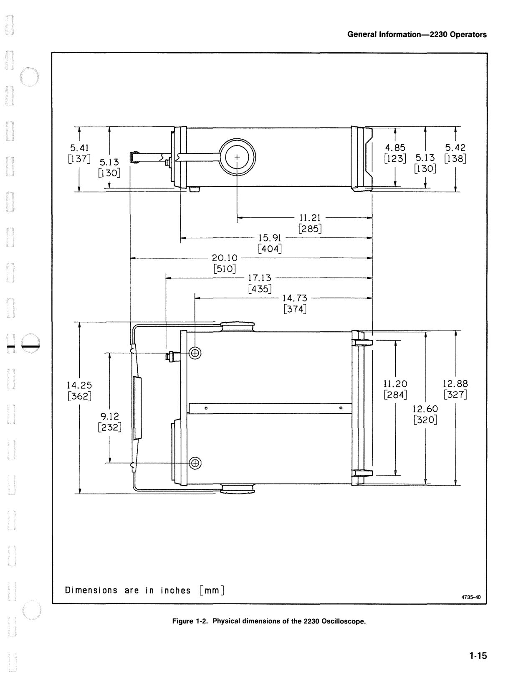

OCR text on this page

t 5 [1

.41 37]

14 [3

1

.25 62]

5.13 ID - [130]

t

I

I

9.12 [232]

l

>- I> 1 + 11, ~

\_J

### 20.10

[510]

-

111.L EB

J

0

~

@)

Dimensions are in inches [mm]

11. 21 [285]

### 15. 91

[404]

### 17.13

[435]

### 14.73

[374]

I

0

General lnformation-2230 Operators

) t l 4.85

### [123] 5.13

[130] 'i ! •

~l

### 11. 20

[284]

### 12.60

[320]

~--

f 5.4 2 8] [13

l

### 12.8 8

7] [32

4735-40

Figure 1-2. Physical dimensions of the 2230 Oscilloscope.

<!-- page 28 of 188 -->

OCR text on this page

--

<!-- page 29 of 188 -->

--

Section 2-2230 Operators

## PREPARATION FOR USE

### SAFETY

This part of the manual tells how to prepare for and to proceed with the initial start-up of the instrument.

Refer to the Safety Summary at the front of this manual for power source, grounding, and other safety con- siderations pertaining to the use of the instrument. Before connecting the oscilloscope to a power source, read entirely both this section and the Safety Summary.

### LINE VOLTAGE

This instrument is capable of continuous operation with input voltages that range from 90 V to 250 V with source voltage frequencies from 48 Hz to 440 Hz.

### POWER CORD

A detachable three-wire power cord with a three- contact plug is provided with each instrument for connect- ing to both the power source and protective ground. The power cord may be secured to the rear panel by a cord- set-securing clamp (see Figure 2-1 ). The protective-ground contact in the plug connects (through the protective- ground conductor) to the accessible metal parts of the instrument. For electrical-shock protection, insert this plug only into a power-source outlet that has a properly grounded protective-ground contact.

Instruments are shipped with the power cord specified by the customer. Available power-cord information is presented in Figure 2-2, and part numbers are listed in

"Options and Accessories" (Section 7). Contact your Tektronix representative or local Tektronix Field Office for additional power-cord information.

--- -~==~~~=~==!

CAUTION FOR CONTINUED FIRE PROTECTION REPLACE ONLY WITH SPEClf!EO TYPE ANO RATED FUSE. DISCONNECT POWER INPUT BEFORE REPLACING FUSE.

!LINE VOLTAGE RANGEi fUSE 250V I I 90.2sov AC I 2A SLOW I

00 NOT REMOVE COVER. REFER SERVICING TO QUALIFIED PERSONNEL.

POWER MAX WATTS 85 MAX VA 150 FREQUENCY 48-440Hz

CAUTION TO AVOID ELECTRIC SHOCK. THE POWER CORO PROTECTIVE GROUNDING CONDUCTOR MUST BE CONNECTED

TO GROUND.

EXT Z AXIS !NPUT lOKn. POSITIVE GOING INPUT DECREASES INTENSITY. 5 VOLT P-P CAUSES NOTICEABlE MODULA· TION AT NORMAL

INTENSITY

:;J•V PEAK

TEKTRONIX, INC. BEAVERTON. OREGON. U.S.A.

~ POWER CORD CLAMP

## \.:fl------ FLAT WASHER

## £.__ SELF-TAPPING SCREW

4998-02

Figure 2-1. Securing the detachable power-cord to the instrument.

<!-- page 30 of 188 -->

Preparation for Use-2230 Operators

Plug Line Reference Configuration Usage Voltage Standards '~

North ANSI C73.11 American 120V NEMA 5-15-P 120V/ IEC 83 15A ~

Universal

Euro 240V CEE (7).11,IV,VII 240V/ IEC 83 10-16A ~

UK BS 1363 it

240V/ 240V IEC 83 13A ~

Australian

240V/ 240V AS C112 10A ~

North ANSI C73.20 ~) '

American 240V NEMA 6-15-P 240V/ IEC 83 .• 0 15A ~

Switzerland 11/,,/''-. --- 220V/ 220V SEV '"'_/----..~ 6A

Abbreviations:

ANSI - American National Standards Institute AS - Standards Association of Australia BS - British Standards Institution CEE - International Commission on Rules for the Approval of Electrical Equipment IEC - International Electrotechnical Commission NEMA - National Electrical Manufacturer's Association SEV - Schweizevischer Elektrotechischer Verein

(2931-21 )4204-53

Figure 2-2. Optional power-cord data.

LINE FUSE

The instrument fuse holder is located on the rear panel (see Figure 2-3) and contains the line-protection fuse. The following procedure may be used either to verify that the proper fuse is installed or to install a replacement fuse.

1. Unplug the power cord from the power-input source (if plugged in).

2. Press in the fuse-holder cap and release it with a slight counterclockwise rotation.

3. Pull the cap (with the attached fuse inside) out of the fuse holder.

4. Verify that the proper fuse is installed (see the rear- panel fuse nomenclature).

CAUTION FOR CONTINUED FIRE PROTECTION REPLACE ONLY WITH SPECIFIED TYPE ANO RATED FUSE. OISCONNECT POWER INPUT BEFORE REPLACING FUSE.

LINE VOLTAGE RANGE FUSE 250V

90-250V AC

00 NOT REMOVE COVER. REFER SERVICING TO OUALIFIED PERSONNEL

POWER MAX WATTS 85

POWER

CORD CONNECTOR

2A SLOW

LINE FUSE

EXT Z AXIS INPUT 10Kn. POSITIVE GOING INPUT DECREASES INTENSITY. 5 VOLT P-P CAUSES NOTICEABLE MODULA- TION AT NORMAL

INTENSITY.

530V PEAK

4998-03

Figure 2-3. Fuse holder and detachable power-cord connector.

5. Reinstall the proper fuse in the fuse cap and replace the cap and fuse in the fuse holder by pressing in and giv- ing a slight clockwise rotation of the cap.

INSTRUMENT COOLING

To prevent instrument damage from overheated com- ponents, the covers and panels must be installed and ade- quate internal airflow must be maintained at all times. Before turning on the power, first verify that the covers and panels are in place and that both the fan exhaust holes on the rear panel and the air -intake holes on the side panel are free from any obstructions to airflow. After turning on the instrument, verify that the fan is exhausting air.

START-UP

The instrument automatically performs power-up tests of the digital portion of the circuitry each time the instru- ment is turned on. The purpose of these tests is to provide the user with the highest possible confidence level that the instrument is fully functional. If no faults are encountered during the power-up testing, the instrument will enter the

--

<!-- page 31 of 188 -->

--

normal operating mode. If the instrument fails one of the power-up tests, the instrument attempts to indicate the cause of the failure.

If a failure of any power-up test occurs, the instrument may still be useable for some applications, depending on the nature of the failure. If the instrument functions for your immediate measurement requirement, it may be used, but refer it to a qualified service technician for repair of the problem at the earliest convenience. Consult your service department, your local Tektronix Service Center, or your nearest Tektronix representative if additional assistance is required.

REPACKAGING

If this instrument is shipped by commercial transporta- tion, use the original packaging material. Unpack the instrument carefully from the shipping container to save the carton and packaging material for this purpose.

If the original packaging is unfit for use or is not avail- able, repackage the instrument as follows:

1. Obtain a corrugated cardboard shipping carton hav- ing inside dimensions at least six inches greater than the instrument dimensions and having a carton test strength of at least 275 pounds:

Preparation for Use-2230 Operators

2. If the instrument is being shipped to a Tektronix Service Center for repair or calibration, attach a tag to the instrument showing the following: owner of the instrument (with address), the name of a person at your firm who may be contacted if additional information is needed, complete instrument type and serial number, and a description of the service required.

3. Wrap the instrument with polyethylene sheeting or equivalent to protect the outside finish and prevent entry of packing materials into the instrument.

4. Cushion the instrument on all sides by tightly pack- ing dunnage or urethane foam between the carton and the instrument, allowing for three inches of padding on each side (including top and bottom).

5. Seal the carton with shipping tape or with an indus- trial stapler.

6. Mark the address of the Tektronix Service Center and your return address on the carton in one or more prominent locations.

<!-- page 32 of 188 -->

OCR text on this page

--

<!-- page 33 of 188 -->

--

Section 3-2230 Operators

## CONTROLS, CONNECTORS,

## AND INDICATORS

The following descriptions are intended to familiarize the operator with the location and function of the instrument's controls, connectors, and indicators.

### POWER AND DISPLAY

Refer to Figure 3-1 for location of items 1 through 9.

0

0

Internal Graticule-Eliminates parallax viewing error between the trace and the graticule lines. Rise-time amplitude and measurement points are indicated at the left edge of the graticule.

POWER Switch-Turns instrument power on or off. Press in for ON; press again for OFF.

## 0 Power On Indicator-Lights up while instrument is

operating.

## 0 FOCUS

Control-Adjusts for optimum display definition. Once set, proper focusing is maintained over a wide range of display intensity.

0

0

0

STORAGE/READOUT INTENSITY Control-Adjusts the brightness of the STORE mode displayed waveforms and the readout intensity in both STORE and NON STORE mode. The fully counterclockwise position of the control toggles the STORE/NON STORE readout on and off.

BEAM FIND Switch-Compresses the vertical and horizontal deflection to within the graticule area and intensifies the display to aid in locating traces that are overscanned or deflected outside of the crt view- ing area.

TRACE ROTATION Control-Permits alignment of the trace with the horizontal graticule line. This con- trol is a screwdriver adjustment that, once set, should require little attention during normal operation.

0

0

A INTENSITY Control-Adjusts the brightness of all NON STORE displayed waveforms. The control has no effect on the STORE mode displays or the crt readouts.

B INTENSITY Control-Adjusts the brightness of the NON STORE B Delayed Sweep and the Intensified zone on the A Sweep. The control has no effect on STORE mode displays or crt readouts.

### VERTICAL

Refer to Figure 3-2 for location of items 10 through 19.

## @ VOL TS/DIV Switches-Select the vertical channel

deflection factors from 2 mV to 5 V per division in a 1-2-5 sequence. The VOL TS/DIV switch setting for both channels is displayed in the crt readout. The VOL TS/DIV control settings for displayed waveforms containing cursor symbols are shown in the crt readout.

In STORE mode, SAVE waveforms and waveforms waiting to be updated between trigger events may be vertically expanded or compressed by up to a factor of 10 times (or as many VOL TS/DIV switch positions rerr;aining-whichever is less) by switching the corresponding VOL TS/DIV control (waveforms acquired at 2 mV/div cannot be expanded and waveforms acquired at 5 V /div cannot be compressed). The VOL TS/DIV readout reflects the vertical scale factor of the displayed waveform. If the VOL TS/DIV switch is switched beyond the available expansion or compression range, the readout is tilted to indicate that the VOL TS/DIV switch setting and the VOL TS/DIV readout no longer agree.

1X PROBE-Front-panel marking that indicates the deflection factor set by the VOL TS/DIV switch when a X1 probe or a coaxial cable is attached to the channel input connector.

10X PROBE-Front-panel marking that indicates the deflection factor set by the VOL TS/DIV switch when a properly coded 1 OX probe is attached to the channel input connector.

<!-- page 34 of 188 -->

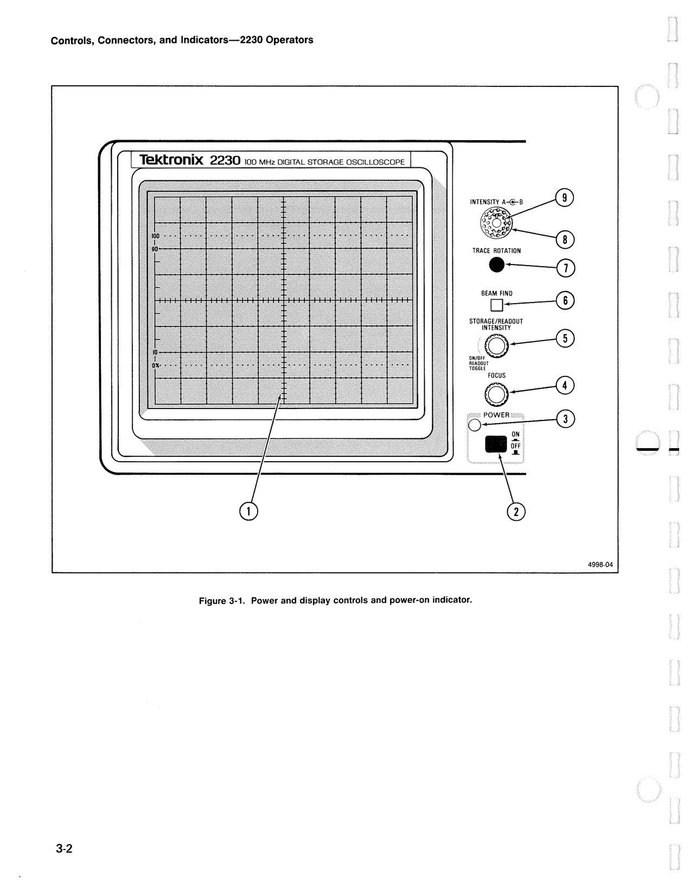

OCR text on this page

Controls, Connectors, and lndicators-2230 Operators

### Tektronix 2230 100 MHz DIGITAL STORAGE OSCILLOSCOPE

.--(j)

BE•I ~

STORAGE/READOUT

INTENSITY--©

ON/OFFO

5

READOUT

## TOGGLE 5---0

POWER · ,;;\J o-... ---""\V

ON .i

Figure 3-1. Power and display controls and power-on indicator.

4998-04

<!-- page 35 of 188 -->

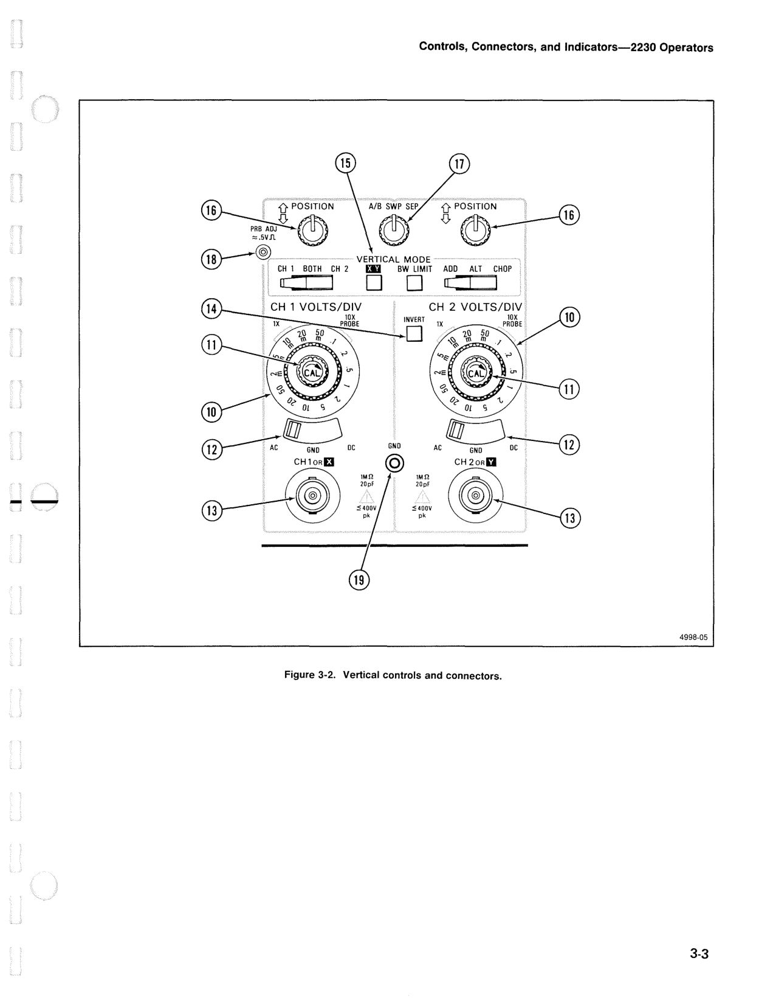

OCR text on this page

--

1X~@~O I PROBE it,'~ ~

NE CJ"I

0 - ~~ ;90 '\, ~ "01 S ~ ~ GNO OC ~

lM!l 10pf

GNO @

Controls, Connectors, and lndicators-2230 Operators

lM!l 20pF

:5400V

pk

4998-05

Figure 3-2. Vertical controls and connectors.

<!-- page 36 of 188 -->

Controls, Connectors, and lndicators-2230 Operators

@

If properly coded probes (1 X, 1 OX, or 1 OOX, see Table 3-1) are connected to a channel input connec- tor, the crt VOL TS/DIV readout will reflect the correct deflection factor of the display.

Probe

1X

10X

100X

IDENTIFY

Table 3-1 Probe Coding

Coding Resistance

Infinite

11 kn ± 10%

5.6 kn -10% to 6.2 kn +10%

O n or none of the above

Variable VOL TS/DIV Controls-Provide continu- ously variable uncalibrated deflection factors between the calibrated positions of the VOL TS/DIV controls. The VOL TS/DIV sensitivity is reduced by up to at least 2.5 times the sensitivity at the fully counterclockwise position of the variable knob. A detent at the fully clockwise position indicates the calibrated VOL TS/DIV position of the variable knob. The uncalibrated condition is indicated by a greater- than symbol (>) in front of the affected VOL TS/DIV readout.

## @ AC-GND-DC (Input Coupling) Switches-Select the

method of coupling the input signal to the CH 1 and CH 2 vertical amplifiers and the storage acquisition system.

AC-Capacitively couples the input signal to the vertical deflection and signal acquisition systems. The DC component of the input signal is blocked. The lower -3 dB bandpass is 10 Hz or less. Selection of AC input coupling is indicated in the readout by a tilde symbol (N ) over the V on the associated channel's VOL TS/DIV readout.

GND-Grounds the input of the vertical amplifier; provides a zero (ground) reference voltage display (does not ground the input signal). In STORE mode, the ground reference is acquired and displayed in the first sample location of the acquisition waveform display. When GND input coupling is selected, a ground symbol is displayed in the associated VOL TS/DIV readout.

DC-All frequency components of the input signal are coupled to the vertical deflection and signal acquisition systems. When DC input coupling is selected, no additional indicators are displayed with the associated VOL TS/DIV readout.

## @ CH 1 OR X and CH 2 OR Y Input Connectors-

Provide for application of signals to the inputs of the vertical deflection system and the storage acquisition system.

Coding-ring contacts on each of the input connec- tors are used to automatically switch the scale factor displayed by the crt readout when a properly coded probe is attached to the input connector. Displayed STORE mode waveforms are reformatted to main- tain the correct deflection as indicated by the VOL TS/DIV readout on the affected channel(s). In X-Y mode, the signal connected to the CH 1 OR X input controls the horizontal deflection, and the sig- nal connected to the CH 2 OR Y input controls the vertical deflection.

CH 2 INVERT Switch-Inverts the Channel 2 display and STORE mode Channel 2 acquisition signal when pressed in. An invert symbol (l) is displayed with the CH 2 VOL TS/DIV readout when CH 2 is inverted. With CH 2 inverted, the oscilloscope may be operated as a differential amplifier when the Vertical MODE of BOTH-ADD is selected.

## ® VERTICAL MODE Switches-Select the mode of

operation for the vertical amplifier. There are two three-position switches and one two-position switch that determine display and acquisition modes and one two-position push-button switch that controls the nonstore bandwidth.

CH 1-Selects only the Channel 1 input signal for acquisition or display.

BOTH-Selects a combination of Channel 1 and Channel 2 input signals for acquisition or display. The CH 1-BOTH-CH 2 switch must be in the BOTH position for ADD, ALT, and CHOP opera- tion.

CH 2-Selects only the Channel 2 input signal for acquisition or display.

ADD-Displays (NON STORE) or acquires and then displays (STORE) the sum of the Channel 1 and Channel 2 input signals when BOTH is also selected. The difference of the Channel 1 and Channel 2 input signals is displayed (NON STORE) or acquired and then displayed (STORE) when the Channel 2 signal is inverted.

ALT -Alternately displays the nonstore Channel 1 and Channel 2 input signals. The nonstore alter- nation occurs during retrace at the end of each sweep. ALT Vertical MODE is most useful for

--

<!-- page 37 of 188 -->

acquiring and viewing both channel input signals at sweep rates of 0.5 ms per division and faster. Channel 1 and Channel 2 STORE mode signals are acquired on alternate acquisition cycles at one-half the sampling rate of a single-channel acquisition.

CHOP-Switches the nonstore display between the Channel 1 and Channel 2 vertical input sig- nals during the sweep. The chopped switching rate for NON STORE mode (CHOP frequency) is approximately 500 kHz. Chopped STORE mode signals are acquired on alternate time-base clock cycles with each channel being acquired at one- half the sampling rate of a single-channel acquisi- tion. In STORE mode at sweep speeds of 5 µs per division or faster, CHOP becomes ALT mode.

BW LIMIT Switch-When pressed in while in NON STORE mode, the bandwidth of the vertical amplifier system and the A Trigger system is lim- ited to approximately 20 MHz. This reduces interference from unwanted high-frequency sig- nals when viewing low-frequency signals. In STORE mode, pressing in the BW LIMIT switch reduces only the trigger bandwidth. Press the switch a second time to release the switch and regain full bandwidth.

X-Y Switch-Automatically selects X-Y mode when pressed in. The CH 1 input signal provides - - horizontal deflection for X-Y displays, and the CH 2 input signal provides vertical deflection. In STORE mode, CH 1 and CH 2 signals are acquired in a chopped manner with no more than 100 ns between corresponding sample points on opposite channels, with the CH 1 signal being sampled before the CH 2 signal. The sampling mode and sampling rate are controlled by the A or the B SEC/DIV switch (depending on the Hor- izontal Display mode). The X-Y waveform is acquired in SAMPLING mode and displayed with dots. Set the SEC/DIV controls to obtain at least

10 samples per cycle of the highest frequency component in both the X and the Y input signals. The sampling rate is determined by the formula 50/(SEC/DIV) Hz.

## @ Vertical POSITION Controls-Control the vertical

display position of the CH 1 and CH 2 signals.

In STORE mode, the controls determine the vertical position of displayed waveforms during acquisition and in SAVE mode. Any portions of a signal being acquired that are outside the dynamic range of the AID converter are blanked when positioned on screen. The Vertical POSITION controls can also reposition a vertically expanded SA VE waveform so that portions of the waveform outside the graticule area can be observed.

Controls, Connectors, and lndicators-2230 Operators

In NON STORE X-Y mode, the CH 2 POSITION con- trol vertically positions the display, the horizontal POSITION control positions the display horizontally, and the CH 1 POSITION control is not active. In STORE mode, both the CH 1 POSITION control and the Horizontal POSITION control affect the horizon- tal position of the displayed waveform.

## @ A/B SWP SEP Control (NON STORE only)-While

in NON STORE mode, vertically positions the B Sweep trace with respect to the A Sweep trace when the HORIZONTAL MODE is BOTH.

PRB ADJ Connector-Provides an approximately 0.5 V, negative-going, square-wave voltage (at approximately 1 kHz) for compensating voltage probes and checking the operation of the oscilloscope's vertical system. It is not intended to verify the accuracy of the vertical gain or the hor- izontal time-base circuitry.

## @ GND Connector-Provides an auxiliary ground con-

nection directly to the instrument chassis via a banana-tip jack.

### HORIZONTAL

Refer to Figure 3-3 for location of items 20 through 26.

## @ SEC/DIV Switches-Determine the SEC/DIV setting

for both the NON STORE sweeps and the STORE mode waveform acquisitions. To obtain calibrated A and B NON STORE sweeps, the Variable SEC/DIV control must be in the CAL detent.

In STORE mode, the SEC/DIV switches determine the default acquisition and display modes, set the sampling rate, and establish the seconds-per-division scale factor of the displayed waveforms. The SEC/DIV parameters displayed on the crt readout are for the waveforms identified by CURSORS.

Table 3-2 lists the default Storage and Display modes with respect to the SEC/DIV switch setting and the selected Trigger mode. The default modes may be changed by selecting the Acq Mode Setup Table in the menu. Waveforms of SCAN, and ROLL displays are updated one data point at a time. All data points of a RECORD display are updated at the same time (total record replacement).

<!-- page 38 of 188 -->

Controls, Connectors, and lndicators-2230 Operators

A SEC/DIV Switch-Selects the calibrated A Sweep rates from 0.5 s to 0.05 µs/div in a 1-2-5 sequence of 22 steps for the A Sweep generator and sets the delay time scale factor for delayed- sweep operation.

In STORE mode, the A SEC/DIV switch controls the default Storage, Acquisition, Process, and Display modes when making acquisitions using the A Time Base. It also selects the external clock signal, from the EXT CLK input, for the storage acquisition circuitry.

B SEC/DIV Switch-Selects the calibrated B Sweep rates from 50 ms/div to 0.05 µs/div in a 1-2-5 sequence of 19 steps.

In STORE mode, the B SEC/DIV switch controls the default Storage, Acquisition, Process, and Display modes when making acquisitions using the B Horizontal mode.

UNTRIGGERED mode performs acquisitions without reference to the trigger circuit, and there is no trigger marker on the screen. Triggers are ignored in STORE mode at SEC/DIV settings of 5 s per division to 0.1 s per division under the following conditions:

ROLL is selected. Selecting ROLL forces the screen to continuously update as on a chart recorder. Triggers would stop the display. ROLL is operational at sweep speeds slow

Table 3-2

Default Digital Storage Modes

UN-TRIG8 TRIGb SLOW RECORD 5 s to 0.1 s 5 s to 0.1 s 50 ms to 20 11s

or EXT CLK or EXT CLK

SAMPLEc OFF OFF OFF

AVERAGEc OFF OFF

ACCPEAKc OFF OFF

PEAKDETc ON ON ON

SMOOTHd ON ONe ON

VECTORS ON ON ON

8See the "UNTRIGGERED" discussion.

bSee the "TRIGGERED" discussion.

crhese Storage modes are mutually exclusive.

dWorks with ACCPEAK and PEAKDET only.

~Functions with PEAKDET only.

¢'~:-@

: A BOTH B i 24

..• ,HORIZONTAL M::i---@DE··,

i

## II I I

i

sec 5 '.>~t;ir;r'ive

## STOREONLY•~,·

### . · . ".·.sr.o.a .. E

.. ····.' .. ·.···•.·. 8 OISABLEO '1.:<1:1·>,'

### BDELAYog·o·-·-,

21 TIME ,

## POSITION -~

-- 4998-06

Figure 3-3. Horizontal controls.

FAST RECORD REPETITIVE 10 µS to 5 µS 2 µS to 0.05 µS

ON OFF

OFF ON

OFF OFF

OFF OFF

ON DOTS only

<!-- page 39 of 188 -->

--

enough that the acquisition can manually be stopped when events of interest are observed.

P-P AUTO is selected. P-P AUTO provides a baseline in the absence of triggers from the input signal. The circuit considers the absence of triggers to be about half of a second without a trigger. Below 50 ms per division, the triggers are prevented for longer than that by the sweep time itself, therefore triggers are ignored.

TRIGGERED mode performs triggered acqu1s1- tions in STORE mode at SEC/DIV settings of 5 s per division to 0.1 s per division when triggers can be meaningful. Triggers are meaningful in SCAN mode if the A TRIGGER mode is NORM or SGL SWP. Triggers are not meaningful in ROLL mode or in the A TRIGGER Mode of P-P AUTO.

REPETITIVE Store mode (2 µs/div to 0.05 µs/div) requires a repetitive trigger signal. Sampling occurs at the maximum A/D conversion rate. If a control affecting an acquisition parameter or func- tion is changed, the acquisition is reset, and the waveform being acquired is cleared on the next sample acquired. On each valid trigger, 10 or more equally spaced samples are acquired and displayed on the waveform record, depending on the SEC/DIV setting (see Table 3-3). The random time delay from the trigger to the following sam- ple clock transition is measured by the Clock Delay Timer circuit and used to place the acquired waveform samples in the correct display memory location. Any display location is equally likely to be filled. Table 3-3 gives the statistically expected number of trigger events required to completely fill the display, assuming a uniform distribution of trigger events relative to the sample interval.

FAST RECORD Storage mode (5 µs/div to 10 µs/div) updates a full record of the acquired waveform.

SLOW RECORD Storage mode (20 µs/div to 50 ms/div) updates a full record of the acquired waveform.

SCAN Storage mode (for NORM TRIGGER mode and 0.1 s/div to 5 s/div or EXT CLOCK) updates pretrigger data when a trigger is received. The waveform display then scans to the right from the trigger point to finish the post-trigger acquisition and then freezes.

Controls, Connectors, and lndicators-2230 Operators

SCAN Storage mode (for P-P AUTO TRIGGER mode with auto triggers disabled and 0.1 s/div to 5 s/div or EXT CLOCK) continuously updates the display serially as each data point is acquired. It writes over previous data from left to right.

ROLL Storage mode (P-P AUTO TRIGGER mode and 0.1 s/div to 5 s/div or EXT CLOCK) continu- ously acquires and displays signals. Triggers are disabled. The waveform display scrolls from right to left across the crt with the latest samples appearing at the right edge of the crt.

SCAN-ROLL-SCAN Storage mode (SGL SWP TRIGGER mode and 0.1 s/div to 5 s/div or EXT CLOCK) serially updates the display. The waveform display SCANS left to right until the pretrigger record is filled, and then_ ROLLS right to left until a trigger is received. It then SCANS left to right again to fill the post-trigger acquisition record and then freezes (see SGL SWP descrip- tion for further details).

PEAKDET Acquisition mode digitizes and stores, in acquisition memory as a data pair, the minimum and maximum levels of the input signal within the time represented by 1/50 of a division UN-MAG (1/25 division in CHOP or ALT).

SAMPLE samples the signal at a rate that pro- duces 100 samples per graticule division. In the RECORD Sampling modes, the displayed sample points are displayed by vectors or dots. For REPETITIVE Store mode, the sample points are displayed as dots.

Table 3-3 Repetitive Store Sampling Data Acquisition

SEC/DIV Samples Per Expected

Switch Acquisition Acquisitions

Setting Per Waveform8

1K 4K 1 2

Mode Mode Channel Channels

0.05 µS 10 40 519 450

0.1 µS 20 80 225 191

0.2 µS 40 160 96 83

0.5 µS 100 400 30 23

1 µS 200 800 12 11

2 µS 200 800 12 11

8Expected acquisitions per waveform for a 50% probability of fill.

<!-- page 40 of 188 -->

Controls, Connectors, and lndicators-2230 Operators

®

AVERAGE Acquisition mode can be used for mul- tiple record averaging. A normalized algorithm is used for continuous display of the signal at full amplitude during the averaging process. The amplitude resolution increases with the number of weighted acquisitions included in the display. The default mode for REPETITIVE Store mode is AVERAGE. The averaging weight (the number of weighted waveform acquisitions included in each average display) is MENU selectable. The default average weight is 1 /4. The number of sweeps (SWP LIMIT) allowed to occur before averaging stops is also MENU selectable. The averaging process is reset by changing any control that causes an acquisition reset.

ACCPEAK Acquisition mode causes accumulation of peaks over multiple acquisitions. The largest maximum and smallest minimum samples are retained for each trigger-referenced acquisition record. For 20 µS per division to 5 s per division, hardware peak detection is used, updating max- imum and minimum samples within each time base clock period. The ACCPEAK display is reset by changing any control that causes an acquisi- tion reset. ACCPEAK mode is valid for triggered acquisitions only and is not operational in untrig- gered modes (see Table 3-2).

SMOOTH Processing mode reorders acquired data for correct slope and interpolates the data for drawing a smooth waveform. Smoothing looks at the change in data point values between adja- cent sample intervals. If the change in value does not exceed certain limits, the values are inter- preted as a continuous slope for drawing vectors or dots. If the value change exceeds the inter- preted "no-change" limit, the data point value is not modified, and the vectors drawn in the display will show a discontinuity in the waveform. This method of display of the waveform data provides a smoothed display of the waveform, yet retains the glitch-catching capabilities of PEAKDET or ACCPEAK modes.

STORE Mode A SEC/DIV Multiplier-Functions only in the STORE mode at SEC/DIV switch settings of 0.1, 0.2, and 0.5 s/div. When pressed in, the A Sweep time base of these three settings is increased by a factor of 10 to 1 s/div, 2 s/div, and 5 s/div. Releasing the button returns the STORE mode time base to X1. The X10 MAG control is still functional on waveforms acquired at the slow STORE mode SEC/DIV settings.

## @ Variable SEC/DIV and 4K COMPRESS Control-

Controls the NON STORE sweep time per division and compresses STORE mode waveform records.

@

Variable SEC/DIV-Continuously varies the uncalibrated NON STORE sweep time per division to at least four times the calibrated time per divi- sion set by the SEC/DIV switch (increases the slowest NON STORE A Sweep time per division to at least 2 s). The Variable SEC/DIV control does not affect the storage time base for acquir - ing or displaying signals.

4K COMPRESS-If the Variable SEC/DIV control is rotated out of the CAL detent position during waveform acquisitions or SAVE mode, a 4K record is compressed by a factor of four (4K COMPRESS) to display the acquired data in one display window. For 4K COMPRESS the SEC/DIV is further multiplied by 4. In PEAKDET or ACCPEAK acquisition modes, peaks are acquired but not displayed when 4K COMPRESS is selected.

X10 Magnifier Switch-Magnifies the NON STORE displays or expands the STORE acquisition and SAVE waveform displays by 10 times. STORE mode displays are expanded when the Variable SEC/DIV knob is pulled to the out position (X10 PULL). The SEC/DIV scale factor readouts are adjusted to correspond to the correct SEC/DIV of the displayed waveform (either NON STORE or STORE). Magnification of the NON STORE displays occurs around the center vertical graticule division; STORE mode displays are expanded around the active CUR- SOR. The display window for STORE mode X10 expanded waveforms may be positioned using the CURSORS Control to view any one-window portion of the acquisition record.

## @ HORIZONTAL

MODE Switch-Determines the operating mode of the horizontal deflection system in both NON STORE and STORE. For STORE mode, the switch selects the acquisition time base and storage mode (either A SEC/DIV or B SEC/DIV).

A-Only the A Sweep is displayed. NON STORE time base and STORE acquisitions are controlled by the A SEC/DIV switch. The A SEC/DIV switch setting is displayed on the crt readout.

BOTH-Alternates the NON STORE display between the A Intensified and B Delayed Sweeps.

--

<!-- page 41 of 188 -->

@)

--

@)

The STORE mode display is the A Intensified trace only. The intensified zone on the A trace indicates the approximate delay position and length of the B Delayed Sweep. The displayed position of the intensified zone is updated after each trigger. The A SEC/DIV, B SEC/DIV, and B DELAY TIME POSITION settings are displayed on the crt readout. In BOTH, STORE mode acquisitions are controlled by the A SEC/DIV switch.

B-Displays either the NON STORE or the STORE B Sweep trace. The A SEC/DIV, B SEC/DIV, and B DELAY TIME POSITION settings are displayed on the crt readout, just as in BOTH. The STORE mode waveform acquisitions are con- trolled by the B SEC/DIV switch.

B DELAY TIME POSITION Control-Adjusts the delay between the start time of the A Sweep and the time that the B Sweep either starts (RUNS AFTER DL Y) or can be triggered (Triggerable After Dly). (The A Sweep does not have to be displayed.) The delay time is variable from 0.5 to 10 times the A SEC/DIV, plus 300 ns.

In Triggerable After Delay, the delay time readout indicates the time that must elapse after the A trigger before the delayed sweep or delayed acquisi- tion can be triggered; not the actual position of the trigger point. However, the readout of the delay time on the crt follows the setting of the B DELAY TIME POSITION control in either B Trigger mode.

The setting of the 1 K/4K switch affects the delay time position setting for STORE mode displays by a factor of approximately four times. When switching between 1 K and 4K record lengths, the delay time position setting must be readjusted to obtain the same delay time.

Horizontal POSITION Control-Positions all the NON STORE waveforms horizontally over a one- sweep-length range (either X1 or X10 Magnified). Using the Horizontal POSITION control, STORE mode waveforms may be positioned over a range of only one display window. When a STORE mode acquisition display is longer than one screen (as in 4K records and/or X10 MAG), the CURSORS POSI- TION control is used to position the display window to any position of the acquisition record. The Hor- izontal POSITION control does not position the crt readout displays.

Controls, Connectors, and lndicators-2230 Operators

TRIGGER

Refer to Figure 3-4 for location of items 27 through 38.

NOTE

The Trigger controls affect the acquisition of the next waveform. They are inactive in SA VE Acquisi-

tion mode.

## @ A TRIGGER Mode Switches-Determine the NON

STORE A Sweep triggering mode. STORE mode triggering depends on the position of the A SEC/DIV, the SCAN/ROLL switch, and the A Trigger mode. The trigger position is marked by a T on acquired waveforms.

"" ""'"'ff J

### NORMO~

B TRIGGER INT SOURCE ONL y LEVEL \'rm

### ®----:LOPE IN:""\_ ff1r\\ Oll

### ~ouT:_r-~

## ATRIGGER ~

SGLSWP P-PAUTOl NORM. JJ

## • nTvn

Ld,LINE~

TV FIELO

TRIG·o _· _ Q _., ,_ LEVEL (ii\ s:~;E ,9~ O' '{i:~ . I ~DIN:~ ~,~

## e-HF REJECT}~~ I ~

A&B A A EXT ~ 8

## INT CH 1 8

S0UR~!jCOUPL~~G--r--@

i~ii LINE OC

CH 2 EXT OC

IM!l 20pf

:::4•0V

pk

+10

EXT INPUT

@~

4998-07

Figure 3-4. Trigger controls, connector, and indicator.

<!-- page 42 of 188 -->

Controls, Connectors, and lndicators-2230 Operators

NORM-Permits triggering at all sweep rates (an autotrigger is not generated in the absence of an adequate trigger signal). NORM Trigger mode is especially useful for low-frequency and low- repetition-rate signals.

In STORE mode, the last acquired waveform is held on display between triggering events. The pretrigger portion of the acquisition memory is continually acquiring new pretrigger data until a trigger event occurs. How the waveform display is updated after the trigger occurs, depends on the SEC/DIV setting. From 5 s per division to 0.1 s per division, the pretrigger portion of the displayed waveform is updated by the pretrigger data in the acquisition memory, then the post- trigger data points are placed in the display as they are acquired. For faster sweep speeds, the post-trigger data points are acquired in the acquisition memory prior to completely updating the waveform display, using the newly acquired data.

P-P AUTO-TV LINE-In NON STORE mode, triggering occurs on trigger signals having ade- quate amplitude and a repetition rate of about 20 Hz or faster. In the absence of a proper trigger signal, an autotrigger is generated, and the sweep free runs.

In STORE mode, for SEC/DIV settings of 5 s per division to 0.1 s per division, the P-P AUTO trigger mode is disabled, and the acquisition free- runs. At faster SEC/DIV settings, triggered acquisitions occur under the same conditions as NON STORE mode P-P AUTO triggering, and the acquisition free-runs if proper triggering conditions are not met. The manner in which the display is filled and updated is the same as for NORM triggering.

For either NON STORE or STORE mode, the range of the A TRIGGER LEVEL control is automatically restricted to the peak-to-peak limits of the trigger signal for ease in obtaining trig- gered displays and acquisitions. P-P AUTO is the usual Trigger mode selection to obtain stable displays of TV Line information.

TV FIELD-Permits stable triggering on a televi- sion field (vertical sync) signal when the P-P AUTO and the NORM Trigger buttons are pressed in together. In the absence of an ade- quate trigger signal, the sweep (or acquisition) free-runs. The instrument otherwise behaves as in P-P AUTO.

@

SGL SWP-Arms the A Trigger circuit for a single sweep in NON STORE or a single acquisition in STORE. Triggering requirements are the same as in NORM Trigger mode. After the completion of a triggered NON STORE sweep or a STORE SGL SWP acquisition, pressing in the SGL SWP but- ton rearms the trigger circuitry to accept the next triggering event or start the next storage acquisi- tion.

In STORE mode, when the SGL SWP is armed, the acquisition cycle begins, but the READY LED does not come on until the pretrigger portion of the acquisition memory is filled. At the time the READY LED comes on, the acquisition system is ready to accept a trigger. When a trigger event occurs, the post-trigger waveform data is stored to complete the single-sweep acquisition. After the acquisition is completed, the READY LED goes out, and the single sweep can be rearmed.

The SEC/DIV switch setting and the STORE mode determine how the display is updated. For settings of 5 s per division to 0.1 s per division, a storage process known as SCAN-ROLL-SCAN is used. The last acquired waveform is erased when SGL SWP is armed, then the pretrigger acquisi- tion scans from the left edge to the trigger posi- tion. At that point, the pretrigger portion of the display is rolled left from the trigger position until a triggering event occurs. Upon receiving an ade- quate trigger, the post-trigger portion of the display scans from the trigger point to the right until the remaining data points are filled, and then the display freezes.

For SEC/DIV settings of 50 ms to 5 µS (RECORD store mode}, the display is updated as a full record. The previously displayed waveform remains on the crt until the post-trigger portion of the acquisition memory is filled. The waveform display is then updated with the newly acquired data in its entirety. For SEC/DIV settings of 2 µs

to 0.05 µs (REPETITIVE store mode), a partial record is acquired each time the SGL SWP button is RESET, overlaying the samples accumulated from past acquisitions.

READY-TRIG'D Indicator-A dual-function LED indicator. In P-P AUTO and NORM Trigger modes, the LED is turned on when triggering occurs. In SGL SWP Trigger mode, the LED turns on when the A Trigger circuit is armed, awaiting a triggering event, and turns off again after the single sweep (or acquisition) completes.

In STORE mode, pressing the SGL SWP button to arm the trigger circuitry does not immediately turn on the READY LED. The pretrigger portion of the acquisition memory starts filling after the SGL SWP

--

<!-- page 43 of 188 -->

--

button is pressed in; the READY LED is turned on when the filling is completed. The storage acquisition system is then ready to accept a triggering event. The READY LED is turned off after an acquisition is completed.

## @ A TRIGGER LEVEL Control-Selects the amplitude

point on the A Trigger signal that produces trigger- ing. The trigger point for STORE mode is identified by a T on the acquired waveform.

## @ HF REJECT Switch-Rejects (attenuates) the high-

frequency components (above 40 kHz) of the trigger signal when the control is in the ON posiltion.

## @ A TRIGGER SLOPE Switch-Selects either the

positive or negative slope of the trigger signal to start the NON STORE A Sweep or to reference the next STORE mode acquisition cycle.

## @ A&B INT Switch-Determines the source of the

internal trigger signal for both the A and the B Trigger Generator circuits.

CH 1-Trigger signal is obtained from the CH 1 input.

VERT MODE-Trigger signal is obtained alter- nately from the CH 1 and CH 2 input signals if the VERTICAL MODE is ALT. In the CHOP or ADD vertical modes, the trigger signal is the sum of the CH 1 and CH 2 input signals.

### CH 2-Trigger signal is obtained from the CH 2

input. The CH 2 INVERT switch also inverts the polarity of the internal CH 2 trigger signal so the displayed slope agrees with the Trigger SLOPE switch.

## @ A SOURCE Switch-Determines if the SOURCE of

the A Trigger signal is internal, external, or from line.

INT -Routes the internal trigger signal selected by the A&B INT switch to the A Trigger circuit.

LINE-Routes a sample of the ac power source to the A Trigger circuit.

EXT -Routes the signal applied to the EXT INPUT connector to the A Trigger circuit.

Controls, Connectors, and lndicators-2230 Operators

## @ A EXT COUPLING Switch-Determines the method

of coupling the signal applied to the EXT INPUT con- nector to the input of the A Trigger circuit.

AC-Input signal is capacitively coupled, and the de component is blocked.

DC-All frequency components of the external signal are coupled to the A Trigger circuit.

DC---:-10-Attenuates the external signal by a fac- tor of 10 before application to the A Trigger cir- cuit. As with DC COUPLING, all frequency com- ponents of the input signal are passed.

## @ EXT INPUT Connector-Provides for connection of

external signals to the A Trigger circuit.

@ B TRIGGER (INT SOURCE ONLY) SLOPE Switch-Selects either the positive or the negative slope of the B Trigger signal that starts the NON STORE sweep or completes the STORE acquisition.

@

B TRIGGER LEVEL Control-Selects the amplitude point on the B Trigger signal where triggering occurs in Triggerable After Delay mode. The B Trigger point is displayed as a T on the STORE mode waveform display when in B Horizontal mode. The fully clock- wise position of the B TRIGGER LEVEL Control selects the Runs After Delay mode of operation for the B Trigger circuitry. Out of the cw position, B Sweep is triggerable after the delay time.

VAR HOLDOFF Control-Adjusts the NON STORE Variable Holdoff time over a 10 to 1 range. NON STORE Variable Holdoff starts at the end of the A Sweep. STORE mode Holdoff starts at the end of the acquisition cycle, and ends after the waveform data has been transferred from the acquisition to the display memory and the pretrigger portion of the acquisition memory has been filled. After STORE mode Holdoff ends, the next acquisition can be trig- gered after the next (or current, if one is in progress) NON STORE Variable Holdoff ends. STORE mode Holdoff may be many times the length of the A Sweep time so that several NON STORE Holdoffs may occur during STORE Holdoff time. This ensures that STORE mode triggering is controllable by the VAR HOLDOFF control and will be stable if the NON STORE display is stable.

<!-- page 44 of 188 -->

Controls, Connectors, and lndicators-2230 Operators

### STORAGE CONTROLS

Refer to Figure 3-5 for location of items 39 through 42.

## @ STORE/NON STORE Switch-Selects either the

NON STORE or the STORE waveforms for display. The STORE acquisition system is turned off while NON STORE is selected, keeping the last-acquired STORE waveform in memory. Selects NON STORE when out and STORE when pressed in.

## @ ACQUISITION Controls-Determine the method of

acquiring and displaying the acquired STORE waveform.

1K/4K Switch (Record Length)-Selects an acquisition record length of either one screen (1 K) or four screens (4K). Pressing the button in selects 1 K record length, and pressing it again to release it returns to 4K record length acquisitions. In either case, the displayed waveform has 100 data points per horizontal graticule division (50 if two channels are acquired).

When a waveform is acquired using the B time base, switching between record lengths also changes the delay time position setting by the same factor of four. The B DELAY TIME POSI- TION control must be repositioned to obtain the same delay.

When the 4K record length is selected, a one- screen (1 K) window of the acquisition is displayed, and a bar graph is used to indicate the position of the displayed window within the record. Turn the CURSORS Position control to move the display window to any position within the record.

The 4K acquisition record can be compressed to a length of 1 K by rotating the Variable SEC/DIV

control out of the CAL detent position. The SEC/DIV readout is adjusted to reflect the correct time per division of the displayed waveform. The acquisition record may be magnified using the X10 Magnifier.

PRETRIG/POST TRIG Switch-Positions the trigger point for acquisitions either near the end (PRETRIG) or the beginning (POST TRIG) of the waveform. A T is displayed on the waveform to indicate the trigger point. Pressing the button in sets the trigger point to PRETRIG; out is the POST TRIG position. Other trigger positions may be selected via the menu.

ROLL/SCAN Switch-Selects either ROLL or

SCAN acquisition and display mode. When pressed in (ROLL mode), at SEC/DIV switch set- tings from 0.1 s per division to 5 s per division the triggers are disabled for NORM and P-P AUTO Trigger modes, and the signals are continuously acquired and displayed. The waveform display scrolls from right to left across the crt with the latest samples appearing at the right edge of the

crt. At SEC/DIV switch settings from 0.1 s per division to 5 s per division in SGL SWP Trigger mode, SCAN/ROLL/SCAN storage mode is selected.

At SEC/DIV switch settings of 0.05 s per division and faster, the ROLL/SCAN switch is not tune- - - tional, and waveform samples require a triggering event to complete the acquisition before the display is updated.

When the ROLL/SCAN switch is in the out posi- tion (SCAN mode), the A TRIGGER Mode con- trols are functional. For NORM Trigger mode, the pretrigger waveform is updated by the trigger and the post trigger scans from the trigger position to the right. For SGL SWP, SCAN mode is overrid- den by SCAN/ROLL/SCAN. Triggers are disabled in P-P AUTO and TV FIELD Trigger modes.

STORE • •: 11011 STORE

4998-08

Figure 3-5. Storage controls.

<!-- page 45 of 188 -->

®

--

SAVE/CONTINUE Switch-Stops the current acquisition and display update in progress when pressed in. Pressing the SAVE/CONTINUE switch a second time releases it and restarts (CON- TINUE) the acquisition process. If the SEC/DIV switch setting is 0.1 s per division or slower, the SA VE state is entered immediately upon pressing the button. At SEC/DIV settings of 50 ms per division and faster, if an acquisition has been trig- gered, the acquisition is allowed to complete before the SAVE state is entered.

The pretrigger portion of an untriggered acquisi- tion stops filling in SA VE mode. When leaving SAVE, a new acquisition is started, and a trigger is not accepted until the pretrigger portion again refills.

CURSORS Controls-These controls apply to all displayed STORE mode waveforms. Delta Volts, Delta Time, One Over Delta Time, and Delay Time measurements of the STORE displays are made using the CURSORS controls. Positioning of the display window within a 4K acquisition record length is done using the CURSORS Position control. See the "Crt Readout" description for the cursor readout display.

POSITION CURS/SELECT WAVEFORM Switch-Determines the function of the CUR- SORS Position control. When pressed in (POSI- TION CURSORS mode), the CURSORS Position control functions as a cursor horizontal position- ing control. When the push button is in the out position (SELECT WAVEFORM mode), the CUR- SORS Position control or the C1/C2 switch may be used to position the cursor to the desired waveform(s).

CURSORS Position Control-Provides for either horizontal positioning of the active cursor (or active cursors when there are two waveforms displayed in a display set) or for switching the cursors between waveform display sets. When cursors are positioned to a new waveform set, they return to the position that they had when they were last on that waveform set. Cursor posi- tioning continues to function during SA VE mode, and measurements can be made on any displayed waveform. When an acquisition control is changed, the cursors return to the acquisition waveform set.

Cursors are placed on all waveforms in a display set. A display set is one or both waveforms from the following: Acquisition, CH 1 and CH 2; Refer- ence 1, CH 1 and CH 2; Reference 2, CH 1 and

Controls, Connectors, and lndicators-2230 Operators

@)

CH 2; and Reference 3, CH 1 and CH 2. Cursors move to the acquisition waveform if they were on a SAVE REF waveform that is turned off. The acquisition parameters of the waveform set in which the cursors are located are displayed in the crt readout. Cursors movable by the CURSORS Position control are enclosed in a box.

When the displayable acquisition record length is greater than one screen, a one-screen window of the record is displayed. A bar graph indicates the position of the display window within the acquisi- tion record. The position of the display window is adjusted to provide a display of the cursor posi- tion. If the displayed cursor is positioned to either edge of the display window, further positioning starts the waveform display scrolling in the oppo- site direction as the display-window position moves. Display-window positioning can be contin- ued to the ends of the record, allowing observa- tions and measurements to be made over the entire acquisition record.

SELECT C1/C2 (Cursor-Select) Switch-In Posi- tion CURS mode this switch selects the cursor(s) that can be positioned by the CURSORS Position control. Cursors are activated alternately with each press of the C1 /C2 button. Each selected cursor is enclosed in a box. In Select Waveform mode, pressing the C1/C2 switch moves the cur- sor set between displayed waveforms.

MEMORY and Menu Controls-These switches control MENU operation while the MENU is displayed, and they control the storage and display of the SAVE Reference waveforms when the MENU is not displayed.

WAVEFORM REFERENCE/MENU SELECT Switch-Selects either the MENU or SAVE REF MEMORY displays. In Waveform Reference mode, the MEMORY switches control the Save Reference Memory. In MENU mode, the MEMORY switches control the Menu, allowing selection of alternate parameters and modes that override the default front-panel settings.

SAVE REF MEMORY CONTROL-When the WAVEFORM REFERENCE/MENU SELECT switch is in the WAVEFORM REFERENCE position (button in), the MEMORY switches control the Save Reference Memory.

SAVE REF/• Switch-Pressing this button just prior to pressing one of the DISPLAY ON/OFF buttons writes the displayed acquisition waveform into the selected Save

<!-- page 46 of 188 -->

Controls, Connectors, and lndicators-2230 Operators

Reference memory. The written waveform remains displayed on the crt. A control change or a delay of five seconds between pressing the SAVE REF button and selecting a memory location cancels the SAVE request.

In 4K acquisition mode, a choice may be made to save the entire 4K acquisition or the 1 K display window. To save a 4K acquisition, press SAVE REF, then press DISPLAY ON/OFF 1 twice. The 4K record fills MEMORY 1, 2, and 3. To save only the 1 K displayed window, press SAVE REF, then press DISPLAY ON/OFF 1, then DISPLAY ON/OFF 2. The 1 K display win- dow may also be saved in MEMORY 2 or 3 by pressing SAVE REF, then the desired DISPLAY ON/OFF button.

Menu Select/DISPLAY ON/OFF Switches-These buttons select one of three memories that is either written to for saving a 1 K acquisition waveform (if SAVE REF has been pressed) or toggles the refer- ence memory display on or off (if the SA VE button has not been pressed). The stored waveforms of all three memories can be displayed at the same time. Two channels acquired in CHOP or ALT may be stored in a SAVE REF memory.

MENU CONTROL-When the WAVEFORM REFERENCE/MENU SELECT switch is in the MENU SELECT position (button out), the MEMORY switches control Menu Operation. Waveforms are only displayed with menus when a menu choice requires a waveform be displayed in order to perform the selected change. The Menu allows selection of alternate parameters and modes that override the default front-panel settings.

SAVE REF/• Switch-When pressed, the next (to the right) Menu level is entered.

Menu Select/DISPLAY ON/OFF Switches-These three buttons select choices presented in the MENU. The .... but- ton recalls the previous (to the left, higher)

Menu level. The T button selects the previ- ous entry in the current Menu level. The 1 button selects the next entry in the current Menu level.

### MENU SELECTED FUNCTIONS

This part describes the Menu selected functions that provide selection of parameters, settings, and features not controlled by the front-panel switches.

NOTE

Some menus change if Option 10 or Option 12 is installed. See the OPTIONS section in this manual.

ACQ MODE SETUP TABLE

ACQ MODE SETUP TABLE controls the acquisition mode setup using a table.

SELECT MODE-Displays the acquisition modes in a table. The desired modes for each sweep speed may be selected using the SEC/DIV switch to select the column, the CURSORS Position control selects the row, and the SELECT C1/C2 switch toggles the choice for the table position that is enclosed in a box.

SWP LIMIT -Selects the number of acquisitions before the acquisition system halts. SWP LIMIT may be reset by changing any control that affects acquisition parame- ters.

WEIGHT -Selects the weight of the last sample in AVERAGE mode.

ATRIGPOS - -

A TRIG POS selects the number of points acquired prior to or following the trigger.

DISPLAY

DISPLAY controls the selection of display parameters.

DELTA T MODE-Selects either DELTA TIME or ONE OVER DELTA TIME for display in the readout.

VECTORS ON/OFF-Selects either DOTS or VEC- TORS as the waveform display mode. Vectors are not allowed in REPETITIVE mode.

SMOOTH ON/OFF-Selects the process with which the vector displays are produced when in PEAKDET or ACCPEAK.

With SMOOTH OFF, no reordering of the data points is done, and vectors are drawn between all of the minimum and maximum data points.

With SMOOTH ON, data points are reordered for correct slope and interpolated for drawing a smooth waveform. Smoothing looks at the change in value of

<!-- page 47 of 188 -->

--

reordered data points between adjacent sample inter- vals. If the change in value does not exceed certain lim- its, the values are interpreted as a continuous slope for drawing either vectors or dots. If the value change exceeds the interpreted "no-change" limit, the data point value is not modified, and the vectors drawn in the display show a discontinuity in the waveform. This method of display of the waveform data provides a smoothed display of the waveform, yet retains the glitch-catching capabilities of PEAKDET or ACCPEAK modes. In a range of 5 s per division to 0.1 s per divi-

sion, SMOOTH will function with only ACCPEAK.

DEFAULT

Selects the default acquisition modes for all sweep speeds (see Table 3-2 for the default modes).

FORMATTING

FORMATTING selects a SAVE REF memory for formatting. The vertical gain, horizontal gain, and vertical position of the selected reference waveform may be changed. The acquisition mode used to store the waveform may also be displayed.

TARGET REFERENCE-Selects one of the SAVE REF memories for formatting.

VGAIN-Allows adjustment of the vertical gain of SAVE REF memories.

VPOSITION-Allows adjustment of the vertical position of SAVE REF memories.

HMAG-Turns X1 O horizontal magnification of SAVE REF memories on or off.

MODE-Displays the parameters used to acquire a SAVE REF memory.

PLOT

PLOT controls the transmission of waveforms over the X-Y Plotter output.

START-Initiates the transmission of a waveform over the X-Y Plotter output.

GRATICULE ON/OFF-Enables or disables plotting of the graticule.

SET UP-Allows calibration of analog plotter gain and offset.

Controls, Connectors, and lndicators-2230 Operators

SPEED-Allows selection of plotter pen speed.

ADVANCED FUNCTIONS

REFERENCE-Allows a SAVE REF memory to be Erased or Copied when one of the communication options is installed.

ERASE-Selects and erases a nonvolatile SAVE REF memory.

COPY-Selects and copies one nonvolatile SA VE REF memory to another SAVE REF memory.

COMM-Allows the selection of parameters for optional communications options, when they are present.

ACQ MODE SETUP TREE-Controls the acquisition mode setup using a tree. This provides control of the same functions as the ACQ MOD SETUP TABLE.

DEFAULT-Selects the default acquisition modes for all sweep speeds (see Table 3-2 for the default modes).

REPETITIVE-Selects the acquisition modes for sweep speeds from 0.05 µs to 2 µs per division.

FAST RECORD-Selects the acquisition modes for sweep speeds from 5 µs to 10 µs per division.

SLOW RECORD-Selects the acquisition modes for sweep speeds from 20 µs to 50 ms per division.

SLOW TRIGGERED-Selects the triggered acquisi- tion modes for sweep speeds from 0.1 to 5 s per division or EXT CLOCK.

SLOW UNTRIGGERED-Selects the untriggered acquisition modes for sweep speeds from 0.1 to 5 s per division or EXT CLOCK.

DIAGNOSTICS-Controls the selection of diagnostic TESTS, EXERCISERS, and PICTURES.

Acquisition Modes

PEAK DETECT (PEAKDET) and SAMPLE-Select how samples are processed on successive acquisitions. See Table 3-2 for the default modes set by the SEC/DIV switch.

<!-- page 48 of 188 -->

Controls, Connectors, and lndicators-2230 Operators

In Peak Detect mode, the minimum and maximum lev- els of the input signal within the time represented by

1 /50 of a division unmagnified (1 /25 of a division in CHOP or ALT) are digitized and stored in acquisition memory as a data pair. The displayed data points are connected by vectors.

In Sample mode, the signal is sampled at a rate that produces 100 samples per graticule division. In RECORD sampling, the displayed sample points are connected by either vectors or dots. For REPETITIVE Storage mode, the sample points are displayed as dots.

ACCPEAK-Will cause displays to accumulate. The largest maximum and smallest minimum sample acquisitions are retained for each trigger-referenced sample record over multiple acquisition cycles. When ACCPEAK is used with hardware peak detection (50 µ,s per division to 0.1 s per division), updating of maximum and minimum samples also occurs within each time- base clock period. Changing any switch that affects the acquisition parameters resets ACCPEAK displays. ACCPEAK mode is valid for triggered acquisitions only and is not operational in any mode that does not allow triggers (see Table 3-2).

AVERAGE-ls used for multiple record averaging. Whenever AVERAGE is selected, SAMPLING is also selected automatically. When on, a normalized algo- rithm is used for continuous display of the signal at full amplitude during the averaging process. Averaging is the default for REPETITIVE Store mode only. The amplitude resolution increases with the number of weighted acquisitions included in the display. The number of weighted acquisitions included in the A VER- AGE display is Menu selectable. The default weight of AVERAGE mode is 1 /4. Other choices are Menu select- able. The number of sweeps (SWP LIMIT) allowed to occur before averaging stops is also Menu selectable.

### REAR PANEL

Refer to Figure 3-6 for location of items 43 through 45.

®

EXT Z-AXIS Input Connector-Provides an input connector allowing external signals to be applied to the Z-Axis circuit to intensity modulate the NON STORE waveform display. Applied signals do not affect the display waveshape. External signals with fast rise and fall times provide the best defined intensity modulation. Noticeable intensity modulation is produced at normal viewing intensity levels by a 5 V p-p signal. The Z-Axis signals must be time- related to the trigger signal to obtain a stable intensity-modulation pattern on the displayed waveform.

@

CAUTION

4998-09

Figure 3-6. Rear panel.

Fuse Holder-Contains the ac-power-source fuse. See the rear panel nomenclature for fuse rating and line voltage range.

## @ Detachable Power Cord Receptacle-Provides the

connection point for the ac-power source to the instrument.

### SIDE PANEL

The standard side panel includes one AUXILIARY CON- NECTOR. Refer to Figure 3-7 for the location of item 46.

## @ AUXILIARY

CONNECTOR-Provides connections for an X-Y Plotter and an External Clock input (see Table 3-4).

NOTE

To meet EM/ regulations and specifications, use the specified shielded cable and metal connector housing with the housing grounded to the cable shield for connections to the AUXILIARY CON- NECTOR.

<!-- page 49 of 188 -->

--

CAUTION :':25Vpk AND<lOOmA ABS. MAX

APPLIED TO ANY CONNECTOR

@ @

Figure 3-7. Side panel.

@

4998-10

X-Y Plotter Connections-Provide connections for X-Axis output, Y-Axis output, and Pen Lift control to drive an external X-Y Plotter. All displayed waveforms and the crt readout are transmitted over the Plotter Interface. The settling time allowed for each movement is approximately proportional to the distance of the movement. Connections for Signal Ground and Shield Ground are also provided for grounding between the instrument and the external X-Y Plotter. Waveforms and the Readout are plotted on the crt while a plot is in progress.

To be fully compatible, the X-Y Plotter used must have X and Y inputs with sensitivity control and penlift control.

Signals available at the AUXILIARY CONNEC- TOR allow the Pen Lift circuit to be wired for a plotter with either active HI or active LO drive requirements and several logic families. Examples for both an active HI and an active LO TTL drive are shown in Figure 3-8.

Controls, Connectors, and lndicators-2230 Operators

EXT CLK Input-Provides an input for EXT CLOCK signals (up to 1000 samples per second) to the storage acquisition circuitry in conjunction with the EXT CLK position of the A SEC/DIV switch. Samples are referenced by falling edges. Input is TTL compatible. Samples become visible by pairs, as SCAN or ROLL Several clocks are required before the point associated with the first clock is visible.

Table 3-4

Auxiliary Connector

Pin Number Function

1

2

3

4

5

6

7

8

9

EXT CLK Input

Pen Lift, Normally Closed

X Output

SHIELD GND

Y Output

+4.2 V

Pen Lift, Normally Open

Pen Lift, Relay Common

SIG GND

### CRT READOUT

The Readout System provides an alphanumeric display of information on the crt along with the waveform displays. The readout (non MENU) is displayed in three rows of characters. Two rows are within the top graticule division, and the other row is within the bottom graticule division. The locations and types of information displayed under normal operating modes are illustrated in Figure 3-9.

NON STORE Mode

In NON STORE mode the current settings of the VOL TS/DIV and SEC/DIV switches are displayed. Greater-than symbols(>) are used to indicate uncalibrated VOL TS/DIV and SEC/DIV switch settings. A down-arrow symbol ( 1) is used in front of the CH 2 VOL TS/DIV readout to indicate CH 2 INVERT. For Horizontal Display Mode of BOTH and B only, the DELAY TIME POSITION readout is also displayed. The AC-GND-DC input coupling selection is indicated in the associated VOL TS/DIV readout with a tilde symbol (~) above the volts symbol for AC, a ground sym- bol ( rh) for GND, and no extra symbol for DC input cou- pling.

<!-- page 50 of 188 -->

Controls, Connectors, and lndicators-2230 Operators

I

## PEN DOW?

AUXILIARY CONNECTOR

J1011

INC ,~Cl I RC 8 ~ >--1-t----,

IND 7 )I 250mA I 4.2V 6 1 I +5V

### )----+--t---:--'-'. - • ACT I VE H I GH SIGNAL

I

I I SI LI CON 2K 0. 5W SIG I 1 : :

GND 9 '--, r---ilt-----',........,.'-• ~-------7 ' '

### s I GNAL GROUND

J

### SHIELD 11

'r' v@ ~ J

ACTIVE HIGH PEN LIFT

AUXILIARY CONNECTOR

J1011

l:: :?n ~,----------0\_9>--~ -

t I :

## 250mA I

I I I

- I NO

## 7 j >--------a,--'~' -- SIGNAL GROUND

PEN DOW?

## 14.2V 611 I

+5V )--

1

--+--t------,,,---,-,-• ACTIVE LOW SIGNAL

SI LI CON

## 2K 0. 5W I

s I G I 1

GND 9 j

SHIELD 11 • ® L1u

ACTIVE LOW PEN LIFT

Figure 3-8- X-Y Plotter interfacing.

--

4998-11

<!-- page 51 of 188 -->

--

STORE Mode

In STORE mode, many of the crt readout displays are associated with the parameters of stored waveforms.

PARAMETER READOUT. Displays the VOLTS/DIV, SEC/DIV and B DELAY TIME settings of the displayed waveforms on which the cursors are placed. The AC- GND-DC input coupling selection is indicated in the associ- ated VOL TS/DIV readout with a tilde symbol (~) above the volts symbol for AC, a ground symbol ( rh) for GND, and no extra symbol for DC input coupling. If the VOL TS/DIV switch is switched beyond the available expansion or compression range, the readout is tilted, indicating that the VOL TS/DIV switch setting and the VOL TS/DIV readout no

Controls, Connectors, and lndicators-2230 Operators

longer agree. In 4K COMPRESS, a c is displayed in front of the SEC/DIV readout.

CURSOR READOUT. Displays the voltage difference (either !:N 1 or !:N 2) and the time difference between cur- sors. When either BOTH or B HORIZONTAL mode is selected, the DELAY TIME POSITION is displayed. Independent fields for CH 1 VOL TS/DIV, CH 2 VOLTS/DIV, A SEC/DIV, and B SEC/DIV are provided. When making ground referenced voltage measurements (ground dot displayed and cursor on ground dot) the tl symbol is replaced by a ground symbol ( rh ).

When the acquisition record length is longer than one screen, a bar graph is used to indicate the position of the display window within the acquisition record.

DELAY TIME

CH 1 DELTA VOLTS

CH 2 DELTA VOLTS

,IY. ·• y I . h'.:Mc"l l 1:;:;;' ,, •. ;:;;:;;;:;, J WY'. i;; ;J;;; --

## DISPLAY WINDOW ~

I I 1 ~ :: ~ :s: -1- ,nn

## L~~ .cb,~~ • .l ... ···

I INDICATOR 90 - - - -

10 I 0¾· ''' I

IV:;.x;:•.: / CH 1 VOLTS/DIV

\ CURSOR STATUS

I + I TRIGGER DISPLAY POSITION WINDOW INDICATOR

. . . . . ' .. . . . . . . ' . . . . . .... . . . . . . . .

,;;;;z;N I ·;::y.;;,; ,,,,;1 ,. ; .. , '.:•::1 FC,· ,, l;d:::;:, 7 l \ CH 2 VOLTS/DIV

STORAGE

MODE

A SEC/DIV

Figure 3-9. Crt readout display.

DELTA TIME

'•M----,1

,___.- OR

## ~ 1/DELTA TIME

;,,., ' ~ SAVE INDICATOR ....

. . . .

,,,::1

~

OR ACQUISITION LIMIT

INDICATOR

B SEC/DIV

4998-12

<!-- page 52 of 188 -->

OCR text on this page

--

<!-- page 53 of 188 -->

--

Section 4-2230 Operators

## OPERATING CONSIDERATIONS

This part contains basic operating information and tech- niques that should be considered before attempting to make any measurements with the instrument.

GRATICULE

The graticule is internally marked on the faceplate of the crt to eliminate parallax-viewing errors and to enable measurements (see Figure 4-1 ). The graticule is marked with eight vertical and ten horizontal major divisions. In addition, each major division is divided into five subdivi- sions. The vertical deflection factors and horizontal timing are calibrated to the graticule so that accurate measure- ments can be made directly from the crt. Also, percentage marks for the measurement of rise and fall times are located on the left side of the graticule.

1ST OR LEFT VERTICAL GRATICULE

LINE

"-.._

I ,oo

I so

" I Ol·•

I

D ME RISE AN FALL Tl MEASUREMENT

PERCENTAGE

MARKERS

CENTER VERTICAL GRATICULE

LINE

11TH OR RIGHT VERTICAL GRATICULE

LIN/

I CEN TER H RIZ 0 ONTAL GRATICULE

LINE

4207-09

Figure 4-1. Graticule measurement markings.

GROUNDING

The most reliable signal measurements are made when the oscilloscope and the unit under test are connected by a common reference (ground lead) in addition to the signal lead or probe. The probe's ground lead provides the best grounding method for signal interconnection and ensures the maximum amount of signal-lead shielding in the probe cable. A separate ground lead can also be connected from the unit under test to the oscilloscope GND receptacle located on the oscilloscope's front panel.

SIGNAL CONNECTIONS

Probes

Generally, the accessory probes supplied with the instrument provide the most convenient means of connect- ing a signal to the vertical inputs of the instrument. The probe and probe lead are shielded to prevent pickup of electromagnetic interference, and the 1 OX attenuation fac- tor of the probe offers a high input impedance that mini- mizes signal loading in the circuitry under test. The attenuation factor of the standard accessory probe is coded so that the VOL TS/DIV readout seen on the crt is automatically switched to the correct scale factor when the probe is attached.

Both the probe itself and the probe accessories should be handled carefully at all times to prevent damage to them. Avoid dropping the probe body. Striking a hard sur- face can cause damage to both the probe body and the probe tip. Exercise care to prevent the cable from being crushed or kinked. Do not place excessive strain on the cable by pulling.

The standard-accessory probe is a compensated 1 OX voltage divider. It is a resistive voltage divider for low fre- quencies and a capacitive voltage divider for high- frequency signal components. Inductance introduced by either a long signal or ground lead forms a series-resonant circuit. This circuit will affect system bandwidth and will ring if driven by a signal containing significant frequency

<!-- page 54 of 188 -->

Operating Considerations-2230 Operators

components at or near the circuit's resonant frequency. Oscillations (ringing) can then appear on the oscilloscope waveform display and distort the true signal waveshape. Always keep both the ground lead and the probe signal- input connections as short as possible to maintain the best waveform fidelity.

Misadjustment of probe compensation is a common source of measurement error. Due to variations in oscillo- scope input characteristics, probe compensation should be checked and adjusted, if necessary, whenever the probe is moved from one oscilloscope to another or between chan- nels. See the probe compensation procedure in "Operator's Check and Adjustments", or consult the instructions supplied with the probe.

Coaxial Cables

Cables may also be used to connect signals to the ver- tical input connectors, but they may have considerable effect on the accuracy of a displayed waveform. To main- tain the original frequency characteristics of an applied sig- nal, only high-quality, low-loss coaxial cables should be used. Coaxial cables should be terminated at both ends in their characteristic impedance. If this is not possible, use suitable impedance-matching devices.

INPUT-COUPLING CAPACITOR PRECHARGING

When the Input Coupling switch is set to the GND posi- tion, the input signal is connected to ground through the input-coupling capacitor and a high resistance value. This series combination forms a precharging circuit that allows the input-coupling capacitor to charge to the average de voltage level of the signal applied to the input connector. Thus, any large voltage transients that may accidentally be generated are not applied to the vertical amplifier's input when the input coupling is switched from GND to AC. The precharging network also provides a measure of protection to the external circuitry by reducing the current level that is drawn from the external circuitry while the input- coupling capacitor is charging.

If AC input coupling is in use, the following procedure should be followed whenever the probe tip is connected to a signal source having a different de level than that previ- ously applied. This procedure becomes especially useful if the de-level difference is more than ten times the VOL TS/DIV switch setting.

1. Set the AC-GND-DC (input coupling) switch to GND before connecting the probe tip to a signal source.

2. Touch the probe tip to the oscilloscope GND con- nector.

3. Wait several seconds for the input-coupling capaci- tor to discharge.

4. Connect the probe tip to the signal source.

5. Wait several seconds for the input-coupling capaci- tor to charge to the de level of the signal source.

6. Set the AC-GND-DC switch to AC. A signal with a large de component can now be vertically positioned within the graticule area, and the ac component of the signal can be measured in the normal manner.

<!-- page 55 of 188 -->

--

Section 5-2230 Operators

## OPERA TOR'S CHECKS

## AND ADJUSTMENTS

To verify the operation and basic accuracy of your instrument before making measurements, perform the fol- lowing checks and adjustment procedures. If adjustments are required beyond the scope of these operator's checks and adjustments, refer the instrument to qualified service personnel.

For new equipment checks, before proceeding with these instructions, refer to "Preparation for Use" in this manual to prepare the instrument for the initial start-up before applying power.

### INITIAL SETUP

1. Verify that the POWER switch is OFF (switch is in the out position), then plug the power cord into the ac power outlet.

2. Press in the POWER switch (ON) and set the instru- ment controls to obtain a baseline trace:

Display

A and B INTENSITY STORAGE/READOUT INTENSITY

FOCUS

Vertical (Both Channels)

VERTICAL MODE POSITION VOLTS/DIV AC-GND-DC Var Volts/Div SW LIMIT

Midrange

Midrange (with READOUT on)

Best defined display

CH 1 Midrange 50 mV DC CAL (in detent) Off (button out)

Horizontal

HORIZONTAL MODE A SEC/DIV Var Sec/Div POSITION X10 Mag B DELAY TIME POSITION

Triggers

VAR HOLDOFF

A&BINT A SOURCE A Mode A LEVEL

A SLOPE B LEVEL

B SLOPE HF REJECT

Storage

STORE/NON STORE SAVE/CONTINUE PRETRIG/POST TRIG ROLL/SCAN 1K/4K POSITION CURS/ SELECT WAVEFORM WAVEFORM REFER-

ENCE/MENU SELECT

A 0.5 ms CAL (in detent) Midrange Off (Var Sec/Div knob in)

Fully counterclockwise

NORM (fully counterclockwise) VERT MODE INT P-P AUTO For a stable display (with signal applied) OUT (plus-button out) B RUNS AFTER DELAY (fully clockwise)

OUT (plus-button out) OFF (fully counterclockwise)

NON STORE (button out) CONTINUE (button out) POST TRIG (button out) SCAN (button out) 4K (button out)

POSITION CURS (button in)

WAVEFORM REFERENCE (button in)

3. Adjust the INTENSITY and FOCUS controls for the desired display brightness and best focused trace.

4. Adjust the Vertical and Horizontal POSITION con- trols to position the trace within the graticule area.

5. Allow the instrument to warm up for 20 minutes before commencing the adjustment procedures. Reduce the INTENSITY levels during the waiting time.

<!-- page 56 of 188 -->

Operator's Checks and Adjustments-2230 Operators

### TRACE ROTATION ADJUSTMENT

NOTE

Normally, the trace will be parallel to the center hor- izontal graticule line, and TRACE ROTATION adjust- ment is not required.

1. Preset the instrument controls and obtain a baseline trace as described in "Initial Setup."

2. Use the Channel 1 POSITION control to move the baseline trace to the center horizontal graticule line.

3. If the baseline trace is not parallel to the center hor- izontal graticule line, use a small-bladed screwdriver or alignment tool to adjust the TRACE ROTATION control to align the trace with the graticule line.

### PROBE COMPENSATION

Misadjustment of probe compensation is a source of measurement error. The attenuator probes are equipped with a compensation adjustment. To ensure optimum measurement accuracy, always check probe compensation before making measurements. Probe compensation is accomplished by:

1 . Preset the instrument controls and obtain a baseline trace as described in "Initial Setup."

2. Connect the two 1 OX probes (supplied with the instrument) to the CH 1 OR X and CH 2 OR Y input con- nectors. Observe that the CH 1 VOL TS/DIV readout changes from 5 mV to 50 mV when the 1 OX probe is attached to the CH 1 OR X input.

3. Remove the hook tip from the end of each probe.

NOTE

While the probe tip is in the PRB ADJ connector, use care not to to break off the probe tip.

4. Insert the Channel 1 probe tip into the PRB ADJ connector.

5. Use the CH 1 POSITION control to vertically center the display. If necessary, adjust the A TRIGGER LEVEL control to obtain a stable display on the plus (OUT) SLOPE.

6. Check the waveform display for overshoot and rounding (see Figure 5-1 ); if necessary, use a small-bladed screwdriver to adjust the probe compensation for a square front corner on the waveform.

7. Remove the Channel 1 probe tip from the PRB ADJ connector.

8. Insert the Channel 2 probe tip into the PRB ADJ connector.

9. Set the VERTICAL MODE to CH 2.

10. Set the A TRIGGER A&B INT switch to CH 2.

11. Use the CH 2 POSITION control to vertically center the display.

12. Check the waveform display for overshoot and rounding (see Figure 5-1 ); if necessary, use a small-bladed screwdriver to adjust the probe compensation for a square front corner on the waveform.

NOTE

Refer to the instruction manual supplied with the probe for more complete information on the probe and probe compensation.

CORRECT

FLAT

OVER COMPEN-

SATED (OVER- SHOOT)

UNDER COMPEN-

SATED (ROUND-

ING)

(465/DM-0-5) 2906-13

Figure 5-1. Probe compensation.

.,_,.,....,

<!-- page 57 of 188 -->

--

### HORIZONTAL ACCURACY CHECK

A check of the horizontal timing can be made using the time measurement capability of the CURSOR measure- ment mode:

1. Preset instrument controls and obtain a baseline trace as described in "Initial Setup".

2. Set:

CH 1 AC-GND-DC STORE/NON STORE A SEC/DIV PRETRIG/POST TRIG POSITION CURS/ SELECT WAVEFORM

GND STORE (button in) 1 ms POST TRIG (button out)

POSITION CURS (button in)

3. Turn the Horizontal POSITION control to align the start of the trace to the first vertical graticule line.

4. Turn the Vertical POSITION control to align the baseline trace with the center horizontal graticule line.

5. Position the active cursor to the second vertical graticule line using the CURSORS Position control.

6. Push the SELECT C1/C2 switch to activate the other cursor.

7. Position the active cursor to the tenth vertical grati- cule line using the CURSORS Position control for a spac- ing of eight divisions between cursors.

8. Check that the Delta Time readout is ~ 7.84 ms and ~ 8.16 ms.

9. Verify that the CH 1 probe tip is in the PRB ADJ connector.

10. Set the CH 1 AC-GND-DC switch to DC.

Operator's Checks and Adjustments-2230 Operators

11. Adjust the SEC/DIV switch setting for a display of at least one full period of the probe adjust signal (0.1 or 0.2 ms per division).

12. Use the Vertical and Horizontal POSITION controls to center the display.

13. Use the CURSORS Position control and the CUR- SORS SELECT C1 /C2 button to align the cursors with the rising edges of the PRB ADJ signal (measurement is of the probe adjust signal period). Note the cursor time difference readout and the graticule measurement (horizontal dis- tance between rising edges as taken from the graticule markings) of the signal for later reference.

14. Check that the cursor readout of the probe adjust signal period and the graticule measurement of the calibra- tor period are within ± 2%.

15. Set the STORE/NON STORE switch to the NON STORE position (button out).

16. Determine the horizontal graticule measurement of the probe adjust signal period. Note the reading for later reference.

17. Check that the NON STORE Mode probe adjust signal period measurement obtained from the graticule markings is within ± 3% of the STORE Mode probe adjust signal period obtained in step 13.

18. Set the X10 MAG switch to on (pull Var Sec/Div knob out) and set the A SEC/DIV switch setting to obtain a display of at least one full period of the probe adjust sig- nal (0.1 or 0.2 ms per division).

19. Check that the magnified NON STORE Mode probe adjust sugnal period measurement obtained from the grati- cule markings is within ±4% of the STORE Mode probe adjust signal period obtained in step 13.

<!-- page 58 of 188 -->

OCR text on this page

--

<!-- page 59 of 188 -->

--

Section 6-2230 Operators

## BASIC APPLICATIONS

## INTRODUCTION

The procedures in this section enable the operator to make basic measurements using the capabilities of the oscillo- scope. Many of these measurements can be obtained with either the nonstorage mode or one of the storage modes. After becoming familiar with the capabilities of the instrument, the operator can choose the best method for making a particular measurement. Read the "Operating Considerations" part of this manual for information on signal connections, grounding, and other general operating information that may be useful in your application.

When the procedures call for obtaining a baseline display, refer to Initial Setup in the "Operator's Checks and Adjust- ments" part of this manual. The initial control settings listed in the Initial Setup procedure are considered as the initial con- trol setup. Alternate control settings are usually required for making a specific measurement. The operator must determine the correct control settings applicable to VOL TS/DIV, SEC/DIV, TRIGGER, and other controls to obtain a stable display of the desired display. Only the readouts necessary for each specific example are shown in their associated illustrations.

## OSCILLOSCOPE DISPLA VS

The following procedures will allow the operator to set up and operate the instrument to obtain the most commonly used oscilloscope displays. Verify that the POWER switch is OFF (push button out), then plug the power cord into the ac-power- input source outlet.

NON STORE DISPLA VS

The following procedures are used to obtain the most commonly used conventional oscilloscope displays.

Normal Sweep Display

1 . Preset the instrument controls and obtain a baseline display.

2. Using the supplied 1 OX probe or a properly ter- minated coaxial cable, apply a signal to the CH 1 OR X input connector. The signal source output impedance determines the termination required when using a coaxial cable to interconnect test equipment.

NOTE

Instrument warm up time required to meet all specification accuracies is 20 minutes.

3. Advance the A INTENSITY control until the display is visible. If the display is not visible with the INTENSITY

control at midrange, press the BEAM FIND push button and hold it in while adjusting the Channel 1 VOL TS/DIV switch to reduce the vertical display size. Center the compressed display using the Vertical and Horizontal POSITION controls. Release the BEAM FIND push button.

4. Set the Channel 1 VOL TS/DIV switch and the Verti- cal and Horizontal POSITION controls to locate the display within the graticule area.

5. Adjust the A TRIGGER LEVEL control for a stable, triggered display.

6. Set the A SEC/DIV switch for the desired number of cycles of displayed signal. Then adjust the FOCUS control for the best defined display.

<!-- page 60 of 188 -->

Basic Applications-2230 Operators

Magnified Sweep Display

1 . Preset the instrument controls and obtain a baseline display.

2. Adjust the Horizontal POSITION control to move the area to be magnified to within the center crt graticule divi- sion (0.5 division on each side of the center vertical grati- cule line). Change the SEC/DIV switch setting as required.

3. Pull out the SEC/DIV Variable knob and adjust the Horizontal POSITION control for precise positioning of the magnified display.

4. To calculate the magnified sweep rate, divide the SEC/DIV switch setting by 10.

B Delayed Sweep Display

1 . Preset the instrument controls and obtain a baseline display.

2. Set the HORIZONTAL MODE switch to BOTH arid the B TRIGGER LEVEL control to BRUNS AFTER DLY.

3. Pull out the B SEC/DIV knob to unlock it from the A SEC/DIV knob and turn it clockwise from the counter- clockwise stop until the intensified zone is the desired length. Adjust the A INTENSITY and B INTENSITY con- trols as required to make the intensified zone distinguish- able from the remainder of the display.

4. Adjust the B DELAY TIME POSITION control to move the intensified zone to cover the portion of the A trace that is to be displayed on the B trace.

5. Set the HORIZONTAL MODE switch to B. The intensified zone adjusted in steps 3 and 4 is now displayed as the B trace at the sweep rate indicated by the B SEC/DIV switch.

6. A more stable display with less jitter may be obtained by adjusting the B TRIGGER LEVEL control for a

triggered B Sweep.

NOTE

The B DELAY TIME POSITION control will not pro- vide continuously variable delay when the B TRIGGER LEVEL control is set to a position other than B RUNS AFTER DL Y. Also, differential time measurements are invalid when the B TRIGGER LEVEL control is not set to B RUNS AFTER DL Y.

Alternate Horizontal Sweep Display

1. Preset the instrument controls and obtain a baseline display.

2. Set the HORIZONTAL MODE switch to BOTH and the B TRIGGER LEVEL control to BRUNS AFTER DLY.

NOTE

Two traces will be visible; the A trace with an intensified zone, and the B delayed trace without the intensified zone.

3. Adjust the Channel 1 POSITION control and the A/B SWP SEP control as required to display the A trace above the B trace.

4. Pull out the B SEC/DIV knob to unlock it from the A SEC/DIV knob and turn it clockwise to the desired B - - Sweep rate.

5. Adjust the A and the B INTENSITY controls as required to make the intensified zone distinguishable on the A trace and to set the B trace intensity to the desired brightness.

6. Adjust the B DELAY TIME POSITION control to move the intensified zone to cover the portion of the A trace that is to be displayed on the B trace.

X-Y Display

1. Preset the instrument controls and obtain a baseline display.

2. Rotate the A INTENSITY control fully counterclock- wise and disconnect the CH 1 input signal.

3. Use two coaxial cables or probes of equal delay and apply the vertical signal (Y-axis) to the CH 2 OR Y input connector and horizontal signal (X-axis) to the CH 1 OR X input connector.

<!-- page 61 of 188 -->

--

4. Set the VERTICAL MODE switch to X-Y (button in).

5. Advance the A INTENSITY control until the display is visible. If the display is not visible with the A INTENSITY control at midrange, press and hold in the BEAM FIND push button while adjusting the Channel 1 and Channel 2 VOL TS/DIV switches until the display is reduced in size, both vertically and horizontally. Center the compressed display with the POSITION controls (Channel 2 POSITION control for vertical movement; Horizontal POSITION con- trol for horizontal movement). Release the BEAM FIND push button. Adjust the FOCUS control for a well-defined display.

NOTE

The display obtained when sinusoidal signals are applied to the X- and Y-axis is called a Lissajous Figure. This display is commonly used to compare the frequency and phase relationship of the two input signals. The frequency relationship of the two input signals determines the pattern seen. The pat-

tern will be stable only if a common divisor exists between the two frequencies.

6. Set the X-Y switch to the out position and discon- nect the input signals from the vertical input connectors.

Single Sweep Display

1. Preset the instrument controls and obtain a baseline display.

2. For random signals, set the A TRIGGER LEVEL control to trigger the sweep on a signal that is approxi- mately the same amplitude as the random signal.

3. Press in the SGL SWP RESET button for a moment. The next trigger pulse will initiate the sweep, and a single trace will be displayed. If no trigger signal is present, the READY indicator LED should illuminate to indicate that the A SWEEP Generator circuit is set to ini- tiate a sweep when a trigger signal is received.

4. When the single sweep has been triggered and the sweep is completed, the sweep logic circuitry is locked out. Another sweep cannot be generated until the SGL SWP RESET button is pressed in to set the A Sweep Generator to the READY condition.

Basic Applications-2230 Operators

DIGIT AL STORAGE DISPLA VS

The following procedures explain how to set up and use the digital storage capabilities of the instrument. A combi- nation of front-panel controls and Menu selections sets the conditions under which a waveform is acquired for display. Display amplitude is controlled by the VOL TS/DIV switches. The storage time base is controlled by the A or B SEC/DIV switch, and the CURSORS controls. Certain conditions of the SEC/DIV switch and the TRIGGER Mode switch will acquire and display waveforms using default parameters. Using the Menu, many of the defaults may be changed. See Table 3-2 for a listing of the default selec- tions and optional choices.

STORE Mode Display

1 . Preset instrument controls and obtain a baseline trace.

2. Set the PRETRIG/POST TRIG switch for the desired trigger position.

3. Set the STORE/NON STORE switch to the STORE position (button in).

SA VE Mode Display

1 . Acquire a waveform using one of the storage modes.

2. Set the SAVE/CONTINUE switch to the SAVE posi- tion (button in).

3. The SAVE mode display may be expanded horizon- tally by the X10 Magnifier switch. The display is expanded horizontally in both directions from the active cursor and is correctly scaled for the switch settings.

4. The SAVE mode display may be expanded or compressed vertically by a factor of 10 times (or by as many VOL TS/DIV switch positions remaining-whichever is less) by switching the corresponding VOL TS/DIV switch (a waveform acquired at 2 mV per division cannot be expanded, and a waveform acquired at 5 V per division cannot be compressed).

5. Saved waveforms may be repositioned using the Menu even if they have been expanded or compressed.

<!-- page 62 of 188 -->

Basic Applications-2230 Operators

SA VE REF Display

1 . Acquire the waveform to be used as a reference using the previous "SAVE Mode Display" procedure.

2. Push in the SAVE REF push button.

3. Push in one of the DISPLAY ON/OFF buttons. The waveform is stored in the Reference MEMORY selected by the DISPLAY ON/OFF button pushed.

4. If the SAVE REF display contains the active cursor, use the Menu to horizontally expand or compress the SAVE REF display by a factor of up to 10 times, if desired. The display is expanded horizontally in both directions from the active cursor and is correctly scaled for the switch settings. A waveform acquired at 2 mV per division cannot be vertically expanded, and a waveform acquired at 5 V per division cannot be vertically compressed.

5. Push the appropriate DISPLAY ON/OFF button (without first pushing the SAVE REF button) to retrieve and display a stored reference waveform. A new reference waveform is saved each time the SAVE REF button is pushed and then a DISPLAY ON/OFF button is pushed.

ACCPEAK or PEAKDET Displays

1 . Preset the instrument controls and obtain a baseline display.

2. Set the STORE/NON STORE switch to the STORE position (button in).

3. Adjust the A TRIGGER LEVEL control to obtain a stable display of the waveform to be stored. This ensures that the trigger and the waveform to be stored are syn- chronized, especially on low-repetition-rate waveforms.

4. Select either PRETRIG ACQUISITION mode to acquire 7/8 of the waveform before the trigger event or POST TRIG ACQUISITION mode to acquire 7/8 of the waveform that occurs after the trigger.

NOTE

Using the MENU, the trigger point can be selected to be any point within the acquisition record.

5. Set the WAVEFORM REFERENCE/MENU SELECT switch to the MENU SELECT position (button out).

6. Use the MENU SELECT switches to select ACCPEAK or PEAKDET.

7. Set the WAVEFORM REFERENCE/MENU SELECT switch to the WAVEFORM REFERENCE position (button in).

A VERA GE Mode Display

1 . Preset the instrument controls and obtain a baseline display.

2. Set the STORE/NON STORE switch to the STORE position (button in).

3. Adjust the A TRIGGER LEVEL control to obtain a stable display of the waveform to be stored. This ensures that the trigger and the waveform to be stored are syn- chronized, especially on low-repetition-rate waveforms.

4. Select either PRETRIG ACQUISITION mode to acquire 7 /8 of the waveform before the trigger event or POST TRIG ACQUISITION mode to acquire 7/8 of the waveform that occurs after the trigger.

5. Set the WAVEFORM REFERENCE/MENU SELECT switch to the MENU SELECT position (button out).

6. Use the MENU SELECT switches to select AVER- AGE.

7. Use the Menu to change the number of sweeps accumulated in the display before the Averaging (acquisi- tions) stop, if desired. The number is automatically set to infinity at power-up.

8. Use the Menu to change the Weight of the last (current) acquisition in the average, if desired. The Weight is automatically set to 1/4 at power-up.

NOTE

The Weight of the last (current) acquisition to be averaged into the display is selectable from 1/2 to

1 /256 in powers of 2. A normalized algorithm is used to display the averaged signal. Averaging continues until a new mode is selected or SWP LIMIT is reached. Display of the average continues until a new mode is selected. Changing a front-panel con-

trol that affects the data being acquired restarts the averaging process; the algorithm displays the new average at full amplitude.

--

<!-- page 63 of 188 -->

--

Basic Applications-2230 Operators

## MAKING DIGIT AL STORAGE MEASUREMENTS

The following procedures will enable the operator to perform some basic measurements and familiarize the operator with digital storage measurement techniques.

Ac Peak-To-Peak Voltage Using Cursors

NOTE

Either channel input connector may be used for the signal input. Use the VERTICAL MODE switches to select the appropriate channel for display.

1 . Preset instrument controls and obtain a baseline trace.

2. Set the STORE/NON STORE switch to the STORE position (button in).

3. Select a VOL TS/DIV switch setting that gives the desired vertical deflection.

4. Set the A SEC/DIV switch to display several cycles of the waveform.

5. Two cursors are displayed on the waveform to be measured. The boxed cursor is the active (selected) cur- sor.

6. Set the POSITION CURS/SELECT WAVEFORM switch to the POSITION CURS position (button in).

7. Use the CURSORS control to move the active cur- sor to either peak of the waveform.

8. Push the SELECT C1/C2 button to select the other cursor, and use the CURSORS control to move the cursor to the opposite peak of the waveform (see Figure 6-1 ).

NOTE

After the waveform is acquired, the SA VE Storage mode may be selected. This mode holds the waveform frozen and reduces the amount of cursor jitter seen in the display. The SA VE display may be

expanded horizontally and vertically for a more detailed examination of the waveform (see SA VE Mode Display).

4998-14

Figure 6-1. Ac peak-to-peak voltage, cursor method.

9. Read the peak-to-peak amplitude from the DEL TA VOL TS readout. If the VOL TS/DIV Variable control is out of the calibrated detent, the DELTA VOL TS readout switches to RATIO.

Ground Referenced De Voltage

NOTE

Either channel input connector may be used for the signal input. Use the VERTICAL MODE switches to select the appropriate channel tor display.

1 . Preset instrument controls and obtain a baseline trace.

2. Determine the polarity of the voltage to be mea- sured as follows:

a. Set the AC-GND-DC switch to GND and vertically

position the baseline trace to the center horizon- tal graticule line.

b. Set the AC-GND-DC switch to DC.

If the waveform moves above the center line of the crt, the voltage is positive.

If the waveform moves below the center line of the crt, the voltage is negative.

<!-- page 64 of 188 -->

Basic Applications-2230 Operators

3. Set the AC-GND-DC switch to GND and the STORE/NON STORE switch to STORE mode (button in). If the channel signal is being used as the internal trigger source, ensure that the TRIGGER Mode switch is set to P-P AUTO.

4. Use the appropriate channel Vertical POSITION con- trol to move the baseline trace to a convenient reference line. For example, if the voltage to be measured is positive, position the baseline trace to the bottom graticule line; if the voltage is negative, position the baseline trace to the top graticule line; and if the voltage is an alternating sig- nal, position the baseline trace to the center graticule line.

NOTE

If the ground reference is set more than ± 5 divi- sions from the center horizontal graticule line, the ground reference will not be stored. When using ADD VERTICAL MODE, both channel input coupling switches must be in GND to store a ground refer- ence.

5. Set the selected channel AC-GND-DC switch to DC. An intensified ground reference dot is visible at the left edge (the first sample location of the waveform display) of the crt graticule.

NOTE

If the vertical position of the display is moved after

the ground reference is stored, the displayed ground reference is no longer a valid reference. Also, the accuracy of the ground reference is affected by de offsets due to thermal drift and balance (DC and INVERT) adjustments. Additionally, if the AC-GND- DC switch is set to AC, the location of the ground reference indicates the average value of the ac com- ponent of a waveform.

6. Set the POSITION CURS/SELECT WAVEFORM switch to the POSITION CURS position (button in).

7. Use the CURSORS control to move the active cur- sor to the ground reference point.

8. Push the SELECT C1/C2 button to select the other cursor. The nonmoving cursor is now the 0-volt reference for making measurements on the waveform.

9. Use the CURSORS control to move the active cur- sor to the point of interest on the waveform (see Figure 6-2).

mV1=6.01V

l

lff=5. 9Bms

I

{4998-15)6530-40

Figure 6-2. Ground referenced de voltage, cursor method.

10. Read the unsigned de voltage from the readout.

Time Duration

1. Preset instrument controls and obtain a baseline trace.

2. Set the STORE/NON STORE switch to the STORE position (button in).

3. Select a VOL TS/DIV switch setting that gives the desired vertical deflection.

4. Set the A SEC/DIV switch to display one complete period of the waveform to be measured (see Figure 6-3).

100 · I 90-----+--+I--

~

Figure 6-3. Time duration, cursor method.

4998-16

--

<!-- page 65 of 188 -->

--

5. If necessary, use the MENU to set the time mea- surement mode to DELTA TIME (at power-up, the default is DELTA TIME).

6. Set the POSITION CURS/SELECT WAVEFORM switch to the POSITION CURS position (button in).

7. Use the CURSORS control to move the active cur- sor to the start of the time to be measured.

8. Push the SELECT C1 /C2 button to select the other cursor, and use the CURSORS control to move the cursor to the end of the time to be measured.

9. Read the time duration (between the cursors) from the crt readout.

Frequency

1 . Preset instrument controls and obtain a baseline trace.

2. Set the STORE/NON STORE switch to the STORE position (button in).

3. Select a VOL TS/DIV switch setting that gives the desired vertical deflection.

4. Set the A SEC/DIV switch to display one complete period of the waveform to be measured.

5. Use the MENU to set the time measurement mode to 1/DELTA TIME.

6. Set the POSITION CURS/SELECT WAVEFORM switch to the POSITION CURS position (button in).

7. Use the CURSORS control to move the active cur- sor to the start of the frequency to be measured.

8. Push the SELECT C1/C2 button to select the other cursor, and use the CURSORS control to move the cursor to the end of the frequency to be measured.

9. Read the frequency (between the cursors) from the crt readout.

Basic Applications-2230 Operators

Rise Time

Rise-time measurements use the same methods as time duration, except that the measurements are made between the 10% and 90% points on the leading edge of the waveform. Fall time is measured between the 90% and 10% points on the waveform trailing edge.

1 . Preset instrument controls and obtain a baseline trace.

2. Set the STORE/NON STORE switch to the STORE position (button in).

3. Select the appropriate display window and Trigger SLOPE settings that will display the leading edge of the waveform at the start of the trace.

4. Set the SEC/DIV switch for a single-event display, with the rise time spread horizontally as much as possible within the viewing area. The waveform's maximum and minimum levels must still be visible (see Figure 6-4).

ti V 1 = 1 0tl. 0% ti =46.0m

I IOO .:·":·:··:·:··:·.' ........... ·,·: .... ~ .. ... I ,o-+---+-+---+-+----+---l-----+---l-------a

EXACT • 5-DIVISION DISPLAY \,___' -+--1-----1--'--+----+--'--+---+-----+---'

~ .............. •:·· .. i

2V I i SA~LE 5hs

4998-17

Figure 6-4. Rise-time setup, five-division display.

5. Set the POSITION CURS/SELECT WAVEFORM switch to the POSITION CURS position (button in).

NOTE

Pulses with fast rise times have only a few sample points on the leading edge, and it may not be possi- ble to place the cursor at exactly the 10%, 80%, 90%, or 100% points.

<!-- page 66 of 188 -->

Basic Applications-2230 Operators

6. Use the CURSORS control to move the active cur- sor to the minimum level of the waveform.

7. Push the SELECT C1/C2 button to select the other cursor, and use the CURSORS control to move the active cursor to the maximum level of the waveform.

8. Set the VOL TS/DIV switch and the VOL TS/DIV Variable control (or signal amplitude) for a tN readout of 100%.

NOTE

The SA VE ACQUISITION mode button may be pressed in at this time to save the acquired

waveform for as long as desired. Voltage and time measurements may be made on the SA VE waveform

with less trigger jitter.

9. Use the CURSORS control to move the active cur- sor down the waveform's leading edge until the AV readout is 90%.

10. Push the SELECT C1/C2 button to select the other cursor, and use the CURSORS control to move the active cursor up the waveform's leading edge until the AV readout is 80% (see Figure 6-5).

6V1 =80. 0% f

/':, =10 .00rs

I l ... ········· ··:·.··.··: •.,.·:.,. ... \00. . < :··•'.. •!\,.•.~- I 90 /~r---+-.... CURSOR - ... AT 90% GRATIC ULE

I j I ACTIVE - CURSOR - -:- AT 10% GRATICULE rYI 10 .. - - I ...... .......... 0¾· . I

2V SAM l=>LE 5 1S I

4998-18

Figure 6-5. Rise time, cursor method.

11 . Read the pulse rise time from the crt delta time readout.

Waveform Comparison

Repeated comparisons of newly acquired signals with a reference signal for amplitude, timing, or pulse-shaped analysis may be easily and accurately made using the SAVE REF function of the instrument.

1. Preset instrument controls and obtain a baseline trace.

2. Set the STORE/NON STORE switch to the STORE position (button in).

3. Select a VOL TS/DIV switch setting that gives the desired vertical deflection.

4. Set the A SEC/DIV switch to display the reference signal with the desired sweep rate.

5. Push in the SAVE REF button.

6. Push in the MEMORY 1 button to store the refer- ence waveform into reference memory 1.

7. Acquire the waveform that is to be compared with - - the reference waveform.

NOTE

A stored reference will remain displayed until the DISPLAY ON/OFF button for the stored reference is again pushed while in WAVEFORM REFERENCE mode. Switching the instrument to NON STORE removes stored waveforms from the display, but the saved reference waveforms remain in the digital storage memory for use upon return to a storage mode. A new reference waveform is saved when the SA VE REF button and then a DISPLAY ON/OFF button are pushed while in WAVEFORM REFER- ENCE mode .

8. Use the selected channel's Vertical POSITION con- trol to overlay the newly acquired waveform on the refer- ence waveform for making the comparison (see Figure 6-6). The· vertical deflection and sweep rate remain cali- brated to allow direct measurement from the graticule, or cursors may be used to determine voltage or time differences.

<!-- page 67 of 188 -->

--

IOO •

I 90--t---tl-~~.-t-----t--i-----------t--t---------J"t----t

f----+--+---t--+--+---t--t--+-COMPARISON

WAVEFORM

4998-19

Figure 6-6. Waveform comparison.

9. The acquisition waveform display may be positioned horizontally for comparison with the reference signal by using the following procedure:

a. Use the B TRIGGER LEVEL control to set the B

TRIGGER Source to Starts After Delay.

b. Set the HORIZONTAL MODE switch to B.

c. Leave the A and the B SEC/DIV knobs locked

together and use the B DELAY TIME POSITION control to move the acquisition waveform display horizontally.

Time Difference Between Repetitive Pulses

1 . Preset instrument controls and obtain a baseline trace.

2. Set the STORE/NON STORE switch to the STORE position (button in).

3. Select a VOL TS/DIV switch setting that gives about 5 divisions of display amplitude.

4. Use the selected channel Vertical POSITION control to center the display.

Basic Applications-2230 Operators

5. Set the A SEC/DIV switch to display the points of interest between which the measurement is to be made.

6. Set the SAVE/CONTINUE switch to the SAVE posi- tion (button in) to hold the acquired waveform and to pro- vide a more stable display for measurement.

7. Set the POSITION CURS/SELECT WAVEFORM switch to the POSITION CURS position (button in).

8. Use the CURSORS control to move the active cur- sor to the 50% level on the leading edge of the first pulse.

~v::>lvi (i1 I 100 · I 90 i I RSOR

FIRST cu ON PULS

LE

E50%- VEL H+ i I

~ i

10 I

RV

.,.....

l'-.1/

?V

b.l =0.

··-

,,..,,, -

PULSES CENTERED

VERTICALLY

I

0 lmi:

### J251s I

.. ACTI VE

OR CURS

ON SECO

PULS

ND

E VEL ,......so% LE

4998-20

Figure 6-7. Time difference between repetitive pulses.

9. Push the SELECT C1/C2 button to select the other cursor and use the CURSORS control to move the active cursor to the 50% level on the leading edge of the second pulse (see Figure 6-7).

NOTE

Pulses with fast rise times have only a few sample points on the leading edge, and it may not be possi- ble to place the cursor dot at exactly the 50% level.

10. Read the time difference between pulses from the crt readout.

<!-- page 68 of 188 -->

Basic Applications-2230 Operators

Time Difference Between Two Time-Related Pulses

1. Set the VERTICAL MODE switches to BOTH and ALT.

2. Use probes or coaxial cables with equal time delay to apply the pulse signals to be measured to the input connectors; one to Channel 1 and the second to Chan- nel 2.

3. Set the VOL TS/DIV switches to obtain about three divisions of display amplitude for each signal.

4. Set the STORE/NON STORE switch to STORE (button in), set the A TRIGGER Mode switch to NORM, set the A SOURCE switch to INT, and set the A&B INT switch to CH 1.

5. Adjust the A TRIGGER LEVEL and SLOPE control for a continuous, triggered acquisition of the signals.

6. Set the A SEC/DIV switch to obtain a display of the measurement points on the two pulses between which the measurement is to be made.

7. Set the PRETRIG/POST TRIG switch as required to obtain the entire pulse display.

8. Press the SAVE/CONTINUE switch to the SAVE position (button in) to save the waveform and to present a more stable display for measurement. Cursors will appear on both the Channel 1 and Channel 2 traces in SAVE mode.

9. Set the POSITION CURS/SELECT WAVEFORM switch to the POSITION CURS position (button in).

10. Use the CURSORS control to move the active cur- sor to the 50% point of the Channel 1 pulse leading edge.

NOTE

Pulses with a fast rise time have only a few sample points on the leading edge, and it may not be possi- ble to place the dot at exactly the 50% level on the leading edge.

### ltiV1= 5.8 ~v

T ti =0. 4911s tiV2, F2.2 ~v t T I - - ~ ~ r n

00 · .... I

0 I I

~~

CHANNE

..t:.:'3.- - - J L

L 1

CURS ORS

### r l'---Js:ca

'~~\ . -- CHANNE L2

Is/ 2V 0 lm~

4998-21

Figure 6-8. Time difference between two time-related pulses.

11. Push the SELECT C1/C2 button to select the other cursor, and use the CURSORS control to position the active cursor at the 50% level of leading edge of the Chan- nel 2 pulse (see Figure 6-8).

12. Read the time difference between the pulses from the crt readout.

Phase Difference Between Sinusoidal Signals

1. Preset instrument controls and obtain a baseline trace.

2. Using probes or coaxial cables with equal time delay, connect the reference signal to the CH 1 OR X input connector and the other (phase-shifted) signal to the CH 2 OR Y input connector.

3. Select a VERTICAL MODE of BOTH and ALT or CHOP, depending on the input signal frequencies.

4. Set the A&B INT switch to the CH 1 position and adjust the A TRIGGER LEVEL control and the A TRIGGER SLOPE control for a stable, triggered display.

5. Use a SEC/DIV switch setting that displays about two cycles of each input signal.

6. Set the STORE/NON STORE switch to the STORE position (button in).

--

<!-- page 69 of 188 -->

--

7. Check that the A TRIGGER LEVEL control is adjusted for a stable, triggered acquisition.

NOTE

Use the NORM Trigger Mode for /ow-repetition-rate signals (below approximately 20 Hz). This ensures

that the storage window and trigger signal are syn- chronized when the trace is triggered.

8. Set both VOL TS/DIV switches and adjust the VOL TS/DIV Variable controls to obtain a 5-division vertical display of each input signal.

NOTE

Use the Vertical POSITION controls in conjunction with the VOL TS/DIV Variable controls to vertically center the 5-division display between the 0% and

100% dotted reference graticule lines.

9. Set the PRETRIG/POST TRIG switch and A TRIGGER SLOPE switch as necessary to place the mea- surement points within the graticule area (see Figure 6- 9A).

10. Set the SAVE/CONTINUE switch to the SAVE position (button in).

11. Set the POSITION CURS/SELECT WAVEFORM switch to the POSITION CURS position (button in).

12. Use the CURSORS control to move the active cur- sor to the sine wave's first zero-crossover point (center horizontal graticule line).

13. Push the SELECT C1/C2 button to select the other cursor, and use the CURSORS control to position the active cursor to the sine wave's third zero-crossover point (360°).

14. Note the time of the sine-wave period (T 1) from the crt readout.

15. Use the CURSORS control to position the active cursor to the first zero-crossover point of the phase- shifted signal (see Figure 6-9B).

Basic Applications-2230 Operators

(A) SINEWAVE PERIOD TIME (T1)

STORE MODE DISPLAY.

PHASE-SHIFTED

SIGNAL ~----~

c--+-----+----+-1 \-+- -~+~----+-----+------+-------+-----< . ·r

(B) PHASE DIFFERENCE TIME (T 2)

SAVE MODE DISPLAY.

4998-22

Figure 6-9. Phase difference between sinusoidal signals.

16. Note the phase-difference time (T 2) from the crt readout.

17. The amount of phase shift in degrees is calculated from the following formula:

T2 Phase shift (degrees) = -

### x 360°

T,

EXAMPLE: The period (T 1) of the reference signal shown in Figure 6-9 is 34.8 ms, and the phase- difference time (T1) is 6.3 ms.

<!-- page 70 of 188 -->

Basic Applications-2230 Operators

Substituting these values into the equation:

Phase

Shift (degrees)

Slope

6.3x10- 3 s

## ----- X 360° = 65.17°

34.8x10- 3 s

The slope of a particular portion of a waveform is the rate of change of voltage with respect to time. The follow- ing procedure is useful for making the measurements required for determining the slope of a portion of a waveform.

1 . Preset instrument controls and obtain a baseline trace.

2. Set the STORE/NON STORE switch to the STORE position (button in).

3. Set the VOL TS/DIV switch to obtain about 5 divi- sions of vertical amplitude.

4. Set the A SEC/DIV switch to horizontally spread the portion of the waveform to be measured across the width of the graticule area (see Figure 6-10).

CURSOR AT FIRST POINT OF INTEREST

Figure 6-10. Slope using cursors.

4998-23

5. Set the SAVE/CONTINUE switch to the SAVE posi- tion (button in) to save the acquired waveform and to pro- vide a more stable display for measurement.

6. Set the POSITION CURS/SELECT WAVEFORM switch to the POSITION CURS position (button in).

7. Use the CURSORS control to move the active cur- sor to the first point of interest.

8. Push the SELECT C1 /C2 button to select the other cursor, and use the CURSORS control to position the cur- sor to the second point of interest.

9. Read the voltage difference between cursors from the crt readout.

10. Read the time difference between the two mea- surement points from the crt readout.

11 . Slope is determined by using the measured voltage and time to calculate the rate of change using the follow- ing formula:

Slope (rate of change) = Change in voltage

Change in time

As an example, in Figure 6-10, the voltage difference between the measurement points is 1.74 V, and the time difference is 5.42 s.

Substituting these values into the formula:

1.74 V

## Slope = -- = 0.32 V /s

5.42 s

Low-Level Signal Measurements

A displayed signal acquired in STORE mode at 5 mV per division may be vertically expanded up to 10 times by using the MENU. Figure 6-11 is an illustration of a 4 mV peak-to-peak signal being displayed at 2 mV per division. The stair-step pattern is due to the small changes of signal applied to the digitizing circuitry when STORE mode is used to acquire the waveform. The numerous spikes in the waveform are due to the noise accompanying the signal.

The AVERAGE Processing mode may be used to reduce, or even eliminate, the noise displayed with the sig- nal. Even though the signal-level changes applied to the digitizing circuitry are small, processing of the average waveform data results in a smooth display of the signal.

--

<!-- page 71 of 188 -->

--

I 100 · I 90

~ ~\

'

ID

I °(.

2mV

I I\ j 11 ' I \

\. J \ ·1 \ I ' ~J

Figure 6-11. Low-level signal, STORE mode.

-.

4mV P-P _L

4998-24

Figure 6-12 is an illustration of the same signal level as displayed in Figure 6-11, but the waveform was averaged before being displayed. Low-level signals can be acquired in the same manner as explained in previous acquisition procedures. External triggering may be helpful for produc- ing a stable display if the amplitude of the signal being acquired is very low. All measurement procedures described in the preceding part of this manual are also valid for low-level signals.

f- ; IO---l--+------+---+----+--f---+---l--+-------j I O'..·

2mV

Figure 6-12. Low-level signal, AVERAGE mode.

-•-

4998-25

Basic Applications-2230 Operators

Observing and Removing Aliases in Store Mode

ALIASING. This discussion assumes the acquisition mode is set to SAMPLE. In digital sampling, the accuracy of the reproduced waveform, when displayed, increases with the number of samples obtained during one full cycle of the signal. That is, a more accurate reproduction of a signal is possible when more samples of the signal are obtained. The instrument displays 1000 samples across the full 10 horizontal divisions of the graticule when in the STORE mode. This means that a sine wave spread across the full screen is sampled 1000 times, but if the sine wave is only one graticule division in width, it will be sampled one-tenth as many times (100 samples). This number is still adequate for accurate reproduction of the stored waveform.

If the SEC/DIV switch is set so that the entire sine- wave period fills one-tenth of a graticule division, it is sam- pled only 1 O times during its acquisition. This means that only ten samples of the waveform will be available to reproduce the waveform for display. In theory, if a sine wave is sampled at least two times during its period, it may be accurately reproduced. In practice, the sine wave can be reconstructed, using special filters, from slightly more than two samples.

At 5 µs per division, the instrument's SAMPLE mode has a useful storage bandwidth of 2 MHz and a maximum sampling rate of 20 MHz. Consequently, a signal at the upper frequency limit is sampled a minimum of 10 times during the complete sine-wave period (20 times for 2 periods), and the waveform will be accurately reproduced.

If the input frequency is increased beyond 8 MHz, the samples will soon become less than two times per period. This occurs at 10 MHz for a 20 MHz sample rate. Past this point, information sampled from two different sine- wave periods would be used to reconstruct the displayed waveform. Obviously, this waveform could not be a correct reproduction of the input signal. At certain input frequencies the data sampled would reproduce what appears to be a correct display, when in fact it was only related to the input signal by some multiple or part of a multiple of the input signal. This type of display is one type of "alias" (see Figure 6-13A).

The example given is for the maximum sampling rate of 20 MHz. However, the sampling rate is controlled by the SEC/DIV switch, and whenever it is set so that the input signal is sampled less than 10 times per period of the fastest frequency component, observable aliases occur.

<!-- page 72 of 188 -->

Basic Applications-2230 Operators

ANTI-ALIASING. In the event that an alias is suspected, three things may be done to determine whether the display is of an alias. The first is to switch back to NON STORE mode to determine if the input signal is higher in frequency than the apparent signal being displayed (see Figure 6-13B). Ensure that this display is being triggered as indicated by the TRIG'D LED being illuminated. The second is to use either the ACCPEAK or the PEAKDET storage modes (PEAKDET is the default mode for SEC/DIV settings from 5 s per division to 20 µs per division), which hold the maximum, and minimum points being acquired. PEAKDET storage mode holds the maximum and minimum points acquired in a single trigger cycle, and ACCPEAK accumulates the maximum and minimum points acquired over many trigger cycles. Since the maximum and minimum points of the alias waveform do not occur at exactly the same point in relation to the trigger each time, the display soon acquires maximum and minimum amplitude levels in every storage address and the top and bottom of the alias display become flat lines ( see Figure 6-13C).

(A) POSSIBLE ALIAS SIGNAL IN STORE MODE.

I

I-

r

I-

. . . .

I- .

I-

I

(8) NON STORE DISPLAY.

90--+--+-----t--+---+----+----+---+---+---<

I-

(C) ALIAS SIGNAL DISPLAY IN ACCPEAK

STORE MODE.

Figure 6-13. Anti-aliasing.

4998-26

Third, if an alias is detected, the SEC/DIV switch may be set for a faster sweep rate so that the number of sam- ples per cycle of the input signal is increased. However, at sweep speeds of 2 µS per division and faster, the sampling rate is not increased; and if an alias signal is still present at 5 µS per division, the frequency limit of the digital circuitry has been exceeded for non-repetitive signals. When the SEC/DIV switch is set for sweep speeds faster than 5 µs/div, Repetitive Store acquisition mode and AVERAGE are selected. On repetitive signals, the random phase between successive triggers and the time-base clock suppress aliased waveform displays as a result of the increased effective sample rate.

GLITCH CATCHING. Pulses that are present for a very st1ort time duration during the viewing of longer pulse duration signals, such as a logic pulse train, may not be visible at the sweep speed in use (see Figure 6-14A). In digital logic circuitry, a small switching transient (glitch) may cross the logic threshold level and cause an error. Setting up the instrument to trigger on the error event should position the storage window to acquire the pulse train that contains the glitch.

90

I-

~

10

(A) NON STORE (GLITCH NOT VISIBLE).

90--+---+----+--+--+---t--------+--+---+----t

'

IQ --+---+----+--+--+---f------+--+---+------1

(8) ACCPEAK STORE MODE (GLITCH DISPLAYED).

4998-27

Figure 6-14. Glitch display, ACCPEAK Store mode.

To catch a glitch, first select PRETRIG ACQUISITION mode. This will acquire 7 /8 of a waveform occurring before the trigger. Select ACCPEAK mode using the Menu. This will acquire the waveform maximum and minimum points over a selected number of sweeps. The location of the glitch will be displayed in the accumulative envelope display (see Figure 6-14B).

--

<!-- page 73 of 188 -->

--

GLITCH MEASUREMENT. Once a glitch has been observed, you may wish to obtain measurements of amplitude and pulse width. The following procedure may be used to acquire the glitch in STORE mode using delayed sweep. By selecting appropriate trigger sources, the procedure may be used for any similar waveform situation (i.e., selecting triggers that set up a storage window containing the pulse, or glitch, to be acquired).

To view the glitch in the pulse train for measurement purposes:

1 . Preset instrument controls and obtain a baseline trace, with the following exceptions:

STORE/NON STORE TRIG MODE A TRIGGER SOURCE HORIZONTAL MODE

STORE (button in) NORM EXT (error event) BOTH

2. Adjust the A TRIGGER SLOPE and LEVEL controls for a stable display of the A trace. Set the B TRIGGER LEVEL control fully cw.

3. Set the A SEC/DIV switch to display the portion of the pulse train containing the glitch. Pull the B SEC/DIV knob to unlock it from the A SEC/DIV switch, and set the B SEC/DIV switch to reduce the intensified zone to the size of the area of interest (see Figure 6-1 SA).

4. Use the B DELAY TIME POSITION control to move the intensified zone to the area of the signal containing the glitch.

5. Set the HORIZONTAL MODE switch to B.

6. Using the Menu, select either PEAKDET or ACCPEAK Acquisition mode.

7. Adjust the INTENSITY control as necessary for desired display brightness. The glitch should be seen in the display (see Figure 6-1 SB). It may be expanded further by setting the B SEC/DIV switch to faster sweep speeds (see Figure 6-1 SC).

8. Set the SAVE/CONTINUE switch to the SAVE posi- tion (button in) to hold the acquired waveform and provide a more stable display for measurement. The SAVE ACQUISITION mode display may be horizontally expanded up to 10 times using the SEC/DIV switch (if enough

Basic Applications-2230 Operators

SEC/DIV switch positions remain) and vertically expanded up to 10 times, using the VOL TS/DIV switch associated with the channel from which the signal was acquired.

NOTE

PEAKDET Acquisition mode will catch at least 50% of the amplitude of a pulse as narrow as 100 ns. If the glitch is repetitive, its shape may be observed at sweep speeds faster than 5 µS per division (REPETI-

TIVE Store sampling).

90

I-

- ~ I-

I-

I-

IO

(A) BOTH HORIZONTAL DISPLAY.

A TIME/DIV AT 2ms/DIV.

90

IO

(B) STORE MODE B HORIZONTAL MODE.

B TIME/DIV AT 2µs/DIV.

90 .

IO

(C) STORE MODE B HORIZONTAL MODE.

B TIME/DIV AT 0.Sµs/DIV.

4998-28

Figure 6-15. Glitch display, STORE mode using B HORIZONTAL MODE.

MISSING PULSE. ACCPEAK mode is useful for finding an intermittent pulse in a pulse train. The pulse may either be missing or present erratically. In either case, the change in amplitude levels is displayed as a completely filled in pulse (see Figure 6-16).

<!-- page 74 of 188 -->

Basic Applications-2230 Operators

100 · · .. MISSING. I 90---t--+-----+-----+-- PULSE

I

IO ---+--+----f--+---+--+----+---+---+-----,

I 0¼· .

4998-29

Figure 6-16. Missing pulse, ACCPEAK STORE mode.

1. Preset instrument controls and obtain a baseline trace.

2. Set the STORE/NON STORE switch to the STORE position (button in).

3. Select the triggers, SEC/DIV setting, and storage window (PRETRIG or POST TRIG) to display the pulse train of interest.

4. Select ACCPEAK STORE mode from the Menu.

If the waveform acquired is repetitive, each pulse in it will show only the pulse outline. A pulse missing or present part of the time will show a completely filled display at the pulse location. Pulse breakdown (erratic changes in amplitude or width) will also be displayed by this storage mode.

## MAKING NONSTORAGE MEASUREMENTS

The following procedures will enable the operator to perform some basic measurements and familiarize the operator with the conventional oscilloscope capabilities of the instrument.

AC PEAK-TO-PEAK VOLT AGE

To make a peak-to-peak voltage measurement, use the following procedure:

NOTE

This procedure may also be used to make voltage measurements between any two points on the

waveform.

1. Preset instrument controls and obtain a baseline trace.

2. Apply the ac signal to either vertical-channel input connector and set the VERTICAL MODE switches to display the channel used.

3. Set the appropriate VOL TS/DIV switch to display about five divisions of the waveform, ensuring that the VOL TS/DIV Variable control is in the CAL detent.

4. Adjust the A TRIGGER LEVEL control to obtain a stable display.

5. Adjust the A SEC/DIV switch to display several cycles of the waveform.

6. Vertically position the displayed waveform so that the negative peak of the waveform coincides with one of the horizontal graticule lines (see Figure 6-17, Point A).

7. Horizontally position the display so that one of the positive peaks coincides with the center vertical graticule line (see Figure 6-17, Point B).

--

<!-- page 75 of 188 -->

--

POSITION TO

CENTERLINE

VERTICAL DEFLECTION

MEASURE AMPLITUDE

FROM@TO@

Figure 6-17_ Peak-to-peak waveform voltage.

4998-30

8. Measure the vertical deflection from peak to peak ( see Figure 6-17, Point A to Point B).

NOTE

A more accurate value can be obtained by measur- ing from the top of a peak to the top of a valley.

This eliminates trace thickness from the measure- ment.

9. Calculate the peak-to-peak voltage, using the follow- ing formula:

Volts vertic~I VOL TS/DIV probe

### = deflection x

switch

### x attenuation

(p-p) (divisions) setting factor

EXAMPLE: The measured peak-to-peak vertical deflection is 5 divisions (see Figure 6-17) with a VOL TS/DIV switch setting of 0.5 V, using a 10X probe.

Substituting the given values:

Volts (p-p) = 5 div X 0.5 V/div X 10 = 25 V

Basic Applications-2230 Operators

GROUND REFERENCED DC VOLT AGE

NOTE

Either channel input connector may be used for the signal input. Use the VERTICAL MODE switches to select the appropriate channel for display.

1. Apply the signal to be measured to the selected channel input and obtain a NON STORE display.

2. Ensure that the VOL TS/DIV Variable control is in the calibrated detent and determine the polarity of the volt- age to be measured as follows:

a. Set the AC-GND-DC switch to GND and vertically

position the baseline trace to the center horizon- tal graticule line.

b. Set the AC-GND-DC switch to DC. If the waveform moves above the center line of the crt, the voltage is positive. If the waveform moves below the center line of the crt, the voltage is negative.

3. Set the AC-GND-DC switch to GND and position the baseline trace to a convenient reference line. For example, if the voltage to be measured is positive, position the baseline trace to the bottom graticule line. If a negative voltage is to be measured, position the baseline trace to the top graticule line.

4. Set the AC-GND-DC switch to DC. Measure the divisions of vertical deflection between the reference line and the desired point on the waveform (see Figure 6-18).

5. Calculate the voltage, using the following formula:

~ertical Polarity

### Voltage = distance x (

) x (divisions) + or -

NOTE

VOLTS/DIV

switch setting

The attenuation factor of the probe being used must be included if it is not a 1 OX scale-factor-switching probe.

<!-- page 76 of 188 -->

Basic Applications-2230 Operators

EXAMPLE: The vertical distance measured is 4.6 divi- sions (see Figure 6-18). The waveform is above the reference line, the VOL TS/DIV switch is set to 2 V, and a 1 OX scale-factor-switching probe is used.

Substituting the given values into the formula:

Voltage= 4.6 div X (+1) X 2 V/div = +9.2 V

t NEGATIVE '1° REFERENCE y--1--__,___.

LINE

t VERTICAL DEFLECTION '1-+---+--+-

## ---¾-•:.~V~· -~-~M-~E-AS~U_R_E~P~OSITIVE

POSITIVE REFERENCE LINE

AMPLITUDE

@rn®

OR NEGATIVE AMPLITUDE

@rn®

4998-31

Figure 6-18. Ground referenced voltage measurement.

### ALGEBRAIC ADDITION

With the VERTICAL MODE switches in the ADD posi- tion, the waveform displayed represents the algebraic sum of the signals applied to the Channel 1 and Channel 2 input connectors (CH 1 + CH 2). If the Channel 2 INVERT switch is pressed in, the resulting waveform is the difference of the signals applied to the Channel 1 and Channel 2 input connectors (CH 1 - CH 2). The total deflection factor in the ADD mode is equal to the deflection factor indicated by either VOL TS/DIV switch (when both VOL TS/DIV switches are set to the same deflection factor). A common use for the ADD mode is to provide a de offset for a signal riding on top of a de level.

The following general precautions should be observed when using the ADD mode:

a. Do not exceed the input voltage rating of the

oscilloscope.

b. Do not apply signals that exceed the equivalent

of about eight times the VOL TS/DIV switch set- ting, since large voltages may distort the display. For example, with a VOL TS/DIV switch setting of 0.5 V, the voltage applied to that channel input should not exceed about 4 volts.

EXAMPLE: Using the graticule center line as O V, the Channel 1 signal is at a 3-division, positive de level (see Figure 6-19A).

1. Multiply 3 divisions by the VOL TS/DIV switch setting to determine the de-level value.

2. To the Channel 2 input connector, apply a negative de level (or positive level, using the Channel 2 INVERT switch) whose value was determined in step 1 (see Figure 6-19B).

3. Select ADD and BOTH VERTICAL MODE to place the resultant display within the operating range of the Vertical POSITION controls (see Figure 6-19C).

### COMMON-MODE REJECTION

The ADD mode can also be used to display signals that contain undesirable frequency components. The undesir- able components can be eliminated through common-mode rejection. The precautions given under the preceding

"Algebraic Addition" procedure should be observed.

EXAMPLE: The signal applied to the Channel 1 input connector contains unwanted frequency components (see Figure 6-20A). To remove the undesired com- ponents, use the following procedure:

1. Preset instrument controls and obtain a baseline trace.

2. Apply the signal containing the unwanted com- ponents to the Channel 1 input.

3. Apply the unwanted signal to the Channel 2 input.

4. Select BOTH and ALT VERTICAL MODE and press in the Channel 2 INVERT button.

5. Adjust the Channel 2 VOL TS/DIV switch and Vari- able control so the Channel 2 display is approximately the same amplitude as the undesired portion of the Channel 1 display (see Figure 6-20A).

--

<!-- page 77 of 188 -->

---

Basic Applications-2230 Operators

C f I .t. 100 I so

ov

## ov l+rr• ·-~ ~- ·-•-t·~

,-~•· •

## i NEGATIVE OFFSET

" I; I I t r·· I I st;,mv S~us I

(A) CHANNEL 1 SIGNAL

WITH 3 DIVISIONS OF POSITIVE DC LEVEL.

(B) CHANNEL 2 DISPLAY

WITH 3 DIVISIONS OF NEGATIVE OFFSET.

(C) RESULTANT DISPLAY.

4998-32

Figure 6-19. Algebraic addition.

CH 1 SIGNAL WITH UNWANTED

FREQUENCY COMPONENT

CH 2 SIGNAL FROM UNWANTED

FREQUENCY

SOURCE (INVERTED)

SIGNAL WITH

UNWANTED FREQUENCY COMPONENT

CANCELED

OUT

,_

I I°'!.

_i..---- •,

.,,..- -... _.,, .........

(A) CH 1 AND CH 2 SIGNALS.

. ··I···

' '

,

,oo--1------1---1--1-----'!'---1---1--l----.l..-""'"

~- ... -

,.__ ·- -- --L--

,0 -+----+-----+------+-+----+-----+---+-+----< I

~ ..

(B) RESULT ANT SIGNAL

4998-33

Figure 6-20. Common-mode rejection.

6. Select ADD VERTICAL MODE and slightly readjust the Channel 2 VOL TS/DIV Variable control for maximum cancellation of the undesired signal component (see Figure 6-20B).

### TIME DURATION

To measure time between two points on a waveform, use the following procedure:

1 . Preset instrument controls and obtain a baseline trace.

2. Apply the signal to either vertical-channel input con- nector and set the VERTICAL MODE switches to display the channel used.

3. Adjust the A TRIGGER LEVEL control to obtain a stable display.

4. Set the A SEC/DIV control to display one complete period of the waveform. Ensure that the A and B SEC/DIV Variable control is in the CAL detent.

5. Position the display to place the time-measurement points on the center horizontal graticule line (see Figure 6-21 ).

6. Measure the horizontal distance between the time- measurement points.

7. Calculate time duration, using the following formula:

horizontal A SEC/DIV distance (divisions) X switch setting Time Duration magnification factor

<!-- page 78 of 188 -->

Basic Applications-2230 Operators

I 100 · .. . . .... I 90 .v "' \. / \ ... I I •'\ 1" " '

V ~ IO

I 0¼· . . . . . . . . . ... I

11V '.,[Mc,

HORIZONTAL

DISTANCE

4998-34

Figure 6-21. Time duration.

EXAMPLE: The distance between the time- measurement points is 8.3 divisions (see Figure 6-21 ), and the A SEC/DIV switch is set to 2 ms. The X10 Magnifier switch is pushed in (1 X magnification).

Substituting the given values:

Time

### = 8.3 div x 2 ms/div = 16.6 ms

Duration

### AMPLITUDE COMPARISON

In some applications it may be necessary to establish a set of deflection factors other than those indicated by the VOL TS/DIV switch settings. This is useful for comparing unknown signals to a reference signal of known amplitude. To accomplish this, a reference signal of known amplitude is first set to an exact number of vertical divisions by adjusting the VOL TS/DIV switch and Variable control. Unknown signals can then be quickly and accurately com- pared with the reference signal without disturbing the set- ting of the VOL TS/DIV Variable control. The procedure is as follows.

1 . Preset instrument controls and obtain a baseline trace.

2. Apply the reference signal to either vertical channel input and set the VERTICAL MODE switch to display the channel used.

3. Set the amplitude of the reference signal to an exact number of vertical divisions by adjusting the VOL TS/DIV switch and VOL TS/DIV Variable control.

4. Establish a vertical conversion factor, using the fol- lowing formula (reference signal amplitude must be known):

Vertical reference signal

### Conversion = ____

### a_m...:.p_li_tu_d_e_(,_v_o_lts""') ___ _

Factor vertical deflection VOL TS/DIV (divisions) X switch setting

5. Disconnect the reference signal and apply the un- known signal to be measured to the same channel input. Adjust the VOL TS/DIV switch to a setting that provides sufficient vertical deflection to make an accurate measure- ment. Do not readjust the VOL TS/DIV Variable control.

6. Establish an arbitrary deflection factor, using the fol- lowing formula:

Arbitrary vertical

### Deflection = conversion x

Factor factor

VOLTS/DIV

switch setting

7. Measure the vertical deflection of the unknown sig- nal in divisions and calculate its amplitude using the follow- ing formula:

Unknown arbitrary vertical Signal

### = deflection x deflection

Amplitude factor (divisions)

EXAMPLE: The reference signal amplitude is 30 V, with a VOL TS/DIV switch setting of 5 V and the VOL TS/DIV Variable control adjusted to provide a vertical deflection of exactly 4 divisions.

Substituting these values in the vertical conversion fac- tor formula:

Vertical 30 V

### Conversion = ------ = 1.5

Factor

### 4 div x 5 V /div

Continuing, for the unknown signal the VOL TS/DIV switch setting is 1 and the peak-to-peak amplitude spans

--

<!-- page 79 of 188 -->

--

five vertical divisions. The arbitrary deflection factor is then determined by substituting values in the formula:

Arbitrary

### Deflection = 1.5 x 1 V /div = 1.5 V /div

Factor

The amplitude of the unknown signal can then be deter- mined by substituting values in the unknown signal ampli- tude formula:

Amplitude = 1.5 V /div X 5 div = 7.5 V

### FREQUENCY

The frequency of a recurrent signal can be determined from its time-duration measurement as follows:

1. Measure the time duration of one waveform cycle using the preceding "Time Duration" measurement pro- cedure.

2. Calculate the reciprocal of the time-duration value to determine the frequency of the waveform.

EXAMPLE: The signal in Figure 6-21 has a time dura- tion of 16.6 ms.

Calculating the reciprocal of time duration:

## Frequency = -----

time duration

### RISE TIME

## --1-- = 60 Hz

16.6 ms

Rise-time measurements use the same methods as time duration, except that the measurements are made between the 1 0% and 90% points on the leading edge of the waveform (see Figure 6-22). Fall time is measured between the 90% and 10% points on the trailing edge of the waveform.

1. Preset, instrument controls and obtain a baseline trace.

I I T

100 • I 90 r I SIGNAL AMPLITUD E.

J_

I

,r

I i

l1v

Basic Applications-2230 Operators

,..BJ

.. I"-.: .-

/ V A) V \ V \/

~ -·

1 I<>

HORIZONTAL

MEASU RE

ROM TIMEF

@To ®

- DISTANCE ~

4998-35

Figure 6-22. Rise time.

2. Apply an exact 5-division signal to either vertical- channel input connector and set the VERTICAL MODE switches to display the channel used. Ensure that the VOL TS/DIV Variable control is in the CAL detent.

NOTE

For rise time greater that 0.2 µS, the VOL TS DIV

Variable control may be used to obtain an exact 5- division display.

3. Set the A TRIGGER SLOPE switch to OUT (plus). Use a sweep-speed setting that displays several complete cycles or events (if possible).

4. Adjust vertical positioning so that the zero reference of the waveform touches the 0% graticule line and the top of the waveform touches the 100% graticule line (see Fig- ure 6-22).

5. Set the A SEC/DIV switch for a single-waveform display, with the rise time spread horizontally as much as possible.

6. Horizontally position the display so the 1 0% point on the waveform intersects the second vertical graticule line (see Figure 6-22, Point A).

7. Measure the horizontal distance between the 10% and 90% points and calculate the time duration using the following formula:

<!-- page 80 of 188 -->

Basic Applications-2230 Operator$

Rise Time

horizontal distance A SEC/DIV (divisions) X switch setting magnification factor

EXAMPLE: The horizontal distance between the 10% and 90% points is 5 divisions (see Figure 6-22), and the A SEC/DIV switch is set to 1 µs. The X10 magnifier knob is pushed in (1 X magnification).

Substituting the given values in the formula:

Rise Time = 5 div X 1 µS/div = 5 µS

1

### TIME DIFFERENCE BETWEEN

### TWO TIME-RELATED PULSES

The calibrated sweep speed and dual-trace features of the instrument allow measurement of the time difference between two separate events. To measure time difference, use the following procedure:

1 . Preset instrument controls and obtain a baseline trace.

2. Set the A TRIGGER A&B INT switch to CH 1.

3. Set both AC-GND-DC switches to the same posi- tion, depending on the type of input coupling desired.

4. Using either probes or cables with equal time delays, connect a known reference signal to the Channel 1 input and the comparison signal to the Channel 2 input.

5. Set both VOL TS/DIV switches for 4- or 5-division displays.

6. Select BOTH VERTICAL MODE; then select either ALT or CHOP, depending on the frequency of the input signals.

7. Adjust the A TRIGGER LEVEL control for a stable display.

8. Set the A SEC/DIV switch to a sweep speed which provides three or more divisions of horizontal separation between the reference points on the two displays. Center each of the displays vertically (see Figure 6-23).

CHANNEL 1 (REFERENCE)

~~

L--L--.C i i

1~0 · · · · · · · ·

00 I 50% AMPLITUD

LEVEL

E......_ r

'~

I 01'.·· I I I I l5.0mi

i-+ l'-..1 I ' I '-A I

I I c;vl G !

-:f ...

B..._

f i

1

HORIZONTAL

DIFFERENCE

I

,...

1

CHANNEL 2

I / JL '

~+

'

' le:,,~ i i-

l i

I M EASURE

ME FROM Tl

A @To@

I

I

4998-36

Figure 6-23. Time difference between two time-related pulses.

9. Measure the horizontal difference between the two signal-reference points and calculate the time difference - - using the following formula:

Time Difference

A SEC/DIV horizontal difference switch setting X (divisions) magnification factor

EXAMPLE: The A SEC/DIV switch is set to 50 µS, the X10 magnifier knob is pulled out, and the horizontal difference between waveform measurement points is 4.5 divisions.

Substituting the given values in the formula:

Time Difference = 50 µs/div X 4·5 div = 22.5 µs 10

<!-- page 81 of 188 -->

--

### PHASE DIFFERENCE

In a similar manner to "Time Difference", phase com- parison between two signals of the same frequency can be made using the dual-trace feature of the instrument. This method of phase difference measurement can be used up to the frequency limit of the vertical system. To make a phase comparison, use the following procedure:

1 . Preset instrument controls and obtain a baseline trace, then set the A TRIGGER A&B INT switch to CH 1.

2. Set both AC-GND-DC switches to the same position, depending on the type of input coupling desired.

3. Using either probes or coaxial cables with equal time delays, connect a known reference signal to the Channel 1 input and the unknown signal to the Channel 2 input.

4. Select BOTH VERTICAL MODE; then select either ALT or CHOP, depending on the frequency of the input signals. The reference signal should precede the com- parison signal in time.

5. If the two signals are of opposite polarity, press in the Channel 2 INVERT button to invert the Channel 2 display.

6. Set both VOL TS/DIV switches and both Variable controls so the displays are equal in amplitude.

7. Adjust the A TRIGGER LEVEL control for a stable display.

8. Set the A SEC/DIV switch to a sweep speed which displays about one full cycle of the waveforms.

9. Position the displays and adjust the SEC/DIV Vari- able control so that one reference-signal cycle occupies exactly eight horizontal graticule divisions at the 50% rise- time points (see Figure 6-24). Each division of the graticule now represents 45° of the cycle (360° ---;- 8 divisions), and the horizontal graticule calibration can be stated as 45° per division.

Basic Applications-2230 Operators

CHANNEL 1 (REFERENCE)

## ffi--+--+-1

i i I ~i

8 DIVISIONS

MEASURE TIME FROM

@ro@

i---- (360°) __ __,

4998-37

Figure 6-24. Phase difference.

10. Measure the horizontal difference between corresponding points on the waveforms at a common hor- izontal graticule line (50% of rise time) and calculate the phase difference using the following formula:

Ph horizontal ase d'ff . =

### , erence x

Difference (d' . . ) 1v1s1ons

horizontal

graticule calibration (

0 /div)

EXAMPLE: The horizontal difference is 0.6 division with a graticule calibration of 45 ° per division as shown in Figure 6-24.

Substituting the given values into the phase difference formula:

Phase Difference = 0.6 div X 45° /div = 27°

More accurate phase measurements can be made by using the X1 0 Magnifier function to increase the sweep speed without changing the SEC/DIV Variable control set- ting.

EXAMPLE: If the sweep speed were increased 1 O times with the magnifier (X10 Magnifier out), the magnified horizontal graticule calibration would be 45 ° /division divided by 10 (or 4.5 ° /division). Figure 6-25 shows the same signals illustrated in Figure 6-24, but magnifying the displays results in a horizontal difference of 6 divi- sions between the two signals.

<!-- page 82 of 188 -->

Basic Applications-2230 Operators

Substituting the given values in the phase difference formula:

### Phase Difference = 6 div x 4.5° /div = 27°

CHANNEL 1 (REFERENCE)

1V I - HORIZONTAL

## r DIFFERENCE

MEASURE TIME FROM @ro@

4998-43

Figure 6-25. High-resolution phase difference.

### TIME COMPARISON

In a similar manner to "Amplitude Comparison," repeated time comparisons between unknown signals and a reference signal (e.g., on assembly-line test) may be easily and accurately measured with the instrument. To accomplish this, a reference signal. of known time duration is first set to an exact number of horizontal divisions by adjusting the A SEC/DIV switch and the SEC/DIV Variable control. Unknown signals can then be compared with the reference signal without disturbing the setting of the SEC/DIV Variable control. The procedure is as follows:

1 . Set the time duration of the reference signal to an exact number of horizontal divisions by adjusting the A SEC/DIV switch and the SEC/DIV Variable control.

2. Establish a horizontal conversion factor, using the following formula (reference-signal time duration must be known):

Horizontal reference signal

### Conversion = ___

### ti_m_e_d_u_r_a_tio_n__,_(s_e_c_o_n_d--'s ) __ _

Factor horizontal distance A SEC/DIV (divisions) X switch setting

3. For the unknown signal, adjust the A SEC/DIV switch to a setting that provides sufficient horizontal deflection to make an accurate measurement. Do not readjust the SEC/DIV Variable control.

4. Establish an arbitrary deflection factor, using the fol- lowing formula:

Arbitrary horizontal

### Deflection = conversion x

A SEC/DIV

switch setting Factor factor

5. Measure the horizontal distance of the unknown sig- nal in divisions and calculate its time duration using the fol- lowing formula:

arbitrary horizontal

### Time Duration = deflection x distance

factor (divisions)

EXAMPLE: The reference signal time duration is 2.19 ms, the A SEC/DIV switch setting is 0.2 ms, and the SEC/DIV Variable control is adjusted to provide a hor- izontal distance of exactly 8 divisions.

Substituting the given values in the horizontal conversion factor formula:

Horizontal 2.19 ms

## Conversion = ------- = 1.37

Factor

### 8 div x 0.2 ms/div

For the unknown signal the A SEC/DIV switch setting is 50 µS, and one complete cycle spans seven horizontal divi- sions. The arbitrary deflection factor is then determined by substituting values in the formula:

Arbitrary

### Deflection = 1.37 x 50 µs/div = 68.5 µs/div

Factor

The time duration of the unknown signal can then be computed by substituting values in the formula:

Tim~ = 68.5 µS/div X 7 div = 480 µS Duration

--

<!-- page 83 of 188 -->

The frequency of the unknown signal is then calculated:

1

## Frequency = --- = 2.083 kHz

480 µS

### TV LINE SIGNAL

The following procedure is used to display a TV Line signal:

1. Preset instrument controls and select the A TRIGGER mode of P-P AUTO/TV LINE.

2. Apply the TV signal to either vertical-channel input connector and set the VERTICAL MODE switches to display the channel used.

3. Set the appropriate VOL TS/DIV switch to display 0.3 division or more of composite video signal.

4. Set the A SEC/DIV switch to 10 µS.

5. Set the A TRIGGER SLOPE switch to either OUT (for positive-going TV signal sync pulses) or IN (for - - negative-going TV signal sync pulses).

NOTE

To examine a TV Line signal in more detail, either the X10 Magnifier or the Delayed-Sweep Magnification feature may be used.

### TV FIELD SIGNAL

The television feature of the instrument can also be used to display TV Field signals.

1 . Preset instrument controls and obtain a baseline trace.

2. Set the A TRIGGER Mode switch to TV FIELD (P-P AUTO and NORM buttons both pushed in) and set the A SEC/DIV switch to 2 ms.

3. To display a single field, connect the TV signal to either vertical-channel input connector and set the VERTI- CAL MODE switch to display the channel used.

Basic Applications-2230 Operators

4. Set the appropriate VOL TS/DIV switch to display 2.5 divisions or more of composite video signal.

5. Set the A TRIGGER SLOPE switch to either OUT (for positive-going TV signal sync pulses) or IN (for negative-going TV signal sync pulses).

6. To change the field that is displayed, momentarily interrupt the trigger signal by setting the AC-GND-DC switch to GND and then back to AC until the desired field is displayed.

NOTE

To examine a TV Field signal in more detail, either the X10 Magnifier or the Delayed-Sweep Magnification feature may be used.

7. To display a selected horizontal line, first trigger the sweep on a vertical (field) sync pulse, then use the "Magnified Sweep Runs After Delay" procedure in this part (steps 5 through 7) to magnify the selected horizontal line for a closer examination. This procedure is useful for examining Vertical Interval Test Signals (VITS).

8. To display either Field 1 or Field 2 individually, con- nect the TV signal to both CH 1 and CH 2 input connec- tors and select BOTH and ALT VERTICAL MODE.

9. Set the A SEC/DIV switch to a faster sweep speed (displays of less than one full field). This will synchronize the Channel 1 display to one field and the Channel 2 display to the other field.

### DELA YEO-SWEEP MAGNIFICATION

The delayed-sweep feature of the instrument can be used to provide higher apparent magnification than is pro- vided by the X10 Magnifier switch. Apparent magnification occurs as a result of displaying a selected portion of the A trace at a faster sweep speed (B Sweep speed). The A SEC/DIV switch setting determines how often the B trace will be displayed. Since the B Sweep can occur only once for each A Sweep, the A Sweep time duration sets the amount of elapsed time between succeeding B Sweeps.

The intensified zone is an indication of both the location and length of the B Sweep interval within the A Sweep interval. Positioning of the intensified zone (i.e., setting the amount of time between start of the A Sweep and the start of the B Sweep) is accomplished with the B DELAY

<!-- page 84 of 188 -->

Basic Applications-2230 Operators

TIME POSITION control. With either BOTH or B HOR-

IZONTAL MODE selected, the B DELAY TIME POSITION control provides continuously variable positioning of the B Sweep. The range of this control is sufficient to place the B Sweep interval at any location within the A Sweep inter- val. When BOTH HORIZONTAL MODE is selected, the B SEC/DIV switch setting determines the B Sweep speed and concurrently sets the length of the intensified zone on the A trace.

Using delayed-sweep magnification may produce a display with some slight horizontal movement (pulse jitter). Pulse jitter includes not only the inherent uncertainty of triggering the delayed sweep at exactly the same trigger point each time, but also jitter that may be present in the input signal. If pulse jitter needs to be measured, use the "Pulse Jitter Time Measurement" procedure.

Magnified Sweep Runs After Delay

The following procedure explains how to operate the B Sweep in a nontriggered mode and to determine the resulting apparent magnification factor.

1. Preset instrument controls and obtain a baseline trace.

2. Apply the signal to either vertical channel input con- nector and set the VERTICAL MODE switch to display the channel used.

3. Set the appropriate VOL TS/DIV switch to produce a display of approximately 2 or 3 divisions in amplitude and center the display.

4. Set the A SEC/DIV switch to a sweep speed which displays at least one complete waveform cycle.

5. Select BOTH HORIZONTAL MODE. Adjust both the appropriate channel POSITION control and the A/B SWP SEP control to display the A trace above the B trace.

6. Adjust the B DELAY TIME POSITION control to position the start of the intensified zone to the portion of the display to be magnified (see Figure 6-26).

7. Set the B SEC/DIV switch to a setting which intensifies the full portion of the A trace to be magnified. The intensified zone will be displayed as the B trace (see

Figure 6-26). The B HORIZONTAL MODE may also be used to magnify the intensified portion of the A Sweep.

INTENSIFIED ZONE

TO BE MAGNIFIED ~~~A--.---,---;

4998-39A

Figure 6-26. Delayed-sweep magnification.

8. The apparent sweep magnification can be calculated from the following formula:

Apparent

Delayed

Sweep Magnification

A SEC/DIV switch setting B SEC/DIV switch setting

EXAMPLE: Determine the apparent magnification of a display with an A SEC/DIV switch setting of 0.1 ms and a B SEC/DIV switch setting of 1 µs.

Substituting the given values:

1 x10 4 s Apparent Magnification = --'---'---- = 102 = 100 1X10 6 s

Triggered Magnified Sweep

The following procedure explains how to operate the B Sweep in a triggered mode and to determine the resulting apparent magnification factor. Operating the B Sweep in a triggered mode provides a more stable display, since the delayed display is triggered at the same point each time.

1 . Perform steps 1 through 7 of the preceding "Magnified Sweep Runs After Delay" procedure.

--

<!-- page 85 of 188 -->

--

NOTE

The intensified zone seen in the ALT HORIZONTAL MODE display will move from trigger point to trigger point as the B DELAY TIME POSITION control is rotated.

2. Adjust the B TRIGGER LEVEL control so the intensified zone on the A trace is stable.

3. The apparent magnification factor can be calculated from the formula shown in step 8 of the "Magnified Sweep Runs After Delay" procedure.

### DELA YEO-SWEEP TIME MEASUREMENTS

Operating the instrument with HORIZONTAL MODE set to either ALT or B permits time measurements to be made with a greater degree of accuracy than attained with HOR- IZONTAL MODE set to A. The following procedures describe how these measurements are accomplished.

Time Difference Between Repetitive Pulses

1 . Preset instrument controls and obtain a baseline trace.

2. Turn the Readout ON if it's not on already.

3. Apply the signal to either vertical-channel input con- nector and set the VERTICAL MODE switch to display the channel used.

4. Set the appropriate VOL TS/DIV switch to produce a display of approximately 2 or 3 divisions in amplitude.

5. Set the A SEC/DIV switch to display the measure- ment points of interest within the graticule area.

6. Select BOTH HORIZONTAL MODE and adjust both the appropriate channel POSITION control and A/8 SWP SEP control to display the A trace above the B trace.

7. For the most accurate measurement, set the B SEC/DIV switch to the fastest sweep speed that provides a usable (visible) intensified zone.

8. Adjust the B DELAY TIME POSITION control to move the intensified zone to the leading edge of the first

Basic Applications-2230 Operators

pulse (on the A trace); then fine-adjust until the rising por- tion (on the B trace) is centered at any convenient vertical graticule line (see Figure 6-27).

INTENSIFIED

ZONE I \ ..:-. I 100 • .... . .. I 90

DL~ =0. ff05n s

.. .. ... . . ... . . .

A TRACE ---

~

IO

I r-· l?(,ll..,,

HORIZONTAL BOTH

DISPLAY

B TRACE

c;l] \ VERTICAL REFERENCE LINE

1 MC

-

-

s, Ii::

4998-40

Figure 6-27. Time difference between repetitive pulses.

9. Record the DELAY TIME POSITION readout.

10. Adjust the B DELAY TIME POSITION control clockwise to move the intensified zone to the leading edge of the second pulse (on the A trace); then fine-adjust until the rising portion (on the B trace) is centered at the same vertical graticule used in step 7.

11. Record the DELAY TIME POSITION readout.

12. Calculate the time difference between repetitive pulses using the following formula:

Time Second First Difference = Delay Time - Delay Time (Duration) Readout Readout

Rise Time

The measurement method for rise time is the same as for time difference between repetitive pulses, except that the measurements are made between the 10% and 90% points on the leading edge of the waveform. Fall time is measured between the 90% and 10% points on the trailing edge of the waveform.

<!-- page 86 of 188 -->

Basic Applications-2230 Operators

1. Preset instrument controls and obtain a baseline trace.

2. Apply a 5-division signal to either vertical-channel input connector and set the VERTICAL MODE switch to display the channel used. Ensure that the VOL TS/DIV Variable control is in the CAL detent.

NOTE

For rise times less than 0.2 µs per division, the

VOL TS/DIV Variable control may be used to obtain an exact 5-division display.

3. Vertically position the trace so that the zero refer- ence of the waveform touches the 0% graticule line and the top of the waveform touches the 100% graticule line (see Figure 6-28).

ULY =1!:> • l!Jr is i I

1~0 j - I ,0 V

T V i\.A V ~ / '° I -'!

I r

l?OIM'~ 'i0ns

THE 10% POINT ON THE WAVEFORM INTERSECTS THE CENTER VERTICAL GRATICULE LINE.

THE 90% POINT ON THE WAVEFORM INTERSECTS THE CENTER VERTICAL GRATICULE LINE.

4998-41

Figure 6-28. Rise time, differential time method.

4. Set the A SEC/DIV switch for a single-waveform display. Ensure that the A and B SEC/DIV Variable control is in the CAL detent.

5. Select BOTH HORIZONTAL MODE and set the B SEC/DIV switch to spread the rise-time-measurement portion of the display as much as possible.

6. Select the B HORIZONTAL MODE. Adjust the B DELAY TIME POSITION control until the display intersects the 10% point at the center vertical graticule line (see Fig- ure 6-28, Point A).

7. Record the DELAY TIME POSITION readout.

8. Adjust the B DELAY TIME POSITION control until the display intersects the 90% point at the center vertical graticule line (see Figure 6-28, Point B).

9. Record the DELAY TIME POSITION readout.

10. Calculate rise time using the same formula listed in the "Time Difference Between Repetitive Pulses" measure- ment procedure.

Time Difference Between Two Time-Related Pulses

1. Preset instrument controls and obtain a baseline trace.

2. Using probes or cables having equal time delays, apply the reference signal to the Channel 1 input and apply the comparison signal to the Channel 2 input.

3. Set both VOL TS/DIV switches to produce a display of 2 to 3 divisions in amplitude.

4. Select BOTH VERTICAL MODE and either ALT or CHOP, depending on the frequency of the input signals.

5. Set the A SEC/DIV switch to display the measure- ment points of interest within the graticule area.

6. Select BOTH HORIZONTAL MODE and CH 1 VERTICAL MODE. Adjust both the Channel 1 POSITION control and the A/B SWP SEP control so that the A trace is displayed above the B trace.

--

<!-- page 87 of 188 -->

--

DL =0. 55 s

I . CHANNEL 1 (REFERENCE) !00 . . ... I t I 90 ± I ~ INTENSIFIED \.

ZONE >-

>- Yi:'

IO ,_ B TRACE FOR - ~ I CHANNEL 1 0¼· . I I I I

50m' 0 1m 51 s t VERTICAL REFERENCE LINE

t DL' =0. 55m~ ._ _c---

I y 100 · .... F""--:.. -

I 90 ~ - INTENSIFIED -

ZONE - I +

f++++-H-CHANNEL 2

>-

>-

10 - B TRACE FOR - I CHANNEL 2 0¾· . I I I I

~ 7V

## fi'I 1 ... J c;, C,

4998-42

Figure 6-29. Time difference between two time-related pulses, differential time method.

Basic Applications-2230 Operators

7. Rotate the B DELAY TIME POSITION control to move the intensified zone to the rising edge of the refer - ence pulse (on the A trace); then fine adjust until the rising portion (on the B trace) is centered at any convenient ver- tical graticule line (see Figure 6-29, Point A).

8. Record the DELAY TIME POSITION readout.

9. Select CH 2 VERTICAL MODE and adjust both the Channel 2 POSITION control and the A/8 SWP SEP con- trol as necessary to display the A trace above the B trace.

10. Rotate the B DELAY TIME POSITION control to set the rising portion of the Channel 2 pulse (on the B trace) to the same vertical reference point as used in step 7 (see Figure 6-29, Point B). Observe the A trace to posi- tion the intensified zone to the correct pulse (if more than one pulse is displayed). Do not change the setting of the Horizontal POSITION control.

11. Record the DELAY TIME POSITION readout.

12. Calculate the time difference between the Channel 1 and Channel 2 pulses as in the preceding "Time Difference Between Repetitive Pulses" measurement pro- cedure.

<!-- page 88 of 188 -->

OCR text on this page

--

<!-- page 89 of 188 -->

Options and Accessories-2230 Operators

## OPTIONS AND ACCESSORIES

### INTRODUCTION

This section is divided into three subsections. The first contains a general description of available instrument options and the second is the operating instructions for the Option 10 and Option 12 Communications interfaces. The third subsection is the Command Lists, status-bytes and event codes, and waveform transmitting data common to both Communications Options. Also included in the first subsection is a complete list (with Tektronix part numbers) of standard accessories included with each instrument and a partial list of optional accessories. Additional information about instrument options, option availability, and other accessories can be obtained either by consulting the current Tektronix Product Catalog or by contacting your local Tektronix Field Office or representative.

### GENERAL INFORMATION

### STANDARD ACCESSORIES

The following standard accessories are provided with each instrument:

Qty Description Part Number

2 1 OX Probe packages P6121 1 Power Cord As Ordered 1 Operators Manual 070-4998-02 1 Users Reference Guide 070-5370-00 1 Front Panel Cover 200-2520-00 1 Accessory Pouch 016-0677-02 1 Fuse, 3AG, 2A, 250 V Slo-Blo 159-0023-00 DB-9 Male Connector and Connector Shell 131-3579-00 Loop Clamp 343-0003-00 Flat Washer 210-0803-00 Self-Tapping Screw 213-0882-00

### OPTIONAL ACCESSORIES

The following optional accessories are recommended for use with the instrument.

Description Part Number

Service Manual 070-4999-00 Probe Tips, IC grabber, (2 each for P612X probes) 013-0191-00 Rack Adapter 016-1003-00 Viewing Hood 016-0566-00 Carrying Strap 346-0199-00 Carrying Case 016-0792-01 Rain Cover 016-0848-00 C5C Option 04 Camera K117 Instrument Shuttle K212 Portable Instrument Cart 1107 De Inverter

<!-- page 90 of 188 -->

Options and Accessories-2230 Operators

### INTERNATIONAL POWER

### CORD OPTIONS

Instruments are shipped with the detachable power- cord option ordered by the customer. Descriptive informa- tion about the international power-cord options is provided in Section 2, "Preparation for Use: The following list identifies the Tektronix option number for the available power cords.

Standard (or Option AO) Option A1 Option A2 Option A3 Option A4 Option A5

### OPTION 10

United States Universal Euro United Kingdom Australian North American Switzerland

Option 10 provides a GPIB (General Purpose Interface Bus) communications interface and, with the 2230, addi- tional memory. The interface implemented conforms to the specifications contained in IEEE Standard Digital Interface for Programmable Instrumentation (ANSI/IEEE Std 488-

1978). It also complies with a Tektronix Standard relating to GPIB Codes, Formats, Conventions and Features.

Operating information for the Option 10 GPIB interface is given in the COMMUNICATION OPTION OPERATION subsection of this section.

### OPTION 12

Option 12 provides an RS-232-C serial communications interface and, with the 2230, additional memory. The interface implemented conforms to RS-232-C specifications. The option provides both DTE and DCE capability to aid in hooking up the various types of printers, plotters, personal computers, and modems that may be encountered. Operating information for the Option 12 RS-232-C interface is given in the COMMUNICATION OPTION OPERATION subsection of this section. Informa- tion regarding RS-232-C interconnection cables is given in Appendix B of this manual.

### OPTION 33

Option 33, the Travel Line option, provides impact pro- tection needed for rough industrial and service environments. When the instrument is ordered with Option 33, it comes equipped with the Accessory Pouch, the Front Panel cover, shock-absorbing rubber guards mounted on the front and rear of the cabinet, an easy-to- use power-cord wrap, and a carrying strap.

### COMMUNICATIONS OPTION OPERATION

The communications options allow remote waveform acquistion and the transfer of waveform data both to and from the oscilloscope. Waveform data may also be directly output to compatible digital printers or plotters for producing hardcopies of the displayed signals.

Remote control and waveform transfer is accomplished by messages sent to the oscilloscope via one of the com- munication option interfaces. The Option 10 interface con- forms to GPIB IEEE-488 bus standard and the Option 12 interface conforms to the standard for RS-232-C serial communication. Both options also conform to Tektronix standards on Codes, Formats, Conventions, and Features. In general, messages to the oscilloscope sent via the communication options have one of the following purposes:

1. Query the state of the oscilloscope.

2. Query the result of a measurement made.

3. Set or change the instrument's operating mode.

4. Request waveform data transfer.

--

<!-- page 91 of 188 -->

### ADVANCED FUNCTION MENU

### {for the 2230 only)

The following functions are available as part of the ADVANCED FUNCTIONS Menu on 2230 instruments con- taining either the GPIB or the RS-232-C option.

REFERENCE-Allows a non-volatile SAVE REF memory to be copied, deleted, or protected.

COPY-Selects and copies one non-volatile SA VE REF memory to another SAVE REF memory. Waveforms stored in the lettered extended memory locations (REFA through REFZ) must be moved to one of the numbered SAVE REF memory locations to be displayed. Waveform data to be retrieved from or written to an extended memory location must go through a numbered SAVE REF memory.

DELETE-Selects a non-volatile SAVE REF memory and erases the stored data if not locked.

PROTECT -Selects memory space to lock or unlock. Locked memory locations cannot be overwritten or deleted. Via the Communications interface, extended memory locations may be per- - - manently protected to prevent them from being overwritten by the UNLOCK or DELETE menu functions.

COMM-Allows the selection of parameters for optional communications options, when they are present.

DATA-Selects the data-coding format (ASCII, HEX, or BINARY), source or destination target of the data (ACQ, REF1, REF2, REF3 or REF4), and channel selection (CH1 or CH2) for data transmissions.

STOP BITS-Selects the number of stop bits for RS-232-C data transmissions. (Stop bits are selected by interface command in the 2220 and 2221.) The usual choice for stop bits is 1, but some printers/plotters require two stop bits for some baud rates.

FLOW-Sets the data flow control over the inter- face ON and OFF. Binary waveform information cannot be sent with FLOW ON.

Options and Accessories-2230 Operators

### NON-VOLATILE EXTENDED MEMORY

### {for the 2230 only)

When either Communications option is installed in the 2230 DSO, extra battery-backed memory is also installed. Waveforms stored in the extra memory may be protected from overwriting or deleting (locked) using the Advanced Functions menu. Commands that are available via the communications interface can also lock that memory space. Memory spaces may be also made "permanent" via the Communications interface. Permanent waveforms cannot be overwritten, unlocked, or deleted by the opera- tor with the Advanced Functions menu.

The extra memory provides 26 Kbytes of non-volatile waveform storage space. The memory is divided into 1 Kbyte locations labeled REFA through REFZ, but the number of actual waveforms that may be stored depends on the acquired waveform record length (1024 bytes or 4096 bytes) and acquisition mode (normal or average). Averaged waveforms require two bytes for each point so that an averaged 1 K waveform needs 2 Kbytes of non- volatile SAVE REF storage and an averaged 4 K waveform needs 8 Kbytes. Specifications for the non- volatile Extended Memory are given in Table 7-1.

### OPTION 10 GPIB

### OPERATORS INFORMATION

The GPIB Communications Option complies with ANSI/IEEE Standard 488-1978. All other specifications for the instrument (including the performance conditions) are identical to those specified in "Specification" in Section 1 of this manual.

Standard Functions, Formats, and Features

The interface-function capabilities of a GPIB instrument, in terms of interface-function subsets, are identified in ANSI/IEEE Std 488-1978. The status of subsets applicable to this instrument with Option 10 are listed in Table 7-2.

The GPIB interface conforms to the Tektronix standard on Codes, Formats, Conventions, and Features of messages sent over the bus to communicate with other GPIB instruments. Specific format choices implemented in this instrument are listed in Table 7-3; specific features implemented are shown in Table 7-4.

<!-- page 92 of 188 -->

Options and Accessories-2230 Operators

Table 7-1 Extended Memory Specification

Characteristic Performance Requirement

NON-VOLATILE EXTENDED MEMORY

Available Waveform Memory

Power Down

Battery Voltage

Data Retention

Battery Life

Power Down Detection

Threshold

Reset Delay

26 Kbytes.

Memory retained for battery voltages greater than 2.3 V.

Memory maintained greater than six months without instrument power.

Power down data-retention specification shall be maintained for three years without battery change with normal oscilloscope use.

Fail asserted for supply drop to less than 4.75 V.

Reset held until supply is greater than 5.0 V.

Power down interrupt to reset delay greater than or equal to 1 ms.

Table 7-2 Function Subsets Implemented

Other Subsets Function Subset Capability States Omitted Other Requirements Required

SH1 (Source Handshake) Complete Capability None None TS

AH1 (Acceptor Complete Capability None None None Handshake)

TS (Talker) Basic Talker, Serial Poll, None Include [MLA (ACDS)] SH1 and L3 Unaddress if MLA

L3 (Listener) Basic Listener, Listen None Include [MT A (ACDS)] AH1 and TS Only, Unaddress if MTA

SR1 (Service Request) Complete Capability None None TS

RL2 (Remote/Local) No Local Lockout LWLS and RTL always false L3 RWLS

PP0 (Parallel Poll) No Capability All None None

DC1 (Device Clear) Complete Capability None None L3 (Selective Device Clear)

OTO (Device Trigger) No Capability All None None

CO (Controller) No Capability All None None

E2 (Drivers) Three-state

_....,

<!-- page 93 of 188 -->

--

Options and Accessories-2230 Operators

Table 7-3

Specific Format Choices

Option 10 GPIB Side Panel

The Option 10 instrument is supplied with the side panels shown in Figure 7-1. The Option 10 side panel includes one AUXILIARY connector, one GPIB (IEEE 488- 1978) interface port, and one PARAMETERS switch. The Controls, Connectors, and Indicators part of this manual contains information on the use of the AUXILIARY Con- nector. Refer to Figure 7-1 for location of the Option 10 side-panel controls and connectors.

Format Parameter

Format Characters

Message Terminator

Measurement Terminator

Link Data (Arguments)

Multiple Event Reporting

Instrument Identification Query

Set Query

Device Trigger (DT)

INIT Command

Time/Date Commands

Stored Setting Commands

Waveform Transmission

Return to Local (rtl)

IEEE 728

Feature

Secondary Addressing

Indicators

Parameter Selection

Choice Made

Not transmitted; ignored on reception.

Either EOI or LF can be selected for message termination.

Follows program message- unit syntax.

Used in Listen and Talk.

Not implemented to report all events on a single query. Multiple events may be reported by using multiple queries.

Descriptors added for all options.

Extended by using other commands.

Not implemented.

Causes the instrument to return to a default set up condition.

Not implemented.

Not implemented.

Implemented.

AUXILIARY CONNECTOR

CD

CAUTION

PARAMETERS

SWITCH

PARAMETERSL®

## a::o/2@J

a::o 2 ADDR CC0 4 a::o 8 CCD 16 EDI CC0 LfOREOI CCD LON CCD TON CCD AUX 1 CCD AUX 2 z 1 CD

::25Vpk AND<100mA ABS. MAX

APPLIED TO ANY CONNECTOR

IEEE STD 488 PORT SHl. AHl. T5, L3, SRl, RL2, PPZ.

DCl. DTZ. CZ, E2

GPIB CONNECTOR

6530-26 Not implemented.

Compliance not intended. Figure 7-1. Option 10 side panel.

Table 7-4

Implementation of Specific Features

Choice Made

Not implemented.

ADDR (addressed), SRO (service request), and PLOT (acquisitions locked out) indicators are included.

A ten-section switch sets the instrument's bus address, message terminator, listen-only or talk-only mode, and makes printer/plotter selections.

Comments

Switch settings are read only at power on.

<!-- page 94 of 188 -->

Options and Accessories-2230 Operators

AUXILIARY Connector-Provides connections for an X-Y

Plotter and an External Clock input (see Controls, Con- nectors, and Indicators).

GPIB Connector-Provides the ANSI/IEEE Std 488-1978

compatible electrical and mechanical connection to the GPIB. The connector is only on instruments with Option 10. The function of each pin of the connector is shown in Table 7-5.

GPIB PARAMETERS Switch-Allows the selection of

setup options for the GPIB interface. The switch is read at power-up and when interface clear messages are received. Five sections of the switch select the GPIB address, one selects the terminator, two select talk/listen modes, and two are used for printer/plotter selection. The function of each switch section is shown in Table 7-6.

Pin

1 2 3 4 5

6 7 8 9 10

11 12 13 14 15

16 17 18 19 20

21 22 23 24

Table 7-5 GPIB Connector

Line Name Description

0101 IEEE-488 Data 1/0 0102 IEEE-488 Data 1/0 0103 IEEE-488 Data 1/0 DIO4 IEEE-488 Data 1/0

EOI IEEE-488 END or Identify

DAV IEEE-488 Handshake NRFD IEEE-488 Handshake NDAC IEEE-488 Handshake IFC IEEE-488 Input SRO IEEE-488 Output

ATN IEEE-488 Input SHIELD System Ground (Chassis) 0105 IEEE-488 Data 1/0 DIO6 IEEE-488 Data 1/0 0107 IEEE-488 Data 1/0

0108 IEEE-488 Data 1/0 REN IEEE-488 Input GND Digital Ground (DAV) GND Digital Ground (NRFD) GND Digital Ground (NDAC)

GND Digital Ground (IFC) GND Digital Ground (SRQ) GND Digital Ground (A TN) GND Digital Ground (LOGIC)

Table 7-6 GPIB PARAMETERS Switch

Switch Switch Section Position Function

1 Address selection 0 0 1 Binary weight = 1

2 Address selection 0 0 1 Binary weight = 2

3 Address selection 0 0 1 Binary weight = 4

4 Address selection 0 0 1 Binary weight = 8

5 Address selection 0 0 1 Binary weight = 16

6 Terminator selection 0 EOI 1 LF or EOI

7 0 No function 1 LON (Listen only)

8 0 No function 1 TON (Talk only)

9 Printer/plotter selectiona

10 Printer/plotter selectiona

8Switches 9 and 10 select printer/plotter devices at power-up. The devices may be changed after power-up using Option commands, or in the case of the 2230, the MENU controls. Two EPSON@ formats are selectable. EPS7 uses seven print wires per head pass, and is usually slower. It is the chr$(27) "L" mode. EPSS uses eight print wires per head pass, and is usu- ally the faster print-head speed. It is the chr$(27) "Y" mode. In this mode, most Epson and Epson-compatible printers will not strike any print wire more often than every second pixel. EPSS is selected when parity is disabled.

Printing/plotting devices are selected with the following switch positions:

Switch 9 Switch 10 Device Selected

0 0 HP-GL@ plotter 1 0 Epson@ EPS7 or EPSS 0 1 ThinkJet® printer 1 1 X-Y Plotter

HP-GL® and ThinkJet are trademarks of Hewlett-Packard Com- pany. Epson is a trademark of Epson Corporation.

--

<!-- page 95 of 188 -->

--

GPIB Parameter Selection

The correct selection of GPIB parameters (primary address, message terminator, and talk/listen mode) must be made before power on. That is when the GPIB PARAMETERS switch is read to determine what the address and other settings of the switch are. See Table 7-6 (shown previously) to determine the specific parameters switch settings.

PRIMARY ADDRESS-The selected GPIB address establishes the talk and listen address for the oscilloscope. It can be set to any value between O and 31, inclusive. Address 31 is "OFF LINE." With an address of 31, the instrument still presents an active load, but it neither responds to nor interferes with any bus traffic.

SECONDARY ADDRESS-Not implemented in the 2200 Family of digital storage oscilloscopes.

INPUT END-OF-MESSAGE TERM I NA TOR-The end- of-message terminator can be selected to be either the End-or-Identify (EOI) interface signal or the Line-Feed (LF) character.

When EOI (normal mode) is selected as the terminator, the instrument will:

• accept only EOI as the end-of-message terminator, and

• assert EOI concurrently with the last byte of a message.

When LF is selected as the terminator, the instrument will:

• accept either LF or EOI as the end-of-message termi- nator, and

• send Carriage Return (CR) followed by LF at the end of every message, with EOI asserted concurrently with the LF.

TALK/LISTEN are selectable:

MODE-Four talk/listen modes

• TALK ONLY mode allows the instrument to send data over the GPIB but not to listen.

Options and Accessories-2230 Operators

• LISTEN ONLY mode permits the instrument to receive data over the GPIB but not to talk.

• TALK/LISTEN mode (both TON and LON modes unselected) allows the instrument to both send and receive data over the GPIB.

• OFF BUS mode (both TON and LON modes selected) switches the instrument off the bus (same as setting address to 31).

To select a different Talk/Listen mode, see the GPIB PARAMETERS switch settings in Table 7-7. The new set- tings must be made before power on to be in effect.

Option 10 Interface Status Indicators

Three indicators appear in the CRT readout to indicate the status of the GPIB communication option. The indicators are labeled SRO (service request pending), ADDA (addressed to talk), and PLOT (output data to the plotter) on the CRT bezel. The active indication is seen as an intensified line in the CRT display just below the associ- ated label. Refer to Figure 7-2 for the location of the communications interface status indicators.

SRQ ADDR PLOT (SERVICE REQUEST) (TALK OR LISTEN)

6530-27

Figure 7-2. SRQ, ADDR, and PLOT indicators.

<!-- page 96 of 188 -->

Options and Accessories-2230 Operators

SRQ Indicator-Indicates the communications option

requires service by the controller. Service requests are cleared when the instrument has been polled for its status and no further warning or error conditions are pending. The communication option asserts a power-up service request (SRO) when turned on. Other service requests are asserted as enabled by the ROS and OPC commands.

ADDR Indicator-Indicates the instrument is addressed to

talk or listen.

PLOT Indicator-Indicates the communication option is

currently sending waveform data over its interface and acquisitions are inhibited.

Instrument Response To Interface Messages

OPTION 10 GPIB. The following explain effects on the oscilloscope of standard interface messages received from a remote controller. Message abbreviations used are from ANSI/IEEE Std 488-1978.

LOCAL LOCKOUT (LLO)-Local Lockout is not supported by the instrument. In response to a LLO message via the GPIB interface, Option 10 generates an SRO error.

REMOTE ENABLE (REN)-When Remote Enable is asserted and the instrument receives its listen address, the oscilloscope is placed in the Remote State (REMS). When in the Remote State, the oscilloscope's Addressed (ADDR) indicator is lit.

Unasserting REN causes a transition to LOCS; the instrument remains in LOCS as long as REN is false. The transition may occur after processing of a different mes- sage has begun. In this case, execution of the message being processed is not interrupted by the transition.

GO TO LOCAL (GTL)-lnstruments that are already listen-addressed respond to GTL by assuming a local state. Remote-to-local transitions caused by GTL do not affect the execution of any message being pro- cessed when GTL was received.

MY LISTEN AND MY TALK ADDRESSES (MLA AND MTA)-The primary Talk/Listen address is established as previously explained in the GPIB Parameter Selec- tion information.

UNLISTEN (UNL) AND UNTALK (UNT)-When the UNL message is received, the oscilloscope's listen function is placed in an idle (unaddressed) state. In the idle state, the instrument will not accept commands over the bus.

The talk function is placed in an idle state when the oscilloscope receives the UNT message. In this state, the instrument cannot transmit data via the interface bus.

INTERFACE CLEAR (IFC)-When IFC is asserted, both the Talk and Listen functions are placed in an idle state and the CRT ADDR indicator is turned off. This produces the same effect as receiving both the UNL and the UNT messages.

DEVICE CLEAR (CCL)-The DCL message reinitial- izes communication between the instrument and the controller. In response to DCL, the instrument clears any input and output messages as well as any unexe- cuted control settings. Also cleared are any errors and events waiting to be reported (except the power-on event). If the SRO line is asserted for any reason (other than power-on), it becomes unasserted when the DCL message is received.

SELECTED DEVICE CLEAR (SOC)-This message performs the same function as DCL; however, only

instruments that have been listen-addressed respond to SDC.

SERIAL POLL ENABLE AND DISABLE (SPE AND SPD)-The Serial Poll Enable (SPE) message causes the instrument to transmit its serial-poll status byte when it is talk-addressed. The Serial Poll Disable (SPD) message switches the instrument back to its normal operation.

Reset Under Communication Option Control

Some oscilloscope modes may be set to their default or power-on states by sending the INlt command via the communication option. The major settings that are affected by INlt are:

ACQUISITION REP:AVE

ACQUISITION HSREC:SAMPLE

ACQUISITION LSREC:PEAKDET

ACQUISITION SCAN:PEAKDET

ACQUISITION ROLL:PEAKDET

ACQUISITION SMOOTH:ON

ACQUISITION WEIGHT:4 (16 in the 2220 and 2221)

ACQUISITION NUMSWEEPS:0

ACQUISITION VECTORS:ON

DATA ENCDG:BINARY

DATA SOURCE:ACQ

DATA TARGET:REF1 (REF4 in the 2220 and 2221)

PLOT GRAT:OFF

PLOT FORMAT:<power-on setting>

READOUT ON

Menu system reset.

--

<!-- page 97 of 188 -->

--

Option 10 Status and Error Reporting

The status and error reporting system of Option 10 interrupts the GPIB bus controller by asserting an SRO (service request). The service request indicates that an event has occurred that requires attention. When the con- troller polls the bus, the status-byte returned by the oscil- loscope indicates the type of event that occurred. A further EVEnt? query will return an event code that gives more specific information about the cause of the service request. The SRO status byte and the event code provide a limited amount of information about the specific cause of the service request. Command errors, execution errors, and internal errors assert an immediate SRO (if ROS is on). To retrieve other system event and warning status

bytes, OPC must also be ON, and the oscilloscope must be queried by the STAtus? command. See Tables 7-34 and 7-35 at the back of this section for status and event codes.

GPIB Programming

Programming considerations are provided in this part to assist in developing your own unique programs for inter- facing to the oscilloscope via the GPIB.

Before a program can be used for controlling the oscil- loscope, the GPIB parameters (primary address, message terminator, and talk/listen mode) must be set. Procedures describing how these parameters are selected and set at the oscilloscope were given previously in this section of the manual.

Programs are usually composed of two main parts (or routines), which can be generally categorized as a com- mand handler and a service-request handler.

COMMAND HANDLER-Basically, a command handler should establish communication between the controller and oscilloscope, send commands and queries to the oscilloscope, receive responses from the oscilloscope, and display responses as required. The following out- line indicates the general sequence of functions that the command-handling routine should perform to accommodate communications between the controller and oscilloscope over the GPIB.

1. Initialize the controller.

2. Disable the service-request handler until the pro- gram is ready to handle them.

3. Get the GPIB address of the oscilloscope.

Options and Accessories-2230 Operators

4. Enable the service-request handler.

5. Get the command to send to the oscilloscope.

6. Send the command to the oscilloscope.

7. Check for a response from the oscilloscope.

8. If there is a response, perform the desired function.

9. You are ready for a new command. Repeat the functions in statements 5 through 9 as many times as desired.

SERVICE-REQUEST HANDLER-Typical service- request handler routine contains the necessary instructions to permit proper processing of interrupts. For example, whenever power-on occurs, the oscillo- scope asserts an SRO interrupt. If a GPIB program is operating on the controller when a power-on SRO is received, the program should be able to determine that the oscilloscope's power was interrupted at some time during program operation. This event could cause improper program execution, unless the program was written to adequately handle the possibility of a power-on SRO occurring.

Other interrupts (or events) for which the oscilloscope asserts SRO are identified in Table 7-14.

While some controllers have the capability of ignoring service requests, others require that all SROs be managed. The programmer should understand the con- troller being used. If service requests are to be handled in the program, the interrupts must first be enabled.

A service-request handler routine can be developed to service interrupts when they occur during program opera- tion. It basically should consist of an interrupt-enabling statement (ON SRO) near the beginning of the program and a serial-poll subroutine somewhere in the program. The ON SRO statement directs program control to the serial-poll subroutine whenever an SRO interrupt occurs. For each interrupt received by the controller, the program should perform a serial-poll subroutine.

The following general steps are required to handle ser- vice requests from the oscilloscope:

<!-- page 98 of 188 -->

Options and Accessories-2230 Operators

1. Perform a serial poll.

2. Send an EVENT? query to the oscilloscope requesting service.

3. If the EVENT? query response is not zero, then perform the response required to handle the event.

4. Return to the main program.

### OPTION 12 RS-232-C

### OPERATORS INFORMATION

The RS-232-C Communications interface conforms to the Tektronix standard on Codes, Formats, Conventions, and Features for messages sent over to bus for communi- cations to other RS-232-C devices. Specific formats implemented in the 2200 DSO family for the Option 12 Communications interface are listed in Table 7 -7. Specific feature implementation is shown in Table 7-8.

Option 12 Side Panel

The side panel for Option 12 instruments (Figure 7-3) includes one AUXILIARY connector, one RS-232-C inter- face port (providing both DTE and DCE capability), and one PARAMETERS switch. The Controls, Connectors, and Indicators part of this manual contains information on the use of the AUXILIARY Connector. Refer to Figure 7-3 for location of the Option 12 side-panel controls and connectors.

AUXILIARY Connector-Provides connections for an X-Y

Plotter and an External Clock input (see Controls, Con- nectors, and Indicators).

RS-232-C PARAMETER Switch-Allows the selection of

setup options for the RS-232-C interface. The switches are read at power-up. Four sections of the switch select the baud rate, three select parity, one selects the termi- nator, and two are for printer/plotter selection. The function of each switch section is shown in Table 7 -11.

NOTE

Do not hook up external devices to the DTE connec- tor and the DCE connector at the same time.

Table 7-7 Specific Format Choices for Option 12

Format Parameter Choice Made

Format Characters Not transmitted; ignored on reception.

Message Terminator Either CR or CR-LF may be selected as the message terminator.

Measurement Terminator Follows program message- unit syntax.

Link Data (Arguments) Used in sending and receiving messages.

Multiple Event Not implemented to report multiple events on a single reporting query. Multiple events may be reported by multiple queries.

Instrument Identification Descriptors added for all Query options.

Set Query Extended by using other commands as queries.

Device Trigger (DT) Not implemented.

INIT Command Causes the instrument to return to a default initialization state.

Time/Date Commands Not implemented.

Stored Setting Commands Not implemented.

Waveform Transmission Implemented. Waveforms may be encoded in ASCII, HEX, or BINARY. The oscilloscope powers on with the encoding set to BINARY.

Remote On/Off REMote must be set to ON to get the instrument to change a remote-controllable function. The instrument powers up with REMote OFF.

IEEE 728 Compliance not intended.

RS-232-C DTE Connector-Provides connection meeting

the EIA RS-232-C standard for data terminal equipment (see Figure 7-3). Table 7-9 lists the function of each pin of the connector. This connector is provided only on Option 12 instruments.

--

<!-- page 99 of 188 -->

--

Options and Accessories-2230 Operators

Table 7-8 Implementation of Specific Features for Option 12

Feature Choice Made

Secondary Addressing Not implemented.

Indicators

ADDA (carrier detect) Implemented.

SRQ (service request) Implemented.

PLOT Implemented

Parameter Selection Implemented

AUXILIARY CONNECTOR

PARAMETERS

SWITCH

## PARAMETERS ;@

RS-232-C PORT

000000000000 0000000000000

000000000000 0000000000000

/!I 1

3 4 5 6 7 8 9 10(D.

RS232

DTE

RS232

DCE

RS-232-C DTE CONNECTOR

RS-232-C DCE CONNECTOR

Figure 7-3. Option 12 side panel.

6530-28

Comments

ADDA indicator comes on when carrier is detected.

SRQ indicator is on only when a status byte is sent.

PLOT indicator is on when acquistions are locked out during a waveform plot.

A ten-section switch sets the instruments's baud rate, data parity type, message terminator, and printer/plotter selections.

Switch settings are read at power on only.

Pin

1

2a

3a

4

5

6

7a

Table 7-9 RS-232-C DTE Connector

Signal Name

Function

Internal External

CHAS CHAS Chassis ground

GND GND

ITXD TXD Transmitted data

IRXD RXD Received data

IRTS ATS Request to send

ICTS CTS Clear to send

IDSR DSR Data set ready

SIG SIG Signal ground

GND GND

8 IRLSD2 ALSO Received line signal detect

20 IDTR DTR Data terminal ready

8These lines are all that are required for communication without hard control lines.

<!-- page 100 of 188 -->

Options and Accessories-2230 Operators

NOTE

Do not hook up external devices to both the DTE connector and the DCE connector at the same time.

RS-232-C DCE Connector-Provides a connector that

meets the EIA RS-232-2 standard for data communica- tions equipment (see Figure 7-3). Table 7-10 lists the function of each pin of the connector. The connector is provided only on Option 12 instruments.

Option 12 Interface Status Indicators

The three indicator labels (SRQ, ADDR, and PLOT) above the CRT indicate the status of the Communications interface. Refer to Figure 7-2 (shown previously) for the location of the status indicators. Their operation is as follows:

The SRQ indicator is on only during the time an asyn- chronous status byte is being sent. A status byte or event code is not generated for power-on. Events must be queried to receive pending events codes. Status must also be queried to receive pending status bytes, except for command and execution error status which are returned immediately upon recognition of an

Pin

1

2a

3a

4

5

6

7a

8

20

Table 7-10 RS-232-C DCE Connector

Signal Name

Function Internal External

CHAS CHAS Chassis ground GND GND

IRXD TXD Transmitted data

ITXD RXC Received data

ICTS RTS Request to send

IRTS CTS Clear to send

IDTR DSR Data set ready

SIG SIG Signal ground GND GND

IRLSDC1 RLSD Received line signal detect

IDSR DTR Data terminal ready

8These lines are all that are required for communication without hard control lines.

error. If OPC is also on, additional system events (i.e., warnings and operation complete) will also generate an asynchronous service request. All status bytes are prevented from reporting if RQS is off, but the SRQ indicator does not indicate that a status byte is pend- ing. In this case, the event code must be queried (EVEnt?) to find out if an event has happened.

The ADDR indicator is on when a carrier is detected. With no devices connected to either the DTE port or the DCE port, the ADDR indicator will be on. If an RS-232-C DCE device is connected to the DCE port, the carrier will also be on all the time. The indicator will be off if a DTE device is connected to the DTE port and no carrier is detected.

The PLOT indicator is on when the communication option is currently sending waveform data. Acquisitions are inhibited during this time.

RS-232-C Parameter Selection

Selection of RS-232-C parameters (baud rate, parity, and line terminator) must be made prior to power on using the RS-232-C PARAMETER switch and Table 7-11 through Table 7-13. Changes to the PARAMETER switch after power on will not be read until the next power on occurs. PARAMETERS switch settings and setups for some common printers and plotters are given in Appendix B. There are two other communications parameters that are set using commands via the interface itself. These are STOP bits and FLOW control. The most used setting for STOP is 1. The power-on default for FLOW is OFF.

Baud Rate. Baud rate switch settings determine the baud rate used by the instrument for both sending and receiving data. The available baud rates are listed in Table 7-12.

When OFF LINE (baud-rate switch settings 1111) is selected, the instrument still presents an active load to the other RS-232-C device, but it can't send or receive any interface traffic.

Use Table 7-11, Table 7-12, and the PARAMETERS switch to select the desired baud rate.

Parity. The selected parity settings determine the oscilloscope's response to received parity errors and the parity of data sent by the oscilloscope.

--

<!-- page 101 of 188 -->

--

Table 7-11 RS-232-C PARAMETERS Switch

Switch

Section

1

2

3

4

5

6

7

8

9

10

8See Table 7-12.

bSee Table 7-13.

Switch Position

--

--

--

--

0

1

0

1

Function

Baud ratea

Baud ratea

Baud ratea

Baud ratea

Parity enable/disable

Parity is not checked. The data word is 8 bits long.

Parity is checked according to the settings of switches 6 and 7. A parity error causes a status byte to be sent if RQS is on. The data word is 7 bits long with the 8th bit being the parity bit.

Parity selectb

Parity selectb

Line terminator selection

Lines are terminated with carriage return {CR).

Lines are terminated with carriage return-line feed {CR-LF).

Printer/Plotter selectionc

Printer/Plotter selectionc

cswitches 9 and 10 select printer/plotter devices at power up. The devices may be changed after power-up using Option commands or, in the case of the 2230, the MENU controls. Two EPSON formats are selectable. EPS7 uses seven print wires per head pass, and is usually slower. It is the chr$(27) "L" mode. EPSB uses eight print wires per head pass, and is usu- ally the faster print-head speed. It is the chr$(27) "Y" mode. In this mode, most Epson and Epson-compatible printers will not strike any print wire more often than every second pixel. EPSB is selected when parity is disabled. Printing/plotting devices are selected with the following switch positions:

Switch 9 Switch 10 Device Selected

0 0 HP-GL@ plotter 1 0 Epson@ (EPS7 or EPSB) 0 1 ThinkJet@ printer 1 1 X-Y Plotter

HP-GL® and ThinkJet@ are trademarks of Hewlett-Packard Company. Epson@ is a trademark of Epson Corporation.

Options and Accessories-2230 Operators

Table 7-12 Baud Rate

Switch Position Baud Rate

4321

0000 50 0001 75 0 0 1 0 110 0 0 1 1 134.5

0 1 0 0 150 0 1 0 1 300 0 1 1 0 600 0 1 1 1 1200

1 0 0 0 1800 1 0 0 1 2000 1 0 1 0 2400 1 0 1 1 3600

1 1 0 0 4800 1 1 0 1 7200 1 1 1 0 9600 1 1 1 1 Off Line

Section 5 of the PARAMETERS switch determines whether or not received parity errors will cause an error report {see Table 7-11). With parity enabled, seven bits represent the characters being sent. The eighth bit is the parity bit, and is interpreted as selected by the settings of switches 6 and 7. These sections of the PARAMETERS switch determine the parity used when transmitting and receiving data over the RS-232-C interface. ODD, EVEN, MARK, or SPACE parity is selectable {see Table 7-13).

By setting both the transmitting and receiving devices to use parity, some degree of checking may be done on 7-bit data. Setting parity to "even" causes the transmitter to send a parity bit that makes the number of "mark" bits in the data {plus the parity bit) come out to an even number. Upon receiving the data, the receiving device adds up the "mark" bits in the data byte. If an error is detected, a system event status byte is sent. When the event code byte is interpreted, the controller may make a hardware change or alter its routine to handle the error.

"Odd" parity works in the same way, except that the number of "mark" bits is expected to be odd. Parity may also be set to "mark" or "space" where the parity bit is always set to a mark or a space respectively.

<!-- page 102 of 188 -->

Options and Accessories-2230 Operators

Switch Position

6 7

0 0

1 0

0 1

1 1

Table 7-13 Parity Selection8

Parity

Type Comment

ODD The parity bit of each byte is set or cleared as needed to make the number of logical ones per word byte odd.

EVEN The parity bit of each byte is set or cleared as needed to make the number of logical ones per word byte even.

MARK The parity bit is always set to a logical one.

SPACE The parity bit is always cleared to a logical zero.

8Characters are always accepted if possible. If parity is enabled and RQS is on, a status byte is sent if the received parity doesn't match the parity selected. Parity must be dis- abled (PARAMETERS switch position 5 set to O before power on) for binary data transfers.

Message Line Terminator. PARAMETERS switch section 8 selects the line terminator. The line terminator is either CR (carriage return), with switch section 8 open, or CR-LF (carriage return and line feed), with switch section 8 closed (see Table 7-11).

NOTE

Commands to the oscilloscope are interpreted and carried out as soon as they are recognized as such;

the oscilloscope does not wait for a CR or CR-LF to end the command string. If a command needs to be correctly done before the next command is sent, the controller must wait for the correct return. If an error occurs {due to command syntax or incompatible instrument settings), the error status will be immediately reported. The controller can detect the error, query the event code, and take corrective action before going on with another command that may not be handled properly. This is especially true if the previous command puts the oscilloscope in a state that prevents it from responding. For this reason, the recommended practice is to send only one command in each message line to the oscilloscope.

When CR (normal mode) is selected as the terminator, the instrument will:

• Accept only CR as the line terminator.

• Send CR as the last byte of a message.

When CR-LF is selected as the terminator, the instru- ment will:

• Accept either CR-LF or LF only as the line terminator.

• Send CR-LF (carriage return followed by line feed) at the end of every message.

STOP Bits

Once communication is established between the controller and the oscilloscope, commands may be sent to the oscilloscope. When dealing with the transfer of data via the RS-232-C interface, the bits used to make up a character consist of a start bit, seven or eight data bits, and, finally, one or two stop bits. Start and stop bits separate the data bytes and are called framing pulses. The start bit is always set to a "mark," and the one or two stop bits are set to a "space." One stop bit is used in most applications. Two stop bits may be needed for some - - printers at some baud rates. The command STOP 1 or STOP 2 sets the number of stop bits in the char- acter frame.

NOTE

For the 2220 and 2221 instruments, selection of the stop bits is not possible from the front-panel con- trols. When connecting to a printer or plotter with a choice of stop bits for different baud-rate settings, select a baud rate that requires only one stop bit.

The transition from one character's stop bit(s) to the next character's start bit is used to synchronize the receiver to the transmitter. This causes the coded data bits for each character to be read at the best time relative to the start of the character's start.

Errors that occur due to mismatched baud rates, data bits, or stop bits show up as "framing errors." The start-bit and stop-bit frame surrounding the character bits have the wrong timing relationship with respect to each other. Since they are not recognized properly, the data stream cannot be interpreted by the receiving device.

<!-- page 103 of 188 -->

FLOW Control

When transmitting data using modems to interconnect two devices via the telephone lines, the normal handshak- ing lines are not used. The two devices can still communi- cate using a data-transmission technique called "flow control." Using this method, the data sent can be separated from non-data being received (such as noise). This is done by interpreting every correctly framed data pattern as a valid character and constantly checking for two specific characters that turn the transmission on and off.

These flow-control characters are called XON (transmis- sion on) and XOFF (transmission off). The usual assign- ment for these is <control-O> for XON and <control-S> for XOFF, though the specific characters chosen are a function of the communications program used. When com- municating over telepnone lines, flow control greatly increases the chance that ASCII or HEX encoded data will be correctly transferred.

The FLOW ON command allows the oscilloscope some on/off control of the data transfer. At power-on, the default data encoding is BINARY. Flow control can not be used for the transmission of binary-encoded waveform data, so the power-on setting of FLOW is set to off. Before sending binary-encoded data, FLOW OFF must be sent if flow con- trol was previously set ON. The Advanced Functions menu - ___, of the 2230 also has a menu choice for setting flow control.

Remote-Local Operating States

The following paragraphs describe the two operating states of the instrument: Local and Remote.

REMOTE OFF (LOCAL)-With REMOTE OFF, instrument settings are controlled manually by the operator using the front-panel controls. Option interface messages such as REMOTE ON, ROS ON, and OPC ON are received and executed. Queries about instrument's states or measurement results will be answered. Device- dependent commands that require an instrument operating mode change to be made cause an execution error, and a service request will be generated if ROS is on.

REMOTE ON (REMOTE)-ln this state, the oscilloscope executes all commands sent to it. Remote- controllable front-panel indicators and CRT readouts are updated as commands are carried out. There is no local lockout (LLO). Changing any option-controllable front-panel setting locally overrides the remote settings. If a waveform

Options and Accessories-2230 Operators

is being transmitted, the PLOT indicator will be lit, and new waveform data will not be acquired until the transmission is done.

Reset Under Communication Option Control

Certain default settings for acquisition and plot modes may be set up sending the INlt command. The INlt com- mand does not invoke the power-up test. Upon completion of the INlt command, no status byte or event code is generated.

The default settings are as follows:

ACQUISITION REP:AVE

ACQUISITION HSREC:SAMPLE

ACQUISITION LSREC:PEAKDET

ACQUISITION SCAN:PEAKDET

ACQUISITION ROLL:PEAKDET

ACQUISITION SMOOTH:ON

ACQUISITION WEIGHT:4 (16 in the 2220 and 2221)

ACQUISITION NUMSWEEPS:0

ACQUISITION VECTORS:ON

DATA ENCDG:BINARY

DATA SOURCE:ACQ

DATA TARGET:REF1 (REF4 in the 2220 and 2221)

PLOT GRAT:OFF

PLOT FORMAT:<power-on setting>

READOUT ON

Menu system reset.

### RS-232-C PROGRAMMING

Things to consider when writing programs for your RS-232-C controller are given here to help you when you must develop your own interfacing software. Before a pro- gram can be used to control the oscilloscope, the RS-232-C communication parameters for baud rate, line terminator, and parity must be set. Settings for these parameters are selected and set using the RS-232-C PARAMETERS switch found on the side panel of the oscilloscope.

Controller programs are usually composed of two main parts or routines. The two parts are generally called the command handler and the service-request handler.

<!-- page 104 of 188 -->

Options and Accessories-2230 Operators

COMMAND HANDLER-Basically, a command handler establishes communication between the controller and the oscilloscope, sends commands to the oscilloscope, receives responses from the oscilloscope, and displays the responses as required. The steps of the following procedure are the general functions that the command- handler software routine should be able to do for the most useful communications.

1. Initialize the controller in the communi- cations mode.

2. Watch for a service request.

3. Check the event code (by sending an EVEnt? query) if a service request occurs.

4. Determine the action needed to be taken from the event code byte that is returned and take it.

5. Get a command to send to the oscilloscope.

6. Send a command to the oscilloscope.

7. Check for a response from the oscilloscope.

8. If the response is an error status, check the event code (Step 3) and take the appropriate action (Step 4).

9. Repeat Steps 5 through 8 as many times as needed.

SERVICE REQUEST HANDLER-The service-request handler routine should contain the necessary instructions to process the possible event codes generated by the 2200 Family DSO. The 2200 Family DSO requests service by sending asynchronous status bytes when certain errors occur (if ROS is ON). Other status bytes return as the

result of a STAtus? query, or when OPC is on. The immediate mode service request may cause the controller to halt unless the controller's program is written to properly handle them. A user may also want the controller routine to be able to recognize and handle the other events requiring service. These events are identified in Tables 7-34 and 7-35 at the back of this section.

The following general steps are required to handle ser- vice requests from the oscilloscope.

1. Watch for an asynchronous service-request status byte. This is the same concept as checking for an SRQ with the GPIB controller program.

2. Send an EVEnt? query to obtain the event-code byte that describes in more depth what caused the service request.

3. If the response to the EVEnt? query is not zero, per- form the action required to handle the event.

4. Return to the main program.

Option 12 Status and Error Reporting

The status and error reporting system used by the Communication Option sends status bytes that may be viewed as a service request when monitored by the appropriate controller software. As soon as a change of status or an error occurs, the 2200 Family instrument returns a service request status byte that indicates the type of event that occurred (if RSQ is on). The status byte returned and the event code returned as the reply to an EVEnt? query provide a limited amount of information about the specific cause of the service-request status- byte. Command errors, execution errors, and internal errors generate a service-request status byte immediately (if RQS is ON). To retrieve other system-event and warn- ing status bytes, OPC must be ON, and the oscilloscope must be queried by the STAtus? command. See Tables 7 -34 and 7-35 at the back of this section for status-byte and event codes.

--

<!-- page 105 of 188 -->

--

Options and Accessories-2230 Operators

### COMMUNICATION AND WA VE FORM TRANSFER

This subsection contains information common to both Option 1 O and Option 12. The commands available, the command protocol, waveform transfer information, and the service request status bytes are included in this subsection.

### READOUT /MESSAGE COMMAND

### CHARACTER SET

Character translations performed by the MESsage com- mand and query, when sending data to or receiving data from the CRT readout, are indicated in Table 7 -14. The standard ASCII character codes are given in Table 7-15.

NOTE

Values in Table 7-14 that have no CRT equivalent are translated into spaces when sent to the display.

### MESSAGES AND COMMUNICATION

### PROTOCOL

The commands available to the user via either the Option 10 GPIB or the Option 12 RS-232-C communica- tions option can set some of the instrument's digital storage operating modes, query the results of measure- ments made, or query the state of the oscilloscope. The commands are specified in mnemonics that are related to the functions implemented. For example, the command !Nit initializes instrument settings to states that would exist if the instrument's power was cycled. To further facilitate programming, command mnemonics are similar to front-panel control names.

NOTE

All measurement results returned by the options have the same accuracy as the main instrument.

Commands

Commands for this instrument, like those for other Tektronix instruments, follow the conventions established in a Tektronix Codes and Formats Standard. The com- mand words were chosen to be as understandable as pos- sible, while still allowing a user familiar with the commands to reduce the number of key strokes needed and still have the command unambiguous. Syntax is also standardized to make the commands easier to learn.

In the Command tables found at the end of this section, headers and arguments are listed in a combination of upper-case and lower-case characters. The instrument accepts abbreviated headers and arguments that contain at least the upper-case characters shown in the tables (whether sent in upper case or lower case). The lower- case characters may be added to the abbreviated (upper case) version, but they can only be those shown in lower case. For a query, the question mark must immediately fol- low the header. For example, any of the following formats are acceptable to the oscilloscope:

VMO? or vmo? VMOd? or vmod? VMOde? or vmode?

HEADERS-A command consists of at least a header. Each command has a unique header, which may be all that is needed to invoke a command; for example:

!Nit OPC

ARGUMENTS-Some commands require the addition of arguments to their headers to describe exactly what is to be done. If there is more to the command than just the header (including the question mark if it is a query), then the header must be followed by at least one space.

In some cases, the argument is a single word; for example:

REFTo REF4 PLOtSTArt

In other cases, the argument itself requires another argument. When a second argument, or "link argument," is required, a colon must separate the two arguments. Two examples of this are:

ACQuisition REPetitive: SAM pie

and

WFMpre XINcr:1.0E-3

<!-- page 106 of 188 -->

Options and Accessories-2230 Operators

87 0 86

### BITS

85

84 83 82 81

0 0 0 0 0

0 0 0 1 1

0 0 1 0 2

0 0 1 1 3

0 1 0 0 4

0 1 0 1 5

0 1 1 0 6

0 1 1 1 7

1 0 0 0 8

1 0 0 1 9

1 0 1 0 A

1 0 1 1 8

1 1 0 0 C

1 1 0 1 0

1 1 1 0 E

1 1 1 1 F

0 0 0 0

Table 7-14

Readout/MESage Command Character Set

0 0 1 1 1 0 1 0 1 0

1 0

### CONTROL

### SYMBOLS

### UPPERCASE

T SP 0 @ p 0 10 16 20 32 30 48 40 64 50

! 1 A Q 1 11 17 21 33 31 49 41 65 51

Bw II 2 B R L 2 12 18 22 34 32 50 42 66 52

181 # 3 C s 3 13 19 23 35 33 51 43 67 53

!),. $ 4 D T 4 14 20 24 36 34 52 44 68 54 - ~ % 5 E u 5 15 21 25 37 35 53 45 69 55 - ,., & 6 F V - V 6 16 22 26 38 36 54 46 70 56

rh • • 7 G w 7 17 23 27 39 37 55 47 71 57

( 8 H X 8 18 24 28 40 38 56 48 72 58

) 9 I y 9 19 25 29 41 39 57 49 73 59

* J z 10 1A 26 2A 42 3A 58 4A 74 5A

+ . K [ 11 18 27 2B 43 3B 59 4B 75 5B . < L '\. 12 1C 28 2C 44 3C 60 4C 76 5C - = M ] 13 10 29 20 45 30 61 40 77 50

Hz > N I\ 14 1E 30 2E 46 3E 62 4E 78 5E

~ 15 I ? 0 - 1F 31 2F 47 3F 63 4F 79 5F

1 1 1 1 1 0 1

### LOWERCASE

' p 80 60 96 70 112

a Q 81 61 97 71 113

b r 82 62 98 72 114

C s 83 63 99 73 115

d t 84 64 100 74 116

e u 85 65 101 75 117

f V 86 66 102 76 118 -- g w 87 67 103 77 119

h X 88 68 104 78 120

i y 89 69 105 79 121

j z 90 6A 106 7A 122

k { 91 6B 107 7B 123

1 I I 92 6C 108 7C 124

m } 93 60 109 70 125

n ,.,

94 6E 110 7E 126

0 95 6F 111 7F 127

6530-29

<!-- page 107 of 188 -->

Table 7-15 ASCII Code Chart

Options and Accessories-2230 Operators

B7

## g f¥ g I g f¥

g 1

111

g

## 1.,0'.0' I

1

## 1 1 g I

1 B6 1 g 1 BS 1 1 1 1 BITS NUMBERS

B4 B3 B2 81 CONTROL SYMBOLS UPPERCASE LOWERCASE

0 20 40 O 60 16 100 O 120 16 140 O 160 16

### I1 g g g NUL

OLE SP 0 @ p ' p 0 0 10 16 20 32 30 48 40 64 50 80 60 96 70 112

1 GTL 21 LLO 41 1 61 17 101 1 121 17 141 1 161 17 fl Jr Jr

### 1 SOH

DC1 ! 1 A Q a q 1 1 11 17 21 33 31 49 41 65 51 81 61 97 71 113

2 22 42 2 62 18 102 2 122 18 142 2 162 18 g g

### 1 g STX

DC2 " 2 B R b r 2 2 12 18 22 34 32 50 42 66 52 82 62 98 72 114

3 23 43 3 63 19 103 3 123 19 143 3 163 19 Jr g 1

### 1 ETX

DC3 # 3 C s C s 3 3 13 19 23 35 33 51 43 67 53 83 63 99 73 115

4 soc 24 DCL 44 4 64 20 104 4 124 20 144 4 164 20 g

### 1 J! g EOT

DC4 $ 4 D T d t 4 4 14 20 24 36 34 52 44 68 54 84 64 100 74 116

5 PPC 25 PPU 45 5 65 21 105 5 125 21 145 5 165 21 H 1 f;J

### 1 ENQ

NAK % 5 E u e u 5 5 15 21 25 37 35 53 45 69 55 85 65 101 75 117

6 26 46 6 66 22 106 6 126 22 146 6 166 22 Jr 1

### 1 J! ACK

SYN & 6 F V f V 6 6 16 22 26 38 36 54 46 70 56 86 66 102 76 118

7 27 47 7 67 23 107 7 127 23 147 7 167 23 g 1 1

### 1 BEL

ETB , 7 G w g w 7 7 17 23 27 39 37 55 47 71 57 87 67 103 77 119

10 GET 30 SPE 50 8 70 24 110 8 130 24 150 8 170 24 1 g Jr g BS CAN ( 8 H X h X 8 8 18 24 28 40 38 56 48 72 58 88 68 104 78 120

11 TCT 31 SPD 51 9 71 25 111 9 131 25 151 9 171 25 1 g .B 1 HT EM ) 9 I y i y 9 9 19 25 29 41 39 57 49 73 59 89 69 105 79 121

12 32 52 10 72 26 112 10 132 26 152 10 172 26 1 .B 1 J! LF SUB * . J z j z . A 10 1A 26 2A 42 3A 58 4A 74 5A 90 6A 106 7A 122

13 33 53 11 73 27 113 11 133 27 153 11 173 27 1 g 1 1 VT ESC + ' K [ k { B 11 1B 27 2B 43 3B 59 4B 75 5B 91 6B 107 7B 123

14 34 54 12 74 28 114 12 134 28 154 12 174 28 1 1 ,Ji1 ,Ji1 FF FS ' < L '

I I ~24 C 12 1C 28 2C 44 3C 60 4C 76 SC 92 6C 108 7C

15 35 55 13 75 29 115 13 135 29 155 13 175 29 1 1 g 1 CR GS -- - M ] m

} 125 - D 13 10 29 2D 45 30 61 40 77 50 93 60 109 70

16 36 56 14 76 30 116 14 136 30 156 14 176 30 so RS > N A "'-' 1 1 1 Jr . n E 14 1E 30 2E 46 3E 62 4E 78 5E 94 6E 110 7E 126

17 37 57 15 77 UNL 117 15 137 UNT 157 15 177 SI us / ? 0 DEL 1 1 1 1 - 0 (RUBOUT) F 15 IF 31 2F 47 3F 63 4F 79 SF 95 6F 111 7F 127

ADDRESSED UNIVERSAL LISTEN TALK SECONDARY ADDRESSES COMMANDS COMMANDS ADDRESSES ADDRESSES OR COMMANDS (PPE) (PPD) KEY

## *' 1 on some keyboards or systems

octal 25 PPU GPIB code NAK ASCII character

hex 15 21 decimal

6530-30

<!-- page 108 of 188 -->

Options and Accessories-2230 Operators

Where a header has multiple arguments, the arguments (or argument pairs, if the argument has its own argument) must be separated by commas. Two examples of this syn- tax are:

DATa ENCdg:BINary,CHAnnel:CH2

and

VMOde? CH1 ,CH2,ADD

NOTE

With Option 12, multiple commands (especially queries) should not be used in a single programmed message line. Commands (and arguments to commands) are interpreted and acted on by the oscilloscope as soon as a separator is recognized; the oscilloscope does not wait for the message terminator (CR or CR-LF) to signal the end of the command line. If one of the commands in a command line requires a response for any reason (i.e., command error, illegal command, or unable to do the command), the oscilloscope's service-request status-byte response will be asynchronously sent. If the service request is not handled correctly, the controller may not be able to continue with its program.

COMMAND SEPARATOR-Multiple commands may be put into one command line by separating the individual commands with a semicolon; for example:

DATa ENCdg:BINary,CHAnnel:CH2;WFMpre XINcr:1.0E-3

Multiple commands in a message are not recommended with RS-232-C controller routines for Option 12. See the previous NOTE. However, the command separator is valid, and multiple commands on the same message line may be used. A waveform preamble is one example of using multiple commands in a single message. With Option 10, GPIB controller programs often use multiple commands in a single line.

GPIB MESSAGE TERM I NA TOR-As previously explained, GPIB messages may be terminated with either

EOI or LF. Some controllers assert EOI concurrently with

the last data byte; others use only the LF character as a terminator. The GPIB interface can be set to accept either terminator. With EOI selected, the instrument interprets a data byte received with EOI asserted as the end of the input message; it also asserts EOI concurrently with the last byte of an output message. With the LF setting, the instrument interprets the LF character without EOI asserted (or any data byte received with EOI asserted) as the end of an input message; it transmits a Carriage Return character followed by Line Feed (LF with EOI asserted) to terminate messages.

RS-232-C MESSAGE TERMINATOR-RS-232-C messages from the oscilloscope may be terminated with either carriage return (CR) or the CR and line-feed (LF) characters. The RS-232-C Option can be set to send and receive either terminator as the last byte of a message. The instrument does not wait for the end-of-line terminator when it handles incoming messages. It recognizes a semi- colon as the end of command terminator and immediately begins its response to the preceding command string. Because of the way the instrument handles commands, messages should be limited to one command per line. Incoming and outgoing messages are not stacked. If more than one command per line is sent, responses to the first commands in a line may be lost when the output buffer is reinitialized to output the response to the last command in a line. Even single command messages should not be terminated twice. The response to the command may be lost when the instrument sees the second terminator.

COMMAND FORMATTING-Commands sent to the oscilloscope must have the proper format (syntax) to be understood; however, this format is flexible in that many variations are acceptable. The following paragraphs describe this format and the acceptable variations.

The oscilloscope expects all commands to be encoded as either upper-case or lower-case ASCII characters. All data output is in upper case.

Spaces can be used as formatting characters to enhance the readability of command sequences. As a gen- eral rule, spaces can be placed either after commas and semicolons or after the space that follows a header.

NUMERIC ARGUMENTS-Table shows the number formats for the <NR1 >, <NR2>, and <NR3> arguments used in a command. Both signed and unsigned numbers are accepted, but unsigned numbers are taken as positive.

--

<!-- page 109 of 188 -->

Table 7-16 Numeric Argument Format for Commands

Numeric Number

Argument Format Examples

<NR1> Integers +1, 2, -1, -10

<NR2> Explicit decimal point -3.2, +5.1, 1.2

<NR3> Floating point in + 1.E-2, 1.0E+2, scientific notation 1.E-2, 0.02E+3

### WAVEFORM TRANSFERS

The instrument can transmit and receive waveforms. It can transfer these waveforms in binary, hexadecimal, or ASCII encoding. When sending waveforms to the instru- ment, the target must be one of the numbered reference memories (REF4 only for the 2220 and 2221 ). Waveforms transferred from the oscilloscope to the controller may be from either the current acquisition or one of the numbered reference memories (again REF4 for the 2220 and 2221). The data source (the memory location from which the waveform data comes ) and the data target (the memory - - location where data sent to the oscilloscope ends up) are selected independently.

Waveform Preamble

The waveform preamble contains the attributes for the associated waveform data. These attributes include the number of points per waveform, scale factors, vertical offsets, horizontal increment, scaling units, and data encoding. The preamble information is sent as an ASCII- encoded string in all cases. The exact attributes sent depend on the waveform and the acquisition mode.

A typical response to the preamble query WFMpre? for a Y (time-implied) acquisition is:

WFM WFl:"ACQ, CH1 ,0.5V,DC,0.2mS,SAMPLE, CRV# 1",NR.P:4096,PT.O:122,PT.F:Y, XMU:0.0E0,XOF:0,XUN:S,XIN:2.0E-6, YMU:20.0E-3,YOF:-20,YUN:V,ENC:HEX,BN.F:RP, BYT:1,BIT:8,CRV:CHK;

Options and Accessories-2230 Operators

A typical response to the preamble query for an X-Y acquisition is:

WFM WFl:"ACQ,XY,0.2V,DC,50.0mV,DC, 1.0µS, SAMPLE, CRV# 4", NR.P:2048,PT.O:216,PT.F:XY,XMU:8.0E-3, XOF:0,XUN:S,XIN:20.0E-9,YMU:2.0E-3,YOF:0, YUN:V,ENC:BIN,BN.F:RP,BYT:1,BIT:8,CRV:CHK;

These replies are single line messages that end with the selected message terminator (CR or CR-LF). With the GPIB interface, EOI (end-or-identify) is also sent if that ter- minator mode is selected.

Transferring Waveforms

The oscilloscope can respond with the preamble only, the curve data only, or the preamble and curve data together. The queries to obtain these responses are, in order, WFMpre?, CURVe?, and WAVfrm?

For the combined response to WAVfrm?, the preamble is separated from the curve data by a semicolon (;).

The preamble information is always formatted as ASCII characters. Waveform (CURVE) data internal to the oscil- loscope is stored as 8-bit, unsigned integers. Before that data is sent via the Communications option, it is changed into one of three formats: binary, hexadecimal, or ASCII. The resolution of the formatted data points may be either 8-bit or 16-bit. Waveform record length is 1024 data points for the shortest or 4096 data points for the longest. The number of bytes that are required to transfer data depends on several variables. See the NR.Pts description in the Waveform Preamble Fields command table for more information. The largest number of curve data bytes ever needed to send a waveform is 8192 bytes (for a 4K record that has two bytes per data point).

Binary Encoding

BINary data is transferred as unsigned binary integers. Each data point in the record is either 8 bits or, when averaged, 16 bits. BINary encoding format has the follow- ing waveform curve data form:

<!-- page 110 of 188 -->

Options and Accessories-2230 Operators

CURVE <space> % <Binary Count MSB> <Binary Count LSB> <Binary Data> <Checsum> <Termi- nator>

Where:

CURVE

%

<Binary Count MSB>

<Binary Count LSB>

<Binary Data>

<Checksum>

is a literal string indicating that curve data follows.

is used as a header character to show the start of a binary block.

is the most-significant byte of the two-byte Binary Count. Binary Count is the length of the waveform, in bytes, plus the one-byte checksum.

is the least-significant byte of the Binary Count.

is made up of 256, 512, 1024, 2048, or 4096 data points. Each data point is either a 1- byte (8 bits) or 2-byte (16 bits) representation of each digitized value.

is the two's-complement of the modulo 256 sum of the preceding data bytes and the binary count. The Checksum is used by the controller program to verify that all data values have been received correctly.

Table 7 -17 illustrates the data transferred for a 4096-point, 8-bit, binary-encoded waveform. The waveform data-point values vary with the signal amplitude.

Table 7-18 illustrates the data transferred for a 4096-point, 16-bit (averaged), binary-encoded waveform.

Hexadecimal Encoding

With HEXadecimal waveform data encoding, characters representing an 8-bit or 16-bit data point are sent in a fixed ASCII hexadecimal format. There are no delimiters (commas) between data points. Data format is very similar to BINary format, with the following exceptions:

Table 7-17 Typical 8-Bit Binary-Encoded Waveform Data

Byte Contents Decimal

1 C 67 2 u 85 3 R 82 4 V 86 5 E 69 6 <SP> 32 7 % 37

8 <Bin Count MSB> 16a

9 <Bin Count LSB> 01a

10 1st Pt d1 11 2nd Pt d2

4105 4096th Pt d409s

4106 <Checksum> chk

4107t <CR> 13 4108( <LF> 10

8(1001 16 or 409710)

hAU RS-232-C or GPIB with TERM = LF/EOI.

CRS-232-C with TERM = CR-LF.

GPIB EOI

(1 =Asserted)

0 0 0 0 0 0 0

0 0

0 0 0 0 0 0

1 When TERM=EOI

0 1

1. The curve header is "CURVE #H" instead of "CURVE%".

2. Each data point is two ASCII hexadecimal characters for 8-bit transfers and four ASCII hexadecimal characters for 16-bit transfers.

3. The byte count is sent as four successive ASCII hex- adecimal characters, but the value of the byte count is identical to a comparable BINary transfer.

4. The checksum is sent as two successive ASCII hex- adecimal characters.

--

<!-- page 111 of 188 -->

--

Table 7-18 Typical 16-Bit Binary-Encoded Waveform Data

Byte Contents Decimal

1 C 67 2 u 85 3 R 82 4 V 86 5 E 69 6 <SP> 32 7 % 37

8 <Bin Count MSB> 32a

9 <Bin Count LSB> 01a

10 1st Pt MSB d1H 11 1st Pt LSB d1L 12 2nd Pt MSB d2H 13 2nd Pt LSB d2L

8200 4096th Pt MSB d4096H 8201 4096th Pt LSB d4096L

8202 <Checksum> chk

8203t <CR> 13 8204< <LF> 10

8(2001 16 or 819310)

hAII RS-232-C or GPIB with TERM = LF/EOI.

CRS-232-C with TERM = CR-LF.

GPIB EOI

(1 =Asserted)

0 0 0 0 0 0 0

0 0

0 0 0 0 0 0 0 0 0

1 When TERM=EOI

0 1

Tables 7-19 and 7 -20 illustrate 8-bit and 16-bit HEXadecimal-encoded waveform-data transfers.

ASCII Encoding

With ASCII waveform data encoding, ASCII characters representing the binary value of each waveform data point are sent in variable length format, separated by commas. In ASCII format, the curve data transfer is represented as:

CURVE< space> data,data,data, ..... ,data <terminator>

Options and Accessories-2230 Operators

Table 7-19 Typical 8-Bit Hexadecimal-Encoded Waveform Data

Byte Contents Decimal

1 C 67 2 u 85 3 R 82 4 V 86 5 E 69 6 <SP> 32 7 # 35 8 H 72

9 <Bin Count 49 MS 4 bits> 10 48

11 48 12 <Bin Count 49 LS 4 bits>

13 1st Pt MS 4 bits d1H 14 1 st Pt LS 4 bits d1L 15 2nd Pt MS 4 bits d2H 16 2nd Pt LS 4 bits d2L

203 4096th Pt MS 4 bits d4096H 204 4096th Pt LS 4 bits d4096L

205 <Checksum chkH MS 4 bits> 206 <Checksum chkL LS 4 bits>

207a <CR> 13 {if term =LF/EOI) 208b <LF> 10 {if term =CR-LF)

8 AII RS-232-C or GPIB with TERM = LF/EOI.

bRS-232-C with TERM = CR-LF.

GPIB EOI

(1 =Asserted)

0 0 0 0 0 0 0 0

0

0 0 0

0 0 0 0 0 0 0 0 0

0

1 When TERM=EOI

0

1

Table 7-21 illustrates an 8-bit ASCII-encoded waveform transfer. Transmission length depends on specific waveform data values, record length, acquisition mode and smoothing, and whether the acquisition is one or two channels.

<!-- page 112 of 188 -->

Options and Accessories-2230 Operators

Table 7-20 Typical 16-Bit Hexadecimal-Encoded Waveform Data

Byte Contents Decimal

1 C 67 2 u 85 3 R 82 4 V 86 5 E 69 6 <SP> 32 7 # 35 8 H 72

9 <Bin Count 50 MS 4 bits> 10 48

11 48 12 <Bin Count 49 LS 4 bits>

13 1st Pt MS 4 bits d1H 14 15 16 1st Pt LS 4 bits d1L 17 2nd Pt MS 4 bits d2H 18 19 20 2nd Pt LS 4 bits d2L

6393 4096th Pt d4096H MS 4 bits 6394 6395 6396 4096th Pt d4096L LS 4 bits

6397 <Checksum chkH MS 4 bits> 6398 <Checksum chkL LS 4 bits>

6399< <CR> 13 (If term =LF/EOI) 64oot <LF> 10 (If term =LF/EOI)

8AII RS-232-C or GPIB with TERM = LF/EOI.

bRS-232-C with TERM = CR-LF.

GPIB EOI

(1 =Asserted)

0 0 0 0 0 0 0 0

0

0 0 0

0 0 0 0 0 0 0 0 0 0 0 0

0 0 0

0

1 When TERM=EOI

0

1

Table 7-21 Typical ASCII-Encoded Waveform Data

GPIB EOI Byte Contents Decimal (1 =Asserted)

1 C 67 0 2 u 85 0 3 R 82 0 4 V 86 0 5 E 69 0 6 <SP> 32 0

7 Pt1001a d100 1 0

8 Pt101a d101 0

9 Pt11a d1 1 0

10 44b 0 0 0 0 XXX Pt100 4096a d100 4096 0

XXX Pt104096 d104o96 0

XXX Pt14096a d14096 0

### xxxc

<CR> 13 0 XXXd <LF> 10 1

8Each value sent may consist of from 1 to 3 characters. The notation Pt100 means "the hundreds digit", and Pt10 means "the tens digit", which may or may not be sent, depending on the magnitude of the value.

bThe decimal value 44 equates to the comma sent between each successive value.

cAII RS-232-C or GPIB with TERM = LF/EOI.

dRS-232-C with TERM = CR-LF.

### COMMUNICATION COMMANDS

Tables 7-22 through 7-33 describe all commands avail- able for the 2200 Family Digital Storage Oscilloscopes equipped with either Communications option. The Commands column lists the complete command with header and argument(s). Multiple link arguments are enclosed in angle brackets ( <link1, link2, or link3> ). Numeric value arguments are also enclosed in angle

--

<!-- page 113 of 188 -->

brackets (<NR1>). Default arguments are enclosed in square brackets ([default]). Default arguments may be omitted from the command if that is the mode you want. The 2200 Family DSO for which the command is valid is identified immediately above the command. ALL indicates that the command is valid for all 2200 Family DSO intru- ments. Commands that are valid only for specific 2200 Family instruments are so indicated.

The capital letters shown are the fewest number of characters that identify the command as unique. They are also the letters returned by the oscilloscope with LONG OFF. Those letters shown in lower case are optional in the command. With LONG ON, all the letters of query return will be returned. All responses to queries are returned in upper case. The second column of the command tables gives a complete description of the command operation.

With GPIB, one or more arguments, separated by com- mas, may be given in a query to request only the information wanted rather than sending separate commands for each query. An example of this type of command is as shown:

CH1? VOLts,COUpling;

- - With RS-232-C, program your controller routines to send only one command at a time with single arguments of the form:

Options and Accessories-2230 Operators

header argument:link argument;

This allows the controller to handle any asynchronous service request that may be generated by a command before attempting a second command.

Command Tables

Instrument commands are presented in tables divided into the following functional groups:

Table Command Group

Vertical Commands

Horizontal Commands

Trigger Commands

Cursors Commands

Display Commands

Acquisition Commands

Save and Recall References Commands

Waveforms Commands

Waveform Preamble Fields

Miscellaneous Commands

Service Request Group Commands

RS-232-C Specific Commands

<!-- page 114 of 188 -->

Options and Accessories-2230 Operators

Commands

2221 and 2230 CH1?

2221 and 2230 CH1? VOLts

2221 and 2230 CH1? COUpling

2221 and 2230 CH2? CH2? VOLts CH2? COUpling

2221 and 2230 CH2? INVert

ALL VMOde?

2221 and 2230 PROBe? CH1 or CH2>

Table 7-22 Vertical Commands

Description

Query only. Returns the present CH1 settings: CH1 VOL:<NR3>, COU:<AC, DC, or GND>. <NR3> is the VOL TS/DIV setting.

Query only. Returns the CH1 VOL TS/DIV setting (including the probe attenuation factor). The value returned is a <NR3> number. For example, if the VOL TS/DIV setting is 50 mV, the value returned is CH1 VOL:5.0E-2. An execution warning is generated if the VOL TS/DIV CAL knob is not in the detent (calibrated) position.

Query only. Returns the present CH1 input coupling: COU: <AC, GND, or DC>.

Queries for CH2 the same as for CH1.

Query only. Returns CH2 INV:<ON or OFF>.

Query only. Returns the vertical mode setting: VMO: <CH1, CH2, ADD, CHOp, ALT, or XY>.

Query only. Returns the probe attenuation coding of the queried channel: CH<1 or 2> PROB:<NR1>. <NR1> may be 1000, 100, 10, 1, -1, or -2. The -1 value is for identify, and the -2 value is for unknown probe coding. --

<!-- page 115 of 188 -->

Commands

2230 DELAy?

2230 DELAy? VALue

2230 DELAy? UNlts

ALL HORizontal?

ALL HORizontal? ASEdiv

2230 HORizontal? BSEdiv

ALL HORizontal? EXTclk -- ALL HORizontal? HMAg

2230 HORizontal? MODe

Options and Accessories-2230 Operators

Table 7-23 Horizontal Commands

Description

Returns the present horizontal delay settings as: DELA VAL:<NR3>,UNl:<S or DIV>.

Returns an <NR3> value that represents the present delay value in the units returned by the UNlts query as: DELA VAL:<NR3>.

Returns a string of either S or DIV that corresponds to the DELAy? VALue units as: DELA UNl:<S or DIV>. The units are DIV when the SEC/DIV knob is set to EXT CLK.

Returns all present horizontal settings as appropriate for the type of instrument.

Returns an <NR3> value that represents the present A SEC/DIV setting in the form: HOR ASE:<NR3>. The value returned is zero when the SEC/DIV knob is set to EXT CLK.

Returns an <NR3> value that represents the present B SEC/DIV setting in the form: HOR BSE:<NR3>.

Returns the state of the external clock as: HOR EXT:<ON or OFF>.

Returns the state of the X10 magnifier as: HOR HMA:<ON or OFF>.

Returns the present horizontal mode setting as: HOR MOD: <ASW, AIN, or SSW>.

<!-- page 116 of 188 -->

Options and Accessories-2230 Operators

Commands

ALL ATRigger? [MODe]

ALL SGLswp ARM

ALL SGLswp?

ALL TRlggerd?

Table 7-24 Trigger Commands

Description

Returns the present A trigger mode in the form: ATR MOD:<NOR, PPA, or SGL>;. PPA is returned for both Peak-to-Peak Auto and TV Field trigger modes. The reply is the same with or without the optional [MODe] argument.

Rearms a completed single sweep. An execution error is generated if the instrument is not in SGL SWP mode, and an execution warning is generated if the single sweep is already armed. With OPC ON, a service request status byte for operation complete is generated when the single sweep occurs.

Returns the state of the SGL SWP trigger mode as: SGL <ARM or DON>; when SGL SWP trigger mode is on. If SGL SWP trigger mode is not on, a reply of "SGL ;" is made, and an execution warning is generated.

Returns the present state of the TRIG'D indicator as: TRI <ON or OFF>;.

--

<!-- page 117 of 188 -->

Commands

2221 and 2230 CURSor CHAnnel:<CH1-CH2>

2221 and 2230 CUR Sor POSition: <NR1 >

2221 and 2230 CUR Sor SELect: <CURS1-CURS2>

2221 and 2230 CURSor TARget:ACQuisition

2230 CURSor TARget:<REF1-REF3>

2221 and 2230 CURSor TARget:REF4

2221 and 2230 CURSor?

2221 and 2230 DELTAV?

2221 and 2230 DELTAV? VALue

2221 and 2230 DELTAV? UNlts

Table 7-25 Cursor Commands

Options and Accessories-2230 Operators

Description

Selects the named channel as the channel from which the cursor voltage difference is returned by the DELTA V? query. No warning is generated if the cursors are directed to an undisplayed channel.

Selects the horizontal data point position of the active cursor. If the acquisition is a 1-Kbyte record and the position requested is past 1023 data points, the value is limited to position 1023, and no warning is sent. If the acquisition is a 4-Kbyte record and the position requested is past 4095 data points, a command error service request is generated, and the command is ignored.

Selects the named cursor to be positioned by the CURS POS command.

Attaches the displayed cursors to acquisition waveform.

Attaches the displayed cursors to the named reference waveform. If the named reference is not displayed, the command is ignored. No warning is issued for directing the cursors to an undisplayed reference.

Attaches the displayed cursors to REF4. No warning is issued for directing the cursors to REF4 if it is not displayed, but an execution error service request is generated if REF4 is empty.

Returns all the present cursor argument states in the form: CURS SEL:CH1, TAR:ACQ,CHA:CH1,POS:1047;. Each of the CURSor arguments may be separately queried as in: CURSOR? TAR to obtain the present status of that argument only.

Returns an <NR3> value that represents the present voltage difference between the selected TAR get and CHAnnel cursors and the measurement units as either V or PERcent. The form of the return is: DEL T AV VAL:0.500E0,UNl:VOL;. PERcent is returned for the units when the VOLT/DIV variable knob is out of the CAL detent position.

Returns the cursor voltage difference only in the form: DELTAV VAL:<NR3>;. The return defaults to a displayed CHAnnel even if directed elsewhere to an undisplayed CHAnnel.

Returns the voltage measurement units only in the form: DELTAV UNl:<V or PER>;. See the preceding DELTAV? query description.

<!-- page 118 of 188 -->

Options and Accessories-2230 Operators

Commands

2221 and 2230 DELTAT?

2221 and 2230 DELTAT? VALue

2221 and 2230 DELTAT? UNlts

Table 7-25 (cont)

Description

Returns an <NR3> value that represents the present time difference between the two cursors with the measurement units in the form: DEL TAT VAL:1.180E-3, UNl:SEC;. The measurement units are returned in DIVisions if the SEC/DIV setting is EXT CLK.

Returns the cursor time difference only in the form: DELTAT VAL:<NR3>;.Time difference is returned even when the readout is in frequency units for 1 / iit measurements.

Returns the time measurement units only in the form: DEL TAT UNl:<S or DIV>;. See the preceding DELTAT? query description.

--

<!-- page 119 of 188 -->

Commands

2221 and 2230 MESsage <NR1 >:"message"

ALL PLOt ABOrt

2221 and 2230 PLOt AUTo: <ON or OFF>

ALL --

PLOt FORmat: <[XY], HPG1,

EPS7, EPS8, or T JEt>

ALL PLOt GRAt:<ON or OFF>

ALL PLOt SPEed:<NR1>

ALL PLOt STArt

Options and Accessories-2230 Operators

Table 7-26 Display Commands

Description

Writes the "message" text on the named row. Values of <NR1 > row numbers are from 16 (the top row) to 1 (the bottom row). The normal readout displays are turned off by the MESsage <16-1> command. Changing a front-panel control that requires a readout overrides the "message" and returns the normal readout display. The MES [OJ command turns off the message display and also turns the normal readout displays back on (the zero may be omitted from the command).

The message must be enclosed in quote marks. The displayed message lines start at the left edge of the graticule area. If longer than about 40 characters, the message runs off the right edge of the CRT. If the message is too long, it is truncated, and a service request is issued (if ROS is ON).

Displaying many message lines can cause display flicker and may exceed the display memory area.

Stops a plot in progress and returns to the previous mode. PLOt ABOrt is the only command or query that the oscilloscope responds to during a plot. PLOt ABOrt turns off the AUTo argument.

Turns the AUTo plot mode ON or OFF. If AUTo is ON, each waveform is plotted after it is acquired. The graticule will be plotted once in AUTo, if GRAt is ON.

Sets the output data format for the named plotter. If one of the named plotters is not selected, the data is plotted in the default XY format. HPGI formats for HP-GP compatible plotters. EPS7 and EPS8 format for 7-bit (low-speed, double- density) and 8-bit (high-speed, double-density) EPSON® format printers respectively. T JEt formats for the Hewlett-Packard ThinkJet® printer.

With Option 10, a GPIB controller may direct the plotting operation by addressing the plotter to listen and then addressing the oscilloscope to talk and giving the PLOt ST Art command.

Turns the plotted graticule either ON or OFF.

The < N R 1 > number must be an integer from 1 to 10 and changes the analog plotter pen speed. The units are roughly in divisions per second.

Starts a plot using the parameters selected by PLOt FORmat, PLOt GRAt, and PLOt SPEed. While a plot is in progress, all commands and queries (except PLOt ABOrt) are ignored.

<!-- page 120 of 188 -->

Options and Accessories-2230 Operators

Commands

ALL ACQuisition CUR Rent: <AVErage,

[DEFault], PEAkdet, or SAMple>

2221 and 2230 ACQuisition CUR Rent: ACCpeak

2221 and 2230 ACQuisition HS Rec: <ACCpeak

or AVErage>

ALL ACQuisition HSRec:[SAMple]

2221 and 2230 ACQuisition LS Rec: <ACCpeak

or AVErage>

ALL ACQuisition LS Rec: <[PEAkdet]

or SAMple>

2221 and 2230 ACQuisition NUMsweeps: <NR3>

2221 and 2230 ACQuisition REPetitive: <ACCpeak

or SAMple>

ALL A CQuisition R EPetitive: [AV Er age]

ALL ACQuisition RESet

ALL ACQuisition ROLi: <[PEAkdet]

or SAMple>

ALL ACQuisition SCAn: <[PEAkdet]

or SAMple>

Table 7-27 Acquisition Commands

Description

Selects the named mode for the CURRent acquisition type and SEC/DIV setting. If a mode argument is not specified, the command selects the default mode for the present acquisition type and SEC/DIV setting. A service request is generated if the mode asked for is not valid with the present acquisition type or SEC/DIV setting.

Selects the ACCpeak mode for the current acquisition type and SEC/DIV setting.

Selects the named mode for the SEC/DIV settings for 5 µs/div and 10 µs/div.

Selects the SAMple mode for the acquisitions made at 5 µs/div and 10 µs/div. This is the default mode and will be selected if the mode argument is omitted.

Selects the ACCpeak or AVErage mode for acquisitions made at 0.02 ms/div to 50 ms/div.

Selects the PEAkdet or SAMple mode for acquisitions made at 0.02 ms/div to 50 ms/div. PEAkdet will be selected if the argument to LSRec is omitted.

Sets the number of sweeps done before halting; 0 implies continuous mode (don't halt).

Selects the named mode for repetitive acquisitions at SEC/DIV settings from 0.05 µS/div to 2 µS/div.

Selects the AVErage mode for repetitive acquisitions for SEC/DIV settings from 0.05 µS/div to 2 µS/div.

This is the default argument and will be selected if the mode argument is omitted.

Command only. Sets sampling at all SEC/DIV settings to its default mode. Default modes are enclosed in brackets ([]) in the commands.

Selects the PEAKdet or SAMple mode for ROLi acquisitions from 0.1 sec/div to 5 sec/div. ROLi mode acquisitions are untriggered.

Selects the PEAkdet or SAMple mode for SCAn acquisitions.

--

<!-- page 121 of 188 -->

Options and Accessories-2230 Operators

Table 7-27 (cont)

Commands Description

2221 and 2230 ACQuisition SCAn:<ACCpeak Selects the ACCpeak or AVErage mode for SCAn acquisitions at 0.1 sec/div to or AVErage> 5 sec/div. The oscilloscope must in NORM or SGL SWP trigger mode to observe a change in the READOUT.

ALL ACQuisition SMOoth: <ON or OFF> Applies smoothing to the acquired waveform data when ON.

2220 ACQuisition TRIGCount: <NR1 > Sets the number of data points acquired before the trigger point in the waveform record. The range of the <NR1 >number is 16 to 2048 in post-trigger and 2048 to 4080 in pre- or mid-trigger. The resolution of the <NR1 > value is 4.

2221 ACQuisition TRIGCount: <NR1 > Sets the number of data points acquired before the trigger point in the waveform record. The range of the <NR1 > number is from 16 to 4080. The setting of the front-panel TRIG POS switch does not limit the range of the trigger point position within the waveform record. The resolution of the <NR1 > value is 4.

2230 ACQuisition TRIGCount: <NR1 > Sets the number of data points acquired before the trigger point in the waveform record. The range of the <NR1 > number depends on the record length and the selection of pre- or post-trigger. In pretrigger, the <NR1 > range is 4 to 512 for 1 K records and 16 to 2048 for 4 K records. In post-trigger, the range is from 512 to 1020 for 1 K records and 2048 to 4080 for 4 K records. The resolution of <NR1 > is ± 4 counts.

ALL ACQuisition VECtors: <ON or OFF> --

Turns point-to-point display vectors ON or OFF.

ALL ACQuisition WEIght:<NR1 > Sets the number of acquisitions weighted into an AVEraged waveform record. The valid values for <NR1> are: 1, 2, 4, 8, 16, 32, 64,128, and 256. A service request is generated and the command is ignored if the argument is not one of these numbers. If the argument for WElght is omitted, <NR1 > reverts to 4.

ALL ACQuisition? Returns the settings of the acquisition modes in the following short form with LONG set to OFF.

ACQ REP:AVE,HSR:SAM,LSR: PEA,SCA: PEA,ROL: PEA, SMO:ON,WEl:4,SWP:1037,NUM:0,POl:4096, TRIGM:POST,TRIGC:2000,SAV:OFF,DIS:SCA,VEC:ON;

Each of the acquisition command arguments (except RESet) may be queried separately to find out that argument's status.

ALL ACQuisition? DISplay Returns a string of either ROLi or SCAn for the present state of the ROLL/SCAN button. The form of the return is:

ACQ DIS:<ROL or SCA>;

<!-- page 122 of 188 -->

Options and Accessories-2230 Operators

Commands

ALL ACQuisition? POlnts

ALL ACQuisition? SAVE

ALL ACQuisition? SWPcount

ALL ACQuisition? TRIGMode

ALL STORe?

ALL

Commands

REFFrom [ACQ]

2230 REFFrom REF<1-4>

Table 7-27 (cont)

Description

Returns an <NR1 > value that is the number of data points in the waveform record. The form of the return is:

ACQ POl:<NR1>;

Returns a string of either ON or OFF for the present state of the acquisition system {ON for SAVE and OFF for CONTINUE).

Returns an <NR1 > value for the number of sweeps completed in an acquisition. The form of the return is:

ACQ SWP:<NR1>;

Returns a string of either PRE or POST for the present ACQuisition Trigger setting in the following form:

ACQ TRIGM:<PRE or POST>;

Returns the present state of the STORE/NON-STORE button in the form:

STOA <ON or OFF>;

Table 7-28 Save and Recall Reference Commands

Description

Selects the acquisition as the source for the waveform data to be saved into one of the numbered reference memories by the SAVeref command. ACQ is the default argument {indicated by the square brackets, []) and need not be present in the command to select it as the data source. For the 2220 and 2221, ACQ is the only valid source.

Selects the named reference memory as the data source for the next SAVeref command. Acquisition {ACQ) waveforms must first be stored into one of the numbered references {REF1-REF4) before they may be saved into one of the lettered references {REFA-REFZ).

<!-- page 123 of 188 -->

Options and Accessories-2230 Operators

Table 7-28 (cont)

Commands Description

2230 REFFrom REF<A-Z> Selects the named extended memory location (REFA-REFZ) as the source of waveform data for the next SAVeref command. The total extra memory is 26 Kbytes, and stored waveform records of 1 K to 8 K (averaged 4 K acquisitions) may be stored.

The nonvolatile references of the 2230 may not be displayed, plotted, or transmitted directly; they must first be moved to one of the numbered references (REF1-REF4) using the REFFrom and SAVeref commands.

2230 REFDisp REF<1-3>:ON, OFF Turns the named 2230 reference display ON or OFF. EMPTY erases the named or EMPTY> 2230 reference display and turns it off. Reference memory locations 1, 2 and 3 are 1024-point memories.

ALL REFDisp REF4: <ON, OFF REF4 is the only available reference memory for the 2220 and 2221 instruments. or EMPTY> Reference memory 4 stores a 4 K (4096-point) reference waveform and occupies the REF1-REF3 memory locations in the 2230.

2230 REFDisp REF<A-Z>:EMPTY The EMPTY command erases the named reference if it is not protected (see REFProt command). The lettered references may not be displayed directly; they must be moved to a numbered save reference memory (REF1-REF4).

2230 REFProt REF<A-Z>:<LOCked, These commands control the write protection of the 2230 nonvolatile reference - _,

PERM, or memories (REFA-REFZ). LOCked and PERM disable further storage into the

UN Locked> named reference or erasure of the waveform data. PERM protected waveform data cannot be overwritten using the front-panel controls. See REFStat queries to obtain write protection and bytes free status.

2230 REFOrmat CHAnnel: <[CH1] Selects which channel of the saved reference to REFOrmat. If there is no SAVE or CH2> REF waveform for the named channel, a service request status byte is generated. If an XY waveform is selected for reformatting, either channel may be selected. CH1 is selected without the CH1 argument.

2230 REFOrmat HMAg:ON Increases the horizontal gain of the REFORMAT TARget reference waveform set (affects vertical channels) by a factor of ten times.

2230 REFOrmat HMAg:OFF Turns off the horizontal magnification of the REFORMAT T ARget reference waveform set.

<!-- page 124 of 188 -->

Options and Accessories-2230 Operators

Table 7-28 (cont)

Commands Description

2230 REFOrmat VGAin:<NR3> Changes the vertical gain of the reference target and channel designated by REFOrmat T ARget and REFOrmat CHAnnel. This command is not valid for XY waveforms. The maximum <NR3> value permitted is the equivalent of ±3 detent positions of the VOLT/DIV switch (in a 1-2-5 sequence). An execution error status byte is generated either if the asked-for setting is out of the maximum change range or if it is not a 1-2-5 sequence setting.

2230 REFOrmat VPOsition:<NR2> Adjusts the vertical position of the reformatting target waveform. The valid range of <NR2> is ± 10 divisions from the original display position (before any reformatting) with a resolution of one displayed bit.

ALL REFDisp? Returns the status of the REF1 reference memory location as ON, OFF, or EMPTY for the 2230; returns the status of REF4 for the 2220 and 2221.

2230 REFDisp? REF<1-3> Returns the status of the named 2230 reference memory location as ON, OFF, or EMPTY.

ALL REFDisp? REF4 Returns the status of REF4 as ON, OFF, or EMPTY. For the 221 0 and 2221 instruments, the default argument of REF4 is not needed.

ALL REFFrom? Query returns the selected source of waveform data for the SAVeref command. The reply will be ACQ for the 2220 and 2221 ; for the 2230 it may be from ACQ or any REFerence from (REF1-REF4) and (REFA-REFZ). -- 2230 REFOrmat? Returns the status of the REFOrmat command and query arguments. A sample return is: REFO TAR:REF4, CHA:CH2,VGA:0.5E+0, VPO:+3.96, HMA:OFF, BAS:0.2E+0,MOD:CH1; Each of the command arguments may be individually queried for their status with respect to the REFOrmat T ARget and CHAnnel reference waveform.

2230 REFOrmat? BASegain Returns the vertical gain setting at which the REFOrmat T ARget waveform was acquired as an <NR3> number.

2230 REFOrmat? MODe Returns the vertical mode in which the REFOrmat T ARget waveform was acquired (CH1, CH2, ADD, CHOP, ALT, or XY).

2230 REFStat? FILI Returns a thirty-number string that indicates the fill status of each of the reference memories from REF1 to REFZ. The numbers are 0 (empty), 1, 2, 4, or 8 and indicate the stored waveform record in Kbytes.

<!-- page 125 of 188 -->

Options and Accessories-2230 Operators

Table 7-28 (cont)

Commands Description

2230 REFStat? FREe Returns the number of free Kbytes in the nonvolatile reference memory as a <NR1 > number from Oto 26.

2230 REFStat? PROTect Returns a thirty-character string that indicates the protected status of each of the reference memories from REF1 to REFZ. The characters returned are U, L, or P and correspond to unlocked, locked, or permanent protection status.

2230 SAVeref REF<1-3> Command only. Saves the waveform selected by the REFFrom command into the named reference. REF1, REF2, and REF3 are 1 K (1024-point) memory locations. Any 1 K portion of 4 K waveform acquisition (from ACQ or REF4) may be saved as a 1 K reference in REF1-REF3; the 1 K portion stored into REF1- REF3 is determined by the position of the active cursor. The saved reference display is also turned on.

ALL SAVeref REF4 Command only. REF4 is a 4 K (4096-point) memory location. It is the only reference memory for the 2220 and 2221 instruments, and as such the REF4 argument may be omitted from the SA V command for those instruments.

2230 SAVeref REF<A-Z> Command only. Saves the waveform selected by the REFFrom command into the named reference (REFA-REFZ). Reference waveforms stored as 4 K records cannot be moved as 1 K records into REF1-REF3; to be either displayed or tranmitted 4 K records must be moved into REF4.

2230 -- SAVeref REF<1-3> Command only. Saves the waveform selected by the REFFrom command into the named reference. REF1, REF2, and REF3 are 1 K (1024-point) memory locations. Any 1 K portion of 4 K waveform acquisition (from ACQ or REF4) may be saved as a 1 K reference in REF1-REF3; the 1 K portion stored into REF1- REF3 is determined by the position of the active cursor. The saved reference display is also turnd on.

ALL SAVeref REF4 Command only. REF4 is a 4 K (4096-point) memory location. It is the only reference memory for the 2220 and 2221 instruments, and as such the REF4 argument may be omitted from the SA V command for those instruments.

2230 SAVeref REF<A-Z> Command only. Saves the waveform selected by the REFFrom command into the named reference (REFA-REFZ). Reference waveforms stored as 4 K records cannot be moved as 1 K records into REF1-REF3; to be either displayed or tranmitted 4 K records must be moved into REF4.

<!-- page 126 of 188 -->

Options and Accessories-2230 Operators

ALL CURVe

ALL

Commands

DATa CHAnnel:<[CH1]

orCH2>

ALL DATa ENCdg:<ASCii,

[Bl Nary], or HEX>

Table 7-29 Waveform Commands

Description

Use as a command to send waveform data to the oscilloscope. The DATa TAR get command points to the reference memory where the data is sent. The DATa CHAnnel command points to the channel where the data is sent. (Only REF4 is available for the 2220 and 2221.) The DATa ENCdg command tells the oscilloscope the format of the data (HEX, BINary, or ASCii).

Use as a query to get waveform data from the oscilloscope. The DATa source and DATa CHAnnel commands select the source of the waveform data.

The data sent or received is in the form:

CURVE <data>; where the <data> is encoded for HEX, BINary, or ASCii in the following form:

%<byte count> <binary data> <checksum> for BIN,

#H<byte count><hex data><checksum> for HEX, or

<ascii data> for ASCii encoding.

With ASCii format, each data value is separated by a comma.

Selects the channel of a waveform set from which CURve?, WAVfrm?, or WFMpre? query will return data and the target channel for waveform data going into oscilloscope.

If there is no waveform in the named channel, a service request is sent when the data is requested. - -

At power-up, the selected channel is CH1. CH1 must be selected for an XY acquisition.

Sets the curve data encoding and decoding format. The power-on default is BINary. Data points are represented as unsigned integers in all formats.

<!-- page 127 of 188 -->

Options and Accessories-2230 Operators

Table 7-29 (cont)

Commands Description

2230 DATa SOUrce:<REF1, Selects the named reference memory to provide the waveform data for a WAV?, REF2, WFM?, or CURV? query.

or REF3>

ALL DATa SOUrce:<[ACQ] Selects either the present acquisition or the REF4 reference memory to provide or REF4> the waveform data for a WAV?, WFM?, or CURV? query. The power-on default is ACQ, and it will be selected if the argument is omitted. A saved 4 K record is moved from the instrument by specifying REF4 as the data source.

2230 DATa TARget:<REF1, Selects the named reference memory to receive data sent with a CURve or REF2, WFMpre command. At power-on, REF1 is selected. There is no default selection.

or REF3>

ALL DATa TARget:REF4 Selects REF4 as the reference memory to receive data sent with a CURve or WFMpre command. This is the only selection for the 2220 and 2221. For the 2230, REF4 must be selected as the data target to transfer in a 4 K waveform.

ALL DATa? Returns the selection of data source, target, channel and encoding. The short form of the return is:

DAT SOU:ACQ,TAR:REF1 ,CHA:CH1 ,ENC:BIN; --

Each DATa argument may be individually queried to obtain that selection only.

ALL WAVfrm? Returns the waveform data from the oscilloscope. The return is the combined waveform preamble and waveform data. The waveform assigned by the DATa source and DATa CHAnnel commands is sent in the encoding assigned by the DATa ENCdg command. The form of the return is:

WFM <ascii preamble> ;CURV <waveform data>;

<!-- page 128 of 188 -->

Options and Accessories-2230 Operators

ALL

NOTE

The information given in the Waveform Preamble Fields table is primarily to help identify the result of a WFMpre? query. As such, the arguments are not usually sent as individual commands, but are grouped together as a complete waveform preamble. If sent as a single command, an argument value is not accepted (except as noted for ENCdg) until the curve it is supposed to go with is transferred to the selected DA Ta

TAR get reference memory. If any size error in any of the waveform preamble numeric arguments is sent to the oscilloscope, it will be accepted. Then, when the curve data is sent the error will be rejected, and a waveform preamble error service request will be sent.

Commands

Table 7-30 Waveform Preamble Fields

Description

WFMpre ENCdg: <ASCii,

[Bl Nary], or HEX>

Selects the waveform curve data encoding format for transferring data. WFEpre ENCdg and DATa ENCdg operate identically. Data points are represented as unsigned integers in any of the encoding formats.

ALL WFMpre?

ALL WFMpre? WFld

Returns the waveform identification string as with the WFMpre? WFld query plus the value for all the waveform preamble arguments. The short form of the return is:

WFM WFI:• <identification string>•, NR.P:2048, PT.O:256, PT.F:ENV, XMU:1.0E+3, XOF:0, XUN:S, XIN:10.0E-6, YMU:8.0E-3, YOF:0, YUN:V, ENC:ASC, BN.F:RP, BYT:1,BIT:8, CRV:CHK;

Each of the arguments may be queried separately to find out its value.

Returns an ASCII waveform identification string giving the key features of the waveform. The information returned is:

acquisition source, channel, Volts/Div, input coupling, Sec/Div, acquisition mode, and the number of the curve being sent. In XY mode, the CH2 Volts/Div and input coupling are added. The waveform ID is ignored if received as a command. The form of the return is:

WFM WFI:• ACQ, CH1, 0.2mV, DC, 0.5mS, AVERAGE, CRV# 3•;

or for XY:

WFM WFI:• REF4, XY, 20mV, DC, 50mV, DC, 0.5mS, SAMPLE, CRV# 1•;

NOTE

The DA Ta CHAnnel must be CH1 to get the XY information. All vertical information is omitted for a 2220.

--

<!-- page 129 of 188 -->

Commands

ALL WFMpre NR.Pts:<NR1 >

--

ALL WFMpre PT.Off:<NR1 >

Options and Accessories-2230 Operators

Table 7-30 (cont)

Description

<NR1 > is the number of points in the waveform. Each point can be a single Y value (with time implied), an X-Y pair, or a Max-Min pair. Although the record length is either 1024 data point or 4096 data points, the NR.Pts <NR1 > value may be 256, 512, 1024, 2048, or 4096 points. The value depends on the number of channels, the acquisition mode, and whether smoothing is on or off. A table expressing the conditions and the record length to NR.Pts ratio value follows:

NR.Pts to

Record

Length Number of Acquire

Ratio Channels Mode SMOOTH

Rec/1 1 SAMple NA Rec/1 AVErage NA Rec/1 1 PEAkdet ON Rec/1 1 ACCpeak ON Rec/2 2 SAMple NA Rec/2 2 AVErage NA Rec/2 2 PEAkdet ON Rec/2 2 ACCpeak ON Rec/2 1 PEAkdet OFF Rec/2 1 ACCpeak OFF Rec/4 2 PEAkdet OFF Rec/4 2 ACCpeak OFF

For example, if the number of channels is two and the acquisition is peak detect with smoothing off, the number of points for a waveform in a 4 Kbyte record is 4096 divided by 4 (1024 points).

<NR1 > is the trigger position relative to the first data point in the record. For a 1024 point record, <NR1 > for PT.Off ranges from 4 to 1024 in increments of 4. The normal values for a 4096 point record range from 4 to4096.

NOTE

<NR1 > will be a negative value if the trigger occurred before the first data point in the record window. Since any 1024 point window of a 4096 point record may be transferred, the legal values of <NR1 > for PT.Off are -3096 to +4096. If the PT.Off value is unknown, -10000 is the <NR1 > value returned.

<!-- page 130 of 188 -->

Options and Accessories-2230 Operators

Table 7-30 (cont)

Commands Description

ALL WFMpre PT.Fmt:<Y, XY, Point format defines how to interpret the curve data points. or ENV>

Y format means that X-axis information is derived from the waveform preamble and not sent explicitly. The data values represent the vertical amplitude of the waveform at that data point position.

XY format means that the data points are in X-Y pairs, with X first.

ENV format means that the vertical data is sent in max-min pairs. The data is sent in the form:

.... ,y1 max,y1 min,y2max,y2min, ..

However, the max-min data is displayed in the reverse order, with min data first then max data ( ... ,y1 min,y1 max,y2min,y2max, ... ).

ENV is valid for PEAkdet and ACCpeak acquisition modes with SMOoth OFF.

ALL WFMpre XU Nits: <S or CLKs> Gives the units value for the XINcr. If XUN is S the X-increment is in seconds; if in CLK, the X-increment is unknown. (CLK is returned when the SEC/DIV setting is EXT CLK.)

ALL WFMpre XINcr:<NR3> The XINcr <NR3> value is the time between data points. If XINcr for a waveform being sent to the oscilloscope does not correspond to a legitimate SEC/DIV setting, the new curve data is not accepted, and a command argument

## error service request is sent (if ROS is ON). The queried XINcr value of <NR3> --

is set equal to 1 (0.1E+0) if it is unknown, as is the case for EXT CLK.

ALL WFMpre YU Nits: <V or DIVs> Indicates the units of YMUlt. When the CAL knob of the DATa CHAnnel is not in the detent position, the DIVs argument is returned. DIVs is always returned for the 2220 since the vertical scaling is unknown.

ALL WFMpre YMUlt: <NR3> The YMUlt <NR3> value is the step size of the digitizer (volts between digitizer levels). I the YMUlt for a waveform being sent to the oscilloscope does not correspond to a legitimate VOL TS/DIV setting, the new curve data is not accepted, and waveform preamble error service request is sent (if ROS is ON). The queried YMUlt value of <NR3> is 40.0E-3 when the VOL TS/DIV CAL knob for the DATa source is not in the detent position.

ALL WFMpre YOFf: <NR1 > The YOFf <NR1 > value is the Y coordinate of ground. If ground level is not known, the value of -10000 is returned.

ALL WFMpre XMUlt XMUlt and XOFf are similar to YMUlt and WFMpre XOFf YOFf. They are added to the waveform preamble for XY waveforms. For all XY waveforms, the YUNits value is valid for both the X and the Y data points. The value of XUNits is referenced to the sampling rate.

<!-- page 131 of 188 -->

Commands

ALL WFMpre BN.Fmt:RP

ALL WFMpre BYT/nr:<NR1>

ALL WFMpre BIT/nr:<NR1 >

ALL WFMpre CRVchk:CHKsmO --

Options and Accessories-2230 Operators

Table 7-30 (cont)

Description

RP is the only argument valid argument. It means that the binary format is always right-justified and consists of positive binary integers (also known as unsigned binary integers).

The valid numbers for <NR1 > are 1 and 2. Each data point value is represented by two bytes for AVErage mode, only one byte in other modes. If two bytes are sent, the most significant byte is sent first.

In HEX format, each data point is represented by two ASCII encoded hex characters.

The data points consist of either 8 or 16 bits.

NOTE

The least significant bits of a 16-bit waveform may or may not be valid, depending on the number of acquisitions averaged.

The CHKsmO argument indicates that the last byte of a binary curve is a checksum. The checksum byte is the two's complement of the modulo 265 sum of the binary count and curve data bytes. It does not include the word and symbol CURVE% that comes before the binary count.

<!-- page 132 of 188 -->

Options and Accessories-2230 Operators

ALL INlt

ALL

Commands

LONg <[ON] or OFF>

ALL ID?

ALL HELp?

ALL SET?

Table 7-31 Miscellaneous Commands

Description

Command only. The INlt command causes the oscilloscope revert to the power- on default states for the acquisition modes. The 2230 menu system is also initialized.

With LONg ON, replies to queries are reported with the full command words. With LONg OFF, replies use the short form of the command words. The short form characters are those that appear in capitol letters in these command tables and are the minimum characters accepted as valid for commands. The power- on and default states of LONg are ON. The LONg? query returns its state, ON or OFF.

Returns the oscilloscope identification string in the form:

ID TEK/2230,V81.1,VERS:09;

The instrument type and version numbers will be reported as appropriate for the instrument queried.

Returns a list of all the valid command headers available in the instrument queried. All the valid characters of the commands are returned; the short form of the commands (LONG OFF) are in capital letters.

Returns an ASCII string of headers and arguments reflecting the present states of the controls and modes that may be set via the communications interface. The query-only settings are not returned. The string returned by the SET? query may be sent as a command message to the oscilloscope to recreate those settings. The state of the LONg command affects the length of the reply.

NOTE

To comply to Codes and Formats, a header is not sent back with the settings string.

--

<!-- page 133 of 188 -->

--

Commands

ALL OPC <[ON) or OFF>

ALL ROS <[ON) or OFF>

ALL EVEnt?

Options and Accessories-2230 Operators

Table 7-32 Service Request Group Commands

Description

When ON, the oscilloscope sends a service request upon completion of certain system events (if ROS is also ON). Events that request service when completed with OPC ON include: Acquisition completed, and plot completed. When off, OPC (operation completed) events do not generate a service request. The power-on state of OPC is OFF.

When ON, the oscilloscope sends a service request (SRO) when it has an event to report. When OFF, event codes of different priority still accumulate and may be retrieved with an EVEnt? query, but the reply to ST Atus? will be a 0. The power-on and default states of ROS are ON.

Returns an <NR1 > value that is the code number for oldest service-request event (if multiple events are pending). If no events are pending, <NR1 > is 0. Multiple events of different priority are retrieved by sending EVEnt? until O is returned. Querying the event clears the service request.

<!-- page 134 of 188 -->

Options and Accessories-2230 Operators

Commands

ALL FLOw <[ON] or OFF>

ALL REMote <[ON] or OFF>

ALL STOP <1 or 2>

ALL STAtus?

Table 7-33 RS-232-C Specific Commands

Description

Enables (ON) or disables (OFF) DC1 /DC3 flow control. FLOW ON is the default and power-on state. Binary data transfers cannot be made with FLOW ON. A FLOw? query returns the present state, ON or OFF.

### With FLOW ON, the <control-S>, <control-0>, and <control-• > are

recognized during data transfers. Their functions are as follows:

< control-S >

<control-0>

### <control-• >

Temporarily suspend output of characters.

Resume character output that has been temporarily suspended.

Abort the command or query execution; erase both input and output buffers; reset the message processor.

Enables (ON) or disables (OFF) setting of remote-controllable oscilloscope states. An execution error service request is sent if a control command is sent with REM OFF.

REM? returns the present state, ON or OFF.

Sets the number of stop bits used in transferring character codes. The usual selection is 1 though some printers require two stop bits at certain baud rate settings. STOP is set to 1 at power on. When connecting to a printer or plotter, select a baud rate that uses only one stop bit.

STOP? returns the present setting, 1 or 2.

Returns the current status of the instrument. If no service requests are pending, the status byte returned indicates No Status to Report. If ROS is off, an EVEnt? query must be used to find out if an event occurred and, if so, which one. The EVEnt? query produces more useful information about an event than the service request status byte.

--

<!-- page 135 of 188 -->

--

### STATUS BYTES AND EVENT CODES

The various status events and errors that can occur are divided into several categories as defined in Table 7-34. Table 7 -35 lists the event codes that are returned as the result of an EVEnt? query.

Options and Accessories-2230 Operators

Option 10

If there is more than one event of different priority levels to be reported, the oscilloscope reasserts SRQ until it reports all events of different priority. It does not issue an SRQ for duplicate events pending or for more than one event of the same priority level. Each event is automati-

Table 7-34 Status Event and Error Categories

Category Status Byte Description

Binary8 Decimal

RQS RQS

Off On

Not Busy Not Busy

Busy Busy

Command Error 0R1 X 0001 33 49 97 113 The instrument received a command that it cannot understand.

Execution Error 0R1X 0010 34 50 98 114 The instrument received a command that it cannot execute. This is caused by either out-of-range arguments or settings that conflict.

Internal Error 0R1X 0011 35 51 99 115 The instrument detected a hardware condition or a firmware problem that prevents operation.

Power.On 010X 0001 1 17 65 81 Instrument power was turned on.

Operation 0R0X 0010 2 18 66 82 Operation complete. Complete

Execution 0R1X 0101 37 53 101 117 The instrument received a command and Warning is executing it, but a potential problem may exist. For example, the instrument is out of range, but sending a reading anyway.

No Status

### ooox 0000

0 16 0 16 There is no status to report.

8R is set to 1 if RQS is ON; otherwise it is O. X is the busy bit and is set if the oscilloscope is busy at the time the status byte is read. Anytime the instrument is actively processing a command or query, the bit is a 1, otherwise it is a 0.

<!-- page 136 of 188 -->

Options and Accessories-2230 Operators

cally cleared when its status byte is reported. The con- troller option can clear all events by repeatedly sending the

EVEnt? query until a zero status byte is returned. The Device Clear (DCL) interface message may be used to clear all events, except the power-on event.

With ROS set OFF, all service requests (except the power-on SRO) are prevented. With the service requests turned off, the EVEnt? query must be sent to the oscillo- scope so that the controller can determine the oscilloscope and event status. The controller may address the oscillo- scope and send the ST Atus? or EV Ent? query at any time. It is not necessary to wait for an SRO. The instrument will return the status byte code for ST A? status bytes pending and an event code for EVE? for events waiting to be reported (or a O for no events to report).

Option 12

If there is more than one event of different priority lev- els to be reported, the oscilloscope has a status byte and

event code available for each one. It does not report dupli- cate events or more than one event of the same priority level. Each event is automatically cleared when its status byte or event code is reported. The Device Clear (DCL) interface message may be used to clear all events, except the power-on event. Querying EVEnt? until the return is EVE O clears all pending status bytes and there is no power -on event.

With ROS set OFF, all service requests are prevented. With the service requests turned off, the EVEnt? query must be sent to the oscilloscope so that the controller can determine the oscilloscope and event status. The controller may send the EVEnt? query at any time, and the instru- ment will return the code for an event waiting to be reported (or a O for no events to report). The controller can clear all events by repeatedly sending the EVEnt? query until a zero status byte is returned.

Table 7-35 Event Codes

EVENT?

Code

000

101 102 103 104 105 105

106 107 108 109

No status to report

Command header error. Header delimiter error. Command argument error. Argument delimiter error.

Instrument Status

Command Errors

Non-numeric argument, numeric expected. Non-numeric argument, numeric expected.

Missing argument. Invalid message-unit delimiter. Checksum error. Byte-count error.

--

<!-- page 137 of 188 -->

EVENT?

Code

151 152 153 154 155

201 203 205 206

251 252 253 254 255 256 257 258 259 260 -- 261 262 263

351

Options and Accessories-2230 Operators

The argument is too large.

Illegal hex character.

Table 7-35 (cont)

Instrument Status

Non-binary argument; binary or hex expected. Invalid numeric input.

Unrecognized argument type.

Execution Errors

Command cannot be executed when in LOCAL. 1/0 buffers full, output dumped. Argument out of range, command ignored. Group execute trigger ignored.

Illegal command. Integer overflow. Input buffer overflow. Invalid waveform preamble Invalid instrument state. GPIB (Option 10) command not allowed. RS-232-C (Option 12) command not allowed. Command not allowed on 2220 or 2221. Command not allowed on 2230. Cannot execute command with RQS OFF. Reference memory busy with local (front-panel) command. Reference memory non-existent or specified as different size than selected waveform. Plot active; only PLOT ABORT allowed while plotting.

Internal Errors

Firmware failure. Contact your nearest Tektronix Service Center for assistance.

<!-- page 138 of 188 -->

Options and Accessories-2230 Operators

EVENT?

Code

401 451 452 453 454 455 456

551 552 553 554 555 556 557 558

Table 7-35 (cont)

Instrument Status

System Events

Power on. Parity error. Framing error. Carrier lost. End of acquisition OPC. End of plot OPC. Diagnostics test complete OPC.

Execution Warnings

Single sweep is already armed. No ground-dot measurement available. Invalid probe code or identify. Query not valid for current instrument state. Requested setting is out of detent (uncalibrated). MESsage display buffer is full. Waveform preamble is incorrect, has been corrected. Waveform transfer ended abnormally.

--

<!-- page 139 of 188 -->

Appendix A-2230 Operators

## APPENDIX A

## PERFORMANCE CHECK PROCEDURE

### INTRODUCTION

PURPOSE

The "Performance Check Procedure" is used to verify the instrument's Performance Requirements statements listed in Table 1-1 and to determine the need for calibra- tion. The performance checks may also be used as an acceptance test or as a preliminary troubleshooting aid.

PERFORMANCE CHECK INTERVAL

To ensure instrument accuracy, check its performance after every 2000 hours of operation or once each year, if used infrequently. A more frequent interval may be neces- sary if the instrument is subjected to harsh environments - - or severe usage.

STRUCTURE

The "Performance Check Procedure" is structured in subsections to permit checking individual sections of the instrument whenever a complete Performance Check is not required. At the beginning of each subsection there is an equipment-required list showing only the test equip- ment necessary for performing the steps in that subsec- tion. In this list, the Item number that follows each piece of equipment corresponds to the Item number listed in Table A-1.

Also at the beginning of each subsection is a list of all the front-panel control settings required to prepare the instrument for performing Step 1 in that subsection. Each succeeding step within a particular subsection should then be performed, both in the sequence presented and in its entirety, to ensure that control-setting changes will be correct for ensuing steps.

TEST EQUIPMENT REQUIRED

The test equipment listed in Table A-1 is a complete list of the equipment required to accomplish the "Performance

Check Procedure". Test equipment specifications described in Table A-1 are the minimum necessary to pro- vide accurate results. Therefore, equipment used must meet or exceed the listed specifications. Detailed operating instructions for test equipment are not given in this pro- cedure. If more operating information is required, refer to the appropriate test equipment instruction manual.

When equipment other than that recommended is used, control settings of the test setup may need to be altered. If the exact item of equipment given as an example in Table A-1 is not available, check the "Minimum Specification" column to determine if any other available test equipment might suffice to perform the check.

LIMITS AND TOLERANCES

The tolerances given in this procedure are valid for an instrument that is operating in and has been previously calibrated in an ambient temperature between +20°c and

+30°C. The instrument also must have had at least a 20- minute warm-up period. Refer to Table 1-1 for tolerances applicable to an instrument that is operating outside this temperature range. All tolerances specified are for the instrument only and do not include test-equipment error.

PREPARATION FOR CHECKS

It is not necessary to remove the instrument cover to accomplish any subsection in the "Performance Check Procedure," since all checks are made using operator- accessible front- and rear-panel controls and connectors.

The most accurate display adjustments are made with a stable, well-focused, low-intensity display. Unless other- wise noted, adjust the A and B INTENSITY, STORAGE/READOUT INTENSITY, FOCUS, and TRIGGER LEVEL controls as needed to view the display.

A-1

<!-- page 140 of 188 -->

Appendix A-2230 Operators

Table A-1

Test Equipment Required

Item and Minimum Example of Suitable Description Specification Purpose Test Equipment

1. Calibration Standard-amplitude signal levels: Signal source for gain TEKTRONIX PG 506 Generator 5 mV to 50 V. Accuracy: ±0.3%. and transient response. Calibration Generator.a

High-amplitude signal levels: 1 V to 60 V. Repetition rate: 1 kHz.

Fast-rise signal level: 1 V. Repetition rate: 1 MHz. Rise time: 1 ns or less. Flatness: ± 2%.

2. Leveled Sine-Wave Frequency: 250 kHz to above Vertical, horizontal, and TEKTRONIX SG 503 Generator 100 MHz. Output amplitude: variable triggering checks and Leveled Sine-Wave from 10 mV to 5V p-p. Output adjustments. Display Generator.a impedance: 50 n. Reference fre- adjustments and Z- quency: 50 kHz. Amplitude accuracy: Axis check. constant within 3% of reference fre- quency as output frequency changes.

3. Time-Mark Marker outputs: 10 ns to 0.5 s. Horizontal checks and TEKTRONIX TG 501 Generator Marker accuracy: ±0.1%. Trigger adjustments. Display Time-Mark Generator.a output: 1 ms to 0.1 µ,S, time- adjustment. coincident with markers.

4. Low-Frequency Range: 1 kHz to 500 kHz. Output Low-frequency trigger TEKTRONIX SG 502 Generator amplitude: 300 mV. Output checks. Oscillator.a impedance: 600 n. Reference fre- quency: constant within 0.3 dB of -- reference frequency as output fre- quency changes.

5. Pulse Generator Repetition rate: 1 kHz. Output ampli- External clock and TEKTRONIX PG 501 tude: 5 V. storage checks. Pulse Generator.a

6. Digital Voltmeter Range: 0 to 140 V. De voltage accu- Power supply checks TEKTRONIX DM 501 A (DMM) racy: ±0.15%. 4 1/2 digit display. and adjustments. Verti- Digital Multimeter.a cal adjustment.

7. Coaxial Cable Impedance: 50 n. Length: 42 in. Con- Signal interconnection. Tektronix Part Number (2 required) nectars: BNC. 012-0057-01.

8. Dual-Input Coupler Connectors: BNC female-to-dual-BNC Signal interconnection. Tektronix Part Number male. 067-0525-01.

9. T-Connector Connectors: BNC. Signal interconnection. Tektronix Part Number 103-0030-00.

10. Termination Impedance: 50 n. Connectors: BNC. Signal termination. Tektronix Part Number 011-0049-01.

11. Termination Impedance: 600 n. Connectors: BNC. Signal termination. Tektronix Part Number 011-0092-00.

12. 1 OX Attenuator Ratio: 1 OX. Impedance: 50 n. Con- Vertical compensation Tektronix Part Number nectars: BNC. and triggering checks. 011-0059-02.

13. Adapter Connectors: BNC male-to-tip plug. Signal interconnection. Tektronix Part Number

175-1178-00.

8Requires a TM 500-Series Power Module.

A-2

<!-- page 141 of 188 -->

--

### INDEX TO PERFORMANCE

### CHECK STEPS

Vertical Page

1. Check Deflection Accuracy and Variable Range.. A-4 2. Check Store Deflection Accuracy . . . . . . . .. . . . . . .. . . . . . .. .. A-5 3. Check Save Expansion and Compression............ A-5 4. Check Position Range........................................... A-6 5. Check Acquisition Position Registration ............... A-6 6. Check Non Store Aberrations............................... A-6 7. Check Store Aberrations....................................... A-7 8. Check Bandwidth................................................... A-7 9. Check Repetitive Store Mode and Bandwidth ..... A-8 10. Check Single Sweep Sample Acquisition ............. A-8 11 . Check Bandwidth Limit Operation ..... .... ... ... .. .. ... .. A-8 12. Check Common-Mode Rejection Ratio................. A-8 13. Check Non Store and Store Channel Isolation .... A-9 14. Check Store Mode Cross Talk .............................. A-10 15. Check Store Pulse Width Amplitude ..................... A-10 16. Check Average Mode............................................ A-11

Horizontal

1. Check Timing Accuracy and Linearity ................... A-12 2. Check Store Differential and Cursor Time Difference Accuracy............................................... A-13

Appendix A-2230 Operators

Page

3. Check Variable Range and Sweep Separation .... A-14 4. Check Delay Time Differential Accuracy............... A-14 5. Check Delay Jitter ................................................. A-15 6. Check Position Range ........................................... A-15 7. Check Store Expansion Range............................. A-15 8. Check 4K to 1 K Display Compress .... .. . .. ...... ....... A-16 9. Check Non Store Sweep Length .......................... A-16 10. Check X Gain ......................................................... A-16 11 . Check X Bandwidth .. . .. .. .. .. .. .. .. . .. .. .. .. .. . . . .. . . . .. .. . . . . . . . A-16

Trigger

1. Check Internal A and B Triggering ........................ A-17 2. Check HF Reject A Triggering .............................. A-18 3. Check External Triggering ..................................... A-19 4. Check External Trigger Ranges ............................ A-19 5. Check Single Sweep Operation ............................ A-19 6. Check Acquisition Window Trigger Point.............. A-20

External Z-Axis, Probe Adjust, External Clock and X-Y Plotter

1. Check External Z-Axis Operation ......................... A-21 2. Check Probe Adjust Operation ............................. A-21 3. Check External Clock ............................................ A-22 4. Check X-Y Plotter.................................................. A-22

A-3

<!-- page 142 of 188 -->

Appendix A-2230 Operators

### VERTICAL

Equipment Required (see Table A-1):

Calibration Generator (Item 1)

Leveled Sine-Wave Generator (Item 2)

50 Q BNC Cable (Item 7)

### INITIAL CONTROL SETTINGS

Vertical (Both Channels)

POSITION VERTICAL MODE X-Y BW LIMIT VOLTS/DIV VOL TS/DIV Variable INVERT AC-GND-DC

Horizontal

POSITION HORIZONTAL MODE A SEC/DIV SEC/DIV Variable X1 0 Magnifier

A Trigger

VAR HOLDOFF Mode SLOPE LEVEL HF REJECT A&BINT A SOURCE A EXT COUPLING

Menu Funtions

Acquisition Mode

Storage

STORE/NON STORE SAVE/CONTINUE PRETRIG/POST TRIG ROLL/SCAN 1 K/4K POSITION CURS/

SELECT WAVEFORM

WAVEFORM

REFERENCE/ MENU SELECT

A-4

Midrange CH 1 Off (button out) On (button in) 2 mV CAL detent Off (button out) DC

Midrange A 20 µS CAL detent Off (knob in)

NORM P-P AUTO OUT Midrange OFF VERT MODE INT AC

Average

NON STORE (button out) CONTINUE (button out) POST TRIG (button out) SCAN (button out) 4K (button out) POSITION CURS

(button in)

WAVEFORM REFERENCE

(button in)

Dual-Input Coupler (Item 8)

50 Q BNC Termination (Item 10)

1 OX Attenuator (Item 12)

### PROCEDURE STEPS

1. Check Deflection Accuracy and Variable Range

a. Connect the standard-amplitude signal from the Calibration Generator via a 50 Q cable to the CH 1 OR X input connector.

b. CHECK-Deflection accuracy is within the limits given in Table A-2 for each CH 1 VOL TS/DIV switch set- ting and corresponding standard-amplitude signal. When at the 20 mV VOL TS/DIV switch setting, rotate the CH 1 VOL TS/DIV Variable control fully counterclockwise and CHECK that the display decreases to 2 divisions or less. Then return the CH 1 VOL TS/DIV Variable control to the CAL detent and continue with the 50 mV check.

VOLTS/DIV

Switch Setting

2 mV

5 mV

10 mV

20 mV

50 mV

0.1 V

0.2 V

0.5 V

1 V

2V

5V

Table A-2

Deflection Accuracy Limits

Standard Amplitude

Signal

10 mV

20 mV

50 mV

0.1 V

0.2 V

0.5 V

1 V

2V

5V

10 V

20 V

Accuracy

Limits (Divisions)

4.90 to 5.10

3.92 to 4.08

4.90 to 5.10

4.90 to 5.10

3.92 to 4.08

4.90 to 5.10

4.90 to 5.10

3.92 to 4.08

4.90 to 5.10

4.90 to 5.10

3.92 to 4.08

--

<!-- page 143 of 188 -->

--

c. Move the cable from the CH 1 OR X input connector to the CH 2 OR Y input connector. Set the VERTICAL

MODE switch to CH 2.

d. Repeat part b using the Channel 2 controls.

2. Check Store Deflection Accuracy a. Set:

CH 2 VOL TS/DIV STORE/NON STORE POSITION CURS/

2 mV STORE {button in)

SELECT WAVEFORM POSITION CURS

(button in)

b. Use the CURSORS control and SELECT C1/C2 switch to set one cursor at the bottom and the other cur- sor at the top of the square wave.

c. CHECK-Deflection accuracy is within the limits given in Table A-3 for each CH 2 VOL TS/DIV switch set- ting and corresponding standard-amplitude signal.

Table A-3

Storage Deflection Accuracy

VOLTS/ Standard Divisions Voltage DIV Ampli- of Readout Switch tude Deflection Limits Setting Signal

2 mV 10 mV 4.90 to 5.10 9.80 to 10.20 mV

5 mV 20 mV 3.92 to 4.08 19.6 to 20.4 mV

10 mV 50 mV 4.90 to 5.10 49.0 to 51.0 mV

20 mV 0.1 V 4.90 to 5.10 98.0 to 102.0 mV

50 mV 0.2 V 3.92 to 4.08 198.0 to 204.0 mV

0.1 V 0.5 V 4.90 to 5.10 0.490 to 0.510 V

0.2 V 1 V 4.90 to 5.10 0.980 to 1.020 V

0.5 V 2V 3.92 to 4.08 1.960 to 2.040 V

1 V 5V 4.90 to 5.10 4.90 to 5.10 V

2V 10 V 4.90 to 5.10 9.80 to 10.20 V

5V 20 V 3.92 to 4.08 19.60 to 20.40 V

Appendix A-2230 Operators

d. Move the cable from the CH 2 OR Y input connector to the CH 1 OR X input connector. set the VERTICAL MODE switch to CH 1.

e. Repeat parts b and c using the Channel 1 controls.

3. Check Save Expansion and Compression

a. Set the CH 1 VOLTS/DIV switch to 0.1 V.

b. Set the generator to produce a 0.5 div standard- amplitude signal.

c. Set the SAVE/CONTINUE switch to SAVE (button in).

d. Set the CH 1 VOL TS/DIV switch to 10 mV and reposition the display.

e. CHECK-The display is expanded to 5 divisions in amplitude.

f. Set:

CH 1 VOL TS/DIV SAVE/CONTINUE

0.1 V CONTINUE (button out)

g. Set the generator to produce a 5 division standard- amplitude signal.

h. Set the SAVE/CONTINUE switch to SAVE (button in).

i. Set the CH 1 VOLTS/DIV switch to 1 V.

j. CHECK-The display is compressed to 0.5 division in amplitude.

k. Move the cable from the CH 1 OR X input connector to the CH 2 OR Y input connector.

I. Set:

VERTICAL MODE SAVE/CONTINUE

CH 2 CONTINUE (button out)

m. Repeat parts a through j.

A-5

<!-- page 144 of 188 -->

Appendix A-2230 Operators

4. Check Position Range

a. Set:

VOL TS/DIV (both) AC-GND-DC (both) STORE/NON STORE

50 mV AC NON STORE (button out)

b. Set the generator to produce a 0.5 V standard- amplitude signal.

c. Adjust the CH 2 VOL TS/DIV Variable control to pro- duce a 4.4 division display. Set the CH 2 VOL TS/DIV switch to 10 mV.

d. CHECK-The bottom and top of the trace may be positioned above and below the center horizontal graticule line by rotating the Channel 2 POSITION control fully clockwise and counterclockwise respectively.

e. Move the cable from the CH 2 OR Y input connector to the CH 1 OR X input connector. Set the VERTICAL MODE switch to CH 1.

f. Repeat parts c and d using the Channel 1 controls.

g. Disconnect the test equipment from the instrument.

5. Check Acquisition Position Registration

a. Set:

VOL TS/DIV (both) AC-GND-DC (both) A SEC/DIV SAVE/CONTINUE

10 mV GND 10 µS CONTINUE (button out)

b. Position the trace exactly on the center horizontal graticule line using the Channel 1 POSITION control and position the trace start to the left most vertical graticule line.

c. Set STORE/NON STORE switch to STORE (button in).

d. CHECK- Trace remains within 0.5 division of the center horizontal graticule line and the trace start is within 0.5 division of the left vertical graticule line.

A-6

e. Set:

VERTICAL MODE STORE/NON STORE

CH 2 NON STORE

f. Repeat parts b through d for Channel 2 trace.

g. Position the trace 0.5 division below the top horizon- tal graticule line using the Channel 2 POSITION control.

h. Set SAVE/CONTINUE switch to SAVE (button in).

i. CHECK-Trace shift of 0.5 division or less.

j. Set SAVE/CONTINUE switch to CONTINUE (button out).

k. Position the trace 0.5 division above the bottom hor- izontal graticule line using the Channel 2 POSITION con- trol.

I. Set SAVE/CONTINUE switch to SAVE (button in).

m. CHECK-Trace shift of 0.5 division or less.

n. Set SAVE/CONTINUE switch to CONTINUE (button out).

o. Set the VERTICAL MODE switch to CH 1.

p. Repeat steps g through I for Channel 1 trace.

6. Check Non Store Aberrations a. Set:

BW LIMIT VOL TS/DIV (both) AC-GND-DC (both) A SEC/DIV STORE/NON STORE

Off (button out) 2 mV DC 0.05 µS NON STORE (button out)

b. Connect the fast-rise, positive-going square-wave output via a 50 Q cable, a 1 OX attenuator, and a 50 Q ter- mination to the CH 1 OR X input connector.

--

<!-- page 145 of 188 -->

--

c. Set the generator to produce a 1 MHz, 5-division display.

d. CHECK-Display aberrations are within 4% (0.2 division or less) for the following VOL TS/DIV switch set- tings: 5 mV through 50 mV. Adjust the generator output and attach or remove the 1 OX attenuator as necessary to maintain a 5-division display at each VOL TS/DIV switch setting.

e. CHECK-Display aberrations are within 6% (0.25 division or less) for the following VOL TS/DIV switch set- tings: 0.1 V through 0.5 V. Adjust the generator output and attach or remove the 1 OX attenuator as necessary to maintain a 5-division display at each VOL TS/DIV switch setting.

f. Disconnect the cable from the CH 1 OR X input con- nector. Reconnect the 1 OX attenuator (if previously removed) and reduce the generator amplitude to minimum.

g. Connect the cable to the CH 2 OR Y input connec- tor and set the VERTICAL MODE switch to CH 2.

h. Set the generator to produce a 5-division display.

i. Repeat parts d and e using the Channel 2 controls.

7. Check Store Aberrations

### a. Reconnect the 1 OX attenuator and 50 n termination

(if previously removed) and reduce the generator amplitude to minimum.

b. Set the CH 2 VOLTS/DIV switch to 2 mV.

c. Set the generator to produce a 5-division display.

d. Set:

STORE/NON STORE SAVE/CONTINUE

STORE (button in) CONTINUE (button out)

e. Allow acquisition cycle to complete and press in the SAVE/CONTINUE button to SAVE (button in).

f. CHECK-Display aberrations are within 4% (0.2 divi- sion or less).

Appendix A-2230 Operators

g. Repeat part f for each of the following VOL TS/DIV switch settings: 5 mV through 0.5 V. Adjust the generator output and attach or remove the 1 OX attenuator as neces- sary to maintain a 5-division display at each VOL TS/DIV switch setting.

h. Disconnect the cable from the CH 2 OR Y input con- nector. Reconnect the 1 OX attenuator (if previously removed) and reduce the generator amplitude to minimum.

i. Connect the cable to the CH 1 OR X input connector and set the VERTICAL MODE switch to CH 1.

j. Set the generator to produce a 5-division display.

k. Repeat parts e and f using the Channel 1 controls.

I. Disconnect the test equipment from the instrument.

8. Check Bandwidth

a. Set:

VOL TS/DIV (both) A SEC/DIV STORE/NON STORE

2 mV 0.2 ms NON STORE (button out)

b. Connect the leveled sine-wave generator output via a 50 n cable and a 50 n termination to the CH 2 OR Y input connector.

c. Set the generator to produce a 50 kHz, 6-division display.

d. CHECK-Display amplitude is 4.2 divisions or greater as the generator output frequency is increased up to the value shown in Table A-4 for the corresponding VOL TS/DIV switch setting.

Table A-4

Settings for Bandwidth Checks

VOLTS/DIV Switch Setting

2 mV

5 mV to 5 V

Generator Output Frequency

80 MHz

100 MHz

A-7

<!-- page 146 of 188 -->

Appendix A-2230 Operators

e. Repeat parts c and d for all indicated CH 2 VOL TS/DIV switch settings, up to the output-voltage upper limit of the sine-wave generator being used.

f. Move the cable from the CH 2 OR Y input connector to the CH 1 OR X input connector.

g. Set the VERTICAL MODE switch to CH 1.

h. Repeat parts c and d for all indicated CH 1 VOL TS/DIV switch settings, up to the output-voltage upper limit of the sine-wave generator being used.

9. Check Repetitive Store Mode and Bandwidth

a. Set:

CH 1 VOL TS/DIV A SEC/DIV

10 mV 0.2 ms

b. Set the generator to produce a 50 kHz, 6-division display.

c. Set:

A SEC/DIV X10 Magnifier

0.05 µS On (knob out)

d. Set the generator to produce a 100 MHz display.

e. Set:

STORE/NON STORE SAVE/CONTINUE

STORE (button in) CONTINUE (button out)

NOTE

Allow the points to accumulate for a few seconds before saving the display.

f. CHECK-The 100 MHz display will accumulate and store.

g. CHECK-Display amplitude is 4.2 divisions or greater.

h. Set the VERTICAL MODE switch to BOTH and ALT.

i. Repeat parts f and g.

A-8

10. Check Single Sweep Sample Acquisition

a. Set:

VERTICAL MODE A SEC/DIV X10 Magnifier A TRIGGER Mode A&BINT SAVE/CONTINUE 1 K/4K

CH 1 5 µS Off (knob in) NORM CH 1 CONTINUE (button out) 1 K (button in)

b. Set the generator to produce a 50 kHz, 6-division display.

c. Set:

Channel 1 AC-GND-DC GND A TRIGGER SGL SWP

d. Set the generator output to 2 MHz.

e. Set the AC-GND-DC switch to DC.

f. CHECK-The minimum peak-to-peak envelope amplitude is greater than 5.6 divisions.

11. Check Bandwidth Limit Operation

a. Set:

BW LIMIT CH 1 VOL TS/DIV AC-GND-DC A SEC/DIV A TRIGGER A&BINT STORE/NON STORE

On (button in) 10 mV DC 20 µS P-P AUTO VERT MODE NON STORE (button out)

b. Set the generator to produce a 50 kHz, 6-division display.

c. Increase the generator output frequency until the display amplitude decreases to 4.2 divisions.

d. CHECK-Generator output frequency is between 18 and 22 MHz.

e. Disconnect the test equipment from the instrument.

<!-- page 147 of 188 -->

--

12. Check Common-Mode Rejection Ratio

a. Set:

BW LIMIT CH 2 VOL TS/DIV INVERT

Off (button out) 10 mV On (button in)

b. Connect the leveled sine-wave generator output via a 50 !2 cable, a 50 !2 termination, and a dual-input coupler to the CH 1 OR X and the CH 2 OR Y input connectors.

c. Set the generator to produce a 50 MHz, 6-division display.

d. Vertically center the display using the Channel 1 POSITION control. Then set the VERTICAL MODE switch to CH 2 and vertically center the display using the Chan- nel 2 POSITION control.

e. Set the VERTICAL MODE switches to BOTH and ADD.

f. CHECK-Display amplitude is 0.6 division or less.

g. If the check in part f meets the requirement, skip to part p. If it does not, continue with part h.

h. Set the VERTICAL MODE switch to CH 1.

i. Set the generator to produce a 50 kHz, 6-division display.

j. Set the VERTICAL MODE switch to BOTH.

k. Adjust the CH 1 or CH 2 VOL TS/DIV Variable con- trol for minimum display amplitude.

I. Set the VERTICAL MODE switch to CH 1.

m. Set the generator to produce a 50 MHz, 6-division display.

n. Set the VERTICAL MODE switch to BOTH.

o. CHECK-Display amplitude is 0.6 division or less.

Appendix A-2230 Operators

p. Disconnect the test equipment from the instrument.

13. Check Non Store and Store Channel Isolation

a. Set:

VERTICAL MODE VOL TS/DIV (both) VOL TS/DIV Variable

(both) INVERT Channel 1 AC-GND-DC Channel 2 AC-GND-DC A SEC/DIV

CH 1 0.1 V

CAL detent Off (button out) AC GND 0.1 µS

b. Connect the leveled sine-wave generator output via a 50 !2 cable and a 50 !2 termination to the CH 1 OR X input connector.

c. Set the generator to produce a 50 MHz, 5-division display.

d. Set the VERTICAL MODE switch to CH 2.

e. CHECK-Display amplitude is 0.05 division or less.

f. Move the cable from the CH 1 OR X input connector to the CH 2 OR Y input connector.

g. Set:

VERTICAL MODE Channel 1 AC-GND-DC Channel 2 AC-GND-DC

CH 1 GND AC

h. CHECK-Display amplitude is 0.05 division or less.

i. Set:

CH 2 VOL TS/DIV STORE/NON STORE SAVE/CONTINUE

50 mV STORE (button in) CONTINUE (button out)

j. CHECK-Display amplitude is 0.1 division or less.

k. Move the cable from the CH 2 OR Y input connector to the CH 1 OR X input connector.

A-9

<!-- page 148 of 188 -->

Appendix A-2230 Operators

I. Set:

VERTICAL MODE CH 1 VOL TS/DIV CH 2 VOL TS/DIV Channel 1 AC-GND-DC Channel 2 AC-GND-DC

CH 1 50mV 0.1 V GND AC

m. CHECK-Display amplitude is 0.1 division or less.

n. Disconnect the test equipment from the instrument.

14. Check Store Mode Cross Talk

a. Set:

VERTICAL MODE VOL TS/DIV (both) A SEC/DIV

BOTH and CHOP 0.1 V 10 J.LS

b. Connect the Pulse Generator pulse-period output via a 50 n cable and a 50 n termination to CH 1 OR X input connector.

c. Set the generator to produce a 100 kHz, 5-division display.

d. Use the Channel 1 POSITION control to center the display.

e. Set CH 1 VOL TS/DIV switch to 50 mV for a 10- division display.

f. CHECK-Display amplitude on Channel 2 is less than 1 % (0.1 division).

g. Set the A SEC/DIV switch to 10 ms.

h. CHECK-Display amplitude on Channel 2 is less than 1 % (0.1 division).

i. Move the cable from the CH 1 OR X input connector to the CH 2 OR Y input connector.

j. Set:

CH 2 VOL TS/DIV Channel 1 AC-GND-DC Channel 2 AC-GND-DC

A-10

0.1 V GND AC

k. Use the Channel 2 POSITION control to center the display.

I. Set CH 2 VOL TS/DIV switch to 50 mV for a 10- division display.

m. Repeat parts f through h for Channel 1.

15. Check Store Pulse Width Amplitude

a. Set:

VERTICAL MODE A SEC/DIV STORE/NON STORE ROLL/SCAN 1K/4K

CH 2 1 ms NON STORE (button out) SCAN (button out) 1 K (button in)

b. Set the generator to produce a 1 ms period, 100 ns pulse duration, 5-division display.

c. Set the STORE/NON STORE switch to STORE (button in).

d. CHECK-The amplitude of the display is 2.5 divi- sions or greater.

e. Set the A SEC/DIV switch to 0.1 sec.

f. CHECK-The amplitude of the display is 2.5 divi- sions or greater.

g. Set ROLL/SCAN switch to ROLL (button in).

h. CHECK-The amplitude of the display is 2.5 divi- sions or greater.

i. Set:

VERTICAL MODE A SEC/DIV STORE/NON STORE ROLL/SCAN

BOTH and CHOP 1 ms NON STORE (button out) SCAN (button out)

--

<!-- page 149 of 188 -->

--

j. Set the generator to produce a 0.1 s period, 2 ms pulse duration, 5-division display.

k. Repeat parts c through h.

I. Set:

A SEC/DIV STORE/NON STORE ROLL/SCAN

1 ms NON STORE (button out) SCAN (button out)

m. Set the generator to produce a 1 ms period, 20 µs pulse duration, 5-division display.

n. Repeat parts c and d.

Appendix A-2230 Operators

o. Disconnect the test equipment from the instrument.

16. Check Average Mode

a. Set the WAVEFORM REFERENCE/MENU SELECT switch to MENU SELECT (button out).

b. Use the Menu controls to select SWP LIMIT.

C. CHECK-The SWP LIMIT is adjustable from 1 to 100,000 or NO LIMIT by rotating the CURSORS control.

NOTE

Earlier instrument firmware had the SWP LIMIT adjustable from 1 to 2047.

A-11

<!-- page 150 of 188 -->

Appendix A-2230 Operators

### HORIZONTAL

Equipment Required (see Table A-1):

Calibration Generator (Item 1)

Leveled Sine-Wave Generator (Item 2)

Time-Mark Generator (Item 3)

### INITIAL CONTROL SETTINGS

Vertical

Channel 1 POSITION VERTICAL MODE X-Y BW LIMIT CH 1 VOL TS/DIV CH 1 VOL TS/DIV Variable Channel 1 AC-GND-DC

Horizontal

POSITION HORIZONTAL MODE A SEC/DIV SEC/DIV Variable X10 Magnifier B DELAY TIME POSITION

B TRIGGER

SLOPE LEVEL

A TRIGGER

VAR HOLDOFF Mode SLOPE LEVEL HF REJECT A&BINT A SOURCE A EXT COUPLING

Storage

Midrange CH 1 Off (button out) Off (button out) 0.5 V CAL detent DC

Midrange A 0.05 µ.S CAL detent Off (knob in) Fully counterclockwise

OUT Fully clockwise

NORM P-P AUTO OUT Midrange OFF VERT MODE INT DC+10

STORE/NON STORE NON STORE (button out) SAVE/CONTINUE CONTINUE (button out) PRETRIG/POST TRIG POST TRIG (button out) ROLL/SCAN SCAN (button out) 1 K/4K 4K (button out) POSITION CURS/ POSITION CURS SELECT WAVEFORM (button in) WAVEFORM REFERENCE/ WAVEFORM REFERENCE

MENU SELECT (button in)

A-12

50 Q BNC Cable (Item 7)

50 Q BNC Termination (Item 10)

### PROCEDURE STEPS

1. Check Timing Accuracy and Linearity

a. Connect the time-mark generator output via a 50 Q cable and a 50 Q termination to the CH 1 OR X input connector.

b. Select 50 ns time markers from the time-marker generator.

c. Use the Channel 1 POSITION control to center the display vertically. Adjust the A TRIGGER LEVEL control for a stable, triggered display.

d. Use the Horizontal POSITION control to align the 2nd time marker with the 2nd vertical graticule line.

e. CHECK-Timing accuracy is within 2% (0.16 divi- sion at the 10th vertical graticule line), and linearity is within 5% (0.1 division over any 2 of the center 8 divisions). For checking the timing accuracy of the A SEC/DIV switch settings from 50 ms to 0.5 s, watch the time marker tips only at the 2nd and 10th vertical graticule lines while adjusting the Horizontal POSITION control.

f. Repeat parts c through e for the remaining A SEC/DIV and time-mark generator setting combinations shown in Table A-5 under the "Normal (X1)" column.

g. Set:

A SEC/DIV 0.05 µ,S X1 O Magnifier On (knob out)

h. Select 10 ns time markers from the time-mark generator.

--

<!-- page 151 of 188 -->

--

Table A-5

Settings for Timing Accuracy Checks

SEC/DIV

Switch

Setting

0.05 µS

0.1 µS 0.2 µS 0.5 µS

1 µS 2 µS 5 µS

10 µS 20 µS 50 µS

0.1 ms 0.2 ms 0.5 ms

1 ms 2 ms 5 ms

10 ms 20 ms 50 ms

0.1 s 0.2 s 0.5 s

Time-Mark Generator Setting

Normal (X1)

50 ns 0.1 µS 0.2 µS 0.5 µS

1 µS 2 µS 5 µS

10 µS 20 µS 50 µS

0.1 ms 0.2 ms 0.5 ms

1 ms 2 ms 5 ms

10 ms 20 ms 50 ms

A Sweep Only

0.1 s 0.2 s 0.5 s

X10 Magnified

10 ns 10 ns 20 ns 50 ns

0.1 µS 0.2 µS 0.5 µS

1 µS 2 µS 5 µS

10 µS 20 µS 50 µS

0.1 ms 0.2 ms 0.5 ms

1 ms 2 ms 5 ms

10 ms 20 ms 50 ms

i. Use the Horizontal POSITION control to align the 1st time marker that is 25 ns beyond the start of the sweep with the 2nd vertical graticule line.

j. CHECK-Timing accuracy is within 3% (0.24 division at the 10th vertical graticule line), and linearity is within 5% (0.1 division over any 2 of the center 8 divisions). Exclude any portion of the sweep past the 100th magnified division.

k. Repeat parts i and j for the remaining A SEC/DIV and time-mark generator setting combinations shown in Table A-5 under the "X1 O Magnified" column.

Appendix A-2230 Operators

I. Set:

HORIZONTAL MODE A SEC/DIV B SEC/DIV X10 Magnifier

B 0.1 µS 0.05 µS Off (knob in)

m. Repeat parts b through k for the B Sweep. Keep the A SEC/DIV switch one setting slower than the B SEC/DIV switch.

2. Check Store Differential and Cursor Time Difference Accuracy

a. Set:

Channel 1 AC-GND-DC HORIZONTAL MODE A SEC/DIV X10 Magnifier STORE/NON STORE 1K/4K

GND A 0.1 ms Off (knob in) STORE (button in) 1 K (button in)

b. Use the Channel 1 POSITION control to center the base line vertically and the Horizontal POSITION control to align the start of the trace with the 1st vertical graticule line.

c. Use the CURSORS control and SELECT C1/C2 switch to set one cursor exactly on the 2nd vertical grati- cule line and position the active cursor to the right using the CURSORS control until .:lT readout displays 0.800 ms.

d. CHECK-Graticule indication of cursor difference at the 10th vertical graticule line is within 0.16 division.

e. Set the Channel 1 AC-GND-DC switch to DC.

f. Select 0.1 ms time markers from the time-mark gen- erator.

g. Align the 2nd time marker with the 2nd vertical grati- cule line using the Horizontal POSITION control.

h. Set the SAVE/CONTINUE switch to SAVE (button in) for a stable display.

i. Use the CURSORS control and SELECT C1/C2 switch to set the first cursor on the trailing edge of the 2nd time marker.

A-13

<!-- page 152 of 188 -->

Appendix A-2230 Operators

j. Press in the C1/C2 button to activate the second cursor.

k. Set the second cursor on the trailing edge of the 10th time marker at the same voltage level as on the 2nd time marker.

I. CHECK-The AT readout is between 0.798 ms and 0.802 ms.

m. Set the SAVE/CONTINUE switch to CONTINUE (button out).

n. Set the A SEC/DIV switch to 0.5 µS.

o. Select 0.5 µs time markers from the time-mark generator.

p. Align the 2nd time marker with the 2nd vertical grati- cule line using the Horizontal POSITION control.

NOTE

Allow the points to accumulate for a few seconds before saving the display.

q. Repeat parts h through k.

NOTE

Pulses with fast rise and fall times have only a few sample points and it may not be possible to place the cursors at exactly the same voltage levels.

r. CHECK-The AT readout is between 3.948 µs and 4.052 µS.

3. Check Variable Range and Sweep Separation

a. Set:

A and B SEC/DIV SEC/DIV Variable STORE/NON STORE

0.2 ms Fully counterclockwise NON STORE (button out)

b. Select 0.5 ms time markers from the time-mark generator.

c. CHECK-Time markers are 1 division or less apart.

A-14

d. Set:

Channel 1 AC-GND-DC SEC/DIV Variable HORIZONTAL MODE

GND CAL detent BOTH

e. Use the Channel 1 POSITION control to set the A Sweep at the center horizontal graticule line.

f. CHECK-The B Sweep can be positioned more than 3.5 divisions above and below the A Sweep when the A/B SWP SEP control is rotated fully clockwise and counter- clockwise respectively.

4. Check Delay Time Differential Accuracy

a. Use the Horizontal POSITION control to align the start of the A Sweep with the 1st vertical graticule line.

b. Set the B DELAY TIME POSITION control fully counterclockwise.

c. CHECK-Intensified portion of the trace starts within 0.5 division of the start of the sweep.

d. Rotate the B DELAY TIME POSITION control fully clockwise.

e. CHECK-Intensified portion of the trace is past the 11th vertical graticule line.

f. Set the A and B SEC/DIV switch to 0.5 µS.

g. Repeat parts a through e.

h. Set:

Channel 1 AC-GND-DC B SEC/DIV B DELAY TIME POSITION

DC 0.05 µS Fully counterclockwise

i. Select 0.5 µs time markers from the time-mark generator.

j. Rotate the B DELAY TIME POSITION control so that the top of the 2nd time marker on the B Sweep is aligned with a selected reference vertical line. Record the DLY> readout for part I.

--

<!-- page 153 of 188 -->

--

k. Rotate the B DELAY TIME POSITION control fully clockwise until the top of the 10th time marker on the B Sweep is aligned with the same selected reference vertical line as in part j. Record the DL Y> readout for part I.

I. CHECK-Delay time readout is within the limits given in Table A-6 (Delay Readout Limits column) by subtracting the delay time reading in part j from part k.

m. Repeat parts k through I for the remaining B SEC/DIV and time-mark generator settings given in Table A-6, check the 8-division delay time accuracy for each A SEC/DIV switch setting given in column 1 of the table.

Table A-6

Settings for Delay Time Differential Checks

Time-Mark B

Generator SEC/DIV

and A Setting

SEC/DIV

Settings

0.5 µ,S 0.05 µ,S

5 µ,S 0.5 µ,S

50 µ,S 5 µ,S

0.5 ms 50 µ,S

5 ms 0.5 ms

50 ms 5 ms

0.5 s 50 ms

5. Check Delay Jitter

a. Set:

A SEC/DIV B SEC/DIV HORIZONTAL MODE

Eight

Division

Delay

4.000 µ,S

40.00 µ,S

400.0 µ,S

4.000 ms

40.00 ms

400.0 ms

4.000 s

0.5 ms 0.5 µ,S B

Delay

Readout

Limits

3.948 to 4.052 µ,S

39.48 to 40.52 µ,S

394.8 to 405.2 µ,S

3.948 to 4.052 ms

39.48 to 40.52 ms

394.8 to 405.2 ms

3.948 to 4.052 s

b. Select 50 µ,s time markers from the time-mark generator.

c. Rotate the B DELAY TIME POSITION control coun- terclockwise to position a time marker within the graticule area for each major dial division and CHECK that the jitter on the leading edge of the time marker does not exceed 2 divisions. Disregard slow drift.

Appendix A-2230 Operators

6. Check Position Range

a. Set:

HORIZONTAL MODE A A SEC/DIV 10 µ,S

b. Select 10 µ,s time markers from the time-mark generator.

c. CHECK-Start of the sweep can be positioned to the right of the center vertical graticule line by rotating the Horizontal POSITION control fully clockwise.

d. CHECK-The 11th time marker can be positioned to the left of the center vertical graticule line by rotating the Horizontal POSITION control fully counterclockwise.

e. Select 50 µ,s time markers from the time-mark generator.

f. Align the 3rd time marker with the center vertical graticule line using the Horizontal POSITION control.

g. Set the X10 Magnifier knob to On (knob out).

h. CHECK-Magnified time marker can be positioned to the left of the center vertical graticule line by rotating the Horizontal POSITION control fully counterclockwise.

i. CHECK-Start of the sweep can be positioned to the right of the center vertical graticule line by rotating the Horizontal POSITION control fully clockwise.

7. Check Store Expansion Range

a. Set:

A SEC/DIV X10 Magnifier

0.1 µ,S Off (knob in)

b. Select 10 ns time markers from the time-mark gen- erator.

c. Use the Horizontal POSITION control to align the start of the A Sweep with the 1st vertical graticule line.

d. Set the STORE/NON STORE switch to STORE (button in).

A-15

<!-- page 154 of 188 -->

Appendix A-2230 Operators

e. Set the X10 Magnifier knob to On (knob out).

f. CHECK-The time markers are 1 division apart.

8. Check 4K to 1 K Display Compress

a. Set:

A SEC/DIV X10 Magnifier 1K/4K

50µs Off (knob in) 4K (button out)

b. Select 0.1 ms time markers from the time-mark gen- erator and check that the time markers are 2 divisions apart.

c. Rotate the SEC/DIV Variable control out of detent.

d. CHECK-For 2 time markers per division over the center 8 divisions.

9. Check Non Store Sweep Length

a. Set:

SEC/DIV Variable STORE/NON STORE

CAL detent NON STORE (button out).

b. Use the Horizontal POSITION control to align the start of the A Sweep with the 1st vertical graticule line.

c. CHECK-End of the sweep is to the right of the 11th vertical graticule line.

d. Disconnect the test equipment from the instrument.

A-16

10. Check X Gain

a. Set:

X-Y CH 1 VOL TS/DIV Horizontal POSITION

On (button in) 10 mV Midrange

b. Connect the standard-amplitude signal from the Calibration Generator via a 50 n cable to the CH 1 OR X input connector.

c. Set the generator to produce a 50 mV signal.

d. Use the Channel 2 POSITION and Horizontal POSI- TION controls to center the display.

e. CHECK-Display is 4.85 to 5.15 horizontal divisions.

f. Disconnect the test equipment from the instrument.

11. Check X Bandwidth

a. Set the STORE/NON STORE switch to NON STORE (button out).

b. Connect the leveled sine-wave generator output via a 50 n cable and a 50 n termination to the CH 1 OR X input connector.

c. Set the generator to produce a 5-division horizontal display at an output frequency of 50 kHz.

d. Increase the generator output frequency to 2.5 MHz.

e. CHECK-Display is at least 3.5 horizontal divisions.

f. Disconnect the test equipment from the instrument.

--

<!-- page 155 of 188 -->

--

Equipment Required (see Table A-1):

Leveled Sine-Wave Generator (Item 2)

Low Frequency Generator (Item 4)

50 Q BNC Cable (Item 7)

### INITIAL CONTROL SETTINGS

Vertical

POSITION (both) Midrange VERTICAL MODE CH 1 X-Y Off (button out) BW LIMIT Off (button out) CH 1 VOL TS/DIV 5 mV CH 2 VOL TS/DIV 50 mV VOL TS/DIV Variable (both) CAL detent INVERT Off (button out) AC-GND-DC (both) DC

Horizontal

POSITION Midrange HORIZONTAL MODE A A and B SEC/DIV 0.2 µS SEC/DIV Variable CAL detent X10 Magnifier Off (knob in)

Appendix A-2230 Operators

### TRIGGER

Dual-Input Coupler (Item 8)

### 50 n BNC Termination (Item 10)

### 600 n BNC Termination (Item 11)

Storage

STORE/NON STORE SAVE/CONTINUE PRETRIG/POST TRIG ROLUSCAN 1K/4K POSITION CURS/

SELECT WAVEFORM WAVEFORM REFERENCE/

MENU SELECT

NON STORE (button out) CONTINUE (button out) POST TRIG (button out) SCAN (button out) 4K (button out) POSITION CURS

(button in) WAVEFORM REFERENCE

(button in)

### PROCEDURE STEPS

1. Check Internal A and B Triggering

a. Connect the leveled sine-wave generator output via a 50 n cable and a 50 Q termination to the CH 1 OR X input connector.

B DELAY TIME POSITION Fully counterclockwise b. Set the generator to produce a 10 MHz, 3.5-division display.

B TRIGGER

SLOPE LEVEL

A TRIGGER

VAR HOLDOFF Mode SLOPE LEVEL HF REJECT A&BINT A SOURCE A EXT COUPLING

OUT Midrange

NORM P-P AUTO OUT Midrange OFF CH 1 INT DC

c. Set the CH 1 VOL TS/DIV switch to 50 mV.

d. CHECK-Stable display can be obtained by adjust- ing the A TRIGGER LEVEL control for each switch combi- nation given in Table A-7.

e. Set the HORIZONTAL MODE switch to B.

f. CHECK-Stable display can be obtained by adjusting the B TRIGGER LEVEL control to a position other than the B RUNS AFTER DLY position for both the OUT and IN positions of the B TRIGGER SLOPE switch.

A-17

<!-- page 156 of 188 -->

Appendix A-2230 Operators

Table A-7

Switch Combinations for A Triggering Checks

A TRIGGER Mode A TRIGGER SLOPE

NORM

NORM

P-P AUTO

P-P AUTO

g. Set:

VERTICAL MODE HORIZONTAL MODE A&BINT

CH 2 A CH 2

OUT

IN

IN

OUT

h. Move the cable from the CH 1 OR X input connector to the CH 2 OR Y input connector.

i. Repeat parts d through f.

j. Set:

HORIZONTAL MODE A SEC/DIV X10 Magnifier

A 0.1 µS On (knob out)

k. Set the generator to produce a 60 MHz, 1.0-division display.

I. Repeat parts d through f.

m. Set:

VERTICAL MODE HORIZONTAL MODE A&BINT

CH 1 A CH 1

n. Move the cable from the CH 2 OR Y input connector to the CH 1 OR X input connector.

o. Repeat parts d through f.

p. Set:

HORIZONTAL MODE A SEC/DIV

A-18

A 0.05 µS

q. Set the generator to produce a 100 MHz, 1.5- division display.

r. Repeat parts d through f.

s. Set:

VERTICAL MODE HORIZONTAL MODE A&BINT

CH 2 A CH 2

t. Move the cable from the CH 1 OR X input connector to the CH 2 OR Y input connector.

u. Repeat parts d through f.

v. Disconnect the test equipment from the instrument.

2. Check HF Reject A Triggering

a. Set:

VERTICAL MODE VOL TS/DIV (both) HORIZONTAL MODE A SEC/DIV X10 Magnifier A TRIGGER Mode A TRIGGER LEVEL A&BINT

CH 1 50 mV A 5 µS Off (knob in) NORM Midrange CH 1

b. Connect the low-frequency generator output via a 50 n cable and a 600 n termination to the CH 1 OR X input connector.

c. Set the low-frequency generator output to produce a 250 kHz, 1-division display.

d. Adjust the A TRIGGER LEVEL control for a stable display.

e. Set HF REJECT switch to ON.

f. CHECK-Stable display cannot be obtained by adjusting the A TRIGGER LEVEL control for each switch combination given in Table A-7.

--

<!-- page 157 of 188 -->

--

g. Set:

VERTICAL MODE CH 2 A&B INT CH 2

h. Move the cable from the CH 1 OR X input connector to the CH 2 OR Y input connector.

i. Repeat part f.

j. Disconnect the test equipment from the instrument.

3. Check External Triggering

a. Set:

VERTICAL MODE CH 1 VOL TS/DIV HORIZONTAL MODE A SEC/DIV HF REJECT A&BINT A SOURCE

CH 1 5 mv A 0.1 µS OFF CH 1 EXT

b. Connect the leveled sine-wave generator output via a 50 n cable, a 50 n termination, and a dual-input coupler to both the CH 1 OR X and EXT INPUT connectors.

c. Set the leveled sine-wave generator output voltage to 40 mV and the frequency to 1 O MHz.

d. CHECK-Stable display can be obtained by adjust- ing the A TRIGGER LEVEL control for each switch combi- nation given in Table A-7.

e. Set:

CH 1 VOL TS/DIV X10 Magnifier

50 mV On (knob out)

f. Set the generator output voltage to 120 mV and the frequency to 60 MHz.

g. Repeat part d.

h. Set the generator output voltage to 150 mV and the frequency to 100 MHz.

i. Repeat part d.

Appendix A-2230 Operators

4. Check External Trigger Ranges

a. Set:

CH 1 VOL TS/DIV A SEC/DIV X1 O Magnifier A TRIGGER SLOPE A TRIGGER Mode

0.5 V 20 µS Off (knob in) OUT NORM

b. Set the generator to produce a 50 kHz, 6.4-division display.

c. CHECK-Display is triggered along the entire posi- tive slope of the waveform as the A TRIGGER LEVEL control is rotated.

d. CHECK-Display is not triggered (no trace) at either extreme of rotation.

e. Set the A TRIGGER SLOPE button to IN.

f. CHECK-Display is triggered along the entire nega- tive slope of the waveform as the A TRIGGER LEVEL control is rotated.

g. CHECK-Display is not triggered (no trace) at either extreme of rotation.

5. Check Single Sweep Operation

a. Adjust the A TRIGGER LEVEL control to obtain a stable display.

b. Set:

Channel 1 AC-GND-DC A SOURCE

GND INT

c. Press in the SGL SWP button. The READY LED should illuminate and remain on.

d. Set the Channel 1 AC-GND-DC switch to DC.

NOTE

The A INTENSITY control may require adjustment to observe the single-sweep trace.

A-19

<!-- page 158 of 188 -->

Appendix A-2230 Operators

e. CHECK-READY LED goes out and a single sweep occurs.

f. Press in the SGL SWP button several times.

g. CHECK-Single-sweep trace occurs, and the READY LED illuminates briefly every time the SGL SWP button is pressed in and released.

h. Disconnect the test equipment from the instrument.

6. Check Acquisition Window Trigger Point

a. Set:

A TRIGGER Mode 1K/4K PRETRIG/POST TRIG WAVEFORM REFERENCE/

MENU SELECT

P-P AUTO 4K (button out) POST TRIG (button out) MENU SELECT

(button out)

b. Use the Menu controls to select A TRIG POS.

c. CHECK-The A TRIG POS default number is 512.

d. Press in momentarily the PRETRIG/POST TRIG switch to activate the trigger point display on the crt. Return the PRETRIG/POST TRIG switch to POST TRIG (button out).

e. CHECK-The trigger point (T) appears near the 2nd vertical graticule line below the Menu.

f. Set the PRETRIG/POST TRIG switch to PRETRIG (button in).

A-20

g. CHECK-The A TRIG POS default number is 3584 and the trigger point (T) appears near the 9th vertical grat- icule line below the Menu.

h. Set the 1 K/4K switch to 1 K (button in).

i. CHECK-The A TRIG POS default number is 896 and the trigger point (T) appears near the 9th vertical grat- icule line below the Menu.

j. Set the PRETRIG/POST TRIG switch to POST TRIG (button out).

k. CHECK-The A TRIG POS default number is 128 and the trigger point (T) appears near the 2nd vertical graticule line below the Menu.

I. CHECK-The trigger point (T) can be moved between the 1 st and the center vertical graticule line as the CURSORS control is rotated.

m. Set the PRETRIG/POST TRIG switch to PRETRIG (button in).

n. CHECK-The trigger point (T) can be moved between the 10th and the center vertical graticule line as the CURSORS control is rotated.

o. Set the 1 K/4K switch to 4K (button out).

p. Repeat part n for PRETRIG mode and part I for POST TRIG mode.

--

<!-- page 159 of 188 -->

--

Appendix A-2230 Operators

### EXTERNAL Z-AXIS, PROBE ADJUST,

### EXTERNAL CLOCK, AND X-Y PLOTTER

Equipment Required (see Table A-1):

Leveled Sine-Wave Generator (Item 2)

Pulse Generator (Item 5)

Digital Voltmeter (Item 6)

### Two 50 n BNC Cables (Item 7)

### INITIAL CONTROL SETTINGS

VERTICAL

Channel 1 POSITION VERTICAL MODE X-Y BW LIMIT CH 1 VOL TS/DIV CH 1 VOL TS/DIV Variable Channel 1 AC-GND-DC

Horizontal

POSITION HORIZONTAL MODE A SEC/DIV SEC/DIV Variable X10 Magnifier

A TRIGGER

VAR HOLDOFF Mode SLOPE LEVEL HF REJECT A&BINT A SOURCE

Storage

STORE/NON STORE SAVE/CONTINUE PRETRIG/POST TRIG ROLL/SCAN 1K/4K POSITION CURS/

SELECT WAVEFORM

WAVEFORM REFERENCE/

MENU SELECT

Midrange CH 1 Off (button out) Off (button out) 1 V CAL detent DC

Midrange A 20 µS CAL detent Off (knob in)

NORM P-P AUTO OUT Midrange OFF VERT MODE INT

NON STORE (button out) CONTINUE (button out) POST TRIG (button out) SCAN (button out) 4K (button out) POSITION CURS

(button in) WAVEFORM REFERENCE

(button in)

BNC T-Connector (Item 9)

### 50 n BNC Termination (Item 10)

BNC Male-to-Tip Plug (Item 13)

1 OX Probe (provided with instrument)

### PROCEDURE STEPS

1. Check External Z-Axis Operation

a. Connect the leveled sine-wave generator output via

### a 50 n cable and a T-connector to the CH 1 OR X input

### connector. Then connect a 50 n cable and a 50 n termina-

tion from the T-connector to the EXT Z-AXIS INPUT con- nector on the rear panel.

b. Set the generator to produce a 5 V, 50 kHz signal.

c. CHECK-For noticeable intensity modulation. The positive part of the sine wave should be of lower intensity than the negative part.

d. Disconnect the test equipment from the instrument.

2. Check Probe Adjust Operation a. Set:

CH 1 VOL TS/DIV A SEC/DIV

10 mV 0.5 ms

b. Connect the 1 OX Probe to the CH 1 OR X input connector and insert the probe tip into the PROBE ADJUST jack on the instrument front panel. If necessary, adjust the probe compensation for a flat-topped square- wave display.

c. CHECK-Display amplitude is 4.75 to 5.25 divisions.

d. Disconnect the probe from the instrument.

A-21

<!-- page 160 of 188 -->

Appendix A-2230 Operators

3. Check External Clock

a. Set:

CH 1 VOL TS/DIV A SEC/DIV

1 V 1 ms

b. Connect the Pulse Generator high-amplitude output via a 50 n cable and a 50 n termination to CH 1 OR X input connector.

c. Set the generator to produce a 1 kHz, 5-division display.

d. Disconnect the cable from the CH 1 OR X input con- nector and connect it to the BNC male-to-tip plug via BNC female to BNC female connector.

e. Insert the BNC male-to-tip plug signal lead and ground lead into pin 1 and pin 9 respectively of the X-Y Plotter connector.

f. Set the A SEC/DIV switch to 0.1 sec.

g. Connect the Calibration Generator high-amplitude output via a 50 n cable and a 50 n termination to CH 1 OR X input connector.

h. Set the generator to produce a 100 Hz, 5-division display.

i. Set:

A SEC/DIV STORE/NON STORE

EXT CLK STORE (button in)

j. CHECK-The 100 Hz signal is displayed on the screen and updated.

k. Set the SAVE/CONTINUE switch to SAVE (button in).

I. CHECK-The display is saved.

m. Disconnect the test equipment from the instrument.

4. Check X-Y Plotter

a. Connect the digital voltmeter low lead to either chassis ground or pin 9 (signal ground) of the X-Y Plotter connector. Connect the volts lead to pin 3 (X Output) of the X-Y Plotter connector.

A-22

b. Set the digital voltmeter to the 20 V scale.

c. Set the WAVEFORM REFERENCE/MENU SELECT switch to MENU SELECT (button out).

d. Use the Menu controls to select PLOT and then ON for GRATICULE.

NOTE

The next menu selection is only valid if the instru- ment contains one of the communication options.

e. Use the Menu controls to select PLOT and then XY for FORMAT.

f. Use the Menu controls to select PLOT ST ART.

g. Press in momentarily the CURSORS button to activate the X-Y Plotter.

NOTE

Voltage reading of the X Output will be negative left of the center vertical graticule line and positive to the right of the center vertical graticule line. Voltage reading of the Y output will be negative below the center horizontal graticule line and positive above the center horizontal graticule line.

h. Record the voltage reading as the instrument plots the 1st and the 10th graticule line (as the intensity spot moves along the graticule line).

i. CHECK-The voltage difference between the 1st and 10th graticule line is between 4.5 V and 5.5 V.

j. Move the volts lead of the voltmeter from pin 3 (X Output) to pin 5 (Y Output) of the X-Y Plotter connector.

k. Press in momentarily the CURSORS button to activate the X-Y Plotter.

I. Record the voltage reading as the instrument plots the top and the bottom of the graticule lines (as the inten- sity spot moves along the graticule line).

m. CHECK-The voltage difference between the top and bottom graticule line is between 3.6 V and 4.4 V.

n. Disconnect the test equipment from the instrument.

--

<!-- page 161 of 188 -->

--

Appendix B-2230 Operators

## APPENDIX B

This appendix supplies some additional information about connecting and using the RS-232-C Communications Option. Printer/Plotter switch settings for some tested formats and plotter types are shown for both RS-232 and GPIB (Option 10). Some common questions and answers about the Communications Options are included. Most of the questions are about Option 12.

### RS-232-C DEVICE INTERCONNECTION

### INTRODUCTION

This information will aid you in determining the cabling needed to hook your 2200 Family oscilloscope to other RS-232-C devices. The majority of interconnection situa- tions that you may see are covered.

The RS-232-C standard defines the interconnection between two types of devices. They are Data Terminal Equipment (DTE} and Data Communications Equipment (DCE). A DTE device that conforms to the standard has a male RC-232-C connector. Examples are terminals, com- puters, and printers. Generally, the DTE device is the source of the data, but this is not always the case. A DCE device that conforms to the standard has a female

RS-232-C connector. An example of a DCE device is a modem.

### DETERMINING DEVICE TYPE

When interconnecting your 2200 Family oscilloscope to other RS-232-C devices you must determine the device type and the connector type. From that information, the interconnection cable you need can be determined.

NOTE

You cannot reliably determine if a device is DTE or DCE by simply looking at the RS-232-C connector.

You must verify the device type from its operator or service manual.

1. To which "logical" type of device are you connecting?

From the equipment manual, find out if the device is DTE or DCE.

2. Which "physical" type of connector does the device have?

Male is standard for a DTE connector.

Female is standard for a DCE connector.

If you have a DTE device with a male connector or a DCE device with a female connector, you may use a stan- dard RS-232-C "straight through" interconnection cable. If the connections are not standard, read the Interconnection

Rules. Then read the Interconnection Cable-Type Identification information to find the interconnection cable type you will need for your application.

B-1

<!-- page 162 of 188 -->

Appendix B-2230 Operators

### INTERCONNECTION RULES

There are several simple rules that satisfy most RS-232-C interconnections requirements.

1. A standard RS-232-C cable connects a DTE device to a DCE device. Both devices must adhere to the electri- cal and mechanical specifications of the RS-232-C stan- dard. The standard cable has a female connector on one end and a male connector on the other end. The Transmit and Receive conductors are not interchanged. The stan- dard RS-232-C cable is sometimes referred to as a

"straight through" cable. In Table B-1, the Cable-Type Identification table, the straight-through cable is referred to as Type A.

2. A "Null Modem" cable or device may be used to interconnect two DTE or two DCE devices. Generally the cable is custom made with RS-232-C connectors that match the devices to be interconnected. A null modem cable permits two devices of the same type (DCE to DCE and DTE to DTE) to communicate as if they were con- nected DTE to DCE. The Transmit and Receive lines and the associated handshake line are swapped in the null modem to satisfy the requirements for data transfer between the two devices. See Figure B-1 for the "Null Modem" cable wiring schematic.

### RS-232-C

### DTE DEVICE 1

PIN

1 2 3 4 5 6 7 8 20

3. A "Gender Changer" has straight-through connec- tions that may be used to convert a non-standard port connector (a DTE device with a female connector or a DCE device with a male connector) for connection with a standard RS-232-C cable. Gender changers come as male-to-male and female-to-female. The male-to-male changer is the most used.

The gender changer is connected between the non- conforming device and the appropriate end of a standard RS-232-C cable. Situations may occur when neither device has conforming connectors; in that case, use gender changers on both devices to permit interconnection with a standard RS-232-C cable (or use one of the specified cables from Table B-1).

4. If non-standard cabling or connectors are used, an interconnection terminal box may be needed to provide user-customized hookups.

The 2200 Family DSOs have both a DTE port and a DCE port to make it easy to connect to either a DTE or a DCE device using a standard RS-232-C cable. Both con- nectors conform to the electrical and mechanical specifications of the RS-232-C. Therefore, in most cases, you should not have to modify the 2200 Family DSO end of an interconnection cable to hook up other devices with the oscilloscope.

### RS-232-C

### DTE DEVICE 2

PIN

1 2 3 4 5 6 7 8 20

6530-18

Figure B-1. Null Modem cable wiring (non-handshaking).

--

<!-- page 163 of 188 -->

--

### INTERCONNECTION CABLE-TYPE

### IDENTIFICATION

The cable-type designations found in Table B-1 correspond to the interconnection illustrations following the table. The most used interconnections seen with different

RS-232-C printers are covered. In the table, the information in column 1 (Type of Interconnection) is inter- preted as follows: DTE/male to DCE/female means a DTE type device with a male RS-232-C connector connected to a DCE type device that has a female RS-232-C connector (a standard RS-232-C male-to-female interconnection).

### RS-232-C INTERCONNECTION

### CABLE-TYPE ILLUSTRATIONS

The cable-wiring illustrations of B-2 through B-7 correspond to the Cable-Type designations of Table B-1. They are divided into the straight through (Type A)

Appendix B-2230 Operators

interconnections and the null modem (Type B) interconnections. Both the straight through and the null modem interconnections will also require gender changers when making male-to-male or female-to-female equipment hookups. In summary, the basic cable types are:

1. Standard or "straight through" cables with a male connector on one end and a female connector on the other.

2. Null modem cables that may be customized to make the necessary connector matings. These come as male- to-female, female-to-female, and male-to-male.

3. Gender changers are straight-through cables with either male connectors or female connectors on both ends.

Table B-1 Cable-Type Identification

Type of

Interconnection

DTE/male to DCE/female

DTE/female to DCE/male

DTE/female to DCE/female

DTE/male to DCE/male

DTE/male to DTE/male

DCE/male to DCE/male

DTE/female to DTE/male

DCE/male to DCE/female

DTE/female to DTE/female

DCE/female to DCE/female

Cable-Type

Designator

A

A1

A2

B

81

82

Application

Straight-Through Cables

Use a straight through cable terminated on one end with a male connector and on the other end with a female connector. This is the "standard" cable connection in our discussion.

Use a male-to-male gender changer and a standard cable.

Use a female-to-female gender changer and a standard cable.

Null-Modem Cables

Use a null modem cable terminated with female connectors. This is the "standard null modem" in our discussion.

Use a standard null modem with a male-to-male gender changer or use a male-to-female null modem.

Use two male-to-male gender changers and a standard null modem cable or use a male-to-male null modem.

B-3

<!-- page 164 of 188 -->

Appendix B-2230 Operators

### STRAIGHT-THROUGH

1 ---"7

### CABLE

>- 1 2 ---"7 >- 2 3 ---"7 >- 3 4 ---"7 >- 4 5 ---"7 >- 5 6 ---"7 >- 6 7 ---"7 >- 7 8 ---"7 >- 8 20 ---"7 )- 20

### FEMALE-to-FEMALE

### MALE-to-MALE

1 ---"7 >

### GENDER CHANGER ( ~

## GENDER CHANGER ) >-

1 2 ---"7 >- 2 3 ---"7 >- 3 4 ---"7 >- 4 5 ---"7 >- 5 6 ---"7 >- 6 7 ---"7 >- 7 8 ---"7 >- 8 20 ---"7 )- 20

### FEMALE-to-FEMALE

### MALE-to-MALE

### NULL-MODEM

### NULL-MODEM

-- 1 ---"7 > ) >- 1 ~~s X X s~

2 3 4 ---"7 >- 4 5 ---"7 >- 5 6 ---"7 >- 6 7 ---"7 >- 7 8 ---"7 >- 8 20 ---"7 )- 20

### FEMALE-to-MALE

### FEMALE-to-MALE

1 ---"7 >

### NULL-MODEM

) )

### NULL-MODEM

) >-- 1 2 ~s X s s X ~~

2 3 3 4 ~ >-- 4 5 ~ >-- 5 6~ >-- 6 7~ >- 7 8~ >-- 8 20~ )-- 20

6530-12

Figure 8-2. Type A Connections-DTE male to DCE female.

B-4

<!-- page 165 of 188 -->

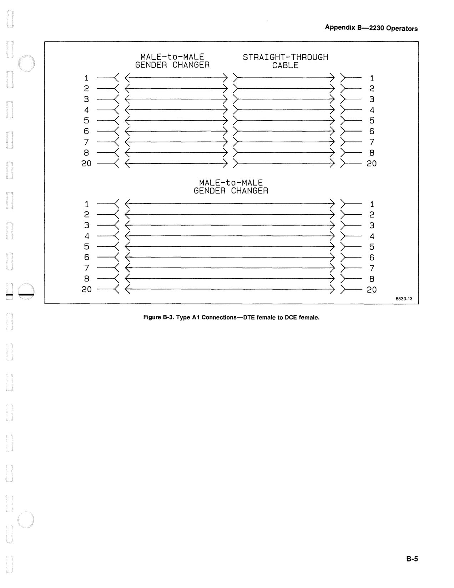

OCR text on this page

Appendix B-2230 Operators

### MALE-to-MALE

### STRAIGHT-THROUGH

### GENDER CHANGER

### CABLE

1 --< >- 1 2 --< >- 2 3 --< >- 3 4 --< >- 4 5 --< >-- 5 6 --< >-- 6 7 --< >-- 7 8 --< >-- 8 20 --< )-- 20

### MALE-to-MALE

### GENDER CHANGER

1 --< >-- 1 2 --< >-- 2 3 --< >- 3 4 --< >- 4 5 --< >- 5 6 --< >- 6 7 --< >- 7 8 --< >- 8 - ~ 20--< )-- 20

6530-13

Figure B-3. Type A 1 Connections-DTE female to DCE female.

B-5

<!-- page 166 of 188 -->

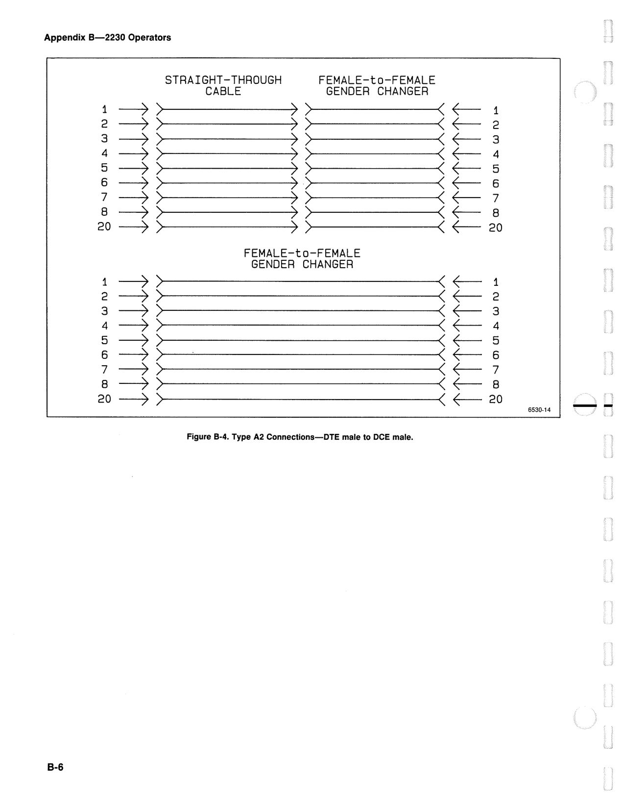

OCR text on this page

Appendix B-2230 Operators

### STRAIGHT-THROUGH

### FEMALE-to-FEMALE

### CABLE

### GENDER CHANGER

1 ~ ~ 1 2 ~ ~ 2 3 ~ ~ 3 4 ~ ~ 4 5 ~ ~ 5 6 ~ ~ 6 7 ~ ~ 7 8 ~ ~ 8 20 ~ ~ 20

### FEMALE-to-FEMALE

### GENDER CHANGER

1 ~ ~ 1 2 ~ ~ 2 3 ~ ~ 3 4 ~ ~ 4 5 ~ ~ 5 6 ~ ~ 6 7 ~ ~ 7 8 ~ ~8 20 ~ ~20 -- 6530-14

Figure 8-4. Type A2 Connections-DTE male to DCE male.

B-6

<!-- page 167 of 188 -->

--

### INTERCONNECTION CABLE

### PART NUMBERS

Tektronix part numbers and stocks RS-232-C intercon- nection cables. Part numbers and a description are as follows:

RS-232 Interconnection cable, length 10 ft. 012-0911-00

RS-232 Null-Modem cable, length 16 ft. 012-0689-00

Appendix B-2230 Operators

Type B connections require a "null-modem" cable to connect two devices of the same logical type together.

Either two DTE devices or two DCE devices can be made to communicate by externally reversing the data and logic lines as shown in the figures. A gender change is needed for Type B and Type B2 connections. For Type B1 con- nections, a gender change is needed only to match up to the null-modem cable connectors. Gender changing can be done with the null-modem cable if it is made with the correct gender connectors for the application.

### FEMALE-to-FEMALE

### GENDER CHANGER

1 ~ ~ 1 2 ~ ; X ~ ~ 2 3 ~ ~ 3 4 ~ ~ 4 5 ~ ~ 5 6 ~ ~ 6 7 ~ ~ 7 8 ~ ~ 8 20 ~ ~ 20

### FEMALE-to-MALE

### FEMALE-to-FEMALE

### NULL-MODEM

### GENDER CHANGER

1 ~ ~ 1 2 ~ ; X ~ 2 3 ~ ~ 3 4 ~ ~ 4 5 ~ ~ 5 6 ~ ~ 6 7 ~ ~ 7 8 ~ ~ 8 20 ~ ~ 20

6530-15

Figure B-5. Type B Connections-DTE male to DTE male and DCE male to DCE male.

B-7

<!-- page 168 of 188 -->

Appendix B-2230 Operators

### MALE-to-MALE

### FEMALE-to-FEMALE

-< <

### GENDER CHANGER

### NULL-MODEM

(~ 1 1 2 -< X ~t=

2 3-< 3 4 -< ~ 4 5 -< ~ 5 6 -< ~ 6 7 -< ~ 7 8-< ~ 8 20 -< ~20

### MALE-to-MALE

### FEMALE-to-FEMALE

-< (

### NULL-MODEM

## GENDER CHANGER (~

1 1 2 ~~ X ~ 2 3 ~3 4 -< ~ 4 5 -< ~ 5 6 -< ~ 6 7 -< ~ 7 8-< ~ 8 20-< ~20

### MALE-to-MALE

### GENDER CHANGER

-- 1 ---< ( ) >- 1 2 ---< >- 2 3 ---< >- 3 4 ---< >- 4 5 ---< >- 5 6 ---< >- 6 7 ---< >- 7 8 ---< >- 8 20---< >- 20

### MALE-to-FEMALE

### STRAIGHT-THROUGH

1--< <

### NULL-MODEM

### CABLE

(~ 1 ~~~ X ~ 2 ~ 3 4--< ~ 4 5--< ~ 5 6--< ~ 6 7--< ~ 7 s-< ~ 8 20-< ~20

6530-16

Figure B-6. Type B1 Connections-DTE female to DTE male and DCE female to DCE male.

B-8

<!-- page 169 of 188 -->

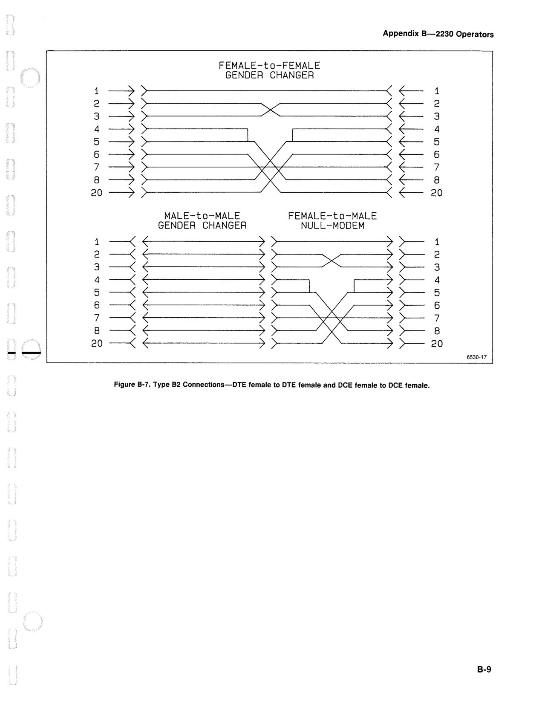

OCR text on this page

---

1 ~

### FEMALE-to-FEMALE

### GENDER CHANGER

~ =ts----- X

4 ~ 5~ 6~ 7~ 8~ 20~

1 -< 2 -< 3 -< 4 -< 5 -< 6 -< 7 -< 8 -< 20 -<

### MALE-to-MALE

### GENDER CHANGER

### FEMALE-to-MALE

### NULL-MODEM

X

Appendix B-2230 Operators

f-- 1

~ t=

2 3 f-- 4 f-- 5 f-- 6 f-- 7 f-- 8 f-- 20

>- 1 >- 2 >- 3 >- 4 '>- 5 >- 6 >- 7 >- 8 )- 20

6530-17

Figure 8-7. Type 82 Connections-DTE female to DTE female and DCE female to DCE female.

B-9

<!-- page 170 of 188 -->

Appendix B-2230 Operators

### PRINTER/PLOTTER OPERATION

### PLOTTER TYPES

Both communication options allow waveform plotting through their communication port or through the X-Y plotter output. Four different digital plotter or printer for- mats are supported via the communications interface. They are: HP-GL®, Epson® (both low-speed, double den- sity, and high-speed, double density), ThinkJet®, and the standard X-Y plotter.

Digital printer/plotter format can be selected two ways. The PARAMETERS switch settings (read at power on) for the compatible printer/plotter formats are illustrated in the following figures. The PARAMETERS switch supports direct oscilloscope to printer/plotter hookup. The PLOt FORmat commands (described in the Command Tables of

B-10

Section 7 in this manual) may be used to select the data format when a controller is used to control the communications.

NOTE

With Option 12, a controller and an RS-232 plotter can not be connected to the oscilloscope at the same time. An X- Y plotter may be connected to the X- Y plotter output and used in conjunction with a controller. With RS-232 plotters/printers, the RS-232-C controller may still be used to set up the formats, then disconnected to permit the printer to be connected to the oscilloscope. An alternative to disconnecting the controller is to use an intercon- necting switching device to switch the oscilloscope between the controller and the printer/plotter. Plot-

ting is then controlled using the front-panel PLOT switches or menus of the oscilloscope.

--

<!-- page 171 of 188 -->

--

Appendix B-2230 Operators

- - RS 232 C DTE/DTE

## 2200 FAMILY •

### Plotter

•so or

### printer

-

### I Interconnect II A1 II

I -- ~ I I -

RS-232-C RS-232-C DCE/DCE DTE/DCE

OR

### Plotter

or RS-232-C

### printer

DTE/DTE

2200 FAMILY -

### I Interconnect IIB1 II

I -- - I I - •so RS-232-C DTE/DCE

fOlliliil

RS-232-C DCE/DCE

6530-01

Figure B-8. Option 12 RS-232-C Printer/Plotter interconnects.

### Parity OFF

CR

--1 --2 --3 --4 --5 ·--s --7 --a

J

Baud Rate

### Parity ON

## J Parity

CR/LF ----

## 9 J Printer/Plotter

10 Format

0 1

### Parity Settings

### Printer/Plotter Format

### Baud Rate Settings

## ....---S-W_IT_C_H _ ___, ~

S4

## S3 S2 S1 L__J

0 0 0 0 0 0 0 0 0 1 0 1 0 1 0 1 1 0

0 0

1

1 0 0 1 1 0

0 1 0 1 0

1 0 1 0

50 75

110

## '---5-7s_w_1_r_cH_s_s___.ll ... _P_A_R_n_v _ _.ll:: =-5_1=~=.W:,I-T,...-:.cH-:..s_g ___ ......... l _I _F_•_R_MA_T_ ...

1 0 1 0 0 1 1 0

134.5 150 300 600 1200 1800 2000 2400 3600 4800

0

0

1

1

0

1

0

1

ODD EVEN MARK SPACE

0

0

1

1

0

1

0

1

HP-GL Epson 7-bit

ThinkJet

X-Y

1 0 1 1 1 1

Figure B-9. Option 12 RS-232-C communication parameters.

1 1 0 0 1 1 Off Line

6530-02

B-11

<!-- page 172 of 188 -->

Appendix B-2230 Operators

### HP 7470A Plotter

Y-(Programmed

S1 S2

On/Off line)

us (A-Size Paper) B4 B2 B3 B1

•

## 11111111

1

## 11111111

0

L_J Parity

D (Direct Contact) A4 (Metric A4 Paper)

### HP 7475A Plotter

Y-(Programmed On/Off line)

Si S2

US (B-Size Paper)

A3 (Metric A3 Paper) B4 B2 B3 Bi

•

## I I I I I I I I I

## I I I I I I I I I

1

0

D Paper) (Direct Contact)

MET (Use metric size)

### Parity Settings

SWITCH

11

PARITY S7 S6

0 0 NONE(B-bit) 0 1 EVEN (7-bit)

1 0 NONE (8-b it) 1 1 ODD (7-bit)

### Baud Rate Settings

SWITCH S4 S3 S2 S1

0 0 0 0

0 0 0 1

0 0 1 0

0 0 1 1 0 1 0 0

0 1 0 1

0 1 1 0

0 1 1 1

1 0 0 0

1 0 0 1

1 0 1 0

1 0 1 1

1 1 0 0

1 1 0 1 1 1 1 0

1 1 1 1

BAUD

External (16x) clock

75* 110* 150 200 300 600 1200 2400 4800 9600 300* 600* 1200* 2400* 4000*

* Use two stop bits. All others use one stop bit.

6530-03

Figure B-10. HP 7470A and HP 7475A plotter RS-232-C switch settings.

B-12

1200 Baud

### 2200 FAMILY •so

OFF ON

10

8 HP7470A 1 1~m1~

~_...,.Selected side of switch

2400 Baud

### 2200 FAMILY •so

OFF ON

10

8 HP7470A 1 I~ 1~

## B:::: Don't care

4B00 Baud

### 2200 FAMILY •so

OFF ON

10

8 HP7470A 1 1 1~1~

HP7475A

Figure B-11. Option 12 PARAMETERS switch settings for HP-GL compatible plotters.

6530-04A

--

<!-- page 173 of 188 -->

--

1

0

Parity EVEN

## Disabled 1 ( Parity

### 12345678

## I I I I I I I I

## I I I I I I I I

~y ~ PaOrdidty Baud I Rate Handshake Parity Turnaround Enabled

### Handshake Turnaround*

SWITCH S6 S5

Free bytes for Turnaround ~ 1936

## LUi_J ___ ;_i_: __ _

7-bit

## word 1

Reverse-Channel ( Selectable

1 2 3 4

## Olli]:

## 8-bit) ,~

word Reverse-Channel Fixed Reverse-Channel Polarity

### Reverse-Channel Polarity

SWITCH S3 S2

Reverse Channel (pin 11)

TX• ;:::::::;::::::: ::======~:::::::::::

0

1

1

0

MARK

SPACE

SPACE

MARK

*Printer tells sender to stop when only 16 free bytes are left in buffer until specified number of bytes are free.

Appendix B-2230 Operators

### Baud Rate Settings

SWITCH

## IBAUD7

S4 S3 S2

## S1 L___j

1 1 0 0 0 0 0 0 0 1 0 1 0 1 0 1

1 0

1 0

1 0

1 0

1 1

1 0

1

1 0 0

1

1 0 0

1

1 0

1

1 0

1 0

1 0

1 0

1 0

1 0

Self Test

9600 4800 2400 1800 1200 600 300 200 150 135

110 75

6530-05

Figure B-12. Epson FX-Series printer RS-232-C switch settings.

1200 Baud

### 2200 FAMILY •so

OFF ON

10

### Epson IITm:i7

## FX, MX, RX ~

g~F

~ ...,._ Selected side of switch

2400 Baud

### 2200 FAMILY •so

OFF ON

10

### Epson IITm:i7

## FX, MX, RX ~

~F

## a::: Don't care

4800 Baud

### 2200 FAMILY •so

OFF ON

10

### Epson 1o::m7

## FX, MX, RX ~

~F

Figure B-13. Option 12 PARAMETERS switch settings for Epson printers.

6530-06

B-13

<!-- page 174 of 188 -->

Appendix B-2230 Operators

OTA

•

I

## I I I I I

## I I I I I

1

0

1 2 3 4 5

## Xon\Xoff) Pa'tty ~

Baud Rate

### Baud Rate Settings

## .___s_4_sw_1_r_c_H_ss_ .... l ... I __ s_A_u_• _ __.

1 1

1 0

0 1 0 0

### Parity

SWITCH

S2 S3

0 0

0 1

1 0

1 1

1200 2400 19200 9600

### Settings

11

PARITY

NONE (8-b it)

ODD (7-bit)

EVEN (8-bit)

ONES (7-b it)

Figure 8-14. HP ThinkJet RS-232-C switch settings.

1200 Baud

### 2200 FAMILY •so

OFF ON

10

ThinkJet

1 5 51~1

~ ...... Selected side of switch

2400 Bau<l

### 2200 FAMILY •so

OFF ON

10

ThinkJet

## a::: Don't care

Figure B-15. Option 12 PARAMETERS switch settings for HP ThinkJet printer.

6530-07 --

6530-08

<!-- page 175 of 188 -->

--

Appendix B-2230 Operators

--

1

GPIB --

2

## Address* --

4 --

8

### Printer/Plotter Format

--

16 SWITCH FORMAT

## EOI Only --

LF or EOI AUX 2 AUX 1 --

LON (Listen Only) --

TON (Talk On 1 y) 0 0 HP-GL --

## AUX J

Printer/Plotter 0 1

### Epson 7-bit

--

AUX 2 Format 1 0 ThinkJet

1 1 X-Y

0 1

### *Address 31 = off line

### LON and TON both ON= off line

Figure B-16. Option 10 GPIB Interface PARAMETERS switch.

2200 FAMILY DS0

HC100 Plotter

10

8

~,.._Selected side of switch

2200 FAMILY DSO

10

HP 7470A/7475A Plotter

7 1 IM~ 1~

## B::: Don ·t care

2200 FAMILY DSO

ThinkJet Printer

10

7 1

## ~ [ fua 1111 I [

Figure B-17. Option 10 PARAMETERS switch settings for compatible GPIB printers/plotters.

6530-09

6530-10

B-15

<!-- page 176 of 188 -->

Appendix B-2230 Operators

### HP 7470A Plotter

### To GPIB Interface

NA

(A-Size Paper)----...,

I

### 16 s 4 2 1

us I -------------•

## I I I I I I I

## I I I I I I I

A4 I I . . _ _ I ~ (Metric A4 Paper)_______.

NA GPIB Address*

*Address 31 = Listen Always

us

### HP 7475A Plotter

### To GPIB Interface

A3 (Metric A3 Paper)

## (B Size Paper) l

16 B 4 2 1

## I I I I I I I

## I I I I I I I

### MET_-J

(Use Metric Size) GPIB Address*

A4 (Metric A4 Paper)

*Address 31 Listen Always

•

1

0

1

0

### HP ThinkJet Printer

### To GPIB Interface

Listen Always

Mode SRQ

## Enabled I

### 116 8 4 2 1

...----------,

•

## I I I I I I I

## I I I I I I I

SRQ ___J Disabled

HP-GL

GPIB Address*

### *Address 31 = Listen Always

1

0

### Tektronix HC100 Color Plotter

### To GPIB/Centronics Interface

Others* (Main board dip switch)

## Centronics l

S.Funcs. (not used)

•

## I I I I I I I I

1

## I I I I I I I I

0

## GPIB_-J J

HP-GL

Std.

GPIB Address*

(not used)

### *When set to "Others". the modes

defined by dip switches S4 and

### S5 on the Main board are active.

6530-11

Figure B-18. Switch settings for compatible GPIB plotters.

B-16

--

<!-- page 177 of 188 -->

--

Appendix B-2230 Operators

### QUESTIONS AND ANSWERS

Here are answers to some typical questions that you may have about operation of the Communications Options.

Q: What is the data transfer rate?

A: For the Option 10 GPIB interface, the data transfer rate is approximately 1 Kbyte per second. This equates to one waveform per second for 1 K records or about four seconds for 4 K waveform records.

For the Option 12 RS-232-C interface, the data transfer rate depends on the format (ASCII, HEX, or BINARY) and the baud rate. Typical times for 1200, 2400, and 4800 baud are given in Table B-2.

Baud

Rate

1200

2400

4800

Table 8-2 RS-232-C Transfer Rates

Record

Size Format

4K ASCII HEX BINARY

1K ASCII HEX BINARY

4K ASCII HEX BINARY

1K ASCII HEX BINARY

4K ASCII HEX BINARY

1K ASCII HEX BINARY

Transfer

Time (Min:Sec)

2:20 1:10 0:36

0:36 0:20 0:10

1 :15 0:40 0:20

0:19 0:10 0:05

2:39 1 :16 0:45

0:58 0:29 0:13

Q: Why does the data transfer rate slow down at 4800 baud?

A: At that baud rate, the internal data buffer of the 2200 Family oscilloscope fills before the oscilloscope's processor is ready. That interrupts the processor from its other tasks, and it must stop to issue flow control commands to halt further data input while it gets ready to accept the data from the buffer. After it handles the buffer data, it must then start the data input again. All the interrupt handling slows down the transfer rate. At 2400 baud, the oscilloscope's processor is usually ready to handle the incoming data before the buffer fills, and it is not necessary to continually interrupt the data flow.

Q: The operators manual states that multiple commands may be sent in one message line, but sometimes errors are generated when I try this with Option 12. Why is that, and what can I do about it?

A: To answer the second question first, write RS-232-C controller programs to send only one command at a time.

For the first question of why multiple commands sometimes cause errors, the answer is that only one command at a time can be reliably handled by the processor. Commands (and arguments to commands) are interpreted and handled as they are recognized; the oscilloscope processor does not wait for the message terminator to end the message. If a service request is generated by one of the commands in a command string, a correcting action may have to be taken. If the service request is not handled properly, all following commands in a string may not be valid, and the controller program may not be able to continue.

Q: Sometimes when I send commands to change the operating state of the instrument, they are not accepted. What is the problem?

A: The REM ON command must be sent as the first command before attempting to change the operating state of the oscilloscope. The power-on state of REM is OFF.

Q: When I send waveforms to the oscilloscope at 2400 baud or more, I get bad transfers when I try to use binary-encoded curve data. What is the problem?

B-17

<!-- page 178 of 188 -->

Appendix B-2230 Operators

A: Flow control must be used when sending waveform A: The data channel for source and target for waveform data to the oscilloscope at the higher baud rates. That transfers is designated using the REFERENCE is because the input data buffer is only 160 characters WAVEFORM commands (see DATa CHAnnel). Either long and it fills up before the processor is ready to channel of the acquisition or Save Ref memory may handle the input. Because of the nature of binary be retrieved from the oscilloscope. Waveform data data, flow control can not be used to reliably send or may be sent to either channel of a targetted Save Ref receive binary-encoded curve data. Use either HEX or memory (see DATa TARget). ASCII encoding instead. HEX-coded waveform data requires fewer characters to be transferred than Q: What is the purpose of the external clock? ASCII-coded waveform data, and therefore is faster than ASCII format. Also, parity must be disabled with the PARAMETERS switch setting for binary data A: The external clock can be used to acquire signals that transfers. That setting has to be made before the change too slowly for the normal calibrated SEC/DIV instrument is turned on since power-on is the only settings (for example, one sample every hour). time the switch is read. Another use is to synchronize the 2230 so that samples are done on selected events.

Q: What is the size of the oscilloscope's data output buffer? Q: Can you re-arm Single Sweep via the communication option?

A: The output buffer is about 1,000 characters.

A: The Single Sweep function may be armed using the

Q: Why do I sometimes get bad curve data when I SGLswp ARM command. Single Sweep may also be

operate the DSO in the Repetitive Store Mode? queried to determine the state of the Single Sweep function (ARM or DONE).

A: This problem is caused by not allowing enough Q: What is the maximum sensitivity in digital storage? sweeps to occur to fill the entire waveform record. Repetitive Store Mode (random equivalent-time sampling) depends on the probability of filling the A: It is 2 mV/division, the same as in nonstore mode. waveform record in a specified number of sweeps. The more sweeps that are used to sample an input

Can I compress, expand, or reposition the stored signal, the more probable it is that the waveform Q: record will be filled when the waveform is asked to be waveforms? -- transferred. If you receive bad curve data, you must allow more sweeps to occur before requesting the A: The 2230 has commands for reformatting a target waveform from the oscilloscope. reference waveform; the 2220 and 2221 do not.

One way to do this is to set the number of sweeps Q: What is the maximum expansion/compression factor (via either the oscilloscope's menu controls or a for stored waveforms with the 2230? command message) to a value several times larger than the number of sweeps needed for a 50% probability of filling the record (see Controls, A: Vertically, the reformat target waveforms may be Connectors, and Indicators-Section 3 of the expanded or compressed by a factor of ten from their Operators manual). Also, you can set ROS and OPC acquired VOL TS/DIV setting. Horizontally, the X10 on. Then, when the specified number of sweeps have Magnification feature may be turned on for the been acquired, the oscilloscope will issue a single reformat target waveforms. SRO (service request). When the controller software determines that an the end-of-acquisition OPC state Q: Can I return a reformatted waveform back to its caused the service request, it can request the curve data. original settings?

Q: When operating in ALT or CHOP Vertical Mode, how A: Yes. Query the BASegain to determine the acquired

do I designate from which channel of the acquisition volts/div setting and set the VGAin to that setting. To

or reference memory the waveform data is retrieved? return to the original vertical position, set VPOsition to

How do I designate in which channel of a reference 0; turn HMag off to regain the acquired sec/div

memory the waveform data is stored when sending setting.

waveforms to the oscilloscope?

B-18

<!-- page 179 of 188 -->

- -'

Q: Can the baud rate, end-of-line terminator, or parity setups be changed from the RS-232-C controller?

A: No. Those communications parameters must be set up using the PARAMETERS switch on the oscilloscope's side panel before the oscilloscope is turned on.

Q: Can the GPIB address of the oscilloscope be changed from the bus or the front-panel?

A: The GPIB address and other communication parameters are settable only from the PARAMETERS switch on the oscilloscope's side panel, and the switch settings are read only at power on.

Q: Can a waveform preamble be sent to the instrument?

A: Yes, a waveform preamble can be sent to the oscilloscope. That preamble should correspond to the curve data that is sent to the target Save Ref memory.

Q: Can the waveform display be modified by changing the preamble fields?

A: Modifying the preamble information so that it does not correspond to the curve data invalidates the waveform, but it doesn't usually change the way it is displayed. If drastic changes are made to the preamble (such as data encoding or point format), the oscilloscope will probably reject the curve data as not matching the preamble.

Q: What type of averaging is used for the AVERAGE acquisition mode?

A: A normalized averaging algorithm is used.

Where:

As = the average after s number of sweeps,

A(s- 1) = the average after (s-1) sweeps,

is = the sth input sample,

Weight = the selectable weighting factor from

1 /1 though 1 /256 in a power of 2 sequence.

Appendix B-2230 Operators

Q: Can I get readout information over the communications interface?

A: CRT display information may be queried individually or obtained as part of the waveform preamble. The volts/div, sec/div, acquisition mode, trigger information, and cursor readouts are all available in the 2221 and 2230. Vertical information (except for Vertical Mode) and cursor readouts are not available with the 2220.

Q: What is the 26-K non-volatile memory supplied with the 2230 Communications option, and what are its waveform storage capabilities?

A: Memory space for 26, 1-K waveforms, or 6, 4-K waveforms, or any combination of waveform record totaling not more than 26 K bytes is provided by the added memory. The non-volatile memory is battery- backed for long-term waveform data storage.

Q: Can acquired waveforms be stored in the added memory using the 2230 front-panel controls?

A: Yes. Waveforms may be transferred into and out of the added memory using the Reference menu selections available in the Advanced Functions Menu. Waveforms must be transferred through one of the numbered Safe Ref memory locations (REF1-REF4).

Q: How are the waveforms stored in the added memory addressed via the 2230 communications option?

A: The added memory locations are designated REFA through REFZ. These memory locations are accessed through the REF1-REF4 memory locations for both reading and writing using the REFFrom and SAVeref commands; they cannot be directly accessed.

Q: What are the differences between Peak Detect (PEAK) and Accumulated Peak Detect (ACCPEAK) acquisition modes?

A: Peak Detect and Accumulated Peak Detect are both envelope acquisition modes. Peak Detect captures the maximum and minimum points for each sample interval during each successive acquisition. Accumulated Peak Detect holds previously acquired peak values until reset so that the changes over time are detectable. Accumulated Peak Detect is valid only for triggered acquisitions and is not allowed in untriggered modes. Peak Detect is valid for both triggered and untriggered modes, since no peaks are held between acquisitions.

B-19

<!-- page 180 of 188 -->

Appendix B-2230 Operators

Q: What is the default number of acquisitions in

ACCPEAK mode?

A: The number of sweeps that may be accumulated can be set for a default of continuous (ACQ NUM:0) or any number between 1 through 2047. With each new acquisition, the most-positive and most-negative values are added to the existing display. When set to a specified number, the acquisition stops when the limit is reached, and the waveform is held displayed.

Q: What is the envelope sampling rate in Peak Detect and Accumulated Peak Detect?

A: 20 megasamples per second.

Q: Can the 2230 and 2221 cursor positions be addressed over the communications interface?

A: Yes. The cursors may be targeted to the acquisition or a Save Reference waveform and positioned within the waveform record. Their voltage difference and time difference may be queried to determine the readout values.

Q: Is delay time included in the 2230 waveform preamble?

B-20

A: No. The preamble does not indicate if the curve data was taken at an A or a B SEC/DIV setting, just what the SEC/DIV setting is for that curve data.

Q: Are the displayed intensified zones seen in a 2230 acquisition stored in either SAVE mode or in SAVE REF memory?

A: Yes, they are saved in both SAVE and in SAVE REF.

Q: What waveform data is sent by a 2230 if the waveform acquired in BOTH Horizontal Mode is requested?

A: The A Sweep waveform is sent.

Q: Can a waveform be sent to a controller from the front panel of the oscilloscope?

A: No, but the waveform may be sent to plotter or printer. With Option 10, the oscilloscope must be in Talk Only mode. With either option, the PARAMETERS switch must be set to output the correct format for the printer or plotter being used. See Section 7 of the Operators Manual and the Printer/Plotter Operation text in this Appendix for information.

--

<!-- page 181 of 188 -->

--

## MANUAL CHANGE INFORMATION

COMMITTED TO EXCEU£NCE

### Date: ___

### 6-_2_3_-8_8 ___ _

Change Reference: C1/0688(REV)

### Product: __

### 2_2_3_0_O_P_E_R_A_T_O_R_S _____________ _

### Manual Part No.: ___

### 0_7_0_-4_9_9_8-_0_2 __

DESCRIPTION Product Group 41

### EFFECTIVE ALL SERIAL NUMBERS

### TEXT CHANGES

Page 1-4 Table 1-1

Replace the Characteristics and Performance Requirements for the "Aberrations (NON STORE and STORE in Default Modes)".

Characteristics

Aberrations (NON STORE and STORE in Default Modes)

2 mV/div to 50 mV/div

0.1, V/div to 0.5 V/div

1 V /div and 2 V /div

5 V/div

Performance Requirements

+4%, -4%, 4% p-p.

3% or less at 25°C with cabinet installed.

+6%, -6%, 6% p-p.

5% or less at +25°C with cabinet installed.

+12%, -12%, 12% p-p.

10% or less at +25°C with cabinet installed.

+ 12%, -12%, 20% p-p.

+10%, -10%, 20% p-p at +25°C with cabinet installed.

Measured with a five-division reference signal, from a 50 n source driving a 50 Q coaxial cable terminated in 50 Q at the input connector with the VOL TS/DIV Variable control in the CAL detent. Vertically center the top of the reference signal.

Page 1 of 1

<!-- page 182 of 188 -->

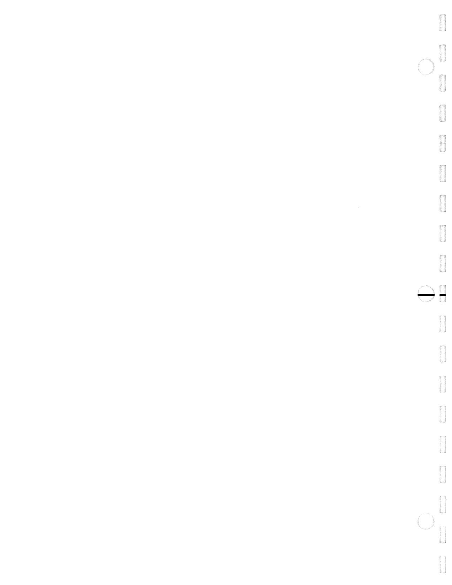

OCR text on this page

--

<!-- page 183 of 188 -->

## MANUAL CHANGE INFORMATION

COMMITTED TO EXCELLENCE

### Date: ___

### 5_-2_6 ___ --'--88;;..._ __ Change Reference: ___ M:=66::::..:8::.::6=-=2'-----

### Product: --=22=3;;_;;0_O;;:_P-'E=R--"-A-'-T---O;;..;R...;_S;;;..._ ___________ _

Manual Part No.: -----=-07:.....:0:....-4.:..:9:..::9:.=8....::-0:.=2'---_

DESCRIPTION Product Group 41

The Standard Test Probes for your instrument have been replaced with the P6109 Test Probes. Please note this change in the Standard Accessories List in this manual.

Page 1 of 1

<!-- page 184 of 188 -->

OCR text on this page

--

<!-- page 185 of 188 -->

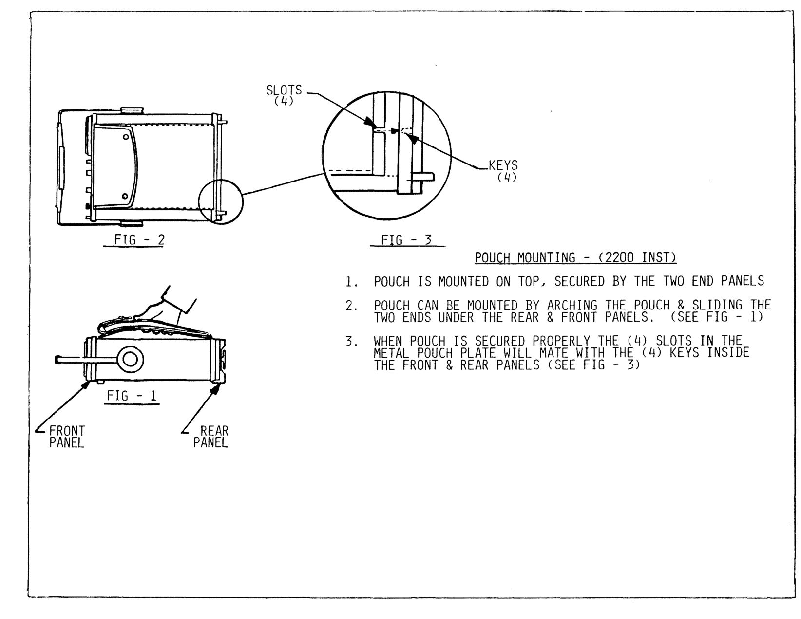

OCR text on this page

## FlG - 2

## FIG - 3

### KEYS

(4)

## POUCH MOUNTING - (2200 INST)

1.

### POUCH IS MOUNTED ON TOPJ SECURED BY THE TWO END PANELS

2.

## POUCH CAN BE MOUNTED BY ARCHING THE POUCH & SLIDING THE

## TWO ENDS UNDER THE REAR & FRONT PANELS.

## CSEE FIG - 1)

3.

## WHEN POUCH IS SECURED PROPERLY THE (4) SLOTS IN THE

## METAL POUCH PLATE WILL MATE WITH THE (4) KEYS INSIDE

## THE FRONT & REAR PANELS CSEE FIG - 3)

<!-- page 186 of 188 -->

<!-- page 187 of 188 -->

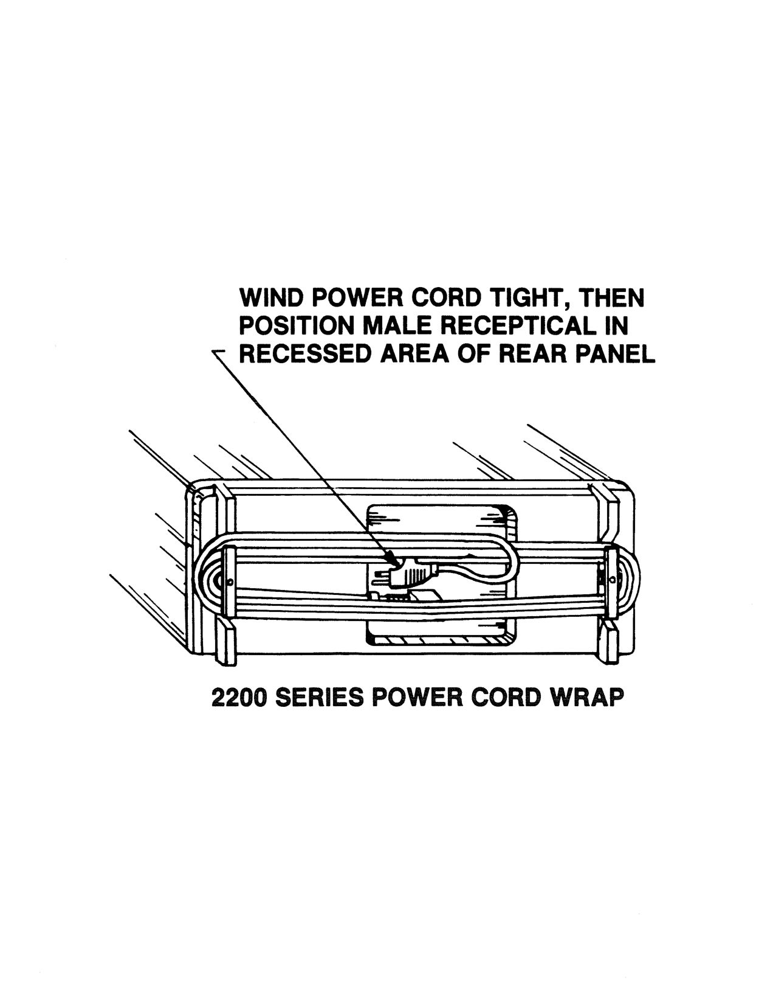

OCR text on this page

## WIND POWER CORD TIGHT, THEN

## POSITION MALE RECEPTICAL IN

## RECESSED AREA OF REAR PANEL

## 2200 SERIES POWER CORD WRAP

<!-- page 188 of 188 -->

