# 2230 Service Manual

Transcribed from `hardware/2230 .pdf` (OCR'd scan, Artek Media) via `hardware/gen_manual_markdown.py`. Pages with under 500 characters of OCR text are rendered as images instead of transcribed (heuristic for "probably a figure/schematic/photo page", not perfect - see the script's docstring). OCR errors (e.g. "tlon" for "tion") are left as-is.


---

## Page 1 of 451

TEK 
SERVICE 
070-4999-00 
MANUAL 
Product Group 46 
DIGITAL STORAGE 
OSCILLOSCOPE 
SERVICE 
I W A R N I N G ( 
THE FOLLOWING SERVICING INSTRUCTIONS ARE 
FOR USE BY QUALIFIED PERSONNEL ONLY. TO 
AVOID PERSONAL INJURY, DO NOT PERFORM ANY 
SERVICING OTHER 'THAN THAT CONTAINED IN 
OPERATING INSTRUCTIONS UNLESS YOU ARE 
QUALIFIED TO DO SO. REFER TO OPERATORS 
SAFETY SUMMARY AND SERVICE SAFETY SUM- 
MARY PRIOR TO PERFORMING ANY SERVICE. 
Please Check for 
CHANGE INFORMA TlON 
at the Rear of This Manual 
First Printing JUL 1986 
Scans by ARTEK M E N


---

## Page 2 of 451

Scans 
Arfek Media 
1042 Plummer Cir. SW 
Rochester, MN 55902 
"High resolution scans of obsolete technical manuals" 
If your looking for a quality scanned technical manual in PDF format please visit 
our 
WEB 
site 
at www.artekmedia.com or 
drop 
us 
an 
email 
at 
ma~ilals@arlekmedia.com 
and we will be happy to email you a current list of the 
manuals we have available. 
If you don't see the manual you need on the tist drop us a tine anyway we may 
still be able to point you to other sources. If you have an existing manual you 
would like scanned please write for details, This can often be done very 
reasonably in consideration for adding your manual to our library. 
Typically the scans in our manuals are done as follows; 
I) 
Typed text pages are typically scanned in black and white at 300 dpi. 
2) Photo pages are typically scanned in gray scale mode at 600 dpi 
3) Schematic diagram pages are typiwlly scanned in b tack and white at 600 
dpi unless the original manual had colored high lighting (as is the case for 
some 70's vintage TeMronix manuals). 
If you purchased this manual from us (typically through our Ebay name of 
ArtekMedia) thank you very much. If you received this from a well-meaning 
"friend" for free we would appreciate your treating this much like you would 
"share ware". By that we mean a donation of at least $5-10 per manual is 
appreciated in recognition of the time (a manual can take as much as 40 hours to 
reproduce, book, link etc.), energy and qualrty of effort that went into preserving 
this manual. Donations via PayPal go to: -. - - 
r n a n u a l s ~ ~ i ~ l ~ c o r n 
7
-
 
- 
or can be 
mailed to us the address above. 
T anks 
Dave 8 Lynn Henderson 
Artek Media


---

## Page 3 of 451

Copyright @ 1986 Tektronix, Inc. All rights reserved. 
Contents of this publication may not be reproduced in any 
form without the written permission of Tektronix, Inc. 
Products of Tektronix, Inc. and its subsidiaries are covered 
by U.S. and foreign patents and/or pending patents. 
TEKTRONIX, TEK, SCOPE-MOBILE, and 
registered trademarks of Tektronix, Inc. 
@ are 
Printed in U.S.A. Specification and price change privileges 
are reserved. 
INSTRUMENT SERIAL NUMBERS 
Each instrument has a serial number on a panel insert, tag, 
or stamped on the chassis. The first number or letter 
designates the country of manufacture. The last five digits 
of the serial number are assigned sequentially and are 
unique to each instrument. Those manufactured in the 
United States have six unique digits. The country of 
manufacture is identified as follows: 
6000000 
Tektronix, Inc., Beaverton, Oregon, USA 
100000 
Tektronix Guernsey, Ltd., Channel Islands 
200000 
Tektronix United Kingdom, Ltd., London 
300000 
SonyTTektronix, Japan 
700000 
Tektronix Holland, NV, Heerenveen, 
The Netherlands 
Scans by ARTEK MEDL4 =>


---

## Page 4 of 451

2230 Service 
TABLE OF CONTENTS 
Page 
LIST OF ILLUSTRATIONS ........................................... 
iv 
LIST OF TABLES ......................................................... vi 
OPERATORS SAFETY SUMMARY ............................. 
viii 
SERVICING SAFETY SUMMARY ................................ 
ix 
Section 1 GENERAL INFORMATION 
INTRODUCTION ................................. 1-1 
SPECIFICATION ................................... 1-1 
Section 2 OPERATING INFORMATION 
PREPARATION FOR USE ........................ 2-1 
SAFETY ................................................ 2-1 
LINE VOLTAGE .................................... 2-1 
POWER CORD ..................................... 2-1 
I-INEFUSE .......................................... 2-2 
INSTRUMENT COOLING ..................... 2-2 
START-UP ........................................... 2-2 
REPACKAGING ................................ 2-3 
CONTROLS. CONNECTORS. 
AND INDICATORS .................................... 2-4 
POWER AND DISPLAY ....................... 2-4 
VERTICAL ............................................ 2-4 
. 
HORIZONTAL ....................................... 2-8 
TRIGGER .............................................. 2-1 2 
STORAGE CONTROLS ....................... 2-1 5 
MENU SELECTED FUNCTIONS ......... 2-17 
REAR PANEL ....................................... 2-19 
SIDE PANEL ......................................... 2-19 
CRT READOUT .................................... 2-20 
............ 
OPERATING CONSIDERATIONS 
2-23 
GRATICULE ......................................... 2-23 
GROUNDING ........................................ 2-23 
SIGNAL CONNECTIONS ..................... 2-23 
INPUT-COLIPLING 
CAPACITOR PRECHARGING ............. 2-24 
Page 
OPERATOR'S CHECKS AND 
ADJUSTMENTS ........................................ 2-25 
INITIAL SETLIP ..................................... 2-25 
TRACE ROTATION 
ADJUSTMENT .................................. 2-26 
PROBE COMPENSATION ................... 2-26 
HORIZONTAL ACCURACY 
.................................................. 
CHECK 
2-27 
THEORY OF OPERATION 
.................. 
SECTION ORGANIZATION 
3-1 
INTEGRATED CIRCUIT 
................................... 
DESCRIPTIONS 
3-1 
GENERAL DESCRIPTION ................... 3-1 
DETAILED CIRCUIT DESCRIPTION ........ 3-7 
ANALOG CIRCUITRY .......................... 3-7 
VERTICAL ATTENUATORS ................ 3-7 
VERTICAL PREAMPLIFIERS .............. 3-10 
VERTICAL OUTPUT 
AMPLIFIER ........................................... 3-12 
TRIGGERING ........................................ 3-13 
A SWEEP GENERATOR AND 
................................................... 
LOGIC 
3-17 
B TIMING AND ALTERNATE 
B SWEEP .............................................. 3-20 
HORIZONTAL ....................................... 3-23 
MICROPROCESSOR AND 
STORE-PANEL CONTROLS ............... 3-25 
STATUSADCAND BUS 
INTERFACE ...................................... 3-26 
STORAGE ACQUISITION .................... 3-28 
ACQUISITION MEMORY ..................... 3-30 
DIGITAL TIME BASE ........................... 3-38 
DIGITAL DISPLAY ............................... 3-44 
VECTOR GENERATOR ....................... 3-45 
POWER INPUT. PREREGULATOR 
AND INVERTER ................................... 3-47 
POWER SUPPLY SECONDARIES. 
Scam by ARTEK MEDL4 =>


---

## Page 5 of 451

2230 Service 
TABLE OF CONTENTS (cont) 
Section 4 PERFORMANCE CHECK PROCEDURE 
INTRODUCTION ....................................... 4-1 
PURPOSE .......................................... 4-1 
PERFORMANCE CHECK 
INTERVAL ............................................ 4-1 
STRUCTURE ....................................... 4-1 
TEST EQUIPMENT REQUIRED .......... 4-1 
LIMITS AND TOLERANCES ................ 4-1 
PREPARATION FOR CHECKS ........... 4-1 
INDEX TO PERFORMANCE 
CHECK STEPS ..................................... 4-3 
VERTICAL ................................................ 4-4 
INITIAL CONTROL SElTINGS ............ 4-4 
PROCEDURE STEPS .......................... 4-4 
HORIZONTAL .......................................... 4-1 2 
INITIAL CONTROL SElTINGS ............ 4-12 
PROCEDURE STEPS .......................... 4-1 2 
TRIGGER ................................................... 4-17 
INITIAL CONTROL SElTINGS ............ 4-1 7 
PROCEDURE STEPS .......................... 4-1 7 
EXTERNAL Z.AXIS. PROBE 
ADJUST. EXTERNAL CLOCK. 
AND X-Y PLOlTER .................................. 4-21 
INITIAL CONTROL SElTINGS ............ 4-21 
PROCEDURE STEPS .......................... 4-21 
Page 
Page 
Section 5 ADJUSTMENT PROCEDURE 
INTRODUCTION ....................................... 
PURPOSE ............................................. 
STRUCTURE ........................................ 
TEST EQUIPMENT .............................. 
LIMITS AND TOLERANCES ................ 
ADJUSTMENTS AFFECTED BY 
REPAIRS .............................................. 
PREPARATION FOR 
ADJUSTMENT ...................................... 
INDEX TO ADJUSTMENT 
PROCEDURE STEPS .......................... 
POWER SUPPLY AND CRT DISPLAY .... 
INITIAL CONTROL SElTINGS ............ 
PROCED.URE STEPS .......................... 
VERTICAL ................................................. 5-6 
INITIAL CONTROL SElTINGS ............ 5-6 
PROCEDURE STEPS .......................... 5-6 
HORIZONTAL ............................................ 5-19 
INITIAL CONTROL SElTINGS ............ 5-19 
PROCEDURE STEPS .......................... 5-19 
TRIGGER ................................................... 5-27 
INITIAL CONTROL SElTINGS ............ 5-27 
.......................... 
PROCEDURE STEPS 
5-27 
EXTERNAL Z.AXIS. PROBE 
ADJUST. EXTERNAL CLOCK. 
AND X-Y PLOlTER .................................. 5-32 
INITIAL CONTROL SETTINGS ............ 5-32 
.......................... 
PROCEDURE STEPS 
5-32 
Section 6 MAINTENANCE 
STATIC-SENSITIVE COMPONENTS ....... 
PREVENTIVE MAINTENANCE ................. 
INTRODUCTION ................................... 
GENERAL CARE .................................. 
INSPECTION AND CLEANING ............ 
...................................... 
LLIBRICATION 
SEMICONDUCTOR CHECKS .............. 
PERIODIC READJUSTMENT .............. 
............................... 
TROUBLESHOOTING 
INTRODUCTION ................................... 
TROUBLESHOOTING AIDS ................ 
TROUBLESHOOTING 
EQUIPMENT ......................................... 6-11 
TROUBLESHOOTING 
TECHNIQUES ..................................... 6-11 
DIAGNOSTICS ..................................... 6-14 
CORRECTIVE MAINTENANCE ................ 6-31 
INTRODUCTION ................................... 6-31 
MAINTENANCE PRECAUTIONS ......... 6-31 
OBTAINING REPLACEMENT 
PARTS ............................................. 6-31 
MAINTENANCE AIDS .......................... 6-31 
INTERCONNECTIONS ......................... 6-33 
TRANSISTORS AND 
INTEGRATED CIRCUITS ..................... 6-33 
SOLDERING TECHNIQUES ................ 6-33 
REMOVAL AND REPLACEMENT 
INSTRUCTIONS ................................... 6-34 
Scans by ARTEK MEDL4 =>


---

## Page 6 of 451

2230 Service 
TABLE OF CONTENTS (cont) 
Page 
Section 7 OPTIONS 
INTRODUCTION ....................................... 
POWER CORD OPTIONS ........................ 
OPTION 33 ................................................ 
OPTION 10 AND OPTION 12 ................... 
INTRODUCTION ................................... 
STANDARD FUNCTIONS. 
FORMATS. AND FEATURES .............. 
PERFORMANCE CONDITIONS .......... 
....................... 
OPTIONS SIDE PANEL 
INTERFACE STATUS 
INDICATORS ........................................ 
MENU SELECTED FUNCTIONS ......... 
GPlB PARAMETER SELECTION ........ 7-9 
RS-232-C PARAMETER 
SELECTION .......................................... 7-10 
MESSAGES AND 
COMMUNICATION PROTOCOL ......... 7-10 
COMMAND I-ISTS ............................... 7-12 
WAVEFORM TRANSFERS .................. 7-28 
REMOTE-LOCAL 
OPERATING STATES .......................... 7-31 
INSTRUMENT RESPONSE TO 
INTERFACE MESSAGES .................... 7-32 
GPlB PROGRAMMING ........................ 7-33 
RS-2324 PROGRAMMING ................. 7-33 
RESET UNDER COMMUNICATION 
OPTIONS CONTROL ........................... 7-34 
STATUS AND ERROR 
REPORTING ......................................... 7-34 
Page 
READOUTIMESSAGE COMMAND 
............................... 
CHARACTER SET 
7-35 
........................... 
ASCII CODE CHART 
7-35 
OPTION 10 THEORY 
OF OPERATION ................................... 7-40 
OPTION 12 THEORY 
OF OPERATION ................................... 7-41 
OPTION MEMORY ............................... 7-43 
PERFORMANCE CHECK 
PROCEDURE ....................................... 7-44 
ADJUSTMENT PROCEDURE .............. 7-45 
OPTION MAINTENANCE 
..................................... 
INFORMATION 
7-45 
Section 8 REPLACEABLE ELECTRICAL PARTS 
Section 9 DIAGRAMS 
Section 10 REPLACEABLE MECHANICAL PARTS 
CHANGE INFORMATION 
Diagnostic Information: 
Diagnostics .............................................................. 6-14 
Diagnostic Messages ............................................. 6-17 
Diagnostic Tests ..................................................... 6-21 
Scans by ARTEK MEDL4 => 
iii


---

## Page 7 of 451

2230 Service 
LIST OF ILLUSTRATIONS 
Figure 
Page 
The 2230 Digital Storage Oscilloscope ....................................................................................... x 
Maximum input voltage vs . frequency derating curve for CH 1 OR X. 
CH 2 OR Y. and EXT INPUT connectors ............................................................................ 1-14 
Physical Dimensions of the 2230 Oscilloscope .......................................................................... 1-15 
Securing the detachable power-cord to the instrument ........................................................ 2-1 
Optional power cord data ........................................................................................................... 2-2 
Fuse holder and detachable power-cord connector ................................................................... 2-2 
Power and display controls and power-on indicator .................................................................. 2-5 
Vertical controls and connectors ............................................................................................ 2-6 
Horizontal controls ...................................................................................................................... 2-9 
Trigger controls. connector. and indicator ............................................................................ 2-12 
Storage controls .......................................................................................................................... 
2-15 
Rear-panel ................................................................................................................................... 
2-19 
Side Panel .................................................................................................................................... 
2-20 
X-Y Plotter interfacing ............................................................................................................ 2-21 
Crt readout display ...................................................................................................................... 
2-22 
Graticule measurement markings ............................................................................................... 
2-23 
Probe compensation ............................................................................................................. 2-26 
Simplified block diagram ............................................................................................................. 3-2 
Block diagram of the Channel 1 Attenuator circuit ................................................................. 3-8 
Store-Non Store Vertical Switching .......................................................................................... 3-11 
Block diagram of Trigger Amplifiers and Switching ................................................................... 3-14 
A Sweep Generator and Logic Circuitry ..................................................................................... 3-18 
Horizontal Amplifier block diagram ............................................................................................ 3-24 
Sampling mode acquisition timing at 0.05 ps per division 
(ADCLK = CONV = 20 MHz) ............................................................................................... 3-31 
MINIMAX Acquisition timing at 20 ps per division ..................................................................... 3-33 
.......................................................................................................... 
Acquisition Memory timing 
3-37 
................................................................................................................................. 
Clock timing 
3-39 
Simplified diagram of the Dc Restorer circuitry ......................................................................... 3-50 
Multi-connector holder orientation ........................................................................................... 6-7 
Grounding the signal lines of P211 1 and P21 12 ....................................................................... 6-7 
Isolated kernel timing ................................................................................................................ 6-9 
Diagnostic Menu ...................................................................................................................... 6-19 
Error code timing (U4119) ........................................................................................................... 6-20 
PU error display ....................................................................................................................... 6-21 
Location of screws and spacers on the Storage circuit board ................................................. 6-37 
Recessed screw and rear hinge removal .................................................................................. 6-38 
Location of screws securing Power-Supply shield and the support 
bracket to the rear chassis frame .............................................................................................. 6-40 
Scans by ARTEK MEDL4 =>


---

## Page 8 of 451

2230 Service 
LIST OF ILLUSTRATIONS (cont) 
Figure 
7-1 
Option side panels. 
7-2 
Interface status indicators. 
Color codes for resistors and capacitors. 
Semiconductor lead configurations. 
Locating components on schematic diagrams and circuit board illustrations. 
Detailed analog block diagram 
Detailed storage block diagram. 
A2-Attenuator 
board. 
A1 4-CH 
1 Logic board. 
A1 4-CH 
2 Logic board. 
A1 -Main 
board. 
Circuit view of Al-Main 
board. 
A7-Position 
lnterface board. 
A3-Front 
Panel board. 
Circuit view of A3-Front 
Panel board. 
A4-Timing 
board. 
A1 3-Sweep 
lnterface board. 
A5-Alternate 
Sweep board. 
A1 6-Sweep 
Reference board. 
A6-Line 
Filter board. 
A1 8-Thermal 
Shutdown board. 
A7-Intensity 
Pot board. 
A1 0-Storage 
board. 
A1 1 A1 -lnput/Output board. 
A1 1A2-Vector 
Generator board. 
A20-X-Y 
Plotter board. 
A21-RS-232 
Option board. 
A22-GPIB 
Option board. 
A23-Option 
Memory board. 
S
C
~
 
by ARTEK MEDL4 =>


---

## Page 9 of 451

2230 Service 
LIST OF TABLES 
Table 
Page 
Electrical Characteristics ............................................................................................................. 
1-3 
Environmental Characteristics .................................................................................................... 
1-13 
.............................................................................................................. 
Physical Characteristics 
1-14 
Probe Coding ............................................................................................................................... 
2-7 
Default Digital Storage Modes .................................................................................................... 2-9 
Repetitive Store Sampling Data Acquisition ............................................................................... 
2-10 
. . 
Aux~llary Connector ..................................................................................................................... 
2-20 
Memory Space Allocation ........................................................................................................... 
3-27 
MINIMAX Clock Selector Multiplexer Switching ........................................................................ 
3-32 
Time Base Clock Frequencies .................................................................................................... 
3-41 
Time Base Divider Preload Bits .................................................................................................. 
3-42 
Trigger Logic Multiplexer Switching ............................................................................................ 
3-43 
Test Equipment Required ............................................................................................................ 4-2 
Deflection Accuracy Limits .......................................................................................................... 4-4 
Storage Deflection Accuracy ....................................................................................................... 4-5 
Settings for Bandwidth Checks .................................................................................................. 4-7 
Settings for Timing Accuracy Checks ........................................................................................ 
4-13 
Settings for Delay Time Differential Checks ............................................................................... 4-15 
Switch Combinations for A Triggering Checks .......................................................................... 
4-18 
Adjustments Affected by Repairs ............................................................................................... 
5-2 
Power Supply Limits ................................................................................................................... 
5-5 
Deflection Accuracy Limits .......................................................................................................... 5-8 
Store Deflection Accuracy ........................................................................................................... 5-10 
Attenuator Compensation Adjustments ................................................................................ 5-12 
Settings for Bandwidth Checks .................................................................................................. 
5-16 
Settings for Timing Accuracy Checks ........................................................................................ 5-23 
Settings for Delay Time Differential Checks ............................................................................... 
5-24 
Switch Combinations for A Triggering Checks .......................................................................... 
5-28 
Relative Susceptibility to Static-Discharge Damage .................................................................. 6-1 
External Inspection Checklist ...................................................................................................... 
6-3 
Internal Inspection Checklist ....................................................................................................... 6-3 
Timing Switch Interface Voltages ............................................................................................... 
6-10 
Vertical VOLTSIDIV Switch Interface Voltages ......................................................................... 
6-11 
AC GND DC Switch Interface Voltages ..................................................................................... 
6-11 
................................................................................... 
Power Supply Voltage and Ripple Limits 
6-12 
................................................................................................. 
Diagnostic Messages and Tests 
6-14 
Circuitry Checked by Each Test and Exerciser .......................................................................... 6-15 
U4119 Error Code Display .......................................................................................................... 
6-16 
Diagnostic Messages .................................................................................................................. 
6-17 
Diagnostic Acquisition Values ..................................................................................................... 
6-20 
PU TEST Failure Codes .............................................................................................................. 
6-22 
...................................................................................... 
Acquisition Address Bus Test Patterns 
6-23 
Scam by ARTEK MEDL4 =>


---

## Page 10 of 451

2230 Service 
LIST OF TABLES (cont) 
Table 
Page 
...................................................................................................................... 
PRC Test Patterns 
6-24 
Display Format ....................................................................................................................... 6-28 
.................................................................................................... 
Display Format Bit Definitions 
6-28 
ACQ-MEM 0x48000 ............................................................................................................ 6-29 
ACQ-MODE Ox437BE ............................................................................................................... 
6-29 
.................................................................................................................. 
TB-MODE Ox407DE 
6-29 
TB-SWP-RATE 
0~407EE ..................................................................................................... 6-29 
FP-AID-CTL 
0~437F6 ............................................................................................................... 
6-29 
.................................................................................................. 
Display Format Digit Definitions 
6-30 
Maintenance Aids ........................................................................................................................ 
6-32 
Function Subsets Implemented .................................................................................................. 7-2 
Specific Format Choices ........................................................................................................... 7-3 
Implementation of Specific Features ......................................................................................... 7-3 
................................................................................................. 
Option Electrical Characteristics 
7-4 
GPlB Connector ......................................................................................................................... 7-5 
GPlB PARAMETERS Switch ...................................................................................................... 7-5 
.............................................................................................. 
RS-232-C PARAMETERS Switch 
7-6 
Baud Rate .............................................................................................................................. 7-6 
Parity Selection .......................................................................................................................... 7-7 
RS-232-C DTE Connector ......................................................................................................... 7-7 
RS-232-C DCE Connector ......................................................................................................... 7-7 
................................................................................ 
Numeric Argument Format for Commands 
7-12 
Vertical Commands ..................................................................................................................... 7-13 
Horizontal Commands ................................................................................................................ 7-14 
...................................................................................................................... 
Trigger Commands 
7-15 
Cursor Commands ...................................................................................................................... 7-16 
Display Commands ..................................................................................................................... 7-17 
Acquisition Commands ............................................................................................................. 7-18 
..................................................................................... 
Save and Recall Reference Commands 
7-20 
Waveform Commands ................................................................................................................. 7-22 
Waveform Preamble Fields ........................................................................................................ 7-23 
........................................................................................... 
Service Request Group Commands 
7-25 
Miscellaneous Commands .......................................................................................................... 7-26 
RS-232-C Specific Commands ................................................................................................... 7-26 
Query and Response Examples ................................................................................................. 7-27 
Typical 8-Bit Binary Waveform Data ......................................................................................... 7-29 
Typical 16-Bit Binary Waveform Data ........................................................................................ 7-30 
Typical 8-Bit Hexadecimal Waveform Data ................................................................................ 7-30 
Typical 16-Bit Hexadecimal Waveform Data .............................................................................. 7-31 
Typical ASCII Waveform Data .................................................................................................. 7-31 
Status Event and Error Categories ............................................................................................ 7-35 
Event Codes .......................................................................................................................... 7-36 
ReadoutIMESsage Command Character Set ........................................................................ 7-38 
ASCII Code Chart ................................................................................................................. 7-39 
GPlB Status Buffer Functions .................................................................................................... 7-41 
RS-232-C Status Buffer Functions ........................................................................................ 7-43 
Test Equipment Required ...................................................................................................... 7-44 
vii 
Scans by ARTEK MEDL4 =>


---

## Page 11 of 451

2230 Service 
OPERATORS SAFETY SUMMARY 
The general safety information in this part of the summary is for both operating and servicing personnel. 
Specific warnings and cautions will be found throughout the manual where they apply and do not appear in this 
summary. 
Terms in This Manual 
Grounding the Product 
CAUTION statements identify conditions or practices that 
This product is grounded through the grounding conductor 
could result in damage to the equipment or other property. 
of the power cord. To avoid electrical shock, plug the 
power cord into a properly wired receptacle before con- 
WARNING statements identify conditions or practices that 
necting to the product input or output terminals. A protec- 
could result in personal injury or loss of life. 
tive ground connection by way of the grounding conductor 
in the power cord is essential for safe operation. 
Terms as Marked on Equipment 
Dancler Arisincl from Loss of Ground 
- 
- 
CAUTION indicates a personal injury hazard not immedi- 
ately accessible as one reads the markings, or a hazard to 
Upon loss of the protective-ground connection, all accessi- 
property, including the equipment itself. 
ble conductive parts (including knobs and controls that 
may appear to be insulating) can render an electric shock. 
DANGER indicates a personal injury hazard immediately 
accessible as one reads the marking. 
Use the Proper Power Cord 
Symbols in This Manual 
Use only the power cord and connector specified for your 
product. 
This symbol indicates where applicable cau- 
Use only a power cord that is in good condition. 
tionary or other information is to be found. For 
A 
maximum input voltage see Table 1-2. 
For detailed information on power cords and connectors, 
see Figure 2-2. 
Symbols as Marked on Equipment 
DANGER - 
High voltage. 
@ Protective gound (earth) terminal. 
AlTENTlON - Refer to manual. 
Power Source 
Use the Proper Fuse 
To avoid fire hazard, use only a fuse of the correct type, 
voltage rating and current rating as specified in the parts 
list for your product. 
Do Not Operate in Explosive Atmospheres 
To avoid explosion, do not operate this product in an 
explosive atmosphere unless it has been specifically 
certified for such operation. 
This product is intended to operate from a power source 
that does not apply more than 250 volts rms between the 
DO 
Covers or Panels 
supply conductors or between either supply conductor and 
ground. A protective ground connection by way of the 
To avoid personal injury, do not remove the product cov- 
grounding conductor in the power cord is essential for safe 
ers or panels. Do not operate the product without the cov- 
operation. 
ers and panels properly installed. 
viii 
Scans by ARTEK MEDLQ -


---

## Page 12 of 451

2230 Service 
SERVICING SAFETY SUMMARY 
FOR QUALIFIED SERVICE PERSONNEL ONLY 
Refer also to the preceding Operators Safety Summary. 
Do Not Service Alone 
Do not perform internal service or adjustment of this pro- 
duct unless another person capable of rendering first aid 
and resuscitation is present. 
Use Care When Servicing With Power On 
Dangerous voltages exist at several points in this product. 
To avoid personal injury, do not touch exposed connec- 
tions or components while power is on. 
Disconnect power before removing protective panels, 
soldering, or replacing components. 
Power Source 
This product is intended to operate from a power source 
that does not apply more than 250 volts rms between the 
supply conductors or between either supply conductor and 
ground. A protective ground connection by way of the 
grounding connector in the power cord is essential for safe 
operation. 
Scans by ARTEK MEDL4 -->


---

## Page 13 of 451

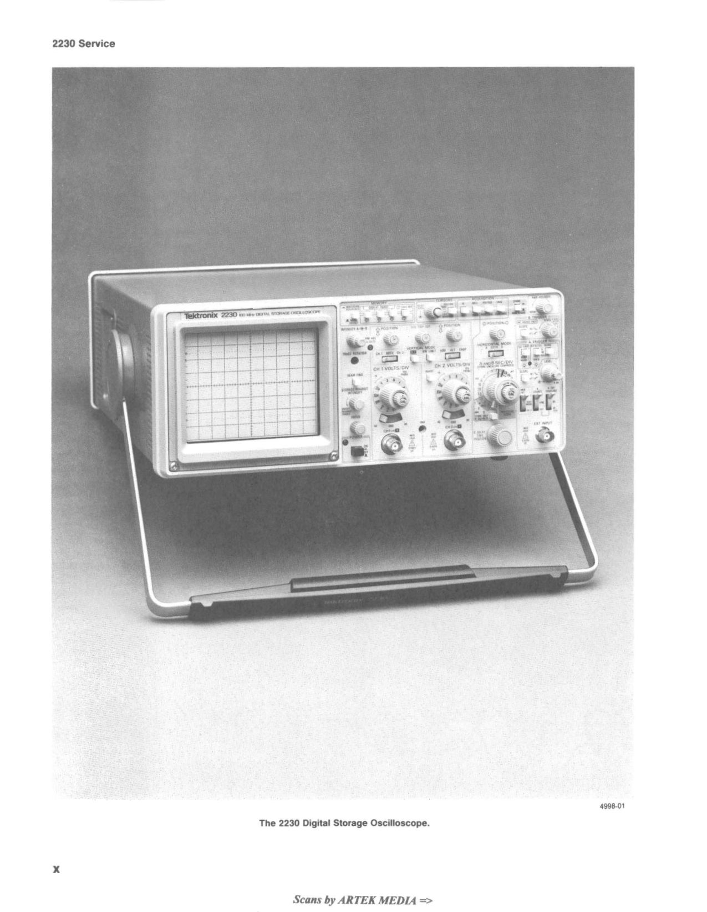


<details><summary>OCR text on this page</summary>

```
2230 Service 
The 2230 Digital Storage Oscilloscope. 
Scans by AR TEK MEDL4 =>
```

</details>


---

## Page 14 of 451

Section 1-2230 
Service 
INTRODUCTION 
The TEKTRONIX 2230 Oscilloscope is a combination 
nonstorage and digital storage dual-channel 100 MHz 
bandwidth instrument. It is a rugged, lightweight oscillo- 
scope 
featuring 
microprocessor 
operation 
and 
alphanumeric crt readout of many of the front-panel con- 
trols. In the digital storage mode, up to three waveform 
sets (CH 1 and/or CH 2) may be stored in a SAVE REF 
memory and recalled for display at a later time. The verti- 
cal system provides calibrated deflection factors from 
2 mV per division to 5 V per division. The horizontal sys- 
tem provides calibrated sweep speeds from 50 ns per divi- 
sion to 0.5 s per division for nonstorage mode with three 
slower sweep speeds (1 s, 2 s, and 5 s per division) added 
for store mode operation. A XI0 magnifier extends the 
maximum sweep speed to 5 ns per division. 
The digital storage sampling rate is 20 megasamples 
per second maximum, and the acquired record length is 
4K samples (1 K may also be selected) for a single channel 
or 2K samples for dual-channel (CHOP or ALT) displays. 
Any contiguous 1K sample of an acquired record is 
displayable. The fast sampling rate can capture a glitch 
with a pulse width of at least 100 ns. A 4K compress 
feature enables a 4K record length acquisition to be 
compressed to 1K in length for ease in viewing or storing 
in the SAVE REF memory. If compression is not desired, 
all 4K or any 1 K portion of a 4K record may be stored in 
the SAVE REF memory. The SAVE store mode stops the 
waveform acquisition in progress, allowing a particular 
display to be stored or examined before further acquisi- 
tions cause a waveform update. 
Cursors may be used to obtain voltage measurements, 
time difference measurements, and delay-time measure- 
ments on any of the store mode waveform displays. Delta 
volts, delay time, delta time, and lldelta time (either delta 
time or lldelta time is selectable via the MENU) are 
displayed in the crt readout for ease in obtaining precise 
measurement results. The cursors are positioned to any 
displayed store mode waveform to make measurements. 
An alternate use of the cursor-positioning control is to hor- 
izontally position the 1K display window to any location 
within a 4K record length waveform acquisition. The 
displayed portion of a 4K acquisition is stored when the 
SAVE REF feature is used. 
The instrument is shipped with the following standard 
accessories: 
1 Operators Manual 
1 Users Reference Guide 
2 Probe Packages 
1 Front Panel Cover 
1 Accessory Pouch 
1 Power Cord 
1 Fuse 
1 DB-9 Male Connector and Connector Shell 
1 Loop Clamp 
1 Flat Washer 
1 Self-Tapping Screw 
For part numbers and further information about both 
standard and optional accessories, refer to "Options and 
Accessories" (Section 7) of this manual. Your Tektronix 
representative, local Tektronix Field Office, or Tektronix 
products catalog can also provide additional accessories 
information. 
The following electrical characteristics (Table 1-1) are 
valid when the instrument has been adjusted at an 
ambient temperature between +20° C and +30°C, has 
had a warm-up period of at least 20 minutes, and is 
operating at an ambient temperature between 0°C and 
+50°C (unless otherwise noted). 
Items listed in the "Performance Requirements" column 
are verifiable qualitative or quantitative limits that define 
the measurement capabilities of the instrument. 
Environmental characteristics are given in Table 12. 
This instrument meets the requirements of MIL-T-28800C 
for Type Ill, Class 5 equipment, except where noted other- 
wise. 
Physical characteristics of the instrument are listed in 
Table 1-3.


---

## Page 15 of 451

General Information-2230 Service 
Finite resolution affects any 
measurement using 
discrete numbers. All digital storage stores amplitude 
values as discrete numbers and associates those ampli- 
tude numbers with discretely numbered times. Many mea- 
surements must be rounded or truncated. The size of the 
truncation or rounding becomes a part of the measure- 
ment error. For example, the following line is 1.5 units 
long. If it must be drawn as a line connecting points one 
unit apart, then it may be drawn as a line one unit long or 
two units long, depending on how it occurs relative to the 
points. 
Case 1 : Line approaches three points: 
lnput line 
. 
Measurement resolution 
Output line 
Case 2: Line approaches two points: 
lnput line 
. 
Measurement resolution 
Output line 
There are several places where measurements are 
quantified, and a one-count error in the measurement can- 
not be detected. The input channels are digitized to an 8- 
bit resolution, where one division is (ignoring expansion 
and compression) 25 counts. This means there is an 
inherent error of 1/25 of a division in any voltage measure- 
ment at acquisition time. Averaging can increase the reso- 
lution of a voltage measurement above the sampler's 
eight-bit limit. To use the increased resolution, the display 
has a 10-bit dynamic range in the vertical axis, as well as 
the horizontal axis. An averaged signal has a resolution of 
100 points per division (ignoring expansion and compres- 
sion). In addition, the averaged number is stored with up 
to twelve bits of resolution. Expansion is required to view 
the eleventh and twelfth bits of increased resolution. 
Time is quantified to determine when each sample 
occurred and which display interval gets each sample. 
Time is resolved by storing, for example, 4K points. If 4K 
points are stored, 4K time intervals are represented. How- 
ever, in 4K mode, not all of the 4K-point resolution may be 
displayed on the 10-bit (1K-point) screen. Therefore, if 4K 
COMPRESS is selected to present the whole picture on- 
screen at once, only 1K resolution remains in the display. 
When peak-detected information is acquired, events with 
high-frequency content such as fast steps, or short pulses, 
can only be located within the time interval from which the 
peaks came. Even though two display points result from 
the interval, the event cannot be tied with certainty to the 
first or second point in the interval. 
Time is also quantified to determine where to put points 
in REPETITIVE acquisitions, where the points acquired at 
50 ns intervals fill only part of the screen. A counting 
device produces a number to represent the portion of 
50 ns between the samples acquired and the ones that 
would have included the trigger. This number ranges from 
0 to about 205, which allows accurate placement into the 
display record. The display record will have at most 100 
slots to choose from on the basis of the 0-205 number 
(this is where each slot represents 0.5 ns of acquisition 
time, and the counter's resolution is about 0.244 ns per 
count). 
Scans by ARTEK MEDL4 =>


---

## Page 16 of 451

General Information-2230 
Service 
Table 1-1 
Electrical Characteristics 
Deflection Factor 
Characteristics 
Ranae 
1 
2 mVldiv to 5 Vldiv in a 1-2-5 sequence. 
Performance Requirements 
DC Accuracy (NON STORE) 
+15"C to +35"C 
VERTICAL DEFLECTION SYSTEM 
Within -t 2%. 
I 
Within +3%.' 
For 5 mVldiv to 5 Vldiv VOLTSIDIV switch settings, the gain is 
set at a VOLTSIDIV switch setting of 10 mvldiv. 
( 
2 mV/div gain is set with the VOLTSIDIV switch set to 2 mV/div. 
On Screen DC Accuracy (STORE) 
1 
+15"C to +35"C 
I 
Within k2O/0. 
I 
0°C to +50°C 
1 
Within  YO.^ 
STORE Mode gain set with the VOLTSIDIV switch set to 
, 
5 mVldiv. 
- 
- 
- - 
- - 
- 
Storaae Acauisition Vertical Resolution 
1 
8 bits, 25 levels per division. 10.24 divisions dvnamic range.' 
Range of VOLTSIDIV Variable Control 
Continuously variable between settings. Increases deflection fac- 
tor by at least 2.5 to 1. 
Step Response (NON STORE) 
Rise Time 
I 
0°C to +35"C 
5 mVldiv to 5 Vldiv 
1 
Rise time is calculated from: 
Rise Time = 
Step Response (STORE Mode) 
Useful Storage Rise Time 
I 
Single Trace 
CHOPIALT 
Rise time is limited to 3.5 ns minimum with derating over tempera- 
I 
ture (see NON STORE Rise Time). 
SAMPLE 
1 
SECIDIV x 1.6 
SECIDIV x 1.6 
sa 
sa 
100 
50 
aPerformance Requirement not checked in Service Manuel. 
PEAKDET or ACCPEAK with SMOOTH 
Scans by ARTEK MEDL4 - 
SECIDIV x 1.6 
SECIDIV x 1.6 
sa 
sa 
50 
25


---

## Page 17 of 451

General Information-2230 Service 
Table 1-1 (cont) 
1 Vldiv to 5 Vldiv 
Characteristics 
Aberrations (NON STORE and 
STORE in Default Modes) 
2 mVldiv to 50 mV1div 
0.1 Vldiv to 0.5 Vldiv 
NON STORE Bandwidth (-3 dB) 
0°C to +35"C 
5 mVldiv to 5 Vldiv 
Performance Requirements 
+4%, -4'10, 
4% p-p. 
3% or less at +25"C with cabinet installed. 
+6%, -6%, 6% p-p. 
5% or less at +25"C with cabinet installed. 
+35OC to +50°C 
2 mV1div to 5 Vldiv 
NON STORE BW LIMIT (-3 dB) 
AC Coupled Lower Cutoff Frequency 
Useful Storage Performance 
RECORD, SCAN and ROLL Store Modes 
SAMPLE Acquisition, no AVERAGE 
5 psldiv to 5 sldiv 
EXT CLOCK (up to 1 kHz) 
+ 12%, - 12%, 12% P-P.~ 
10% or less at +25"C with cabinet installed. 
Measured with a five-division reference signal, from a 50 R source 
driving a 50 R coaxial cable terminated in 50 R at the input con- 
nector with the VOLTSIDIV Variable control in the CAL detent. 
Vertically center the top of the reference signal. 
DC to at least 100 MHz. 
DC to at least 80 MHz. 
DC to at least 80 MHz.a 
Measured with a vertically centered six-division reference signal, 
from a 50 R source driving a 50 R coaxial cable terminated in 50 R 
at the input connector; with the VOLTSIDIV Variable control in 
the CAL detent. 
20 MHz 2 10%. 
10 Hz or less at -3 dB.a 
Single Trace 
10 
Hza 
SECIDIV 
EXT 
- 
Hz8 
10 
5 
Hza 
SECIDIV 
EXT 
- 
Hza 
20 
Useful storage performance is limited to the frequency where 
there are 10 samples per sine wave signal period at the maximum 
sampling rate. (Maximum sampling rate is 20 MHz in Single trace 
and 10 MHz in CHOP or ALT at a SECIDIV setting of 5 psldiv.) 
This yields a maximum amplitude uncertainty of 5%. Accuracy at 
the useful storage bandwidth limit is measured with respect to a 
six-division 50 kHz reference sine wave. 
aPerformance Requirement not checked in Sewice Manual. 
1-4 
PEAK DETECT 
Sine-Wave Amplitude Capture 
(5% p-p maximum amplitude uncertainty) 
Pulse Width Amplitude Capture 
(50% p-p maximum amplitude uncertainty) 
Scans by AR TEK MEDIA => 
Single Trace and ALT 
CHOP 
1 MHza 
1 MHza 
100 ns 
SECIDIV 
50


---

## Page 18 of 451

General Information-2230 Service 
Table 1-1 (cont) 
SAMPLE and AVERAGE 
I Single Trace 
ALT 
Characteristics 
REPEl-ITIVE Store Mode 
0.05 psldiv 
1 
1 0 o M H ~ ( - 3 d B ) ~ 
100 MHz (-3 dB)b 
Performance Requirements 
0.1 psldiv 
100 MHz (-3 dB)as b 
50 MHz (-3 dB)a 
0.2 psldiv to 2 psldiv 
(5% maximum amplitude uncertainty) 
5 
Hza 
SECIDIV 
ACCPEAK 
0.05 usldiv to 5 sldiv 
Same as NON STORE Band~idth.~ 
AVERAGE Mode 
I 
Resolution 
Sweep Limit 
Weight of Last Acquisition 
Frequency Response 
Adjustable from 1 to 2047 or NO LIMIT. 
112, 114, 118, 1/16, 1/32, 1/64, 11128, or 11256 (MENU  selection^).^ 
AVERAGE mode default weiaht is 114. 
Assuming uncorrelated triggers and greater than 1 LSB of the 8- 
bit acquisition of vertical signal noise; the averaging weight for the 
first acquistion is 1, the averaging weight for the second acquisi- 
tion is 112 and for n acquisitions is 1/2"-'. 
The MENU selects 
the least weight used. Maximum signal-to-noise improvement is 
achieved after 2 x (weight factor) x (expected acquisitions to 
Frequency response of the AVERAGE Storage Mode is a function 
of the number of triggered acquisitions added to the weighted 
a~erage.~ 
STORE Chop Rate 
I 
NON STORE CHOP Mode Switchina Rate 
Time jitter of a signal with respect to the sample clock will pro- 
duce a low-pass filter characteristic of an averaged waveform. 
500 kHz k 30'/0.~ 
SAMPLE 
PEAKDETECT 
STORE Mode Cross Talk 
50/(SEC/DIV) for sweep speeds from 5 s per division to and 
including 10 ps per divi~ion.~ 
25/(SEC/DIV) for sweep speeds from 5 s per division to and 
including 20 ws per divisi0n.a 
5 psldiv through 0.05 psldiv 
AID Converter Linearitv 
- 
- - 
- 
<2% measured in CHOP at 10 rs/di~ and 10 mVldiv using a 
100 kHz square wave signal vertically centered and the other 
input coupling set to ground. 
No CHOP mode; acts as in ALT.a 
Monotonic with no missina codes.8 
aPerformance Requirement not checked in Sewice Manual. 
b~ne-hundred 
MHz bandwidth is derated for temperature outside 0°C to +35OC and at 2 mV per division as for NON STORE. 
Scans by ARTEK MEDU =>


---

## Page 19 of 451

General Information-2230 Service 
Table 1-1 (cont) 
Characteristics 
NON STORE Common-Mode Rejection Ratio 
(CMRR) 
lnput Current 
Performance Requirements 
At least 10 to 1 at 50 MHz. 
Checked at 10 mV per division for common-mode signals of six 
divisions or less with the VOLTSIDIV Variable control adjusted for 
the best CMRR at 50 kHz. 
1 nA or less (0.5 division or less trace shift when switching 
between DC and GND input coupling with the VOLTSIDIV switch 
set to 2 mV Der di~ision.~ 
lnput Characteristics 
Resistance 
I 
1 MQ f 2 Y 0 . ~ 
I 
Maximum Safe lnput Voltage 
(cH 1 and cH 2) 
A 
400 V (dc + peak ac) or 800 V ac p-p at 10 kHz or less.a 
See Figure 1-1 for maximum input voltage vs. frequency derating 
I 
curve. 
NON STORE Channel Isolation 
I 
Greater than 100 to 1 at 50 MHz. 
STORE Channel Isolation 
1 
100 to 1 at 50 MHz. 
POSITION Control Range 
At least + 11 divisions from graticule center. 
AIB SWP SEP Control Range 
(NON STORE Mode Only) 
I 
+ 3.5 divisions or greater. 
Trace Shift with VOLTSIDIV Switch Rotation 
Trace Shift as the VOLTSIDIV Variable Control is 
Rotated 
Scans by ARTEK MEDL4 => 
0.75 division or less; VOLTSIDIV Variable control in the CAL 
detent.a 
1 division or less.a 
Trace Shift with INVERT 
1.5 division or less.a 
aPerformance Requirement not checked in Service Manual.


---

## Page 20 of 451

General Information-2230 Service 
Table 1-1 (cont) 
Characteristics 
I 
Performance Requirements 
-- 
TRIGGERING SYSTEM 
A Trigger Sensitivity 
P-P AUTO and NORM 
1 
10 MHz 
60 MHz 
100 MHz 
Internal 
( 
0.35 div 
1.0 div 
1.5 div 
External 
1 
40 mV 
120 mV 
150 mV 
External trigger signal from a 50 R source driving a 50 R coaxial 
cable terminated in 50 0 at the input connector. 
HF REJ Coupling 
Reduces trigger signal amplitude at high frequencies by about 
20 dB with rolloff beginning at 40 kHz ? 15 kHz. 
Should not trigger with a one-division peak-to-peak 250 kHz sig- 
nal when HF REJ is ON. 
P-P AUTO Lowest Usable Freauencv 
1 
20 Hz with 1 division internal or 100 mV externaLa 
TV LINE 
Internal 
1 
0.35 div 
1.0 div 
1.5 div 
- 
- 
External 
TV FIELD 
B Trigger Sensitivity (Internal Only) 
EXT INPUT 
Maximum lnput Voltage 
35 mV p - ~ . ~ 
2 1 division of composite sync.a 
10 MHz 
60 MHz 
100 MHz 
400 V (dc + peak ac) or 800 V ac p-p at 10 kHz or 1ess.a 
See Figure 1-1 for maximum input voltage vs frequency derating 
curve. 
lnout Resistance 
I 
1 MR k2'/0.~ 
-- 
- - - 
- - 
Input Capacitance 
AC Coupled Lower Cutoff Frequency 
LEVEL Control Range 
A Trigger (NORM) 
INT 
EXT. DC 
20 pF 2 2.5 P F . ~ 
10 Hz or less at -3 dBa 
May be set at any voltage level of the trace that can be di~played.~ 
At least -t 1.6 V. 3.2 V D-D. 
- 
- 
EXT, DC+10 
B Trigger (Internal) 
VAR HOLDOFF Control 
(NON STORE Holdoff) 
'Performance Requirement not checked in Service Manual. 
At least -t 16 V, 32 V p - ~ . ~ 
May be set at any point of the trace that can be disp1ayed.a 
Increases NON STORE A Sweep holdoff time by at least a factor 
of 1O.a 
Acquisition Window Trigger Point 
PRETRIG 
POST TRIG 
Scans by ARTEK MEDL4 - 
STORE holdoff is a function of microprocessor activity and the 
pretrigger acquisition. The VAR HOLDOFF control maintains 
some control over the STORE holdoff by preventing a new trigger 
from being accepted by the storage circuitry until the next (or 
1 
current, if one is in progress) NON STORE holdoff has completed. 
Seven-eighths of the waveform acquisition window is prior to the 
trigger (other trigger points are selectable via the MENU). 
One-eighth of the waveform acquisition window is prior to the 
trigger (other trigger points are selectable via the MENU).


---

## Page 21 of 451

General information-2230 Service 
Table 1-1 (cont) 
A Sweep 
Characteristics 
0.5 sec per division to 0.05 ps per division in a 1-2-5 sequence of 
I 
22 s t e ~ s . ~ 
Performance Requirements 
B Sweep 
HORIZONTAL DEFLECTION SYSTEM 
NON STORE Sweep Rates 
Calibrated Range 
50 ms per division to 0.05 ps per division in a 1-2-5 sequence of 
19 steps.c 
STORE Mode Ranges 
REPETITIVE 
0.05 ps per division to 2 us per divisi0n.a- d 
NON STORE Accuracy 
+15OC to +35OC 
0°C to +50°C 
RECORD 
ROLUSCAN 
Unmagnified 
Magnified 
Within ?2% 
Within +3% 
Within ?3%a 
Within ?4?Aa 
Sweep accuracy applies over the center eight divisions. Exclude 
the first 40 ns of the sweep for magnified sweeps and anything 
beyond the 100th ma~nified division. 
5 ps per division to 50 ms per divisi~n.~? 
0.1 s per division to 5 s per division (A sweep 
STORE Accuracy 
See Horizontal Differential Accuracy and Cursor Time Difference 
Acc~racv.~ 
NON STORE Sweep Linearity 
1 
?5%. 
Digital Sample Rate 
SAMPLE 
(5 psldiv to 5 sldiv) 
Linearity measured over any two of the center eight divisions. 
Exclude the first 25 ns and anything past the 100th division of the 
XI 0 magnified sweeps. 
Single Trace 
CHOPIALT 
100 
50 
Hza 
Hza 
SECIDIV 
SECIDIV 
PEAKDET or ACCPEAK 
(20 psldiv to 5 sldiv) 
REPE'I'ITIVE Store 
0.05 rsldiv to 1 psldiv 
10 MHza 
10 MHza 
(5O0/0 duty factor on each channel in CHOP) 
External Clock 
Ext Clock Loaic Thresholds 
I 
TTL Corn~atible.~ 
Input Frequency 
Digital Sample Rate 
Store Rate 
Duty Cycle 
Up to 1 kHz. 
10 MHz in ACCPEAK and PEAKDET, otherwise it is equal to the 
input frequency .a 
One data pair for every second falling edge.a 
10% or greater (1 00 ps minimum hold time).a 
Scans by ARTEK MEDLQ => 
Maximum Safe Input Voltage 
Input Resistance 
25 V (dc + peak ac) or 25 V p p ac at 1 kHz or less.a 
>20 k a a 
aPerformance Requirement not checked in Senice Manual. 
CThe X I 0 MAG control extends the maximum sweep speed to 5 no per division. 
d ~ h e 
X I 0 MAG control extends the maximum sweep speed to 5 ns per division. The 4K COMPRESS control multiplies the SECIDIV 
by 4.


---

## Page 22 of 451

General Information-2230 Service 
Table 1-1 (cont) 
Horizontal POSll-ION Control Range 
lNON STORE) 
Characteristics 
STORE Mode Dynamic Range 
STORE Mode Resolution 
Acquisition Record Length 
Single Waveform Acquisition Display 
CHOP or ALT Acquisition Display 
Horizontal Variable Sweep Control Range 
Performance Requirements 
10.24  division^.^ 
1024 or 4096 data  point^.^ 
1024 data points (1 00 data points per division across the graticule 
area).a 
512 data points (50 data points per division across the graticule 
areaha 
NON STORE 
Start of the 10th division will position past the center vertical grat- 
icule line: 100th division in XI0 maanified. 
Continuously variable between calibrated settings of the SECIDIV 
switch. Extends the A and the B Sweep speeds by at least a fac 
tor of 2.5 times over the calibrated SECIDIV settinas. 
STORE 
Displayed Trace Length 
NON STORE 
Horizontal Variable Sweep has no affect on the STORE Mode 
time base. Rotating the Variable SECIDIV control out of the CAL 
detent position horizontally compresses a 4K point acquisition 
record to 1 K points in length, so that the whole record length can 
I 
be viewed on .screen. screen readout is altered accordingly. 
I 
I 
Greater than 10 divisions. 
NON STORE Delay Jitter 
STORE 
Delay Time 
0.5 ps per division to 0.5 sec per division 
(A Sweep) 
Delay POSITION Range 
One part or less in 5,000 (0.02%) of the maximum available delay 
time. 
10.24  division^.^ 
Less than (0.5 div + 300 ns) to greater than 10 divisions. 
Delay Time is functional, but not calibrated, at A Sweep speeds 
faster than 0.5 fis per division. 
Delay Time Differential Measurement Accuracy 
(Runs After Delay only) 
+15"C to +35"C 
0°C to +50°C 
+ 1 O h of reading, + 0.3% of full scale (1 0 div). 
-t 2% of reading, * 0.3% of full scale (1 0 div).a 
Exclude delayed operation when the A and B SECIDIV knobs are 
locked together at any sweep speed or when the A SECIDIV 
switch is faster than 0.5 ps per division. Accuracy applies over the 
B DELAY TIME POSITION control range. 
aPerformence Requirement not checked in Sewice Manual. 
Scans by ARTEK MEDLQ *


---

## Page 23 of 451

General Information-2230 Service 
Table 1-1 (cont) 
Vertical 
Characteristics 
Resolution 
1 
10 bits (1 part in 1024).a 
Performance Requirements 
DIGITAL STORAGE DISPLAY 
POSITION Range 
Differential Accuracy 
Any portion of a stored waveform vertically magnified or 
compressed up to 10 times can be positioned to the top and to 
the bottom of the araticule area. 
Display waveforms are calibrated for 100 data points per division. 
Graticule indication of the voltage cursor difference is within 2% of 
the readout value. measured over the center six divisions. 
Position Registration 
CONTINUE to SAVE 
NON STORE to STORE 
1 
Within 20.5 division at VOLTSIDIV switch settings from 2 mV per 
division to 5 V per division. 
Within 2 0.5 division at graticule center at VOLTSIDIV switch set- 
tings from 2 mV per division to 5 V per division. 
SAVE Mode Expansion or 
Compression Range 
Up to 10 times as determined by the remaining VOLTSIDIV 
switch positions up or down. 
2 mV per division acquisitions cannot be expanded, and 5 V per 
division acquisitions cannot be compressed. 
Storage Display Expansion 
Alaorithm Error 
? 0.1 O/O of full scale.a 
SAVE Mode Expansion Range 
Storage Display Compression 
Algorithm Error 
Horizontal 
Resolution 
Differential Accuracy 
+0.16% of reading 2 0.4% of full scale.a 
10 bits (1 part in 1 024).a 
Calibrated for 100 data points per division. 
Graticule indication of time cursor difference is within 22% of the 
readout value, measured over the center eiaht divisions. 
aPerformance Requirement not checked in Senrice Manual. 
Y-T Mode 
Ex~ansion Accuracv 
Scans by ARTEK MEDLQ => 
10 times as determined by the XI0 MAG switch. 
Same as the VerticaLa


---

## Page 24 of 451

General Information-2230 Service 
Table 1-1 (cont) 
Voltaae Difference 
I 
Within 2 3% of the AV readout value. 
Characteristics 
Time Difference 
RECORD or ROLUSCAN 
SAMPLE or AVERAGE 
Performance Requirements 
PEAKDET or ACCPEAK 
1 
2 2 dis~lav intervals. 
DIGITAL READOUT DISPLAY 
CURSOR Accuracy 
A display interval is the time between two adjacent display points 
on a waveform. 
REPETITIVE 
SAMPLE or AVERAGE 
ACCPEAK 
X-Y OPERATION (XI MAGNIFICATION ONLY) 
? (2 display intervals + 0.5 ns). 
2 (4 display intervals + 0.5 n ~ ) . ~ 
NON STORE Accuracy 
1 
Measured with a dc-coupled, five-division reference signal. 
Deflection Factors 
+15"C to +35"C 
/ 
Within ?3%. 
Same as vertical deflection system with the VOLTSIDIV Variable 
controls in the CAL detent position. 
NON STORE Bandwidth (-3 dB) 
1 
Measured with a fivedivision reference signal. 
0°C to +50°C 
Y-Axis 
Within 2 
~ O / O . ~ 
Same as vertical deflection ~ v s t e m . ~ 
X-Axis 
Y-Axis 
NON STORE Phase Difference Between X-Axis 
and Y-Axis Amplifiers 
STORE Accuracy 
RECORD and REPETll-IVE 
Store Modes 
DC to at least 2.5 MHz. 
Same as vertical deflection ~ystern.~ 
2 3 degrees or less from dc to 150 kHza 
Vertical Input Coupling set to DC. 
X-Axis and Y-Axis 
Useful Storage Bandwidth 
STORE Mode Time Difference Between Y-Axis and 
X-Axis Signals 
Same as digital storage vertical deflection ~ y s t e m . ~ 
RECORD. SCAN. and ROLL Modes 
REPETITIVE Store 
100 ns. The X-Axis signal is sampled before the Y-Axis signa1.a 
SECIDIV 
X 4a 
100 
aPerformance Requirement not checked in Service Manual. 
Scans by ARTEK MEDL4 =>


---

## Page 25 of 451

General Information-2230 Service 
Table 1-1 (cont) 
Characteristics 
Z-AXIS 
Performance Requirements 
Output Voltage on PRB ADJ Jack 
Probe Adjust Signal Repetition Rate 
PROBE ADJUST 
0.5 V k 5%. 
1 kHz 2 20'/0.~ 
POWER SUPPLY 
Sensitivity (NON STORE Only) 
Maximum Input Voltage 
A 
Input Resistance 
5 V causes noticeable modulation. Positive-going input decreases 
intensity. 
Usable frequency range is dc to 20 MHz. 
30 v (dc + peak ac) or 30 v p-p ac at 1 kHz or 
> 10 kR.a 
CRT DISPLAY 
Line Voltage Range 
Line Frequency 
Maximum Power Consumption 
Line Fuse 
Primary Circuit Dielectric Requirement 
90 Vac to 250 V ~ C . ~ 
48 Hz to 440 Hz.a 
85 watts (1 50 VA).a 
2 A, 250 V, slow blow.a 
Routine test to 1500 Vrms, 60 Hz, for 10 seconds without break- 
d0wn.a 
X-Y PLOTTER OUTPUT 
Display Area 
Standard Phosphor 
Nominal Accelerating Voltage 
8 cm X 10 cm.a 
P31 .a 
14 kV.a 
aPerformance Requirement not checked in Service Manual. 
Maximum Safe Applied Voltage, n 
Any Connector Pin 
X and Y Plotter Outputs 
Pen LiftIDown 
Output Voltage Levels 
Series Resistance 
4.2 V Output 
Scans by ARTEK MEDLQ => 
25 V (dc + peak ac) or 25 V p-p ac at 1 kHz or 1ess.a 
Fused relay contacts, 100 mA ma~imum.~ 
500 mV per division k 10%. Center screen is 0 V + 0.2 division. 
2 kR + 1 O%.a 
4.2 V + 10% through 2 kR.a


---

## Page 26 of 451

General Information-2230 Service 
Table 1-2 
Environmental Characteristics 
The instrument meets the following MIL-T-28800C requirements 
1 
for Type Ill, Class 5 equipment, except where noted otherwise. 
1 
Characteristics 
Environmental Requirements 
Temperature 
I 
Performance Requirements 
Instrument meets the requirements of Tektronix Standard 062- 
2853-00, Class 5, except EMI. 
Operating 
Operating 
Nonoperating 
Altitude 
To 4,500 meters (15,000 feet). Maximum operating temperature 
I 
decreases 1 "C E r 1.000 feet above 5.000 feet. 
0°C to +50°C (+32"F to +122"F). 
-55°C to +75"C (-67°F to +167"F). 
Tested to MIL-T-28800C, para 4.5.5.1.3 and 4.5.5.1.4, except that 
in para 4.5.5.1.3 steps 4 and 5 are performed before step 2 
(-55°C 
nonoperating test). Equipment shall remain off upon 
return to room ambient temperature during step 6. Excessive con- 
densation shall be removed before operating during step 7. 
EM1 (electromagnetic interference) 
Nonoperating 
Humidity 
Operating and Nonoperating 
Meets radiated and conducted emission requirements per VDE 
1 
0871, Class B, 
To 15,000 meters (50,000 feet). 
5 cycles (120 hours) referenced to MIL-T-28800C para 4.5.5.1.2.2 
for Type Ill, Class 5 instruments. Operating and nonoperating at 
95%, -5% to +O%, relative humidity. Operating, +30°C to 
+50°C; nonor>eratina. +30°C to +60°C. 
Vibration 
Operating and Nonoperating 
To meet EM1 regulations and specifications, use the specified 
shielded cable and metal connector housing with the housing 
grounded to the cable shield on the AUXILIARY CONNECTOR. 
Operating 
30 g, half-sine, 11 ms duration, three shocks per axis each direc- 
1 
tion. for a total of 18 shocks. 
15 minutes along each of three major axes at a total displacement 
of 0.015 inch p-p (2.4 g at 55 Hz) with frequency varied from 
10 Hz to 55 Hz to 10 Hz in one-minute sweeps. Hold for 10 
minutes at 55 Hz in each of the three major axes. All major reso- 
nances are above 55 Hz. 
Scans by ARTEK MEDLQ - 
Shock


---

## Page 27 of 451

General Information-2230 Service 
Table 1-3 
Physical Characteristics 
See Figure 1-2 for dimensional drawing. 
Characteristics 
Weight 
I 
Description 
With Power Cord, Cover, 
Probes, and Pouch 
With Power Cord Onlv 
Width 
With Handle 
9.4 kg (20.7 Ib). 
8.2 ka (1 8 Ib). 
Domestic Shipping Weight 
Height 
Without Handle 
1 
327 mm (12.9 in). 
12.2 kg (26.9 Ib). 
137 mm (5.4 in). 
Depth 
With Handle Extended 
1 
510 mm (20.1 in). 
With Front Cover 
Without Front Cover 
VOLTS 
IDC PLUS 
445 mm (17.5 in). 
435 mm (17.1 in). 
Figure 1-1. Maximum input voltage vs frequency derating curve for CH 1 OR X, CH 2 OR Y, and EXT INPUT connectors. 
PEAK AC I 
400 
300 
200 
100 
50 
2 0 
l 0 
l 0 K H z 
50 KHz 
100 KHz 
500 KHz 
1 
MHz 
100 
Scans by ARTEK MEDL4 * 
MHz 
FREQUENCY 
4207-28


---

## Page 28 of 451

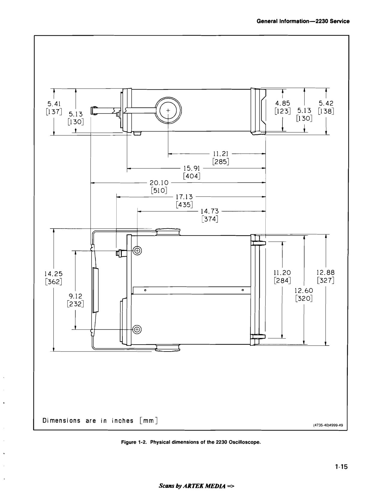


<details><summary>OCR text on this page</summary>

```
General Information-2230 
Service 
Figure 1-2. Physical dimensions of the 2230 Oscilloscope. 
1 
Scans by AR TEK MEDL4 * 
t 
5.41 
L 
I 
' 
C 
5.13 
' 
ili 
- 
15.91 
- 
20.10 
[4 0 41 
C 
L 
C 
14.25 
[3621 
1 
I 
9.12 
[2 321 
I 
Dimensions are i n inches [ m m ] 
(4735-40)4999-49 
[1301 
t 
-
```

</details>


---

## Page 29 of 451

Section 2-2230 
Service 
PREPARATION FOR USE 
SAFETY 
This part of the manual tells how to prepare for and to 
proceed with the initial start-up of the instrument. 
Refer to the Safety Summary at the front of this 
manual for power source, grounding, and other safety con- 
siderations pertaining to the use of the instrument. Before 
connecting the oscilloscope to a power source, read 
entirely both this section and the Safety Summary. 
LINE VOLTAGE 
This instrument is capable of continuous operation with 
input voltages that range from 90 V to 250 V with source 
voltage frequencies from 48 Hz to 440 Hz. 
POWER CORD 
A detachable three-wire power cord with a three- 
contact plug is provided with each instrument for connect- 
ing to both the power source and protective ground. The 
power cord may be secured to the rear panel by a cord- 
set-securing clamp (see Figure 2-1). The protective-ground 
contact in the plug connects (through the protective- 
ground conductor) to the accessible metal parts of the 
instrument. For electrical-shock protection, insert this plug 
only into a power-source outlet that has a properly 
grounded protective-ground contact. 
Instruments are shipped with the power cord specified 
by the customer. Available power-cord information is 
presented in Figure 2-2, and part numbers are listed in 
'Options and Accessories" (Section 7). Contact your 
Tektronix representative or local Tektronix Field Office for 
Figure 2-1. 
Securing the detachable power-cord to the 
additional power-cord information. 
instrument. 
SHOCK THE POWER 
CORO PROTECTIVE 
t X T 2 AXIS INPUT 
l O K n POSITIVE GOING 
INPUT OECREASES 
5 VOLT P P CAUSES 
NOTICEABLt MOOULA. 
' 
POWER CORD CLAMP 
FLAT WASHER 
8- 
SELF-TAPPING SCREW 
4998-02 
Scans by ARTEK MEDLQ *


---

## Page 30 of 451

Operating Information-2230 Service 
ANSl C 7 3 11 
NEMA 5 1 5 P 
IEC 8 3 
Universal 
Euro 
240V 
CEE (7).11.IV.Vll 
2 4 O V l 
IEC 8 3 
10-16A 
Reference 
Standards 
. 
Line 
Voltage 
Plug 
Configuralion 
Abbrevaations. 
ANSl - American National Standards Institute 
AS - Standards Association of Australia 
BS - British Standards lnstltution 
CEE - International Commission on Rules for the 
Approval of Electrical Equipment 
IEC - International Electrotechnical Comm~ssion 
NEMA - National Electrical Manufacturer's Associat~on 
SEV - Schwe~zevischer Elektrotechischer Verein 
(2931-2114204-5 
Usage 
North 
Amer~can 
1 5 8 
LlNE 
FUSE 
INPUT DECREASES 
POWER 
CORD 
CONNECTOR 
4998-03 
I 
Figure 2-3. Fuse holder and detachable power-cord connector. 
240. 
Figure 2-2. Optional power-cord data. 
ANSl C 7 3 2 0 
N E M A 6 . 1 5 - P 
IEC 8 3 
5. Reinstall the proper fuse in the fuse cap and replace 
the cap and fuse in the fuse holder by pressing in and giv- 
ing a slight clockwise rotation of the cap. 
LlNE FUSE 
INSTRUMENT Cool-ING 
The instrument fuse holder is located on the rear panel 
(see Figure 2-3) and contains the line-protection fuse. The 
following procedure may be used either to verify that the 
To prevent instrument damage from overheated com- 
proper fuse is installed or to install a replacement fuse. 
ponents, adequate internal airflow must be maintained at 
all times. Before turning on the power, first verify that both 
the fanexhaust holes on the rear panel and the air-intake 
1. Unplug the power cord from the power-input source 
holes on the side panel are free from any obstructions to 
(if plugged in). 
airflow. After turning on the instrument, verify that the fan 
is exhausting air. 
2. Press in the fuse-holder cap and release it with a 
slight counterclockwise rotation. 
START-UP 
3. Pull the cap (with the attached fuse inside) out of 
The instrument automatically performs power-up tests 
the fuse holder. 
of the digital portion of the circuitry each time the instru- 
ment is turned on. The purpose of these tests is to provide 
the user with the highest possible confidence level that the 
4. Verify that the Proper fuse is installed (see the rear- 
instrument is fully functional. If no faults are encountered 
panel fuse nomenclature). 
during the power-up testing, the instrument will enter the 
Scans by AR TEK MEDL4 =>


---

## Page 31 of 451

Operating Information-2230 Service 
normal operating mode. If the instrument fails one of the 
power-up tests, the instrument attempts to indicate the 
cause of the failure. 
If a failure of any power-up test occurs, the instrument 
may still be useable for some applications, depending on 
the nature of the failure. If the instrument functions for 
your immediate measurement requirement, it may be used, 
but refer it to a qualified service technician for repair of the 
problem at the earliest convenience. Consult your service 
department, your local Tektronix Service Center, or your 
nearest Tektronix representative if additional assistance is 
required. 
2. If the instrument is being shipped to a Tektronix 
Service Center for repair or calibration, attach a tag to the 
instrument showing the following: owner of the instrument 
(with address), the name of a person at your firm who may 
be contacted if additional information is needed, complete 
instrument type and serial number, and a description of 
the service required. 
3. Wrap the instrument with polyethylene sheeting or 
equivalent to protect the outside finish and prevent entry 
of packing materials into the instrument. 
REPACKAGING 
4. Cushion the instrument on all sides by tightly pack- 
ing dunnage or urethane foam between the carton and the 
instrument, allowing for three inches of padding on each 
If this instrument is shipped by commercial transporta- 
side (including top and bottom). 
tion, use the original packaging material. Unpack the 
instrument carefully from the shipping container to save 
the carton and packaging material for this purpose. 
5. Seal the carton with shipping tape or with an indus- 
If the original packaging is unfit for use or is not avail- 
trial stapler. 
able, repackage the instrument as follows: 
1. Obtain a corrugated cardboard shipping carton hav- 
ing inside dimensions at least six inches greater than the 
6. Mark the address of the Tektronix Service Center 
instrument dimensions and having a carton test strength 
and your return address on the carton in one or more 
of at least 275 pounds. 
prominent locations. 
Scans by ARTEK MEDU =>


---

## Page 32 of 451

Operating Information-2230 
Service 
CONTROLS, CONNECTORS, 
AND INDICATORS 
The following descriptions are intended to familiarize 
8 
A INTENSITY Control-Adjusts 
the brightness of all 
the operator with the location and function of the O 
NON STORE displayed waveforms. The control has 
instrument's controls, connectors, and indicators. 
POWER AND DISPLAY 
Refer to Figure 2-4 for location of items 1 through 9. 
a 
Internal Graticule-Eliminates 
parallax viewing error 
between the trace and the qraticule lines. Rise-time 
amplitude and measurement- points are indicated at 
the left edge of the graticule. 
@ POWER Switch-Turns 
instrument power on or off. 
Press in for ON; press again for OFF. 
@ Power On Indicator-Lights 
up while instrument is 
operating. 
@ FOCUS Control-Adjusts 
for 
optimum 
display 
definition. Once set, proper focusing is maintained 
over a wide range of display intensity. 
5 
STORAGEIREADOUT INTENSITY Control-Adjusts 
O 
the brightness of the STORE mode displayed 
waveforms and the readout intensity in both STORE 
and NON STORE mode. The fully counterclockwise 
position of the control toggles the STOREINON 
STORE readout on and off. 
@ BEAM FIND Switch-Compresses 
the vertical and 
horizontal deflection to within the graticule area and 
intensifies the display to aid in locating traces that 
are overscanned or deflected outside of the crt view- 
ing area. 
@ TRACE ROTATION Control-Permits 
alignment of 
the trace with the horizontal graticule line. This con- 
trol is a screwdriver adjustment that, once set, 
should 
require 
little 
attention 
during 
normal 
operation. 
no effect on the STORE mode displays or the crt 
readouts. 
B INTENSITY Control-Adjusts 
the brightness of 
the NON STORE B Delayed Sweep and the 
Intensified zone on the A Sweep. The control has no 
effect on STORE mode displays or crt readouts. 
VERTICAL 
Refer to Figure 2-5 for location of items 10 through 19. 
@ VOLTSIDIV Switches-Select 
the vertical channel 
deflection factors from 2 mV to 5 V Der division in a 
1-2-5 sequence. The VOLTSIDIV switch setting for 
both channels is displayed in the crt readout. The 
VOLTS/DIV control settings for displayed waveforms 
containing cursor symbols are shown in the crt 
readout. 
In STORE mode, SAVE waveforms and waveforms 
waiting to be updated between trigger events may 
be vertically expanded or compressed by up to a 
factor of 10 times (or as many VOLTSIDIV switch 
positions remaining-whichever 
is less) by switching 
the corresponding VOLTSIDIV control (waveforms 
acquired at 2 mV/div cannot be expanded and 
waveforms 
acquired 
at 
5 Vldiv 
cannot 
be 
compressed). The VOLTSIDIV readout reflects the 
vertical scale factor of the displayed waveform. If the 
VOLTSIDIV switch is switched beyond the available 
expansion or compression range, the readout is 
tilted to indicate that the VOLTSIDIV switch setting 
and the VOLTSIDIV readout no longer agree. 
1X PROBE-Front-panel 
marking that indicates 
the deflection factor set by the VOLTS/DIV switch 
when a XI probe or a coaxial cable is attached to 
the channel input connector. 
10X PROBE-Front-panel 
marking that indicates 
the deflection factor set by the VOLTSIDIV switch 
when a properly coded 10X probe is attached to 
the channel input connector. 
Scans by AR TEK MEDL4 =>


---

## Page 33 of 451

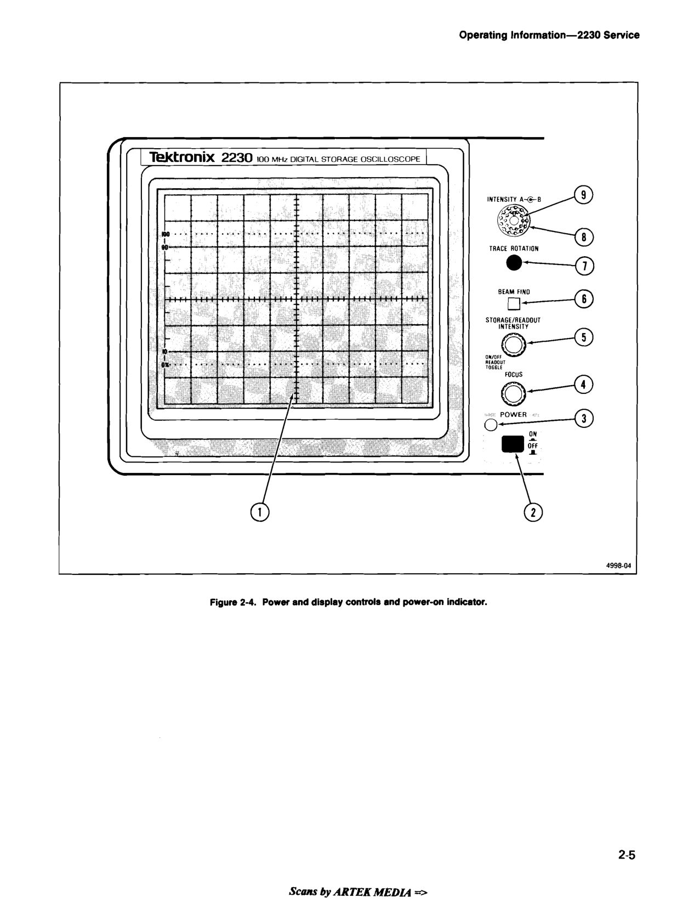


<details><summary>OCR text on this page</summary>

```
Operating information-2230 Service 
INTENSITY AeB 
TRACE ROTATION 
STORAGEIREADOUT 
Figure 2-4. Power and display controls and power-on indicator. 
Scam by ARTEK MEDL4 *
```

</details>


---

## Page 34 of 451

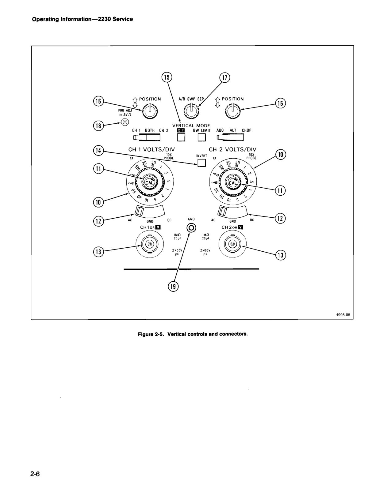


<details><summary>OCR text on this page</summary>

```
Operating Information-2230 
Service 
= 5vn 
VERTICAL MODE 
v@ 
CH I BOTH 
CH I 
BW LIMIT 
A00 
ALT 
CHOP 
CH 2 VOLTS/DIV 
AC 
4998-05 
Figure 2-5. Vertical controls and connectors.
```

</details>


---

## Page 35 of 451

Operating Information-2230 
Service 
If properly coded probes (1X. lox, or IOOX, see 
@ CH 1 OR X and CH 2 OR Y Input Connectors- 
Table 2-1) are connected to a channel input connec- 
Provide for application of signals to the inputs of the 
tor, the crt VOLTSIDIV readout will reflect the 
vertical deflection system and the storage acquisition 
correct deflection factor of the display. 
system. 
Table 2-1 
Probe Coding 
Probe 
1 X 
11 Variable VOLTSIDIV Controls-Provide 
continu- 
o OUSIV variable 
uncalibrated 
deflection 
factors 
Coding Resistance 
Infinite 
1 OOX 
IDENTIFY 
bet&een the calibrated positions of the VOLTSIDIV 
controls. The VOLTSIDIV sensitivity is reduced by 
up to at least 2.5 times the sensitivity at the fully 
counterclockwise position of the variable knob. A 
detent at the fully clockwise position indicates the 
calibrated VOLTSIDIV position of the variable knob. 
The uncalibrated condition is indicated by a greater- 
than symbol (>) in front of the affected VOLTSIDIV 
readout. 
5.6 kR - 10% to 6.2 kR + 10% 
0 52 or none of the above 
@ AC-GND-DC (Input Coupling) Switches-Select 
the 
method of coupling the input signal to the CH 1 and 
CH 2 vertical amplifiers and the storage acquisition 
system. 
AC-Capacitively 
couples the input signal to the 
vertical deflection and signal acquisition systems. 
The DC component of the input signal is blocked. 
The lower -3 dB bandpass is 10 Hz or less. 
Selection of AC input coupling is indicated in the 
readout by a tilde symbol (-) over the V on the 
associated channel's VOLTSIDIV readout. 
GND-Grounds 
the input of the vertical amplifier; 
provides a zero (ground) reference voltage display 
(does not ground the input signal). In STORE 
mode, the ground reference is acquired and 
displayed in the first sample location of the 
acquisition waveform display. When GND input 
coupling is selected, a ground symbol is displayed 
in the associated VOLTSIDIV readout. 
Coding-ring contacts on each of the input connec- 
tors are used to automatically switch the scale factor 
displayed by the crt readout when a properly coded 
probe is attached to the input connector. Displayed 
STORE mode waveforms are reformatted to main- 
tain the correct deflection as indicated by the 
VOLTSIDIV readout on the affected channel(s). In 
X-Y mode, the signal connected to the CH 1 OR X 
input controls the horizontal deflection, and the sig- 
nal connected to the CH 2 OR Y input controls the 
vertical deflection. 
14 CH 2 INVERT Switch-Inverts 
the Channel 2 display 
O 
and STORE mode Channel 2 acquisition signal when 
pressed in. An invert symbol (1) is displayed with the 
CH 2 VOLTSIDIV readout when CH 2 is inverted. 
With CH 2 inverted, the oscilloscope may be 
operated as a differential amplifier when the Vertical 
MODE of BOTH-ADD is selected. 
@ VERTICAL MODE Switches-Select 
the mode of 
operation for the vertical amplifier. There are two 
three-position switches and one two-position switch 
that determine display and acquisition modes and 
one two-position push-button switch that controls 
the nonstore bandwidth. 
CH 1-Selects 
only the Channel 1 input signal for 
acquisition or display. 
BOTH-Selects 
a combination of Channel 1 and 
Channel 2 input signals for acquisition or display. 
'The CH 1-BOTH-CH 2 switch must be in the 
BOTH position for ADD, ALT, and CHOP opera- 
tion. 
CH 2-Selects 
only the Channel 2 input signal for 
acquisition or display. 
ADD-Displays 
(NON STORE) or acquires and 
then displays (STORE) the sum of the Channel 1 
and Channel 2 input signals when BOTH is also 
selected. The difference of the Channel 1 and 
Channel2 
input 
signals is displayed (NON 
STORE) or acquired and then displayed (STORE) 
when the Channel 2 signal is inverted. 
DC-All 
frequency components of the input signal 
are coupled to the vertical deflection and signal 
ALT-Alternately 
displays the nonstore Channel 
acquisition systems. When DC input coupling is 
1 and Channel 2 input signals. The nonstore alter- 
selected, no additional indicators are displayed 
nation occurs during retrace at the end of each 
with the associated VOLTSIDIV readout. 
sweep. ALT Vertical MODE is most useful for 
Scans by ARTEK MEDL4 -


---

## Page 36 of 451

Operating Information-2230 Service 
acquiring and viewing both channel input signals 
at sweep rates of 0.5 ms per division and faster. 
Channel 1 and Channel 2 STORE mode signals 
are acquired on alternate acquisition cycles at 
one-half the sampling rate of a single-channel 
acquisition. 
CHOP-Switches 
the nonstore display between 
the Channel 1 and Channel 2 vertical input sig- 
nals during the sweep. The chopped switching 
rate for NON STORE mode (CHOP frequency) is 
approximately 500 kHz. Chopped STORE mode 
signals are acquired on alternate time-base clock 
cycles with each channel being acquired at one- 
half the sampling rate of a single-channel acquisi- 
tion. In STORE mode at sweep speeds of 5 ps 
per division or faster, CHOP becomes ALT mode. 
BW LIMIT Switch-When 
pressed in while in 
NON STORE mode, the bandwidth of the vertical 
amplifier system and the A Trigger system is lim- 
ited to approximately 20 MHz. This reduces 
interference from unwanted high-frequency sig- 
nals when viewing low-frequency signals. In 
STORE mode, pressing in the BW LIMIT switch 
reduces only the trigger bandwidth. Press the 
switch a second time to release the switch and 
regain full bandwidth. 
X-Y Switch-Automatically 
selects X-Y mode 
when pressed in. The CH 1 input signal provides 
horizontal deflection for X-Y displays, and the 
CH 2 input signal provides vertical deflection. In 
STORE mode, CH 1 and CH 2 signals are 
acquired in a chopped manner with no more than 
100 ns between corresponding sample points on 
opposite channels, with the CH 1 signal being 
sampled before the CH 2 signal. The sampling 
mode and sampling rate are controlled by the A 
or the B SECIDIV switch (depending on the Hor- 
izontal Display mode). The X-Y waveform is 
acquired in SAMPLING mode and displayed with 
dots. Set the SECIDIV controls to obtain at least 
10 samples per cycle of the highest frequency 
component in both the X and the Y input signals. 
The sampling rate is determined by the formula 
50/(SEC/DIV) Hz. 
Vertical POSITION Controls-Control 
the vertical 
display position of the CH 1 and CH 2 signals. 
In STORE mode, the controls determine the vertical 
position of displayed waveforms during acquisition 
and in SAVE mode. Any portions of a signal being 
acquired that are outside the dynamic range of the 
AID converter are blanked when positioned on 
screen. The Vertical POSITION controls can also 
reposition a vertically expanded SAVE waveform so 
that portions of the waveform outside the graticule 
area can be observed. 
In NON STORE X-Y mode, the CH 2 POSITION con- 
trol vertically positions the display, the horizontal 
POSITION control positions the display horizontally, 
and the CH 1 POSITION control is not active. In 
STORE mode, the CH 1 POSITION control is active, 
and both it and the Horizontal POSITION control 
affect the horizontal position of the displayed 
waveform. 
@ AIB SWP SEP Control (NON STORE only)-While 
in NON STORE mode, vertically positions the B 
Sweep trace with respect to the A Sweep trace 
when the HORIZONTAL MODE is BOTH. 
@ PRB ADJ Connector-Provides 
an approximately 
0.5 V, 
negative-going, square-wave voltage (at 
approximately 
1 kHz) for compensating voltage 
probes 
and 
checking 
the 
operation of 
the 
oscilloscope's vertical system. It is not intended to 
verify the accuracy of the vertical gain or the hor- 
izontal time-base circuitry. 
@ GND Connector-Provides an auxiliary ground con- 
nection directly to the instrument chassis via a 
banana-tip jack. 
HORIZONTAL 
Refer to Figure 2-6 for location of items 20 through 26. 
20 
SEC/DIV Switches-Determine 
the SECIDIV setting 
O 
for both the NON STORE sweeps and the STORE 
mode waveform acquisitions. To obtain calibrated A 
and B NON STORE sweeps, the Variable SECIDIV 
control must be in the CAL detent. 
In STORE mode, the SECIDIV switches determine 
the default acquisition and display modes, set the 
sampling rate, and establish the seconds-per-division 
scale factor of the displayed waveforms. The 
SECIDIV parameters displayed on the crt readout 
are for the waveforms identified by CLIRSORS. 
Table 2-2 lists the default Storage and Display 
modes with respect to the SECIDIV switch setting 
and the selected Trigger mode. The default modes 
may be changed by selecting the Acq Mode Setup 
Table in the menu. Waveforms of SCAN, and ROLL 
displays are updated one data point at a time. All 
data points of a RECORD display are updated at the 
same time (total record replacement). 
Scam by AR TEK MEDL4 e>


---

## Page 37 of 451

Operating Information-2230 Service 
A SECIDIV Switch-Selects 
the calibrated A 
Sweep rates from 0.5 s to 0.05 psldiv in a 1-2-5 
sequence of 22 steps for the A Sweep generator 
and sets the delay time scale factor for delayed- 
sweep operation. 
In STORE mode, the A SECIDIV switch controls 
the default Storage, Acquisition, Process, and 
Display modes when making acquisitions using 
the A Time Base. It also selects the external 
clock signal, from the EXT CLK input, for the 
storage acquisition circuitry. 
B SECIDIV Switch-Selects 
the calibrated B 
Sweep rates from 50 msldiv to 0.05 psldiv in a 
1-2-5 sequence of 19 steps. 
In STORE mode, the B SECIDIV switch controls 
the default Storage, Acquisition, Process, and 
Display modes when making acquisitions using 
the B Horizontal mode. 
UNTRIGGERED mode 
performs 
acquisitions 
without reference to the trigger circuit, and there 
is no trigger marker on the screen. Triggers are 
ignored in STORE mode at SECIDIV settings of 
5 s per division to 0.1 s per division under the 
following conditions: 
ROLL is selected. Selecting ROLL forces the 
screen to continuously update as on a chart 
recorder. Triggers would stop the display. 
ROLL is operational at sweep speeds slow 
Figure 2-6. Horizontal controls. 
Table 2-2 
Default Digital Storage Modes 
UN-TRIGa 
 TRIG^ 
SLOW RECORD 
FAST RECORD 
REPETITIVE 
5 s to 0.1 s 
5 s to 0.1 s 
50 ms to 20 ps 
10 ps to 5 ps 
2 ps to 0.05 ps 
or EXT CLK 
or EXT CLK 
SAMPLEC 
OFF 
OFF 
OFF 
ON 
OFF 
AVERAGEC 
- 
OFF 
OFF 
OFF 
ON 
ACCPEAKC 
- 
OFF 
OFF 
OFF 
OFF 
PEAKDETC 
ON 
ON 
ON 
- 
- 
SMOOTHd 
ON 
ON 
ON 
OFF 
OFF 
VECTORS 
ON 
ON 
ON 
ON 
DOTS only 
.See the "UNTRIGGERED" discussion. 
bSee the "TRIGGERED" discussion. 
=These Storage modes are mutually exclusive. 
dWorks with ACCPEAK and PEAKDET only. 
Scans by ARTEK MEDU =>


---

## Page 38 of 451

Operating Information-2230 
Service 
enough that the acquisition can manually be 
stopped when events of interest are observed. 
P-P AUTO is selected. P-P AUTO provides a 
baseline in the absence of triggers from the 
input signal. The circuit considers the absence 
of triggers to be about half of a second without 
a trigger. Below 50 ms per division, the 
triggers are prevented for longer than that by 
the sweep time itself, therefore triggers are 
ignored. 
TRIGGERED mode performs triggered acquisi- 
tions in STORE mode at SECIDIV settings of 5 s 
per division to 0.1 s per division when triggers 
can be meaningful. Triggers are meaningful in 
SCAN mode if the A TRIGGER mode is NORM or 
SGL SWP. Triggers are not meaningful in ROLL 
mode or in the A TRIGGER Mode of P-P AUTO. 
REPETITIVE Store mode (2 &div 
to 0.05 &div) 
requires a repetitive trigger signal. Sampling 
occurs at the maximum AID conversion rate. If a 
control affecting an acquisition parameter or func- 
tion is changed, the acquisition is reset, and the 
waveform being acquired is cleared on the next 
sample acquired. On each valid trigger, 10 or 
more equally spaced samples are acquired and 
displayed on the waveform record, depending on 
the SECIDIV setting (see Table 2-3). The random 
time delay from the trigger to the following sam- 
ple clock transition is measured by the Clock 
Delay Timer circuit and used to place the acquired 
waveform samples in the correct display memory 
location. Any display location is equally likely to 
be filled. Table 2-3 gives the statistically expected 
number of trigger events required to completely 
fill the display, assuming a uniform distribution of 
trigger events relative to the sample interval. 
FAST RECORD Storage mode (5 ~ s l d i v to 
10 F ~ / d i ~ ) 
updates a full record of the acquired 
waveform. 
SLOW RECORD Storage mode (20 ~ s l d i v to 
50 msldiv) updates a full record of the acquired 
waveform. 
SCAN Storage mode (for NORM TRIGGER mode 
and 0.1 s/div to 5 sldiv or EXT CLOCK) updates 
pretrigger data when a trigger is received. The 
waveform display then scans to the right from the 
trigger point to finish the post-trigger acquisition 
and then freezes. 
SCAN Storage mode (for P-P AUTO TRIGGER 
mode with auto triggers disabled and 0.1 sldiv to 
5 sldiv or EXT CLOCK) continuously updates the 
display serially as each data point is acquired. It 
writes over previous data from left to right. 
ROLL Storage mode (P-P AUTO TRIGGER mode 
and 0.1 sldiv to 5 sldiv or EXT CLOCK) continu- 
ously acquires and displays signals. Triggers are 
disabled. The waveform display scrolls from right 
to left across the crt with the latest samples 
appearing at the right edge of the crt. 
SCAN-ROLL-SCAN Storage mode (SGL SWP 
TRIGGER mode and 0.1 sldiv to 5 sldiv or EXT 
CLOCK) 
serially 
updates 
the 
display. 
The 
waveform display SCANS left to right until the 
pretrigger record is filled, and then ROLLS right 
to left until a trigger is received. It then SCANS 
left to right again to fill the post-trigger acquisition 
record and then freezes (see SGL SWP descrip- 
tion for further details). 
PEAKDET Acquisition mode digitizes and stores, 
in acquisition memory as a data pair, the 
minimum and maximum levels of the input signal 
within the time represented by 1/50 of a division 
UN-MAG (1125 division in CHOP or ALT). 
SAMPLE samples the signal at a rate that pro- 
duces 100 samples per graticule division. In the 
RECORD Sampling modes, the displayed sample 
points are displayed by vectors or dots. For 
REPETITIVE Store mode, the sample points are 
displayed as dots. 
Table 2-3 
Repetitive Store Sampling Data Acquisition 
aExpected acquisitions per waveform for a 50% probability of 
fill. 
Scans by AR TEK MEDLQ =>


---

## Page 39 of 451

Operating Information-2230 Service 
AVERAGE Acquisition mode can be used for mul- 
tiple record averaging. A normalized algorithm is 
used for continuous display of the signal at full 
amplitude during the averaging process. The 
amplitude resolution increases with the number of 
weighted acquisitions included in the display. The 
default mode for REPETITIVE Store mode is 
AVERAGE. The averaging weight (the number of 
weighted waveform acquisitions included in each 
average display) is MENU selectable. The default 
average weight is 114. The number of sweeps 
(SWP LIMIT) allowed to occur before averaging 
stops is also MENU selectable. The averaging 
process is reset by changing any control that 
causes an acquisition reset. 
ACCPEAK Acquisition mode causes accumulation 
of peaks over multiple acquisitions. The largest 
maximum and smallest minimum samples are 
retained for each trigger-referenced acquisition 
record. For 20 ws per division to 5 s per division, 
hardware peak detection is used, updating max- 
imum and minimum samples within each time 
base clock period. The ACCPEAK display is reset 
by changing any control that causes an acquisi- 
tion reset. ACCPEAK mode is valid for triggered 
acquisitions only and is not operational in untrig- 
gered modes (see Table 2-2). 
SMOOTH Processing mode reorders acquired 
data for correct slope and interpolates the data 
for drawing a smooth waveform. Smoothing looks 
at the change in data point values between adja- 
cent sample intervals. If the change in value does 
not exceed certain limits, the values are inter- 
preted as a continuous slope for drawing vectors 
or dots. If the value change exceeds the inter- 
preted "no-change" limit, the data point value is 
not modified, and the vectors drawn in the display 
will show a discontinuity in the waveform. This 
method of display of the waveform data provides 
a smoothed display of the waveform, yet retains 
the glitch-catching capabilities of PEAKDET or 
ACCPEAK modes. 
STORE Mode A SECIDIV Multiplier-Functions 
only in the STORE mode at SECIDIV switch settings 
of 0.1, 0.2, and 0.5 sldiv. When pressed in, the A 
Sweep time base of these three settings is increased 
by a factor of 10 to 1 sldiv, 2 sldiv, and 5 sldiv. 
Releasing the button returns the STORE mode time 
base to XI. The XI0 MAG control is still functional 
on waveforms acquired at the slow STORE mode 
SECIDIV settings. 
22 
Variable SECIDIV and 4K COMPRESS Control- 
' 
Controls the NON STORE sweep time per division 
and compresses STORE mode waveform records. 
Variable 
SECIDIV-Continuously 
varies 
the 
uncalibrated NON STORE sweep time per division 
to at least four times the calibrated time per divi- 
sion set by the SECIDIV switch (increases the 
slowest NON STORE A Sweep time per division 
to at least 2 s). The Variable SECIDIV control 
does not affect the storage time base for acquir- 
ing or displaying signals. 
4K COMPRESS-If 
the Variable SECIDIV control 
is rotated out of the CAL detent position during 
waveform acquisitions or SAVE mode, a 4K 
record is compressed by a factor of four (4K 
COMPRESS) to display the acquired data in one 
display 
window. 
For 
4K 
COMPRESS the 
SECIDIV is further multiplied by 4. In PEAKDET 
or ACCPEAK acquisition modes, peaks are 
acquired but not displayed when 4K COMPRESS 
is selected. 
@ XI0 Magnifier Switch-Magnifies 
the NON STORE 
displays or expands the STORE acquisition and 
SAVE 
waveform displays by 10 times. STORE mode 
displays are expanded when the Variable SECIDIV 
knob is pulled to the out position (XI0 PULL). The 
SECIDIV scale factor readouts are adjusted to 
correspond to the correct SECIDIV of the displayed 
waveform 
(either 
NON 
STORE 
or 
STORE). 
Magnification of the NON STORE displays occurs 
around the center vertical graticule division; STORE 
mode displays are expanded around the active CUR- 
SOR. The display window for STORE mode XI0 
expanded waveforms may be positioned using the 
CURSORS Control to view any one-window portion 
of the acquisition record. 
@ HORIZONTAL 
MODE 
Switch-Determines 
the 
operating mode of the horizontal deflection system in 
both NON STORE and STORE. For STORE mode, 
the switch selects the acquisition time base and 
storage mode (either A SECIDIV or B SECIDIV). 
A-Only 
the A Sweep is displayed. NON STORE 
time base and STORE acquisitions are controlled 
by the A SECIDIV switch. The A SECIDIV switch 
setting is displayed on the crt readout. 
BOTH-Alternates 
the NON STORE display 
between the A Intensified and B Delayed Sweeps. 
Scans by ARTEK MEDLQ


---

## Page 40 of 451

Operating Information-2230 Service 
The STORE mode display is the A Intensified 
TRIGGER 
trace only. The intensified zone on the A trace 
indicates the approximate delay position and 
Refer to Figure 2-7 for location of items 27 through 38. 
length of the B Delayed Sweep. The displayed 
position of the intensified zone is updated after 
each trigger. The A SECIDIV, B SECIDIV, and B 
NOTE 
DELAY TlME POSITION settings are displayed 
The Trigger controls affect the acquisition of the 
on the crt readout. In BOTH, STORE mode 
next waveform. They are inactive in SAVE Acquisi- 
acquisitions are controlled by the A SECIDIV 
tion mode. 
switch. 
B-Displays 
either the NON STORE or the 
STORE B sweep trace. ~h~ A SECIDIV, 
B 
27 
A TRIGGER Mode Switches-Determine 
the NON 
SECIDIV, and B DELAY TIME POSITION settings O 
STORE A Sweep triggering mode. STORE mode 
are displayed on the crt readout, just as in BOTH. 
triggering depends on the position of the A SECIDIV, 
The STORE mode waveform acquisitions are con- 
the SCANIROLL switch, and the A Trigger mode. 
trolled by the B SECIDIV switch. 
The trigger position is marked by a T on acquired 
waveforms. 
@ B DELAY TlME POSITION Control-Adjusts 
the 
delay between the start time of the A Sweep and the 
time that the B Sweep either starts (RUNS AFTER 
DLY) or can be triggered (Triggerable After Dly). (The 
A Sweep does not have to be displayed.) The delay 
time is variable from 0.5 to 10 times the A SECIDIV, 
plus 300 ns. 
In Triggerable After Delay, the delay time readout 
indicates the time that must elapse after the A 
trigger before the delayed sweep or delayed acquisi- 
tion can be triggered; not the actual position of the 
trigger point. However, the readout of the delay time 
on the crt follows the setting of the B DELAY TlME 
POSITION control in either B Trigger mode. 
The setting of the 1Kl4K switch affects the delay 
time position setting for STORE mode displays by a 
factor of approximately four times. When switching 
between 1K and 4K record lengths, the delay time 
position setting must be readjusted to obtain the 
same delay time. 
@ Horizontal POSlTlON Control-Positions 
all the 
NON STORE waveforms horizontally over a one- 
sweep-length range (either XI or XI0 Magnified). 
Using the Horizontal POSITION control, STORE 
mode waveforms may be positioned over a range of 
only one display window. When a STORE mode 
acquisition display is longer than one screen (as in 
4K records andlor XI0 MAG), the CURSORS POSI- 
TION control is used to position the display window 
to any position of the acquisition record. The Hor- 
izontal POSITION control does not position the crt 
readout displays. 
Figure 2-7. Trigger controls, connector, and indicator. 
VAR HOLOOFF 
NORM 
B TRIGGER 
~ u r 
SOURCE onlr 
LEVELB:: 
A TRIGGER 
CH 2 
OC 
+10 
EXT INPUT 
4 100V 
4998-07 
Scans by ARTEK MEDLQ


---

## Page 41 of 451

Operating information-2230 Service 
NORM-Permits 
triggering at all sweep rates (an 
autotrigger is not generated in the absence of an 
adequate trigger signal). NORM Trigger mode is 
especially useful for low-frequency and low- 
repetition-rate signals. 
In STORE mode, the last acquired waveform is 
held on display between triggering events. The 
pretrigger portion of the acquisition memory is 
continually acquiring new pretrigger data until a 
trigger event occurs. How the waveform display is 
updated after the trigger occurs, depends on the 
SECIDIV setting. From 5 s per division to 0.1 s 
per division, the 
pretrigger portion of 
the 
displayed waveform is updated by the pretrigger 
data in the acquisition memory, then the post- 
trigger data points are placed in the display as 
they are acquired. For faster sweep speeds, the 
post-trigger data points are acquired in the 
acquisition memory prior to completely updating 
the waveform display, using the newly acquired 
data. 
P-P AUTO-TV 
LINE-In 
NON STORE mode, 
triggering occurs on trigger signals having ade- 
quate amplitude and a repetition rate of about 
20 Hz or faster. In the absence of a proper trigger 
signal, an autotrigger is generated, and the sweep 
free runs. 
In STORE mode, for SECIDIV settings of 5 s per 
division to 0.1 s per division, the P-P AUTO 
trigger mode is disabled, and the acquisition free- 
runs. At faster SECIDIV settings, triggered 
acquisitions occur under the same conditions as 
NON STORE mode P-P AUTO triggering, and the 
acquisition free-runs if proper triggering conditions 
are not met. The manner in which the display is 
filled and updated is the same as for NORM 
triggering. 
For either NON STORE or STORE mode, the 
range of the A 'TRIGGER LEVEL control is 
automatically restricted to the peak-to-peak limits 
of the trigger signal for ease in obtaining trig- 
gered displays and acquisitions. P-P AUTO is the 
usual Trigger mode selection to obtain stable 
displays of TV Line information. 
TV FIELD-Permits 
stable triggering on a televi- 
sion field (vertical sync) signal when the P-P 
AUTO and the NORM Trigger buttons are 
pressed in together. In the absence of an ade- 
quate trigger signal, the sweep (or acquisition) 
free-runs. The instrument otherwise behaves as in 
P-P AUTO. 
SGL SWP-Arms 
the A Trigger circuit for a single 
sweep in NON STORE or a single acquisition in 
STORE. Triggering requirements are the same as 
in NORM Trigger mode. After the completion of a 
triggered NON STORE sweep or a STORE SGL 
SWP acquisition, pressing in the SGL SWP but- 
ton rearms the trigger circuitry to accept the next 
triggering event or start the next storage acquisi- 
tion. 
In STORE mode, when the SGL SWP is armed, 
the acquisition cycle begins, but the READY LED 
does not come on until the pretrigger portion of 
the acquisition memory is filled. At the time the 
READY LED comes on, the acquisition system is 
ready to accept a trigger. When a trigger event 
occurs, the post-trigger waveform data is stored 
to complete the single-sweep acquisition. After 
the acquisition is completed, the READY LED 
goes out, and the single sweep can be rearmed. 
The SECIDIV switch setting and the STORE 
mode determine how the display is updated. For 
settings of 5 s per division to 0.1 s per division, a 
storage process known as SCAN-ROLL-SCAN is 
used. The last acquired waveform is erased when 
SGL SWP is armed, then the pretrigger acquisi- 
tion scans from the left edge to the trigger posi- 
tion. At that point, the pretrigger portion of the 
display is rolled left from the trigger position until 
a triggering event occurs. Upon receiving an ade- 
quate trigger, the post-trigger portion of the 
display scans from the trigger point to the right 
until the remaining data points are filled, and then 
the display freezes. 
For SECIDIV settings of 0.05 s per division and 
faster, the display is updated as a full record. The 
previously displayed waveform remains on the crt 
until the post-trigger portion of the acquisition 
memory is filled after a triggering event. Then the 
waveform display is updated with the newly 
acquired data in its entirety. 
READY-TRIG'D 
Indicator-A 
dual-function LED 
indicator. In P-P AUTO and NORM Trigger modes, 
the LED is turned on when triggering occurs. In SGL 
SWP Trigger mode, the LED turns on when the A 
Trigger circuit is armed, awaiting a triggering event, 
and turns off again after the single sweep (or 
acquisition) completes. 
In STORE mode, pressing the SGL SWP button to 
arm the trigger circuitry does not immediately turn 
on the READY LED. The pretrigger portion of the 
acquisition memory starts filling after the SGL SWP


---

## Page 42 of 451

Operating Information-2230 Service 
button is pressed in; the READY LED is turned on 
when the filling is completed. The storage acquisition 
system is then ready to accept a triggering event. 
The READY LED is turned off after an acquisition is 
completed. 
@ A TRIGGER LEVEL Control-Selects 
the amplitude 
point on the A Trigger signal that produces trigger- 
ing. The trigger point for STORE mode is identified 
by a T on the acquired waveform. 
@ HF REJECT Switch-Rejects 
(attenuates) the high- 
frequency components (above 40 kHz) of the trigger 
signal when the control is in the ON posiltion. 
@) 
A TRIGGER SLOPE Switch-Selects 
either the 
positive or negative slope of the trigger signal to 
start the NON STORE A Sweep or to reference the 
next STORE mode acquisition cycle. 
@ A&B INT Switch-Determines 
the source of the 
internal trigger signal for both the A and the B 
Trigger Generator circuits. 
CH 1-Trigger 
signal is obtained from the CH 1 
input. 
VERT MODE-Trigger 
signal is obtained alter- 
nately from the CH 1 and CH 2 input signals if the 
VERTICAL MODE is ALT. In the CHOP VERTI- 
CAL MODE, the trigger signal is the sum of the 
CH 1 and CH 2 input signals. 
CH 2-Trigger 
signal is obtained from the CH 2 
input. The CH 2 INVERT switch also inverts the 
polarity of the internal CH 2 trigger signal so the 
displayed slope agrees with the Trigger SLOPE 
switch. 
@ A SOURCE Switch-Determines 
if the SOURCE of 
the A Trigger signal is internal, external, or from line. 
INT-Routes 
the internal trigger signal selected 
by the A&B INT switch to the A Trigger circuit. 
LINE-Routes 
a sample of the ac power source 
to the A Trigger circuit. 
EXT-Routes 
the signal applied to the EXT 
INPUT connector to the A Trigger circuit. 
@ A EXT COUPLING Switch-Determines 
the method 
of coupling the signal applied to the EXT INPUT con- 
nector to the input of the A Trigger circuit. 
AC-Input 
signal is capacitively coupled, and the 
dc component is blocked. 
DC-All 
frequency components of the external 
signal are coupled to the A Trigger circuit. 
DCe10-Attenuates 
the external signal by a fac- 
tor of 10 before application to the A Trigger cir- 
cuit. As with DC COUPLING, all frequency com- 
ponents of the input signal are passed. 
@ EXT INPUT Connector-Provides 
for connection of 
external signals to the A Trigger circuit. 
@ B 
TRIGGER 
(INT 
SOURCE 
ONLY) 
SLOPE 
Switch-Selects 
either the positive or the negative 
slope of the B Trigger signal that starts the NON 
STORE sweep or completes the STORE acquisition. 
@ B TRIGGER LEVEL Control-Selects 
the amplitude 
point on the B Trigger signal where triggering occurs 
in Triggerable After Delay mode. The B Trigger point 
is displayed as a T on the STORE mode waveform 
display when in B Horizontal mode. The fully clock- 
wise position of the B TRIGGER LEVEL Control 
selects the Runs After Delay mode of operation for 
the B Trigger circuitry. Out of the cw position, B 
Sweep is triggerable after the delay time. 
@ VAR HOLDOFF Control-Adjusts 
the NON STORE 
Variable Holdoff time over a 10 to 1 range. NON 
STORE Variable Holdoff starts at the end of the A 
Sweep. STORE mode Holdoff starts at the end of 
the acquisition cycle, and ends after the waveform 
data has been transferred from the acquisition to the 
display memory and the pretrigger portion of the 
acquisition memory has been filled. After STORE 
mode Holdoff ends, the next acquisition can be trig- 
gered after the next (or current, if one is in progress) 
NON STORE Variable Holdoff ends. STORE mode 
Holdoff may be many times the length of the A 
Sweep time so that several NON STORE Holdoffs 
may occur during STORE Holdoff time. This ensures 
that STORE mode triggering is controllable by the 
VAR HOLDOFF control and will be stable if the NON 
STORE display is stable. 
Scans by ARTEK MEDU =>


---

## Page 43 of 451

Operating Information-2230 
Service 
STORAGECONTROLS 
See Figure 2-8 for the location of items 38 through 42. 
39 
STOREINON STORE Switch-Selects 
either the 
O 
NON STORE or the STORE waveforms for display. 
The STORE acquisition system is turned off while 
NON STORE is selected, keeping the last-acquired 
STORE waveform in memory. Selects NON STORE 
when out and STORE when pressed in. 
@ ACQUISITION Controls-Determine 
the method of 
acquiring and displaying the acquired STORE 
waveform. 
1K14K Switch (Record Length)-Selects 
an 
acquisition record length of either one screen (1 K) 
or four screens (4K). Pressing the button in 
selects 1 K record length, and pressing it again to 
release it returns to 4K record length acquisitions. 
In either case, the displayed waveform has 100 
data points per horizontal graticule division (50 if 
two channels are acquired). 
When a waveform is acquired using the B time 
base, switching between record lengths also 
changes the delay time position setting by the 
same factor of four. The B DELAY TIME POSI- 
TION control must be repositioned to obtain the 
same delay. 
When the 4K record length is selected, a one- 
screen 
(1K) window 
of 
the 
acquisition is 
displayed, and a bar graph is used to indicate the 
position of the displayed window within the 
record. Turn the CURSORS Position control to 
move the display window to any position within 
the record. 
The 4K acquisition record can be compressed to 
a length of 1 K by rotating the Variable SECIDIV 
control out of the CAL detent position. The 
SECIDIV readout is adjusted to reflect the correct 
time per division of the displayed waveform. The 
acquisition record may be magnified using the 
XI 0 Magnifier. 
PRETRIGIPOST TRIG 
Switch-Positions 
the 
trigger point for acquisitions either near the end 
(PRETRIG) or the beginning (POST TRIG) of the 
waveform. A T is displayed on the waveform to 
indicate the trigger point. Pressing the button in 
sets the trigger point to PRETRIG; out is the 
POST TRIG position. 
ROLL/SCAN Switch-Selects 
either ROLL or 
SCAN acquisition and display mode. When 
pressed in (ROLL mode), at SECIDIV switch set- 
tings from 0.1 s per division to 5 s per division the 
triggers are disabled for NORM and P-P AUTO 
Trigger modes, and the signals are continuously 
acquired and displayed. The waveform display 
scrolls from right to left across the crt with the 
latest samples appearing at the right edge of the 
crt. At SECIDIV switch settings from 0.1 s per 
division to 5 s per division in SGL SWP Trigger 
mode, SCANIROLLISCAN storage 
mode is 
selected. 
At SECIDIV switch settings of 0.05 s per division 
and faster, the ROLLISCAN switch is not func- 
tional, and waveform samples require a triggering 
event to complete the acquisition before the 
display is updated. 
When the ROLLISCAN switch is in the out posi- 
tion (SCAN mode), the A TRIGGER Mode con- 
trols are functional. For NORM Trigger mode, the 
pretrigger waveform is updated by the trigger and 
the post trigger scans from the trigger position to 
the right. For SGL SWP, SCAN mode is overrid- 
den by SCANIROLLISCAN. Triggers are disabled 
in P-P AUTO and TV FIELD Trigger modes. 
@-- 
MEMORY 
CURSORS 
ACQUISITION 
WAVEFORM 
l 
MENU 
SELECT 
4998-08 
Figure 2-8. Storage controls. 
Scans by ARTEK MEDLQ


---

## Page 44 of 451

Operating Information-2230 Service 
SAVEICONTINUE Switch-Stops 
the current 
acquisition and display update in progress when 
pressed in. Pressing the SAVEICONTINUE switch 
a second time releases it and restarts (CON- 
TINUE) the acquisition process. If the SECIDIV 
switch setting is 0.1 s per division or slower, the 
SAVE state is entered immediately upon pressing 
the button. At SECIDIV settings of 50 ms per 
division and faster, if an acquisition has been trig- 
gered, the acquisition is allowed to complete 
before the SAVE state is entered. 
The pretrigger portion of an untriggered acquisi- 
tion stops filling in SAVE mode. When leaving 
SAVE, a new acquisition is started, and a trigger 
is not accepted until the pretrigger portion again 
refills. 
@ CURSORS Controls-These 
controls apply to all 
displayed STORE mode waveforms. Delta Volts, 
Delta ~ i m e , One Over Delta Time, and Delay Time 
measurements of the STORE displays are made 
using the CURSORS controls. Positioning of the 
display window within a 4K acquisition record length 
is done using the CLIRSORS Position control. See 
the "Crt Readout" description for the cursor readout 
display. 
POSITION 
CURSISELECT 
WAVEFORM 
Switch-Determines 
the function of the CUR- 
SORS Position control. When pressed in (POSI- 
TION CURSORS mode), the CURSORS Position 
control functions as a cursor horizontal position- 
ing control. When the push button is in the out 
position (SELECT WAVEFORM mode), the CUR- 
SORS Position control or the CllC2 switch may 
be used to position the cursor to the desired 
waveform(s). 
CURSORS Position Control-Provides 
for either 
horizontal positioning of the active cursor (or 
active cursors when there are two waveforms 
displayed in a display set) or for switching the 
cursors between waveform display sets. When 
cursors are positioned to a new waveform set, 
they return to the position that they had when 
they were last on that waveform set. Cursor posi- 
tioning continues to function during SAVE mode, 
and measurements can be made on any 
displayed waveform. When an acquisition control 
is changed, the cursors return to the acquisition 
waveform set. 
Cursors are placed on all waveforms in a display 
set. A display set is one or both waveforms from 
the following: Acquisition, CH 1 and CH 2; Refer- 
ence 1, CH 1 and CH 2; Reference 2, CH 1 and 
CH 2; and Reference 3, CH 1 and CH 2. Cursors 
move to the acquisition waveform if they were on 
a SAVE REF waveform that is turned off. The 
acquisition parameters of the waveform set in 
which the cursors are located are displayed in the 
crt readout. Cursors movable by the CLIRSORS 
Position control are enclosed in a box. 
When the displayable acquisition record length is 
greater than one screen, a one-screen window of 
the record is displayed. A bar graph indicates the 
position of the display window within the acquisi- 
tion record. The position of the display window is 
adjusted to provide a display of the cursor posi- 
tion. If the displayed cursor is positioned to either 
edge of the display window, further positioning 
starts the waveform display scrolling in the oppo- 
site direction as the display-window position 
moves. Display-window positioning can be contin- 
ued to the ends of the record, allowing observa- 
tions and measurements to be made over the 
entire acquisition record. 
SELECT C11C2 (Cursor-Select) Switch-In 
Posi- 
tion CLlRS mode this switch selects the cursor(s) 
that can be positioned by the CURSORS Position 
control. Cursors are activated alternately with 
each press of the CllC2 button. Each selected 
cursor is enclosed in a box. In Select Waveform 
mode, pressing the CllC2 switch moves the cur- 
sor set between displayed waveforms. 
@ MEMORY and Menu Controls-These 
switches 
control MENU operation while the MENU is 
displayed, and they control the storage and display 
of the SAVE Reference waveforms when the MENU 
is not displayed. 
WAVEFORM 
REFERENCEIMENU 
SELECT 
Switch-Selects 
either the MENU or SAVE REF 
MEMORY displays. In Waveform Reference 
mode, the MEMORY switches control the Save 
Reference 
Memory. 
In 
MENU 
mode, 
the 
MEMORY switches control the Menu, allowing 
selection of alternate parameters and modes that 
override the default front-panel settings. 
SAVE REF MEMORY CONTROL-When 
the 
WAVEFORM 
REFERENCEIMENU SELECT 
switch is in the WAVEFORM REFERENCE 
position (button in), the MEMORY switches 
control the Save Reference Memory. 
SAVE REF/+ Switch-Pressing 
this button 
just prior to pressing one of the DISPLAY 
ONIOFF buttons writes the displayed 
acquisition waveform into the selected Save 
Scans by AR TEK MEDIA =>


---

## Page 45 of 451

Operating Information-2230 Service 
Reference memory. The written waveform 
remains displayed on the crt. A control 
change or a delay of five seconds between 
pressing the 
SAVE 
REF button and 
selecting a memory location cancels the 
SAVE request. 
In 4K acquisition mode, a choice may be 
made to save the entire 4K acquisition or 
the 1K display window. To save a 4K 
acquisition, press SAVE REF, then press 
DISPLAY ONIOFF 1 twice. The 4K record 
fills MEMORY 1, 2, and 3. To save only the 
1K displayed window, press SAVE REF, 
then press DISPLAY ONIOFF 1, then 
DISPLAY ONIOFF 2. The 1K display win- 
dow may also be saved in MEMORY 2 or 3 
by pressing SAVE REF, then the desired 
DISPLAY ONIOFF button. 
Menu 
SelectIDISPLAY 
ONIOFF 
Switches-These 
buttons select one of 
three memories that is either written to for 
saving a 1K acquisition waveform (if SAVE 
REF has been pressed) or toggles the refer- 
ence memory display on or off (if the SAVE 
button has not been pressed). The stored 
waveforms of all three memories can be 
displayed at the same time. Two channels 
acquired in CHOP or ALT may be stored in 
a SAVE REF memory. 
MENU CONTROL-When 
the WAVEFORM 
REFERENCEIMENU SELECT switch is in the 
MENU SELECT position (button out), the 
MEMORY switches control Menu Operation. 
Waveforms are only displayed with menus 
when a menu choice requires a waveform be 
displayed in order to perform the selected 
change. The Menu allows selection of alternate 
parameters and modes that override the 
default front-panel settings. 
SAVE REF/+ Switch-When 
pressed, the 
next (to the right) Menu level is entered. 
Menu 
SelectIDISPLAY 
ONIOFF 
Switches-These 
three 
buttons select 
choices presented in the MENU. The + but- 
ton recalls the previous (to the left, higher) 
Menu level. The T button selects the previ- 
ous entry in the current Menu level. The 1 
button selects the next entry in the current 
Menu level. 
MENU SELECTED FUNCTIONS 
This part describes the Menu selected functions that 
provide selection of parameters, settings, and features not 
controlled by the front-panel switches. 
ACQ MODE SETUP TABLE 
ACQ MODE SETLIP TABLE controls the acquisition 
mode setup using a table. 
SELECT MODE-Displays 
the acquisition modes in a 
table. The desired modes for each sweep speed may 
be selected using the SECIDIV switch to select the 
column, the CURSORS Position control selects the 
row, and the SELECT CllC2 switch toggles the choice 
for the table position that is enclosed in a box. 
SWP LIMIT-Selects 
the number of acquisitions before 
the acquisition system halts. SWP LIMIT may be reset 
by changing any control that affects acquisition parame- 
ters. 
WEIGHT-Selects 
the weight of the last sample in 
AVERAGE mode. 
A TRIG POS 
A TRIG POS selects the number of points acquired 
prior to or following the trigger. 
DISPLAY 
DISPLAY controls the selection of display parameters. 
DELTA T MODE-Selects 
either DELTA TlME or ONE 
OVER DELTA TlME for display in the readout. 
VECTORS ONIOFF-Selects 
either DOTS or VEC- 
TORS as the waveform display mode. Vectors are not 
allowed in REPETITIVE mode. 
SMOOTH ONIOFF-Selects the process with which the 
vector displays are produced when in PEAKDET or 
ACCPEAK. 
With SMOOTH OFF, no reordering of the data points is 
done, and vectors are drawn between all of the 
minimum and maximum data points. 
With SMOOTH ON, data points are reordered for 
correct slope and interpolated for drawing a smooth 
waveform. Smoothing looks at the change in value of 
Scam by ARTEK MEDL4 -


---

## Page 46 of 451

Operating Information-2230 Service 
reordered data points between adjacent sample inter- 
vals. If the change in value does not exceed certain lim- 
its, the values are interpreted as a continuous slope for 
drawing either vectors or dots. If the value change 
exceeds the interpreted "no-change" limit, the data 
point value is not modified, and the vectors drawn in 
the display show a discontinuity in the waveform. This 
method of display of the waveform data provides a 
smoothed display of the waveform, yet retains the 
glitch-catching capabilities of PEAKDET or ACCPEAK 
modes. 
DEFAULT 
Selects the default acquisition modes for all sweep 
speeds (see Table 2-2 for the default modes). 
FORMATTING 
FORMATTING selects a SAVE REF memory for 
formatting. The vertical gain, horizontal gain, and vertical 
position of the selected reference waveform may be 
changed. The acquisition mode used to store the 
waveform may also be displayed. 
TARGET REFERENCE-Selects one of the SAVE REF 
memories for formatting. 
VGAIN-Allows 
adjustment of the vertical gain of 
SAVE REF memories. 
VPOSITION-Allows 
adjustment of the vertical position 
of SAVE REF memories. 
HMAG-Turns 
X I 0 horizontal magnification of SAVE 
REF memories on or off. 
MODE-Displays 
the parameters used to acquire a 
SAVE REF memory. 
PLOT 
PLOT controls the transmission of waveforms over the 
X-Y Plotter output. 
START-Initiates 
the transmission of a waveform over 
the X-Y Plotter output. 
GRATICULE ONIOFF-Enables 
or disables plotting of 
the graticule. 
SET UP-Allows 
calibration of analog plotter gain and 
offset. 
SPEED-Allows 
selection of plotter pen speed. 
ADVANCED FUNCTIONS 
REFERENCE-Allows 
a SAVE REF memory to be 
Erased or Copied when one of the communication 
options is installed. 
ERASE-Selects 
and erases a nonvolatile SAVE 
REF memory. 
COPY-Selects 
and copies one nonvolatile SAVE 
REF memory to another SAVE REF memory. 
COMM-Allows 
the selection of parameters for optional 
communications options, when they are present. 
ACQ MODE SETUP TREE-Controls 
the acquisition 
mode setup using a tree. This provides control of the 
same functions as the ACQ MOD SETUP TABLE. 
DEFAULT-Selects 
the default acquisition modes 
for all sweep speeds (see Table 2-2 for the default 
modes). 
REPETITIVE-Selects 
the acquisition modes for 
sweep speeds from 0.05 ps to 2 ps per division. 
FAST RECORD-Selects 
the acquisition modes for 
sweep speeds from 5 ps to 10 ps per division. 
SLOW RECORD-Selects 
the acquisition modes for 
sweep speeds from 20 ps to 50 ms per division. 
SLOW TRIGGERED-Selects 
the triggered acquisi- 
tion modes for sweep speeds from 0.1 to 5 s per 
division or EXT CLOCK. 
SLOW UNTRIGGERED-Selects 
the untriggered 
acquisition modes for sweep speeds from 0.1 to 5 s 
per division or EXT CLOCK. 
DIAGNOSTICS-Controls 
the selection of diagnostic 
TESTS, EXERCISERS, and PICTLIRES. 
Acquisition Modes 
PEAK DETECT (PEAKDET) and SAMPLE-Select 
how 
samples are processed on successive acquisitions. See 
Table 2-2 for the default modes set by the SECIDIV 
switch. 
Scans by AR TEK MEDL4 =>


---

## Page 47 of 451

Operating Information-2230 Service 
In Peak Detect mode, the minimum and maximum lev- 
els of the input signal within the time represented by 
1/50 of a division unmagnified (1125 of a division in 
CHOP or ALT) are digitized and stored in acquisition 
memory as a data pair. The displayed data points are 
connected by vectors. 
In Sample mode, the signal is sampled at a rate that 
produces 100 samples per graticule division. In 
RECORD sampling, the displayed sample points are 
connected by either vectors or dots. For REPETITIVE 
Storage mode, the sample points are displayed as dots. 
ACCPEAK-Will 
cause displays to accumulate. The 
largest maximum and smallest minimum sample 
acquisitions are retained for each trigger-referenced 
sample record over multiple acquisition cycles. When 
ACCPEAK is used with hardware peak detection (50 ~s 
per division to 0.1 s per division), updating of maximum 
and minimum samples also occurs within each time- 
base clock period. Changing any switch that affects the 
acquisition parameters resets ACCPEAK displays. 
ACCPEAK mode is valid for triggered acquisitions only 
and is not operational in any mode that does not allow 
triggers (see Table 2-2). 
AVERAGE-Is 
used for multiple record averaging. 
Whenever AVERAGE is selected, SAMPLING is also 
selected automatically. When on, a normalized algo- 
rithm is used for continuous display of the signal at full 
amplitude during the averaging process. Averaging is 
the default for REPETITIVE Store mode only. The 
amplitude resolution increases with the number of 
weighted acquisitions included in the display. The 
number of weighted acquisitions included in the AVER- 
AGE display is Menu selectable. The default weight of 
AVERAGE mode is 114. Other choices are Menu select- 
able. The number of sweeps (SWP LIMIT) allowed to 
occur before averaging stops is also Menu selectable. 
REAR PANEL 
Refer to Figure 2-9 for location of items 43 through 45. 
@ EXT Z-AXIS Input Connector-Provides 
an input 
connector allowing external signals to be applied to 
the Z-Axis circuit to intensity modulate the NON 
STORE waveform display. Applied signals do not 
affect the display waveshape. External signals with 
fast rise and fall times provide the best defined 
intensity modulation. Noticeable intensity modulation 
is produced at normal viewing intensity levels by a 
5 V p-p signal. The Z-Axis signals must be time- 
related to the trigger signal to obtain a stable 
intensity-modulation pattern 
on 
the 
displayed 
waveform. 
REPLACE ONLY WITH SPEClflEO 
EXT Z AXIS INPUT 
l O K n POSITIVE GOING 
0 0 NOT REMOVE 
5 VOLT P P CAUSES 
4998-09 
Figure 2-9. Rear Panel. 
44 
Fuse Holder-Contains 
the ac-power-source fuse. 
O 
See the rear panel nomenclature for fuse rating and 
line voltage range. 
45 
Detachable Power Cord Receptacle-Provides the 
O 
connection point for the ac-power source to the 
instrument. 
SIDE PANEL 
The standard side panel includes one AUXILIARY CON- 
NECTOR. Refer to Figure 2-10 for the location of item 46. 
@ AUXILIARY CONNECTOR-Provides 
connections 
for an X-Y Plotter and an External Clock input (see 
Table 2-4). 
NOTE 
To meet EM1 regulations and specifications, use 
the specified shielded cable and metal connector 
housing with the housing grounded to the cable 
shield for connections to the AUXILIARY CON- 
NECTOR. 
Scans by AR TEK MEDL.4 =>


---

## Page 48 of 451

Operating Information-2230 Service 
5 2 5 V p k AND<lOOmA ABS, MAX 
APPLIED TO ANY CONNECTOR 
4998-1 0 
Figure 2-10. Side Panel. 
X-Y Plotter Connections-Provide 
connections 
for X-Axis output, Y-Axis output, and Pen Lift 
control to drive an external X-Y Plotter. All 
displayed waveforms and the crt readout are 
transmitted over the Plotter Interface. The settling 
time allowed for each movement is approximately 
proportional to the distance of the movement. 
Connections for Signal Ground and Shield Ground 
are also provided for grounding between the 
instrument 
and 
the 
external 
X-Y 
Plotter. 
Waveforms and the Readout are plotted on the 
crt while a plot is in progress. 
To be fully compatible, the X-Y Plotter used must 
have X and Y inputs with sensitivity control and 
penlift control. 
Signals available at the AUXILIARY CONNEC- 
TOR allow the Pen Lift circuit to be wired for a 
plotter with either active HI or active LO drive 
requirements and several logic families. Examples 
for both an active HI and an active LO l T L drive 
are shown in Figure 2-1 1. 
EXT CLK Input-Provides 
an input for EXT 
CLOCK signals (up to 1000 samples per second) 
to the storage acquisition circuitry in conjunction 
with the EXT CLK position of the A SEC/DIV 
switch. Samples are referenced by falling edges. 
lnput is TTL compatible. Samples become visible 
by pairs, as SCAN or ROLL. Several clocks are 
required before the point associated with the first 
clock is visible. 
Table 2-4 
Auxiliary Connector 
Pin Number 
Function 
EXT CLK lnput 
Pen Lift, Normally Closed 
X Output 
SHIELD GND 
Y Output 
+4.2 V 
Pen Lift, Normally Open 
Pen Lift, Relay Common 
SIG GND 
CRTREADOUT 
The Readout System provides an alphanumeric display 
of information on the crt along with the waveform displays. 
The readout (non MENU) is displayed in three rows of 
characters. Two rows are within the top graticule division, 
and the other row is within the bottom graticule division. 
The locations and types of information displayed under 
normal operating modes are illustrated in Figure 2-12. 
NON STORE Mode 
In NON STORE mode the current settings of the 
VOLTSIDIV 
and 
SECIDIV 
switches 
are 
displayed. 
Greater-than symbols (>) are used to indicate uncalibrated 
VOLTSIDIV and SECIDIV switch settings. A down-arrow 
symbol (1) is used in front of the CH 2 VOLTSIDIV readout 
to indicate CH 2 INVERT. For Horizontal Display Mode of 
BOTH and B only, the DELAY TIME POSITION readout is 
also displayed. The AC-GND-DC input coupling selection is 
indicated in the associated VOLTSIDIV readout with a tilde 
symbol (-) above the volts symbol for AC, a ground sym- 
bol (h) 
for GND, and no extra symbol for DC input cou- 
pling. 
Scans by ARTEK MEDL4 =>


---

## Page 49 of 451

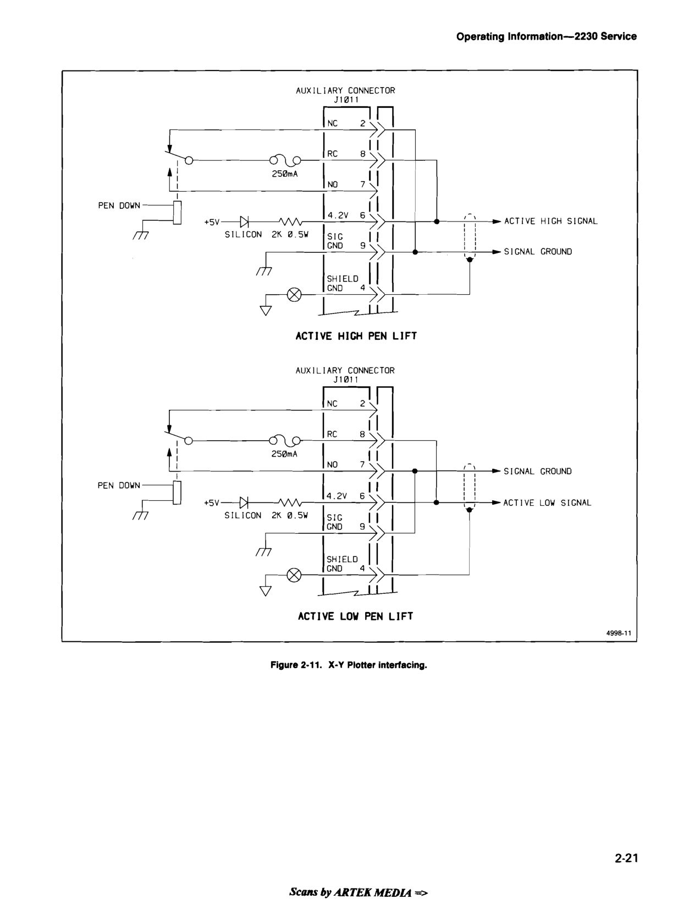


<details><summary>OCR text on this page</summary>

```
Operating Information-2230 Service 
- 
AUXILIARY CONNECTOR 
J I B 1 1 
250mA 
PEN DOWN 
- 
I 
I 
I , 
+ A C T I V E H I G H S I G N A L 
I 
I 
SH l ELD 
ACTIVE HIGH PEN LlFT 
AUXILIARY CONNECTOR 
250mA 
SIGNAL GROUND 
PEN DOWN 
ACTIVE LOW SIGNAL 
ACTIVE LOW PEN LlFT 
4998-1 1 
Figure 2-1 1. X-Y Plotter interfacing. 
Scans by ARTEK MEDL4 *
```

</details>


---

## Page 50 of 451

Operating Information-2230 Service 
STORE Mode 
longer agree. In 4K COMPRESS, a c is displayed in front 
of the SECIDIV readout. 
In STORE mode, many of the crt readout displays are 
associated with the parameters of stored waveforms. 
PARAMETER READOUT. Displays the VOLTSIDIV, 
SECIDIV and B DELAY TlME settings of the displayed 
waveforms on which the cursors are placed. The AC- 
GND-DC input coupling selection is indicated in the associ- 
ated VOLTSIDIV readout with a tilde symbol (-) above the 
volts symbol for AC, a ground symbol (h) 
for GND, and 
no extra symbol for DC input coupling. If the VOLTSIDIV 
switch is switched beyond the available expansion or 
compression range, the readout is tilted, indicating that the 
VOLTSIDIV switch setting and the VOLTSIDIV readout no 
CURSOR READOUT. Displays the voltage difference 
(either AV 1 or AV 2) and the time difference between cur- 
sors. When either BOTH or B HORIZONTAL mode is 
selected, the DELAY TlME POSITION is displayed. 
Independent 
fields 
for 
CH 1 
VOLTSIDIV, 
CH 2 
VOLTSIDIV, A SECIDIV, and B SECIDIV are provided. 
When making ground referenced voltage measurements 
(ground dot displayed and cursor on ground dot) the A 
symbol is replaced by a ground symbol (h). 
When the acquisition record length is longer than one 
screen, a bar graph is used to indicate the position of the 
display window within the acquisition record. 
DELAY TlME 
DELTA TlME 
CH 1 DELTA VOLTS 
OR 
1 /DELTA TlME 
CH 2 DELTA VOLTS 
SAVE INDICATOR 
DISPLAY WINDOW 
OR 
INDICATOR 
ACQUISITION LIMIT 
INDICATOR 
CH 1 
CH 2 
STORAGE 
A SECIDIV 
B SECIDIV 
VOLTS/DIV 
VOLTS/DIV 
MODE 
4998.1 2 
Figure 2-12. Crt readout display. 
Scam by ARTEK MEDLA =>


---

## Page 51 of 451

Operating Information-2230 Service 
OPERATING CONSIDERATIONS 
This part contains basic operating information and tech- 
niques that should be considered before attempting to 
make any measurements with the instrument. 
GRATICULE 
The graticule is internally marked on the faceplate of 
the crt to eliminate parallax-viewing errors and to enable 
measurements (see Figure 2-13). The graticule is marked 
with eight vertical and ten horizontal major divisions. In 
addition, each major division is divided into five subdivi- 
sions. 'The vertical deflection factors and horizontal timing 
are calibrated to the graticule so that accurate measure- 
ments can be made directly from the crt. Also, percentage 
marks for the measurement of rise and fall times are 
located on the left side of the graticule. 
1ST OR LEFT 
1 l T H OR RIGHT 
VERTICAL 
VERTICAL 
GRATICULE 
GRATICULE 
FALL TIME 
CENTER 
HORIZONTAL 
MEASUREMENT 
VERTICAL 
GRATICULE 
PERCENTAGE 
GRATICULE 
LINE 
MARKERS 
LINE 
4207-09 
GROUNDING 
'The most reliable signal measurements are made when 
the oscilloscope and the unit under test are connected by 
a common reference (ground lead) in addition to the signal 
lead or probe. The probe's ground lead provides the best 
grounding method for signal interconnection and ensures 
the maximum amount of signal-lead shielding in the probe 
cable. A separate ground lead can also be connected from 
the unit under test to the oscilloscope GND receptacle 
located on the oscilloscope's front panel. 
SIGNAL CONNECTIONS 
Probes 
Generally, the accessory probes supplied with the 
instrument provide the most convenient means of connect- 
ing a signal to the vertical inputs of the instrument. The 
probe and probe lead are shielded to prevent pickup of 
electromagnetic interference, and the 10X attenuation fac- 
tor of the probe offers a high input impedance that mini- 
mizes signal loading in the circuitry under test. The 
attenuation factor of the standard accessory probe is 
coded so that the VOLTSIDIV readout seen on the crt is 
automatically switched to the correct scale factor when 
the probe is attached. 
Both the probe itself and the probe accessories should 
be handled carefully at all times to prevent damage to 
them. Avoid dropping the probe body. Striking a hard sur- 
face can cause damage to both the probe body and the 
probe tip. Exercise care to prevent the cable from being 
crushed or kinked. Do not place excessive strain on the 
cable by pulling. 
The standard-accessory probe is a compensated 10X 
voltage divider. It is a resistive voltage divider for low fre- 
quencies and a capacitive voltage divider for high- 
frequency signal components. Inductance introduced by 
either a long signal or ground lead forms a series-resonant 
circuit. This circuit will affect system bandwidth and will 
Figure 2-13. Graticule measurement markings. 
ring if driven by a signal containing significant frequency 
Scans by ARTEK MEDL4 r>


---

## Page 52 of 451

Operating Information-2230 
Senrice 
components at or near the circuit's resonant frequency. 
If AC input coupling is in use, the following procedure 
Oscillations (ringing) can then appear on the oscilloscope 
should be followed whenever the probe tip is connected to 
waveform display and distort the true signal waveshape. 
a signal source having a different dc level than that previ- 
Always keep both the ground lead and the probe signal- 
ously applied. This procedure becomes especially useful if 
input connections as short as possible to maintain the 
the dc-level difference is more than ten times the 
best waveform fidelity. 
VOLTSIDIV switch setting. 
Misadjustment of probe compensation is a common 
source of measurement error. Due to variations in oscillo- 
scope input characteristics, probe compensation should be 
checked and adjusted, if necessary, whenever the probe is 
1. Set the AC-GND-DC (input coupling) switch to GND 
moved from one oscilloscope to another or between chan- 
before connecting the probe tip to a signal source. 
nels. 
See 
the 
probe compensation 
procedure in 
'Operator's Check and Adjustments", or consult the 
instructions supplied with the probe. 
Coaxial Cables 
2. Touch the probe tip to the oscilloscope GND con- 
nector. 
Cables may also be used to connect signals to the ver- 
tical input connectors, but they may have considerable 
effect on the accuracy of a displayed waveform. To main- 
tain the original frequency characteristics of an applied sig- 
nal, only highquality, low-loss coaxial cables should be 
3. Wait several seconds for the input-coupling capaci- 
used. Coaxial cables should be terminated at both ends in 
tor to discharge. 
their characteristic impedance. If this is not possible, use 
suitable impedance-matching devices. 
INPUT-COUPLING 
CAPACITOR PRECHARGING 
4. Connect the probe tip to the signal source. 
When the Input Coupling switch is set to the GND posi- 
tion, the input signal is connected to ground through the 
inputcoupling capacitor and a high resistance value. This 
series combination forms a precharging circuit that allows 
5. Wait several seconds for the input-coupling capaci- 
the inputcoupling capacitor to charge to the average dc 
tor to charge to the dc level of the signal source. 
voltage level of the signal applied to the input connector. 
Thus, any large voltage transients that may accidentally be 
generated are not applied to the vertical amplifier's input 
when the input coupling is switched from GND to AC. The 
precharging network also provides a measure of protection 
6. Set the AC-GND-DC switch to AC. A signal with a 
to the external circuitry by reducing the current level that 
large dc component can now be vertically positioned within 
is drawn from the external circuitry while the input- 
the graticule area, and the ac component of the signal can 
coupling capacitor is charging. 
be measured in the normal manner. 
Scans by ARTEK MEDIA -


---

## Page 53 of 451

Operating lnformation-2230 Service 
OPERATOR'S CHECKS AND 
ADJUSTMENTS 
To verify the operation and basic accuracy of your 
Horizontal 
instrument before making measurements, perform the fol- 
lowing checks and adjustment procedures. If adjustments 
HORIZONTAL MODE 
A 
are required beyond the scope of these operator's checks 
A SECIDIV 
0.5 ms 
and adjustments, refer the instrument to qualified service 
Var SecIDiv 
CAL (in detent) 
POSITION 
Midrange 
personnel. 
XI0 Mag 
Off (Var SecIDiv knob in) 
B DELAY TIME 
POSITION 
Fully counterclockwise 
For new equipment checks, before proceeding with 
Triggers 
these instructions, refer to "Preparation for Use" in this 
manual to prepare the instrument for the initial start-up 
VAR HOLDOFF 
NORM (fully 
before applying power. 
counterclockwise) 
A&B INT 
VERT MODE 
A SOURCE 
I NT 
A Mode 
P-P AUTO 
A LEVEL 
For a stable display 
INITIAL SETUP 
A SLOPE 
(with signal applied) 
OUT (plus-button out) 
1. Verify that the POWER switch is OFF (switch is in 
B LEVEL 
B RUNS AFTER DELAY 
(fully clockwise) 
the out position), then plug the power cord into the ac 
B SLOPE 
OUT (plus-button out) 
power outlet. 
HF REJECT 
OFF (fully counterclockwise) 
Storage 
2. Press in the POWER switch (ON) and set the instru- 
STOREINON STORE 
ment controls to obtain a baseline trace: 
SAVEICONTINUE 
PRETRIGIPOST TRIG 
ROLUSCAN 
1 K/4K 
POSITION CURS/ 
SELECT WAVEFORM 
WAVEFORM REFER- 
ENCEIMENU SELECT 
Display 
A and B INTENSITY 
Midrange 
STORAGE/READOUT 
INTENSITY 
Midrange 
(with READOUT on) 
FOCUS 
Best defined display 
NON STORE (button out) 
CONTINUE (button out) 
POST TRIG (button out) 
SCAN (button out) 
4K (button out) 
POSITION CURS (button in) 
WAVEFORM REFERENCE 
(button in) 
3. Adjust the INTENSITY and FOCUS controls for the 
desired display brightness and best focused trace. 
Vertical (Both Channels) 
VERTICAL MODE 
CH 1 
POSITION 
Midrange 
VOLTS/DIV 
50 mV 
AC-GND-DC 
DC 
Var VoltsIDiv 
CAL (in detent) 
BW LIMIT 
Off (button out) 
4. Adjust the Vertical and Horizontal POSITION con- 
trols to position the trace within the graticule area. 
5. Allow the instrument to warm up for 20 minutes 
before commencing the adjustment procedures. Reduce 
the INTENSITY levels during the waiting time. 
Scam by ARTEK MEDL4 r>


---

## Page 54 of 451

Operating Information-2230 Sewice 
TRACE ROTATION ADJUSTMENT 
NOTE 
Normally, the trace will be parallel to the center hor- 
izontal graticule line, and TRACE ROTATION adjust- 
ment is not required. 
1. Preset the instrument controls and obtain a baseline 
trace as described in "Initial Setup." 
2. Use the Channel 1 POSITION control to move the 
baseline trace to the center horizontal graticule line. 
3. If the baseline trace is not parallel to the center hor- 
izontal graticule line, use a small-bladed screwdriver or 
alignment tool to adjust the TRACE ROTATION control to 
align the trace with the graticule line. 
PROBE COMPENSATION 
Misadjustment of probe compensation is a source of 
measurement error. The attenuator probes are equipped 
with a compensation adjustment. To ensure optimum 
measurement accuracy, always check probe compensation 
before making measurements. Probe compensation is 
accomplished by: 
1. Preset the instrument controls and obtain a baseline 
trace as described in "Initial Setup." 
2. Connect the two 10X probes (supplied with the 
instrument) to the CH 1 OR X and CH 2 OR Y input con- 
nectors. Observe that the CH 1 VOLTSIDIV readout 
changes from 5 mV to 50 mV when the 10X probe is 
attached to the CH 1 OR X input. 
3. Remove the hook tip from the end of each probe. 
NOTE 
While the probe tip is in the PRB ADJ connector, 
use care not to to break off the probe tip. 
4. Insert the Channel 1 probe tip into the PRB ADJ 
connector. 
5. Use the CH 1 POSITION control to vertically center 
the display. If necessary, adjust the A TRIGGER LEVEL 
control to obtain a stable display on the plus (OUT) 
SLOPE. 
6. Check the waveform display for overshoot and 
rounding (see Figure 2-14); if necessary, use a small- 
bladed screwdriver to adjust the probe compensation for a 
square front corner on the waveform. 
7. Remove the Channel 1 probe tip from the PRB ADJ 
connector. 
8. Insert the Channel 2 probe tip into the PRB ADJ 
connector. 
9. Set the VERTICAL MODE to CH 2. 
10. Set the A TRIGGER A&B INT switch to CH 2. 
11. Use the CH 2 POSITION control to vertically center 
the display. 
12. Check the waveform display for overshoot and 
rounding (see Figure 2-14); if necessary, use a small- 
bladed screwdriver to adjust the probe compensation for a 
square front corner on the waveform. 
NOTE 
Refer to the instruction manual supplied with the 
probe for more complete information on the probe 
and probe compensation. 
CORRECT 
FLAT 
1 
OVER 
COMPEN- 
SATED 
(OVER- 
SHOOT) 
UNDER 
COMPEN- 
SATED 
(ROUND- 
ING) 
(465/DM-0-5) 2906-13 
Figure 2-14. Probe compensation. 
Scans by ARTEK MEDLQ -


---

## Page 55 of 451

Operating Information-2230 
Service 
HORIZONTALACCURACYCHECK 
11. Adjust the SECIDIV switch setting for a display of 
at least one full period of the probe adjust signal (0.1 or 
A check of the horizontal timing can be made using the 
0.2 ms per division). 
time measurement capability of the CURSOR measure- 
ment mode: 
12. Use the Vertical and Horizontal POSITION controls 
1. Preset instrument controls and obtain a baseline 
to center the display. 
trace as described in "Initial Setup". 
2. Set: 
CH 1 AC-GND-DC 
GND 
STOREINON STORE 
STORE (button in) 
A SECIDIV 
1 ms 
PRETRIGIPOST TRIG 
POST TRIG (button out) 
POSITION CURS/ 
SELECT WAVEFORM 
POSITION CURS (button in) 
3. Turn the Horizontal POSITION control to align the 
start of the trace to the first vertical graticule line. 
13. Use the CURSORS Position control and the CUR- 
SORS SELECT C1IC2 button to align the cursors with the 
rising edges of the PRB ADJ signal (measurement is of the 
probe adjust signal period). Note the cursor time difference 
readout and the graticule measurement (horizontal dis- 
tance between rising edges as taken from the graticule 
markings) of the signal for later reference. 
14. Check that the cursor readout of the probe adjust 
signal period and the graticule measurement of the calibra- 
tor period are within k 2%. 
15. Set the STOREINON STORE switch to the NON 
4. Turn the Vertical POSITION control to align the 
position 
out). 
baseline trace with the center horizontal graticule line. 
16. Determine the horizontal graticule measurement of 
5. Position the active cursor to the second vertical 
the probe adjust signal period. Note the reading for later 
graticule line using the CURSORS Position control. 
reference. 
6. Push the SELECT ClIC2 switch to activate the 
17. Check that the NON STORE Mode probe adjust 
other cursor. 
signal period measurement obtained from the graticule 
markings is within +-3% of the STORE Mode probe adjust 
signal period obtained in step 13. 
7. Position the active cursor to the tenth vertical grati- 
cule line using the CLIRSORS Position control for a spac- 
ing of eight divisions between cursors. 
18. Set the XI0 MAG switch to on (pull Var SecIDiv 
knob out) and set the A SECIDIV switch setting to obtain 
8. Check that the Delta Time readout is a 7.84 ms 
a display of at least one full period of the probe adjust sig- 
and G 8.16 ms. 
nal (0.1 or 0.2 ms per division). 
9. Verify that the CH 1 probe tip is in the PRB ADJ 
connector. 
19. Check that the magnified NON STORE Mode probe 
adjust sugnal period measurement obtained from the grati- 
10. Set the CH 1 AC-GND-DC switch to DC. 
cule markings is within +-4% of the STORE Mode probe 
adjust signal period obtained in step 13. 
Scans by ARTEK MEDlji ==.


---

## Page 56 of 451

Section 3-2230 
Service 
THEORY OF OPERATION 
SECTION ORGANIZATION 
This section contains a functional description of the 
2230 Digital Storage Oscilloscope. The discussion begins 
with a summary of instrument functions. Following the 
general description, each major circuit is explained in 
detail. Functional block diagrams and schematic diagrams 
are used to show the interconnections between parts of 
the circuitry, to indicate circuit components, and to identify 
interrelationships with the front-panel controls. 
Schematic diagrams and the overall block diagrams are 
located in the tabbed "Diagrams" section at the back of 
this manual. The schematic diagram associated with each 
description is identified in the text and indicated on the tab 
of the appropriate foldout page by a numbered diamond 
symbol. For best understanding of the circuit being 
described, refer to both the appropriate schematic diagram 
and the functional block diagram. 
INTEGRATED CIRCUIT 
DESCRIPTIONS 
Digital Logic Conventions 
Digital logic circuits perform many functions within the 
instrument. Functions and operation of the logic circuits 
are represented by logic symbology and terminology. Most 
logic functions are described using the positive-logic con- 
vention. Positive logic is a system where the more positive 
of two levels is the TRUE (or 1) state; the more negative 
level is the FALSE (or 0) state. In this logic description, the 
TRUE state is HI, and the FALSE state is LO. The specific 
voltages which constitute a HI or a LO state vary between 
specific devices. For specific device characteristics, refer 
to the manufacturer's data book. 
Linear Devices 
The operation of individual linear integrated circuit 
devices is described in this section using waveforms or 
graphic techniques to illustrate their circuit action. 
GENERAL DESCRIPTION 
Introduction 
In the following overall functional description of the 
instrument, refer to the basic block diagram, Figure 3-1, 
and to the detailed block diagrams located in the 
"Diagrams" section of this manual. Each major block in 
the diagram represents a major circuit within the instru- 
ment. In Figure 3-1, the numbered diamond symbol in each 
block indicates the schematic diagram number. Much of 
the analog portion of the oscilloscope operates without 
direction from the Microprocessor circuitry. These portions 
of the instrument are described first, with appropriate 
references to areas that either provide information to the 
Microprocessor or are controlled by the instrument's 
storage circuitry. The Microprocessor and Storage circuit 
descriptions follow the more conventional portions of the 
instrument's circuitry. 
Vertical 
Signals to be displayed on the crt (cathode-ray tube) 
are applied to either or both the CH 1 OR X and the CH 2 
OR Y input connectors. The signals may be coupled to the 
attenuator either directly (DC) or through an input-coupling 
capacitor (AC). The inputs may also be disconnected, and 
the input to the attenuators grounded, by switching to the 
GND position of the input coupling switch. In the GND 
position, the ac-coupling capacitor is allowed to precharge 
to the dc level present at the input connector. This 
precharging prevents large trace shifts of the display when 
switching from GND to AC coupling. The Attenuators are 
switched by the front-panel VOLTSIDIV switches and 
scale the applied signal level to obtain the desired display 
amplitude. Information about the lnput Coupling switch 
and the channel VOLTSIDIV switch positions is read by 
the Microprocessor. These signals control the STORE 
mode ground-reference acquisition and the crt readout 
displays of the lnput Coupling and VOLTSIDIV switch set- 
tings of the active channel(s). 
Scaled output signals from the Attenuators are applied 
to the Vertical Preamplifiers for amplification. The Chan- 
nel 2 Preamplifier has additional circuitry, permitting the 
operator to invert the Channel 2 display on the cathode- 
ray tube (crt). Trigger pickoffs in each channel supply a 
Scans by ARTEK MEDLQ r>


---

## Page 57 of 451

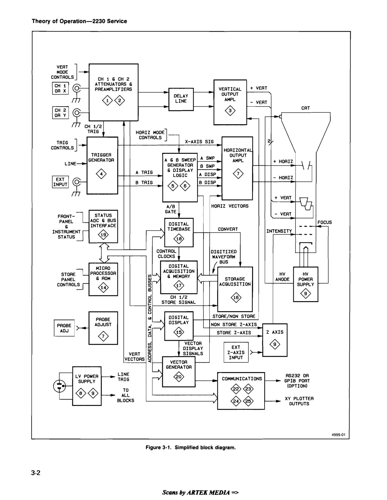


<details><summary>OCR text on this page</summary>

```
Theory of Operation-2230 
Service 
CH I 6 CH 2 
ATTENUATORS 6 
PREAMPLIFIERS 
ACQUISITION 
XY PLOTTER 
4999-01 
Figure 3-1. Simplified block diagram. 
Scans by ARTEK MEDL4
```

</details>


---

## Page 58 of 451

Theory of Operation-2230 
Service 
trigger signal to the Trigger Amplifier when internal trigger- 
ing is selected. Other signal pickoffs provide vertical 
position information to the Position Signal Conditioning cir- 
cuitry for vertically positioning the stored signal. The final 
stage of the Vertical Preamplifier for each channel pro- 
vides one of two signals; either the vertical channel signal 
for the analog presentation on the crt or the vertical 
acquisition signal to be digitized by the storage circuitry. 
Channel signals either for direct analog presentation on 
the crt or for application to the Storage digitizing circuitry 
are selected by the analog Channel Switch under control 
of the front-panel VERTICAL MODE switches. The switch- 
ing signals from the Channel Switch Logic control a diode 
gate (Channel Switch) that selects the channel signal(s) to 
be applied to the Delay-line Driver. If ADD is selected, both 
channel signals are applied to the Delay-line Driver where 
the signals are summed together. The Delay-Line Driver 
provides the proper signal-driving level and impedance 
match to the Delay Line, where the vertical signal is 
delayed approximately 100 ns with respect to the trigger 
signal. The vertical signal delay allows time for the Hor- 
izontal circuitry to start the sweep before the vertical sig- 
nal is applied to the crt. 
Trigger signal, or a Line Trigger signal derived from the 
ac-power-source to develop trigger signals for the Sweep 
Generator. The Auto Trigger circuit sets the range of the 
Trigger Level to conform approximately to the peak-to- 
peak amplitude of the selected trigger signal when either 
Auto or TV Field Trigger mode is selected. In Norm mode, 
the TRIGGER LEVEL control must be adjusted to the sig- 
nal level before a sweep will be triggered. ROLL Storage 
(selectable at the slower sweep speeds in STORE mode) 
overrides the triggering circuit functions; a continuous sig- 
nal acquisition is made and the signal displayed without 
the need of a trigger signal. 
The triggering circuitry contains the TV Field Sync cir- 
cuit. This circuit provides stable triggering on television 
vertical-sync pulses when in the TV Field triggering mode. 
TV Line triggering is possible using P-P AUTO trigger 
mode. 
Signal pickoffs from the lnternal Trigger circuitry pro- 
vide the X-Axis signal for the nonstore X-Y display mode 
and the B trigger signal for triggered B Sweeps. 
A Sweep 
Whenever STORE mode is selected, analog signals 
The A Sweep Generator and Logic circuits control the 
from the Storage circuitry are supplied to the Channel 
nonstore sweep generation and both the Store and the 
Switch circuit. Under control of the Channel Switch Logic, 
nonstore A Sweep timing. When the A 
mode 
which is in turn switched by signals from the Display Con- 
switches are set to either P-P AUTO or TV 
and no 
troller! the analog 
signal Out Of the final Vertical 
trigger signal is present, the Auto Baseline circuit causes 
Preamplifier stage in each channel is biased off. The Chan- 
the Sweep Logic circuit to produce a sweep for reference 
nel 1 and Channel 2 Acquisition signals from the final 
purposes. In the NORM setting, the Auto Baseline circuit 
preamplifiers are then biased on to pass the signals to be 
is disabled and nonstore sweeps are not generated until a 
digitized to the Storage circuitry. At the same time, the 
trigger event occurs. NORM trigger mode is used to obtain 
Channel Switch (diode 
is switched to pass the 
stable triggering on low-repetition rate signals that do not 
Storage vertical signal to the Delay Line Driver input. 
~rovide a triaaer before an auto baseline is generated. 
SGL SWP (single sweep) trigger mode allows-only one 
Final amplification of the vertical signal (either STORE 
sweep to be generated after-being reset and is used to 
or NON STORE) is done by the Vertical Output Amplifier. 
obtain the waveform from a one-shot event. 
This stage 
the signal levels that vertically deflect 
the crt electron beam. This amplifier stage also contains 
the vertical trace separation circuitry that separates the 
ROLL and SCAN Storage modes are useful in captur- 
ing low-frequency and low-repetition rate waveforms. In 
Nonstore A Intensified trace from the 
trace 
SCAN mode, receiving a trigger causes the pretrigger par- 
when Alt Horizontal display mode is selected. The amount 
tion of the waveform to update as a block. The post- 
of trace separation is controlled using the front panel 
trigger waveform updates from the trigger point to the 
TRACE SEP knob. Another circuit feature in the Vertical 
right edge of the screen as new data is acquired. ROLL 
Output 
is the nonstore bandwidth limit (BW 
Storage acquisitions differ from the Nonstore sweeps and 
LIMIT) circuitry that follows the Delay Line. Either the full 
SCAN Storage mode in that a trigger signal is not used for 
100 MHz bandwidth or the limited 20 MHz bandwidth for 
acquisition of the signal or displaying the waveform. The A 
the nonstore signal 
may be selected. 
mode 
Sweep Logic circuitry provides gating and holdoff signals 
signals are picked off in the Preamplifier and are not 
used by the Storage circuitry to control its acquisition and 
bandwidth limited by the BW LIMIT switch. 
display cycles for all storage modes, except ROLL. 
Triggering 
The A Gate signal applied to the A Miller Sweep Gen- 
The Triggering circuitry uses either the Internal Trigger 
erator circuit starts the Nonstore linear sweep with a ramp 
signal obtained from the input signal(s), an External 
time that is controlled by the A SECIDIV switch setting. 
Scans by ARTEK M
.
 
r>


---

## Page 59 of 451

Theory of Operation-2230 
Service 
Switch position pickoffs supply the SECIDIV switch setting 
information to the Microprocessor for use in STORE mode 
horizontal timing. The A SECIDIV switch setting is also 
displayed on the crt for both Store and Nonstore 
operation. 
B Sweep 
The Alternate B Sweep Circuitry controls the Nonstore 
BOTH and B Delayed Horizontal mode displays. This cir- 
cuitry includes the B Miller Sweep Generator and B Sweep 
Logic circuitry. STORE mode B timing is controlled by the 
B SECIDIV switch. BOTH Horizontal mode is not available 
with STORE. 
In STORE mode, the BOTH selection 
displays an A Intensified Trace only. The intensified zone 
on the A trace indicates the position and approximate 
amount of the A trace that is displayed by the B Delayed 
Display. 
Horizontal 
Nonstore A and B Sweep signals (or the X-Axis signal 
from the X-Y Amplifier in the nonstore X-Y Display mode) 
are applied to the Horizontal Preamplifier where one is 
selected and amplified. Gain in the Preamplifier is switch- 
able between X1 and X10. The XI0 gain is used for Non- 
store X1 0 Magnification. STORE mode X1 0 expansion is 
done digitally and reflected in the horizontal deflection sig- 
nals supplied after the Horizontal Preamplifier. Horizontal 
positioning of both the Store and the nonstore display is 
done by applying a horizontal position dc offset to the Hor- 
izontal Preamplifier. The amplified nonstore horizontal sig- 
nal is applied to the Horizontal Mux circuit where it is 
available for selection. 
STORE mode horizontal deflection signals are also 
applied to the Horizontal Mux. Selection of either the non- 
store sweep signals or the store deflection signals is done 
by control signals from the Channel Switch Logic in the 
Vertical circuitry. The selected horizontal deflection signals 
are then amplified by the Horizontal Output Amplifier to 
the levels needed to drive the crt's horizontal deflection 
plates. 
Microprocessor 
The Microprocessor (MPU) controls the digital storage 
and display sections of the oscilloscope. Under firmware 
control (firmware is the programmed instructions contained 
in read-only memory), the Microprocessor monitors the 
operation of the instrument and sets up the circuitry to 
perform as dictated by the front-panel control settings. 
Data transfer to and from the Microprocessor and address 
selection of a device to be communicated with are done 
over a 20-line I10 bus. The lower eight lines (ADO through 
AD7) form a combined addressldata bus while the remain- 
ing 12 lines (A8 through A19) are for addressing only. Tim- 
ing for the execution of instructions, addressing, and data 
transfers is provided by an external, crystal-controlled 
oscillator that drives the Microprocessor clock generator. 
The Microprocessor clock circuit further divides the input 
clock frequency to generate two lower clock frequencies. 
The clock circuit also generates the Ready and Reset con- 
trol signals to the Microprocessor. 
Storage front-panel control settings are passed to the 
Microprocessor via eight-bit bus drivers. Settings of the 
analog front-panel controls and switches are also provided 
to the MPU, but via different bus drivers. The Status ADC 
and Bus Interface circuitry provides the interfaces from the 
analog front-panel controls to the data bus. 
Status ADC and Bus Interface 
Switch settings and status bits are applied directly to 
bus drivers. Each data bit then corresponds to a switch 
setting (either open or closed) or a status bit logic level 
(either HI or LO). Analog front-panel information is multi- 
plexed to an analog-to-digital converter where it is con- 
verted to a digital value and applied to a bus driver. When 
the Microprocessor reads the bus, it obtains a data byte 
that represents the position value for a single control 
rather than the switch or status data bits of the digital- 
type information. The Microprocessor determines the con- 
trol settings from the value of the data bytes or status bits 
received and sets 
up the digital storage circuits 
accordingly. 
Storage Acquisition 
Input signals to be digitized are selected by the Channel 
Switch. Either or both (for ADD) of the input signals picked 
off from the Vertical Preamplifier may be selected. The 
differential output signal from the Channel Switch is con- 
verted to a single-ended signal for application to the 
Sample-and-Hold amplifier. The input diode bridge in the 
Sample-and-Hold circuit is strobed to pass a sample of the 
signal to charge the hold capacitor. While the signal sam- 
ple is held for conversion, the diode bridge is reverse 
biased, and the charge on the Hold capacitor remains at a 
fixed level. The sample buffer amplifier applies the voltage 
level on the Hold capacitor to the Analog-to-Digital Con- 
verter stage for conversion to an eight-bit digital signal. 
The output signals are then shifted from the emitter- 
coupled logic (ECL) level obtained from the ADC to the 
transistor-transistor-logic level (TTL) and passed to the 
digitized signal bus for transfer to the Acquisition Memory. 
Digital Acquisition 
Digitized waveforms are transferred from the ECL-to- 
TTL level shifters via the digitized data bus to the AID 
Buffer of the Acquisition Memory circuit. The buffered data 
is applied to two identical registers; the Min Register and 
the Max Register. Data is alternately clocked into the 
registers by the MINCLK and MAXCLK clock signals. The 
Scans by ARTEK MEDLQ r>


---

## Page 60 of 451

Theory of Operation-2230 
Service 
actual clocking that occurs depends on the sampling mode 
(MinlMax, Sampling, or X-Y). The same waveform data is 
also applied to opposite comparator inputs of two eight-bit 
magnitude comparators. Output data from the Min and 
Max Registers is applied to the other comparator's input 
pins, with the Min Register data going to the Min Com- 
parator and the Max Register data going to the Max 
Comparator. 
In MinIMax mode, the first data byte taken in a sample 
window (set by the SECIDIV switch setting) is clocked into 
both registers. That data byte is then compared with the 
next data sample or samples (determined by the sample 
window) being applied to the inputs of the Min and Max 
Registers. If the data byte is either smaller in magnitude 
than the last clocked minimum or greater in magnitude 
than the last clocked maximum, a NEWMIN or a 
NEWMAX signal is generated. The signal is routed through 
the MinIMax Clock Selector back to the clock input of the 
Min or Max Register (Min if it is a new minimum amplitude 
or Max if it is a new Maximum amplitude) and the new sig- 
nal is clocked into the register. At the end of a MinIMax 
sample window, the data present at the output of the Min 
and Max Registers is clocked into the Swap Registers to 
be transferred to the Acquisition Memory. 
When 
record sampling mode is selected, each 
waveform sample is successively clocked into the Min and 
Max Registers on alternate ODDCLK and ODDCLK sig- 
nals. When X-Y mode is selected, the Channel 1 and 
Channel 2 waveforms are sampled in a chopped manner, 
with samples of the two channel signals being taken with 
less time between the samples than in normal record sam- 
pling mode. Channel 1 data is clocked into the Min Regis- 
ter, and Channel 2 data is clocked into the Max Register. 
Four eight-bit Swap Registers are used to reorder the 
Max and Min data obtained from each sample window. 
The Max Register data is clocked into two of the registers 
in parallel, and the Min Register data is clocked into the 
other two registers in parallel. The Min and Max data out- 
put from one of the Swap Registers in each set of two is 
applied to two busses going to the Acquisition Memory. If 
the Max and Min data is to be reversed to maintain the 
correct time order of the samples before being stored, the 
alternate swap register in each set of two is enabled, and 
the Max and Min data is applied to the opposite busses to 
memory. 
Acquisition mode is controlled in part by the Micropro- 
cessor via data latched into the Acquisition Mode Register 
(see also, "Time Base Mode Register" in this section). 
These data bits select the channel or channels to be 
acquired, enable the XY mode, enable MINIMAX acquisi- 
tion, control the Swap function for reordering data, and 
select the Test function for diagnostics. Acquisition clock 
signals generated by the Acquisition Clock Decoder 
transfer the data from stage to stage in the digital acquisi- 
tion circuitry in a pipe-line fashion. 
A Diagnostics Code Generator is included as a trouble- 
shooting aid. When in the Test mode, the AID Buffer is 
disabled, and the Code Generator places its counter- 
output bytes on the input bus to the Max and Min 
Registers. 
Acquisition Memory 
The Acquisition Memory is composed of two, 2-K by 8- 
bit random-access memory devices. One memory stores 
the Odd data bytes and the other stores the Even data 
bytes. The Odd and Even data can be swapped between 
the Swap Registers and the Acquisition Memory. 
A programmable address counter is loaded with the 
number that is the amount of pretrigger data bytes needed 
to fill the pretrigger portion of the waveform acquisition. 
The PREFULL signal is sent to the Trigger Mux circuitry 
when the pretrigger count is full. That signal enables the 
Trigger Mux circuitry to accept a trigger signal. 'The 
remaining output bits from the Address Counter select the 
storage location for waveform data storage in the Acquisi- 
tion Memory. 
When waveform data is to be read out of the Acquisi- 
tion Memory, the Address Counter is loaded with the 
address of the data for the waveform. The Microprocessor 
sequences through the addresses reading out the data 
bytes. Data transceivers allow data to be read from the 
memory to the bus or written from the bus to the memory. 
Memory Address Registers place the address count on 
the bus along with bits that indicate the trigger status 
(TRIGD), the B trigger status (BTRIGD), the end-of-record 
status 
(ENDREC), 
and 
the 
byte-interrupt 
status 
(BYTEINT). These accompanying bits are used in estab- 
lishing display attributes. 
Memory writes, memory reads, and address counter 
load enabling and clocking are controlled by a quad, two- 
line-to-one-line multiplexer (Memory Control). Read and 
write signals from the Microprocessor control bus and 
write clocks are used to transfer the waveform data 
between the devices. 
Digital Time Base 
An accurate frequency source for synchronizing the 
Microprocessor with the other digital devices on the bus is 
provided by a 40 MHz oscillator. That frequency is divided 
Scans by ARTEK MEDGQ =>


---

## Page 61 of 451

Theory of Operation-2230 
Service 
down by the Clock Generator to produce the various 
clocking rates. The Time Base Mode Register latches con- 
trol data bits from the Microprocessor data bus to set the 
operating mode of the time base. These control bits switch 
the Trigger Mux circuit to either A or B Trigger, enable the 
trigger logic circuit, switch the clock multiplexer to change 
the clocking rate, start a storage acquisition, and enable 
interrupts to the Microprocessor. The programmable Time 
Base Divider, under control of the Microprocessor via the 
Time Base Divider Register, generates a sampling rate 
that corresponds to the front-panel SECIDIV switch 
setting. 
A Clock multiplexer at the end of the Time Base Divider 
chain selects the output of the Time Base Divider, the 
WRITECLK, the 
clock, or an external clock signal 
to generate the SAVECLK signal. 
The Digital Time Base Trigger Logic circuit looks at 
whether the pretrigger data portion of the record has been 
filled. If the pretrigger portion is full, then the A or B Gate 
generates the trigger. When a trigger is generated in 
Repetitive Storage mode, the Clock Delay Timer measures 
the time delay between the arrival of the trigger and the 
convert clock. The time difference value is used by the 
Microprocessor to accurately position the acquired data 
with respect to the actual trigger point. 
The delay difference between the start of the acquisi- 
tion and the occurrence of the B trigger is also measured. 
This value is only used in BOTH HORIZONTAL MODE 
when running the B Horizontal display in Triggerable After 
Delay to provide a readout of the time delay between the 
A Trigger and the B Trigger points. 
Acquisitions are counted to determine when a full 
record of data has been stored (ENDREC) and to keep 
track of the beginning and ending memory locations of the 
record. The Record Counter is also programmable to pro- 
vide for the different record lengths for one-channel or 
two-channel acquisitions, different Pretrigger selections, 
and either 4K-byte or 1 K-byte record length. 
Digital Display 
A custom IC handles the digital display generation. The 
Display Controller functions as an interface between the 
processor bus, display memory (RAM), and vector genera- 
tors to form waveform and character displays on the crt. 
The controller reads a display list from the Display 
Memory and drives X- and Y-Vector Generators to create 
the waveform and readout displays. Z-Axis control signals 
are also generated to drive the crt Z-Axis Amplifier for 
Stored waveform and Readout intensity control. Control 
signals to the Microprocessor and Display Memory are 
generated in response to a processor readlwrite request. 
Digital-to-analog converters take the digital data bytes 
supplied from the Display Memory via the Display Con- 
troller and change them to the X- and Y-Axis analog 
signals that drive the Horizontal and Vertical Vector Gen- 
erators. The vector signals are applied to the Horizontal 
and Vertical Output Amplifiers to produce the STORE 
mode deflection signals and NON STORE mode character 
readout. 
The Display Memory is six 16-K X 4-bit dynamic ran- 
dom access memories (RAM). Four of the RAMs provide 
the 8-bit data bytes of the stored waveform, and the 
remaining RAMs store each data-byte's intensity and 
Status attributes. A 4-bit word in each RAM is selected by 
latching a row address followed by a column address. 
Data is either stored or read out (as the operation in pro- 
gress requires). 
Vector Generator 
X- and Y-Axis analog signals from the Digital Display 
are converted by the Vector Generators into the vector 
signals used to drive the crt deflection plates. Vector 
signals are produced for the stored waveforms, the menu 
displays, and the readouts. The Vector Generator is 
switched to the dot-display mode for equivalent-time sam- 
pling waveforms and X-Y displays. 
The X-Y Plotter driver circuit is included in this portion 
of the circuitry. When the X-Y Plotter is enabled, x-axis 
and y-axis signals are switched via the plot multiplexer to 
the x-axis and y-axis plot amplifiers. The VECT SMPL sig- 
nal is switched via the same multiplexer to drive the Pen- 
Down amplifier. 
Z-Axis 
The Z-Axis Amplifier has input signals from multiple 
sources that control the crt intensity on a time-shared 
basis. Nonstore intensity signals are the level inputs from 
the A and B INTENSITY controls that are controlled by the 
Alternate Display switching and B Z-Axis Logic circuits. 
Additional Z-Axis drive current is supplied during the 
intensified portion of an A trace during the B Sweep when 
BOTH Horizontal display mode is selected. The remaining 
nonstore signals that have control of the display bright- 
ness are the EXT Z-AXIS INPUT signal, the CHOP mode 
blanking signal, and the XY control signal. All of these 
sources are added to provide the time-shared nonstore 
displays. 
For the Store waveform and the Menu and Readout 
character displays, an additional Z-Axis drive signal from 
the STORAGEIREADOUT INTENSITY control is switched 
on and off by the Display Controller. The controller signals 
determine when the stored waveforms and the readout 
Scans by -TEAK 
MEDL4 =>


---

## Page 62 of 451

Theory of Operation-2230 
Service 
characters are turned on and if any portions of the display 
to provide the supply voltages for the instrument's cir- 
will be intensified more than the rest. Further amplification 
cuitry. A High Voltage Multiplier circuit produces the 
of the combined signal sources provides the amplitude lev- 
accelerating, focus, and cathode potentials used by the 
els required to drive the crt. 
crt. 
The 2-Axis signal is applied to the crt DC Restorer cir- 
Probe Adjust 
cuit where it is shifted to the large negative potential used 
A front-panel PROBE ADJUST output is provided for 
by the crt. The potential 
the amount Of current 
use in adjusting probe compensation. The voltage at the 
supplied by the electron beam to the crt phosphors. 
PROBE ADJUST connector is a negative-going square 
- 
- 
wave that has a peak-to-peak amplitude of approximately 
0.5 V with a repetition rate of approximately 1 kHz. 
Power Supply 
Operating potentials for the instrument are obtained 
from a power supply that consists of the Preregulator, 
Communications Options 
Inverter and Transformer, and Rectifiers and Filters. 
Options for this instrument provide a choice of either an 
Approximately +42 V is supplied by the Preregulator to 
IEEE-488 GPlB (General Purpose Interface Bus) or an 
drive the 20 kHz lnverter stage through the Transformer 
RS-232-C serial output port. The options allow the 
primary windings. The transformer secondary windings 
transfer of stored waveforms and the control of certain 
produce the various ac levels that are rectified and filtered 
instrument functions. 
DETAILED CIRCUIT DESCRIPTION 
The detailed circuit description of the 2230 first 
describes the analog operating portion of the oscilloscope 
followed by the digital portion. During the description of 
the analog circuitry, references are made to circuitry that 
either provides information to the Microprocessor or is 
controlled by the instrument's storage circuitry. 
ANALOG CIRCUITRY 
The instrument has full conventional oscilloscope capa- 
bilities with all the associated analog circuitry. Signal 
pickoff points and signal insertion points connect the ana- 
log portion of the instrument to the digital operating 
system to acquire and display the stored waveforms. The 
digital circuitry enhances the analog display by providing 
crt readouts of the VOLTSIDIV, SECIDIV, and Delay Time 
Position control settings. 
The Attenuator circuit and switches (see Figure 3-2) 
provide control of the input coupling, the vertical deflection 
factor, and the variable voltsldivision gain. Vertical input 
signals for display on the crt or for acquisition by the 
storage circuitry may be connected to either or both the 
CH 1 OR X and the CH 2 OR Y input connectors. In the 
X-Y mode of operation, the signal applied to the CH 1 OR 
X connector provides horizontal (X-axis) deflection for the 
display, and the signal applied to the CH 2 OR Y connec- 
tor provides the vertical (Y-axis) deflection for the display. 
Switch contacts on the A14 CH 1 Logic board are read 
by the Microprocessor to find the CH 1 VOLTSIDIV switch 
and lnput Coupling switch settings. A switch contact asso- 
ciated with CH 1 CAL control R43 (Variable VoltsIDiv) is 
also read to see whether that control is in or out of the 
calibrated (CAL) detent. 
VERTICAL ATTENUATORS 
lnput Coupling (AC-GND-DC) 
A signal from the CH 1 OR X input connector may be 
The Channel 1 and Channel 2 Attenuator circuits, 
ac or dc coupled to the High-Impedance Attenuator circuit 
shown on Diagram 1, are identical with the exception of 
or disconnected completely by the lnput Coupling Switch. 
the additional Invert circuitry in the Channel 2 Paraphase 
Signals from the CH 1 OR X input connector are routed 
Amplifier. Therefore, only the Channel 1 Attenuator is 
through resistor R1 to lnput Coupling switch S1. When S1 
described, with the Invert circuitry of Channel 2 discussed 
is set for dc coupling, the Channel 1 signal goes directly to 
separately. 
the input of the High-Impedance Attenuator stage. When 
Scans by ARTEK MEDL4 =>


---

## Page 63 of 451

Theory of Operation-2230 
Service 
Figure 3-2. Block diagram of the Channel 1 Attenuator circuit. 
I 
I 
I 
I 
I 
I 
I 
I 
I 
Scans by ARTEK M
.
 - 
I 
I 
I 
I 
I 
I 
LOW-z 
BUFFER 
ATTENUATOR 
AMPL 
+ FAST PATH 
-i- I. 
i 
2. 
013. 
010 
4- 4. 
4- 10 
I 
I 
HIGH-Z 
ATTENUATOR 
I 
COUPLING 
SWITCH 
I 
BUFFER 
I 
AMPL 
-b SLOW PATH 
I 
I 
I 
i 
I. 
c 10. 
i 
100 
R9100 
- 
I 
I 
I 
I 
I 
? 
4
1
 
INPUT 
I 
I 
I 
I 
I 
I 
uio. 015 
I 
I 
I 
I 
PARAPHASE 
I 
I 
1 
AMPLIFIER 
CH I+ 
I 
I 
I 
U30 
I 
I 
FEEDBACK 
I 
A 
I 
I 
I 
I 
I 
I 
I 
I 
I 
CH 1 LOGIC - - - - - - - 
SWITCH 
CONTACTS 
- - - - - - - - - - 
VAR GAIN 
~ 4 3 
- - - - - 
CAL 
CH 1 STATUS 
- "_ 
CH 1 PROBE CODE 
STATUS ADC CIRCUIT 
4999-02


---

## Page 64 of 451

Theory of Operation-2230 
Service 
ac coupled, the input signal must go through dc-blocking 
capacitor C2. The blocking capacitor stops the dc com- 
ponent of the input signal from reaching the Attenuator cir- 
cuit. When switched into the signal path, attenuators AT1 
and AT2 attenuate the input signal by factors of 100 and 
10 respectively. When S1 is set to GND, the input of the 
Buffer Amplifier is connected to ground. This provides a 
ground reference for the analog display and the Micropro- 
cessor without removing the applied signal from the input 
connector. The coupling capacitor precharges through R2, 
R4, and R8 to prevent large trace shifts when switching 
from GND to AC. 
A probe coding ring on the CH 1 OR X input connector 
is used to read the attenuation factor of the attached 
probe to automatically adjust the VOLTSIDIV scale factors 
in the readout. The default setting is for XI attenuation 
when either coaxial cables or uncoded probes are con- 
nected to the vertical inputs. 
Buffer Amplifier and Low-Impedance Attenuator 
The Buffer Amplifier presents a high-impedance, low- 
capacitance load to the signal from the High-Impedance 
Attenuator and a low output impedance to the Low- 
Impedance Attenuator. The dual-path buffer amplifier (slow 
path and fast path) combines good dc stability with high- 
speed performance. 
The input signal goes to the gate of source-follower 
Q13 through R6 and C6, the fast path, and to the inverting 
input of operational amplifier U10 from the resistive 
voltage divider formed by R3 and R5, the slow path. 
Source-follower Q13 and emitter-follower Q18 have high- 
impedance inputs that isolate the applied signal from the 
loading effects of the Low-Impedance Attenuator. A volt- 
age divider formed by R46, R47, and R48 at the emitter 
output of Q18 applies feedback to the noninverting input 
of slow-path amplifier U10. The two input voltages to 
amplifier U10 are compared, and the conductivity of 
current-source transistor Q15 is changed to correct for 
any frequency-gain error at the source of Q13. The 
bandwidth of U10 is limited by capacitor C10 so that the 
slow path responds only to frequencies below 100 kHz. 
Input offset voltage compensation for U10, provided by 
R10, eliminates trace shift between VOLTSIDIV switch 
settings. Gain in both paths is matched by adjusting 
MFILF Gain Bal potentiometer R47. The path gains then 
remain matched by the corrective action of U10 and Q15 if 
gain differences in the two paths start to develop. 
Low-Impedance Attenuator R19 divides down the 
Buffer Amplifier output signal for application to Paraphase 
Amplifier U30. The attenuator's output impedance is 75 
ohms at all VOLTSIDIV switch settings. The VOLTSIDIV 
switch (S10) determines whether the Paraphase Amplifier 
receives a signal attenuated by a factor of 1 (no attenua- 
tion), 2, 4, or 10. 
Paraphase Amplifier 
Paraphase Amplifier U30 converts the single-ended sig- 
nal from the Low-Impedance Attenuator into a differential 
signal for the Vertical Preamplifier. Included in the circuitry 
is switching that provides extra gain for the 2 mV position 
of the VOLTSIDIV switch, adjustments for amplifier dc bal- 
ance, and circuitry for the Variable VoltsIDiv function. 
Additionally, Channel 2 Paraphase Amplifier U80 contains 
circuitry to invert the Channel 2 display. 
The signal from the Low-Impedance Attenuator goes to 
the base of one transistor in U30. The other input transis- 
tor is biased by the divider network formed by R30, R31, 
and R33 to a level that produces a null between the out- 
puts of U30 (no trace shift on the crt screen) when the 
VOLTSIDIV control is switched between 5 mV and 2 mV. 
Emitter current for the two input transistors is supplied by 
R21, R22, R23, and VAR-BAL potentiometer R25. Resis- 
tor R29 is the gain-setting resistor between the two 
emitters. High-frequency compensation of the amplifier is 
provided by the series combination of R27 and C27 shunt- 
ing R29. In the 2 mV position, amplifier gain is increased 
because contact 15 of S10 is closed to place 2 mV Gain 
potentiometer R26 and compensating capacitor C26 in 
parallel with R29. 
The collector current from the two input transistors 
serves as emitter current for the two differential output 
transistor pairs. Base-bias voltages for the two output 
pairs are developed by the divider network formed by R39, 
R41, R42, and Variable VoltsIDiv potentiometer R43. The 
transistors of U30 have matched characteristics, so the 
ratio of currents in the two IC diodes connected to pin 11 
determines the current ratios in the output transistor pairs. 
As Variable VoltsIDiv potentiometer R43 is rotated from 
calibrated to uncalibrated, the conduction level of the 
transistors connected to R35 increases. Since the transis- 
tor pairs are cross-connected, the increased conduction in 
one pair subtracts from the output current produced by 
the transistor pair connected to R38, and the overall gain 
of the amplifier decreases. VAR-BAL potentiometer R25 is 
adjusted to balance the amplifier for minimal dc trace shift 
as the Variable VoltsIDiv control is rotated. 
Incorporated in the Channel 2 Paraphase Amplifier is 
circuitry that allows the user to invert the polarity of the 
Channel 2 signal. When INVERT switch S90 is out, the 
transistor pairs in U80 are biased as they are in U30, and 
CH 2 trace is not inverted. For the IN position of S90, con- 
nections to the bases of the output transistor pairs are 
Scans by ARTEK MEOLA =>


---

## Page 65 of 451

Theory of Operation-2230 
Service 
reversed, reversing the polarity of the output signal to pro- 
duce an inverted Channel 2 trace and Channel 2 storage 
acquisition signal. The invertedlnoninverted state is read 
by the Microprocessor, and an indicator is displayed in the 
crt readout adjacent to the CH 2 VOLTSIDIV readout to 
indicate to the user when INVERT is in effect. Invert Bal 
potentiometer R75 is adjusted for minimal dc trace shift 
when the INVERT button is changed between IN and 
OUT. 
VERTICAL PREAMPLIFIERS 
The Channel 1 and Channel 2 Vertical Preamplifiers, 
shown on Diagram 2, are identical in operation. Operation 
of the Channel 1 amplifier is described. Differential signal 
current from the Paraphase Amplifier is amplified to pro- 
duce drive current to the Delay Line Driver and supply the 
Channel 1 signal to the Storage Acquisition circuitry. Inter- 
nal trigger signals for the Trigger circuitry are picked off 
prior to the Vertical Preamplifier. The Channel Switch cir- 
cuitry controls channel selection for the Nonstore crt 
display. STORE mode signal acquisition and display, and 
the selection of either STORE or NON STORE, is con- 
trolled by the Display Controller circuitry. 
Common-base transistors Q102 and (2103, which com- 
plete the Paraphase Amplifier portion of the circuitry 
shown on Diagram 1, convert differential current from the 
Paraphase Amplifier into level-shifted voltages that drive 
the bases of the input transistors of Vertical Preamplifier 
U130. Differential internal trigger signals are picked off at 
this point from the collector signals of Q102 and Q103 
before Vertical POSITION dc offset is added to the input 
signals. 
The collector current of each input transistor of U130 is 
the emitter current for two of the differential output 
transistors. One of the collectors of each output pair sup- 
plies one side of the differential Nonstore signal to the 
Delay Line Driver, and the other collector in each pair sup- 
plies one side of the differential Channel signal to the 
Storage Acquisition circuitry. The base bias voltages of the 
output transistors are controlled by the Channel Switch 
Logic circuitry. The switching circuitry determines which 
channel is active (CH 1, CH 2 or both for ADD) in NON 
STORE, and which channel supplies the Storage Acquisi- 
tion signal in STORE. 
Vertical POSITION control HI 12 adds an offset voltage 
to the pair of differential transistors, Q114 and Q115, that 
supply the emitter current to the Preamplifier input transis- 
tors. Unequal collector currents from Q114 and Q115 go 
to the input transistors to introduce the vertical position 
offset to the Channel 1 NON STORE signal. Output 
signals from Q114 and Q115 are applied to a Storage 
Vertical Position conditioning circuit where dc offset adjust- 
ments provide tracking corrections between the vertical 
positions of the NON STORE and the STORE signals. 
When Channel 1 is selected to drive the Delay Line 
Driver, the Q output (pin 5) of U540A is HI. That HI is 
switched through U7201 to the bases of the nonstore sig- 
nal transistors (connected to pin 14 of U130). These 
transistors are then forward-biased, and the Channel 1 
signal is conducted to the Channel Switch circuit. If Chan- 
nel 1 is not selected, then the Q output of U540A is LO, 
and the nonstore signal transistors are reverse-biased to 
prevent the Channel 1 nonstore signal from being 
displayed. The gain of the Preamplifier is set by adjusting 
R145 to control the signal current that is shunted between 
the two differential outputs. Amplifier gain is reduced by 
the current shunted between the two halves of the 
Preamplifier. 
Channel Switch Logic 
The Channel Switch Logic circuitry, shown on 
Diagram 2, utilizes the front-panel VERTICAL MODE and 
STOREINON STORE mode switches to select the crt 
display format. See Figure 3-3 for a block diagram of the 
circuit. 
When any display mode other than X-Y is selected, the 
XY line connected to S550 is at ground potential. VERTI- 
CAL MODE switches S545 and S550 control the connec- 
tion between the XY control line and the Set and Reset 
inputs of flip-flop U540A for the nonstore display formats. 
CHANNEL 1 DISPLAY ONLY. The CH 1 position of 
S550 grounds the Set input (pin 4) of U540A while the 
Reset input (pin I ) is held HI by pull-up resistor R539. This 
produces a HI and a LO on the Q and n outputs of U540A 
respectively. The levels are selected by multiplexer U7201, 
biasing on the Channel 1 nonstore output transistors in 
U130, allowing the Channel 1 input signal to drive the 
Delay Line Driver. The Channel 2 Preamplifier nonstore 
output transistors in U180 are biased off. 
CHANNEL 2 DISPLAY ONLY. The CH 2 position of 
S550 holds the Reset input of U540A LO through CR538, 
and the Set input is held HI by pull-up resistor R538. The 
outputs of U540A are then Q LO and 
HI biasing on the 
Channel 2 Preamplifier nonstore output transistors (in 
U180) and biasing off the Channel 1 Preamplifier nonstore 
output transistors (in U130). Channel 2 then supplies the 
signal to drive the Delay Line Driver. 
To display the ADD, ALT, or CHOP formats, S550 must 
be in the BOTH position to ground the A, C, and F pins of 
S545. 
Scans by ARTEK MEDLA =>


---

## Page 66 of 451

Theory of Operation-2230 
Service 
~~~~~ 
Figure 3-3. Store-Non Store Vertical Switching. 
POSITION 
CH 1 
CH I 
SIGNAL 
W POSITION TO 
POSITION - 
CONDITIONING 
STORAGE 
Scam by ARTEK MEDL4 e> 
R112 
AMPL 
GI14 
0 1 15 
POS t 
POS - 
PCHI SIG 
CH 1 
CH I 
SIGNAL 
CH 
FROM { C~ 
PARAPHASE 
D 
AMPLIFIER 
COMMON 
BASE 
AMPL 
0102 
0103 - 
CH 1- 
a - 
+ 
CH it 
a 
w 
CH I+ 
TRIG SIG 
TO 
VERTICAL 
SIGNAL TO 
STORAGE 
CH 1- TRIG SIG 
U130 
CH i ENABLE 
- 
e 
NCHI NON STORE 
- 
PCHI NON STORE - - 
TO 
CHOP BLANK 
Z-AXIS 
AMPL 
CHI ON 
CH2 ON 
CH 2 ENABLE 
TO 
ACQUISITION AMPL ENA 
CHANNEL 2 
PREAMP 
VERTICAL 
CHANNEL 
SWITCHING 
LOGIC 
AND CHOP 
BLANKING 
U537A. C. D 
U540A. B 
- 
ACQUISITION AMPL ENA 
TO 
STORE GATE W A 
HORIZ 
- 
DIODE 
C225 ' 
} GATE 
f 
I \ 
fi 
COMMON 
d 
MODE 
FEEDBACK 
FROM 
ENA ST0 r 
DISPLAY 
CONTROLLER 
U720 1 
U7202B 
DELAY - 
LINE 
DRIVER 
+b 
VERT 
SIG 
DV OUT 
STORE MODE 
t 
VERTICAL SIGNALS 
FROM 
{ UV OUT 
VECTOR GENERATOR 
" 
CHANNEL 2 
VERTICAL SIGNAL 
CHANNEL 
SWITCH 
CR200 
VERTP 
- u 
4999-03 
CR20I 
CR202 
CR203 
U7202A 
0202 
TO 
0203 
DELAY 
Q206 
LINE 
0207 
VERTN


---

## Page 67 of 451

Theory of Operation-2230 Service 
ADD DISPLAY. In the ADD position of S545, both the 
Set and Reset inputs of U540A are held LO by CR534 and 
CR537. The Q and a 
outputs of U540A are then both HI, 
and signal currents from the Channel 1 and Channel 2 
Preamplifiers add together to drive the Delay Line Driver. 
CHOP 
DISPLAY. 
In 
the 
CHOP 
position, the 
CHOP ENABLE line is held LO, keeping the Q output of 
flip-flop U540B HI. This enables CHOP multivibrator 
U537D to begin switching. The switching rate is deter- 
mined primarily by the component values of R544, R545, 
and C545. The output of U537C (the inverted output of the 
multivibrator circuit) drives U537A and supplies the CHOP 
clock to flip-flop U540A. The output of U537C also drives 
U5378, the CHOP Blanking Pulse Generator (see 
Diagram 9). 
Coupling capacitor C547 and resistors R547 and R548 
on pin 5 of U537B (see Diagram 9) form a differentiating 
circuit that produces short duration pulses during the 
switching of U540A. These pulses are inverted by U537B 
to generate the Chop Blank signal to the Z-Axis Amplifier. 
The pulses blank the crt during CHOP switching times. 
The Alt Sync signal on pin 2 of U537A (see Diagram 2) 
is HI except during hold off. While pin 2 is HI, the output of 
U537C is inverted and passed by U537A to the clock input 
(pin 3) of U540A. Since the a 
output of U540A is con- 
nected back to the D input, and both the Set and Reset 
inputs are HI, the outputs of U540A switch (change states) 
with each clock input. The Delay Line Driver is then sup- 
plied alternately from the Channel 1 and Channel 2 
Preamplifiers at the CHOP rate. 
ALTERNATE DISPLAY. In ALT, the CHOP ENABLE 
line is held HI, disabling CHOP multivibrator U537D. The 
output of U537C, the chop blanking signal, is HI. Input sig- 
nals to U537A are the HI from U537C and ALT SYNC 
from the Hold-Off circuitry in the A Sweep Generator. The 
output of U537A is then the inverted ALT SYNC signal 
that 
clocks 
Channel 
Select 
flip-flop 
U540A. The 
ALT SYNC clock toggles the outputs of U540A at the end 
of each sweep so that the Channel 1 and Channel 2 
Preamplifiers alternately drive the Delay Line Driver. 
STORE MODE DISPLAYS. Under direction from the 
Display Controller, multiplexer U7201 selects either non- 
store or store signals to drive the Delay Line Driver. In 
NON STORE, the multiplexer switches the Q and a 
out- 
puts of U540A to the Channel Switch to allow the switch- 
ing sequences just described. However, when STORE is 
selected, the nonstore analog signal to the Channel Switch 
is turned off, and the store vertical deflection analog sig- 
nals are applied to the Delay Line Driver input. The store 
waveform display is determined by the Display Controller. 
The nonstore output transistors are biased off by set- 
ting pins 9 and 12 of U7201 LO. The forward bias is 
removed, and the nonstore path is disabled. Pin 7 of 
U7201 is switched LO in STORE mode. Inverter U7202B 
inverts the LO, supplying forward bias to the store output 
transistors in both Preamplifiers. Selection of either chan- 
nel signal for digitizing is done by a channel switch IC in 
the Storage Acquisition circuit (Diagram 10). 
The HI STORE ENABLE signal from U7202B also goes 
to the Sweep Sep circuit to disable that circuit during 
STORE mode and to Horizontal Diode Gate circuit 
(Diagram 7) to block the nonstore sweep signals from 
going to the Horizontal Output Amplifier. To complete the 
switching to STORE mode, Pin 4 of U7201 is switched HI 
and applied to Inverter U7202B. The LO output signal 
from U7202B (STORE) is applied to the Vertical Channel 
Switch circuit to pass the STORE mode vertical deflection 
signal to the Delay Line Driver. That same LO signal also 
goes to the Horizontal Mux to pass the STORE mode hor- 
izontal deflection signal to the Horizontal Output Amplifier. 
A Z-Axis disabling signal DIS Z applied to NAND-gate 
U537B (see Diagram 9) disables the Chop Blanking cir- 
cuitry for STORE mode displays. (DIS holds the output 
of the Chop Blanking circuit HI to block the nonstore Z- 
axis signals from the Z-Axis Amplifier. 
VERTICAL OUTPUT AMPLIFIER 
Vertical Output Amplifier circuitry, shown on Diagram 3, 
amplifies the vertical signal and drives the crt deflection 
plates. The Delay Line Driver converts the signal into a 
signal voltage to drive the Delay Line. Delay Line DL9210 
delays the vertical signal so that the leading edge of the 
triggering signal can be viewed. The BW LIMIT switch 
reduces the bandwidth of the Amplifier when required by 
the application. The Vertical Output Amplifier drives the 
vertical deflection plates of the crt. The AIB Sweep 
Separation circuit vertically positions the Nonstore B trace 
with respect to the Nonstore A trace in Alt Horizontal 
mode displays. 
Delay Line Driver 
The Delay Line Driver converts the signal current from 
the Vertical Preamplifiers or the Store mode Vector Gen- 
erator circuitry into a signal voltage to drive the Delay 
Line. Transistors (2202, (2203, (2206, and Q207 form a 
differential shunt feedback amplifier with the gain con- 
trolled by feedback resistors R216 and R217. Amplifier 
compensation is provided by C210 and R210, and output 
common-mode dc stabilization is provided by U225. 
Should the dc voltage at the junction of R222 and R223 
move off zero, U225 changes the base current supplied to 
Scans by ARTEK MEDLQ =>


---

## Page 68 of 451

Theory of Operation-2230 Service 
Q202 and Q203 through R202 and R203 to return the out- 
put of the Delay Line Driver to an average dc voltage of 
zero. 
Delay Line DL9210 adds about 90 ns of delay to the 
vertical signal. In that time, the Sweep Generator has 
sufficient time to start producing a sweep before the verti- 
cal signal that triggered the sweep reaches the crt. This 
permits viewing the leading edge of the triggering signal. 
Bandwidth Limit 
BW LIMIT switch S226, C228, C229, and the diode 
bridge formed by CR226, CR227, CR228, and CR229 
reduce the bandwidth of the amplifier when desired. With 
full 100 MHz bandwidth, R226 is grounded through BW 
LIMIT switch S226, and the nonconducting diode bridge 
isolates C228 and C229 from the vertical signal. With lim- 
ited bandwidth on, R226 is connected to the +8.6 V sup- 
ply, and the diode bridge is forward biased. The two 
bandwidth limiting capacitors are then in the vertical signal 
path, and high-frequency signals (above about 20 MHz) 
are attenuated. 
Vertical Output Amplifier 
The Vertical Output Amplifier drives the vertical 
deflection plates of the crt. Signals from the Delay Line go 
to a differential amplifier formed by Q230 and Q231 with 
low- and high-frequency compensation provided by the RC 
networks between the emitters. Thermal compensation is 
provided by thermistor RT236, and overall circuit gain is 
set by R233. The output stage of the Amplifier is two 
totem-pole transistor pairs, Q254-Q256 and Q255-Q257, 
that convert the collector currents of Q230 and Q231 to 
proportional output voltages. Resistors R256, R258, R257, 
and R259 are feedback elements and bias voltage divid- 
ers. Biasing is set so each transistor in a pair develops 
one-half the final output voltage on a side. The amplifier 
output signals drive the Vertical crt deflection plates. 
Beam Find is used to keep the vertical trace within the 
graticule area for locating off-screen and over-scanned 
traces. When the front-panel BEAM FIND switch opens 
the contacts of S390 (found on Diagram 9), the direct 
-8.6 V supply to R261 is removed, and emitter current 
goes through R261 and R262 in series. The added series 
resistance reduces the amount of available emitter current 
and limits the amplifier's dynamic range. In normal 
amplifier operation, S390 connects the -8.6 V supply 
directly to R261, and full emitter current is possible in the 
output transistors. 
A/B Sweep Separation Circuit 
The circuit formed by Q283, (2284, Q285, and associ- 
ated components acts to vertically position the Nonstore B 
trace with respect to the Nonstore A trace in BOTH Hor- 
- 
izontal mode. In the B Sweep interval, the SEP signal from 
the Alternate Display Switching circuit (Diagram 6) is LO, 
and Q283 is biased off. This puts A/B SWP SEP poten- 
tiometer R280 in the circuit where it can affect the bias 
level on one side of the differential current source formed 
by Q284 and (2285. Changing the bias adds a dc offset 
current to the Vertical Output Amplifier that moves the B 
trace vertically with respect to the A trace. 
- 
During the Nonstore A sweep interval, the SEP signal is 
HI, and (2283 is turned on to isolate potentiometer R280 
from the biasing circuit of Q284. The base voltages of 
a284 and Q285 are then equal. With the same bias to 
both sides of the Vertical Output Amplifier, no offset is 
added to the A trace. In STORE mode, the HI STORE sig- 
nal placed on the base of (2282 keeps Q283 off, and the 
A/B Sweep Sep circuit on. 
TRIGGERING 
The Trigger Amplifiers, shown on Diagram 4, provide 
trigger signals to the Sweep Generators from either the 
Vertical Preamplifiers, the EXT INPUT connector, or the 
power line. The A&B INT switch selects either Channel 1 
or Channel 2 as the trigger source, and the A SOURCE 
switch selects between internal, line, or external trigger 
sources. See Figure 3-4 for the block diagram of the 
trigger amplifiers and switching circuitry. 
Internal Trigger Pickoff 
Signals from the Vertical Preamplifiers drive the CHI 
and CH2 Internal Trigger Amplifiers with channel selection 
determined by the VERTICAL and HORIZONTAL MODE 
switches. Trigger signal pickoff from Channel 1 is done by 
(2302 and Q303, and Q327 and Q328 pick off the Chan- 
nel 2 internal trigger signal. The circuitry associated with 
Channel 2 is the same as that for Channel 1 except for a 
trigger offset adjustment. Channel 1 trigger signal circuitry 
is described; equivalent components in Channel 2 perform 
identically. 
Differential vertical 
signals 
from 
the 
Channel 1 
Preamplifier go to Q302 and Q303. These emitter-follower 
transistors each drive one input transistor in trigger 
preamplifier IC U310. The collectors of the U310 input 
transistors in turn supply emitter current to a pair of two 
current-steering transistors. A compensation and biasing 
network is connected between the emitters of the input 
transistors. Trigger Offset potentiometer R309 in the 
emitter circuit adjusts the bias levels of the two input 
transistors of U310 to match the dc offsets of the Chan- 
nel 1 and Channel 2 Trigger Amplifiers. 
Scans by ARTEK MEDLA -


---

## Page 69 of 451

Theory of Operation-2230 
Service 
CHANNEL 
SWITCHING 
LOGIC 
INPUT L-l 
TO 
CHI SELECTED 
ALTERNATE 
DISPLAY LOGIC 
CH 1 
5555 
AMPLIFIER 
SWITCH 
CHI TRIG 
TRIGGER 
U310 
CHOP ENABLE 
0543 
I 
CH2 TRIG 4
:
 
CH 2 
TRIG SIGNAL 
FROM {j 
!!i 
VERT PREAMP 
(CHOP, 
TO 
STATUS ADC 
AHPL 
EXT TRIGGER 
c 4 
S226 
BW L I M I T 
TRIGGER 
SOURCE 
DIODE 
SWITCHING 
1 on 
HF REJ 
I 
TO 
HORIZ 
OUTPUT 
TO 
B TRIGGER 
LEVEEL 
COMPARATOR 
- 
A INTERNAL 
TRIGGER 
SIGNAL 
- 
- 
INTERNAL 
TRIGGER 
AMPL 
U350A. 
B 
C. D. 6 E 
- 
- 
A TRIGGER SIGNAL 
X-AXIS m 
B 
SIGNAL * 
TO 
A TRIGGER 
LEVEL 
COMPARATOR 
Figure 3-4. Block diagram of Trigger Amplifiers and Switching. 
Scans by ARTEK MEDLQ r>


---

## Page 70 of 451

Theory of Operation-2230 
Service 
One transistor in each side of the output differential 
amplifier pairs of U310 has its base bias set to a fixed 
level by the divider network formed by R321 and R322. 
The bias voltage of the other transistor in each pair is con- 
trolled by the CHI TRlG signal from the Trigger Switch cir- 
cuitry. When the CHI TRlG signal is HI, the transistors in 
each output pair with the collectors connected together 
(pin 6 and pin 14) are biased on, and the other transistors 
in the output pairs are off. The collector signal currents of 
the conducting transistors are equal in amount but of 
opposing polarity, so the signal is canceled. When the 
CHI TRlG signal is LO, the other transistors in each pair 
are biased on, and a differential signal is developed across 
output load resistors R314 and R315 to drive the lnternal 
Trigger Amplifier. 
lnternal Trigger Amplifier 
The lnternal Trigger Amplifier converts the differential 
trigger signals from the Vertical Preamplifiers into a 
single-ended signal that drives the X-Axis Amplifier and the 
A and B Trigger Level Comparators. 
Differential signal current is applied to the emitters of 
U350D and U350E. The collector current of U350D is 
changed to a voltage signal and inverted by U350C. The 
opposite-phase collector current of U350E produces a volt- 
age drop across R359 which is in phase with and adds to 
the voltage across R360 at the collector of U350C. The 
summed voltages appear at the base of U350A. Feedback 
resistor R357 provides thermal bias stabilization for 
U350C. 
Emitter-follower U350A buffers the signal and shifts the 
dc level back to 0 V. The emitter output signal of U350A 
drives the X-Axis Amplifier, the B Trigger Level Compara- 
tor, and the base of emitter-follower U350B. The emitter 
signal of U350B in turn supplies the A lnternal Trigger sig- 
nal. The circuit arrangement of U350A and U350B, with 
the common collector current path through R363, pro- 
duces thermal bias stabilization of the two transistors. 
Trigger Switching Logic 
Either Channel 1, Channel 2, or VERT MODE lnternal 
Trigger signals may be selected by A&B INT switch S555 
when A SOURCE switch S392 is set to INT. The INT posi- 
tion of the A SOURCE switch applies a voltage that 
reverse biases both CR393 and CR399 to stop the exter- 
nal trigger signal and the line trigger signal from reaching 
the A Trigger Level Comparator. The A lnternal Trigger 
Signal from the emitter of U350B is passed to the A 
Trigger Level Comparator through forward-biased diode 
CR372. 
CHANNEL 1. For triggering from Channel 1, the A&B 
INT switch is set to CH 1. The XY line connected to S555 
is at ground potential, holding pin 4 of U555B LO. The out- 
put of U555B is then also LO, and the Channel 1 signal 
has a path through U310. At the same time, the Channel 2 
signal path through U335 is shut off by the outputs of 
U555C and U565B both being HI. 
CHANNEL 2. For triggering from Channel 2, the A&B 
INT switch is set to CH 2, and U555C pin 10 and U555D 
pin 12 are LO. The outputs of both AND-gates are then 
forced LO. A LO output from U555C enables the Channel 
2 signal path through U335, and the HI outputs from 
U555B and U565C disable the Channel 1 path through 
U310. 
VERT MODE. When the A&B INT switch is set to 
VERT MODE, the trigger source is selected by the two 
VERTICAL MODE switches. For all VERTICAL MODE 
switch combinations except BOTH-CHOP, the base of 
(2541 is HI. The inputs and outputs of U5558, U555C, and 
U555D are then all HI, and trigger signal selection is done 
by flip-flop U540A in the Channel Switch Logic circuit 
(Diagram 2) using the CHI ON and CH2 ON control sig- 
nals going to U565B and U565C. 
With Channel 1 selected (VERTICAL MODE switch set 
to CH I), both inputs to NAND-gate U565C are HI. The 
output of U565C is then LO, and U310 is biased on to 
select Channel 1 as the lnternal Trigger signal source. The 
LO CH2 ON signal from the aoutput of U540A is applied 
to U565B, and the CH2 TRlG line at the output of U565B 
is forced HI to shut off the Channel 2 Trigger signal path. 
When Channel 2 is selected (VERTICAL MODE switch 
set to CH 2), the outputs of U540A, U565B, and U565C 
will be the reverse of the states described for Channel 1 
selection. The Channel 2 signal is then selected as the 
lnternal Trigger signal source, and the Channel 1 Trigger 
signal path through U310 is shut off. 
With ALT VERTICAL MODE selected, the inputs of 
NAND-gates U565B and U565C toggle (change state) with 
each sweep. The outputs of the two gates also toggle, 
and U310 and U335 are alternately biased on to select the 
displayed channel signal as the lnternal Trigger source. 
In the ADD VERTICAL MODE position, both inputs to 
U565B and to U565C are HI, making the outputs of both 
gates LO. Both the Channel 1 and the Channel 2 signal 
path are turned on by biasing on U310 and U335 together. 
The output currents of both Trigger Preamplifiers are 
summed in the lnternal Trigger Amplifier to produce the 
lnternal Trigger signal. 
S~ans by ARTEK MEDL4 =>


---

## Page 71 of 451

Theory of Operation-2230 
Service 
The CHOP VERTICAL MODE position grounds the 
In the P-P AUTO and TV FIELD Trigger modes, (2413 
base of (2541 and puts a LO on an input of both U555B 
is biased off, and CR414 and CR415 are reverse biased. 
and U555C. The outputs of these two gates are then LO, 
Trigger signals selected by the A SOURCE switch are sent 
and the signal to the Internal Trigger Amplifier is the 
to peak detector circuits formed by (2420-(2422 and 
summed Channel 1 and Channel 2 trigger signals, the 
(2421-(2423 via R420. These peak detectors track dc lev- 
same as with ADD VERTICAL MODE. 
els and have high voltage-transfer efficiency. The circuit 
arrangement of the transistors produces very low thermal 
drift and reduces the effect of differences in transistor 
A External Trigger Amplifier 
characteristics. 
The A External Trigger Amplifier buffers signals from 
the EXT INPUT connector to drive the A ~ r i g ~ e r 
Level 
Comparator. lnput signal coupling is determined by A EXT 
COUPLING switch S380 which selects AC, DC, or DC 
+ 10 coupling. 
When S380 is in the AC position, the input signal is ac- 
coupled through C376. In the DC position, the input signal 
is connected directly to the Amplifier. The DC + 10 posi- 
tion attenuates the input signal by a factor of 10 through 
the compensated divider formed by R377, R378, C380, 
and C381. 
Line Trigger Amplifier 
The Line Trigger Amplifier supplies a line-frequency 
trigger signal to the A Trigger Level Comparator when the 
A SOURCE switch is in the LlNE position. Transformer 
T390 in the Power Supply (Diagram 8) provides the line- 
frequency trigger signal through R397 to (2397. Diode 
CR399 is forward biased when S392 is in the LlNE posi- 
tion, and the emitter signal of (2397 drives the A ~ r / ~ ~ e r 
Level Comparator. 
Trigger Signal BW Limit and HF REJ 
The upper frequency of the trigger signal and the verti- 
cal channel bandpass are limited to 20 MHz when the 
front-panel BW LIMIT switch is pressed in. The BW Limit 
signal voltage forward biases (2419, and capacitor C419 
shunts the higher trigger signal frequencies to ground 
through the transistor. With full 100 MHz bandwidth, (2419 
is biased off to remove the shunting effect from the trigger 
signal line. 
The positive- and negative-peak signal levels are stored 
by hold capacitors C414 and C415. The charge on the 
capacitors is held near the peak voltage levels between 
trigger signal peaks by the long time constant discharge 
path through R426 and R427. Amplifiers U426A and 
U426B are voltage followers with feedback supplied by 
transistors (2428 and (2429. These feedback transistors 
compensate the P-P Auto Trigger Level circuit for any 
thermal drift of (2420 and (2421 and shift the output levels 
of the voltage followers back to the original dc levels of 
the input trigger signal peaks. The output of U426A is the 
positive peak voltage of the input trigger signal, and the 
output of U426B is the negative peak voltage. Auto Level 
Adjustment potentiometers R434 and R435 provide dc 
offset corrections to make certain that the output voltages 
applied to the ends of LEVEL potentiometer R438 remain 
at or just below the actual peaks of the input trigger sig- 
nal. In this way, the range of the LEVEL control is held 
within the peak-to-peak limits of the applied trigger signal 
for ease in triggering the oscilloscope. 
In NORM Trigger mode, +8.6 V is applied to the junc- 
tion of R411 and R414. Diode CR414 is forward biased. 
Transistor (2413 is also turned on inverting the applied sig- 
nal and forward biasing CR415. lnput transistors (2420 
and (2421 are then biased off, and no trigger signals reach 
the P-P Auto Trigger Level circuit. In this case, the inputs 
to U426A and U426B are fixed voltages, and the voltage 
levels applied to the ends of the LEVEL potentiometer are 
independent of trigger-signal amplitude. The user must 
then adjust the LEVEL control to the correct level to 
obtain triggering. 
The Microprocessor is informed of the trigger mode by 
An additional bandwidth limiting circuit provides high- 
(27440 and its associated biasing resistors. When the P-P 
frequency rejection of the trigger signal. HF REJ is enabled 
signal line is a LO at -8.3 V (indicating that the P-P 
when the center knob of the A TRIGGER LEVEL control is 
AUTO Trigger mode is in effect), (27440 is biased off, and 
rotated clockwise. With HF REJ, (27362 is biased on, and 
its collector (and the PP signal line to the I10 circuit board) 
capacitor C7362 shunts trigger signal frequencies above 
is pulled up to the +5 V supply via R7442. When the P-P 
about 50 kHz to ground through the transistor. 
signal is a HI at +8.5 V for NORM Trigger mode, (27440 
is biased on, and the PP signal is pulled LO by the con- 
ducting transistor. 
P-P Auto Trigger Level 
The P-P Auto Trigger Level circuit sets voltage levels at 
the ends of the A TRIGGER LEVEL potentiometer (R438) 
A Trigger 
and Schmitt Trigger 
as a function of the A Trigger mode selection and the 
The A Trigger Level Comparator compares the level of 
trigger signals selected by the A SOURCE switch. 
trigger signals selected by the A TRIGGER SOURCE 
Scans by ARTEK MEDLA =>


---

## Page 72 of 451

Theory of Operation-2230 Service 
switch to the voltage set by the A TRIGGER LEVEL con- 
trol and produces an output trigger signal at the correct 
level. Rising or falling slope triggering is selected by the 
front-panel A TRIGGER SLOPE switch. 
Integrated circuit U460, contains the A Trigger Level 
Comparator and Schmitt Trigger circuitry. The output volt- 
age of the trigger amplifiers are applied to U460 pin 4. The 
other input to the comparator is the wiper voltage on the 
A Trigger LEVEL control, applied to pin 2 of U460. The 
resistor R452 and the voltage at pin 5 of U460 sets the 
emitter current for the comparator. 
A SWEEP GENERATOR AND LOGIC 
The A Sweep Generator and Logic circuitry, shown on 
Diagram 5, produces a linear voltage ramp that drives the 
Horizontal Preamplifier in the Nonstore mode. The Sweep 
Generator circuits also produce gate signals that time the 
crt unblanking and intensity levels for viewing the Nonstore 
displays. In STORE mode, the A Sweep Generator and 
Logic circuitry continues to produce timing gates used by 
the Storage circuitry for triggering the analog signal 
acquisitions. See Figure 3-5 for the block diagram of the A 
Sweep Generator and Logic circuitry. 
The Sweep Logic circuitry controls the Nonstore hold- 
The Trigger Slope is determined by the relative voltages 
off time and generates gating signals that start the sweep 
on U460 pins 7 and 8. If pin 8 is at a higher level than 
when a trigger signal occurs and end the sweep at the 
pin 7, the plus output of U460 will change to a HI state 
proper level. When using P-P AUTO or TV FIELD trigger- 
when a positive-going input signal crosses the threshold at 
ing, the Sweep Logic circuitry causes the Sweep Genera- 
pin 2 of U460. With pin 8 more negative than pin 7, the 
tor to free run if a trigger signal is not received or does not 
Schmitt fires on a negative-going input. The voltage at 
come often enough. 
pin 7 is fixed, while that at pin 8 is selected by the A 
TRIGGER SLOPE switch S460 through R459, R461, and 
R462. 
A Miller Sweep Generator and SECIDIV Switching 
The sensitivity of the Schmitt Trigger is controlled by 
The A Miller Sweep Generator is an integrator circuit 
the current at pin 9' The setting Of R471 determines the 
that produces a linear voltage ramp to drive the Horizontal 
circuit hysteresis. 
Amplifier for the Nonstore A Sweep deflection. It produces 
the ramp voltage by maintaining a constant current 
through timing capacitors, causing a linear voltage rise 
The outputs of the Schmitt Trigger are at pins 10 and 
across them as they charge. 
12 of U460. The outputs are at ECL levels and are from 
emitter followers internal to U460. Collector voltage to 
U460 is supplied through pins 11 and 14. When TV Field is 
Field-effect transistors Q704A and Q704B are matched 
not selected. the 
line connected to CR476 and R473 is 
devices with Q704B acting as the current source for 
LO. Transistors Q473 and Q474 are biased off which also 
Q704A. Since the gate and source of Q704B are con- 
biases Q487 Off' 
R477 biases CR467 and CR477 
nected together with no voltage difference between them, 
On and the +Out Trigger signal from pin lo 
Of U460 
the source current available to Q704A is just enough so 
passes through the diodes 
U506-6 Of the A Sweep 
that there is no voltage drop across the gate-source junc- 
Generator. 
tion of Q704A. 
TV Trigger Circuit 
When TV FIELD mode is selected the 
line is HI. 
This disconnects the high-speed trigger path by reverse- 
biasing CR467 and CR477. Setting the A Trigger level 
threshold near the center of the horizontal-sync-pulse 
swing 
establishes 
the 
untriggered 
level. 
This 
in 
combination with the peak detectors makes the circuit 
insensitive to the video information. The A TRIGGER and 
LEVEL controls are set 
to provide a pulse-train 
corresponding to the sync pulses of the TV signal. This 
pulse train is filtered by R467, C467, R468, R469, C469, 
and R470, resulting in dc levels at the bases of Q473 and 
(2474. The untriggered level (horizontal pulses) turns Q474 
on, which causes Q487 to conduct, providing a LO to the 
sweep generator. When the TV-Vertical-Sync block occurs 
the polarity reverses, turning Q487 off and providing a 
positive-going signal to U506 pin 6 to initiate a sweep. 
When the sweep is not running, Q701 is biased on, 
holding the selected timing capacitors discharged. The low 
impedance of Q701 in the feedback path holds the A Miller 
Sweep output (A SWEEP) near ground potential. The volt- 
age across Q701, in addition to the base-emitter voltage of 
(2706, prevents Q706 from becoming saturated. 
A sweep ramp is started when Q576 is biased off. The 
A GATE signal going to the base of Q701 from the Sweep 
Logic circuit turns Q701 off. The timing capacitors then 
begin charging at a rate set by timing resistors R701, 
R702, and the selected timing capacitors. Due to feedback 
from the circuit output through the timing capacitors, the 
integrator input voltage at the gate of Q704A remains 
fixed and sets a constant voltage across the timing resis- 
tors. This constant voltage produces a constant charging 
Scans by AR TEK M E N


---

## Page 73 of 451

Theory of Operation-2230 
Service 
Figure 3-5. A Sweep Generator and Logic circuitry. 
Scans by ARTEK MEDLQ => 
A TIMING 
SWITCH 
SEC/DIV 
VAR 
END OF 
SWEEP 
HOR-REF 
AND RC 
570 1 - 
R721 
R701. A702 
C701. 2. 3 
- 
- 
COMPARATOR 
0525 
t 
t 
C - - 
P-P TO 
TRIGGERS 
AUTO 
BASELINE 
A 
HOLDOFF 
TIMING 
0470 
047 1 
0472 
U504B 
VAR 
HOLDOFF 
0502 
NO TRIG 
TRIGGER 
- 
MODE 
0509 
07420 
5401 
U532D 
A TRIGGER 
c 
L 
TO 
A SWEEP 
HORIZONTAL 
- 
- 
+ 
A 
MILLER 
SWEEP 
R952 1 
4999-05 
051 1 
0521 
0522 
0523 
0576 
0578 
U532A. 6. C - 
4) 
A GATE 
TO 
Z-AXIS 
0527 
0701 
0706 
U704A. B 
- 
+ 
AND 
B SWEEP 
GENERATOR 
11 
ALT SYNC * 
A 
A 
SWEEP 
LOGIC 
A GATE 
41


---

## Page 74 of 451

Theory of Operation-2230 
Service 
current through the timing capacitors, which results in a 
linearly increasing voltage ramp as they charge. The ramp 
is the A SWEEP output signal at the collector of Q706. 
Parallel timing capacitors C702 and C703 remain in the 
charging circuit for all SECIDIV switch settings and are 
used mostly for high sweep speeds. Capacitors C701A 
and C701B are added in series at medium sweep speeds, 
and C701B alone is added to the charging path for slow 
sweep speeds. 
When the ramp reaches approximately 12 V, the End- 
of-Sweep Comparator transistor (Q525) becomes forward 
biased. This action switches the A 
HI and starts the 
analog hold-off period. During hold off the A Sweep Gen- 
erator is reset. The A 
signal going HI biases on 
(2701, and the timing capacitors are fully discharged 
before another sweep starts. 
One end of timing resistor array R701 is connected to 
the HOR REF signal, and the other end is connected to 
the input of the Miller integrator by the SECIDIV switch 
contacts. The voltage applied to the timing resistor array 
via the HOR REF signal varies with the setting of the 
front-panel Variable SECIDIV control (R721, located on 
Diagram 7). The STORE mode time base is not affected 
by the variable potentiometer setting. In the CAL position 
of R721, a fixed reference level is applied to R701 to pro- 
duce the calibrated Nonstore sweep speed ranges. Switch 
contacts actuated using the knob of R721 control the 
STORE mode 4K11K Compress and the XI0 MAG 
features. The XI0 MAG feature works in both NONSTORE 
and STORE. 
Coded analog signals developed by circuitry connected 
to the SECIDIV switch contacts inform the Microprocessor 
of the A SECIDIV switch setting. The Microprocessor then 
directs the Digital Time Base circuitry to set the correct 
STORE mode sampling rate. 
A Sweep Logic 
The A Sweep Logic circuitry controls sweep generation, 
as a function of incoming trigger signals and the A Trigger 
mode selected. 
Incoming trigger signals from the output of U460 clock 
U502, a one-shot multivibrator, and cause the Q output of 
U502 to go HI. If another trigger signal is not received by 
U502 within the time limit determined by R503 and C501, 
the Q output (U502 pin 3) will go LO. Whenever trigger 
signals are being received, the 5 output of U502 biases on 
Q509 to turn on DS518, the TRIG'D LED. The output of 
U502 is also used in the Auto Baseline circuit as described 
in the "P-P AUTO and TV FIELD" part of the discussion 
that follows. 
NORM. When NORM Trigger mode is selected, input 
pin 12 of U532D is held HI by S401B, causing the gate 
output to also be HI. The output of U532C is then LO, and 
U506 pin 3 is not held HI. Input pin 4 of U532A is held HI 
by S401C, causing the output to be LO, placing a LO on 
input pin 7 of dual flip-flop U506. Trigger signals received 
at input pin 6 (a clock input) of U506 then clock this LO to 
the Q output (pin 2). 
During the previous hold-off period, U506 pin 2 was set 
HI by U532B. This made the 5 output (pin 3) LO. The LO 
biased Q576 on, preventing the A Miller Sweep from run- 
ning. Whenever U506 pin 6 is clocked by a trigger signal 
following hold off, the LO on the D input (pin 7) is 
transferred to the Q output (pin 2), and the a 
output 
(pin 3) goes HI. This biases Q576 off, and the A Miller 
Sweep generates the sweep ramp as described in the pre- 
vious "A Miller Sweep Generator" discussion. When the 
ramp voltage reaches about 12 V, End-of-Sweep transistor 
Q525 is biased on. The output of U532B then changes 
from LO to HI, setting U506 pin 2 HI and biasing on 
A 
transistor Q576. This triggers Hold-off One-shot 
U504B to start the hold-off period, turning off (2525. 
Transistor Q701 in the A Miller Sweep generator is also 
biased on to discharge the timing capacitors during hold- 
off time. 
With U504B triggered, output pin 10 changes from LO 
to HI, where it stays for a time set by the Hold-Off Timing 
circuitry and the A SECIDIV switch position. VAR HOLD- 
OFF potentiometer R9521 sets the amount of current that 
is available to charge C518, C519, or C520 to the thres- 
hold voltage on pin 14. During the time pin 10 is HI, pin 5 
(the set input) of U506 is held HI so that trigger pulses 
cannot start a new sweep. When pin 15 of U504B reaches 
the threshold level on pin 14, pin 10 goes LO to end hold 
off and release U506 from the set condition. The circuit is 
then reset to start another sweep on the next trigger pulse 
that appears at the clock input (pin 6) of U506. The holdoff 
capacitors are switched by transistors Q7470 and Q7471 
according to the states of the timing switch. Q7472 serves 
as a dual diode to carry the discharge current. Logic sig- 
nals AC-1 and AC-2 provide part of the timing switch infor- 
mation for the I10 board, where their states are read at an 
input port. 
P-P AUTO and TV FIELD. When P-P Auto or TV Field 
trigger is in use, the Auto Baseline circuitry is active. 
Pin 12 of U532D is held LO by R569, and the output at 
pin 9 follows the signal provided by the Q output of U502. 
Scans by ARTEK MEDa =>


---

## Page 75 of 451

Theory of Operation-2230 
Service 
If trigger signals are being received, U502 remains set. As 
long as U502 is set, the output of U532D is HI, causing 
the output of U532C to be LO. Dual flip-flop U506 then 
responds to trigger signals at Clock input pin 6 as 
described in the "NORM" part of this discussion. If trigger 
signals are not being received by U502, its output and the 
output of U532D are both LO. With a LO on pin 10 of 
U532C, its output is the inverse of the input signal applied 
to pin 11. At the end of hold-off, that output goes HI, mak- 
ing U506 pin 2 LO and pin 3 HI. This automatically gen- 
erates the A Gate and A Gate signals, generating a 
sweep. The Auto Baseline continues holding NOR-gate 
U532C enabled so that new sweeps are generated at the 
end of hold-off as long as trigger signals are not received 
at U502. 
SGL SWP. The following discussion presumes Nonstore 
mode. In Sgl Swp mode, both the P-P AUTO and NORM 
front-panel buttons are in their out position. This results in 
a LO at the output of U532C that does not permit flip-flop 
U506 pin 3 to be held HI. A LO is also on input pin 4 of 
U532A. 
During hold-off, U532B makes U506 pin 14 HI and 
pin 15 LO, causing pin 7 (the D input) of U506 to be HI. 
After hold-off ends, clock signals (triggers) to U506 pin 6 
keep U506 pin 3 LO, keeping the sweep generator held 
off. When the SGL SWP button is pushed in, pin 7 of 
U504A goes LO for a time period determined by the time 
constant of R504 and C504 and then returns HI. The HI 
clocks the HI on input pin 10 of U506 to output pin 15. 
Consequently the output of U532A goes LO, and CR514 is 
reverse biased to bias Q511 on, lighting the READY LED. 
The next trigger pulse applied to input pin 6 of U506 starts 
a sweep as described previously. At the end of the sweep, 
U506 pin 15 goes LO and pin 14 goes HI, causing the 
TRIG'D LED to go out and placing a HI on the input pin 7 
of U506. A new sweep cannot be started until the SGL 
SWP button is again pressed, resetting the sweep. 
In STORE mode, the major difference is that the STO- 
RDY line is not true until the processor recognizes that a 
trigger has occurred. This prevents the SGL SWP button 
from affecting the circuit directly. Instead, the processor 
determines the button was depressed, releases STO-RDY, 
causing the effect described above when a button is 
depressed in Nonstore mode. 
X-Y. In the Nonstore X-Y mode, the 
signal is LO 
and Q522 is biased on, pulling pin 7 of U532B LO. The 
output of U532B holds U506 pin 3 LO and pin 2 HI, and 
no sweeps can be started during X-Y mode. Nonstore X- 
Axis deflection (horizontal) is determined by the CH 1 OR 
X input signal. In STORE mode, the A Sweep Logic circuit 
must run to produce the gating required to synchronize the 
Storage signal acquisition. The Store signal forward biases 
CR7140 to override the XY signal, and the A Sweep Logic 
circuitry operates as in Y-T Nonstore mode. 
B TIMING AND ALTERNATE B SWEEP 
The Alternate B Sweep circuitry, shown on Diagram 6, 
produces a linear voltage ramp that drives the Horizontal 
Preamplifier for Nonstore B Sweeps. The Alternate B 
Sweep circuitry also produces the sweep-switching signals 
that control the display of the A and B Nonstore Sweeps 
and the gate signals used by the Intensity and Z-Axis cir- 
cuits to set the crt unblanking and intensity levels for the 
Nonstore A Intensified and the B Sweep displays. The B 
Gate signal goes to the Digital Time Base circuitry and is 
the Storage trigger signal for B Delayed Horizontal Display 
mode. 
The B Sweep ramp is started by the B Sweep Logic 
circuit either at the end of the set delay time (RUNS 
AFTER DELAY) or when the first trigger signal occurs 
after the delay time has elapsed (Trigger After Delay). 
This delay time is a function of the B Delay Time Position 
Comparator circuit and the A Sweep. 
B Miller Sweep Generator 
The B Miller Sweep Generator is an integrator circuit 
formed by Q709, Q710A, Q710B, (2712, and associated 
timing components. This circuit produces the B Sweep sig- 
nal and works the same as the A Miller Sweep Generator. 
See the "A Miller Sweep Generator" section for a descrip- 
tion of circuitry operation. The output at the collector of 
Q712 drives the Horizontal Amplifier for Nonstore B 
Sweeps and is applied to the B end-of-sweep transistor, 
Q643. 
B Trigger Level Comparator and Schmitt Trigger 
The B Trigger Level Comparator and Schmitt Trigger 
are contained in U605. This circuit determines both the 
trigger level and slope at which the B triggering signal is 
produced. It functions in the same manner as the A 
Trigger Level Comparator and Schmitt Trigger with the 
exclusion of the TV trigger circuitry. See the "A Trigger 
Level Comparator and Schmitt Trigger" section for a 
description of circuit operation. The +OUT terminal of 
U605 is directly connected to the clock input of U670A to 
initiate the B Sweep when the B Trigger is utilized. 
Run After Delay 
The Run After Delay circuit lets the B Sweep Logic 
start a B Sweep without the need for a B Trigger signal. 
For the RUNS AFTER DELAY mode, B TRIGGER LEVEL 
Scans by ARTEK MEDGQ r>


---

## Page 76 of 451

Theory of Operation-2230 
Service 
control R602 is rotated fully clockwise. In this position of 
R602, transistor Q637 is biased off, and a LO is present at 
its collector. Inverter U660D then has a HI output at pin 8. 
Resistor R640 provides positive feedback to obtain rapid 
switching of the transistor. This HI output reverse biases 
CR626 so that the state of U670A is determined by the 
level at U660F pin 12. 
If the B TRIGGER LEVEL control is not fully clockwise, 
Q637 is biased on, and the B Sweep is in the triggerable- 
after-delay mode. The output of U660D is then LO which 
keeps the S input of U670A LO, preventing the flip-flop 
from being set by the output of U660F. 
Operation of the B Sweep Logic circuitry under both 
triggering modes is described in the "B Sweep Logic" part 
of the following discussion. 
Delay Time Position Comparator 
The Delay Time Position Comparator circuit compares 
the amplitude of the A Sweep voltage ramp to the dc volt- 
age level set by the position of B DELAY TIME POSll-ION 
potentiometer R9644. The output of the comparator 
enables the B Sweep Logic circuit to start the B Sweep 
after the end of the delay time. 
The input voltages to Comparator U655 to be com- 
pared are the voltage from the wiper of B Delay Time 
Position potentiometer R9644 and the A Sweep voltage 
from the divider formed by R651, Delay Dial Gain poten- 
tiometer R652, and R653. Maximum and minimum input 
voltages are established by VR645 and R646 respectively 
for the noninverting input and by R652 for the inverting 
input. Delay Start potentiometer R646 is adjusted in con- 
junction with Delay End potentiometer R652 to set the B 
DELAY TIME POSITION crt readout calibration. 
The comparator is controlled by the A ONLY gate sig- 
nal connected to pin 6. When the A ONLY signal is HI, the 
comparator is able to make a comparison. While the A 
Sweep signal on pin 3 is below the wiper voltage on pin 2, 
the comparator output is at a HI level. When the A Sweep 
ramp reaches the comparison level, the output at pin 7 
goes LO. If A 
is LO, the comparator is switched to 
a high impedance output state. The comparator output 
level is then a HI that goes to pin 9 of NAND-gate latch 
U680C and U680D. 
B Sweep Logic 
The B Sweep Logic circuitry utilizes signals from asso- 
ciated B Sweep circuitry to generate control signals for 
both the B Miller Sweep and the B Z-Axis Switching Logic 
circuits. 
In the RUNS AFTER DELAY mode, the Run After 
Delay circuit holds the D input of flip-flop U670A LO via 
U660B. At the start of hold off when the A Sweep is reset, 
U680D pin 13 is strobed with an Alt Sync pulse negative 
transition. The output of the NAND-gate latch formed by 
U680C and U680D is latched HI, and the output of U660F 
goes LO. This places a LO on the S input of U670A and a 
HI on the R input causing the flip-flop to reset. The LO on 
pin 2 and a HI on pin 3 of U670A are converted to TrL 
levels by Q630 and Q631. The resulting HI on the collector 
of Q630 turns Q709 on. This discharges the B Miller 
Sweep timing capacitors to reset the B Sweep Generator 
and keeps a new B Sweep from starting. During the next 
A Sweep ramp when the voltage at U655 pin 3 exceeds 
the voltage at pin 2, the comparator output goes LO. The 
NAND-gate latch changes output states and causes the 
Set input of U670A to go HI. The LO on the Set input then 
controls the flip-flop, and the Goutput of U670A goes LO. 
Shunting transistor Q709 shuts off, and the B Miller 
Sweep Generator runs to produce a sweep ramp. 
When the ramp voltage reaches a level of about 12 V, 
B end-of-sweep transistor Q643 turns on and blanks the 
rest of the B Sweep trace by reverse biasing CR817 in the 
Z-Drive signal line (Diagram 9). The B Sweep Generator 
continues to run either until the ramp reaches about 13 V, 
at which time VR712 conducts to prevent the ramp volt- 
age from increasing further, or until the A Sweep ends. In 
either case, the B Sweep generator is reset when the A 
Sweep ends. 
The B Sweep Generator becomes reset when the the 
ALT SYNC signal goes from HI to LO to switch the output 
state of the U680C-U680D latch. The Reset input of 
U670A then goes LO, causing the 
output to switch HI 
and reset the Sweep Generator. Depending on the set- 
tings of the A and B SECIDIV switches, the A Sweep may 
end before the B Sweep. In that case, the ALT SYNC sig- 
nal going LO at the end of the A Sweep immediately 
resets the B Sweep Generator even if the sweep ramp 
has not reached its maximum amplitude. A new B Sweep 
starts the next time the B Delay Time Comparator goes 
LO. 
When not in the Runs After Delay mode, the output of 
U660A is HI, and U670A has a HI on both the Set and the 
D input. The circuitry connected to the Reset input of 
U670A functions as described before. When the output of 
U660F goes HI, U670A is no longer held reset. In this 
case, the first B Trigger signal from the collector of Q630 
after the end of the delay time clocks through the HI on 
the D input, setting flip-flop U670A. The a 
output of 
U670A is then LO, and a B Sweep is started by reverse 
biasing (2709 in the B Miller Sweep as before. 
Scans by ARTEK MEDLQ r>


---

## Page 77 of 451

Theory of Operation-2230 
Service 
Alternate Display Switching Logic 
The Alternate Display Switching Logic circuitry controls 
both the Nonstore Horizontal Amplifier sweep switching 
and the Nonstore Z-Axis Logic switching for A lnten and B 
Only traces. The B Sweep ramp and gates are produced 
for every A Sweep when the HORIZONTAL MODE is set 
to either ALT or B. In ALT, the intensified zone on the A 
Sweep trace is shown for one B Sweep interval, and dur- 
ing the next A Sweep interval, a B Sweep trace is 
displayed during the B Sweep interval. For B Only traces, 
the A Sweep must still run to produce the A gating signals 
used throughout the circuitry for timing, but it is not 
displayed. 
HORIZONTAL MODE switch S648 selects the input 
logic levels that drive the display switching circuitry. In the 
A Horizontal mode, the Set input of U670B is LO, and the 
Reset input is HI. This holds U670B reset with the A DlSP 
signal HI, passing only the A Sweep to the Horizontal 
Amplifier (by the A Sweep selection transistor, (2742, 
located on Diagram 7). In the B Horizontal mode, the set 
input of U670B is HI, and the reset input is LO. This holds 
U670B set with the B DlSP signal HI, allowing only the B 
Sweep to reach the Horizontal Amplifier (via the B Sweep 
selection transistor, (2732). 
With S648 set to ALT, and for all settings of the VERT- 
ICAL MODE switches except BOTH-ALT, the 
signal 
applied to U660E is HI and the Set and Reset inputs of 
U670B are both LO. The LO out of U660E causes the out- 
put of U680B to be HI. Each HI to LO transition of the 
ALT SYNC signal applied to pin 1 of U680A causes the 
NAND-gate output at pin 3 to change from LO to HI, 
clocking U670B. The Q and a 
outputs of U670B therefore 
toggle, and the A DlSP and B DlSP signals cause the 
sweep selection transistors (Diagram 7) to alternately pass 
the A and B Sweep signals to the Horizontal Amplifier. 
When the CH I-BOTH-CH 2 VERTICAL MODE switch 
(S550) is set to BOTH, the ADD-ALT-CHOP switch (S545) 
becomes active. In the ALT VERTICAL MODE position, 
- 
the VALT signal is LO, the HALT signal is HI, and the 
CH 1 SELECTED signal is a TTL square-wave signal that 
switches states at the end of the A Sweep. Input pin 4 of 
U680B is HI, and the gate output is the inverted CH 1 
SELECTED signal. This output signal is combined with the 
ALT SYNC signal by NAND-gate U680A to clock U670B. 
Whenever the ALT SYNC signal goes LO at the end of a 
sweep and the CH 1 SELECTED signal (at U680B pin 5) 
switches from LO to HI, U670B is clocked. Since only 
positive transitions on the clock input causes the flip-flop 
to change output states, two A Sweeps must occur to 
cause the flip-flop output levels to switch. Switching this 
way, the crt first displays two A lntensified Sweeps, then 
two Alternate B Sweeps. 
SWP SEP. Whenever the B Sweep is selected to drive 
the Horizontal Amplifier, the Q output of U670B is HI. This 
HI goes to U665C pin 10 through Q683 and (2687, and 
since pin 9 is also HI, the SEP signal from U665C is LO to 
enable the A/B Sweep Separation circuitry (located on 
Diagram 3). 
B Z-Axis Logic 
The B Z-Axis Logic circuitry switches signal current lev- 
els to drive the Z-Axis Amplifier for the Nonstore B Sweep 
and the A lntensified Sweep displays. The current supplied 
is summed with the other signal inputs on the Z-DRIVE 
line to set the Nonstore display intensity levels. 
With the HORIZONTAL MODE switch in the ALT posi- 
tion, pin 5 of U665B is HI. Then, the Q and a 
outputs of 
U670B, the 
signal from the output of U665D, and 
the B INTENSITY potentiometer, set the intensity levels of 
the Nonstore A lntensified and B Sweep traces. When the 
A Sweep trace is displayed, the a 
output of U670B is HI, 
and the Q output is LO. These output levels bias Q683 on 
and bias Q682 off. The collector voltage of Q683 reverse 
biases CR817 to stop Z-Axis drive current from flowing 
through the diode. With CR683 reverse biased, additional 
Z-Axis drive current to intensify the A Sweep is supplied 
whenever CR685 is biased off by the gating action of 
U665B. Since input pin 5 of U665B is HI, the gate output 
and therefore the conduction state of CR685 is set by the 
B GATE signal from U660C. While the B GATE is HI, the 
output of U665B is LO, and CR685 is biased off to add B 
INTENS current to the Z-DRIVE line via CR816. During 
periods that the B GATE is LO (B Sweep not running), the 
output of U665B is HI, and CR685 is biased on. Diode 
CR816 becomes reverse biased, and the extra current that 
was being supplied to the Z-DRIVE line to intensify the A 
Sweep is removed. 
With the Q and 'Zi outputs of U670B switched to display 
the B Sweep 
LO and Q HI), Q683 is biased off, and 
Q682 is biased on. The collector voltage of Q682 reverse 
biases CR816 to block any Z-Axis drive current from being 
supplied through that diode. With CR687 off, the B Sweep 
is displayed if CR680 is reverse biased. During the B 
Sweep interval, the B GATE output at pin 11 of U665D is 
LO. Diode CR680 is then reverse biased, and Z-Axis drive 
current from B INTENS flows through CR817. If the B 
Sweep is not running, the 
output of U665D is HI. 
That HI forward biases CR680 and reverse biases CR817. 
No B Z-AXIS drive current flows through CR817. 
Scans by ARTEK MEDLQ =>


---

## Page 78 of 451

Theory of Operation-2230 
Service 
HORIZONTAL 
The Horizontal Amplifier circuit, shown on Diagram 7, 
provides the signals that drive the horizontal deflection 
plates of the crt. Signals applied to the Horizontal 
Preamplifier may come from either the A or the B Miller 
Sweep Generator (for sweep deflection) or from the XY 
Amplifier (when Nonstore X-Y display mode is selected). A 
and B Sweep switching is controlled by signals from the 
Alternate Display Switching Logic circuit discussed earlier. 
Either the Nonstore sweeps or the Storage horizontal 
deflection signals are passed to the Horizontal Output 
Amplifier via a diode gating circuit. Signal selection by the 
Horizontal Mux circuit is controlled by the Channel Switch 
Logic output signals (located on Diagram 2). See Figure 3- 
6 for the block diagram of the Horizontal Amplifier. 
The Horizontal POSITION control, XI0 Magnifier cir- 
cuitry, and the horizontal portion of the Beam Find circuitry 
are also part of the Horizontal Amplifier circuitry. 
Horizontal Preamplifier 
The Horizontal Preamplifier switches the Nonstore hor- 
izontal drive signals and amplifies input signals for applica- 
tion to the Horizontal Output Amplifier. 
The A and B Sweeps are applied to the emitters of 
Q742, through Sweep Gain potentiometers R740 and 
R730. These transistors are biased into the active or cutoff 
regions, via CR732 and CR742, by the A DlSP and B 
DlSP signals obtained from the Alternate Display Switch- 
ing Logic circuitry (Diagram 6). The negative voltage level 
that occurs at pin 9 or pin 10 when the associated transis- 
tor is cutoff, internally disconnects the sweep input from 
the preamplifier circuitry. The POSITION control (R726) 
horizontally adjusts the crt trace position by supplying a 
variable dc offset voltage, through pin 14, to the output of 
the preamplifier. The position offset voltage from the wiper 
of R726 also goes to the Vector Generator circuitry 
(Diagram 20) to horizontally position the STORE mode 
waveform displays. Readout displays are not affected by 
the Horizontal POSITION control. Preamplifier output bias 
current levels are set by R751 at pin 5, and frequency 
compensation for X-axis signals is provided by C751, con- 
nected to pin 13. 
Nonstore horizontal XI0 Gain is set by the resistor net- 
work between pins 3 and 6 of U760. When the XI0 
Magnifier is on, S721 is closed, and the amplifier gain 
increases by ten times. Magnified timing accuracy is 
adjusted using XI 0 Gain potentiometer R754. MAG REGIS 
potentiometer R749 is adjusted for no horizontal shift at 
the center of the graticule as XI0 Magnifier is switched on 
and off. A second set of contacts on S721 informs the 
Microprocessor whether XI0 Magnification is off or on. 
The SECIDIV readout is automatically set to the correct 
scale factor, and STORE mode waveforms are digitally 
modified to reflect XI 0 magnification. 
X-Y Amplifier 
The X-Y Amplifier amplifies the Nonstore Channel 1 sig- 
nal (X-AXIS) from the Internal Trigger circuitry (Diagram 4) 
and passes it to the Horizontal Preamplifier. 
When the Nonstore X-Y mode is selected, Q737 is 
biased on to place a HI on U760 pin 12 to internally 
disconnect the A and B Sweep and the HORlZ POS input 
pins. The fl signal line is LO, biasing Q756 off to let the 
X-AXIS signal drive the noninverting input of U758. The 
output of U758 is a combination of the X-AXIS signal on 
pin 3 and the Horizontal POSITION voltage applied to 
pin 2 via R758. The X-Axis deflection accuracy is adjusted 
by X-GAIN potentiometer R760. The single-ended X-AXIS 
signal at pin 11 of U760 is changed to a differential signal 
at the preamplifier output pins. The differential signal is 
passed through the Horizontal Mux circuit to the Horizon- 
tal Output Amplifier for final amplification. When the X-Y 
mode is not selected, Q756 is biased on, and the X-AXIS 
signal is shunted to ground through the transistor. 
Horizontal Output Amplifier 
The 
Horizontal Output 
Amplifier 
provides 
final 
amplification of the horizontal Nonstore sweep signals or 
the Store mode deflection signals to drive the horizontal 
crt deflection plates. 
In NONSTORE mode, signals from the (+) and (-) 
SWP outputs of U760 drive the Horizontal Output 
Amplifier. In STORE mode, horizontal LH OUT or RH OUT 
deflection signals are passed through the diode gate to 
drive the amplifier. Drive signals for STORE mode and 
readout character displays are selected by the Display 
Controller. Either Nonstore sweeps or Store deflection sig- 
nals are selected by the diode gating using signals from 
the StoreINonstore Multiplexer (U7201 on Diagram 2) 
through inverters U7202A and U7202B. 
The selected signals drive a differential shunt-feedback 
amplifier. Due to the feedback, the input impedance of the 
amplifier is low. The base voltages of Q770 and Q780 are 
biased at nearly the same dc level by forward-biased 
diodes CR765 and CR768 located between the two 
emitters. 
Scans by ARTEK MEDLA =>


---

## Page 79 of 451

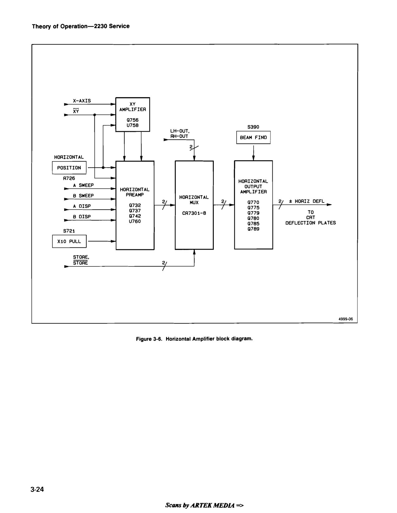


<details><summary>OCR text on this page</summary>

```
Theory of Operation-2230 
Service 
Figure 3-6. Horizontal Amplifier block diagram. 
Scans by ARTEK MEDLQ - 
S390 
LH-OUT. 
X-AXIS 
- - 
i3 
- - 
# - 
XY 
AMPLIFIER 
0756 
U758 
HORIZONTAL 
7 
- - 
RH-OUT 
21 i HORIZ DEFL 
2 
HORIZONTAL 
OUTPUT 
AMPLIFIER 
0770 
R726 
/ 
t 
v 
1 
1 
# 
0775 
CR7301-8 
A DISP 
0732 
A snEEP 
B SHEEP 
t 
:Ljii~~l/ 
5721 
p q 
HORIZONTAL 
PREAMP 
DEFLECTION 
CRT 
TO PLATES 
2/ 
E
E
.
 
STORE 
2/ 
1 
/ 
4999-06 
2/ 
HORIZONTAL 
MUX
```

</details>


---

## Page 80 of 451

Theory of Operation-2230 
Service 
Transistors Q770, (2775, and (2779, as one-half of the 
complementary 
differential circuit, form a cascode- 
feedback amplifier for driving the right crt horizontal 
deflection plate. Amplifier gain is set by R775, with C775 
providing high-frequency compensation. For low-speed sig- 
nals, Q779 serves as a current source for (2775. At high 
sweep rates, the deflection signal is coupled through C779 
to the emitter of Q779 to provide added pull-up output 
current to drive the crt. The amplifier formed by Q780, 
(2785, and Q789 drives the left crt horizontal deflection 
plate in the same manner as described above, with Zener 
diode VR782 shifting the collector signal level of Q780 to 
the correct level to drive the emitter (2785. 
The BEAM FlND function is active when S390 is 
pushed in to disconnect the cathode of CR764 from the 
-8.6 V supply. The voltage on the cathode of VR764 
goes positive, causing CR780 and CR770 to be forward 
biased. Current from R764 causes the output common- 
mode voltage of the two shunt-feedback amplifiers to be 
shifted negative to reduce the available voltage swing at 
the crt plates. This stops the trace from being deflected 
off-screen horizontally. The BEAM FlND voltage also goes 
to the Vertical Output Amplifier, and the vertical deflection 
is limited in that circuit when the voltage is removed. 
A circuit formed by Q7501 and Q7502 supplies refer- 
ence voltages for the 1 K and 4 K storage acquisitions and 
for the variable SECIDIV control, R721. Transistor Q7502 
provides a 0.6 V drop from the -8.6 V supply to generate 
a -8 V reference for the 1K REF and one end of poten- 
tiometer R721. The 4K REF is produced by Q7501 and is 
adjusted by using the RATIO ADJ potentiometer to set the 
correct ratio for the two reference voltages. This reference 
level also goes to the other end of R721. The wiper volt- 
age of R721 is the HOR REF voltage for the A and B 
Sweep timing resistors in NONSTORE mode. In STORE 
mode, either the 1K REF or the 4K REF voltage level is 
applied to the A and B Sweep timing resistors. Switching 
between reference levels for the different modes is done 
by the Storage Panel ACQUISITION switches (located on 
Diagram 14). 
Probe Adjust 
The Probe Adjust circuitry, shown on Diagram 7, is a 
square-wave generator and diode switching network that 
produces a negative-going square-wave signal at PROBE 
ADJUST connector J9900. Amplifier U985 forms a multivi- 
brator that has an oscillation period set by the time con- 
stant of R987 and C987. When the output of the multivi- 
brator is at the positive supply voltage, CR988 is forward 
biased. This reverse biases CR989, and the PROBE 
ADJUST connector signal is held at ground potential by 
R990. When the rnultivibrator output switches states, and 
is at the negative supply voltage level, CR988 is reverse 
biased. Diode CR989 becomes forward biased, and the cir- 
cuit output level drops to approximately -0.5 V. 
MICROPROCESSOR AND 
STORE-PANEL CONTROLS 
The Microprocessor, shown on Diagram 14, directs the 
operation of the Storage and digital circuitry in the oscillo- 
scope by following firmware control instructions stored in 
the Microprocessor memory. The Store-Panel Controls are 
monitored by the Microprocessor to detect when a 
Storage operation is selected. The rest of the significant 
front-panel controls are monitored through the Front-Panel 
A-to-D converter and I10 interface circuitry. Circuit opera- 
tion is then directed by the Microprocessor to perform the 
selected operation. 
Microprocessor, Clock, and Timer 
Microprocessor U9111 is the center of control activities. 
It has an eight-bit combination bidirectional data bus for 
information transfer and addressing (ADO through AD7) 
and a 12-bit address bus for selecting the source or desti- 
nation of the data transfers (A8 through A19). Precise tim- 
ing of instruction execution, addressing, and data transfer 
is provided by an external, crystal-controlled oscillator, 
shown on Diagram 18 and Clock Generator U9104. 
A divide-by-three circuit in Clock Generator U9104 
reduces the 20 MHz external input from the crystal oscilla- 
tor circuit to 6.7 MHz for clocking the Microprocessor. An 
output from the 6.7 MHz clocking signal also drives the 
Display Controller (U9208 on Diagram 15) to time those 
devices. Another clock signal (PCLK) output, at one-half 
the Microprocessor clock frequency (3.3 MHz), is supplied 
to the input to U9108, a binary ripple counter that pro- 
duces a lower frequency timing signal. The 6.7 MHz signal 
is also included in the Control Bus to provide a clocking 
signal for future options. 
The RESET output of U9104 provides a power-on reset 
signal under normal operation or a manual reset using 
- 
jumper connector P9104. The RES voltage level at pin 11 
is held below the switching threshold of an internal Schmitt 
Trigger circuit after the power is applied for a time period 
set by the RC time constant of R9107 and C9107. This 
holds the Microprocessor in the reset state until the power 
supply voltages are high enough to permit normal opera- 
tion of the digital circuitry. The Microprocessor is held 
reset during the delay period. Manually moving jumper 
P9104 to the RESET position forces a reset of the 
Microprocessor and the Display Controller. 
The only RAM available for general use is the Display 
RAM. It's access is mediated by the Display Controller 
and associated circuitry. To allow the Display Controller to 
have first priority access to the RAM, the RDYI input to 
the clock generator is used to tell the Microprocessor to 
wait for access to the RAM. 
Scans by ARTEK MEDLA =>


---

## Page 81 of 451

Theory of Operation-2230 
Service 
In addition, when one of the Communication Options is 
installed, the RDY1 input (U9104 pin 4) is used to syn- 
chronize the operation of the Microprocessor with the 
asynchronous activity of the GPlB (General Purpose Inter- 
face Bus) or RS-232-C Options for parallel or serial data 
transfer via the external communications port. 
Resistor pack R9113 is a data bus pull-up. During nor- 
mal operation, the resistor pack generates the interrupt 
vector pointer. During the hardware kernel test, the resis- 
tor pack generates the NOP instruction. 
Latch and Buffer 
Addressing is done using dedicated address bus lines. 
Address latch U9112 demultiplexes the address bus 
(separates the address and data bytes). When an address 
is valid, the Microprocessor sets the address-latch enable 
(ALE) HI (U9111 pin 25). Both U9112 and U9114 are 
clocked to latch the address bits. The latched bits are held 
until the Microprocessor places a new address on the 
busses and again sets the ALE signal HI. Some bits pass- 
ing through U9114 have status information multiplexed 
with the address, so U9114 also functions as a demulti- 
plexer. 
Decoder 
In addition to providing specific addresses to internal 
locations within memory devices, the addresses are 
decoded to provide enabling signals for blocks of 
addresses 
and 
to 
control 
the 
selection 
of 
110 
(InputIOutput) devices. Table 3-1 shows the instrument's 
memory map. 
In normal operation, address block decoder U9106 is 
always enabled. One-half of the dual 1-of-4 decoder looks 
at address bits A14 ar..d A15. Latched address bits A18 
and A19 from U9114 are looked at by the second half of 
the device. 
110 address decoding is performed by U9105. To per- 
form its decoding, it must be enabled by the decoded out- 
put of U9106. The lower half of U9105 is controlled by a 
logic gating circuit formed by U9101D, U9102A, and 
U9102D. The lower half becomes enabled when either RD 
or WR is Low and BLOCK-0 and 10 SEG are both LO. 
The upper half of U9105 is enabled only when address bits 
A12 and A13 are both HI, setting pin 9 of U9105 LO. 
ROM 
The operating system firmware is contained in two 64K 
by 8-bit read-only memories (U9110 and U9109). Immedi- 
ately after the power-up reset ends, the Microprocessor 
automatically fetches the first command from the reset 
vector (address OFFFFO), and begins program execution. 
Other interrupts to the Microprocessor cause vectoring to 
addresses that start the interrupt handling routines. The 
NMI (non-maskable interrupt) vector is at 00008, and the 
Maskable Interrupt (INTR) is vectored to 03FC (both inter- 
rupt vectors are in RAM). 
Store Panel Controls and Buffer 
The open or closed position of the Storage Panel Con- 
trols is passed to the Microprocessor via two octal bus 
drivers, U9301 and U9302. Each bus driver transfers eight 
individual data bits to the data bus when enabled. Enabling 
of the bus drivers is done by address line A2, which goes 
to both drivers, and decoded inputloutput enabling lines, 
going separately to each driver. Both enabling inputs must 
be LO on each IC to pass the input data bit to the data 
bus. 
The Microprocessor communicates with the other 
devices on the data bus via Octal Bus Transceiver U9113. 
Two signals from the Microprocessor control enabling of 
the Transceiver and direction of the data flow. When the 
- 
DEN signal is LO U9113 is enabled for transfers, and the 
DTIR signal sets the direction of the transfer. 
I O / ~ 
qualifies the transfer to allow pull-ups to assert an inter- 
rupt number on the bus during interrupt cycles. While the 
address and data are available on the bus side of this 
transceiver, only the data time slot is used. 
Non-Storage Front-Panel Controls 
There are many front-panel controls that do two things 
at the same time; control the real-time scope mode, and 
tell the Microprocessor what is being selected or modified. 
These controls include the vertical position controls, the 
vertical gain controls, the A and B time per division con- 
trols, the three major trigger mode controls, the vertical 
coupling controls, the sweep mode control, and the delay- 
time control. In addition, the probe-coding ring is read to 
determine true Volts per Division. In addition to acting as 
the user interface to the Microprocessor, the 1Kl4K and 
STOREINON STORE switches select the reference volt- 
age applied the A and B timing resistors in the Sweep 
Generator circuitry. 
STATUSADCANDBUSINTERFACE 
Front-panel control settings and the operating status 
are passed to the Microprocessor via the Bus Interface. 
Digital signals that can be read directly as data bits are 
buffered onto the Data bus either via octal bus driver 
U6102 or U6103. Analog voltages are converted to digital 
data bytes by analog-to-digital converter U6105. The ana- 
log signals are multiplexed to a buffer amplifier either by 
Scans by ARTEK MEDLA -


---

## Page 82 of 451

Theory of Operation-2230 
Service 
Table 3-1 
Memory Space Allocation 
1 
08000-OFFFF 
1 
4 bits of displav RAM for waveform attributes (LSB). 
Block Designation 
RAM SEG 
RAM Primary 
1 
10000-3FFFF 
I RAM Images. 
- 
- 
- 
10 SEG 
Block Address (Hex) 
00000-3FFFF 
00000-07FFF 
10 Main lmage 
Space Allocation Purpose 
Four images of Memory Segment 0 
8-bit display RAM-waveforms, interrupt vectors, miscellaneous. 
I 
1 
43FFA (10-OL A2) 
I Front Panel Buffer U9301. 
- - 
40000-7FFFF 
4067C (10-2 A7,8) 
406BC (10-2 A6,8) 
406FO (10-2 A3,8) 
406F1 (10-2 A3,8) 
406F2 (10-2 A3,8) 
406F3 (10-2 A3,8) 
406F4 (10-2 A3,8) 
406F5 (10-2 A3,8) 
406F6 (10-2 A3,8) 
406F7 (10-2 A3,8) 
406F8 (10-2 A2,8) 
407DE (10-2 A5) 
407EE (10-2 A4) 
41 XXX (m) 
42XXX (FRAME) 
4377E (10-0 A7) 
437BE (10-0 A6) 
437DE (10-0 A5) 
437EE (10-0 A4) 
437F6 (10-0 A3) 
437FA (10-0 A2) 
4377F (10-1 A7) 
437DF (10-1 A5) 
437EF (10-1 A4) 
437F7 (10-1 A3) 
437FB (10-1 A2) 
Four images of Memory Segment 1 
Option Status Latch (in). 
Option Parameters Latch (in). 
Option UARTIGPIB chips (110). 
Option UARTIGPIB chips (110). 
Option UARTIGPIB chips (110). 
Option UARTIGPIB chips (110). 
Option UARTIGPIB chips (110). 
Option UARTIGPIB chips (110). 
Option UARTIGPIB chips (110). 
Option UARTIGPIB chips (110). 
Option Interrupt Mask Latch (out). 
Time Base Mode Register U4119. 
Time Base Divider Register U4113. 
Display chip interrupt reset. 
Display chip next frame. 
Acquisition Memory Address Buffer Low bits U3427. 
Acquisition Mode Register U3310. 
B Delay Timer U4123. 
Record Counter U4115 and U4116. 
Front Panel AID control U6104. 
Front Panel AID data U6102. 
Acquisition Memory Address Buffer high bits U3428. 
B Delay Timer U4124. 
Record Counter U4117. 
Clock Delay Timer U4231. 
Main Front Panel lnout U6103. 
10 Duolicate lmaaes 
/ 
50000-7FFFF 
I 
I 
43FFB (10-1 L A2) 
48000-4BFFF 
COMM SEGMENT 
) 
80000-BFFFF 
I Two images of Memory Segment 2 
Front Panel Buffer U9302. 
Acquisition Memory-Four 
images of Acquisition RAM U3418 
and U3419. 
Option Main lmage 
Half of Communication Options ROMs U1243 or U1343. 
Option nonvolatile RAM. 
Nonvolatile RAM. 
Half of Communication Options ROMs U1243 or U1343. 
Scans by ARTEK MEDLQ =>


---

## Page 83 of 451

Theory of Operation-2230 
Service 
Table 3-1 (cont) 
U6106 for the Vertical status signals or by U6101 for the 
(R2118 for Channel 1 and R2108 for Channel 2) sets the 
Horizontal Status signals. The multiplexers are controlled 
acquisition gain for each channel. Thermistors RT2101 and 
by the Microprocessor via the control bits latched into 
RT2111 temperature compensate the gain of the circuit. 
U6104. The buffer amplifier output drives the input to the 
Diodes CR2111 and CR2112 temperature compensate the 
ADC. The converted data from the ADC is buffered onto 
gain of the circuit at high frequencies. Capacitors C2103 
the data bus by U6102. 
and C2113 set the high-frequency peaking. 
The Channel 1 amplifier base biasing voltage is supplied 
STORAGE ACQUISITION 
via R2122 and the input termination resistors, R2121 and 
R2120. The termination resistors provide the proper 
Space Allocation Purpose 
Two images of Memory Segment 3 
System ROM 0-Low 
half of U9109. 
System ROM 1 -Low 
half of U9110. 
System ROM 0-High 
half of U9109. 
System ROM 1-High half of U9110. 
Block Designation 
Option Duplicate lmage 
ROM SEGMENT 
ROM Duplicate lmage 
ROM Main Image 
The Storage Signal Acquisition system, shown on 
Diagram 16, selects the channel or channels for digitizing, 
samples the signals at clock controlled intervals, and digi- 
tizes the samples. The circuitry consists of an analog 
Channel Switch, a Sample-and-Hold circuit, and the 
Analog-to-Digital Converter. A Strobe Generator drives the 
sampling circuitry diode bridge at the ADCLK rate 
(20 MHz) for all acquisition modes. 
Block Address (Hex) 
98000-BFFFF 
COOOO-FFFFF 
C0000-DFFFF 
E0000-E7FFF 
E8000-EFFFF 
FOOOO-F7FFF 
F8000-FFFFF 
Channel Switch 
With STORE mode selected, both channel signals are 
applied to analog Channel Switch U2101 where they may 
be selected for digitizing. Signals are selected by the 
CHAN1 or the ADD signals from the Acquisition Memory, 
shown on Diagram 11. The CHANl signal is derived from 
the delayed SAVECLK so channel switching takes place at 
the proper times for the AID conversion. Both sides of the 
Channel Switch conduct in ADD Mode, summing the two 
input signals at the output. See "Channel Select" in the 
Acquisition Memory discussion for details on channel 
selection signals. 
impedance match between the signal lines from the Verti- 
cal Preamplifiers (Diagram 2) and the high impedance 
inputs of the Channel Switch. Corresponding resistors in 
the Channel 2 amplifier perform the same job for Chan- 
nel 2. Selection of the channels is controlled by the inputs 
at pin 4 and pin 14. The CHAN1 signal biases on the 
Channel 1 differential amplifier pair when LO and the 
Channel 2 differential amplifier pair when HI. The logic level 
of CHAN1 is toggled at the proper rate to provide dual- 
channel operation. Diodes CR2103 and CR2104, and 
resistors R2128 and R2129 level shift CHAN1 to the level 
required by U2101. 
For ADD Mode, the CHAN1 signal is held LO and the 
ADD signal applied to pin 14 is switched HI by the 
Microprocessor via Acquisition Mode Register U3310, 
shown on Diagram 17, biasing on both the Channel 1 and 
the Channel 2 amplifiers. The resulting output current is 
the sum of the input signals applied to Channel 1 and 
Channel 2. Diodes CR2101 and CR2102, and resistors 
R2126 and R2127 level shift ADD to the level required by 
U2101. 
Differential channel signals are applied to the bases of a 
pair of transistors within the Channel Switch, at pins 2 and 
The differential output current from the Channel Switch 
15 for Channel 1 and pins 7 and 10 for Channel 2. Gain 
(pins 12 and 13) is converted to a single-ended voltage for 
setting and compensation networks are connected 
application to the sampling circuitry. An amplifier stage 
between the emitters of both differential pairs in the 
composed of Q2101, Q2102, Q2103, Q2104, Q2105, 
emitter current source path. A gain setting potentiometer 
Q2106, and associated circuitry performs the conversion. 
Scans by ARTEK MEDLQ =>


---

## Page 84 of 451

Theory of Operation-2230 
Service 
Common-base transistors, (22101 and (22102 form a 
differential amplifier that presents a low-impedance load 
for the Channel Switch. Offset is adjusted (using poten- 
tiometer R2138) to match the store display with the non- 
store display. Thermistor RT2131 temperature compen- 
sates the offset. Output current from the collector of 
(22102 is applied to the base of (22103, a shunt-feedback 
inverting amplifier. The inverted output signal voltage is 
developed across R2146 in the collector circuit. The output 
signal of Q2101 is developed across R2147 in series with 
the signal at the collector of (22103 to produce a single- 
ended replica of the differential input signal at the base of 
Q2105. Transistor (22104 and its associated biasing resis- 
tors provide a constant-current bias source for Q2101, 
(22102, and (22103. 
Emitter-followers (22105 and (22106 provide the neces- 
sary signal drive and impedance matching to the Sample- 
and-Hold diode bridge. Transistors (22150 and Q2107 and 
associated circuitry clamp the signal level to -2.5 V and 
+ 1 V respectively at the sample and hold input. 
A sampling diode bridge formed by CR2203 is biased 
on by a strobe from the Strobe Generator. The bridge is 
biased off during the hold period while the Analog-to- 
Digital Converter (ADC) is converting the last sample. 
When the bridge is strobed on. Hold capacitor C2235 is 
charged to the new analog level present at the input to the 
bridge. The bridge becomes biased off when the strobe 
passes, and the voltage on the hold capacitor is held until 
the next sample is taken. Signal samples are buffered by a 
high-impedance input FET amplifier and coupled to the 
ADC via an emitter-follower amplifier that provides the 
input of the ADC with a low-impedance source. FET 
Q2209B, with its source and gate connected together, 
supplies source current to Q2209A. A constant-current 
load for the emitter-follower is provided by Q221 1 and its 
associated biasing resistors. 
Strobe Generator 
The ECL (Emitter-Coupled Logic) circuit formed by 
U2203A, B, and C produces two pairs of complementary 
control signals. One pair drives the sample strobe circuit to 
bias the sampling diode bridge on, and the other clocks 
the ADC. The 20 MHz ADCLK clock from the Clock Gen- 
erator circuit (Diagram 18, Digital Timebase) is shifted to 
ECL levels by the voltage divider formed by R2265, 
R2266, and R2267. Capacitor C2224 improves the high- 
frequency characteristics of the divider string, and R2268 
limits the input current to U2203C. ORINOR-gate U2203C 
produces the complementary ECL clocks to the ADC. 
The sample-bridge strobe pulse is developed from the 
ADC clock signals by U2203B, U2203A, and the RC circuit 
composed of R2270 and C2225. The uninverted output of 
U2203C 
is applied to pin 4 of ORINOR-gate 
U2203A where its signal transitions are seen immediately. 
The inverted output of U2203C (CLK AID) must charge 
C2225 (through R2270) to the switching threshold of 
U2203B before U2203B can switch state and change the 
state of input pin 5 of U2203A. When a HI-to-LO transition 
occurs on pin 4 of U2203A, the output at pin 3 goes HI 
and pin 2 goes LO to follow the input signal. A short time 
later, the charge on C2225 reaches the switching thresh- 
old of OR-gate U2203B, and the output of that gate goes 
HI. That HI switches the output at pin 3 of U2203A back 
LO and pin 2 back HI. The total duration of the pulse is 
approximately 10 ns. Pin 4 of U2203A switches from LO 
to HI on the next transition of ADCLK, and after a short 
delay the output of U2203B goes LO again, readying the 
circuit for the next pulse. 
The complementary sample strobes are applied to 
opposite bases of a current-mode switch formed by (22208 
and Q2207. The amplified output is coupled to the sam- 
pling diode bridge biasing circuit by T2201 and T2202, a 
common mode transformer. Transformer coupling prevents 
any dc offsets from entering the bridge via the biasing cir- 
cuit by completely isolating the bias voltage from the signal 
voltage. The ECL output lines are terminated by R2278 
and R2277 at the differential switch. The resistors match 
the characteristic impedance of the transmission path to 
prevent reflections that occur when the signals are not 
properly terminated. Common mode transformers T2202 
and T2203 improve the symmetry of the strobe pulses so 
that, when the pulses are combined at CR2203, the pulses 
will cancel each other out and not show up as noise in the 
signal. 
When the sample strobe is being amplified, the polarity 
of the pulse on pin 6 of T2201 is positive. The sampling 
strobe path is through C2229, C2230, and T2203 to for- 
ward bias CR2203. Signal current then flows through the 
forward biased diodes to charge Hold capacitor C2235. At 
the end of the strobe the polarity changes across pins 6 
and 1 of T2201. The voltage on C2229 and C2230 
increase the reverse bias on the bridge during the off time. 
R2281 and the duty cycle of the strobe determine the 
charge on C2229 and C2230. 
Analog-to-Digital Converter 
Analog-to-Digital Converter U2204, converts analog 
input voltages in the range of 0 V to -2 V into 8-bit digital 
representations. The digital output code for 0 V is 
11 11 11 11 and 00000000 for -2 V. Conversions are con- 
tinually taking place at 20 Megasamples per second (the 
ADCLK rate) regardless of the SAVECLK rate. The ADC is 
Scans by ARTEK MEDL4 =;.>


---

## Page 85 of 451

Theory of Operation-2230 
Service 
a high-speed ECL device having ECL compatible open- 
emitter outputs. Pull-down resistors to the -5 V supply 
are in resistor pack R2295. The ECL output levels are 
converted to TTL levels by U2205 and U2206 and placed 
on the C-DATA BUS. 
An external voltage reference for the ADC is generated 
by a circuit composed of operational amplifier U2202B and 
Q2213. The +5 V reference voltage is converted to a 
current by R2259 and applied to the inverting input of 
U2202B. An extra current source is provided from the 
+8.6 V supply via R2260 to reduce loading on the +5 
VREF. The closed-loop gain of the stage is -0.4 for an 
output voltage of -2 V at the emitter of (2221 3. 
ACQUISITION MEMORY 
'The Acquisition Memory system, shown on Diagram 17, 
controls the movement of the digitized data from the AID 
Converter to the Acquisition Memory. The acquisition 
mode controls the way the transfer occurs. Data may be 
transferred directly to memory through the MINIMAX 
registers as either Odd and Even data for a single channel 
acquisition or Channel 1 and Channel 2 data for dual- 
channel acquisitions. In the Min-Max Mode, a certain 
number of data samples are compared for the highest and 
lowest amplitude during the comparison period. The max- 
imum and minimum data values are transferred to the 
Acquisition Memory. 
Data is transferred through the AID Buffer, the 
MINIMAX Registers, the Swap Registers, and finally into 
Acquisition Memory in a pipeline fashion. Waveforms are 
constantly sampled and digitized at the ADCLK rate, then 
the resulting data byte representing the value of each 
sample is latched into the AID Buffer if the CONV clock is 
20 MHz. Each succeeding sample clocked into the AID 
Buffer follows the previous data sample through the digital 
devices of the acquisition system. Acquisition control 
clocks that are copies of the SAVECLK with various 
delays handle the data transfer timing. 
AID Buffer 
A data byte from the AID Converter is latched into AID 
Buffer U3229 on the rising edge of the convert (CONV) 
clock. The data is immediately available on the G data bus 
during normal operation because the buffer is enabled by a 
HI from NAND-gate U3426D. 
- 
For testing and diagnostics purposes, the TEST signal 
on pin 12 of NAND-gate U3426D is made LO by the 
Microprocessor via the Acquisition Mode Register. That 
isolates the AID Buffer from the bus and enables the Diag- 
nostic Code Generator to place data on the G data bus to 
the MINIMAX Registers. 
MINIMAX Registers 
Data is latched into the MINIMAX Registers in four 
different ways depending on the acquisition mode. The 
MINCLK and MAXCLK clocking signals are selected by 
MINIMAX Clock Selector multiplexer U3309. The mode 
selected determines the actual clock signals that latch 
data into the MINIMAX Registers. 
For Sampling mode, the data is latched by ODDCLK 
and ODDCLK to place either odd and even data from a 
single channel or Channel 1 and Channel 2 data from both 
channels into the registers. The timing of the data bytes is 
evenly spaced in sampling mode (see Figure 3-7). 
In X-Y mode for 20 ps per division and slower, both 
channels are chopped to obtain the horizontal and vertical 
deflection signals. The EVENCLK signal clocks the MIN 
Register and ODDCLK signal clocks the MAX Register. 
Selecting these clocks makes the time difference between 
the two samples 100 ns. The last possible sample in a 
Channel 1 SAVECLK period and the first possible Chan- 
nel 2 sample are saved as a pair. X and Y data are then 
separated by one CONV clock period rather than the 
longer (possibly much longer) SAVECLK clock period. 
Min-Max mode generates the last two clocking modes. 
The first is the Min-Max Initialization mode. For initializa- 
tion, the first data sample in a SAVECLK period is latched 
into both the MIN and the MAX Registers at the same 
time. This is the sample with which the remaining samples 
taken during the SAVECLK period are compared. After 
storing the initial data sample, the MINIMAX Clock Selec- 
tor multiplexer (U3309) is switched. It then passes the 
NEWMIN and NEWMAX signals from the data Compara- 
tors, U3233 and U3235, to clock the MINIMAX Registers. 
COMPARATORS. 
Data 
bytes 
latched 
into 
the 
MINIMAX Registers are compared with each new data 
byte latched in the AID Buffer. If the data value is either 
lower than the present data in the MIN Register or higher 
than present data in the MAX Register, the appropriate 
Comparator output pin goes HI. The comparison takes 
some time after the clocking signals, so the MINIMAX 
Clock Selector Multiplexer is disabled from passing the 
NEWMAX or NEWMIN until the CONV clock goes LO. By 
that time, the comparator outputs have stabilized. If a 
NEWMAX or NEWMIN has occurred, the new data byte is 
latched into the appropriate register one-half a CONV 
clock cycle after the data was latched into the AID Buffer. 
The Min-Max data comparisons for each saved data 
byte continue for the duration of the SAVECLK period. 
The minimum number of samples compared is 4 at 20 ps 
per division. This corresponds to the number of CONV 
clock periods possible at the fastest SAVECLK rate (a 
Scans by ARTEK MEDL4 i>


---

## Page 86 of 451

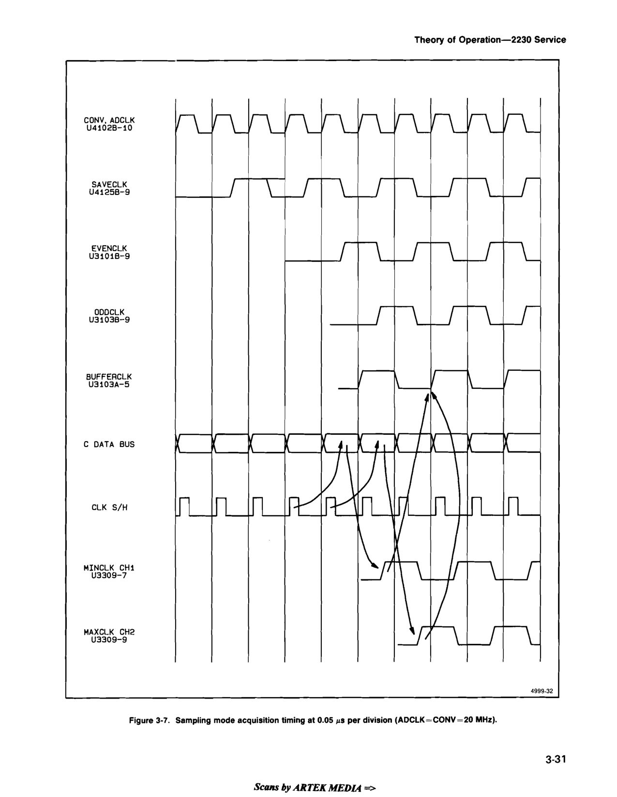


<details><summary>OCR text on this page</summary>

```
Theory of Operation-2230 
Service 
CONV. ADCLK 
U4102B-10 
SAVECLK 
U4125B-9 
EVENCLK 
U31OiB-9 
ODDCLK 
U3 1038-9 
BUFFERCLK 
U3103A-5 
C DATA BUS 
CLK S/H 
MINCLK CHI 
U3309-7 
MAXCLK CH2 
U3309-9 
4999-32 
Figure 3-7. Sampling mode acquisition timing at 0.05 ps per division (ADCLK=CONV=20 MHz). 
Scam by ARTEK MEDM =>
```

</details>


---

## Page 87 of 451

Theory of Operation-2230 Senrice 
function of the SECIDIV switch setting). As the SAVECLK 
period increases with slower SECIDIV switch settings, the 
number of samples compared to find a min and a max per 
SAVECLK period also increases. 
MIN-MAX OUTPUT. One CONV clock period before the 
end of the SAVECLK period, the ACQWRITE signal gives 
write control of the Acquisition Memory to the acquisition 
system (see Figure 3-8). If SWAPEN (U3320 pin 13) is HI, 
either SWAP (U3313A pin 3) or SWAP (U33138 pin 6) 
becomes TRUE (depending on whether the last sample 
was a NEWMAX or a NEWMIN) at one-half a CONV clock 
period before the end of the SAVECLK to enable the out- 
put of one set of the Swap Registers onto the rnemory 
data buses. At the same time, BUFFERCLK (U3103A 
pin 5) goes HI to clock the last Min and Max data from the 
MINIMAX Registers into and through the Swap Registers 
onto the memory data buses where the data is written into 
the Acquisition Memory. All 16 bits of the Min and Max 
data are transferred into rnemory in parallel. This 16-bit 
transfer also holds true for Odd and Even or Channel 1 
and Channel 2 data bytes when those signals are being 
sampled. 
Acquisition Mode Register 
The Acquisition Mode Register controls the manner in 
which data is transferred through the acquisition system 
from the AID Buffer to the Acquisition Memory. Outputs of 
the MINIMAX Clock Selector multiplexer, U3309, were dis- 
cussed in the description of the MINIMAX Registers. The 
control signals for switching the multiplexer and selecting 
which set of Swap Registers are enabled when transfer- 
ring data to the Acquisition Memory are described in this 
part. The mode selection control of the MINIMAX Clock 
Selector multiplexer is shown in Table 3-2. 
Table 3-2 
MINIMAX Clock Selector Multiplexer Switching 
Multiplexer switching is controlled by the MINIMAX and 
XY signals from the Acquisition Mode Register U3310 
(sent by the Microprocessor) and the state of the CONV 
clock. In MINIMAX, the circuitry composed of U3306A and 
U3306B produces a 100 ns HI pulse at the beginning of 
each SAVECLK cycle to initialize the MINIMAX Registers 
for making comparisons. Prior to entering the MinIMax 
MODE 
MINIMAX INIT 
MINIMAX 
SAMPLING 
SAMPLING XY 
mode, flip-flop U3306A is held in the Set state (reset is 
also LO, so both outputs of the flip flop are HI). Each ris- 
ing CONV clock edge clocks the HI through flip-flop 
U3306B and pin 9 remains HI. With a LO MINIMAX signal 
on control input 1 and a HI from flip-flop U3306B on con- 
trol input 0, the multiplexer selects the sampling mode 
clocks (ODDCLK and ODDCLK) to clock data into the 
MINIMAX Registers. 
When MINIMAX (U3310 pin 14) goes HI, the set is 
removed from U3306A and the flip-flop becomes reset by 
the LO on pin 1. On the next rising edge of CONV, the LO 
is clocked through flip-flop U33068, and the reset is 
removed from U3306A. On the next rising edge of 
EVENCLK, the fixed HI on the D input of U3306A is 
clocked through that flip-flop to the D input of U3306B. 
Then on the next rising edge of CONV, it is clocked to the 
Q output to make control input 0 of the multiplexer HI 
along with the MINIMAX input on control input 1. The mul- 
tiplexer will not yet pass the fixed HI inputs selected, 
because the outputs are not enabled. When CONV goes 
LO, AND-gate U4101C passes that LO to the enabling 
inputs of the multiplexer. The two input HI levels are then 
passed through the multiplexer to clock the same data 
byte into both MINIMAX Registers. When CONV again 
goes HI, the multiplexer outputs become disabled, so the 
INIT clock to the MINIMAX Registers last for only one-half 
of a CONV clock period. 
Control 
Input 0 
1 
0 
1 
0 
When the HI was clocked to pin 9 of U33068, pin 8 
went LO, and U3306A became reset, placing a LO on its 
Q output. The next rising edge of the CONV clock clocks 
the LO through flip-flop U33068, changing control input 0 
of the multiplexer and removing the reset from flip-flop 
U3306A. The initialization pulse to control input 0 lasts for 
a period of one CONV clock; 100 ns in MinIMax mode. 
After initialization, the multiplexer switches to select the 
NEWMIN and NEWMAX outputs from the data compara- 
tors (U3233 and U3235) to clock the MINIMAX Registers. 
The one-half CONV clock delay in enabling the multiplexer 
allows the outputs of the Comparators to settle when, on 
the next samples, the outputs of the comparators are 
used to clock the MINIMAX Registers. A new initialization 
is started again on the next rising edge of EVENCLK (once 
for each SAVECLK). 
The last Acquisition Mode is XY Sampling. The 
Microprocessor sets the MINIMAX and fl signals LO at 
the Acquisition Mode Register (U3310). That places a LO 
on control input 1 of the multiplexer and enables the out- 
puts through AND-gate U4101C. With XY LO, flip-flop 
U3306B is held reset, placing a LO on control input 0 of 
the Multiplexer. The MINCLK and MAXCLK are then the 
EVENCLK and ODDCLK signals respectively. These 
clocks produce the minimum possible time difference 
(100 ns) between the Channel 1 and Channel 2 data sam- 
ples that are stored as a pair. 
Control 
Input 1 
1 
1 
0 
0 
Scans by ARTEK MEDLQ => 
Input 
Selected 
3 
2 
1 
0


---

## Page 88 of 451

Theory of Operation-2230 Service 
Figure 3-8. MINIMAX Acquisition timing at 20 ps per division. 
CONV 
U4102B-10 
Scans by ARTEK MEDLA => 
ADCLK 
U4102A-6 
SAVECLK 
U4 1250-9 
EVENCLK 
U3101B-9 
BUFFERCLK 
U3 103A-5 
MINCLK (CHI) 
U3309-7 
MAXCLK (CH2) 
U3309-9 
I N I T STROBE 
U3309- 1 4 
I 
MIN MAX DAT4 is 
l a b e l e d by J3236-:9 
. p o s s i b l e new MIN 
- 7 
r 7 
r 7 
I
\
/
\
/
\
 
I 
I
'
 
1 
I 
I 
I r l t i a l i z e d P u l s e s f o r 
U3232 6 U3234 
I- 7 
r - L 
r 7 
/
\
/
\
I
\
 
. p o s s i l l e 7ew MLX 
4999-33


---

## Page 89 of 451

Theory of Operation-2230 
Service 
Another section of the circuitry is used in conjunction 
When that LO is clocked through U33078, NAND-gate 
with the Min-Max Sampling mode to determine whether 
U3313B goes LO, passing and inverting the DATAEN ena- 
the last sample clocked into the MINIMAX Registers was 
bling signal. That makes SWAP LO, and the swapping 
a NEWMIN or a NEWMAX. This knowledge is necessary 
buffers (U3237 and U3238) are enabled, placing the Max 
in chopped MinlMax mode to place the Min and Max data 
data into the Acquisition Memory that the processor looks 
samples into the Acquisition Memory in the correct order. 
at to find the data that occurred last. 
Each Swap Register consists of two sets of two. The Min 
data is placed in both buffers of one set and the Max data 
in both buffers of the other set at the same time by the ris- 
Acquisition Clock Decoder 
ing edge of BUFFERCLK. The outputs of one of the 
buffers in each set are connected to one of the memory 
data buses and the other half of the buffers are connected 
to the opposite memory data bus. Depending on which 
buffer in each set is enabled, the data is placed on the 
memory data buses by either the nonswapping buffers or 
the swapping buffers (controlled by enable signals SWAP 
and SWAP). 
When swapping is not enabled, as in sampling and X-Y 
modes, the SWAPEN signal from the Acquisition Mode 
Register (U3310) is LO, and flip-flop U3307B is held set. 
NAND-gates U3313B and U3313A have as one of their 
inputs the Q and a 
outputs of the flip-flop respectively. 
With the flip-flop held set, NAND-gate U3313B is enabled 
to pass the DATAEN enabling signal to the nonswapping 
buffers only. In chopped MinlMax mode, swapping is 
enabled to place the Min and Max data in memory in the 
correct order. The SWAPEN signal is set HI and the reset 
is removed from flip-flop U3307B so that the latch circuit 
on the D input controls the SWAPISWAP 
states. 
At initialization in MinlMax mode, both MINCLK and 
MAXCLK (U3309) go HI for the first data byte. At the end 
of the initialization pulse, both inputs to the latch are 
removed by disabling the multiplexer outputs, and the out- 
put states of both NOR-gates (U3308C and U3308D) 
remain LO. 
A MAXCLK or MINCLK signal going HI is accompanied 
by a LO on the opposite signal line. If the MINCLK signal 
goes HI, the accompanying LO on the MAXCLK line 
causes U3308C to change output state from LO to HI. 
That HI goes to pin 12 of U3308D, holding its output LO. 
No further switching of the latch occurs unless the 
MAXCLK signal goes HI. MINCLK going HI again will not 
cause any state changes in the latch. If MAXCLK goes HI, 
U3308D will change to a LO output state, and U3308D 
pin 13 will be latched HI. The state of pin 13 when the ris- 
ing edge of BUFFERCLK occurs is clocked through flip- 
flop U3307B, enabling one of the NAND-gates that must 
pass the DATAEN enabling signal to the Swap Registers. 
If a NEWMAX (MAXCLK) occurred last, the Q output of 
U3307B will be HI and SWAP will be LO, enabling the 
nonswapping buffers, U3236 and U3239. If a NEWMIN 
(MINCLK) occurred last, pin 13 of U3308D will be LO. 
The Acquisition Clock Decoder circuitry is composed of 
three parts. One part is a flip-flop delay chain that pro- 
duces the transfer clocks. The output clocks from the 
chain are essentially copies of the SAVECLK delayed by 
successive CONV or OONV clock periods. The second 
part controls acquisition writes 
by 
producing the 
ACQWRITE and DATAEN clocks. The outputs of this por- 
tion switch control of the Acquisition Memory to the 
acquisition memory system. This enables the data from 
the Swap Registers onto the memory data buses so it can 
be written into memory. The final section of the clock 
decoder circuitry drives the analog Channel Switch to 
select the vertical channel signal to be digitized. 
DELAY CHAIN. The first four of five flip-flops in the 
delay chain (U4104B, U3101 A, U31018, and U3103B) are 
clocked by 
for delays through each of either 100 ns 
or 50 ns (10 MHz and 20 MHz CONV clock rates respec- 
tively). The various delays represented by the output clock 
lets data being transferred through each device in the 
acquisition pipeline settle at the outputs; and, in the case 
of Min-Max mode, be processed through the comparators 
before the next data byte is clocked in. The last flip-flop in 
the delay chain (U3103A) is clocked by CONV and pro- 
duces a delay of one-half of a CONV-clock period between 
EVENCLK (U3101 B) and BUFFERCLK (U3103A). Every 
rising edge of BUFFERCLK transfers both 8-bit data bytes 
from the MINIMAX Registers into the Swap Registers and, 
in chopped Min-Max mode, clocks flip-flop U3307B in the 
Swap-Control circuitry. Flip-flop U3307B latches the last 
state of MINCLK and MAXCLK to determine which set of 
Swap Registers are enabled to pass data to the Acquisi- 
tion Memory buses. See the "Acquisition Mode Control" 
description for additional information on Swap Register 
enabling. 
ACQUISITION WRITE. Flip-flops U3105A and U3105B 
form a self-resetting circuit that produces the ACQWRITE 
signal once each SAVECLK period. The time duration of 
ACQWRITE is one WRITECLK period, either 100 ns or 
200 ns (twice the CONV clock period) except at the 
fastest sampling rates when the SAVECLK is running at 
10 MHz. In that case, once switched HI to write the first 
data into memory, ACQWRITE remains HI until ENDREC 
goes LO (a full record). The logic gating of U3104A, B, C, 
and D controls the reset line to U3105B. 
Scans by ARTEK MEDLA =>


---

## Page 90 of 451

Theory of Operation-2230 
Service 
Before the start of an acquisition, U3105A pin 1 is held 
LO by ACQENA. The LO keeps U3105A reset, putting a 
LO on U3105A pin 5 and U3104C pin 9. The LO on the 
input of NAND-gate U3104C causes the reset input of 
U3105B (pin 13) to be HI. This allows the next delayed 
SAVECLK to set U3105B. However before the start of an 
acquisition, SAVECLK is held LO, U3105B remains reset, 
the D input (pin 12) of U3105A is LO, and the WRITECLK 
signal continues clocking a LO to an already LO output of 
U3105A. 
At the start of an acquisition, ACQENA goes HI on the 
reset input of U3105A. On the first rising edge of the 
delayed SAVECLK from U3101A pin 5, the fixed HI on the 
D input of U3105B is clocked through to place a HI on the 
D input of U3105A. On the next rising edge of WRITECLK, 
that HI is passed to the Q output of U3105A and pin 9 of 
NAND-gate U3104C. Assuming a HI is present on pin 10 
of the NAND-gate, the output at pin 8 goes LO, resetting 
U3105B, and on the next rising edge of WRITECLK the 
LO from the Q output of U3105B is clocked through 
U3105A to end the ACQWRITE pulse. The ACQWRITE 
pulse also removes the reset from U3105B so that the 
next time it is clocked (by the next delayed SAVECLK), a 
new ACQWRI'TE pulse is produced for the next Acquisition 
Memory write. 
The ACQWRITE signal goes to the Memory Control 
multiplexer (U3417) to switch Acquisition Memory write 
control to the acquisition system and is also applied to the 
D input of flip-flop U3307A. One-half of a CONV clock 
period later, the rising edge of CONV transfers the HI to 
the DATAEN clock line at the Q output of the flip-flop. 
DATAEN going HI enables NAND-gates U3313A and 
U3313B in the Swap-Control circuitry to pass the SWAP 
and SWAP register enabling signals. That and BUF- 
FERCLK going HI transfers the data from the MINIMAX 
Registers onto the Acquisition Memory busses where it 
can be written into memory. 
If the SEClDlV setting is such that SAVECLK is running 
at 10 MHz, RNGA and RNGB will both be HI at the inputs 
to NAND-gate U3104D. That makes the output of U3104A 
also a HI. ENDREC goes LO only when an acquisition is 
completed with a full record. The output of U3104B is 
therefore LO, and U3104C is disabled, preventing a reset 
from being passed to flip-flop U3105B. When ENDREC 
does go LO, NAND-gate U3104C is enabled, and the reset 
is passed to U3105B. On the next rising edge of 
WRITECLK, ACQWRITE is clocked LO, switching memory 
write control away from the acquisition system. When 
operating at the fastest SAVECLK rates, a pair of Swap 
Registers are enabled for the entire acquisition period to 
immediately transfer data clocked in by BUFFERCLK to 
the memory data buses. 
CHANNEL SELECT. When only Channel 1 or Channel 2 
is selected, the Microprocessor controls the choice via the 
Acquisition Mode Register. For Channel 1 only, the 
- 
Microprocessor sets the CHI line LO, which sets U3102A 
and holds the CHANl line LO. CHANl switches the 
analog channel Switch (U2101 on Diagram 16) to select 
and apply the Channel 1 signal to the Sample-and-Hold 
circuitry. Conversely, Channel 2 is selected when the 
- 
Microprocessor sets the CH2 line LO, which resets 
U3102A and holds the CHAN1 line HI. When the signals 
from both channels are to be added for ADD Mode, the 
- 
CHAN1 signal line is held LO, and the ADD signal is held 
HI. This turns on both sides of the analog Channel Switch 
to sum the input signals. 
For dual-channel acquisitions, both the set and reset 
input to flip-flop U3102A are HI, and channel switching is 
controlled by ADCLK and the logic circuitry driving the D 
input of the flip-flop. Channel switching is then determined 
by the acquisition mode and the range setting of the 
SECIDIV switch. The channel switching is timed to place 
the switching point between ADCLK positive transitions 
(between sampling points) at the correct time for starting 
waveform data into the acquisition system pipeline. 
Multiplexer U4103 (Diagram 18) is switched by the 
RNGA and RNGB signals from the Timebase Mode Regis- 
ter. For SECIDIV settings of 0.05 ps to lops, CONV clock 
and ADCLK run at 20 MHz and are in phase. In that case, 
the SAVECLK signal phase is also correct for driving the 
analog Channel Switch. For the remaining SECIDIV switch 
settings, the CONV clock runs at one-half the ADCLK 
clock rate, and the control clocks developed by the delay 
chain are delayed by 100 ns through each flip-flop rather 
than by 50 ns as at the faster SECIDIV settings. Since 
this changes the delays of data going through the pipeline, 
a delayed SAVECLK is required to switch channels at the 
proper time. The 100 ns delayed SAVECLK from the Q 
output of U4104B is delayed another 25 ns, by the rising 
edge of ADCLK, before reaching the output of flip-flop 
U3106A (Diagram 17). 
Either the delayed SAVECLK from U3106A or 
SAVECLK is selected by the multiplexer and applied to the 
clock input of U3102B and to one input of NAND-gate 
U3112 (pin 2). When Min-Max mode is selected, flip-flop 
U3102B divides the selected clock by two. The channel is 
switched only once for each SAVECLK so that the sam- 
ples compared for min and max during a SAVECLK cycle 
are all from the same channel. 
When ACQENA on the reset input of U3102 is HI, the 
flip-flop is enabled to toggle on each rising clock edge. If 
Min-Max mode is also HI. NAND-gate U3313 is enabled to 
pass the signal from the Q output of the flip-flop. NOR- 
gate U3308, connected as an inverter, places a LO on


---

## Page 91 of 451

Theory of Operation-2230 Service 
pin 1 of U3112A, and NAND-gate U3112 is disabled from 
passing the selected clock signal. U3112A puts a HI on 
pin 13 of U3112D, enabling U3112D to pass the divided 
clock signal to the D input of flip-flop U3102A. Rising 
edges of ADCLK transfer the inverted state of the signal 
at the D input of U3102A to the CHANl signal line, switch- 
ing the Analog-Channel Switch at one-half the SAVECLK 
frequency. 
In Sampling and XY 
Sampling Modes, 
MINIMAX is LO. This disables U3313D, stopping the 
divided clock, and enables U3112 to pass the selected 
clock to the D input of U3102A. Then, the selected clock 
and CHANl are the same frequency. Another 50 ns of 
delay is added when clocking through U3102A. 'The delay 
is present for either selected clock. 
MEMORY CONTROL. Memory Control multiplexer 
U3417 selects the enabling and read-write signals that 
control the Acquisition Memory. When the ACQWRITE 
clock goes HI (see Figure 3-9), the multiplexer turns the 
memory over to the Acquisition System (1 inputs) to per- 
form a write to memory. From the inverting multiplexer, 
the renabling signal (pin 7) is a fixed LO that selects the 
Acquisition Memory devices for access. The 
enabling 
signal (pin 4) is a fixed HI that disables the memory 
devices for outputting data. Writing to memory is con- 
trolled by the WRITECLK signal from the Clock Generator 
(Diagram 18). It becomes the W (write enable) on pin 9 
and the ADDRCLK (memory address clock) on pin 12 of 
multiplexer (U3417). When the ACQWRITE signal switches 
the multiplexer, one-half a CONV clock period later, the 
Swap Registers are enabled onto the memory buses, 
transferring from the MINIMAX Registers the samples that 
are to be stored. In another one-half CONV clock period, 
the data bytes have settled, and the memories are enabled 
for an acquisition write by the LO state of the second half 
period of WRITECLK. The WRITECLK falling transition 
increments the Address Counters to the address of the 
next location to be written to in memory. 
For a memory read or memory write by the Micro- 
processor, the Memory Control multiplexer is switched to 
- 
the i 
input signals. RD and WR (read and write control 
signals) from the Microprocessor control bus, determine if 
a read or write is to be done. Loading the Address 
Counter (U3423, U3424, and U3425), enabling the 
Microprocessor Data Transceivers (U3421 and U3422), 
and gating the control logic is done by the ACQSEL signal. 
The signal is the OR of the IO-SEG and 
signals in 
the processor section. Both address selection signals must 
be LO to access the Acquisition Memory from the 
Microprocessor. The ADDRCLK signal from pin 12 of the 
multiplexer is a fixed HI that disables the Address 
Counters from counting while the Microprocessor is either 
reading from or writing to memory. The RD signal is 
inverted to pin 2 of the multiplexer by U3416A, and is 
again inverted to pin 4 by the multiplexer. When the 
memory is enabled for reading stored data, pin 4 is LO 
(m). The ACQSEL signal is inverted by U3416B and 
applied to pin 5 of the multiplexer. It is again inverted 
through the multiplexer to a LO, enabling the memory out- 
puts onto the memory data buses. The WR signal is also 
HI to enable the memory for a read. 
The Microprocessor writes to the memory only for diag- 
nostics. WR and ACQSEL must both be LO at the inputs 
of U3420C to cause pin 9 of the multiplexer to be LO, ena- 
bling a memory write. The Address Counters are enabled 
for a parallel load of the selected memory address. Only 
one memory device at a time is read from or written to by 
the Microprocessor, because the microprocessor data 
transceivers that buffer data to and from the memory 
devices are never both enabled at the same time. The ena- 
bling signals are gated by U3420A (ODDEN) and U3420D 
and U3426A (EVENEN). Address bit A0 selects the data 
transceiver. When A0 is HI, transceiver (U3422) is enabled; 
when LO, transceiver (U3421) is enabled. The RD signal 
from the microprocessor control bus selects the direction 
of transfer through the transceivers. When it is LO, the 
transfer is from the memory bus to the microprocessor 
data bus (read); when HI, the transfer is from the 
microprocessor data bus to the memory bus (write). 
Acquisition Memory and Microprocessor Access 
The Acquisition Memory stores the acquired waveform 
data that will be read out for the stored waveform display. 
In the normal operation, the Acquisition System controls 
writing the acquired data bytes, and the Microprocessor 
controls reading the data out for display. For diagnostic 
purposes, the Microprocessor also has a limited ability to 
write to the memory. 
The Acquisition Memory is composed of two, 2K by 8- 
bit static random-access memories (U3418 and U3419) for 
a total of 4K bytes of memory. The memory space is 
divided into Odd and Even halves. Single channel data is 
stored as odd and even data byte pairs. Dual-channel 
operation requires that the Channel 1 data and Channel 2 
data be stored in the opposite memory halves for a record 
length of 2k bytes each channel. In Min-Max mode, the 
minimum and maximum data points of each data pair are 
stored in opposite halves of the memory. When both chan- 
nels are being acquired (CHOP) in Min-Max mode, min 
data points and max data points for each channel are 
alternately stored in opposite halves of the memory. 
Both memories are enabled at the same time for either 
reading or writing in parallel. When reading from or writing 
to the memories from the Microprocessor, the micropro- 
cessor data transceivers (U3421 and U3422) are enabled 
on opposite states of AO, the least-significant address bit, 
to select the half of memory placed on the data bus for 
Scans by ARTEK MEDIA =>


---

## Page 92 of 451

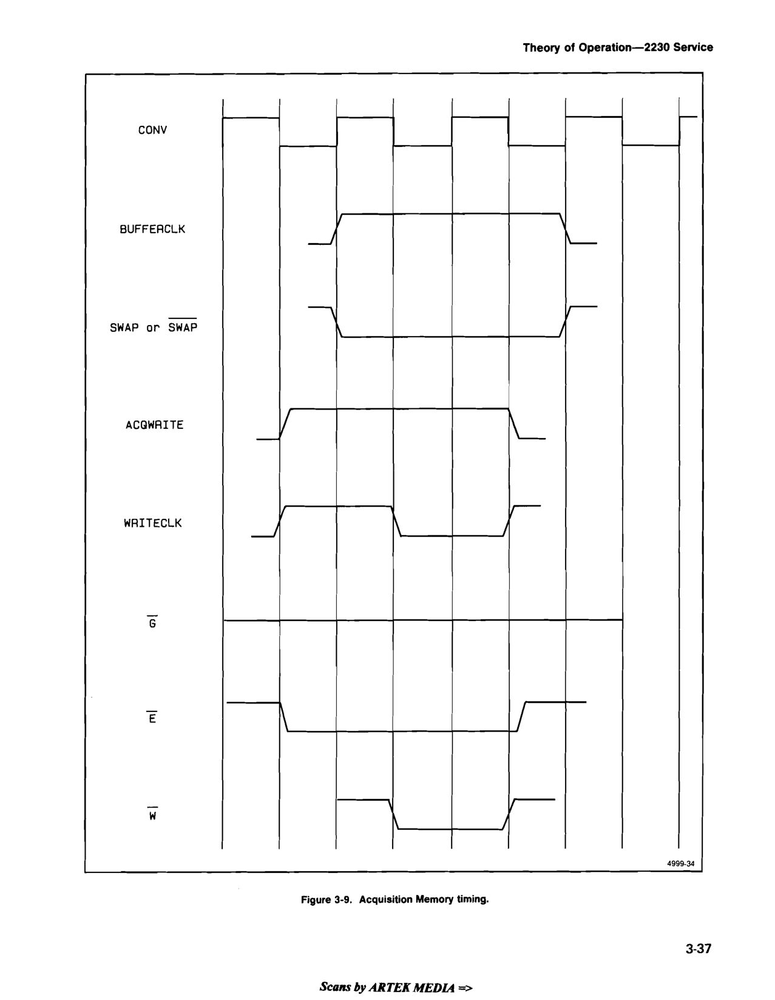


<details><summary>OCR text on this page</summary>

```
Theory of Operation-2230 
Service 
CONV 
Figure 3-9. Acquisition Memory timing. 
BUFFERCLK 
- 
SWAP o r SWAP 
ACQWRITE 
WRITECLK 
Scans by AR TEK MEDLA => 
4999-34
```

</details>


---

## Page 93 of 451

Theory of Operation-2230 
Service 
access by the Microprocessor. The memory address to be 
written to or read from is controlled by the Address 
Counter. 
Acquisition Memory Address Counter 
The Address Counter contains three, 4-bit binary 
counters (U3423, U3424, and U3425). They are preset- 
table and cascaded to obtain a maximum count of 2048. 
The last bit count from the last counter (U3425) is the 
PREFULL signal, and when it goes HI the pretrigger por- 
tion of the record has been completed. When a triggered 
acquisition mode is in effect, PREFULL qualifies the next 
trigger received as a valid trigger point. For triggered 
operation of the acquisition system, the counters are 
preloaded with a count that causes the last bit to become 
a 1 when the pretrigger portion of the memory is full. The 
following data point pairs of a record are then stored start- 
ing at location 0 and continue up to the end of the record. 
The end (ENDREC) is determined by the Record Counter 
in the Digital Time Base circuitry (shown on Diagram 18). 
While waiting for a trigger after the pretrigger part of 
the record is filled, data pairs are continually written into 
the essentially circular memory space to keep the stored 
waveform data (pretrigger data) current. When the acquisi- 
tion becomes triggered, the Record Counter (Diagram 18) 
starts counting the post trigger data pairs. At the end-of- 
record count, ENDREC goes HI and the acquisition is 
stopped. The Microprocessor then reads the address of 
the last data byte pair that was stored. Using that address 
and the known length of record for the type of acquisition 
being done, the Microprocessor calculates the beginning 
address for the record. 
When a read of the memory is done, the Address 
Counter is enabled for a parallel load of the location to be 
read by the ACQSEL signal from the processor. The 
beginning address of the record is the first address loaded 
from the Microprocessor Address Bus, bits A1 through 
A12. The least significant address bit (AO) is reserved for 
selecting which of the memories is to be read. The 
Microprocessor sequences through the addresses reading 
out the data bytes. In ROLL and SCAN even though there 
is a continual updating of the waveform seen on the crt, 
the Microprocessor and Acquisition System are not 
required to run in step at all times. Instead, the Micropro- 
cessor is allowed to carry out other processes as the data 
pairs are being stored in memory. When a read is started, 
the current address count is read and stored away. The 
Microprocessor then loads the address of the next unread 
data pair to begin reading data. Memory locations are then 
read and transferred to the display RAM (Diagram 15). At 
the end of the read, the address count is reset to the pre- 
viously stored address to resume storing more data pairs 
into the Acquisition Memory. 
Acquisition Memory Address Registers 
These registers pass the address count onto the 
Microprocessor data bus when enabled. Registers U3427 
and U3428 are enabled during different I10 periods. The 
lower seven bits of the address count and the SAVECLK 
are buffered by U3427; the upper four bits of the address 
count and four status bits (BTRIGD, TRIGD, BYTEINT, 
and ENDREC) are buffered by U3428. SAVECLK is 
checked because both sample data pairs are transferred in 
parallel from the MINIMAX Registers into the Acquisition 
Memory, losing the trigger-point reference. However, the 
samples stored in one half period of SAVECLK are stored 
in the opposite memory half from the samples stored in 
the other half period. The memory half that the trigger 
must be associated with is determined by the state of 
SAVECLK at the end of the acquisition. 
The two address registers are read by the Microproces- 
sor, as the result of an interrupt, to determine the cause of 
an interrupt. If the ENDREC bit is LO, the address of the 
end of the waveform record is stable because the acquisi- 
tion stopped. In that case, the Microprocessor must read 
the address and store it. To do a memory read, the 
Microprocessor must change the count of the Address 
Counters. After a BYTEINT read has been done to 
transfer more waveform data to the display RAM to 
update the display, the stored address count is restored to 
the Address Counter to allow the acquisition to continue. 
DIGITAL TIME BASE 
Clock Generator 
Accurate clock signals are needed to transfer the data 
and to control the timing of each operation. The main 
clocking signals are produced by an oscillator and clock 
generator circuit. A 40 MHz signal is produced by crystal 
oscillator Y4100. The 40 MHz signal clocks all the flip-flops 
in the Clock Generator, setting the clock edge timing of all 
the other clocks. In the following description, refer to the 
clock timing diagram, Figure 3-1 0. 
Flip-flop U4102A divides the 40 MHz input clock by 
two. The 20 MHz Q output goes to the Microprocessor 
clock divider for timing the processor operations. The 
20 MHz a 
Converter) and is one input to the Clock state 
machine (formed by the logic gates of U3112B, C, 
U3113C, U4101 B, and flip-flops U4118A, U4102B and 
U4104A). Use of the state machine allows the choice of a 
CONV clock rate of either 20 MHz (the same as the 
ADCLK rate) or 10 MHz (one-half the ADCLK rate). 
The final flip-flop circuit (U4104A) in the Clock Genera- 
tor produces the WRITECLK and WRITECLK signals at 
one-half the selected CONV clock rate. The flip-flop is held 
Scam by ARTEK MEDLQ =>


---

## Page 94 of 451

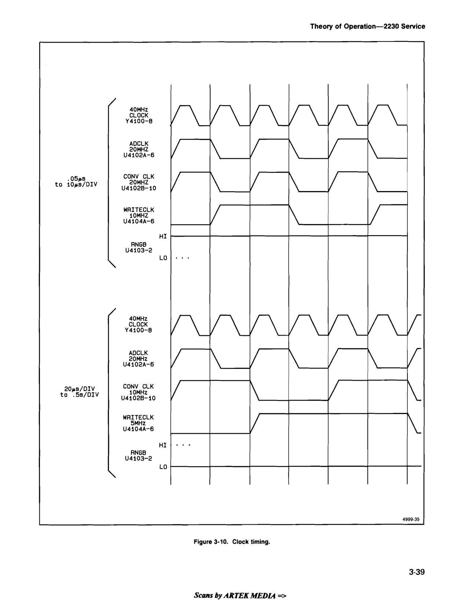


<details><summary>OCR text on this page</summary>

```
Theory of Operation-2230 
Service 
Figure 3-10. Clock timing. 
. 0 5 r s 
t o iOrs/DIV 
Scans by ARTEK MEDL4 .i> 
/ 
40MHz 
CLOCK 
Y4100-8 
ADCLK 
2OMHZ 
U4102A-6 
CONV CLK 
2OMHZ 
U4102B-10 
WRITECLK 
iOMHZ 
U4104A-6 
H I 
RNGB 
U4103-2 
\ 
LO 
2Ors/DIV 
t o .5s/DIV 
4999-35 
40MHz 
CLOCK 
Y4100-8 
ADCLK 
20MHz 
U4102A-6 
I 
CONV CLK 
iOMHz 
U4102B-10 
WRITECLK 
5MHZ 
U4104A-6 
H I 
RNGB 
U4103-2 
LO 
\ 
. . .
```

</details>


---

## Page 95 of 451

Theory of Operation-2230 
Service 
reset when the ACQENA signal is LO. ACQENA is clocked 
HI by the CONV clock going HI (one-half CONV clock 
cycle after CONV goes HI). Therefore WRITECLK, at the 
Q output of U4104A, starts off LO at the beginning of an 
acquisition period. 
The gating circuit of the Clock Generator looks at the 
states of ADCLK, CONV, and RNGB to set the active LO 
K input of U4102B and U4104A. The J and K inputs of 
U4104A have complemented signals applied from the logic 
gating (J from NAND-gate U3112C and K from AND-gate 
U4101 B). When clocked, the flip-flop toggles for one state 
of the applied J and K signals (J HI and K LO) and has no 
change for the other (J LO and K HI). The WRITECLK and 
WRITECLK outputs of the flip-flop are therefore at one- 
half the CONV clock rate. The K signal from AND-gate 
U4101 B also goes to the K input of U4102B to set up 
U4104A to either divide the ADCLK by two or just clock 
ADCLK through. The CONV clock switches from 20 MHz 
to 10 MHz when the SECIDIV switch is switched from 
10 ps to 20 ps while the ADCLK remains at 20 MHz for all 
SECIDIV switch settings. 
Time Base Mode Register 
The Microprocessor controls the Digital Time Base via 
the Time Base Mode Register, U4119. Control bits are 
latched into the register from the Data bus by the rising 
edge of the signal on pin 11 of OR-gate U4114D. The out- 
put of U4114D pin 11 is normally HI, but when 10 and 
address bit A5 are both made LO by the Microprocessor, 
U4114D pin 11 goes LO. The data on the ADO through 
AD7 bus lines then becomes valid. Either 10 or A5 going 
HI then causes the signal on .pin 11 to also go HI, latching 
the data that is on the bus into the register. The outputs 
are permanently enabled by the fixed LO on pin 1 of the 
register. 
Time Base Divider and Divider Register 
The Time Base Divider is formed by a chain of six pro- 
grammable counters (U4107-U4112). The Microprocessor 
loads the counters to produce an output from the divider 
that is a function of the SECIDIV switch setting from 20 ps 
to 5 s per division. Alternate sources of the SAVECLK are 
selected at the fast sampling rates used for SECIDIV 
switch settings of 10 ps to 0.05 ps (see Table 3-3). 
The Microprocessor writes the preloaded counts to the 
Time Base Divider via time base Divider Register U4113 
(see Table 3-4). A data byte is loaded into the counters of 
the Time Base Divider chain by placing the data on the - 
Microprocessor Data Bus during 110 time segment 10 2. 
After the data settles, the 10 signal goes HI. The rising 
transition is gated through OR-gate U4114C to clock the 
data into the register. The data bits loaded determine the 
number of times the 
10 MHz clock is divided to pro- 
duce the SAVECLK frequency. Flip-flop U4125A divides 
the output of the divider chain by two. 
An external signal may be used to clock the digital 
acquisition system. TTL level signals up to 1 kHz may be 
applied to the EXT CLK INPUT connector on the instru- 
ment side panel. The external signal is applied to the D 
input of flip-flop U4126A where it is clocked through to the 
Q output on the rising edge of the WRlTE clock. That Q 
output is applied to the D input of flip-flop U4126B and 
also clocked through by the rising edge of the WRlTE 
clock. The external clock is therefore delayed by two 
WRITE clock periods and synchronized with the rising 
edge of WRITE. The Q output of U4126B is applied to the 
SAVECLK multiplexer where it is selected when the A 
SECIDIV switch is set to EXT CLK. External clock sym- 
metry is not critical, but each amplitude must remain 
stable for at least 100 ps to acquire the waveform sample. 
One sample of a sample pair is acquired on each half cycle 
of the SAVECLK. As with the other clocking frequencies, 
flip-flop U4125A divides the signal by two to produce the 
SAVECLK frequency. 
Record Counter 
The Record Counter (U4115-U4117) determines when 
the total number of data samples have been acquired to fill 
the acquisition memory for triggered acquisitions. Depend- 
ing on the record length for the acquisition and the amount 
of pretrigger, the Record Counters are preloaded with a 
count that will cause full count (ENDREC) to be generated 
when the record is full. When the acquisition starts, the 
Acquisition Memory Address Counters count up to PRE- 
FULL. At that point, the Trigger Mux is enabled. After a 
trigger arrives, the Clock Delay Timer generates TRlGD at 
the next CONV clock, enabling the Record Counter. The 
Record Counter counts RECCLK clocks until ENDREC 
goes HI, stopping the acquisition (because the entire 
record has been acquired). 
Interrupt Logic 
When selectively enabled by the Microprocessor, inter- 
rupts (INTR) are generated after a full record is acquired, 
after a byte pair is acquired, or when a trigger occurs. 
After the interrupt is generated, the Microprocessor polls 
U3428 to find out what caused the interrupt. 
RECORD INTERRUPT. Record interrupts are generated 
each time a full record has been acquired in a triggered 
acquisition mode. When Record Counter U4115-U4117 
overflows and stops, the end of record signal ENDREC is 
generated HI at U4105B pin 9. If the Microprocessor has 
Scans by ARTEK MEDLQ =>


---

## Page 96 of 451

Theory of Operation-2230 
Service 
Table 3-3 
Time Base Clock Frequencies 
Scans by ARTEK M
.
 
r> 
SECIDIV 
0.05 ws 
0.1 ps 
0.2 ps 
0.5 ps 
1 PS 
2 WS 
5 cts 
10 ps 
20 ps 
50 ws 
0.1 rns 
0.2 rns 
0.5 rns 
1 rns 
2 rns 
5 rns 
10 rns 
20 rns 
50 rns 
0.1 s 
0.2 s 
0.5 s 
1 s 
2 s 
5 s 
EXT 
CONV 
20 MHz 
20 MHz 
20 MHz 
20 MHz 
20 MHz 
20 MHz 
20 MHz 
20 MHz 
10 MHz 
10 MHz 
10 MHz 
10 MHz 
10 MHz 
10 MHz 
10 MHz 
10 MHz 
10 MHz 
10 MHz 
10 MHz 
10 MHz 
10 MHz 
10 MHz 
10 MHz 
10 MHz 
10 MHz 
10 MHz 
SAVECLK 
SOURCE 
CONVl2 
CONVl2 
CONVl2 
CONVl2 
CONVl2 
CONVl2 
CONVl2 
WRITECLKl2 
DIVIDER12 
DIVIDER12 
DIVIDER12 
DIVIDER12 
DIVIDER12 
DIVIDER12 
DIVIDER12 
DIVIDER12 
DIVIDER12 
DIVIDER12 
DIVIDER12 
DIVIDERM 
DIVIDER12 
DIVIDER12 
DIVIDER12 
DIVIDER12 
DIVIDER12 
EXTCLW2 
SAVECLK 
10 MHz 
10 MHz 
10 MHz 
10 MHz 
10 MHz 
10 MHz 
10 MHz 
5 MHz 
2.5 MHz 
1 MHz 
0.5 MHz 
0.25 MHz 
0.1 MHz 
50 kHz 
25 kHz 
10 kHz 
5 kHz 
2.5 kHz 
1 kHz 
0.5 kHz 
0.25 kHz 
0.1 kHz 
50 Hz 
25 Hz 
10 Hz 
EXTl2 
RECCLK 
20 MHz 
20 MHz 
20 MHz 
20 MHz 
20 MHz 
20 MHz 
20 MHz 
10 MHz 
5 MHz 
2 MHz 
1 MHz 
0.5 MHz 
0.2 MHz 
100 kHz 
50 kHz 
20 kHz 
10 kHz 
5 kHz 
2 kHz 
1 kHz 
0.5 kHz 
0.2 kHz 
100 Hz 
50 Hz 
20 Hz 
EXT 
A 
1 
1 
1 
1 
1 
1 
1 
0 
1 
1 
1 
1 
1 
1 
1 
1 
1 
1 
1 
1 
1 
1 
1 
1 
1 
0 
RANGE 
B 
1 
1 
1 
1 
1 
1 
1 
1 
0 
0 
0 
0 
0 
0 
0 
0 
0 
0 
0 
0 
0 
0 
0 
0 
0 
0


---

## Page 97 of 451

Theory of Operation-2230 
Service 
Table 3-4 
Time Base Divider Preload Bits 
0.25 MHz 
0.1 MHz 
50 kHz 
SECIDIV 
Setting 
20 ps 
50 ps 
0.1 rns 
0.5 MHz 
0.2 MHz 
100 kHz 
25 kHz 
10 kHz 
5 kHz 
SAVE CLOCK 
DIVIDER 
Frequency 
Output 
---- 
50 kHz 
20 kHz 
10 kHz 
I 
- 
2.5 kHz 
1 kHz 
0.5 kHz 
Divider DD Bits 
7 6 5 4 3 2 1 0 
5 kHz 
2 kHz 
1 kHz 
Divide 
Ratio 
2 
5 
2.5 MHz 
1 MHz 
set RECINTEN (U4119 pin 12) HI, ENDREC and the 
(U4226B pin 9) goes HI. The HI TRlGD and TRlGlNTEN 
- 
enable are combined at U4120D, making INTR LO gen- 
are combined at U4120C, making lNTR LO. To clear the 
erating a maskable interrupt. To clear the interrupt, the 
interrupt, the Microprocessor makes TRlGlNTEN (U4119 
Microprocessor makes ACQENA (U4118A pin 5) LO via 
pin 14) LO, removing the interrupt. 
U4119. This makes ENDREC (U4105B) LO and lNTR 
(U4120D) HI, removing the interrupt. 
Trigger Mux 
Multiplexer U4227 is driven by the B/A TRIG and CAL- 
5 MHz 
1 1 1 1 1 1 0 0 
2MHz 
1 1 1 1 1 0 1 1 
0.2 s 
0.5 s 
1 s 
2 s 
5 s 
BYTE INTERRUPT. Byte interrupts are generated each 
time a byte pair is acquired in the byte modes of ROLL 
and SCAN. To start the acquisition of a byte pair, the 
Microprocessor sets BYTEINTEN (U4119 pin 13) HI. After 
the acquisition of two bytes, SAVECLK (U4125B pin 9) 
goes HI setting U4118B. A HI at pin 9 of U4118B is 
- 
inverted by U4120B, generating a LO INTR, the maskable 
interrupt, at U4120B pin 4. To clear the interrupt, the 
Microprocessor makes TBMODE (U4114D pin 11) LO. 
0.5 MHz 
TIMER signals. The multiplexer selects either the A GATE, 
B GATE, or 
signal to drive the Clock Delay Timer 
circuit. The 
clock is used by the CALTIMER to 
determine the maximum and minimum counts from the 
Clock Delay Timer circuit. See Table 3-5 for the switching - 
logic of the multiplexer. The additional state of the TEST 
signal is necessary to determine if a maximum or a 
minimum count is to be measured by the Clock Delay 
Timer for calibration. 
1 MHz 
1 
1 1 1 1 1 0 0 0 
~ 
10 
This resets U4118B, removing the interrupt. 
20,000 
50,000 
1 00,000 
200,000 
500,000 
0.25 kHz 
0.5 kHz 
1 0 0 0 0 1 0 0 
O.l 
kHz 
1 
0.2 kHz 
i 
1 0 o O O o l l 
Clock Delay Timer 
TRIGGERED INTERRUPT. Triggered interrupts are gen- 
The circuitry forming the Clock Delay Timer is used only 
erated when triggers occur after first being enabled by the 
during equivalent-time sampling (20 ps per division to 
Microprocessor in a triggered mode with triggers allowed. 
0.05 ps per division). The purpose of the timer is to deter- 
The Microprocessor enables the interrupt by setting TRI- 
mine the time interval between the trigger event and the 
- 
GINTEN (U4119 pin 14) HI. When a trigger occurs, TRlGD 
next rising edge of the CONV clock. The Microprocessor 
1 0 0 0 0 0 0 0 
50 Hz 
Scans by ARTEK MEOLP => 
100 Hz 
0 0 0 0 0 1 0 0 
0 0 0 0 0 0 1 1 
25 Hz 
10 Hz 
50 Hz 
20 Hz


---

## Page 98 of 451

Theory of Operation-2230 
Service 
Table 3-5 
Trigger Logic Multiplexer Switching 
0 
I 
0 
I 
1 
I 
A TRIG 
I 
A GATE 
CALTIMER 
0 
I 
1 
1 
1 
I 
B TRIG 
I 
B GATE 
1 
1 
0 
1 
0 
I 
MIN COUNT 
I 
CONV 
- 
AIBTRIG 
must know the information to place the data samples into 
the correct locations in Display Memory. Since the trigger 
is asynchronous to the CONV clock (and therefore to the 
SAVECLK that stores data byte pairs into the Acquisition 
Memory), no fixed timing relationship exist between the 
trigger and the data samples taken as a result of the 
trigger. Therefore the relationship must be determined for 
each trigger in equivalent-time sampling. 
- 
TEST 
I 
I 
I 
I 
The timer is formed by a dual-slope capacitor charging 
circuit. A fast-charging current source composed of Q4203 
and Q4204 charges capacitor C4201 when FET (24207 is 
turned off, removing its shunting effect (short) from the 
capacitor. This happens for every A GATE or B GATE 
(depending on which trigger it is looking for) regardless of 
whether a STORE mode trigger is enabled or not. If a 
STORE mode trigger was not enabled, the capacitor is 
immediately discharged when the gate signal passes. If a 
STORE mode trigger is enabled (PREFULL generated from 
the acquisition memory Address Counter), (24207 is held 
off to allow C4201 to continue to charge. The fast- 
charging current source through (24204 is then shut off by 
the second rising edge of the CONV signal clocking a LO 
onto the a 
output of flip-flop U4226B. The LO turns 
(24203 on and shuts off the fast-charging current source, 
(24204. The complementary HI on the Q output of U4226B 
also removes the reset from the Clock-Delay-Timer 
counter, U4230, enabling the counter to count. 
1 
A slow-charging current source ((24205 and associated 
resistors) then begins discharging C4201 towards the 
- 8.6 V supply through Q4205 and R4212. This discharge 
path has a long time constant so that the discharge time 
is much longer than the capacitor's charge time. The volt- 
age on C4201 is applied to the inverting input of compara- 
tor U4229. A comparison voltage with a threshold of about 
0.6 V is on the noninverting input of the comparator. 
TRIGGER MODE 
When the capacitor's voltage drops to the comparison 
voltage, the output of the comparator goes HI. That HI is 
applied to NAND-gate U4106, the Set input of flip-flop 
U4232A. The flip-flop has been toggling on the CONV 
SELECTED SIGNAL 
1 
clock, so depending on the state of the Q output when the 
comparator changes state, the flip-flop will either be set 
immediately (if the Q state is HI) or as soon as the logic 
state of the Q output of U4232A goes HI. The action of 
the NAND-gate ensures that the flip-flop becomes set 
within k 1 CONV clock period of the actual comparator 
output level change. As soon as U4232A becomes set, a 
LO is placed on the D input of flip-flop U4232B. On the 
next rising edge of the CONV clock, the LO is clocked to a 
HI on the h output of U42328, stopping the Clock-Delay- 
Timer counter. The count now held in the counter is a 
measure of the time between the trigger point and the - 
next rising edge of the CONV clock. In I10 period 10-1, 
address line A3 is made LO by the Microprocessor, ena- 
bling the count onto the data bus so the count can be 
read. The count is used by the Microprocessor to place 
the equivalent-time data samples into the correct (in rela- 
tion to the trigger) display memory locations. 
In order for the Microprocessor to place the data sam- 
ples into the correct display locations, the Microprocessor 
needs to know the maximum and minimum counts pro- 
duced by the Clock Delay Timer. A calibration routine in 
the Diagnostics determines the maximum and minimum 
counts and calculates the calibration constant used by the 
equivalent-time sampling firmware. 
To determine the maximum count, CONV is selected as 
the trigger source (U4227 pins 12 and 13). The trigger 
CONV 
1 
source, through U4228A, U4127, and Q4207 starts the 
- 
ramp on C4201. The CONV trigger also propagates 
through U4228A, U42288, U4127C, and U4226B to 
(24203, stopping the current source for the ramp and 
removing the clear on counter U4230 pin 10. Counter 
U4230 starts counting and contains the maximum count 
when stopped by 
through U4232. 
MAX COUNT 
To determine the minimum count, CONV is also 
selected as the trigger source. The trigger, through 
U4228A, starts the ramp on C4201. The calibration routine 
sets TEST LO. With TEST LO (on U4228B pin lo), 
bypasses U42288, stopping the current source for the 
ramp, starting counter U4230 50 ns sooner. 
Scans by AR TEK MEDU =>


---

## Page 99 of 451

Theory of Operation-2230 
Service 
Resistor R4213 and C4202 adjust the counter's gain 
and offset. Nominal counts are 300 for maximum and 100 
for minimum. The difference of the two counts represents 
the 50 ns 
clock period. 
B-Delay Timer 
The B-Delay Timer determines the starting address of 
the B Display in memory. The length of the record is deter- 
mined by the setting of the SECIDIV switch and the 
acquisition-mode information (i.e. is it CHOP, single trace, 
or a 1K or a 4K acquisition). The BTRIGD signal (U4121A 
pin 5) goes HI on the first falling edge of RECCLK after 
the 8-GATE signal goes HI. BTRIGD going HI causes 
U4123 and U4124 to latch the value of the Record 
Counter. The microprocessor then reads the starting 
address from U4123 and U4124, which are enabled by 
-- 
10 2, 10 1, and A5 (Address Decode). 
DIGITAL DISPLAY 
A custom LSI integrated circuit controls the stored 
waveform and readout displays. Six 16K x 4-bit random- 
access memories (RAM) make up the Display Memory. 
Four of the RAM chips provide 32K x 8-bit waveform data, 
and two RAMs hold the 32K x 4-bit waveform-attribute 
data. Waveform data may be stored in the RAM from data 
on the Microprocessor bus or data may be read from the 
RAM and transferred to a Communication Option. For 
waveform displays, data is read from the RAM (display 
memory) by the display controller. The display controller 
then processes the data, and then drives the Vertical (Y) 
and Horizontal (X) digital-to-analog converters (DAC) 
where the data is converted to analog voltages used to 
drive the X- and Y-Axis vector generators. 
Data Transceivers 
Communication between the Microprocessor and the 
display memory is via two bus transceivers, U9206 and 
U9207. Waveform data from the Acquisition Memory is 
transferred to the display memory where the data is 
always available to the Display Controller for refreshing 
the display. The data transceivers are enabled by logic 
gating in U9211 that decodes the PA15 and PA14 signals 
from the Microprocessor and the PROCEN signal from the 
Display Controller to determine when a transfer is possi- 
ble. The direction of transfer is controlled by the WR 
(write) signal from the Microprocessor. The WR signal also 
enables U9211 to allow either a read from memory (for 
outputting data) or a write to memory (for transferring in 
the data from the Acquisition Memory). Bus transceiver 
U9206 is enabled for 8-bit data transfers and transceiver 
U9207 is enabled for 4-bit transfers. 
Address Decoder 
To access a byte in RAM, a row address followed by a 
column address is required. Row and column memory 
addresses are written together as one address word from 
the Microprocessor. Address - 
Decoders U9204 and U9205 
are switched by the ROWICOL signal from the Display 
Controller to select either the row address or the column - 
address from the Microprocessor address bus. The RAS 
- 
and CAS signals enable the address latches, internal to 
each display RAM, to latch the selected row and column 
addresses. Column addresses are decoded from the mid- 
dle six bits of the 8-bit address by address decoders in 
each RAM. Row addresses require all eight bits. The 
Display Controller has direct access to addresses in the 
RAM using the RA bus. 
RAM 
Six 16K by 4-bit memories make up the display RAM. 
The 8-bit waveform bytes are stored with the lower four 
bits in U9203 and U9233 and the higher four bits in U9202 
and U9232. The remaining RAMs (U9201 and U9231) 
store attribute bits that are used to define the waveform 
print intensity and mark the end of the record. The 
memories are arranged in a 256 X 64 row and column for- 
mat to allow eight addressing lines to access the 16K of 
4-bit memory addresses (64K-bits of memory). 
Memory refreshing is satisfied whenever the 256 Row 
addresses are accessed. Refreshing occurs when the 
Display Controller does a memory read for display pur- 
poses. While the Microprocessor is controlling the Display 
Memory, it must also perform memory refreshing by 
activating all the memory Row addresses. To maintain the 
dynamic memory, a refresh must be done at least every 
eight milliseconds. 
DATA TYPES. The data stored in the Display Memory 
is either readout characters or waveforms. The micropro- 
cessor also uses the display memory for operational data 
storage. In either case a 9-byte field-attribute preamble is 
read first. The preamble defines the data type and sets up 
the display attributes. Readout information is displayed 
using short vector X-Y displays positioned to specified 
fields on the crt. 
Display Controller 
The Display Controller runs the display system for the 
STORE waveform and STORE and NON STORE readout 
displays. It takes control of the RAM to read the waveform 
or readout data. Besides the waveform data, the Display 
Controller runs the Store Z-Axis, selects the type of 
display (vector, dots, or X-Y plotter output), and drives the 
horizontal and vertical channel switches. 
Scans by ARTEK MEDLQ =>


---

## Page 100 of 451

Theory of Operation-2230 
Service 
When reading data out of the RAM, the Display Con- 
'These circuits also have a "dot" mode available so that 
troller has direct access to the memory address bus (RA). 
the integrator outputs are stepped (dots) rather than con- 
- 
RAM row and column addresses to be read from are 
tinuous (vectors). When the VECTIDOT signal is LO, 
sequenced through in order. When a display data read is 
U6301A and C switch the integrator inputs directly to the 
taking place, the dynamic memory is refreshed by the 
difference signals while also disconnecting the integration 
Display Controller. 
capacitors C6315 and C6314. The feedback loops are thus 
closed continuously, resulting in normal amplifier action. 
When the Display Controller has completed a display 
- 
frame, it signals the Microprocessor (using the INTR sig- 
nal) that the last field is finished and awaiting the next 
frame request. After the interrupt is received, the 
Microprocessor can request the next frame (FRAME), then 
the Display Controller resumes control of the RAM for the 
next frame of data. When PROC RQ (U9208 pin 3) is HI, 
the Display Controller is in the middle of a display cycle 
and the Microprocessor is denied access to the display 
RAM. The Microprocessor can request access to the 
Display RAM using the PROC RQ (RAM SEG) signal line 
to either write in new waveform data or read out data for 
the Communication Option. The Display Controller allows 
the Microprocessor to access the display RAM by setting 
the PROC EN (U9208 pin 5) signal line LO. A LO 
PROC EN signal enables the circuitry that allows the WR, 
PA1 4, and PA1 5 signals, from the Microprocessor, to con- 
trol the display RAM. Even though the memory addresses 
- 
are under control of the Microprocessor, the RAS and 
CAS signals are generated by the Display Controller. 
YDAC and XDAC 
Data from display controller U9208 is applied to X- and 
Y-axis DACs U9210 and U9220. These DACs are biased 
to provide output currents (approximately 0 to 2 mA) pro- 
portional to the digital data. R9214 and R9224 are adjust- 
ments to align the storage signals on the crt. The DAC 
currents are applied to the Vector Generator along with 
various control signals from U9208 via W6100. 
VECTORGENERATOR 
Vector Generators 
Vector Generator circuitry is shown on Diagram 20. 
U6303 and U6304 convert the DAC currents into bipolar 
voltages (approximately -2.5 V to +2.5 V) which are 
applied to sample and hold circuits U6305 and U6306. 
Outputs of the sample and hold circuits are applied to 
integrator stages U6307 and U6308 through electronic 
switches in U6301A and C. The integrator output signals 
are continuously fed back to the sample and hold inputs, 
causing these input voltages to be equal to the difference 
between the drive inputs and the integrator outputs. When 
the vector sample (VECT-SMPL) control line (via U6301 B) 
is actuated, the outputs of the sample and hold circuits 
store these difference signals. Since the integrator output 
slopes are proportional to these signals, the net result is 
to effectively "connect the dots" which are equivalent to 
the digital data values. 
Although the Vertical and Horizontal vector generators 
operate the same, there are some differences between the 
circuits and between their signal characteristics. To end up 
with the proper signal polarities at the crt, X DAC U9210 
(Horizontal) current is from 2 mA to 0 mA, while Y DAC 
U9220 (Vertical) current is from 0 mA to 2 mA. Also, the 
vertical integrator output is -2 V to +2 V while the hor- 
izontal integrator output is -2.5 V to +2.5 V. The 
reduced vertical dynamic range allows proper interface to 
the main deflection system. Since the vertical signal even- 
tually passes through the vertical delay line before reach- 
ing the crt, it is necessary to delay the horizontal signal as 
well. This is done in the vector mode by delaying slightly 
the vector sample signal applied to U6306 via R6320 and 
C6312. In the dot mode the crt beam is blanked during the 
transitions so the dots are only displayed after the signals 
have arrived and settled. 
VECTOR INTEGRATOR. The Y-axis (vertical) current 
from the DIA Converter goes to the inverting input of 
operational amplifier U6303. The amplifier is biased to pro- 
duce a bipolar output voltage, from -2.5 V to +2.5 V, 
that is proportional to the input current. Negative feedback 
from the parallel combination of R6303 and C6311 stabil- 
izes the amplifier. 
Biasing of the non-inverting input of both the X-axis 
and the Y-axis amplifiers is identical and supplied by a 
resistive divider formed by R6304 and R6305 between 
ground and the +5 V reference. Both resistors are equal 
valued to produce a bias voltage of +2.5 V. Resistor 
R6308 provides a summing node for the input vector 
current and the feedback current and develops the voltage 
on the inverting input of U6303. Full current range of the 
vector signal is from 0 to 2 mA. With no vector current in, 
the feedback current supplies the full current through 
R6308, and the output voltage of U6303 goes to -2.5 V. 
At maximum vector current input, the sum of the current 
through R3608 must remain the same as with no vector 
current; therefore the feedback current is reduced by the 
amount of the vector current, and the output voltage goes 
to +2.5 V. 
SAMPLE-AND-HOLD. The voltage output of U6303 is 
applied via R6309 to sample-and-hold circuit U6305. 
Sample-and-Hold (SIH) switching is controlled by the 
VECT SMPL signal from the Display Controller applied to 
Scans by ARTEK MEDL4 .i>


---

## Page 101 of 451

Theory of Operation-2230 Service 
U6305 pin 14. That signal in turn is controlled by the 
PLT-EN signal (U6301B pin 9) that switches section B of 
multiplexer U6301. When displaying storage waveforms 
and readout characters, the PLT-EN signal is not active, 
and the VECT SMPL signal is switched to control the SIH 
circuit. For producing X-Y Plots, U6301C is activated, and 
the VECT SMPL signal drives the X-Y Plotter Pen-Down 
circuit (shown on Diagram 22). 
SAMPLE 
INTEGRATOR. 
During 
digital 
storage 
waveform displays, the S/H circuit and the Y-Integrating 
circuit formed by U6307 and associated components pro- 
duce either vectors or dots. When U6301C connects 
pin 13 to pin 14, U6307 integrates each step output of the 
SIH circuit into a smooth ramp signal. This integrated sig- 
nal is the vertical deflection signal (still single-ended) that 
connects the data points of the stored waveform display. 
When the user selects either dot displays or X-Y Mode, 
multiplexer U6301C connects pin 12 to pin 14. The long 
time constant integrating function of U6308 is switched 
out, and U6307 acts as an amplifier only for the voltage 
being held by the S/H circuit, causing the crt display to be 
dots. For readout character displays both during STORE 
and NONSTORE modes, the SIH and integrator work only 
in the vector mode because readout characters are vector 
displays. 
The integrator output is subtracted from the input volt- 
age at all times. When VECT SMPL goes LO, the 
difference value is sampled and held by S/H U6305. The 
held voltage value sets the slope of the integrator and 
effectively "connects the dots" since the slope of the out- 
put vector is proportional to the difference between the 
input voltage and the output voltage of the integrator. 
Diode clamps CR6301, CR6303, CR6305, and CR6307 
prevent voltage transients that could cause U6301C latch 
UP. 
Vector Amplifiers 
The integrator outputs are applied to vector amplifiers 
U6401 and U6402, which are differential voltage-to-current 
converters. Their outputs are differential currents which 
are sent to the main deflection multiplex circuitry via J6410 
and the I/O wiring harness. Vertical positioning information 
is processed by display controller U9208, but horizontal 
position information is not. Therefore the horizontal posi- 
tion voltage is applied to U6402D to affect horizontal posi- 
tion control of stored waveforms. At times when readout 
characters are being drawn, this position signal is shunted 
by transistor U6403A to reduce the positioning effect on 
the characters. This action is controlled by the HPOS-DIS 
signal from the display controller. 
Plot Drive 
When plot mode is on, the display controller activates 
the PLT-EN signal, causing U6301B to apply the 
VECT-SMPL signal to the PEN-DN line via U6404A and 
U6402E, and the display controller internal modes change 
so that VECT-SMPL provides the pen down control func- 
tion. The PEN-DN signal is sent via J6420 to the Z-axis 
section and to the X-Y board or communication option 
board (if installed). When U6301B activates plot mode, 
(26301 pulls the sample control lines of U6305 and U6306 
LO putting them in tracking mode. This closes the vector 
generator feedback loops regardless of vectorldot mode 
selection. The PLT-EN signal also turns on operational 
transconductance amplifiers U6404A, 6, 
and C via transis- 
tor U6403E. Normally, their outputs are off, the plotter sig- 
nals are zero (held at ground by R6433, R6434). In plot 
mode they turn on and act as voltage followers for the 
- 
vector signals (Y POINT, X POINT, and PEN). The "Y" 
amplifier input is connected ahead of the Y vector genera- 
tor to preserve the k2.5 V range and correct polarity. 
The X-PLOT and Y-PLOT signals are sent via J6420 to the 
X-Y board or communication option board (if installed). 
Readout Off Detector 
To detect when the Storage/Readout Intensity knob is 
at its counterclockwise end, U6405A (Diagram 20) moni- 
tors the readout (RO) voltage from J6410. Since RO volt- 
age is normally negative, but goes slightly positive at the 
end of its rotation, U6405A output will go positive, turning 
on transistor U6403B, causing the NO-RO line to be LO. 
This signal is sent to the I/O board as status information. 
Signal Conditioning 
The signals ARES1, A-RES2, B-RES, and B-CAPS on 
J6420 come from the Sweep Interface board. They are 
encoded analog currents which contain most of the infor- 
mation about the positions of the A and B Timing 
switches. Since the sum of the possible changes in these 
currents is larger than U6302 (5V REF) can accommodate, 
U6405B (Diagram 21) is used to buffer the 5V reference to 
supply the termination resistors (Diagram 20). As these 
currents change, the resulting voltages are measured by 
the Status AID (Diagram 19) so that the Microprocessor 
can determine the state of the timing switch. 
I10 and Vector Generator Board Power 
Distribution 
215 VOLT POWER SUPPLYS. U6305 and U6306 
operate from k 15 Volt supplies. These are generated by 
flyback converters (see Diagram 21) consisting of U6202A, 
U6202B, Q6202, (26203, and associated circuitry. The 
comparators in U6202 form oscillators which drive the 
switch transistors to alternately store and unload energy in 
Scans by ARTEK MEDLQ r>


---

## Page 102 of 451

Theory of Operation-2230 Service 
their respective chokes. Feedback is applied to the com- 
parators causing duty cycle and frequency modulation, 
which adjusts output power accordingly. 
+ 5 VOLT POWER SUPPLY. Logic power (+ 5 V) for all 
I10 board and Vector Generator board circuitry is gen- 
erated from the +8.6 V supply by U6201. 
+5 VOLT REFERENCE. The 5 Volt Reference is gen- 
erated by U6302. It is used by the vector generator cir- 
cuits, status AID circuit, display DAC circuit, and acquisi- 
tion system. Associated with each of these circuits is a 
local pull-up resistor from the +8.6 V supply to the 5V 
reference line to supply nominal load current so that 
U6302 does not have to supply the total load current. This 
also greatly reduces the reference line current which could 
cause excessive voltage drops at the far ends of its travel. 
Status ADC and Bus Interface 
I10 PORTS. The system data bus and associated con- 
trol signals are sent to the I10 board via J6100 (see 
Diagram 19). lnput ports U6102 and U6103 transfer logic 
signals representing instrument status. U6103 operates as 
a simple port for eight of the status lines. U6102 has 15 
input signals. It serves as a data buffer for the Status AID 
converter U6105, when required. During part of the status 
scanning cycle, U6105 data outputs are tri-stated, and 
seven additional status signals are applied via 22 kQ resis- 
tors (R6121 through R6126). The Microprocessor then 
reads these status lines through U6102. When U6105 is 
active, its outputs dominate the data lines and the 22 kQ 
resistors act as high impedance loads. The Microprocessor 
can then read the data from U6105 via U6102. Output 
port U6104 is used to control the operation of U6105 to 
perform the AID conversion function. U6104 is also the 
multiplexer selection register, driving U6106 and U6108, 
which select the analog status signals to be measured. 
The port address selection is made by combinations of 
- - 
control lines 10-0, and 10-1, and address lines A2 and A3. 
U6101A and B provide the selection logic for U6104. 
STATUS AID. U6105 is a 10-bit AID converter which 
allows measurement of analog status signals. After each 
conversion it produces an interrupt which is gated by 
U6101 D and applied to Q6201 via R6218. This produces a 
processor interrupt to indicate completion of its task. This 
interrupt is maskable by U6104. U6107A serves as a 
buffer amplifier to drive the ir~put resistance of U6105 while 
maintaining fairly high load impedance for U6106 and 
U6108. U6107B and U6107C are differential amplifiers 
which convert the differential vertical position signals to 
single voltage levels within the range of the measuring 
system. 
POWER INPUT, PREREGULATOR 
AND INVERTER 
The Power Supply (see Diagram 8 and Diagram 9) 
changes the ac power-line voltage into the voltages 
needed for instrument operation. It consists of the Power 
Input, Preregulator, and lnverter circuits (which drive the 
primary of the power transformer) and secondary circuits 
(which produce the necessary supply voltages for the 
instrument). 
Power lnput 
The Power lnput circuit changes the ac power-line volt- 
age to filtered dc for use by the Preregulator. 
POWER switch S901 connects the ac power line 
through fuse F9001 to the bridge rectifier formed by 
CR901, CR902, CR903, and CR904. The full-wave bridge 
rectifies the source voltage, and the output is filtered by 
C906. lnput surge current at instrument power-on is lim- 
ited by thermistor RT901. The thermistor resistance is 
moderately high when the power is first turned on, but 
decreases as the input current warms the device. The 
instrument is protected from large voltage transients by 
suppressor VR901. Conducted interference originating 
within the power supply is attenuated by common-mode 
transformer T901, differential-mode transformer T903, line 
filter FL9001, and capacitors C900, C902, and C903. 
Preregulator 
The Preregulator provides a regulated dc output voltage 
for use by the lnverter circuitry. 
When the instrument is turned on, the voltage 
developed across C906 charges C925 through R926. 
When the voltage across C925 has risen to a level high 
enough that Pulse-Width Modulator U930 can reliably drive 
Q9070, U930 receives operating supply voltage through 
Q930. This voltage level is set by zener diode VR925 in 
the emitter of Q928 and by the voltage divider formed by 
R925 and R927. The zener diode keeps Q928 biased off 
until the base voltage reaches approximately 6.9 V. At that 
point, Q928 is biased into conduction, and the resulting 
collector current causes a voltage drop across R929 that 
biases on (2930. The positive feedback through R930 rein- 
forces the turn-on of (2928, which quickly drives both 
Q928 and (2930 into saturation. Once (2930 is on, the 
Pulse-Width Modulator begins to function. 
Pulse-Width Modulator U930 controls the output volt- 
age of the Preregulator by regulating the duty cycle of the 
pulse going to the gate of Q9070. The modulator has an 
Scans by ARTEK MEDL4 -


---

## Page 103 of 451

Theory of Operation-2230 
Service 
oscillator that operates at a frequency set by R919 and 
C919 (approximately 60 kHz). A sawtooth voltage pro- 
duced at pin 5 of U930 is compared internally with the out- 
put voltage produced by the two internal error amplifiers. 
Whenever the sawtooth voltage is greater than the error 
amplifier output voltage, (29070 is biased on to supply 
current to the remaining portions of the switching circuitry 
and charge C940. The two error amplifiers maintain a con- 
stant output voltage and monitor the output current of the 
Preregulator. One input of each amplifier is connected 
through a divider network to the IC internal +5 V refer- 
ence. The output voltage of the Preregulator is monitored 
by the voltage divider at pin 2. The voltage drop across 
R907, produced by the Preregulator output current, is 
applied to the internal current-limit amplifier at pin 16. 
When the instrument is first turned on, the current-limit 
amplifier controls the conduction time of (29070. While 
(29070 is conducting, the output current increases until a 
VR935 conducts, causing (29% -to also conduct. The 
Preregulator output current is then shunted through (2935, 
and the output voltage quickly drops to zero. With the 
supply voltage of U930 no longer being provided by the 
winding connected to pins 6 and 7 of T906, the Preregula- 
tor shuts down, and (2935 becomes reset. The supply then 
attempts to power up, but it will shut down again if the 
overvoltage condition reoccurs. This sequence continues 
until the overvoltage condition is corrected. A thermal 
shutdown circuit is included to protect the instrument from 
damage in case of fan failure or air flow restriction at high 
ambient temperatures. Overheating causes the resistance 
of RT950 to increase, eventually firing SCR (2950, which 
reduces voltage on VR943. This causes all outputs to drop 
to very low values, thus reducing total power dissipation. 
To reset the circuit, the power must be shut off 
momentarily. 
lnverter 
voltage large enough to permit the current-limit circuitry to 
The lnverter circuit changes the dc voltage from the 
function is developed across R907. The current-limit 
Preregulator to ac for use by the supplies that are con- 
amplifier then holds the output current below the limiting 
nected to the secondaries of T948. 
threshold of approximately 1 A. When the voltage across 
C940 reaches approximately 43 V, the internal voltage 
amplifier starts c&trolling the duty cycle of (29070, and 
The output of the Preregulator circuit is applied to the 
the Preregulator will not limit current unless there is exces- 
center tap of T948. Power-switching transistors Q946 and 
sive current demand. 
(2947 alternate conducting current from the Preregulator 
output through the 
windings of T948. The transis- 
tor switching action is controlled by T944, a saturating 
With (29070 off, C907 charges to the output voltage of 
base-drive transformer. 
the Power Input circuit. When (29070 turns on, current 
through the FET comes from the winding connected to 
pins 1 and 2 of T906 and from C907. Current to C907 is 
supplied by the winding connected to pins 4 and 5 of 
T906. When U930 shuts off (29070, the collapsing mag- 
netic field raises the voltage at the anode of CR907. This 
diode then becomes forward biased and passes the 
currents supplied by C907 and the winding connected to 
pins 4 and 5 of T906. For this part of the cycle, current to 
C907 is supplied by the winding connected to pins 1 and 2 
of T906. This process continues for each period of the 
oscillator, and the duty cycle controlling the conduction 
period of (29070 is altered as necessary to maintain 43 V 
across C940. During each oscillator period, (2908 is used 
to discharge the gate-drain capacitance of (29070. At the 
shutoff point, Pin 10 of U930 goes LO to reverse bias 
CR908 and turn on (2908 to switch off the FET. 
Once the supply is running, power to U930 is supplied 
from the winding connected to pins 6 and 7 of T906. Diode 
CR920 half-wave rectifies the voltage across pins 6 and 7 
to keep filter capacitor C925 charged and to maintain sup- 
ply voltage to U930 through (2930. 
Instrument protection from excessive output voltage is 
supplied by silicon-controlled rectifier (2935. Should the 
Preregulator output voltage exceed 51 V, Zener diode 
When the instrument is first turned on, one or the other 
of the switching transistors starts to conduct. As the col- 
lector voltage of the conducting transistor drops toward 
the common voltage level, a positive voltage is induced 
from T944 to the base of the conducting transistor that 
reinforces conduction. Eventually T944 saturates; and, as 
the voltage across T944 (and T948) begins to reverse, the 
conducting transistor is cut off by the drop in base drive. 
The other transistor does not start conduction until the 
voltage on the leads of T944 reverse enough to bias it on. 
The saturation time of T944 plus the transistor-switching 
time determine the frequency of lnverter operation (typi- 
cally about 20 kHz). After the initial lnverter start up, the 
switching transistors do not saturate; they remain in the 
active region during switching. 
Diodes CR946 and CR947 serve as a negative-peak 
detector to generate a voltage for controlling the output of 
the error amplifier. Capacitor C943 charges to a voltage 
equal to the negative peak voltage at the collectors of 
(2946 and (2947, referenced to the Preregulator input volt- 
age. This voltage level is applied to the divider formed by 
R937, R938, and R939. The error amplifier, formed by 
(2938 and (2939, is a differential amplifier that compares 
the reference voltage of VR943 with the wiper voltage of 
potentiometer R938. The current through (2939 sets the 
Scans by ARTEK MEDLQ =>


---

## Page 104 of 451

Theory of Operation-2230 
Service 
base drive of Q944 and, thereby, controls the voltage on 
gain for changing the input current to a proportional output 
C944. This voltage biases Q946 and Q947 to a level that 
voltage. Emitter-follower Q835 is dc coupled to Q840, and 
maintains the peak-to-peak input voltage of T948. The 
for low-speed signals, Q845 acts as a current source. Fast 
amplitude of the voltage across the transformer primary 
transitions couple through C845, providing added current 
winding, and thus that of the secondary voltages of T948, 
gain through Q845 for fast voltage swings at the output of 
is set by adjusting -8.6-V-ADJ potentiometer R938. 
the Amplifier. 
At turn-on, Q938 is biased off, and Q939 is biased on. 
Store Z-Axis signals, controlled by the Display Con- 
All the current of the error amplifier then goes through 
troller, are applied to the 2-Axis amplifier at the emitter of 
Q939 to bias on Q944. The current through Q944 controls 
(2829. The Nonstore Z-Axis signals are shunted away from 
the base drive for Q946 and (2947. Base current provided 
Q829 by CR824, which is forward biased from the CHOP 
by base-drive transformer T944 charges C944 negative 
Blanking circuit (Diagram 2) during STORE mode displays. 
with respect to the Inverter circuit floating ground (com- 
The overall store waveform and readout character inten- 
mon) level. 
sity level is set by the STORAGE/READOUT INTENSITY 
control (see Diagram 13). The level setting of that control 
sets the Z-Axis drive current supplied to the Z-Axis 
POWER SUPPLY SECONDARIES, 
Z-AXIS AND CRT 
XFMER and LV Power Supplies 
Amplifier by Q829 during digitally controlled displays. 
When the Display Controller turns off (27203, (27202, or 
(27201, the current normally shunted away from the 
emitter of Q829 is added via the forward biased diode con- 
nected to the emitter of the cutoff transistor. With more 
The Low-Voltage supplies use center-tapped secondary 
current available from (27204, more current flows in Q829 
windings of T948 (XFMER). The + 100 V supply is rectified 
to intensify the crt display. 
by CR954 and CR955 and filtered by C954. Diodes CR956 
and CR957 rectify ac from t a ~ s 
on the 100 V winding, and 
C956 filters the -output to produce +30 V dc. The full- 
wave diode bridge formed by CR960, CR961, CR962, and 
CR963 produces the +8.6 V and -8.6 V supplies. Filter- 
ing of the t8.6 V is done by C960, L960, and C962. Filter- 
ing of the -8.6 V is done by C961, L961, and C963. Ac 
voltage from the k8.6 V primary is rectified by CR965 and 
CR967, and then filtered by C965 and R965 to provide the 
fan power source. The +5 V supply is produced by 
CR970, C968, L968, C958 and C970. The -5 V supply is 
The intensity of the Nonstore crt display in the A, B, 
and Alt Horizontal modes is set by the INTENSITY con- 
trols and associated circuitry. The A IN'TENSITY poten- 
tiometer controls the base voltage of Q804 to set the 
amount of emitter current that flows through that transis- 
tor and, therefore, the level of the Z-Axis signal. Likewise 
the B INTENSITY potentiometer controls the base voltage 
of Q814 and the intensity of the B and Alt Sweep displays. 
produced by CR980, CR981, C964, L962, and C959. 
When onlv the Nonstore A Swee~ is disdaved. Q586 
Unblanking Logic, Intensity, and 2-Axis Ampl 
The Z-Axis Amplifier, shown on Diagram 9, controls the 
crt intensity level via several input-signal sources. The 
effect of these input signals is either to increase or 
decrease trace intensity or to completely blank portions of 
the display. The Nonstore Z-Axis drive signal currents, as 
set by the A and B 2-Axis switching logic and the input 
current from the EXT Z AXIS INPUT connector (if in use), 
are summed at the emitter of common-base amplifier 
(2825. The total sets the collector current of the stage. 
The common-base amplifier provides a low-impedance ter- 
mination for the input signals and isolates the signal 
sources from the rest of the 2-Axis Amplifier. 
and Q583 are biased off. The current through'~818, as set 
by the A INTENSITY potentiometer, flows through CR818 
and Q825 to fix the voltage level at the Z-Axis Amplifier 
output. For a B-Only display, Q586 is biased on to reverse 
bias CR818 and prevent A-Intensity current from reaching 
(2825. Current set by the base voltage of Q814 flows 
through CR817 to Q825 and sets the B Sweep intensity. 
For an alternating A and B display, Q586 is biased off 
when the A Sweep is displayed. During the portion of the 
A Sweep in which the B Sweep runs, current from R816 is 
passed through CR816 by the Alternate Display Switching 
and the Unblanking Logic circuitry to produce an 
intensified zone on the A Sweep trace. 
For the Nonstore Z-Axis signals, common-base transis- 
When CHOP VERTICAL MODE is selected, the Chop 
tor Q829 passes a constant current through R832. This 
Blanking signal is sent to the collector of Q825 through 
current is divided between Q825 and (2829, with the por- 
U537B and CR824 during the Nonstore display-switching 
tion through (2829 driving the shunt-feedback output 
time. Signal current is shunted away from CR825, and the 
amplifier formed by (2835, (2840, and (2845. The bias level 
forward bias of Q829 rises to the blanking level. When 
of Q825 therefore controls the emitter current available to 
blanked, the output of the Z-Axis Amplifier drops to reduce 
Q829. Feedback-resistor R841 sets the transresistance 
the crt beam current below viewing intensity. 
Scans by ARTEK MEDU -


---

## Page 105 of 451

Theory of Operation-2230 Service 
For a Nonstore X-Y display, CR818, CR817, and 
triggered or not), and the INTENSITY controls and the 2- 
CR816 are reverse biased. The XY signal is LO to reverse 
Axis drive signals have no control over the crt intensity. 
bias CR551 and allow current in R820 to flow through 
CR820. The crt intensity is then controlled by the A 
INTENSITY potentiometer which sets the current in R820 
Hv Multiplier, Dc Restorer, and Crt 
through Q804. 
The Dc Restorer circuit sets the crt control-grid bias 
and cou~les the ac and dc com~onents of the Z-Axis 
During Nonstore operation, any applied External Z-Axis 
input voltages drive proportional input currents through 
R822 and R823 to the Z-Axis Amplifier. Sensitivity to 
external signals is determined by the transresistance gain 
of the shunt-feedback amplifier. Diode CR823 protects the 
Z-Axis Amplifier if excessive voltage levels are applied to 
the EXT Z AXIS INPUT connector. External Z-Axis modu- 
lation does not function for STORE MODE displays. 
BEAM FlND switch S390 controls the base bias volt- 
ages of (2825 and Q829. When the BEAM FlND button is 
out, -8.6 V is supplied to the normal base-biasing net- 
work. When the button is held in, the -8.6 V supply is 
removed, and the voltage at the anode of VR828 rises to 
about -5.6 V. This voltage level turns off the current sup- 
ply from Q829. The Z-Axis amplifier output voltage is then 
fixed by R835 and the voltage at the BEAM FlND switch, 
as set by other parts of the Beam Find circuitry. The out- 
put voltage of Q835 is set to a level that displays either a 
bright trace or dot (depending on whether the sweep is 
~ m ~ l i f i e r ' 
output to the crt control 'grid. Direct coupling of 
the Z-Axis Amplifier output to the crt control grid is not 
employed due to the high potential differences involved. 
Refer to Figure 3-1 1 during the following discussion. 
Ac drive to the Dc Restorer circuit is obtained from 
pin 16 of T948. The drive voltage has a peak amplitude of 
about + 100 V at a frequency of about 20 kHz and is cou- 
pled into the Dc Restorer circuit through C853 and R853. 
The cathode of CR851 is biased by the wiper voltage of 
Grid Bias potentiometer R851, and the ac-drive voltage is 
clamped whenever the positive peaks reach a level that 
forward biases CR851. 
The Z-Axis Amplifier output voltage, which varies 
between + 10 V and +75 V, is applied to the Dc Restorer 
at the anode of CR853. The ac-drive voltage holds CR853 
reverse biased until the voltage falls below the Z-Axis 
Amplifier output voltage level. At that point, CR853 
becomes forward biased and clamps the junction of 
Z - A X I S --] L +IBV 
C 8 5 5 
OUTPUT 
T 
+ 1 0 0 v 
- +85V 
G R I D 
CR85 1 
-+10v 
B I A S 
4 _ 
CONTROL G R I D 
- - 
D S 8 5 8 
CATHODE 
( 5 - 2 k V 1 
AC D R I V E 
-100V- 
VOLTAGE FROM 
i 
c979 
Figure 3-11. Simplified diagram of the Dc Restorer circuitry. 
Scam by ARTEK MEDLQ r>


---

## Page 106 of 451

Theory of Operation-2230 
Service 
CR851, CR853, and R854 to the Z-Axis output level. 
Neon lamp DS870 protects against excessive voltage 
Thus, the ac-drive voltage is clamped at two levels to pro- 
between the crt heater and crt cathode by conducting if 
duce a square-wave signal with a positive dc-offset level. 
the voltage exceeds approximately 75 V. 
The Dc Restorer is referenced to the -2 kV crt 
Focus voltage is also developed from the -2 kV supply 
cathode voltage through R858 and CR854. Initially, both 
by a voltage divider formed by R894, R892, FOCUS poten- 
C855 and C854 charge up to a level determined by the 
tiometer R893, R891, R890, R889, R888, and R886. 
difference between the Z-Axis output voltage and the crt 
cathode voltage. Capacitor C855 charges from the Z-Axis 
output through R858, CR854, and CR855, to the crt 
cathode. Capacitor C854 charges through R858, CR854, 
R854, and CR853 to the crt cathode. 
X-Y PLOTTER 
During the positive transitions of the ac drive, from the 
lower clamped level toward the higher clamped level, the 
charge on C854 increases due to the rising voltage. The 
voltage increase across C854 is equal to the amplitude of 
the positive transition. The negative transition is coupled 
through C854 to reverse bias CR854 and to forward bias 
CR855. The increased charge of C854 is then transferred 
to C855 as C854 discharges toward the Z-Axis output 
level. Successive cycles of the ac input to the Dc Restorer 
charge C855 to a voltage equal to the initial level plus the 
amplitude of the clamped square-wave input. 
The X-Y plotter circuitry (see Diagram 22) drives the 
internal circuitry for the external clock, and an external XY 
Plotter, if connected. 
External Clock 
The TTL compatible (active LO) EXT CLK signal, 
accessed through the AUXILIARY CONNECTOR (J1011 
pin I), drives the external clock circuitry (active HI) of the 
oscilloscope through internal connector J4110 pin 1. 
Operational amplifier U1001 A, PNP transistor (2101 1, 
The charge held by C855 sets the control-grid bias volt- 
and associated components buffer and invert the external 
age. If more charge is added to that already present on 
clock signal EXT CLK. Input bias resistors R1011, R1014, 
C855, the control grid becomes more negative, and less 
and R1015 condition the EXT CLK input signal. The same 
crt writing-beam current flows. Conversely, if less charge 
three resistors protect the external clock circuitry from 
is added, the control-grid voltage level becomes closer to 
over-voltage and reverse-voltage inputs. Resistor R1016 
the cathode-voltage level, and more crt writing-beam 
provides hysteresis. 
current flows. 
During periods that C854 is charging, the crt control- 
grid voltage is held constant by the long time-constant 
discharge path of C855 through R860. 
Fast-rise and fast-fall transitions of the Z-Axis output 
signal are coupled to the crt control grid through C855 to 
start the crt writing-beam current toward the new intensity 
level. The Dc Restorer output level then follows the Z-Axis 
output-voltage level to set the new bias voltage for the crt 
control grid. 
Neon lamps DS858 and DS856 protect the crt from 
excessive grid-to-cathode voltage if the potential on either 
the control grid or the cathode is lost for any reason. 
Operational amplifier UlOOlA serves as a buffer and 
amplifier. Even though EXT CLK only swings from 0 V to 
+5 V maximum, the input bias resistors produce plus and 
minus voltage swings of ~2 V at non-inverting input 
U l 001 A pin 3. The amplifier output UlOOlA pin 1 has a 
plus and minus 7 V range which, through current limit 
resistor R1017, overdrives the base of (2101 1. This base 
current overdrive assures a fast clean rise and fall time of 
the EXT CLK output signal (J4110 pin 1) required by the 
oscilloscopes external clock circuit input. 
The emitter of Q1011 goes to +5 Vk and the collector 
goes to both the EXT CLK output and to level-shift resis- 
tor R1012. Level-shift resistor R1012 makes the EXT CLK 
output a valid TTL LO when Q1011 is shut off. The EXT 
CLK output is an active HI TTL drive. 
High-voltage multiplier U975 uses the 2-kV winding of 
T948 to generate 12 kV to drive the crt anode. An internal 
half-wave rectifier diode in the multiplier produces -2 kV 
Shield Ground 
for the crt cathode. The -2 kV supply is filtered by a low- 
The SHIELD GND connection (J1011 pin 4) is the 
pass filter formed by C975, C976, R976, R978, and C979. 
chassis ground connection for cable shield connections. 
Scam by ARTEK MEDLA +


---

## Page 107 of 451

Theory of Operation-2230 
Service 
Signal Ground 
The AUXILIARY CONNECTOR SIG GND connection 
(J1011 pin 9) is the ground point for all signal path ground 
returns. 
Pen-Down Circuit 
The Pen-Down circuitry controls the pen mechanism of 
an external X-Y plotter or the motor drive of a Y-T strip 
chart recorder. 
The Pen-Down circuit is comprised of operational 
amplifier U1001 B, transistor Q1012, relay K1001, and 
related components. The PEN DWN signal (J6423 pin 1) 
drives the non-inverting input of the operational amplifier 
(U1001B pin 5). The inverting input of the operational 
amplifier (U1001 B pin 6) is tied to ground. The operational 
amplifier output, U1001B pin 7, goes to the base of PNP 
relay-drive transistor Q1012, through current limiting resis- 
tor R1005. This amplifier has no negative feedback 
resistor and operates in an open-loop gain configuration. 
Small input signals therefore drive the output near one rail 
or the other. The output signal resembles a square wave, 
regardless of the input waveform. 
Transistor Q1012 inverts the signal and drives relay 
K1001. Diode CR1016 protects the transistor from induc- 
tive kick-back voltages generated by the relay's collapsing 
magnetic field as the transistor turns off. Fuse F1001, in 
the RELAY COMM signal path, provides over-current pro- 
tection for all relay contact configurations. 
When the PEN DWN signal on U1001 B pin 5 goes 
negative, the output on pin 7 of the operational amplifier 
also goes negative, turning on transistor (21012 and ener- 
gizing the relay coil. When the relay is energized, the relay 
common to normally closed connection opens and the 
relay common to normally open connection closes. When 
PEN DWN returns to a positive level, the transistor shuts 
off. The relay's coil discharges its kick-back current 
through diode CR1016, and the relay common returns to 
its normally closed position. 
In order to drive both an X-Y plotter and a Y-T strip 
chart recorder, the Pen-Down circuitry does double duty. 
With an X-Y plotter, the circuitry simply lowers the plotter 
pen. with a Y-T strip chart recorder, the pen-down circuitry 
is actually a motor drive control circuit. This double duty is 
accomplished by providing the Pen-Down signal to the 
operational amplifier about 1 s prior to the signals- being 
provided to X & Y plot output circuitry. This allows the 
motor to have time to start up before signals are applied 
to the Y plot output circuit. The circuit can not differentiate 
between X-Y plotters and Y-T strip chart recorders, there- 
fore the time delay from PEN DWN to X and Y channel 
information output is the same in each case. 
X and Y Amplifiers 
The X and Y amplifiers drive the X and Y outputs. 
Because both amplifiers operate the same, only the X- 
PLOT amplifier is discussed in detail. 
Input signal X PLOT goes to the non-inverting input of 
unity gain amplifier UlOOlC pin 10. The output of the 
operational amplifier is fed to auxiliary connector J1011 
pin 3 through resistor R1002. The resistor limits the output 
current and is part of the amplifier's protection network. 
The X-PLOT protection network consists of diodes 
CR1003, CRIO11, R1002, VR1012, and VR1011. If the X 
output goes above 5.8 V peak, VR1011 and CR1011 turn 
on, clipping U1001C pin 8 to about +6 V. If output goes 
below -5.8 V peak, VR1012 and CR1003 turn on, clipping 
U l 001 C pin 8 to about -6 V. The Y-PLOT protection 
components are CR1001, CR 1002, R1001, VR1012, and 
VR1011. 
Power Supplies 
The filters for all supplies are pi filters, consisting of two 
filter caps to ground, one on each side of a series choke. 
Each filter circuit for the three supplies filter in both 
directions. The filters reduce noise on the power supply 
lines generated elsewhere in the instrument, and they also 
reduce noise generated by the X-Y plotter board as the 
noise goes back out to the supplies in the rest of the 
instrument. Capacitors C1003, C1004, and C1005 decou- 
ple and by-pass the supplies. 
The +4.2 V output makes interfacing to various X-Y 
and Y-T devices easier. The +5 Vg goes to the anode of 
reverse voltage protection diode CR1014. The diode drops 
the voltage to +4.2 V. The +4.2 V goes through current 
limit resistor R1013 to the auxiliary connector output 
(J1011 pin 6). 
Scans by ARTEK MEDLQ -


---

## Page 108 of 451

Section 4-2230 
Service 
INTRODUCTION 
PURPOSE 
"Adjustment Procedure" in Section 5. Test equipment 
specifications described in Table 4-1 are the minimum 
The "Performance Check Procedure" is used to verify 
necessary to provide accurate results. Therefore, equip- 
the instrument's Performance Requirements statements 
ment used must meet or exceed the listed specifications. 
listed in Table 1-1 and to determine the need for calibra- 
Detailed operating instructions for test equipment are not 
tion. The performance checks may also be used as an 
given in this procedure. If more operating information is 
acceptance test or as a preliminary troubleshooting aid. 
required, refer to the appropriate test equipment instruc- 
tion manual. 
PERFORMANCE CHECK INTERVAL 
When equipment other than that recommended is used, 
control settings of the test setup may need to be altered. 
To ensure instrument accuracy, check its performance 
If the exact item of equipment given as an example in 
after every 2000 hours of operation or once each year, if 
Table 4-1 
is 
not 
available, 
check 
the 
used infrequently. A more frequent interval may be neces- 
Specification" column to determine if any other available 
sary if the instrument is subjected to harsh environments 
test equipment might suRice to perform the check or 
or severe usage. 
adjustment. 
STRUCTURE 
LIMITS AND TOLERANCES 
The "Performance Check Procedure" is structured in 
subsections to permit checking individual sections of the 
instrument whenever a complete Performance Check is 
not required. At the beginning of each subsection there is 
an equipment-required list showing only the test equip- 
ment necessary for performing the steps in that S U ~ S ~ G 
tion. In this list, the ltem number that follows each piece of 
equipment corresponds to the ltem number listed in 
Table 4-1. 
The tolerances given in this procedure are valid for an 
instrument that is operating in and has been previously 
calibrated in an ambient temperature between +20°C and 
+30°C. The instrument also must have had at least a 20- 
minute warm-up period. Refer to Table 1-1 for tolerances 
applicable to an instrument that is operating outside this 
temperature range. All tolerances specified are for the 
instrument only and do not include test-equipment error. 
Also at the beginning of each subsection is a list of all 
the front-panel control settings required to prepare the 
instrument for performing Step 1 in that subsection. Each 
PREPARATION FOR CHECKS 
succeeding step within a particular subsection should then 
It is not necessary to remove the instrument cover to 
be performed, both in the sequence presented and in its 
accomplish any subsection in the "Performance Check 
entirety, to ensure that c~ntrol-setting changes will be 
procedure," since all checks are made using operator- 
correct for ensuing steps. 
accessible front- and rear-panel controls and connectors. 
TEST EQUIPMENT REQUIRED 
The most accurate display adjustments are made with 
a stable, well-focused, low-intensity display. Unless other- 
The test equipment listed in Table 4-1 is a complete list 
wise 
noted, 
adjust 
the 
A 
and 
B 
INTENSITY, 
of the equipment required to accomplish both the "Per- 
STORAGEIREADOUT 
INTENSITY, 
FOCUS, 
and 
formance Check Procedure" in this section and the 
TRIGGER LEVEL controls as needed to view the display. 
Scans by ARTEK MEDL4 *


---

## Page 109 of 451

Performance Check Procedure-2230 Sewice 
Table 4-1 
Test Equipment Required 
High-amplitude signal levels: 1 V to 
60 V. Repetition rate: 1 kHz. 
Item and 
Description 
1. Calibration 
Generator 
Fast-rise signal level: 1 V. Repetition 
rate: 1 MHz. Rise time: 1 ns or less. 
Flatness: + 2%. 
- 
- 
2. Leveled Sine-Wave 
Generator 
Minimum 
Specification 
Standard-amplitude 
signal 
levels: 
5 mV to 50 V. Accuracy: + 0.3%. 
3. Time-Mark 
Generator 
4. Low-Frequency 
Generator 
Purpose 
Signal source for gain 
and transient response. 
5. Pulse Generator 
Example of Suitable 
Test Equipment 
TEKTRONIX PG 506 
Calibration Generat~r.~ 
6. Test Oscilloscope 
with 1 OX Probes 
7. Digital Voltmeter 
(DMM) 
8. Coaxial Cable 
(2 required) 
9. Dual-Input Coupler 
I Frequency: 
250 kHz 
to 
above 
100 MHz. Output amplitude: variable 
from 10 mV to 5 V p-p. Output 
impedance: 
50 Q. 
Reference fre- 
quency: 50 kHz. Amplitude accuracy: 
constant within 3% of reference fre- 
quency as output frequency changes. 
Marker outputs: 
10 ns to 0.5 s. 
Marker accuracy: + 0.1 %. Trigger 
output: 
1 ms 
to 
0.1 ps, 
time- 
coincident with markers. 
Range: 1 kHz to 500 kHz. Output 
amplitude: 
300 mV. 
Output 
impedance: 
600 Q. Reference fre- 
quency: constant within 0.3 dB of 
reference frequency as output fre- 
quency changes. 
Repetition rate: 1 kHz. Output ampli- 
tude: 5 V. 
Bandwidth: dc to 100 MHz. Minimum 
deflection factor: 5 mvldiv. Accuracy: 
+ 3%. 
Range: 0 to 140 V. Dc voltage accu- 
racy: +0.15%. 4 112 digit display. 
Impedance: 50 Q. Length: 42 in. Con- 
nectors: BNC. 
Connectors: BNC female-to-dual-BNC 
male. 
1 1. T-Connector 
1 Connectors: BNC. 
- 
- 
- 
10. Coupler 
Signal interconnection. 
Tektronix Part Number 
1 103-0030-00. 
Vertical, horizontal, and 
triggering checks and 
adjustments. 
Display 
adjustments 
and 
Z- 
Axis check. 
Horizontal checks and 
adjustments. 
Display 
adjustment. 
Low-frequency trigger 
checks. 
External 
clock 
and 
storage checks. 
General troubleshoot- 
ing, holdoff check. 
Power supply checks 
and adjustments. Verti- 
cal adjustment. 
Signal interconnection. 
Signal interconnection. 
TEKTRONIX SG 503 
Leveled Sine-Wave 
Generator.= 
TEKTRONIX TG 501 
Time-Mark Generat~r.~ 
TEKTRONIX 
SG 
502 
O~cillator.~ 
TEKTRONIX PG 501 
Pulse Generat~r.~ 
TEKTRONIX 2235 
Oscilloscope. 
TEKTRONIX DM 501A 
Digital M~ltimeter.~ 
Tektronix Part Number 
01 2-0057-01. 
Tektronix Part Number 
067-0525-01. 
Connectors: 
BNC 
female-to-BNC 
female. 
ORequires a TM 500-Series Power Module. 
12. Termination 
Scans by ARlEK MEDU - 
Signal interconnection. 
- 
Tektronix Part Number 
103-0028-00. 
Impedance: 50 Q . Connectors: BNC. 
Signal termination. 
' Tektronix Part Number 
01 1-0049-01.


---

## Page 110 of 451

Performance Check Procedure-2230 Service 
T able 4-1 (cont) 
Item and 
Description 
13. Termination 
14. 10X Attenuator 
15. 2X Attenuator 
16. Adapter 
Minimum 
Specification 
Impedance: 600 R. Connectors: BNC. 
Ratio: 10X. Impedance: 50 R. Con- 
nectors: BNC. 
17. Adapter 
19. Screwdriver 
Length: 3-in. shaft. Bit size: 3/32 in. 
Adjust variable resis- 
Xcelite R-3323. 
tors. 
Ratio: 2X. Impedance: 50 R. C o n n e ~ 
tors: BNC. 
Connectors: BNC male-to-miniature- 
 robe  ti^. 
18. Low-Capacitance 
Alignment Tool 
INDEX TO PERFORMANCE 
CHECKSTEPS 
Purpose 
Signal termination. 
Vertical compensation 
and triggering checks. 
Connectors: BNC male-to-tip plug. 
Vertical 
Page 
1. Check Deflection Accuracy and Variable Range .. 4-4 
2. Check Store Deflection Accuracy ......................... 4-5 
3. Check Save Expansion and Compression ............ 4-5 
4. Check Position Range ........................................... 4-6 
5. Check Acquisition Position Registration ............... 4-6 
6. Check Non Store Aberrations ............................... 4-6 
7. Check Store Aberrations ....................................... 4-7 
8. Check Bandwidth ................................................... 4-7 
9. Check Repetitive Store Mode ............................... 4-8 
10. Check Single Sweep Sample Acquisition ............. 4-8 
11. Check Bandwidth Limit Operation ........................ 4-8 
12. Check Common-Mode Rejection Ratio ................. 4-8 
13. Check Non Store and Store Channel Isolation .... 
4-9 
14. Check Store Mode Cross Talk .............................. 4-1 0 
15. Check Store Pulse Width Amplitude ..................... 4-10 
16. Check Average Mode ........................................... 4-1 1 
Example of Suitable 
Test Equipment 
Tektronix Part Number 
01 1 -0092-00. 
Tektronix Part Number 
01 1 -0059-02. 
External triggering 
checks. 
Signal interconnection. 
Length: 1-in. shaft. Bit size: 3/32 in. 
Horizontal 
1 . Check Timing Accuracy and Linearity ................... 4-1 2 
2. Check Store Differential and Cursor Time 
Difference Accuracy ............................................... 4-1 3 
Tektronix Part Number 
01 1-0069-02. 
Tektronix Part Number 
01 3-0084-02. 
Signal interconnection. 
Page 
3. Check Variable Range and Sweep Separation .... 4-14 
4. Check Delay Time Differential Accuracy ............... 4-1 4 
5. Check Delay Jitter ................................................. 4-1 5 
6. Check Position Range ........................................... 4-15 
7. Check Store Expansion Range ............................. 4-1 5 
8. Check 4K to 1 K Display Compress ...................... 4-1 6 
9. Check Non Store Sweep Length .......................... 4-16 
10. Check X Gain ........................................................ 4-16 
11 . Check X Bandwidth ........................................ 4-1 6 
Tektronix Part Number 
175-1 178-00. 
Adjust variable capaci- 
tors. 
T rigger 
J.F.D. Electronics Corp. 
Adjustment Tool Number 
5284. 
1. Check Internal A and B Triggering ........................ 4-17 
2. Check HF Reject A Triggering .............................. 4-1 8 
3. Check External Triggering .................................. 4-19 
4. Check External Trigger Ranges ............................ 4-19 
5. Check Single Sweep Operation ............................ 4-19 
6. Check Acquisition Window Trigger Point .............. 4-20 
External Z-Axis, Probe Adjust, External 
Clock and X-Y Plotter 
1 . Check External Z-Axis Operation ......................... 4-21 
2. Check Probe Adjust Operation ............................. 4-21 
3. Check External Clock ............................................ 4-22 
4. Check X-Y Plotter .................................................. 4-22 
Scans by ARTEK MEDLQ =>


---

## Page 111 of 451

Performance Check Procedure-2230 
Service 
VERTICAL 
Equipment Required (see Table 4-1): 
Calibration Generator (Item 1) 
Dual-Input Coupler (Item 9) 
Leveled Sine-Wave Generator (Item 2) 
50 R BNC Termination (Item 12) 
50 R BNC Cable (Item 8) 
1 OX Attenuator (Item 14) 
INITIAL CONTROL SETTINGS 
Vertical (Both Channels) 
POSITION 
Midrange 
VERTICAL MODE 
CH 1 
X-Y 
Off (button out) 
BW LIMIT 
On (button in) 
VOLTSIDIV 
2 mV 
VOLTSIDIV Variable 
CAL detent 
INVERT 
Off (button out) 
AC-GND-DC 
DC 
Horizontal 
POSITION 
Midrange 
HORIZONTAL MODE 
A 
A SECIDIV 
20 ps 
SECIDIV Variable 
CAL detent 
XI 0 Magnifier 
Off (knob in) 
A Trigger 
VAR HOLDOFF 
Mode 
SLOPE 
LEVEL 
HF REJECT 
A&B INT 
A SOURCE 
A EXT COUPI-ING 
NORM 
P-P AUTO 
OUT 
Midrange 
OFF 
VERT MODE 
INT 
AC 
Storage 
STOREINON STORE 
NON STORE (button out) 
SAVEICONTINUE 
CONTINUE (button out) 
PRETRIGIPOST TRIG 
POST TRIG (button out) 
ROLUSCAN 
SCAN (button out) 
1 Kl4K 
4K (button out) 
POSITION CURS1 
POSITION CURS 
SELECT WAVEFORM 
(button in) 
WAVEFORM 
REFERENCE1 
WAVEFORM REFERENCE 
MENU SELECT 
(button in) 
PROCEDURE STEPS 
1. Check Deflection Accuracy and Variable Range 
a. Connect the standard-amplitude signal from the 
Calibration Generator via a 50 R cable to the CH 1 OR X 
input connector. 
b. CHECK-Deflection 
accuracy is within the limits 
given in Table 4-2 for each CH 1 VOLTSIDIV switch set- 
ting and corresponding standard-amplitude signal. When at 
the 20 mV VOLTSIDIV switch setting, rotate the CH 1 
VOLTSIDIV Variable control fully counterclockwise and 
CHECK that the display decreases to 2 divisions or less. 
Then return the CH 1 VOLTSIDIV Variable control to the 
CAL detent and continue with the 50 mV check. 
Table 4-2 
Deflection Accuracy Limits 
Scans by ARTEK MEDLQ => 
VOLTSIDIV 
Switch 
Setting 
2 mV 
5 mV 
10 mV 
20 mV 
50 rnV 
0.1 V 
0.2 V 
0.5 V 
1 V 
2 V 
5 V 
Standard 
Amplitude 
Signal 
10 mV 
20 mV 
50 mV 
0.1 V 
0.2 V 
0.5 V 
1 V 
2 V 
5 V 
10 V 
20 V 
Accuracy 
Limits 
(Divisions) 
4.90 to 5.1 0 
3.92 to 4.08 
4.90 to 5.10 
4.90 to 5.10 
3.92 to 4.08 
4.90 to 5.10 
4.90 to 5.1 0 
3.92 to 4.08 
4.90 to 5.10 
4.90 to 5.10 
3.92 to 4.08


---

## Page 112 of 451

Performance Check Procedure-2230 
Sewice 
c. Move the cable from the CH 1 OR X input connector 
d. Move the cable from the CH 2 OR Y input connector 
to the CH 2 OR Y input connector. Set the VERTICAL 
to the CH 1 OR X input connector. set the VERTICAL 
MODE switch to CH 2. 
MODE switch to CH 1. 
d. Repeat part b using the Channel 2 controls. 
e. Repeat parts b and c using the Channel 1 controls. 
2. Check Store Deflection Accuracy 
a. Set: 
CH 2 VOLTSIDIV 
2 mV 
STOREINON STORE 
STORE (button in) 
POSITION CURS1 
SELECT WAVEFORM 
POSITION CURS 
(button in) 
3. Check Save Expansion and Compression 
a. Set the CH 1 VOLTSIDIV switch to 0.1 V. 
b. Set the generator to produce a 0.5 div standard- 
amplitude signal. 
c. Set 
the 
SAVEICONTINUE 
switch 
to 
SAVE 
(button in). 
b. Use the CURSORS control and SELECT Cl/C2 
d. Set the CH 1 VOLTS/DIV switch to 10 mV and 
switch to set one cursor at the bottom and the other cur- 
reposition the display. 
sor at the top of the square wave. 
e. CHECK-The 
display is expanded to 5 divisions in 
c. CHECK-Deflection 
accuracy is within the limits 
amp,itude. 
given in Table 4-3 for each CH 2 VOLTSIDIV switch set- 
ting and corresponding standard-amplitude signal. 
f. Set: 
CH 1 VOLTSIDIV 
0.1 V 
SAVEICONTINUE 
CONTINUE (button out) 
Table 4-3 
Storage Detlection Accuracy 
DIV 
I 
Ampli- 
1 
of 
1 
Readout 
VOLTS/ 
Switch 
1 
tude 
I Deflection / 
Limits 
Standard 
g. Set the generator to produce a 5 division standard- 
amplitude signal. 
Setting 
2 mV 
h. Set 
the 
SAVEICONTINUE 
switch 
to 
SAVE 
(button in). 
Divisions 
i. Set the CH 1 VOLTSIDIV switch to 1 V 
Voltage 
Signal 
10 mV 
j. CHECK-The 
display is compressed to 0.5 division 
in amplitude. 
k. Move the cable from the CH 1 OR X input connector 
to the CH 2 OR Y input connector. 
4.90 to 5.10 
I. Set: 
9.80 to 10.20 mV 
VERTICAL MODE 
CH 2 
SAVEICONTINUE 
CONTINUE (button out) 
20 V 
m. Repeat parts a through j. 
Scans by ARTEK MEDM =>


---

## Page 113 of 451

Performance Check Procedure-2230 
Service 
4. Check Position Range 
f. Repeat parts b through d for Channel 2 trace. 
a. Set: 
g. Position the trace 0.5 division below the top horizon- 
VOLTSIDIV (both) 
50 mV 
tal graticule line using the Channel 2 POSITION control. 
AC-GND-DC (both) 
AC 
STOREINON STORE 
NON STORE (button out) 
h. Set SAVEICONTINUE switch to SAVE (button in). 
b. Set the generator to produce a 0.5 V standard- 
amplitude signal. 
i. CHECK-Trace 
shift of 0.5 division or less. 
c. Adjust the CH 2 VOLTSIDIV Variable control to pro- 
j. Set SAVEICONTINUE switch to CONTINUE (button 
duce a 4.4 division display. Set the CH 2 VOLTSIDIV 
out). 
switch to 10 mV. 
k. Position the trace 0.5 division above the bottom hor- 
d. CHECK- he bottom and top of the trace may be 
izontal graticule line using the Channel 2 POSITION con- 
positioned above and below the center horizontal graticule 
trol. 
line by rotating the Channel 2 POSITION control fully 
clockwise and counterclockwise respectively. 
I. CHECK-Trace 
shift of 0.5 division or less. 
e. Move the cable from the CH 2 OR Y input connector 
to the CH 1 OR X input connector. Set the VERTICAL 
m. Set the VERTICAL MODE switch to CH 1. 
MODE switch to CH 1. 
n. Repeat steps g through I for Channel 1 trace. 
f. Repeat parts c and d using the Channel 1 controls. 
g. Disconnect the test equipment from the instrument. 
5. Check Acquisition Position Registration 
6. Check Non Store Aberrations 
a. Set: 
a. Set: 
VOLTSIDIV (both) 
10 mV 
BW LIMIT 
Off (button out) 
AC-GND-DC (both) 
GND 
VOLTSIDIV (both) 
2 mV 
A SECIDIV 
10 ps 
AC-GND-DC (both) 
DC 
SAVEICONTINUE 
CONTINUE (button out) 
A SECIDIV 
0.05 ps 
STOREINON STORE 
NON STORE (button out) 
b. Position the trace exactly on the center horizontal 
graticule line using the Channel 1 POSITION control. 
b. Connect the fast-rise, positive-going square-wave 
output via a 50 R cable, a 10X attenuator, and a 50 R ter- 
mination to the CH 1 OR X input connector. 
c. Set STOREINON STORE switch to STORE (button 
in). 
c. Set the generator to produce a 1 MHz, 5division 
display. 
d. CHECK- 
Trace remaips within 0.5 division of the 
center graticule line. 
e. Set: 
VERTICAL MODE 
CH 2 
STOREINON STORE 
NON STORE 
d. CHECK-Display 
aberrations are within 4% (0.2 
division or less) for the following VOLTSIDIV switch set- 
tings: 5 mV through 50 mV. Adjust the generator output 
and attach or remove the 10X attenuator as necessary to 
maintain a 5-division display at each VOLTSIDIV switch 
setting. 
Scam by ARTEK MEDLQ =>


---

## Page 114 of 451

Performance Check Procedure-2230 Service 
e. CHECK-Display 
aberrations are within 6% (0.25 
i. Connect the cable to the CH 1 OR X input connector 
division or less) for the following VOLTSIDIV switch set- 
and set the VERTICAL MODE switch to CH 1. 
tings: 0.1 V through 0.5 V. Adjust the generator output 
and attach or remove the 10X attenuator as necessary to 
maintain a 5-division display at each VOLTSIDIV switch 
j. Set the generator to produce a 5-division display. 
setting. 
f. Disconnect the cable from the CH 1 OR X input con- 
k. Repeat parts e and f using the Channel 1 controls. 
nector. Reconnect the 1 OX 
attenuator (if previously 
removed) and reduce the generator amplitude to minimum. 
I. Disconnect the test equipment from the instrument. 
g. Connect the cable to the CH 2 OR Y input connec- 
tor and set the VERTICAL MODE switch to CH 2. 
8. Check Bandwidth 
h. Set the generator to produce a 5division display. 
a. Set: 
VOLTSIDIV (both) 
2 mV 
i. Repeat parts d and e using the Channel 2 controls. 
A SECIDIV 
0.2 ms 
STOREINON STORE 
NON STORE (button out) 
7. Check Store Aberrations 
b. Connect the leveled sine-wave generator output via 
a 50 R cable and a 50 R termination to the CH 2 OR Y 
a. Reconnect the 10X attenuator and 50 R termination 
input connector. 
(if previously removed) and reduce the generator amplitude 
to minimum. 
c. Set the generator to produce a 50 kHz, 6-division 
b. Set the CH 2 VOLTSIDIV switch to 2 mV. 
display. 
d. CHECK-Display 
amplitude is 4.2 divisions or 
c. Set the generator to produce a 5division display. 
greater as the generator output frequency is increased up 
d. Set: 
STOREINON STORE 
STORE (button in) 
SAVEICONTINUE 
CONTINUE (button out) 
to the value shown in   able 4-4 for the corresponding 
VOLTSIDIV switch setting. 
Table 4-4 
Settings tor Bandwidth Checks 
2 mV 
I 
80 MHz 
e. Allow acquisition cycle to complete and press in the 
VOLTSIDIV 
SAVEICONTINUE button to SAVE (button in). 
Switch Setting 
f. CHECK-Display 
aberrations are within 4% (0.2 divi- 
sion or less). 
5 m V t o 5 V 
100 MHz 
Generator 
Output Frequency 
g. Repeat part f for each of the following VOLTSIDIV 
e. Repeat parts c and d for all indicated CH 2 
switch settings: 5 mV through 0.5 V. Adjust the generator 
VOLTSIDIV switch settings, up to the output-voltage 
output and attach or remove the 10X attenuator as neces- 
upper limit of the sine-wave generator being used. 
sary to maintain a 5-division display at each VOLTSIDIV 
switch setting. 
f. Move the cable from the CH 2 OR Y input connector 
to the CH 1 OR X input connector. 
h. Disconnect the cable from the CH 2 OR Y input con- 
nector. Reconnect the 10X attenuator (if previously 
removed) and reduce the generator amplitude to minimum. 
g. Set the VERTICAL MODE switch to CH 1. 
Scans by ARTEK MEDU -


---

## Page 115 of 451

Performance Check Procedure-2230 Service 
h. Repeat parts c and d for all indicated CH 1 
b. Set the generator to produce a 50 kHz, 6-division 
VOLTSIDIV switch settings, up to the output-voltage 
display. 
upper limit of the sine-wave generator being used. 
c. Press in the A TRIGGER Mode SGL SWP button. 
9. Check Repetitive Store Mode 
a. Set: 
CH 1 VOLTSIDIV 
10 mV 
A SECIDIV 
0.2 ms 
d. Set the generator output to 2 MHz. 
e. Press in the A TRIGGER Mode SGL SWP button. 
b. Set the generator to produce a 50 kHz, 6division 
f. CHECK-The 
minimum 
peak-to-peak 
envelope 
display. 
amplitude is greater than 5.6 divisions. 
c. Set: 
A SECIDIV 
0.05 ps 
XI 0 Magnifier 
On (knob out) 
11. Check Bandwidth Limit Operation 
d. Set the generator to produce a 100 MHz display. 
a. Set: 
e. Set: 
STOREINON STORE 
STORE (button in) 
SAVEICONTINUE 
CONTINUE (button out) 
NOTE 
BW LIMIT 
On (button in) 
CH 1 VOLTSIDIV 
10 mV 
AC-GND-DC 
DC 
A SECIDIV 
20 ps 
A TRIGGER Mode 
P-P AUTO 
A86 INT 
VERT MODE 
STOREINON STORE 
NON STORE (button out) 
Allow the points to accumulate for a few seconds 
before saving the display. 
b. Set the generator to produce a 50 kHz, 6division 
display. 
f. CHECK-The 
100 MHz display will accumulate and 
store. 
c. Increase the generator output frequency until the 
display amplitude decreases to 4.2 divisions. 
g. Set the VERTICAL MODE switch to BOTH and 
ALT. 
d. CHECK-Generator 
output frequency is between 18 
and 22 MHz. 
h. Repeat part f. 
e. Disconnect the test equipment from the instrument. 
10. Check Single Sweep Sample Acquisition 
a. Set: 
VERTICAL MODE 
CH 1 
A SECIDIV 
5 r s 
XI 0 Magnifier 
Off (knob in) 
A TRIGGER Mode 
NORM 
A8B INT 
CH 1 
SAVEICONTINUE 
CONTINUE (button out) 
1 Kl4K 
1 K (button in) 
12. Check Common-Mode Rejection Ratio 
a. Set: 
BW LIMIT 
Off (button out) 
CH 2 VOLTSIDIV 
10 mV 
INVERT 
On (button in) 
Scans by ARTEK MEDL.4 =>


---

## Page 116 of 451

Performance Check Procedure-2230 
Service 
b. Connect the leveled sine-wave generator output via 
a 50 R cable, a 50 R termination, and a dual-input coupler 
to the CH 1 OR X and the CH 2 OR Y input connectors. 
c. Set the generator to produce a 50 MHz, 6division 
display. 
d. Vertically center the display using the Channel 1 
POSITION control. Then set the VERTICAL MODE switch 
to CH 2 and vertically center the display using the Chan- 
nel 2 POSITION control. 
13. Check Non Store and Store Channel Isolation 
a. Set: 
VERTICAL MODE 
CH 1 
VOLTSIDIV (both) 
0.1 V 
VOLTS/DIV Variable 
(both) 
CAL detent 
INVERT 
Off (button out) 
Channel 1 AC-GND-DC 
AC 
Channel 2 AC-GND-DC 
GND 
A SECIDIV 
0.1 ps 
b. Connect the leveled sine-wave generator output via 
a 50 R cable and a 50 R termination to the CH 1 OR X 
input connector. 
e. Set the VERTICAL MODE switches to BOTH and 
ADD. 
f. CHECK-Display 
amplitude is 0.6 division or less. 
c. Set the generator to produce a 50 MHz, 5division 
display. 
d. Set the VERTICAL MODE switch to CH 2. 
g. If the check in part f meets the requirement, skip to 
part p. If it does not, continue with part h. 
e. CHECK-Display 
amplitude is 0.05 division or less. 
h. Set the VERTICAL MODE switch to CH 1 
i. Set the generator to produce a 50 kHz, 6division 
display. 
f. Move the cable from the CH I OR X input connector 
to the CH 2 OR Y input connector. 
g. Set: 
j. Set the VERTICAL MODE switch to BOTH. 
k. Adjust the CH 1 or CH 2 VOLTSIDIV Variable con- 
trol for minimum display amplitude. 
VERTICAL MODE 
CH 1 
Channel 1 AC-GND-DC 
GND 
Channel 2 AC-GND-DC 
AC 
h. CHECK-Display 
amplitude is 0.05 division or less. 
I. Set the VERTICAL MODE switch to CH 1. 
i. Set: 
m. Set the generator to produce a 50 MHz, 6division 
display. 
CH 2 VOLTSIDIV 
50 mV 
STOREINON STORE 
STORE (button in) 
SAVEICONTINLIE 
CONTINLIE (button out) 
n. Set the VERTICAL MODE switch to BOTH. 
j. CHECK-Display 
amplitude is 0.1 division or less. 
o. CHECK-Display 
amplitude is 0.6 division or less. 
p. Disconnect the test equipment from the instrument. 
k. Move the cable from the CH 2 OR Y input connector 
to the CH 1 OR X input connector. 
Scans by ARTEK MEDL4 *


---

## Page 117 of 451

Performance Check Procedure-2230 Service 
I. Set: 
k. Use the Channel 2 POSITION control to center the 
display. 
VERTICAL MODE 
CH 1 
CH 1 VOLTSIDIV 
50 mV 
CH 2 VOLTSIDIV 
0.1 V 
Channel 1 AC-GND-DC 
GND 
Channel 2 AC-GND-DC 
AC 
I. Set CH 2 VOLTSIDIV switch to 50 mV for a 10- 
division display. 
m. Repeat parts f through h for Channel 1. 
m. CHECK-Display 
amplitude is 0.1 division or less. 
n. Disconnect the test equipment from the instrument. 
14. Check Store Mode Cross Talk 
a. Set: 
VERTICAL MODE 
BOTH and CHOP 
VOLTSIDIV (both) 
0.1 V 
A SECIDIV 
10 ps 
b. Connect the Pulse Generator pulse-period output via 
a 50 fl cable and a 50 fl termination to CH 1 OR X input 
connector. 
15. Check Store Pulse Width Amplitude 
a. Set: 
VERTICAL MODE 
CH 2 
A SECIDIV 
1 ms 
STOREINON STORE 
NON STORE (button out) 
ROLUSCAN 
SCAN (button out) 
1 Kl4K 
1 K (button in) 
b. Set the generator to produce a 1 ms period, 100 ns 
pulse duration, 5-division display. 
c. Set the generator to produce a 100 kHz, 5division 
display. 
c. Set the STOREINON STORE switch to STORE 
d. Use the Channel 1 POSITION control to center the 
(button in). 
display. 
d. CHECK-The 
amplitude of the display is 2.5 divi- 
e. Set CH 1 VOLTSIDIV switch to 50 mV for a 10- 
sions or greater. 
division display. 
e. Set the A SECIDIV switch to 0.1 sec. 
f. CHECK-Display 
amplitude on Channel 2 is less 
than 1% (0.1 division). 
f. CHECK-The 
amplitude of the display is 2.5 divi- 
sions or greater. 
g. Set the A SECIDIV switch to 10 ms. 
g. Set ROLUSCAN switch to ROLL (button in). 
h. CHECK-Display 
amplitude on Channel 2 is less 
than 1% (0.1 division). 
h. CHECK-The 
amplitude of the display is 2.5 divi- 
i. Move the cable from the CH 1 OR X input connector 
sions or greater. 
to the CH 2 OR Y input connector. 
i. Set: 
j. Set: 
CH 2 VOLTSIDIV 
0.1 V 
Channel 1 AC-GND-DC 
GND 
Channel 2 AC-GND-DC 
AC 
VERTICAL MODE 
BOTH and CHOP 
A SECIDIV 
1 ms 
STOREINON STORE 
NON STORE (button out) 
ROLUSCAN 
SCAN (button out) 
Scans by ARTEK MEDLQ =>


---

## Page 118 of 451

Performance Check Procedure-2230 
Service 
j. Set the generator to produce a 0.1 s period, 2 ms 
n. Repeat parts c and d. 
pulse duration, 5division display. 
o. Disconnect the test equipment from the instrument. 
k. Repeat parts c through h. 
16. Check Average Mode 
I. Set: 
a. Set the WAVEFORM REFERENCEIMENU SELECT 
A SECIDIV 
switch to MENU SELECT (button out). 
1 ms 
STOREINON STORE 
NON STORE (button out) 
ROLUSCAN 
SCAN (button out) 
b. Use the Menu controls to select SWP LIMIT. 
m. Set the generator to produce a 1 ms period, 20 ~s 
c. CHECK-The 
SWP LIMIT is adjustable from 1 to 
pulse duration, 5-division display. 
2047 or NO LIMIT by rotating the CURSORS control. 
Scans by ARTEK MEDIA =>


---

## Page 119 of 451

Performance Check Procedure-2230 Service 
HORIZONTAL 
Equipment Required (see Table 4-1): 
Calibration Generator (Item 1) 
50 fl BNC Cable (Item 8) 
Leveled Sine-Wave Generator (Item 2) 
50 fl BNC Termination (Item 12) 
Time-Mark Generator (Item 3) 
INITIAL CONTROL SETTINGS 
Vertical 
Channel 1 POSITION 
Midrange 
VERTICAL MODE 
CH 1 
X-Y 
Off (button out) 
BW LIMIT 
Off (button out) 
CH 1 VOLTS/DIV 
0.5 V 
CH 1 VOLTSIDIV Variable 
CAL detent 
Channel 1 AC-GND-DC 
DC 
Horizontal 
POSITION 
Midrange 
HORIZONTAL MODE 
A 
A SECIDIV 
0.05 ps 
SECIDIV Variable 
CAL detent 
XI 0 Magnifier 
Off (knob in) 
B DELAY TIME POSITION Fully counterclockwise 
B TRIGGER 
SLOPE 
LEVEL 
A TRIGGER 
VAR HOLDOFF 
Mode 
SLOPE 
LEVEL 
HF REJECT 
A8B INT 
A SOURCE 
A EXT COUPLING 
Storage 
STORE/NON STORE 
SAVEICONTINUE 
PRETRIG/POST TRIG 
ROLUSCAN 
1 K/4K 
POSITION CURS1 
SELECT WAVEFORM 
WAVEFORM REFERENCE1 
MENU SELECT 
OUT 
Fully clockwise 
NORM 
P-P AUTO 
OUT 
Midrange 
OFF 
VERT MODE 
INT 
DC+10 
NON STORE (button out) 
CONTINUE (button out) 
POST TRIG (button out) 
SCAN (button out) 
4K (button out) 
POSITION CLlRS 
(button in) 
WAVEFORM REFERENCE 
(button in) 
PROCEDURE STEPS 
1. Check Timing Accuracy and Linearity 
a. Connect the time-mark generator output via a 50 fl 
cable and a 50 fl termination to the CH 1 OR X input 
connector. 
b. Select 50 ns time markers from the time-marker 
generator. 
c. Use the Channel 1 POSITION control to center the 
display vertically. Adjust the A TRIGGER LEVEL control 
for a stable, triggered display. 
d. Use the Horizontal POSITION control to align the 
2nd time marker with the 2nd vertical graticule line. 
e. CHECK-Timing 
accuracy is within 2% (0.16 divi- 
sion at the 10th vertical graticule line), and linearity is 
within 5% (0.1 division over any 2 of the center 8 
divisions). 
NOTE 
For checking the timing accuracy of the A SEC/DIV 
switch settings from 50 ms to 0.5 s, watch the time 
marker tips only at the 2nd and 10th vertical grati- 
cule lines while adjusting the Horizontal POSlTlON 
control. 
f. Repeat parts c through e for the remaining A 
SECIDIV and time-mark generator setting combinations 
shown in Table 4-5 under the "Normal (XI)" column. 
g. Set: 
A SECIDIV 
0.05 ps 
XI 0 Magnifier 
On (knob out) 
Scans by ARTEK MEDL4 =>


---

## Page 120 of 451

Performance Check Procedure-2230 Service 
Table 4-5 
Settings for Timing Accuracy Checks 
SECIDIV 
Switch 
Setting 
0.05 ps 
0.1 ps 
0.2 ps 
0.5 ps 
I. Set: 
A Sweep Only 
HORIZONTAL MODE 
B 
A SECIDIV 
0.1 ps 
B SECIDIV 
0.05 ps 
XI 0 Magnifier 
Off (knob in) 
Time-Mark Generator Setting 
m. Repeat parts b through k for the B Sweep. Keep 
the A SECIDIV switch one setting slower than the B 
SECIDIV switch. 
Normal (XI) 
50 ns 
0.1 ps 
0.2 ps 
0.5 ps 
10 ms 
0.1 s 
2. Check Store Differential and Cursor Time 
Difference Accuracy 
a. Set: 
XI0 Magnified 
10 ns 
10 ns 
20 ns 
50 ns 
0.1 s 
Channel 1 AC-GND-DC 
GND 
HORIZONTAL MODE 
A 
A SECIDIV 
0.1 ms 
XI0 Magnifier 
Off (knob in) 
STOREINON STORE 
STORE (button in) 
1 W4K 
1 K (button in) 
b. Use the Channel 1 POSITION control to center the 
base line vertically and the Horizontal POSITION control to 
align the start of the trace with the 1st vertical graticule 
line. 
c. Use the CURSORS control and SELECT CllC2 
switch to set one cursor exactly on the 2nd vertical grati- 
cule line and position the active cursor to the right using 
the CURSORS control until AT readout displays 0.800 ms. 
h. Select 10 ns time markers from the time-mark 
generator. 
e. Set the Channel 1 AC-GND-DC switch to DC. 
0.5 s 
i. Use the Horizontal POSITION control to align the 1st 
f. Select 1 ms time markers from the time-mark 
time marker that is 25 ns beyond the start of the sweep 
generator. 
with the 2nd vertical graticule line. 
g. Align the 2nd time marker with the 2nd vertical grati- 
j. CHECK-Timing 
accuracy is within 3% (0.24 division 
cule line using the Horizontal POSITION control. 
at the 10th vertical graticule line), and linearity is within 5% 
(0.1 division over any 2 of the center 8 divisions). Exclude 
any portion of the sweep past the 100th magnified 
h. Set the SAVEICONTINUE switch to SAVE (button 
division. 
in) for a stable display. 
the 10th vertical graticule line is within 0.16 division. 
0.5 s 
k. Repeat parts i and j for the remaining A SECIDIV 
i. Use the CURSORS control and SELECT CllC2 
and time-mark generator setting combinations shown in 
switch to set the first cursor on the trailing edge of the 
Table 4-5 under the "XI0 Magnified" column. 
2nd time marker. 
50 ms 
d. CHECK-Graticule 
indication of cursor difference at


---

## Page 121 of 451

Performance Check Procedure-2230 
Service 
j. Press in the Cl/C2 button to activate the second 
d. Set: 
cursor. 
Channel 1 AC-GND-DC 
GND 
SECIDIV Variable 
CAL detent 
k. Set the second cursor on the trailing edge of the 
HORIZONTAL MODE 
BOTH 
10th time marker at the same voltage level as on the 2nd 
time marker. 
e. Use the Channel 1 POSITION control to set the A 
I. CHECK-The 
AT readout is between 0.798 ms and 
Sweep at the center horizontal graticule line. 
0.802 ms. 
f. CHECK-The 
B Sweep can be positioned more than 
3.5 divisions above and below the A Sweep when the A/B 
m' Set the SAVEICONTINUE 
switch to CoNTINL'E SWP SEP control is rotated fully clockwise and counter- 
(button out). 
clockwise respectively. 
n. Set the A SECIDIV switch to 0.5 ps. 
4. Check Delay Time Differential Accuracy 
o. Select 0.5 ps time markers from the time-mark 
a. Use the Horizontal POSITION control to align the 
generator. 
start of the A Sweep with the 1st vertical graticule line. 
p. Align the 2nd time marker with the 2nd vertical grati- 
b. Set the B DELAY TIME POSITION control fully 
cule line using the Horizontal POSITION control. 
counterclockwise. 
NOTE 
c. CHECK-Intensified 
portion of the trace starts 
Allow the points to accumulate for a few seconds 
before saving the display. 
q. Repeat parts h through k. 
within 0.5 division of the start of the sweep. 
d. Rotate the B DELAY TIME POSITION control fully 
clockwise. 
NOTE 
e. CHECK-Intensified 
portion of the trace is past the 
11 th vertical graticule line. 
Pulses with fast rise and fall times have only a few 
sample points and it may not be possible to place 
the cursors at exactly the same voltage levels. 
f. Set the A and B SECIDIV switch to 0.5 ps. 
r. CHECK-The 
AT readout is between 397.0 ns and 
g. Repeat parts a through e. 
403.0 ns. 
h. Set: 
3. Check Variable Range and Sweep Separation 
Channel 1 AC-GND-DC 
DC 
a. Set: 
B SECIDIV 
0.05 US 
B DELAY TlME POSITION Fully 'counterclockwise 
A and B SECIDIV 
0.2 ms 
SECIDIV Variable 
Fully counterclockwise 
STOREINON STORE 
NON STORE (button out) 
i. Select 0.5 ps time markers from the time-mark 
generator. 
b. Select 0.5 ms time markers from the time-mark 
generator. 
j. Rotate the B DELAY TIME POSITION control so 
that the top of the 2nd time marker on the B Sweep is 
aligned with a selected reference vertical line. Record the 
c. CHECK-Time 
markers are 1 division or less apart. 
DLY> readout for part I. 
Scans by ARTEK MEDLQ -


---

## Page 122 of 451

Performance Check Procedure-2230 Service 
k. Rotate the B DELAY TIME POSITION control fully 
6. Check Position Range 
clockwise until the top of the 10th time marker on the B 
a. Set: 
Sweep is aligned with the same selected reference vertical 
line as in part j. Record the DLY> readout for part I. 
HORIZONTAL MODE 
A 
A SECIDIV 
10 ps 
I. CHECK-Delay 
time readout is within the limits given 
in Table 4-6 (Delay Readout Limits column) by subtracting 
b. Select 10 ps time markers from the time-mark 
the delay time reading in part j from part k. 
generator. 
m. Repeat parts k through I for the remaining B 
c. CHECK-Start 
of the sweep can be positioned to 
SEC/DIV and time-mark generator settings given in Table 
the right of the center vertical graticule line by rotating the 
4-6, check the 8division delay time accuracy for each A 
Horizontal POSITION control fully clockwise. 
SECIDIV switch setting given in column 1 of the table. 
d. CHECK-The 
11 th time marker can be positioned to 
Table 4-6 
the left of the center vertical graticule line by rotating the 
Horizontal POSITION control fully counterclockwise. 
Settings for Delay Time Differential Checks 
5. Check Delay Jitter 
a. Set: 
A SECIDIV 
0.5 ms 
B SECIDIV 
0.5 ps 
HORIZONTAL MODE 
B 
e. Select 50 ps time markers from the time-mark 
generator. 
f. Align the 3rd time marker with the center vertical 
graticule line using the Horizontal POSITION control. 
g. Set the XI0 Magnifier knob to On (knob out). 
h. CHECK-Magnified 
time marker can be positioned 
to the left of the center vertical graticule line by rotating 
the Horizontal POSITION control fully counterclockwise. 
i. CHECK-Start 
of the sweep can be positioned to 
the right of the center vertical graticule line by rotating the 
Horizontal POSITION control fully clockwise. 
7. Check Store Expansion Range 
a. Set: 
A SECIDIV 
0.1 ps 
XI 0 Magnifier 
Off (knob in) 
b. Select 10 ps time markers from the time-mark 
b. Select 50 ps time markers from the time-mark 
generator. 
generator. 
c. Use the Horizontal POSITION control to align the 
c. Rotate the B DELAY TlME POSITION control coun- 
start of the A Sweep with the 1st vertical graticule line. 
terclockwise to position a time marker within the graticule 
area for each major dial division and CHECK that the jitter 
on the leading edge of the time marker does not exceed 2 
d. Set the STOREINON STORE switch to STORE 
divisions. Disregard slow drift. 
(button in). 
Scans by ARTEK MEDIA =>


---

## Page 123 of 451

Performance Check Procedure-2230 Service 
e. Set the XI0 Magnifier knob to On (knob out). 
10. Check X Gain 
a. Set: 
f. CHECK-The 
time markers are 1 division apart. 
X-Y 
On (button in) 
CH 1 VOLTSIDIV 
10 mV 
Horizontal POSITION 
Midrange 
8. Check 4K to 1K Display Compress 
a. Set: 
A SECIDIV 
50 ps 
XI 0 Magnifier 
Off (knob in) 
1 Kl4K 
4K (button out) 
b. Connect the standard-amplitude signal from the 
Calibration Generator via a 50 R cable to the CH 1 OR X 
input connector. 
c. Set the generator to produce a 50 mV signal. 
b. Select 0.1 ms time markers from the time-mark gen- 
d. Use the Channel 2 POSITION and Horizontal POSI- 
erator and check that the time markers are 2 divisions 
TION controls to center the display. 
apart. 
e. CHECK-Display 
is 4.85 to 5.15 horizontal divisions. 
c. Rotate the SECIDIV Variable control out of detent. 
f. Disconnect the test equipment from the instrument. 
d. CHECK-For 
2 time markers per division over the 
center 8 divisions. 
11. Check X Bandwidth 
a. Set the STOREINON STORE switch to NON 
STORE (button out). 
9. Check Non Store Sweep Length 
a. Set: 
b. Connect the leveled sine-wave generator output via 
a 50 R cable and a 50 R termination to the CH 1 OR X 
SECIDIV Variable 
CAL detent 
input connector. 
STOREINON STORE 
NON STORE (button out). 
c. Set the generator to produce a 5division horizontal 
display at an output frequency of 50 kHz. 
b. Use the Horizontal POSITION control to align the 
start of the A Sweep with the 1st vertical graticule line. 
d. Increase the generator output frequency to 2.5 MHz. 
c. CHECK-End 
of the sweep is to the right of the 
1 1 th vertical graticule line. 
e. CHECK-Display 
is at least 3.5 horizontal divisions. 
d. Disconnect the test equipment from the instrument. 
f. Disconnect the test equipment from the instrument. 
Scans by ARTEK MEDLP =>


---

## Page 124 of 451

Performance Check Procedure-2230 Service 
TRIGGER 
Equipment Required (see Table 4-1): 
Leveled Sine-Wave Generator (Item 2) 
Dual-Input Coupler (Item 9) 
Low Frequency Generator (Item 4) 
50 52 BNC Termination (Item 12) 
50 52 BNC Cable (Item 8) 
600 52 BNC Termination (Item 13) 
INITIAL CONTROL SETTINGS 
Vertical 
POSITION (both) 
VERTICAL MODE 
X-Y 
BW LIMIT 
CH 1 VOLTSIDIV 
CH 2 VOLTSIDIV 
VOLTSIDIV Variable (both) 
INVERT 
AC-GND-DC (both) 
Midrange 
CH 1 
Off (button out) 
Off (button out) 
5 mV 
50 mV 
CAL detent 
Off (button out) 
DC 
Horizontal 
POSITION 
Midrange 
HORIZONTAL MODE 
A 
A and B SECIDIV 
0.2 ps 
SECIDIV Variable 
CAL detent 
XI 0 Magnifier 
Off (knob in) 
B DELAY TIME POSITION Fully counterclockwise 
B TRIGGER 
SLOPE 
LEVEL 
A TRIGGER 
VAR HOLDOFF 
Mode 
SLOPE 
LEVEL 
HF REJECT 
A&B INT 
A SOURCE 
A EXT COUPI-ING 
Storage 
STOREINON STORE 
SAVElCONTlNUE 
PRETRIGIPOST TRIG 
ROLUSCAN 
1 Kl4K 
POSITION CURS1 
SELECT WAVEFORM 
WAVEFORM REFERENCE1 
MENU SELECT 
NON STORE (button out) 
CONTINUE (button out) 
POST TRlG (button out) 
SCAN (button out) 
4K (button out) 
POSITION CURS 
(button in) 
WAVEFORM REFERENCE 
(button in) 
PROCEDURE STEPS 
1. Check Internal A and B Triggering 
a. Connect the leveled sine-wave generator output via 
a 50 52 cable and a 50 52 termination to the CH 1 OR X 
input connector. 
b. Set the generator to produce a 10 MHz, 3.5division 
display. 
c. Set the CH 1 VOLTSIDIV switch to 50 mV. 
OUT 
Midrange 
NORM 
P-P AUTO 
OUT 
Midrange 
OFF 
CH 1 
INT 
DC 
d. CHECK-Stable 
display can be obtained by adjust- 
ing the A TRIGGER LEVEL control for each switch combi- 
nation given in Table 4-7. 
e. Set the HORIZONTAL MODE switch to B. 
f. CHECK-Stable 
display can be obtained by adjust- 
ing the B TRIGGER LEVEL control to a position other 
than the B RUNS AFTER DLY position for both the OUT 
and IN positions of the B TRIGGER SLOPE switch. 
Scans by ARTEK MEDL4 =>


---

## Page 125 of 451

Performance Check Procedure-2230 
Service 
Table 4-7 
q. Set the generator to produce a 100 MHz, 1.5- 
Switch Combinations for A Triggering Checks 
division display. 
A TRIGGER Mode 
A TRIGGER SLOPE 
r. Repeat parts d through f. 
NORM 
s. Set: 
P-P AUTO 
I 
IN 
VERTICAL MODE 
CH 2 
g. Set: 
I 
HORIZONTAL MODE 
A 
VERTICAL MODE 
CH 2 
HORIZONTAL MODE 
A 
ABB INT 
CH 2 
P-P AUTO 
t. Move the cable from the CH 1 OR X input connector 
to the CH 2 OR Y input connector. 
OUT 
ABB INT 
CH 2 
u. Repeat parts d through f. 
h. Move the cable from the CH 1 OR X input connector 
v. Disconnect the test equipment from the instrument. 
to the CH 2 OR Y input connector. 
i. Repeat parts d through f. 
j. Set: 
2. Check HF Reject A Triggering 
a. Set: 
HORIZONTAL MODE 
A 
VERTICAL MODE 
A SECIDIV 
0.1 ps 
VOLTSIDIV (both) 
XI 0 Magnifier 
On (knob out) 
HORIZONTAL MODE 
A SECIDIV 
XI 0 Magnifier 
k. Set the generator to produce a 60 MHz, 1 .O-division 
A TRIGGER Mode 
display. 
A TRIGGER LEVEL 
ABB INT 
I. Repeat parts d through f. 
CH 1 
50 mV 
A 
5 r s 
Off (knob in) 
NORM 
Midrange 
CH 1 
m. Set: 
VERTICAL MODE 
CH 1 
HORIZONTAL MODE 
A 
ABB INT 
CH 1 
b. Connect the low-frequency generator output via a 
50 fl cable and a 600 0 termination to the CH 1 OR X 
input connector. 
c. Set the low-frequency generator output to produce a 
250 kHz, 1 -division display. 
n. Move the cable from the CH 2 OR Y input connector 
to the CH 1 OR X input connector. 
d. Adjust the A TRIGGER LEVEL control for a stable 
display. 
o. Repeat parts d through f. 
e. Set HF REJECT switch to ON. 
p. Set: 
HORIZONTAL MODE 
A 
A SECIDIV 
0.05 ps 
f. CHECK-Stable 
display cannot be obtained by 
adjusting the A TRIGGER LEVEL control for each switch 
combination given in Table 4-7. 
Scans by ARTEK MEDU =>


---

## Page 126 of 451

Performance Check Procedure-2230 
Service 
g. Set: 
4. Check External Trigger Ranges 
VERTICAL MODE 
CH 2 
ABB INT 
CH 2 
a. Set: 
CH 1 VOLTSIDIV 
0.5 V 
A SECIDIV 
20 fis 
h. Move the cable from the CH 1 OR X input connector 
XI 0 Magnifier 
0ff(knob in) 
to the CH 2 OR Y input connector. 
A TRIGGER SLOPE 
OUT 
A TRIGGER Mode 
NORM 
i. Repeat part f. 
b. Set the generator to produce a 50 kHz, 6.4division 
display. 
j. Disconnect the test equipment from the instrument. 
3. Check External Triggering 
a. Set: 
VERTICAL MODE 
CH 1 
CH 1 VOLTSIDIV 
5 mV 
HORIZONTAL MODE 
A 
A SECIDIV 
0.1 ps 
HF REJECT 
OFF 
ABB INT 
CH 1 
A SOURCE 
EXT 
c. CHECK-Display 
is triggered along the entire posi- 
tive slope of the waveform as the A TRIGGER LEVEL 
control is rotated. 
d. CHECK-Display 
is not triggered (no trace) at either 
extreme of rotation. 
e. Set the A TRIGGER SLOPE button to IN. 
f. CHECK-Display 
is triggered along the entire nega- 
b. Connect the leveled sine-wave generator output via 
tive slope of the waveform as the A TRIGGER LEVEL 
a 50 R cable, a 50 R termination, and a dual-input coupler 
control is rotated. 
to both the CH 1 OR X and EXT INPUT connectors. 
g. CHECK-Display 
is not triggered (no trace) at either 
c. Set the leveled sine-wave generator output voltage 
extreme of rotation. 
to 40 mV and the frequency to 10 MHz. 
d. CHECK-Stable 
display can be obtained by adjust- 
ing the A TRIGGER LEVEL control for each switch combi- 
5' Check Single Sweep Operation 
nation given in Table 4-7. 
e. Set: 
CH 1 VOLTSIDIV 
50 mV 
XI 0 Magnifier 
On (knob out) 
f. Set the generator output voltage to 120 mV and the 
frequency to 60 MHz. 
a. Adjust the A TRIGGER LEVEL control to obtain a 
stable display. 
b. Set: 
Channel 1 AC-GND-DC 
GND 
A SOURCE 
INT 
c. Press in the SGL SWP button. The READY LED 
should illuminate and remain on. 
g. Repeat part d. 
d. Set the Channel 1 AC-GND-DC switch to DC. 
h. Set the generator output voltage to 150 mV and the 
frequency to 100 MHz. 
i. Repeat part d. 
The A INTENSITY control may require adjustment to 
observe the single-sweep trace. 
Scans by ARTEK MEDIA =>


---

## Page 127 of 451

Performance Check Procedure-2230 
Service 
e. CHECK-READY 
LED goes out and a single sweep 
g. CHECK-The 
A TRIG POS default number is 3584 
occurs. 
and the trigger point (T) appears near the 9th vertical grat- 
icule line below the Menu. 
f. Press in the SGL SWP button several times. 
h. Set the 1 K/4K switch to 1 K (button in). 
g. CHECK-Single-sweep 
trace 
occurs, 
and the 
READY LED illuminates briefly every time the SGL SWP 
i. CHECK-The 
A TRIG POS default number is 896 
button is pressed in and released. 
and the trigger point (T) appears near the 9th vertical grat- 
icule line below the Menu. 
h. Disconnect the test equipment from the instrument. 
j. Set the PRETRIGIPOST TRlG switch to POST TRlG 
6. Check Acquisition Window Trigger Point 
(button out). 
a. Set: 
A TRIGGER Mode 
P-P AUTO 
k. CHECK-The 
A TRlG POS default number is 128 
1 W4K 
and the trigger point (T) appears near the 2nd vertical 
4K (button out) 
PRETRIGIPOST TRIG 
POST TRIG (button out) 
graticule line below the Menu. 
WAVEFORM REFERENCE/ MENU SELECT 
MENU SELECT 
(button out) 
I. CHECK-The 
trigger point (T) can be moved 
b. Use the Menu controls to select A TRIG POS. 
between the 1st and the center vertical graticule line as 
the CURSORS control is rotated. 
c. CHECK-The 
A TRlG POS default number is 512. 
m. Set the PRETRIGIPOST TRlG switch to PRETRIG 
(button in). 
d. Press in momentarily the PRETRIGIPOST TRlG 
switch to activate the trigger point display on the crt. 
Return the PRETRIGIPOST TRIG switch to POST TRIG 
n. CHECK-The 
trigger point (T) can be moved 
(button out). 
between the 10th and the center vertical graticule line as 
the CURSORS control is rotated. 
e. CHECK-The 
trigger point (T) appears near the 2nd 
vertical graticule line below the Menu. 
o. Set the 1 Kl4K switch to 4K (button out). 
f. Set the PRETRIGIPOST TRIG switch to PRETRIG 
p. Repeat part n for PRETRIG mode and part I for 
(button in). 
POST TRIG mode. 
Scam by ARTEK MEDIA =>


---

## Page 128 of 451

Performance Check Procedure-2230 
Service 
EXTERNAL Z-AXIS, PROBE ADJUST, 
EXTERNAL CLOCK, AND X-Y PLOTTER 
Equipment Required (see Table 4-1): 
Leveled Sine-Wave Generator (Item 2) 
BNC T-Connector (Item 11) 
Pulse Generator (Item 5) 
50 Q BNC Termination (Item 12) 
Digital Voltmeter (Item 7) 
BNC Male-to-Tip Plug (Item 17) 
Two 50 Q BNC Cables (Item 8) 
1 OX Probe (provided with instrument) 
INITIAL CONTROL SETTINGS 
VERTICAL 
Channel 1 POSITION 
Midrange 
VERTICAL MODE 
CH 1 
X-Y 
Off (button out) 
BW LIMIT 
Off (button out) 
CH 1 VOLTSIDIV 
1 V 
CH 1 VOLTSIDIV Variable 
CAL detent 
Channel 1 AC-GND-DC 
DC 
Horizontal 
POSITION 
Midrange 
HORIZONTAL MODE 
A 
A SECIDIV 
20 ps 
SECIDIV Variable 
CAL detent 
XI 0 Magnifier 
Off (knob in) 
PROCEDURE STEPS 
1. Check External Z-Axis Operation 
a. Connect the leveled sine-wave generator output via 
a 50 Q cable and a T-connector to the CH 1 OR X input 
connector. Then connect a 50 Q cable and a 50 Q termina- 
tion from the T-connector to the EXT Z-AXIS INPUT con- 
nector on the rear panel. 
b. Set the generator to produce a 5 V, 50 kHz signal. 
c. CHECK-For 
noticeable intensity modulation. The 
positive part of the sine wave should be of lower intensity 
than the negative part. 
d. Disconnect the test equipment from the instrument. 
A TRIGGER 
VAR HOLDOFF 
NORM 
Mode 
P-P AUTO 
SLOPE 
OUT 
LEVEL 
Midrange 
HF REJECT 
OFF 
A&B INT 
VERT MODE 
A SOURCE 
I NT 
Storage 
STOREINON STORE 
SAVEICONTINUE 
PRETRIGIPOST TRIG 
ROLUSCAN 
1 K14K 
POSITION CURS1 
SELECT WAVEFORM 
WAVEFORM REFERENCE1 
MENU SELECT 
NON STORE (button out) 
CONTINUE (button out) 
POST TRIG (button out) 
SCAN (button out) 
4K (button out) 
POSITION CURS 
(button in) 
WAVEFORM REFERENCE 
(button in) 
2. Check Probe Adjust Operation 
a. Set: 
CH 1 VOLTSIDIV 
10 mV 
A SECIDIV 
0.5 ms 
b. Connect the 10X Probe to the CH 1 OR X input 
connector and insert the probe tip into the PROBE 
ADJUST jack on the instrument front panel. If necessary, 
adjust the probe compensation for a flat-topped square- 
wave display. 
c. CHECK-Display 
amplitude is 4.75 to 5.25 divisions. 
d. Disconnect the probe from the instrument. 
Scans by ARTEK MEDLQ =>


---

## Page 129 of 451

Performance Check Procedure-2230 Service 
3. Check External Clock 
a. Set: 
CH 1 VOLTSIDIV 
1 V 
X-Y 
Off (button out) 
A SECIDIV 
1 ms 
b. Connect the Pulse Generator high-amplitude output 
via a 50 R cable and a 50 R termination to CH 1 OR X 
input connector. 
c. Set the generator to produce a 1 kHz, 5division 
display. 
d. Disconnect the cable from the CH 1 OR X input con- 
nector and connect it to the BNC male-to-tip plug via 
BNC female to BNC female connector. 
e. Insert the BNC male-to-tip plug signal lead and 
ground lead into pin 1 and pin 9 respectively of the X-Y 
Plotter connector. 
f. Set the A SECIDIV switch to 0.1 sec. 
g. Connect the Calibration Generator high-amplitude 
output via a 50 R cable and a 50 R termination to CH 1 
OR X input connector. 
h. Set the generator to produce a 100 Hz, 5-division 
display. 
i. Set: 
4. Check X-Y Plotter 
a. Connect the digital voltmeter low lead to either 
chassis ground or pin 9 (signal ground) of the X-Y Plotter 
connector. Connect the volts lead to pin 3 (X Output) of 
the X-Y Plotter connector. 
b. Set the digital voltmeter to the 20 V scale. 
c. Set the WAVEFORM REFERENCEIMENU SELECT 
switch to MENU SELECT (button out). 
d. Use the Menu controls to select PLOT and then ON 
for GRATICULE. 
e. Press in momentarily the CURSORS button to 
activate the X-Y Plotter. 
NOTE 
Voltage reading of the X Output will be negative left 
of the center vertical graticule line and positive to the 
right of the center vertical graticule line. Voltage 
reading of the Y output will be negative below the 
center horizontal graticule line and positive above 
the center horizontal graticule line. 
f. Record the voltage reading as the instrument plots 
the 1st and the 10th graticule line (as the intensity spot 
moves along the graticule line). 
g. CHECK-The 
voltage difference between the 1st 
and 10th graticule line is between 4.5 V and 5.5 V. 
h. Move the volts lead of the voltmeter from pin 3 (X 
Output) to pin 5 (Y Output) of the X-Y Plotter connector. 
A SECIDIV 
EXT CLK 
STOREINON STORE 
STORE (button in) 
i. Press in momentarily the CURSORS button to 
activate the X-Y Plotter. 
j. CHECK-The 
100 Hz signal is displayed on the 
screen and updated. 
k. Set the SAVEICONTINUE switch to SAVE (button 
in). 
I. CHECK-The 
display is saved. 
m. Disconnect the test equipment from the instrument. 
j. Record the voltage reading as the instrument plots 
the top and the bottom of the graticule lines (as the inten- 
sity spot moves along the graticule line). 
k. CHECK-The 
voltage difference between the top 
and bottom graticule line is between 3.6 V and 4.4 V. 
I. Disconnect the test equipment from the instrument. 
Scans by ARTEK MEDLQ =>


---

## Page 130 of 451

Section 5-2230 
Service 
ADJUSTMENT PROCEDURE 
INTRODUCTION 
PURPOSE 
The "Adjustment Procedure" is a set of logically 
sequenced instructions intended to return the instrument 
to conformance with the Performance Requirement state- 
ments listed in Table 1-1. Adjustments contained in this 
procedure should only be performed after checks from the 
"Performance Check Procedure" (Section 4) have indi- 
cated a need for readjustment or after repairs have been 
made to the instrument. 
STRUCTURE 
This procedure is structured into subsections, each of 
which can be performed independently to permit adjust- 
ment of individual sections of the instrument. For example, 
if only the Vertical section fails to meet the Performance 
Requirements or has been repaired, it can be readjusted 
with little or no effect on other sections of the instrument. 
The Power Supply section, however, affects all other 
sections of the instrument. Therefore, if repairs or read- 
justments have been made that change the absolute value 
of any of the supply voltages, the entire Adjustment Pro- 
cedure should be performed. 
At the beginning of each subsection is a list of all the 
front-panel control settings required to prepare ,the instru- 
ment for performing Step 1 in that subsection. Each 
succeeding step within a subsection should be performed 
in sequence and in its entirety to ensure that control set- 
tings will be correct for ensuing steps. All steps within a 
subsection should be completed. 
TEST EQUIPMENT 
Table 4-1 is a complete list of the test equipment 
required to accomplish both the "Performance Check Pro- 
cedure" in Section 4 and the "Adjustment Procedure" in 
this section. To assure accurate measurements, it is 
important that test equipment used for making these 
checks meet or exceed the specifications described in 
Table 4-1. When considering use of equipment other than 
that recommended, utilize the "Minimum Specification" 
column to determine whether available test equipment will 
suffice. 
Detailed operating instructions for test equipment are 
not given in this procedure. If more operating information 
is required, refer to the appropriate test-equipment instruc- 
tion manual. 
LIMITS AND TOLERANCES 
The limits and tolerances stated in this procedure are 
instrument specifications only if they are listed in the "Per- 
formance Requirements" column of Table 1-1. Tolerances 
given are applicable only to the instrument undergoing 
adjustment and do not include test equipment error. 
Adjustment of the instrument must be accomplished at an 
ambient temperature between +20°C and +30°C, and 
the instrument must have had a warm-up period of at 
least 20 minutes. 
ADJUSTMENTS AFFECTED 
BY REPAIRS 
Repairs to a circuit may affect one or more adjustment 
settings of the instrument. Table 5-1 identifies the 
adjustment(s) affected due to repairs or replacement of 
components on a circuit board. Refer to Table 5-1 if a par- 
tial procedure is performed or if a circuit requires readjust- 
ment due to repairs to a circuit. To use this table, first 
find, in the leftmost column, the circuit that was repaired. 
Then move to the right, across that row, until you come to 
a darkened square, move up the column and check the 
accuracy of the adjustment found at the heading of that 
column. Readjust if necessary. 
PREPARATION FOR ADJUSTMENT 
The instrument cabinet must be removed to perform the 
Adjustment Procedure. See the "Cabinet" remove and 
replace instructions located in the "Maintenance" section 
of the manual. When making adjustments inside the instru- 
ment, the Storage circuit board has to be lifted up and 
Scans by ARTEK MEDLQ =>


---

## Page 131 of 451

Adjustment Procedure-2230 Service 
latched to allow access to the internal adjustments. See 
the "Storage Circuit Board in Servicing Position" pro- 
cedure in the "Removal and Replacement Instructions" 
part of the "Maintenance" section. 
All test equipment items listed in Table 4-1 are required 
to accomplish a complete Adjustment Procedure. At the 
beginning of each subsection there is an equipment- 
required list showing only the test equipment necessary for 
performing the steps in that subsection. In this list, the 
item 
number 
following 
each 
piece 
of 
equipment 
corresponds to the item number listed in Table 4-1. 
Before performing this procedure, do not preset any 
internal adjustments and do not change the -8.6 V 
power-supply adjustment. Altering this adjustment may 
necessitate a complete readjustment of the instrument, 
whereas only a partial adjustment might otherwise be 
required. Only change an internal adjustment setting if a 
Performance Characteristic cannot be met with the original 
setting. 
Before performing any procedure in this section, set the 
POWER switch to ON and allow a 20-minute warm-up 
period. 
The most accurate display adjustments are made with 
a stable, well-focused, low-intensity display. Unless other- 
wise 
noted, adjust the 
INTENSITY, FOCUS, and 
TRIGGER LEVEL controls as needed to view the display. 
Table 5-1 
Adjustments Affected by Repairs 
Scans by ARTEK MEDU =>


---

## Page 132 of 451

Adjustment Procedure-2230 Service 
INDEX TO ADJUSTMENT 
PROCEDURE STEPS 
Power Supply and CRT Display 
Page 
1 . CheckIAdjust Power Supply DC Levels ............... 5-4 
2 . Adjust CRT Grid Bias ............................................ 5-4 
3 . Adjust Astigmatism ............................................... 5-5 
4 . Adjust Trace Alignment ......................................... 5-5 
5 . Adjust Geometry .................................................... 5-5 
Vertical 
1 . Adjust Step Attenuator Balance ........................... 5-6 
2 . Adjust 215 mV DC Balance ................................... 5-7 
3 . Adjust Channel 1 Variable Balance ...................... 5-7 
4 . Adjust Channel 2 Invert Balance .......................... 5-7 
5 . Adjust MFILF Compensation and 
Gain Balance ......................................................... 5-7 
6 . Adjust Vertical Gain ............................................... 5-8 
7 . Check Deflection Accuracy and 
Variable Range ...................................................... 5-8 
8 . Check Input Coupling ............................................ 5-9 
9 . Check Position Range ........................................... 5-9 
10 . AdjustlCheck Acquisition Position 
........................................................... 
Registration 
5-9 
1 1 . Adjust Acquisition Gain ......................................... 5-10 
12 . Check Store Deflection Accuracy ......................... 5-10 
13 . Adjust Store Y Offset and Gain ............................ 5-1 1 
14 . Adjust Acquisition Position Offset ......................... 5-1 1 
15 . Check Save Expansion and Compression ........... 5-1 1 
16 . Adjust Attenuator Compensation .......................... 5-1 2 
17 . Check Alternate Operation .................................... 5-13 
18 . Check Chop Operation .......................................... 5-1 3 
19 . Adjust High-Frequency Compensation and 
Channel 2 High-Frequency Compensation ........... 5-13 
20 . Adjust 2 mV Peaking Compensation .................... 5-14 
21 . Adjust Acquisition High-Frequency Peaking ......... 5-14 
22 . Check Store Mode Cross Talk ............................. 5-15 
23 . Check Store Pulse Width Amplitude ..................... 5-15 
24 . Check Average Mode ............................................ 5-1 6 
25 . Check Bandwidth Limit Operation ........................ 5-1 6 
26 . Check Bandwidth .................................................. 
5-16 
27 . Check Repetitive Store Mode ............................... 5-1 6 
28 . Check Single Sweep Sample Acquisition ............. 5-1 7 
29 . Check Non Store and Store Channel Isolation .... 5-17 
30 . Check Common-Mode Rejection Ratio ................ 5-18 
31 . Check Probe Encoding .......................................... 5-18 
Horizontal 
Page 
........................... 
. 
1 Adjust Horizontal Amplifier Gain 
5-19 
................... 
. 
2 Adjust XI 0 Horizontal Amplifier Gain 
5-20 
3 . Adjust Magnifier Registration ................................ 5-20 
. 
............................................ 
4 Check Sweep Length 
5-20 
. 
.......................................... 
5 Check Position Range 
5-20 
. 
........................................... 
6 Check Variable Range 
5-20 
........... 
. 
7 AdjustlCheck 4K to 1 K Display Compress 
5-21 
........................ 
. 
8 Adjust Delay Timing and Readout 
5-21 
9 . Adjust High-speed Timing ..................................... 5-21 
. 
.......................... 
10 Adjust 5 ns Timing and Linearity 
5-22 
.................. 
. 
11 Check Timing Accuracy and Linearity 
5-22 
12 . Check Delay Time Differential Accuracy ............... 5-23 
13 . Check Delay Jitter ............................................ 5-24 
14 . Adjust Vector Generator ....................................... 5-24 
. 
............................ 
15 Adjust Store X Offset and Gain 
5-24 
. 
..................................... 
16 Adjust Clock Delay Timer 
5-24 
17 . Check Store Differential and Cursor Time 
............................................... 
Difference Accuracy 
5-24 
18 . Check Store Expansion Range ............................. 5-25 
. 
.............................. 
19 Check AIB Sweep Separation 
5-25 
. 
........................................................ 
20 Adjust X Gain 
5-25 
21 . Check X-Y Store ................................................... 5-26 
22 . Check X Bandwidth ............................................... 5-26 
23 . Check A-Sweep Holdoff ........................................ 5-26 
Trigger 
1 . Adjust Channel 1 Trigger Offset ........................... 5-27 
. 
........................ 
2 Adjust A and B Trigger Sensitivity 
5-28 
........................................... 
3 . Adjust P-P Auto Level 
5-28 
4 . Check Internal A and B Triggering ....................... 5-28 
5 . Check HF Reject A Triggering .............................. 5-29 
6 . Check External Triggering ..................................... 5-30 
7 . Check External Trigger Ranges ............................ 5-30 
8 . Check Single Sweep Operation ............................ 5-30 
9 . Check Acquisition Window Trigger Point ............. 5-31 
External &Axis. Probe Adjust. External Clock. 
and X-Y Plotter 
......................... 
. 
1 Check External Z-Axis Operation 
5-32 
. 
............................. 
2 Check Probe Adjust Operation 
5-32 
. 
.......................................... 
3 Check External Clock 
5-33 
.................................................. 
. 
4 Check X-Y Plotter 
5-33 
Scans by ARTEK MEDLQ =>


---

## Page 133 of 451

Adjustment Procedure-2230 Service 
POWER SUPPLY AND CRT DISPLAY 
Equipment Required (See Table 4-1): 
Leveled Sine-Wave Generator (Item 2) 
50 Q BNC Cable (Item 8) 
Time-Mark Generator (Item 3) 
50 0 BNC Termination (Item 12) 
Digital Voltmeter (Item 7) 
Screwdriver (Item 19) 
See 
at the back of this manual for location of test points and adjustments. 
INITIAL CONTROL SETTINGS 
PROCEDURE STEPS 
Vertical 
1. CheckIAdjust Power Supply DC Levels (R938) 
POSITION (both) 
VERTICAL MODE 
X-Y 
CH 1 VOLTSIDIV Variable 
Channel 1 AC-GND-DC 
Horizontal 
POSITION 
HORIZONTAL MODE 
SECIDIV Variable 
XI 0 Magnifier 
A TRIGGER 
VAR HOLDOFF 
Mode 
SLOPE 
LEVEL 
HF REJECT 
A&B INT 
A SOURCE 
A EXT COUPLING 
Storage 
STOREINON STORE 
SAVEICONTINLIE 
PRETRIGIPOST TRlG 
ROLUSCAN 
1 Kl4K 
POSITION CLIRSI 
SELECT WAVEFORM 
WAVEFORM 
REFERENCE1 
MENU SELECT 
Midrange 
CH 1 
On (button in) 
CAL detent 
GND 
Midrange 
A 
CAL detent 
Off (knob in) 
NORM 
P-P AUTO 
OUT 
Midrange 
OFF 
VERT MODE 
INT 
AC 
NOTE 
Review the information at the beginning of the 
Adjustment Procedure before starting this step. 
a. Connect the digital voltmeter low lead to chassis 
ground and connect the volts lead to the -8.6 V supply 
(W961). 
b. CHECK-Voltmeter 
reading is -8.56 to -8.64 V. If 
the reading is within these limits, skip to part d. 
c. ADJUST-The 
-8.6 V Adj potentiometer (R938) for 
a voltmeter reading of -8.6 V. 
d. CHECK-Voltage 
levels of the remaining power 
supplies listed in Table 5-2 are within the specified limits. 
e. Disconnect the test equipment from the instrument. 
2. Adjust CRT Grid Bias (R851) 
NON STORE (button out) 
a. Connect a 50 Q termination to the EXT Z AXIS 
CONTINUE (button out) 
INPUT connector located on the rear panel. 
POST TRlG (button out) 
SCAN (button out) 
4K (button out) 
b. Adjust the front-panel FOCUS control to produce a 
POSITION CURS 
well-defined dot. 
(button in) 
WAVEFORM REFERENCE 
c. Rotate the A INTENSITY control fully counter- 
(button in) 
clockwise. 
Scans by ARTEK MEDL4 =>


---

## Page 134 of 451

Adjustment Procedure-2230 Service 
Table 5-2 
Power Supply Limits 
Power 
Reading 
Point 
(Volts) 
-8.6 V 
-8.56 to -8.64 
4. Adjust Trace Alignment 
a. Position the trace to the center horizontal graticule 
line. 
b. ADJUST-The 
front-panel TRACE ROTATION con- 
trol for optimum alignment of the trace with the center hor- 
izontal graticule line. 
5. Adjust Geometry (R870) 
a. Set: 
b. Connect 50 ps time markers from the time-mark 
d. ADJUST- rid Bias (~851) for a visible dot. Then 
generator via a 50 0 cable and a 50 0 termination to the 
back off the Grid Bias potentiometer until the dot just 
CH 1 OR X input connector. 
disappears. 
c. Adjust the Channel 1 POSITION control to position 
e. Disconnect the 50 0 termination from the EXT 
the baseline part of the display below the bottom horizon- 
Z AXIS INPUT connector. 
tal graticule line. 
d. Adjust the SECIDIV Variable control for 5 markers 
per division. 
3. Adjust Astigmatism (R874) 
a. Set: 
A INTENSITY 
Visible display 
X-Y 
Off (button out) 
Channel 1 AC-GND-DC 
DC 
A SECIDIV 
5 r s 
e. ADJUST-Geom 
(R870) for minimum curvature of 
the time markers at the left and right edges of the 
graticule. 
f. Set the Channel 1 AC-GND-DC switch to GND. 
b. Connect the leveled sine-wave generator output via 
g. ADJUST-Geom 
(R870) for minimum curvature of 
a 50 0 cable and a 50 0 termination to the CH 1 OR X 
the baseline trace when positioned at the top and bottom 
input connector. 
horizontal graticule lines using the Channel 1 POSITION 
control. 
c. Set the generator to produce a 50 kHz, 4-division 
display. 
h. Set the Channel 1 AC-GND-DC switch to DC. 
d. ADJUST-Astig 
(R874) and the front-panel FOCUS 
i. Repeat parts e through h for optimum compromise 
control for the best defined waveform. 
between the vertical and horizontal displays. 
e. Disconnect the test equipment from the instrument. 
j. Disconnect the test equipment from the instrument. 
Scans by ARTEK MEDL4 =>


---

## Page 135 of 451

Adjustment Procedure-2230 Service 
VERTICAL 
Equipment Required (See Table 4-1): 
Calibration Generator (Item 1) 
1 OX Attenuator (Item 14) 
Leveled Sine-Wave Generator (Item 2) 
BNC Male-to-Miniature-Probe Tip (Item 16) 
50 D BNC Cable (Item 8) 
Low-Capacitance Alignment Tool (Item 18) 
Dual-Input Coupler (Item 9) 
Screwdriver (Item 19) 
50 D BNC Termination (Item 12) 
1 OX Probe (Included with instrument) 
See 
ADJUSTMENT LOCATIONS 1, 
ADJUSTMENT LOCATIONS 2, 
and 
ADJUSTMENT LOCATtONS 4 
at the back of this manual for test point and adjustment locations. 
INITIAL CON'TROL SETTINGS 
Vertical (Both Channels) 
POSITION 
VERTICAL MODE 
X-Y 
BW LIMIT 
VOLTSIDIV 
VOLTSIDIV Variable 
INVERT 
AC-GND-DC 
Horizontal 
Midrange 
CH 1 
Off (button out) 
On (button in) 
10 mV 
CAL detent 
Off (button out) 
GND 
POSITION 
Midrange 
HORIZONTAL MODE 
A 
A SECIDIV 
0.5 ms 
SECIDIV Variable 
CAL detent 
XI 0 Magnifier 
Off (knob in) 
A TRIGGER 
VAR HOLDOFF 
Mode 
SLOPE 
LEVEL 
HF REJECT 
A&B INT 
A SOURCE 
A EXT COUPLING 
NORM 
P-P AUTO 
OUT 
Midrange 
OFF 
VERT MODE 
INT 
AC 
Storage 
STOREINON STORE 
SAVEICONTINUE 
PRETRIGIPOST TRIG 
ROLUSCAN 
1 Kl4K 
POSITION CURS1 
SELECT WAVEFORM 
WAVEFORM 
REFERENCE1 
MENU SELECT 
NON STORE (button out) 
CONTINUE (button out) 
POST TRIG (button out) 
SCAN (button out) 
4K (button out) 
POSITION CURS 
(button in) 
WAVEFORM REFERENCE 
(button in) 
PROCEDURE STEPS 
1. Adjust Step Attenuator Balance (R10 and R60) 
a. Position the trace on the center horizontal graticule 
line using the Channel 1 POSITION control. 
b. Set the CH 1 VOLTSIDIV switch to 5 mV. 
c. ADJUST-Step 
Attn Bal (R10) to set the trace on 
the center horizontal graticule line. 
d. Set the CH 1 VOLTS/DIV switch to 10 mV. 
e. Repeat parts a through d until there is no trace shift 
when changing the CH 1 VOLTSIDIV switch from 50 mV 
to 5 mV. 
Scans by ARTEK MEDLP -


---

## Page 136 of 451

Adjustment Procedure-2230 
Service 
f. Set the VERTICAL MODE switch to CH 2. 
4. Adjust Channel 2 Invert Balance (R75) 
a. Set the VERTICAL MODE switch to CH 2. 
g. Repeats parts a through e for Channel 2, adjusting 
Step Attn Bal (R60) in part c. 
b. Position the trace on the center horizontal graticule 
line using the Channel 2 POSITION control. 
2. Adjust 215 mV DC Balance (R83 and R33) 
a. Set the CH 2 VOLTSIDIV switch to 5 mV. 
c. Set the INVERT button to On (button in). 
b. Position the trace on the center horizontal graticule 
d. ADJUST-Invert 
Bal (R75) to set the trace to the 
line using the Channel 2 POSITION control. 
center horizontal graticule line. 
c. Set the CH 2 VOLTSIDIV switch to 2 mV. 
e. Set the INVERT button to Off (button out). 
d. ADJUST-215 
mV Dc Bal (R83) to set the trace on 
f. Repeat parts b through e until there is no trace shift 
the center horizontal graticule line. 
when switching the INVERT button between the On and 
Off positions. 
e. Repeat parts a through d until there is no trace shift 
when changing the CH 2 VOLTSIDIV switch from 5 mV to 
2 mV. 
5. Adjust MFILF Compensation and Gain Balance 
f. Set the VERTICAL MODE switch to CH 1. 
(C53, R97, C3, and R47) 
a. Set: 
g. Repeat parts a through e for Channel 1, adjusting 
VERTICAL MODE 
CH 2 
215 mV Dc Bal (R33) in part d. 
VOLTSIDIV (both) 
10 mV 
AC-GND-DC (both) 
DC 
. 
, 
A SECIDIV 
3. Adjust Channel 1 Variable Balance (R25) 
a. Set both VOLTSIDIV switches to 2 mV. 
b. Connect the high-amplitude square wave output via 
a 50 R cable, a 10X attenuator, and a 50 R termination to 
b. Rotate the CH 1 VOLTSIDIV Variable control fully 
the CH 2 OR Y input connector. 
counterclockwise. 
c. Set the generator to produce a 10 kHz, 5-division 
c. Position the trace on the center horizontal graticule 
display. 
line using the Channel 1 POSITION control. 
d. Set the top of the display on the center horizontal 
d. Rotate the CH 1 VOLTSIDIV Variable control clock- 
graticule line using the Channel 2 POS~T~ON 
control. 
wise to the CAL detent. 
e. ADJUST-Var 
Bal (R25) to set the trace to the 
e. ADJUST-MFILF 
Comp (C53) and MFILF Gain Bal 
center horizontal graticule line. 
(R97) for the best front corner and flat top. 
f. Repeat parts b through e until there is no trace shift 
f. Move the cable from the CH 2 OR Y input connector 
between the fully clockwise and the fully counterclockwise 
to the CH 1 OR X input connector. Set the VERTICAL 
positions of the CH 1 VOLTSIDIV Variable control. 
MODE switch to CH 1. 
g. Return the CH 1 VOLTSIDIV Variable control to the 
g. Set the top of the display on the center horizontal 
CAL detent. 
graticule line using the Channel 1 POSITION control. 
Scans by ARTEK MEDIA =>


---

## Page 137 of 451

Adjustment Procedure-2230 
Service 
h. ADJUST-MFILF 
Comp (C3) and MFILF Gain Bal 
n. CHECK-That 
no trace shift occurs when switching 
(R47) for the best front corner and flat top. 
between the 5 mV and 2 mV positions of the CH 1 
VOLTSIDIV switch. If trace shift is observed, repeat 
Step 2 of this procedure. 
i. Disconnect the test equipment from the instrument. 
o. Set the VERTICAL MODE switch to CH 2. 
6. Adjust Vertical Gain (R145, R195, R76, and R26) 
a. Connect a 50 mV standard-amplitude signal from 
p. CHECK-That 
no trace shift occurs when switching 
the Calibration Generator via a 50 Q cable to the CH 1 OR 
between the 
mV and 
mV positions of the CH 
X input connector. 
VOLTSIDIV switch. If trace shift is observed, repeat 
Step 2 of this procedure. 
b. Set the A SECIDIV switch to 0.2 ms. 
c. Center the display within the graticule using the 
7- Check Deflection Accuracy and Variable Range 
Channel 1 POSITION control. 
a. Set: 
VERTICAL MODE 
CH 1 
d. ADJUST-Ch 
1 Gain (R145) for an exact 5-division 
AC-GND-DC (both) 
DC 
display. 
b. CHECK-Deflection 
accuracy is within the limits 
e. Move the cable from the CH 1 OR X input Connector 
given in Table 5-3 for each CH 1 VOLTSIDIV switch set- 
to the CH 2 OR Y input connector. Set the VERTICAL 
ting and corresponding standard-amplitude signal. When at 
MODE switch to CH 2. 
the 20 mV VOLTSIDIV switch setting, rotate the CH 1 
VOLTSIDIV Variable control fully counterclockwise and 
CHECK that the display decreases to 2 divisions or less. 
f. Center the display within the graticule using the 
Then return the CH 1 VOLTSIDIV Variable control to the 
Channel 2 POSITION control. 
CAL detent and continue with the 50 mV check. 
g. ADJUST-Ch 
2 Gain (R195) for an exact 5-division 
display. 
h. Change the generator output to 10 mV and set both 
VOLTSIDIV switches to 2 mV. 
i. Repeat parts d and g until the gain of the two chan- 
nels is identical. 
j. ADJUST-2 
mV Gain (R76) for an exact 5-division 
display. 
k. Move the cable from the CH 2 OR Y input connector 
to the CH 1 OR X input connector. Set the VERTICAL 
MODE switch to CH 1. 
I. ADJUST-2 
mV Gain (R26) for an exact 5-division 
display. 
m. Set both AC-GND-DC switches to GND. 
Table 5-3 
Deflection Accuracy Limits 
VOLTSIDIV 
Standard 
Accuracy 
Switch 
Amplitude 
Limits 
Setting 
Signal 
(Divisions) 
4.90 to 5.1 0 
20 mV 
3.92 to 4.08 
10 mV 
50 mV 
4.90 to 5.10 
Scam by ARTEK MEDL4 =>


---

## Page 138 of 451

Adjustment Procedure-2230 
Service 
c. Move the cable from the CH 1 OR X input connector 
e. Move the cable from the CH 1 OR X input connector 
to the CH 2 OR Y input connector. Set the VERTICAL 
to the CH 2 OR Y input connector. Set the VERTICAL 
MODE switch to CH 2. 
MODE switch to CH 2. 
d. Repeat part b using the Channel 2 controls. 
f. Repeat parts c and d using the Channel 2 controls. 
10. AdjustlCheck Acquisition Position Registration 
(R2138) 
a. Set: 
8. Check Input Coupling 
a. Set both VOLTSIDIV switches to 10 mV. 
VERTICAL MODE 
BOTH and ALT 
VOLTSIDIV (both) 
10 mV 
AC-GND-DC (both) 
GND 
b. Set the calibration generator to produce a 20 mV 
A SECIDIV 
10 ps 
signal. 
b. Position both traces exactly on the center horizontal 
c. Set the bottom of the signal on the center horizontal 
graticule line using the Channel 1 and Channel 2 POSI- 
graticule line using the Channel 2 POSll-ION control. 
TlON controls. 
d. Set the Channel 2 AC-GND-DC switch to AC. 
c. Set STOREINON STORE switch to STORE (button 
in). 
e. CHECK-Display 
is centered about the center hor- 
izontal graticule line. 
d. ADJUST-Acq 
Offset (R2138) to position the traces 
exactly on the center horizontal graticule line. 
f. Move the cable from the CH 2 OR Y input connector 
to the CH 1 OR X input connector. Set the VERTICAL 
e. Set: 
MODE switch to CH 1. 
VERTICAL MODE 
CH 2 
STOREINON STORE 
NON STORE (button out) 
g. Repeat parts c through e using the Channel 1 
controls. 
f. Set STOREINON STORE switch to STORE (button 
in). 
9. Check Position Range 
g. CHECK-Trace 
remains within 0.5 division of the 
center horizontal graticule line. 
a. Set both VOLTSIDIV switches to 50 rnV. 
h. Set: 
b. Set the calibration generator to produce a 0.5 V 
signal. 
VERTICAL MODE 
CH 1 
STOREINON STORE 
NON STORE (button out) 
c. Adjust the CH 1 VOLTSIDIV Variable control to pro- 
duce a 4.4-division display. Set the CH 1 VOLTSIDIV 
i. Repeat parts f and g for Channel 1 trace. 
switch to 10 mV. 
j. Position the trace 0.5 division below the top horizon- 
d. CHECK-The 
bottom and top of the trace may be 
tal graticule line using the Channel 1 POSITION control. 
positioned above and below the center horizontal graticule 
line by rotating the Channel 1 POSITION control fully 
clockwise and counterclockwise respectively. 
k. Set SAVEICONTINUE switch to SAVE (button in). 
S c m by ARTEK MEDL4


---

## Page 139 of 451

Adjustment Procedure-2230 
Sewice 
I. CHECK-Trace 
shift of 0.5 division or less. 
12. Check Store Deflection Accuracy 
a. Set: 
m. Set SAVEICONTINUE switch to CONTINUE (button 
out). 
CH 1 VOLTSIDIV 
POSI1-ION CURS1 
2 mV 
POSITION CURS 
SELECT WAVEFORM 
(button in) 
n. Position the trace 0.5 division above the bottom hor- 
izontal graticule line using the Channel 1 POSITION 
b. Set the calibration generator output to 10 mV. 
control. 
o. CHECK-Trace 
shift of 0.5 division or less. 
c. Use the CURSORS control and SELECT CllC2 
switch to set one cursor at the bottom and the other cur- 
sor at the top of the square wave. 
p. Set the VERTICAL MODE switch to CH 2. 
q. Repeat parts j through o for Channel 2 trace. 
11. Adjust Acquisition Gain (R2108 and R2118) 
a. Set: 
AC-GND-DC (both) 
DC 
STOREINON STORE 
STORE (button in) 
SAVEICONTINUE 
CONTINUE (button out) 
1 Kl4K 
1 K (button in) 
d. CHECK-Deflection 
accuracy is within the limits 
aiven in Table 5-4 for each CH 1 VOLTSIDIV switch set- 
ting and corresponding standard-amplitude signal. 
e. Move the cable from the CH 1 OR X input connector 
to the CH 2 OR Y input connector. Set the VERTICAL 
MODE switch to CH 2. 
f. Repeat parts c and d for each CH 2 VOLTSIDIV 
switch setting. 
Table 5-4 
Store Deflection Accuracy 
b. Set the calibration generator output to 50 mV. 
c. Center the display within the graticule using the 
Channel 2 POSITION control. 
Voltage 
Readout 
Switch 
Deflection 
Limits 
d. ADJUST-Ch 
2 Acq Gain (R2108) for an exact 5- 
division display. 
e. Move the cable from the CH 2 OR Y input connector 
to the CH 1 OR X input connector. Set the VERTICAL 
MODE switch to CH 1. 
f. Center the display within the graticule using the 
Channel 2 POSITION control. 
g. ADJUST-Ch 
1 Acq Gain (R2118) for an exact 5- 
division display. 
Scam by ARTEK MEDLQ =>


---

## Page 140 of 451

Adjustment Procedure-2230 Service 
13. Adjust Store Y Offset and Gain (R9224 and 
f. ADJUST-Ch 
1 Acq Pos Offset (R7325) for 
R9222) 
minimum separation of the Channel 1 baseline and the 
a. Set the WAVEFORM REFERENCE/MENU SELECT 
Short trace at the 
and 
Of the screen. 
switch to MENU SELECT (button out). 
g. Repeat part e for Channel 2 baseline trace. 
b. Use the Menu controls to display the rectangle test 
waveforms on the screen by selecting ADVANCE FUNC- 
TIONS, DIAGNOSTICS, CAL AIDS, and BOX in that 
order. 
h. ADJUST-Ch 
2 Acq Pos Offset (R7335) for 
minimum separation of the Channel 2 baseline and the 
short trace at the top and bottom of the screen. 
c. ADJUST-Store 
Y Offset (R9224) so that the bot- 
tom trace of the outside box is exactly aligned with the 
bottom horizontal graticule line. 
d. ADJUST-Store 
Y Gain (R9222) so that the height 
of the inside box is exactly 6 vertical divisions. 
e. INTERACTION-Repeat 
parts c and d until the 
height of the inside box is exactly 6 vertical divisions and 
the bottom trace of the outside box is aligned with the bot- 
tom horizontal graticule line. 
14. Adjust Acquisition Position Offset (R7325 and 
R7335) 
a. Set: 
VERTICAL MODE 
BOTH and ALT 
AC-GND-DC (both) 
GND 
b. Use the Menu controls to call up Calibrate Vertical 
Position procedure on the screen by selecting CAL-V- 
POS in the Menu. The display will consist of three short 
and two baseline traces on the screen. 
15. Check Save Expansion and Compression 
a. Set: 
VERTICAL MODE 
CH 2 
VOLTSIDIV (both) 
0.1 V 
AC-GND-DC (both) 
DC 
WAVEFORM 
WAVEFORM 
REFERENCE1 
REFERENCE 
MENU SELECT 
(button in) 
b. Set the calibration generator to produce a 50 mV 
signal. 
c. Set the SAVEICONTINUE switch to SAVE (button 
in). 
d. Set the CH 2 VOLTSIDIV switch to 10 mV and 
reposition the display. 
c. Vertically position the two baseline traces exactly on 
the short center stationary trace. 
e. CHECK-The 
display is expanded to 5 divisions in 
amplitude. 
d. Press in momentary the SELECT C11C2 switch to 
advance to the next level of the test routine. The two 
f. Set: 
short movable traces should be vertically centered near 
the two overlapping baseline traces. 
CH 2 VOLTSIDIV 
0.1 V 
SAVEICONTINUE 
CONTINLIE (button out) 
e. Vertically position Channel 1 baseline trace to the 
top and bottom of the screen using the Channel 1 POSI- 
TION control. Note the separation of the short trace from 
g. Set the calibration generator to produce a 0.5 V 
the baseline trace at the top and bottom of the screen. 
signal. 
Scans by ARTEK M
.
 
=>


---

## Page 141 of 451

Adjustment Procedure-2230 
Service 
h. Set the SAVEICONTINUE switch to SAVE (button 
g. ADJUST-The 
1 OX Attn (C12) for best front corner. 
in). 
i. Set the CH 2 VOLTS/DIV switch to 1 V 
j. CHECK-The 
display is compressed to 0.5 division 
in amplitude. 
k. Move the cable from the CH 2 OR Y input connector ' J 
to the CH 1 OR X input connector. 
< .' 
i. Set: 
Table 5-5 
Attenuator Compensation Adjustments 
VERTICAL MODE 
CH 1 
SAVEICONTINUE 
CONTINUE (button out) 
h. Replace the 50 Q cable and 50 Q termination with 
the probe and probe-tip-to-BNC adapter. 
Adjustment 
1 OX Attn (LF Comp) 
1 OX Attn (Input C) 
100X Attn (LF Comp) 
100X Attn (Input C) 
m. Repeat parts c through j. 
i. Set the generator to produce a 5-division display. 
n. Disconnect the test equipment from the instrument. 
j. ADJUST-The 
10X Attn (C11) for best flat top. 
Channel 1 
C12 
C11 
C5 
C4 
16. Adjust Attenuator Compensation 
k. Repeat parts e through j until no further improve- 
(C12, C11, C5, C4, C62, C61, CSS, C54) 
ment is noted. 
a. Set: 
Channel 2 
C62 
C61 
C55 
C54 
VOLTSIDIV (both) 
0.1 V 
I. Set the CH 1 VOLTSIDIV switch to 1 V. 
STOREINON STORE 
NON STORE (button out) 
m. Replace the probe and probe-tip-to-BNC adapter 
with the 50 R cable and 50 Q termination. 
b. Connect the high-amplitude square wave output via 
a 50 Q termination, a probe-tip-to-BNC adapter, and the 
10X probe to the CH 1 OR X input connector. 
n. Set the generator to produce a 5-division display. 
c. Set the generator to produce a 1 kHz, 5-division 
o. ADJUST-The 
100X Attn (C5) for best front corner. 
display and compensate the probe using the probe com- 
pensation adjustment (see the probe instruction manual). 
p. Replace the 50 Q cable and 50 Q termination with 
d. Set the CH 1 VOLTSIDIV switch to 0.1 V. 
the probe and probe-tip-to-BNC adapter 
q. Set the generator to produce a 5-division display. 
e. Replace the probe and probe-tip-to-BNC adapter 
with a 50 (2 cable. 
. 
r. ADJUST-The 
100X Attn (C4) for best flat top. 
f. Set the generator to produce a 5-division display. 
s. Repeat parts m through r until no further improve- 
ment is noted. 
Use Table 5-5 to identify the correct capacitor for 
each channel adjustment. 
t. Set the VERTICAL MODE switch to CH 2. 
Scans by ARTEK MEDL4 =>


---

## Page 142 of 451

Adjustment Procedure-2230 Service 
u. Repeat parts b through s for Channel 2 attenuators. 
19. Adjust High-Frequency Compensation 
(C237, R240 and R241) 
and Channel 2 High-Frequency Compensation 
v. Disconnect the test equipment from the instrument. 
(C180) 
a. Set: 
17. Check Alternate Operation 
a. Set: 
VERTICAL MODE 
BOTH and ALT 
AC-GND-DC (both) 
GND 
A and B SECIDIV 
50 ms 
A&B INT 
CH 1 
b. Position the Channel 1 and Channel 2 traces about 
2 divisions apart using the Channel 1 and Channel 2 
POSITION controls. 
VERTICAL MODE 
CH 1 
BW LIMIT 
Off (button out) 
VOLTSIDIV (both) 
10 mV 
AC-GND-DC (both) 
DC 
A SECIDIV 
0.05 ps 
A SOURCE 
I NT 
b. Connect the positive-going fast-rise square wave 
output via a 50 Q cable, a 10X attenuator, and a 50 Q ter- 
mination to the CH 1 OR X input connector. 
c. Set the generator to produce a 1 MHz, 5-division 
display. 
c. CHECK-Sweeps 
alternate for all the A SECIDIV 
switch settings. 
d. Set the top of the display to the center horizontal 
graticule line using the Channel 1 POSITION control. 
NOTE 
At sweep speeds of 2 ms per djvjsjon or faster, the 
trace alternations occur too rapidly to be observed. 
e. ADJUST-HF 
Comp (C237) for 2% overshoot (0.1 
division) on the displayed signal. 
18. Check Chop Operation 
a. Set: 
f. ADJUST-HF 
Comp (R240 and R241) for best flat 
top on the front corner. 
VERTICAL MODE 
BOTH and CHOP 
g. Repeat parts e and f until no further improvement is 
A SECIDIV 
1 r s 
noted. 
A&B INT 
VERT MODE 
A SOURCE 
EXT 
h. Set the CH 1 VOLTSIDIV switch to 5 mV. 
b. Connect the 10X probe to the EXT INPUT 
connector. 
i. Set the generator to produce a 5-division display. 
c. Connect the 10X probe tip to TP537. 
j. CHECK-Display 
aberrations are within 4% (0.2 divi- 
sion or less). 
d. CHECK-Period 
of one complete square-wave cycle 
k. Repeat pan j for each of the following CH 1 
is between 1.6 and 2.6 horizontal divisions. 
VOLTSIDIV switch settings: 5 mV through 0.5 V. Adjust 
the generator output and add or remove the 10X 
attenuator as necessary to maintain a 5-division display at 
e. Disconnect the 10X probe from TP537 and the EXT 
each VOLTSIDIV switch setting. 
INPUT connector. 
I. Move the cable from the CH 1 OR X input connector 
f. CHECK-Two 
traces are visible for all A SECIDIV 
to the CH 2 OR Y input connector. Set the VERTICAL 
switch settings. 
MODE switch to CH 2. 
Scans by ARTEK MEDL4 ==-


---

## Page 143 of 451

Adjustment Procedure-2230 Service 
m. Set the generator to produce a 5-division display. 
c. Use the Menu controls to call up SELECT MODE 
Table on the screen and select AVERAGE with the 
SELECT 
C1lC2 
button. 
Reset 
the 
WAVEFORM 
n. Set the top of the display to the center horizontal 
REFERENCEIMENU SELECT switch to WAVEFORM 
graticule line using the Channel 2 POSITION control. 
REFERENCE (button out). 
0. ADJUST-Ch 
2 HF Comp (C180) for 2% overshoot 
d. Set the generator to produce a 5-division display. 
(0.1 division) on the displayed signal. 
p. Set the CH 2 VOLTSIDIV switch to 5 mV. 
e. Set the top of the display to the center horizontal 
graticule line using the Channel 1 POSITION control. 
q. Repeat parts i through k for Channel 2. 
f. ADJUST-Ch 
1 Acq HF Peak (C2103) and Acq HF 
Peak (R2149) for best front corner. 
20. Adjust 2-mV Peaking Compensation 
(C76 and C26) 
a. Set both VOLTSIDIV switches to 2 mV. 
g. Set the SAVEICONTINUE switch to SAVE (button 
in). 
b. Set the generator to produce a 5-division display. 
h. CHECK-Display 
aberrations are within 4% (0.2 
division or less). 
c. Set the top of the display to the center horizontal 
graticule line using the Channel 2 POSITION control. 
i. Move the cable from the CH 1 OR X input connector 
to the CH 2 OR Y input connector. Set the VERTICAL 
d. ADJUST-2mV 
Peak (C76) for 2% overshoot of the 
MODE switch to CH 2, 
displayed signal. 
j. Set the SAVEICONTINUE switch to CONTINUE (but- 
e. Move the cable from the CH 2 OR Y input connector 
ton out). 
to the CH 1 OR X input connector. Set the VERTICAL 
MODE switch to CH 1. 
k. Repeat part e using Channel 2 POSITION control. 
f. ADJUST-2mV 
Peak (C26) for 2% overshoot of the 
displayed signal. 
I. ADJUST-Ch 
2 Acq HF Peak (C2113) for best front 
corner. 
21. Adjust Acquisition High Frequency Peaking 
(C2103.# ~ 2 l q n d 
C2113) 
a. Set: '-"" 
.-, - L9,' 
,.;a 
q 7-' 
1 ( 
m. Repeat parts g and h for Channel 2. 
VOLTSIDIV (both) 
10 mV 
n. INTERACTION-It 
may be necessary to compro- 
STOREINON STORE 
STORE (button in) 
mise the Ch 1 Acq HF Peak (C2103) and Acq HF Peak 
SAVEICONTINUE 
CONTINUE (button out) 
(R2149) adjustments in part f and the Ch 2 Acq HF peak 
PRETRIGIPOST TRIG 
POST TRIG (button out) 
(C2113) adjustment in part I, to obtain the best high- 
frequency match between Channel 1 and Channel 2. 
b. Set the WAVEFORM REFERENCEIMENU SELECT 
switch to MENU SELECT (button out). 
o. Disconnect the test equipment from the instrument. 
Scans by ARTEK MEDL4 *


---

## Page 144 of 451

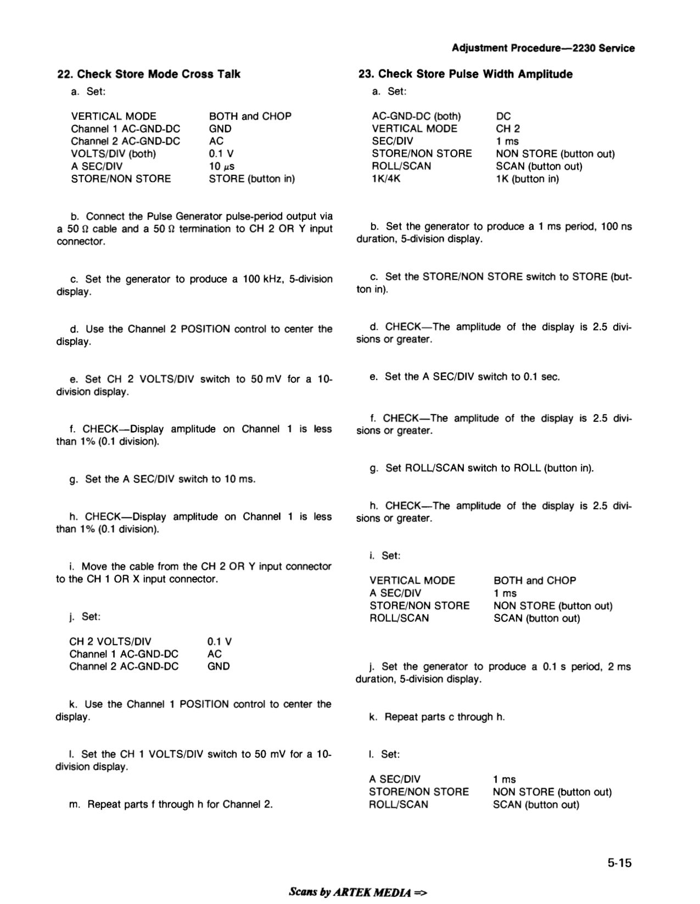


---

## Page 145 of 451

Adjustment Procedure-2230 
Service 
m. Set the generator to produce a 1 ms period, 20 ps 
duration, 5-division display. 
n. Repeat parts c and d. 
o. Disconnect the test equipment from the instrument. 
24. Check Average Mode 
a. Set the WAVEFORM REFERENCEIMENU SELECT 
switch to MENU SELECT (button out). 
b. Use the Menu controls to select SWP LIMIT. 
c. CHECK-The 
SWP LlMlT is adjustable from 1 to 
2047 or NO LlMlT by rotating the CURSORS control. 
NOTE 
Install the instrument cabinet for the remaining verti- 
cal checks and allow a 20-minute warm-up period 
before continuing with the Adjustment Procedure. 
See the "Cabinet" remove and replace instructions 
located in the "Maintenance" section of the manual. 
25. Check Bandwidth Limit Operation 
a. Set: 
Vertical POSITION (both) 
Midrange 
VERTICAL MODE 
CH 1 
BW LIMIT 
On (button in) 
VOLTSIDIV Variable (both) CAL detent 
AC-GND-DC (both) 
DC 
A SECIDIV 
20 ps 
STOREINON STORE 
NON STORE (button out) 
b. Connect the leveled sine-wave generator output via 
a 50 Q cable and a 50 Q termination to the CH 1 OR X 
input connector. 
26. Check Bandwidth 
a. Set: 
BW LIMIT 
Off (button out) 
VOLTSIDIV (both) 
2 mV 
b. Set the generator to produce a 50 kHz, 6-division 
display. 
c. CHECK-Display 
amplitude is 4.2 divisions or 
greater as the generator output frequency is increased up 
to the value shown in Table 5-6 for the corresponding 
VOLTSIDIV switch setting. 
Table 5-6 
Settings for Bandwidth Checks 
VOLTS/DIV 
Generator 
Switch Setting 
d. Repeat parts b and c for all CH 1 VOLTSIDIV 
switch settings, up to the output-voltage upper limit of the 
sine-wave generator being used. 
Output Frequency 
2 mV 
5 m V t o 5 V 
e. Move the cable from the CH 1 OR X input connector 
to the CH 2 OR Y input connector. Set the VERTICAL 
MODE switch to CH 2. 
80 MHz 
100 MHz 
f. Repeat parts b and c for all CH 2 VOLTSIDIV switch 
settings, up to the output-voltage upper limit of the sine- 
wave generator being used. 
27. Check Repetitive Store Mode 
a. Set: 
CH 2 VOLTSIDIV 
10 mV 
A SECIDIV 
0.2 ms 
c. Set the generator to produce a 50 kHz, 6-division 
display. 
d. Increase the generator output frequency until the 
display amplitude decreases to 4.2 divisions. 
e. CHECK-Generator 
output frequency is between 
18 MHz and 22 MHz. 
b. Set the generator to produce a 50 kHz. 6-division 
display. 
c. Set: 
A SECIDIV 
XI 0 Magnifier 
0.05 ps 
On (knob out) 
Scans by ARTEK MEDLQ =>


---

## Page 146 of 451

Adjustment Procedure-2230 Service 
d. Set the generator to produce a 100 MHz display. 
29. Check Non Store and Store Channel Isolation 
a. Set: 
e. Set: 
VOLTSIDIV (both) 
0.1 V 
STOREINON STORE 
STORE (button in) 
SAVEICONTINUE 
CONTINUE (button out) 
VOLTSIDIV variable (both) 
CAL detent 
INVERT 
Off (button out) 
Channel 1 AC-GND-DC 
GND 
A SECIDIV 
0.1 ps 
NOTE 
A TRIGGER Mode 
P-P AUTO 
A&B INT 
VERT MODE 
Allow the points to accumulate for a few seconds 
STOREINON STORE 
NON STORE (button out) 
before saving the display. 
b. Set the generator to produce a 50 MHz, 5-division 
f. CHECK-The 
100 MHz display will accumulate and 
display. 
store. 
c. Set the VERTICAL MODE switch to CH 1 
g. Set: 
VERTICAL MODE 
BOTH and ALT 
d. CHECK-Display 
amplitude is 0.05 division or less. 
SAVEICONTINUE 
CONTINUE (button out) 
h. Repeat part f. 
28. Check Single Sweep Sample Acquisition 
a. Set: 
VERTICAL MODE 
CH 2 
A SECIDIV 
5 PS 
XI0 Magnifier 
Off (knob in) 
A TRIGGER Mode 
NORM 
A&B INT 
CH 2 
SAVEICONTINUE 
CONTINUE (button out) 
1 Kl4K 
1 K (button in) 
e. Move the cable from the CH 2 OR Y input connector 
to the CH 1 OR X input connector. 
f. Set: 
VERTICAL MODE 
CH 2 
Channel 1 AC-GND-DC 
DC 
Channel 2 AC-GND-DC 
GND 
g. CHECK-Display 
amplitude is 0.05 division or less. 
h. Set: 
CH 1 VOLTSIDIV 
50 mV 
STOREINON STORE 
STORE (button in) 
SAVEICONTINUE 
CONTINUE (button out) 
b. Set the generator to produce a 50 kHz, 6-division 
display. 
i. CHECK-Display amplitude is 0.1 division or less. 
c. Press in the A TRIGGER Mode SGL SWP button. 
j. Move the cable from the CH 1 OR X input connector 
to the CH 2 OR Y input connector. 
d. Set the generator output to 2 MHz. 
k. Set: 
e. Press in the A TRIGGER Mode SGL SWP button. 
VERTICAL MODE 
CH 1 
CH 1 VOLTSIDIV 
0.1 V 
CH 2 VOLTSIDIV 
50 mV 
f. CHECK-The 
minimum 
peak-to-peak 
envelope 
Channel 1 AC-GND-DC 
GND 
amplitude is greater than 5.6 divisions. 
Channel 2 AC-GND-DC 
DC 
Scam by ARTEK MEDL4 *


---

## Page 147 of 451

Adjustment Procedure-2230 Service 
I. CHECK-Display 
amplitude is 0.1 division or less. 
m. Set the generator to produce a 50 MHz, Gdivision 
display. 
m. Disconnect the test equipment from the instrument. 
n. Set the VERTICAL MODE switch to BOTH. 
30. Check Common-Mode Rejection Ratio 
a. Set: 
o. CHECK-Display 
amplitude is 0.6 division or less. 
VOLTSIDIV (both) 
10 mV 
INVERT 
On (button in) 
p. Disconnect the test equipment from the instrument. 
AC-GND-DC (both) 
DC 
STOREINON STORE 
NON STORE (button out) 
b. Connect the leveled sine-wave generator output via 
31. Check Probe Encoding 
a 50 Q cable, a 50 Q termination, and a dual-input coupler 
to the CH 1 OR X and CH 2 OR Y input connectors. 
a. Set: 
VOLTSIDIV (both) 
0.1 V 
c. Set the generator to produce a 50 MHz, 6-division 
VERTICAL MODE 
CH 1 
display. 
b. Read the 0.1 V on the Channel 1 VOLTSIDIV por- 
d. Vertically center the display using the Channel 1 
tion Of the crt 
POSITION control. Then set the VERTICAL MODE switch 
to CH 2 and vertically center the display using the Chan- 
nel 2 POSITION control. 
c. Connect the standard accessory 10X probe to the 
CH 1 OR X connector. 
e. Set the VERTICAL MODE switches to BOTH and 
ADD. 
d. CHECK-The 
Channel 1 VOLTSIDIV portion of the 
crt readout changes from 0.1 V to 1 V. 
f. CHECK-Display 
amplitude is 0.6 division or less. 
e. Set VERTICAL MODE to CH 2. 
g. If the check in part f meets the requirement, skip to 
part p. If it does not, continue with part h. 
f. Move the 10X probe from the CH 1 OR X input con- 
nector to the CH 2 OR Y input connector. 
h. Set the VERTICAL MODE switch to CH 1. 
g. CHECK-The 
Channel 2 VOLTSIDIV portion of the 
crt readout changes from 100 mV to 1 V. 
i. Set the generator to produce a 50 kHz, 6-division 
display. 
h. Disconnect the 1 OX probe from the instrument. 
j. Set the VERTICAL MODE switch to BOTH. 
NOTE 
To continue with the Adjustment Procedure, remove 
k. Adjust the CH 1 or CH 2 VOLTSIDIV Variable con- 
the instrument cabinet and allow a 20-minute time 
trol for minimum display amplitude. 
period to elapse before continuing with the Adjust- 
ment Procedure. See the "Cabinet" removal instruc- 
tions located in the "Maintenance" section of the 
I. Set the VERTICAL MODE switch to CH 1. 
manual. 
Scans by ARTEK MEDIA =>


---

## Page 148 of 451

Adjustment Procedure-2230 Service 
HORIZONTAL 
Equipment Required (See Table 4-1): 
Calibration Generator (Item 1) 
50 D Cable (Item 8) 
Leveled Sine-Wave Generator (Item 2) 
50 Q BNC Termination (Item 12) 
Time-Mark Generator (Item 3) 
Low-Capacitance Alignment Tool (Item 18) 
Test Oscilloscope (Item 6) 
Screwdriver (Item 19) 
See 
ADJUSTMENT LOCATIONS 1, 
ADJUSTMENT LOCATIONS 3, 
and 
ADJUSTMENT LOCAtlONs 4 
at the back of this manual for test point and adjustment locations. 
INITIAL CONTROL SETTINGS 
Storage 
Vertical 
POSITION (both) 
VERTICAL MODE 
X-Y 
BW LIMIT 
CH 1 VOLTSIDIV 
CH 1 VOLTS/DIV Variable 
Channel 1 AC-GND-DC 
Midrange 
CH 1 
Off (button out) 
Off (button out) 
0.5 V 
CAL detent 
DC 
Horizontal 
POSITION 
Midrange 
HORIZONTAL MODE 
A 
A and B SECIDIV 
0.1 ms 
SECIDIV Variable 
CAL detent 
STORE/NON STORE 
SAVE/CONTINUE 
PRETRIG/POST TRIG 
ROLL/SCAN 
1 K/4K 
POSITION CURS/ 
SELECT WAVEFORM 
WAVEFORM 
REFERENCE/ 
MENU SELECT 
NON STORE (button out) 
CONTINUE (button out) 
POST TRIG (button out) 
SCAN (button out) 
4K (button out) 
POSIl'lON CURS 
(button in) 
WAVEFORM 
REFERENCE 
(button in) 
PROCEDURE STEPS 
1. Adjust Horizontal Amplifier Gain 
(R740 and R730) 
XI 0 Magnifier 
Off (knob in) 
a. Connect 0.1 ms time markers from the time-mark 
B DELAY TIME POSITION 
Fully counterclockwise 
generator via a 50 R cable and a 50 D termination to the 
CH 1 OR X input connector. 
B 'TRIGGER 
SLOPE 
LEVEL 
A TRIGGER 
VAR HOLDOFF 
Mode 
SLOPE 
LEVEL 
HF REJECT 
A&B INT 
A SOURCE 
OUT 
Fully clockwise 
NORM 
P-P AUTO 
OUT 
Midrange 
OFF 
VERT MODE 
INT 
b. Use the Horizontal POSITION control to align the 
1 st time marker with the 1 st vertical graticule line. 
c. ADJUST-A 
Sweep Gain (R740) for 1 time marker 
per division over the center 8 divisions. 
NOTE 
When making timing measurements, use as a refer- 
ence the tips of the time markers positioned at the 
center horizontal graticule line. 
Scans by AR TEK M E N =>


---

## Page 149 of 451

Adjustment Procedure-2230 Service 
d. Set the HORIZONTAL MODE switch to B. 
e. ADJUST-B 
Sweep Gain (R730) for 1 time marker 
per division. 
2. Adjust X I 0 Horizontal Amplifier Gain (R754) 
a. Set: 
HORIZONTAL MODE 
A 
XI0 Magnifier 
On (knob out) 
b. Select 10 ps time markers from the time-mark 
generator. 
c. Align the nearest time marker to the 1st vertical 
graticule line with the 1st graticule line. 
d. ADJUST-XI0 
Gain (R754) for 1 time marker per 
division. 
3. Adjust Magnifier Registration (R749) 
a. Set the A SECIDIV switch to 0.2 ms. 
b. Select 1 ms time markers from the time-mark 
generator. 
c. Position the middle time marker to the center verti- 
cal graticule line using the Horizontal POSITION control. 
b. Position the start of the sweep at the 1st vertical 
graticule line using the Horizontal POSITION control. 
c. CHECK-End 
of the sweep is to the right of the 
11 th vertical graticule line. 
5. Check Position Range 
a. Set: 
Channel 1 AC-GND-DC 
DC 
A SECIDIV 
10 ~1.s 
b. Select 10 ps time markers from the time-mark 
generator. 
c. CHECK-Start 
of the sweep can be positioned to 
the right of the center vertical graticule line by rotating the 
Horizontal POSITION control fully clockwise. 
d. CHECK-The 
11 th time marker can be positioned to 
the left of the center vertical graticule line by rotating the 
Horizontal POSlTlON control fully counterclockwise. 
e. Select 50 ps time markers from the time-mark 
generator. 
f. Align the 3rd time marker with the center vertical 
graticule line using the Horizontal POSITION control. 
g. Set the XI0 Magnifier to On (knob out). 
d. Set the XI0 Magnifier to Off (knob in). 
e. ADJUST-Mag 
(R749) to position the middle time 
marker to the center vertical graticule line. 
f. Set the XI0 Magnifier to On (knob out) and CHECK 
for no horizontal shift in the time marker. 
h. CHECK-Magnified 
time marker can be positioned 
to the left of the center vertical graticule line by rotating 
the Horizontal POSITION control fully counterclockwise. 
i. CHECK-Start 
of the sweep can be positioned to 
the right of the center vertical graticule line by rotating the 
Horizontal POSITION control fully clockwise. 
g. Repeat parts c through f until no further improve- 
ment is noted. 
6. Check Variable Range 
4. Check Sweep Length 
a. Set: 
Channel 1 AC-GND-DC 
GND 
XI 0 Magnifier 
Off (knob in) 
a. Set: 
Horizontal POSITION 
Midrange 
A SECIDIV 
0.2 ms 
SECIDIV Variable 
Fully counterclockwise 
XI0 Magnifier 
Off (knob in) 
Scans by ARTEK MEDL4 =>


---

## Page 150 of 451

Adjustment Procedure-2230 Service 
b. Select 0.5 ms time markers from the time-mark 
c. Adjust the AIB SWP SEP control to separate the A 
generator. 
and B Sweeps. 
c. CHECK-Time 
markers are 1 division or less apart. 
d. Position the start of the trace exactly on the 1st 
vertical graticule line using the Horizontal POSITION 
control. 
7. AdjustICheck 4K to 1K Display Compress 
(R7507) 
e. Rotate the B DELAY TIME POSITION control fully 
a. Set: 
counterclockwise. 
A SECIDIV 
50 ps 
STOREINON STORE 
STORE (button in) 
SAVEICONTINUE 
CONTINUE (button out) 
f. ADJUST-Delay 
Start (R646) so that the intensified 
zone starts at 0.2 divisions. 
1 K14K 
4K (button out) 
g. Rotate the B DELAY TlME POSll-ION control fully 
b. Set Store Reset plug (P9104) to reset position. 
clockwise. 
c. Select 0.2 ms time markers from the time-mark 
h. ADJUST-D-End (R652) so that the intensified zone 
generator. 
starts at 10.05 divisions. 
d. ADJUST-Ratio 
Adj (R7507) for 1 time marker per 
i. Repeat parts e through h until no further improve- 
division over the center 8 divisions. 
ment is noted. 
e. Set the Store Reset plug (P9104) to normal position. 
j. Rotate the B DELAY TlME POSITION control until 
the 2nd A-Sweep time marker is aligned with a selected 
reference vertical graticule line on the B Sweep. Record 
f. Select 0.1 ms time markers from the time-mark gen- 
the DLY> readout for part I. 
erator and check that the time markers are 2 divisions 
apart. 
k. Rotate the B DELAY TlME POSITION control until 
the 10th A-Sweep time marker is aligned with the same 
g. Rotate the SECIDIV Variable control out of detent. 
selected reference vertical graticule line on the B Sweep 
as in part j. 
h. CHECK-For 
2 time markers per division over the 
center 8 divisions. 
I. ADJUST-Delay 
Readout (R6119) until the DLY> 
readout display between the 2nd time marker and the 10th 
time marker is 0.800 ms. 
8. Adjust Delay Timing and Readout 
(R646, R652, and R6119) 
a. Set: 
9. Adjust High-Speed Timing (C703 and C713) 
HORIZONTAL MODE 
BOTH 
a. Set: 
A SECIDIV 
0.1 ms 
B SECIDIV 
1 r s 
HORIZONTAL MODE 
A 
SECIDIV Variable 
CAL detent 
A SECIDIV 
1 r s 
STOREINON STORE 
NON STORE (button out) 
A SECIDIV Variable 
CAL detent 
b. Select 0.1 ms time markers from the time-mark 
b. Select 1 ps time markers from the time-mark 
generator. 
generator. 
Scans by ARTEK MEDLQ -


---

## Page 151 of 451

Adjustment Procedure-2230 Service 
c. ADJUST-A 
High Speed Timing (C703) for 1 time 
c. Adjust the A TRIGGER LEVEL control for a stable, 
marker per division over the center 8 divisions. 
triggered display. 
d. Set: 
HORIZONTAL MODE 
B 
A SECIDIV 
2 PS 
B SECIDIV 
1 r s 
d. Use the Horizontal POSITION control to align the 
2nd time marker with the 2nd vertical graticule line. 
e. CHECK-Timing 
accuracy is within 2% (0.16 divi- 
sion at the 10th vertical graticule line), and linearity is 
within 5% (0.1 division over any 2 of the center 8 
e. ADJUST-B 
High Speed Timing (C713) for 1 time 
divisions). 
marker per division over the center 8 divisions. 
NOTE 
10. Adjust 5 ns Timing and Linearity 
(C775 and C785) 
a. Set: 
CH 1 VOLTSIDIV 
0.2 V 
Horizontal POSITION 
Midrange 
HORIZONTAL MODE 
A 
A SECIDIV 
0.05 ps 
For checking the timing accuracy of the A SEC/DIV 
switch settings from 50 ms to 0.5 s, watch the time 
marker tips only at the 2nd and 10th vertical grati- 
cule lines while adjusting the Horizontal POSITION 
control. 
f. Repeat parts c through e for the remaining A 
SECIDIV and time-mark generator setting combinations 
shown in Table 5-7 under the "Normal (XI)" column. 
XI 0 Magnifier 
On (knob out) 
g. Set: 
b. Select 10 ns time markers from the time-mark 
A SECIDIV 
generator. 
XI0 Magnifier 
0.05 ps 
On (knob out) 
c. Align the time markers with the vertical graticule 
h. Select 10 ns time markers from the time-mark 
lines using the Horizontal POSITION control. 
generator. 
d. ADJUST-5 
ns Timing (C775 and C785 alternately) 
i. Use the Horizontal POSITION control to align the 1st 
for one time marker every 2 divisions over the center 8 
time marker that is 25 ns beyond the start of the sweep 
divisions of the magnified sweep. 
with the 2nd vertical graticule line. 
e. CHECK-Time 
markers between the 2nd and 4th 
j. CHECK-Timing 
accuracy is within 3% (0.24 division 
vertical graticule lines Should be aligned within 0.05 divi- 
at the 10th vertical graticule line), and linearity is within 5% 
sion. If not, a slight compromise between timing and 
(0.1 division over any 2 of the center 8 divisions). Exclude 
linearity should be made by readjusting the 5 ns Timing 
any portion of the sweep past the 100th magnified 
capacitors (C775 and C785). 
division. 
k. Repeat parts i and j for the remaining A SECIDIV 
11. Check Timing Accuracy and Linearity 
a. Set: 
and time-mark generator setting combinations shown in 
Table 5-7 under the "X10 Magnified" column. 
CH 1 VOLTSIDIV 
0.5 V 
I. Set: 
XI 0 Magnifier 
Off (knob in) 
HORIZONTAL MODE 
B 
A SECIDIV 
0.1 ps 
b. Select 50 ns time markers from the time-marker 
B SECIDIV 
0.05 ps 
generator. 
XI 0 Magnifier 
Off (knob in) 
Scans by ARTEK MEDL4 =>


---

## Page 152 of 451

Adjustment Procedure-2230 
Service 
Table 5-7 
b. Use the Horizontal POSITION control to align the 
start of the A Sweep with the 1st vertical graticule line. 
Settings for Timing Accuracy Checks 
c. Set the B DELAY TIME POSITION control fully 
counterclockwise. 
SECIDIV 
Switch 
Setting 
0.05 ps 
0.1 ps 
0.2 ps 
0.5 ps 
1 r s 
2 r s 
5 FS 
10 ps 
20 ps 
50 ps 
0.1 ms 
0.2 ms 
0.5 ms 
d. CHECK-Intensified 
portion of the trace starts 
within 0.5 division of the start of the sweep. 
e. Rotate the B DELAY TlME POSITION control fully 
clockwise. 
Time-Mark Generator Setting 
f. CHECK-Intensified 
portion of the trace is past the 
11 th vertical graticule line. 
Normal (XI) 
50 ns 
0.1 ps 
0.2 ps 
0.5 ps 
1 FS 
2 FS 
5 PS 
10 ps 
20 ps 
50 ps 
0.1 ms 
0.2 ms 
0.5 ms 
g. Set the A and B SECIDIV switch to 0.5 ps. 
XI0 Magnified 
10 ns 
10 ns 
20 ns 
50 ns 
0.1 ps 
0.2 ps 
0.5 ps 
1 PS 
2 FS 
5 PS 
10 /ls 
20 ps 
50 us 
h. Repeat parts b through f. 
0.1 ms 
i. Set: 
0.2 ms 
0.5 ms 
Channel 1 AC-GND-DC 
DC 
B SECIDIV 
0.05 ps 
1 ms 
B DELAY TIME POSITION 
Fully counterclockwise 
2 ms 
50 ms 
1 
50ms 
1 
5 ms 
j. Select 0.5 ps time markers from the time-mark 
A Sweep Only 
generator. 
m. Pepeat parts b through k for the B Sweep. Keep 
the A SECIDIV switch one setting slower than the B 
I. Rotate the B DELAY TIME POSITION control fully 
SECIDIV switch. 
clockwise until the top of the 10th time marker on the B 
Sweep is aligned with the same selected reference vertical 
line as in part k. Record the DLY> readout for part m. 
0.1 s 
0.2 s 
0.5 s 
12. Check Delay Time Differential Accuracy 
a. Set: 
aligned with a selected reference vertical line. Record the 
DLY> readout for part m. 
0.1 s 
0.2 s 
0.5 s 
Channel 1 AC-GND-DC 
GND 
HORIZONTAL MODE 
BOTH 
A and B SECIDIV 
0.2 ms 
XI0 Magnifier 
Off (knob in) 
A TRIGGER MODE 
P-P AUTO 
10 ms 
20 ms 
k. Rotate the B DELAY TIME POSITION control so 
50 ms 
that the top of the 2nd time marker on the B Sweep is 
m. CHECK-Delay 
time readout is within the limits 
given in Table 5-8 (Delay Readout Limits column) by sub- 
tracting the delay time reading in part k from part I. 
n. Repeat parts k through m for the remaining B 
SECIDIV and time-mark generator settings given in Table 
5-8, check the &division delay time accuracy for each A 
SECIDIV switch setting given in column 1 of the table. 
Scans by ARTEK MEDL4 *


---

## Page 153 of 451

Adjustment Procedure-2230 
Senrice 
15. Adjust Store X Offset and Gain 
(R9214 and R9212) 
a. ADJUST-Store 
X Offset (R9214) so that the left 
trace of the outside box is exactly aligned with the 1st 
vertical graticule line. 
Table 5-8 
Settings for Delay Time Differential Checks 
b. ADJUST-Store 
X Gain (R9212) so that the inside 
box is exactly 8 divisions wide. The inside box is horizon- 
tally centered with the Horizontal POSITION control. 
Time-Mark 
Generator 
and A 
SECIDIV 
Settings 
0.5 ps 
5 PS 
50 ps 
c. INTERACTION-Repeat 
parts a and b until the 
inside box is exactly 8 horizontal divisions wide and the 
left trace of the outside box is aligned with the 1st vertical 
graticule line. 
16. Adjust Clock Delay Timer (R4213 and C4202) 
a. Use the Menu controls to select CAL-CLK-DLY. 
13. Check Delay Jitter 
a. Set: 
Delay 
Readout 
Limits 
3.948 to 4.052 ps 
39.48 to 40.52 ps 
394.8 to 405.2 ps 
6 
I 
Eight 
SECIDIV 
Division 
A SECIDIV 
0.5 ms 
B SECIDIV 
0.5 ps 
B DELAY TIME POSITION Fully clockwise 
Setting 
0.05 ps 
0.5 ps 
5 ps 
b. ADJUST-CDT 
XY (R4213) to vertically align the 
horizontal trace with the center horizontal graticule line. 
Delay 
4.000 ps 
40.00 ps 
400.0 ps 
c. ADJUST-CDT 
X (C4202) to horizontally align the 
vertical trace with the center vertical graticule line. Both 
traces will intersect within the center box. 
b. Select 50 ps time markers from the time-mark 
d. Repeat part b and c until both traces are aligned 
generator. 
with the center graticule lines within the boxes. 
c. Rotate the B DELAY TIME POSITION control coun- 
terclockwise to position a time marker within the graticule 
17. Check Store Differential and Cursor Time 
area for each major dial division and CHECK that the jitter 
Difference Accuracy 
on the leading edge does not exceed 0.5 division. Disre- 
a. Set: 
gard slow drift. 
Channel 1 AC-GND-DC 
GND 
HORIZONTAL MODE 
A 
14. Adjust Vector Generator (R6312 and R6321) 
A SECIDIV 
0.1 ms 
a. Set the WAVEFORM REFERENCEIMENU SELECT 
STOREINON STORE 
STORE (button in) 
switch to MENU SELECT (button out). 
1 Kl4K 
1 K (button in) 
b. Use the Menu controls to display rectangle test 
b. Use the Channel 1 POSITION control to center the 
waveforms on the screen by selecting ADVANCE FUNC- 
base line vertically and the Horizontal POSITION control to 
TIONS, DIAGNOSTICS, CAL AIDS, and BOX in that 
align the start of the trace with the 1st vertical graticule 
order. 
line. 
c. ADJUST-X 
and Y VectorIDot Alignment (R6312 
c. Use the CURSORS control and SELECT CllC2 
and R6321) for best displays of the delta symbols (no tails 
switch to set one cursor exactly on the 2nd vertical grati- 
or tilting) located at each of the four corners on the 
cule line and position the active cursor to the right using 
screen. 
the CURSORS control until AT readout displays 0.800 ms. 
Scam by ARTEK MEDIA -


---

## Page 154 of 451

Adjustment Procedure-2230 
Service 
d. CHECK-Graticule 
indication of cursor difference at 
NOTE 
the 10th vertical graticule line is within 0.16 division. 
Pulses with fast rise and fall times have only a few 
sample points, and it may not be possible to place 
e. Set the Channel 1 AC-GND-DC switch to DC. 
the cursors at exactly the same voltage levels. 
f. Select 0.1 ms time markers from the time-mark 
r. CHECK-The 
AT readout is between 397.0 ns and 
generator. 
403.0 ns. 
g. Use the Horizontal POSITION control to align the 
18' Check Store Expansion Range 
2nd time marker with the 2nd vertical graticule line. 
a. Set: 
A SECIDIV 
0.1 ms 
h. Set the SAVEICONTINUE switch to SAVE (button 
SAVEICONTINUE 
CONTINUE (knob out) 
in) for a stable display. 
b. Select 10 ps time markers from the time-mark 
i. Use the CURSORS control and SELECT CllC2 
generator. 
switch to set the first cursor on the trailing edge of the 
2nd time marker. 
c. Use the Horizontal POSITION control to align the 
start of the A Sweep with the 1st vertical graticule line. 
j. Press in the CllC2 button to activate the second 
cursor. 
d. Set the XI0 Magnifier knob to On (knob out). 
k. Set the second cursor on the trailing edge of the 
10th time marker at the same voltage level as on the 2nd 
time marker. 
e. CHECK-The 
time markers are 1 division apart. 
I. CHECK-The 
AT readout is between 0.798 ms and 
0.802 ms. 
19. Check A/B Sweep Separation 
a. Set: 
m. Set the SAVEICONTINUE switch to CONTINLIE 
HORIZONTAL MODE 
BOTH 
(button out). 
A and B SECIDIV 
0.5 ms 
STOREINON STORE 
NON STORE 
n. Set the A SECIDIV switch to 0.5 ps. 
b. Use the Channel 1 POSITION control to set the A 
Sweep at the center horizontal graticule line. 
o. Select 0.5 ps time markers from the time-mark 
generator. 
c. CHECK-The 
B Sweep can be positioned more 
than 3.5 divisions above and below the A Sweep when the 
p. Use the Horizontal POSITION control to align the 
AIB SWP SEP control is rotated fully clockwise and coun- 
2nd time marker with the 2nd vertical graticule line. 
terclockwise respectively. 
NOTE 
20. Adjust X Gain (R760) 
Allow the points to accumulate for a few seconds 
a. Set: 
before saving the display. 
X-Y 
On (button in) 
CH 1 VOLTSIDIV 
10 mV 
q. Repeat parts h through k. 
Horizontal POSITION 
Midrange


---

## Page 155 of 451

Adjustment Procedure-2230 Service 
b. Connect the standard-amplitude signal from the 
b. Connect the leveled sine-wave generator output via 
Calibration Generator via a 50 fl cable to the CH 1 OR X 
a 50 fl cable and a 50 fl termination to the CH 1 OR X 
input connector. 
input connector. 
c. Use the Channel 2 POSITION and Horizontal POSI- 
c. Set the generator to produce a 5-division horizontal 
TlON controls to center the display. 
display at an output frequency of 50 kHz. 
d. Set the generator to produce a 50 mV signal. 
d. Increase the generator output frequency to 2.5 MHz. 
e. ADJUST-X-Gain 
(R760) for exactly 5 divisions of 
e. CHECK-Display 
is at least 3.5 horizontal divisions. 
horizontal deflection. 
f. Disconnect the test equipment from the instrument. 
f. Disconnect the test equipment from the instrument. 
21. Check X-Y Store 
a. Set the STOREINON STORE switch to STORE 
(button in). 
b. Set the generator to produce a 50 mV signal. 
c. CHECK-The 
display can be move vertically and 
horizontally with the Channel 2 POSITION and Horizontal 
POSITION controls. 
d. Set the SAVEICONTINUE switch to SAVE (button 
in). 
e. Repeat part c. 
1 
f. Disconnect the test equipment from the instrument. 
22. Check X Bandwidth 
a. Set: 
23. Check A-Sweep Holdoff 
a. Set: 
X-Y 
Off (button out) 
HORIZONTAL MODE 
A 
A SECIDIV 
1 ms 
VAR HOLDOFF 
NORM. 
b. Connect the test oscilloscope and its 10X probe tip 
to the front end of R707 (toward the front panel) which is 
located on the Timing circuit board. 
c. CHECK-The 
A-Sweep holdoff is greater then 3 ms 
but less than 7 ms. 
d. Rotate the VAR HOL[K)FF control to the maximum 
clockwise position (MAX). 
e. CHECK-The 
A-Sweep holdoff has increased by a 
factor of 10 or more. 
CH 2 AC-GND-DC 
GND 
f. Disconnect the test oscilloscope 10X probe from 
STOREINON STORE 
NON STORE (button out) 
R707. 
Scans by ARTEK MEDIA =>


---

## Page 156 of 451

Adjustment Procedure-2230 
Service 
TRIGGER 
Equipment Required (See Table 4-1): 
Leveled Sine-Wave Generator (Item 2) 
BNC T-Connector (Item 11) 
Low-Frequency Generator (Item 4) 
50 Q BNC Termination (Item 12) 
50 Q BNC Cable (Item 8) 
600 Q BNC Termination (Item 13) 
Dual-Input Coupler (Item 9) 
Screwdriver (Item 19) 
See 
ADJUSTMEW LOCATIONS 1 
and 
ADJUSTMENT L O C A m 3 
at the back of the manual for test points and adjustment locations. 
Vertical (Both Channels) 
POSITION 
VERTICAL MODE 
X-Y 
BW LIMIT 
VOLTSIDIV 
VOLTSIDIV Variable 
INVERT 
AC-GND-DC 
Midrange 
BOTH-ALT 
Off (button out) 
Off (button out) 
0.5 V 
CAL detent 
Off (button out) 
GND 
Horizontal 
POSITION 
Midrange 
HORIZONTAL MODE 
A 
A and B SECIDIV 
1 ms 
SECIDIV Variable 
CAL detent 
XI0 Magnifier 
Off (knob in) 
B DELAY TIME POSITION Fully counterclockwise 
B TRIGGER 
SLOPE 
LEVEL 
OUT 
Midrange 
A TRIGGER 
VAR HOLDOFF 
NORM 
Mode 
P-P AUTO 
SLOPE 
OUT 
LEVEL 
Midrange 
HF REJECT 
OFF 
A&B INT 
VERT MODE 
A SOURCE 
INT 
A EXT COUPLING 
AC 
Storage 
STOREINON 
SAVEICONTINUE 
PRETRIGIPOST TRIG 
ROLLISCAN 
1 Kl4K 
POSITION CURS1 
SELECT WAVEFORM 
WAVEFORM 
REFERENCE1 
MENU SELECT 
STORE 
CONTINUE (button out) 
POST TRlG (button out) 
SCAN (button out) 
4K (button out) 
POSITION CURS 
(button in) 
WAVEFORM 
REFERENCE 
(button in) 
PROCEDURE STEPS 
1. Adjust Channel 1 Trigger Offset (R309) 
a. Set the Channel 1 trace and the Channel 2 trace to 
the center horizontal graticule line using the Channel 1 and 
Channel 2 POSITION controls. 
b. Connect the digital voltmeter low lead to chassis 
ground and the high (volts) lead to TP460, located on the 
bottom side of the Main circuit board. 
c. CHECK-Note 
the offset voltage reading at TP460 
for use in part e. 
d. Set the A&B INT switch to CH 1 
e. ADJUST-Trig 
Offset (R309) so that the voltage 
reading is the same as that obtained in part c. 
Scans by ARTEK MEDL4 =>


---

## Page 157 of 451

Adjustment Procedure-2230 Service 
f. Set the A&B INT switch to CH 2. 
g. Repeat parts c through f until there is 1 mV or less 
difference in the voltmeter readings between the CH 1 and 
CH 2 positions of the A&B INT switch. 
h. Disconnect the test equipment from the instrument. 
2. Adjust A and B Trigger Sensitivity 
(R471 and R627) 
a. Set: 
VERTICAL MODE 
CH 1 
CH 1 VOLTSIDIV 
0.1 V 
AC-GND-DC (both) 
AC 
A SECIDIV 
10 ps 
b. Connect the leveled sine-wave generator output via 
a 50 Q cable and a 50 Q termination to the CH 1 OR X 
input connector. 
c. Set the generator to produce a 50 kHz, 2.2-division 
display. 
d. Set the CH 1 VOLTSIDIV switch to 1 V. 
e. ADJUST-Trig 
Sens (R471) while rotating the A 
TRIGGER LEVEL control slowly so that the A Trigger is 
just able to be maintained. 
d. ADJUST-(+) 
P-P Auto Level (R434) so that the 
vertical display just solidly triggers on the positive peak of 
the signal. 
e. Set: 
A TRIGGER SLOPE 
IN 
A TRIGGER LEVEL 
Fully counterclockwise 
f. ADJUST-(-) 
P-P Auto Level (R435) so that the 
display just solidly triggers on the negative peak of the 
signal. 
g. Disconnect the test equipment from the instrument. 
4. Check Internal A and B Triggering 
a. Set: 
CH 1 VOLTSIDIV 
5 mV 
CH 2 VOLTSIDIV 
50 mV 
HORIZONTAL MODE 
A 
A and B SECIDIV 
0.2 ps 
A&B INT 
CH 1 
A SOURCE 
INT 
b. Connect the leveled sine-wave generator output via 
a 50 Q cable and a 50 Q termination to the CH 1 OR X 
input connector. 
c. Set the generator to produce a 10 MHz, 3-division 
display. 
f. Set the HORIZONTAL MODE switch to B. . 
d. Set the CH 1 VOLTSIDIV switch to 50 mV. 
g. ADJUST-B 
Trig Sens (R627) while rotating the B 
TRIGGER LEVEL control slowly so that the B Trigger is 
just able to be maintained. 
3. Adjust P-P Auto Level (R434 and R435) 
a. Set: 
CH 1 VOLTSIDIV 
50 mV 
A TRIGGER SLOPE 
OUT 
A TRIGGER LEVEL 
Fully clockwise 
b. Set the leveled sine-wave generator to produce a 
50 kHz, 6-division display. 
c. Set the CH 1 VOLTSIDIV switch to 0.5 V. 
e. CHECK-Stable 
display can be obtained by adjust- 
ing the A TRIGGER LEVEL control for each switch combi- 
nation given in Table 5-9. 
Table 5-9 
Switch Combinations for A Triggering Checks 
NORM 
I 
IN 
A TRIGGER Mode 
NORM 
P-P AUTO 
I 
IN 
A TRIGGER SLOPE 
OUT 
P-P AUTO 
1 
OUT 
Scans by ARTEK MEDLQ =>


---

## Page 158 of 451

Adjustment Procedure-2230 
Service 
f. Set the HORIZONTAL MODE switch to B. 
s. Repeat parts e through g. 
g. CHECK-Stable 
display can be obtained by adjust- 
t. Set: 
ing the B TRIGGER LEVEL control in a position other than 
the B RUNS AFTER DLY position for both the OUT and 
VER'I-ICAL MODE 
CH 2 
IN positions of the B TRIGGER SLOPE switch. 
HORIZONTAL MODE 
A 
A&B INT 
CH 2 
h. Set: 
VERTICAL MODE 
CH 2 
HORIZONTAL MODE 
A 
A&B INT 
CH 2 
u. Move the cable from the CH 1 OR X input connector 
to the CH 2 OR Y input connector. 
v. Repeat parts e through g. 
i. Move the cable from the CH 1 OR X input connector 
to the CH 2 OR Y input connector. 
w. Disconnect the test equipment from the instrument. 
j. Repeat parts e through g. 
k. Set: 
5. Check HF Reject A Triggering 
a. Set: 
HORIZONTAL MODE 
A 
VERTICAL MODE 
CH 1 
A SECIDIV 
0.1 ps 
VOLTSIDIV (both) 
50 mV 
XI0 Magnifier 
On (knob out) 
HORIZONTAL MODE 
A 
A SECIDIV 
5 PS 
A TRIGGER Mode 
NORM 
I. Set the generator to produce a 60 MHz, 1 .O-division 
A TRIGGER LEVEL 
Midrange 
display. 
A&B INT 
CH 1 
m. Repeat parts e through g. 
n. Set: 
VERTICAL MODE 
CH 1 
HORIZONTAL MODE 
A 
A&B INT 
CH 1 
b. Connect the low-frequency generator output via a 
50 Q cable and a 600 Q termination to the CH 1 OR X 
input connector. 
c. Set the low-frequency generator output to produce a 
250 kHz, l-division display. 
d. Adjust the A TRIGGER LEVEL control for a stable 
o. Move the cable from the CH 2 OR Y input connector 
display. 
to the CH 1 OR X input connector. 
e. Set HF REJECT switch to ON. 
p. Repeat parts e through g. 
q. Set: 
HORIZONTAL MODE 
A 
A SECIDIV 
0.05 ~ L S 
f. CHECK-Stable 
display cannot be obtained by 
adjusting the A TRIGGER LEVEL control for each switch 
combination given in Table 5-9. 
g. Set: 
r. Set the generator to produce a 100 MHz, 1.5- 
VERTICAL MODE 
division display. 
A&B INT 
Scans by ARTEK M
'
 
=>


---

## Page 159 of 451

Adjustment Procedure-2230 Service 
h. Move the cable from the CH 1 OR X input connector 
7. Check External Trigger Ranges 
to the CH 2 OR Y input connector. 
a. Set: 
i. Repeat part f. 
CH 1 VOLTSIDIV 
0.5 V 
A SECIDIV 
20 /.IS 
XI 0 Magnifier 
Off (knob in) 
j. Disconnect the test equipment from the instrument. 
A TRIGGER SLOPE 
OUT 
A TRIGGER Mode 
NORM 
b. Set the generator to produce a 50 kHz, 6.4-division 
display. 
6. Check External Triggering 
a. Set: 
VERTICAL MODE 
CH 1 
CH 1 VOLTSIDIV 
5 mV 
HORIZONTAL MODE 
A 
A SECIDIV 
0.1 /.IS 
XI 0 Magnifier 
HF REJECT 
A&B INT 
Off (knob in) 
OFF 
CH 1 
c. CHECK-Display 
is triggered along the entire posi- 
tive slope of the waveform as the A TRIGGER LEVEL 
control is rotated. 
d. CHECK-Display 
is not triggered (no trace) at either 
extreme of rotation. 
A SOLIRCE 
EXT 
e. Set the A TRIGGER SLOPE button to IN. 
b. Connect the leveled sine-wave aenerator out~ut via 
a 50 D cable, a 50 D termination, anda dual-input coupler 
to both the CH 1 OR X and EXT INPUT connectors. 
f. CHECK-Display 
is triggered along the entire nega- 
tive slope of the waveform as the A TRIGGER LEVEL 
control /s rotated. 
c. Set the leveled sine-wave generator output voltage 
g. CHECK-Display 
is not triggered (no trace) at either 
to 35 mV and the frequency to 10 MHz. 
extreme of rotation. 
8. Check Single Sweep Operation 
d. CHECK-Stable 
display can be obtained by adjust- 
ing the A TRIGGER LEVEL control for each switch combi- 
a. Adjust the A TRIGGER LEVEL control to obtain a 
nation given in Table 5-9. 
stable display. 
e. Set CH 1 VOLTSIDIV switch to 50 mV. 
b. Set: 
Channel 1 AC-GND-DC 
GND 
f. Set the generator output voltage to 120 mV and the 
A SOURCE 
I NT 
frequency to 60 MHz. Set the XI0 Magnifier to On (knob 
out). 
g. Repeat part d. 
c. Press in the SGL SWP button. The READY LED 
should illuminate and remain on. 
d. Set the Channel 1 AC-GND-DC switch to DC. 
h. Set the generator output voltage to 150 mV and the 
frequency to 100 MHz. 
NOTE 
i. Repeat part d. 
The A INTENSITY control may require adjustment to 
observe the single-sweep trace. 
Scans by ARTEK MEDU r>


---

## Page 160 of 451

Adjustment Procedure-2230 Service 
e. CHECK-READY 
LED goes out and a single sweep 
f. Set the PRETRIGIPOST TRIG switch to PRETRIG 
occurs. 
(button in). 
f. Press in the SGL SWP button several times. 
g. CHECK-The 
A TRIG POS default number is 3584 
and the trigger point (T) appears near the 9th vertical grat- 
icule line below the Menu. 
g. CHECK-Single-sweep 
trace 
occurs, 
and the 
READY LED illuminates briefly every time the SGL SWP 
button is pressed in and released. 
h. Set the 1Kl4K switch to 1 K (button in). 
h. Disconnect the test equipment from the instrument. 
i. CHECK-The 
A TRIG POS default number is 896 
and the trigger point (T) appears near the 9th vertical grat- 
icule line below the Menu. 
j. Set the PRETRIGIPOST TRlG switch to POST TRlG 
(button out). 
9. Check Acquisition Window Trigger Point 
a. Set: 
A TRIGGER Mode 
P-P AUTO 
1 W4K 
4K (button out) 
PRETRIGIPOST TRIG 
POST TRIG (button out) 
WAVEFORM REFERENCE1 
MENU SELECT 
MENU SELECT 
(button out) 
k. CHECK-The 
A TRlG POS default number is 128 
and the trigger point (T) appears near the 2nd vertical 
graticule line below the Menu. 
I. CHECK-The 
trigger point (T) can be moved 
between the 1st and the center vertical graticule lines as 
the CURSORS control is rotated. 
b. Use the Menu controls to select A TRIG POS. 
m. Set the PRETRIGIPOST TRlG switch to PRETRIG 
(button in). 
c. CHECK-The 
A TRlG POS default number is 512. 
d. Press in momentarily the PRETRIGIPOST TRlG 
switch to activate the trigger point display on the crt. 
Return the PRETRIGIPOST TRlG switch to POST TRlG 
(button out). 
n. CHECK-The 
trigger point (T) can be moved 
between the 10th and the center vertical graticule lines as 
the CURSORS control is rotated. 
o. Set the 1 K14K switch to 4K (button out). 
e. CHECK-The 
trigger point (T) appears near the 2nd 
p. Repeat part n for PRETRIG mode and part I for 
vertical graticule line below the Menu. 
POST TRIG mode. 
Scans by ARTEK M E N -


---

## Page 161 of 451

Adjustment Procedure-2230 Service 
EXTERNAL Z-AXIS, PROBE ADJUST, 
EXTERNAL CLOCK, AND X-Y PLOTTER 
Equipment Required (see Table 4-1): 
Leveled Sine-Wave Generator (Item 2) 
50 R BNC Termination (Item 12) 
Pulse Generator (Item 5) 
BNC Male-to-Tip Plug (Item 17) 
Two 50 R BNC Cables (Item 8) 
10X Probe (Proveded with Instrument) 
BNC T-Connector (Item 11) 
INITIAL CONTROL SETTINGS 
PROCEDURE STEPS 
Vertical 
Channel 1 POSITION 
VERTICAL MODE 
X-Y 
BW LIMIT 
CH 1 VOLTSIDIV 
CH 1 VOLTSIDIV Variable 
Channel 1 AC-GND-DC 
Horizontal 
POSITION 
HORIZONTAL MODE 
A SECIDIV 
SECIDIV Variable 
XI 0 Magnifier 
A TRIGGER 
Midrange 
CH 1 
Off (button out) 
Off (button out) 
1 v 
CAL detent 
DC 
Midrange 
A 
20 ps 
CAL detent 
Off (knob in) 
1. Check External 2-Axis Operation 
a. Connect the leveled sine-wave generator output via 
a 50 R cable and a T-connector to the CH 1 OR X input 
connector. Then connect a 50 R cable and a 50 R termina- 
tion from the T-connector to the EXT Z AXIS INPUT con- 
nector on the rear panel. 
b. Set the generator to produce a 5 V, 50 kHz signal. 
c. CHECK-For 
noticeable intensity modulation. The 
positive part of the sine wave should be of lower intensity 
than the negative part. 
d. Disconnect the test equipment from the instrument. 
VAR HOLDOFF 
NORM 
Mode 
P-P AUTO 
2. Check Probe Adjust Operation 
SLOPE 
OUT 
LEVEL 
Midrange 
a. Set: 
HF REJECT 
A&B INT 
A SOURCE 
Storage 
STOREINON STORE 
SAVEICONTINUE 
PRETRIGIPOST TRIG 
ROLLISCAN 
1 Kl4K 
POSITION CURS1 
SELECT WAVEFORM 
WAVEFORM 
REFERENCE1 
MENU SELECT 
OFF 
VERT MODE 
INT 
CH 1 VOLTSIDIV 
10 mV 
A SECIDIV 
0.5 ms 
b. Connect the 10X Probe to the CH 1 OR X input 
NON STORE (button out) 
connector and insert the probe tip into the PROBE 
CONTINUE (button out) 
ADJUST jack on the instrument front panel. If necessary, 
POST TRIG (button out) 
adjust the probe compensation for a flat-topped square- 
SCAN (button out) 
wave display. 
4K (button out) 
POSITION CURS 
(button in) 
c. CHECK-Display 
amplitude is 4.75 to 5.25 divisions. 
WAVEFORM 
REFERENCE 
(button in) 
d. Disconnect the probe from the instrument. 
Scans by ARTEK MEDLA -


---

## Page 162 of 451

Adjustment Procedure-2230 
Service 
3. Check External Clock 
a. Set: 
CH 1 VOLTSIDIV 
1 V 
X-Y 
Off (button out) 
A SECIDIV 
1 ms 
4. Check X-Y Plotter 
a. Connect the digital voltmeter low lead to either 
chassis ground or pin 9 (signal ground) of the X-Y Plotter 
connector. Connect the volts lead to pin 3 (X Output) of 
the X-Y Plotter connector. 
b. Set the digital voltmeter to the 20 V scale. 
b. Connect the pulse generator high-amplitude output 
via a 50 R cable and a 50 R termination to the CH 1 OR X 
input connector. 
c. Set the WAVEFORM REFERENCEIMENU SELECT 
switch to MENU SELECT (button out). 
c. Set the generator to produce a 1 kHz, 5-division 
display. ' 
d. Use the Menu controls to select PLOT and then ON 
for GRATICULE. 
d. Disconnect the cable from the CH 1 OR X input con- 
nector and connect it to the BNC male-to-tip plug via BNC 
e. Press in momentarily the CURSORS button to 
female-to-BNC-female connector. 
activate the X-Y Plotter. 
NOTE 
e. Insert the BNC male-to-tip plug signal lead and 
ground lead into pin 1 and pin 9 respectively of the X-Y 
Voltage reading of the X Output will be negative left 
Plotter connector. 
of the center vertical graticule line and positive to the 
right of the center vertical graticule line. Voltage 
reading of the Y Output will be negative below the 
f. Set the A SECIDIV switch to 0.1 sec. 
center horizontal graticule line and positive above 
the center horizontal graticule line. 
g . Connect the calibration generator high-amplitude 
output via a 50 52 cable and a 50 R termination t o CH 1 
OR X input connector. 
f. Record the voltage reading as the instrument plots 
the 1st and the 10th graticule line (as the intensity spot 
moves along the graticule line). 
h. Set the generator to produce a 100 Hz, 5-division 
display. 
g. CH ECK-The 
voltage difference between the 1 st 
and 10th graticule line is between 4.5 V and 5.5 V. 
i. Set: 
A SECIDIV 
EXT CLK 
h. Move the volts lead of the voltmeter from pin 3 (X 
STORE/NON STORE 
STORE (button in) 
Output) to pin 5 (Y Output) of the X-Y Plotter connector. 
SAVEICONTINUE 
CONTINUE (button out) 
i. Press in momentarily the CURSORS button to 
activate the X-Y Plotter. 
j. CHECK-The 
100 Hz signal is displayed on the 
screen and updated. 
j. Record the voltage reading as the instrument plots 
the top and the bottom graticule line (as the intensity spot 
k. Set the SAVE/CONT!NUE switch to SAVE (button 
moves along the graticule line). 
in). 
I. CHECK-The 
display is saved. 
k. CHECK-The 
voltage difference between the top 
and bottom graticule lines is between 3.6 V and 4.4 V. 
m. Disconnect the test equipment from the instrument. 
I. Disconnect the test equipment from the instrument. 
Scans by ARTEK MEDLQ =>


---

## Page 163 of 451

Section 6-2230 
Service 
MAINTENANCE 
This section contains information for conducting preventive maintenance, troubleshooting, and corrective maintenance on 
the instrument. Circuit board removal procedures are included in the corrective maintenance part of this section. 
STATIC-SENSITIVE COMPONENTS 
The following precautions are applicable when perform- 
5. Keep the component leads shorted together when- 
ing any maintenance involving internal access to the 
ever possible. 
instrument. 
C A U T I O N 
ExZl 
Static discharge can damage any semiconductor 
component in this instrument. 
This instrument contains electrical components that are 
6. Pick up components by their bodies, never by their 
leads. 
Table 6-1 
Relative Susceptibility to 
Static-Discharge Damage 
MOS or CMOS microcircuits or 
discretes, or linear microcircuits 
When performing maintenance, observe the following 
with MOS inputs 
( ~ o s t 
precautions to avoid component damage: 
ECL 
susceptible to damage from static discharge. Table 6-1 
1. Minimize handling of static-sensitive components. 
Semiconductor Classes 
lists the relative susceptibility of various classes of sem- 
iconductors. Static voltages of 1 kV to 30 kV are common 
in unprotected environments. 
2. Transport and store static-sensitive components or 
assemblies in their original containers or on a metal rail. 
Label any package that contains static-sensitive com- 
ponents or assemblies. 
Relative 
Susceptibility 
Levelsa 
3. Discharge the static voltage from your body by 
wearing a grounded antistatic wrist strap while handling 
these components. Servicing static-sensitive components 
or assemblies should be performed only at a static-free 
work station by qualified service personnel. 
Schottky TTL 
1 
4 
Schottky signal diodes 
High-frequency bipolar transistors 
1 
5 
3 
I 
.I FETs 
6 
Linear microcircuits 
TTL 
(Least Sensitive) 
I 
9 
I 
7 
Low-power Schottky TTL 
aVoltage equivalent for levels (voltage discharged from a 
100 pF capacitor through a resistance of 100 ohms): 
I 
8 
1 = 100 to 500 V 4 = 500 V 
7 = 400 to 1000 V (est) 
4. Nothing capable of generating or holding a static 
2 = 200 to 500 v 5 = 400 to 600 v 8 = 900 v 
charge should be allowed on the work station surface. 
3 = 250 V 
6 = 600 to 800 V 9 = 1200 V 
I 
Scans by ARTEK MEDL4 =>


---

## Page 164 of 451

Maintenance-2230 Service 
7. Do not slide the components over any surface. 
9. Use a soldering iron that is connected to earth 
ground. 
8. Avoid handling components in areas that have a 
floor or work-surface covering capable of generating a 
10. Use only approved antistatic, vacuum-type desold- 
static charge. 
ering tools for component removal. 
PREVENTIVE MAINTENANCE 
INTRODUCTION 
Preventive maintenance consists of cleaning, visual 
inspection, and checking instrument performance. When 
performed regularly, it may prevent instrument malfunction 
and enhance instrument reliability. The severity of the 
environment in which the instrument is used determines 
the required frequency of maintenance. An appropriate 
time to accomplish preventive maintenance is just before 
instrument adjustment. 
GENERALCARE 
The cabinet minimizes accumulation of dust inside the 
instrument and should normally be in place when operating 
the oscilloscope. The front cover supplied with the instru- 
ment provides both dust and damage protection for the 
front panel and crt. The front cover should be on when- 
ever the instrument is stored or is being transported. 
INSPECTION AND CLEANING 
Table 6-2 as a guide. Instruments that appear to have 
been dropped or otherwise abused should be checked 
thoroughly to verify correct operation and performance. 
Deficiencies found that could cause personal injury or 
could lead to further damage to the instrument should be 
repaired immediately. 
C A U T I O N 
E Z I l 
To prevent getting moisture inside the instrument 
during external cleaning, use only enough liquid to 
dampen the cloth or applicator. 
CLEANING. Loose dust on the outside of the instru- 
ment can be removed with a soft cloth or small soft-bristle 
brush. The brush is particularly useful for dislodging dirt on 
and around the controls and connectors. Dirt that remains 
can be removed with a soft cloth dampened in a mild 
detergent-and-water solution. 
Do not use abrasive 
cleaners. 
The instrument should be visually inspected and 
cleaned as often as operating conditions require. Accumu- 
A plastic light filter is provided with the oscilloscope. 
lation of dirt in the instrument can cause overheating and 
Clean the light filter and the crt face with a soft lint-free 
component breakdown. Dirt on components acts as an 
cloth dampened with either isopropyl alcohol or a mild 
insulating blanket, preventing efficient heat dissipation. It 
detergent-and-water solution. 
also provides an electrical conduction path that could 
result in instrument failure, especially under high-humidity 
conditions. 
Interior 
Avoid the use of chemical cleaning agents which 
might damage the plastics used in this instrument. 
Use a nonresidue-type cleaner, preferably isopropyl 
alcohol or a solution of 1 % mild detergent with 99% 
water. Before using any other type of cleaner, con- 
sult your Tektronix Service Center or representative. 
Exterior 
INSPECTION. lnspect the external portions of the 
instrument for damage, wear, and missing parts; use 
To gain access to internal portions of the instrument for 
inspection and cleaning, refer to the "Removal and 
Replacement Instructions" in the "Corrective Mainte- 
nance" part of this section. 
INSPECTION. lnspect the internal portions of the instru- 
ment for damage and wear, using Table 6-3 as a guide. 
Deficiencies found should be repaired immediately. The 
corrective procedure for most visible defects is obvious; 
however, particular care must be taken if heat-damaged 
components are found. Overheating usually indicates other 
trouble in the instrument; therefore, it is important that the 
cause of overheating be corrected to prevent recurrence of 
the damage. 
Scans by ARTEK MEDIA


---

## Page 165 of 451

Maintenance-2230 
Service 
Table 6-2 
External Inspection Check List 
Cabinet, Front Panel, 
I 
Cracks, scratches, deformations, damaged 
I 
Touch up paint scratches and replace 
Item 
Front-panel Controls 
I 
Missing, damaged, or loose knobs, buttons, 
I 
Repair or replace missing or defective 
I 
I 
Inspect For 
and Cover 
Repair Action 
hardware or gaskets. 
I 
defective components. 
Connectors 
I 
Broken shells, cracked insulation, and 
I 
Replace defective parts. Clean or wash out 
I 
I 
and controls. 
items. 
Accessories 
Missing items or parts of items, bent pins, 
broken or frayed cables, and damaged con- 
nectors. 
I 
I 
I 
deformed contacts. Dirt in connectors. 
Replace defective parts. 
Replace damaged or missing items, frayed 
cables, and defective parts. 
dirt. 
Table 6-3 
Internal Inspection Checklist 
I 
I 
Resistors 
Item 
Circuit Boards 
necessary. 
I 
I 
Inspect For 
Loose, broken, or corroded solder connec- 
tions. Burned circuit boards. Burned, bro- 
ken, or cracked circuit-run plating. 
Burned, cracked, broken, blistered. 
Solder Connections 
I 
Cold solder or rosin joints. 
I 
Resolder joint and clean with isopropyl 
Repair Action 
Clean solder corrosion with an eraser and 
flush with isopropyl alcohol. Resoider defec- 
tive connections. 
Determine cause of 
burned items and repair. Repair defective 
circuit runs. 
Replace defective resistors. Check for 
cause of burned component and repair as 
alcohol. 
I 
I 
Capacitors 
1 
Damaged or leaking cases. Corroded solder 
I 
Replace defective capacitors. Clean solder 
1 
on leads or terminals. 
I 
connections 
and 
flush 
with 
isopropyl 
I 
alcohol. 
I 
I 
Semiconductors 
Wiring and Cables 
Loosely inserted in sockets. Distorted pins. 
Loose plugs or connectors. Burned, broken, 
or frayed wiring. 
Firmly seat loose semiconductors. Remove 
devices having distorted pins. 
Carefully 
straighten pins (as required to fit the 
socket), using long-nose pliers, and reinsert 
firmly. Ensure that straightening action does 
not crack pins, causing them to break off. 
Firmly seat connectors. Repair or replace 
defective wires or cables. 
Chassis 
1 
Dents, 
deformations, 
and 
damaged 
I 
Straighten, repair, or replace defective 
hardware. 
I 
hardware. 
Scans by ARTEK M E N =>


---

## Page 166 of 451

Maintenance-2230 
Service 
If any electrical component is replaced, conduct a Per- 
formance Check for the affected circuit and for other 
closely related circuits (see Section 4). If repair or replace- 
ment work is done on any of the power supplies, conduct 
a complete Performance Check and, if so indicated, an 
instrument readjustment (see Sections 4 and 5). 
To prevent damage from electrical arcing, ensure 
that circuit boards and components are dry before 
applying power to the instrument. 
CLEANING. To clean the interior, blow off dust with 
dry, low-pressure air (approximately 9 psi). Remove any 
remaining dust with a soft brush or a cloth dampened with 
a solution of mild detergent and water. A cotton-tipped 
applicator is useful for cleaning in narrow spaces and on 
circuit boards. If these methods do not remove all the dust 
or dirt, the instrument may be spray washed using a solu- 
tion of 5% mild detergent and 95% water as follows: 
1. Gain access to the parts to be cleaned by removing 
easily accessible shields and panels (see "Removal and 
Replacement Instructions"). 
2. Spray wash dirty parts with the detergent-and-water 
solution; then use clean water to thoroughly rinse them. 
3. Dry all parts with low-pressure air 
4. Dry all components and assemblies in an over or 
drying compartment using low-temperature (1 25" F to 
150°F) circulating air. 
SWITCH CONTACTS. The VOLTSIDIV and SECIDIV 
switches are mounted on circuit boards within the instru- 
ment. Care must be exercised to preserve the high- 
frequency characteristics of these switches. Switch 
maintenance is seldom necessary, but if required, use this 
procedure. 
1. Cam-activated VOLTSIDIV Attenuator switches. 
C A U T I O N 
D 
Most spray-type circuit coolants contain Freon 12 as 
a propellant. Because many Freons adversely affect 
switch contacts, do not use spray-type coolants on 
the switches or attenuators. 
The only recommended circuit coolants for the 
VOLT/DIV attenuators are dry ice (C02) and isopro- 
pyl alcohol. 
a. Use only isopropyl alcohol as a cleaning agent for 
switches, especially in the area of the Vertical Attenua- 
tor circuit board. Carbon based solvents will damage 
the board material. 
b. Apply the alcohol with a small, camel-hair brush. Do 
not use cotton tipped applicators as the cotton tends to 
snag and possibly damage the switch contacts. 
2. Rotary-activated SECIDIV switch contacts. 
Use only deionized or distilled water at about 55 "C 
(131 O F ) to clean the SEC/DIV timing switch. Tap 
water contains impurities that remain as residual 
deposits after evaporation. 
a. Spray hot water into the slots at the top of each 
switch housing while rotating the switch control knob. 
Use an atomizing spray device, and spray for only 
about five seconds. 
b. Dry the switch and circuit board on which it is 
mounted with dry low-pressure air. 
c. Bake the switch and circuit board in an oven or dry- 
ing compartment using dry circulating air at about 75°C 
(167°F) for 15 minutes. 
d. After drying, spray a very small amount of a recom- 
mended lubricant, such as No-Noise R, into the slots at 
the top of the switch housing. One short squirt from a 
spray-type dispenser is sufficient. (Do not over 
lubricate.) 
Scans by ARTEK MEDLQ =>


---

## Page 167 of 451

Maintenance-2230 Service 
e. Rotate the switch control knob 180 degrees, and 
again spray a very small amount of lubricant into each 
slot. Wipe off any excess lubricant from the switch 
body. 
LUBRICATION 
Most of the potentiometers used in this instrument are 
permanently sealed and generally do not require periodic 
lubrication. All switches, both rotary- and lever-type, are 
installed with proper lubrication applied where necessary 
and will rarely require any additional lubrication. A regular 
periodic lubrication program for the instrument is therefore, 
not recommended. 
SEMICONDUCTOR CHECKS 
Periodic checks of the transistors and other semicon- 
ductors in the oscilloscope are not recommended. The 
best check of semiconductor performance is actual opera- 
tion in the instrument. 
PERIODIC READJUSTMENT 
To ensure accurate measurements, check the perform- 
ance of this instrument every 2000 hours of operation, or if 
used infrequently, once each year. In addition, replacement 
of components may necessitate readjustment of the 
affected circuits. 
Complete Performance Check and Adjustment instruc- 
tions are given in Sections 4 and 5. The Performance 
Check Procedure can also be helpful in localizing certain 
troubles in the instrument. In some cases, minor problems 
may be revealed or corrected by readjustment. If only a 
partial adjustment is performed, see the interaction chart, 
Table 5-1, for possible adjustment interaction with other 
circuits. 
INTRODUCTION 
TROUBLESHOOTING 
Preventive maintenance performed on a regular basis 
should reveal most potential problems before an instru- 
ment malfunctions. However, should troubleshooting be 
required, the following information is provided to facilitate 
location of a fault. In addition, the material presented in 
the "Theory of Operation" and "Diagrams" sections of 
this manual may be helpful while troubleshooting. 
'rROUBLESHOOTING AIDS 
Diagnostic Firmware 
The operating firmware in this instrument contains 
diagnostic routines that aid in locating malfunctions of the 
digital storage portions of the instrument. When instrument 
power is applied, power-up kernel tests are performed to 
verify proper operation of the instrument's microprocessor, 
RAM and ROM. If a failure is detected, this information is 
passed on to the operator, if possible. The failure informa- 
tion directs the operator to the failing block of memory. If 
the failure is such that the processor can still execute the 
diagnostic routines, the user can call up specific tests to 
further check the failing circuitry. The specific diagnostic 
routines are explained later in this section. 
Schematic Diagrams 
Complete schematic diagrams are located on tabbed 
foldout pages in the "Diagrams" section. Portions of cir- 
cuitry mounted on each circuit board are enclosed by 
heavy black lines. The assembly number and name of the 
circuit are shown near either the top or the bottom edge of 
the enclosed area. 
Functional blocks on schematic diagrams are outlined 
with a wide grey line. Components within the outlined area 
perform the function designated by the block label. The 
"Theory of Operation" uses these functional block names 
when describing circuit operation as an aid in cross- 
referencing between the theory and the schematic 
diagrams. 
Component numbers and electrical values of com- 
ponents in this instrument are shown on the schematic 
diagrams. Refer to the first page of the "Diagrams" sec- 
tion for the reference designators and symbols used to 
identify components. Important voltages and waveform 
reference numbers (enclosed in hexagonal-shaped boxes) 
are also shown on each diagram. Waveform illustrations 
are located adjacent to their respective schematic diagram. 
Scans by ARTEK MEDIA =>


---

## Page 168 of 451

Maintenance-2230 Service 
Circuit Board Illustrations 
Near each circuit board illustration is an alphanumeric 
Circuit board illustrations showing the physical location 
listing of all components mounted on that board. The 
of each component are provided for use in conjunction 
second column in each listing identifies the schematic 
with each schematic diagram. Each board illustration is 
diagram in which each component can be found. These 
found in the "Diagrams" section on the back of a foldout 
component-locator tables are especially useful when more 
page, preceding the first schematic diagram(s) to which it 
than one schematic diagram is associated with a particular 
relates. 
circuit board. 
The locations of waveform test points are marked on 
Color Coding 
the circuit board illustrations with hexagonal outlined 
Information regarding color codes and markings of 
numbers corresponding to the waveform numbers on both 
resistors and capacitors is located on the color-coding 
the schematic diagram and the waveform illustrations. 
illustration (Figure 9-1) at the beginning of the "Diagrams" 
section. 
Also provided in the "Diagrams" section is an illustra- 
tion of the bottom side of the Main circuit board. This illus- 
tration aids in troubleshooting by showing the connection 
pads for the components mounted on the top side of the 
circuit board. By using this illustration, circuit tracing and 
probing for voltages and signals that are inaccessible from 
the top side of the board may be achieved without disman- 
tling portions of the instrument. 
Circuit Board Locations 
The placement of each circuit board in the instrument is 
shown in board locator illustrations. These illustrations are 
located on foldout pages along with the circuit board 
illustration. 
Circuit Board Interconnections 
A circuit board interconnection diagram is provided in 
the "Diagrams" section to aid in tracing a signal path or 
power source between boards. All wire, plug, and jack 
numbers are shown along with their associated wire or pin 
numbers. 
Power Distribution 
Power Distribution diagrams (diagrams 10, 11, and 21) 
are provided to aid in troubleshooting power supply prob- 
lems. This diagram shows the service jumper connections 
used to apply power to the various circuit boards. Exces- 
sive loading on a power supply by a circuit board fault may 
be isolated by disconnecting the appropriate service 
jumpers. 
RESISTOR COLOR CODE. Resistors used in this 
instrument are carbon-film, composition, or precision 
metal-film types. They are usually color coded with the EIA 
color code; however, some metal-film type resistors may 
have the value printed on the body. The color code is 
interpreted starting with the stripe nearest to one end of 
the resistor. Composition resistors have four stripes; these 
represent two significant digits, a multiplier, and a toler- 
ance value. 
Metal-film resistors have five 
stripes 
representing three significant digits, a multiplier, and a 
tolerance value. 
CAPACITOR MARKINGS. Capacitance values of com- 
mon disc capacitors and small electrolytics are marked on 
the side of the capacitor body. White ceramic capacitors 
are color coded in picofarads, using a modified EIA code. 
Dipped tantalum capacitors are color coded in 
microfarads. The color dot indicates both the positive lead 
and the voltage rating. Since these capacitors are easily 
destroyed by reversed or excessive voltage, be careful to 
observe the polarity and voltage rating when replacing 
them. 
DIODE COLOR CODE. The cathode end of each glass- 
encased diode is indicated by either a stripe, a series of 
stripes or a dot. For most diodes marked with a series of 
stripes, the color combination of the stripes identifies three 
digits of the Tektronix Part Number, using the resistor 
color-code system. The cathode and anode ends of a 
metal-encased diode may be identified by the diode symbol 
marked on its body. 
Grid Coordinate System 
Each schematic diagram and circuit board illustration 
has a grid border along its left and top edges. A table 
Lead Configurations 
located adjacent to each diagram lists the grid coordinates 
Figure 9-2 in the "Diagrams" section shows the lead 
of each component shown on that diagram. To aid in 
configurations for semiconductor devices used in the 
physically locating components on the circuit board, this 
instrument. These lead configurations and case styles are 
table also lists the grid coordinates of each component on 
typical of those used at completion of the instrument 
the circuit board illustration. 
design. Vendor changes and performance improvement 
Scam by ARTEK MEDlA =>


---

## Page 169 of 451

Maintenance-2230 
Service 
changes may result in changes of case styles or lead 
The center signal leads may be connected to the out- 
configurations. If the device in question does not appear to 
side ground leads of P2111 and P2112 by using four 
match the configuration shown in Figure 9-2, examine the 
I-inch long number 22 tinned copper wires (two wires for 
associated circuitry or consult the manufacturer's data 
each connector). Bend the wires in a U-shape and insert 
sheet. 
the wires between pins 1 and 2, and between pins 3 and 4 
of the connectors (see Figure 6-2). 
Multipin Connectors 
Analog Isolation 
Multipin connector orientation is indexed by two trian- 
The digital portion of the instrument may be isolated 
gles; one on the holder and one on the circuit board. slot 
from the analog portion of the instrument. Use of this pro- 
numbers are usually molded into the holder. When a con- 
cedure enables disabling and isolation of the digital portion 
nection is made to circuit board pins, ensure that the index 
of the instrument while pe~mitting troubleshooting On the 
on the holder is aligned with the index on the circuit board 
POnion. 
(see Figure 6-1). 
1. Disconnect connectors P6110, P6120, and P6130 
from the right edge of the InputIOutput board (A1 1Al). 
Storage Board Latch 
2. Disconnect connectors P6410 and P6420 from the 
right edge of the Vector Generator board (A1 1A2). 
Turn off POWER switch before placing the Storage 
circuit board in Servicing Position. 
While servicing the interior of the instrument, the 
Storage circuit board may be latched in the Servicing Posi- 
tion. See the "Storage Circuit Board in Servicing Position" 
in the "Removal and Replacement Instructions" part of 
this section. The two signal leads of the four-wire connec- 
tors P2111 and P2112 need to be grounded when discon- 
nected from the Storage circuit board. Grounding the 
signal leads of P2111 and P2112 permits the VERTICAL 
POSITION controls to work properly. 
TWO 
1-INCH 
WIRES 
Figure 6-1. Multi-connector holder orientation. 
Figure 6-2. Grounding the signal lines of P2111 and P2112. 
Scam by ARTEK MEDLQ =>


---

## Page 170 of 451

Maintenance-2230 Service 
3. Disconnect connector P6421 from the Sweep Inter- 
13. Disconnect connector P9320 from the front of the 
face board (A 1 3). 
Main board (Al). 
4. Disconnect connector P9010 from the middle right 
14. Disconnect connector P9301 (P8100 if the instru- 
edge of the Main board (Al). 
ment contains Option 10 or Option 12) from the middle left 
corner of the X/Y Plotter board. 
5. Latch Storage circuit board in the servicing position 
(see "Storage Circuit Board in the Servicing Position" in 
the "Removal and Replacement Instructions" part of this 
section. 
Kernel Isolation 
The Kernel (Microprocessor, Clock, and Address Latch) 
6. Ground the two signal leads (pins 2 and 3) of four- 
may be isolated from the rest of the circuitry. The Kernel 
wire connectors P2111 and P2112 (see Preceding 
can then be troubleshot. When the Kernel is functional, the 
"Storage Board Latch" part of this section). 
power-up diagnostics may be used to further troubleshoot 
the digital circuitry. Isolate the Kernel by: 
7. Disconnect connector P9410 from the Sweep Refer- 
1. Removing P9105A. 
ence board (A1 6). 
2. Moving P9105B to its TEST position. 
3. Moving P9105C to its TEST position. 
8. Connect together pins 2 and 4 of J9410. 
4. Moving P9105D to its TEST position. 
9. Disconnect connector P4220 from the middle right 
Figure 6-3 shows the isolated Kernel timing diagrams. 
side of the Alternate Sweep board (A5). 
After the Kernel is repaired, restore normal operation by 
using the reverse of the preceding procedure. 
10. Disconnect connector P4210 from the middle right 
half of the Main board (Al). 
Switch Interface Voltages 
11. Disconnect connector P9050 from the middle of the 
Voltages generated by the interface to front-panel 
Main board (Al). 
switches may be used to troubleshoot the instrument. Tim- 
ing switch interface voltages are shown in Table 6-4. 
VERTICAL VOLTS/DIV switch interface voltages are 
12. Disconnect connector P9060 from the middle of the 
shown in Table 6-5. lnterface voltages for the AC GND DC 
Main board (Al). 
switches are shown in Table 6-6. 
Scans by ARTEK MEDlA ..r>


---

## Page 171 of 451

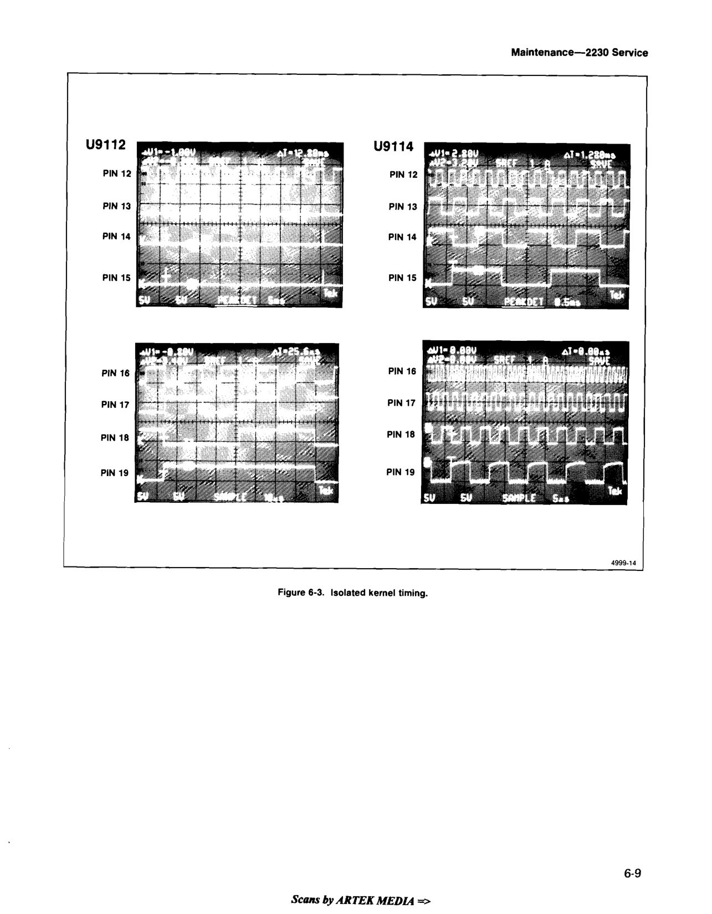


<details><summary>OCR text on this page</summary>

```
Maintenance-2230 
Service 
U9112 
U9114 
PIN 12 
PIN 12 
PIN 13 
PIN 13 
PIN 14 
PIN 14 
PIN 15 
PIN 15 
PIN 16 
PIN 16 
PIN 17 
PIN 17 
PIN 18 
PIN 18 
PIN 19 
PIN 19 
4999-1 4 
Figure 6-3. Isolated kernel timing. 
Scans by ARTEK MEDL4 =>
```

</details>


---

## Page 172 of 451

8.1 ol 0 . I - 
I 
ZSL.P ol LZZ'P 
I 
001.S ol 16S.P 
I 
A 0 
I 
A 0 
I 
06S.P ol BPL.8 
1 
s* Z'O 
8 ' 1 Ol 0'1- 
8'1 Ol 0'1- 
8' 1 O l 0' 1 - 
Z 19'0 Ol OOZ'O - 
80 1' 1 Ol OS8.0- 
A 0 
A 0 
00 L'S Ol 16S'P 
8 ' 1 Ol 0'1- 
60S'Z Ol 89s' 1 
S LL'Z 0 1 60 1' 1 
A 0 
A 0 
001's O l 16S'P 
Z'8 ol 8'1 
I 
ZSL'P ol LZZ'P 
1 
00l'S ol 16S.P 
I 
A 0 
I 
A S 
I 
06S'P ol EPL'B 
I 
s* OZ 
00 L'S ol BSL'P 
9ZZ'P ol LPS'B 
Z.8 ol 8.1 
I 
60S.Z ol 8PS.l 
1 
S1L.Z ol 601.1 
1 
A 0 
I 
A S 
1 
00L.S ol 16S'P 
I 
SIJJ Z'O 
00 1's Ol 16S'P 
00 L'S Ol 16S'P 
Z'8 0 1 8' 1 
Z'8 Ol 8' 1 
2'8 ol 8 ' 1 
I 
9 ~ S . 8 ol OLS'Z 
1 
00l'S ol 16S'P 
I 
A 0 
I 
A S 
I 
OS1'1 ol OSZ'O- 
I 
sIJJ S'O 
A 0 
A 0 
LPG' 1 ol 8 19'0 
Z 19'0 Ol OOZ'O - 
O'S Ol Z'8 
1 
Z 19'0 Ol OOZ'O- 
1 
80 1'1 O l OS8'0- 
I 
A S 
1 
A 0 
1 
00 L'S Ol 16S'P 
I 
SIJJ 0 1 
0's Ol Z'8 
0's Ol 1'8 
S LL'Z ol 60 1' 1 
A S 
A 0 
00 L'S O l 16S'P 
SIJJ OZ 
OOC'S Ol 16S'P 
A S 
A 0 
OS 1' 1 O l OSZ'O- 
SIJJ OS 
A 0 
A 0 
00 1's Ol 16S'P 
80 1' 1 Ol OSB'O - 
0.S ol Z'E 
I 
9PS.8 ol O1S.Z 
I 
06S.P ol ZPL.8 
I 
A S 
1 
A 0 
I 
OOL'S ol 16S.P 
I 
s Z'O 
9ZZ'P 0 1 LPS'B 
ZSL'P ol LZZ'P 
O'S Ol Z'8 
1 
9PS.8 Ol OCS'Z 
1 
OOC'S Ol 16S'P 
I 
A S 
I 
A 0 
I 
OOL'S Ol 16S'P 
1 
S S'O 
00 L'S O l 16S'P 
ZPL'E ol9 LL'Z 
A 0 
A 0 
P u!d 
I 
a6atlo~ 
I 
a6etl0~ 
I 
z u!d 
I 
1 u!d 
I 
a6etlo~ 
I 
rad 
S* S0.0 
S* 1'0 
00 L'S Ol 16S'P 
00 L'S Ol 16S'P 
A S 
A S 
A S 
A S 
SLL'Z ol LSL' 1 
00 L'S O l 16S'P 
S* OS 
SIJJ 1'0 
A 0 
A 0 
ZPL'B ol 9 LL'Z 
06S'P ol EPL'B 
SIJJ 1 
SIJJ z


---

## Page 173 of 451

Maintenance-2230 
Service 
5 mV per division 
1 
4.167 to 4.712 
Table 6-5 
Vertical VOLTSIDIV Switch lnterface Voltages 
SWITCH 
50 mV ~ e r 
division 
1 
0 to 2.1 04 
CHI ATN and 
10 mV per division 
20 mV ~ e r 
division 
0.1 V per division 
1 
2.938 to 3.199 
SETTING 
CH2 ATN 
(J6111 pin 2 and 
J6112 pin 2) 
2 mV oer division 
2.104 to 2.340 
3.1 99 to 3.440 
2.502 to 2.702 
1 V oer division 
I 
3.731 to 4.1 67 
0.2 V per division 
- 
0.5 V ~ e r 
division 
2.340 to 2.502 
4.71 2 to 5.000 + 
Table 6-6 
AC GND DC Switch lnterface Voltages 
2 V per division 
5 V per division 
- 
- 
Variable 
SWITCH 
VOLTSIDIV 
POSI'TION 
3.440 to 3.731 
2.702 to 2.938 
OUT OF DETENT 
IN DETENT 
DC 
CHI STAT and 
CH2 STAT 
(J6111 pin 3 and 
561 12 pin 3) 
0 to 2.423 
2.696 to 3.070 
3.623 to 4.457 
TROUBLESHOOTING EQUIPMENT 
The equipment listed in Table 4-1 of this manual, or 
equivalent equipment, may be useful when troubleshooting 
this instrument. 
TROUBLESHOO'rlNG 'TECHNIQUES 
The following procedure is arranged in an order that 
enables checking simple trouble possibilities before requir- 
ing more extensive troubleshooting. The first two steps 
use diagnostic aids inherent in the instrument's operating 
firmware and will locate many circuit faults. The next four 
steps ensure proper control settings, connections, opera- 
tion, and adjustment. If the trouble is not located by these 
checks, the remaining steps will aid in locating the defec- 
tive component. When the defective component is located, 
replace it using the appropriate replacement procedure 
given under "Corrective Maintenance" in this section. 
Before using any test equipment to make measure- 
ments on static-sensitive, current-sensitive, or 
voltage-sensitive components or assemblies, ensure 
that any voltage or current supplied by the test 
equipment does not exceed the limits of the com- 
ponent to be tested. 
1. Power-up Tests 
The instrument performs automatic verification of the 
instrument's Microprocessor, ROM, and RAM (the operat- 
ing kernel) when power is first applied. If all Kernel tests 
pass, a second level of diagnostic tests are performed. 
The Diagnostic tests, when passed, give the user a high 
degree of assurance that the instrument's storage circuitry 
is functioning properly. 
If a diagnostic test fails, the faulty circuitry is identified 
by a message on the crt (if the instrument is able to pro- 
duce a display), and by an LED display. If a failure occurs, 
refer to the "Diagnostics" discussion later in this section 
for definitions of error messages. 
2. Diagnostic Test Routines 
Many of the diagnostic routines may be selected from 
the front panel to further clarify the nature of a suspected 
failure. The desired test is selected using the MENU. The 
Diagnostics are explained in the "Diagnostics" discussion 
later in this section. 
3. Check Control Settings 
Incorrect control settings can give a false indication of 
instrument malfunction. If there is any question about the 
correct function or operation of any control, refer to either 
the "Operating Information" in Section 2 of this manual or 
to the Operators Manual. 
4. Check Associated Equipment 
Before proceeding, ensure that any equipment used 
with the instrument is operating correctly. Verify that input 
signals are properly connected and that the interconnect- 
ing cables are not defective. Check that the ac-power- 
source voltage to all equipment is correct. 
Scon~ 
by ARTEK MEDLQ =>


---

## Page 174 of 451

Maintenance-2230 
Service 
5. Visual Check 
To avoid electrical shock, disconnect the instrument 
from the ac power source before making a visual 
inspection of the internal circuitry. 
Perform a visual inspection. This check may reveal bro- 
ken connections or wires, damaged components, semicon- 
ductors not firmly mounted, damaged circuit boards, or 
other clues to the cause of an instrument malfunction. 
6. Check Instrument Performance and Adjustment 
Check the performance of either those circuits where 
trouble appears to exist or the entire instrument. The 
apparent trouble may be the result of misadjustment. 
Complete performance check and adjustment instructions 
are given in Sections 4 and 5 of this manual. 
7. Isolate Trouble to a Circuit 
To isolate problems to a particular area, use any symp- 
toms noticed to help locate the trouble. Refer to the 
"Diagnostics" discussion in this section as an aid in locat- 
ing a faulty circuit. 
8. Check Power Supplies 
For safety reasons, an isolation transformer must be 
connected whenever troubleshooting is done in the 
Preregulator and Inverter Power Supply sections of 
the instrument. 
When trouble symptoms appear in more that one cir- 
cuit, first check the power supplies; then check the 
affected circuits by taking voltage and waveform readings. 
Check first for the correct output voltage of each individual 
supply. These voltages are measured between the power 
supply test points and ground (see the associated circuit 
board illustration and Table 6-7). 
Voltages levels may be measured either with a DMM or 
with an oscilloscope. Voltage ripple amplitudes must be 
measured using an oscilloscope. Before checking power- 
supply circuitry, set the INTENSITY control to normal 
brightness, the A and B SECIDIV switch to 0.1 ms, the 
HORIZONTAL MODE to B, the ONIOFF READOUT TOG- 
GLE to display the readout, the A TRIGGER Mode to P-P 
AUTO, and set the VERTICAL MODE switch to CH 1. 
When measuring ripple, use a 1X probe having a bay- 
onet ground assembly (see Table 6-7) attached to the 
probe tip to minimize stray pickup. Insert the bayonet 
assembly signal tip into the first test point indicated in 
Table 6-7, and touch the bayonet assembly ground tip to 
the chassis near the test point. The ripple values listed are 
based on a system limited in bandwidth to 30 kHz. Using a 
system with wider bandwidth will result in higher readings. 
Table 6-7 
Power Supply Voltage and Ripple Limits 
If the power-supply voltages and ripple are within the 
ranges listed in Table 6-7, the supply can be assumed to 
be working correctly. If they are outside the range, the 
supply may be either misadjusted or operating incorrectly. 
Use the "Power Supply and CRT Display" subsection in 
the "Adjustment" procedure to adjust the -8.6 V supply. 
Power 
supply 
-8.6 V 
-5.0 V 
+5.0 V 
+8.6 V 
+30 V 
+lo0 V 
A defective component elsewhere in the instrument can 
create the appearance of a power-supply problem and 
may also affect the operation of other circuits. 
9. Check Circuit Board Interconnections 
Test 
Point 
W961 
W9020 
W9068 
W960 
W956 
W954 
After the trouble has been isolated to a particular cir- 
cuit, again check for loose or broken connections, improp- 
erly 
seated 
semiconductors, 
and 
heat-damaged 
components. 
10. Check Voltages and Waveforms 
Reading 
(Volts) 
-8.56 to -8.64 
-4.75 to -5.25 
+5.75 to +5.25 
+8.43 to +8.77 
+29.1 to +30.9 
+97.0 to +103.0 
Often the defective component can be located by 
checking circuit voltages or waveforms. Typical voltages 
are listed on the schematic diagrams. Waveforms indicated 
on the schematic diagrams by hexagonal-outlined numbers 
are shown adjacent to the diagrams. Waveform test points 
are shown on the circuit board illustrations. 
P-P 
Ripple 
(mv) 
(1.5 
(20 
t 2 0 
t 8 
t 30 
t l O O 
Scans by ARTEK MEDU =>


---

## Page 175 of 451

Maintenance-2230 
Service 
NOTE 
Voltages and waveforms indicated on the schematic 
diagrams are not absolute and may vary slightly 
between instruments. To establish operating condi- 
tions similar to those used to obtain these readings, 
see the "Voltage and Waveform Setup Conditions" 
preceding 
the 
waveform 
illustrations 
in 
the 
"Diagrams" section. 
Note the recommended test equipment, front-panel con- 
trol settings, voltage and waveform conditions, and cable- 
connection instructions. Any special control settings 
required to obtain a given waveform are noted under the 
waveform illustration. Changes to the control settings from 
the initial setup, other than those noted, are not required. 
11. Check Individual Components 
To avoid electric shock, always disconnect the 
instrument from the ac power source before remov- 
ing or replacing components. 
The following procedures describe methods of checking 
individual components. Two-lead components that are sol- 
dered in place are most accurately checked by first discon- 
necting one end from the circuit board. This isolates the 
measurement from the effects of the surrounding circuitry. 
See Figure 9-1 for component value identification and 
Figure 9-2 for semiconductor lead configurations. 
C A U T I O N a 
When checking semiconductors, obsente the static- 
sensitivity precautions located at the beginning of 
this section. 
TRANSISTORS. A good check of a transistor is actual 
performance under operating conditions. A transistor can 
most effectively be checked by substituting a known-good 
component. However, be sure that circuit conditions are 
not such that a replacement transistor might also be dam- 
aged. If substitute transistors are not available, use a 
dynamic-type transistor checker for testing. Static-type 
transistor checkers are not recommended, since they do 
not check operation under simulated operating conditions. 
When troubleshooting transistors in the circuit with a 
voltmeter, measure both the emitter-to-base and emitter- 
to-collector voltages to determine whether they are con- 
sistent with normal circuit voltages. Voltages across a 
transistor may vary with the type of device and its circuit 
function. 
Some of these voltages are predictable. The emitter-to- 
base voltage for a conducting silicon transistor will nor- 
mally range from 0.6 V to 0.8 V. The emitter-to-collector 
voltage for a saturated transistor is about 0.2 V. Because 
these values are small, the best way to check them is by 
connecting a sensitive voltmeter across the junction rather 
that comparing two voltages taken with respect to ground. 
If the former method is used, both leads of the voltmeter 
must be isolated from ground. 
If voltage values measured are less that those just 
given, either the device is shorted or no current is flowing 
in the external circuit. If values exceed the emitter-to-base 
values given, either the junction is reverse biased or the 
device is defective. Voltages exceeding those given for 
typical emitter-to-collector values could indicate either a 
nonsaturated device operating normally or a defective 
(open-circuited) transistor. If the device is conducting, volt- 
age will be developed across the resistors in series with it; 
if open, no voltage will be developed across the resistors 
unless current is being supplied by a parallel path. 
C A U T I O N a 
When checking emitter-to-base junctions, do not use 
an ohmmeter range that has a high internal current. 
High current may damage the transistor. Reverse 
biasing the emitter-to-base junction with a high 
current may degrade the current-transfer ratio (Beta) 
of the transistor. 
A transistor emitter-to-base junction also can be 
checked for an open or shorted condition by measuring 
the resistance between terminals with an ohmmeter set to 
a range having a low internal source current, such as the 
R X 1 kn range. The junction resistance should be very 
high in one direction and much lower when the meter 
leads are reversed. 
When troubleshooting a field-effect transistor (FET), the 
voltage across its elements can be checked in the same 
manner as previously described for other transistors. How- 
ever, remember that in the normal depletion mode of 
operation, the gate-to-source junction is reverse biased; in 
the enhanced mode, the junction is forward biased. 
INTEGRATED CIRCUITS. An integrated circuit (IC) can 
be checked with a voltmeter, test oscilloscope, or by direct 
substitution. A good understanding of circuit operation is 
essential when troubleshooting a circuit having IC com- 
ponents. Use care when checking voltages and waveforms 
around the IC so that adjacent leads are not shorted 
together. An IC test clip provides a convenient means of 
clipping a test probe to an IC. 
Scans by ARTEK MEDLA -


---

## Page 176 of 451

Maintenance-2230 Service 
supplies affect all circuits, performance of the entire instru- 
C A U T I O N a 
ment should be checked if work has been done on the 
power supplies or if the power transformer has been 
When checking a diode, do not use an ohmmeter 
replaced. Readjustment of the affected circuitry may be 
scale that has a high internal current. High current 
necessary. Refer to the "Performance Check" and 
may damage a diode. Checks on diodes can be per- 
"Adjustment Procedure," Sections 4 and 5 of this manual 
formed in much the same manner as those on 
and to Table 5-1 (Adjustment affected by repairs). 
transistor emitter-to-base junctions. Do not check 
tunnel diodes or back diodes with an ohmmeter; use 
a dynamic tester, such as the TEKTRONIX 576 
Curve Tracer. 
DIODES. A diode can be checked for either an open or 
a shorted condition by measuring the resistance between 
terminals with an ohmmeter set to a range having a low 
internal source current, such as the R X 1 kQ range. The 
diode resistance should be very high in one direction and 
much lower when the meter leads are reversed. 
Silicon diodes should have 0.6 V to 0.8 V across their 
junctions when conducting; Schottky diodes about 0.2 V 
to 0.4 V. Higher readings indicate that they are either 
reverse biased or defective, depending on polarity. 
RESISTORS. Check resistors with an ohmmeter. Refer 
to the "Replaceable Electrical Parts" list for the tolerances 
of resistors used in this instrument. A resistor normally 
does not require replacement unless its measured value 
varies widely from its specified value and tolerance. 
INDUCTORS. Check for open inductors by checking 
continuity with an ohmmeter. Shorted or partially shorted 
inductors can usually be found by checking the waveform 
response when high-frequency signals are passed through 
the circuit. 
CAPACITORS. A leaky or shorted capacitor can best 
be detected by checking resistance with an ohmmeter set 
to one of the highest ranges. Do not exceed the voltage 
rating of the capacitor. The resistance reading should be 
high after the capacitor is charged to the output voltage of 
the ohmmeter. An open capacitor can be detected 4 t h a 
capacitance meter or by checking whether the capacitor 
passes ac signals. 
12. Repair and Adjust the Circuit 
If any defective parts are located, follow the replace- 
ment procedures given under "Corrective Maintenance" in 
this section. After any electrical component has been 
replaced, the performance of that circuit and any other 
closely related circuit should be checked. Since the power 
DIAGNOS'I'ICS 
Introduction 
A list of the instrument diagnostic tests is shown in 
Table 6-8. The diagnostics are run automatically during 
power-up and/or manually via the menu. The location in 
the menu of each test is shown in Figure 6-4. Only the 
digital storage portion of the instrument is checked. Cir- 
cuitry checked, and/or used by each test is shown in 
Table 6-9. During a normal power-up, only the first error of 
each test is displayed. If the CURSORS SELECT ClIC2 
button is held in during power-up (invoking extended 
DIAGNOSTICS) the first 15 errors from all tests are 
displayed. If the instrument contains the RS-232-C Option, 
an ASCII version of all errors found during power-up is 
sent to the option. In addition to displaying the errors on 
the crt, the errors are also displayed on U4119 (see 
Table 6-10). Timing for the error codes displayed on 
U4119 is shown in Figure 6-5. A list of all possible error 
messages is shown in Table 6-1 1. 
Table 6-8 
Diagnostic Messages and Tests 
MESSAGEa 
POWER-UP 
MENU 
PU : <message> 
X 
MI : <message> 
X 
SYS-ROM-n 
: < message> 
X 
SYS-RAM : <message> 
X 
NIB-RAM : < message> 
X 
ACQ-AB : <message> 
X 
X 
ACQ-MEM : <message> 
X 
X 
PRC : <message> 
X 
X 
HS-ACQ : <message> 
X 
X 
TBD <mg> : <message> 
X 
X 
MM-ACQ : <message> 
X 
X 
XY-ACQ : <message> 
X 
X 
CDT : <message> 
X 
X 
FP-A2D : <message> 
X 
X 
aEach n, message, and rng depend upon the detected failure. 
Scans by ARTEK MEDL4 ..r>


---

## Page 177 of 451

Maintenance-2230 
Service 
Table 6-9 
Circuitry Checked by Each Test and Exerciser 
MI 
1 
KERNEL. U9200, and U9105 
Test 
PU 
SYS-ROM 
SYS-RAM 
Circuitry Checked 
KERNEL = Y4100, U4102, U9104, U9102, U9108, U9101, U9111, U9109, U9110, U9112, U9114, 
U9103, U9107, and U9113 
KERNEL, and 10-BLOCK-DECODING 
= U9105, and U9106 
KERNEL 
NIB-RAM 
1 
KERNEL 
ACQ-AB 
I 
KERNEL. 10-BLOCK-DECODING, U3423. U3424. U3425. U3427. U3428. and U3426 
ACQ-MEM 
PRC 
KERNEL, 10-BLOCK-DECODING, 
U3423, U3424, U3425, U3427, U3428, U3426, U3418, U3419, 
U3421, U3422, U3417, U3416, U3420, and U3422 
KERNEL, 10-BLOCK-DECODING, 
U4115, U4116, U4117, U4123, U4124, U4122, U4114, U4121, 
U4118, and U4119 
KERNEL, 10-BLOCK-DECODING, 
PRC, ACQ-AB, ACQ-MEM, U4104, U4102, U4103, U4125, 
U4114, U4119, U4118, U4126, U4127, U4128, U4227, U4320, U3310, U3306, U3309, U3308, 
U3307, U3313, U3426, U3229, U3230, U3231, U3232, U3234, U3236, U3239, U4104, U3101, 
U3105, U3307, U3104, U3105, and U3308 
TBD 
KERNEL, 10-BLOCK-DECODING, 
HS-ACQ, U4107, U4108, U4109, U4110, U4111, U4112, 
U6106. U4105. U4103. U4127. U4113. and U4114 
CDT 
1 
HS-ACQ. U4230. U4231. U4122. U4232. U4229. U4127. U4120. U4108. U3428. Q4207, Q4203, 
MM-ACQ 
XY-ACQ 
1 
Q4204, (24205, Rs, and Cs 
HS-ACQ 
HS-ACQ 
FP-A2D 
I 
KERNEL. 10-BLOCK-DECODING. 
U6103. U6104. U6106. U6108. U6102. U6101. and R4912 
NMI, U9111, U9109, U9110, U9201, U9202, U9203, U9231, U9232, U9233, U9208, U3310, 
U6301A, U6301 B, U6301 C, U6303, U6304, U6305, U6306, U6307, U6308, U6401A, U6401 B, 
1 
U6401C, U6401D, U6401 E, U6402A, U6402B, U6402C, U6402D, U6403A, and U6403D 
OUT-PORTS 
1 
U3423. U3424, U3425, (U3427 U3428). U3310. U4119. U4113, and U6104 
Scans by ARTEK MEDIA .i>


---

## Page 178 of 451

Maintenance-2230 
Service 
Table 6-10 
U4119 Error Code Display 
L 
U4119 Signal and Pin Number 
Test 
ACQ TESTS 
HS 
TBD 
HSl2 
- 
- 
- - 
I10 7 
0 
- 
1 
1 
1 
FILL 
ACQ MEM 
PRC 
EOR 
AD7 
AD6 
AD5 
AD4 
ADO 
AD1 
AD2 
AD3 
12 
13 
14 
15 
16 
17 
18 
19 
0 
0 
1 
0 
FILL 
ACQ MEM 
PRC 
EOR 
0 
0 
1 
1 
FILL 
ACQ MEM 
PRC 
EOR 
PSI5 
PSI1 0 
I1 00 
1 
0 
0 
0 
FILL 
ACQ MEM 
PRC 
EOR 
PSI2 
0 
1 
0 
0 
FILL 
ACQ MEM 
PRC 
EOR 
0 
1 
0 
1 
FILL 
ACQ MEM 
PRC 
EOR 
0 
1 
1 
0 
FILL 
ACQ MEM 
PRC 
EOR 
- 
- - 
- 
11OOK 1 
1 
- 
0 
1 
1 
FILL 
ACQ MEM 
PRC 
EOR 
I1 K 
I1 OK 
MM ACQ 
I 
1 
1 
0 
0 
FILL 
ACQ MEM 
PRC 
EOR 
1 
0 
0 
1 
Fl LL 
ACQ MEM 
PRC 
EOR 
1 
0 
1 
0 
FILL 
ACQ MEM 
PRC 
EOR 
1 
0 
1 
FILL 
ACQ MEM 
PRC 
EOR 
1 
1 
0 
DELT 
MIN 
PRE 
TIMEOUT 
UNCAL 
UNCAL 
DETRIG 
FPAID 
MI 
ACQ MEM 2 
0 
0 
0 
0 
1 
1 
1 
1 
1 
1 
GND 
DELTA 
0 
TIMEOUT 
POT 
0 
0 
0 
1 
' 0 
STUCK 
NO 
TIMEOUT 
HI 
RESET 
PU 
ACQ AB 
ACQ MEM 1 
PRC 
1
0
 
0 
0 
0 
0 
0 
1 
1 
0 
0 
0 
0 
1 
1 
1 
1 
0 
0 
0 
0 
1 
0 
0 
1 
0 
0 
0 
0 
0 
1 
0 
1 
Scans by ARTEK MEDL4 =r,


---

## Page 179 of 451

Maintenance-2230 
Service 
Table 6-1 1 
Diagnostic Messages 
-- 
Access Group 
Message 
Power-up 
MI : line stuck high 
Menu 
Power-up 
MI : Display controller : TIMEOUT 
MI : Display controller : unable to reset mi 
SYS-ROM-0 
: tactual-check-sum> 
< > <expected-check-sum> 
SYS-ROM-1 
: tactual-check-sum> 
<> <expected-check-sum> 
SYS-RAM : @ taddress> 
NIB-RAM : @ taddress> 
ACQ-AB : read-back tactual> <> <expected> 
(this message may appear more than once) 
--- 
ACQ-MEM : @ taddress> 
PRC : read-back tactual> < > <expected> 
(this message may appear more than once) 
HS-ACQ : latent END-OF-RECORD 
HS-ACQ : acq-mem cntr tmem-actual> 
<> tmem-expected> 
HS-ACQ : prc cprc-actual> < > cprc-expected> 
HS-ACQ : fill @ <fill-address> 
: <fill-actual> 
< > <fill-expected> 
-- 
TBD hsl2 : latent END-OF-RECORD 
TBD hs12 : acq-mem cntr tmem-actual> 
<> tmem-expected> 
TBD hs12 : prc cprc-actual> <> cprc-expected> 
TBD hs12 : fill @ <fill-address> 
: <fill-actual> 
<> <fill-expected> 
Power-up 
Power-up 
Power-up 
Power-up 
Power-up 
1 
PU : ROMIRAMINMI : <hex-value> 
Menu 
Menu 
Menu 
Menu 
Menu 
Menu 
Menu 
Menu 
Power-up 
Menu I 
TBD ps12 : latent END-OF-RECORD 
TBD psI2 : acq-mem cntr cmem-actual> 
< > cmem-expected> 
TBD ps/2 : prc cprc-actual> o 
cprc-expected> 
TBD ps12 : fill @ cfill*ddress> : <fill-actual> 
<> <fill-expected> 
Power-up 
Power-up 
Power-up 
Menu 
Menu 
Menu 
TBD psI5 : latent END-OF-RECORD 
TBD ps/5 : acq-mem cntr tmem-actual> o 
tmem-expected> 
TBD ps15 : prc cprc-actual> o 
cprc-expected> 
TBD ps15 : fill @ <fill-address> 
: <fill-actual> o 
<fill-expected> 
TBD ps/lO : latent END-OF-RECORD 
TBD psll 0 : acq-mem cntr t 
mem-actual> < > tmem-expected> 
TBD ps/lO : prc cprc-actual> o 
cprc-expected> 
TBD ps/lO : fill @ <fill-address> 
: <fill-actual> 
<> <fill-expected> 
TBD 11 0 : latent END-OF-RECORD 
TBD 110 : acq-mem cntr tmem-actual> <> cmem-expected> 
TBD I1 0 : prc cprc-actual> o 
cprc-expected> 
TBD I10 : fill @ <fill-address> 
: <fill-actual> o 
<fill-expected>


---

## Page 180 of 451

Maintenance-2230 Service 
Table 6-11 (cont) 
MM-ACQ : acq-mem cntr tacq-mem-actual> 
< > tacq-mem-expected> 
MM-ACQ : fill @ <fill-address> 
: <fill-actual> o 
<fill-expected> 
Message 
TBD 11 00 : latent END-OF-RECORD 
TBD 11 00 : acq-mem cntr tmem-actual> 
< > tmem-expected> 
TBD 11 00 : prc cprc-actual> o 
cprc-expected> 
TBD I100 : fill @ <fill-address> 
: <fill-actual> o 
<fill-expected> 
TBD I1 k : latent END-OF-RECORD 
TBD 11 k : acq-mem cntr t 
mem-actual> < > t 
mem-expected> 
TBD 11 k : prc cprc-actual> o 
cprc-expected> 
TBD 11 k : fill @ <fill-address> 
: <fill-actual> 
<> <fill-expected> 
TBD 110k : latent END-OF-RECORD 
TBD 110k : acq-mem cntr tmem-actual> <> tmem-expected> 
TBD 110k : prc cprc-actual> 
<> cprc-expected> 
TBD I1 0k : fill @ <fill-address> 
: <fill-actual> o 
<fill-expected> 
TBD 1100k : latent END-OF-RECORD 
TBD 11 00k : acq-mem cntr tmem-actual> 
< > cmem-expected> 
TBD 11 00k : prc cprc-actual> <> cprc-expected> 
TBD 11 00k : fill @ <fill-address> 
: <fill-actual> 
< > <fill-expected> 
MM-ACQ : latent END-OF-RECORD 
M M-ACQ : prc c prc-actual> < > c prc-expected > 
Acess Group 
Power-up 
Power-up 
Power-up 
Power-up 
Power-up 
Power-up 
Power-up 
Menu 
Menu 
Menu 
Menu 
Menu 
Menu 
Power-up 
Scam by ARTEK MEDIA =r> 
Menu 
CDT : TIMED-OUT ctb-mode-reg-pattern> 
CDT : PRE-DETRIG c 
tb-mode-reg-pattern> 
CDT : uncaled : min = cmin-actual> 
CDT : uncaled : delta = <delta-actual> 
Power-up 
1 
Menu 
XY-ACQ : latent END-OF-RECORD 
XY-ACQ : prc cprc-actual> 
< > cprc-expected> 
XY-ACQ : acq-mem cntr tacq-mem-actual, 
<> tacq-mem-expected> 
XY-ACQ : fill @ <fill-address> 
: <fill-actual> 
<> <fill-expected> 
FP-A2D : cursor :a= tactual> b= tactual> 
FP-A2D : gnd = tactual> o 
5 
FP-A2D : TIME OUT


---

## Page 181 of 451

SPECIAL FUNCTIONS 
DIAGNOSTICS 
TESTS 
ROM 
SYS- ROM-0 
S Y S ROM-0 : <message> 
SYS- ROM- 1 
SYS- ROM- 7 : <message> 
RAM 
SYSTEM 
SYS-RAM : <message> 
NIBBLE 
NIBRAM : <message> 
ACQ AB 
ACQAB : <message> 
A C Q MEM 
ACQMEM : <message> 
SYSTEM 
A C Q AB 
ACQAB : <message> 
PRC 
PRC : <message> 
HS- ACQ 
HS-ACQ : <message> 
TED 
TBD <range> : <message> 
MM- ACQ 
MM-ACQ : <message> 
XY-ACQ : <message> 
CDT 
CDT : <message> 
FP- A2D 
FP-A2D : <message> 
OPTION 
ROM 
RAM 
10 
4999-13 
Figure 6-4. Diagnostic Menu. 
Information in Table 6-12 is used to set up the acquisi- 
tions used in diagnostic tests. Start Address and Post 
Record Start data is valid just before ACQENA goes 
TRLIE. Timebase Mode Register, Timebase Divider Regis- 
ter, and Acquisition Mode Register data is valid while 
ACQENA is TRUE, and causes the Timebase Divider to 
divide by the Real Divide Ratio. Record Length is the 
length of the record being acquired. RECCLK Period is the 
time that ACQENA is TRUE before ENDREC goes TRUE. 
Fill Test Start is the first value of the data being acquired. 
Fill Delta (BICNT) is the increment used to select succeed- 
ing data points from the Diagnostic Generator. Effected 
Sweep Speed is the sweep speed used for the acquisition. 
Maintenance-2230 Service 
The following sequence of events occurs during power- 
up: 
Set up temporary interrupt vectors (single task). 
Do the power-up (PU) Kernel tests (each sets a bit in a 
q buffer). 
ROM tests (Send error codes to U4113 and U4119 
once for each detected error). 
RAM tests (Send error codes to U4113 and U4119 
once for each detected error). 
Non maskable interrupt test (Send error codes to 
U4113 and U4119 once for each detected error). 
Initialize system (two tasks: RAM refresh and diagnos- 
tics). 
If the CLIRSORS SELECT C11C2 button is pressed: 
Enable extended error display. 
Enable RS-232-C error reporting. 
If a MenuIDISPLAY ONIOFF button is pressed: 
Enable RS-232-C error reporting. 
Do power-up calibrationldiagnostic routines: 
Rotate ones in control ports (OUT-PORTS). 
Display the Box without maskable interrupt sup- 
port (BOX). 
Run Clock 
Delay Timer calibration routine 
(CAL-CLK-DLY). 
Run 
StorelNonstore 
Position 
Balance 
(CAL-V-POS). 
Start building the power-up fault display. 
Generate text about PU test results found in PU Q 
buffer. 
Do System Diagnostic tests: 
(when a failure is found, one line of text is generated 
for later display). 
Maskable interrupt test (MI). 
Acquisition memory address bus (ACQ mem access). 
Acquisition memory (ACQ MEM). 
Post record counter (PRC). 
High speed acquisition (HS ACQ). 
Time base divider (TBD). 
MinlMax acquisition (MM ACQ). 
X/Y acquisition (XY ACQ). 
Clock delay timer (CDT). 
Front panel AID converter (FP A2D). 
Scans by ARTEK MEDLA *


---

## Page 182 of 451

Maintenance-2230 
Service 
k 
0.7s 
0 . 7 s 
0.7s 
0 . 7 s 4 
k 
0 . 7 s 4 
I 
I 
I 
I 
I 
I 
I 
I 
I ERROR 1 I 
ERROR 2 1 
ERROR 3 1 
. . . . . . I 
I 
FF 
00 
4999-1 5 
Figure 6-5. Error code timing (U4119). 
Table 6-12 
Diagnostic Acquisition Values 
Scans by ARTEK MEDU - 
RECCLK 
Period 
50 ns 
100 ns 
200 ns 
500 ns 
1 ws 
1 6- 
9.1 ws 
90.1 ws 
900.1~s 
9000.1 ws 
100ns 
100 ns 
50 ns 
50 ns 
Test 
HS-ACQ 
TBD 
hs/2 
ps/2 
ps/5 
ps/l 0 
11 0 
/1 00 
TB 
DIV 
REG 
U41 
13 
00 
00 
FC 
FB 
F8 
F5 
ED 
DD 
TB 
MOD 
REG 
U41 
19 
1 E 
1 A 
15 
15 
15 
15 
15 
15 
Fill 
Delta 
(B/ 
CNT) 
1. 
2. 
2. 
5. 
10. 
1 0. 
91. 
133. 
41. 
145. 
199. 
or 
255. 
1. 
or 3. 
n/a 
n/a 
Effected 
SWP 
Speed 
5 WS 
10 ws 
20 ws 
50 ws 
0.1 ms 
0.2-1 ms 
2-10 ms 
0.02-0.1 s 
0.2-1 s 
2-5 s 
ACQ 
MOD 
REG 
U33 
10 
85 
85 
85 
85 
85 
85 
85 
85 
BD 
7 D 
E4 
FC 
00 
00 
15 
15 
REC 
LEN 
260. 
24. 
24. 
24. 
24. 
24. 
24. 
24. 
Real 
DIV 
Ratio 
1. 
2. 
2. 
5. 
10. 
10. 
91. 
901. 
85 
85 
A5 
8C 
8A 
9A 
MM-ACQ 
XY-ACQ 
C DT 
mln 
max 
8. 
8. 
32. 
16. 
4082. 
4082. 
9001. 
90001. 
200. 
2. 
1. 
1. 
16 
16 
8 E 
8 F 
Start 
ADDR 
OF9E 
OFFE 
OFFE 
OFFE 
OFFE 
OFFE 
OFFE 
OFFE 
OFFE 
OFFE 
----------- 
OFFE 
OFFE 
OFFE 
OFFE 
Post 
REC 
Start 
F4F 
FDB 
FDB 
FDB 
FDB 
FDB 
FDB 
FDB 
Fill 
Text 
Start 
OFAO 
0000 
0000 
0000 
0000 
0000 
0000 
0000 
FEB 
FEB 
FD3 
FE3 
001 
001 
0000 
0000 
0000 
0000 
n/a 
n/a


---

## Page 183 of 451

Maintenance-2230 Service 
If there were power-up faults: 
CPU : check MI by enabling MIS (U9136 pin 8) 
Display the power-up faults on U4119. 
Display the power-up faults on the crt without 
maskable interrupt support: 
Until a Menu button is changed. 
Start normal instrument operation. 
Diagnostic Tests 
PU TEST. At power-up, this kernel test does a quick 
check of the instruments dynamic RAM (random access 
memory), ROM (read only memory), and NMI (non 
maskable interrupt) circuitry. If no errors are found, 
additional diagnostic tests are run. 
If errors are found, their code is displayed (at power-up 
before NMI or MI go HI and before other tests are run) 
repeatedly, for approximately 2 sec, on U4113 and U4119 
(see Table 6-13). The instrument also tries to display the 
errors on the crt as a four digit hexadecimal number: 
For example: if ROM U9110, RAM U9232 and RAM 
U9231 fail, the instrument will: 
1. Flash failure codes on U4113 and U4119: 
PIN 1 2 . . .PIN 19 
0100 0010 
1000 0001 
1010 0101 
2. If possible, display error message on the crt (see 
Figure 6-6): 
NOTE 
More than one bad RAM usually means that some- 
thing else is causing the problem. 
MI. The maskable interrupt (MI) diagnostic creates and 
displays a single dark vector display (low resolution). Then 
a INT-RST (U9105 pin 11) is issued followed by a FRAME 
(U9105 pin 10). The MI (INTR at U9111 pin 18) should 
then go TRUE until another INT-RST is generated. All 
other MI sources are tested inherently by normal 
operation. The test sequence is: 
Microprocessor (CPU) : pulse INT-RST LO (U9105 pin 
1 1, U9208 pin 10) 
Generate fault message. 
Pulse FRAME LO (U9105.10, U9208.7) 
Enable MIS 
DSP : set INTR (U9208 pin 8) TRUE 
CPU : if time is too great 
Generate fault messages 
Disable MIS 
CPU : pulse INT-RST LO (U9105 pin 11, U9208 pin 10) 
DSP : set INTR (U9208 pin 6) FALSE 
CPU : check MI by enabling Mls (U9103G pin 8) 
Generate fault messages 
A fault generates one or more of the following error 
messages: 
MI : line stuck high 
MI : Display controller : TIMEOUT 
MI : Display controller : unable to reset mi 
SYS-ROM-n. 
SYS-ROM-n 
checks each ROM by 
calculating and then comparing its checksum to what is 
stored in the ROM. 
If an error is found, the calculated value and the value 
expected are displayed on the crt: 
SYS-ROM-n 
: calculated-value <> expected-value 
DSP : set INTR (U9208 pin 6) FALSE 
Figure 6-6. PU error display. 
Scans by ARTEK MEDLA =>


---

## Page 184 of 451

Maintenance-2230 Service 
Table 6-13 
PU TEST Failure Codes 
Failed 
Part 
ROM 
U9109 (E0000) 
U9110 (E8000) 
RAM 
U9203 
U9202 
U9233 
U9232 
U9201 
U9231 
NMI 
U4113 and U4119 Code 
1 
Crt Failure Code 
0 
0 
1 
XXXX XXXX XXXX xxxl 
0 
1 
0 
0 
O 
~ 
XXXX XXXX XXXX xxl X 
Pins 
Pins 
Pins 
Pins 
12 
13 
14 
15 
19 
18 
17 
16 
xxxx xxxx xxxx x1 XX 
xxxx xxxx xxxx lxxx 
xxxx xxxx xxxl xxxx 
xxxx xxxx xxlx xxxx 
xxxx xxxx x1 XX xxxx 
xxxx xxxx 1 XXX xxxx 
xxxx xxxl xxxx xxxx 
In Binary 
(from Pu q) 
For example, if the calculated value is A4D2 and the 
data for that address is Ox4F the following error message 
value stored in the ROM is 23DA the following error mes- 
is displayed on the crt: 
sage is displayed on the crt: 
SYS-RAM : @ 4000 OF t> 
4F 
SYS-ROM-1 
: A4D2 t> 
23DA 
SYS-RAM. This test checks the system RAM. The test 
writes a OxAA55 into 100 bytes of display memory. It then 
checks the data to make sure that the data has not 
changed. The test is then repeated using Ox55AA. 
NOTE 
Firmware version 01 only displays the address of the 
bad RAM. 
If an error is found, the address (greater than 0 but less 
than 8000) of the error, the actual data found at the 
address, and the data that was expected at that address 
are displayed on the crt: 
SYS-RAM 
: @ taddress> 
tactual data> o 
<expected data> 
For example, if the address of the bad cell is 0x4000, 
the data found at that address is OxOF, and the expected 
NIB-RAM. This test checks the nibble RAM. The test 
procedure and the error message format are the same as 
for SYS-RAM. 
ACQ-AB. 
This test checks the address bus of the 
acquisition memory. Twenty one unique patterns are 
written into the address counters (U3423 U3424 and 
U3425) and read back through the acquisition address 
buffers (U3427 U3428). 
NOTE 
At power-up this test and all others are transient 
and not active at the time of the power-up failure 
messages. 
Push the SELECT CllC2 switch to stop pattern 
changes. The test loops using the pattern for the first 
error found. All patterns used are shown in Table 6-14. 
If an error is found, the value read back and the value 
expected are displayed on the crt: 
ACQ-AB : read-back tactual> t> 
<expected> 
Scans by ARTEK MEDLQ =>


---

## Page 185 of 451

Maintenance-2230 Service 
Table 6-14 
not just the first error. Also, in extended diagnostics mode 
Acquisition Address Bus Test Patterns 
the RS-232-C Option can be used to send the error 
reports to a terminal or computer. This enables analysis of 
0000 0000 0110 
ACQ-MEM. This test checks the acquisition memory 
0000 0000 11 10 
and it's microprocessor interface. 
the data for pattern recognition. For example, if- bit 5 
Binary 
A1 2 
A1 
0000 0000 0010 
Hexadecimal 
(U3424 pin 15) is shorted to ground all patterns where bit 
A 1 
5 should be a one will have a zero in bit position 5 and 
therefore fail. 
002 
0000 0001 1110 
0000 0011 1110 
0000 0111 1110 
0000 1111 1110 
0001 1111 1110 
NOTE 
01 E 
03E 
07E 
OFE 
1 FE 
0011 1111 1110 
0111 1111 1110 
1111 1111 1110 
1111 1111 1100 
1111 1111 1000 
1111 1111 0000 
Software version 01 always claims address 0 is bad 
no matter what errors are actually found. 
3FE 
7FE 
FFE 
FFC 
FF8 
FFO 
Firmware version 01 fills the acquisition memory with a 
ramp and then checks to see if the values are correct. The 
value at each physical-address is the (physical-address- 
0x48000) mod 256. Firmware version 02 fills the acquisi- 
tion memory with a checkerboard pattern of AA55 and 
55AA and checks to see if the values are correct. 
The microprocessor can not reliably write to acquisition 
memory without clobbering the adjacent byte (the 
microprocessor has byte wide memory). Each acquisition- 
memory device is tested separately (U3418 first and then 
U3419. An error message identifying a faulty address 
implies the faulty device via its address. An even address 
value implies that RAM (U3418) or transceiver (U3421) 
may be faulty. An odd address implies U3419 or U3422. 
1111 0000 0000 
~ 
FOO 
NOTE 
1 100 0000 0000 
I 
COO 
1 1 10 0000 0000 
EOO 
Firmware version 01 only displays the address of an 
ACQ-AB : read-back 008 < > OOF 
I 
error. 
1000 0000 0000 
ACQ-MEM 
: even @ <address> 
tactual data> 
<> texpected data> 
800 
If an error is found the address of the error, the actual 
NOTE 
NOTE 
data found at the address, and the data expected at the 
address are displayed on the crt: 
For example, if the value read back is 008 and the 
value expected is OOF the following error message is 
ACQ-MEM 
: odd @ <address> 
tactual data> 
displayed on the crt: 
< > <expected data> 
The outputs of the Record Counters should be about 
The displayed address is offset from 0x40000 
50% duty cycle square waves of 1.1 seconds dura- 
(acq-mem-block) 
and is a 4 digit hexadecimal 
tion. 
number between 0 and 4096. 
If the oscilloscope is operating in extended diagnostics 
For example, if the address of an error is 48008, the 
mode, the error display is expanded to include all errors, 
actual data found at the address is FO, and the expected 
Scans by ARTEK MEDM =>


---

## Page 186 of 451

Maintenance-2230 Service 
data at that address is F4, the following error message is 
displayed on the crt: 
ACQ-MEM : even @ 4008 FO o F4 
PRC. This test checks the Post Record Counter write 
and the B-TRIG read circuitry. Twenty four unique 
patterns are written into the Post Record Counter (U4115 
U4116 and U4117) and read through the B Delay Timer 
(U4123 U4124). 
The B Delay Timer is clocked by a write to the Time 
Base Divider register (U4114 pin 8 through U4107 pin 4), 
the inactive B-GATE (U4121B pin l l ) , and the TRGD 
(U4121 B pin 13) signals. 
Push the SELECT ClIC2 switch to stop pattern 
changes. The test loops using the pattern for the first 
error found. All patterns used are shown in Table 6-15. 
NOTE 
If rec-clk is active unpredictable results occur. 
If an error is found, the value read back and the value 
expected are displayed on the crt: 
PRC : read-back <actual> <> <expected> 
For example, if the value read back is 008 and the 
value expected is OOF the following error message is 
displayed on the crt: 
PRC : read-back 008 < > OOf 
If the oscilloscope is operating in extended diagnostics 
mode, the error display is expanded to include all errors, 
not just the first error. Also, in extended diagnostics mode 
the RS-232-C Option can be used to send the error 
reports to a terminal or computer. This enables analysis of 
the data for pattern recognition. For example, if bit 5 
(U4116 pin 15) is shorted to ground all patterns where bit 
5 should be a one will have a zero in bit position 5 and 
therefore fail. 
HS-ACQ. This test checks the High Speed Acquisition 
using a 260 byte acquisition at the fastest record speed 
(record clock = convert clock = 20 MHz = 50 ns per 
byte) sampling the Diagnostic Code generators. 
Table 6-15 
PRC Test Patterns 
0000 0000 0011 
003 
0000 1111 1111 
1 
OFF 
1111 1111 1111 
I 
FFF 
1111 1111 1110 
I 
FFE 
1111 1111 1100 
1 
FFC 
1111 1111 0000 
I 
FFO 
1111 1110 0000 
I 
FEO 
1111 1100 0000 
1 
FCO 
NOTE 
This is the only test which absolutely origins the fill; 
others only test the slope of the fill. 
Synchronous to NMI the Acquisition Address Counter 
(U3423, U3424, and U3425) is loaded with 0x1000 - 0x96 
(OxOF6A) and the Post Record Counter (U4115, U4116, 
Scans by ARTEK MEDL4 =>


---

## Page 187 of 451

Maintenance-2230 Service 
and U4117) is loaded with OxFFl - 240 + 0x96 (OxF9F). 
multiplexer U4227 select ST0 RDY and pass it through to 
The Time Base Divisor Register (U4113) is set to 0x00, 
U4227 pin 7. Convert clock (CONV) then passes the signal 
the Acquisition Mode Register (U3310) is set to 0x85 and 
through U4228A, U4127C, and U4226B making TRlGD 
the Time Base Mode Register (U4119) is set to OxlE. See 
(U4226B pin 9) HI. TRlGD enables the Post Record 
Table 6-1 2 for more acquisition data. 
Counter to count at RECCLK (CONV clock) rates. 
To start the acquisition a 0x10 is ORed into the Time 
One RECCLK after the Post Record Counter reaches a 
Base Mode Register (U4119), generating ACQENA TRUE 
hexadecimal count of FFO, U4105B creates ENDREC (not 
synchronous to CONV CLK. Two activities are then done 
end of record) LO. When the microprocessor finds 
at the same time: 
ENDREC LO, the values in the Acquisition Memory 
Address Counters (U3423, U3424, and U3425) and the 
Post Record Counter (U4115, U4116, and U4117) are 
1. The microprocessor polls the Memory Address 
analyzed. Then the Acquisition Memory is checked to see 
Buffer bit 16 (U3428 pin 9) (ENDREC) 4000 times before 
if it contains the proper values. 
aborting the second activity. 
If an error is found, one of the following messages is 
2. The acquisition runs asynchronous to the micropro- 
displayed on the crt: 
cessor. 
HS-ACQ : latent END-OF-RECORD 
CONV clock propagates through U4103B, U4125A, and 
HS-ACQ 
: acq-mem 
cntr trnem-actual> 
<> 
U4125B becoming SAVECLK. CONV and SAVECLK pro- 
crnem-expected> 
pagate through U4104B, U3101 A, U3105B, U3105A 
(becoming ACQWRITE), and U3417 to clock the data from 
the swap (Acquisition Buffer Sequencer) registers (U3236 
and U3239) into the Acquisition Memory (U3418 and 
U3419) in 16-bit chunks. The signals from U3417 also 
clock the acquisition Address Counters (U3423, U3424, 
and U3425). 
The microprocessor sets TEST FALSE (U3310) disa- 
bling the DATA IN BUFFER (U3229). A LO TEST causes 
the output of the DIAGNOSTIC CODE GENERATORS 
(U3230 and U3231) to be used instead of the AID CON- 
VERTER data. 
The microprocessor uses the ACQUISITION MODE 
REGISTER (U3310) to tie MAXCLK and MINCLK (U3309 
pin 7 and U3309 pin 9) to EVENCLK and ODDCLK 
(U3101 B pin 8 and U3103B pin 8) respectively through 
U3309. ODDCLK and EVENCLK are 50% duty cycle com- 
plements of each other and have a period of two CONV 
clocks. This means that the MIN REGISTER is latched 
with a test value and 50 ns later the MAX REGISTER is 
latched with a value one greater. After another 25 ns the 
swap (Acquisition BufferlSequencer) registers (U3236, 
U3237, U3238, and U3239) latch a 16-bit word comprised 
of the output of the MIN REGISTER and the MAX 
REGISTER. 
HS-ACQ : prc cprc-actual> 
<> cprc-expected> 
HS-ACQ : fill @ <fill-address> 
: <fill-actual> o 
<fill-expected> 
Where: 
Latent END-OF-RECORD 
means the microproces- 
sor polled for an ENDREC 4000 times and never 
saw one. 
Acq-mem 
cntr means the completion value of the 
Acquisition Memory Counter was not what was 
expected (see Table 6-1 2). 
Prc means the completion value of the Post Record 
Counter 
was 
not 
what 
was 
expected (see 
Table 6-1 2). 
Fill means the fill value at the indicated address was 
not what was expected (see Table 6-12). 
Prc-actual, 
prc-expected, 
mem-actual 
and 
mem-expected are all 3 digit hexadecimal numbers. 
Fill-address 
is a 4 digit hexadecimal number 
representing an offset from 0x48000 (start of 
Acquisition Memory). 
Fill-actual and fill-expected are each 2 digit hexa- 
decimal numbers. 
When the Acquisition Address Counter overflows PRE- 
FULL (U3425 pin 7) goes HI. This in turn makes STO RDY 
TBD. This test checks the Time Base Divider string 
(U4226A pin 5) HI. CALTIMER (from U3310 pin 12) makes 
using nine different Time Base Divider test ranges (rng). 
Scans by AR TEK MEDL4 =>


---

## Page 188 of 451

Maintenance-2230 Service 
An acquisition is run as in HS-ACQ except that U4103B 
Fill testing starts at acq-mem address 0000. The fill is 
selects an input that makes RECCLK a submultiple of 
tested for max (odd) byte minus min (even) byte to give 
CONV clock. As in HS-ACQ, ENDREC is polled and the 
either 255 or 200. 
Post Record Counter and Acquisition Memory completion 
values are checked. Although the acquisition is similar to 
the HS ACQ acquisition, the fill is different (see 
NOTE 
Table 6-1 2). 
The error message values are as in US-ACQ except 
for the fill values. 
NOTE 
See Table 6- 12, (Diagnostic Acquisition Values) for 
If an error is found, one of the following messages is 
specific signals, register values, and terms used in 
displayed on the crt: 
the following discussion. 
MM-ACQ : latent END-OF-RECORD 
If the SELECT CllC2 button is held in while the test is 
MM-ACQ : prc cprc-actual> o 
cprc-expected> 
running, the test loops on the first error. If an error is 
MM-ACQ : acq-mem cntr tacq-mem-actual> 
< > 
detected, one of the following messages is displayed on 
< acq-mem-expected > 
the crt: 
TBD trng> : terror> 
Where: 
Rng is one of the following: 
11 00 
I l k 
11 Ok 
11 OOk 
Error is one of the following: 
latent END-OF-RECORD 
prc cprc-actual> 
< > cprc-expected> 
MM-ACQ 
: fill @ <fill-address> 
: <fill-actual> 
o 
<fill-expected> 
XY-ACQ. This test checks the acquisition circuitry as it 
relates to X-Y. 
NOTE 
This test has no menu entry, however it is run by 
MM-ACQ. 
As in HS-ACQ, an acquisition is performed, ENDREC 
is polled, and the Post Record Counter and Acquisition 
Memory Counter completion values are checked. The fill is 
tested for n, n+l, n+4,n+5, n+8, n+9, ... starting at 
Acquisition Memory address 0000. 
NOTE 
acq-mem cntr t 
mem-actual> < > 
The test and the error message values are as in 
tmem-expected> 
US-ACQ except for the fill values. 
fill @ taddress> : <fill-actual> 
<> 
<fill-expected> 
If an error is found, one of the following messages is 
displayed on the crt: 
MM-ACQ. This test checks the acquisition circuitry as 
it relates to MINIMAX. 
XY-ACQ : latent END-OF-RECORD 
XY-ACQ : prc tprc-actual> < > cprc-expected> 
NOTE 
This test also runs the XY-ACQ test. 
XY-ACQ 
: acq-mem cntr tacq-mem-actual> 
< > 
< acq-mem-expected > 
XY-ACQ : fill @ <fill-address> 
: <fill-actual> 
<> 
RECCLK is set using the Time Base Divider to 11200th 
<fill-expected> 
of the CONV clock. Then an acquisition is performed as in 
HS ACQ, ENDREC is polled, and the Post Record Counter 
and Acquisition Memory Counter completion values are 
CDT. This test checks the Clock Delay Timer. The CDT 
checked. 
(clock delay timer) is a dual-slope integrator used to 
Scans by ARTEK MEDLQ r>


---

## Page 189 of 451

Maintenance-2230 Service 
measure the time between an asynchronous trigger (either 
the A or the B Gate) and the acquisition systems master 
clock. The timer divides the 50 ns convert clock (CONV) 
into 200 time periods. 
The CDT diagnostic checks the Clock Delay Timer cir- 
cuit using two self-triggered acquisitions. Each test 
acquisition is started when the microprocessor sets CAL- 
TIMER (U4247 pin 2) TRUE and TEST (U4228 pin 10) is 
set first LO and then HI. When PREFULL (U4228 pin 2) 
goes HI, U4127 pin 4 goes TRUE causing the charge cycle 
of the CDT (C4201) to start. The discharge cycle begins 
100 to 150 ns later when TRGD goes TRUE forward bias- 
ing Q4203. 
The time that the voltage on C4201 is above the volt- 
age at U4229 pin 2 (set by R4214, R4215 and R4216) dur- 
ing the discharge cycle is proportional to the time 
difference between U4127 pin 4 going HI and TRGD 
(U4226 pin 9) going TRUE. This time is counted by U4230 
(at the CONV clock rate) and U4231B. The MSB of the 
CDT word (bit 8) is shared with BYTEINT (the hardware 
flag signifying that a byte interrupt has occurred). This 
shared bit is read by the microprocessor through U3428 
pin 8. 
If an error is found, one of the following messages is 
displayed on the crt: 
CDT : TIME-OUT ttb-mode-reg-pattern> 
CDT : PRE-DETRIG ttb-mode-reg-pattern> 
CDT : uncaled : min = tmin-actual> 
CDT : uncaled : delta = <delta-actual> 
Where: 
TIME-OUT is caused by not receiving a ENDREC. 
Tb-mode-reg-pattern 
is a 2-digit hexadecimal 
value indicating the pattern used in the Time Base 
Mode Register during the test acquisition. 
PRE-DETRIG is caused by the CDT counter 
overflowing (CNTCLR U4231 pin 6). 
Tb-mode-reg-pattern 
is a 2-digit hexadecimal 
value indicating the pattern used in the Time Base 
Mode Register during the test acquisition. 
Min-actual is the value (85.0 to 115.0) read from 
U4230 + CDT msb (U3428 pin 8) during a test 
- 
acquisition with TEST LO. 
Delta-actual is the value (200 to 210) read from 
U4230 + CDT msb (U3428 pin 8) during a test 
- 
acquisition with TEST HI minus the value of the pre- 
vious min cycle. 
FP-A2D. 
This test checks the front panel AID 
converter circuitry. A conversion is done on three of the 
analog inputs (A CURS, U6106 pin 12, B CURS, U6106 
pin 13, and ground, U6108 pin 5). The algebraic sum of A 
CURS and B CURS are checked. Their sum should be 
between 0x100 and 0x700. Ground is also checked. It 
should be between 0 and 5 front panel AID converter 
counts (5 + 1024 of VREF). 
During 
power-up 
this 
test 
defines 
a 
variable 
(FP-POLLED) 
that controls how the microprocessor 
works with the front panel. If during testing a MI is not 
generated, it is assumed that the front panel will never 
generate a MI and the microprocessor must poll the front 
panel to see when to transfer front-panel data. 
If an error is found one of the following messages is 
displayed on the crt: 
NOTE 
In firmware version 02, the Gnd message should be 
FP-A2D : gnd = tactual> > 5 (greater than only) 
FP-A2D : cursor :a= tactual> & b= tactual> 
FP-A2D : gnd = tactual> o 5 
FP-A2D : TIME-OUT 
Where: 
Actual is a 3-digit hexadecimal number representing 
the result of a front-panel digitization. 
TIME-OUT indicates AID INT FLAG (U6101 D pin 13) 
did not occur within 0x800 polls by the micro- 
processor. 
CAL-AIDS. The instrument calibration aids are used to 
help calibrate the instrument. 
CAL-V-POS. 
This calibration aid is used to calibrate 
the storage position control (see 'Adjustment Procedure"). 
CAL-CLK-DLY. 
Clock Delay Timer (CDT) calibration 
uses a graphic display. The horizontal position of the 
display cross hairs is attached to the min count and the 
vertical position is attached to the delta count (see 
'Adjustment Procedure"). 
NOTE 
Only BOX and OUT-PORTS is run by version 01 
software. 
Scans by ARTEK MEDU =>


---

## Page 190 of 451

Maintenance-2230 
Service 
CAL-PU. Depressing one of the Menu SelectIDISPLAY 
ONIOFF controls during power-up runs four calibration 
routines, BOX, OUT-PORTS, 
CAL-CLK-DLY, 
and the 
Storage Acquisition Offset. Each routine is run until one of 
the menu buttons is again pushed. The BOX and OUT- 
PORTS routines are run at the same time. Each routine is 
used 
to 
adjust 
the 
instrument 
(see 
'Adjustment 
Procedure") except for OUT-PORTS. 
OUT-PORTS 
is 
used to check instrument circuitry (see OUT-PORTS). 
BOX. This exerciser displays a box (rectangle) on the 
crt. Two places in the Menu generate the Box. Gains and 
offsets of the storage display system integrators are set 
using the Box display (see the 'Adjustment Procedure"). 
The Display Controller (U9208) is synchronously stimulated 
(at a multiple of NMI) to display the box not using Mls. 
CIRCLE. A high resolution circle is displayed on the crt 
by this exerciser. This is the only diagnostic that uses all 
10 bits of the display DACs (U9210 and U9220). 
FP-VALUES. Raw internal front-panel data is displayed 
on the crt by this exerciser. Table 6-16 shows the display 
Exercisers 
format, and Table 6-17 shows the bit definitions for the 
display. 
Instrument exercisers are used to aid in the repair of 
the instrument. 
NOTE 
CONFIGURATION. This exerciser lists the ROM part 
Digital data is intensified when a control is changed. 
numbers used in the instrument and the options installed 
All other data is intensified if the data has changed 
in the instrument. 
more than 5 counts since the last display update. 
Table 6-16 
Display Format 
CH 1 
I 
El14 El15 
CHI A l T 
CHI STAT 
CHI PROBE 
Data 
Digital 
Cursors 
Signal Names 
AD DATA 
ISTAT 
SWB1 
SWB2 
(R6101) 
(U6103) 
(U9302) 
(U9301) 
A CURSOR 
B CURSOR 
B DELAY 
A Sweep 
1 
ARES1 
ARES2 
CH 2 
B Sweep 
El64 El65 
CH2 A l T 
CH2 STAT 
CH2 PROBE 
B RES 
I 
B CAPS 
Ground 
1 
GROUND 
Table 6-17 
Display Format Bit Definitions 
- - 
- 
signaqp- 
- 
- 
- 
- 
- 
- 
Displayed Bit Positions 
Names 
1 
SGL SWP 
AC1 
5 
4 
3 
2 
1 
AC2 
CHI SEL 
CH2 SEL 
CHOP 
AD DATA 
AID INT FLAG 
- 
- 
CH2 INV 
T MAG 
PP 
TRL 
SS RST 
XY 
SWBl 
STORE ON 
B ONLY 
HOLD 
ROLL 
HOR MAG 
HOR CAL 
PREIPOST 
Scans by ARTEK MEDLq =s, 
SWB2 
SELECT C1/C2 
MENU ADV 
MEM 2 
MENU 
1 Kl4K 
POSISEL 
MEM 1 
MEM 3


---

## Page 191 of 451

Maintenance-2230 
Service 
OUT-PORTS. 
All microprocessor output ports of the 
instrument are exercised by this exerciser. If entered from 
the menu, rotating the cursor knob selects either a single 
port or all ports at once. If entered from power-up, the 
exerciser is run with the box display. Test patterns used in 
each port are shown in Table 6-1 8 through Table 6-22. 
NOTE 
The ones and zeros patterns are observed using an 
LED dip clip on the registers. The pattern seen on 
Address 
Counters U3423, U3424, and 
U3425 
(U3427 and U3428) will occasionally have other data 
superimposed upon it. 
Table 6-18 
ACQ-MEM 0x48000 
Table 6-19 
ACQ-MODE Ox437BE 
U3310 Pins 
2 
3 
4 
5 
6 
7 
8 
9 
U3427 Pins 
2 3 4 5 6 7 8 9 
0 0 0 x 0 0 0 0 
0 0 1 x 0 0 0 0 
0 1 0 x 0 0 0 0 
1 0 0 x 0 0 0 0 
0 0 0 x 1 0 0 0 
0 0 0 x 0 1 0 0 
0 0 0 x 0 0 1 0 
0 0 0 x 0 0 0 1 
0 0 0 x 0 0 0 0 
0 0 0 x 0 0 0 0 
0 0 0 x 0 0 0 0 
0 0 0 x 0 0 0 0 
Table 6-20 
U3428 Pins 
2 3 4 5 6 7 8 9 
0 0 0 0 x x x x 
0 0 0 0 x x x x 
O O O O x x x x 
0 0 0 0 x x x x 
O O O O x x x x 
O O O O x x x x 
0 0 0 0 x x x x 
O O O O x x x x 
1 0 0 0 x x x x 
0 1 0 0 x x x x 
0 0 1 0 x x x x 
0 0 0 1 x x x x 
U4119 Pins 
2 
3 
4 
5 
6 
7 
8 
9 
0 
0 
0 
0 
0 
0 
0 
0 
0 
0 
0 
1 
1 
0 
0 
0 
0 
0 
1 
0 
0 
1 
0 
0 
0 
1 
0 
0 
0 
0 
1 
0 
1 
0 
0 
0 
0 
0 
0 
1 
0 
0 
0 
0 
0 
0 
0 
0 
0 
0 
0 
1 
1 
0 
0 
0 
Table 6-21 
TB-SWP-RATE 
Ox407EE 
U4113 Pins 
2 
3 
4 
5 
6 
7 
8 
9 
0 
0 
0 
0 
0 
0 
0 
0 
0 
0 
0 
1 
1 
0 
0 
0 
0 
0 
1 
1 
1 
1 
0 
0 
0 
1 
1 
1 
1 
1 
1 
0 
1
1
 1 
1 
1 
1 
1 
1 
0 
0 
0 
0 
0 
0 
0 
0 
0 
0 
0 
1 
1 
0 
0 
0 
Table 6-22 
FP-AID-CTL 
Ox437F6 
U6104 Pins 
Scans by ARTEK MEDL4


---

## Page 192 of 451

Maintenance-2230 
Service 
INPUT-PORTS. This exerciser displays the input data 
Setting the trigger point close to the positive peak tests 
for all microprocessor input ports. An explanation of the 
negative going conversions. 
displayed data is shown in Table 6-23. 
A-TO-D-TESTSISAMPLES. 
This exerciser sets the 
The display is a histogram with a vertical scale of 5 x 
number of acquisitions used to test the AID Converter. 
samples x (codes converted) per division and a horizontal 
scale of 0 to 255 codes across 10 divisions left to right 
(25.5 codes per division). 
Turn the CURSORS control to select the number of 
4096 byte acquisitions (a power of 2 is best) used to test 
the AID Converter (see Ll NEARITY exerciser). 
COM-OPTIONIDEBUG. 
This exerciser is used in 
debuging the communications option. Debug outputs a 
test message and displays any incoming messages (data) 
A-TO-D-TESTSILINEARITY. 
This exerciser tests the 
the crt. 
acquisition AID converter for missing bits. 
Inject a highly linear 11 division vertically centered, (2 x 
4096 x 50) ns duration triangle wave signal into the CH 1 
or X input. Set the trigger so that the oscilloscope triggers 
close to the negative peak. 
If any codes are missing in samples x 4096 acquisi- 
tions a message indicating that there were missing codes 
is displayed (and sent to the communications option if 
operating in extended diagnostics). 
PICTURES. The picture exercisers use line drawings to 
exercise the instruments display system. The Tekbug is a 
line drawing of the Tektronix symbol. The Wizard is a multi 
function display. The gain of the display controller is 
controlled by the CURSORS control. The position of the 
display is controlled by the CH 1 and CH 2 POSITION 
controls. If the VERTICAL POSITION and CURSORS 
controls are not turned for about 5 seconds, the display is 
automatically moved through its gain (CURSORS) and 
POSITION ranges. 
Table 6-23 
Display Format Digit Definitions 
B Delay Timer 
1 
U4123 and U4124 
1 
B-DELAY-TIMER 
1 
12 
Input Port Name 
Acquisition Address Buffer 
- 
- 
Clock Delay Register 
Crt Name 
ACQ-ADDR-BUF 
U Number 
U3427 and U3428 
Scans by ARTEK MEDU => 
Number of 
Bits Displayed 
16 
I 
I 
I 
U4230 
Front Panel Instrument Status 
Front Panel Address Data 
CLK-DELAY-REG 
U6103 
U6102 
8 
FP-INSTAT 
FP-AD-DATA 
8 
8


---

## Page 193 of 451

Maintenance-2230 
Service 
CORRECTIVE MAINTENANCE 
INTRODUCTION 
Special Parts 
In addition to the standard electronic components, 
Corrective maintenance consists of component replace- 
some special parts are used in the instrument. These com- 
ment and instrument repair' This part Of the manual ponents are manufactured or selected by Tektronix, Inc. to 
describes special techniques and procedures required to 
meet specific performance requirements, or are manufac- 
replace components in this instrument. If it is necessary to 
tured for Tektronix, 
in 
accordance with 
our 
ship your 
to a Tektronix 
Center for 
specifications. The various manufacturers can be identified 
repair or service, refer to the "Repackaging" information 
by referring to the "Cross Index-Manufacturer's Code 
in Section 2 of this manual. 
number to Manufacturer" at the beginning of the 
"Replaceable Electrical Parts" list. Most o i the mechanical 
MAINTENANCE PRECAU'TIONS 
parts used in this instrument were manufactured by 
Tektronix, Inc. Order all special parts directly from your 
local Tektronix Field Office or representative. 
To reduce the possibility of personal injury or instru- 
ment damage, observe the following precautions. 
Ordering Parts 
1. Disconnect the instrument from the ac-power source 
before removing or installing components. 
When ordering replacement parts from Tektronix, Inc., 
be sure to include all of the following information: 
2. Verify that the line-rectifier filter capacitors are 
1. Instrument type (include all modification and option 
discharged prior to performing any servicing. 
numbers). 
3. Use care not to interconnect instrument grounds 
2. lnstrument serial number. 
which may be at different potentials (cross grounding). 
3. A description of the part (if electrical, include its full 
4. When soldering on circuit boards or small insulated 
number). 
wires, use only a 15-watt, pencil-type soldering iron. 
4. Tektronix part number. 
OBTAINING REPLACEMENT PARTS 
Most electrical and mechanical parts can be obtained 
through your local Tektronix Field Office or representative. 
However, many of the standard electronic components can 
usually be obtained from a local commercial source. 
Before purchasing or ordering a part from a source other 
than Tektronix, Inc., please check the "Replaceable Elec- 
trical Parts" list for the proper value, rating, tolerance, and 
description. 
Selectable Components 
Several components in the instrument are selectable to 
obtain optimum circuit operation. Value selection of these 
components is done during the initial factory adjustment 
procedure. Usually, further selection is not necessary for 
subsequent adjustments unless a component has been 
changed that affects circuitry for which a selected com- 
ponent has been specifically chosen. 
NOTE 
MAINTENANCE AIDS 
Physical size and shape of a component may affect 
The maintenance aids listed in Table 6-24 include items 
instrument performance, particularly at high frequen- 
required for performing most of the maintenance pro- 
cies. Always use direct-replacement components, 
cedures in this instrument. Equivalent products may be 
unless it is known that a substitute will not degrade 
substituted for those given, provided their characteristics 
instrument performance. 
are similar. 
Scans by ARTEK MEDLQ -


---

## Page 194 of 451

Maintenance-2230 
Service 
Table 6-24 
Maintenance Aids 
Example 
Description 
1. Soldering Iron 
Antex Precision Model C. 
2. Torx Screwdrivers 
Specification 
15 to 25 W. 
Torx tips #T7, #T9, 
#T10, #T15, and #T20. 
Usage 
General soldering and 
unsoldering. 
Assembly and disassembly. 
Tektronix Part Numbers: 
#T7 003-1 293-00 
#T9 003-0965-00 
#TI0 003-081 4-00 
#TI5 003-0966-00 
#T20 003-0866-00 
3. Nutdrivers 
4. Open-end Wrench 
5. Hex Wrenches 
I 
6. Long-nose Pliers 
114 inch, 511 6 inch, 112 
9/16 inch and 112 inch. 
0.050 inch. 111 6 inch. 
7. Diagonal Cutters 
Assembly and disassembly. 
Channel Input and Ext Trig 
BNC Connectors. 
Assembly and disassembly. 
Component removal and 
replacement. 
Component removal and 
redacement. 
Xcelite #8, #lo, #16, 
and #18. 
Tektronix Part Numbers: 
911 6 003-0502-00 
112 
003-0822-00. 
Allen Wrenches. 
Diamalloy Model LN55-3. 
Diamalloy Model M554-3. 
8. Vacuum Solder 
No static charge retention. 
9. Contact Cleaner 
and Lubricant 
10. Pin-Replacement Kit 
I 
Unsoldering static sensitive 
devices and components on 
multilaver boards. 
No-Noise R. 
Switch and pot cleaning and 
lubrication. 
Replace circuit board con- 
Tektronix Part Number 
nector  ins. 
1 
040-0542-00. 
Pace Model PC-10. 
Tektronix Part Number 
006-0442-02. 
13. Isolation 
Transformer 
11. IC-Removal Tool 
12. lsopropyl Alcohol 
14. 1 X Probe 1 
15. Bayonet Ground 
16. LED D~D 
Clip 
Reagent grade. 
Isolate the instrument from 
the ac power source for 
Power supply ripple check. 
Tektronix Part Number 
006-5953-009. 
Removing DIP IC packages. 
Cleaning attenuator and front 
panel assemblies. 
TEKTRONIX P6101A 
Probe (1 X) Part Number 
01 0-61 01 -03. 
Augat T I 14-1. 
2-lsopropanol. 
I Troubleshootinq. 
I 
HP 548A. 
Signal interconnect for power 
supply ripple check. 
Scam by ARTEK MEDL4 => 
Tektronix Part Number 
01 3-0085-00.


---

## Page 195 of 451

Maintenance-2230 Service 
INTERCONNECTIONS 
NOTE 
Interconnections in this instrument are made with pins 
soldered onto the circuit boards. Several types of mating 
connectors are used for the interconnecting pins. The fol- 
lowing information provides the replacement procedures 
for the various type connectors. 
End-Lead Pin Connectors 
Pin connectors used to connect the wires to the inter- 
connect pins are factory assembled. They consist of 
machine-inserted pin connectors mounted in plastic hold- 
ers. If the connectors are faulty, the entire wire assembly 
should be replaced. 
Multipin Connectors 
When pin connectors are grouped together and 
mounted in a plastic holder, they are removed, reinstalled, 
or replaced as a unit. If any individual wire or connector in 
the assembly is faulty, the entire cable assembly should be 
replaced. To provide correct orientation of a multipin con- 
nector, an index arrow is stamped on the circuit board, 
and either a matching arrow is molded into or the numeral 
1 is marked on the plastic housing as a matching index. 
Be sure these index marks are aligned with each other 
when the multipin connector is reinstalled (see Figure 6-1). 
TRANSISTORS AND 
INTEGRATED CIRCUITS 
Transistors and integrated circuits should not be 
replaced unless they are actually defective. If removed 
from their sockets or unsoldered from the circuit board 
during routine maintenance, return them to their original 
board locations. Unnecessary replacement or transposing 
of semiconductor devices may affect the adjustment of the 
instrument. When a semiconductor is replaced, check the 
performance of any circuit that may be affected. 
Any replacement component should be of the original 
type or a direct replacement. Bend transistor leads to fit 
their circuit board holes, and cut the leads to the same 
length as the original component. See Figure 9-2 in the 
"Diagrams" section for lead-configuration illustrations. 
The chassis-mounted power supply transistor is insu- 
lated from the chassis by a heat-transferring mounting 
block. Reinstall the mounting block and bushings when 
replacing these transistors. Use a thin layer of heat- 
transferring compound between the insulating block and 
chassis when reinstalling the block. 
After replacing a power transistor, check that the 
collector is not shorted to the chassis before apply- 
ing power to the instrument. 
To remove socketed dual-in-line packaged (DIP) 
integrated circuits, pull slowly and evenly on both ends of 
the device. Avoid disengaging one end of the integrated 
circuit from the socket before the other, since this may 
damage the pins. 
To remove a soldered DIP IC when it is going to be 
replaced, clip all the leads of the device and remove the 
leads from the circuit board one at a time. If the device 
must be removed intact for possible reinstallation, do not 
heat adjacent conductors consecutively. Apply heat to pins 
at alternate sides and ends of the IC as solder is removed. 
Allow a moment for the circuit board to cool before 
proceeding to the next pin. 
SOLDERING TECHNIQUES 
The reliability and accuracy of this instrument can be 
maintained only if proper soldering techniques are used to 
remove or replace parts. General soldering techniques, 
which apply to maintenance of any precision electronic 
equipment, should be used when working on this instru- 
ment. 
( W A R N I N G ) 
To avoid an electric-shock hazard, observe the fol- 
lowing precautions before attempting any soldering: 
turn the instrument off, disconnect it from the ac 
power source, and wait at least three minutes for 
the line-rectifier filter capacitors to discharge. 
Use rosin-core wire solder containing 63% tin and 37% 
lead. Contact your local Tektronix Field Office or represen- 
tative to obtain the names of approved solder types. 
When soldering on circuits boards or small insulated 
wires, use only a 15-watt, pencil-type soldering iron. A 
higher wattage soldering iron may cause etched circuit 
conductors to separate from the board base material and 
melt the insulation on small wires. Always keep the 
soldering-iron tip properly tinned to ensure best heat 
transfer from the iron tip to the solder joint. Apply only 
enough solder to make a firm joint. After soldering, clean 
the area around the solder connection with an approved 
flux-removing solvent (such as isopropyl alcohol) and allow 
it to air dry. 
Scam by ARTEK M
'
 
=>


---

## Page 196 of 451

Maintenance-2230 
Service 
Circuit boards in this instrument may have many con- 
ductive layers. Conductive paths between the top and bot- 
tom board layers may connect to one or more inner layers. 
If any inner-layer conductive path becomes broken due to 
poor soldering practices, the board becomes unusable and 
must be replaced, Damage of this nature can void the 
instrument warranty. 
Only an experienced maintenance person, proficient 
in the use of vacuum-type desoldering equipment 
should attempt repair of any circuit board in this 
instrument. 
Desoldering parts from multilayer circuit boards is espe- 
cially critical. Many integrated circuits are static sensitive 
and may be damaged by solder extractors that generate 
static charges. Perform work involving static-sensitive 
devices only at a static-free work station while wearing a 
grounded antistatic wrist strap. Use only an antistatic 
vacuum-type solder extractor approved by a Tektronix 
Service Center. 
C A U T I O N a 
Attempts to unsolder, remove, and resolder leads 
from the component side of a circuit board may 
cause damage to the reverse side of the circuit 
board. The following techniques should be used to 
replace a component on a circuit board: 
1. Touch the vacuum desoldering tool to the lead at 
the solder connection. Never place the iron directly on the 
board; doing so may damage the board. 
NOTE 
Some components are difficult to remove from the 
circuit board due to a bend placed in the component 
leads during machine insertion. To make removal of 
machine-inserted components easier, straighten the 
component leads on the reverse side of the circuit 
board. 
2. When removing a multipin component, especially an 
IC, do not heat adjacent pins consecutively. Apply heat to 
the pins at alternate sides and ends of the IC as solder is 
removed. Allow a moment for the circuit board to cool 
before proceeding to the next pin. 
C A U T I O N 
D 
Excessive heat can cause the etched circuit conduc- 
tors to separate from the circuit board. Never allow 
the solder extractor tip to remain at one place on the 
board for more than three seconds. Solder wick, 
spring-actuated or squeeze-bulb solder suckers, and 
heat blocks (for desoldering multipin components) 
must not be used. Damage caused by poor soldering 
techniques can void the instrument warranty. 
3. Bend the leads of the replacement component to fit 
the holes in the circuit board. If the component is replaced 
while the board is installed in the instrument, cut the leads 
so they protrude only a small amount through the reverse 
side of the circuit board. Excess lead length may cause 
shorting to other conductive parts. 
4. Insert the leads into the holes of the board so that 
the replacement component is positioned the same as the 
original component. Most components should be firmly 
seated against the circuit board. 
5. Touch the soldering iron to the connection and apply 
enough solder to make a firm solder joint. Do not move 
the component while the solder hardens. 
6. Cut off any excess lead protruding through the cir- 
cuit board (if not clipped to the correct length in step 3). 
7. Clean the area around the solder connection with an 
approved flux-removing solvent. Be careful not to remove 
any of the printed information from the circuit board. 
REMOVAL AND REPLACEMENT 
INSTRUCTIONS 
The exploded view drawings in the "Replaceable 
Mechanical Parts" list (Section 9) may be helpful during 
the removal and reinstallation of individual subassemblies 
or components. Circuit board and component locations are 
shown in the "Diagrams" section. 
Cabinet 
[WI..I*C) 
To avoid electric shock, disconnect the instrument 
from the ac-power-input source before removing or 
replacing any component or assembly. 
Scam by ARTEK MEDIA =>


---

## Page 197 of 451

Maintenance-2230 Service 
To remove the instrument cabinet, perform the follow- 
extension shaft and the switch shaft. Push down and for- 
ing steps: 
ward until the extension shaft is disengaged and pull the 
shafts straight back through the front panel. 
NOTE 
For instruments with a power-cord securing clamp; 
2. Disconnect the following two connectors from the 
remove the Phillips-head screw holding the power- 
Storage circuit board. 
cord securing clamp before disconnecting the power 
cord. 
a. P2111, a four-wire connector located near the mid- 
dle left edge of the Storage circuit board. 
1. Disconnect the power cord from the instrument. 
b. P2112, a four-wire connector located near the mid- 
dle left edge of the Storage circuit board. 
2 
side 
. Remove two screws, one each from the right-rear 
and bottom front of the cabinet. 
3. Remove three Storage circuit board screws that are 
identified by the etched words "Remove To Lift Board" 
(see Figure 6-7 for the location of the Storage board three 
3. Remove two screws from the rear panel (located on 
each side) and remove it from the instrument. 
4. Lift the Storage circuit board up until the cable of 
4. Remove four screws from the left rear side of the 
P9430 (on the front edge of the Storage circuit board) 
cabinet securing the side panel to the instrument side 
(Iears 
the back Of the 
chassis. 
5. Remove P9430, a six-wire connector from the 
5. Remove the side panel from the instrument. 
Storage circuit board by pulling it toward the front panel. 
6. Pull the front panel and attached chassis forward 
6. Continue to raise up the Storage circuit board to it 
and out of the cabinet. 
standing position ensuring that the Board Latch clears the 
top of the chassis side rail. Place the Board Latch tab in 
the chassis side rail slot. 
NOTE 
To lower the Storage circuit board into the instrument 
To ensure that the cabinet is properly grounded to 
and to reconnect the connectors, perform the reverse of 
the instrument chassis, the screws at the right-rear 
the preceding steps. 
side and the bottom front of the cabinet must be 
tightly secured, 
7. To reinstall the cabinet, perform the reverse of the 
Support Chassis 
preceding steps. Ensure that the cabinet is flush with the 
The support chassis divides the inside of the instrument 
rear of the chassis and that the cabinet and rear-Panel 
into two parts by connecting the center of the rear chassis 
holes are align with the screw holes in the chassis frame. 
and the front chassis together. ~h~ support chassis can 
be removed and reinstalled as follows: 
Storage Circuit Board in Servicing Position 
1. Perform the "Storage Circuit Board in Servicing 
The following procedure describes how to secure the 
Position" removal procedure. 
Storage circuit board into the servicing position to facilitate 
instrument disassembly and reinstallation for individual 
components or subassemblies. 
2. Remove the crt anode lead and High-Voltage Multi- 
plier lead connectors from the anode clip on the Power- 
Supply shield. 
1. Remove the five MEMORY buttons, SELECT 
WAVEFORM button, four ACQUISITION buttons, STORE 
button, and extension shafts from their respective 
3. Remove the anode clip from the Power-Supply 
switches by inserting a small screwdriver between the 
shield through the hole in the support chassis. 
Scans by ARTEK MEDLQ =>


---

## Page 198 of 451

Maintenance-2230 Service 
4. Remove the two recessed screws from the rear 
chassis (located directly above the Z-AXIS connector) 
securing the support chassis. 
2. Perform the "Support Chassis" removal procedure. 
3. Perform the "Side-Chassis Assembly" 
removal 
procedure. 
5. Remove the three screws securing the top attenua- 
tor shield to the support chassis. 
4. Remove the ground clip near the center edge of the 
Storage chassis (towards the instrument). 
6. Slide the front of the support chassis toward the 
center and over the top attenuator shield away from 
underneath the front chassis bracket. 
7. Remove the support chassis from the instrument. 
5. Unsolder the strap from the ground clip near the 
center of the Storage chassis and slide the strap through 
the slot in the chassis when removing the Storage chassis 
from the instrument in step 7. 
To reinstall the support chassis, perform the reverse of 
6. Remove the four circuit board shield screws from 
the preceding steps. 
the Storage circuit board (see Figure 6-7 for location of the 
four circuit board shield screws). Remove the two screws 
located on top of the Storage circuit board last. 
Side-Chassis Assembly 
The Side-Chassis Assembly can be removed and rein- 
stalled as follows: 
7. Remove the Storage chassis from the instrument by 
lifting it up out of the bracket spacer. See Figure 6-7 for 
1. Disconnect the following three connectors from the 
location of the bracket spacer. 
Side-Chassis Assembly. 
a. P4110, a two-wire connector located at the rear of 
8. Disconnect the following eight connectors from the 
the Side-Chassis Assembly. 
inside of the instrument. Note cable color, location, and 
routing for reinstallation reference. 
b. P6423, a four-wire connector located at the rear of 
the Side-Chassis Assembly. 
a. P4210, a four-wire connector located on the Main 
circuit board behind the CH 2 VOLTSIDIV switch. 
c. P9301, a five-wire connector located at the rear of 
the Side-Chassis Assembly. 
b. P4220, a two-wire connector located on the right 
side of the Alternate Sweep circuit board. 
2. Remove two screws and ground clip from the top of 
c. P9010, a nine-wire connector located on the right 
the side chassis and two screws from the bottom of the 
side of the Main circuit board between the Timing and 
side chassis that secures the Side-Chassis Assembly to 
Alternate Sweep circuit boards. 
the instrument. 
d. P9050, a single white-wire connector located 
between the Alternate Sweep circuit board and the 
3. Remove the Side-Chassis Assembly from the 
Power-Supply shield. 
instrument. 
e. P9060, a single black-wire connector located 
between the Alternate Sweep circirit board and the 
To reinstall the Side-Chassis Assembly, perform the 
Power-Supply shield. 
reverse of the preceding steps. 
f. P9210, a seven-wire connector located on the Main 
Board underneath the CRT shield near the delay line. 
Storage Circuit Board 
h. P9320, a four-wire connector located on the front 
The Storage circuit board can be removed and rein- 
edge of the Main circuit board between the Attenuator 
stalled as follows: 
and Position Interface circuit boards. 
1. Perform the "Storage Circuit Board in Servicing 
i. P9410, a seven-wire connector located on the Sweep 
Position" removal procedure. 
Referenced circuit board. 
Scans by ARTEK MEDIA


---

## Page 199 of 451

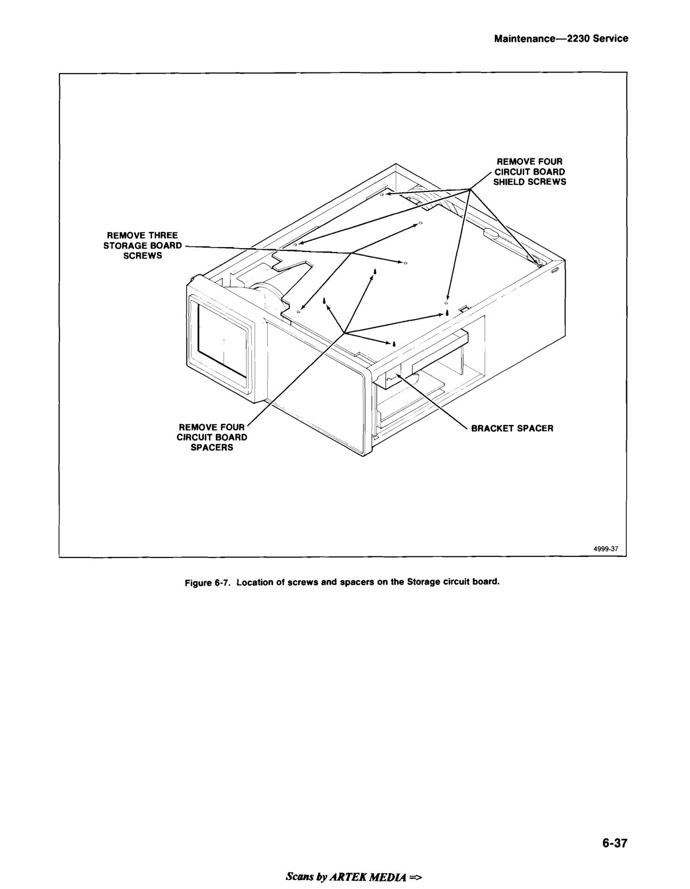


<details><summary>OCR text on this page</summary>

```
Maintenance-2230 
Service 
REMOVE FOUR 
CIRCUIT BOARD 
SHIELD SCREWS 
REMOVE THREE 
STORAGE BOARD 
SCREWS 
REMOVE FOUR 
BRACKETSPACER 
CIRCUIT BOARD 
SPACERS 
4999-37 
Figure 6-7. Location of screws and spacers on the Storage circuit board. 
Scans by ARTEK MEDU *
```

</details>


---

## Page 200 of 451

Maintenance-2230 Service 
9. With one hand firmly holding the InputIOutput and 
Vector Generator circuit board assembly and with the 
other hand use a long-nose pliers on the top side to 
REMOVE RECESSED SCREW 
squeeze and push the four circuit board spacers through 
AND REAR HINGE 
the holes in the Storage circuit board (see Figure 6-7 for 
location of the circuit 
board spacers). Place the 
InputIOutput and Vector Generator circuit board assembly 
inside the ~nstrument temporarily to be reinstalled later. 
10. Release the Board Latch and lower the Storage 
circuit board into the instrument. 
11. D~sconnect the ribbon connector (P6100) from the 
InputIOutput and Vector Generator circuit board assembly. 
12. Remove the Storage circuit board EM1 clip from 
the side chassis rail located behind the front hinge. 
13. Remove both the recessed screw and the chassis 
mounted rear hinge nearest to the Board Latch from the 
instrument (see Figure 6-8 for removal of the chassis 
recessed screw and hinge). 
14. Slide the Storage circuit board back until the front 
and middle hinges separate and lift it out of the instru- 
ment. Ensure that P6100 is free from the Storage circuit 
board and the chassis rail. 
Figure 6-8. Recessed screw and rear hinge removal. 
3. Disconnect the following five connectors from the 
InputIOutput and Vector Generator circuit boards assem- 
bly. Note cable color, location, and routing for reinstallation 
reference. 
a. Disconnect P6410 (ten-wire connector) and P6420 
(nine-wire connector) from the InputIOutput circuit 
board. 
b. Disconnect P6110 (ten-wire connector), P6120 
(nine-wire connector), and P6130 (eight-wire connector) 
from the Vector Generator circuit board. 
NOTE 
When installing the circuit board shield ensure that 
4. Perform step 9 of "Storage Circuit Board" removal 
the black spacer tabs and the circuit board bracket 
procedure and place the Input/Output and Vector Genera- 
are aligned with their respective holes in the shield. 
tor circuit assembly down inside the instrument temporarily 
Also ensure that the strap (unsoldered in step 5) 
for later removal in step 9 of this procedure. 
from the Input/Output circuit board is inserted 
through the circuit board shield slot to be resoldered 
to the ground clip. 
5. Release the Board Latch and lower the Storage cir- 
cuit board into the instrument. 
To reinstall the Storage circuit board, perform the 
reverse of the preceding steps. 
6. Disconnect P6100, a ribbon connector on the 
Storage circuit board from the InputIOutput and Vector 
Generator circuit board assembly. 
InputIOutput and Vector Generator Circuit Boards 
Assembly 
7. Remove the screw from the chassis mounted hinge 
nearest to the Board Latch and separate it from the hinge 
The InputIOutput and Vector Generator circuit boards 
on the Storage circuit board. 
assembly can be removed and reinstalled as follows: 
1. Perform the "Storage Circuit Board in Servicing 
8. Unhinge the Storage circuit board from the chassis 
Position" removal procedure. 
side rail to remove P6100 from the Storage circuit board. 
Set the Storage circuit board down on top of the Power 
Supply shield leaving enough space to lift the InputIOutput 
2. Remove the circuit board shield (see "Storage Cir- 
and Vector Generator circuit boards assembly out of the 
cuit Board" removal procedure steps 4 through 7). 
instrument. 
Scans by ARTEK MEDIA *


---

## Page 201 of 451

Maintenance-2230 
Service 
9. Remove the InputIOutput and Vector Generator cir- 
cuit boards assembly from the inside of the instrument 
(placed inside the instrument in step 4). 
To reinstall the InputIOutput and Vector Generator cir- 
cuit boards assembly, perform the reverse of the preced- 
ing steps. 
Cathode-Ray Tube 
-1 
Use care when handling a crt. Breakage of the crt 
may cause high-velocity scattering of glass frag- 
ments (implosion). Protective clothing and safety 
glasses should be worn. Avoid striking the crt on 
any object which may cause it to crack or implode. 
When storing a crt, either place it in a protective car- 
ton or set it face down on a smooth surface in a 
protected location with a soft mat under the 
faceplate. 
The crt can be removed and reinstalled as follows: 
1. Perform the "Storage Circuit Board in Servicing 
Position" removal procedure. 
2. Perform the "Side-Chassis Assembly" removal pro- 
cedure. 
3. Disconnect four deflection-plate wires at the middle 
of the crt neck and unplug the Trace Rotation connector 
(P9006) from the Front-Panel circuit board (note the con- 
nection locations and wire colors for reinstallation 
reference). 
The crt anode lead and the High-Voltage Multiplier 
output lead retain a high-voltage charge after the 
instrument is turned off. To avoid electrical shock, 
disconnect the High- Voltage Mult@Iier lead from the 
crt anode lead and ground both leads to the main 
instrument chassis. 
4. Unplug the crt anode lead connector from the High- 
Voltage Multiplier lead located between the support 
chassis and the crt shield. Discharge both the anode lead 
connector and the High-Voltage Multiplier lead to chassis 
ground. 
5. Remove two front-panel screws that retain the plas- 
tic crt frame and light filter to the front panel. Remove the 
crt frame and light filter from the instrument. 
6. Remove the crt socket cap from the rear of the crt 
socket. Save the cap for reinstallation. 
7. With the rear of the instrument facing you, place the 
fingers of both hands over the front edge of the front sub- 
panel. Then, using both thumbs, press forward gently on 
the crt funnel near the front of the crt. When the crt base 
pins disengage from the socket, remove the crt and the crt 
shield through the instrument front panel. Place the crt in 
a safe place until it is reinstalled. If the plastic crt corner 
pads fall out, save them for reinstallation. 
NOTE 
When installing the crt into the instrument, reinstall 
any loose plastic crt corner pads that are out of 
place. Ensure all crt pins are straight and that the 
indexing keys on the crt base, socket, and shield are 
aligned. Ensure that the ground clip makes contact 
only with the outside of the crt shield. 
To reinstall the crt, perform the reverse of the preced- 
ing steps. 
Power-Supply Shield 
The Power-Supply shield can be removed and rein- 
stalled as follows: 
1. Turn the instrument over (Main circuit board up) and 
remove the screw from the plastic power-supply cover 
(middle of the Main circuit board). Insert a small pointed 
tool into the hole in the left-rear corner of the rear chassis 
and gently push the power-supply cover tab in. Remove 
the power-supply cover by sliding it out from underneath 
the rear and side chassis. 
2. Remove the screw securing the Power-Supply shield 
to the Main circuit board (located at the bottom of the 
Main circuit board near the middle of the side chassis 
frame). Turn the instrument over again (Storage circuit 
board on top) to continue with the Power-Supply Shield 
removal procedure. 
3. Perform the "Storage Circuit Board in Servicing 
Position" removal procedure. 
4. Perform the "Support Chassis" removal procedure. 
Scans by ARTEK M E N =>


---

## Page 202 of 451

Maintenance-2230 
Service 
5. Remove one pan-head and two recessed screws 
Line Filter Circuit Board and Cover 
securing the Power-Supply shield to the rear chassis 
To remove the Line Filter circuit board and cover, per- 
frame. See Figure 6-9 for the location of the three screws 
form the following steps: 
on the rear chassis frame. 
1. Perform the "Storage Circuit Board in Servicing 
Position" removal procedure. 
6. Remove the screw from the front upper-right hand 
corner of the Power-Supply shield. 
2. Remove the Power-Supply shield (see the "Power- 
Supply Shield" removal procedure). 
7. Lift the Power-Supply shield up and out of the 
chassis frame by removing the right rear corner first. 
3. Remove the two recessed screws that secures the 
Filter circuit board to the rear chassis and lift the Line 
Filter circuit board out and away from the the filter capaci- 
NOTE 
tor. 
To reinstall the Power-Supply shield, ensure that the 
shield is placed in the frame guides on the rear 
chassis above the fuse holder and that the crt 
4. Remove the four wires to the Line Filter circuit 
socket-wire assembly and crt anode lead are prop 
board by unsoldering two wires from the Main circuit 
erly placed in their respective cutouts. 
board, one wire from the line filter, and one wire from the 
fuse holder (pull the protective cap completely off the fuse 
holder before unsoldering). 
To reinstall the Power-Supply shield, perform the 
To reinstall the Line Filter circuit board and cover, per- 
reverse of the preceding steps. 
form the reverse of the preceding steps. 
REMOVE ONE PAN-HEAD AND 
TWO RECESSED SCREWS 
Figure 6-9. Location of screws securing Power-Supply shield and the support bracket to the rear chassis frame. 
Scans by ARTEK MEDL4 =>


---

## Page 203 of 451

Maintenance-2230 Service 
Fan 
The fan can be removed and reinstalled as follows: 
1. Perform the "Storage Circuit Board in Servicing 
Position" removal procedure. 
2. Perform the "Power-Supply Shield" removal pro- 
cedure. 
3. Unsolder the two leads from the fan driver on the 
Main circuit board. 
4. Remove two screws securing the fan to the rear 
chassis and two recessed screws securing the fan driver 
to the side chassis. 
To reinstall the Fan, perform the reverse of the preced- 
ing steps. 
Thermal Shutdown Circuit Board 
1. Perform the "Storage Circuit Board in Servicing 
Position" removal procedure. 
2. Perform 
the 
"Power-Supply 
Shield" 
removal 
procedure. 
3. Perform the "Fan" removal procedure. 
4. Stand the instrument up on its rear chassis (front 
panel up) and use a vacuum-desoldering tool to unsolder 
three pins from the Thermal Shutdown circuit board to the 
Main circuit board (W9070). 
To reinstall the Thermal Shutdown circuit board, per- 
form the reverse of the preceding steps. 
Alternate Sweep Circuit Board 
The Alternate Sweep circuit board can be removed and 
reinstalled as follows: 
1. Perform the "Storage Circuit Board in Servicing 
Position" removal procedure. 
2. Disconnect P4220, a two-wire connector located on 
the right side of the Alternate Sweep circuit board. 
3. Remove the cable strap from the Alternate Sweep 
circuit board that secures the cable harness from the 
Storage circuit board. 
4. Use a vacuum-desoldering tool to unsolder the 27 
Alternate Sweep circuit board pins on the Main circuit 
board (W9400). 
5. Unclip the plastic holder from the Power-Supply 
shield and remove the Alternate Sweep circuit board from 
the instrument. 
To reinstall the Alternate Sweep circuit board, perform 
the reverse of the preceding steps. 
Position lnterface Circuit Board 
The Position lnterface cirsuit board can be removed and 
reinstalled as follows: 
1. Perform the "Storage Circuit Board in Servicing 
Position" removal procedure. 
2. Perform the "Support Chassis" removal procedure. 
3. Disconnect P6113, a four-wire connector from 
InputlOutput 
and 
Vector 
Generator 
circuit 
boards 
assembly. 
4. Turn the instrument on its side and with a vacuum- 
desoldering tool, unsolder the six Position lnterface circuit 
board wire straps from the Main circuit board. 
5. Remove the Position lnterface circuit board from the 
instrument and clean the wire-strap holes on the Main cir- 
cuit board of any remaining solder. 
To reinstall the Position lnterface circuit board, perform 
the reverse of the preceding steps. 
Channel 1 Logic and Channel 2 Logic Circuit 
Boards 
The Channel 1 Logic and Channel 2 Logic Circuit 
Boards can be removed and reinstalled as follows: 
1. Perform the "Storage Circuit Board in Servicing 
Position" removal procedure. 
Scans by ARmK MEDU =>


---

## Page 204 of 451

Maintenance-2230 
Service 
2. Perform the "Support Chassis" removal procedure. 
3. Perform the "Storage Circuit Board in Servicing 
Position" removal procedure. 
3. Remove the remaining six screws that secure the 
top attenuator shield and ground strap (from the Front 
4. Use a 1116-inch hex wrench to loosen the set 
Panel circuit board) to the Attenuator circuit board and 
screws on both the CH 1 and CH 2 VOLTSIDIV Variable 
bottom shield. 
knobs and remove the knobs. 
4. Remove the top attenuator shield from the 
5. Set the CH 1 and CH 2 VOLTSIDIV switches to the 
instrument. 
same position. Note switch positions for reinstallation 
reference; then remove the knobs by pulling them straight 
out from the front panel. 
5. Disconnect the following connectors from the Chan- 
nel 1 Logic and Channel 2 Logic circuit boards, noting their 
locations for reinstallation reference: 
6. Perform the "Support Chassis" removal procedure. 
a. P6111, a three-wire connector from Channel 1 
Logic circuit board. 
7. Remove the remaining six screws that secure the 
top attenuator shield and ground strap (from the Front 
b. P6112, a three-wire connector from Channel 2 
Panel circuit board) to the Attenuator circuit board and 
Logic circuit board. 
bottom shield. 
6. Remove one screw each from the front of the Chan- 
8. Remove the top attenuator 
shield from the 
nel 1 Logic and Channel 2 Logic circuit boards. 
instrument. 
7. Unsolder the two-wire strap from the rear of both 
9. Disconnect the following connectors from the Chan- 
the Channel 1 Logic and Channel 2 Logic circuit boards. 
nel 1 Logic, Channel 2 Logic and Attenuator circuit boards, 
noting their locations for reinstallation reference: 
8. Remove the Channel 1 Logic and Channel 2 Logic 
a. P6111, a three-wire connector from Channel 1 
circuit boards from the instrument. 
Logic circuit board. 
b. P6112, a three-wire connector from Channel 2 
To reinstall the Channel 1 Logic and Channel 2 Logic 
Logic circuit board. 
circuit boards, perform the reverse of the preceding steps. 
c. P9103, a four-wire connector located behind the 
CH 1 VOLTSIDIV switch assembly and underneath the 
Channel 1 Logic circuit board. 
Attenuator, Channel 1 Logic and Channel 2 Logic 
Circuit Boards Assembly 
The Attenuator, Channel 1 and Channel 2 Logic Circuit 
Boards Assembly can be removed and reinstalled as 
follows: 
1. Turn the instrument over (Main circuit board up) and 
remove two screws securing the Attenuator circuit board 
to the BNC bracket (located underneath the CH 1 OR X 
and CH 2 OR Y input connectors). 
d. P9108, a four-wire connector located behind the 
CH 2 VOLTSIDIV switch assembly and underneath the 
Channel 2 Logic circuit board. 
e. P9991, a three-wire connector located between 
CH 1 and CH 2 VOLTSIDIV Variable controls and 
Channel 1 and Channel 2 Logic circuit boards. 
10. Remove the screw from the left rear corner of the 
Attenuator circuit board. 
2. Unsolder the two resistors from the CH 1 OR X and 
NOTE 
CH 2 OR Y input connectors. Turn the instrument over 
The insulator on the left rear corner of the Timing 
again (Storage circuit board on top) to continue with the 
circuit board may be loose. If the insulator is loose, 
Attenuator, Channel 1 and Channel 2 Logic circuit boards 
remove and save it for the reinstallment of the 
assembly procedure. 
Attenuator circuit board. 
Scans by ARmK MEDLA =>


---

## Page 205 of 451

Maintenance-2230 
Service 
11. Pull the Attenuator, Channel 1 Logic and Channel 2 
Logic circuit boards Assembly straight back from the front 
of the instrument until the circuit boards interconnecting 
pins are disengaged and the switch shafts are clear of 
both the Front-Panel circuit board and the two lnput Cou- 
pling switch shafts (located between the front panel and 
the subpanel). Then lift out the entire assembly through 
the top of the instrument. 
12. If removal of Channel 1 Logic and Channel 2 Logic 
circuit boards from the assembly is desired, perform the 
"Channel 1 Logic and Channel 2 Logic Circuit Boards" 
removal procedure steps 6 through 8. 
NOTE 
When reinstalling the Attenuator, Channel 1 and 
Channel 2 Logic circuit boards Assembly, ensure 
that the interconnecting pins are aligned with the 
Front-Panel circuit board connectors and that the 
two resistors (soldered to the bottom of the Attenua- 
tor circuit board) are not touching the Front-Panel 
circuit board. Push the Attenuator circuit board for- 
ward and, at the same time, press the front end of 
the board down slightly. Align the two lnput Coupling 
switch shafts with the front-panel holes by moving 
either the Channel 1 or the Channel 2 lnput Coupling 
switch knob. 
To reinstall the Attenuator, Channel 1 and Channel 2 
Logic circuit boards assembly, perform the reverse of the 
preceding steps. 
Sweep Reference Circuit Board 
The Sweep Reference circuit board can be removed 
and reinstalled as follows: 
1. Perform the "Storage Circuit Board in Servicing 
Position" removal procedure. 
2. Disconnect P9410, an seven-wire connector located 
behind the SECIDIV Variable control on the Sweep Refer- 
ence circuit board. 
3. Disconnect P5201, a three-wire connector located 
on the right side of the Sweep Reference circuit board. 
4. Unsolder the two resistors from the Timing Circuit 
board on the right side of the SECIDIV Variable control. 
5. Remove the shaft extension by loosening the 
setscrew with a 0.50-hex wrench. 
6. Remove the SECIDIV variable control nut with a 
9/16 inch open-end wrench. 
7. Remove the Sweep Reference circuit board. 
To reinstall the Sweep Reference circuit board, perform 
the reverse of the preceding steps. 
Timing, Sweep Interface, and Sweep Reference 
Circuit Boards Assembly 
The Timing, Sweep Interface, and Sweep Reference cir- 
cuit boards assembly can be removed and reinstalled as 
follows: 
1. Perform the "Storage Circuit Board in Servicing 
Position" removal procedure. 
2. Use a 1116-inch hex wrench to loosen the set screw 
of the SECIDIV Variable knob. Remove the SECIDIV Vari- 
able knob. 
3. Set both A and B SECIDIV knobs to the EXT CLK 
position. Use a 1116-inch hex wrench to loosen the two 
set screws that secure the A and B SECIDIV knob; pull off 
the knob from the shaft assembly. 
4. Use a 1116-inch hex wrench to loosen two set 
screws securing the A SECIDIV dial to the shaft assembly. 
Remove the dial from the shaft. 
5. Disconnect the following connectors from the 
assembly, noting their locations for reinstallation reference: 
a. P9700, a 10-wire connector located on the right 
edge of the Timing circuit board. 
b. P9705, an eight-wire connector located at the 
rear of the Timing circuit board. 
c. P6421, an five-wire connector located on the 
Sweep Interface circuit board. 
d. P9410, an seven-wire connector located behind 
the SECIDIV Variable control on the Sweep Reference 
circuit board. 
6. Remove the screw located at the right rear of the 
Attenuator circuit board (securing both the Attenuator and 
the Timing circuit boards to the Bottom shield). 
Scam by ARTEK MEDM


---

## Page 206 of 451

Maintenance-2230 
Service 
7. Remove the three securing screws from the Timing 
circuit board (the screws are located at the right front 
corner, left front side by the SECIDIV switch shaft, and at 
the right rear corner of the circuit board). 
NOTE 
The insulator on the left rear corner of the Timing 
circuit board may be loose. If the insulator is loose, 
remove and save it for the reinstallment of the Tim- 
ing circuit board. 
8. Pull the Timing circuit board straight back from the 
front of the instrument until the circuit board interconnect- 
ing pins are disengaged and the switch shaft is clear of 
the Front-Panel circuit board. 
9. If removal of Sweep Reference circuit board from 
the assembly is desired, perform the "Sweep Reference 
Circuit Board" removal procedure steps 3 through 7. 
NOTE 
Ensure that the Timing circuit board interconnecting 
pins are aligned to the Front-Panel circuit board con- 
nectors before reinstallation. 
To reinstall the Timing, Sweep Interface, and Sweep 
Reference circuit boards assembly, perform the reverse of 
the preceding steps. 
SWEEP INTERFACE CIRCUIT BOARD SEPARATION. 
To remove the Sweep lnterface circuit board from the Tim- 
ing circuit board perform the following steps. 
1. Use a vacuum-desoldering tool to unsolder the 22- 
wire strap W1304 from the Sweep lnterface to the Timing 
circuit board. 
2. Remove the Sweep lnterface circuit board and clean 
the wire-strap holes in the Timing circuit board. 
To reinstall the Sweep lnterface circuit board, perform 
the reverse of the preceding steps. 
Bottom Shield, Attenuator and Timing Circuit 
Boards Assembly 
The Bottom Shield, Attenuator, and Timing circuit 
boards assembly can be removed and reinstalled as 
follows: 
1. Place the instrument upside down and remove the 
three screws and one spacer post securing the Bottom 
shield to the Main circuit board. 
2. Perform steps 1 through 9 of the "Attenuator, 
Channel 1 Logic and Channel 2 Logic Circuit Board" 
removal procedure. 
3. Perform steps 2 through 5 of the "Timing, Sweep 
Interface, and Sweep Reference Circuit Boards" removal 
procedure. 
4. Pull the Bottom shield, along with the attached cir- 
cuit boards straight back from the front of the instrument 
until the interconnecting pins on the circuit boards are 
disengaged and the switch shafts are clear of the holes in 
the Front-Panel circuit board; then lift out the entire 
assembly through the top of the instrument. 
5. If accessibility to the bottom of either the Attenuator 
or the Timing circuit board is desired, refer to step 10 of 
the "Attenuator, and Channel 1 and Channel 2 Logic Cir- 
cuit Boards Assembly" removal procedure and to step 7 
of the "Timing, Sweep Interface, and Sweep Reference 
Circuit Boards Assembly" removal procedure. 
To reinstall the Bottom Shield, Attenuator, and Timing 
circuit boards assembly, perform the reverse of the 
preceding steps. 
Front-Panel Circuit Board 
The Front-Panel circuit board can be removed and rein- 
stalled as follows: 
1. Perform the "Storage Circuit Board in Servicing 
Position" removal procedure. 
2. Perform the "Support Chassis" removal procedure. 
3. Perform 
the 
"Cathode-Ray 
Tube" 
removal 
procedure. 
4. Perform the "Bottom shield, Attenuator and Timing 
Circuit Boards Assembly" removal procedure. 
5. Remove the knobs from the following control shafts 
by pulling them straight out from the front panel: 
a. Channel 1 and Channel 2 POSITION. 
b. A/B SWP SEP. 
c. Horizontal POSITION. 
d. B TRIGGER LEVEL. 
Scans by ARTEK MEDIA =>


---

## Page 207 of 451

Maintenance-2230 
Service 
6. Use a 1116-inch hex wrench to loosen the setscrew 
13. Use a vacuum-desoldering tool to unsolder the 45 
of the HF REJECT knob. Remove the HF REJECT knob. 
(W9001) wire straps from the Main circuit board (connect- 
ing to the Front-Panel circuit board). 
7. Use a Ill 6-inch hex wrench to loosen the setscrew 
of the A TRIGGER LEVEL knob. Remove the A TRIGGER 
14. Remove the Front-Panel circuit board from the 
LEVEL knob. 
instrument and clean the wire-strap holes on the Main cir- 
cuit board of any remaining solder. 
8. Unsolder both the resistor to the EXT INPUT center 
To reinstall the Front-Panel circuit board, perform the 
connector and the wire strap to the EXT INPUT ground 
reverse of the preceding steps. 
lug. 
9. Unsolder the two wire straps from VAR HOLDOFF 
Main Circuit Board 
control. 
All components on the Main circuit board are accessible 
either directly or by removing either the Storage circuit 
board, the crt, the ~ottom-shield, ~ttenuator, Timing 
10. ~nsolder the single wire from the PROBE ADJUST 
circuit-boards assembly, and the Power-Supply shield. 
and the 
wires 
the VAR 
Removal of the Main circuit board is required only when it 
control (leading to the Front-Panel circuit board). 
is necessary to replace the circuit board with a new one. 
1 1. Remove the following screws: 
The Main circuit board can be removed and reinstalled 
as follows: 
a. Three screws (and ground strap) securing the 
upper part of the Front-Panel circuit board to the front 
1. Perform the "Storage Circuit Board in Servicing 
panel. 
Position" removal procedure. 
b. Two recessed frame-securing screws at the left- 
rear corner of the chassis frame. 
2. Perform the "Support Chassis" removal procedure. 
c. Two bottom screws securing the Main circuit 
board to the left bottom side of the chassis frame. 
3. Perform the "Side-Chassis Assembly" 
removal 
d. One screw securing the delay line to the chassis 
procedure. 
frame on the left side of the instrument. 
e. Two recessed frame-securing screws at the 
4. Perform step 3 under the "lnput1Output and Vector 
right-front corner. 
Generator Boards Assembly" removal procedure. 
NOTE 
5. Disconnect the three-wire B DELAY TIME POSI- 
At this point, any component on the Front-Panel cir- 
TlON potentiometer connector (P9644) from the Main cir- 
cuit board (located on the right side of the Main circuit 
cuit board may be accessed for removal and replace- 
ment. If circuit board re~lacement is intended. con- 
board). 
tinue with the last two steps 10 and 1 1. 
6. Perform the "Alternate Sweep Circuit Board" remo- 
val procedure. 
12. Pull the left-front frame assembly apart from the 
right-rear frame assembly. 
7. Disconnect the connectors from the Attenuator and 
r 
Timing circuit boards assembly, noting their locations for 
NOTE 
reinstallation reference. 
If a vacuum-desoldering tool is not available, lift each 
strap out of the Main circuit board as the joint is 
8. Remove three screws and one spacer securing the 
heated. 
Bottom shield to the Main circuit board. 
\\ 
Scam by ARTEK MEDL4 =>


---

## Page 208 of 451

Maintenance-2230 Service 
9. Perform 
the 
"Power-Supply 
Shield" 
removal 
procedure. 
10. Unsolder two wires from the Main circuit board to 
the Filter circuit board. 
11. Unsolder the rear-panel EXT Z AXlS connector 
wire from the Main circuit board. 
12. Unsolder the two leads on the Main circuit board 
from the fan driver. 
13. Unsolder the three leads on the chassis mounted 
CR970 from the Main circuit board. 
14. Disconnect P9070, a three-wire connector from the 
Main circuit board to the heat-sink mounted Q9070. 
18. Disconnect the crt anode lead from the High- 
Voltage Multiplier anode lead by carefully pulling the anode 
plug out of the jack. Discharge the plug tip to the chassis. 
19. Unsolder two sets of crt socket wires from the 
Main circuit board, noting wire color and position for rein- 
stallation reference. 
20. Unsolder two sets of delay-line wires from the Main 
circuit board, noting wire color and position for reinstalla- 
tion reference. 
21. Remove three screws securing the Main circuit 
board to the instrument chassis frame (one under the EXT 
Z AXlS connector and two along the left side of the Main 
circuit board). 
22. Use a vacuum-desoldering tool to unsolder the 45 
wire straps (W9001) connecting the Main circuit board to 
the Front-Panel circuit board) from the Main circuit board. 
15. Remove the FOCUS control shaft assembly by pul- 
ling it straight out from the front panel. 
NOTE 
16. Remove 
the 
POWER 
switch extension-shaft 
assembly by first pressing in the POWER button to the 
ON position. Then insert a scribe (or similar tool) into the 
notch between the end of the switch shaft and the end of 
the extension shaft and gently pry the connection apart. 
Push the extension shaft forward, then sideways, to clear 
the switch shaft. Finally, pull the extension shaft back and 
out of the instrument. 
17. Remove two recessed screws securing the power- 
Sqpply transistor heat-sink assembly to the right side of 
the chassis frame. 
( W A R N I N G 1 
The crt anode lead and the output terminal to the 
High- Voltage Multiplier will retain a high- voltage 
charge after the instrument is turned off To avoid 
electrical shock, ground the crt side of the anode 
lead to the main instrument chassis. 
If a vacuum-desoldering tool is not available, lift each 
wire strap out of the Main circuit board as the joint 
is heated. Use care to maintain, as nearly as possi- 
ble, the original shape and spacing of the wire straps 
to facilitate replacing the circuit board. 
23. Push the wire-strap connection end of the Main cir- 
cuit board down until it is clear of all wire strap ends; then 
remove it through the bottom of the instrument frame. 
Ensure that the wire straps are not bent out of place. 
NOTE 
When installing the Main circuit board, ensure that 
the circuit board is in the guides at the rear and right 
side of the frame and that the 45 wire straps of 
W900 1 are inserted into their corresponding holes. 
To reinstall the Main circuit board, perform the reverse 
of the preceding steps. 
Scam by ARTEK MEDLQ =>


---

## Page 209 of 451

Section 7-2230 
Service 
OPTIONS 
This part contains a general description of instrument options available at the time of publication of this manual. Addi- 
tional information about instrument options and option availability can be obtained either by consulting the current Tektronix 
Product Catalog or by contacting your local Tektronix Field Office or representative. 
POWER CORD OPTIONS 
Instruments are shipped with the detachable power-cord configuration ordered by the customer. Descriptive information 
about the international power-cord options is provided in "Preparation for Use" in Section 2. The following list identifies the 
Tektronix part numbers for the available power cords. 
Standard (United States) 
1 61 -01 04-00 
Option A3 (Australian) 
1 61 -01 04-05 
Option A1 (Universal Euro) 
161 -01 04-06 
Option A4 (North American) 
1 61 -01 04-08 
Option A2 (United Kingdom) 
161 -01 04-07 
Option A5 (Switzerland) 
1 61 -01 67-00 
OPTION 33 
Option 33, the Travel Line option, provides impact protection needed for rough industrial and service environments. 
When the instrument is ordered with Option 33, the instrument comes equipped with the Accessory Pouch and the Front 
Panel Cover, front and rear mounted shock absorbing rubber guards, an easy-to-use power cord wrap, and a carrying 
strap. 
OPTION 
INTRODUCTION 
10 AND OPTION 12 
with a Tektronix Standard relating to GPIB Codes, For- 
mats, Conventions and Features. 
Option 10 provides a communications interface and 
additional memory for the instrument. The interface imple- 
Option 12 provides a communications interface and 
mented conforms to the specifications contained in IEEE 
additional memory for the instrument. The interface imple- 
Standard Digital Interface for Programmable Instrumenta- 
mented conforms to RS-232-C specifications. It also com- 
tion (ANSIIIEEE Std 488-1978), commonly referred to as 
plies with a subset of the Tektronix Codes, Formats, Con- 
the General Purpose Interface Bus (GPIB). It also complies 
ventions and Features standard. 
Scam by ARTEK MEDL4 =>


---

## Page 210 of 451

Options-2230 
Service 
Three indicators, displayed on the crt and labeled on 
Set the instrument operation mode. 
the bezel tag, display the condition of the options. A bat- 
tery backed-up CMOS memory and its battery are also 
included in the options. Option commands allow saving 
The main purpose of the communication options is to 
additional SAVE REF waveforms in the memory. 
allow digitized waveform data to be sent and received by 
the instrument. 
The battery used in this device contains lithium. Do 
not expose to heat. Do not short terminals. See ser- 
vice information for complete instructions. 
The communication options allow remote control of 
oscilloscope functions. This remote control is accom- 
plished by messages sent to the instrument via either the 
GPlB (IEEE-488 Standard Bus) or the RS-232-C interface. 
Messages used are defined either in ANSlIlEEE-488-1978 
or in the Tektronix standard on Codes, Formats, Conven- 
tions, and Features. Messages to the option can have one 
of three purposes: 
1. Query the state of the oscilloscope. 
2. Query the results of measurements made. 
STANDARD FUNCTIONS, 
FORMATS, AND FEATURES 
The interface-function repertoire of a GPlB instrument, 
in terms of interface-function subsets, is identified in 
ANSIIIEEE Std 488-1978. The status of subsets applicable 
to this instrument with Option 10 are listed in Table 7-1. 
Both the GPlB interface and the RS-232-C interface 
conform to a Tektronix standard on Codes, Formats, Con- 
ventions, and Features of messages sent over the bus to 
communicate with other instruments equipped with a like 
interface. Specific features implemented in this instrument 
are listed in Table 7-2, and specific formats implemented 
are shown in Table 7-3. 
Table 7-1 
Function Subsets Implemented 
Scons by ARTEK MEDL4 
Other Subsets 
Required 
T6 
None 
SH1 and L3 
AH1 and T6 
T6 
L3 
None 
L3 
None 
None 
Function Subset 
SH1 (Source Handshake) 
AH1 (Acceptor 
Handshake) 
T6 (Talker) 
L3 (Listener) 
SR1 (Service Request) 
R L2 (RemoteILocal) 
PPO (Parallel Poll) 
DC1 (Device Clear) 
DTO (Device Trigger) 
CO (Controller) 
E2 (Drivers) 
States Omitted 
None 
None 
None 
None 
None 
LWLS and 
RWLS 
All 
None 
All 
All 
Capability 
Complete Capability 
Complete Capability 
Basic Talker, Serial Poll, 
Talker Only, Unaddress if 
MLA 
Basic Listener, Listen 
Only, Unaddress if MTA 
Complete Capability 
No Local Lock Out 
No Capability 
Complete Capability 
(Selective Device Clear) 
No Capability 
No Capability 
Three-state 
Other Requirements 
None 
None 
Include [MLA (ACDS)] 
Include [MTA (ACDS)] 
None 
None 
None 
None 
None 
None


---

## Page 211 of 451

Optiona-2230 
Service 
Table 7-2 
Specific Format Choices 
PERFORMANCE CONDITIONS 
Format Parameter 
Format Characters 
Message Terminator 
Measurement Terminator 
Link Data (Arguments) 
Multiple Event Reporting 
lnstrument Identification 
Query 
Set Query 
Device Trigger (DT) 
lnit Command 
TimeIDate Commands 
Stored Setting Commands 
Waveform Transmission 
Return to Local (rtl) 
IEEE 728 
The specifications for the GPIB Option, RS-2324 
Option, and the Memory Option are listed in Table 7-4. All 
other specifications for the instrument (including the per- 
formance conditions) are identical to those specified in 
"Specification" in Section 1 of this manual. 
Choice Made 
Not transmitted; ignored on 
reception. 
Either EOI or LF modes can 
be selected for 
implementation. 
Follows program message-unit 
syntax. 
Used in Listen and Talk. 
Not implemented. 
Descriptors added for all 
options, including GPIB. 
Extended by using other 
commands. 
Not implemented. 
Causes the instrument to 
return to a power-on condition. 
All operating modes will then 
agree with front-panel 
settings. 
Not implemented. 
Not implemented. 
Implemented. 
Asserted when any front-panel 
control attempts to change a 
GPIB-controllable function. 
Compliance not intended. 
OPTIONS SIDE PANEL 
The instrument is supplied with one of three possible 
side panels. The standard side panel (Figure 3-8) includes 
one AUXILIARY connector. The Option 10 side panel (Fig- 
ure 7-1A) includes one AUXILIARY connector, one GPIB 
(IEEE 488-1978) interface port, and one PARAMETERS 
switch. The side panel for Option 12 instruments (Figure 
7-1 B) includes one AUXILIARY connector, one RS-232-C 
interface port (includes one DTE and one DCE connector), 
and one PARAMETERS switch. The Controls, Connectors, 
and lndicators part of this manual contains information on 
the use of the AUXILIARY Connector. Refer to Figure 7-1 
for location of items 46 through 51. 
@ AUXILIARY Connector-Provides 
connections for 
an X-Y Plotter and an External Clock input (see Con- 
. 
. 
trots, Connectors, and Indicators). 
@ GPIB Connector-Provides 
the ANSIIIEEE Std 
488-1978 compatible electrical and mechanical con- 
nection to the GPIB. The connector is only on instru- 
ments with Option 10. The function of each pin of 
the connector is shown in Table 7-5. 
Table 7-3 
Implementation of Specific Features 
Scans by ARTEK MEDU * 
Comments 
To retain the instrument's 
preinitialization setup, the 
controller should store the 
response to a SET query 
before a change is made; 
then return the settings 
afterwards. 
Feature 
Secondary Addressing 
Indicators 
Parameter Selection 
Choice Made 
Not implemented. 
ADDR (addressed), SRQ (service request), and PLOT 
(acquisitions locked out) indicators are included. 
10 position switch. Instrument reinitializes to power-up state 
with exception of issuing power-on service request.


---

## Page 212 of 451

Options-2230 
Service 
Table 7-4 
Option Electrical Characteristics 
Characteristics 
I 
Performance Requirements 
EXTENDED MEMORY 
Power-Down 
Battery Voltage 
Data Retention 
Battery Life 
Power-Down Detection 
Threshold 
Reset Delay 
Memory retained for battery voltages greater than 2.3 V.a 
Memory maintained at least 6 months without instrument power.a 
Powerdown data retention specification shall be maintained for 3 
years without battery ~hange.~ 
Fail asserted for supply drop to less than 4.75 V.a 
Reset held until supply is greater than 5.0 V.a 
Power-down interrupt to reset delay 2 1 m
~
.
~
 
GPlB OPTION 
a Performance Requirement not checked in manual. 
GPlB Requirements 
RS-232-C Requirements 
Baud Rates 
Available Rates 
Accuracy 
(A) GPlB SIDE PANEL. 
(6) RS-232-C SIDE PANEL. 
4989101 
Complies with ANSIIIEEE Standard 488-1978.a 
Complies with EIA Standard RS-232-C.a 
1 10,300,600, 1200,1800, and 2400 baud. 
< 1 O/O error.a 
Figure 7-1. Option 8ide paneir 
RS-2324 OPTION 
Scans by ARTEK MEDLQ =


---

## Page 213 of 451

Options-2230 
Service 
Table 7-5 
GPlB Connector 
Table 7-6 
GPlB PARAMETERS Switch 
Pin 
1 
2 
3 
4 
5 
6 
7 
8 
9 
10 
11 
12 
13 
14 
15 
16 
17 
18 
19 
20 
21 
22 
23 
24 
@ Gpls PARAMETER Switch-AIIows 
the selection of 
'swkhea 9 and 10 -16 
printenploner device. at W W ~ ~ - U P . 
The devices may be changed after power-up uring Option 
setup Options 
the GPIB interface' The switch is 
commandr, or by uring the MENU. Two EPSON(tm) format8 are 
read at powermup and when interface 'Iear 
relectable. EPS7 urea reven print wirer per head parr, and is 
sages are received. Five sections of the switch 
urually slower. It Ir the chn(27) L. mode. EPSB urea eight 
select the GPlB address, one selects the terminator, 
print wlrer per head parr, and Is urually the faster print-head 
two select talkllisten modes, and two are used for 
aped. It ir the chrS(27) .Y. mode. in this mode moat Epron 
printerlplotter selection. The function of each switch 
and Epron-compatible printerr will not rMke any print wire 
section is shown in Table 7-6. 
more otten than every second pixel. EPSB ir relected when 
parity ir dlrabled. Device8 are rdected wlth the following 
rwltch porltionr: 
Switch 
Section 
1 
2 
3 
4 
5 
6 
7 
8 
9 
10 
@ RS-2324 PARAMETER Switch-Allows 
the selec- 
Switch 9 
Switch 10 
Device Selected 
tion of setup options for the RS-232-C interface. The 
switches are read at power-up and when interface 
0 
0 
HP-GLe plotter 
clear messages are received. Four sections of the 
1 
0 
[EPS7] or EPS8 
switch select the baud rate, three select parity, one 
0 
1 
ThinkJeP printer 
selects the terminator, and two are for printerlplotter 
selection. The function of each switch section is 
e HP-QL and ThinkJet are trademark8 of Hewlen - Packard 
shown in Table 7-7. 
Company. Epron Ir a trademark of Epron Corporation. 
Line Name 
Dl01 
Dl02 
Dl03 
Dl04 
EOI 
DAV 
NRFD 
NDAC 
IFC 
SRQ 
ATN 
SHIELD 
Dl05 
Dl06 
Dl07 
Dl08 
REN 
GND 
GND 
GND 
GND 
GND 
GND 
GND 
Scans by ARTEK MEDL4 = 
Switch 
Position 
0 
1 
0 
1 
0 
1 
0 
1 
0 
1 
0 
1 
0 
1 
0 
1 
Description 
IEEE-488 Data 110 
IEEE-488 Data 110 
iEEE-488 Data 110 
IEEE-488 Data 110 
iEEE-488 END or Identify 
IEEE-488 Handshake 
IEEE-488 Handshake 
IEEE-488 Handshake 
IEEE-488 Input 
IEEE-488 Output 
IEEE-488 Input 
System Ground (Chassis) 
IEEE-488 Data 110 
IEEE-488 Data 110 
IEEE-488 Data 110 
IEEE-488 Data 110 
IEEE-488 Input 
Digital Ground (DAV) 
Digital Ground (NRFD) 
Digital Ground (NDAC) 
Digital Ground (IFC) 
Digital Ground (SRQ) 
Digital Ground (A'TN) 
Digital Ground (LOGIC) 
Function 
Address selection 
0 
1 
Address selection 
0 
2 
Address selection 
0 
4 
Address selection 
0 
8 
Address selection 
0 
16 
Terminator selection 
EOI 
LF or EOI 
No function 
LON 
No function 
TON 
Printerlplotter selectiona 
Printerlplotter selectiona


---

## Page 214 of 451

Optlonr-2230 
Service 
Table 7-7 
RS-2324 PARAMETERS Switch 
Table 7-8 
Baud Rate 
Switch 
Section 
1 
2 
3 
4 
5 
6 
7 
Parity enable 
Parity error will NOT cause 
SRQ (also selects 8-bit 
character length) 
Parity error WILL cause SRQ 
(also selects 7-bit character 
length) 
Parity selectb 
Paritv selectb 
Switch 
Porition 
-- 
-- 
-- 
-- 
Line terminator selection 
Lines are terminated with 
carriage return (CR) 
Lines are terminated with 
carriage return-line feed 
(CR-LF) 
Printerlplotter selectionC 
Printerlplotter selectionC 
Function 
Baud ratea 
Baud ratea 
Baud rate 
Baud ratea 
Osee Table 7-8 
bSee Table 7-9 
CSwitches 9 and 10 select printerlplotter devices at power-up. 
The devices may be changed after power-up using Option 
commands, or by using the MENU. Two EPSONe formats are 
selectable. EPS7 uses seven print wires per head pass, and is 
usually slower. It is the chrS(27) L9 mode. EPSB uses eight 
print wires per head pass, and is usually the faster print-head 
speed. It is the chrS(27) V mode. In this mode most Epson 
and Epson-compatible printers will not strike any print wire 
more oiten than every second pixel. EPSB is selected when 
parity is disabled. Devices are selected with the following 
switch positions: 
Switch 9 
Switch 10 
Device Selected 
0 
0 
HP-GL@ plotter 
1 
0 
[EPS7] or EPS8 
0 
1 
ThinkJeP printer 
@ HP-GL and ThlnkJet are trademarks of Hewlett - Packard 
Company. Epson Is a trademark of Epson Corporation. 
@ RS-232-C DTE Connector-Provides 
connection 
meeting the EIA RS-232-C standard for data termi- 
Index 
0 
1 
2 
3 
4 
5 
6 
7 
8 
9 
10 
11 
12 
13 
14 
15 
nal eqGpment. The connector is shown in Figure 7- 
1 B. Table 7-10 lists the function of each pin of the 
connector. The connector is only on Option 12 
instruments. 
NOTE 
Switch Porition 
4 3 2 1 
0 0 0 0 
0 0 0 1 
0 0 1 0 
0 0 1 1 
0 1 0 0 
0 1 0 1 
0 1 1 0 
0 1 1 1 
1 0 0 0 
1 0 0 1 
1 0 1 0 
1 0 1 1 
1 1 0 0 
1 1 0 1 
1 1 1 0 
1 1 1 1 
Some controllers use nonstandard connectors and 
pin assignments. Consult your controller operators 
manual for specific interfacing information. 
Baud Rate 
50 
75 
110 
134.5 
150 
300 
600 
1200 
1800 
2000 
2400 
3600 
4800 
7200 
9600 
Off Line 
@ RS-2324 DCE Connector-Provides 
connection 
meeting the EIA RS-232-2 standard for data com- 
munications equipment. The connector is shown in 
Figure 7-1 B. Table 7-11 lists the function of each pin 
of the connector. The connector is only on Option 12 
instruments. 
NOTE 
Some controllers use nonstandard connectors and 
pin assignments. Consult your ctmtrdler operators 
manual for specific information. 
Scans by AR TEK MEDIA =>


---

## Page 215 of 451

Table 7-9 
Parlty Selectlona 
'Characters are alwaya accepted if possible. An SRQ is sent if the received parity doesn't match the parity selected. 
Parity must be disabled (switch position 5 set to 0) for binary transfers to take place. 
Table 7-10 
RS-2324 DTE Connector 
Comment 
The most significant bit (MSB) is set or cleared so that the number of 1s per 
byte is ODD. 
'The MSB is set or cleared so that the number of 1s per byte is even. 
The MSB is Set. 
The MSB is cleared. 
Index 
0 
1 
2 
3 
Table 7-1 1 
RS-2324 DCE Connector 
Function 
Switch 
Poaition 
6 7 
0 0 
0 1 
1 0 
1 1 
Scans by AR TEK MEDIA 
Parity 
Type 
ODD 
EVEN 
MARK 
SPACE


---

## Page 216 of 451

Options-2230 Service 
INTERFACE STATUS INDICATORS 
Three indicators appear in the crt readout to indicate 
the status of the communications options. The indicators 
are labeled SRQ, ADDR, and PLOT on the crt bezel, and 
appear as intensified lines in the crt under the labels. Refer 
to Figure 7-2 for the location of items 52 through 54. 
@ SRO 
Indicator-Indicates 
the 
communications 
option requires service by the controller. Service 
requests are cleared when the instrument has been 
polled for its status and no further warning or error 
conditions are pending. The communication options 
assert Service Request (SRQ) when powered up. 
@ ADDR 
Indicator-Indicates 
the 
instrument 
is 
addressed to talk or listen on the GPlB o~tion. Indi- 
cates carrier detect on the RS-232-C option. 
@ PLOT 
Indicator-Indicates 
the 
communication 
option is currently sending waveform data over its 
interface and acquisitions are inhibited. 
MENU SELECTED FUNCTIONS 
The following functions are available as part of the 
ADVANCED FUNCTIONS Menu on instruments containing 
the GPlB or RS-232-C options. 
REFERENCE-Allows 
a SAVE REF memory to be 
Erased or Copied. 
ERASE-Selects 
and erases a nonvolatile SAVE 
REF memory. 
COPY-Selects 
and copies one nonvolatile ' SAVE 
REF memory to another SAVE REF memory. 
COMM-Allows 
the selection of parameters for optional 
communications options, when they are present. 
DATA-Selects 
the d a t a d i n g format, source or 
destination of the data, and channel selection for 
data transmissions. 
STOP BITS-Selects 
the number of stop bits for 
RS-2324 data transmissions. 
FLOW-Sends 
the waveform data to a listen only 
device. 
TRAC& ROTATION 
4999-1 02 
Figure 7-2. Interface status indicators. 
Scans by ARTEK MEDLQ *


---

## Page 217 of 451

Options-2230 
Service 
Menus are displayed with as much of the selection path 
visible as possible. This method displays the current loca- 
tion in the menu as well as the available alternatives and 
messages on how to make a selection. 
The COMM Menu: 
The COMM menu resides under the ADVANCED 
FUNCTIONS menu: 
ADVANCED FUNCTIONS 
REFERENCE 
COMM 
ACQ MODE SETUP TREE 
DIAGNOSTICS 
Once COMM is selected, its submenus appear: 
COMM 
DATA 
STOP BlTS (Option 12 only) 
FLOW (Option 12 only) 
If DATA is selected, its functions appear: 
DATA 
ENCDG 
SOURCE 
TARGET 
CHANNEL 
The ENCDG function selects waveform encoding for 
transmission and expected encoding for waveform recep- 
tion. At power-up, the default encoding is binary. Make 
one of three choices from the menu: 
ENCDG 
ASCII 
BINARY 
HEX 
The SOURCE function selects whether one of the 
Reference Memories or the current acquisition is the 
source for waveform transfers. If REF is selected, use the 
Cursor knob to select the actual reference. REF4 is an 
explicit 4K reference: 
SOURCE 
REF 
ACQ 
The TARGET function is nearly identical to the 
SOURCE function. The only difference is that ACQ is not 
a valid TARGET. The TARGET reference is the destination 
for all waveforms sent to the instrument: 
TARGET 
REF 
Like SOURCE, waveform TARGET references are 
selected with the Cursor knob. 
The CHANNEL function selects the channel whose 
waveform is sent. With the exception of XY waveforms, 
only data from one channel is sent at a time, even if both 
channels were acquired in ALT or CHOP Vertical Mode: 
CHANNEL 
CHI 
CH2 
The STOP BlTS function, available ONLY on Option 12 
(RS-232-C), sets the number of stop bits. Use the Cursor 
knob to select. 
The FLOW function, available ONLY on Option 12 (RS- 
232-C), enables or disables Control-SIControl-Q handshak- 
ing. FLOW must be OFF during binary waveform transfers. 
FLOW 
ON 
OFF 
GPlB PARAMETER SELECTION 
Selection of GPlB parameters (primary address, mes- 
sage terminator, and talkllisten mode) can be made at any 
time using the GPlB PARAMETERS switch and Table 7-6. 
Primary Address 
The selected GPlB address establishes both the pri- 
mary talk and listen addresses for the oscilloscope. It can 
be set to any value between 0 and 31, inclusive. 
NOTE 
This instrument has no provisions for secondary 
addressing as defined by ANSI/IEEE Std 488- 1978. 
With an address of 31, the instrument still presents an 
active load but does not respond to nor interfere with any 
bus traffic. This is useful for changing the instrument's 
status without turning off the oscilloscope's power. 
Input End-of-Message Terminator 
The end-of-message terminator can be selected to be 
either the End-or-Identify (EOI) interface signal or the 
Line-Feed (LF) character. 
Scans by ARTEK MEDLQ =>


---

## Page 218 of 451

Options-2230 
Service 
When EOI (normal mode) is selected as the terminator, 
the instrument will: 
Accept only EOI as the end-of-message terminator. 
Assert EOI concurrently with the last byte of a mes- 
sage. 
When LF is selected as the terminator, the instrument 
will: 
Accept either LF or EOI as the end-of-message ter- 
minator. 
Send Carriage Return (CR) followed by LF at the 
end of every message, with EOI asserted con- 
currently with the LF. 
respond to nor interfere with any bus traffic. This is useful 
for changing the instrument's status without turning off the 
oscilloscope's power. 
Use Table 7-7, Table 7-8 and the PARAMETERS 
switch to select the desired baud rate. 
Parity 
The parity parameters selected determine the instru- 
ment response to received parity errors and the parity of 
data sent by the instrument. 
Section 5 of the PARAMETERS switch determines 
whether or not received parity errors will cause an SRQ 
(see Table 7-7). 
TalkIListen Mode 
Sections 6 and 7 of the PARAMETERS switch deter- 
Three talkllisten modes are selectable: 
mine the parity used when transmitting data over the bus. 
ODD, EVEN, MARK, or SPACE are selectable (see 
TALK ONLY mode allows the instrument to send 
Table 7-9). 
data over the GPIB. 
LISTEN ONLY mode permits the instrument to 
Line Terminator 
receive data over the GPIB. 
The line terminator can be selected to be either the car- 
@ TALKILISTEN mode (both TON and LON modes 
riage return (CR) or the CR and LinsFeed (LF) characters. 
selected) allows the instrument to both send and 
receive data over the GPIB. 
When CR (normal mode) is selected as the terminator, 
the instrument will: 
The default mode is TALKILISTEN. 
Accept only CR as the line terminator. 
Send CR as the last byte of a message. 
To select or change the talkllisten mode, select TON 
andlor LON using the GPIB PARAMETERS switch and 
When CR LF is selected as the terminator, the instru- 
Table 7-6. 
ment will: 
RS-232-C PARAMETER SELECTION 
Selection of RS-232-C parameters (baud rate, parity, 
and line terminator) can be made at any time using the 
RS-232-C PARAMETER switch and Table 7-7 through 
Table 7-9. 
Baud Rate 
The selected RS-232-C baud rate establishes the baud 
rate used by the instrument for both sending and receiving 
data. Baud rates selectable are listed in Table 7-9. 
Accept either CR or LF as the line terminator. 
Send Carriage Return (CR) followed by LF at the 
end of every message. 
Section 8 of the PARAMETERS switch determines the 
line terminator. Select the desired line terminator using the 
PARAMETERS switch and Table 7-7. 
MESSAGES AND 
COMMUNICATION PROTOCOL 
Option commands can set the instrument operating 
When OFF LINE is selected as the baud rate, the 
mode, query the results of measurements made, or query 
instrument still presents an active load but does not 
the state of the oscilloscope. The commands are specified 
Scans by ARTEK MEDLA =>


---

## Page 219 of 451

Options-2230 
Service 
in mnemonics that are related to the functions imple- 
mented. For example, the command lNlt initializes instru- 
ment settings to states that would exist if the instrument's 
power was cycled. To further facilitate programming, com- 
mand mnemonics are similar to front-panel control names. 
NOTE 
All measurement results returned by the options 
have the same accuracy as the main instrument. 
Commands 
In other cases, the argument itself requires another 
argument. When a second argument is required, a colon 
must separate the two arguments; e.g., 
ACQuisition REPetitive:SAMple 
WFMpre XINcr:l .OE-3 
Where a header has multiple arguments, the arguments 
(or argument pairs, if the argument has its own argument) 
must be separated by commas; e.g., 
DATa ENCdg:BINary,CHAnnel:CH2 
VMOde? CHI .CHP.ADD 
Commands for this instrument, like those for other 
Tektronix instruments, follow the conventions established 
in a Tektronix Codes and Formats Standard. The com- 
mand words were chosen to be as understandable as pos- 
sible, while still allowing a familiar user to shorten them as 
Default Arguments 
much as necessary, as long as the result is not ambigu- 
Arguments shown within brackets ([argument]) are 
Ous. 'yntax 
is 
standardized 
make the commands 
defaults. In any command that has a default, omitting the 
easier to learn. 
default argument selects the default. Do not confuse 
default arguments with power-up default conditions; the 
power-up defaults may differ from the argument default in 
In the 
lists (Tables 7-13 through 7-24)* 
the same function. The default argument may be sent in 
headers and arguments are listed in a combination of 
any command, Do not send the brackets as part of the 
'ppercase 
and lowercase 
characters. The instrument 
default argument. All commands that do not have a default 
accepts any abbreviated header or argument containing at 
must always include a argument, where one or more 
least the characters shown in uppercase. Any characters 
exists. 
added to the abbreviated (uppercase) version must be 
those shown in lowercase. For a query; the question mark 
must immediately follow the header. For example, any of 
the following formats are acceptable: 
Command Separator 
VMO? 
VMOd? 
VMOde? 
Headers 
A command consists of at least a header. Each com- 
mand has a unique header, which may be all that is 
needed to invoke a command; e.g., 
lNlt 
OPC 
Arguments 
Some commands require the addition of arguments to 
their headers to describe exactly what is to be done. If 
there is more to the command than just the header (includ- 
ing the question mark if it is a query), then the header 
must be followed by at least one space. 
It is possible to put multiple commands into one mes- 
sage by separating the individual commands with a semi- 
colon; e.g., 
DATa ENCdg: BINary,CHAnnel:CH2; WFMpre XINcr: 1 .OE-3 
Command Formatting 
Commands sent to the oscilloscope must have the 
proper format (syntax) to be understood; however, this 
format is flexible in that many variations are acceptable. 
The following paragraphs describe this format and the 
acceptable variations. 
The oscilloscope expects all commands to be encoded 
as either uppercase or lowercase ASCII characters. All 
data output is in uppercase. 
Spaces, Carriage Returns, and Line-Feed characters 
In some cases, the argument is a single word; e.g., 
are all formatting characters that can be used to enhance 
the readability of command sequences. As a general rule, 
REFF REF4 
these characters can be placed either after commas and 
PLOt STArt 
semicolons or after the space that follows a header. 
Scans by ARTEK MEDtA =>


---

## Page 220 of 451

Options-2230 
Service 
Message Terminator 
Table 7-12 
As previously explained, GPlB messages may be ter- 
Numeric Argument Format tor Commands 
minated with either EOI or LF. Some controllers assert 
EOI concurrently with the last data byte; others use only 
the LF character as a terminator. The GPlB interface can 
be set to accept either terminator. With EOI selected, the 
instrument interprets a data byte received with EOI 
asserted as the end of the input message; it also asserts 
EOI concurrently with the last byte of an output message. 
With the LF setting, the instrument interprets the LF char- 
acter without EOI asserted (or any data byte received with 
EOI asserted) as the end of an input message; it transmits 
a Carriage Return character followed by Line Feed (LF 
with EOI asserted) to terminate output messages. 
RS-232-C messages may be terminated with either car- 
riage return (CR) or the CR and Line-Feed (LF) characters. 
The RS-232-C Option can be set to accept either termina- 
tor. With CR selected, the instrument interprets a line end- 
ing in CR as the end of the input message: it also sends 
CR as the last byte of an output message. With the CR 
and LF setting, the instrument interprets either the CR 
character or the LF character as the end of an input mes- 
sage; it transmits a Carriage return character followed by 
a Line Feed to terminate output messages. 
Numeric 
Argument 
Symbol 
t N R l > 
t NR2> 
tNR3> 
Numeric Arguments 
Many commands have numeric arguments. 
The 
numeric arguments are shown in either tNRl>, 
tNR2>, or tNR3> notation. These symbols refer to the 
format of the numeric argument. All values must be 
decimal (base 10). 
Table 7-12 depicts the number formats for numeric 
arguments in the command set. As shown in the table, 
both signed and unsigned numbers are accepted; but 
unsigned numbers are interpreted to be positive. Any com- 
mand or query that has an tNR2> argument may have 
that argument sent to the the instrument in either 
tNR2> or t N R l > format. Likewise, an tNR3> argu- 
ment may be sent in tNR3>, tNR2> or t N R l > 
format. 
Number 
Format 
Integers 
Explicit decimal 
point (floating 
point) 
Floating point in 
scientific notation 
COMMAND LISTS 
Examples 
+I, 
2, -1, -10 
-3.2, +5.1, 1.2 
+1 .E-2, 1 .OE+2, 
l.E-2, 0.02E+3 
Tables 7-13 through 7-24 describe all commands avail- 
able in the instrument equipped with either the GPlB or 
RS232 Option. Query and Response examples are shown 
in Table 7-25. The first column lists the name (or header) 
of the command. The capitalized letters must be present 
to identify the command, while those shown in lowercase 
are optional. The second column lists arguments that can 
be associated with the command. The third column lists 
arguments associated with the first argument. Finally, 
descriptions of each command and its arguments are con- 
tained in the last column. 
One or more arguments, separated by commas, may be 
given in a query to request only the information wanted. 
For example: CHI? VOLts,COUpling. However, some 
headers in the command tables are Query only, that is, 
they may only be sent as queries; never as commands. 
The queries are listed in the same general format as 
commandlquery headers. The arguments returned by the 
instrument are shown in smaller type. Do not send these 
arguments as part of the Query; they are returnable only. 
For example, AC, DC, or GND are returned in response to 
a CHI? COU. 
Instrument commands are presented in tables divided 
into the following functional groups: 
Table 
7-1 3 
7-1 4 
7-1 5 
7-1 6 
7-1 7 
7-1 8 
7-1 9 
7-20 
7-21 
7-22 
7-23 
7-24 
Command Group 
Vertical Commands 
Horizontal Commands 
Trigger Commands 
Cursors Commands 
Display Commands 
Acquisition Commands 
Save and Recall References Commands 
Waveforms Commands 
Waveform Preamble Fields 
Service Request Group Commands 
Miscellaneous Commands 
RS-2324 Specific Commands 
Page 
- 
7-1 3 
7-1 4 
7-1 5 
7-1 6 
7-1 7 
7-1 8 
7-20 
7-22 
7-23 
7-25 
7-26 
7-26 
Scans by ARTEK MEDLQ =>


---

## Page 221 of 451

Options-2230 
Service 
Table 7-13 
Vertical Commands 
VOLts 
Header 
Query only. Returns all current CHI settings: 
CHI VOL: tNR3>, COU:string;, 
where tNR3> is the voltsldiv setting and string is either AC, 
DC, or GND. 
Argument 
AC 
DC 
GND 
<NR~> 
Query only. Returns the current position of the CHI INPUT 
COUPLING switch: CHI COU:string;, where string is either 
AC, DC, or GND. 
Link 
Argument 
Query only. Returns Channel 1 volts/div reading including 
probe attenuation. For example: 5.OEO is returned when the 
CHI VOLTSIDIV switch is set to 50 mV and a lOOX probe is 
attached. A warning SRQ is generated if the CHI Variable 
knob is not in the calibrated position. 
ON 
OFF 
Description 
Query only. Like CHI?, except includes an INVert query 
response. 
Query only. Returns status of CH2 INVERT switch: CH2 INV: 
string;, where string is either ON or OFF. 
VMOde? 
CHI 
CH2 
ADD 
CHOP 
ALT 
PROBe? 
1 CHl 
Query only. Returns current state of the vertical display: VMO 
string;, where string is either CHI, CH2, ADD, CHOp, ALT, or 
XY. 
Query only. Returns the probe attenuation coding: CHn 
PROB: tNRl>;, where n is either 1 or 2 and tNR1> is 
either 1000, 100, 10, 1, -1, or -2. PROBe returns -2 for 
unknown encoding, -1 for identify, and positive values for 
proper probe encoding. 
Scans by ARTEK MEDU =>


---

## Page 222 of 451

Options-2230 
Service 
MODe 
Table 7-14 
Horizontal Commands 
ASEcdiv 
BSEcdiv 
Header 
HORizontal? 
ASWeep 
AlNtb 
BSWeep 
EXTclk 
ON 
1 OFF 
Description 
Query only. Returns all current Horizontal settings in the form: 
HOR MOD:string, ASE:<NR3>, 
BSE:<NR3>, 
EXT:string; 
where the MODe string is either ASWeep, AINtb, or BSWeep. 
The EXTclk string is either ON or OFF. 
Argument 
H MAg 
Query only. Returns the current Horizontal Mode setting in the 
form: HOR M0D:string; where string is either ASWeep, AINtb, 
or BSWeep. 
Link 
Argument 
ON 
OFF 
Query only. Returns the current A SECIDIV setting. The 
<NR3> value returned is zero when the knob is set to EXT 
CLK. 
Query only. Returns an <NR3> value representing the current 
B SECIDIV setting. 
Query only. Returns status of Horizontal Magnifier (XI0 PULL) 
in the form: HOR HMA:string, where string is either ON or 
OFF. 
Query only. Returns status of EXTclk in the form: HOR 
EXT:string;, where string is either ON or OFF. 
DELAy? 
VALue 
UNlts 
1 
Query only. Returns current Horizontal delay settings in the 
form: DELA VAL:<NR3>, 
UN1:string;. 
Query only. Returns the current DELay VALue setting in the 
form DELA VAL:<NR3>;, 
where <NR3> is the delay value 
returned in units indicated by the UNlts query. 
Query only. Returns the current DELAy UNlts in the form: 
DELA UN1:string; where string is either S (seconds) or DIVs. 
Scans by ARTEK MEDL4 -


---

## Page 223 of 451

Options-2230 
Service 
Table 7-15 
Trigger Commands 
Header 
ATRigger? 
Description 
Argument 
MODe 
Link 
Argument 
Query only. Returns current A Trigger status: ATR 
MOD:string, where the MODe string is either NORmal, 
PPAuto, or SGLswp. 
SGLswp 
NORrnal 
PPAU~O 
SGLSWP 
ARM 
DONe 
Query only. Returns current A Trigger Mode setting in the form 
ATR MOD:string;, where string is either NORmal, PPAuto, or 
SGLswp. PPAuto is returned for both P-P AUTO and TV 
FIELD modes. 
As a query, SGLswp returns the status of the SGLswp trigger 
mode: SGL string;, where string is either ARM or DONe. ARM 
indicates that the sweep is armed or running. DONe indicates 
that a sweep is complete. An execution error SRQ is generated 
if SGL SWP is not ON. 
As a command, only SGLswp ARM; is legal. ARM re-arms a 
completed sweep. An execution warning SRQ is generated if 
SGL SWP is not ON or if ARM is active. 
Scans by ARTEK M
.
 
=> 
TRlggered? 
ON 
OFF 
Query only. Returns the status of the TRIG'D indicator, either 
TRI ON; or TRI OFF;.


---

## Page 224 of 451

Options-2230 Service 
Table 7-16 
Cursor Commands 
Scans by ARTEK MEDM => 
Description 
Selects the cursor to be positioned. 
Selects the waveform on which cursors appear. Although the 
TARget waveform can be selected with either CURS1 or 
CURS2, both cursors will be on the last selected TARget. 
REF4 is the 4k reference location. 
Selects active cursor channel. CHAnnel determines which 
channel's DELTAV or DELTAT values are returned. Cursor 
positioning is independent of channel. 
Selects the cursor screen position in the range of 0-1023 for 
1024 point waveforms and 04095 for 4096 point waveforms. If 
the value is outside the defined range, the value is limited and a 
warning SRQ is generated. 
Query only. Returns the voltage difference between cursors: 
DELTAV VAL:tNR3>;. An SRQ is sent if the voltage cannot 
be measured. VALue is returned in PERcent if the VAR knob is 
uncalibrated, otherwise Volts are returned. 
Query only. Indicates whether DELTAV VALue is returned in 
Volts or PERcent. 
Query only. keturns the time difference between cursors: 
DELTAT VAL: tNR3>;. An SRQ is sent if the time cannot be 
measured. VALue is returned in DlVs when in EXTCLK. 
Query only. Indicates whether DELTAT value is returned in S 
(seconds) or DIVs. 
Header 
CURSor 
DELTAV? 
DELTAT? 
Argument 
SELect 
TARget 
CHAnnel 
Position 
VALue 
UNlts 
VALue 
UNlts 
Link 
Argument 
CURS1 
CURS2 
ACQuisition 
REF1 
REF2 
REF3 
REF4 
CH 1 
CH2 
t N R l > 
< N R ~ > 
v 
PERcent 
< N R ~ > 
s 
DIVS


---

## Page 225 of 451

Table 7-17 
Display Commands 
Options-2230 Service 
"Epson is a trademark of Epson Corporation. 
HP-GL and ThinkJet are trademarks of Hewlett-Packard Company. 
Scans by ARTEK M
.
 
=> 
Description 
Turns CRT readout ON or OFF. 
Command only. Writes text strings on row <NRl> of the 
screen. Legal values for <NRl> are 0 through 16; 1 writes to 
the bottom row, 16 writes to the top row, and 0 clears all 
messages and restores the default displays. The 'string" must 
always be within quote marks and is displayed left justified. 
Long strings are truncated to approximately 40 characters. 
(Characters have proportional spacing.) Displaying multiple 
simultaneous messages may cause display flicker and may 
exceed display memory capacity. 
Initiates a plot via the GPlB (Option 10) or RS-232-C (Option 
12) interface port, or the XY Plotter Port. While the plot is in 
progress all commands or queries are ignored except for PLOt 
ABOrt, which terminates the plot. If enabled, an OPC SRQ is 
sent when the plot completes. 
Terminates a plot in progress and returns the instrument to its 
previous mode. PLOt ABOrt is the only command or query the 
instrument responds to during a plot. 
Turns AUTO mode ON or OFF. If AUTO is ON, each waveform 
is plotted after it is acquired, however, the graticule will only be 
plotted once, if GRAt is ON. 
Determines if a plot will include a graticule image. 
Defines plot format and output port. FORmat reverts to XY if 
port is not configured for plotting. HPGl formats for HP-GLt 
compatible plotters. EPS7 and EPS8 format for 7 bit 
(low-speed, double density) and 8 bit (high-speed, double 
density) Epson" format printers, respectively. TJEt formats for 
the Hewlett-Packard ThinkJet" printer. 
A GPlB Controller In Charge may issue PLOt STArt to the 
oscilloscope, My Listen Address (MLA) to the printer or plotter, 
then My Talk Address (MTA) to the oscilloscope to produce a 
plot. 
SPEed changes the analog plotter pen speed. <NRl> must 
be an integer from 1 through 10. Units are roughly in divisions 
per second. 
Link 
Argument 
'string" 
[ON] 
OFF 
[ON] 
OFF 
[xyl 
HPGl 
EPS7 
EPS8 
TJEt 
tNR1> 
Header 
R EAdout 
MESsage 
PLOt 
Argument 
ON 
OFF 
<NRl> 
STArt 
ABOrt 
AUTO 
GRAt 
FORmat 
SPEed


---

## Page 226 of 451

Options-2230 Service 
Table 7-18 
Acquisition Commands 
Scans by ARTEK MEDLP => 
Description 
Query only. Returns the operating mode of the instrument; 
either STOR ON; for digital storage mode, or STOR OFF; for 
analog mode. 
Selects the acquisition algorithm for 0.05 usldiv to 2 psldiv. 
Selects the acquisition algorithm for 5 psldiv and 10 psldiv. 
Selects the acquisition algorithm for 0.02 msldiv to 50 msldiv. 
Selects the acquisition algorithm for 0.1 secldiv to 5 secldiv, 
when in SCAN Display mode. 
Selects the acquisition algorithm for 0.1 secldiv to 5 secldiv, 
when in ROLL Display mode. 
Without the second argument, this command selects the 
default algorithm for the acquisition parameters that are 
currently active. With an argument, the command selects the 
specified algorithm. An SRQ is generated if the argument is not 
legal for the acquisition parameters that are active. 
Sets sampling modes at all sweep speeds to their default 
conditions. 
Applies the smoothing algorithm, when ON. 
Sets the number of weighted acquisitions included in an 
AVErage display. The value of <NRl> must be either 1, 2, 4, 
8, 16, 32, 64, 128, or 256. 
Sets the number of sweeps done before halting. 0 implies 
continuous mode (don't halt). 
Sets the number of points before the trigger point in an 
acquisition. For l k acquisitions, TRlGCount may range 
between 4 and 512 when in post-trigger, and 512 through 1020 
when in pre-trigger. For 4k acquisitions, TRlGCount may range 
between 16 and 2048 when in post-trigger, and 2048 through 
4080 when in pre-trigger. Resolution of <NR1> is 4. 
Turns Vector Mode ON or OFF. 
Header 
STORe? 
ACQuisition 
Argument 
ON 
OFF 
REPetitive 
H S Rec 
LSRec 
SCAn 
ROLl 
CURRent 
RESet 
SMOoth 
WElght 
NUMsweeps 
TRlGCount 
VECtors 
Link 
Argument 
SAMple 
ACCpeak 
[AV Erage] 
SAMple 
[ACCpeak] 
AVErage 
SAMple 
ACCpeak 
AVErage 
[PEAkdet] 
SAMple 
ACCpeak 
AVErage 
[PEAdet] 
SAM ple 
[PEAkdet] 
SAMple 
AVErage 
PEAkdet 
ACCpeak 
DEFault 
ON 
OFF 
tNR1> 
<NR1> 
<NR1> 
ON 
OFF


---

## Page 227 of 451

Options-2230 Service 
s able 7-18 (cont) 
Acquisition Commands (cont) 
Scans by ARTEK MEDLQ r> 
Description 
Query only. Returns the number of sweeps completed, in the 
form: ACQ SWP:<NRl>;. 
Query only. Returns the number of data points in the 
acquisition, either 1024 or 4096, in the form: ACQ 
POI:<NRl>;. 
Query only. Returns the current trigger mode in the form: ACQ 
TRIGM:string;, where string is either PRE or POSt. 
Query only. Returns the current state of the acquisition system 
in the form: ACQ SAVE:string;, where string is ON when the 
acquisition system has halted or is in the process of halting, or 
OFF. 
Query only. Returns the current Acquisition Display mode in 
the form: ACQ DIS:string;, where string is either ROLl or 
SCAn. 
Link 
Argument 
<NRI> 
<NRI> 
PRE 
post 
ON 
OFF 
ROU 
SCAn 
Header 
ACQuisition? 
Argument 
SWPcount 
POlnts 
TRlGMode 
SAVE 
DlSplay


---

## Page 228 of 451

Options-2230 
Service 
Table 7-19 
Save and Recall Reference Commands 
Scans by ARTEK MEDLQ => 
Description 
Selects the waveform memory source for SAVeref commands. 
Saves the waveform selected by REFFrom in the named 
reference. REF1 , REF2, and REF3 are used for 1024 point 
reference waveform storage and REF4 is for 4096 point 
references. 4096 point references from ACQ or REF4 may be 
saved as 1024 point references in REF1 through REF3. The 
portion of the 4096 points reference saved is determined by the 
position of the active cursor. 4096 point references from REFA 
through REFZ may NOT be saved as 1024 point references in 
REF1 through REF3. 1024 point references are saved as either 
1024 bytes, or 2048 bytes for AVEraged waveforms. 
Controls the display of the named reference. EMPty causes the 
contents of the reference to be deleted and its display turned 
OFF. REFI, REF2, and REF3, are 1024 point references, and 
REF4 is the 4096 point reference. 
The non-volatile references may not be displayed, only 
EMPtied. To display the non-volatile references, first transfer 
them to a numbered reference. 
Controls the write protection of non-volatile reference 
memories, REFA through REFZ. LOCked and PERM disable 
further storage into the named reference; UNLocked enables 
storage. PERM cannot be overwritten via front panel controls. 
Query only. Returns a 30 character string with each reference 
memory's fill status indicated by a single character. <string> 
is ordered REFl through REF4 followed by REFA through 
REFZ. Each string character is either 0, 1, 2, 4, or 8, which 
represents the waveform data in kilobytes. 
Query only. Returns a 30 character string with each reference 
memory's protection status indicated by a single character. 
The order is identical to the FlLl query. The characters which 
may make up the string are U, L, and P, which correspond to 
UNLocked, LOCked, and PERManently locked. 
Query only. Returns number of free kilobytes in the non-volatile 
reference memory. 
Header 
REFFrom 
SAVeref 
REFDisp 
REFProt 
REFStat? 
Argument 
[ACQl 
REF1 
REF2 
R EF3 
REF4 
REFA 
REF2 
REF1 
REF2 
REF3 
REF4 
REFA 
REFZ 
REF1 
REF2 
REF3 
REF4 
REFA 
REFZ 
REFA 
REFZ 
Fl Ll 
PROTect 
FREe 
Link 
Argument 
ON 
OFF 
EMPty 
EMPty 
LOCked 
PERM 
UNLocked 
tstringr 
<string> 
<NRI>


---

## Page 229 of 451

Options-2230 Service 
Table 7-19 (cont) 
Save and Recall Reference Commands (cont) 
Scans by ARTEK MEDLA => 
Header 
REFOrmat 
Argument 
TARget 
CHAnnel 
VGAin 
BASegain 
VPOsition 
HMAg 
MODe 
Link 
Argument 
REF1 
REF2 
REF3 
R EF4 
[CHI] 
CH2 
tNR3> 
t N R 3 1 
tNR3> 
ON 
OFF 
CHI 
CH2 
ADD 
CHOP 
ALT 
XY 
Description 
Selects the reference to REFOrmat. 
Selects channel to REFOrmat. If there is no waveform for the 
channel (empty reference), an SRQ error is sent. If an XY 
waveform is selected, either channel may be selected. 
Changes the vertical gain of the waveform pointed to by 
REFOrmat TARget. Maximum change is + 3 detents (in a 1,2,5 
sequence) from the vertical gain setting of the original 
waveform acquisition. Cannot be used on XY waveforms. 
Query only. Returns acquired vertical gain setting. 
Adjusts vertical position, relative to the original acquisition, in 
divisions. Valid range is ? I 0 divisions. Resolution is one 
displayed bit. 
When ON, increases the horizontal gain of the waveform 
pointed to by REFOrmat TARget. Affects both vertical 
channels. Cannot be used on XY waveforms. 
Query only. Returns originally acquired vertical mode.


---

## Page 230 of 451

Options-2230 
Service 
Table 7-20 
Waveform Commands 
Scans by ARTEK M
.
 
r> 
Header 
WAVfrm? 
CURVe 
D ATa 
Argument 
<string> 
<Wfm Data> 
Source 
TARget 
CHAnnel 
ENCdg 
Link 
Argument 
REF1 
REF2 
REF3 
REF4 
[ACQI 
REF1 
REF2 
REF3 
REF4 
[CHI 1 
CH2 
ASCii 
[BINaryl 
HEX 
Description 
Query only. Response is a waveform from the oscilloscope, in 
the form: WFMpre <ascii string>; CURVe <string>;, which 
is a concatenation of the WFMpre and CURVe queries. The 
waveform pointed to by the DATa SOUrce and DATa CHAnnel 
pointers are sent in the current DATa ENCdg format. 
The CURVe command or query is used to send or receive 
waveform data from the oscilloscope. The DATa SOUrce or 
DATa TARget pointers show where to get or put data, 
respectively. The DATa ENCdg pointer shows which format, 
HEX, BINary, or ASCii data is sent or expected. The DATa 
CHAnnel pointer selects either CHI or CH2. <Wfm Data> is 
in the form: CURVE <Data>; 
where <Data> 
is either 
%<Byte Count> <Binary Data> <Checksum> for BINary, 
#H < Byte Count> < Hexadecimal Data> <Checksum> 
for 
HEX, or <ASCII Data> for ASCii ENCdg. For ASCii ENCdg, 
each data value is seperated by a comma. 
Sets data parameters for data transmission and reception. 
Selects which reference memory is source for the next 
WFMpre? or CURVe? query sent to the instrument. The 
default at power-up is ACQuisition. 
Selects which reference memory receives the next WFMpre or 
CURVe command sent to the instrument. The default at 
power-up is REF1. 
Points to the waveform that a CURVe? or WAVfrm? query will 
return. If there is no waveform for the CHAnnel and SOUrce 
selected (empty reference), an SRQ error is sent when the 
waveform is requested. Power-up default is CHI. 
Sets the data encodingldecoding format. The default at power- 
up is BINary. All ENCdg formats represent an unsigned integer.


---

## Page 231 of 451

Options-2230 
Service 
Table 7-21 
Waveform Preamble Fields 
Scans by ARTEK MEDLQ => 
Header 
WFMpre 
Link 
Argument 
'ascii str" 
ASCii 
[ B l N a ~ l 
HEX 
<NRl> 
Argument 
WFld 
ENCdg 
NR.Pts 
Description 
The WFld field includes labeling information to help you 
remember key features about the waveform. 'The information 
includes Vertical Mode, Coupling, VoltsIDiv, TimeIDiv, and 
Acquisition Mode. The scaling information is the same as in the 
corresponding preamble fields, but is labeled in the appropriate 
units. There is no command form of this argument. If received 
as a command, it is ignored. 
The fields and their possible values for the WFld section of the 
preamble are: 
Source 
Chan Cplng 
Vert 
Horiz Acq-Mode 
ACQ 
CHI 
DC 
0.2MV 
50ns 
SMPL 
REF1 
CH2 
AC 
. 
AVG 
XY 
GND 
. 
PKDET 
Unknown 
. 
PKDET- 
SMOOTH 
5v 
5s 
ACCPK 
REF4 
DlVS 
CLKS ACCPK- 
SMOOTH 
Determines waveform encoding for waveform transmission or 
reception. WFMpre ENCdg and DATa ENCdg operate 
identically. Power-up default is BINary. All ENCdg formats 
represent unsigned integers. 
Number of points in waveform. Each point can be a single Y 
value (T implied), an X-Y pair, or an Max-Min pair. Although 
digitized record length is either 1024 or 4096 points, NR.Pts 
may be 256, 512, 1024, 2048, or 4096, depending on number 
of acquired channels, acquisition mode, whether or not 
smoothing is enabled. 
NR.pts to 
Num 
Acquire 
SMOOTH 
RECLEN 
Chn 
Mode 
ONIOFF 
Ratio 
1 
SMPL 
N/A 
RECLENIl 
1 
AVG 
N/A 
RECLENIl 
1 
PKDET 
ON 
RECLENIl 
1 
ACCPK 
ON 
RECLENI1 
2 
SMPL 
N/A 
RECLENl2 
2 
AVG 
N/A 
RECLENl2 
2 
PKDET 
ON 
RECLENl2 
2 
ACCPK 
ON 
RECLENl2 
1 
PKDET 
OFF 
RECLENl2 
1 
ACCPK 
OFF 
RECLENl2 
2 
PKDET 
OFF 
RECLEN/4 
2 
ACCPK 
OFF 
RECLENM


---

## Page 232 of 451

Options-2230 Service 
Table 7-21 (cont) 
Waveform Preamble Fields (cont) 
Scans by AR TEK MEDIA => 
Description 
Point offset identifies the trigger position relative to the first 
point of the waveform. For a 1024 point record PT.Off normally 
varies between 4 and 1024 in increments of 4. Normal range 
with 4096 point records is between 4 and 4096. NOTE: PT.Off 
returns a negative value if the trigger occurred before the first 
point of the waveform. Since a 1024 record portion of a 4096 
point record can be transferred, legal values for PT.Off range 
from -3076 to +4096. If the value is unknown, - 10000 is 
returned. 
Point format defines how to interpret the curve data. 
Y format means that X information is implicit and that data 
points are Y values. 
XY format means that data points are XY pairs, with X first. 
Format used for envelope waveforms. The data is sent in the 
form: ..., ylmax, ylmin, y2max, y2min ,... ENV is valid for 
PEAkdet and ACCpeak when SMOoth is OFF. 
If the argument is S, the XlNcr value is in seconds. If it is CLKs, 
the scaling is unknown (EXTCLK). 
Value gives the time interval between points (sampling rate). If 
tNR3> does not correspond to a legitimate timeldiv setting, 
the nearest legitimate setting is substituted and a warning SRQ 
is issued if EXW is ON. For a query response with an unknown 
timeldiv (i.e. EXTCLK), tNR3> is set to 1. 
Indicates the units associated with YMUlt. 
This value gives the vertical 'step" size of the digitizer (volts 
between points). If tNR3> does not correspond to a 
legitimate voltsldiv setting it is treated as a 'variable" setting 
and a warning SRQ is sent. On a query response, an unknown 
vertical scaling (i.e. variable) sets tNR3> to 0.04 (25 ptsldiv). 
YOFf is the Y coordinate of ground. If ground is unknown, 
- 10000 is returned. 
Header 
WFMpre (cont) 
Argument 
PT.Off 
PT.Fmt 
XUNits 
X l Ncr 
YUNits 
YMUlt 
YOFf 
Link 
Argument 
tNR1> 
Y 
XY 
ENV 
S 
CLKs 
tNR3> 
V 
DIV 
tNR3> 
tNR1>


---

## Page 233 of 451

Table 7-21 (cont) 
Waveform Preamble Fields (cont) 
Options-2230 
Service 
Table 7-22 
Service Request Group Commands 
Description 
XMUlt and XOFf are analogous to YMUlt and YOFf. They are 
used when an XY waveform is indicated. For all XY waveforms, 
the YUNits indicator is valid for both X and Y data. The XUNits 
value references sampling rate. 
Binary format is always a right-justified, positive binary integer, 
also known as an unsigned binary integer. 
Each data value is contained in 2 bytes for ACQuisition 
AVEerage or 1 byte otherwise. If 2 bytes are sent, the most 
sigifiiant byte is sent first. In HEX format, each data byte is 
represented by 2 ASCII encoded hex characters. 
The data consists of 8 or 16 bits. 
NOTE: The least sigificant bits of a 16 bit waveform may not be 
valid, depending on the number of waveforms averaged. 
CHKsmO indicates that the last byte of a binary curve is a 
checksum. It is the 2's complement of the modulo 256 sum of 
the binary count and curve data bytes. It does not include the 
'CURVE %" that precedes the binary count. 
Header 
WFMpre (cont) 
Scans by ARTEK MEDIA => 
Argument 
XMUlt 
XOFf 
BN.Fmt 
BYTInr 
BITInr 
CRVchk 
Description 
When enabled, the instrument asserts SRQ when it has an 
event to report. When disabled, the events are still 
accumulated and can be retrieved with an EVEnt? query. 
Default is ON with no argument and at power-up. 
When enabled, the instrument asserts SRQ upon completion of 
certain commands. Commands that assert OPC service 
requests include REFTo, PLOt complete, and Self-test 
complete. Power-up default is OFF. 
Query only. Returns: EVE <NRl>;, where <NRl> is the 
oldest SRQ event held by the instrument, when multiple SRQs 
exist. If no error is pending, 0 is returned. 
Header 
RQS 
OPC 
EVEnt? 
Link 
Argument 
R P 
<NRl> 
<NRl> 
CHKsmO 
Argument 
[ON] 
OFF 
[ON] 
OFF 
<NRI> 
Link 
Argument


---

## Page 234 of 451

Table 7-23 
Miscellaneous Commands 
Table 7-24 
RS-232-C Specific Commands 
Description 
Query only. Returns: ID <string>; 
where <string> 
is 
TEKl2230, V81.1, VERS:xx. 'xx" is the firmware revision 
number of the instrument. 
Query only. Returns a list of all valid command headers 
available in the instrument. 
Command only. Causes the instrument to go to an initialized 
state equivalent to power-on. 
When LONg is ON, all queries respond with the full length 
versions of commands. When LONg is OFF, the shortest 
acceptable version of commands are used in query responses. 
Default argument is ON. At power-up, LONg is OFF. 
Query only. Returns an ASCII string that reflects the current 
instrument state. The returned string can be sent to the 
instrument to recreate that state. In order to comply with 
Codes and Formats, SET? does not respond with its header. 
NOTE: 
This query has very limited capability because only settable 
values are returned in response to the SET? query. The status 
of LONg affects the length of the response to the SET? query. 
Header 
ID? 
HELp? 
lNlt 
LONg 
SET? 
Scans by ARTEK MEDIA => 
Argument 
<string> 
<string> 
[ON] 
OFF 
<string> 
Description 
REMote must be ON in order to change the state of the 
instrument. REMote is similar to the GPlB Remote Enable 
(REN) and Go To Local (GTL) messages. 
Selects the number of stop bits. 
Enables and disables DCllDC3 flow control. When FLOW is 
ON, BlNary data transfers cannot be made. Omitting the 
argument turns FLOw ON. Power-on default is OFF. 
Query only. Returns the current status byte in the same 
manner as a GPlB Serial Poll. 
Header 
REMote 
STOP 
FLOW 
STAtus? 
Link 
Argument 
Argument 
[ON] 
OFF 
1 
2 
[ON] 
OFF 
<NRl> 
Link 
Argument


---

## Page 235 of 451

Optlone-2230 Service 
Table 7-25 
Query and Reeponee Examplee 
Vertical Query Examples 
QUERY 
RESPONSE 
Horizontal Query Examples 
CHI? VOL 
CH2? 
VMO? 
CHI ? VOL 
PROB? 
HOR? 
CHI VOL:0.5EO; 
CH2 VOL:lO.OE-3,COU:AC,INV:OFF; 
VMO ADD; 
CHI VOL:5.OE-3; 
PROB CHI :1O,CH2:1; 
HOR MOD:ASW,ASE:2.0E-6, 
BSE:5.0E-9,HMA:OFF,EXT:OFF; 
DELA? 
I DELA VAL:2.45E-3.UNI:S: 
Trigger Query Examples 
Cursor Query Examples 
ATR ? 
ATR? MOD 
SGL? 
-~RI? 
ATR M0D:PPA; 
ATR M0D:NOR; 
SGL DON; 
TRI ON; 
Acquisition Query Examples 
CURS? TAR 
CURS? 
DELTAT? 
CURS TAR:REF2; 
CURS SEL:CURSl ,TAR:REF2, 
CHA:CH1 ,POS:765; 
DELTAT VAL:11.5E-6,UNI:S; 
Save and Recall Reference Query Examples 
ACQ? HSR 
ACQ? 
REFO? VGA 
I REF0 VGA:lO.OE-3; 
ACQ HSR:AVE; 
ACQ REP:AVE,HSR:SAM,LSR:PEA, 
SCA:SAM,ROL:PEA,SMO:ON,WEI:8, 
SWP:6,NUM:O,POI:4096,TRIGM:PRE, 
TRIGC:320,SAVE:OFF,DIS:SCA,VEC:ON; 
Scans by ARTEK MEDL4 - 
REFO? 
REF0 TAR:REF1 ,CHA:CH2,VGA:IO.OE-3, 
VPO:O.O,HMA:ON,MODE:CHOP;


---

## Page 236 of 451

Options-2230 
Service 
Table 7-25 (cont) 
Query and Response Examples 
WFM? WFI 
QUERY 
WFM? PT.F 
WFM? ENC 
RESPONSE 
WFM WFI:'REFl ,CHI ,lO.OMV,DC, 
50.OMS,SAMPLE-SMOOTH,CRV# 4"; 
Waveform Query Examples 
WFM PT.F:ENV; 
WFM ENC:ASC: 
WAVEFORM TRANSFERS 
The instrument can transmit and receive waveforms. It 
can transfer these waveforms in binary, hexadecimal, or 
ASCll format. When sending waveforms to the instrument, 
the target is a reference memory. Waveforms transferred 
from the oscilloscope to the controller are selected from 
the same reference memories or the current acquisition. 
The 
data 
source 
and 
data 
target 
are 
selected 
independently. 
Waveform Preamble 
The waveform preamble indicates the waveform attri- 
butes, such as number of points per waveform, scale fac- 
tors, offset, horizontal increment, scaling units, and data 
encoding. The preamble information is sent as an ASCll 
string. The length of the string depends on the characteris- 
tics of the waveform. 
A typical response to the preamble query WFMpre? for 
a Y (time implied) acquisition is: 
Query 
Response 
WFMpre? 
WFM WFI:"ACQ, CHI, 0.5V, DC, 0.2MS, 
SAMPLE - SMOOTH, CRV# 2", 
NR.P:4096, PT.O:122, PT.F:Y, 
XMU:O.OEO, XOF:O, XUN:S, XIN:2.OE-6, 
YMU:20.OE-3, Y0F:-20, YUN:V, 
ENC:HEX, BN.F:RP, BYT:l, BIT:8, 
CRV:CHK; 
A typical response to the preamble query WFMpre? for 
an XY acquisition is: 
Query 
Response 
WFMpre? 
WFM WFI:"ACQ, XY, 0.2V, DC, 50.OMV, 
DC, 1 .OUS, SAMPLE, CRV# 19", 
NR.P:2048, PT.O:216, PT.F:XY, 
XMU:8.OE-3, XOF:O, XUN:S, XIN:20.OE-9, 
YMU:2.OE-3, YOF:O, YUN:V, ENC:BIN, 
BN.F:RP, BIT:8, BYT:l, CRV:CHK; 
In these examples, the instrument response is shown 
on multiple lines. WFMpre? responses, as well as all other 
query responses, are sent as a single line of data ending 
with a carriage return line feed. With the GPlB interface, 
EOI is also sent if that message terminator mode is 
selected. 
Transferring Waveforms 
The oscilloscope can respond with either the Preamble 
only, Curve only, or both Preamble and Curve together: 
Query 
Response 
CURVe? 
Curve Data Only 
WFMpre? 
Preamble Only 
WAVfrm? 
Preamble and Curve data 
When responding to the WAVfrm? query, the preamble 
is separated from the curve data with a ";". 
The instrument digitizes data internally as an Sbit, 
unsigned integer. Before data is sent over the GPlB or 
RS-232-C Option, it is changed into one of three formats, 
S c m by ARTEK MEDL4 =>


---

## Page 237 of 451

Options-2230 
Service 
BINary, HEXADECIMAL, or ASCii. The resolution of data 
points sent over the bus may be either 8 or 16 bits. 
Waveform record length is 1024 or 4096, but the number 
of data points per record depends on several variables. 
See the description of NR.Pts in the Command Tables for 
more information. 
Binary Encoding 
BlNary data is transferred as an unsigned binary 
integer. Each record is 8 bits, or 16 bits when averaged. 
In BlNary format, the waveform curve data is in the 
form of: CURVE <space> 
'10 <Binary Count MSB> 
<Binary Count LSB> <Data> 
<Checksum> 
<Termi- 
nator> 
Where: 
is used as a header character 
to show the start of a binary 
block. 
<Binary Count MSB> is the most significant byte of 
the two-byte Binary Count. 
Binary Count is the length of 
the waveform, in bytes, plus 
the one byte Checksum. 
Table 7-26 
Typical &Bit Binary Waveform Data 
Contents 
<SP> 
Oh 
<Bin Count 
MSB> 
<Bin Count 
LSB> 
1st Pt 
Decimal 
GPlB EOI 
(1 =Asserted) 
0 
0 
0 
0 
0 
0 
0 
0 
0 
0 
1 When 
TERM = EOI 
2nd Pt 
4096th Pt 
<Checksum> 
d2 
d4096 
chk 
is made up of 256, 512, 1024, 
2048 or 4096 data points. 
a(lOO1is 
or 409710) 
Each data point is either a 1 
~AII RS-232-c or GPIB with TERM = LFIEOI. 
<Binary Count LSB> 
is the least significant byte of 
4107b 
the Binary Count. 
41 08= 
byte (8-bit) or 2 byte (16-bit) 
representation of each digi- 
=RS-232-C with TERM = CR-LF. 
tized value. 
- 
tCR> 
t L F > 
is the two's-complement of the 
modulo 256 
sum 
of 
the 
~recedinq data bytes and the 
13 
10 
binary count. ~heihecksum 
is 
used by the controller to verify 
Encoding 
0 
1 
that all data values have been 
In HEXadecimal 
waveform 
encoding, 
characters 
received correctly. 
representing an 8-bit or 16-bit data point are sent in a 
fixed ASCll hexadecimal format. There are no delimiters 
between data points. Data format is very similar to BlNary 
Table 7-26 shows an example of data sent over the 
format, with the following exceptions: 
interface during a 4096 point, 8-bit BlNary waveform 
transfer. The actual waveform point (Pt.) values will vary 
1. The curve header is "CURVE #H" instead of 
depending upon the signal acquired. 
"CURVE %". 
Table 7-27 shows an example of data sent over the 
2. Each data point is 2 ASCII hexadecimal characters 
interface during a 4096 point, 16-bit BlNary waveform 
for 8-bit and 4 ASCll hexadecimal characters for 16-bit 
transfer. 
transfers. 
Scans by ARTEK MEDLP =>


---

## Page 238 of 451

Options-2230 Service 
Table 7-27 
Typical 16-Bit Binary Waveform Data 
'(1001,, 
or 4097,) 
bAll RS-232-C or GPlB with TERM = LFIEOI. 
=RS-232-C with TERM = CR-LF. 
Table 7-28 
Typlcal 8-Blt Hexadecimal Waveform Data 
'All RS-232-C or GPlB with TERM = LFIEOI. 
3. The byte count is sent as four successive ASCll 
~RS-232-c 
TERM = CR-LF. 
hexadecimal characters, but the value of the byte count is 
identical to a comparable BlNary transfer. 
4. The checksum is sent as two successive ASCll hex- 
adecimal characters. 
ASCll Encoding 
In ASCii encoding, ASCll characters representing the 
Table 7-28 and Table 7-29 show &bit and 16-bit HEXa- 
binary value of each data point are sent in variable length 
decimal waveform CURVe structures. 
format, separated by commas. 
Byte 
1 
2 
3 
4 
5 
6 
7 
8 
9 
10 
11 
12 
13 
14 
15 
16 
203 
204 
205 
206 
207e 
20ab 
Scam by ARTEK MEDM => 
Contents 
C 
U 
R 
V 
E 
t S P > 
# 
H 
< Bin Count 
MS 4 bits> 
< Bin Count 
LS 4 bits> 
1 st Pt MS 4 bits 
1st Pt LS 4 bits 
2nd Pt MS 4 bits 
2nd Pt LS 4 bits 
4096th Pt MS 4 bits 
4096th Pt LS 4 bits 
<Checksum 
MS 4 bits> 
(Checksum 
LS 4 bits> 
tCR> 
t LF> 
Decimal 
67 
85 
82 
86 
69 
32 
35 
72 
49 
48 
48 
49 
dl 
H 
dl 
L 
d 2 ~ 
d 2 ~ 
d4096H 
d,,,, 
chkH 
chkL 
13 (If term 
= LFIEOI) 
10 (If term 
=CR-LF) 
GPlB EOI 
(1 =Asserted) 
0 
0 
0 
0 
0 
0 
0 
0 
0 
0 
0 
0 
0 
0 
0 
0 
0 
0 
0 
0 
0 
0 
1 When 
TERM=EOI 
0 
1


---

## Page 239 of 451

Table 7-29 
Typical 16-Bit Hexadecimal Waveform Data 
<Bin Count 
MS 4 bits> 
<Bin Count 
LS 4 bits> 
Byte 
1 
2 
3 
4 
1st Pt MS 4 bits 
1st Pt LS 4 bits 
Contents 
C 
U 
R 
V 
2nd Pt MS 4 bits 
Decimal 
67 
85 
82 
86 
In ASCll format, the curve data transfer is represented 
as : 
GPlB EOI 
(1 =Asserted) 
0 
0 
0 
0 
20 
6393 
6394 
6395 
6396 
6397 
6398 
639ga 
6400b 
CURVE tspace>data,data,data ,..., datacterminator> 
Table 7-30 shows an example of an 8-bit ASCii 
waveform CURVe transfer. Transmission length depends 
on specific data values, record length, acquisition mode 
and smoothing, and whether the acquisition was 1 or 2 
channels. 
.All RS-2324 or GPlB with TERM = LFIEOI. 
bRS-2324 with TERM = CR-LF. 
2nd Pt LS 4 bits 
4096th Pt 
MS 4 bits 
4096th Pt 
LS 4 bits 
< Checksum 
MS 4 bits> 
< Checksum 
LS 4 bits> 
t C R > 
<LF> 
REMOTE-LOCAL OPERATING STATES 
The following paragraphs describe the two operating 
states of the instrument: Local and Remote. 
d 2 ~ 
d4096~ 
d4096~ 
chk, 
chk, 
13 (If term 
= LFIEOI) 
10 (If term 
= LFIEOI) 
Table 7-30 
Typical ASCll Waveform Data 
0 
0 
0 
0 
0 
0 
0 
0 
0 
1 When 
TERM = EOI 
0 
1 
and Ptlo values are NOT sent when 0, so each PI may 
be 1, 2, or 3 dlgits. 
.All RS-232-C or GPlB with TERM = LFIEOI. 
bRS-232-C with TERM = CR-LF. 
Scans by ARTEK MEDIA =>


---

## Page 240 of 451

Options-2230 Service 
Local State (LOCS) 
In LOCS, instrument parameters are both set and 
changed manually by operator manipulation of the front- 
and side-panel controls. Only option interface messages 
can be received and executed. Devicedependent com- 
mands (without REN asserted) will cause SRQ errors since 
their functions are under front-panel control while in LOCS. 
Remote State (REMS) 
In this state, the oscilloscope executes all commands 
addressed to it over the communication options bus. 
Front-panel indicators and crt readouts are updated as 
applicable when commands are executed. Manually chang- 
ing any option-controllable front-panel control causes the 
instrument to return to the Local State. If a waveform is 
being transmitted over the bus, the PLOT indicator is lit 
and acquisitions are prevented until the transmission is 
complete. 
INSTRUMENT RESPONSE TO 
INTERFACE MESSAGES 
The following explains effects on the oscilloscope of 
standard interface messages received from a remote 
controller. 
Message 
abbreviations 
used 
are 
from 
ANSIIIEEE Std 488-1978. 
Local Lockout (LLO) 
Local Lockout is not supported by the instrument. In 
response to a LLO message via the GPIB, the option gen- 
erates an SRQ error. 
NOTE 
The RS-232-C Option uses Option Interface Com- 
mands to implement the following GPIB (hardware) 
messages. 
Remote Enable (REN) 
When Remote Enable is asserted and the instrument 
receives its listen address, the oscilloscope is placed in the 
Remote State (REMS). When in the Remote State, the 
oscilloscope's Addressed (ADDR) indicator is lit. 
Disasserting REN causes a transition to LOCS; the 
instrument remains in LOCS as long as REN is false. The 
transition may occur after processing of a different mes 
sage has begun. In this case, execution of the message 
being processed is not interrupted by the transition. 
Go To Local (GTL) 
Instruments that are already listen-addressed respond 
to GTL by assuming a local state. Remote-to-local transi- 
tions caused by GTL do not affect the execution of any 
message being processed when GTL was received. 
My Listen and My Talk Addresses (MLA and MTA) 
The primary TalkIListen address is established as previ- 
ously explained in this section. 
Unlisten (UNL) and Untalk (UNT) 
When the UNL message is received, the oscilloscope's 
listen function is placed in an idle (unaddressed state). In 
the idle state, the instrument will not accept commands 
over the bus. 
The talk function is placed in an idle state when the 
oscilloscope receives the UNT message. In this state, the 
instrument cannot transmit data via the interface bus. 
Interface Clear (IFC) 
When IFC is asserted, both the Talk and Listen  fun^ 
tions are placed in an idle state and the crt ADDR 
indicator is turned off. This produces the same effect as 
receiving both the UNL and the UNT messages. 
Device Clear (DCL) 
The DCL message reinitializes communication between 
the instrument and the controller. In response to DCL, the 
instrument clears any input and output messages as well 
as any unexecuted control settings. Also cleared are any 
errors and events waiting to be reported (except the 
power-on event). If the SRQ line is asserted for any rea- 
son (other than power-on), it becomes unasserted when 
the DCL message is received. 
Selected Device Clear (SDC) 
This message performs the same function as DCL; 
however, only instruments that have been listen-addressed 
respond to SDC. 
Serial Poll Enable and Disable (SPE and SPD) 
The Serial Poll Enable (SPE) message causes the 
instrument to transmit its serial-poll status byte when it is 
talk-addressed. The Serial Poll Disable (SPD) message 
switches the instrument back to its normal operation. 
Scans by ARTEK MEDIA =>


---

## Page 241 of 451

Options-2230 
Service 
GPlB PROGRAMMING 
Service-Request Handler 
Programming considerations are provided in this part to 
assist in developing programs for interfacing to the oscillo- 
scope via the GPIB. For additional information see the 
"Instrument Interfacing Guide". Before a program can be 
used for controlling the oscilloscope, the GPIB parameters 
(primary address, message terminator, and talkllisten 
mode) must be set. These parameters are selected and 
set at the oscilloscope using the GPIB PARAMETERS 
switch. 
Programs are usually composed of two main parts (or 
routines), which can be generally categorized as a com- 
mand handler and a service-request handler. 
Command Handler 
Basically, a command handler should establish com- 
munication between the controller and oscilloscope, send 
commands and queries to the oscilloscope, receive 
responses from the oscilloscope, and display responses as 
required. The following outline indicates the general 
sequence of functions that the command-handling routine 
should perform to accommodate communications between 
the controller and oscilloscope over the GPIB. 
1. Initialize the controller. 
2. Disable the service-request handler until the pro- 
gram is ready to handle them. 
3. Get the GPIB address of the oscilloscope. 
The typical service-request handler routine contains the 
necessary instructions to permit proper processing of 
interrupts. For example, whenever power-on occurs, the 
oscilloscope asserts an SRQ interrupt. If a GPIB program 
is operating on the controller when a power-on SRQ is 
received, the program should be able to determine that the 
oscilloscope's power was interrupted at some time during 
program operation. This event could cause improper pro- 
gram execution, unless the program was written to ade- 
quately handle the possibility of a power-on SRQ 
occurring. 
Other interrupts (or events) for which the oscilloscope 
asserts SRQ are identified in Table 7-32. 
While some controllers have the capability of ignoring 
service requests, others require that all SRQs be 
managed. The programmer should understand the con- 
troller being used. If service requests are to be handled in 
the program, the interrupts must first be enabled. 
A service-request handler routine can be developed to 
service interrupts when they occur during program opera- 
tion. It basically should consist of an interrupt-enabling 
statement (ON SRQ) near the beginning of the program 
and a serial-poll subroutine somewhere in the program. 
The ON SRQ statement directs program control to the 
serial-poll subroutine whenever an SRQ interrupt occurs. 
For each interrupt received by the controller, the program 
should perform a serial-poll subroutine. 
The following general steps are required to handle ser- 
vice requests from the oscilloscope: 
1. Perform a serial poll. 
4. Enable the service-request handler. 
5. Get the command to send to the oscilloscope. 
6. Send the command to the oscilloscope. 
7. Check for a response from the oscilloscope. 
8. If there is a response, perform the desired function. 
9. You are ready for a new command. Repeat the 
functions in statements 5 through 9 as many time as 
desired. 
2. Send an EVENT? query to the oscilloscope request- 
ing service. 
3. If the EVENT? query response is not zero, then per- 
form the desired response to the event. 
4. Return to the main program. 
RS-2324 PROGRAMMING 
Programming considerations are provided in this part to 
assist in developing programs for interfacing to the oscillo- 
scope via the RS-232-C. For additional information see the 
Scans by ARTEK M E N =>


---

## Page 242 of 451

"Instrument Interfacing Guide". Before a program can be 
used for controlling the oscilloscope, the RS-232-C param- 
eters (baud rate, line terminator, and parity) must be set. 
These parameters are selected and set at the oscilloscope 
using the RS-2324 PARAMETERS switch. 
Programs are usually composed of two main parts (or 
routines), which can be generally categorized as a com- 
mand handler and a service-request handler. 
Command Handler 
Basically, a command handler should establish com- 
munication between the controller and oscilloscope, send 
commands and queries to the oscilloscope, receive 
responses from the oscilloscope, and display responses as 
required. The following outline indicates the general 
sequence of functions that the command-handling routine 
should perform to accommodate communications between 
the controller and oscilloscope. 
1. Initialize the controller. 
2. Check for a service request from the oscilloscope 
(by sending an EVEnt query); if not zero, service the 
request. 
The following general steps are required to handle ser- 
vice requests from the oscilloscope: 
1. Send an EVENT? query to the oscilloscope request- 
ing service. 
2. If the EVENT? query response is not zero, then per- 
form the desired response to the event. 
3. Return to the main program. 
RESET UNDER COMMUNICATION 
OPTIONS CON'TROL 
The oscilloscope may be set to its power-up state by 
sending the lNlt command via the communication option. 
This command always initiates the power-up self tests. On 
completion of power-up tests, SRQ code 65 (operation 
complete) is generated, and the oscilloscope enters the 
normal operating state. If there is a self-test error, the 
option also generates SRQ code 65 and does not shift the 
instrument to the normal operating state. Invoking the lNlt 
command can simplify a program. When using INlt, fewer 
commands will usually be needed to set the instrument 
state, since all front-panel settings may not need to be 
individually specified. 
3. Get the command to send to the oscilloscope. 
STA'TUS AND ERROR REPORTING 
4. Send the command to the oscilloscope. 
5. Check for a response from the oscilloscope. 
6. If there is a response, perform the desired function. 
If there is also an error response, perform step 2. 
7. You are ready for a new command. Repeat the 
functions in statements 2 through 7 as many time as 
desired. 
Service-Request Handler 
The typical service-request handler routine contains the 
necessary instructions to permit proper processing of ser- 
vice requests. For example, whenever power-on occurs, 
the oscilloscope sends an SRQ. If a GPlB program is 
operating on the controller when a power-on SRQ is gen- 
erated, the program should be able to determine that the 
oscilloscope's power was interrupted at some time during 
program operation. This event could cause improper pro- 
gram execution, unless the program was written to ade- 
quately handle the possibility of a power-on SRQ occur- 
ring. Other events for which the oscilloscope generates 
SRQ are identified in Table 7-32. 
The status and error reporting system used by the 
Communication Options interrupts the bus controller. On 
the GPlB Option, the bus controller is interrupted by 
asserting the Service Request (SRQ) line on the bus. This 
SRQ provides the means of indicating that an event (either 
a change in status or an error) has occurred. To service a 
request, the GPlB controller performs a Serial Poll; in 
response, the instrument returns a Status Byte (STB), 
which indicates the type of event that occurred. On the 
RS-232-C Option, as soon as a change of status or an 
error occurs, the instrument returns a Status Byte (STB), 
which indicates the type of event that occurred. Bit 4 of 
the Status Byte is used to indicate that the command pro- 
cessor is active. This bit is set when the command proces- 
sor is executing a command, and reset when it is not. The 
Status Byte, therefore, provides a limited amount of infor- 
mation about the specific cause of the SRQ. The various 
status events and errors that can occur are divided into 
several categories as defined in Table 731. 
Each time the GPlB controller performs a serial poll, it 
can cause a second SRQ if more than one error exists. 
The most serious error at the time of the serial poll is the 
error reported. An EVEnt? query returns a number indicat- 
ing the specific type of error that occurred. Table 732 lists 
the EVEnt? codes generated by the communication 
options. 
Scans by ARTEK M E N =>


---

## Page 243 of 451

Table 7-31 
Status Event and Error Categories 
aR is set to 1 if RQS is ON; otherwise it is 0. X is the busy bit and is set if the oscilloscope is busy at the time the status byte is 
read. Anytime the Instrument is actively processing a command or query, the bit is a 1, otherwise it is a 0. 
If there is more than one event to be reported, the 
instrument reasserts SRQ until it reports all events. Each 
READOUTIMESSAGE COMMAND 
event is automatically cleared when it's Status Byte is 
CHARACTER SET 
Description 
The instrument received a command that it 
cannot understand. 
The instrument received a command that it 
cannot execute. This is caused by either 
out-of-range arguments or settings that 
conflict . 
The instrument detected a hardware condi- 
tion or a firmware problem that prevents 
operation. 
Instrument power was turned on. 
Operation complete. 
The instrument received a command and is 
executing it, but a potential problem may 
exist. For example, the instrument is out of 
range, but sending a reading anyway. 
There is no status to report. 
Category 
Command 
Error 
Execution 
Error 
Internal 
Error 
Power On 
Operation 
Complete 
Execution 
Warning 
No Status 
to report 
reported. The Device Clear (DCL) interface message may 
be used to clear all events, except the poweran event. 
Character translations performed by the MESsage com- 
mand, when sending data to the crt readout, are indicated 
- 
in Table 7-33. 
Binarya 
OR1 X 0001 
ORlX 0010 
ORlX 0011 
010X 0001 
OROX 0010 
ORlX 0101 
OOOX 0000 
With the RQS OFF command invoked, all service 
requests (except the power-on SRQ) are inhibited. In this 
mode, the EVEnt? query allows the controller to determine 
NOTE 
Status Byte 
event status. The controller may then send the EVEnt? 
Values in Table 7-33 that have no crt equivalent are 
query at any time, and the instrument returns the code for 
translated into spaces when sent to the display. 
an event waiting to be reported. The controller can clear 
all events by repeatedly sending the EVEnt? query until a 
zero Status Byte is returned. An alternative method for 
clearing all events (except Poweran) when using the GPlB 
is the use of the Device Clear (DCL) interface message. 
RQS 
Off 
ASCII CODE CHART 
Not 
Busy 
33 
34 
35 
1 
2 
37 
0 
Decimal 
RQS 
On 
Scans by ARTEK MEDL4 => 
Busy 
49 
50 
51 
17 
18 
53 
16 
Not 
Busy 
97 
98 
99 
65 
66 
101 
0 
Busy 
113 
114 
115 
81 
82 
117 
16


---

## Page 244 of 451

Options-2230 Service 
Table 7-32 
Event Codes 
Command Errors 
I 
EVEnt? Code 
000 
101 
I 
Command header error. 
Instrument Status 
No status to report 
102 
1 
Header delimiter error. 
107 
1 
Invalid message-unit delimiter. 
103 
1 
Command argument error. 
Argument delimiter error. 
Non-numeric argument, numeric expected. 
108 
1 
Checksum error. 
106 
Missing argument. 
151 
I 
The argument is too large. 
109 
Illegal hex character. 
Non-binary argument; binary or hex expected. 
lnvalid numeric input. 
Byte-count error. 
I 
205 
( 
Argument out of range, command ignored. 
155 
1 
Unrecognized argument type. 
Execution Errors 
201 
203 
Illegal command. 
Integer overflow. 
Input buffer overflow. 
lnvalid waveform preamble. 
Command cannot be executed when in LOCAL. 
I10 buffers full, output dumped. 
206 
255 
I 
Invalid instrument state. 
Group execute trigger ignored. 
256 
I GPlB (Option 10) Command not allowed. 
I 
Command not allowed on a 2220. 
Command not allowed on a 2230. 
Cannot execute command with RQS OFF. 
261 
1 
Reference memory busy with local (front-panel) command. 
Reference memory nonexistent or specified as different size than selected waveform. 
Plot active; only PLOT ABORT allowed while plotting. 
Internal Errors 
351 
1 
Firmware failure. Contact your nearest Tektronix Service Center for assistance. 
Scans by ARTEK MEDL4 =>


---

## Page 245 of 451

Options-2230 Service 
Table 7-32 (cont) 
EVEnt? Code 1 
Instrument Status 
Svstem Events 
Power on. 
Parity error. 
Framing error. 
Carrier lost. 
End of acquisition OPC. 
End of plot OPC. 
Diagnostics test complete OPC. 
Execution Warnings 
Single sweep is already armed. 
No ground-dot measurement available. 
Invalid probe code or identify. 
Query not valid for current instrument state. 
Requested setting is out of detent (uncalibrated). 
MESsage display buffer is full. 
Waveform preamble incorrect, has been corrected. 
Waveform transfer ended abnormally. 
SCMS by ARTEK M
.
 
=>


---

## Page 246 of 451

Options-2230 
Service 
Table 7-33 
ReadoutIMESage Command Character Set 
Scam by ARTEK M E N => 
1 
1 
1 
87 
86 
BITS 
B5 
0 
0 
o 
84 
0 
0 I 
0 
0 
1 
1 
2 
2 
3 
3 
A 
4 
4 
- 
5 
5 
- 
- 
6 
6 
7 
7 
8 
8 
9 
9 
A 
10 
8 
11 
C 
12 
D 
13 
Hz 
E 
14 
1l 
F 
15 
83 
0 
1 
0 
CONTROL 
T 
10 
16 
11 
17 
12 
18 
13 
19 
14 
20 
Cr 
15 
21 
9 
16 
22 
1 
17 
23 
18 
24 
19 
25 
1A 
26 
18 
27 
1C 
28 
I D 
29 
1E 
30 
I F 
31 
02 
0
0
0
0
 
0
0
0
1
 
0
0
1
0
 
0
0
1
1
 
0
1
0
0
 
0
1
0
1
 
0
1
1
0
 
0
1
1
1
 
1
0
0
0
 
1
0
0
1
 
1
0
1
0
 
1
0
1
1
 
1
1
0
0
 
1
1
0
1
 
1
1
1
0
 
1
1
1
1
 
SP 
20 
32 
I 
21 
33 
U 
22 
34 
# 
23 
35 
$ 
24 
36 
% 
25 
37 
61 
26 
38 
8 
27 
39 
( 
28 
40 
1 
29 
41 
* 
2A 
42 
t 
28 
43 
m 
2C 
44 
- 
20 
45 
2E 
46 
/ 
2F 
47 
0 
1 
1 
SYMBOLS 
0 
30 
48 
1 
31 
49 
2 
32 
50 
3 
33 
51 
4 
34 
52 
5 
35 
53 
6 
36 
54 
7 
37 
55 
8 
38 
56 
9 
39 
57 
3A 
58 
m 
38 
59 
< 
60 
3C 
= 
30 
61 
> 
3E 
62 
? 
3F 
63 
@ 
40 
64 
A 
41 
65 
B 
42 
66 
C 
43 
67 
D 
44 
68 
E 
45 
69 
F 
46 . 
70 
G 
47 
71 
H 
48 
72 
I 
49 
73 
J 
4A 
74 
48 K 
75 
L 
4C 
76 
M 
4D 
77 
N 
4E 
78 
0 
4F 
79 
1 
0 
0 
\ 
60 
96 
a 
61 
97 
b 
8 2 6 2 
C 
63 
99 
d 
64 
100 
e 
8 5 6 5 
1 0 1 7 5 
f 
66 
102 
9 
67 
103 
h 
68 
104 
i 
69 
105 
j 
9 0 6 A 
1067A 
k 
68 
107 
1 
9 2 6 C 
1087C 
m 
60 
109 
n 
6E 
110 
0 
6F 
111 
UPPERCASE 
P 
50 
80 
Q 
51 
81 
R 
52 
S 
53 
83 
T 
54 
84 
U 
55 
V 
56 
86 
W 
57 
87 
X 
58 
88 
Y 
59 
89 
z 
5A 
58 1 
91 
\ 
5C 
I 
50 
93 
A 
5E 
94 
- 
5F 
95 
LOWERCASE 
P 
70 
112 
9 
7 1 
113 
r 
9 8 7 2 
114 
S 
73 
115 
t 
74 
116 
u 
117 
v 
76 
118 
- 
w 
77 
119 
x 
78 
120 
Y 
79 
121 
z 
122 
{ 
78 
123 
I 
124 
1 
70 
125 
Y 
7E 
126 
7F 
127 
1 
0 
1 
1 
1 
0


---

## Page 247 of 451

Options-2230 
Service 
Table 7-34 
ASCll Code Chart 
(PPE) 
( P P D ) 
KEY 
*I on some key boards or systems 
ASCll character 
4999-1 03 
Scans by ARTEK MEDU * 
1
 
1
 0 
1
 
1
 
1
 
87 B6 
BS 
BITS 
84 83 82 8 1 
P P 0 P 
g AT p 1
 
P P 1
 0 
s r 1
 1
 
0 1
 s 
a 1
 B 1
 
g
i
 i
s
 
8 1
 1
 1
 
"' 
I P B I 
1
 P 1
 s 
1
 0 1
 1
 
1
1
 s g C 
P
I
 
P 
1
1
1
 
1
 
1
 
UPPER 
100 
0 
@ 
40 
64 
101 
41 A 
65 
102 
2 
B 
42 
66 
103 
3 
C 
5 1 4 3 
2 0 1 0 4 
D 
5 2 4 4 
105 
5 
E 
5 3 4 5 
2 2 1 0 6 
F 
5 4 4 6 
2 3 1 0 7 
G 
47 
71 
2 4 1 1 0 
H 
48 
72 
111 
9 
I 
2 6 1 1 2 
J 
5 8 4 A 
2 7 1 1 3 
K 
5 9 4 8 
2 8 1 1 4 
L 
6 0 4 C 
2 9 1 1 5 
M 
4D 
77 
116 
14 
N 
4E 
78 
117 
15 
0 
4F 
79 
TALK 
ADDRESSES 
* 
1
 0' 
1
 
NUMBERS 
CASE 
120 
16 
P 
50 
80 
1 1 2 1 
Q 
51 
81 
122 
18 
R 
52 
82 
123 
l g 
S 
6 7 5 3 
4 1 2 4 
T 
6 8 5 4 
125 
21 
U 
6 9 5 5 
6 1 2 6 
V 
7 0 5 6 
7 1 2 7 
W 
57 
87 
8 1 3 0 
X 
58 
88 
131 
25 
Y 
7 3 5 9 
1 0 1 3 2 
Z 
7 4 5 , 
1 1 1 3 3 
t 
7 5 5 0 
91 
1 2 1 3 4 \ 
7 6 5 C 
1 3 1 3 5 
1 
5D 
93 
136 
30 
h 
5E 
94 
137 
UNT 
- 
SF 
95 
0' 
fl@ 
1
 
SYMBOLS 
40 
0 
SP 
20 
32 
1 
! 
21 
33 
42 
2 
t t 
22 
34 
3 
43 # 
1 9 2 3 
3 5 3 3 
44 $ 
2 0 2 4 
3 6 3 4 
45 
5 
% 
2 1 2 5 
3 7 3 5 
46 
& 
2 2 2 6 
3 8 3 6 
47 
I 
27 
39 
50 
28 ( 40 
51 
4
1
3
9
 
52 
1 0 7 2 
2 6 2 A 
4 2 3 A 
53 
1 1 7 3 
+ 
2 7 2 0 
54 
1 2 7 4 
2 8 2 C ' 4 4 3 C 
55 
1 3 7 5 
- 
2D 
45 
56 
14 
2E 
46 
57 
15 
/ 
2F 
47 
LISTEN 
ADDRESSES 
LOWER 
140 
0 
8 
60 
96 
1 7 1 4 1 
a 
61 
97 
142 
2 
b 
62 
98 
143 
3 
c 
8 3 6 3 
2 0 1 4 4 
d 
8 4 6 4 
1 0 0 7 4 
145 
5 
e 
8 5 6 5 
1 0 1 7 5 
2 2 1 4 6 
f 
8 6 6 6 
1 0 2 7 6 
2 3 1 4 7 
67 
103 
2 4 1 5 0 
h 
68 
104 
151 
9 
i 
8 9 6 9 
2 6 1 5 2 
W 6 A i 
l M 7 A 
2 7 1 5 3 
k 
68 
1 0 7 7 8 
2 8 1 5 4 I 
9 2 6 C 
1 0 8 7 C 
2 9 1 5 5 
m 
0 
NUL 
0 
0 
1 
G T L 2 1 
SOH 
1 
2 
STX 
2 
2 
'ETX 
P
~
E
O
~
 
5 
PPC 
ENQ 
5 
6 
ACK 
6 
7 
BEL 
7 
7 
10 
GET 
8 BS 8 
11 
TCT 
HT 
9 
12 
LF 
13 
VT 
0 
14 
FF 
15 
CR 
D 
13 
16 
SO 
E 
14 
17 
SI 
15 
ADDRESSED 
COMMANDS 
60 
16 
0 
30 
48 
61 
17 
31 1 
49 
62 
18 
2 
32 
50 
63 
19 
3 
4 6 4 
4 
65 
21 
5 
6 6 6 
6 
7 6 7 
7 
37 
55 
8 7 0 
8 
38 
56 
9 7 1 
25 
9 
5 7 4 9 
: 
4 3 3 0 ; 
< 
- - 
3D 
61 
76 
30 
> 
3E 
62 
77 
UNL 
? 
3F 
63 
CASE 
160 
16 
70 
112 
1 1 6 1 
17 
71 
113 
162 
18 
r 
72 
114 
163 
19 
s 
9 9 7 3 
115 
4 1 6 4 
20 
t 
116 
165 
21 
u 
117 
6 1 6 6 
22 
v 
118 
7 1 6 7 
23 
w 
77 
119 
8 1 7 0 
24 
x 
78 
120 
171 
25 
1 0 5 7 9 Y 1 2 1 
1 0 1 7 2 
26 
z 
122 
1 1 1 7 3 
27 
( 1 2 3 
1 2 1 7 4 
28 
':24 
CONTROL 
20 
DLE 
10 
16 
L L O 4 1 
DC1 
11 
17 
22 
DC2 
12 
18 
23 
DC3 
3 1 3 2 4 ~ ~ r L 
4 1 4 
25 
PPU 
NAK 
5 1 5 
26 
SYN 
6 1 6 
27 
ETB 
17 
23 
30 
SPE 
l F A N 2 4 
31 
SPD 
EM 
9 1 9 
2 5 2 9 
32 
SUB 
A 
33 
ESC 
1
1
 
34 
FS 
2 
35 
GS 
36 
1D 
29 
RS 
i E 
30 
37 us 
IF 
31 
UNIVERSAL 
CWMANDS 
6D 
156 
14 
n 
6E 
110 
157 
15 
0 
6F 
111 
1 7 6 % 
30 
7E 
126 
177 DLL 
(RUBOUT) 
7F 
127 
SECONDARVADDRESSES 
OR COMMANDS


---

## Page 248 of 451

Options-2230 Service 
OPTION 10 
BA8 is LO. This signal is-gated with COM SEG and DEN 
THEORY OF OPERATION 
in U1332 to produce an enable for data buffer U1331 via 
U1344C. 
The General Purpose Interface Bus (GPIB) option (see 
Diagram 24) provides a general purpose interface for the 
exchange of waveform data and instrument-state informa- 
Half of U1332 generates the ROM enable signal. The 
ROM is enabled whenever COM is LO and either 
tion. It retains the XY Plotter function of the base instru- - 
ment, and provides a means of adding non-volatile 
BLKO or BLKl is LO. This enable drives the output enable 
waveform memory. 
(pin 22) of U1343 and not its chip enable (pin 20) which is 
- 
driven by A1 8. 
The XY Plotter circuitry is unchanged from the standard 
instrument. The circuit descriptions covering the standard 
The other half of U1332 generates the DATEN enable 
XY Plotter still apply, and are not repeated here. The fol- 
for the data bus buffer. When DEN is LO and either 
lowing discussion refers only to the GPlB portion of the 
or COM is LO, pin 8 of U1332 goes HI. 
board. 
U1344 inverts this signal, producing DATEN. The data bus 
buffer is enabled only for references in COM SEG or to I10 
ports used by this option. 
The board contains 64K bytes of ROM, 2K bytes of 
RAM, and an interface to t h e - ~ ~ l ~ 
port. supporting the 
GPlB port are two 8-bit input ports for status signals and 
The RAM enable signal RAMEN (U1334A pin 3) is pro- 
parameter switches, and a 1-bit output port used for diag- 
duced by U1334A and U1334C. RAM enable RAMEN is 
nostics. The remainder of the circuitry provides signal 
LO only if RAM DIS, BLK3, and 
are all LO. 
buffering and address decoding. 
RAM DIS disables U1342 if the non-volatile RAM is 
present. 
The microprocessor bus extends to this option through 
W8101. The address bus, the data bus, the bus control 
RAM and ROM 
signals, and several address decode lines which are gen- 
Temporary storage for the option is provided by RAM 
erated on the storage board are included. Power supplies 
U1342. Option operating system firmware is contained in 
are also brought in through this connector, and J9301 in 
ROM U1343. 
the XY Plotter portion of the board is not used. 
Bus Buffers 
The address lines are buffered by U1341 and U1333. 
The buffers are always enabled. Bidirectional data bus 
buffer U1331 isolates the circuitry from the storage board 
and provides improved signal drive capability. Also 
buffered are the RD, WR, 6.7MHZCLK, and RESET 
signals. 
GPlB Controller 
The GPlB controller, U1351, is a TMS9914A which 
handles much of the protocol required to interface to the 
IEEE STANDARD 488 bus. The controller has eight inter- 
nal registers decoded by RSO, RS1, and RS2. Under cer- 
tain conditions it generates an interrupt to the micropro- 
cessor which appears as a LO INT (U1351 pin 9). This pin 
is an open drain output connected to the microprocessor's 
maskable interrupt. 
Address Decoding 
The GPlB occupies all of the addresses in the COM- 
SEG range (80000H to BFFFFH). Its I10 occupies several 
Data bus lines are reversed, BDO for BD7, to accom- 
addresses in the 110-SEG range (40000H to 7FFFFH). 
modate the internal convention of the GPlB controller. 
Table 3-1 lists the actual addresses used. 
Trigger signal TR, U1351 pin 39, is used only for diag- 
Primary address decoding is accomplished by U1345. It 
nostics and is read by the microprocessor via U1322 pin 2. 
provides a one-of-eight, active-LO signal when BA12, 
BA13, 10 
and 
are all LO. Three address lines, 
BA3, BA6, and BA7, are decoded to produce the eight 
Line Drivers 
strobes. Four of the strobes enable the GPlB controller 
Bus buffers U1324 and U1325 provide the drive charac- 
U1351, Parameter buffer U1322, Status buffer U1323, and 
teristics required by IEEE 488 bus standards. They also 
Diagnostic latch U1335. Also generated by U1345 is a sig- 
control characteristics of the drive circuitry during bus 
nal that is LO whenever one of the strobes is enabled and 
operation. 
Scans by ARTEK MEDLQ ==-


---

## Page 249 of 451

Options-2230 Service 
All of the signal lines that are at GPlB levels are pro- 
OP'rION 12 
tected by diode arrays CR1321, CR1322, and Zener diode 
VR1321. These networks clip voltage transients greater 
THEORY OF OPERATION 
than +6.8 volts or less than -0.6 volts. 
The RS-232-C communication option (see Diagram 23) 
provides a general-purpose interface for the exchange of 
waveforms and instrument-state information. It replaces 
J1314 
is a standard GPIB interface 
the XY Plotter board of the standard instrument but 
connector. 
includes the XY Plotter circuitry. The following discussion 
refers only to the RS-232-C portion of the board. 
Clock Divider and Diagnostic Latch 
The option includes 64K bytes of ROM, 2K bytes of 
RAM, and an RS-232-C interface. Supporting the RS232 
U1335 is a dual J-K flip-flop that performs two indepen- 
port are two Sbit input ports for -status -signals and 
dent functions. U1335A divides the 6.7 MHz clock by two 
parameter switches, and a 4-bit output port used mainly 
for GPlB controller U1351. U1335B provides a one-bit 
for interrupt masking. The remaining circuitry either 
latch for diagnostic use. When its enable (clock), U1335B 
decodes addresses or buffers signals. 
pin 12, is strobed LO, the data on BDO is latched. 
Parameter Buffer 
Parameter buffer U1322 provides an eight-bit input port 
for selecting parameters associated with the GPlB option 
such as address and terminator. It consists of U1322, 
S1321, and part of resistor pack R1322. The switch is 
sensed by enabling buffer U1322 which gates its inputs 
onto the data bus. Bit 7 is used to sense TR, U1351 pin 
39, for diagnostic use. 
Status Buffer 
Status buffer U1323 is used to sense three of the GPlB 
PARAMETER switch positions as well as miscellaneous 
other signals. Buffer circuitry consists of U1323, S1321, 
R1321, and part of resistor pack R1322. Status buffer 
functions are shown in Table 7-35. 
Table 7-35 
GPlB Status Buffer Functions 
Microprocessor bus signals are extended to this board 
through W8101. The address bus, data bus, bus control 
signals, several address decode lines, and power supplies 
all pass through this connector. 
BIT 
Bit 0 
Bit 1 
Bit 2 
Bit 3 
Bit 4 
Bit 5 
Bit 6 
Bit 7 
Bus Buffers 
The address lines are buffered by U1241 and U1233. 
These buffers are always enabled. Data bus buffer U1231 
is bidirectional. It isolates the option from the storage 
board and improves signal driving capabilities. Also 
buffered are the RD (U1233), WR (U1234D), and RESET 
(U1244E) signals. 
Signal Name 
PWR INT 
+ 5Vp 
TRIG 
+ 5Vp 
DlAG 
Address Decoding 
All addresses in the COM-SEG range (80000H 
BFFFFH) are used by the option. Several addresses in 
110-SEG range (40000H to 7FFFFH) are used by option 
circuitry. Table 3-1 lists the actual addresses used. 
Function 
Power going down interrupt 
Logic HI 
GPlB chip diagnostic 
PARAMETER SWITCH position 8 
PARAMETER SWITCH position 10 
PARAMETER SWITCH position 9 
Logic HI 
Diagnostic latch 
to 
the 
I10 
Primary address decoding is accomplished by U1245. It 
provides a one-of-eight, low-asserting signal when BA12, 
BA13, 10 
and d 
are all LO. Address lines BA3, 
BA6, and BA7 are decoded to produce eight strobes. 
Three of the strobes are used to enable UART U1251, 
parameter buffer U1222, and Status buffer U1223. A 
fourth strobe is gated with BWR at U1234A to produce a 
write strobe for the interrupt mask latch (U1236). Also 
generated by U1245 is a signal that is LO whenever one 
of the strobes is enabled and BA8 is LO. This signal is 
gated with COM 
and DEN in U1232A to produce an 
enable for the data bus buffer (U1231). 
The ROM and RAM enable signals are enerated by 
U1235. One half of U1235 is enabled by h 
It 
decodes 
and 
into four strobes, two are wire- 
ANDed together to produce the - 
enable for the 
Scans by ARTEK MEDL.4 r>


---

## Page 250 of 451

Optionr-2230 
Service 
ROM chip (U1243). The resultant function is to enable the 
ROM whenever COM 
is LO and either 
or 
is LO. This enable drives the output enable pin of U1243 
and not its chip enable pin which is driven by A18. 
The other half of U1235 provides a similar function for 
U1242, the RAM chip. It generates a LO-going strobe 
when COM SEG, RAM DIS, and 
are LO and 
and 
are HI. RAM DIS disables U1242 if the non- 
volatile RAM is present. Although the RAM has images 
throughout the 88000 to 8FFFF address range, only the 
highest image is used. 
Half of U1232 and inverter U1244C generate the 
DATEN signal for the bidirectional data bus buffer U1231. 
DATEN is LO for any reference in COM-SEG and for refer- 
- 
ences to the option I10 ports. It is LO when DEN, the data 
enable from the processor, is LO and either COM SEG or 
(U1245 pin 3) is LO. 
RAM and ROM 
Temporary storage for the option is provided by RAM 
U1242. Option operating system firmware is contained in 
ROM U1243. 
UART 
The UART U1251 communicates with the Microproces- 
sor, providing serial-to-parallel conversion and handling 
some of the RS232 protocol. Also included is an internal 
baud rate generator. Crystal Y1251 provides a time base 
which is divided by software selectable ratios to provide 
the required bit transfer speeds. Three interrupt lines, 
INTR, TBRE, and DR, inform the Microprocessor that 
intervention is required. 
Line Drivers 
Driver U1225 translates from l T L logic levels to the lev- 
els required by the EIA RS-2324 standard. It requires 
positive and negative supplies which are derived by 51odes 
isolation (CR1224 and CR1223) on the +?.d V and 
-8.6 V supplies. Diode isolation protects the instrument 
from transients or faults coupled throur;:~ the RS-2324 
connectors. The RLSD signal is gecerated by lnterrupt 
Mask Latch U1236. 
The RS-232-C receiver is U1224. It translates from 
RS-232-C levels to l T L lcgic levels and also has a pro- 
tected supply. Its +5 V supply is generated by dropping 
the +8.6 V supply through zener diode VR1232. The 
lRSLD2 signal goes to Status Buffer U1223. 
All of the RS-2324 signals are protected by diode 
arrays CR1221 and CR1222, and zener diodes VR1221 
through VR1224. Any transients that exceed a +25 V 
range are clipped by the networks. 
Two connectors, J1212 and J1214, are provided to 
make interfacing easier. The male DB-25 connector con- 
forms to the DTE (data terminal equipment) specifications 
of RS-2324, and the female DB-25 connector conforms to 
the DCE (data communications equipment) specification. 
Only one of the connectors may be used at one time. 
lnterrupt Circuitv 
Two interrupt lines from the UART, INTR and DR, are 
combined via OR gate U12348, generating the DR+INTR 
interrupt line. That signal is then routed to U1232A, an 
AND-OR-INVERT gate, where it is gated with DR+INTR 
MASK, which comes from the lnterrupt Mask Latch 
(U1236). When DR+INTR MASK is LO, DR+INTR can 
not propagate through to the output. TBRE is similarly 
masked by TBRE MASK, then they are ORed together 
and inverted within the AND-OR-INVERT gate. Inverter 
U1244D inverts the signal and applies it to the base of 
Q1221. Transistor Q1221 inverts the signal to INTR, driv- 
ing the Microprocessor maskable interrupt. 
lnterrupt Mask Latch 
lnterrupt Mask Latch U1236 provides four signals that 
are directly controlled by the Microprocessor. It is enabled 
when the Microprocessor writes to the addresses decoded 
as LATCH. This latch uses BAO and BAl to select either 
OD, ID, 2D, or 3D, and latches the data present on U1236 
pin 13 into the selected output when enabled. Two of the 
outputs are used for interrupt masking, one for the RS- 
232-C port, and one for diagnostics. The outputs are 
forced LO by the BRST line to insure that interrupts are 
masked when the Microprocessor powers up. 
Parameter Buffer 
This circuit is an eight-bit input port for selecting param- 
eters associated with the option such as baud rate and 
parity. It consists of buffer U1222, switch S1221, and 
resistor pack R1222. The switch is sensed by enabling the 
buffer which gates the buffer inputs onto the data bus. 
Bit 7 is used to sense serial data out (SDO) from U1251 
for diagnostic use. 
Status Buffer 
Status buffer U1223 is used to sense three positions of 
Parameter switch S1221 as well as miscellaneous other 
signals. Functions of the Status buffer are shown in 
Table 7-36. 
Scans by ARTEK MEDLA =>


---

## Page 251 of 451

Table 7-38 
RS-2324 Status Buffer Functions 
OPTION MEMORY 
Bit 
Bit 0 
Bit 1 
Bit 2 
Bit 3 
Bit 4 
Bit 5 
Bit 6 
Bit 7 
Option Memory (see Diagram 25) contains 32K-bytes of 
non-volatile memory, a lithium battery, and power failure 
sensing and control circuitry. When the board is installed, 
the option RAM is disabled. 
Address Decoding 
Signal Name 
PWR INT 
DR + INTR 
TBRE 
DlAG - 
DCD2 
Addresses are decoded by U1162. All addresses in the 
COM-SEG range (88000-8FFFF) are used. Four active LO 
strobes, one for each RAM, are generated, DECODE 0 
(U1162 pin 4), DECODE 1 (U1162 pin 5), DECODE 2 
(U1162 pin 12), and DECODE 3 (U1162 pin 11). 
Function 
Power-going-down interrupt 
UART interrupt request 
UART interrupt request 
Parameter switch position 8 
Parameter switch position 10 
Parameter switch position 9 
Interrupt mask latch D3 
Data carrier detect 
RAM 
Four 8K-byte RAMS make up the 32K-byte non-volatile 
memory. When instrument power is turned off, STANDBY 
goes LO, placing the memories in a low current standby 
state. In the standby state the lithium battery (BT1101) 
supplies the memories standby current needs. 
Each RAM is selected by its Decode signal (pin 20) 
when the memories are not in standby. Data is read onto 
the data bus, BD1-BD7, from the memory location 
selected by BAO-BA12 when BRD goes LO. Data on the 
data bus, BDO-BD7, is written to the memory location 
selected by BAO-BA12 when BWR goes LO. 
Power Sense 
Power to the RAM array is supplied by the Power 
Sense circuitry. The Power Sense circuit supplies power to 
the RAM either from the instrument power supply or from 
the lithium battery. 
The battery used in this device may present a fire or 
chemical burn hazard if mistreated. Do not recharge, 
rapidly discharge, disassemble, heat, or short termi- 
nals. 
See 
service 
information 
for 
complete 
instructions. 
Lithium Battery 
If instrument power is available, 5 V from the instru- 
ment forward biases CR1102 and reverse biases CR1104, 
disconnecting lithium battery BTllOl from the circuit. 
Because CR1102 is forward biased, the instrument suplies 
power (+Vs) to the RAM through CR1102. 
If instrument power is not available, the lithium battery 
forward biases CR1104 and reverse biases CR1102, sup- 
plying power (+Vs) to the RAM through CR1104. If there 
is a circuit failure, lithium battery current is limited to safe 
levels by ceramic current limiter RT1102. 
Voltage Comparator 
U1122 compares the instrument voltage to an internal 
reference to determine if the power is going down. If 
power is going down, an interrupt is generated to tell the 
Microprocessor that the power is failing. Also, the RAM is 
put in standby. 
Comparator U1122 compares its internal reference to 
the voltage on pin 3. The voltage at U1122 pin 3 is set by 
the instrument power supply and the voltage divider made 
up of R1112, R1114, and R1116. 
If power is up, the voltage at pin 3 is about 1.2 V, and 
FAlL at U1122 pin 4 is LO. FAlL is inverted and delayed 
by U11328, C, D, and associated circuitry, making 
normal operating mode. Also, FAlL is inverted 
and delayed by U1132B and associated circuitry, generat- 
ing 
HI. Comparators U1142A and U1142B look at 
- - 
both the instrument supply voltage and FAIL. If FAIL goes 
HI (power is coming up), interrupts are not generated, but 
U1132D pulses the lRST signal HI to reset the micropro- 
cessor systems. 
If power is going down or is down, the voltage at 
U1122 pin 3 drops below the internal reference voltage, 
causing FAIL, U1122 pin 4 to go HI. FAlL is inverted and 
delayed by U1132B and associated circuitry, generating 
FATL LO. Comparators U1142A and U1142B look at both 
- - 
the instrument supply voltage and FAIL. Since FAlL is LO 
Scans by ARTEK MEDLQ =>


---

## Page 252 of 451

(power failing), interrupts are generated to tell the 
Test Equipment Required 
Microprocessor that instrument power is going down. A 
- 
Test equipment listed in Table 7-37 is required to per- 
LO FAIL is also delayed by U1132C. D, and assodated cir- 
form this procedure. 
Test equipment 
specifications 
cuitry, making STANDBY LO. This places the RAM in the 
described in Table 7-37 are the minimum necessary to pro- 
low current standby operating mode. 
vide accurate results. Therefore, equipment used must 
meet or exceed the listed specifications. Detail operating 
PERFORMANCE CHECK 
instructions for test equipment are not given in this pro- 
cedure. 
PROCEDURE 
introduction 
When equipment other than that recommended is used, 
This pan Of Section 
the OPIB Option and 
rntrol settings of the test setup may need to be altered. 
RS-232-C portion of the instrument's performance check 
the exact item of equipment given as an example in 
procedures. The "Performance Check Procedure" is used 
Table 7-37 is not available, 
check the 
'0 check the GPlB Option performance against the 
Sp~fication~s 
column to determine if any other availab* 
requirements listed in Table 7-4. It is not necessary to 
test equipment might 
for the performance check 
remove the instrument cover to accomplish any of the per- 
formance checks. 
procedure. 
The Option performance check intervals are identical to 
the basic instrument as indicated in "Performance Check 
Interval" in the "Performance Check Procedure" Section 4 
of this manual. 
1. GPlB Performance Check 
Limits and Tolerances 
The limits and tolerances stated in this procedure are 
GPlB and RS-232-C specifications only if they are listed in 
the "Performance Requirements" column of Table 7-4. 
The tolerances given in this procedure are valid for an 
instrument that is operating in and has been previously 
calibrated in an ambient temperature between +20°C and 
+30°C. The instrument also must have had at least a 20- 
minute warm-up period. Refer to Table 7-4 for tolerances 
applicable to an instrument that is operating outside this 
temperature range. All tolerances specified are for the 
instrument only and do not include test-equipment error. 
When performing either the GPlB or the RS-232 checks, it 
is assumed that the standard instrument meets all of its 
"Performance 
Requirements" 
as 
stated 
in 
the 
"Specification" (Section 1) of the Service manual. 
a. Set the RS-2324 Parameter switch to match the 
requirements of your controller, GPlB Address 1. 
b. Set the oscilloscope's front panel controls to obtain 
a baseline trace. 
c. Set the oscilloscope's POWER button to OFF and 
then to ON. 
d. CHECK-The 
SRQ indicator is on when the power- 
up sequence is finished. 
e. Connect the Controller via GPlB cable to the IEEE 
STD 488 PORT connector. 
Table 7-37 
Test Equipment Required 
Scans by ARTEK MEDIA => 
Item and 
Description 
1. Controller 
2. GPlB Cable 
3. RS-232 Cable 
Example of Suitable 
Test Equipment 
TEKTRONIX 4041 
System Controller. 
Tektronix Part Nmber 
01 2-0630-00. 
Tektronix Part Number 
01 2-081 5-00. 
Minimum 
Specification 
IEEE-488-1978 compatible. 
IEEE-488-1978 compatible. 
Connectors. Male-to-female, 2 meter, 
25 wires, general purpose. 
Purpose 
Signal source. 
Signal interconnection. 
Signal interconnection.


---

## Page 253 of 451

Options-2230 Service 
f. Enter the following program to the Controller. 
100 lnit 
110 ! Initialize gpib 
120 Gpib-addr = 1 
130 Open #1: "gpibO(pri = "&str$(gpib-addr)&"):" 
140 ! Poll the instrument 
150 Poll srq-stat, srq-addr; gpib-adr 
160 ! Get its EVENT code 
170 Print #1: "EVENT?" 
180 Input #I 
: eve-code 
190 ! Print responses 
200 Print "SRQ : ";srq-stat 
21 0 Print " EVENT : ";eve-code 
220 Close all 
230 end 
g. Run the program entered in Part f. 
g. CHECK-The 
response to the controller from the 
RS-232 is "TEK/2230,V81.1 .VERS:XX", where"XXW is the 
ROM's firmware version number in the instrument. 
h. CHECK-The 
SRQ indicator is turned off. 
i. Disconnect the test equipment from the instrument. 
ADJUSTMENT PROCEDURE 
There are no adjustment procedures for the GPlB and 
RS-232-C Options. 
OPTION MAINTENANCE 
INFORMATION 
h. CHECK-The 
SRQ indicator is turned off. 
i. CHECK-The 
controller for SRQ: 65.0 and EVEN: 
401 .O. 
j. Disconnect the test equipment from the instrument. 
2. RS-2324 Performance Check 
a. Set the RS-2324 Parameter switch to match the 
requirements of your controller. 
b. Set the oscilloscope's front panel controls to obtain 
a baseline trace. 
c. Set the oscilloscope's POWER button to OFF and 
then to ON. 
d. CHECK-The 
SRQ indicator is on when the power- 
up sequence is finished. 
e. Connect the Controller via RS-232 cable to the 
RS232 DCE connector. 
f. Enter the message "ID?;" from the controller to the 
RS-232. 
The battery used in this device may present a fire or 
chemical burn hazard if mistreated. Do not recharge, 
rapidly discharge, disassemble, heat above 100°C 
(2 12 " F), or incinerate. 
Replace battery with part number listed in replace- 
able parts section only. Use of another battery may 
present a risk of fire or explosion. 
Dispose of used battery promptly. Small quantities of 
used batteries may be disposed of in normal refuse. 
Keep away from children. Do not disassemble and 
do not dispose of in fire. 
Maintenance information contained in the Maintenance 
Section of the manual also applies to these options. Addi- 
tional information for the Options is contained in this part 
of the manual. 
Diagnostics 
Additional diagnostics are added to the instrument 
when Option 10 or Option 12 are added to the instrument. 
This discussion describes each diagnostic separately. 
COMM-RAM. This test checks the Option RAM and its 
microprocessor interface. This test is performed during 
Power-Up. The RAM is filled with a checkerboard pattern 
of AA55 and 55AA and checked to see if the values are 
correct. 
Scans by AR TEK MEDIA =>


---

## Page 254 of 451

Options-2230 Service 
NOTE 
The displayed address is offset from 0x80000 and is 
a 4 digit hexadecimal number between F800 and 
FFFF. 
If an error is found, the address of the error, the actual 
data found at the address, and the data expected at the 
address are displayed on the crt: 
COMM-RAM : @ <address> <actual data> <> 
<expected data> 
CMOS-RAM. This test checks the nonvolatile CMOS 
memory. It is performed during Power-Up. Each stored 
waveform is analyzed to determine if they contain errors. If 
errors are found, the diagnostic either repairs or removes 
the waveform. If seven or more errors are found, the entire 
CMOS 
memory 
is 
reformated, erasing all 
stored 
waveforms. If errors are found, the result of the recovery 
attempt displayed on the crt: 
x, = y, = data read back from the Option (U1223 
pin 3 or U1323 pin 3). 
x2 = y2 = data read back from the Option (U1223 
pin 2 or U1323 pin 2). 
COMM-LOOPBACK. 
This test checks the GPlB con- 
troller U1321 and associated circuitry by commanding the 
controller to change its TR output and then checking the 
TR output. If an error is found it is displayed on the crt: 
COMM-LB : FGET NOT SET 
or 
COMM-LB : FGET NOT CLEAR 
INPUT-PORTS. Two additional ports are added to the 
INPUT-PORTS diagnostic. Option 1 0 adds U1322 and 
U1323. Option 12 adds U1222 and U1223. They are 
labeled on the crt display as COMM-STAT Ulx23 and 
COMM-PARAM Ulx22. 
CMOS : reformated 
or 
OUT-PORTS. 
Two output ports are added the the 
CMOS : recovered 
OUT-PORTS diagnostic by the Options. OUT-PORTS is 
run at power-up only. Option 10 adds U1335B. The pat- 
tern seen on U1315B pin 10 is about an eight second 
If errors are reported, the instrument should be turned 
square wave. Option 12 adds U1236. The Pattern seen on 
off and then powered up again. An error should be ignored 
U1236 is the same type of shift Pattern as for the PRC 
unless it is repeatable. 
test. 
ROM-MATCH. This test checks to see that all ROMs 
Removal and Replacement Instructions 
are the correct version number ROMs. Each ROM is 
The exploded view drawings in the "Replaceable 
checked during Power-Up. If an error is found, the version 
Mechanical Parts" list (Section 9) may be helpful during 
numbers found are displayed on the crt: 
the removal and reinstallation of the GPlB and RS-2324 
assembly and its circuit boards from the instrument. Cir- 
ROMS:mismatch,nn,mm,oo 
cuit board and component locations are shown in the 
where nn, mm, and oo are the version numbers of the 
ROMs in the instrument. 
COMM-READBACK. 
Bit paths within the Option are 
checked by COMM-READBACK. GPlB circuitry checked 
includes U1335B and U1323. RS-2324 circuitry checked 
includes U1236 and U1223. Data is first written to the 
Option. Registers are then read and checked for the 
correct data. If the data read back is in error, the actual 
data read back is displayed on the crt: 
where: 
rb is the data written to the Option (U1236 pin 7 or 
U1335 pin 10). 
"Diagrams" section. 
CABINET. To remove either the GPlB or the RS-2324 
Assembly from the instrument, perform the "Cabinet" 
removal procedure in the "Removal and Replacement 
Instructions" of Section 6. In step 4 of the procedure, 
remove two screws and two post spacers and washers 
from the GPlB side panel or two screws and four post 
spacers and washers from the RS-2324 side panel. 
MEMORY CIRCUIT BOARD. The Memory circuit board 
can be removed and reinstalled as follows: 
1. Remove the four flat-head screws that secures the 
insulation and the Memory circuit board to the Option 
Assembly. Remove the insulation from the Memory circuit 
board. 
Scam by ARTEK M E N =>


---

## Page 255 of 451

2. Remove the Memory circuit board from GPlB 
Options-2230 
Service 
NOTE 
Assembly by carefully pulling the connectors PI251 and 
PI 222 on the Memory circuit board from the pins of J1251 
Instruments with factory-installed GPIB and RS- 
and J1222 on either the GPlB or the RS-2324 circuit 
2324, proceed to step 3. For field-installed GPIB 
board. The connectors are located on the inside and at 
and RS-232-C, proceed with step 2. 
each end of the Memorv circuit board. Disconnect PI 152 
from the rear of the Memory circuit board as it being 
removed from the GPlB Assembly. 
2. Disconnect either PI316 (GPIB) or PI21 6 (RS-232- 
C) from the front of the Option assembly circuit board. 
To reinstall the Memory circuit board, perform the 
reverse of the preceding steps. 
3. Stand the instrument on its side (Option Assembly 
UD) and remove two screws from the extreme edge of the 
bottom chassis frame underneath the delay line cable. 
GPlB AND RS-2324 ASSEMBLIES. The Option 
assembly can be removed and reinstalled as follows: 
NOTE 
4. Lay the instrument down and remove the two 
screws from the top of the chassis frame (located inside 
The field-installed GPIB Option and RS-232-C Option 
the two cutouts on the Storage circuit board). Note the 
have one more connector to be removed than the 
position of the ground clip when removing the screw from 
factory installed Options. 
the chassis frame. 
1. Disconnect the following connectors from the Option 
5. Remove the Option Assembly out from between the 
Assembly and the instrument. 
top and bottom chassis frames. 
a. P4110, a two-wire connector located at the rear 
of the Option Assembly. 
6. Slide the Option Assembly forward until the ribbon 
cable clears the Storage circuit bodrd. 
b. P6423, a four-wire connector located at the rear 
of the Option Assembly. 
7. Remove the Option Assembly from the instrument 
c. P9301, a five-wire connector located at the rear 
by tilting the bottom of the assembly out first. 
of the Option Assembly. 
d. P8100, a ribbon cable from the Storage circuit 
To reinstall the Option Assembly, perform the reverse 
board. 
of the preceding steps. 
Scans by ARTEK MEDL4 =>


---

## Page 256 of 451

Section 8 - 2230 Service 
REPLACEABLE 
ELECTRICAL PARTS 
PARTS ORDERING INFORMATION 
Replacement parts are available from or through your local 
Tektronix. Inc. Field Office or representative. 
Changes to Tektronix instruments are sometimes made to 
accommodate improved components as they become available. 
and to give you the benefit of the latest circuit improvements 
developed in our engineering department. It is therefore impor- 
tant, when ordering parts, to include the following information in 
your order: Part number, instrument type or number, serial 
number, and modification number if applicable. 
If a part you have ordered has been replaced with a new or 
improved part, your local Tektronix, Inc. Field Officeor represen- 
tative will contact you concerning any change in part number. 
Only the circuit number will appear on the diagrams and 
circuit board illustrations. Each diagram and circuit board 
illustration is clearly marked with the assembly number. 
Assembly numbers are also marked on the mechanical exploded 
views located in the Mechanical Parts List. The component 
number is obtained by adding the assembly number prefix to the 
circuit number. 
The Electrical Parts List is divided and arranged by 
assemblies in numerical sequence (e.g., assembly A1 with its 
subassemblies and parts, precedes assembly A2 with its sub- 
assemblies and parts). 
Chassis-mounted parts have no assembly number prefix 
and are located at the end of the Electrical Parts List. 
Change information, if any, is located at the rear of this 
manual. 
LIST OF ASSEMBLIES 
TEKTRONIX PART NO. (column two of the 
Electrical Parts List) 
A list of assemblies can be found at the beginning of the 
Electrical Parts List. The assemblies arelisted in numerical order. 
Indicates part number to be used when ordering replace 
When thecomplete component number of a part is known, this list 
ment part from Tektronix. 
will identify the assembly in which the part is located. 
CROSS INDEX-MFR. CODE NUMBER TO 
MANUFACTURER 
SERIAL/MODEL NO. (columns three and four 
of the Electrical Parts List) 
The Mfr. Code Number to Manufacturer index for the 
Column three (3) indicates the serial number at which the 
Electrical Parts List is located immediately after this page. The 
part was first used. Column four (4) indicates theserial numberat 
Cross Index provides codes, names and addresses of manufac- 
which the part was removed. Noserial number entered indicates 
turers of components listed i n the Electrical Parts List. 
part is good for all serial numbers. 
ABBREVIATIONS 
Abbreviations conform to American National Standard YI .I. 
NAME & DESCRlPTlON (column five of the 
Electrical Parts List) 
COMPONENT NUMBER (column one of the 
Electrlcal Parts List) 
A numbering method has been used to identify assemblies, 
subassemblies and parts. Examples of this numbering method 
and typical expansions are illustrated by the following: 
Example a. 
component number 
A23R 1234 - 
A23 
R1234 
Assembly number 
Circuit number 
Read: Reslstor 1234 of Assembly 23 
Example b. 
component number - 
A23A2R1234 
R1234 
Assembly 
number 
In the Parts List, an ltem Name is separated from the 
description by a colon (:). Because of space limitations, an ltem 
Name may sometimes appear as incomplete. For further ltem 
Name identification, the U.S. Federal Cataloging Handbook H6-1 
can be utilized where possible. 
MFR. CODE (column six of the Electrical Parts 
List) 
Indicates the code number of the actual manufacturer of the 
part. (Code to name and address cross reference can be found 
immediately after this page.) 
MFR. PART NUMBER (column seven of the 
Electrical Parts List) 
Read: Reslstor 1234 of Subassembly 2 of Assembly 23 
Indicates actual manufacturers part number. 
Scans by ARTEK MEDL4 -


---

## Page 257 of 451

Replaceable Electrical Parts - 2230 Service 
CROSS INDEX - MFR. CODE NUMBER TO MANUFACTURER 
Mfr. 
Code 
00213 
Manufacturer 
NYTRONICS COMPONENTS GROUP INC 
SUBSIDIARY OF NYTRONICS INC 
AMP INC 
S W A M 0 NESTON INC 
SANGLIMO CAPACITOR D I V 
ALLM-BRADLEY CO 
TRR INC 
TRR SMICONDUCTOR D I V 
TMAS INSTRUllMTS INC 
S M I CONOUCTOR GROUP 
Address 
ORRmE ST 
P 0 BOX 3608 
S R m W RO 
P 0 BOX 128 
1201 SOUTH 2NO ST 
14520 AVIATION B L W 
13500 N C W R A L EXPRESSMY 
P 0 BOX 225012 M/S 4 9 
2553 N O D t I m T m ST 
CRY. State. Zip Code 
DARLINGTON SC 29532 
HARRISBURG PA 17105 
PICKEUS SC 29671 
FRMKLIN PARK I L 60131 
MOTOROM COMMIRJICATIONS RND 
ELECTRONICS INC 
PETERSM RADIO CO INC 
COI LCRAFT INC 
MPEREX ELECTRONlC CORP 
FERROXCUBE D I V 
RCA CORP 
SOLID STATE OIVISION 
GMERAL ELECTRIC CO 
SMI-CONDUCTOR PROOUCTS OEPT 
CAPCO INC 
2800 NEST BROMMAY 
1102 SILVER LIlKE RO 
5083 KINGS MY 
tOlMCIL BLUFFS I A 51501 
CARY I L 60013 
SAUCERTIES NY 12477 
ROUTE 202 
n GENESEE ST 
SOMERVI LLE NJ 08876 
AUBURN NY 13021 
GRRND JUNCTION CO 81501 
FORESIGHT lmWSTRIAL WRK 
P 0 BOX 2164 
19TH AVE SOUTH 
P 0 BOX 8 6 7 
5005 E llCMmELL RO 
AVX CERMICS OIV OF AVX CORP 
MOTOROM INC 
S M I CONOUCTOR GROUP 
UNION CARBIDE CORP MATERIALS SYSTEMS 
OIV 
PRECISION W L I T H I C S INC 
SUB OF BOURNS Im 
FAIRCHILD CAMERA M O INSTRUllENT CORP 
SMICDNWCTOR 01V 
TRR INC 
TRR ELECTRONICS COMPONENTS 
TRR IRC FIXED RESISTORS/BURLINGTON 
CTS OF BERNE INC 
CURDSTAT MFG CO INC 
MICROSMI CORP 
MYRTLE BERCH SC 29577 
PHOENIX A2 BSOOB 
11901 MADISON W E 
1500 SPACE WRK OR 
SLWTA CMRA CA 95050 
W W A I N V I U CA 94042 
464 ELLIS ST 
2850 YT PLERSLWT AVE 
BURLINGTON I A 52601 
406 PnRR ROLW) 
UMER MSHIMGTON ST 
8700 E m
s
 
RO 
P 0 BOX 1390 
580 PLERSLWT ST 
BERNE I N 46711 
DOVER IM 03820 
SCOTTSDALE A2 85252 
UNITROOE CORP 
AMPHENDL CMRE D I V BUNKER R
W
 CORP 
TRR CINCH COmECTORS 
NULINE FACILITY 
CAL-R INC 
MICRO/SMI CONWCTOR CORP 
ELECTRO CUsE INC 
I T T SMItONWCTORS 
A DIVISION OF INTEWITIOHLIL 
T E L E W N E RND TELffiMPH CORP 
METEK INC 
R O W 0 1 v 
ELEC-TROL rm 
SILICONIX INC 
SIGNET ICS CORP 
ILLINOIS TODL WORKS INC 
PAKTRON OIVISIOW 
MEPCO/ELECTM IK 
A NORTH LWIERICW PHILIPS tO 
KYOCERA Im 
WI PONT E I OE NMOURS Lm) CO IK 
DU PONT COmECTOR SYSTEMS 
CORNING GMSS WORKS 
SPECIALTY COmECTOR CO 1 K 
M T E R T O m IM 02172 
W S GATOS CA 
MENHOPE W W28 
8821 SCIEMCE CMTER DRIVE 
1601 OLYMPIC B L W 
2830 S F A I R V I U ST 
1710 S OEL WR AVE 
500 B R O r n Y 
P 0 BOX 168 
SLWTA W I C A Q 9MW 
WA 
w CA 9 2 m 
SllN G I R I E L CA 91776 
LLYlREMCE WA 01941 
2905 BLUE STAR ST 
26477 N GOLDEN VALLEY RO 
2201 LnuREU1000 RD 
811 E MOUES 
900 FOLLIN M
E
 S E 
SWGUS Q 91350 
S M T A CLLIRLI Q 95054 
S U m V A L E CA 94086 
V I E W VA 221W 
MINERAL HELLS TX 76087 
11620 SORRMTO VALLEY RD 
3 0 HUNTER M
E
 
SM DIEGO Q 92121 
c n ~ ~ 
HILL PII imii 
550 HIGH ST 
2820 MORESS PLACE 
P O 8 0 X O 
PRWVIOENCE PIKE 
LIWPEREX ELECTRONIC CORP 
SMICONWlCTOR Lm) MICROCIRCUITS D I V 
HLLTIDllAL SMICONOUCTOR COW 
Scans by ARTEK MEDL4 =>


---

## Page 258 of 451

Replaceable Electrical Parts - 2230 Service 
CROSS INDEX - MFR. CODE NUMBER TO MANUFACTURER 
Mfr . 
Code 
31433 
Manufacturer 
UNION CARelOE CORP 
ELECTRONICS OIV 
ITT SCHLlWm INC 
INTERSIL INC 
BOURNS INC 
TRIMPOT OIV 
HARRIS SMICOHDUCTOR OIV OF HARRIS 
COW 
INTEL CORP 
FAIR-RITE PRODUCTS CORP 
MIOnEST COMPONENTS Im 
HDILETT-WCKARO CO OPTOELECTRONICS 
OIV 
MlRLLTA ERIE NORTH MERICA INC 
txoffiIn OPERATIONS 
CENTRE ENGINEERING INC 
NEC MERICA INC 
STETTNER ELECTRONICS INC 
S P R f f i U E - G W M ELECTRONICS INC 
lWlTSUSHITA ELECTRIC CORP OF MERICA 
TOK ELECTRONICS CORP 
OEYOUWi MFG INC 
Address 
PO BOX 5928 
City. State, Zip Code 
GREENVILLE SC 29606 
8081 HALUCE RO 
10900 N TRNTN AVE 
1200 COLUWBIA AVE 
EDEN PRAIRIE MN 55343 
CUPERTINO CI) 95014 
RIVERSIDE CA 92507 
P 0 BOX 883 
MELBOURNE FL 32901 
3065 BOWERS AVE 
1 COLOIERCIAL Ron 
1981 PORT CITY B L W 
P 0 BOX 787 
640 PffiE MILL RO 
SRNTA CURB CA 95051 
~ALLKI 
LL NY 12589 
MUSKEGON MI 49443 
PAUI ALTO CA 94304 
MARIETTA GA 30067 
2820 E COLLEGE AVE 
2741 PROSPERITY AVE 
6135 n l w n y s BLW 
PO BOX 21947 
134 NLTON AVE 
ONE PIWIASOWIC nor 
755 WSTGATE B L W 
1517 130TH AVE ME 
P 0 BOX 1806 
5334 STERLING CENTER DRIVE 
927 E STATE PKY 
87 M4RSHLlLL ST 
2096 SWTH COLE RO SUITE 7 
16931 MILLIKEN AVE 
3400 H I L L V I M AVE 
1225 BORDWUX OR 
2155 N rnReES B l W 
7158 MERCHRNT AVE 
STATE COLLEGE PA 16801 
FAIRFRX VA 22031 
CHATTWOOGA TN 37421 
GARDEN C l TY PARK NY 11 040 
SECAUCUS NJ 07094 
GAROEN CITY NY 11530 
BELLEWE M 98009 
RESTUKE CAPACITORS INC 
NICHICON /MERICA/ CORP 
SPRffiUE ELECTRIC CO 
OunLITY THERLlISTOR INC 
ROW CORP 
GENERAL INSTWENT CORP 
OPTOELECTRONICS OIV 
SUPERTM INC 
TUSONIX INC 
CENTRAW INC 
SUB NORTH MERlClW PHI LIPS CORP 
m w E D 1 s O N CO 
BUS- 
MFG OIV 
ITT C W O N ELECTRIC OIV 
INTERNllTIOHLlL TELEPHONE MI 
TELEGRAPH CO 
GWE-UNION INC 
CENTRAW ELECTRONICS OIV 
E W E R w CORP 
AllPHMOL NORTH MERICA RF OPERATIONS 
T M INC 
T M ELECTRONIC COMPONENTS 
IRC FIXED RESISTORS PHILMIELPHIA OIV 
LITTELNSE Im 
BELL IIIDUSTRIES INC MILLER J R OIV 
RESTUKE V I L W E CA 91361 
SCHAUMBU#i 
I L 60195 
NORTH AOWS lWl 01247 
BOISE 10 83705 
IRVINE CA 92713 
PAW ALTO CA 94304 
SUlHWALE CA 94086 
TUCSON, ARI ZONA 85705 
EL PAS0 TX 79915 
502 WRTH CITY PUZA 
P 0 BOX 14460 
666 E OYER RO 
ST LOUIS MO 63178 
SRNTA M A CA 92702 
m 2 0 R 
P 0 BOX 858 
33 E F R M L I N ST 
FORT WOGE I A 50501 
ORNBURY CT 06810 
MI0 E NORTHNEST HMY 
19070 REYES AVE 
OES PUlNES I L 60016 
COMPTON CA 90224 
TEKTRONIX INC 
P 0 BOX 5825 
4900 S R GRIFFITH OR 
P O B O X 5 0 0 
BWVERTON OR 97077 
SIIITcHcRnFf INC 
SUB OF RfiYTHm CO 
T M INC 
T M ELECTRONICS COMPOWENTS OIV 
T M CAPKITORS 
M L E ELECTRONICS INC 
M/bCOM SOllCOWOUCTOR PROWCTS INC 
W rrrrmmKl ELECTRIC MFG CO 
ELECTROnIC MtINEERlNG eOWPLm OF 
CRLIFORnIA/EECO 
ROODERSTEIM E SPEZIALWRIK NER 
KOWDMSATORM W8W 
A U K - S T W W ELECTROnICS 
5655 N ELSTRON AVE 
301 REST 0 ST 
P 0 BOX 609 
MORTMEST INOUSTRIAL PLIRK 
SOUTH AVE 
1501 FIRST ST 
1441 E CHESTNUT AVMUE 
COLWUS NE 88601 
BURLINGTON MA 01803 
BWVERTON OR 97006 
Scans by ARTEK MEDLQ =>


---

## Page 259 of 451

Replaceable Electrical Parts - 2230 Service 
Mfr. 
Code 
-- 
TKO213 
TKO510 
CROSS INDEX - MFR. CODE NUMBER TO MANUFACTURER 
Manufacturer 
Address 
City. State. Zip Code 
TOPTRON CORP 
TOKYO 
JOPM 
PONOSONIC COUPMY 
ONE PONOSONIC NOY 
SECOUCUS NJ 07094 
DIV OF MOTSUSHITO ELECTRIC CORP 
RIFO IIORU) PRODUCTS INC 
19678 BTH STREET ERST 
S M M O CO 95476 
P 0 BOX 517 
SON-0 INDUSTRIOL CORP 
170 NILBUR PL 
BOHMIO, LONG ISLMD NY 11716 
NEC ELECTRONICS USO INC 
401 ELLIS ST 
MIUNTOIN V I M CO 94043 
TOSHIBO MERICO INC 
2692 DOH OVE 
TUSTIN CO 92680 
ELECTRONIC COMPONENTS D I V 
BUSINESS SECTOR 
PRM MLWiNETICS INC 
3521 N CHOPEL SWCE HILL RO 
MCHMRY I 
L 60050 
ROEOERSTEIN ELECTRONICS INC 
2100 NEST FRONT ST 
STOTESVILLE NC 20677 
P 0 BOX 5588 
TOKYO COSMOS ELECTRIC CO LTD 
2-268 SOBUDOl 2 1 0 
KRNLlCWO 228 JOPM 
TEKO PRODUCTS INC 
4 5 SOLM ST 
PROVIDMCE R I 02907 
ROGERS CORPORQTION 
5750 ERST MCKELLIPS RO 
MESO W I Z O W 85205 
O W C DIVISION 
Scans by ARTEK MEDL4 =>


---

## Page 260 of 451

Replaceable Electrical Parts - 2230 Service 
Tektronix 
Component No. 
Part No. 
R1 
670-8708-00 
R2 
670-Bb99-00 
R3 
6 7 0 - 8 7 1 0 4 0 
R3 
6 7 0 - 8 7 1 0 4 1 
M 
6 7 0 - 8 7 0 9 4 0 
R5 
6 7 0 - 8 7 1 1 4 0 
Serial/Assembly No. 
Effective 
Dscont 
Name 8 Description 
CIRCUIT BD ASSY:MAIN 
ClRCUlT BD RSSY :ATTENURTOR 
BOlOlOO 
8012599 
CIRCUIT BO RSSY:FR PNL 
BO 12600 
CIRCUIT BD RSSY:FRM PNL 
ClRCUlT BD RSSY:TIMING 
CIRCUIT BD RSSY:RLT SW 
Mfr. 
Code 
80009 
80009 
80009 
80009 
80009 
80009 
CIRCUIT BD RSSY:MI 
FILTER 
80009 
CIRCUIT BO RSSY: INTENS POT (SEE R9802 REPL) 
Mfr. Part No. 
6 7 0 - 8 7 0 8 4 0 
670-8699-00 
6 7 0 - 8 7 1 0 4 0 
670-8710-01 
6 7 0 - 8 7 0 9 4 0 
670-8711-00 
RlO 
6 7 0 - 8 7 0 2 4 0 
BOlOlOO 
8012599 
CIRCUIT BD RSSY :STORRGE 
80009 
6 7 0 - 8 7 0 2 4 0 
RlO 
670-8702-01 
BO12600 
CIRCUIT BD RSSY :STORRGE 
80009 
670-8702-01 
R l l R l 
672-1 1 9 3 4 0 
CIRCUIT BO RSSY: INPUT/OUTPUT 8 VECT GEN 
80009 
672-1193-00 
R l l R l 
----- ----- 
CKT BOAR0 RSSY: INWT/OUTPUT 
(NOT RVRILMLE, USE A l l ) 
CIRCUIT BO RSSY: INWT/OUTPUT 8 VECT GEN 
80009 
6 7 2 - 1 1 9 3 4 0 
CKT BORRO RSSY:VECTOR GENERRTOR 
(NOT RVRILMLE, USE R l l ) 
CIRCUIT BD RSSY:SIIEEP 
INTFC 
80009 
670-8705-00 
CIRCUIT BO RSSY:LffiIC CHI & CH2 
80009 
6 7 0 - 8 6 9 8 4 0 
(CH 1 LOGIC BORRO) 
CIRCUIT BD RSSY:LOGlC CHI 8 CH2 
80009 
670-8698-00 
(CH 2 LOGIC BORRD) 
CIRCUIT BD RSSY ;SWEEP REF 
80009 
6 7 0 - 8 7 0 6 4 0 
CIRCUIT BD RSSY:POSITION INTERFRCE 
80009 
670-8780-00 
CIRCUIT BO RSSY:THERMRL SHUTDOWN 
80009 
6 7 0 - 8 9 9 8 4 0 
CIRCUIT BO RSSY :X-Y 
PLOTTER 
80009 
670-8898-00 
CIRCUIT BD RSSY :RS232 
80009 
670-8899-00 
(OPTION 12 ONLY) 
CIRCUIT BD RSSY:GPIB 
80009 
670-8900-00 
(OPTION 10 ONLY) 
CIRCUIT BO RSSY:OPT MEMORY 
80009 
670-8952-00 
(OPTION 12,lO ONLY) 
CIRCUIT BD RSSY:CURSOR CONTROL 
80009 
6 7 0 - 9 7 0 1 4 0 
CIRCUIT BO RSSY:MRIN 
CRP,FXO,CER 
OI:33OPF,20%,1OOV 
CRP,FXO,CER 
D I :330PF,20%,1OOV 
CRP,FXO,CER 
01:0.001UF,+80-20%,100V 
CRP,FXD,CER 
01:470OPF,1OX,lOOV 
CRP,FXO,PLL\STIC:1500PF,lOOV,!i% 
CRP,FXO,CER 
01:18PF,5%,50V 
CRP,FXO,CER 
01:100 PF,lO%,lOOV 
CRP,FXO,CER 
01:330PF,20%,100V 
CRP,FXO,CER 
01:330PF,20%,100V 
CRP ,FXD,CER 
0 1 :4mQPF,lM,lOOV 
CRP,FXO,PUSTIC:1500PF,lWV,5% 
Scans by ARTEK MEDLQ =>


---

## Page 261 of 451

Replaceable Electrical Parts -. 2230 Service 
Tektronix 
Serial/As.sembly No. 
Part No. 
Effective 
Dscont 
281-051 1-00 
281-0777-00 
281-0812-00 
281-0768-00 
281-0768-00 
281-0862-00 
Mfr . 
Code 
52763 
04222 
04222 
04222 
04222 
0 4 222 
0 4 2 2 2 
04222 
04222 
04222 
55680 
04222 
04222 
96733 
04222 
04222 
0 4 222 
00853 
04222 
04222 
0 4 222 
04222 
04222 
59821 
Mfr. Part No. 
2RDPLZ007 22POKC 
~ A l O l n 5 1 0 J M 
MAlOlClOmAA 
M A l O l M 7 l W 
M A l D l M 7 1 ~ A 
M A l O l C l O M A 
n n l o l C l o m n n 
)IIUOlClOJKAA 
M n 2 0 5 E l O W A 
MAl06C33111AA 
U U l r n T E n 
LI[LlOlMR7fJAA 
Component No. 
AlC240 
AlC241 
AlC242 
AlC250 
AlC251 
LIlC255 
Name 6 Deucriotion 
CAP,FXD,CER 
01:22PF,+/-2.2PF,SOOV 
CAP,FXD,CER 
DI:SlPF,5%,1OOV 
CAP,FXD,CER 
OI:1000PF,lOX,lWV 
CAP,FXD,CER 
D1:470PF,MX,lWV 
CAP,FXD,CER 
DI:470PF,MX,lOOV 
CAP,FXD,CER 
DI:O.OOlUF,+BD-MX,lOOV 
CAP,FXD,CER 
DI:0.00lUF,+BO-~,100V 
CLIP,FXD,CER 
O I : 0 . 0 l U F , l ~ , l 0 0 V 
CAP,FXO,CER 
DI:O.lUF,MX,SOV 
CAP,FXD,CER 
01:330PF,MX,lOOV 
CAP,FXO,ELCTLT:22UF,+50-10 
%,lOV 
CAP,FXD,CER 
DI:4.7PF,+/-0.5PF,lWV 
CAP,FXD,CER 
DI:4.7PF,+/-0.5PF,lWV 
CAP,FXD,CER 
DI:7.5PF,+/-0.5PF,SOOV 
CAP,FXO,CER 
DI:2.2PF,+/-0.5PF,20OV 
CAP,FXD,CER 
DI:0.001UF,+80-~,100V 
CLIP,FXD,CER 
OI:0.00lUF,+BD-~,100V 
CAP,FXD,MICA 
DI:l6.8PF,+/0.5PF,SOOV 
CAP,FXD,CER 
OI:O.OlUF,lOX,100V 
CAP,FXD,CER 
DI:O.OOlUF,+80-MX,lOOV 
CAP,FXD,CER 
DI:O.ODlUF,+8PMX,l00V 
CAP,FXD,CER 
DI:0.4NF,MX,SOV 
CIP,FXD,CER 
DI:0.0lUF,lOX,l00V 
CAP,FXD,CER 
DI:27PF,lOX,2WV 
nnlOlMR7fJnn 
XR3446 
MAlO6LIZRMM 
M A l D l C l O M A 
M A l D l C l O M A 
D155C16RB00 
MWOlC472KBA 
M A l D l C l O M A 
M l C 4 7 2 K M 
M l C 1 0 3 K M 
M l C 1 0 3 K M 
YII10113RSDLILI 
U U l W O T W 
n n l O l C l e 2 K M 
T l l O L ) 3 3 4 ~ 1 S 
T i 1 WlO6K0201S 
Mn205ElOwbn 
MI01 A 6 R W M 
Scans by ARTEK MEDLQ *


---

## Page 262 of 451

Replaceable Electrical Parts - 2230 Service 
Tektronlx 
Serial /Assembly No. 
Component No. 
Part No. 
Effective 
Oecont 
AlC53B 
281+862-00 
AlC540 
2904776-00 
LIlC544 
2 8 1 4 7 7 5 4 0 
LllC545 
2 8 5 - 1 3 4 5 4 0 
LllC547 
281476740 
LllC553 
281477540 
Name 6 Description 
CRP,FXD,CER 
OI:O.O01UF,+80-20%,10OV 
CAP,FXD,ELCTLT:22UF,+50-10 
Z,lOV 
CLIP,FXO,CER 
OI:O.lUF,20%,50V 
CLIP,MD,PUSTIC:220OPF,lOOV,5% 
CLIP,MD,CER 
DI:330PF,20%,100V 
CLIP,MD,CER 
DI:O.lUF,MX,50V 
Mfr. 
Code 
04222 
55680 
04222 
55112 
04222 
04222 
Mfr . Part No. 
MRlOlClOZMRR 
ULIIlRZZOTECI 
MR205El04MRR 
185 (220OPF) 
MLI106C331MAA 
MR205E104MAA 
T3228225MOMRS 
MnlOlClOZMllll 
4 0 1 MlOOLI0222K 
UUlll220TELl 
MlllOlClOZMLIll 
MnlOlClOZMLILI 
MlllOlClOZMllll 
MLI20lCl03KLILI 
Mll205El04MLILI 
313613-140 
MLI106E222MRLI 
223K02PT485 
MR205El04MLILI 
Mll205El04MRLI 
2RDPLZ007 OPBOBC 
313613-140 
MLI106E222MLIR 
223K02PT485 
MLI205ElWllllll 
MAMSEl04MLIII 
S R 3 0 6 E l M ZLILI 
MRlOlR680KLILI 
MRl06C331MLILI 
MLI205El MMLILI 
CllP,FXD,CER 
D1:10WPF,lO%,lWV 
CllP,FXD,CER 
OI:l80OPF,lO%,lWVDC 
CLIP,FXD,CER 
OI:O.lUF,20%,50V 
CAP, FXD ,ELCTLT: lOOUF,20%,25VDC 
CAP,FXD,ELCTLT:1000UF,+50-lO%,50V 
Scans by ARTEK MEDLQ r>


---

## Page 263 of 451

Replaceable Electrical Parts - 2230 Service 
Tektronix 
Component No. 
Part No. 
lllC941 
283-0057-00 
LIlC942 
290-0768-00 
nlC943 
290-0768-00 
LllC944 
290-0183-00 
LllC945 
281-0775-00 
LllC951 
281-0773-00 
LllCR504 
IllCR505 
lll CR508 
~lCR509 
lllCR514 
Serial/Assembly No. 
Effective 
Dswnt 
Name L Description 
CLlP,FXO,CER 
OI:O.lUF,+80-MX,MOV 
CLlP,FXO,ELCTLT:lOUF,+50-lOX,lOOVOC 
CLlP,FXO,ELCTLT:lOUF,+50-lOX,lOOVDC 
CAP,FXO,ELCTLT:lUF,lOX,35V 
cnP,mo,cm 
OI:O.~UF,MX,~~V 
CnP,FXO,Cm OI:O.OlUF,lOX,lOOV 
Mfr . 
Code 
Mfr . Pert No. 
04222 
SR306El04ZAA 
54473 
ECE-LIlOOV10L 
54473 
ECE-LllOOV10L 
05397 
T3228105KO35M 
04222 
~ m s ~ i o 4 ~ n n 
04222 
M~MlCl03KLlI 
SMICONO 
ovc,oI:m,sI ,~ov,~~oM,~ov 
SMICOWD ovc,oI:m,sI ,~ov,i50~,~ov 
SMICONO 
ovc,oI:sn,sI ,~ov,~~oM,~ov 
SMIMM) DVC,OI:W,SI 
,30V,15OM,30V 
SMIMM) DVC,DI:SM,SI 
,30V,15OM,30V 
S M I ~ 
D V C , D I : ~ . ~ I , ~ O V , ~ ~ O M , ~ O V 
Scam by ARTEK MEDL4 =>


---

## Page 264 of 451

Replaceable Electrical Parts - 2230 Service 
Component No. 
AlCR527 
AlCR531 
110532 
AlCR541 
A10551 
1105I 
Tektronix 
Serial/Assembly No. 
Part No. 
Effective 
Dscont 
152414142 
1524141-02 
152414142 
152414142 
1524141a 
152414142 
Name 8 Description 
SMICOND DVC,DI :SN,S1,30V,150M1,30V 
SMICOND DVC,DI:SN,S1,30V,150M1,30V 
SMICONO DVC,DI:SN,SI ,30V,150111,30V 
SMICOND DVC,DI:SN,SI ,30V,150111,30V 
SMICOND DVC,OI:SN,SI ,30V,lSOMA,30V 
SMICOND OVC,OI:SN,SI ,30V,150M1,30V 
Mfr . 
Code 
03508 
03508 
03508 
03508 
03508 
03508 
03508 
03508 
03508 
03508 
03508 
03508 
Mfr. Part No. 
012527 (114152) 
on2527 (1~4152) 
on2527 (1~4152) 
On2527 (lN4152) 
On2527 (lN4152) 
On2527 (1N4152) 
012527 (lN4152) 
on2527 (1~4152) 
012527 (lN4152) 
012527 (114152) 
On2527 (lN4152) 
012527 (lN4152) 
SHICOM) OVC,Ol:SN,SI,3OV,l50~,3OV 
SMICOM) DVC,D1:SN,SI,30V,l50MR,3OV 
SMICOM) OVC,Ol :SN,Sl,30V,150lU4,30V 
SMICOM) DVC,Ol:SN,SI ,30V,l50M1,30V 
SMICOM) DVC,DI:SN,SI ,30V,l50M1,30V 
SMlCOND DVC,DI:SN,SI ,30V,l50MA,30V 
SMICOND DVC,DI:SN,SI ,30V,150M1,30V 
03508 012527 (lN4152) 
SMlCOND DVC,DI:SN,SI,3OV,l5OM1,3OV 
03508 OR2527 (1M4152) 
SMICOIKI DVC,DI:SN,Sl,3OV,l50bM,3OV 
03508 012527 (1N4152) 
SEMICON0 DVC,DI:SN,Sl,3OV,l50lU4,3OV 
03508 012527 (lN4152) 
SMICOND DVC,DI:RECT,SI ,400V,l.OR,159 
04713 SRM46KRL 
SMICOM) DVC,DI:RECT,SI,4OOV,l.OR,M9 
04713 SR2046KRL 
SMICOM) OVC,DI:RECT,SI ,4WV,1.01,159 
04713 
SMICOM) OVC,DI:RECT,SI ,400V.l .Oll,R59 
04713 
SEMICOM) DVC,DI:RECT,SI ,60OV,lR,W-41 
80009 
SMICOM) DVC,DI:RECT,SI,WOV,lA,OO-41 
80009 
SMICOM) DVC,Ol:RECT,SI ,600V,lA,OO-41 
80009 
SMICOM) DVC,DI:RECT,SI ,600V,lR,W-41 
80009 
SMICOND DVC,DI:RECTIFIER,SI ,400V,1.5 MP,5 01281 
ONS 
SMlCOWl DVC,DI:SN,SI ,30V,l50111,3OV 
03508 
SMICONO OVC,DI:SN,SI ,175V,O.l1,DO-35 
07263 
SMICOM) OVC,DI:RECT,SI ,200V,1.01,159 
04713 
SMICOND DVC,OI:RECT,SI ,200V,1.01,69 
04713 
SMICONO DVC,DI:SN,SI ,3OV ,15011R,3OV 
03508 012527 (lN4152) 
SMICOM) DVC,DI:RECT,SI ,400V,l.OR,R59 
04713 
SR2046KRL 
SMICOM) OVC,OI:RECT,SI ,400V,l.OR,(159 
04713 SRM46KRL 
SMICOM) DVC,DI:RECT,SI,200V,l.O1,159 
04713 SRM69RL 
SMICOM) DVC,DI:RECT,SI ,ZW)V,l .OR,M9 
04713 SR2069RL 
SMICOM) DVC,DI:RECT,SI,ZW)V,l.OLI,R59 
04713 SR2069RL 
SMICOND DVC,DI:RECT,SI,200V,l.OR,R59 
04713 SR2069RL 
SMICOND DVC,DI:RECT,SI ,200V,l.OR,M9 
04713 SR2069RL 
SMICOND DVC,DI:RECT,SI,200V,l.OR,R59 
04713 SR2069RL 
SMICONO OVC,DI:RECT,SI ,MOV,l .OR,A59 
04713 SR2069RL 
SMlCONO OVC,DI:RECT,SI ,200V,l.OR,M9 
04713 SR2069RL 
SMICOM) DVC,DI:RECTIFIER,PLSTC,150V,25NS 
04713 WR115 
SMICOM) OVC,Ol:RECTIFIER,PLSTC,150V,Z5NS 
SMICOM) DVC,01:SN,SI,3OV,l5OM,3OV 
SMICOND DVC,OI:SN,SI ,30V,150lU4,30V 
SMICOND DVC,DI:SN,SI,30V,l5W,30V 
SMlCOMl DVC,DI:SN,SI ,30V,15011R,30V 
SMlCOND DVC,DI:SN,SI ,30V,15OMl,30V 
SMICOM) DVC,DI:SN,SI ,30V ,15011R,30V 
SMICOM) DVC,DI:SN,SI ,3OV,15OM,JOV 
SMICOM) DVC,DI:SN,SI ,30V,l50LIR,JOV 
SMICOM) DVC,OI:SN,SI ,30V,150111,30V 
SMICOND 
DVC,OI:SN,SI 
, ~ O V , ~ W M R , ~ O V 
Scans by ARTEK MEDLQ =>


---

## Page 265 of 451

Replaceable Electrical Parts - 2230 Service 
Tektronix 
Component No. 
Part No. 
AlCR7308 
152-0141-02 
AlOS856 
150-0035-00 
AlOS858 
150-0035-00 
AIDS870 
150-0035-00 
A l u O O 
276-0752-00 
A l u O l 
276-0752-00 
Serial/Assembly No. 
Effective 
Dscont 
Name &I 
Description 
SMICOND DVC,DI:SU,SI ,3OV,l50MA,3OV 
LRWP,GLOH:90V 
MAX,0.3MA,AIO-T,IIIRE 
LO 
LRWP,GWII:9OV 
MAX,0.3MI,AIO-T,IIIRE 
LO 
LRWP,GLOW:90V 
MAX,O.~MCI,IID-T,IIIRE 
LO 
CORE,M: FERRITE 
CORE,M:FERRITE 
CORE,M:FERRITE 
CORE,M:FERRITE 
MRE,M:TOROIO,FERRITE 
TER)IINAL,PIN:O.46 
L X 0.025 SO PH BRZ 
(OWTITY OF 4) 
TERMINAL,PIN:0.365 
L X 0.025 BRZ GLO PL 
(OURNTITY OF 9) 
TERH,OIK OISC. :CKT B0,BRASS 
TERM,OIK OISC.:CKT 
80,BRASS 
TERMIML,PIN:0.365 
L X 0.025 BRZ GLO PL 
(OURNTITY OF 7) 
TERHINAL,PIN:0.365 
L X 0.025 8RZ GLO PL 
(ouwrrn OF 5) 
TEWIIML,PIN:0.365 
L X 0.025 BRZ GLO PL 
(owln OF 4) 
TERHIWL,PIN:0.365 
L X 0.025 8RZ GLO PL 
wnnrn OF 3) 
TERHIML,PIN:0.46 
L X 0.025 SO PH BRZ 
(OWTITY OF 5) 
COIL,RF:FIXED,35MH,15% 
COIL,RF:FIXED,35NH,15% 
MIL,RF:FIXED,35NH,15% 
MIL,RF:FIXED,35NH,l5% 
, 
MIL,RF:FIXED,lOUH 
COIL,RF: FIXED,lOUH 
MIL,RF:FIXED,lOUH 
MIL,RF:FIXED,5UH,+/-20% 
TERMIML,Pl.N:0.365 
L X 0.025 BRZ GLO PL 
TERHIML,PIN:0.365 
L X 0.025 BRZ GLO PL 
TERHINAL,PIN:0.365 
L X 0.025 BRZ GLO PL 
TERNIML,PIN:0.365 
L X 0.025 BRZ GLO PL 
Mfr . 
Code 
Mfr. Part No. 
03508 
DL12527 (lN4152) 
TKO213 JH005/3011 J I 
TKO213 JH005/30llJI 
TKO213 JH005/30llJA 
34899 
2743001 111 
34099 
2743001111 
80009 
151-019MO 
BOO09 
151-019MO 
04713 
SRF 518 
04713 
SRF 518 
04713 
SPS8273 
04713 
SPS8273 
Scans by ARTEK MEDL4 =>


---

## Page 266 of 451

Replaceable Electrical Parts - 2230 Service 
Tektronix 
Serial/Assembly No. 
Component No. 
Part No. 
Effective 
Dscont 
110303 
1 5 1 4 7 1 1 4 1 
110327 
1 5 1 4 7 1 1 4 1 
110328 
1 5 1 4 7 1 1 4 1 
110382 
151-104240 
110384 
1 5 1 4 7 1 1 4 0 
110397 
1 5 1 4 1 9 0 4 0 
Mfr. 
Name i3 Descri~tion 
Code 
Mfr. Part No. 
TRMSISTOR:NPN,SI 
,TO-92 
04713 
SPS860811 
TRMISTOR:NPN,SI ,TO112 
04713 
SPS860811 
TRMSISTOR:NPN,SI 
,TO-92 
04713 
SPSlOBLl 
SMICOND OVC SE: FEl,SI ,TO-92 
04713 
SPF627M2 
TRRNSISTOR:NPN,SI ,TO-92 
27014 
MPSHll 
TRMSISTOR:NPN,SI 
,TO-92 
80009 
1 5 1 4 1 9 0 4 0 
TRRNSISTOR:NPN,SI ,10112 
TRRNSISTOR:NPN,SI ,TO-92 
TRMSISTOR:NPN,SI 
,TO-92 
TRMSISTOR:PNP,SI 
,TO-92 
TRMS I 
STOR : 
PNP , 
S I ,TO-92 
TRRNSISTOR:NPN,SI ,TO-92F 
80009 
1 5 1 4 1 9 0 4 0 
27014 
MPSHll 
27014 
MPSHll 
04713 
SPS8223 
27014 
ST65057 
04713 
SPS8246 
TRRNSISTOR:NPN,SI ,TO112 
TRMISTOR:PNP,SI ,TO-92 
TRWSISTOR:WP,SI ,TO-92 
TRWSISTOR: PNP,SI ,TO-92 
TRhN!3STOR:NPN ,SI ,TO-92F 
TRMISTOR:PNP,SI ,TO-92 
27014 
MPSHll 
04713 
SPS8223 
04713 
SPS8025 
04713 
SPS8025 
04713 
SPS8246 
80009 
1 5 1 4 1 8 8 4 0 
TRRNSISTOR:PNP,SI ,TO-92 
TRRNSISTOR:NPN,SI ,10112 
TRRNSISTOR:PNP,SI ,TO112 
TRRNSISTOR: PNP ,SI ,TO-92 
TRRNSISTOR:NPN,SI ,TO112 
TRRNSISTOR:NPN,SI ,TO-92 
Scans by ARTEK M
.
 
*


---

## Page 267 of 451

Replaceable Electrical Parts - 2230 Service 
Component No. 
8107362 
R107420 
R107440 
R107470 
A107471 
A107472 
Tektronix 
Part No. 
151-0711-00 
151-0190-00 
151-0190-00 
151-0190-00 
151-0190-00 
151-0190-00 
315-0430-00 
315-0430-00 
321-0155-00 
321-0155-00 
321-0101-00 
321-0101-00 
Serial/Assernbly No. 
Effective 
Dscont 
Name 8 Description 
Mfr . 
Code 
27014 
80009 
80009 
80009 
80009 
80009 
19701 
19701 
07716 
07716 
07716 
07716 
Mfr. Pert No. 
MPSHll 
151-0190-00 
151-0190-00 
151-0190-00 
151-0190-00 
151-0190a 
5043CX43ROOJ 
5043CX43RDOJ 
CEL10402ROF 
CERMO2ROF 
CEROllOROF 
CEROllOROF 
CERWWROF 
321-0223-00 
5043EDlK960F 
5033ED2K15F 
5033ED2Kl5F 
CRBl4FXE 75 OHM 
NTR25J-E02K4 
NTR25J-ElK8 
5043CX51ROOJ 
5043CX5lROOJ 
5043CX510ROJ 
NTR25J-EllOE 
NTR25J-E 100E 
NTR25J-MNIE 
NTR25J-ElK8 
NTR25J-E03KO 
N T W - E 1OOE 
NTR25J-E 100E 
NTR25J-E470E 
3386X-DY6-502 
5043CX43RODJ 
5043CX43RODJ 
CBWOrnF 
CBWOZROF 
CEILDllOROF 
CEILDllOROF 
CERWWROF 
321-0223-00 
5043EDlK960F 
5033ED2K15F 
Scans by AR TEK MEDM =>


---

## Page 268 of 451

Replaceable Electrical Parts - 2230 Service 
Tektronix 
Serial/Assembly No. 
Component No. 
Part No. 
Effective 
Dscont 
AlR200 
315433140 8010246 
AlR202 
321417840 
AlR203 
321417840 
AIR204 
321408940 
AIR206 
321413940 
AIR207 
321413$40 
Name 8 Description 
RES,FXD,FIUI:330 
OHM,5%,0.25n 
RES,FXD,FIUI:698 
OHM,lX,O.l25N,TC=TO 
RES,FXD,FIUI:698 
OHM,lX,O.l25N,TC=TO 
RES,FXD,FIUI:82.5 
OHM,lX,O.l25N,TC=TO 
RES ,FXD, FIUI:274 OHM,lX,O.l25N,TC=TO 
RE, FXD,FIUI:274 OHM,lX,O.l25N,TC=TO 
RES,FXD,FIUI:560 
OHM,5%,0.25N 
RES,FXD,FIUI:49.9 
0~,0.5%,0.125N,TC=TO 
RES , FXD, FI UI:49.9 OHM ,O. 5%,0.125N ,TC=TO 
RES,FXD,FIUI:430 
OHM,5%,0.25N 
RES,FXD,FIUI:430 
OHM,5%,0.25N 
Mfr. 
Code 
Mfr. Part No. 
57668 
NTR25J-E330E 
07716 
CBD698ROF 
07716 
CBD698ROF 
91637 
CUF55116G82R50F 
07716 
CBD274ROF 
07716 
CBD274ROF 
Scans by ARlEK MEDM =>


---

## Page 269 of 451

Replaceable Electrical Parts - 2230 Service 
Tektronix 
Serial/Assembly No. 
No. 
Part No. 
Effective 
Dscont 
321-0179-00 
315-0620-00 
315-0221-00 
315-0221-00 
315-0221-00 
315-0152-00 
Name 6 Description 
RES,FXD,FIU:715 
OW,lX,O.l25M,TC=TO 
RES,FXO,FIU:62 
OWPI,5%,0.25M 
RES,FXO,FI~:220 OW,5%,0.25M 
RES,FXD,FILW:220 
OW.5X.O.m 
RES,FXD,FILM:220 OW.5%,0.25M 
RES,FXD,FILW:l.5K 
OHM,5%,0.25M 
Mfr . 
Code 
07716 
19701 
57660 
57668 
57668 
57660 
57668 
57668 
!57668 
TK1450 
07716 
07716 
Mfr . Part No. 
CW0715ROF 
5043CX63ROOJ 
NTR25J-WE 
NTR25J-WE 
NTRW-WE 
NTR25J-EOlK5 
RES,FXD,FIU:1.5K 
OHM,5%,0.25)1 
RES,FXD,FILW:U 
OHM,!Z,0.25M 
RES,FXD,FILW:47 
OHM,!Z,0.25M 
RES,VRR,NOE(m:TWR,500 
OW,MT,0.50 
LINWR 
RES,FXO,FIU:l.O2K 
OHM,lX,O.l2~,TC=TO 
RES,FXD,FIUI:l.O2K 
OHM,lX,O.l25M,TC=TO 
5033EDlK43F 
CWD29400F 
NTR25J-E lOOE 
IITR25J-WE 
WTR25J-WE 
NTR25J-WE 
NTW-EOlK5 
NTR25J-EOlK5 
NTRW-E47EO 
NTR25J-E47EO 
CWDl2700F 
CWDl2700F 
CEnDl02ROF 
CW576ROF 
CWD576ROF 
5033EDlK47F 
CWDll3OOF 
CELIDl6MOF 
5033EDlK43F 
CEaD294M)F 
NTR25J-E lOOE 
NTW-E47EO 
WTW-E47Eo 
CWD715aOF 
CWD71500F 
NTW-E47EO 
NTW-E47EO 
!W3CX6KMOJ 
CW348ROF 
WTW-E lOOE 
CELIDWROF 
CEAMl2ROF 
WTW-E 1W)E 
NTW-E33UE 
!W3CX63#)OJ 
NTW-E 
m 
MlR25J-E9lOE 
N T W - E M E 
5043CX22ROOJ 
WTR25J-E 2a 
CEWl202F 
Scans by ARTEK MEDLQ r>


---

## Page 270 of 451

Replaceable Electrical Parts - 2230 Service 
Tektronk 
Serlal/Assembly No. 
Part No, 
Effective 
Dscont 
315447040 
3154121-00 
315413040 
315-091140 
315410040 
315410140 
315475140 
315424040 
315-0911-00 
315420040 
315420140 
315475140 
Mfr. 
Code 
Mfr. Part No. 
57668 
NTR25J-E47EO 
19701 
5043CXlZOROJ 
01121 
CB1305 
57668 
NTR25J-E910E 
19701 
5043CXlORROOJ 
57668 
NTR25J-E lOOE 
Commnent No, 
AlR382 
AIR384 
AlR385 
AlR386 
AIR389 
AIR390 
AIR392 
AlR393 
AlR395 
AlR397 
AlR398 
AIR399 
Name & Description 
RES,FXD,FIUI:47 
OHM,5%,0.25N 
RES,FXD,FIUI:120 
OHM,5%,0.25W 
RES,FXD,FIUI:l3 
OHM,5%,0.25N 
RES,FXD,FIUI:910 
OHM,5%,0.25N 
RES,FXD,FIUI:lO 
OHM,5%,0.25W 
RES,FXD,FIUI:lOO 
OHM,5%,0.25W 
RES,FXO,FIUI:750 
OHM,5%,0.25W 
RES,FXO,FIUI:24 OHM,5%,0.25N 
RES,FXD,FIUI:910 
OHM,5%,0.2511 
RES,FXD,FIUI:M 
OHU,5%,0.25N 
RES,FXD,FIUI:MO 
OHM,5%,0.294 
RES,FXD,FIUI:750 
OHM,5%,0.25N 
57668 
NTR25J-E47KO 
57668 
NTR25.I-ElK8 
57668 
NTRZ5J-E lOOE 
57668 
NTRZSJ-E MK 
19701 
5043CXlORROOJ 
19701 
5043CXlORROOJ 
NTR25J-E MK 
NTRZSJ-E430K 
NTR25J-E43OK 
NTRZSJEOIKO 
NTR25JEOlKO 
NTR25J-EB2K 
NTR25J-EB2K 
3386X-'107-205 
3386X-'107-205 
NTRZU-EIOOK 
5043CX27ROOJ 
5043CX27ROOJ 
5043ED221ROF 
NTR25J-E47EO 
NTR25J-E47EO 
NTRZSJ-E 1OOE 
CERD316ROF 
CEAD768ROF 
CERD732ROF 
5033ED287ROF 
5033ED287ROF 
CEROlOMOF 
CEllD16900F 
5043CX430ROJ 
NTR25J-ElK8 
NTRZSJEOIKO 
NTR25J-E300E 
NTRZSJ -EOlK3 
CERDl6900F 
Scans by ARTEK MEDLQ r>


---

## Page 271 of 451

Replaceable Electrical Parts - 2230 Service 
Tektronix 
7ent No. 
Part No. 
315-0221-00 
315-0221-00 
307-0104-00 
307-0104-00 
315-0101-00 
315-0512-00 
Serial/Assembly No. 
Effective 
Dscont 
Name 6 Description 
RES,FXO,FIUI:rn 
OHM,5%,0.29 
RES,FXO,FIUI:rn 
OHM,5%,0.25n 
RES,FXD,CWPSN:3.3 
OHM,5%,0.29 
RES,FXD,CMPSN:3.3 
OHM,5%,0.29 
RES,FXD,FIl.H:lOO 
OHM,5%,0.25n 
RES,FXD,FIUI:5.lK 
OHM,5%,0.25n 
RES,FXD,FIl.H:910 
OHM,5%,0.25H 
RES,FXO,FILM:47K 
OHM,5%,0.29 
RES,FXO,FIUI:l20K 
OHM,5%,0.29 
RES,FXO,FILM:47K 
OHM,5%,0.29 
RES,FXD,FIl.H:390 
OHM,5%,0.25H 
RES,FXD,FIl.H:2.2K 
OHM,5%,0.25n 
RES,FXD,FIl.H:470 
OHM,5%,0.25n 
RES,FXO,FILU:3.9K 
OHM,5%,0.25n 
RES,FXO,FILU:4.3K 
OHM,5%,0.25n 
RES,FXD,FILU:390 
OHM,5%,0.29 
RES,FXO,FIUI:470 
OHM,5%,0.29 
RES,FXD,FIl.H:5.1K 
OHM,5%,0.29 
RES,FXD,FIl.H:3.9K 
OHM,5%,0.25M 
RES,FXD,FIUI:4.3K 
OHM,5%,0.29 
RES,FXD,FIUI:lK 
OHM,5%,0.25H 
RES,FXD,FIl.H:lK 
OHM,5%,0.25n 
RES,FXD,FIl.H:36K 
OHM,5%,0.29 
RES,FXD,FIl.H:15K 
OHM,5%,0.29 
Mfr. 
Code 
57660 
57668 
01121 
01121 
57660 
57668 
57660 
57660 
19701 
57660 
57660 
57660 
57660 
57660 
57660 
57668 
57660 
57660 
Mfr. Pert No. 
NTR25J-UME 
NTR25J-UME 
C833G5 
C833G5 
NTR29-E 1OOE 
NTR25J-EO5Kl 
NrR25J-ESlOE 
NTR25J-E47KO 
5043CXlZOKOJ 
NTR25J-E47KO 
NTR25J-E390E 
NTR25J-W2K2 
NTR25J-E470E 
NTR25J-EO3K9 
NTR25J-m4K3 
NTR25J-E390E 
NTR25J-E470E 
NTR25J-EO5Kl 
NTR25J-EO3K9 
NTR25J-W4K3 
NTR25JEOlKO 
NTR25J WlKO 
NTR25J-E36KO 
5043CX15KOOJ 
Scans by ARTEK MEDU =>


---

## Page 272 of 451

Replaceable Electrical Parts - 2230 Service 
Tektronix 
Serial/Assembly No. 
Mfr. 
Componeht No. 
Part No. 
Effective 
Dscont 
Name 8 Description 
Code 
Mfr. Part No. 
AIR561 
315451240 
RES,FXD,FILM:5.1K 
OHM,5%,0.25n 
57668 
NTR25J-E05K1 
AIR562 
315451240 
RES,FXD,FILM:5.lK 
OHM,5%,0.25n 
57668 
NTR25J -m5Kl 
AIR564 
315420240 
RES,MD,FILM:ZK 
OW,5%,0.25N 
57668 
NTR25J-E 2K 
AIR565 
315430140 
RES,FXD,FILM:300 
OHL1,5%,0.25N 
57668 
NTR25J-E300E 
AIR566 
315451140 
RES,FXD,FILM:510 
OHL1,5%,0.2511 
19701 
5043CX510ROJ 
AIR568 
315433240 
RES,FXD,FILM:3.3K 
OHL1,5X,O.ZtiW 
57668 
NTR25J-EO3K3 
AIR569 
315-043240 
RES,MD,FILM:4.3K 
OHL1,5%,0.25W 
57668 
NTR25J-m4K3 
AIR571 
315422240 
RES,MD,FILM:Z.ZK 
OW,5%,0.25n 
57668 
NTR25J-E02K2 
RlR512 
315410240 
RES,MD,FILM:lK 
OHW,5%,0.25N 
57668 
NTR25JEOlKO 
AIR573 
315-022240 
RES,MD,FILM:Z.ZK 
OW,5%,0.25N 
57668 
NTR25J-m2K2 
AIR574 
315410240 
RES,MD,FILM:lK 
OW,5%,0.25n 
57668 
NTR25JEOlKO 
AIR576 
315456140 
RES,MD,FILM:560 
OW,5%,0.25N 
19701 
5043CX560ROJ 
NTR25J-EZME 
5043CX560ROJ 
NTR25J-E180E 
NTR25JEOlKO 
NTR25J-El50E 
NTR25J-E lOOE 
NTR25JmlKO 
NTR25J-E04K7 
NTR25J-E lOOE 
5043CXl8KOOJ 
NTR25J-EO6K8 
NTR25J-E 16K 
NTR25J-MOE 
GFO6UT 1K 
NTR25J-m5Kl 
NTR25J-EO5Kl 
NTR25J-E47EO 
NTR25J-E470E 
RES,MD,FILM:9.lK 
OW,5%,0.25N 
57668 
NTR25J-EO9Kl 
RES,FXD,FILM:X 
OW,5%,0.25n 
57668 
NTR25J-E 2K 
RES,FXD,FILM:30.9K 
OW,lX,O.l25N,TC=TO 
19701 
5043ED30K90F 
RES,FXO,FILM:5.9OK 
OHM,lX,O.l25~,TC=TO 
19701 
5033ED5K900F 
RES ,VAR,NOMIW:TRMR,250 
OW,ZOX,0.5n 
LINEIIR 
TK1450 GFO6UT 250 
RES,MD,FILM:l.SOK 
O~,lX,O.l25n,TC=TO 
19701 
50330DlK50F 
5033EDlK330F 
NTR25J-E47m 
NTR25J-E lOOE 
NTR25J-E24KO 
HTR25J-E47m 
5033EDlK47F 
5043EDlKZlOF 
CECTO-1652F 
5033EDlK330F 
NTR25J-E47m 
NTR25J-E lOOE 
NTR25J-E24KO 
CEII053600F 
CEIID56201 F 
5043CXlORROOJ 
5043CXlORROOJ 
5043CXlORROOJ 
Scans by ARTEK MEDL4 *


---

## Page 273 of 451

Replaceable Electrical Parts - 2230 Service 
Tektronix 
lent No. 
Part No. 
Serial/Assembly No. 
Mfr . 
Effective 
Dscont 
Name (L Description 
Code 
Mfr. Part No. 
RES,FXD,FIUI:6.0K 
OHH,5%,0.25M 
57668 
NTR25J-EO6K0 
RES,FXD,FIUI:lK 
OHH,5%,0.25M 
57668 
NTR25JEOlKO 
RES,FXD,FIUI:5.6K 
OHM,5%,0.25M 
57668 
NTR25J-EO5K6 
RES,FXD,FIUI:6.8K 
OHW,5%,0.2~ 
57668 
NTR25J-EO6K8 
RES,FXD,FIUI:lK 
OHW,5%.0.25M 
57668 
NTR25JmlKO 
RES,FXD,FIUI:3K 
OHW,5%,0.25M 
57668 
NTR25J-m3KO 
RES,FXD,FIUI:22.lK 
0~,1X,O.25M,TC=TO 
19701 
5034RD22K1 
RES,FXD,FIUI:240 
OHM,5%,0.25n 
19701 
5043CX24OROJ 
RES,FXD,FIUI:lOOK 
OHW,5%,0.25M 
57668 
NTR25J-E100K 
RES,FXD,FIUI:4.7K 
OHW,5%,0.25N 
57669 
NTR25J-m4K7 
RES,FXD,FIUI:lK 
OHM,5%,0.25M 
57660 
NTR25JmlKO 
RES ,VRR,NONnn:TRMR,20K 
OHH,MX,D,5M 
LINEAR 
TK1450 GFO6UT 20K 
RES,FXD,FIUI:ZOK 
OHH,5%,0.25M 
57668 
NTR25J-E 20K 
RES,FXD,FIUI:240K 
OHW,5%,0.25M 
19701 
5W3CX240KOJ 
RES,FXD,FIUI:4.7K 
OHM,5%,0.25N 
57668 
NTR25J-EO4K7 
RES,FXD,FIUI:510 
OHW,5%.0.25M 
19701 
5W3CX51OROJ 
RES,FXD,FIUI:6.ZM 
OHW,5%,0.25M 
01121 
a6255 
RES ,VRR,NONnn:TRMR ,lOOK OHH,MX,O.5M 
LINEAR TK1450 GFO6UT 1WK 
RES,FXD,FIUI:lK 
OHW.SX.D.25M 
57668 
NTR25JEDlKO 
RES,FXD,FIUI:22K 
OHW,5%,0.25M 
19701 
5043CXUKW92U 
RES,FXD,FIUI:5lK 
OHW,5%,0.25M 
57668 
NTR2SJ-E51KO 
RES,VRR,MM:TRMR,lDOK 
OHM,MX,O.5M 
LINEAR TK1450 GmWT 1WK 
RES,FXD,FIUI:lK 
OW,5%,0.25N 
57668 
NTR25JEDIKO 
RES,FXD,FIUI:IK 
OW,5%,0.25M 
57668 
NTR25JEOlKO 
RES,FXD,FIUI:180K 
OW,5%,0.25n 
19701 
5043CX180KOJ 
RES,FXD,FIUI:5lOK 
OHH,5%,0.5n 
19701 
5053CX510KOJ 
RES,FXD,FIUI:5lOK 
OW,5%,0.5n 
19701 
5053CX51OKOJ 
RES,FXD,FIUI:51OK 
OW,5%,0.5n 
19701 
5053CX510KOJ 
RES,FXD,FIUI:5lOK 
OW,5%,0.5n 
19701 
5053CX51OKOJ 
RES,FXD,FIUI:5lOK 
OHW,5%,0.5n 
19701 
5053CX510KOJ 
RES,FXD,FIU:39 
OW,5%,0.25H 
RES,FXD,FIU:300 
OHW,5%,0.25M 
RES,FXD,FIUI:549 
O~,lX,O.l29l,TC=TO 
RES,FXD,FIUI:IO.OK 
OW,lX,O.l25M,TC=TO 
RES, FXD ,FIUI:84.5K 
OW ,lX,O. 125M,TC=TO 
RES,FXO,FIUI:lO.OK 
OW.lX,O.I29l,TC=TO 
Scans by ARlEK MEDL4 =>


---

## Page 274 of 451

Replaceable Electrical Parts - 2230 Service 
Tektronix 
Serial/Assembly No. 
C~mwnent No. 
Part No. 
Effective 
Dscont 
AIR925 
3154124-00 
AIR926 
3 0 3 4 1 5 4 4 0 
AIR927 
3 1 5 4 1 0 4 4 0 
AIR928 
3 1 5 4 5 8 2 4 0 
AIR929 
3 1 5 4 3 0 2 4 0 
AIR930 
3 1 5 4 1 0 4 4 0 
Name (L Description 
RES,FXD,FIUI:lZOK 
OHM,5%,0.25n 
RES,FXD,MPSN:l50K 
OW,5%,1N 
RES,FXD,FIUI:lOOK 
OHM,5%,0.25n 
RES,FXD,FIUI:6.8K 
OHM,5%,0.25n 
RES,FXD,FIUI:3K 
OHM,5%,0.25N 
RES,FXD,FIUI:lOOK 
OHM,5%,0.25N 
RES,FXD,M:3 
OW,5%,3W 
RES,FXD,FIUI:l20 
OHM,5%,0.25n 
RES,FXD,FIUI:2,67K 
OHM,lX,O.l25N,TC=TO 
RES,VAR,NLWH:TRIIR,500 
OHM,0.5n 
RES,FXD,FIUI:14.3K 
OHM,lX,O.l25N,TC=TO 
RES,FXD,FIUI:MK 
OHM,5%,0.25N 
RES,FXD,FIUI:lK 
OHM,5%,0.25n 
RES,FXD,FIUI:lK 
OHM,5%,0.25H 
RES,FXD8F1UI:4.7K 
OHM,5%,0.5N 
RES,FXD,FIUI:lK 
OHM,5%,0.25n 
RES,FXD,FIUI:lK 
OW,5%,0.50W 
RES,FXD,M:560 
OHM,5%,3W 
RES,FXD,FIUI:33 
OW,5%,0.25N 
RES,FXD,FIUI:33 
OHM,5%,0.25N 
RES,FXD,FIUI:lO 
OHM,5%,0.25N 
RES,FXD,M:O.51 
OHM,5%,2M 
RES,FXD,FIU:470 
OW,5%,0,25n 
RES,FXD,FIUI:470 
OHM,5%,0.25n 
RES,FXD,MPSN:4.7 
OHM,5%,0.25n 
RES,FXD,MPSN:2.7 
OHM,5%,0.25N 
RES,FXD,MPSN:4.7 
OHM,5%,0.25n 
RES,MD,FIUI:5.1K 
OHM,5%,0.25N 
RES,FXD,FIUI:5.lK 
OHM,5%,0.25N 
RES,FXD,FIUI:47.5K 
OHM,IX,O.l25N,TC=TO 
RES,FXD,FIUI:lK 
OHM,5%,0.25H 
RES,FXD,FIUI:lK 
OHM,5%,0.25N 
RES,FXD,FIUI:6.8K 
OHM,5%,0.25n 
RES,FXD,FIUI:lK 
OHM,5%,0.25N 
RES,FXD,FIUI:6.8K 
OW,5%,0.25N 
RES,FXO,FIUI:lK 
OHL1,5%,0.25N 
RES,FXD,FIUI:lOK 
OHM,5%,0.25n 
RES,FXD,FIUI:lK 
OHW,5%,0.294 
RES,FXD,FIUI:lK 
OHW,5%,0.25N 
RES,FXD,FIUI:lK 
OHM,5%,0.25H 
RES,FXD,FIUI:lK 
OHM,5%,0.25N 
RES,FXD,FIUI:l.lK 
OHM,5%,0.25H 
RES,FXO,FIUI:l.8K 
OHM,5%,0.25H 
RES,FXD,FIUI:l.8K 
OW,5%,0.25H 
RES,FXD,FIUI:lO 
OHM,5%,0.25n 
RES,FXD,FIUI:lOO 
OHM,5%,0.25H 
RES,FXD,FIUI:680 
OHM,5%,0.25N 
RES,FXD,FIUI:680 
OHM,5%,0.25N 
RES,FXD,FIUI:680 
OHM,5%,0.25n 
RES,FXD,FIUI:l00 
OHM,5%,0.25M 
RES,FXD,FIUI:lOK 
OHM,5%,0.25N 
RES,FXD,FIUI:l.BK 
OHM,5%,0.25H 
RES,FXD,FIUI:?SO 
OHM,5%,0.25H 
RES,FXD,FIUI:2.2K 
OHM85%,0.25N 
RES,FXD,FIUI:39K 
OHM,5%,0.25N 
RES,FXD,FIUI:5lK 
OHM,5%,0.25N 
RES,FXD,FIUI:rn 
OHM,5%,0.25H 
RES,FXD,FIUI:lOOK 
OHM,5%,0.2511 
RES,FXD,FIUI:lOK 
OHM,5%,0.25H 
Mfr. 
Code 
19701 
24546 
57668 
57668 
57668 
57668 
Mfr . Part No. 
504KXlMKOJ 
FP1 150K OHM 5% 
NTR25J -E100K 
NTR25J-E06K8 
NTR25J-E03KO 
NTR25J-E100K 
SA3l-3ROOJ 
504KX120ROJ 
5033 ED2K67 F 
3386X-T07-501 
5033EDl4K30F 
NTR25J-E M K 
5043CX33ROOJ 
5043CX33ROOJ 
5043CXlORROOJ 
8WH 0.51 OHM 5% 
NTR25J-E470E 
NTR25J-E470E 
CB 4765 
I32765 
CB 47G5 
NTR25J-E05Kl 
NTR25J-m5Kl 
5043ED47K50F 
NTR25JmlKO 
NTR25JEOlKO 
NTR25J-m6K8 
NTR25JmlKO 
NTR25J-m6K8 
NTR25JmlKO 
5043CXlOKOOJ 
NTR25JmlKO 
NTR25JmlKO 
NTR25JEOlKO 
NTR25JEOlKO 
5043CXlKlOOJ 
N T W - E l K 8 
NTR25J-E1KB 
5043CXlORROOJ 
NTR25J-E 1OOE 
NTR25J-E680E 
NTR25J-E680E 
NTR25J-E6BOE 
NTR25J-E 1OOE 
5043CXlOKOOJ 
NTR25J-E1K8 
NTR25J-E750E 
NTR25J -m2K2 
NTR25J-E39KO 
NTR25J-E51KO 
NTR25J -E82K 
NTR25J-E100K 
5043CXlOKOOJ 
Scans by ARTEK MEDU =>


---

## Page 275 of 451

Replaceable Electrical Parts - 2230 Service 
Component 
- 
AlR7470 
AlR7471 
AlRT236 
AlS901 
A1 T350 
A1 1390 
QlT906 
AlT944 
AlT948 
AlTP397 
AlTP460 
AlTP504 
Tektronix 
Serial/Assembly No. 
No. 
Part No. 
Effective 
Dscont 
315-0102-00 
315-0102-00 
307-0125-00 
260-1849-00 
120-1 680-00 
120-1401-00 
120-1439-00 
120-1347-00 
120-1601-00 
131-0589-00 
131-0589-00 
131-0589-00 
Name (L Description 
RES,FXD,FIUl:lK 
OHL1,5Z,0.2511 
RES,FXD,FILM:lK 
OHH,5Z,0.2511 
RES ,THERHAL:500 OM,lOX,NTC 
SnITCH ,PUSH:DWT ,4Q ,250VAC 
TRRNSFORMER ,RF:5 
TURN ,8181 LAR 
XFMR,TRIGGER:LINE,l:l 
TURNS RATIO 
TRMFORNER ,RF: ENERGY STORIIGE 
TRISFORMER ,RF: DRIVER SATURATING 
XFMR,FWR SWP:HIGH VOLTIIGE 
TERMINAL,PIN:O.46 
L X 0.025 SO PH BRZ 
TERLIIML,PIN:0.46 
L X 0.025 SO PH BRZ 
TERMINAL,PIN:O.46 
L X 0.025 SO PH 8RZ 
Mfr. 
Code 
57660 
57660 
15454 
31918 
80009 
54937 
54937 
54583 
80009 
22526 
22526 
22526 
Mfr . Part No. 
NTR25J €01 KO 
NTR25JmlKO 
1 DB50lK-220-EC 
NE15/FZUl03EE 
120-1660-00 
DM1 500-2044 
5002573 
BDT-001 
120-1601-00 
48283-029 
48283-029 
48283-029 
TERMINAL,PIN:0.46 
L X 0.025 SO PH BRZ 
TWINAL,PIN:0.46 
L X 0.025 SO PH BRZ 
TERLIIML,PIN:0.46 
L X 0.025 SO PH 8RZ 
TERIIINAL,PIN:0.46 
L X 0.025 SO PH BRZ 
MICROCKT, L1NELIR:VERTICAL PRWP 
MICROCKT,LINELIR:VERTICAL 
PRWP 
MICROCKT ,LINELIR:OPNL RMPL 
MICROCKT,LINELIR:WAL DIFF RMPL 
MICROCKT, L1NELIR:OUAL OIFF RMPL 
MICROCKT,LINELIR:NPN,5 
TRRHSISTOR ARRAY 
MICROCKT,LINELIR:OUQL OPNL RMPL 
INTEGRATEU CKT:SCHIIITT TRIGGER 
MICROCKT, L1NELIR:DUAL COMPARATOR 
MICROCKT,ffiTL:ECL,RETRIG 
LIONOSTRBLE MV 
MICROCKT,DGTL:LSTTL,OUAL 
RETRIGGERRBLE 
MICROCKT,DGTL:ECL,WAL 
4 W-SLAVE FF 
HICROCKT ,ffiTL: ECL,OUAD 2-INPUT NOR GATE 
MICROCKT,DCTL:OUAD ST 2-INP NMU GATES 
MICROCKT,ffiTL:OUAL D FLIP-FLOP 
MICROCKT,DGTL:OUAO 
2 INPUT GATE M/OC OUT,SC 
RN 
MICROCKT,DCTL:OUAD 2-INP NMU GATE 
MICROCKT,LINELIR:OPERATIONAL IYIP,JFET INPUT 
MICROCKT,LINELIR:PULSE 
MIDM LIODULATEU COHT 
CIRCUIT,SWITCHING 
mnm SUPPLY,SCRN 
SMICOND OVC,OI:HV 
WLTR,4KVAC INPUT,lZKVDC 
OUTPUT 
MICROCKT,DGTL:OUAD 2-IMP WUX 
MICROCKT,DCTL:DUAL 
LIOS CLOCK DRIVER,SCRN 
SMICOHD DVC,OI:ZEN,SI,6.2V,5Z,O.~,W-7 
SMICOND DVC,DI:ZEN,SI 
,12.6V,5Z,0.4n,W-7 
SMICDM) DVC,DI:ZEN,S1,12.6V,5%,0.4W,W-7 
SMICDM) DVC,DI:ZEN,SI,lSV,~,0.4M,W-7 
SMICDM) DVC,DI:ZEN,SI 
,lOV,lX,0.4H,W-7 
S M I ~ 
mc,~1:z~,s1,6.2v,n,o.sn,w-7 
SMICOM) DVC,DI:ZEN,SI,5lV,5Z,0.4U,W-7 
S M I ~ 
DVC,DI:ZM,SI,~.~V,~X,O.~,W-7 
SMICDM) DVC,DI:ZEN,SI,5.lV,5X,0.4M,W-7 
SMICOM) DVC,DI:ZEN,S1,5.1V,!X,0.4M,W-7 
8US,COM):DW RES,0.094 OD X O.=L 
BUS,COM):Wmr RES,0.094 OD X O.=L 
BUS,CDM):Wmr REs,0.094 OD X 0.225L 
BUS,COM):Wmr 
REs,0.094 OD X O.mL 
Scans by AR TEK MEDM =>


---

## Page 276 of 451

Replaceable Electrical Parts - 2230 Service 
Tektronix 
Serial/Assembly No. 
~ t N o . PartNo. 
Effective 
Dscont 
1314356640 
131 43566430 
131 4356660 
131 43566430 
13143566430 
13143566430 
Name 8 Description 
BUS,CONO:DUSPIY RES,0.094 OD X 0.225L 
BUS,CONO:OWY RES,0.094 OD X 0.225L 
BUS,COND:OUMUY RES,0.094 OD X 0.225L 
BUS,COND:OWY RES,0.094 OD X 0.225L 
BUS,CONO:OWY RES,0.094 OD X 0.225L 
BUS,COND:OUIIWY RES,0.094 OD X 0.225L 
Mfr. 
Code 
Mfr. Part No. 
24546 
OUR 07 
24546 
OUR 07 
24546 
OUR 07 
24546 
oun 07 
24546 
oMn 07 
24546 
onn 07 
24546 
OUR 07 
24546 
OUR 07 
24546 
OUR 07 
24546 
OUR 07 
24546 
OUR 07 
24546 
OUR 07 
24546 
OMR 07 
24546 
OUR 07 
24546 
OUR 07 
24546 
OUR 07 
24546 
OUR 07 
24546 
OUR 07 
24546 
OUR 07 
24546 
OUR 07 
24546 
OUR 07 
24546 
oun 07 
24546 
DUR 07 
24546 
oun 07 
24546 
OUR 07 
24546 
OUR 07 
24546 
OUR 07 
24546 
OM 07 
24546 
OUR 07 
24546 
OUR 07 
24546 
OUR 07 
24546 
OUR 07 
24546 
OUR 07 
24546 
OUR 07 
24546 
OM 07 
24546 
OUR 07 
24546 
OUR 07 
24546 
OUR 07 
24546 
OUR 07 
24546 
oun 07 
24546 
oun 07 
24546 
OUR 07 
BUS,COND:OUIOIY RES,0.094 OD X 0.225L 
BUS,COND:OW RES,0.094 OD X 0.225L 
BUS,COND:DUIOIY RES,0.094 OD X 0.225L 
BUS,COND:DUIOIY RES,0.094 OD X 0.225L 
BUS,COND:DUIOIY RES,0.094 OD X 0.225L 
BUS,COND:DUIOIY RES ,0.094 OD X 0.225L 
24546 
oun 07 
24546 
OUR 07 
24546 
OUR 07 
24546 
OUR 07 
24546 
OUR 07 
24546 
OUR 07 
OUR 07 
OUR 07 
OUR 07 
OUR 07 
OUR 07 
OUR 07 
OUR 07 
OUR 07 
OUR 07 
17443032-00 
1744303240 
Scans by ARTEK MEDLQ =>


---

## Page 277 of 451

Replaceable Electrical Parts - 2230 Service 
Tektronix 
Component No. 
Part No. 
lllM7120 
131-0566-00 
lllM7121 
131-0566-00 
lllM7122 
131-0566-00 
RlM7143 
131-0566-00 
RIM7202 
131-0566-00 
RIM7220 
131-0566-00 
Serial/Assembly No. 
Effective 
Dscont 
Name (L Description 
BUS,CONO:OW 
RES,0.094 
00 X O.225L 
BUS,COND:OW 
RES,0.094 
00 X 0.225L 
BUS,COND:OW 
RES,0.094 
00 X O.225L 
BUS,CONO:WWWT 
RES,0.094 
00 X O.225L 
BUS,CONO:DW 
RES,0.094 
00 X O.225L 
BUS,CONO:DWY 
RES.0.094 
OD X O.225L 
Mfr. 
Code 
Mfr. Part No. 
24546 
OM 07 
24546 
OM 07 
24546 
OMR 07 
24546 
OM 07 
24546 
OMR 07 
24546 
OM 07 
B010100 
0010245 
BUS,COND:DW 
RES,0.094 
OD X O.225L 
BUS,COEW:DW 
RES.0.094 
OD X O.225L 
TERMINRL,PIN:O.46 
L X 0.025 SO PH BRZ 
TEl?MINRL,PIN:O.46 
L X 0.025 SO PH BRZ 
TERHINRL,PIN:O.46 
L X 0.025 SO PH BRZ 
BUS,COND:OUW RES,0.094 00 X 0.225L 
OMR 07 
OM 07 
48283-029 
48283-029 
40283-029 
OM 07 
48283-029 
48283-029 
48283-029 
oMn 07 
OM 07 
179-2949-00 
TERHIHCIL,PIN:0.46 
L X 0.025 SO PH BRZ 
TERHINRL,PIN:O.46 
L X 0.025 SO PH BRZ 
TERMINRL,PIN:O.46 
L X 0.025 SO PH BRZ 
BUS,COND:OW 
RES,O.O94 00 X 0.225L 
BUS,COND:DW RES,O.094 
OD X 0.225L 
MIRIN HRRNESS: I / O 
BUS,COND:DUW RES,0.094 
OD X 0.225L 
BUS,CMSD:W 
RES,0.094 
OD X 0.225L 
BUS,CONO:DWY 
RES,0.094 
OD X O.225L 
HIRE SET,ELEC:POHER 
Ft3 
CR LLSSY ,SP,ELEC:3,18 
LUIG,6.O 
L,RIBBON 
CLL LLSSY,SP,ELEC:4,26 
Rffi,6.0 L,RIBBON 
CA LLSSY,SP,ELEC:4,26 
LLffi.6.0 L,RIBBON 
LEII0,ELECTRICLLL: 18 LLffi,3.5 L,8-19 
CLL LLSSY,SP,ELEC:5,22 
LLffi,7.0 L,RIBBON 
CMLE LLSSY ,RF:8,26 
LLffi 6 1,s OW COLLX,B.O 
LEIID,ELECTRICLLL:22 RCIG,1.5 
L,9-2 
BOO09 
195-7Q65-00 
LEIID,ELECTRICLLL:22 LUIG,2.O 
L,95 
80009 
195-7QM-00 
SKT ,PL-IN ELEK:CRT SOCKET LLSSY 
80009 
136-0830-00 
CR LLSSY,SP,ELEC:3,26 
RCIG,4.0 
L,RIBBON 
80009 
175-6139-00 
CIRCUIT BD RSSY:RTTMURTOR 
RTTMULLTOR, FXO: 100X 
LLTTMURTOR, FXD:lOX 
LLTTENULLTOR, FXD: 1OOX 
RTTMURTOR, FXD: 1OX 
CLLP,FXD,PLLLSTIC:O.0Z2UF,MX860OV 
CLLP ,VLLR,CER 01 :7-45PF,25V 
CLLP,FXO,CER 
01:0.001UF,+l00-0%,500V 
CLLP,FXD,CER 
01:2.5PF,0.5%,50V 
CfaP,FXO,CER 
DI:22oOPF,5%,lOOV 
CLLP,FXD,CER 
DI:O.O047UF,10%,200V 
CLLP,FXtt,CER 
DI:O.WlUF,+W-MX,lOOV 
CLLP,FXD,CER 
DI:0.001UF,+ao-MX,l00V 
CLLP,FXD,CER 
DI:0.01UF,l0%,100V


---

## Page 278 of 451

Replaceable Electrical Parts - 2230 Service 
Tektronix 
Serial/Assembly No. 
Component No. 
Part No. 
Effective 
Dscont 
Name 8 Description 
RZC59 
281-40 
CAP,FXO,CER 
DI:2200PF,5%,lOOV 
RX60 
283410040 
CAP,FXD,CER 
DI:O.O04111F,lM,200V 
RXG3 
281*240 
CAP,FXD,CER 
DI:0.001UF,+80-20%,10OV 
RX67 
281*2+0 
CAP,FXD,CER 
DI:O.WlUF,+80-20%,lM)V 
WC71 
281477340 
CAP,FXD,CER 
DI:O.OlUF,lOX,lOOV 
L12C76 
281415840 
CAP,VAR,CER 
DI :7-45PF,25V 
me 
315-42 
n2R9 
315+32+0 
PRlO 
311-2238+0 
n2Rll 
3154102+0 
m i 2 
3154360+0 
~
~
1
3
 
315410140 
Mfr. 
Code 
Mfr. Part No. 
20932 
40lEMlOOADWK 
04222 
SR306A472KAA 
04222 
MAlOlClOZMAA 
04222 
MAlOlClOZMAA 
04222 
MWOlClO3KAA 
59660 
518406 G 7-45 
CAP,FXD,ELCTLT:WF,+50-10 
X,lOV 
55680 
ULnlA220TEO 
ClP,FXD,CER 
DI:O.OOlUF,+80-20%,lM)V 
04222 
MAlOlClOZMllA 
CAP,FXD,ELCTLT:WF,+50-10 
X,lOV 
556m 
ULnln220TEO 
CAP,FXD,CER 
DI:O.OOlUF,+80-MX,lOOV 
04222 
MAlOlClO ZMAA 
SEM1CO)OD DVC,DI :SM,SI ,35V,O.lA,DO-7 
14552 
MT5120 
SMICOM) DVC,DI:SM,SI 
,3OV,lW,3OV 
03508 
OA2527 (lN4152) 
SMICOM) DVC,DI:SM,SI 
,35V,O.lA,DO-7 
14552 
MT5120 
S M I ~ 
DVC,DI:SM,SI 
, ~ o v , i ~ , ~ o v 
03508 
0112527 
(1~4152) 
COIL,RF:210UH,+281-43%,14 TURNS 
80009 
120438240 
COIL,RF:21OUH,+28%-43%,14 
TURNS 
80009 
120438240 
COIL,RF:210UH,+28%-43%,14 
TURNS 
80009 
120438240 
COIL,RF:210UH,+28%-43%,14 
TURNS 
80009 
120438240 
TERMINLIL,PIN:O.365 
L X 0.025 BRZ GLO PL 
(OUIWCTITY OF 3) 
TERMINLIL,PIN:O.365 
L X 0.025 BRZ GLO PL 
(OUIWCTITY OF 4) 
TERIIINLIL,PIN:O.365 
L X 0.025 BRZ GLO PL 
(OUIWCTITY OF 4) 
TERIIINLIL,PIN:O.M 
L X 0.025 SO PH BRZ 
(OUIWCTITY OF 2) 
TRMISTOR: JFE,N-CHRN,SI 
,SEL,TO-92 
TRMISTOR:NPN,SI ,TO42 
TRMISTOR:NPN,SI ,TO-92 
TRMISTOR: JFE,N-CHRN,SI ,SEL,TO-92 
TRMISTOR:NPN,SI ,TO-92 
TRMISTOR:NPN,SI ,TO-92 
RES,FXO,CLIPSN:62 
OHW,5%,0.294 
RES,FXD,CLIPSN:lM 
OHW,5%,0.12Sn 
RES,FXD,FILU:250K 
OHW,lX,O.29,TC=TO 
RES,FXD,CLIPSN:8.2 
OHW,5%,O.l2Sn 
RES,FXD,FILM:750K 
OHW,lX,O.l25N,TC=TO 
RES,FXD,CLIPSN:lM 
OHM,5%,0.12Sn 
RES,FXD,FILM:l8 
OHM,5%,0.2Sn 
RES,FXO,FILM:lI 
OHM,5%,0.25N 
m 5 9 a o 
5-2400 
MPSHll 
MPSHll 
J -2400 
MPSHll 
MPSHll 
CB6205 
001055 
CEBTO-2503 F 
008x5 
321-046940 
001055 
5043CXl8ROOJ 
5043CXl6ROOJ 
RES,FXD,CLIPSN:lW 
OHM,5%,0.125W 
01121 
001615 
RES,FXO,FILM:lOO 
OHM,5%,0.29 
51668 
NTR25J-E 100E 
RES,FXD,FILM:l.6K 
OHM,5%,0.29 
19701 
5043cxlK6WJ 
RES,FXD,FILU:200 
OHM,5%,0.2Sn 
57668 
NTR25J-mOE 
RES,FXD,FILM:910 
OHM,5%,0.2% 
57668 
NTR25J-E910E 
RES NlMK,FXD ,FI : INPUT ATTDNATOR 
80009 
307684360 
Scans by ARTEK MEDL4 =>


---

## Page 279 of 451

Replaceable Electrical Parts - 2230 Service 
Component 
- 
112R22 
R2R23 
112125 
WR26 
R2R27 
112R29 
112R30 
112R31 
R2R33 
R2R34 
R2R35 
112R37 
Tektronix 
Serial/Assembly No. 
No. 
Part No. 
Effective 
Dscont 
Name 8 Description 
321-0210-00 
RES,FXD,FILM:1.50K 
OHM,lX,O.l25n,TC=TO 
321-0210-00 
RES,FXO,FILM:l.SOK 
OHM,lX,O.l25M,TC=TO 
31 1-2226-00 
RES,VOR,NONIIII:TRMR,50 
OHM,MX,O.Sn 
31 1-0643-00 
RES,VLIR,NONIIII:TRMR,50 
OHM,0.5n 
315-0160-00 
RES,FXD,FILM:l6 
OHM,!Z,0.25n 
321-0090-00 
RES,FXO,FILM:84.5 
OHt4,lX,O.l25n,TC~TO 
315-0124-00 
RES,FXO,FIUI:lMK 
OHM,!Z,0.25n 
3 15-0750-00 
RES,FXO,FILM:75 
OHM,!Z,0.25)1 
31 1-2238-00 
RES,VQR,NONIIII:TRMR,50K 
OHM,20%,0.5M 
LINEAR 
315-0101-00 
RES,FXD,FILM:lOO 
OHM,!Z,0.25n 
321-0144-00 
RES,FXD,FILM:309 
OHM,lX,O.l25n,TC=TO 
315-0102-00 
RES,FXO,FILM:lK 
OHM,!Z,0.25n 
Mfr . 
Code 
19701 
ismi 
TK1450 
32997 
19701 
91637 
19701 
57668 
TK1450 
57668 
07716 
57668 
Mfr. Part No. 
5033EDlK50F 
5033EDlK50F 
GFO6UT 50 OHM 
3329H-L58-500 
5043CXl6ROOJ 
CMF55116G84R50F 
5043CXl20KOJ 
NTR2Y-V5EO 
GFO6UT 50 K 
NTRZY-E 1OOE 
CEA0309ROF 
NTRZY EOlKO 
CERD309ROF 
I(TR25J-EO2K4 
NTRZY -EZME 
NTRZY-E33KO 
OROER BY DESCR 
NTRW-Elm 
GFD6UT 500 
NTR25J-EO7K5 
CB6205 
881055 
CEBTO-2503F 
BB82G5 
321-0469-00 
881055 
5043CX18ROOJ 
5043CXl6ROOJ 
C86205 
NTR2Y-E04K3 
GFD6UT 50 K 
NTR25J €0 IKO 
5043CX36ROOJ 
NTR25J-E 1WE 
881615 
ICrR2Y-E 1WE 
RES,VIIR,NONHH:TRMR,500 
OHM,20%,0.50 LINERR 
RES,FXD,FILM:7,5K 
OHM,!Z,0.25n 
RES,FXD,CMPSN:62 
OHM,!Z,O.KII 
RES,FXD,CMPSN:lM 
OHM,!Z,0.12511 
RES,FXO,FILM:250K 
OHM,lX,0.25n,TC=TO 
RES,FXD,MPSN:B.Z 
OHM,5%,0.125n 
RES,VLIR,HOHIII:TRMR,50K 
OHM,MX,O.SII 
LINERR 
RES,FXD,FILM:lK 
OHM,5%,0.25n 
RES,FXD,FILM:36 
OHM,!Z,0.25n 
RES,FXD,FILM:lOO 
OHM,!Z,0.25n 
RES,FXD,MKN:lIO 
OHM,!Z,O.l25n 
RES,FXD,FIIH:100 
OHM,!Z,0.25n 
RES,FXD,FILM:l.6K 
OHM,!Z,0.25)1 
RES,FXD,FIUI:rn 
OHM,!Z,0.25n 
RES,FXD,FILM:SlO 
OHM,!Z,0.25n 
RES NTHK, FXD , FI : INWT 11TTENUlTOR 
RES,FXO,FILM:16 
OHM,!Z,0.25n 
RES,FXO,FILM:l.5DK 
OHM,lX,O.l25n,TC=TO 
5033EDlK50F 
GFO6UT 50 OHM 
3329H-L58-500 
5043CXl6ROOJ 
QIF55116G84RSOF 
5043CXl20KW 
NTR25J-UME 
ORDER BY OESCR 
I(TR25J-ElK8 
GF06UT 500 
NTR25J-EO7K5 
Scans by ARTEK MEDLQ =>


---

## Page 280 of 451

Replaceable Electrical Parts - 2230 Service 
Tektronix 
Component No. 
Part No. 
R2S1 
263-1040-01 
A2SlO 
263-1041-00 
m
3
 
-- ----- 
K551 
263-1040-01 
W S 6 0 
263-1041-00 
A2S93 
---- ---- 
Serial/Assembly No. 
Effective 
Dscont 
Name 6 Description 
SNITCH ASSEWLY :ACTUATOR ,COUPLING 
H I T C H ASSMLY 
:ACTUATOR ,VOLTS/DIV 
(PART OF R43) 
Mfr. 
Code 
80009 
80009 
Mfr. Part No. 
263-1040-01 
263-1041-00 
  ITCH ASSDBLY 
:ACTUATOR ,COUPLING 
SNITCH ASSDBLY :ACTUATOR .VOLTS/DIV 
(PART OF R93) 
MICROtKT ,ffiTL:OP 
IMP 
MICROtKT ,LINERR:ATTM 
RMPLIFIER 
MICROtKT ,ffiTL:OP 
RMP 
MICROCKT,LINERR:ATTEN 
RMPLl F I t R 
SMICONO DVC,DI : ZEN,SI ,3.6V,5%,0.4M,W-7 
SMICONO DVC,DI:ZEN,SI,3.6V,5%,0.4M,OO-7 
OMA 0 7 
OMA 0 7 
OMA 0 7 
OMA 0 7 
670%710-00 
BOlOlOO 
8012599 
CIRCUIT BD ASSY:FR 
PNL 
670%710-01 
BOl2600 
CIRCUIT BD ASSY:FROHT PNL 
CRP,FXD,CER 
DI:0.02UF,+8O-MX,500V 
CRP,FXD,CER 
Dl:llPF,5%,500V 
CRP,FXD,MICR 
D l :125PF,lX,500V 
CRP,FXD,CER 
D1:18PF,5%,500V 
CAP,FXD,CER 
DI:O.OlUF,lOX,lOOV 
CRP,FXD,PUSTIC:O.lUF,MX,50V 
CRP,FXD,PUSTIC:O.1UF,MXI50V 
CRP,FXD,CER 
D1:0.0lUF,lOX,l00V 
SMICOMI DVC,DI : s n , s ~ , 3 o v , i ~ r m , 3 o v 
SMICOMI 
DVC,OI:SN,SI 
, 3 o v , i ~ r m , 3 o v 
SMICONO DVC,DI:SN,SI 
,30V,1501m,30V 
SMICOMI 
~vc,DI:sn,s~,3ov,i~rm,3ov 
S M I ~ 
Dvc,DI:sn,s~,3ov,iwrm,3ov 
S M I W N O DVC,DI:SN,SI,30V,l50MR,30V 
SMICOMI ~vc,DI:sn,s~,3ov,iwrm,3ov 
LT EMITTING DIO:GREEN,565NM,3W 
TEWINLIL,PIN:O.46 
L X 0.025 SO PH BRZ 
( O U M I T Y OF 2) 
M,RCPT,ELEC:CIRCUIT 
BD,2 MHTRCTS 
M,RCPT,ELEC:CIRCUIT 
BD,2 CONTRCTS 
( O U M I T Y OF 2) 
TRMSISTOR:NPN,SI ,TO-92 
RES,FXD,FIUI:2.4K 
OHLI,5%,0.25M 
RES,FXD,FIUI:33K 
OtM,5%,0.25M 
RES,FXD,FIUI:4.0ZK 
OHLI,IX,O.l25M,TC=TO 
RES,VAR,NDHII:CKT 
80,500 OHLI,lOX,O.5M 
RES,FXD,FIUI:4.0ZK 
OHLI,lX,O.l25M,TC=TO 
0841545Z5VOOM3 Z 
2ROPLZO07 MWJC 
Dl55Fl250FO 
2RDPLZ007 1 8 W J C 
MRMlCl03KRR 
MA205El04MAR 
MUO5E104MAA 
MA201C103KRR 
D U 5 2 7 (lN4152) 
DA2527 (lN4152) 
DA2527 (lN4152) 
012527 (lN4152) 
012527 (lN4152) 
012527 (lN4152) 
012527 (1N4152) 
06480/W5274C 
48283-029 
3-380949-2 
3-380949-2 
Scans by AR TEK MEDLA =>


---

## Page 281 of 451

Replaceable Electrical Part8 - 2230 Service 
Tektronix 
tnt No. 
Part No. 
311-2147-00 
315-0102-00 
315-0102-00 
31 1-2286-00 
315-0682-00 
311-1560-00 
Seriai/Aaaembiy No. 
Effective 
Dacont 
Name i3 Description 
RES,VAR,NOM:CKT 
BD,5K OHM,MX,0.5011 
RES,FXD,FIUI:lK 
oHM,!X.o.m 
RES,FXD,FIUI:lK 
OHM,!X,0.25H 
RES ,VLIR,NOM:CKT 
BD,lOK OHM,MX,O.Sn 
RES,FXD,FIUI:6.8K 
OHM,!X,O.25)1 
RES ,V0R ,NONm:TRHR ,5K OHM,0.5)1 
SNITCH,WSH:SPOT,50WC,50W 
LUlP 
SHITCH, PUSH:SPDT ,50WC ,50011 LUlP 
SIIITCH,SLIDE:DPTT 
,im,o.s 
SHITCH ,PUSH:SWT ,MMM'rIRY 
SHITCH,SLIDE:DPTT,l25V,0.9 
SHITCH,WSH: 1 SWT/Z DWT 
(PART OF R438) 
SHITCH,PUSH:SWT,50WC,5M)M 
LUlP 
SHITCH,SLIDE:DPTT ,125V,0.9 
SHITCH,SLIDE:DPTT,125V,O:9 
SHITCH,SLIDE:DPTT,125V,0.9 
SHITCH, WSH:SWT ,50WC ,500M LUlP 
SHITCH,SLIDE:DPTT,125V,0.9 
SHITCH,WSH:SPDT,50MC,5DOM 
LUlP 
MICROCKT ,LINERR:OPNL LUlPL,SEL 
BUS,COND:DW RES,0.094 
OD X 0.225L 
BUS,COND:DW 
RES,0.094 
OD X O.225L 
BUS,COND:DW RES,0.094 
OD X 0.225L 
BUS,COND:DW 
RES,0.094 
OD X O.225L 
TERW SET,PIN:HERDER,MALE,24 
PIN 
TERM SET,PIN:HERDER,MALE,21 
PIN 
BUS,CONO:DW 
RES,0.094 
OD X O.225L 
BUS,COND:MMIY RES,0.094 
OD X 0.225L 
NO INFO~TION: 
CIRCUIT BD f SY:TIMIM 
CAP,FXD,CER 
DI:15PF,lOZ,lOOV 
CAP SET,MTCHED:2 
ER l.WF,l.~,SDV,O.O.O.l 
UF,l.!i%,lOOV,LITCH 0.7a 
CAP,FXD,MICA DI:BSPF,lX,5M)V 
CAP,VAR,PUSTIC:2-18PF,l00V 
Mfr . 
Code 
12697 
57668 
57668 
12697 
57668 
32997 
57668 
19701 
57668 
19701 
57668 
19701 
19701 
V668 
57668 
19701 
57668 
71590 
80009 
80009 
82389 
59821 
82389 
59821 
80009 
82389 
82389 
82389 
80009 
82389 
80009 
04713 
24546 
24546 
24546 
24546 
24546 
24546 
24546 
24546 
24546 
24546 
TK1483 
TKl483 
24546 
24546 
80009 
80009 
04222 
80009 
00853 
52769 
05397 
04222 
04222 
Mfr. Part No. 
CW11769 
NTR25JEOlKO 
NTR25JEOlKO 
CM43481 
NTR25J-EO6K8 
33527-1-502 
260-2075-00 
260-2075-00 
ORDER BY DESCR 
ORDER BY DESCR 
ORDER BY DESCR 
ORDER BY DESCR 
260-2075-00 
ORDER BY DESCR 
ORDER BY DESCR 
ORDER BY DESCR 
260-2075-00 
OROER BY DESCR 
260-2075-00 
MCl74lCPl 
OM0 07 
OM0 07 
OM 07 
OM 07 
OYA 07 
OM 07 
WJ 07 
WJ 07 
WJ 07 
Dl55FB5DFO 
GXA 18000 
Scans by AR TEK MEDL4 a


---

## Page 282 of 451

Replaceable Electrical Parts - 2230 Service 
Tektronix 
Serlal/Assembly No. 
Com~onent No. 
Part No, 
Effective 
Dscont 
MC708 
281475640 
MC710 
281-081340 
MC712 
283467440 
MC713 
281420740 
MC714 
281475640 
MC7M 
281477540 
Name (L Des~ription 
CBP,FXO,CER 
DI:2.2PF,+/4.5PF,200V 
CBP,FXO,CER 
DI:O.O4711F,20%,50V 
C0P,FXO,MICLI 01:85PF,lX,500V 
C0P,V0R,PLLISTIC:2-18PF,lOOV 
CBP,FXO,CER 
DI:2.2PF,+/-0.5PF,200V 
CBP,FXD,CER 
OI:O.lUF,20%,50V 
CRP,FXD,CER 
DI:51PF,5%,200V 
SMICOMI OVC,DI:SR,SI ,30V,15011C1,30V 
SMICOMI DVC,DI:SR,SI 
,30V,15011C1,30V 
S M I ~ 
DVC,DI :SR,SI 
,3ov,imn,3ov 
SMICOND DVC,DI:SR,SI 
,30V,150~,30V 
TERMINClL,PIN:O.365 
L X 0.025 8RZ GLO PL 
( O W I T Y OF 10) 
TERMINLIL,PIN:O.365 
L X 0.025 BRZ GLO PL 
(OUWITY OF 8) 
TERMINLIL,PIN:O.W 
L X 0.025 SO PH BRZ 
(owIn OF 3) 
TRLY(SISTOR:NR(,SI ,TO42F 
S M I m OVC SE:FET,SI ,TO-92 
TRLY(SISTOR:NR(,SI ,TO-92 
TRMSISTOR:NR(,SI ,TO-92F 
SMICOMD DVC SE:FET,SI ,TO-92 
TRLY(SISTOR:NR(.SI .TO-92 
RES NTWK,FXD,FI:TIMING 
RESnFXD,FIUI:2.49U OW ,O.5%,0.25M,TC=TO 
RES,FXD,CLIPSN:lO 
OW,5%,O.lZfin 
RES,FXD,FIUI:6.2K 
OW,5%,0.25M 
RES,FXD,CLIPSN:l50 
OHM,5%,0.125M 
RES,FXD,FIUI:ZK 
OHM,5%,0.5M 
RES,FXD,CLIPSN:lO 
OHM,Sl,O.lZfin 
RES,FXD,CLIPSN:150 
OHM,SI,O.lZfin 
RES NTWK,FXD,FI:TIMING 
RES,FXD,FIUI:ZK 
OHI,5%,0.5n 
RES,FXD,CLIPSN:lO 
OHI,5%,O.lZfin 
RES,FXD,FIUI:3.57K 
OHI,lX,O.lZfin,TC=TO 
Mfr . 
Code 
04 222 
05397 
00853 
52769 
04222 
04222 
04222 
04222 
04222 
12954 
04222 
04222 
04 222 
03508 
03508 
03508 
03508 
22526 
Mfr. Part No. 
M11106112R201111 
C412C473M5V2C0 
oi55~850rn 
GX11 18000 
M11106112R20110 
MR205E104MLIR 
MRMlClO3KRR 
SR305SC474MRR 
MR205El04MRR 
03R3E1115Kl 
MnlOl0MlJnn 
M0205El04MRR 
Scans by ARTEK MEDLQ =>


---

## Page 283 of 451

Replaceable Electrical Parts - 2230 Service 
Tektronix 
Serial/Assembly No. 
Component No. 
Part No. 
Effective 
Dscont 
1411744 
315-0470-00 
8010246 
1411745 
321-0177-00 
1411746 
321-0184-00 
1411747 
315-0101-00 
148748 
315-0113-00 
148749 
311-2234-00 
Mfr. 
Name & Description 
Code 
Mfr. Part No. 
RES,FXO,FILM:47 
OHM,5%,0.2% 
57668 
NTR25J-E47EO 
RES,FXO,FILM:681 
OHM,lX,O.l2%.TC=TO 
07716 
CELIO681ROF 
RES,FXD,FILM:806 
OHM,lX,O.l2%,TC=TO 
19701 
5033m806ROF 
RES,FXO,FILM:lOO 
OHM,5%,0.2511 
57668 
NTR25J-E 100E 
RES,FXD,FILM:llK 
OHM,5%,0.2% 
19701 
5043CXllKOOJ 
RES,VIR,NOM:TRMR,5K 
OHM,20%,0.% 
TK1450 GFO6UT 5K 
BOlOlOO 
8011439 
RES,FXO,FILM:47K 
OHM,5%,0.2% 
8011440 
RES,FXD,FILM:MOK 
OHM,!Z,0.25M 
RES,FXD,FIU:ZMK 
OHM,~,D.25n 
RES,FXD,FILM:lOOK 
OHM,lX,O.l25N,TC=TO 
RES,FXO,FILM:lO 
OHW,!5%,0.2% 
SRITCH,ROTLIRY:TIMINGI1/B 
SWEEP 
MICROCKT,LINEIIR:OU1L BI-FET O W P , B DIP 
MICROCKT,LINERR:VOLTRGE REGUMTOR,NEGIITIVE 
MICROCKT, L1NELLR:VDLTRGE REGUMTOR 
MICROCKT , L1NELIR:HORI Z PRWP 
SEMICOM) ovC,OI:ZEN,sI 
,lOV,5%,0.4M,W)-7 
15 
670-8711-00 
CIRCUIT 80 LISSY:LILT SM 
80009 
670-8711.00 
CLIP,FXO,CER 
OI:ZMOPF,2MX,ZOOV 
CLIP,FXD,ELCTLT:22UF,+50-10 
X,lOV 
CLIP,FXO,CER 
OI:O.OOlUF,+80-2O%,lOOV 
CLIP,FXD,CER 
OI:lOPF,l0%,100V 
CLIP,FXD,CER 
01:0.01UF,10%,100V 
CLIP,FXD,CER 
01:0.001UF,*80-20%,100V 
CLIP,FXO,CER 
OI:O.OlUF,l~,lOOV 
CLIP,FXD,CER 
01:15PF,l0%,10OV 
CLIP,FXD,CER 
OI:t2PF,10%,lOOV 
CLIP,FXD,CER 
01 :22PF,10%,100V 
CLIP,FXD,CER 
DI:O.lUF,2O%,50V 
SEMICOW) OVC,DI:SM,SI 
, 3 0 V , 1 ~ , 3 0 V 
SMICOND ~ ~ ~ , o ~ : s w , s ~ , ~ o v , i ~ ~ n , ~ o v 
SEMICOND ovc,oI:sn,sI ,sov,im,3ov 
SEMICOND OVC,DI:SW,SI 
, 3 0 V , 1 ~ , 3 0 V 
SEMICOW) OVC,OI :m,s~ ,sov,im,sov 
SEMICOW) OVC,OI :m,sI ,3ov,im,3ov 
SMICOW) 
DVC,DI:~,SI 
, i a v , m , .DO-7 
SEMICOW) 
OVC,OI:S~~,SI 
,30~,lsolr1,30~ 
03508 
OW527 (lMl52) 
TERMIWL,PIN:0.365 
L X 0.025 BRZ GLO PL 
22526 
48283-036 
(ounnrIn OF 2) 
COIL,RF:210UH,+28X-43%,14 TURMS 
80009 
120-0382-00 
TRLYISISTOR:PMP,SI ,X-55 
04713 
SPS8273 
TRLYlSISTOR:PMP,SI ,XS5 
04713 
SPS8273 
TRLYISISTOR:PMP,SI ,TO-92 
lK1016 Sl423-TPE2 
Scans by ARmK MEDLQ =>


---

## Page 284 of 451

Replaceable Electrical Parts - 2230 Service 
Tektronix 
Serial/Assembly No. 
nt No. 
Part No. 
Effective 
Dscont 
151418840 
151418840 
151418840 
151418860 
151419040 
151419040 
Name L Description 
TRRNSISTOR:PNP,SI ,TO-92 
TRRNSISTOR:PNP,SI ,TO-92 
TRMSISTOR: PNP ,S I ,TO-92 
TRRNSISTOR:PNP,SI ,TO112 
TRRNSIST0R:NPN ,S I ,TO-92 
TRMSISTOR:NPN,SI ,TO-92 
Mfr. 
Code 
80009 
80009 
80009 
80009 
80009 
80009 
07716 
19701 
07716 
57668 
1970 1 
57668 
Mfr . Part No. 
1514188-00 
151418840 
151-0188-00 
151418840 
151-019040 
1514190-00 
Scans by ARTEK MEDIA =>


---

## Page 285 of 451

Replaceabk Eleotrical Parto - 2230 Service 
Tektronix 
Serial/Assembly No. 
Component No. 
Part No. 
Effective 
Dswnt 
Name & Description 
Ll5R606 
315-0101-00 
RW,FXO,FIUI:leO 
OW,5%,0.25n 
Ll5R607 
315-0331-00 
RES,FXO,FIUI:330 
OW,5%,0.29 
Ll5R688 
315-0101-00 
RES,FXO,FIUI:leO 
OW,5%,0.25M 
Ll5RW9 
315-0471-00 
RES,FXO,FIUI:470 
OW,5%,0.29 
Ll5R016 
315-0562-00 
RES,FXO,FIUI:5.6K 
OM,5%,0.25H 
Ll5R017 
315-0302-00 
RW,FXD,FIUI:3K 
OW,5%,0.25H 
Mtr . 
Code 
Mtr. Part No, 
57668 
NTR25J-El80E 
57668 
NTR25J-U30E 
57668 
NTR25J-El80E 
57668 
NTR25J-E470E 
57668 
NTR25J-m5K6 
57668 
NTR25J-m3KO 
INTEGRllTm CKT:SCWITT TRIGGER 
MICROCKT, L1NEOR:VOLTffiE CWPIlRLlTOR 
MICROCKT,ffiTL:HM INVERTER 
MItRDCKT,ffiTL:OULlO 2 INP WO GlTE 0URN 
MICROCKT ,ffiTL:ECL,DULIL 
0 MI-SUVE FF 
MICROCKT,ffiTL:OUAO 2 INP NREED GLlTE BURN 
SMICOND OVC,OI:ZEN,SI ,5.lV,5%,0.4M,W-7 
BUS,COMD:OW 
RES,0.094 00 X 0.225L 
BUS,COND: WIOIY RES ,0.094 00 X 0 .ZZSL 
BUS,CM(D:OW RES,0.094 00 X 0.225L 
BUS,CM(D:OW RES,0.094 00 X O.225L 
BUS,CM(D:OW RES,0.094 00 X O.BL 
BUS,COND:OW 
RES,0.094 00 X O.225L 
BUS,CM(D:OW RES,0.094 00 X O.225L 
BUS,CM(D:OW RES,O.094 00 X 0.225L 
BUS,CM(D:OUWY 
RES,0.094 00 X 0.225L 
~ U S , C D M l : ~ 
RES,0.094 00 X 0.225L 
TERIIIWL,PIN:0.46 
L X 0.025 SO PH BRZ 
(OWTITY OF 27) 
CIRCUIT 00 LlSSY:MI FILT,ER 
80008 
670-7615-00 
CLlP,FXD,PUSTIC:O.l5UF,lUZ,250VLlC 
05243 
Fl772-415-MOO 
CIP,FXD,PPR OI:O.O022 UF,MZ,250VLlC 
TKO515 PHE271Y510 
CIP,FXO,PPR 
0I:O.OOZZ 
UF,MZ,250VLlC 
TKO515 PHU71Y510 
RES,FXD,FIUI:470K 
OW ,5%,0.5H 
19701 
5053CX470KOJ 
RES,FXD,FIUI:5.lK 
OW,5%,0.5n 
19701 
5053CX5KlW 
RES,FXO,FIUI:130 
OW,5%,0.5H 
RES,THERML:lO OM,lO%,NTC 
TRWFORWER,RF:COWON m)OE,2.7MH,2Ll 
TRLWSFORWER ,RF:OI FFERENTIlL WOE ,POT CORE 
RW,V SEN!XTIVE:250VLlC,15H,METLlL OXIOE 
LEIlO,ELECTRICLlL:l0 lWtG ,3.0 L,0-01 
5053CX130ROJ 
SC-135 
Pi04 
OROER BY OESCR 
WV-V250U19a 
196-0531-00 
07 
----- ----- 
CIRCUIT 00 LISSY: INTENS POT (SEE R9802 REPL) 
670-8702-00 
0010100 
0012599 
CIRCUIT 00 LISSY:STORRGE 
670-0702-01 
0012600 
CIRCUIT 00 ASSY :STORffiE 
Scans by ARTEK MEDL4 =>


---

## Page 286 of 451

Replaceable Eleotrlcal Part8 - 2230 Servlce 
Tektronix 
SerlaI/A88embly No. 
No. Part No, 
Effective 
Dsoont 
281-0775-00 
281-0775-00 
281-0775-00 
281-0775-00 
283-0260-00 
281-0775-00 
Name I Descridion 
CRP,FXD,CER 
DI:O.lUF,MX,SOV 
CRP,FXD,CER 
DI:O.lUF,2aX,SOV 
CRP,FXD,CER 
DI:O.lUF,2aX,SOV 
CRP,FXD,CER 
DI:O.lUF,2aX,SOV 
CRP,FXD,CER 
DI:5.6PF,+/-0.25PF,MOV 
CRP,FXD,CER 
DI:O.lUF,2aX,SOV 
CRP,FXD,CER 
DI:O.lUF,2aX,SOV 
CRP,FXD,CER 
DI:O.l11F,2aX,SOV 
CRP,FXD,CER 
DI:O.l11F,2aX,SOV 
CRP,FXD,CER 
DI:O.lUF,MX,SOV 
CRP,FXD,ELCTLT:3.3UF,lO%,lN 
CRP,FXD,CER 
DI:7.5PF,+/-0.5PF,SOOV 
cnp,FXo,cER 
DI:O.lUF,~,SOV 
CRP,FXD,CER 
DI:O.l1IF,2aX,SOV 
cnp,FXo,cER 
DI:O.lUF,2aX,SOV 
CRP,FXD,CER 
DI:O.lUF,Zm,SOV 
cnp,FXo,cER 
DI:O.lUF,2aX,SOV 
CRP,FXD,CER 
DI:O.lUF,Zm,SOV 
CRP,FXD,CER 
DI:O.lUF,2aX,SOV 
CRP,FXD,CER 
DI:O.lUF,Zm,SOV 
cnP,FXD,CER 
DI:O.lUF,~,SOV 
CRP,FXD,CER 
DI:O.lUF,~,SOV 
CRP,FXD,CER 
DI:O.lUF,2aX,SOV 
CRP,FXD,CER 
DI:O.lUF,MX,SOV 
CRP,FXD,CER 
DI:O.lUF,2aX,SOV 
CRP,FXD,CER 
DI:O.lUF,2aX,SOV 
CRP,FXD,CER 
DI:O.lUF,2aX,SOV 
CRP,FXD,CER 
DI:O.lIIF,2aX,SOV 
CRP,FXD,CER 
DI:O.OlUF,lO%,lOOV 
CRP,FXD,CER 
DI:O.OlUF,lO%,lOOV 
CRP,FXD,CER 
DI:O.OlUF,lO%,lOOV 
CRP,FXD,CER 
DI:O.lUF,Zm,SOV 
CRP,FXD,CER 
DI:O.OlUF,lO%,lOOV 
CRP,FXD,CER 
DI:O.O111F,lO%,lOOV 
CRP,FXD,CER 
DI:O.OlUF,lO%,lOOV 
CRP,FXD,CER 
DI:O.lUF,2aX,SOV 
CRP,FXD,CER 
DI:47PF,lO%,lWV 
CRP,FXD,CER 
DI:O.OlUF,lO%,lOOV 
CRP,FXD,CER 
DI:O.OlUF,lO%,lOOV 
CRP,FXD,MICR 
DI:60OPF,lX,SOOV 
CRP,VRR,CER 
DI:7-45PF,25V 
CRP,FXD,CER 
DI:22PF,lO%,lOOV 
CRP,FXD,CER 
DI:O.lUF,2aX,SOV 
CLLP,FXo,CER 
DI:O.lUF,2aX,SOV 
8010100 
8012599 
CLLP ,FXD ,ELCTLT:39UF,lO%, 
10V 
8010100 
8012598 
CLLP,FXD,ELCTLT:39UF,lOX,lOV 
8012600 
CRP,FXD,ELCTLT:4NF,*50-lO%,lOV 
B O l O l W 
8012599 
CRP,FXD,ELCTLT:39UF,lO%,lOV 
290-02974IO 
B O l O l W 
8012599 
CRP,FXD ,ELCTLT:3SUF,lO%,lOV 
290-0297-00 
B O l O l W 
8012599 
CLLP,FXD,ELCTLT:39UF,lO%,lOV 
290-0297QO 
8010100 
8012599 
CLLP,FXD,ELCTLT:39UF,lO%,lOV 
290-Dm7QO 
B O l 2 6 W 
CRP,FXD,ELCTLT:4NF,*50-lO%,lOV 
290-02974IO 
B O l O l W 
8012599 
CLLP,FXD,ELCTLT:39UF,lO%,lOV 
Mfr. 
Code 
Mfr . Pert No, 
04222 
MlM5El04MRR 
04222 
MIMSEl04MRR 
04222 
MlM5El04MRR 
04222 
MM5El04MRR 
51642 
19 MONW569C 
04222 
MlM5El04MRR 
Scans by ARTEK MEDL4 =>


---

## Page 287 of 451

Replaceable Electrical Parts - 2230 Service 
Tektronix 
Part No. 
290-0847-00 
281 -0775-00 
281-0775-00 
281-0775-00 
290-0246-00 
281-0775-00 
281-0775-00 
281-0775-00 
281-0775-00 
281-0775-00 
281-0775-00 
281 -0775-00 
SeriellAssembly No. 
Mfr . 
Effective 
Dswnt 
Name & Description 
Code 
8012600 
CAP,FXO,ELCTLT:4NF,+50-IO%,lOV 
59473 
CAP,FXD,CER OI:O.IUF,20%,50V 
04222 
CRP,FXO,CER 
OI:O.IUF,20%,50V 
04 222 
CRP,FXO,CER OI:O.lUF,20%,50V 
04222 
CAP,FXD,ELCTLT:3.3UF,lO%,l5V 
12954 
CRP,FXO,CER 
OI:O.IUF,20%,50V 
04222 
CRP,FXO,CER 
DI:O.llIF,20%,50V 
04 222 
CRP,FXO,CER 
OI:O.lUF,20%,50V 
04222 
CAP,FXO,CER 
OI:O.IUF,20%,50V 
0 4 W 
CRP,FXO,CER 
OI:O.IUF,20%,50V 
04 222 
CRP,FXD,CER 
OI:O.IUF,MX,SOV 
04 222 
CRP,FXO,CER 
OI:O.IUF,20%,50V 
04222 
Component t 
R10C9007 
110C9101 
AlOC9102 
RlOC9104 
110C9107 
RlOC9109 
1110C9201 
RlOC9202 
lllOC9203 
RlOC9205 
RlOC9206 
RlOC9207 
Mfr . Part No. 
ECE-BlAV470S 
HrnSEI WMnR 
MAM5ElOWA 
H R 2 0 5 E I ~ A 
03R3815K1 
HIU05E104MR 
HIU05ElO4Wl 
HR205E10411RA 
M205ElOMR 
HIU05E104MR 
HR205E104MO 
M205ElOW 
CRP,FXD,CER 
OI:O.1UF,20%.50V 
CRP,D(D,CER OI:O.lUF,20%,50V 
ClP,FXD,CER 01:O.lUF,20%,50V 
CRP,FXD,CER 
OI:O.IUF,MZ,50V 
CRP,FXO,CER 
OI:0.001UF,+BO-20%,100V 
CRP,FXD,CER 
OI:0.001UF,+BO-20%,lOOV 
SMICOND ovc,oI:sm,sI,sov,isown,sov 
SMICOND 
DVC,OI:S~,SI 
,sov,imn,sov 
SMlCMJD OVC,OI:SM,SI ,30V,15OM,30V 
SMICOND 
OVC,OI:S~,SI 
,~ov,~mn,~ov 
SMICOND 
ovc,oI:m,sI ,sov,15o+ua , ~ O V 
SMItOND OVC,OI:Sn,SI 
,3OV,150M,30V 
SMIMND DVC,OI:SH,SI ,30V,lsolm,30V 
SMIMND OVC,OI:SM,SI,3OV,I~,3OV 
SMICONO OVC,OI :SM,SI ,3OV,lW,30V 
SMICOND OVC,OI:WC,SI ,3%,33PF,M-7 
SMItOND OVC,OI:WC,SI,35V,33PF,M-7 
SMItOND OVC,OI:SCHOTTKY BRRRIER,S1,5V,lOUR 
? 5.OVR,228 
TERHINRL,PIN:O.W 
L X 0.025 SO PH BRZ 
(aurwcrln OF 4) 
TfflINRL,PIN:O.W 
L X 0.025 SQ PH BRZ 
(QWT 
ITY OF 4) 
TfflINRL,PIN:0.365 
L X 0.025 BRZ GLD PL 
(QWTITY OF 3) 
Mm,RCPT,ELEC:HEIIOER,2 
X 17.0.1 SPRCINli 
COHI,RCPT,ELEC:2 
X 25,MLE 
TfflINRL,PIN:0.365 
L X 0.025 BRZ GLD PL 
(aurwcrln OF 3) 
TfflINbL,PlN:0.365 
L X 0.025 BRZ GLD PL 
(9WTITY OF 12) 
TfflINRL,PIN:0.365 
L X 0.025 BRZ GLD PL 
(QUMTITY OF 3) 
CHOKE8RF:FIXa).3.9UH 
CHOKE,RF:FIXa),3.9UH 
BUS ,CDNWCTOR:SHU(T RSSDBLY ,BUCK 
BUS ,CONWCTOR:SWT RSSDBLY ,BUCK 
BUS ,CMWCTOR:SHU(T RSSDBLY ,BUCK 
BUS ,CMWCTOR:SHUIT RSSOBLY ,BUCK 
TRIYKISTOR:PNP,SI ,TO-92 
TRIYKISTOR:PNP,SI ,TO-92 
TRIYKISTOR: PNP ,SI , TO-92 
Scans by ARTEK MEDU =>


---

## Page 288 of 451

Replaceable Electrical Parts - 2230 Service 
Tektronix 
Com~onent No. 
Part No. 
Ll1002104 
151471140 
Ll1002105 
151-047240 
Ll1002106 
151436940 
Ll1002107 
151436940 
Ll1002150 
151419040 
Ll1002207 
151471140 
Serial/Assembly No. 
Effective 
Dscont 
Name (L Description 
Mfr. 
Code 
Mfr. Part No. 
27014 
MPSH11 
51984 
NE41632B 
04713 
SPS8273 
04713 
SPS8273 
80009 
1514190-00 
27014 
MPSH11 
TRMIST0R:NPN ,SI ,TO-92 
SMIMNO DVC SE:FET,SI ,TO-92 
TRLW(SISTOR:NPN,SI ,TO-92 
TRMISTOR:NPN,SI ,TO-92 
TRMISTOR:PNP,SI ,TO-92 
TRMISTOR:PNP,SI ,TO-92 
TRRNSISTOR:PNP,SI ,TO-92 
TRMIST0R:NPN ,SI ,TO-92 
TRMISTOR:FE,N CHA)(NEL,SI ,TO-92 
TRMISTOR:NPN,SI ,TO-92 
TRLWSISTOR:NPN,SI ,TO-92 
RES,FXD,FIUI:511 
OHM,lX,O.l2Sn,TC=TO 
RES,FXD,FIUI:511 
OHM,IX,O.l25N,TC=TO 
RES,FXD,FIUI:l50 
OHU,5%,0.25N 
RES,FXD,FIUI:51 
OW,5%,0.25n 
RES,FXD,FIUI:51 
OHM,5%,0.25H 
RES ,FXD,FIUI:49.9 
OHU,0.5%,O.l25N,TC=TO 
RES,VLIR,NOM:TRMR,50 
OHM,20%,0.5N 
X39H2999 
1514190-00 
V10206 
151-0190-00 
1514190-00 
CELlO5llROF 
CWO5llROF 
NTR25J-El50E 
5043CX5lROOJ 
5043CX5lROOJ 
CMF55116G49R90F 
GFO6UT 50 OHM 
RES,FXO,FIUI:51 
OHM,5%,0.25H 
19701 
5043CX51ROOJ 
RES,FXO,FIUI:49.9 
OHM,0.5%,O.l25n,TC=TO 
91637 
MF55116G49R90F 
RES,VIR,NOmn:TRMR,50 
OHM,20%,0.5H 
TK1450 GFO6UT 50 OHM 
RES,FXD,FIUI:2.4K 
OW,5%,0.25n 
57668 
NTR25J-E02K4 
RES,FXD,FIUI:51.1 
OHM,lX,O.l25n,TC=TO 
91637 
CMF55116G51RIOF 
RES,FXO,FIUI:51.1 
OHM,lX,O.l25n,TC=TO 
91637 
CMF55116G5lRlOF 
RES ,FXD,FIUI:475 
OW,lX,O.l25H ,TC=TO 
RES,FXD,FIUI:511 
OHM,lX,O.I25n,TC=TO 
RES,FXO,FIUI:2.4K 
OHM,5%,0.25H 
RES,FXD,FIUI:1.5K 
oHU,5%,0.m 
RES,FXD,FIUI:511 
OHU,lX,O.l25n,TC=TO 
RES,FXD,FIIA:ll3 
OHM,lX,O.l25n,TC=TO 
RES ,VLIR,M)HM:TRIIR,lO 
OW ,20%,0.5H 
LINWRTLl 
PE L REEL 
RES,FXD,FIUI:l02 
OHM,lX,O.l2Sn,TC=TO 
RES,FXD,FIUI:Sll 
O~,lX,0.125N,TC=TO 
RES ,FXD,FIUI:715 
OHW,lX,O.l25H,TC=TO 
RES,FXD,FIUI:l.l8K 
OHLI,lX,O.l25H,TC=TO 
Scans by ARTEK MEDLQ *


---

## Page 289 of 451

Replaceable Electrical Parts - 2230 Service 
Component No. 
AlOR2149 
AlOR2149 
AlOR2149 
AlOR2150 
AlOR2151 
AlOR2152 
RlOR2153 
RlOR2154 
AlOR2155 
AlOR2156 
AlOR2157 
AlOR2257 
AlOR2258 
AlOR2259 
AlOR2260 
AlOR2265 
RlOR2266 
AlOR2267 
nio112268 
A10112269 
nio112270 
AlOR2274 
AlOR2275 
AlOR2276 
Tektronix 
Part No. 
315-0391-00 
315-0221-00 
31 1-2230-00 
315-0221-00 
301-0271-00 
315-0100-00 
321-0214-00 
321-0657-00 
321-0816-00 
321-0641-00 
321-0197-00 
321-0197-00 
321-0222-00 
321-0816-00 
321-0641-00 
321-01 77-00 
321-0183-00 
321-0188-00 
315-0470-00 
307-0526-00 
315-0511-00 
315-0181-00 
315-0510-00 
315-0510-00 
Serial/Assembly No. 
Effective 
Dscont 
Name 8 Description 
BOlOlOO 
8010199 
RES,FXO,FIU:390 
OW,5%,O.M 
BOlOMO 
8012599 
RES,FXO,FIU:uO 
OHM,5%,0.25n 
8012600 
RES ,VAR,NO)(nn:TRLIR,50D OW,MX,O.50 
LINEnR 
RES,FXD,FIU:m 
OW,5%,0.25M 
RES,FXD,FIU:270 
OW,5%,0.5M 
RES,FXD,FIU:lO 
OHM,SX,O.m 
RES,FXD,FIU:l.65K 
OW,lX,O.l25M,TC=TO 
RES,FXD, FIU:60 OW,lX,O.l25M ,TC=TO 
RES,FXO,FIU:% 
OW,lX,O.lm ,TC=TO 
RES,FXO,FIU:l.BK 
OW,lX,O.l25M,TC=TO 
RES,FXO,FIU:l.lOK 
OW,lX,O.lm,TC=To 
RES,FXO,FIU:l.lOK 
OW,lX,O.l25M,TC=TO 
RES,FXO,FIU:2.00K 
OW,lX,O.l25M,TC=TO 
RES,FXO,FIU:SK 
OW,lX,O.l25M,TC=TO 
RES,fXO,FIU:l.8K 
OW,lX,O.l25M,TC=TO 
RES,FXD,FIU:681 OHM,lX,O.l25M,TC=TO 
RES,FXD,FIU:787 OW,lX,O.l~,TC=TO 
RES,FXD,FIU:887 
OHM,lX,O.l~,TC=TO 
RES,FXO,FIU:47 
OW,SX,O.25M 
RES NTWK,FXD,F1:5,510 
OW,lO%,O.l25M 
RES,FXD,FIU:SlO om,sx,o.m 
RES,FXO,FIU:lBO 
OW,5%,0.23 
RES,FXD,FIU:51 
OW,5%,0.25n 
RES,FXO,FIU:51 
OW,5%,0.25n 
RES,FXD,FIU:rn 
OW,5%,0.25M 
RES,FXD,FIU:430 
OW,5%,0.25W 
RES,FXO,FIU:47 
OW,5%,0.25W 
RES,FXD,FIU:lW om,sx,o.m 
RES,FXD,FIU:lO om,sx,o.m 
RES NlW,FXO,FI:4.7K 
OW,MX,(9)RES 
Mfr. 
Code 
57668 
57668 
TK1450 
57668 
19701 
19701 
19701 
57668 
24546 
91637 
07716 
07716 
Mfr , Part No. 
NTR25J-E390E 
NTRZSJ-CUOE 
GFO6UT 500 
NTRZSJ-UME 
5053CX270ROJ 
5043CXlORROOJ 
5033EDlK65F 
CRBl4 FXE 60 OW 
NR5505001 F 
MFFl816Gl8000F 
CEnDllOOOF 
CEn011000F 
5033EDZKOOF 
Nn55D5001 F 
MFFlBl6GlBOOOF 
CEIIO68lROF 
CEn0787ROF 
CEIID887ROF 
NTRZSJ-E47EO 
750-61-R510 OHM 
5M3CX510ROJ 
NTRZSJ-EIBOE 
5M3CX5lRM)J 
5043CX51 ROOJ 
5043CX51 RM)J 
5043CX5lROOJ 
5043CX22RM)J 
NTR25J-mlK5 
NTRrn-E 1OOE 
NTRZSJ-E 100E 
5043CX51ROOJ 
5043CX5lROOJ 
5043CXlOKWJ 
5043CXlOKWJ 
5043CXlOKOOJ 
NTRZSJ-E 100E 
NTRZSJ-E 1WE 
5043CXlOKOOJ 
5043CXlOKOOJ 
NTR25J-E 1WE 
50113CXlOKOOJ 
NrRZSJ-E 1WE 
Scam by ARlEK MEDU =>


---

## Page 290 of 451

Replaceable Electrical Parts - 2230 Service 
Tektronix 
Serial/Assembly No. 
Part No. 
Effective 
Dscont 
315410340 
315410240 
315447040 8010100 
B010199 
315410040 0010200 
315410240 
321414540 
321418340 
321461240 
315410240 
315410240 
321 4161 4 0 
321420440 
321 4 4 0 6 4 0 
311-222940 
321427640 
321419340 
321431840 
3154102-00 
315410340 
3154103-00 
315433040 
315-047240 
315-047240 
315-047240 
Mfr. 
Code 
19701 
57668 
57668 
19701 
57668 
07716 
Component No. 
LIlOR4201 
LIlOR4202 
LIlOR4203 
LIlOR4203 
LIlOR4204 
LIlOR4205 
LIlOR4206 
RlOR4207 
RlOR4208 
RlOR4209 
RlOR4210 
LIlOR4211 
LIlOR4212 
LIlOR4213 
LllOR4214 
LllOR4215 
LllOR4216 
LIlOR4217 
Name 8 Description 
RES,FXO,FIUI:lOK 
OHM,5%,0.25W 
RES,FXO,FIUI:lK 
OHM,5%,0.25H 
RES,FXO,FIUI:47 
OHM,5%,0.25H 
RES,FXO,FIUI:lO 
OHbl,5%,0.25W 
RES,FXO,FIUI:lK 
OHbl,5%,0.25W 
RES,FXO,FIUI:316 
OHM,lX,O.l25W,Tt=TO 
RES,FXO,FIUI:787 
OHM,lX,O.l25tl,TC=TO 
RES,FXO,FIUI:500 
OHM,lX,O.l25tl,TC=TO 
RES,FXO,FIUI:lK 
0HM,5%,0.25W 
RES,FXO,FIUI:lK 
OHbl,5%,0.25H 
RES,FXO,FIUI:464 
OHM,lX,O.l25W,TC=TO 
RES,FXD,FIUI:l.3OK 
OHM,l%,O.l25W,TC=TO 
Mfr. Part No. 
5043CXlOKOOJ 
NTR25J EOlKO 
NTR25J-E47EO 
5043CXlORROOJ 
NTR25JEOlKO 
CEIO316ROF 
RES,FXO,FIUI:l65K 
OHM,lX,O.l2~,TC=TO 
RES,VLIR,HOt#W:TRMR,250 
OtlMDI,20X,0.5W LINEIIR 
RES,FXO,FIUI:7.32K 
OHM,lX,O.l25W,TC=TO 
RES,FXO,FIUI:lK 
OHM,lX,O.l25H,TC=TO 
RES,FXD,FIUI:20.OK 
OHM,lX,O.l25tl,TC=TO 
RES,FXO,FIUI:lK 
OHM,5%,0.25H 
CELI016502F 
GFO6UT 250 
5043ED7K320F 
5033EDlKOOF 
5033B20KOOF 
NTR25J EOlKO 
315-047240 
3074445-00 
315-047240 
315-047240 
315422240 
321425140 
321 4 2 5 6 4 0 
311-2236-00 
3214299-00 
BOlOlOO 
0011086 
321428940 B011087 
311-223440 
BOlOlOO 
BOlOl99 
3074540-00 
3214197-00 
3214256-00 
311-2236-00 
321 4299-00 
BOlOlOO 
8010549 
3214289-00 8010550 
311-2234-00 
RES,FXO,FIUI:l.ZK 
OHW,5%,0.25N 
RES NlNK,FXD,FI :lOK OHM,20%, (9)RES 
RES NlNK,FXO,FI :lOK 0HM,20%, (9)RES 
RES,FXD,FIUI:4?K 
OHM,5%,0.25W 
RES,FXD,FIUI:47K 
OHW,5%,0.25N 
RES,VLIR,NOt#W:CKT BO,lOK OHM,MI,0.2~,m)M- 
sn 
RES,THWL:SK OHW,lO%,NTC 
RES,THWL:ZOK OHM,5% 
RES,THERMLIL:SK 
OHM,lO%,NTC 
RES,THWL:SK OHM,lO%,NTC 
3154122-00 
307-0446-00 
307-0448-00 
315-0473-00 
3154473-00 
311-2285-00 
BOlOlOO 
8012598 
Scans by ARlEK MEDL4 =>


---

## Page 291 of 451

Replaceable Electrical Parts - 2230 Service 
Tektronix 
Serial/Assembly No. 
Part No. 
Effective 
Dswnt 
307-0751-00 
307-0124-00 
307-0751-00 
307-0124-00 
~ai2w0 
260-2259-00 
260-2253-00 
260-1132-02 
- --- ----- 8010100 
8012599 
120-1681-00 
120-1680-00 
120-0444-00 
155-0022-00 
Mfr . 
Code 
56866 
15454 
56866 
15454 
80009 
80009 
Component No. 
- 
AlORT2112 
AlORT2113 
AlORTZ131 
RlORT2132 
AlOS9401 
A10S9402 
AlOS9403 
AlOS9412 
AlOT2201 
AlOT2202 
AlOT2203 
AlOUZlOl 
Name 6 Description 
RES ,THERMAL:MK 
OHM ,5X 
RES,THEWL:5K 
OHM,lOX,NTC 
RES ,THERuAL:20K 
O W , Q 
RES,THEWL:5K 
OM,lOX,NTC 
SWlTCH,WSH:5 
BUTTON,2 POLE,MMORY 
SWITCH,WSH:5 
BUTTON,2 WLE,STORAGE 
Mfr. Part No. 
QTMC-19J 
lOC502K-220-EC 
QTMC-19J 
1 OC502K-220-EC 
260-2254-00 
260-2253-00 
SHITCH ,PUSH:OPOT,lA 
,28MC, 1 BUTTON 
(PART OF R9412) 
TRMFORLIER ,RF:7 
TURNS ,8I FILRR,COMMON W O E 
TRMFORLIER,RF:5 
TURN.BI8ILRR 
XFnR,TOROIO: 
MICROCKT ,OGTL: C H W E L SWITCH 
OROER BY OESCR 
MICROCKT, L1NUR:OPNL RMPL,OUAL 
04713 
U1358N 
MICROCKT ,OGTL: ECL,TPL 2-3-2 
INPUT 
04713 
MClOHlO5(L OR P) 
MICROCKT,ffiTL:ECL,8 
B I T W O HIGH SPEED 
80009 
156-2248-00 
MICROCKT,DCTL:ECL,QULIO 
2-INP ECL TO TTL 
04713 
MClOl25L 
MICROCKT,MiTL:ECL,QUAO 
2-INP ECL TO TTL 
04713 
MClOl25L 
MICROCKT,DCTL:OUAL 
0 TYPE EDGE-TRIGRO F F 
07263 
74F?4(PC OR OC) 
MICROCKT ,OGTL:OUAL 
0 TYPE EDGE-TRIGRD F F 
MICROCKT ,OGTL:OUAL 
0 TYPE EDGE-TRIGRO F F 
MICROCKT,ffiTL:QUAO 
2-INP W S NAN0 GATES 
MICROCKT,OGTL:OUAL 
0 TYPE EOGE-TRIGRO F F 
MICROCKT ,OGTL:OUAL 
0 TYPE EDGE-TRIGRO FF 
MICROCKT ,DGTL:QUAO 
2-INPUT NIW(D GATE 
MICROCKT ,OGTL:SCREENED 
MICROCKT,DGTL:4 
B I T COUNTERS W/3 STATE OUTP 
UTS ,SCRN 
MICROCKT,DGTL:4 
B I T COUNTERS W/3 STATE OUTP 
UTS , 
SCRN 
MICROCKT ,OGT L: SCREENED 
MICROCKT ,OGTL: LSTTL,8 B I T WAGTO COMPARATOR 
MICROCKT ,OGTL:ScREMED 
MICROCKT ,OGTL: LSTTL.8 B I T lllKiTD COMPARATTOR 
MICROCKT .DCTL:SCREMED 
74F?4(PC OR OC) 
74F74(PC OR OC) 
SN74RLSOON/J 
7 4 n 4 (PC OR OC) 
74F74(PC OR OC) 
MC7400 (NOORJO) 
M~cROCKT;OGTL:SCREENED 
MICROCKT ,DCTL:SCREENED 
MICROCKT ,OGT L: SCREENED 
MICROCKT,DGTL:OULIL 
0 TYPE EDGE-TRlGRO FF 
MICROCKT,ffiTL:OUAL 
0 TYPE EDGE-TRIGRD FF 
MICROCKT ,OGTL: ASTTL ,QUA0 2-INPUT NOR GATE 
MlCROCKT ,OGTL: 
MICROCKT ,OGTL:clroS,DCTAL 
UTCH,NONINVERTlM 
,O TYPE FLIP-FLOP W/3 STATE W T 
MICROCKT ,OGTL:QUAO 
2-INPUT NLUJD GATE 
MICROCKT,OGTL:HM 
INVERTERS 
MICROCKT,DGTL:TTL,QULIO 
2-INPUT WULTIPLMER 
MICROCKT,MiTL:mOS,M48 
X 8 S R M MI3 ST-OUT 
MICRDCKT,DGTL:mOS,M48 
X B S R M W/3 ST-OUT 
MICROCKT,OGTL:QUM 
2-INP W S I T I V E OR GATE 
SN74RLS574 (NP3) 
74F?4(PC OR OC) 
74F?4(PC OR OC) 
7 4 m 2 m OR FB 
MC74Fl53 NO/JO 
SN74HCT579N3 
MICROCKT,OGTL:TTL,OCTAL 
BUS TRWCEIVER W/3 
59640 
74HCT245P 
-STATE OUTPUT 
MICROCKT ,OGTL: TTL ,OCTAL BUS TRRmCEIVER W/3 
59640 
74HCT245P 
-STATE OUTPUT 
MICRDCKT ,DGTL:ALSTlL,SYNC 
,4 B I T UP/ON CNTR 
01295 
SN74ALSl91N3 
MICROCKT,DGTL:ALSTTL,SYNC,4 
B I T UP/ON CNTR 
01295 
SN74ALSl91N3 
MICROCKT ,OGTL:ALSTlL,SYNC 
,4 B I T UP/ON CNTR 
01295 
SN74ALSl91N3 
MICROCKT,OGTL:QW 
2-INP W S W GATES 
01295 
SN74ALSOON/J 
MICROCKT ,OGTL:CME 
,OCTAL BUFFER L LINE ORIV 
04713 
MC74HCT541N 
ER W/3 STATE W T 
Scans by ARTEK M
.
 
r>


---

## Page 292 of 451

Replaceable Electrical Parts - 2230 Service 
Tektronix 
Serial/Assembly No. 
Mfr. 
Component No. 
Part No. 
Effective 
Dscont 
Name 6 Description 
Code 
Mfr. Part No. 
AlOU3428 
156-236940 
MICROCKT,DGTL:MOS,OCTAL 
BUFFER 8 LINE ORIV 
04713 
MC74HCT54lN 
ER H I 3 STATE OUT 
AIM14101 
156-172340 
MICROCKT ,DGTL:QUAO 2 INPUT 8 GATE 
04713 
MC74F08 NO OR JO 
A l O W l O 2 
156-1919-00 
MICROCKT,DGTL:DUAL 
POS EDGE TRIGGERED FF 
04713 
MC74Fl09 M)/JD 
AlOWlO3 
156-1662-00 
MICROCKT,DCTL: 
04713 
MC74Fl53 M)/JD 
AlOW104 
156-1919-W 
MICROCKT,DCTL:DUAL 
POS EDGE TRIGGERED FF 
04713 
MC74Fl09 M)/JD 
MICROCKT,DGTL:DUAL 0 TYPE EDGE-TRIGRO FF 
07263 
74F74[PC OR OC) 
MICROCKT ,DCTL: QUAD 2-INPUT N M D GATE 
04713 
MC7400(NOORJD) 
MICROCKl,DCTL:ALSTTL,SYNC,4 
B I T DECADE aJTR 
01295 
SN74ALSl62BN3 
MICROtKT,DGTL:ALSTTL,SYNC,4 
B I T DECADE M T R 01295 
SN74ALSl62BN3 
MICROCKT,DCTL:ALSTTL,SYNC,4 
B I T DECADE M T R 01295 
SN74ALSl62BN3 
MICROCKT,DGTL:ALSTTL,SYNC,4 
B I T DECADE M T R 01295 
SN74ALSlSZBN3 
MICROCKT ,DCTL:ALSTTL,SYNC 
,4 B I T DECADE M T R 01295 
MICROCKT,DCTL:ALSTTL,SYNC,4 B I T DECADE M T R 01295 
MICROCKT,DCTL:CWOS,OCTAL 
LATCH,NONINVERTING 
01295 
,D TYPE FLIP-FLOP W/3 STATE OUT 
MICROCKT,DCTL:QUAO 
2-INP POSITIVE OR GATE 
01295 
MICROCKT ,DCTL:4 
B I T COUNTERS W/3 STATE OUTP 
01295 
UTS ,SCRN 
MICROCKT.DCTL:4 
B I T COUNTERS W/3 STATE OUTP 
01295 
UTS ,scRN. 
MICROCKT,DCTL:4 
B I T COWERS W/3 STATE OUTP 01295 
UTS ,SCRN 
MICROCKT .DCTL:DUAL 
0 TYPE EDGE-TRIGRD FF 
07263 
74F74(PC OR DC) 
SN74HCT574N3 
MICROCKT;DCTL:CWOS,OCTAL 
LATCH,NONINVERTIffi 
01295 
,D TYPE FLIP-FLOP W/3 STATE OUT 
MICROCKT,DCTL:ALSTTL,QUAO 2 I N POS NLHO GAT 
E OC 
74F74(PC OR OC) 
SN74ALS32N3/J4 
SN74ALS574 (NP3) 
SN74ALS574 (NP3) 
MICROCKT,DCTL:DUAL 
D TYPE EDGE-TRIGRD FF 
MICROCKT,DCTL:QUAD 
2-INP POSITIVE OR GATE 
MICROCKT ,DCTL:SCREENED 
MICROCKT,ffiTL:SCREENED 
MICROCKT,DCTL:DUAL D TYPE EDGE-TRIGRO FF 
MICROCKT ,DCTL:DUAL 
D TYPE EDGE-TRIGRD FF 
MICROCKT ,DCTL: ASTTL,QUAD 2-INPUT NOR GATE 
MICROCKT,DCTL:OUAL 
D TYPE EDGE-TRIGRD FF 
MICROCKT,ffiTL: 
MICROCKT,DCTL:OUAL 
D TYPE EDGE-TRIGRD FF 
74F74(PC OR DC) 
74F74(PC OR OC) 
74F02 )(B OR FB 
74F74(PC OR OC) 
MC74F153 ND/JO 
74F74(PC OR OC) 
MICROCKT, L1NEaR:WLTffiE COMPARATOR 
MICROCKT,DCTL:LSTTL,8 
B I T M T R W/REGISTER 
MICROCKT,DCTL:DUAL D TYPE EDGE-TRIGRO FF 
MICROCKT,DCTL:DUAL D TYPE EDGE-TRIGRD FF 
MICROCKT ,DCTL:QUAD 
2-INP PSOITIVE-LHO GATE 
MICROCKT,DCTL:QUAD 
2-INP POSITIVE OR GATE 
LM311P 
SN74LS590N3 
74F74(PC OR DC) 
74F74(PC OR DC) 
SN74ALSDW/J4 
SN74ALS32N3/J4 
MICROCKT,DCTL:OCTAL BUFFER 8 LINE DRIVER 
MICROCKT,DCTL:CIIOS,CLDtK GEN 8 DRIVER 
MICROCKT,DCTL:DUAL 
2-LINE TO 4-LINE DECODER 
/MULTIPLEXER 
MICROCKT,DCTL:DUAL 2-LINE TO 4-LINE DECODER 
/MULTIPLEXER 
MICROCKT,DGTL:QUAD 
2-INP POSITIVE OR GATE 
MICROCKT,DCTL:CMOS,l4 
STffiE B I M R Y RIPPLE C 
OUNTER 
BOlOl00 
8010753 
MICROCKT,DCTL:MK 
X 8 EPROII,PRGM 
8010754 
B011017 
MICROCKT,DCTL:64K 
X 8 EPROM,PRGM 
8011018 
MICROCKT,DCTL:64K 
X 8 EPROM,PRCiM 
N 
Scans by ARTEK MEDLQ r>


---

## Page 293 of 451

Replaceable Electrical Parts - 2230 Service 
Tektronix 
Serial/Assembly No. 
Part No. 
Effective 
Dscont 
Name L Description 
160-3532-03 
BOllOlB 
MICROCKT,ffiTL:MK 
X B EPROLI,PRCM 
(U9109/U9110 MUST BE REPLRCED AS A PAIR) 
156-1609-01 
MICROCKT ,DGTL:MS,B 
B I T MICROPROCESSOR 
156-1858-00 
MICROCKT ,ffiTL: T M M R M T PTYPE LRTCHES 
156-1748-02 
MICROCKT,ffiTL:OCTAL 
BUS XCVR H/3-STATE OUT 
156-1858-00 
MItROCKT ,DGTL:T~PARDdT 0-TYPE LRTCHES 
156-1859-00 
MICROCKT,ffiTL:LW)S,OWIC 
RIM,SCRN 
156-1059-00 
MItROCKT,ffiTL:LW)S,DWIC 
RIM,SCRN 
156-1859-00 
MICROCKT,ffiTL:LW)S,DWIC 
RIM,SCRN 
156-2210-00 
MICROCKT ,ffiTL:QUAD 
SEVWUX 
156-2210-00 
MICROCKT , 
ffiTL:QUAD SEVMlX 
156-1921-00 
MICROCKT ,DGTL:TTL,OCTLIL 
BUS TRLWCEIVER H/3 
-STATE OUTWT 
Mfr. 
Code 
80009 
Component No. 
AlOU9110 
Mfr. Part No. 
160-3532-03 
MICROCKT ,DGTL: TTL,OCTAL BUS TRLWCEIVER H/3 
59640 
74HCT245P 
-STATE OUTWT 
MICROCKT , 
f f i T L : M S ,SEMI-CUSTOM ,ST0 CELL,DSP 
80009 
156-2452-00 
L C W 
MICROCKT',LINEIIR:lO 
BIT HS,MULTIPLYING ,D/A C 06665 
WC-IOGX 
om 
MICROCKT,DGTL:GLI'IE 
ARRAY,PRCM 
MICROCKT,LINEIIR:lO 
B I T HS,WLTIPLYING,O/LI 
C 
om 
160-3586-00 
WC-IOGX 
MICROCKT,DGTL:LW)S,DYNIYIIC RIYI,SCRN 
MICROCKT .ffiTL:YOS . D W I C RIUI .SCRN 
MICROCKT,ffiTL:CMOS,OCTAL BUFFER 8 LINE ORIV 
ER H/3 STATE OUT 
MICROCKT ,ffiTL:CMOS ,OCTAL BUFFER 8 LINE ORIV 
ER H/3 STATE OUT 
BUS,COW):DUWT 
RES,0.094 
OD X 0.225L 
BUS,COW):DW 
RES,0.094 
00 X 0.225L 
HIRING HARNESS:STORME 
80009 
179-2950-00 
BUS,COW):DUWT 
RES,O.o94 
OD X D.225L 
24546 
O M 0 7 
BUS,COWD:DW 
RES,O.O94 
OD X D.225L 
24546 
O M 0 7 
BUS,COM):DW 
RES,O.O94 
OD X O.225L 
24546 
W 0 7 
BUS,CDM):DW 
RES,0.094 
OD X D.225L 
24546 
W 0 7 
BUS,COH):DUWT 
RES.O.094 
00 X 0.225L 
24546 
OWIl 0 7 
8US,COW):DUWT 
RES.0.094 
OD X 0.225L 
BUS,MH):DUWT 
RES,O.OW 
OD X O.225L 
BUS,COHWCTOR:CKT 
B0,WIIER DISTRIBUTION NET 
M R K 
B U S . t O H D : W 
RES.O.094 
OD X D . B L 
BUS,CWWCTOR:CKT 
BD,WnER DISTRIBUTION NET 
M R K 
24546 
TKl W 
BUS,CO)(WICTOR:CKT 
BD,WIIER OISTRIBUTION NET 
ClORK 
BUS ,CO)(WICTOR:CKT 
BD,PO)IER DISTRIBUTION NET 
M R K 
BUS,COHWCTOR:CKT 
BD,PO)IER 
DISTRIBUTION NET 
T K l W 
T K l W 
BUS ,CWWCTOR:CKT 
BD ,WIIER OISTRIBUTION NET 
T K l W lTEKQPO32 
HORK 
BUS,COW):DUWT 
RES,0.094 
00 X O.225L 
24546 
W 0 7 
Scans by ARTEK MEDLQ =>


---

## Page 294 of 451

Replaceable Electrical Parts - 2230 Service 
Tektronix 
Serial/Assembly No. 
Component No. 
Part No. 
Effective 
Dscont 
Name 8 Description 
L1101(8026 
131656640 
BUS,tOND:CKWf 
RES,O.O94 00 X 0.225L 
LIlOW9027 
1316566-00 
BUS,CW:DUIIY 
RES,0.094 
00 X 0.225L 
LIlOW9028 
1316566-00 
BUS,CW:Wmr 
RES,0.094 
00 X 0.225L 
LIlOW9029 
1316566-00 
BUS,CW:Wmr 
RES,0.094 
00 X 0.225L 
L1101(8208 
136-084840 
SKT,PL-IN ELEK:68 PIN 5162-2 
~ 1 1 0 ~ 2 1 1 
13165664M 
BUS,COWO:OUWIY 
RES,0.094 00 X 0.225L 
Mfr. 
Code 
Mfr. Part No. 
24546 
OMn 07 
24546 
OMn 07 
24546 
OM0 07 
24546 
OMn 07 
00779 
55162-2 
24546 
OMn 07 
01537 
K111411W 40 MHz 
niini 
niini 
CIRCUIT BO fiSSY:INPUT/OUTWT L VECT GEN 
CKT BOLIRO LISSY: INPUT/OUTWT 
(NOT LIVLIIWLE, USE n l l ) 
cnp,FXo,cER 01 :27OPF,5%,50V 
CLIP,FXD,CER OI:O.lUF,~,50V 
cnp,FXD,cER OI:o.luF,m,50v 
CnP,FXO,PLnSTIC:O.luF,m,50v 
CnP,FX0,PUSTIC:O.lUF,m,50V 
CRP,FXD,CER 
OI:O.lUF,m,50V 
CRP,FXD,CER 
01:0.1UF,m,50V 
CRP,FXD,CER 
DI:O.lUF,~,50V 
CRP,FXD,CER 
DI:O.lUF,m,50V 
281677561 BOlOlW) 
8011043 
281677561 BOlOlW) 
Boll043 
2816775-00 
2816775-00 
281677560 
2816775-00 
CRP,FXO,CER 
OI:O.lUF,~,50V 
cnp,FXD,cw OI:O.lUF,m,50v 
cnp,FXD,cER oI:O.lUF,20X,50v 
CLIP,FXD,CER DI:o.lUF,m,50v 
CILP,FXD,CER DI:O.lUF,m,50V 
CILP,FXO,CER 
DI:O.lUF,m,50V 
CLIP,FXO,ELCTLT:331lF,+50-10%,35V 
CIIP,FXD,ELCTLT:33UF,+50-10%,35v 
CLIP,FXD,ELCTLT:33UF,+50-10%,35V 
CW,FXO,CER 
01:27OPF,5%,50V 
CnP,FXD,CER 01:27OPF,5%,50V 
SMICOWO DVC,OI:SII,SI 
,30V,lSOLIR,30V 
SMICOWO DVC,OI :SII,SI ,30V,15OMl,30V 
SMICOWO OVC,OI :SII,SI ,30V,l5OMl,JOV 
SMICOWO OVC,OI:SII,SI 
,3OV,15OMl,30V 
S M I ~ 
ovc,oI:sn,sI 
,~OV,I~~W,JOV 
SMICOWO 
ovc,oI:sn,sI ,3ov,i5o~n,3ov 
SMICOWO OVC,DI :SII,SI ,30V,1501111,30V 
SMICOWO OVC,DI:SII,SI,30V,150W,30V 
TWIIIRL,PIN:0.46 
L X 0.025 SQ PH BRZ 
(ounwrrn OF 8) 
TERMINIIL,PIN:0.46 
L X 0.025 SQ PH BRZ 
(QUMTITY OF 9) 
TWIIIRL,PIN:0.46 
L X 0.025 SO PH BRZ 
(QUMTITY 
OF 8) 
TWIIIIIRL,PIN:O.365 
L X 0.025 BRZ GLO PL 
TERIIIIIRL,PIN:O.365 
L X 0.025 BRZ GLO PL 
Scans by AR TEK MEDM =>


---

## Page 295 of 451

Replaceable Electrical Parts - 2230 Service 
Tektronix 
Serial/Assembly No. 
Component No. 
Part No. 
Effective 
Dscont 
- 
Name & Description 
01101L6201 
108-0240-00 
COIL,RF: FIXED,BMUH 
0110lL6202 
108-0240-00 
COIL,RF:FIXED,820UH 
01101L6203 
120-0382-00 
COIL,RF:21OUH,*28%-43%,14 
TURNS 
0110lL6204 
120-0382-00 
COIL,RF:2lOUH,+28%-43%,14 TURNS 
01101L6205 
120-0382-00 
COIL,RF:2lOUH,*28%-43X.14 
TURNS 
0110lL6206 
120-0382-00 
COIL,RF:ZlOUH,*28%-43%,14 
TURNS 
Mfr. 
Code 
76493 
76493 
80009 
80009 
80009 
80009 
Mfr . Part No. 
85147 
85147 
120-0382-00 
120-0382-00 
120-0382-00 
120-0382-00 
TRRNS1STOR:NPN ,SI ,TO-92 
TRWSIST0R:NPN ,SI ,TO-92 
TRRNSIST0R:NPN ,SI ,TO-92 
TRNS I 
STOR : PNP , S I , TO-92 
RES HTIIK,FXD,FI:7,5.6K 
OW,Z%,l.OM 
RES,FXD,FIUI:lOK 
OW,SX,0.25)1 
Scans by ARTEK MEDLQ =>


---

## Page 296 of 451

Replaceable Electrical Parts - 2230 Service 
Tektronix 
Component No. 
Part No. 
RllRlR6212 
315447040 
RllRlR6213 
315447040 
AllRlR6214 
315447040 
RllRlR6215 
3154470-00 
RllRlR6216 
3154470-00 
RllRlR6217 
315447040 
Serial/Assembly No. 
Effective 
Dscont 
Name 6 Description 
RES,FXD,FILM:47 
OHM,5%,0.25n 
RES,FXD,FILM:47 
OHM,5%,0.25N 
RES,FXD,FILM:47 
OHM,5%,0.2Sn 
RES,FXD,FILM:47 
OHM,5%,0.25M 
RES,FXD,FILM:47 
OHM,5%,0.25n 
RES,FXD,FILM:47 
OHM,5%,0.2Sn 
Mfr. 
Code 
Mfr . Part No. 
57668 
NTR25J-E47EO 
57668 
NTR25J-E47EO 
57668 
NTR25J-E47EO 
57668 
NTR25J-E47EO 
57668 
NTR25J-E47m 
57668 
NlR25J-E47EO 
RES,FXD,FILM:l.5K 
OW,5%,0.25N 
57668 
RES,FXD,FIUI:l.ZK 
OHM,5%,0.25n 
57668 
RES,FXD,FILM:B.25K 
OHM,lX,O.l25n,TC=TO 
19701 
RES,FXD,FILM:l3.7K 
OHM,lX,O.l2Sn,TC=TO 
07716 
RES,FXD,FILM:lK 
OHM,5%,0.25n 
57668 
RES,FXD,FILM:lWK 
OHM,5%,0.25n 
57668 
RES,FXD,FILM:560K 
OHM,5%,0.25n 
19701 
RES,FXD,FIU:lK 
OHM,5%,0.2Sn 
57668 
RES,FXD,FILM:4.7K 
OHM,5%,0.25n 
57668 
RES,FXD,FILM:l3.7K 
OHM,lX,O.l25n,TC=TO 
07716 
RES,FXD,FILM:8.25K 
OHI,lX,O.l25n,TC=TO 
19701 
MICROCKT,ffiTL:MOS,OUlWl 2 INPUT NOR GRTE 
04713 
MICROCKT,ffiTL:CrmS,OCTRL 
BUFFER L LINE ORIV 04713 
ER H/3 STRTE OUT 
MICROCKT,DGTL:CrmS,OCTAL BUFFER L LINE ORIV 04713 
ER H/3 STRTE OUT 
MICROCKT,DGTL:CrmS,OCTAL LATCH,NONINVERTIMi 
01295 
,D TYPE FLIP-FLOP 11/3 STRTE OUT 
MICROCKT,LINELIR:R/D 
 CONVERTER,^^^ US,~O BIT 
27014 
SUCCESSIVE APPROXIMRTION 
MICROCKT ,DGTL:CrmS , W L M WLTIPLEXER/DM 
02735 
MICROCKT, L1NELIR:ORIL RllPL 
01295 
MICROCKT,MiTL:CrmS ,WLOG WLTIPLEXER/DM 
02735 
MICROCKT, L1NELIR:MLTRGE REGULATOR 
04713 
MICROCKT , LINELIR :DUAL COWPRRRTOR 
01295 
FLEX CIRCU1T:IO L VG BOARD 
80009 
CR RSSY,SP,ELEC:34,28 
LHIG,5.125 L,RIBBON 
80009 
BUS,CONO:DW RES,0.094 
OD X O.225L 
24546 
BUS,COMl:DW RES,0.094 
OD X 0.225L 
24546 
BUS,CONO:DUOIY 
RES,0.094 00 X O.225L 
24546 
NTR25J-mlK5 
NTR25J-mlK2 
5043WK250F 
CELID 13701F 
NlR25JEOlKO 
NTRm-El60K 
5043CX560KW 
NlR25JmlKO 
NlR25J-EO4K7 
CELID 13701F 
5043mBK250F 
MC74HC02[N OR J) 
LM393P 
259401740 
175-9853a 
OUR 07 
OMA 07 
OUR 07 
CIRCUIT 80 RSSY:INPUT/OUTPUT L VECT GEN 
80009 
672-119340 
CKT BORRD RSSY :VECTOR GENERRTOR 
(NOT RVRIMLE, USE R11) 
CRP,FXD,CER 
DI:O.lUF,20%,50V 
04222 
MR205El04MRR 
CAP,FXD,CER 
DI:O.lUF,20%,50V 
04222 
I205El04MRR 
C R P , F ~ ~ , C ~ ~ 
D I : o . ~ u F , ~ ~ , ~ ~ v 
04222 
MUO5El04MRR 
CRP,FXD,CER 
DI:O.lUF,20%,50V 
04222 
MR205ElOWR 
Scans by ARTEK MEDM -


---

## Page 297 of 451

Replaceable Electriarl Part8 - 2230 8ervloe 
Comwnent No, 
1111112C6314 
AlllUC6315 
AlllUC6316 
AllA2C6317 
A1 lA2C6401 
A l l n2c6402 
IllllUC6403 
A1 lA2C6404 
AlllUC6407 
n11lUc6408 
AlllUC6409 
AlllUC6421 
AlllUC6422 
RlllUC6440 
AlllUC6441 
AlllUC6442 
A1 llUCR6301 
A1 llUCR6302 
Tektronlx 
Serlal/As8embly No. 
Part No, 
Effective 
Dscont 
283-0594-00 
283-0594-00 
281-0759-00 
281-0759-00 
281-0861-00 
290-09M-00 
281-0775-00 
281-0775-00 
281-0759-00 
281-0759-00 
281-0775-00 
281-0775-00 
281-0775-00 
281-0775-00 
281-0775-00 
281-0775-00 
152-0141-02 
152-0141-02 
Name 
Descrltttlon 
CAP,FXD,MICA 
DI:0.00lUF,lX,l00V 
CAP,FXD,HICA OI:O.O01UF,lX,l00V 
CAP,FXD,CER OI:22PF,lO%,lWV 
CRP,FXO,CER 
DI:UPF,lO%,lOOV 
CRP,FXD,CER 
DI:270PF,5%,50V 
CAP, FXO ,ELCTLT:33UF,+50-10%,35V 
CAP,FXD,CER OI:O.lUF,20%,50V 
CAP,FXD,CER 
OI:O.lUF,20%,50V 
CAP,FXD,CER 
DI:22PF,lO%,lOOV 
CAP,FXD,CER 
DI:22PF,lO%,lOOV 
CAP,FXD,CER DI:O.lUF,20%,50V 
CAP,FXD,CER 
DI:O.lUF,20%,50V 
CAP,FXD,CER 
DI:O.lUF,ZO%,SOV 
CAP,FXD,CER 
DI:O.lUF,MX,SOV 
CAP,FXO,CW 
DI:O.lUF,MX,SOV 
CAP,FXD,CER DI:O.lUF,MX,50V 
SMICONO DVC,DI:SH,SI ,30V ,150W,30V 
SMICMJD OVC,OI:SH,SI 
,3OV,l5OM,3OV 
Mtr . 
Code 
00853 
DO853 
04222 
04 222 
54583 
55680 
04222 
04222 
04222 
04222 
04 222 
04 222 
04222 
04222 
04222 
04222 
03508 
03500 
Mtr, Part No, 
Dl51 FlO2FO 
0151F102FO 
HA101 A2MKAR 
MA101 W
K
I
 
Wl2CMilH271J 
ULBlV330TERIWSLI 
W05El W W 
W05El0411118 
WlOl W W 
MAlOliU2OKOA 
Mn205El04LIRII 
M 2 0 5 E l ~ A 
SMICOND OVC,DI:SH,SI 
,30V,1501m,30V 
03500 
0-7 
(lN4152) 
SMICOMO DVC,DI:SH,SI,3OV,l5OM,3OV 
03500 
O W 7 (lN4152) 
SMICOHD DVC,DI:SII,SI 
,30V,l50M,30V 
03500 
On2527 (lN4152) 
SMICOHD DVC,DI:SII,SI ,30V,15OM,30V 
03500 
DM527 (lN4152) 
S M I ~ 
DVC,OI:SH,SI 
,~ov,i~n,sov 
ossoe 
0
~
7
 
(1~4152) 
SMICOND DVC,DI:SH,SI ,3OV,l50M,3OV 
03500 
DL\2527 (lN4152) 
SMICOHD DVC,DI:SH,SI 
,3OV,lsolrn,3OV 
SMICOHD 
ovc,DI:sn,sI ,sov,i501m,sov 
SMICMJD OVC,DI:SH,SI 
,30V,15OM,30V 
TERMINllL,PIN:O.46 
L X 0.025 SO PH BRZ 
(OUIaNTITY OF 10) 
TR&NSISTOR:NFW;SI, 
TO-92 
RES,FXD,FILH:750 
OHM,5%,0.25M 
RES , FXD, FI U:2.5K 
OHM,lX,O. 12% ,TC=T2 
RES,FXD,FIU:2.5K 
OW,lX,O.l25M,TC=TZ 
RES,FXO,FIU:2.5K 
OW,lX,O.l25M,TC=T2 
RES,FXD,FIU:2.5K 
OW,lX,O.l25M,TC=T2 
RES,FXD,FIU:l.24K 
OHLI,lX,O.l25M,TC=TO 
RES,FXD,FIU:l.24K 
OHM,lX,O.l25M,TC=TO 
RES,FXD,FIU:SK 
OHM,O.lX,D.l25M,TC=T9 
RES,FXD,FIU:SK 
OHM,O.lX,O.l2%,TC=T9 
RES,FXD,FIU:4K 
O~,O.lX,O.l2%,TC=T9 
RES,VAR,)IOIIIII:TRllR,lOO 
OW,MX,0.5H 
LINERR 
RES,FXD,FIU:100 
OH1,5%,0.25n 
RES,FXD,FIU:lOO 
OW,52,0.25n 
57668 
NTR25J-E 100E 
RES,FXD,FIU:l.54K 
Om,lX,O.l25M,TC=TO 
07716 
CERDl5400F 
RES,FXD,FIU:l.MK 
OW,lX,O.l25M,TC=TO 
19701 
5033EDlK400F 
RES,FXD,FIU:2.'IK 
OHM,5%,0.25M 
57660 
NTR25J-mml 
RES,VAR,MIM:TRIIR,lOO 
OW,20%,0.5M 
LINERR 
TK1450 Gf06UT 100 
RES,FXD,FIU:5K 
Om,O.lX,O.l25M,TC=T9 
19701 
5033RE5KOOOB 
Scans by ARZEK MEDLP =>


---

## Page 298 of 451

Replaceable Eleotrioal Part8 - 2230 dervlw 
Tektronix 
Serlal/krembly No. 
nent No. 
Part No. 
Fffective 
D m n t 
Name 6 D e ~ r i ~ t i o n 
RllMR6407 
315-0472-00 
8010339 
RES,FXD,FIUI:4.7K 
OHW,5%,0.2Sn 
RllR2R6410 
315-0152-00 
RES,FXD,FIUI:l.SK 
OW,5%,0,2Sn 
Rll1\2RMll 
315-0472-00 
RES,FXD,FIUI:4.7K 
OW,5%,0.25M 
R l l ~ l Z 
315-0103-00 
RES,FXD,FIUI:lOK 
OW,5%,0.25H 
Rll1\2RMl3 
315-0223-00 
RES,FXD,FIUI:ZK 
OW,5%,0.25n 
Rll1\2RMl4 
315-0223-00 
RES,FXD,FIUI:22K 
0MI,5%,0.25n 
Mtr. 
Code 
Mtr. Part No. 
57669 
NTR25J-E04K7 
57660 
NTR25J-EOlK5 
57669 
NTR25J -E04K7 
19701 
5043CXlOKOOJ 
19701 
5043CX22KOOJ92U 
19701 
5043CX22KOOJ92U 
RES,FXD,FIUI:3.3X 
OW,lX,O.l25H,TC=TO 
RES,M),FILM:3.3X 
OW,lX,O.l25n,TC=TO 
RES,M),FILM:l.96K 
O~,lX,O.l25n,TC=TO 
RES,M),FIW:lK 
OW,5%,O.ZSn 
RES,M),FILM:lK 
OW,5%,0.2SW 
RES,M),FIUI:lK 
OW,5%,0.2Sn 
MICROCKT ,DGTL:TRIPLE 3-CHnN WUX,SEL 
MICROCKT,LINEIIR:VOLTLKiE REF 
MICROCKT,LINEIIR:OPERATIOWLIL LWPLIFIER 
MICROCKT,LINEIIR:OPERATI~L RMPLIFIER 
MICROCKT,LINEIIR:HIGH PERFORMIWE DIFFERENT1 
AL INPUT SLWPLE L HOLO RMPL 
MICROCKT , L1NEIIR:HIGH PERFORIIMCE DI FFERENTI 
AL INPUT SLWPLE L HOLD RMPL 
MICROCKT, L1NEIIR:OPERRTIOWL LWPLI FIER 
MICROCKT,LINEIIR:OPERnTIOWL RMPLIFIER 
MICROCKT, LINEIIR:5 XSTR ARRAY 
MICROCKT, LINEIIR:5 XSTR ARRAY 
MICROCKT, LINEIIR:3 NPN,Z PNP,XSTR ARRAY 
MICROCKT , L1NEIIR:OPNL TRMCMSWCTMCE LWPL 
ARRAY 
MICRoCKT,LINEIIR:OPNL RMPL,DunL 
BUS,a))(O:W RES,O.O94 
00 X O.=L 
BUS,COWD:W 
RES.0.094 
OD X 0.225L 
UI358N 
OMA 07 
OMA 07 
CIRCUIT BD RSSY:SIIEEP INTFC 
00009 
670-0705-00 
CAP,M),CER 
DI:O.lUF,2m,50V 
04222 
~M5El04HAA 
CLIP,M),CER 
DI:O.lUF,2m,50V 
04222 
MAM5El04W 
CLIP,FXD,CER 
DI:O.lUF,2m,50V 
04222 
MAMSElO4MR 
CLIP,M),ELCTLT:33UF,+50-lUX,35V 
55680 
IIUlV33OTWNA 
TERMINLIL,PIN:O.46 
L X 0.025 SO PH BRZ 
22526 
48203-029 
( o u m n OF 22) 
TERW1NllL,P1N:0.365 
L X 0.025 BRZ GLO PL 
22526 
48283436 
(WI#(TITY OF 5) 
Scam by ARTEK MEDU =>


---

## Page 299 of 451

Replaceable Electrical Parts - 2230 Service 
Tektronix 
Component No. 
Part No. 
11131723 
321-0273-00 
A13R725 
321-0258-00 
A13R729 
321-0273-00 
1113R734 
307-0730-00 
A13R735 
307-0730-00 
A13R736 
307-0730-00 
Serial/Assembly No. 
Effective 
Dscont 
Name 6 Description 
RES,FXD,FILM:6.81K 
OM,lX,O.l~,TC=TO 
RES,FXD,FILM:4.75K 
OM,lX,O.l~,TC=TO 
RES,FXD,FILM:6.8lK 
OHM,lX,O.l25n,TC=TO 
RES NTMK,FXD,FI:7,47K 
OHM,Z%,O.lEM 
ELL 
RES NlHK,FXD,FI:7,47K 
OHM,Z%,O.lBn 
ELL 
RES NTMK,FXD,FI:7,47K 
DM,Z%,O.lBn 
ELL 
RES,FXD,FILM:B.ZK 
OHM,!X,0.25n 
BOlOlOO 
8010338 
RES,FXO,FILM:330 
OHM,!X,O.Z5H 
8010339 
RES,FXD,FILM:270 
OHM,!X,0.25M 
RES,FXD,FILM:l5K 
OM,5%,0.25M 
RES,FXD,FILM:6.BK 
OM,!X,0.2511 
MICROCKT,LIN~:CMOS,QUAD DIFFERENTIAL VOLT 
ME COMMRTOR 
MICROCKT,LINELLR:Cm)S,OUAD DIFFERENTIIL VOLT 
ME COWPlRTOR 
MICROCKT ,LINELLR:CMOS,OUAD 
01 FFERENTIAL VOLT 
ME COLIMRTOR 
MICROCKT ,LlNERR:CMOS ,DUIL DIFFERENTIAL VOLT 
LlGE WMMRTOR 
Mfr. 
Code 
Mfr. Part No. 
07716 
CELLD68100F 
19701 
5033WK750F 
07716 
CELLDllOOF 
11236 
750-81-R47K 
11236 
750-81-R47K 
11236 
750%1-R47K 
CIRCUlT 80 1SSY:LOGIC CHI 8 CH2 
80009 
670-8698-00 
(m i 
LOGIC 
BOARD) 
C1P.FXD.CER 
DI:O.lUF,MX,50V 
04222 
M205E10411ffR 
CIIP,FXD,CER 
OI:O.lUF,MX,50V 
04222 
W5ElO4MA 
TERMIML,PIN:O.46 
L X 0.025 SO PH BRZ 
22526 
48203-029 
( W T I T Y OF 3) 
RES,FXD,FILM:lO.7K 
OtW,lX,O.l25n,TC=TO 
07716 
CERDlO701F 
RES,FXD,FILM:20.OK 
OHM,l~,O.l25n,TC=TO 
19701 
5033ED20KWF 
RES,FXD,FIUI:36K 
OHM O.lX,O.l2!%,TC=T9 
19701 
5033RD6KOW 
RES,FXD,FILM:75.0K 
OHM,lI,O.l25n,TC=TO 
19701 
5033ED75KWF 
RES,FXD8F1LM:lO.7K 
OHM,lX,O.l25n,TC=TO 
07716 
CELLDlO70lF 
RES,FXD,FILM:20.OK 
OHM,lX,O.l25H,TC=TO 
19701 
5033ED20KOOF 
RES,FXD,FILM:36K 
OHM O.lX,O.l25H,TC=T9 
19701 
5033RU6KOW 
BUS,MND:DUIQIY RES,D.094 
OD X 0.225L 
24546 
OM1 07 
115 
670-8698-00 
CIRCUIT RD ASSY:U)(iIC CHI 8 CH2 
80009 
670+98-00 
(CH 2 LOGIC BOARD) 
CIP,FXD,CER 
DI:O.lUF,MX,50V 
CAP,FXD,CER 
DI:O.lUF,MX,50V 
TERMIML,PIN:0.46 
L X 0.025 SO PH BRZ 
(QUMTITY OF 3) 
RES,FXD,FILM:lO.7K 
OHM,lX,O.l25n,TC=TO 
RES,FXD,FILM:20.OK 
OHM,lX,O.l25n,TC=TO 
RES,FXD,FILM:36K 
OM O.lX,O.l25n,TC=T9 
RES,FXD,FIUI:75.OK 
OM,lX,O.l25n,TC=TO 
RES,FXD,FILM:lO.7K 
OHM,lX,O.l25n,TC=TO 
RES ,FXD,FI LM:20.0K 
Otn,lX,O. 125n,TC=TO 
RES,FXD,FILM:36K 
OM O.lX,O.l25n,TC=T9 
1116 
670-8706-00 
CIRCUIT 80 ASSY:SMEEP REF 
80009 
670-8706-W 
Al6C7501 
281-0775-00 
CAP,FXD,CER 
Dl:O.lUF,MX,50V 
04222 
MnimElMWIIA 
Al6J5201 
131-0608-00 
TERWIML,PIN:0.365 
L X 0.025 RRZ GU) PL 
22526 
48283-036 
(w#rrIn 
OF 3) 
Al6J9410 
131-0608-00 
TERMIML,PIN:0.365 
L X 0.025 RRZ GU) PL 
22526 
48283-036 
( Q W I l Y OF 7) 
Scans by AR TEK MEDM =>


---

## Page 300 of 451

Replaceable Electrical Parts - 2230 Service 
Tektronix 
Serial/Assembly No. 
Component No. 
Part No. 
Effective 
Dscont 
A1607501 
151-01BB40 
A1607502 
151-0736-00 
A16R721 
3 1 1-2219-00 
116R7501 
3214222-00 
116R7502 
321-0269-00 
A16R7504 
3154120-00 
Mfr. 
Name 8 Description 
Code 
Mfr. Part No. 
TR[WJSISTOR:PNP ,SI ,TO-92 
80009 
151-0188-00 
TRANSISTOR:NPN,SI ,TO-92 
80009 
151-0736-00 
RES,VAR,NOM:PNL,SO0 
OHM,20%,0.5N,SWT 
12697 
(AOVISE) 
RES,FXD,FIUI:2.00K 
OHM,lX,O.l25N,TC=TO 
19701 
5033EDZKOOF 
RES,FXO,FIUI:G.lSK 
OHM,lX,O.l25N,TC=TO 
07716 
CEAD61900F 
RES,FXD,FIUI:l2 
OHM,SX,0.25N 
57668 
NlR25J-R12 
RES,FXD,FIUI:l05 
OHn,1X,0.125N,TC=TO 
07716 
CMOlO5WF 
RES,FXD,FIUI:75 
OlfM,lX,O.lZS)I,TC=TO 
57668 
CRBl4FXE 75 OHM 
RES,FXD,FIUI:l80 
OHM,5%,0.25N 
57668 
NTR25J-El80E 
RES,VAR,NO)(W:TRMR,250 
OHn,20%,0.5N 
LINELIR 
TK1450 
GFO6UT 250 
RES,VAR,NDt(llll:TRIIR,lK 
DHM,20%,0.5N 
TK1450 
GFO6UT 1K 
(PART OF R721) 
CIRCUIT BD ASSY:WSITION 
INTERFACE 
TERMINAL,PIN:0.365 
L X 0.025 BRZ GUI PL 
(OULIHTITY OF 4) 
RES,FXD,FIU:lB7 
OHM,lX,0.12%, 
TC=TO 
RES,FXD,FIUI:187 
OHn,1X,O.125N, 
TC=TO 
RES,FXD,FIUI:187 
OHM,IX,O.l25N, 
TC=TO 
RES,FXD,FIUI:187 
OM,lX,O.l25N, 
TC=TO 
RES NTNK,FXD,FI:4,10K 
OHM,ZX,O.ZII 
ELI 
RES,VAR,NOHIII:TRMR,50K 
OHW,20%,0.5)1 
LINELIR 
RES NTNK,FXD,FI:4,10K 
OHM,Z%,O.TII 
ELI 
RES ,VAR,NOHIII:TRMR,50K 
OHM,MX,O.% 
LINELIR 
CIRCUIT BD ASSY:THEWL SHUTDOWN 
SMICOND DVC,DI:SW,SI 
,30V,150MA,JOV 
SMICOND DVC,DI:SW ,SI ,30V,lSOMA,30V 
TERLIIWL,PIN:0.365 
L X 0.025 BRL GUI PL 
SCR:SI ,TO-92 
RES,FXD,FIUI:7.% 
OHW,%,0.25N 
RES,FXD,FIUI:7.% 
OHM,5%,0.25n 
RES,FXD,FIUI:lOOK 
OHn,5%,0.25N 
RES,FXD,FIUI:lOK 
OHn,SX,0.50W 
RES,THERunL:lK 
OHn,QOX 
TERIIIWL,PIN:O.46 
L X 0.025 SO PH BRZ 
(ounmrn OF 3) 
CIRCUIT BO ASSY:X-Y 
PUITTER 
CAP,FXD,CER 
DI:O.lUF,MX,SOV 
SMICOND DVC,DI:SW,SI 
,30V,l50MA,30V 
03508 
DL12527 (1N4152) 
SMICOND DVC,DI:SW,SI 
,30V,l5OMA,3OV 
03508 
on2527 ( 1 ~ 1 5 2 ) 
SMICOND DVC,DI:SW,SI 
,30V,lWA,30V 
03508 
on2527 ( 1 ~ 4 1 5 2 ) 
SMlCOND DVC,DI:SW,SI 
,3OV,15011A,30V 
0~50a ~ 2 5 2 7 
( 1 ~ 4 1 5 2 ) 
Scans by ARTEK MEDL4 =>


---

## Page 301 of 451

Replaceable Electrical Parts - 2230 Service 
Tektronix 
Serial/Assembly No. 
Component No. 
Part No. 
Effective 
Dscont 
AZOCRlOlZ 
152-0141-02 
AMCRl014 
152-0141-02 
RMCRl016 
152-0141-02 
AZOFlOOl 
159-0090-00 
~ J 1 0 1 1 
131-3390-00 
L12oJ4110 
131-0589-00 
Name (L Description 
SMICONO DVC,DI:S~,SI 
,3ov,iso~n,3ov 
SMICOND ~~~,~~:sn,s~,~ov,isown,~ov 
SMICOND DVC,DI:SH ,SI ,30V,150M,30V 
NSE,HIRE LELID:0.25L1,125V,O.O85SEC 
MNN ,RCPT ,ELEC:D 
SUBMIN,CKT BD ,9 CONTLICT 
TERIIINLIL,PIN:0.46 
L X 0.025 SP PH BRZ 
(eumTrry OF 2) 
Mfr. 
Code 
Mfr. Part No. 
03508 
DL12527 (1M152) 
03500 
0112527 (1M152) 
03508 
OLU527 (1M152) 
TKO946 SP1-0.25 LI 
13556 
DE-9SV 
22526 
48283-029 
TERIIINOL,PIN:O.46 
L X 0.025 SP PH BRZ 
(9urwTIn OF 4) 
TERLIINIlL,PIN:O.46 
L X 0.025 SO PH BRZ 
(PULWTITY OF 5) 
RELIIY ,REED:FORM 
C,lOOM1,100VDC ,150 OHM 
COIL,RF:FIXEU,23.5UH 
COIL,RF: FIXED,23.5UH 
MIL8RF:FIXED,80UH 
TRRNSISTOR:PNP,SI ,TO-92 
TRWSIST0R:PNP ,SI ,TO-92 
RES,FXD,FIUI:ZK 
OHM,5%,0.5M 
RES,FXO,FIUI:ZK 
OHM,5%,0.5M 
RES,FXD,FIUI:3,3K 
OHM,5%,0.25M 
RES,FXD,FIUI:47K 
OHM,5%,0.25M 
LIMOlOll 
AMP1012 
AMRlOOl 
AMRIOOZ 
LIMR1005 
AZORlOll 
MICROCKT,LINELIR:PMD 
ton, PHR,OPERnTIWL lW 
80009 
156-2667-00 
PLIFIERS K3403,14 DIP,MI 
SMICONO DVC,DI:ZEN,SI 
,5.lV,5%,0.4H,DO-7 
04713 
SZll755RL 
SMICONO DVC,DI:ZEN,SI 
,5.lV,5%,0.4H,DO-7 
04713 
SZ11755RL 
BUS,CONO:DWY 
RES,0.094 
00 X 0.225L 
24546 
OM 07 
BUS,COND:DWY 
RES,O.094 
OD X 0.225L 
24546 
OW 07 
CIRCUIT BD ASSY: RS232 
(OPTION 12 ONLY) 
BLITTERY,DRY:3.OV,1200 
MRH,LITHIUI,LISSY ,7 IN 
CH LWDS,5 PIN HLlWlONICLl COmECTOR 
CLIP,FXD,CER 
DI:O.lUF,~,50V 
CLIP,FXD,CER 
DI:O.lUF,ZOX,50V 
CLIP,FXD,CER OI:O.lUF,ZOX,SOV 
CLIP,FXD,CER DI:O.OlUF,lOX,lOOV 
CAP,FXD,CER 
DI:O.OlUF,lOX,lOOV 
CLIP,FXD,CER 
DI:O.OlUF,lOX,lOOV 
CAP,FXD,ELCTLT:39UF,lOX81OV 
CLIP,FXD,ELCTLT:3.3UF,lOX,l5V 
CLIP,FXD,ELCTLT:3.3UF,lOX,l5V 
Scans by ARTEK MEDL4 =>


---

## Page 302 of 451

Replaceable Electrical Parts - 2230 Service 
Tektronix 
ComDonent No, 
Part No. 
A 2 l C l 2 3 2 
2814773-00 
U l C l 2 3 3 
2 8 1 4 7 7 3 4 0 
U l C 1 2 3 4 
2 8 1 4 7 7 5 4 0 
U l C l 2 3 5 
2814775-00 
U l C l 2 3 6 
2 8 3 4 1 9 7 4 0 
A21C1237 
2 8 1 4 7 7 5 4 0 
Serial/Assembly No. 
Effective 
D w n t 
Name & Descri~tion 
CAP,FXD,CER 
DI:O.OlUF,lM,lOOV 
CAP,FXD,CER 
OI:O.OlUF,lM,lOOV 
CAP,FXD,CER 
DI:O.lUF,ZM,50V 
CAP,FXD,CER 
OI:O.lUF,MX,50V 
CAP,FXD,CER 
OI:470PF,5%,50V 
CAP,FXO,CER 
DI:O.lUF,20%,50V 
Mfr. 
Code 
Mfr. Part No. 
04222 
MA20lC103KAA 
04222 
MA20lCl03KAA 
04222 
MA205El04MAA 
04222 
M205El04MAA 
04222 
SRMSLIUlJLIA 
04222 
MWO5El04MAA 
CAP,FXD,CER 
DI:O.OlUF,lM,lOOV 
CAP,FXD,MICA 
DI:56PF,lX,lOOV 
CAP,FXD,MICA 
DI:56PF,lX,lOOV 
S M I t M J O DVC,DI:SW,SI 
,30V,l50MA,30V 
SMICOND DVC,DI:SW,SI 
,30V,l50MA,30V 
S M I t M J O DVC,DI:SW,SI 
,30V,15M11,30V 
S M I t M J O DVC,DI:SW,SI 
,30V,lSDMA,3OV 
SMICOND DVC,DI:SW,SI 
,30V,l50M,30V 
S M l t M J O DVC,DI:SW,SI 
,30V,l5OMA,30V 
SMICOM) DVC,DI:SW,SI,30V,l50MA,30V 
S M I t M J O DVC,DI:16 
DIODE ARRAY,COWON MODE 
,35V,4NS 
SMICOND DVC.01: 1 6 DIODE ARRAY .COMMON CATHO 
COHI,RCPT,ELEC:O 
SUBMIN,CKT BD,9 C W A C T 
COHI,RCPT,ELEC:CKT 
BD W,25 tOHT,MALE 
CM(I,RCPT,ELEC:CKT 
8 0 W,25 CONTACT, F W L E 
TOIMIML,PIN:O.46 
L X 0.025 SO PH BRZ 
TERHIML,PIN:O.46 
L X 0.025 SO PH BRZ 
TERHIML,PIN:O.46 
L X 0.025 SO PH BRZ 
( O U M I T Y OF 20) 
UlJ1231 
1 3 1 4 5 8 9 4 0 
TERHIML,PIN:O.46 
L X 0.025 SO PH BRZ 
22526 
48283-029 
TERHIML,PIN:O.46 
L X 0.025 SO PH BRZ 
22526 
48283-029 
TOIMIML,PIN:O.46 
L X 0.025 SO PH BRZ 
22526 
4 8 2 8 3 4 2 9 
( O U M I T Y OF 20) 
TERHIML,PIN:O.46 
L X 0.025 SO PH BRZ 
22526 
48283-029 
( O U M I T Y OF 2) 
TERHIML,PIN:O.46 
L X 0.025 SO PH BRZ 
22526 
48283-029 
( O U M I T Y OF 4) 
TERHINAL,PIN:O.46 
L X 0.025 SO PH BRZ 
22526 
48283-029 
( O U M I T Y OF 5) 
Scans by ARTEK MEDL4 =>


---

## Page 303 of 451

Replaceable Electrical Parts - 2230 Service 
ComDonent No. 
A2lR1013 
A21R1014 
A21R1015 
A21R1016 
A21R1017 
A21R1212 
A21R1213 
A21R1214 
R21R1221 
R21R1222 
A21R1223 
A21R1224 
A21R1234 
A21R1235 
A21R1243 
A21R1244 
021111245 
A21R1246 
Tektronix 
Serial/Assembly No. 
Part No. 
Effective 
Dscont 
301-0202-00 
315-0473-00 
315-0134-00 
315-0105-00 
315-0112-00 
315-0103-00 
315-0103-00 
315-0103-00 
315-0472-00 
307-0445-00 
315-0472-00 
315-0103-00 
315-0472-00 
315-0272-00 
315-0472-00 
315-0472-00 
315-0472-00 
315-0472-00 
Name & Description 
RES.FXO,FIUI:ZK 
OHL1,5%,0.5n 
RES,FXO,FILM:47K 
Ollll,5%,0.2511 
RES,FXO,FIUI:l30K 
OHM,5%,0.25n 
RES,FXO,FIUI:lM 
OW,5%,0.25R 
RES,FXO,FIUI:l.lK 
OHM,5%,0.2lill 
RES,FXO,FIUI:lOK 
OHM,5%,0.2lill 
RES,FXO,FIUI:lOK 
OW,5%,0.2lill 
RES,FXO,FIUI:lOK 
OW,SX,O.25R 
RES,FXO,FIUI:4.7K 
OHLI,5%,O.ZFin 
RES NTWK,FXO,FI:4.7K 
OHL1,20%,(9)RES 
RES,FXD,FIUI:4.7K 
OHL1,5%,0.29 
RES,FXD,FIUI:lOK 
oHM,5%,0.m 
RES,FXO,FIUI:4.7K 
OW,5%,0.25M 
RES,FXO,FILM:2.?K 
OHL1,5%,0.25M 
RES,FXD,FIUI:4.7K 
OHM,5%,0.2511 
RES,FXO,FIUI:4,7K 
OHL1,5%,0.2511 
RES,FXO,FIUI:4.7K 
OHL1,5%,0.25M 
RES,FXO,FIUI:4.7K 
OHM,5%,0.25M 
Mfr. 
Code 
19701 
57668 
57668 
19701 
19701 
19701 
Mfr . Part No. 
5053CXZKOOOJ 
NTR25J-E47KO 
NTR25J-El30K 
5043CXlYOOOJ 
5043CXlKlWJ 
5043CXlOKOOJ 
5043CXlOKOOJ 
5043CXlOKOOJ 
NTR25J-E04K7 
431011-101-472 
NTR25J-E04K7 
5043CXlOKWJ 
NTR25J-E04K7 
NTR25J-E02K7 
NTR25J-EWK7 
NTR25J-E04K7 
NTRKJ-EO4K7 
NTR25J-E04K7 
MICROCKT,LIN~R:QU~O 
LOM m,opmnTIoNnL LYI 
PLIFIERS MC3403,14 OIP,WI 
MICROCKT,OGTL:ALSTTL,OCTAL BUFFER L DRIVER 
11/3 STATE OUT 
WICROCKT,~~~TL:ALSTTL,OCT~L 
BUFFER L DRIVER 
M/3 STATE OUT 
M ICROCKT ,ffiTL:QUAD LINE RCVR 
WICROCKT ,ffiTL:QUAO LINE DRIVER 
MICROCKT,ffiTL:OCTAL BUS XCVR 11/3-STATE OUT 
WICROCKT,ffiTL:DUAL 2$1/2 INP MI GATES 
WICROCKT ,ffiTL: ALSTTL,OCTAL BUFFER L ORIVER 
M/3 STATE OUT 
WICROCKT,DGTL:QUAD 
2-INP POSITIVE OR GATE 
WICROCKT ,DGTL:OUAL 
2/4 LINE OECOOER/OMUX 
WICROCKT ,ffiTL:CMOS ,AODRESSMLE MTCH ,8 BIT 
MICROCKT ,DGTL:ALSTTL,OCTIIL 
BUFFER L ORIVER 
M/3 STATE OUT 
WICROCKT,ffiTL:Nm)S,Z048 
X B SRIYI,SCREENED 
WICROCKT ,DCTL:256K W ERASMLE PROW 
WICROM,MiTL:l6384 X 8 EPROM,PRGH 
MICROCKT,ffiTL:HM INVERTERS 
WICROCKT ,DGTL:ASTTL,OECOOE/DWX ,OCTAL 
WICROCKT ,DGTL: W S ,SERIAL C W INTERFACE 
WICROCKT,MiTL:l6384 
X 8 EPROI,PRGW 
156-2447-00 
160-2998 00 
S1174111S04BN3/J4 
74F54B PCOR 
CDemZ/B 
160-2998 00 
Scans by ARTEK MEDL4 =>


---

## Page 304 of 451

Replaceable Electrical Parts - 2230 Service 
Tektronix 
Seriel/Aesembly No. 
Mfr. 
Component No. 
Part No. 
Effective 
Dscont 
Name & Description 
Code 
Mfr . Part No. 
WlH1241 
131-0566-00 8010100 
BOlXXXX 
BUS,CONO:OUMYRES,0.09400X0.225L 
24546 
OM0 07 
AZlRlOl 
175-9847-00 
CA ASSY,SP,ELEC:XI,~~ 
AIE,~.~ L,RIBBON 
80009 
175-9847-00 
R21Yl251 
158-0 124 -00 
XTALUSIIT,OTZ:2.4576MHZ,O.OSX,PARRLLEL 
01807 
Z9H 
CIRCUIT BO ASSY:GPIB 
80009 
(OPTION 10 ONLY) 
BATTERY ,ORY:3.0V,lMO 
MAH,LITHIW,ASSY ,7 IN TKO196 
CH LEIIOS.5 PIN HARMONICA CONNECTOR 
CAP,FXO,CER OI:D.lUF,2O%,SOV 
04222 
CAP,FXO,CER 
01 :D.lUF,MX,SOV 
04222 
CAP,FXO,CER 
DI:O.lUF,20%,50V 
04222 
CAP,FXO,CER 
OI:0.0lUF,lOX,lOOV 
04222 
CAP,FXO,CER 
01:0.0lUF,lOX,lOOV 
04222 
CAP,FXO,CER 
OI:O.OlUF,lOX,lOOV 
04222 
CAP,FXO,ELCTLT:39UF,lOX,lOV 
05397 
CAP,FXO,ELCTLT:3.3UF,1OXIl5V 
12954 
CAP,FXO,ELCTLT:3.3UF,1MIl5V 
12954 
CAP,FXD,ELCTLT:3.3UF,lO%,l5V 
12954 
CAP,FXO,ELCTLT:3.3UF,lM,lN 
12954 
CAP,FXO,ELCTLT:3.3UF,lO%,lN 
12954 
SMICOHD OVC,OI:SH,SI 
,30V,150W,30V 
SMICOHD OVC,OI:SH,SI 
,30V,l%W,30V 
SMICOHD OVC,OI:SH,SI,3OV,lsolm,3OV 
 SEMI^ ovc,or :SH,SI 
,3ov,iso~n,3ov 
S M I ~ 
OVC,OI:S~,SI 
,3ov,iso~n,3ov 
SMICOM~ ovc,oI:sn,sr 
,3ov,iw,3ov 
SMICONO OVC,OI:l6 DIODE RRRAY,COIQION WOE 
,35V,4NS 
SMIC[YWO OVC,OI:16 OIOOE RRRAY,CDLIWON CRTHO 
OE,35V,4NS 
FUSE,HIRE LER0:0.25L1,125V,D.O85SEC 
COm,RCPT,ELK:O 
SUMIN,CKT B0,9 COWTACT 
COm,RCPT,ELEC:CKT 
B0,24 COWT,FEMLE 
TERMIIYIL,PIN:O.46 
L X 0.025 SO PH BRZ 
TERMIWL,PIN:0.46 
L X 0.025 SO PH BRZ 
TERMIWL,PIN:0.46 
L X 0.025 SO PH BRZ 
(QWITY OF 20) 
TERMIWL,PIN:0.46 
L X 0.025 SO PH BRZ 
TERHIWL,PIN:0.46 
L X 0.025 SO PH BRZ 
TERUIWL,PIN:0.46 
L X 0.025 SO PH BRZ 
22526 
48283-029 
(OUMTITY OF 20) 
TERHIWL,PIN:0.46 
L X 0.025 SO PH BRZ 
22526 
48283-029 
(OUMTITY OF 2) 
TERHIWL,PIN:O.46 
L X 0.025 SO PH BRZ 
22526 
48283-029 
( o u n m n OF 4) 
TERMIWL,PIN:0.46 
L X 0.025 SO PH BRZ 
22526 
48283-029 
(OWITY OF 5) 
Scans by ARTEK MEDIA *


---

## Page 305 of 451

Replaceable Electrical Parts - 2230 Service 
Component No. 
RZZKlOOl 
R22L1001 
R22LlO02 
A22L1003 
A2201011 
A2201012 
A22RlOOl 
A22R1002 
A22R1005 
A22RlOll 
R22R1012 
R22R1013 
TeMronix 
Part No. 
148-0086-00 
108-0443-00 
108-0443-00 
108-0422-00 
151-0188-00 
151-0189-00 
301-0202-00 
301-0202-00 
315-0332-00 
315-0473-00 
315-0681-00 
301 -0202-00 
Serial/Assembly No. 
Mfr. 
Effective 
D s w n t 
Name 6 Description 
Code 
REMY ,REED:FOWI C,100~,100VOC,l50 OHM 
15636 
COIL,RF:FIXED,23.5UH 
80009 
COIL,RF:FIXED,23.5UH 
80009 
COIL,RF:FIXED,80UH 
80009 
TRRNSIST0R:PNP ,SI ,TO-92 
80009 
TRRNSIST0R:PNP ,SI ,TO-92 
80009 
RES,FXO,FIUI:ZK 
OHM,5%,0.5n 
19701 
RES,FXO,FIUI:ZK 
OHM,5%,0.5n 
19701 
RES,FXO,FIUI:3.3K 
OHM,SX,0.25n 
57668 
RES,FXO,FIUI:47K 
OHM,5%,0.2511 
57668 
RES,FXO,FIUI:680 
OHM,5%,0.25n 
57668 
RES,FXO,FIUI:ZK 
OHM,5%,0.5n 
19701 
RES,FXO,FIUI:47K 
OHM,5%,0.25n 
RES,FXO,FIUI:l30K 
OHM,5%,0.25n 
RES,FXD,FIUI:lM 
OHM,5%,0.25n 
RES,FXO,FIUI:l.lK 
OHM,5%,0.25n 
RES,FXD,FIUI:4.7K 
OHM,5%,0.Z5M 
RES NTMK,FXO,FI:4.7K 
OHM,20%,(9)RES 
SMITCH,ROCKER:SPST,2.5Il,ZBV 
MICROCKT,LINEllR:OUAO 
Um PIIR,OPERATIONOL LUI 
PLIFIERS MC3403,14 OIP,MI 
MICROCKT ,ffiTL: 16384 X 8 EPROM ,PDH 
MICROCKT,ffiTL:ALSTTL,OCTAL BUFFER & DRIVER 
M/3 STATE OUT 
MICROCKT ,ffiTL:ALSTTL,OCTAL 
BUFFER & DRIVER 
M/3 STATE OUT 
MICROCKT,ffiTL:OCTAL GPIB X C V R S I W M W 
MICROCKT ,ffiTL:DCTAL GPIB BUS XCVR ,SCRN 
MICROCKT ,ffiTL:DCTAL BUS XCVR M/3-STATE OUT 
MICROCKT,ffiTL:DUAL 2+/2 
IMP 001 GATES 
MICROCKT,ffiTL:RLSTTL,OCTAL 
BUFFER 8 ORIVER 
M/3 STATE OUT 
MICROCKT,ffiTL:OURD 2-IMP POSITIVE OR GATE 
MICROCKT,ffiTL:DUAL POS EDGE TRIGGERED FF 
MICROCKT ,ffiTL:OUADRUPLE 2-INPUT EXCLUSIVE 
MICROCKT,ffiTL:ALSTTL,DCTAL BUFFER 8 DRIVER 
M/3 STATE OW 
MICROCKT,ffiTL:WS,ZO48 
X 8 SRM,SCREMED 
MICROCKT,ffiTL:K6K w ERnSlLE PROW 
MICROCKT,ffiTL:l6384 
X 8 EPROM,PRGM 
MICROCKT ,ffiTL:HEX 
INVERTERS 
MICROCKT,ffiTL:ASTTL,DECODWDMU)(,DCTRL 
MICROCKT ,ffiTL:WS,GPIB 
INTFC CWROLLER 
SMlCOM DVC,DI:ZM,S1,5.lV,5%,0.4n.W-7 
SMICOM) DVC,DI:ZM,SI,5.lV,5%,0.4n,W-7 
SMICOM DVC,DI:ZM,SI 
,6.2V,SX,lH,W-41 
BUS,COM):MIWPI RES,O.W 00 X 0.225L 
Mfr. Part No. 
R8149-1 
108-044340 
108-0443-00 
108442240 
1514188-00 
1514189-00 
Scam by AR TEK MEDLQ =>


---

## Page 306 of 451

Replaceable Electrical Parts - 2230 Service 
Tektronix 
Serial/Assembly No. 
Mfr. 
Com n ent No. 
P a rt No , 
E ff e ctive 
D m 
nt 
Name 6 Descri~tion 
Code 
Mfr. Part No. 
R22W1002 
131456640 
BUS,COND:OUIWY 
RES,O.O94 
00 X 0.225L 
24546 
OM0 07 
R22W1316 
131456640 
BUS,COffl:DW RES,0.094 00 X 0.225L 
24546 
OMA 07 
W 1 3 2 4 
131456640 
BUS,COMI:DUIIWY RES,0.094 OD X 0.225L 
24546 
OM0 07 
A22N1341 
131456640 
BUS,COffl:OUWWY RES,0.094 
OD X 0.225L 
24546 
OMA 07 
~
1
0
1
 
175-984740 
CA ASSY,SP,ELEC:50,28 
LLlG,2.5 L,RIBBON 
80009 
175-9847-00 
CIRCUIT 80 ASSY:OPT MEMORY 
(OPTION 12,lO ONLY) 
CAP,FXD,ELCTLT:4.7UF,5%,lOVDC 
56289 
1500475X5010A2 
CAP,FXD,CER 
DI:O.lUF,20%,50V 
04222 
MA205El04MA 
CAP,FXO,PLnSTIC:O.OlUF,lOX,lOOV 
84411 
TM2M-10391 
CAP, FXD, ELCTLT:33UF,+50-10%,35V 
55680 
ULBlV330TEIIA# 
CAP,FXD,PLnSTIC:O.lUF,lOX,50V 
04099 
EKl3-16 
CAP,FXD,CER DI:220PF,lOX,20OV 
56289 
ORDER BY DESCR 
CAP,D(D,CER DI:O.lUF,ZOZ,50V 
CAP,FXO,PLnSTIC:O.OlUF,lOX,lOOV 
CAP,FXD,CER DI:lUF,+BO-20%,50V 
CAP,FXD,CER DI:O.IUF,20%,50V 
CAP,FXD,PUSTIC:O.lUF,lOX,50V 
CAP,FXD,CER 
DI:O.O47UF,lOX,lOOV 
CAP,FXD,CER 
DI:O.lUF,MX,SOV 
SMICONO DVC,DI:SCHOTTKY ,SH,SI ,70V,DO-35 
SMICONO 
DVC,DI :SCHOTTKY,SI~ ,SI ,mv,~o-35 
TERHI#L,PIN:0.46 
L X 0.025 SQ PH BRZ 
(QUWITY OF 3) 
COIL,RF:FIXED,63UH 
CO))(,RCPT,ELEC:CKT B0,2 X 10,FWLE 
lBU,RCPT,ELEC:CKT 
BD,2 X 10,FWLE 
RES,FXD,FIUI:7.50K 
OW,O.KX,O.l2SW,T=T2 
RES,FXD,FIUI:145K 
OW,O.KX,O.l2SW,TC=T9 
RES,FXO,FIUI:46,67K 
OHH,O.lX,O.l2SW,T-9 
RES,FXD,FIUI:lOO 
OHM,5%,0.~ 
RES,FXD,FIUI:4.5 
MEG OHM,lX,O.l25N,TC=TO 
86418-1 
ORDER BY OESCR 
CELIE14502C 
CELIE46671B 
NTR25J-E lOOE 
MF55116-G45003F 
NTR25JEolKO 
5043CXlOKOOJ 
5043CXlOKOOJ 
NTR25J EO 1 KO 
NTR25J-E lOOE 
P-58188 
MICROCKT,DGTL:MOS,B192 
X 8,150NS 
TKO961 uP04464C-15 
MICROCKT , LINELIR: PROGRWILE VOLTME REF 
32293 
ICL8212CPA 
MICROCKT,DGTL:MOS,0192 
X B,l50PK 
TKO961 uW4464C-15 
MICROCKT ,DGTL:MOS ,HEX SCWITT TRIGGER INVE 04713 
MC74HCl4ND 
RT ER 
MICROCKT,DGTL:MOS,8192 
X 8,150NS 
TKO961 uPM464C-15 
M I CROCKT , L1NEIlR:QUAD COLIPLIRATOR ,SCREENED 
04713 
U33WDS 
MICROCKT,DGTL:MOS ,8192 X 8,150NS 
TKO961 uPD4464C-15 
MICROCKT,DGTL:WAL 2-LINE TO 4-LINE DECODER 
01295 
SN74ALSl39N3/J4 
/LILILTIPLEXER 
BUS,CONO:DW RES,O.O94 DD X 0.225L 
24546 
OM 07 
CIRCUIT BD ASSY:CURSOR 
CONTROL 
80009 
670-970140 
C~,RCPT,ELEC:HELIDER,RTRNG,2X3,0.lCTR 
00779 
1-86479-5 
RES,VAR,NO)(II:CKT B0,lOK DHI,20%,0.~ 
12697 
IIODEUBB(A0VISE) 
(PART OF R9412) 
CR ASSY,SP,ELEC:6,26 
IY1C,3.0 
L,R1880N 
80009 
1744260-00 
Scans by ARTEK MEDLQ =>


---

## Page 307 of 451

Replaceable Electrical Parts - 2230 Service 
TeMronix 
Serial/Assembly No. 
Mfr. 
Component No. 
Part No. 
Effective 
Dscont 
Name Q Description 
Code 
Mfr. Part No. 
CHASSIS PARTS 
FRN,TUBELIXILIL:l2VDC,2.411,6500RPW,37CFLI 
CAP,FXD,CER 
DI:O.OlUF,+M-MX,l50V 
CAP,FXD,CER 
D I :O.OlUF,+M-MX.150V 
CAP,FXD,CER 
DI:3.3PF,+/-0.25PF,500V 
CAP,FXD,CER 
D1:3.3PF,+/-O.KPF,50OV 
SEMICOND OVC,DI:SCHOTTKY,RECTIFIER,SI,35V,l 
5 1 ,TO-220 
DEUY LlNE,ELEC:93NS,150 
OHW,ASSMBLY 
LT EMITTING DIO:GREEN,56W,3W 
LT EMITTING DIO:GREEN,56W,20WLI 
WAX 
NSE,CARTRIDCE:O.25DA,l25V,FAST,SUBMINIATUR 
E 
(NEED EFFECTIVE SERIAL W E R ) 
FUSE,CARTRIDGE:3BGKi2A,250V,SLM B L M 
LINE FLTR ASSY: 
COHI,RCPT,ELEC:BNC,WLE,3 
CONTACT 
COHI ,RCPT , 
ELEC:BNC, FEMALE 
CONN ,RCPT, ELEC:BNC ,MALE,3 
CONTACT 
COW ,RCPT , 
ELEC:BNC, FEMALE 
JACK,TIP:I/IIRE 
TRRNS1STOR:SELECTEO 
TRRNS ISTOR : 
SELECTED 
TRRNSISTOR:FE,N-CHRHHEL,SI ,TO-220 
RES,FXD,FILM:JO 
OHM,S%,0.2Sn 
RES,FXD,FILM:30 
OHM,S%,O.i!SM 
RES,FXD,FILM:lZO 
O~,S%,O.W 
RES,FXD,FIUI:lZO 
OHM,S%,O.M 
19701 
RES,FXD,FILM:43 
OHM,S%,0.2M 
19701 
RES,VAR,WUM:CKT 
BD,50 DHLI,MX,O.SII 
01121 
RES,VAR,M:PNL,SK 
OHM,S%,lN,I/RIBBOn 
80009 
RES ,VAR .NONMI:M/PUTE 
8 CLIBLE 
80009 
ELECTRON TUBE: 
80009 
CA ASSY ,SP, ELEC:2,26 
RWG,3.0 
L,RIBBOn WSTR 
80009 
115-2546-01 
AIN RELIEF 
DEFL LELlD ASSY :CAP/RES/ELEC 
LE00,Z.O 
L 
80009 
119-1505-01 
DEFL L W ASSY :CLIP/RES/ELEC LEL10,Z.S 
L 
80009 
119-1506-01 
Scans by ARTEK MEDIA =>


---

## Page 308 of 451

Section 9-2230 
Service 
DIAGRAMS AND CIRCUIT BOARD ILLUSTRATIONS 
Svm bols 
Graphic symbols and class designation letters are 
Y14.15, 1966 
Drafting Practices. 
based on ANSI Standard Y32.2-1975. 
Y14.2, 1973 
Line Conventions and Lettering. 
Logic symbology is based on ANSl Y32.14-1973 in 
terms of positive logic. Logic symbols depict the logic 
function performed and may differ from the manufac- 
turer's data. 
The overline on a signal name indicates that the signal 
performs its intended function when it is in the low state. 
Abbreviations are based on ANSl Y1.l-1972. 
Y10.5, 1968 
Letter Symbols for Quantities Used in 
Electrical Science 
and 
Electrical 
Engineering. 
American National Standard Institute 
1430 Broadway 
New York, New York 10018 
Component Values 
Electrical components shown on the diagrams are in 
the following units unless noted otherwise: 
Capacitors = Values oneor greater are in picofarads (pF). 
Values less than one are in microfarads 
Other ANSI standards that are used in the preparation 
(PF). 
of diagrams by Tektronix, Inc. are: 
Resistors = Ohms (n). 
The information and special symbols below may appear in this manual. 
Assembly Numbers and Grid Coordinates 
Each assembly in the instrument is assigned an 
assembly number (e.g., A20). The assembly number 
appears on the circuit board outline on the diagram, in the 
title for the circuit board component location illustration, 
and in the lookup table for the schematic diagram and 
corresponding component locator illustration. The 
Replaceable Electrical Parts list is arranged by assemblies 
in numerical sequence; the components are listed by 
component 
number *(see following illustration for 
constructing a component number). 
The schematic diagram and circuit board component 
location illustration have grids. A lookup table with the 
grid coordinates is provided for ease of locating the 
component. Only the components illustrated on the facing 
diagram are listed in the lookup table. When more than 
one schematic diagram is used toillustratethecircuitry on 
a circuit board, the circuit board illustration may only 
appear opposite the first diagram on which it was il- 
lustrated; the'lookup table will list the diagram number of 
other diagrams that the circuitry of the circuit board 
appears on. 
Function Block Title 
Internal 
Screwdriver 
Adjustment 
Cam Switch 
Closure Chart 
(Dot indicates 
switch closure) 
Etched Circuit Board 
Outlined in Black 
Refer to Waveform 
Function Block 
Outline 
IC type 
Test Voltage 
Heat Slnk 
Board Name 
PIO-Part 
ol 
circuit board 
Assembly Num ber 
Tektronix Part No. 
for circuit boards 
t 
L . - . 
_ . . - - . 
. 
. . . ... . . 
- 
- 
- - .- 
6 7 0 - X X X X - x x 
R 3 3 0 0- - 
rl 
.- 
_,, /" 
* CWPOltlll NUUBII EIIUPLC 
Lamlonn, ""rn.k+i 
,U3,,AZ,Rl234 
S Y N C G E N E R A T O R 
*wmrr 
""-k, ":Y*,";7;:c:.,, 
mls.jmOYn<*dLdl.l*,n.".mLIY.~,I"mh, 
on,.-r 
,.d 
ol %oainll* Llrrl,,r.l,..,c 
,,r 
M o d l f i e d 
Component 
(Depcted In Grey, or With 
Grey Outline) - See Pans List. 
Strap or Llnk 
Plug to E.C. Board 
Box - Identifies Panel 
GI 
on rols. Connectors and 
Indicators 
Coaxial connectors: 
male 
female 
Plug Index: signifies pin No. 1 
External Screwdriver Ad1 
Shielding 
Selected value, see Parts List 
and Maintenance Section lor 
Selection Crlteria 
Decoupled or Filtered 
voltage 
Refer lo Diagram Numbel 
Schematic Name 
and Number 
SCW by ARTEK MEDLQ =>


---

## Page 309 of 451

COLOR CODE 
COMPOSITION 
RESISTORS 
SMALL DISC 
CAPACITORS 
METAL-FILM 
RESISTORS 
1 CERAMIC 
CAPACITORS 
and @ - 1st. 2nd, and 3rd significant figures 
@ -multiplier 
@ -tolerance 
@ -temperature coefficient 
@ -polarity and voltage rating 
@ andlor @ color code may not be present 
on some capacitors 
DIPPED 
TANTALUM 
ELECTROLYTICS 
Figure 9-1. Color codes for resistors and capacitors. 
Scans by ARTEK MEDLQ => 
DIPPED 
TANTALUM 
VOLTAGE 
RATING 
4 VDC 
6 VDC 
~ O V D C 
15VDC 
20 VDC 
25 VDC 
35 VDC 
50 VDC 
3 VDC 
--- 
--- 
--- 
COLOR 
BLACK 
BROWN 
RED 
ORANGE 
YELLOW 
GREEN 
BLUE 
VIOLET 
GRAY 
WHITE 
GOLD 
SILVER 
NONE 
CAPACITORS 
MULTIPLIER 
1 
~
-
~
10 
1 o2 or 100 
1 o3 or 1 000 
1 o4 or 1 0,000 
10"r 
100,000 
1 o6 or 1 ,000,000 
--- 
lo-' or 0.01 
1 0-' or 0.1 
--- 
--- 
--- 
SIGN1 FICANT 
0 
1 
2 
3 
4 
5 
6 
7 
8 
9 
- 
- 
- 
w e r l 0 p F 
YO% 
f l % 
5 % 
9 % 
+loo% -9% 
%% 
--- 
--- 
+SO% -20% 
?lo% 
--- 
--- 
21 0% 
MULTIPLIER 
1 
10 
lo' or loo 
lo3 or 1 K 
lo4 or 10 K 
1 0 ~ o r 1 0 0 K 
lo6 or 1 M 
--- 
--- 
--- 
lo-' or0.1 
or 0.01 
--- 
TOLERANCE 
under10pF 
x? PF 
M.1 pF 
--- 
--- 
--- 
M.5 pF 
--- 
--- 
50.25 pF 
T1 pF 
--- 
--- 
+1 pF 
RESISTORS 
TOLERANCE 
--- 
f l % 
+2% 
9 % 
fq% 
+'/I% 
*h% 
f1/10% 
--- 
--- 
%% 
f 10% 
YO%


---

## Page 310 of 451

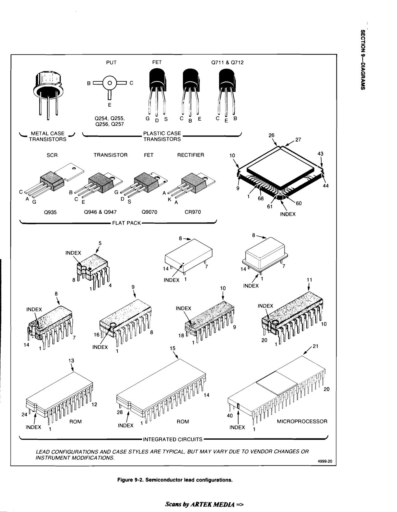


<details><summary>OCR text on this page</summary>

```
PUT 
FET 
Q711 & Q712 
B"c 
Q254, (2255, 
G
D
S
 
(2256. Q257 
METAL CASE I/ ( 
PLASTIC CASE 
j 
TRANSISTORS 
TRANSISTORS 
26 
SCR 
TRANSISTOR 
FET 
RECTIFIER 
1 
4 
C 
Q935 
Q946 & Q947 
(29070 
CR970 
INDEX 
\ 
FLAT PACK 
J 
MICROPROCESSOR 
\ 
INTEGRATED CIRCUITS 
1 
LEAD CONFIGURATIONS AND CASE STYLES ARE TYPICAL, BUT MAY VARY DUE TO VENDOR CHANGES OR 
INSTRUMENT MODIFICA TIONS. 
4999-20 
Figure 9-2. Semiconductor lead configurations. 
Scans by ARTEK MEDL4 =>
```

</details>


---

## Page 311 of 451

30 Service 
To 
identify 
any 
component 
mounted on a circuit board and 
to locate that component in the 
a. 
Identify the particular circuit board that the component is 
a. 
Compare the circuit board with its illustration and locate 
appropriate schematic diagram 
located on by using the Circuit Board Location 
the desired component by area and shape on the illustra- 
corresponc
illustration (Figure 9-5) to determine the Assembly 
determine 
and numt
b. 
Scanthe tableadjacent tothe Circuit Boardlllustration and 
b. 
In the manual locate and pull out tabbed page whose title 
find the Circuit Number of the desired component. 
corresponds with the Assembly Number of the circuit 
b. , Scan the 
board. Circuit board assembly numbers and board 
schematic 
nomenclature are printed on the back side of the tabs 
c. 
Determine the Schematic Diagram Number in which the 
A6 CRT BOARD 
desired co
component is located. 
A 
1 
A6 CRT BOARD 
CRT CIRCUIT DIAGRAM 
e 
AND CIRCUIT 
INSTRUMENT CIRCUIT 
BOARD NAME 
BOARD LOCATION 
a. 
In the manual, locate and pull out the tabbed page whose 
title and Assembly Number correspond with the desired 
a. 
From the schematic diagram, determine the Assembly 
circuit board. This information is on the back side of the 
Number of the circuit board on which the component is 
mounted. This information is boxed and located in a corner 
of the heavy line that distinguishes the board outline. 
b. 
Using the Circuit Number and grid coordinates, locate the 
component on the Circuit Board Illustration. 
b. 
Scan the Component Location Table for the Assembly 
Number just determinedand findthecircuit Number of the 
desired component. 
c. 
In the circuit board location illustration, determine the 
location of the circuit board in the instrument. 
n, read the grid 
he instrument and compare it 
manual to locate the desired 
Figure 9-3. Locating components on schematic diagrams and circuit board Illustrations.


---

## Page 312 of 451

Determine the Circuit Number 
a. 
Compare the circuit board with its illustration and locate 
the desired component by area and shape on the illustra- 
tion 
b. 
Scan the table adjacent tothe Circuit Board Illustration and 
find the Circuit Number of the desired component. 
c. 
Determine the Schematic Diagram Number in which the 
component is located. 
I 
A6 CRT BOARD 
I 
3. Locate the Component on the Schematic Diagram 
I 
a. 
Locate and pull out tabbed page whose number and title 
c. 
Under the SCHEM LOCATION column, read the grid 
correspond with the Schematic Diagram Number just 
coordinates for the desired component. 
determined in the table. Schematicdiagram nomenclature 
and numbers are printed on the front side of the tabs 
(facing the front of the manual). 
d. 
Using the Circuit Number and grid coordinates, locatethe 
component on the schematic diagram. 
b. 
Scan the Component Location Table adjacent to the 
schematic diagram and find the Circuit Number of the 
desired component. 
I 
PULL OUT 
PAGE TABS 
FOR DIAGRAMS 
SCHEMATIC 
A6 CRT BOARD 
CRT CIRCUIT DIAGRAM 
INSTRUMENT CIRCUIT 
BOARD LOCATION 
diagram, determine the Assembly 
Numeral and letter at signal lines 
to 
or 
from 
other 
diagrams 
it board on which the component is 
indicates the grid coordinates on 
iation is boxed and located in a corner 
SCHEMATIC DIAGRAM 
another schematic (for example: 
NAME AND NUMBER 
t distinguishes the board outline. 
l t Location Table for the Assembly 
To identify any component in a 
nedandfindthecircuit Number of the 
schematic diagram and to locate 
that component on its respective 
circuit board. 
n, read the grid 
!nts on schematic diagrams and circuit board illustrations.


---

## Page 313 of 451

CH I-PRB 
TO @ 
SS-RST , 
SGL SUP I 4 
PP, TRL 
TO @ 
CH 2 STATUS 
A TRIGGER 
- 
P-P 
- 
P-P 
R721 
HOR-REF 
- 
XY 
SEC/DIV 
VAR 
VAR 
fi 
V AR 
--- 
X-AXIS 
CHOP BLANK 
St01 
, A SWEEP GENERATOR 
8 
- 
--- 
S300 
AND LOGIC 0 
A T~MING; 
/ 
a 
xy 
e 
+ 
A 
7 
0 
BEAM FIND 
TRl GGER 
SWITCH 
S200 
MODE 
AND RC 
SWEEP INTERFACE 
CH 1 SELECTED 
A - 
A END OF SWEEP 
A13 
2 
ARES1 , 
HOLDOFF TIMING 
ARES2 
HOR-CAL , 
~
~
5
2
 
I 
COMPARATOR 
U ~ B ~ A , 
B I c I D f, 
HOR-MAG I 
\I \r 
RQBI~ 
+ 
07470 1 97471 
VAR 
AUTO 
4525 
U781A, BI C, D 
iA 
1, 
TO@ 
A1 8 SWEEP 
8 
HOR-REF, 
RQ802 
07472, U504B 
- 
REF BOARD 
INTENSITY 
Z-AXIS AMPL 
HOLDOFF 
t 
BASELINE 
U782A, B 1 C, D 
HOR-VAR , 
--C 
0804 
--C Q825, 08201 083: 
HOLDOFF 
0580 
U502 
A sup 
Bws, 15 LR 
07501 A7508 
1 K-REF , 4K-REF 
I - 
1 
I 
I 
I 
+ 
55. 
0- 
081 4 
0840 I QB45 
=, 07420 I Q7140 
f , 
0-CAPS 
TO @ 
U532D 
0 
, 
S721 
A MILLER 
TO@ 
HOR X 10 
SWEEP 
t 
A SWEEP LOCIC 
4 
HOR-REF 
a 
ALT SYNC 
0701 
0708 
tp 
+ CR551 , 0583, 0588 
- 
) U504A, U508 
Q704A, B 
, 
07201-07204 I U537B 
U532Ap B, CI 0511 
A GATE 
A - 
0527 
A 
1 
--- 
- - 
U880C I U885B 
S7401 
0578, 0578 I 0521 
. 
-b 
ALT 
T/D X 10 
0522, 0523 
SYNC 
A SUP 
I 
-- 
( A GATE 
d 
C- 
- 
- POWER INPUT 
PREREGULATOR 
T RAG TO @ J 
i 
X I 0 MAG 
SO01 , VRQBl 
a 
CONTROL 
0008, 0028 -- 
- 
I 
8 
, 
FQ001 , CRO01 - 
0038, 49070 
A
2
 - - + E T o ~ 
i 
/ - 
B TIMING 
CR002, CRO03 
Q050, U030 
A GATE 
?A 
ONLY 
/ 
SWITCH 
CR004 
L 
< 
I 
STO-ROY 
'I 'I 
AND RC 
f 
1 
//2 
TO/FROM 
@ 
PI{; 
- 
- 
A ONLY 
w 
T 
- 
ALTERNATE DISPLAY SWITCHING 
SEP 
A 
B ONLY 
+ U680E 1 U885C, U8708, U880A, B 
- 
ALT - 
HALT 
S84B 
a 
0882 1 0883, 0884, 0887 
i 
T
*
 
A - 
X-AXIS 
1 
- 
PROBE ADJUST, 
t 
XY AMPLIFIER 
XY AMPLIFIER, <
DELAY TIME 
HORIZONTAL OUTPUT 
B DELAY 
w 
POSITION COMPARATOR 
M 8 0 A I B I F 1 U870A 
B MILLER SWEEP - = 
B SWEEP LOCIC 
TIME POSITION 
I 
HORIZONTAL 
- 
U855 
0700, 071 0A 
B 
STORE, STORE 
RQ844 
U880C 1 D 1 0830 1 0831 
Q712 
R728 POSITION 
-0- 
. 
B SIGNAL 
t
A
 
B END OF SWEEP 4 
A SWP 
HORIZ OUTPUT 
* B TRIGGER LEVEL COMPARATOR 
COMPARATOR 
A DISP 
AMPLIFIER 
C 
AND SCHMITT TRIGGER 
0843, U885D -= 
r 
B DISP 
0770, 0775 
U805 
0770, 0780 
S802 
. 
B SWP 
1 
A 
0785, Q789 
b 
f 
RUN AFTER DLY 
0 TIMING AND 
B TRIGGER LEVEL 
ALTERNATE B SWEEP 
PROBE ADJUST UQB5 
R802 
Figure 9-4. Detailed A n p k hlmk diaaram. 
L 
WPOS TO @ 
LH-OUT I RH-(XIT I
~OOZ-EO& 0 b03~ 
~ a a v 
<= A9 S u e


---

## Page 314 of 451

R112 
+ VERT DEFL 
A - 
c~ 1IPosITIoN1 +yIiN:f:@ 
+yI:N:f~@ 
~ P O S I T I O N S I G N A L S T O @ 
I 
- VERT DEFL 
- 
1 
2230 Service 
Figure 9-4. Detailed Analog block diagram. 
b 
H-POS TO @ - 
LH-OUT , RH-WT FROM 
CRT 
VQ870 ' 
I 
I 
I 
t 
NTRIGl 6 PTRIGl 
5 
- 
1 SIC 
/ 
CH 1 PREAMP --) 
/ 
CH 1 TRIGGER 
TRIGGERING 
AMPLIFIER 
a 
'2 
0102, 0183 
2 
VERTICAL PREAMPS 6 
0114, 0115 
7- 
/ 
CHANNEL SWITCHING 
0302, 0303 
+ POSITIONSIGNAL 
TRIGGERSWITCH + 
U130 
L 
/ 
-- 
. 
/ 
A 
U310 
CONDITIONING 
U555A) B, C r D 
TRIGCER 
2 
(POSITION INTERFACE 
-, U5856, C, D, 0541 
= QUALIFIER * 
--b 0542 , 0543 
0544 +- 
CH 2- 
- 
U501A, B 
NTRIG2 6 PTRIG2 
5 
AMPLIFIER 
0524 
- 
CHANNEL 
SWITCH 
VERTICAL 
OUTPUT @ 
0327 
0328 
* LOGIC 
S302 
U335 
c INTERNAL 
AMPLIFIER 
A 
TRIGGER 
* 
CHANNEL 
DELAY LINE 
1 
SOURCE 
-C TRIGGER SOURCE 
AMPLIFIER 
INT TRIG 
SWITCH 
- 
DRIVER 
VERTICAL 
DIODE SWITCHING 4 
U350A) B , 
CR200 
CR20 1 
0282 1 0283 - OELAY 
OUTPUT AMPL 
) 
U7202B - OSCILLATOR 
CR372, CR303 
C, D, E 
CR202, CR203 
0288, 0287 
0230, 0231 
- 
AND CHOP 
7 
DL021 0 
LINE 
0254, 0255 
CR3QO) 0307 
BLANKING 
U7202A 
U225 
TRI CGER 
1 
U540B 
U537D 
I U537C ,+: 
' 2 
2-' 
I 
t:,Q41~Q7362,,'1'd 
I 
L = - z ~ 
TRIGGER 
0420, 
Q422, 
0428, 
P-P AUTO 
0421 
Q423 
0420 
LEVEL 
A LEVEL 
CH 2 PREAMP 
COMPARATOR 
0152, 0153 
f 
A/B SUP SEP 
BW LIMIT 
A WT 
A EXTERNAL 
U426A) B 
0474, 0487 
2 
COUPLING 
0283, 0284 
CR228, CR227 
TRIGGER AMPL 
/ 
0413 
U460, 0473 
i 
0285 
CR228, CR220 
S388 
Q382A , B 
t 
r 
t 
t 
0384 
A 
I 
//2 
- 
--- 
X-AXIS 
CHOP BLANK 
- 
S300 
RE03 
n 
(F 
-- 
FOCUS 
S200 
I 
SWEEP INTERFACE 
ARESl , 
4 
CH 1 SELECTED 
A 
+ 
- 
- 
FOCUS cRI_D 
A13 
7 
ARES2 
HOR-CAL , 
U780A) B , C , D 
HOR-MAG , 
!I \r 
ROE1 2 
'I 
U781A) 8 , C, D 
A16 SWEEP 
6 
HOR-REF, 
R0802 
- 
REF BOARD -f, 
INTENSITY 
Z-AXIS AMPL 
INTENSITY 
U782A) B, C , D 
HOR-VAR , 
INTENSITY --) 
0884 
0825, 0820, 0835 
- 
GRIg - 
U783A, B 
Q7501 A7506 
1 K-REF , 4K-REF 
- 
- 
081 4 
0840 
0845 
S721 
1 
1 HOR x 1 0 1 --- 
UNBLANKING LOGIC 
t 
- 
4 
HOR-REF 
t 
c CR551 , 0583 , 0586 
07201-a7204 , U537B 
+ 
U880C, M85B 
. 
A SUP 
-- 
+43V 
* 
XFMR 
A 
I 
P 
- POWER INPUT 
PREREGULATOR 
XI0 MAG 
SO01 , VR001 
0008, 0028 
INVERTER 
TO48 
'I 
- 
CONTROL 
, 
FOB01 , CROBI -) 0030 , 00070 
0038, W30, QOS4 
- - 
Z-AXIS AMPL AND 
6 / 
B TIMING 
CR002, CR903 
0058, U030 
WSO, 0047 
POWER SUPPLY 
CRQ04 
J 
..L 
AND RC 
/2 
.) 
FEEDBACK 
- 
ALTERNATE DISPLAY SWITCHING 
. 
93 
c U660E, U685C, M 7 0 8 , U680A 
B . 
I I 
//2 
W82, a883 
0684 
0687 - 
I 
PROBE ADJUST, 
t 
XY AMPLIFIER 
XY AMPLIFIER, 
--- 
TO @ 
HORIZONTAL OUTPUT 
SWEEP LOGIC 
B MILLER SWEEP - ? 
J660A ) 8 , F , U670A 
0700, 0710A) B 
HORIZONTAL 
STORE, STORE 
2, 
=flC 
) , 0630 , 063 1 
0712 
/ 
FROM @ 
t 
B EN0 OF SWEEP 4 
* HORIZ OUTPUT 
- 
+ HORIZ DEFL 
I Z-AXIS INTERFACE 
COMPARATOR 
0643 
U685D - = 
- HORIZ DEFL 
RUN AFTER DLY 
ALTERNATE B SWEEP 
m, 
DISP-ON, 
A 
-N, 
D
=
 
I 
I 
UV-OUT , DV-OUT 
L 
@ 
/A/B ;2.0 SEP I 
I BY LIMIT] 
w REJECT 
A TRIGGER LEVEL 
R162 
S226 
S438 
R438 
I 
A TRIGGER SLOPE 
S460 
P-P 
B SIGNAL 
HOR-REF 
A TRICGER 
XY 
VAR 
n


---

## Page 315 of 451

CH 1 ACQ SIGNALS 
CH 2 ACQ SIGNALS 
TSEL. 
ST0 ROY. 
A GATE, WK. B GATE 
LH OUT. 
RH OUT 
H POS 
U6304. U6306. 
U6301A. U6308 
DV OUT. 
UV OUT 
TRIGGER MUX 
RO. 
ARESI, B RES. 
ARES2. B CAPS 
1K REF. 
4K REF. HOR CAL, 
HOR MAG. 
HOR REF, HOR VAR 
-- 
A ONLY, B ONLY. 
STORE ON 
RON, -N. 
mON. 
blS, -
0
 
CHI STAT. CH2 STAT 
CHI ATN. 
CH2 ATN 
CHI PRB. CH2 PRB 
POSITION SIGNALS 
B DELAY 
ACI. 
AC2 
INSTRUMENT 
-- 
STATUS PORT 
CHI SEL. 
CH2 SEL. WP. 
SS R S L S G L SWP, 
PP, n. 
TRL. 
CH2 INV. T MAG


---

## Page 316 of 451

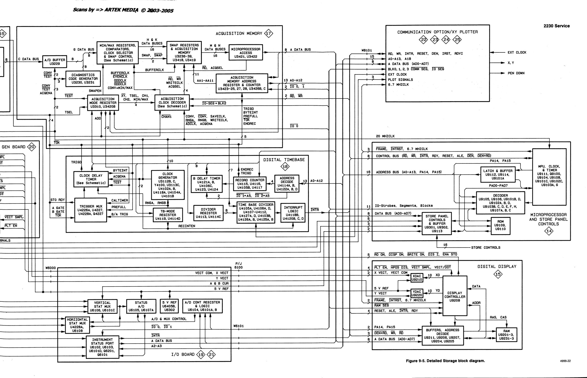


<details><summary>OCR text on this page</summary>

```
2230 Service
```

</details>


---

## Page 317 of 451

TEST WAVEFORM AND VOLTAGE SETUPS 
WAVEFORM MEASUREMENTS 
On the left-hand pages preceding the schematic 
Storage 
- 
diagrams are test waveform illustrations-that are intended 
to aid in troubleshooting the instrument. To test the instru- 
STOREINON STORE 
NON STORE (button out) 
ment for these waveforms, make the initial control settings 
SAVEICONTINUE 
CONTINUE (button out) 
as follows: 
PRETRIGIPOST TRIG 
POST TRIG (button out) 
ROLLISCAN 
SCAN (button out) 
1 Kl4K 
4K (button out) 
Vertical (Both Channels) 
POSITION 
Midrange 
VERTICAL MODE 
CH 1 
X-Y 
Off (button out) 
BW LIMIT 
On (button in) 
VOLTSIDIV 
1 V 
VOLTSIDIV Variable 
CAL detent 
INVERT 
Off (button out) 
AC-GND-DC 
DC 
Horizontal 
POSITION 
HORIZONTAL MODE 
A SECIDIV 
SECIDIV Variable 
XI 0 Magnifier 
A TRIGGER 
VAR HOLDOFF 
Mode 
SLOPE 
LEVEL 
HF REJECT 
A&B INT 
A SOURCE 
A EXT COUPLING 
(Midrange) 
A 
0.5 ms 
CAL detent 
Off (knob in) 
NORM 
P-P AUTO 
OUT 
Midrange 
OFF 
VERT MODE 
INT 
AC 
POSITION CURS1 
POSI-HON CURS 
SELECT WAVEFORM 
(button in) 
WAVEFORM 
WAVEFORM 
REFERENCE 
REFERENCE (button in) 
Changes to the control settings for specific waveforms 
are noted at the beginning of each set of waveforms. Input 
signals and hookups required are also indicated, if needed, 
for each set of waveforms. Voltage measurements are 
made with a 1X probe unless otherwise noted. 
DCVOLTAGE MEASUREMENTS 
Typical 
voltage 
measurements, 
located 
on 
the 
schematic diagram, were obtained with the instrument 
operating under the conditions specified in the Waveforms 
Measurements setup. Control-setting changes required for 
specific voltages are indicated on each waveforms page. 
Measurements are referenced to chassis ground with the 
exception of the Preregulator and Inverter voltages on 
Diagram 8. These voltages are referenced as indicated on 
the schematic diagram. 
RECOMMENDED TEST EQUIPMENT 
Test equipment in Table 4-1 meets the required 
specifications for testing this instrument. 
Scans by ARTEK MEDL4 *


---

## Page 318 of 451

POWER SUPPLY ISOLATION PROCEDURE 
Each regulated supply has numerous feed points to 
external loads throughout the instrument. The power dis- 
tribution diagrams are used in conjunction with the 
schematic diagrams to determine those loads that can be 
isolated by 
removing service 
jumpers 
and 
those 
that cannot. 
AC Waveforms 
Instrument must be connected to the ac-power 
source using a 1: 1 isolation transformer. Do not con- 
The power distribution and circuit board interconnec- 
nect the test oscilloscope probe ground lead to the 
tions diagrams are divided into circuit boards. Each power 
inverter circuit test points if the instrument is not is& 
supply feed to a circuit board is indicated by the schematic 
lated. AC-source voltage exists on reference points 
diagram number on which the voltage appears. The 
TP950 and T906 pin 5. 
schematic diagram grid location of a service jumper or 
component is given adjacent to the component number on 
the power distribution and circuit board interconnect 
diagrams. 
DC Voltages 
Preregulator and Inverter voltages are referenced to 
If a power supply 
up after lifting One 
the main 
test point noted adjacent to the voltage. Power supply out- 
jumpers from the power 
to isolate that 
it is 
put voltages are referenced to chassis ground. 
very probable that a short exists in the circuitry on that 
supply line. By lifting jumpers farther down the line, the cir- 
cuit in which a short exists may be located. 
Always set the POWER switch to OFF before soldering 
or unsoldering service jumpers or other components and 
before attempting to measure component resistance 
values. 
Scam by ARTEK MEDL4


---

## Page 319 of 451

2230 Service 
CHASSIS MOUNTED PARTS 
Scans by ARTEK MEDIA - 
CIRCUIT 
NUMBER 
89965 
8T1101 
C7401 
C7402 
DS9150 
F9001 
FL9001 
J9100 
J9376 
J9510 
J9800 
PI 152 
P4104 
P4110 
P4210 
P4220 
P6 100 
P6 100 
P6 100 
P6110 
P6111 
P6112 
P6113 
P6120 
P6 130 
P6410 
P6420 
P642 1 
P6423 
P7390 
P7391 
P7392 
SCHEM 
LOCATION 
4F 
1A 
1A 
7 B 
58 
48 
4J 
8E 
68 
2B 
1 B 
7D 
7M 
3M 
3 8 
58 
1 M 
2L 
7C 
2L 
5C 
3J 
4G 
6 0 
6M 
4M 
5B 
6K 
1J 
2E 
3E 
7A 
1 L 
7M 
SCHEM 
NUMBER 
9 
25 
1 
1 
8 
8 
8 
1 
4 
1 
9 
25 
18 
12 
12 
12 
19 
20 
21 
13 
13 
13 
13 
13 
13 
13 
13 
13 
13 
2 
2 
2 
CIRCUIT 
NUMBER 
SCHEM 
LOCATION 
6L 
2A 
2A 
5A 
1 C 
2A 
2A 
2A 
6A 
5A 
4A 
2A 
1 A 
1 B 
68 
6B 
7A 
1 B 
3A 
5L 
7E 
8E 
7E 
6L 
7L 
3L 
2L 
1 E 
5E 
3F 
3F 
4F 
SCHEM 
NUMBER 
P7393 
P8 100 
P8100 
P9010 
P9050 
P9060 
P9070 
P9105C 
P9200 
P9210 
P9250 
P9250 
P9272 
P9273 
P9320 
P9410 
P9430 
P9700 
I 
2 
23 
24 
12 
12 
12 
8 
14 
1 
12 
4 
7 
3 
3 
12 
12 
14 
5 
P9700 
P9700 
P9700 
P9705 
P9705 
P9705 
P9778 
P9788 
P9802 
P9965 
P9991 
R5202 
R5203 
R9521 
V9870 
W9272 
5 
6 
7 
10 
7 
7 
7 
7 
9 
9 
10 
, 
7 
7 
5 
9 
3


---

## Page 320 of 451

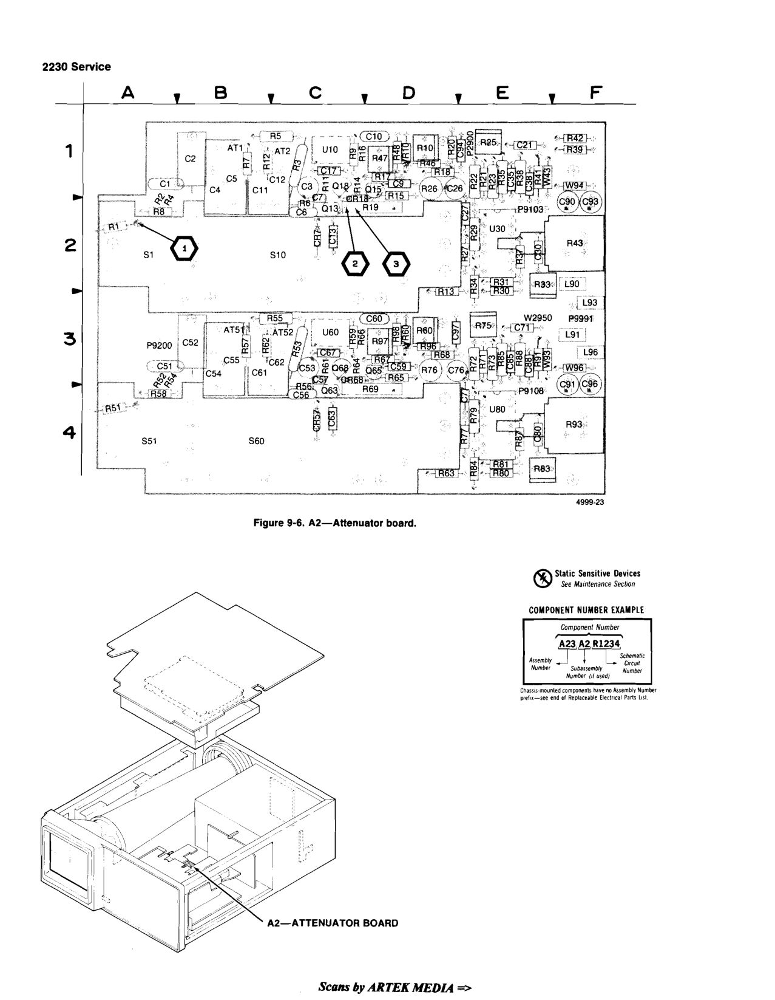


<details><summary>OCR text on this page</summary>

```
2230 Service 
Figure 9-6. A2-Attenuator 
board. 
Static Sensitive Devices 
See Maintenance Sectton 
COMPONENT NUMBER EXAMPLE 
Component Number - 
A23A2R1234 
Asrembly T L S c h e m a D r 
Number 
Subarsembly 
Orcull 
Number 0, used) 
Number 
~ G s J m o u n l e d componenls have no Assembly Numbel 
prellx-see 
end of Replaceable Eleclr~cal Parts Llsl 
BOARD 
Scans by ARTEK MEDIA
```

</details>


---

## Page 321 of 451

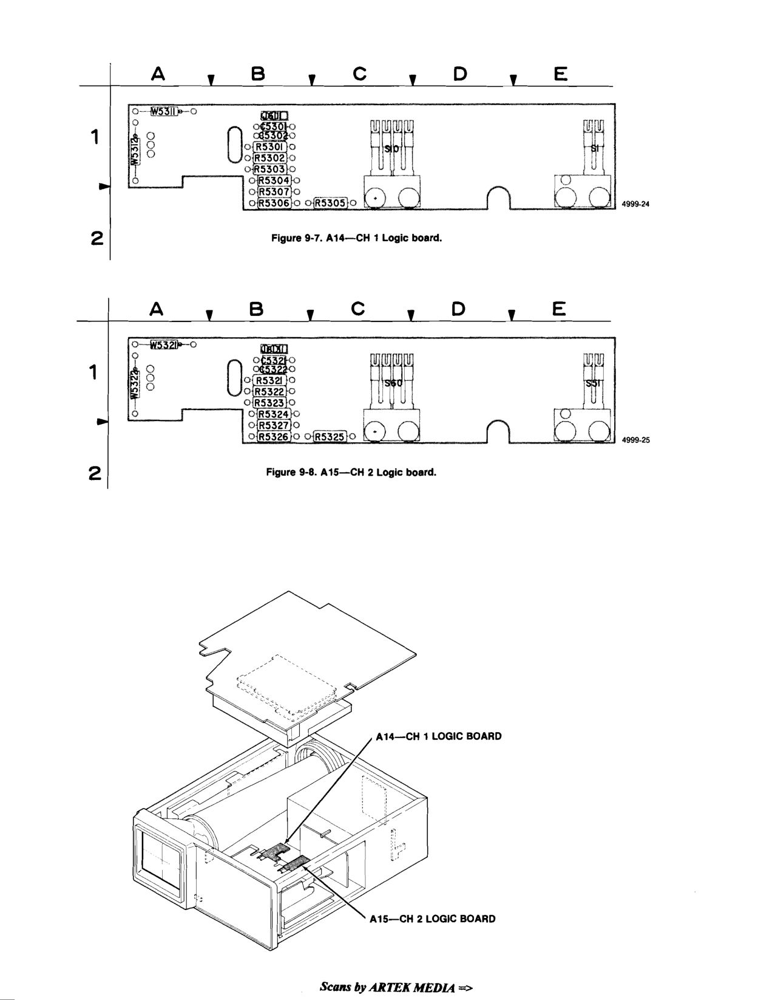


<details><summary>OCR text on this page</summary>

```
1 
Figure 9-7. A14-CH 
1 Logic board. 
1 
Figure 9-8. A15-CH 
2 Logic board. 
A14-CH 
1 LOGIC BOARD 
A15-CH 
2 LOGIC BOARD 
Scans by ARlEK MEDC4 =>
```

</details>


---

## Page 322 of 451

A2-ATTENUATOR 
BOARD 
A14-CH 
1 LOGIC BOARD 
AlS-CH 
2 LOGIC BOARD 
WAVEFORMS FOR DIAGRAM 1 
CIRCUIT 
NUMBER 
R84 
R85 
R87 
R88 
R91 
R93 
R96 
R97 
R98 
S1 
S10 
5 4 3 
551 
S60 
5 9 3 
U 1 0 
u 1 0 
U 3 0 
U 6 0 
U 6 0 
U 8 0 
VRlO 
VR60 
W43 
W93 
W 9 4 
W96 
CIRCUIT 
NUMBER 
AT1 
AT2 
AT5 1 
AT52 
C2 
C3 
C4 
C5 
C6 
C6 
C7 
C9 
C9 
C10 
C11 
C13 
C17 
C2 1 
C2 6 
C2 7 
C30 
C30 
C35 
C38 
C52 
C53 
C54 
C55 
Scans by AR TEK MEDIA => 
SCHEM 
NUMBER 
1 
1 
1 
1 
1 
1 
1 
1 
1 
1 
1 
1 
1 
1 
1 
1 
1 0 
1 
1 
1 0 
1 
1 0 
1 0 
1 
1 
1 0 
1 0 
SCHEM 
NUMBER 
1 
1 
1 
1 
1 
1 
1 
1 
1 
1 
1 
1 
1 
1 
1 
1 
1 
1 
1 
1 
1 
1 
1 
1 
1 
1 
1 
1 
ClRCUlT 
NUMBER 
C56 
C57 
C59 
C60 
C61 
C63 
C67 
C71 
C76 
C77 
CBO 
C85 
C88 
C90 
C91 
C93 
C94 
C96 
C97 
CR7 
CR18 
CR57 
CR68 
J9103 
J9108 
J9991 
L90 
CIRCUIT 
NUMBER 
R17 
R18 
R19 
R21 
R22 
R23 
R25 
R26 
R27 
R29 
R30 
R30 
R31 
R33 
R34 
R35 
R37 
R38 
R39 
R41 
R42 
R43 
R46 
R47 
R48 
R51 
R51 
SCHEM 
NUMBER 
1 
1 
1 
1 
1 
1 
1 
1 
1 
1 
1 
1 
1 
1 0 
1 0 
1 0 
1 0 
1 0 
1 0 
1 
1 
1 
1 
1 
1 
1 0 
1 0 
SCHEM 
NUMBER 
1 
1 
1 
1 
1 
1 
1 
1 
1 
1 
1 
1 
1 
1 
1 
1 
1 
1 
1 
1 
1 
1 
1 
1 
1 
1 
1 
CIRCUIT 
NUMBER 
L91 
L93 
L96 
P9200 
0 1 3 
0 1 5 
0 1 8 
0 6 3 
0 6 5 
0 6 8 
R1 
R1 
R2 
R3 
R4 
R5 
R6 
R6 
R7 
R8 
R9 
R10 
R11 
R12 
R13 
R14 
R15 
R16 
SCHEM 
NUMBER 
1 0 
1 0 
1 0 
1 
1 
1 
1 
1 
1 
1 
1 
1 
1 
1 
1 
1 
1 
1 
1 
1 
1 
1 
1 
1 
1 
1 
1 
1 
CIRCUIT 
NUMBER 
R52 
R53 
R54 
R55 
R56 
R57 
R58 
R59 
R60 
R61 
R62 
R63 
R64 
R65 
R66 
R67 
R68 
R69 
R71 
R72 
R73 
R75 
R76 
R77 
R79 
R80 
R81 
R83 
SCHEM 
NUMBER 
1 
1 
1 
1 
1 
1 
1 
1 
1 
1 
1 
1 
1 
1 
1 
1 
1 
1 
1 
1 
1 
1 
1 
1 
1 
1 
1 
1


---

## Page 323 of 451

CHI AND CH2 ATTENUATORS DIAGRAM 1 
Scans by ARTEK MEDL4 - 
CIRCUIT 
NUMBER 
A67 
R6B 
R69 
R71 
R72 
A73 
R75 
R76 
A77 
R79 
RB0 
R81 
R83 
R84 
R85 
R87 
R88 
R91 
R93 
R96 
R97 
R9B 
S 1 
S10 
S43 
S51 
S 60 
S93 
U10 
U 30 
U60 
U80 
W43 
W93 
SCHEM 
LOCATION 
5G 
5G 
5H 
6J 
6K 
5K 
6K 
6K 
5L 
6L 
6K 
6L 
6K 
6L 
7L 
6L 
7M 
7K 
7K 
6G 
6G 
6G 
4A 
4K 
2F 
4A 
4C 
BL 
3E 
2L 
5E 
5L 
4M 
7K 
BOARD 
LOCATION 
3D 
3D 
4D 
3E 
3E 
3E 
3E 
3 0 
4E 
4E 
4E 
4E 
4E 
4E 
3E 
4E 
3E 
3E 
4F 
3 0 
3D 
3D 
2A 
2 C 
2F 
4A 
48 
4F 
1C 
2E 
3C 
4E 
1 E 
3E 
ASSEMBLY 
CIRCUIT 
NUMBER 
ATOOOOl 
AT2 
AT5 1 
AT52 
C2 
C3 
C4 
C5 
C6 
C6 
C7 
C9 
C9 
C10 
C11 
C13 
C17 
C21 
C26 
C27 
C30 
C30 
C3 5 
C3B 
C52 
C53 
C54 
C55 
C56 
C57 
C59 
C60 
C61 
C63 
C67 
C71 
C76 
C77 
CBO 
I 
Parr~al A2 also shown on diagram 10 
ASSEMBLY A 3 
SCHEM 
LOCATION 
7L 
7M 
2F 
2G 
5F 
5G 
2M 
5 L 
66 
2F 
3F 
2G 
5F 
6F 
5G 
2A 
2A 
2A 
2E 
28 
3E 
2E 
2E 
3C 
28 
3F 
3E 
2F 
3 0 
2F 
2 F 
3F 
3F 
2G 
2G 
J92OO 
78 
3C 
R89 
78 
2C 
R7401 
6B 
3C 
R92 
7B 
3C 
R7402 
6A 
2D 
R952 
6A 
4D 
CIRCUIT 
NUMBER 
R19 
R21 
R22 
R23 
R25 
R26 
R27 
R29 
R30 
R3O 
1331 
R33 
R 34 
A35 
R37 
R38 
R39 
R4 1 
R42 
R43 
R46 
A47 
R48 
R51 
R51 
R52 
R53 
R54 
R55 
R56 
R57 
R5B 
R59 
R60 
R61 
R62 
R63 
R64 
R65 
R66 
CIRCUIT 
NUMBER 
C85 
C8B 
CR7 
CRlB 
CR57 
CR6B 
J9103 
J9108 
P9200 
0 1 3 
0 1 5 
01 8 
063 
065 
068 
R1 
R1 
R2 
R3 
R4 
R5 
R6 
R6 
R7 
R8 
R9 
R10 
R11 
R12 
R13 
R14 
R15 
R16 
R17 
R1 B 
BOARD 
LOCATION 
3E 
3E 
2C 
1 C 
4C 
3C 
2E 
4E 
3A 
2C 
1 D 
1 C 
4C 
3D 
3C 
2A 
2A 
2A 
1 C 
2A 
1 B 
2C 
2C 
1 B 
2A 
1 C 
1 D 
1 C 
1 B 
2 0 
1C 
1 D 
1 C 
1 D 
1 D 
A2 
SCHEM 
LOCATION 
2C 
2D 
5C 
5D 
2.9 
2F 
2C 
2C 
2E 
2E 
2F 
3F 
3F 
3F 
2D 
2F 
2G 
3J 
3K 
3L 
3K 
3K 
4L 
4M 
56 
5F 
5C 
5C 
5E 
5F 
6F 
6F 
5D 
5F 
5G 
5J 
6K 
6L 
6K 
S90 
W7457 
7A 
7B 
BOARD 
LOCATION 
1 B 
1 C 
3 8 
3C 
1 B 
1 C 
1 B 
1 B 
1 C 
1 C 
1 C 
1 D 
1 D 
1 D 
1 B 
2C 
1 C 
1 E 
1 D 
2E 
2E 
2E 
1 E 
1 E 
38 
3C 
3 8 
3 8 
4C 
3C 
3D 
3 0 
3 B 
4C 
3C 
3E 
3D 
4E 
4E 
2C 
2C 
Partla1 A3 also shown on diagrams 2. 3, 4. 5, 6. 7. 9. 10 and 73 
ASSEMBLY A14 
SCHEM 
LOCATION 
2H 
3J 
3 K 
3K 
3 K 
3K 
2L 
3L 
3K 
3K 
3L 
3K 
4L 
4L 
4L 
4M 
4M 
4M 
4M 
4M 
3G 
3G 
3G 
5A 
5A 
5A 
5E 
5 8 
6E 
5E 
5C 
56 
5F 
6E 
5F 
5D 
5F 
BOARD 
LOCATION 
2D 
1 E 
1 E 
1 E 
1 E 
1 D 
2E 
2E 
2E 
2E 
2E 
2E 
2E 
1 E 
2E 
1 E 
1 F 
1 E 
1 F 
2F 
1 D 
1 D 
1 D 
4A 
4A 
3A 
3C 
3A 
3C 
4C 
3 8 
4A 
3C 
3 0 
3C 
38 
4 0 
3C 
1 A 
1A 
~ 
3 0 
6F 
3C 
1 
C5301 
C5302 
J6111 
ASSEMBLY A15 
R5301 
R5302 
R5303 
R5304 
1K 
1 M 
1 M 
1 K 
1 B 
18 
k 
1 
1.9 
1J 
1 B 
I 
1 B 
1 B 
1 B 
R5305 
R5306 
R5307 
C5321 
C5322 
W5311 
W5312 
1 A 
1 A 
1 B 
1 B 
W5321 
W5322 
8K 
BM 
CHASSIS MOUNTED PARTS 
1M 
1 L 
1M 
1 L 
I 
M 
8M 
8L 
C7401 
C7402 
1 C 
1 B 
1 B 
R5321 
R5322 
R5323 
J6112 
R5324 
EM 
I
B
 
1 
8J 
8K 
8J 
8K 
J9100 
J9510 
2A 
5A 
1 B 
1 B 
1 B 
1 B 
CHASSIS 
CHASSIS 
2A 
5A 
1C 
1 B 
1 B 
R5325 
R5326 
A5327 
P9200 
CHASSIS 
CHASSIS 
8M 
8L 
8M 
6 8 
CHASSIS


---

## Page 324 of 451

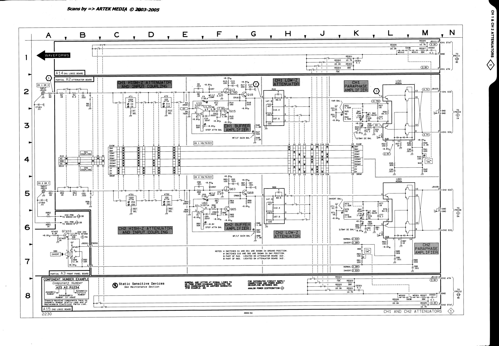


<details><summary>OCR text on this page</summary>

```
I 
I 
MF/LF GAIN BAL 
I 
I 
I 
I 
I 
I 
I 
I 
I 
I 
I 
I 
I 
I 
I 
I 
I SWITCHES SlO AND 5 6 0 ARE 
N 2mV POSITION 
wuu uo L m E R AT SIW 
LINS 
TO 
OR 
BRIO 
FRW 
COmJINATES 
OTHER DIABR*YS 
ON ANmER 
1H)ICATES 
S M Y l T I C 
TN 
ffm -E: 
40
```

</details>


---

## Page 325 of 451

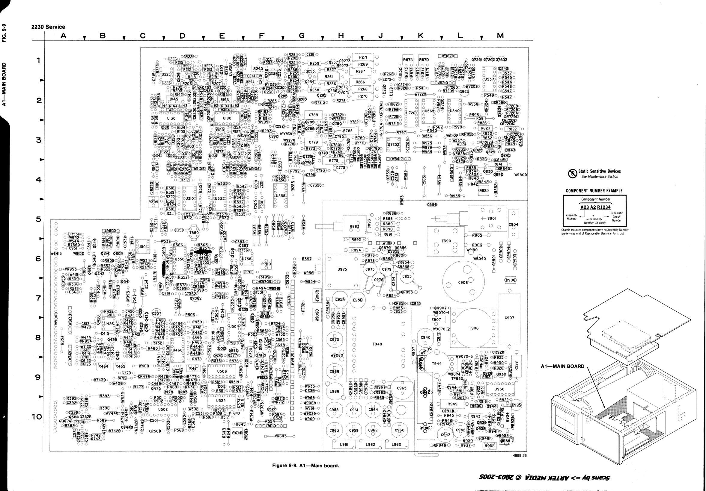


<details><summary>OCR text on this page</summary>

```
2230 Service 
Static Sensitive Devices 
See Ma~ntenance Section 
COMPONENT NUMBER EXAMPLE 
Chasss mounted components have no Assembly Number 
prefr-see 
end of Replaceable Electrca Parts List 
Figure 9-9. Al-Main 
board.
```

</details>


---

## Page 326 of 451

A1-MAIN 
BOARD 
Scam by ARTEK MEDIA => 
CIRCUIT 
NUMBER 
C114 
C115 
C116 
C125 
C126 
C130 
C133 
C164 
C165 
C175 
C176 
C180 
C200 
C201 
c202 
C210 
C215 
C220 
C225 
C226 
C228 
C229 
C229 
C237 
C239 
C240 
C241 
C241 
C242 
C242 
C250 
C251 
C25 1 
C255 
C262 
C262 
C274 
C281 
C282 
C282 
C292 
C312 
C337 
C337 
C350 
C351 
C363 
C369 
C381 
C389 
C390 
C392 
C396 
C397 
C400 
C414 
C415 
C418 
C419 
C420 
C42 1 
C440 
C453 
C454 
C459 
C460 
C467 
C469 
C473 
C480 
C494 
C499 
C500 
C501 
C502 
C503 
C504 
C505 
C506 
C507 
C518 
C519 
C520 
C521 
C525 
C527 
C528 
SCHEM 
NUMBER 
2 
2 
10 
2 
2 
2 
2 
2 
2 
2 
2 
2 
10 
10 
3 
3 
10 
10 
3 
3 
3 
3 
3 
3 
3 
3 
3 
3 
3 
3 
3 
3 
3 
10 
3 
3 
10 
3 
3 
3 
3 
4 
4 
4 
4 
4 
4 
4 
4 
4 
4 
4 
8 
4 
4 
4 
4 
4 
4 
10 
10 
2 
4 
4 
4 
10 
4 
4 
4 
10 
10 
10 
5 
5 
10 
10 
5 
5 
10 
10 
5 
5 
5 
5 
5 
5 
5 
CIRCUIT 
NUMBER 
C7260 
C7320 
C7361 
C7362 
C9272 
C9273 
CAI33 
CR183 
CR200 
CR201 
CR202 
CR203 
CR224 
CR224 
~ ~ 2 2 5 
CR225 
CR226 
CR226 
CR227 
CR227 
CR228 
CR228 
CR229 
CR229 
CR372 
CR381 
CR393 
CR399 
CR414 
CR415 
CR467 
CR476 
CR477 
CR501 
CR504 
CR505 
CR508 
CR509 
CR514 
CR527 
CR531 
CR532 
CR541 
CR551 
CR556 
CR590 
CR712 
CR764 
CR765 
CR768 
CR770 
CR780 
CR805 
CR818 
CR820 
CR823 
CR824 
CR825 
CR829 
CR840 
CR845 
CR851 
CR853 
CR854 
CR855 
CR901 
CR902 
CR903 
CR904 
CR907 
CR908 
CR920 
CR946 
CR947 
CR948 
CR954 
CR955 
CR956 
CR957 
CR960 
CR961 
CR962 
I 
CR963 
CR965 
CR967 
CR980 
CR981 
SCHEM 
NUMBER 
1 0 
7 
4 
4 
3 
3 
2 
2 
2 
2 
2 
2 
3 
3 
3 
3 
3 
3 
3 
3 
3 
3 
3 
3 
4 
4 
4 
4 
4 
4 
4 
4 
4 
5 
5 
5 
5 
5 
5 
5 
4 
4 
4 
9 
4 
9 
6 
7 
7 
7 
7 
7 
9 
9 
9 
9 
9 
9 
9 
9 
9 
9 
9 
9 
9 
8 
8 
8 
8 
8 
8 
8 
8 
8 
8 
9 
9 
9 
9 
9 
9 
9 
9 
9 
9 
9 
9 
CIRCUIT 
NUMBER 
C531 
C537 
C538 
C539 
C540 
C544 
C545 
C547 
C553 
C561 
C562 
C563 
C565 
C590 
c m 3 
C635 
C647 
C648 
C649 
C764 
C770 
C775 
C777 
C779 
C780 
C782 
C785 
C787 
C789 
C796 
C797 
C799 
C824 
C825 
C828 
C832 
C835 
C845 
C847 
C849 
C849 
C851 
C853 
C854 
C855 
C871 
C873 
C875 
C877 
C893 
C904 
C906 
C907 
C908 
C917 
C919 
C922 
C925 
C940 
C941 
C942 
C943 
C944 
C945 
C951 
C954 
C956 
C958 
C959 
C960 
C961 
C962 
C963 
C964 
C965 
C968 
C970 
C975 
C976 
C979 
C61 21 
C6122 
C6123 
C6131 
C7101 
C7201 
C7203 
CIRCUIT 
NUMBER 
CR7201 
CR7202 
CR7203 
CR7301 
CR7302 
CR7303 
CR7304 
CR7305 
CR7306 
CR7307 
CR7308 
DL9210 
DL9210 
DS856 
~ ~ 8 5 8 
DS870 
E200 
E201 
E272 
E590 
E907 
J4210 
J9010 
J9010 
J9050 
J9060 
J9210 
J9210 
J9300 
J9320 
J9644 
J9802 
J9965 
L142 
L143 
L192 
L193 
L960 
L961 
L962 
L968 
P9070 
0102 
0103 
0114 
0115 
0152 
0153 
0164 
0165 
0202 
0202 
0203 
0206 
0206 
0207 
0230 
0231 
0231 
0254 
0255 
0255 
0256 
0257 
0257 
0282 
0282 
0283 
0284 
0285 
0302 
0303 
0327 
0328 
0382 
0382 
0384 
0397 
0413 
0419 
0420 
a421 
0422 
0423 
0428 
0429 
0473 
SCHEM 
NUMBER 
2 
2 
2 
2 
2 
2 
2 
2 
2 
2 
2 
2 
2 
2 
2 
2 
2 
2 
3 
3 
3 
3 
3 
3 
3 
3 
3 
3 
3 
3 
3 
3 
3 
3 
3 
3 
3 
3 
10 
3 
3 
3 
3 
3 
3 
3 
3 
3 
3 
3 
3 
3 
3 
3 
3 
3 
3 
3 
3 
3 
3 
3 
3 
3 
3 
3 
3 
3 
3 
3 
3 
3 
3 
3 
3 
3 
3 
3 
3 
3 
3 
3 
3 
3 
3 
3 
3 
SCHEM 
NUMBER 
10 
10 
2 
2 
10 
4 
2 
9 
10 
4 
10 
5 
4 
10 
6 
6 
6 
6 
6 
7 
7 
7 
7 
7 
7 
7 
7 
7 
7 
10 
10 
10 
g 
9 
9 
10 
9 
9 
9 
10 
10 
9 
9 
9 
9 
9 
9 
9 
9 
9 
8 
8 
8 
8 
8 
8 
8 
8 
8 
8 
8 
8 
8 
8 
13 
9 
9 
9 
9 
9 
9 
9 
9 
9 
9 
9 
9 
9 
9 
9 
5 
5 
5 
2 
6 
9 
1 0 
SCHEM 
NUMBER 
9 
9 
9 
7 
7 
7 
7 
7 
7 
7 
7 
3 
3 
9 
9 
9 
10 
10 
10 
10 
8 
5 
6 
10 
10 
10 
2 
9 
10 
4 
6 
9 
9 
2 
2 
2 
2 
9 
9 
9 
9 
8 
2 
2 
2 
2 
2 
2 
2 
2 
3 
3 
3 
3 
3 
3 
3 
3 
3 
3 
3 
3 
3 
3 
3 
3 
3 
3 
3 
3 
4 
4 
4 
4 
4 
4 
4 
4 
4 
4 
4 
4 
4 
4 
4 
4 
4 
CIRCUIT 
NUMBER 
R271 
R278 
R278 
R279 
R28l 
R282 
R283 
R283 
R284 
R285 
R286 
R287 
R288 
R289 
~ 2 9 2 
R293 
R301 
R302 
R303 
R304 
R305 
R306 
R307 
R309 
R310 
R311 
R312 
R314 
R315 
R317 
R318 
R319 
R321 
R322 
A324 
R326 
R327 
R328 
R329 
R330 
R331 
R332 
R335 
R336 
R337 
R339 
R340 
R342 
A343 
R344 
R346 
R347 
R349 
R350 
R351 
R352 
R353 
R354 
R355 
R356 
R357 
R358 
R359 
R360 
R361 
R363 
R365 
R366 
R367 
R369 
R372 
R374 
R381 
R382 
R384 
R385 
R386 
R389 
R390 
R392 
R393 
R395 
R397 
R398 
R399 
R411 
R412 
SCHEM 
NUMBER 
3 
3 
3 
3 
3 
3 
3 
3 
3 
3 
3 
3 
3 
3 
3 
3 
4 
4 
4 
4 
4 
4 
4 
4 
4 
4 
4 
4 
4 
4 
4 
4 
4 
4 
4 
4 
4 
4 
4 
4 
4 
4 
4 
4 
4 
4 
4 
4 
4 
4 
4 
4 
4 
4 
4 
4 
4 
4 
4 
4 
4 
4 
4 
4 
4 
4 
4 
4 
4 
4 
4 
4 
4 
4 
4 
4 
4 
4 
4 
4 
4 
4 
8 
8 
4 
4 
4 
CIRCUIT 
NUMBER 
0474 
0487 
0509 
0511 
0521 
0522 
0523 
0524 
0525 
0527 
0541 
0542 
0543 
0544 
0576 
0578 
0583 
0586 
0756 
0770 
0775 
0779 
0780 
0785 
0789 
0804 
0814 
0825 
0829 
0835 
0840 
0845 
0908 
0928 
0930 
0935 
0938 
0939 
0944 
0946 
0947 
07201 
07202 
07203 
07204 
07362 
07420 
07440 
07470 
07471 
07472 
09070 
RlOO 
RlOl 
R102 
R103 
R104 
R105 
R106 
R108 
R109 
R114 
R115 
R122 
R125 
R126 
R130 
R131 
R132 
R133 
R135 
R136 
R138 
R139 
R142 
R143 
R144 
R145 
R150 
R151 
R152 
R153 
R154 
R155 
R156 
R158 
R159 
SCHEM 
NUMBER 
4 
4 
5 
5 
5 
5 
5 
4 
5 
5 
4 
4 
4 
4 
5 
5 
9 
9 
7 
7 
7 
7 
7 
7 
7 
9 
9 
9 
9 
9 
9 
9 
8 
8 
8 
8 
8 
8 
8 
8 
8 
9 
9 
9 
9 
4 
5 
5 
5 
5 
5 
8 
2 
2 
2 
2 
2 
2 
2 
2 
2 
2 
2 
2 
2 
2 
2 
2 
2 
2 
2 
2 
2 
2 
2 
2 
2 
2 
2 
2 
2 
2 
2 
2 
2 
2 
2 
CIRCUIT 
NUMBER 
R164 
R165 
R172 
R175 
R176 
R180 
R181 
R182 
R183 
R185 
R186 
R188 
R189 
R192 
~ 1 9 3 
R194 
R195 
R200 
A202 
R202 
A203 
R203 
R204 
R204 
R206 
R206 
R207 
R210 
R212 
R213 
R215 
R215 
R216 
R216 
A217 
R218 
R218 
R219 
R220 
R222 
R222 
R223 
R223 
R225 
R226 
R226 
R227 
R227 
R230 
R231 
R233 
R233 
R234 
R235 
R236 
R239 
R240 
R241 
R241 
R242 
R242 
R244 
R244 
R245 
R245 
R250 
R251 
A251 
R254 
A255 
R255 
R256 
R257 
R258 
R259 
R259 
R261 
R261 
R262 
R262 
R266 
R267 
R267 
R268 
R269 
R269 
R270


---

## Page 327 of 451

A1-MAIN 
BOARD (CONT) 
Scans by ARTEK MEDIA => 
CIRCUIT 
NUMBER 
R413 
R414 
R415 
R416 
R417 
R419 
R420 
R421 
R422 
R423 
R424 
R426 
R427 
R428 
R429 
R432 
R433 
R433 
R434 
R435 
R446 
R448 
R449 
R452 
R453 
R454 
R455 
R457 
R458 
R459 
R460 
R461 
R462 
R463 
R464 
R465 
R467 
R468 
R469 
R4 70 
R471 
R473 
R474 
R476 
R477 
R478 
R486 
R487 
R494 
R499 
R500 
R501 
R502 
R503 
R504 
R505 
R507 
R509 
R510 
R51 1 
R512 
R513 
R514 
R515 
R516 
R517 
R518 
R52 1 
R522 
R523 
R524 
R525 
R526 
R527 
R528 
R529 
R530 
R53 1 
R532 
A533 
R534 
R535 
R536 
R537 
R538 
R539 
R540 
R54 1 
SCHEM 
NUMBER 
4 
4 
4 
4 
4 
4 
4 
4 
4 
4 
4 
4 
4 
4 
4 
4 
4 
4 
4 
4 
4 
2 
2 
4 
4 
4 
4 
4 
4 
4 
4 
4 
4 
4 
4 
4 
4 
4 
4 
4 
4 
4 
4 
4 
4 
4 
4 
4 
10 
10 
5 
5 
5 
5 
5 
5 
5 
5' 
5 
5 
5 
5 
5 
5 
5 
5 
5 
5 
5 
5 
5 
5 
5 
5 
5 
5 
4 
4 
4 
4 
4 
4 
4 
4 
2 
2 
2 
2 
CIRCUIT 
NUMBER 
R542 
R543 
R544 
R545 
R546 
R547 
R548 
R549 
R550 
R551 
R552 
R553 
R554 
R555 
17556 
R558 
R560 
R561 
R562 
R564 
R565 
R566 
R568 
R569 
R571 
R572 
R573 
R574 
R576 
R577 
R578 
R580 
R581 
R582 
R583 
R584 
R585 
R586 
R590 
R595 
R645 
R646 
R648 
R649 
A675 
R676 
R756 
R757 
R758 
R759 
R760 
R761 
67764 
R766 
R768 
R770 
R773 
R775 
R776 
R777 
R778 
R779 
R780 
R782 
R783 
R785 
R786 
R787 
R788 
R789 
R789 
R792 
R793 
R796 
R797 
R799 
R800 
R804 
R805 
R810 
R814 
RE18 
R820 
R822 
R823 
R825 
R826 
R828 
SCHEM 
NUMBER 
4 
4 
2 
2 
4 
9 
9 
9 
4 
4 
4 
4 
6 
4 
4 
4 
4 
4 
4 
4 
4 
7 
5 
5 
5 
5 
5 
5 
5 
5 
5 
5 
9 
5 
9 
5 
5 
9 
9 
9 
6 
6 
6 
6 
6 
7 
7 
7 
7 
7 
7 
7 
7 
7 
7 
7 
7 
7 
7 
7 
7 
7 
7 
7 
7 
7 
7 
7 
7 
7 
7 
7 
7 
10 
10 
10 
9 
9 
9 
9 
9 
9 
9 
9 
9 
9 
9 
9 
CIRCUIT 
NUMBER 
R830 
R832 
R834 
R835 
R836 
R840 
R841 
R842 
R844 
R845 
R849 
R851 
R852 
R853 
R854 
R858 
R860 
R870 
R871 
R872 
R873 
R874 
R875 
R877 
R886 
R888 
R889 
R890 
R891 
R892 
R893 
R894 
R905 
R906 
R907 
R908 
R909 
R910 
R912 
R913 
R914 
R915 
R916 
R917 
17919 
R921 
R922 
R925 
R926 
R927 
R928 
R929 
R930 
R934 
R935 
R937 
R938 
R939 
R940 
R941 
R942 
R943 
R944 
R945 
R946 
R947 
R948 
R949 
R953 
R954 
R964 
R965 
R966 
R976 
R978 
R7111 
R7117 
R7203 
R7204 
R7205 
R7206 
R7207 
R7208 
R7209 
R7210 
R7211 
R7212 
R7213 
SCHEM 
NUMBER 
9 
9 
9 
9 
9 
9 
9 
9 
9 
9 
9 
g 
g 
9 
g 
9 
9 
9 
9 
9 
9 
9 
9 
9 
9 
9 
9 
9 
9 
9 
9 
9 
8 
8 
8 
8 
8 
8 
8 
8 
8 
8 
8 
8 
8 
8 
8 
8 
8 
8 
8 
8 
8 
8 
8 
8 
8 
8 
8 
8 
8 
8 
8 
8 
8 
8 
8 
8 
13 
13 
10 
9 
10 
9 
9 
6 
5 
9 
9 
9 
9 
9 
9 
9 
2 
2 
2 
3 
CIRCUIT 
NUMBER 
R7213 
R7214 
R7215 
R7216 
R7260 
R7261 
R7262 
R7263 
R7301 
R7360 
R7361 
R7420 
177421 
R7430 
R7431 
R7440 
R7441 
177442 
R7470 
R7471 
R9272 
R9273 
RT236 
RT236 
S901 
T350 
T390 
T906 
T944 
T948 
TP397 
TP460 
TP537 
TP842 
TP940 
TP950 
U130 
Ul80 
U225 
U225 
U310 
U335 
U350 
U350 
U350 
U350 
U350 
U426 
U426 
U426 
U460 
U460 
U501 
U501 
U501 
U502 
U502 
U504 
U504 
U504 
U506 
U506 
U532 
U532 
U532 
U532 
U532 
U537 
U537 
U537 
U537 
U537 
U540 
U540 
U540 
Us55 
U555 
U555 
U555 
U555 
U565 
U565 
U565 
U565 
U565 
U758 
U758 
U930 
SCHEM 
NUMBER 
3 
2 
2 
2 
9 
9 
9 
9 
7 
4 
4 
5 
5 
5 
5 
5 
5 
5 
5 
5 
3 
3 
3 
3 
8 
4 
8 
8 
8 
9 
4 
4 
2 
9 
8 
8 
2 
2 
3 
10 
4 
4 
4 
4 
4 
4 
4 
4 
4 
10 
4 
10 
4 
4 
10 
5 
10 
5 
5 
10 
5 
10 
5 
5 
5 
5 
10 
2 
2 
2 
9 
10 
2 
2 
10 
4 
4 
4 
4 
10 
4 
4 
4 
4 
10 
7 
10 
8 
CIRCUIT 
NUMBER 
U975 
U7201 
U7201 
U7202 
U7202 
U7202 
VR645 
VR712 
VR764 
VR782 
VR828 
VR925 
VR935 
VR943 
VR943 
VR953 
VR954 
W282 
W283 
W284 
W284 
W335 
W400 
W408 
W410 
W419 
W428 
W429 
W453 
W459 
W494 
W501 
W502 
W503 
W531 
W532 
W535 
W537 
W538 
W541 
W542 
W543 
W544 
W555 
W556 
W558 
W560 
W565 
W570 
W575 
W591 
W592 
W602 
W603 
W635 
W649 
W732 
W770 
W780 
W885 
W950 
W954 
W955 
W956 
W959 
W960 
W961 
W964 
W965 
W968 
W971 
W972 
W974 
W975 
W976 
w 7 7 
W979 
W991 
W992 
W993 
W995 
W997 
W998 
W999 
W2111 
W2112 
W6121 
W6122 
SCHEM 
NUMBER 
9 
2 
10 
2 
2 
10 
6 
6 
7 
7 
9 
8 
8 
8 
8 
13 
13 
3 
3 
3 
3 
4 
10 
10 
4 
4 
4 
4 
4 
4 
10 
6 
5 
5 
4 
4 
2 
2 
2 
4 
10 
4 
10 
4 
10 
4 
4 
9 
7 
9 
10 
10 
6 
6 
6 
6 
7 
7 
7 
10 
8 
10 
10 
10 
10 
10 
10 
10 
10 
10 
10 
10 
10 
10 
10 
10 
10 
10 
4 
10 
10 
10 
10 
10 
2 
2 
13 
13 
CIRCUIT 
NUMBER 
W6123 
W6130 
W6411 
WM12 
W6413 
W6422 
W7120 
W7121 
W7122 
W7143 
W7202 
W7220 
W7250 
W7320 
W7420 
W7440 
W9000 
W9000 
W9000 
W9000 
W9000 
W9000 
W9000 
W9000 
W9000 
W9000 
W9000 
W9000 
W9000 
W9000 
W9000 
W9000 
W9000 
W9000 
W9000 
W9000 
W9000 
W9000 
W9000 
W9000 
W9000 
W9000 
W9000 
W9000 
W9000 
W9000 
W9020 
W9035 
W9040 
W9068 
W9070-1 
W9070-2 
W9070-3 
W9080 
W9103 
W9108 
W9150 
W9190 
W9400 
W9400 
W9400 
W9400 
W9400 
W9400 
W9400 
W9400 
W9400 
W9400 
W9400 
W9400 
W9400 
W9400 
W9400 
W9700 
W9700 
W9700 
W9705 
W9705 
W9705 
W9778 
W9788 
W9800 
W9870 
W9991 
SCHEM 
NUMBER 
13 
13 
13 
13 
13 
13 
6 
4 
5 
6 
9 
2 
9 
7 
5 
5 
2 
2 
2 
2 
2 
3 
3 
4 
4 
4 
4 
4 
4 
4 
4 
5 
5 
5 
5 
5 
6 
6 
6 
6 
7 
9 
10 
10 
13 
13 
10 
10 
8 
10 
8 
8 
8 
9 
2 
2 
8 
8 
3 
6 
6 
6 
6 
6 
6 
6 
6 
6 
7 
9 
9 
10 
10 
5 
6 
7 
7 
7 
10 
7 
7 
9 
9 
10


---

## Page 328 of 451

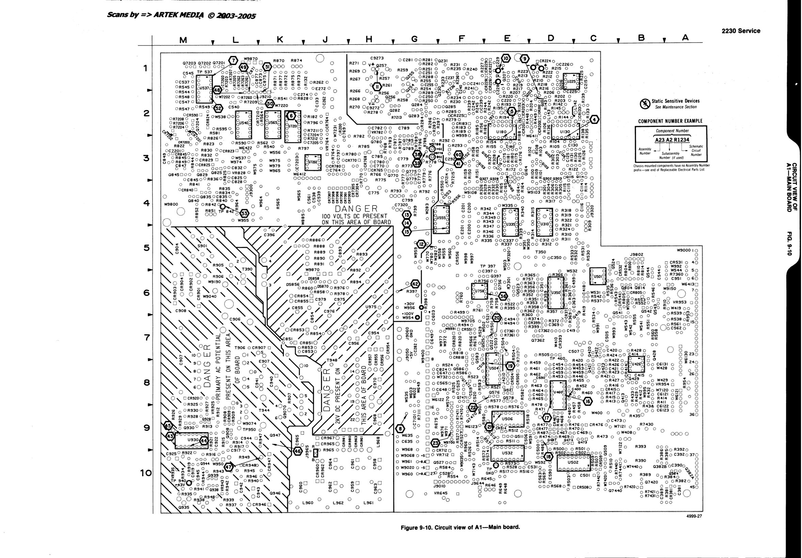


<details><summary>OCR text on this page</summary>

```
2230 Service 
M 
1 
L 
v 
K 
1 
J 
7 
H 
v 
G 
v 
F 
v 
E 
1 
D 
T 
C 
1 
B 
v 
A 
I 
Static Sensitive Devices 
See Ma~ntenance Sectron 
COMPONENT NUMBER EXAMPLE 
I 
Component Number - 
I 
' A23 A2 R1234 ' 
Assembly ~
~
~
S
i
h
e
m
a
l
c
 
Circuit 
Number 
Number 
Subassembly 
(if used) 
Number 1 
I 
I 
Chasss mounted cornpanenti have no Rsrembly Number 
pref~x-see end of Replaceable Eectrcal Parts Llst 
Figure 9-10. Circuit view of Al-Main 
board.
```

</details>


---

## Page 329 of 451

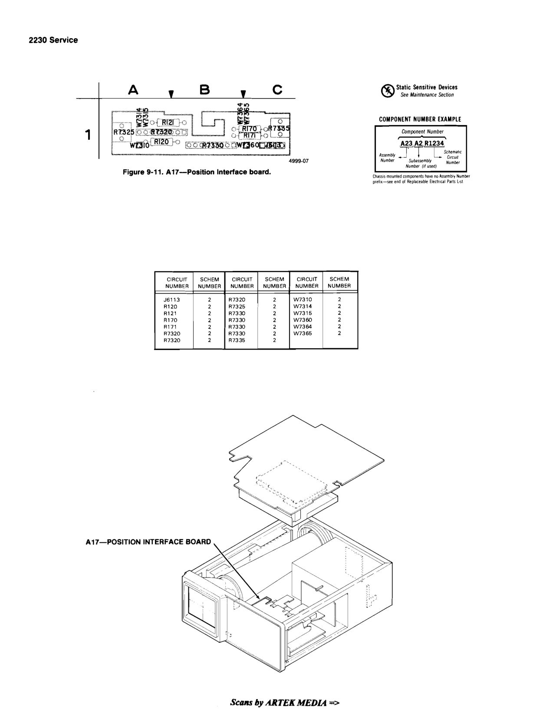


<details><summary>OCR text on this page</summary>

```
2230 Service 
Figure 9-1 1. A17-Position 
Interface board. 
Static Sensitive Devices 
See Marntenance Secbon 
COMPONENT NUMBER EXAMPLE 
Component Number 
I 
Assembly -1' I 
L s:EF 
Number 
Subassembly 
Number (rl used) 
I 
I 
Cnarr r mnlnten cnmoonenlr nade no Arlemo 1 h ~ m l p l 
D ~ Z ! 
&-see enn of Reoaceaoe t erlf ra P a m .,I 
Scans by AR TEK MEDM =>
```

</details>


---

## Page 330 of 451

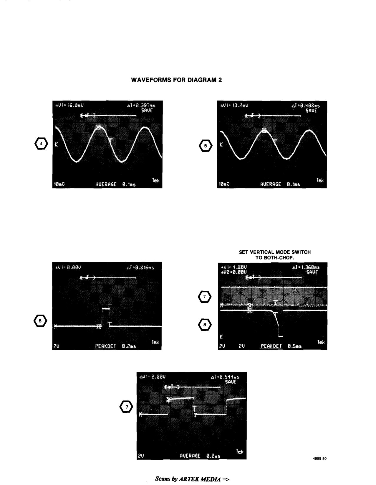


<details><summary>OCR text on this page</summary>

```
WAVEFORMS FOR DIAGRAM 2 
SET VERTICAL MODE SWITCH 
TO BOTH-CHOP. 
Scans by ARTEK MEDU =>
```

</details>


---

## Page 331 of 451

VERTICAL PREAMPLIFIERS AND CHANNEL SWITCHING DIAGRAM 2 
Scans by ARTEK MEDM => 
BOARD 
LOCATION 
2E 
2E 
2 J 
2E 
2D 
7A 
7A 
3K 
2K 
2 M 
1M 
2L 
2J 
3 J 
3F 
3F 
2J 
1 M 
3D 
3E 
1 M 
1 M 
1M 
2L 
2L 
2J 
3 J 
3J 
8G 
3L 
2L 
2D 
2E 
2K 
8A 
8A 
8A 
8A 
8A 
4D 
4F 
SCHEM 
LOCATION 
5M 
5M 
4L 
4M 
3 M 
8F 
8F 
8H 
7H 
7F 
7F 
6G 
4H 
6H 
3K 
6K 
6J 
6F 
1 K 
4K 
7G 
7F 
7F 
8G 
7E 
7H 
4H 
6H 
7F 
7F 
7G 
1 L 
4L 
6G 
1 D 
2D 
5 0 
7D 
ED 
2A 
6A 
ASSEMBLY A 3 
BOARD 
LOCATION 
3D 
2D 
3 0 
3D 
4C 
4D 
3D 
3C 
3C 
3C 
3D 
1J 
2C 
2C 
2D 
2C 
2C 
2D 
2D 
2D 
2D 
3F 
3F 
3F 
3F 
3E 
3E 
2F 
3F 
3F 
4E 
4E 
3E 
3E 
3E 
3E 
3E 
2J 
2F 
2 F 
2E 
3E 
2F 
2E 
2E 
b 
BOARD 
LOCATION 
4C 
4D 
3 0 
3D 
3D 
2 J 
4E 
4E 
3E 
3E 
3E 
2E 
4J 
4J 
1 M 
8 8 
2C 
2F 
2D 
2E 
2D 
2E 
2K 
2D 
2D 
2E 
2 E 
3D 
3D 
3C 
3D 
3F 
3F 
A 3E 
3E 
3D 
3 0 
3D 
3D 
3D 
dfagrams 3. 4. 
CIRCUIT 
NUMBER 
R194 
R195 
R200 
R448 
R449 
R538 
R539 
R540 
R541 
R544 
R545 
R72 10 
R7211 
R7212 
R7214 
R7215 
R7216 
TP537 
U130 
U180 
U537A 
U537C 
U537D 
U540A 
U5408 
U7201 
U7202A 
U7202B 
W535 
W537 
W538 
W2111 
W2112 
W7220 
W9000 
W9000 
W9000 
W9000 
W9000 
W9103 
W9108 
ASSEMBLY 
CIRCUIT 
NUMBER 
C114 
C115 
C125 
C126 
C130 
C133 
C164 
C165 
C175 
C176 
C180 
C440 
C538 
C539 
C545 
C6131 
CR133 
CR183 
CR200 
CR201 
CR202 
CR203 
J9210 
L142 
L143 
L192 
L193 
0 1 0 2 
0 1 0 3 
0 1 14 
0115 
Q1 52 
Q1 53 
Q164 
0165 
R l 0 0 
RlOl 
R102 
R103 
R104 
Parrfal A1 
A1 
SCHEM 
LOCATION 
I D 
2D 
2 J 
2J 
2K 
7.1 
5D 
5D 
5J 
5J 
5K 
3M 
8F 
8F 
7F 
7E 
3K 
8K 
3L 
4L 
3M 
4M 
6F 
1 L 
2L 
4L 
6L 
1 8 
28 
1 E 
2E 
58 
6A 
5E 
5E 
1 8 
28 
1 8 
28 
1 C 
also shown on 
7 8 
8 8 
ED 
CIRCUIT 
NUMBER 
R105 
R106 
R l 08 
R1 09 
R1 14 
R1 15 
R122 
R125 
R126 
R130 
R131 
R132 
R133 
R135 
13136 
R138 
R139 
R142 
R143 
R144 
R145 
R1 50 
R151 
6'152 
R153 
R154 
R155 
R156 
R158 
R159 
R164 
R165 
R172 
R175 
R176 
R180 
R181 
R182 
13183 
R185 
1 8 
1 8 
1 C 
1 D 
2D 
28 
3C 
2C 
2D 
5C 
C901 
CR534 
CR537 
Parr~al A3 atso shown on d~agrams 1. 3, 4. 5. 6 7. 9. 10 and 13 
ASSEMBLY A 1 7 
SCHEM 
LOCATION 
2C 
2 C 
28 
28 
1 E 
2 E 
2E 
2 J 
1 J 
1 K 
2K 
7H 
7 J 
3K 
3K 
3 L 
3 L 
1 M 
2 M 
1 M 
2M 
5 8 
6A 
4 8 
6A 
5C 
5C 
5C 
5 8 
5 8 
5E 
5E 
5E 
5J 
5J 
5 K 
5K 
8H 
8 J 
6K 
S545 
S550 
W534 
LC 
7D 
78 
7C 
:::: ~ :: 
R189 
8 L 
3F 
3F 
4F 
3F 
4F 
4F 
4F 
1 8 
1A 
1 8 
1 8 
1 8 
1 8 
1 C 
R192 
R193 
4C 
28 
2 8 
R7320D 
R7325 
R7330A 
R73308 
R7330C 
R7330D 
R7335 
J6113 
R120 
R121 
R170 
R171 
R73208 
R7320C 
CHASSIS MOUNTED PARTS 
4 M 
6 M 
R111 
R112 
R161 
R162 
5. 6. 7. 8, 9, 10 and 13 
1 A 
1A 
1A 
1 C 
1 8 
1 C 
W7310 
W73 14 
W7315 
W7360 
W7364 
W7365 
2G 
3F 
3F 
4F 
4F 
3F 
3F 
P7390 
P7391 
3F 
2F 
3F 
4F 
3F 
4F 
1 C 
1A 
1A 
1 C 
1 C 
1 8 
1 B 
I 
3F 
3F 
I 
CHASSIS 
CHASSIS 
CHASSIS 
I 
P7392 
P7393 
4F 
4F


---

## Page 332 of 451

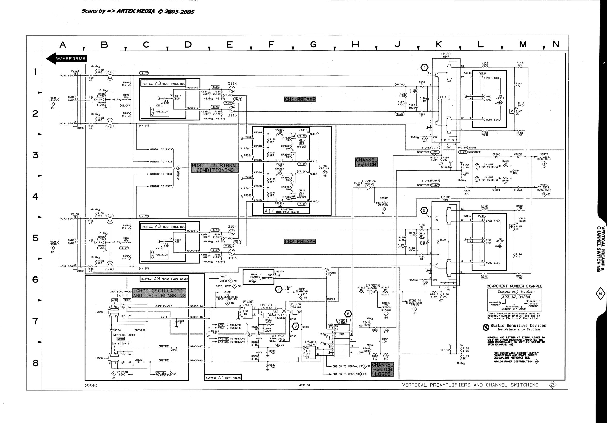


---

## Page 333 of 451

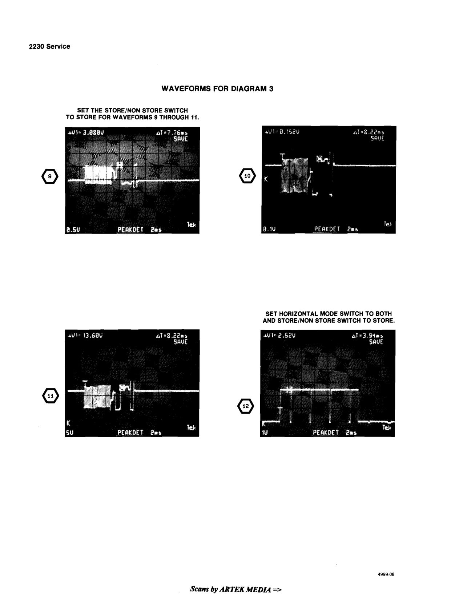


<details><summary>OCR text on this page</summary>

```
2230 Service 
WAVEFORMS FOR DIAGRAM 3 
SET THE STOREINON STORE SWITCH 
TO STORE FOR WAVEFORMS 9 THROUGH 11. 
SET HORIZONTAL MODE SWITCH TO BOTH 
AND STOREINON STORE SWITCH TO STORE. 
Scans by AR TEK MEDL4 =>
```

</details>


---

## Page 334 of 451

VERTICAL OUTPUT AMPLIFIER DIAGRAM 3 
Scans by AR TEK MEDLQ => 
BOARD 
LOCATION 
1 G 
1 G 
2G 
1G 
1 G 
2H 
1 H 
2G 
1 G 
1 G 
1 H 
1 H 
1J 
1 J 
2H 
1 H 
1 H 
2 J 
1 J 
1J 
2 J 
1 J 
2H 
2H 
2F 
1 G 
1 G 
2G 
2G 
2G 
2F 
2G 
2G 
1G 
2G 
3F 
3F 
2G 
2G 
2H 
1H 
2F 
2 F 
1 D 
5G 
4G 
2G 
2G 
8 A 
8A 
9G 
CIRCUIT 
NUMBER 
R251 
R251 
R254 
R255 
R255 
17256 
R257 
R258 
R259 
R259 
R261 
R261 
R262 
R262 
R266 
17267 
R267 
R268 
R269 
R269 
R270 
R271 
R278 
R278 
R279 
R281 
R282 
R283 
R283 
R284 
17285 
R286 
R287 
R288 
A289 
R292 
R293 
R7213 
R7213 
R9272 
R9273 
RT236 
RT2 36 
U225 
W282 
W283 
W284 
W284 
W9000 
W9000 
W9400 
ASSEMBLY A3 
SCHEM 
LOCATION 
4J 
4J 
6 J 
4 J 
4J 
7K 
3K 
6K 
4K 
4L 
5L 
5L 
5L 
5L 
7K 
3L 
5L 
7K 
3L 
5L 
7K 
3L 
4H 
4H 
3J 
2F 
2F 
3H 
5H 
2J 
2K 
2 K 
2K 
3K 
3 K 
2K 
2K 
4H 
4H 
7L 
3L 
5H 
5 J 
7D 
3H 
3H 
3H 
5H 
2F 
3F 
3G 
SCHEM 
LOCATION 
4L 
4L 
4H 
4H 
3J 
2K 
2K 
5C 
5C 
5C 
5C 
5C 
5C 
4C 
4C 
6C 
5D 
5D 
5D 
5D 
5D 
4D 
4D 
6D 
4D 
4D 
6D 
5E 
5E 
5E 
5E 
7D 
5F 
5F 
5G 
5G 
6 J 
4 J 
5H 
5 J 
6 J 
5J 
5 J 
5H 
5 J 
5H 
5H 
5H 
5H 
5H 
5H 
5H 
5H 
6 J 
10 and 13 
CIRCUIT 
NUMBER 
0257 
0257 
0282 
0282 
0283 
0 2 8 4 
0285 
R202 
R202 
R203 
R203 
R 2 M 
R 2 M 
17206 
R206 
17207 
R2lO 
R212 
R213 
R215 
R215 
A216 
R216 
R217 
R218 
R218 
R219 
R222 
R222 
R223 
R223 
R2 25 
R276 
R226 
R227 
R227 
A230 
R231 
R233 
R233 
R234 
R235 
R2 36 
R239 
R240 
R241 
R241 
A242 
R242 
17244 
R244 
R245 
R245 
R2 50 
5, 6. 7, 8, 9. 
ASSEMBLY 
CIRCUIT 
NUMBER 
C202 
C210 
C225 
C226 
C228 
C229 
C229 
C237 
C239 
C240 
C241 
C241 
C242 
C242 
C250 
C251 
C251 
C262 
C262 
C28 1 
C282 
C282 
C292 
C9272 
C9273 
CR224 
CR224 
CR225 
CR225 
CR226 
CR226 
CR227 
CR227 
CR228 
CR228 
CR229 
CR229 
DL9210 
DL9210 
0202 
0202 
0203 
0 2 0 6 
0 2 0 6 
0207 
0 2 3 0 
0 2 3 1 
0 2 3 1 
0 2 5 4 
0255 
0 2 5 5 
0256 
Parl~al A? 
A224 
3E 
2 8 
5226 
3E 
BOARD 
LOCATION 
1 H 
1 H 
2G 
2G 
2G 
2G 
2G 
2D 
2D 
2 D 
2D 
2D 
2D 
2D 
2D 
2E 
1 D 
1D 
1 E 
1 D 
1 D 
2D 
2D 
2E 
1 D 
1 D 
1 E 
1 D 
1 D 
1 E 
1 E 
1 C 
1E 
1 E 
1 F 
1 F 
2F 
1 F 
1 F 
1 F 
2F 
1 F 
1 F 
2F 
1 F 
2F 
2F 
2E 
2E 
2F 
2F 
2F 
2F 
2G 
2C 
A1 
SCHEM 
LOCATION 
5D 
5D 
7D 
3F 
6G 
5G 
5G 
5J 
5H 
5J 
5H 
5H 
5H 
5H 
6J 
4J 
4J 
5L 
5L 
2F 
3H 
5H 
2K 
3L 
7L 
4F 
4F 
4G 
4G 
5F 
5F 
5F 
5F 
5G 
5G 
5G 
5G 
5E 
5E 
4C 
4C 
6C 
4D 
4D 
6D 
6J 
4J 
4J 
6L 
4L 
4L 
7K 
also shown on 
BOARD 
LOCATION 
1 D 
1 E 
2D 
1 D 
2E 
1 E 
1 E 
1 F 
2F 
1 F 
1 F 
1 F 
2F 
2F 
2G 
1 G 
1 G 
2J 
2J 
1 G 
7G 
7G 
3F 
2H 
1 H 
1 D 
1 D 
2F 
2F 
1 E 
1 E 
1 E 
1 E 
1 E 
1 E 
1 E 
1 E 
1 E 
1 E 
2D 
2D 
2E 
1 D 
1 D 
1 E 
2F 
1 F 
1 F 
2G 
1 G 
1 G 
2H 
d~agrams 2. 4. 
Parrfal A3 also shown on d~agrarns 1. 2. 4. 5, 6. 7. 9 10 and 13 
CHASSIS MOUNTED PARTS 
- 
P9272 
P9273 
7 M 
3 M 
CHASSIS 
CHASSIS 
7 M 
3 M 
W9272 
W9273 
CHASSIS 
CHASSIS


---

## Page 335 of 451

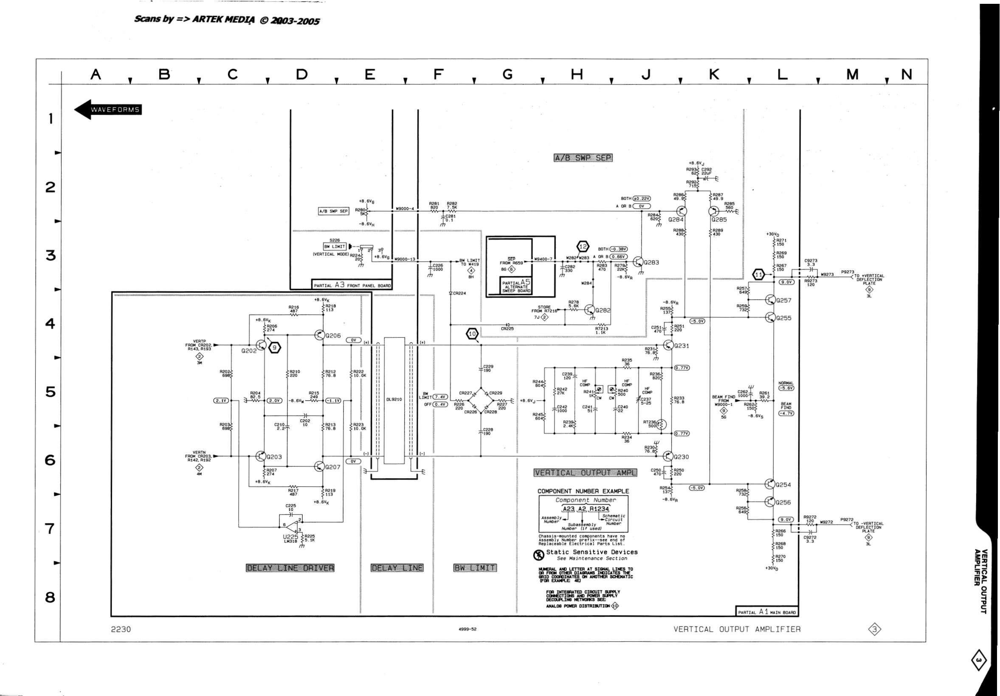


<details><summary>OCR text on this page</summary>

```
2230 
4999-52 
VERTICAL OUTPUT AMPLIFIER
```

</details>


---

## Page 336 of 451

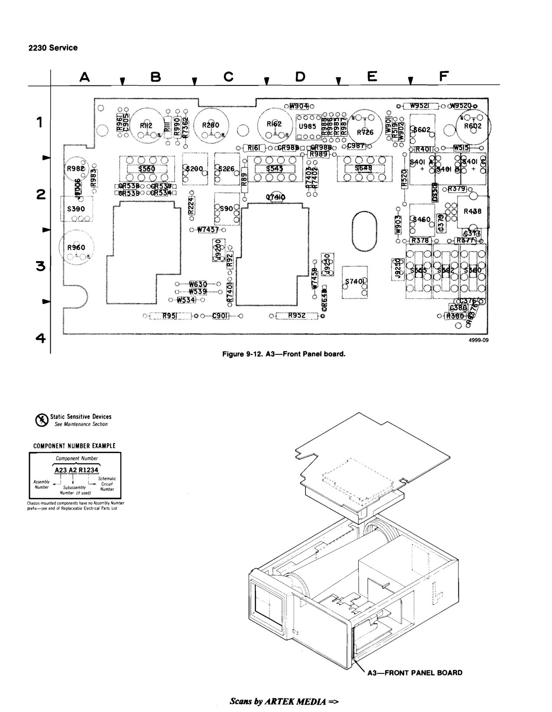


<details><summary>OCR text on this page</summary>

```
2230 Service 
4999-09 
Figure 9-12. A3-Front 
Panel board. 
Static Sensitive Devices 
See M a ~ n t e n a n c e Secbon 
COMPONENT NUMBER EXAMPLE 
I 
Componenf N u m b e r - 
I 
'A23 A2 w' 
.TT - 
S;;;:" 
Number 
Subassembly 
Number ill used) 
Charrls mounted componenlr have no Assembly Number 
prel~x-see end of Replaceable Eectrcal Parts List 
Scam by ARTEK MEDL4 =>
```

</details>


---

## Page 337 of 451

AS-FRONT 
PANEL BOARD 
4999-1 0 
Figure 9-13. Circuit view of At-Front 
Panel board. 
Scans by AR TEK MEDL4 => 
CIRCUIT 
NUMBER 
5380 
5390 
5392 
5401 
5401 
5401 
5438 
5460 
5545 
5550 
5555 
5602 
5648 
57401 
US85 
US85 
W515 
W534 
W539 
W630 
W901 
W902 
W903 
W904 
W7457 
W7458 
W9520 
W9521 
W9900 
CIRCUIT 
NUMBER 
C376 
C377 
C379 
C380 
C901 
C905 
C987 
CR534 
CR537 
CR538 
CR539 
CR648 
CR988 
CR989 
05518 
J9006 
J9200 
J9250 
J9250 
J9250 
J9900 
07410 
R89 
R92 
R111 
R112 
R161 
R162 
R224 
R280 
SCHEM 
NUMBER 
4 
9 
4 
5 
5 
5 
4 
4 
2 
2 
4 
6 
6 
5 
7 
10 
5 
2 
4 
4 
6 
5 
5 
6 
1 
5 
5 
5 
7 
CIRCUIT 
NUMBER 
R377 
R378 
R379 
R380 
R401 
R43B 
R519 
R520 
R602 
R726 
R951 
R952 
R960 
R961 
R982 
R983 
R985 
R986 
R987 
R9BB 
R989 
R990 
R7362 
R7401 
R7402 
R7403 
R9376 
590 
5200 
5226 
SCHEM 
NUMBER 
4 
4 
4 
4 
2 
1 0 
7 
2 
2 
2 
4 
4 
7 
7 
5 
9 
1 
4 
5 
7 
7 
1 
1 
1 
2 
2 
2 
2 
3 
3 
SCHEM 
NUMBER 
4 
4 
4 
4 
5 
4 
5 
5 
6 
7 
1 
1 
13 
13 
9 
9 
7 
7 
7 
7 
7 
7 
4 
1 
1 
1 
4 
1 
4 
3


---

## Page 338 of 451

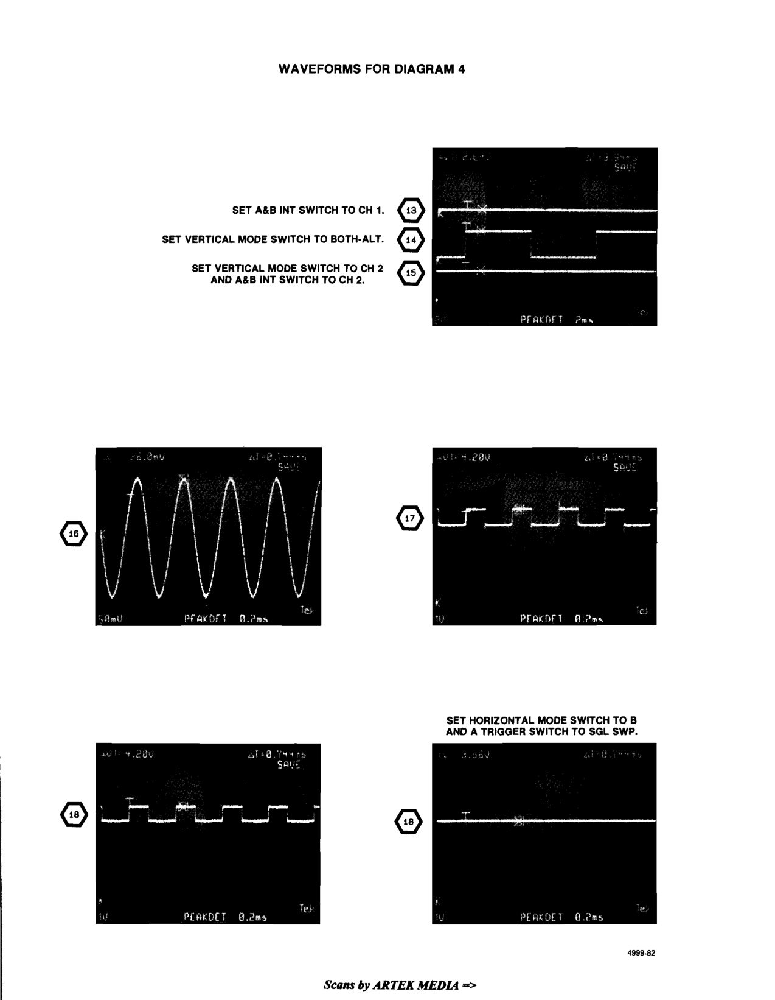


<details><summary>OCR text on this page</summary>

```
WAVEFORMS FOR DIAGRAM 4 
SET ABB INT SWITCH TO CH 1. 
SET VERTICAL MODE SWITCH TO BOTH-ALT. 
SET VERTICAL MODE SWITCH TO CH 2 
AND ABB INT SWITCH TO CH 2. 
SET HORIZONTAL MODE SWITCH TO B 
AND A TRIGGER SWITCH TO SOL SWP. 
Scans by ARTEK MEDL4 =>
```

</details>


---

## Page 339 of 451

ASSEME 
CIRCUIT 
NUMBER 
C312 
C337 
C337 
C350 
C351 
C363 
C369 
C381 
C389 
C390 
C392 
C397 
C400 
C414 
C415 
C418 
C419 
C453 
C454 
C459 
C467 
C469 
C473 
C544 
C561 
C565 
C7361 
C7362 
.Y A1 
SCHEM 
BOARD 
1 H 
5D 
4D 
7D 
6D 
6G 
6G 
6H 
7H 
3K 
ELJ 
1 L 
3L 
1L 
4L 
1 L 
3L 
7M 
7M 
8M 
3G 
3D 
shown 
TRIGGERING DIAGRAM 4 
ASSEMBLY A3 
BOARD 
LOCATION 
78 
6 8 
6 8 
78 
4F 
78 
78 
7A 
3K 
2K 
4K 
6A 
7E 
5D 
5E 
8D 
5D 
5E 
6D 
6D 
6D 
6D 
6D 
8 8 
8 8 
8D 
6C 
6C 
4F 
4F 
4F 
4F 
2K 
2K 
2K 
2K 
4E 
7D 
6A 
8 8 
8 8 
8C 
8C 
6C 
6D 
7 8 
7 8 
5F 
5G 
5F 
6A 
9C 
8 A 
8 A 
8A 
8A 
8A 
8A 
8A 
8A 
CR539 
1 
1A 
CR648 
1A 
SCHEM 
LOCATION 
2C 
2C 
2C 
1E 
3C 
2D 
3C 
2D 
2E 
2F 
2F 
8H 
8H 
4G 
7G 
6K 
4E 
6E 
4H 
4H 
5G 
5G 
4G 
1 L 
3 L 
5K 
3H 
1 H 
3C 
3E 
2E 
3E 
1E 
2E 
3E 
2E 
6E 
6J 
8H 
1 M 
3M 
4L 
5L 
4G 
2C 
CIRCUIT 
SCHEM 
BOARD 
CIRCUIT 
SCHEM 
NUMBER 
LOCATION LOCATION 
NUMBER 
LOCATION 
0542 
2C 
6 8 
R389 
6G 
0543 
2D 
68 
R390 
5G 
0544 
2D 
68 
17392 
7H 
07362 
8J 
7D 
R393 
6H 
R395 
7H 
R301 
4C 
4 0 
R399 
7H 
A302 
5C 
3D 
R411 
3J 
R303 
4C 
3D 
R412 
3J 
R3W 
5D 
4D 
R413 
3K 
R305 
4D 
4D 
R414 
1 K 
R306 
5D 
4D 
R415 
3K 
R307 
4D 
4D 
R416 
1 K 
R309 
4D 
5C 
R417 
3K 
R310 
5D 
5D 
R419 
8J 
R311 
4D 
5D 
R420 
4K 
R312 
4E 
5D 
R42 1 
4L 
R314 
5E 
5D 
R422 
1 L 
R315 
4E 
4D 
R423 
3L 
R317 
3F 
4D 
R424 
1 L 
R318 
4F 
4D 
R426 
1 L 
R319 
5F 
4D 
R427 
3L 
R321 
5F 
5D 
R428 
1 M 
R322 
5F 
4D 
R429 
3L 
R324 
5E 
5D 
R432 
1 L 
R326 
6C 
4F 
R433 
3M 
R327 
7C 
3E 
R433 
3M 
R328 
6C 
3E 
R434 
1 L 
R329 
7D 
4E 
R435 
1 L 
R330 
6D 
4E 
R446 
4L 
R331 
7D 
4E 
R452 
6K 
R332 
6D 
4E 
R453 
4L 
R335 
7D 
5E 
R454 
4M 
R336 
6D 
5E 
R455 
8K 
R337 
7E 
5E 
R457 
5 K 
R339 
7F 
5E 
R458 
5K 
R340 
6F 
4E 
R459 
5L 
R342 
2F 
4F 
R460 
5K 
R343 
6F 
4E 
A461 
4K 
R344 
7 F 
4E 
R462 
5K 
R346 
7F 
5E 
R463 
7K 
R347 
8F 
5E 
R464 
7L 
R349 
7E 
4E 
R465 
6L 
R3 50 
4G 
6E 
R467 
6L 
R351 
5G 
6D 
R468 
7L 
R352 
4G 
6E 
R469 
6L 
R353 
5G 
6D 
R470 
7L 
R354 
4F 
5E 
R471 
7K 
R355 
5F 
5E 
R473 
7M 
R356 
4G 
6E 
R474 
8M 
CHASSIS MOUNTED PARTS 
1C 
4F 
2C 
3F 
Partfal A3 also shown on dtagrarns 1, 2, 3. 5. 6. 7. 9. 10 and 13 
2A 
3D 
J9376 
R357 
5G 
7D 
R476 
6M 
R358 
4G 
6D 
R477 
6M 
A359 
4H 
6D 
R478 
7K 
R360 
5G 
7E 
R486 
6M 
R361 
4G 
6D 
R487 
7M 
R363 
4H 
6E 
R530 
1 H 
A365 
4 J 
6E 
R531 
3H 
R366 
4H 
6D 
R532 
3F 
R367 
4H 
6D 
R533 
2F 
R369 
5 J 
7D 
R534 
1 H 
R372 
4 J 
7D 
R535 
3G 
R3 74 
4 J 
7D 
R536 
3G 
R381 
6G 
10A 
R537 
3G 
R382 
6G 
1 OA 
R542 
4G 
R384 
6G 
10A 
13543 
3 0 
3. 5. 6, 7. 8. 9. 10 and 13 
BOARD 
LOCATION 
108 
108 
10A 
108 
6E 
7D 
98 
88 
9C 
8 8 
8C 
8C 
8C 
6C 
8C 
8C 
8C 
8C 
7C 
8C 
8C 
78 
8B 
88 
88 
88 
98 
9 8 
8C 
8C 
8D 
8C 
8C 
9D 
9C 
8D 
8C 
8D 
8D 
8D 
8D 
8D 
9D 
9D 
9D 
9D 
9D 
9C 
9D 
R7362 
R9376 
5200 
S380 
C376 
C377 
C379 
C380 
18 
CHASSIS 
CIRCUIT 
NUMBER 
R551 
R552 
R553 
R555 
A556 
R558 
R560 
R561 
R562 
R564 
R565 
R7360 
R7361 
T350 
TP397 
TP460 
U310 
U335 
U350A 
U3508 
U350C 
U350D 
U350E 
U426A 
U426B 
U46D 
U501 A 
U501 8 
U555A 
U555B 
U555C 
U555D 
U565A 
U565C 
U565C 
U565D 
W335 
W410 
W419 
W428 
W429 
W453 
W459 
W531 
W532 
S460 
S555 
8A 
6A 
1A 
5A 
18 
6A 
6A 
7A 
R3 80 
R438 
9D 
9D 
9D 
10D 
9D 
5C 
5C 
5C 
5D 
7C 
6C 
6C 
6C 
6C 
6C 
68 
4F 
3D 
2F 
2F 
2F 
4N 
4A 
J9250 
R377 
R378 
R379 
6A 
6A 
6A 
58 
5 8 
2M 
W541 
3C 
2F 
3F 
W539 
1 8 
W 6 3 0 
2A 
4F 
3F 
2F 
4F 
W543 
W555 
W558 
W560 
W992 
W7121 
W9000 
W9000 
W9000 
W9000 
W9000 
W9000 
W9000 
W9000 
3C 
3C 
3F 
2F 
3D 
3C 
2D 
3D 
1 C 
6M 
1 8 
1M 
28 
3 8 
3M 
4M 
58 
5M 
S392 
5438


---

## Page 340 of 451

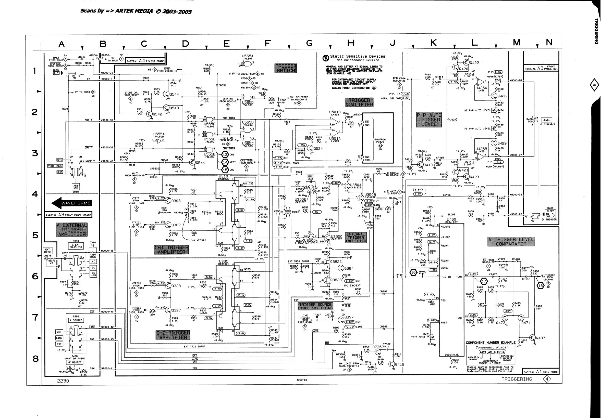


---

## Page 341 of 451

2230 Service 
Figure 9-14. A4-Timing 
board. 
A4-TIMING 
BOARD 
Scans by ARTEK MEDIA => 
ClRCUiT 
NUMBER 
R749 
R750 
R751 
R752 
R753 
R754 
R755 
R763 
R765 
R767 
A769 
R771 
R772 
R774 
R781 
R790 
S701 
S701 
5701 
S701 
U715 
U715 
U715 
U750 
U751 
U760 
U760 
VR749 
W13W 
W13W 
W13W 
W 1 3 W 
W 1 3 W 
W 1 3 W 
W5201 
CIRCUIT 
NUMBER 
C673 
C701 
C701 
C701 
C701 
C702 
C703 
C705 
C706 
C707 
C708 
C710 
C712 
C713 
C714 
C720 
C724 
C728 
C749 
C750 
C751 
C752 
C755 
CR732 
CR742 
CR760 
CR761 
J9700 
J9700 
J9700 
J9705 
J9705 
J9705 
P9250 
0 7 0 1 
0704 
0704 
SCHEM 
NUMBER 
7 
7 
7 
10 
7 
7 
7 
6 
6 
6 
6 
6 
6 
6 
6 
5 
5 
5 
5 
6 
6 
6 
10 
10 
10 
7 
10 
10 
6 
6 
6 
10 
10 
10 
7 
CIRCUIT 
NUMBER 
0 7 0 6 
0709 
0 7 1 0 
0 7 1 0 
0712 
0732 
0737 
0742 
R673 
R701 
R702 
R703 
R704 
R705 
R707 
R709 
R710 
R711 
R713 
R724 
R727 
R728 
R730 
R731 
R732 
R733 
R737 
R738 
R740 
R741 
R742 
R743 
R744 
R745 
R746 
R747 
R748 
SCHEM 
NUMBER 
6 
5 
5 
6 
6 
5 
5 
10 
10 
1 0 
5 
1 0 
6 
6 
6 
7 
10 
7 
10 
1 0 
7 
10 
7 
7 
7 
6 
6 
5 
6 
7 
7 
7 
1 0 
5 
5 
5 
5 
SCHEM 
NUMBER 
5 
6 
6 
6 
6 
7 
7 
7 
6 
5 
5 
5 
6 
5 
5 
6 
6 
6 
6 
10 
7 
7 
7 
7 
7 
7 
7 
7 
7 
7 
7 
7 
6 
7 
7 
6 
7


---

## Page 342 of 451

1si1 S I J P ~ sJllpal3 alqra,olda(l 
10 pua aar-r~laid 
1;xllunhl Iaoasnr nuarru rluauodluo~oalilnolll 
rlrreul 
0 L 
9 
9 
5 
OL 
9 
9 
O L 
9 
9 
9 
9 
H3EWnN 
W3H3S 
L8Ln 
L8Ln 
~
8
~
n
 
L8Ln 
L8Ln 
08Ln 
08Ln 
O B L ~ 
oeLn 
08Ln 
86Ltl 
S6LH 
H3EWnN 
lln3t113 
POELM 
POELM 
POELM 
POELM 
E8Ln 
F8Ln 
C8Ln 
z e ~ n 
Z8Ln 
Z8Ln 
Z8Ln 
Z8Ln 
t138WnN 
lln3H13 
5 
5 
9 
5 
S 
9 
9 
9 
9 
OL 
OL 
9 
t13EWnN 
W3H3S 
OL 
5 
s 
S 
S 
OL 
5 
s 
s 
S 
S 
9 
t13EWnN 
W3H3S 
P6LH 
L6LH 
SELH 
SELH 
PELH 
6ZLH 
5ZLH 
CZLH 
LZPST 
89L3 
L9L3 
99L3 
H3EWnN 
lln3t113


---

## Page 343 of 451

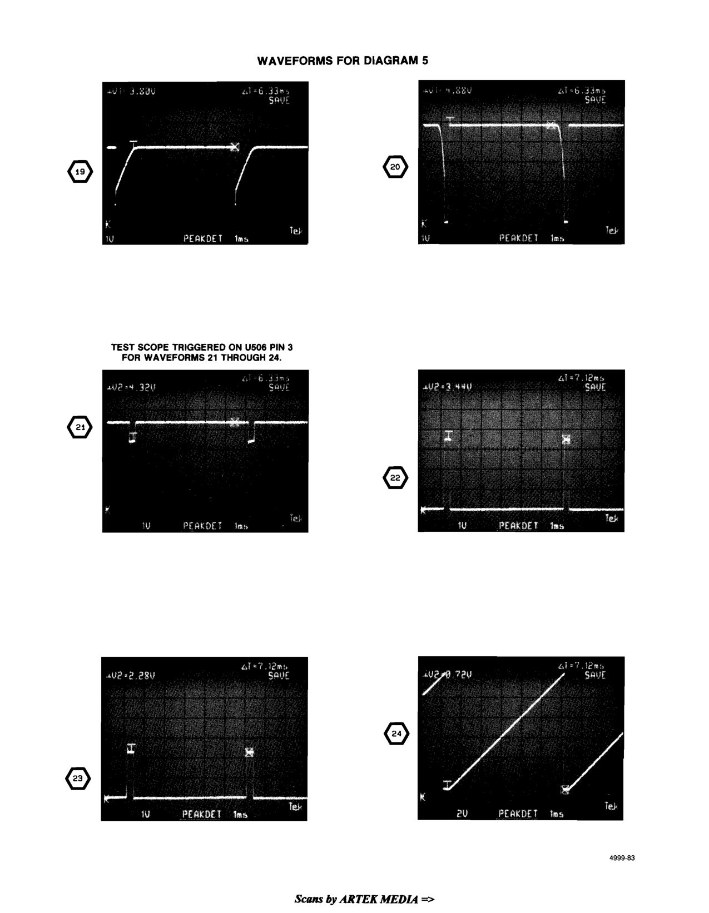


<details><summary>OCR text on this page</summary>

```
WAVEFORMS FOR DIAGRAM 5 
TEST SCOPE TRIGGERED ON U506 PIN 3 
FOR WAVEFORMS 21 THROUGH 24. 
Scans by ARTEK MEDIA =>
```

</details>


---

## Page 344 of 451

A SWEEP GENERATOR AND LOGIC DIAGRAM 5 
Scam by ARTEK MEDIA = 
BOARD 
LOCATION 
BE 
9E 
9E 
8E 
1 OF 
9G 
7E 
108 
108 
9 8 
108 
1 OC 
1 OC 
1 OC 
9F 
SF 
1OC 
8E 
8E 
9E 
105 
10E 
10E 
10E 
7F 
5E 
1 OC 
1 OC 
108 
8A 
8A 
8A 
8A 
8 A 
SF 
ASSEMBLY 
CIRCUIT 
NUMBER 
C500 
C501 
C504 
C505 
C518 
C519 
C520 
C521 
C525 
C527 
C528 
C563 
C6121 
C6122 
C6123 
CR501 
CR504 
CR505 
CR508 
CR509 
CR514 
CR527 
J4210 
(1509 
(151 1 
(1521 
(1522 
(1523 
(1525 
(1527 
(1576 
(1578 
(17420 
07440 
Partial A 1 
CIRCUIT 
NUMBER 
(17470 
(1747 1 
(17472 
R500 
R501 
R502 
R503 
R504 
R505 
R507 
R509 
R510 
R511 
R512 
R513 
R514 
R515 
R516 
R517 
R518 
R521 
R522 
R523 
R524 
R525 
R526 
R527 
R528 
R529 
R568 
R569 
R571 
R572 
R573 
R574 
R576 
4, 6. 7. 8. 9. 
ASSEMBLY A 3 
A1 
SCHEM 
LOCATION 
1 D 
3C 
3C 
3 8 
7E 
7C 
7C 
6D 
6F 
2L 
2K 
1D 
5E 
5E 
4E 
6D 
3D 
2K 
1C 
2D 
2 J 
2K 
1 L 
3D 
2J 
7F 
5E 
6E 
7F 
2L 
1 K 
1 K 
4E 
4D 
also shown on 
SCHEM 
LOCATION 
8D 
8D 
8E 
1C 
2C 
2C 
3C 
3C 
3 8 
2D 
3D 
2D 
2H 
2H 
2H 
1J 
2G 
2 J 
2 J 
3 0 
7F 
6E 
7F 
7F 
6F 
2F 
2K 
1 F 
5E 
1 D 
1 D 
1 E 
1G 
1 J 
2G 
1 K 
10 and 13. 
BOARD 
LOCATION 
1 OD 
1 OC 
7E 
7C 
8F 
8F 
8F 
7E 
8F 
8G 
1 OF 
1 OD 
8 8 
9 8 
9 8 
7E 
BE 
BE 
1 OC 
1 OC 
9E 
SF 
8E 
1 OC 
9E 
8E 
7E 
6E 
7E 
1 OF 
BE 
8E 
108 
1 OC 
diagrams 2. 3. 
2 F 
2F 
2F 
3E 
1 F 
1 E 
3A 
1 A 
2A 
BOARD 
LOCATION 
9F 
BF 
8F 
100 
1 OC 
1 OD 
10D 
7E 
7D 
1 OC 
1 OC 
1 OC 
9E 
9E 
9E 
SF 
1OF 
10E 
10E 
9E 
8E 
6E 
8F 
8F 
8F 
1OF 
9F 
10E 
7F 
1 OD 
1 OD 
9E 
9F 
10E 
10E 
9E 
DS518 
J9250 
Partial A3 also shown on d~agrams 1. 2, 3. 4. 6. 7. 9. 10 and 13. 
ASSEMBLY A4 
W903 
W7458 
W9520 
W9521 
3F 
7 8 
2F 
3D 
CIRCUIT 
NUMBER 
R577 
R578 
R580 
R582 
R584 
R585 
R7117 
R7420 
R7421 
R7430 
R7431 
R7440 
R7441 
R7442 
R7470 
R7471 
U502 
USWA 
U 5 M B 
U506 
U532A 
U5328 
U532C 
U532D 
W502 
W503 
W7122 
W7420 
W7440 
W9000 
W9000 
W9000 
W9000 
W9000 
W9700 
R401 
R519 
R520 
S401A 
S401 8 
S401 C 
- 
3 8 
1 A 
1 A 
1 A 
1 A 
SCHEM 
LOCATION 
1 K 
1 K 
2K 
1 K 
2L 
2L 
2K 
4E 
4E 
4C 
5C 
4D 
4D 
4D 
8D 
8 0 
2D 
3D 
7E 
1 H 
1 J 
1 G 
1 G 
1 D 
6E 
6E 
1 C 
4E 
4D 
1 8 
2 8 
2E 
3 8 
5 8 
8C 
7 8 
5 8 
7A 
7A 
2A 
7A 
7A 
1 F 
1 E 
2E 
Partial A4 also shown on diagrams 6, 7 and 10 
r 
3N 
4L 
3K 
4K 
8C 
2E 
3D 
1 F 
1 F 
S7401 
5A 
W 5 l 5 
2 1 
W902 
7A 
1 
3 M 
4 M 
4M 
4N 
3H 
3H 
3L 
4 M 
C70 1 A 
C7018 
C702 
C703 
C708 
39700 
P9250 
1A 
2A 
2A 
2A 
3A 
3C 
1A 
3L 
3L 
3L 
3L 
4 M 
7C 
7 8 
(1701 
(1704A 
(17048 
0706 
R701 
R702 
R703 
R705 
3A 
3A 
3 8 
3A 
2A 
2A 
2A 
3 8 
R707 
R790 
S701 A 
5701 8 
5701 8


---

## Page 345 of 451

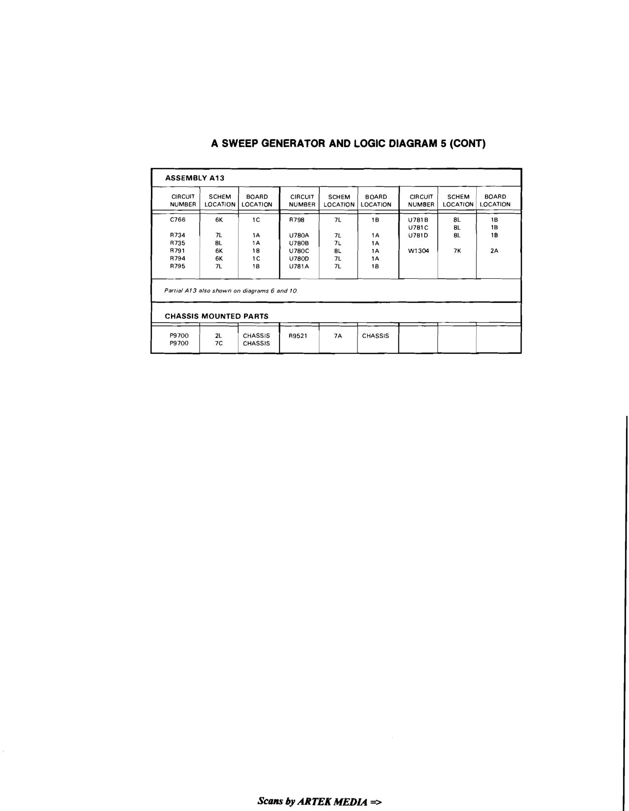


<details><summary>OCR text on this page</summary>

```
A SWEEP GENERATOR AND LOGIC DIAGRAM 5 (CONT) 
Scans by ARTEK MEDU =>
```

</details>


---

## Page 346 of 451

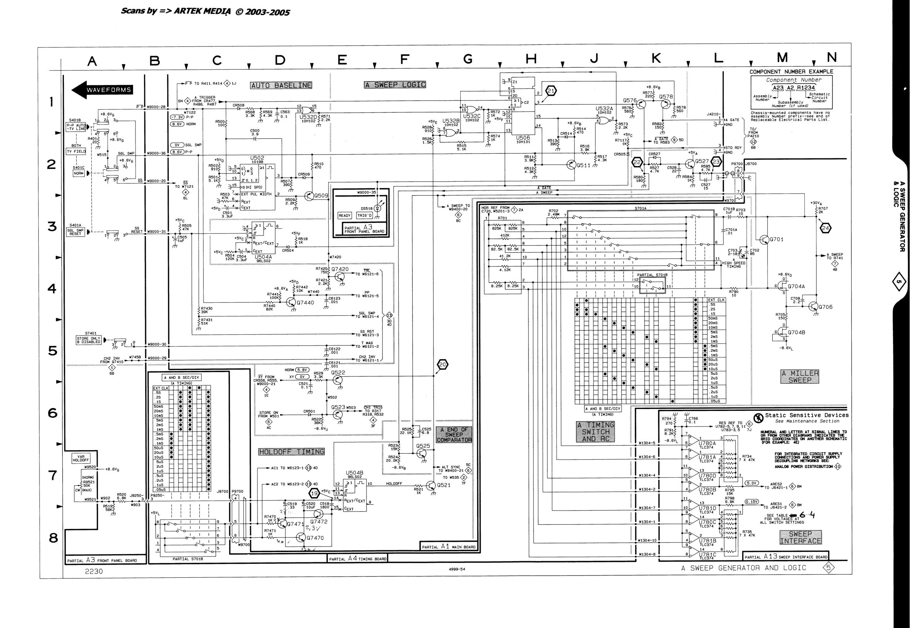


<details><summary>OCR text on this page</summary>

```
a n S by => ARTEK MEDa @ 2003-2005
```

</details>


---

## Page 347 of 451

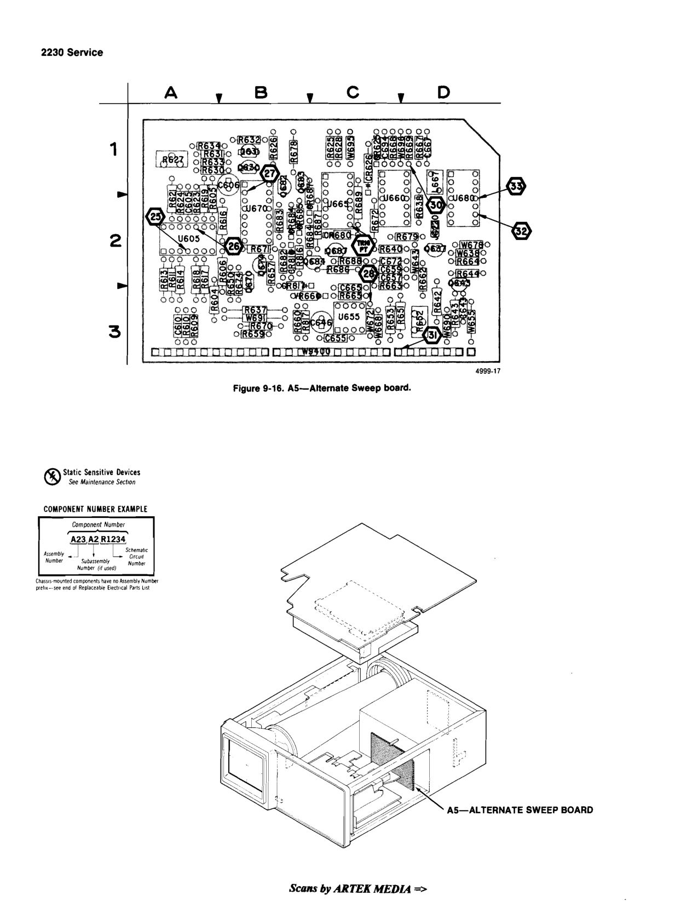


<details><summary>OCR text on this page</summary>

```
2230 Service 
Figure 9-16. A5-Alternate 
Sweep board. 
Static Sensitive Devices 
See Mainfenance Sectron 
COMPONENT NUMBER EXAMPLE 
Assembly -1 
I L S:p 
Number 
Subdrrembiy 
Number 
Number (rf usedl 
Chasns-mounted components have no Assembly Number 
pret18-see end of Replaceable Electrical Parts List 
SWEEP BOARD 
Scans by ARTEK MEDIA *
```

</details>


---

## Page 348 of 451

A5-ALTERNATE 
SWEEP BOARD 
Scans by ARTEK MEDU * 
CIRCUIT 
NUMBER 
C605 
C606 
C610 
C643 
C646 
C655 
C657 
C659 
C665 
C667 
C672 
C694 
CR625 
CR626 
CR68O 
CR6B4 
CR685 
CR687 
CR816 
CR817 
J4220 
L667 
Q630 
063 1 
063 7 
0643 
0670 
0674 
068 2 
068 3 
C684 
0687 
R604 
R605 
R606 
R609 
R610 
R611 
R613 
R614 
R616 
6 
R688 
6 
SCHEM 
NUMBER 
10 
10 
6 
6 
6 
10 
6 
10 
6 
6 
6 
10 
6 
6 
9 
9 
9 
9 
9 
9 
9 
6 
6 
6 
6 
6 
6 
6 
6 
6 
6 
6 
6 
6 
6 
6 
6 
6 
6 
6 
6 
6 
6 
CIRCUIT 
NUMBER 
R621 
R623 
R624 
R625 
R626 
R627 
R628 
R630 
R631 
R632 
R633 
R634 
R637 
R638 
R640 
R642 
R643 
R644 
R650 
R651 
R652 
R653 
R657 
R659 
R660 
R662 
R663 
R664 
R665 
R667 
R668 
R669 
R670 
8671 
R672 
R674 
R678 
R679 
R682 
R683 
R684 
R686 
R687 
CIRCUIT 
NUMBER 
R689 
RE16 
RBI7 
U605 
U605 
U655 
U660 
U660 
U660 
U660 
U660 
U660 
U660 
U665 
U665 
U665 
U665 
U665 
U670 
U670 
U670 
U680 
U680 
U680 
U680 
U680 
VR660 
W638 
W643 
W655 
W668 
W672 
W678 
W690 
W691 
W695 
W696 
W9400 
W9400 
W9400 
W9400 
W9400 
W9400 
SCHEM 
NUMBER 
6 
6 
6 
6 
6 
6 
6 
6 
6 
6 
6 
6 
6 
6 
6 
6 
6 
6 
6 
6 
6 
6 
6 
6 
6 
6 
6 
6 
6 
6 
6 
6 
6 
6 
6 
6 
6 
9 
6 
6 
6 
6 
6 
SCHEM 
NUMBER 
6 
9 
9 
6 
10 
6 
6 
6 
6 
6 
6 
9 
10 
6 
6 
6 
9 
10 
6 
6 
10 
6 
6 
6 
6 
10 
6 
6 
6 
10 
6 
6 
6 
10 
10 
10 
10 
6 
6 
6 
6 
6 
6


---

## Page 349 of 451

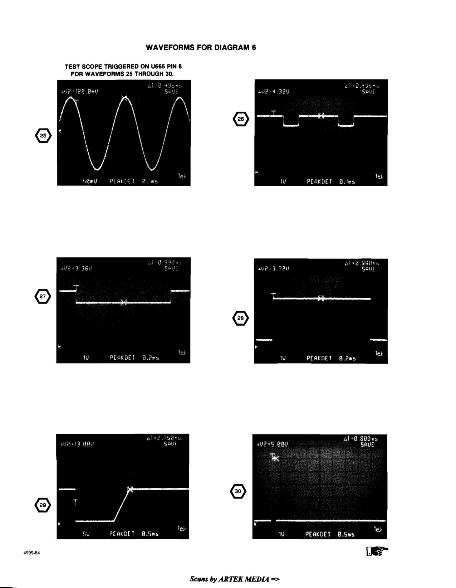


<details><summary>OCR text on this page</summary>

```
WAVEFORMS FOR DIAGRAM 
TEST SCOPE TRIGGERED ON U665 PIN 8 
FOR WAVEFORMS 25 THROUGH 30. 
Scans by ARlEK MEDiA -',
```

</details>


---

## Page 350 of 451

2230 Service 
B TIMING AND ALTERNATE B SWEEP DIAGRAM 6 
Scans by ARTEK M
'
 
e> 
ASSEMBLY A1 
CIRCUIT 
NUMBER 
C603 
C635 
C647 
C648 
C649 
C7101 
SCHEM 
LOCATION 
1 C 
2C 
2K 
3K 
4C 
5C 
BOARD 
LOCATION 
9G 
9G 
9G 
9G 
9G 
9G 
9G 
9G 
9G 
9F 
SCHEM 
LOCATION 
28 
5C 
6C 
6C 
4C 
88 
SCHEM 
LOCATION 
4C 
78 
8B 
6C 
6C 
CR712 
I 
3K 
J9010 
~ ;: 
J9644 
W7143 
W9000 
W 9 0 m 
W9000 
W9000 
O F 1 
R675 
1 ; 
1 
;
;
F
 
VR645 
1 f f i 
VR712 
1 OF 
1 OF 
BOARD 
LOCATION 
7G 
9G 
BF 
8F 
7G 
9G 
Parl~al A1 also shown on d~agrams 2. 3. 4. 5. 7. 8. 9 10 and 13. 
ASSEMBLY A 3 
BOARD 
LOCATION 
1OF 
10E 
10E 
10E 
10E 
CIRCUIT 
NUMBER 
R554 
R645 
R646 
R648 
A649 
R7111 
R602 
CIRCUIT 
NUMBER 
W501 
W602 
W603 
W635 
W649 
W7120 
4C 
1 B 
2 8 
68 
6C 
W9400 
1 OF 
8A 
8A 
8A 
8A 
1 F 
1 F 
2E 
Partla1 A3 also shown on diagrams 1. 2. 3. 4. 5 7. 9. 10 and 13. 
r-! 
ASSEMBLY A 4 
6C 
18 
1 B 
W901 
W904 
CIRCUIT 
NUMBER 
W9400 
W9400 
W9400 
W9400 
W9400 
W9400 
SCHEM 
LOCATION 
4C 
1 B 
2 B 
5C 
4C 
6C 
1 E 
1 D 
5602 
S648 
C673 
C701C 
C701 D 
C712 
C713 
C714 
CR760 
CR761 
J9 700 
BOARD 
LOCATION 
9F 
8G 
8G 
9G 
8G 
8B 
W9400 
( 
7C 
W9400 
8C 
1A 
6A 
W9700 
0709 
0710A 
07108 
071 2 
A673 
R704 
R709 
R710 
R711 
R713 
4L 
4L 
4L 
4L 
4L 
5M 
5L 
6L 
2L 
Parl~al A4 also shown on diagrams 5. 7 and 10. 
3K 
3C 
3C 
3C 
3C 
3C 
38 
38 
3C 
2D 
3C 
4L 
5M 
5M 
5M 
4L 
2 L 
4L 
5M 
4G 
4M 
3 B 
38 
38 
3 8 
2A 
3C 
2A 
38 
3C 
ASSEMBLY A 5 
Parrial A5 also shown on d,agrams 9 and 10 
C610 
C643 
C646 
C657 
C665 
C667 
C672 
CR625 
CR626 
L667 
(1630 
(163 1 
(1637 
0643 
(1670 
(1674 
(1682 
(1683 
(1684 
(1687 
R604 
R605 
R606 
R609 
R744 
R747 
R763 
R765 
R767 
R769 
R771 
R772 
R774 
R781 
3A 
2A 
2A 
2A 
2 8 
2A 
2A 
2A 
2A 
2A 
2A 
1 C 
1 B 
1A 
1 C 
1 A 
1 A 
1 B 
1A 
1A 
3 8 
2D 
2C 
3D 
3D 
2D 
2 B 
3C 
5 L 
4K 
6L 
6M 
6L 
6L 
5L 
5L 
6L 
6M 
BD 
8D 
5 E 
8G 
7D 
7E 
7D 
U E 
7E 
5 E 
5D 
5E 
6E 
6E 
6K 
4D 
5G 
6G 
6F 
6G 
7G 
7F 
7F 
7G 
1 E 
8D 
2G 
1D 
3G 
8D 
7D 
7E 
5E 
6K 
2G 
2G 
5D 
6K 
6K 
1 F 
3H 
6E 
4E 
6G 
6F 
6G 
7G 
2D 
2D 
2D 
1 D 
R652 
R653 
R657 
R659 
R660 
R662 
R663 
R664 
R665 
R667 
R668 
R669 
R670 
R671 
R672 
R674 
R678 
R682 
R683 
R684 
R686 
R687 
R688 
R689 
U605 
U655 
U660A 
38 
38 
1 D 
1 D 
1 D 
1 C 
3A 
3A 
1 D 
1 D 
4J 
6 L 
6L 
6M 
7H 
8H 
S701C 
U715A 
U715B 
W 1 3 M 
W1304 
W1304 
3D 
3C 
28 
38 
38 
2D 
3C 
2D 
3C 
1 D 
1C 
1 D 
38 
28 
2C 
28 
18 
28 
28 
28 
2C 
2C 
2C 
2C 
2A 
3C 
1 D 
1A 
1 D 
1 D 
3 B 
3 8 
38 
1 D 
1 D 
3E 
3D 
2D 
2D 
2D 
3D 
3D 
2E 
3E 
2H 
1 G 
3D 
2G 
6 K 
6 K 
6K 
6K 
3J 
1 F 
1 F 
1 F 
3H 
3G 
3A 
3D 
3C 
2C 
3C 
1 D 
2C 
1 C 
1 C 
1 D 
1 B 
1 B 
2D 
2D 
28 
28 
1 B 
1 B 
2 8 
2C 
3A 
U660B 
U660D 
U660E 
U660F 
U665A 
U665C 
U665D 
U 6 70A 
U670B 
U680A 
U6UOB 
U680C 
U680D 
VR660 
W638 
W643 
W668 
W672 
W678 
W9400 
W9400 
W94M) 
W9400 
W9400 
W9400 
R610 
R611 
R613 
R614 
R616 
R617 
R618 
R619 
R621 
R623 
R624 
R625 
R626 
R627 
R628 
R630 
R631 
R632 
A633 
R634 
R637 
R638 
17640 
A642 
R643 
2A 
28 
3A 
2G 
1 F 
5D 
2G 
8F 
8G 
3J 
1 H 
6F 
5E 
5D 
8E 
7E 
7D 
1 F 
3H 
5D 
6K 
5D 
1 C 
2C 
4C 
5C 
R644 
3H 
I 6 5 0 
4D 
R651 
8D 
I 
1 D 
1 D 
1 D 
1 D 
1 C 
1 C 
1 C 
1 B 
1 B 
1 D 
1D 
1 D 
1 D 
38 
2D 
2D 
3C 
3C 
2D 
3A 
3A 
3A 
3A 
:: 
~ 2 
I


---

## Page 351 of 451

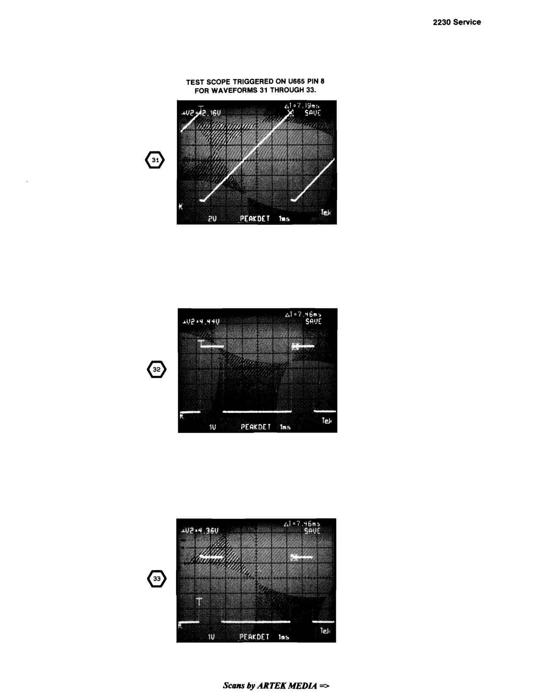


<details><summary>OCR text on this page</summary>

```
2230 Service 
TEST SCOPE TRIGGERED ON U665 PIN 8 
FOR WAVEFORMS 31 THROUGH 33. 
Scans by ARTEK MEDIA *
```

</details>


---

## Page 352 of 451

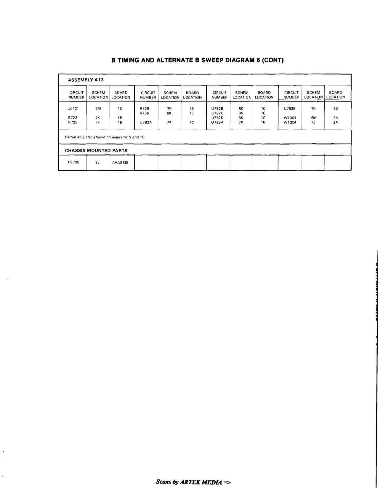


<details><summary>OCR text on this page</summary>

```
B TIMING AND ALTERNATE B SWEEP DIAGRAM 6 (CONT) 
Scans by ARTEK MEDLQ + 
ASSEMBLY A1 3 
CIRCUIT 
SCHEM 
BOARD 
CIRCUIT 
SCHEM 
BOARD 
CIRCUIT 
SCHEM 
BOARD 
CIRCUIT 
SCHEM 
BOARD 
NUMBER 
LOCATION LOCATION 
NUMBER 
LOCATION 
LOCATION 
NUMBER 
LOCATION LOCATION 
NUMBER 
LOCATION 
LOCATION 
R736 
8K 
1 C 
U782C 
BK 
1C 
Parl~al A13 also shown on diagrams 5 and 10 
CHASSIS MOUNTED PARTS 
1 
P9700 
2L 
CHASSIS
```

</details>


---

## Page 353 of 451

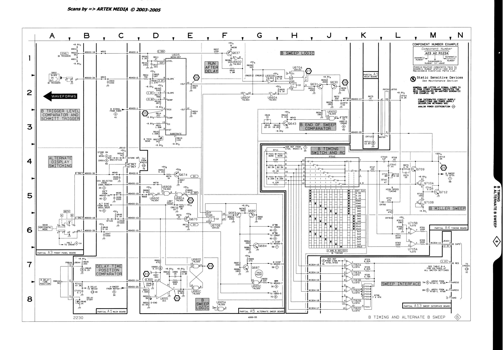


<details><summary>OCR text on this page</summary>

```
1 
1 
2230 
4999-55 
B T I M I N G AND ALTERNATE B SWEEP 
(6) 
1
```

</details>


---

## Page 354 of 451

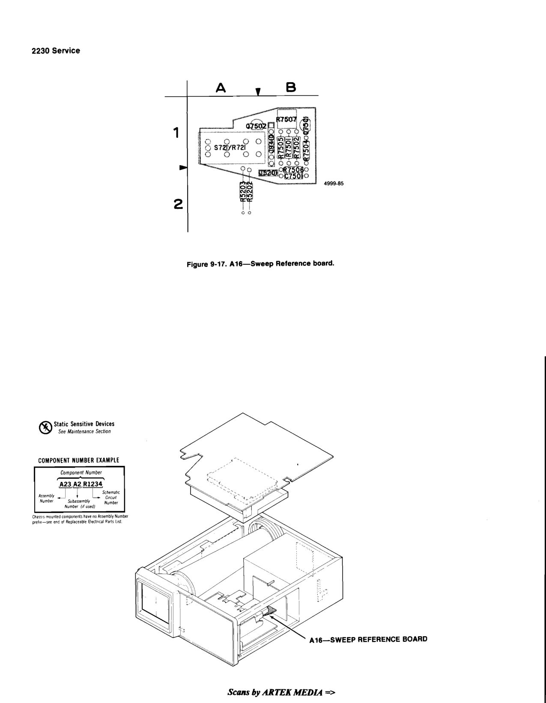


<details><summary>OCR text on this page</summary>

```
2230 Service 
Figure 9-17. A16-Sweep 
Reference board. 
Static Sensitive Devices 
See Marntenance Sectron 
COMPONENT NUMBER EXAMPLE 
Number 
Subassembly 
p,,,,,,ber 
Number (if usedl 
I 
I 
I 
Charrlr mounted components have no Assembly Number 
prellx-see 
end 01 Replaceable Electrical Parts (1st 
Scans by ARTEK MEDLQ => 
REFERENCE BOARD
```

</details>


---

## Page 355 of 451

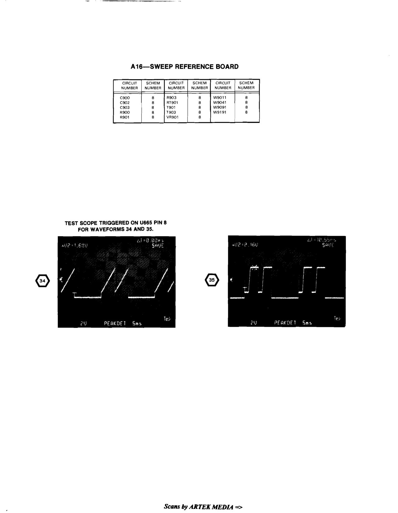


<details><summary>OCR text on this page</summary>

```
A16-SWEEP 
REFERENCE BOARD 
CIRCUIT 
SCHEM 
CIRCUIT 
SCHEM 
NUMBER 
NUMBER 
NUMBER 
NUMBER 
R900 
T903 
R901 
8 
VR901 
TEST SCOPE TRIGGERED ON U665 PIN 8 
FOR WAVEFORMS 34 AND 35. 
Scans by ARTEK MEDLQ -
```

</details>


---

## Page 356 of 451

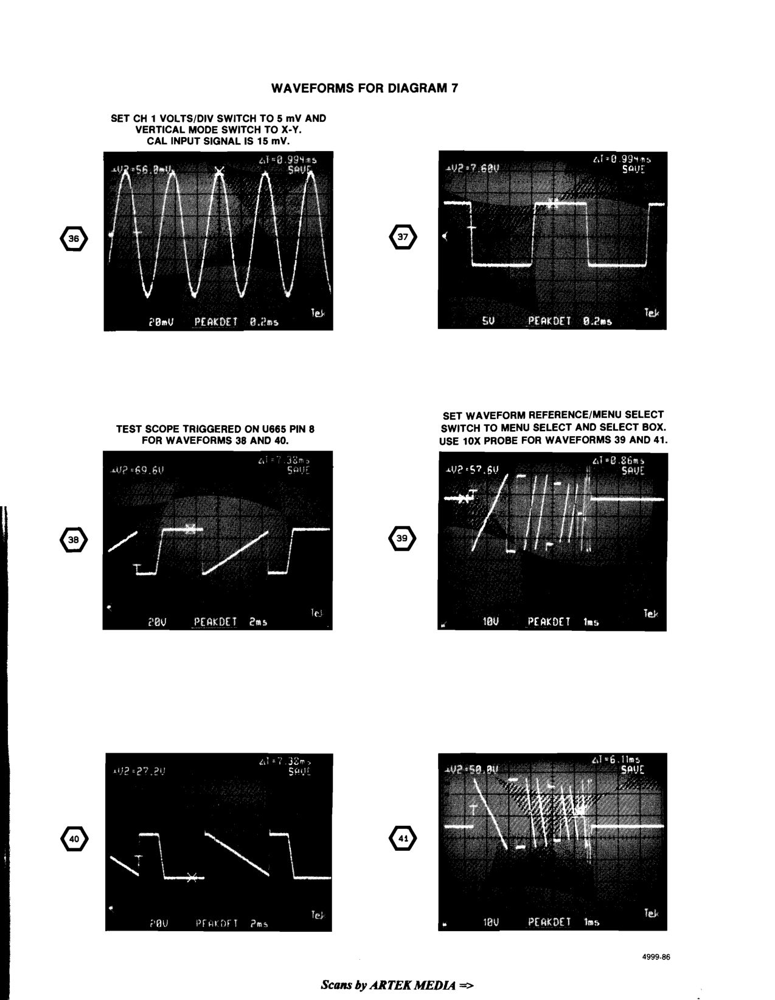


<details><summary>OCR text on this page</summary>

```
WAVEFORMS FOR DIAGRAM 7 
SET CH 1 VOLTSIDIV SWITCH TO 5 mV AND 
VERTICAL MODE SWITCH TO X-Y. 
CAL INPUT SIGNAL IS 15 mV. 
TEST SCOPE TRIGGERED ON U665 PIN 8 
FOR WAVEFORMS 38 AND 40. 
SET WAVEFORM REFERENCEIMENU SELECT 
SWITCH TO MENU SELECT AND SELECT BOX. 
USE 10X PROBE FOR WAVEFORMS 39 AND 41. 
Scans by ARTEK MEDIA -
```

</details>


---

## Page 357 of 451

HORIZONTAL OUTPUT AMPLIFIER DIAGRAM 7 
Scans by ARTEK MEDLP => 
BOARD 
LOCATION 
3G 
3G 
3G 
3G 
3G 
4G 
4G 
6E 
6F 
3J 
2H 
8F 
8F 
5G 
5G 
5E 
8A 
9G 
9F 
7F 
7F 
3G 
3G 
CIRCUIT 
NUMBER 
R786 
R787 
R788 
R789 
R789 
R792 
R793 
A7301 
U758 
VR764 
VR782 
W570 
W732 
W770 
W780 
W7320 
W9000 
W9400 
W9700 
W9705 
W9705 
W9778 
W9788 
:
:
 
Parrial A1 also shown on d~agrams 2. 3, 4, 5, 6. 8. 9, 70 and 13. 
ASSEMBLY A 3 
SCHEM 
LOCATION 
3M 
4L 
4M 
3L 
3L 
5L 
5L 
7C 
6C 
5J 
4K 
5C 
5C 
4H 
6H 
7C 
7 8 
5C 
6D 
6D 
6G 
6M 
4M 
CIRCUIT 
NUMBER 
0775 
0779 
0780 
0785 
0789 
R566 
R676 
A756 
R757 
R758 
R759 
R760 
R761 
R764 
R766 
R768 
R770 
R773 
R775 
A776 
R777 
R778 
R779 
R780 
BOARD 
LOCATION 
3J 
3H 
4H 
3G 
3G 
3H 
2H 
3H 
3G 
2G 
4G 
2J 
3H 
3H 
3H 
3J 
4J 
4J 
4H 
3H 
3H 
4J 
4J 
4J 
6E 
ASSEMBLY 
CIRCUIT 
NUMBER 
C764 
C770 
C775 
C777 
C779 
C780 
C782 
C785 
C787 
C789 
C7320 
CR764 
CR765 
CR768 
CR770 
CR780 
CR7301 
CR7302 
CR7303 
CR7304 
CR7305 
CR7306 
CR7307 
CR7308 
(1756 
A1 
SCHEM 
LOCATION 
5J 
5K 
5L 
6L 
6L 
4K 
4K 
4K 
3L 
3L 
7C 
5J 
5K 
5K 
5J 
4K 
4H 
4H 
5H 
6H 
5H 
4H 
4H 
5H 
68 
1 D 
1A 
R782 
4K 
3H 
R783 
3H 
SCHEM 
LOCATION 
6L 
6M 
4K 
4L 
3 M 
5C 
5C 
68 
68 
6C 
6C 
6C 
6C 
5J 
5K 
5K 
6K 
6K 
5L 
6M 
5L 
6M 
6L 
4K 
I 
BOARD 
LOCATION 
3G 
4G 
3H 
3G 
3G 
7F 
7F 
6F 
6E 
6E 
6E 
6F 
6F 
3J 
3H 
3H 
3H 
3G 
4H 
3G 
3G 
3G 
3G 
3H 
1 E 
1 D 
1 D 
3D 
I A 
C987 
Parrial A3 also shown on d~agrams 1. 2. 3. 4. 5. 6, 9. 10 and 13 
ASSEMBLY A4 
8 8 
CR988 
I 
8C 
CR989 
8C 
J9250 
7D 
J9900 
1 
ED 
C720 
C728 
C75 1 
C755 
CR732 
CR742 
J9700 
J9705 
J9705 
0732 
0737 
1 
R726 
78 
1 E 
R985 
8 8 
1 E 
R986 
8 8 
1 E 
R987 
A989 
1 D 
R 9 I , i: 
1 ;: 
5E 
5E 
4G 
5G 
5G 
5E 
3F 
3E 
3E 
2F 
28 
U985 
W9900 
3C 
3D 
3D 
3E 
3D 
2E 
2E 
1 E 
1 E 
3E 
2E 
Partfa1 A4 also shown on diagrams 5. 6 and 10. 
ASSEMBLY A16 
8 8 
8D 
1 C 
R990 
28 
7E 
7F 
3E 
6D 
5D 
5D 
4G 
6D 
5E 
3E 
8D 
0742 
R727 
R728 
A730 
R731 
R732 
R733 
1 C 
1 D 
2D 
2E 
3D 
3D 
3C 
2E 
2E 
3D 
2D 
C7501 
J5201 
J94 10 
(17501 
07502 
CHASSIS MOUNTED PARTS 
P9250 
7D 
CHASSIS 
P9705 
6D 
CHASSIS 
R5202 
2E 
CHASSIS 
5C 
CHASSIS 
P9778 
6M 
CHASSIS 
R5203 
3E 
CHASSIS 
4G 
CHASSIS 
P9788 
4 M 
CHASSIS 
1 C 
1 8 
1 D 
1C 
1C 
4E 
7D 
7E 
5C 
5 8 
5E 
5E 
28 
28 
1 8 
1 8 
1 8 
1 D 
1 C 
1 C 
1 C 
1 C 
1 C 
1 C 
R721 
R7501 
R7502 
R75M 
R7505 
R7506 
R7507 
3D 
1 8 
1 8 
3D 
3D 
3C 
3D 
R737 
3E 
R738 
3E 
11740 
4C 
R741 
48 
R745 
R746 
R748 
A749 
R750 
R751 
R753 
R754 
1 C 
1 D 
3 0 
3D 
3C 
3D 
R742 
R743 
1 A 
1 8 
18 
1 8 
1 8 
28 
1 8 
R755 
U760 
W5201 
4E 
4E 
1 A 
1A 
1 A 
S721A 
S72 1 8 
S721C 
2D 
2D 
2D


---

## Page 358 of 451

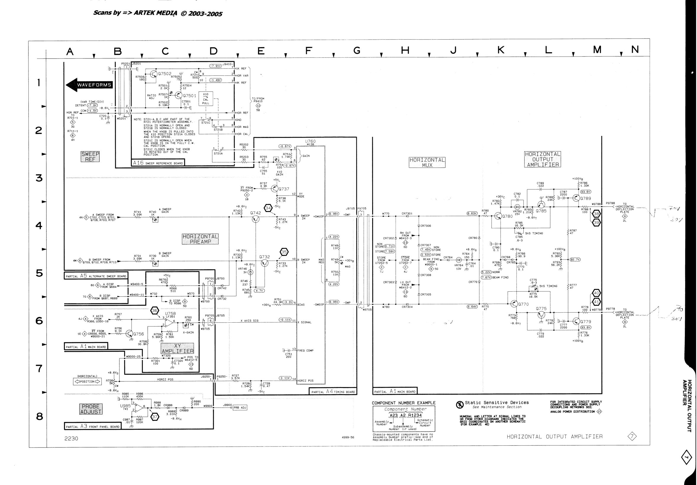


<details><summary>OCR text on this page</summary>

```
a n s by => ARTEK MED- 
0 
2003-2005 
TO 
H O R I Z O N T A L 
D E F L E C T I O N 
P L A T E 
TO 
+ H O R I Z O N T A L 
D E F L E C T I O N -- 
P L A T E
```

</details>


---

## Page 359 of 451

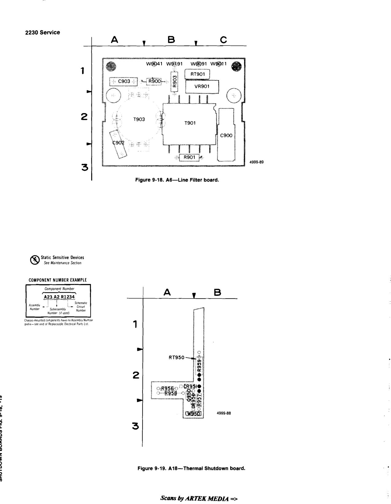


<details><summary>OCR text on this page</summary>

```
2230 Service 
Static Sensitive Devices 
See Ma~ntenance Sectron 
COMPONENT NUMBER EXAMPLE 
Number fil usedl 
Chasrli-mounted componenls have no Assembly Numbel 
prelix-see 
end ol Replaceable Eiectr~cal Parts Llst 
4999-89 
Figure 9-18. A6-Line 
Filter board. 
3 
Figure 9-19. A18-Thermal 
Shutdown board. 
Scans by ARmK MEDU =>
```

</details>


---

## Page 360 of 451

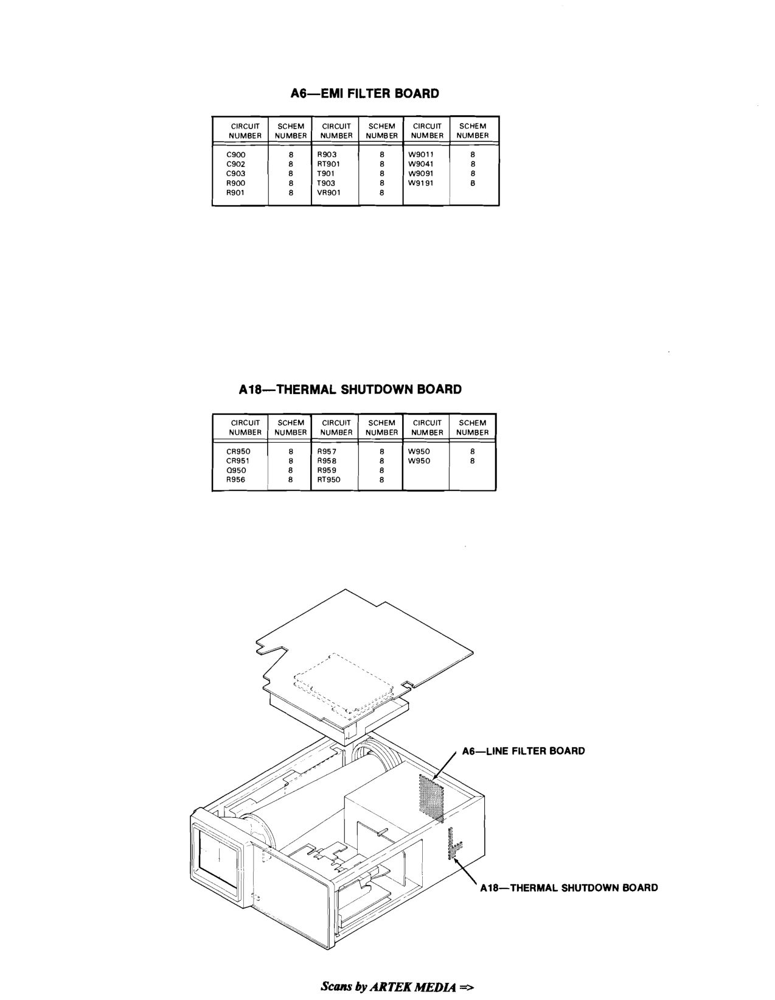


<details><summary>OCR text on this page</summary>

```
A6-EM1 
FILTER BOARD 
A18-THERMAL 
SHUTDOWN BOARD 
CIRCUIT 
SCHEM 
NUMBER 
NUMBER 
CR950 
CR951 
CIRCUIT 
SCHEM 
CIRCUIT 
SCHEM 
NUMBER 
NUMBER 
NUMBER 
NUMBER 
RT950 
FILTER BOARD 
BOARD 
Scans by ARTEK MEDL4 *
```

</details>


---

## Page 361 of 451

WAVEFORMS FOR DIAGRAM 8 
AC Waveforms 
DC Voltages 
Preregulator and Inverter voltages are referenced to 
test point noted adjacent to the voltage. Power supply out- 
put voltages are referenced to chassis ground. 
Instrument must be connected to the ac-power 
source using a I: 1 isolation transformer. Do not con- 
nect the test oscilloscope probe ground lead to the 
inverter circuit test points if the instrument is not iso- 
lated. AC-source voltage exists on reference points 
TP950 and T906 pin 5. 
Scans by AR TEK MEDLQ =>


---

## Page 362 of 451

POWER INPUT, PREREGULATOR AND INVERTER DIAGRAM 8 
Scans by ARmK MEDL4 + 
ASSEMBLY 
CIRCUIT 
NUMBER 
C396 
C904 
C906 
C907 
C908 
C917 
C919 
C922 
C925 
C940 
C941 
C942 
C943 
C944 
C945 
CR901 
CR902 
CR903 
CR904 
CR907 
CR908 
CR920 
CR946 
CR947 
CR948 
E907 
BOARD 
LOCATION 
5K 
5M 
7L 
8M 
7M 
1 OL 
1 OM 
9L 
1OM 
8K 
8K 
1 OL 
1 OL 
9L 
1 OM 
6M 
6M 
6M 
6M 
7L 
9L 
8M 
1 OK 
1 OK 
10L 
8K 
SCHEM 
LOCATION 
7J 
7J 
7L 
7M 
7M 
4 J 
1 E 
1 E 
1 D 
1 D 
5H 
5H 
4H 
1 D 
5E 
5E 
4F 
4F 
4F 
4F 
4F 
5F 
4F 
3F 
2E 
3F 
3 F 
2F 
A1 
SCHEM 
LOCATION 
1 E 
2D 
2E 
4J 
3J 
5F 
4F 
3F 
3E 
5H 
5J 
7J 
7M 
7L 
7L 
2E 
2 0 
2E 
2D 
4J 
4H 
2H 
7L 
7L 
8K 
5H 
5H 
7K 
;: ~ 
ifL 
5H 
8L 
5H 
9L 
2C 
lC 
~ 
2 
CIRCUIT 
NUMBER 
0938 
0939 
0944 
0946 
0947 
09070 
R397 
R398 
A905 
R906 
R907 
R908 
R909 
R910 
R912 
R913 
R914 
R915 
R916 
R917 
R919 
R921 
R922 
R925 
R926 
R927 
R928 
R929 
SCHEM 
LOCATION 
8M 
7J 
7J 
7K 
7K 
7L 
7M 
7M 
8K 
BOARD 
LOCATION 
1OL 
10M 
10M 
10K 
9K 
9K 
6G 
6G 
5L 
6L 
8K 
9L 
9L 
6B 
9L 
9M 
9L 
9L 
10M 
9L 
1 OM 
9M 
10M 
9M 
9M 
9M 
9M 
9M 
BOARD 
LOCATION 
1 OL 
1 OM 
1 OL 
1 OL 
1 OM 
1 OL 
10L 
9K 
1 OM 
P9070 
0908 
8K 
9L 
9M 
CIRCUIT 
NUMBER 
R940 
R941 
A942 
R943 
R944 
R945 
A946 
R947 
R948 
R949 
S901 
T390 
T906 
T944 
TP940 
TP950 
U930 
VR925 
VR935 
VR943 
VR943 
W950 
W9040 
4J 
5H 
ASSEMBLY A6 
0930 
E 
9M 
0935 
1 OM 
1 
Parrial A1 also shown on diagrams 2. 3. 
0928 
1 OL 
:r 
~ 
5M 
1 E 
3H 
7L 
5J 
2E 
5G 
3F 
8H 
1 OL 
6K 
C900 
C902 
C903 
R900 
R901 
R903 
6L 
8L 
9K 
1 OM 
9L 
9M 
9 M 
1 OM 
1 OL 
1 OL 
::* :: 
R935 
8H 
2A 
2C 
2A 
2C 
9M 
10M 
10M 
1 OL 
R937 
R938 
R939 
1C 
1 8 
1C 
1 8 
ASSEMBLY A1 8 
W9070-1 
W9070-2 
W9070-3 
W9150 
10M 
1OL 
6J 
7J 
7J 
28 
2C 
2C 
2C 
28 
28 
W9190 
4, 5. 6. 7, 9, 10 and 13 
2C 
2A 
1A 
1 8 
3 B 
1 B 
CR950 
CR951 
0 9 5 0 
W9011 
W9041 
W9091 
W9191 
RT901 
T90 1 
T903 
VR901 
6K 
6J 
7J 
28 
38 
38 
6K 
6K 
6K 
CHASSIS MOUNTED PARTS 
2A 
28 
28 
2A 
DS9150 
F9001 
1 C 
2 8 
2A 
1 C 
3 8 
I 
2A 
3A 
1C 
2A 
2A 
3 8 
2A 
2B 
RT950 
W950 
W950 
R956 
R957 
R958 
R959 
CHASSIS 
CHASSIS 
6K 
6K 
6K 
6K 
FL9001 
P9070 
2A 
4 J 
CHASSIS 
CHASSIS


---

## Page 363 of 451

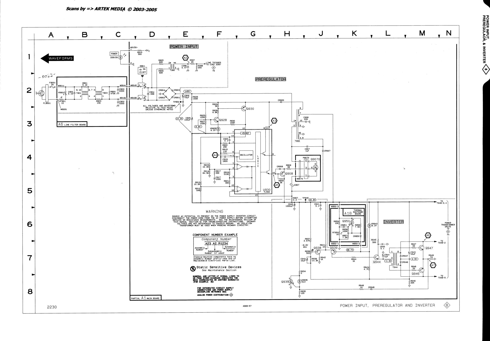


<details><summary>OCR text on this page</summary>

```
&ans by => ARTEK NED@ 0 
2003-2005 
2230 
4999-57 
POWER I N P U T , 
PREREGULATOR AND INVERTER 
@
```

</details>


---

## Page 364 of 451

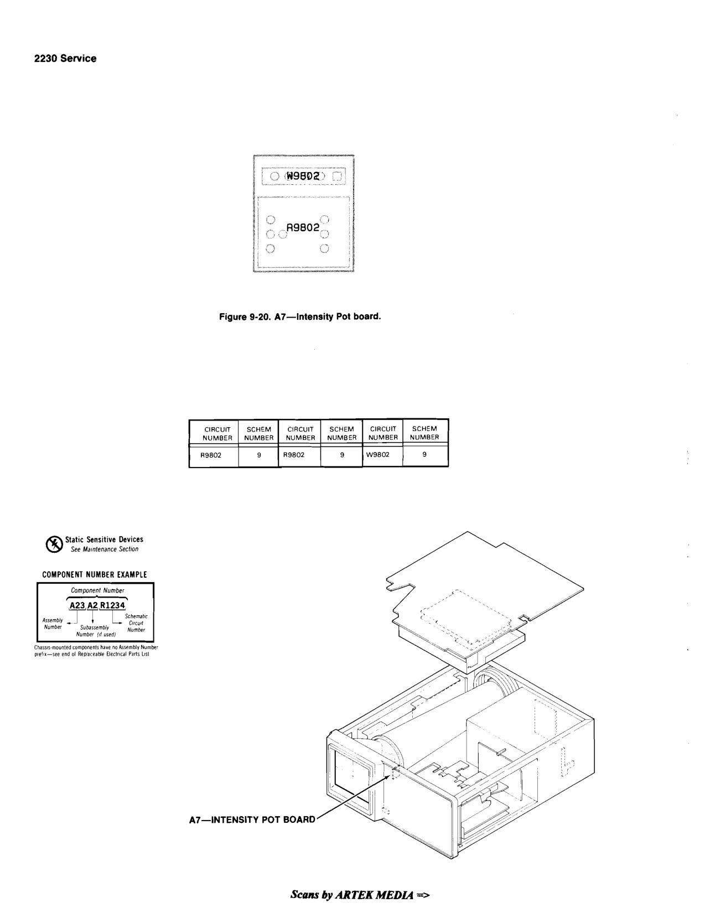


<details><summary>OCR text on this page</summary>

```
2230 Service 
Static Sensitive Devices 
See Maintenance Sectron 
COMPONENT NUMBER EXAMPLE 
Figure 9-20. A7-Intensity 
Pot board. 
Component Number 
CIRCUIT 
NUMBER 
R9802 
1 m
b
y
 - 
1 L 
schemr'c 
Number 
Subarsembiy ,"::, 
Number (if uredj 
POT 
SCHEM 
NUMBER 
9 
Scans by ARTEK MEDL4 => 
CIRCUIT 
NUMBER 
R9802 
SCHEM 
NUMBER 
9 
CIRCUIT 
NUMBER 
W 9 8 0 2 
SCHEM 
NUMBER 
9
```

</details>


---

## Page 365 of 451

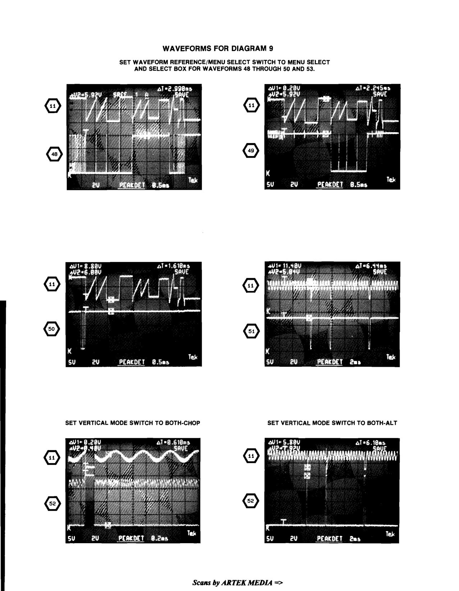


<details><summary>OCR text on this page</summary>

```
WAVEFORMS FOR DIAGRAM 9 
SET WAVEFORM REFERENCEIMENU SELECT SWITCH TO MENU SELECT 
AND SELECT BOX FOR WAVEFORMS 48 THROUGH 50 AND 53. 
SET VERTICAL MODE SWITCH TO BOTH-CHOP 
SET VERTICAL MODE SWITCH TO BOTH-ALT 
Scans by ART= 
MEDL4 =>
```

</details>


---

## Page 366 of 451

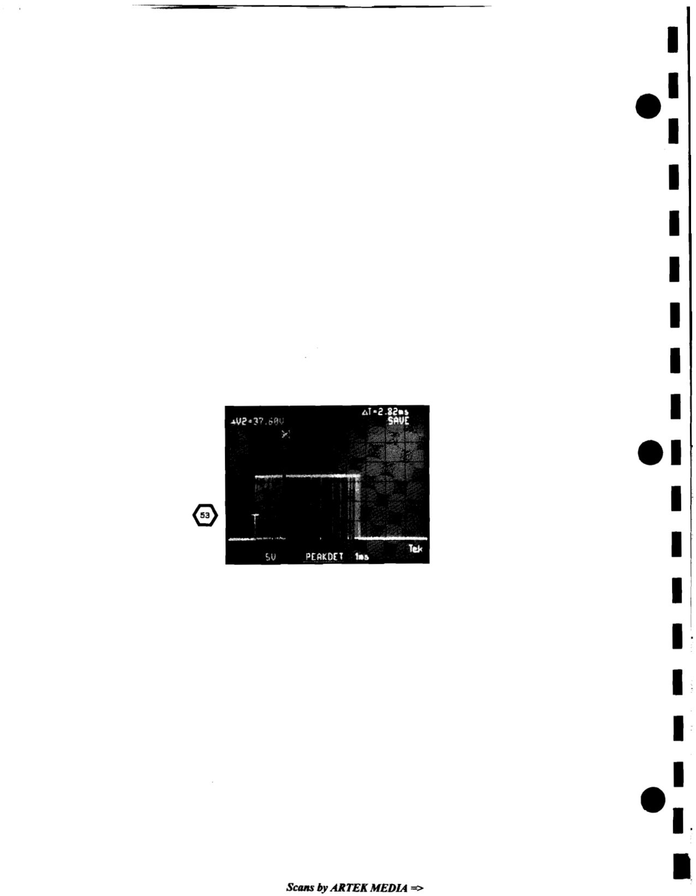


<details><summary>OCR text on this page</summary>

```
Scans by ARTEK MEDLQ .=>
```

</details>


---

## Page 367 of 451

POWER SUPPLY SECONDARIES, Z AXIS AND CRT DIAGRAM 9 
Scans by ARmK MEDL4 => 
ASSEMBLY A1 
SCHEM 
LOCATION 
2K 
2K 
2K 
3K 
3K 
3K 
CIRCUIT 
NUMBER 
C547 
C824 
C825 
C828 
C835 
C845 
BOARD 
LOCATION 
5J 
5J 
5J 
5J 
6H 
5H 
SCHEM 
LOCATION 
3F 
6F 
5F 
5G 
4H 
3H 
CIRCUIT 
NUMBER 
CR853 
CR854 
CR855 
CR954 
CR955 
CR956 
BOARD 
LOCATION 
2M 
8F 
3L 
4L 
4L 
4M 
SCHEM 
LOCATION 
4K 
4K 
4K 
6K 
5K 
6K 
BOARD 
LOCATION 
7K 
6K 
6K 
7H 
7H 
7H 
SCHEM 
LOCATION 
3F 
4F 
3G 
3E 
5D 
5D 
CIRCUIT 
NUMBER 
R547 
R548 
R549 
R581 
R583 
R586 
BOARD 
LOCATION 
2M 
2M 
2M 
2L 
BF 
8F 
CIRCUIT 
NUMBER 
R888 
R889 
R890 
R891 
R892 
RE93


---

## Page 368 of 451

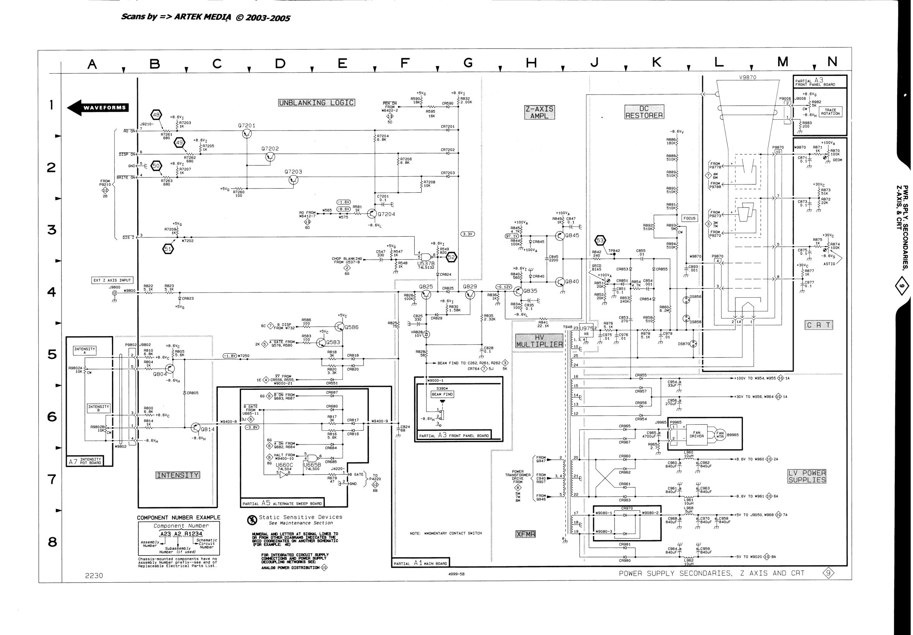


<details><summary>OCR text on this page</summary>

```
-- 
W n s by => ARTEK MEDU @ 2003-2005
```

</details>


---

## Page 369 of 451

ANALOG POWER DISTRIBUTION DIAGRAM 10 
Scans by ARTEK MEDLQ => 
' 
ASSEMBLY A1 
CIRCUIT 
NUMBER 
C1 16 
C200 
C201 
C215 
C220 
C255 
C274 
C420 
C421 
C460 
C480 
C494 
C499 
C502 
C503 
C506 
C507 
C531 
C537 
C540 
C553 
C562 
C590 
C796 
C797 
C799 
SCHEM 
LOCATION 
48 
3C 
4A 
4A 
3C 
48 
2A 
2A 
6A 
8C 
5D 
3F 
5F 
7C 
7A 
8C 
7A 
8C 
7F 
7F 
8F 
5G 
8C 
4D 
3A 
C832 
BOARD 
LOCATION 
4C 
4F 
4F 
1 C 
2E 
1 G 
2K 
7C 
BC 
8D 
9D 
7E 
6D 
1 OC 
7E 
9E 
7C 
1 OD 
1 M 
2L 
4F 
7A 
8D 
2J 
3J 
4G 
CIRCUIT 
NUMBER 
C849 
C849 
C7203 
C7260 
E200 
E201 
E272 
E590 
J9010 
J9050 
J9060 
J9300 
R220 
R494 
R499 
R796 
R797 
A799 
R964 
R966 
U225 
U426 
SCHEM 
LOCATION 
1A 
1A 
3A 
38 
3C 
4A 
1 8 
7C 
7 J 
7 J 
7 J 
8J 
3D 
3F 
5 F 
5D 
3A 
10 
7F 
7A 
4D 
4E 
ClRCUlT 
NUMBER 
U501 
U502 
U504 
U506 
U532 
U537 
U540 
U555 
U565 
U758 
U7201 
U7202 
W400 
W408 
W494 
W542 
W544 
W556 
W59 1 
W592 
WE85 
W954 
W955 
W956 
W959 
g 
3L 
BOARD 
LOCATION 
3M 
3M 
3K 
1 L 
5F 
5F 
2J 
1 OD 
10G 
7G 
7G 
4L 
2E 
7F 
7F 
2J 
3J 
4G 
4L 
SF 
1 D 
88 
Partial A1 also shown on diagrams 2 3, 4. 5, 6, 7. 8, 9 and 13. 
ASSEMBLY A 2 
U460 
SCHEM 
LOCATION 
2D 
7D 
78 
8D 
8D 
8G 
8G 
8F 
8G 
4F 
8G 
3 8 
5D 
6D 
3F 
8A 
2C 
8F 
8C 
7C 
5G 
1A 
1A 
1 A 
1A 
8D 
1 F 
3F 
W960 
8D 
C90 
C9 1 
C93 
C94 
C96 
C97 
BOARD 
LOCATION 
6C 
10C 
8E 
9E 
10E 
1 M 
2 L 
4F 
2K 
6F 
2J 
3J 
9C 
98 
7E 
78 
6A 
3K 
9E 
1 OD. 
5K 
7G 
4L 
6G 
5G 
Partial A2 also shown on diagram 1 
ASSEMBLY A 3 
2A 
1 K 
1 L 
1 K 
1 L 
C905 
W94 
W9 6 
1 J 
1 J 
1 J 
1 K 
2J 
2K 
1 C 
3C 
1 D 
3D 
10G 
BOARD 
LOCATION 
10G 
4K 
3K 
10G 
SF 
7F 
3L 
3K 
SF 
7F 
3 K 
7C 
7C 
8 8 
5F 
5F 
3F 
8 A 
8A 
1% 
1 OF 
1 0G 
9G 
9G 
7F 
CIRCUIT 
NUMBER 
W961 
W964 
W965 
W968 
W971 
W972 
W974 
W975 
W976 
W977 
W979 
W991 
W993 
W995 
W997 
W998 
W999 
W9000 
W9000 
W9020 
W9035 
W9068 
W9400 
W9400 
W9705 
W9991 
1K 
2J 
J9991 
L90 
L91 
L93 
L96 
2F 
3F 
2F 
1 E 
3F 
30 
SCHEM 
LOCATION 
6A 
1A 
2A 
7A 
2A 
3A 
3A 
3A 
6A 
5A 
50 
2C 
6G 
6E 
3C 
5A 
4A 
2J 
3J 
8.4 
2A 
7F 
5J 
6J 
5J 
2J 
P 
Parllal A3 also shown on diagrams 1. 2, 3. 4. 5. 6, 7, 9 and 13. 
ASSEMBLY A4 
1 
2J 
1 J 
1 J 
1 J 
1J 
2J 
US85 
18 
C705 
C706 
C707 
C710 
C724 
C749 
7F 
3F 
2F 
3 F 
3F 
3F 
2K 
U10 
U60 
VRlO 
VR60 
1 D 
4K 
5K 
3J 
4K 
5K 
4K 
ParlIal A4 a
h
 shown on d~agrams 5, 6 and 7. 
ASSEMBLY A5 
3J 
3L 
4L 
5L 
2E 
38 
3 8 
3 8 
C605 
C606 
C655 
C659 
C694 
3 8 
38 
3C 
38 
3D 
2D 
U605 
U660 
U665 
U670 
U680 
4K 
3K 
3J 
4K 
C750 
C752 
J9705 
R724 
6J 
6J 
6K 
5K 
6K 
Parrial A5 also shown on diagrams 6 and 9. 
ASSEMBLY A1 3 
2A 
1 8 
3C 
2C 
1 C 
6K 
6M 
6M 
1 D 
3D 
ZE 
3C 
2A 
1 D 
1 C 
C767 
C768 
U783 
W1304 
R752 
U715 
U750 
U751 
U760 
6K 
18 
7L 
I D 
U780 
U781 
U782 
18 
1 
4N 
3M 
1 
2A 
ParfIal A13 also shown on diagrams 5 and 6. 
CHASSIS MOUNTED PARTS 
1 
W655 
6J 
W690 
6J 
W691 
6K 
4N 
4N 
3K 
3J 
4 J 
4 J 
4K 
3D 
3D 
38 
W695 
6M 
W696 
6M 
L 
4M 
4 M 
4 M 
2D 
2D 
1C 
1 C 
1A 
1 8 
1 C 
1 J 
P9705 
3D 
1 D 
2D 
2D 
3E 
CHASSIS 
CHASSIS 
3J 
VR749 
W1304 
W 1 3 M 
W1304 
P9991


---

## Page 370 of 451

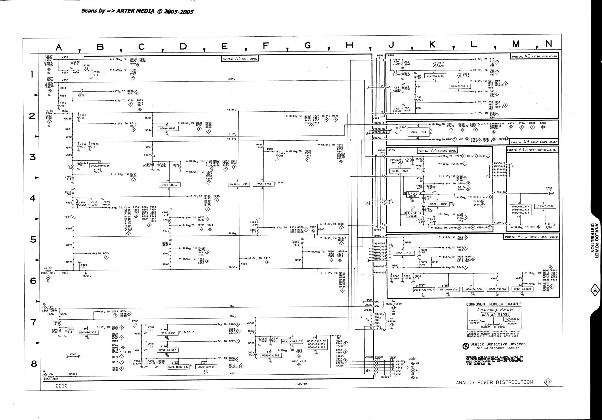


<details><summary>OCR text on this page</summary>

```
. A 
A 
- 
 
Scans by => AREK MEDU 0 
-3-2- 
A 
1 
6 
1 
C 
1 
D 
1 
E 
1 
F 
v 
G 
v 
H 
1 
J 
v 
K 
1 
L 
v 
M , N 
+30VA 
U6O-TLC27lA 
7L 
W971 
W977 
C963 L961 
W961 
- - t 5 V A 
TO A616 R667 
t5V 
Static Sensitive Devices 
See Maintenance section 
YFE, 
GRID cmIwTEs 
&%~~S~%~:LNESJO 
w *NOTHER SCMMATIC 
Fa? ExAnJLE 4El 
4999-59 
ANALOG POWER DISTRIBUTION 
@ 
2230
```

</details>


---

## Page 371 of 451

STORAGE POWER DISTRIBUTION DIAGRAM 11 
Scans by ARTEK MEDM => 
BOARD 
LOCATION 
9K 
9K 
9L 
9L 
8J 
9J 
9L 
5E 
7E 
6D 
6E 
8E 
7E 
6D 
6E 
4C 
4C 
4E 
4D 
4E 
5D 
7C 
8D 
7D 
5D 
5C 
7C 
68 
88 
1OC 
6C 
1 OC 
6C 
ED 
7D 
58 
48 
4F 
4G 
4F 
4H 
3H 
7J 
1 OK 
8E 
8D 
3C 
3E 
3D 
3D 
3E 
3E 
5G 
5H 
5J 
5K 
9D 
4L 
1OJ 
5J 
1 OD 
BOARD 
LOCATION 
4L 
3L 
2L 
6M 
6K 
4K 
7K 
5K 
4J 
5J 
7J 
7J 
4J 
5J 
7H 
8H 
4K 
5K 
5L 
4L 
5F 
5L 
5H 
5H 
5G 
5H 
5G 
8G 
8H 
6G 
6G 
6F 
5G 
7G 
7F 
5M 
7K 
7L 
7L 
9M 
8L 
7K 
7K 
7L 
7L 
8K 
8L 
8K 
9H 
9G 
8F 
9H 
1 OJ 
9J 
9J 
1OJ 
9H 
9G 
9H 
8M 
6M 
7M 
ASSEMBLY 
CIRCUIT 
NUMBER 
C2117 
C2118 
C2123 
C2154 
C2203 
C2206 
C2240 
C2245 
C2246 
C2247 
C2248 
C3101 
C3102 
C3 104 
C3 105 
C3112 
C3232 
C3236 
C3306 
C3307 
C3308 
C4106 
C4110 
C4125 
C4126 
C4217 
C4232 
C9002 
C9006 
C9007 
C9101 
C9102 
C9104 
C9109 
C9201 
C9203 
C9207 
C9211 
C9212 
C9221 
C9222 
C9223 
C9250 
C9301 
C9302 
CR2105 
CR2106 
CR2107 
CR2108 
CR2109 
J8100 
U2101 
U2202 
U2203 
U2204 
U2205 
U2206 
U3101 
U3102 
Parrjal A10 
A10 
SCHEM 
LOCATION 
2F 
2F 
2G 
2G 
7C 
4C 
7C 
38 
8C 
1 8 
2C 
4C 
4C 
4C 
4C 
4C 
4C 
4C 
4C 
4C 
4C 
5C 
5C 
5C 
5C 
5C 
5C 
38 
1 8 
2C 
5C 
5C 
5C 
5C 
5C 
5C 
5C 
1 8 
2C 
1 D 
2D 
5C 
5C 
5C 
5C 
2F 
2F 
2F 
2F 
2F 
1 M 
2F 
6C 
6D 
6E 
6E 
6E 
4K 
4K 
also shown on 
CIRCUIT 
NUMBER 
U4226 
U4227 
U4228 
U4229 
U4230 
U4231 
U4232 
U9101 
U9102 
U9103 
U9104 
U9105 
U9106 
U9107 
U9108 
U9109 
U9110 
U9111 
U9112 
U9113 
U9114 
U9201 
U9202 
U9203 
U9204 
U9205 
U9206 
U9207 
U9208 
U9210 
U9211 
U9220 
U9231 
U9232 
U9233 
U9301 
U9302 
W2102 
W2 104 
W2105 
W2107 
W2203 
W3234 
W4200 
W9012 
W9013 
W9014 
W9015 
W9016 
W9017 
W9018 
W9019 
W9021 
W9022 
W9023 
W9024 
W9025 
W9026 
W9027 
W9028 
W9029 
SCHEM 
LOCATION 
4K 
4K 
4K 
4K 
4K 
4H 
4H 
4H 
4H 
4H 
4H 
4H 
4H 
4H 
5H 
5H 
4K 
4K 
5K 
3 J 
5H 
5K 
5K 
3J 
4F 
4F 
5K 
5H 
5H 
3J 
3J 
3 J 
5K 
5H 
5H 
5K 
3J 
3 J 
3J 
5K 
5K 
3J 
5J 
5J 
5J 
5J 
5J 
5H 
5K 
5H 
5H 
5H 
5K 
5H 
5K 
5K 
5K 
5H 
5H 
5K 
6K 
6K 
17. 18 and 21. 
BOARD 
LOCATION 
2G 
2G 
3H 
1 H 
1 K 
3K 
2J 
4G 
4F 
4G 
4F 
4M 
3L 
3L 
2L 
5K 
4J 
4J 
4K 
5K 
5L 
8L 
7M 
8M 
5M 
9M 
9L 
1 OF 
9E 
10E 
3E 
7E 
6E 
3C 
7C 
5C 
5C 
9C 
1 OC 
9D 
1 OD 
8 8 
78 
5 8 
48 
2G 
2G 
1 F 
1 F 
1 F 
2D 
2G 
3J 
3L 
3K 
3K 
3 K 
4M 
3L 
dtagrarns 12. 
SCHEM 
LOCATION 
6K 
5J 
6K 
6F 
5J 
6K 
6K 
6K 
6K 
4G 
4H 
5J 
5J 
6K 
5J 
4E 
4E 
4E 
6H 
6H 
6H 
4L 
4L 
4L 
5J 
5J 
6H 
6H 
4D 
1 D 
6H 
2 0 
4L 
4L 
4L 
6H 
6H 
2G 
3D 
1 F 
3C 
7C 
78 
1 F 
48 
4 8 
7 8 
48 
7 8 
58 
48 
58 
58 
68 
68 
68 
18 
4 8 
4 8 
4 8 
2C 
CIRCUIT 
NUMBER 
U3 103 
U3104 
U3105 
U3 106 
U3112 
U3229 
U3230 
U3231 
U3232 
U3233 
U3234 
U3235 
U3236 
U3237 
U3238 
U3239 
U3306 
U3307 
U3308 
U3309 
U3310 
U3313 
U3416 
U3417 
U3418 
U3419 
U3420 
U3421 
U3422 
U3423 
U3424 
U3425 
U3426 
U3427 
U3428 
U4101 
U4 102 
U4 103 
U4104 
U4105 
U4106 
U4107 
U4108 
U4 109 
U4110 
U4111 
U4112 
U4113 
U4114 
U4115 
U4116 
U4117 
U4118 
U4119 
U4120 
U4121 
U4122 
U4123 
U4124 
U4125 
U4126 
U4127 
14, 15, 16.


---

## Page 372 of 451

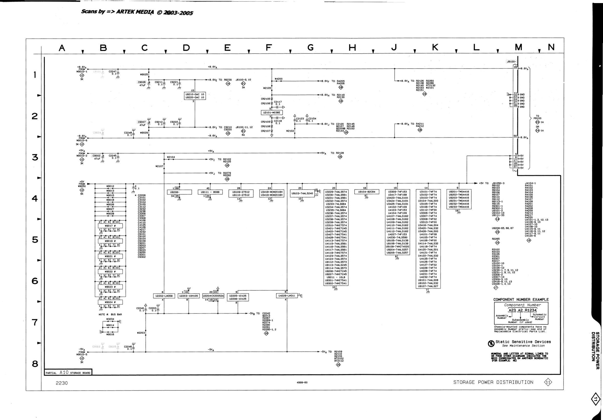


---

## Page 373 of 451

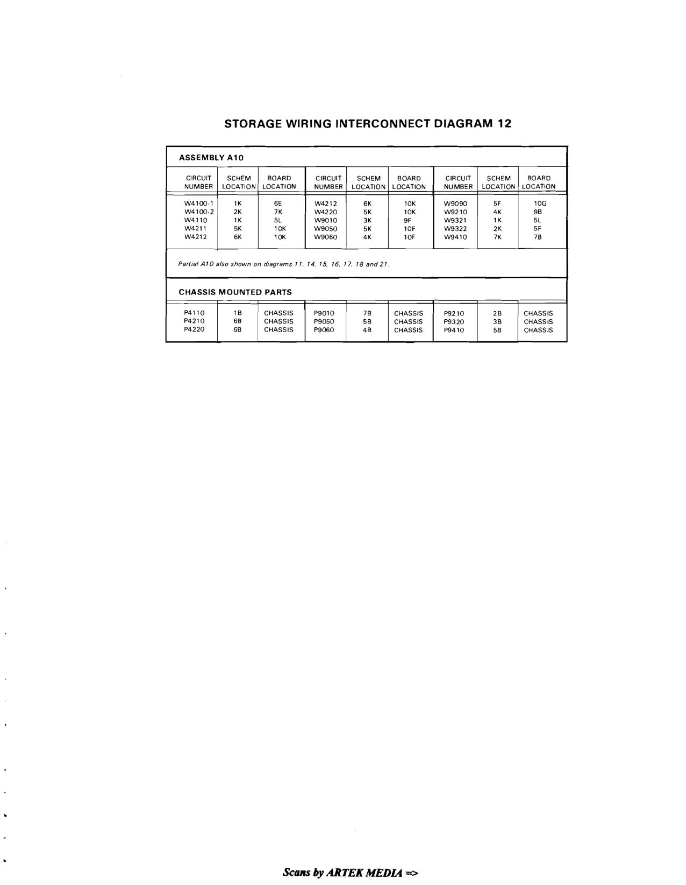


<details><summary>OCR text on this page</summary>

```
STORAGE WIRING INTERCONNECT DIAGRAM 12 
Scans by ARTEK MEDL4 =>
```

</details>


---

## Page 374 of 451

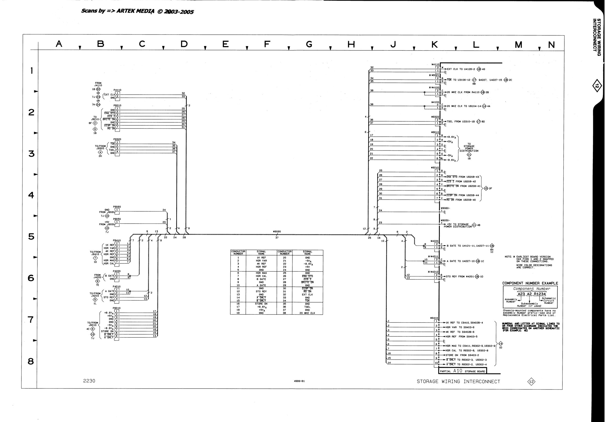


---

## Page 375 of 451

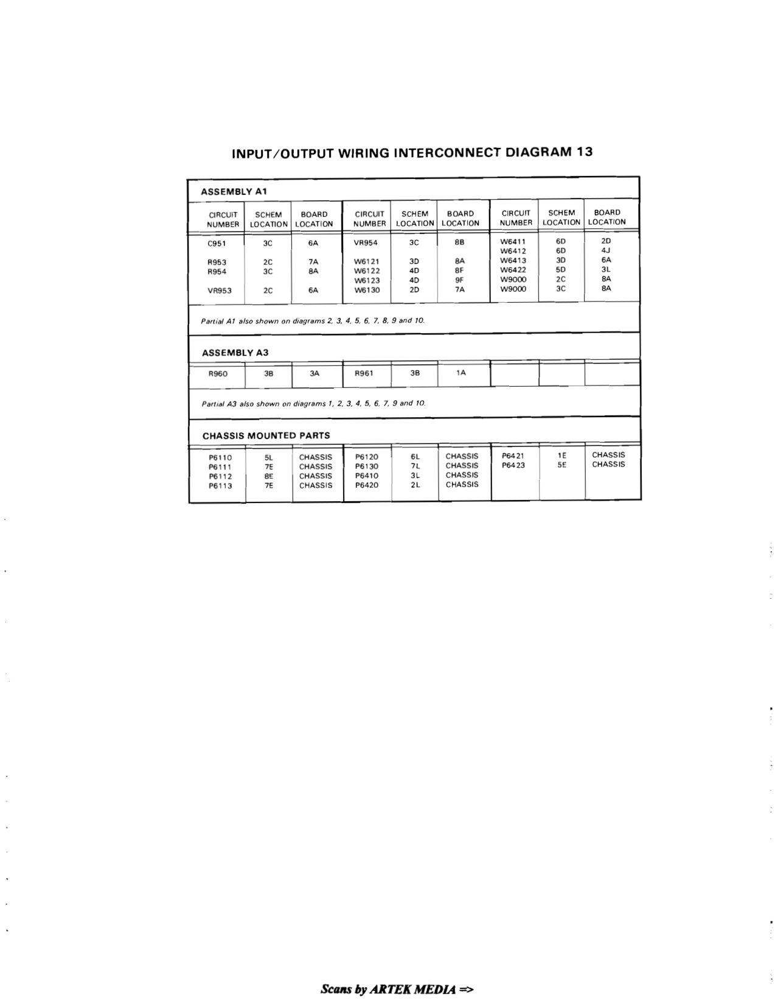


<details><summary>OCR text on this page</summary>

```
INPUT/OUTPUT WIRING INTERCONNECT DIAGRAM 13 
Scans by ARTEK MEDL-4 -',
```

</details>


---

## Page 376 of 451

a n s by => ARTEK MEDU 0 
21103-2005 
5H 7 LH OUT TO CR7305.CR7300 
4H 7 RH OUT TO CR7306. CR7307 
8 
7C @ H POS FROM C7320. W7320 
6 l 
I 
PARTIAL A 1 MAIN BOAR0 3 
I 
P G 3 
FROM {~~~~~~~ 
J6113 
E l 6 5 
@ 
E l 6 4 
I 
2c 
FROM 
E l 1 5 
TO 
CH2 ATN 
3 8 
S t a t i c S e n s i t i v e Devices 
@ 
See Maintenance Section 
HYERIL UD L m m AT SIW 
LINES TO 
m FROY o
m
 
OIABRUIS IrnICATES THE 
WID ~ I N A T E S 
m * N O X U -TIC 
V M OUIPCE: 4El 
0N 
2230 
4999-62 
INPUT/OUTPUT WIRING INTERCONNE 
COMPONENT NUMBER EXAMPLE 
I 
Component Number 
,A23 J&,,R1234, 
~ s . e r n b ~ y J 
kc:;:::;c 
Number 
Subassembly 
Chassis-mounted components have no 
Assembly Number p r e f i x - - s e e 
end o f 
Replaceable E l e c t r i c a l P a r t s L l s t


---

## Page 377 of 451

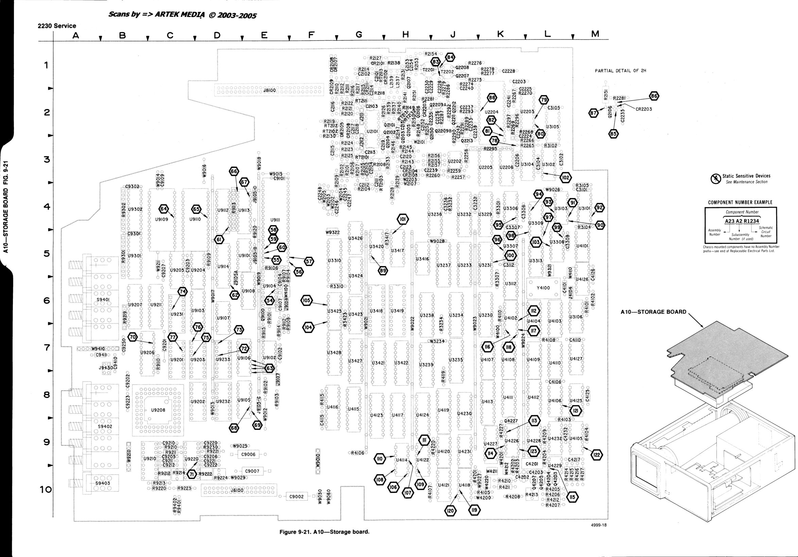


<details><summary>OCR text on this page</summary>

```
Stat~c Sensitive Devices 
See Maintenance Section 
COMPONENT NUMBER EXAMPLE 
I 
Schemattc 
Assembl) _ 
i 
cjrcurl 
Nbmber 
Numoe' 
Subassembly 
iri used, 
Nu?lbe, I 
1 
I 
Chass i mounted components have no Assembly Number 
prelx-see 
end 01 Replaceable E e c t r c a barti L i t
```

</details>


---

## Page 378 of 451

m 
Scans by ARTEK MEDL4 => 
SCHEM 
NUMBER 
11 
18 
18 
18 
18 
11 
18 
11 
18 
11 
18 
11 
18 
18 
11 
18 
11 
18 
18 
18 
18 
11 
18 
18 
11 
17 
18 
18 
18 
11 
18 
11 
18 
11 
18 
18 
11 
18 
18 
11 
18 
18 
18 
18 
11 
18 
18 
11 
18 
11 
18 
18 
11 
18 
11 
18 
11 
18 
18 
11 
18 
18 
11 
14 
14 
14 
14 
11 
14 
1 4 
14 
14 
11 
14 
14 
14 
14 
14 
14 
1 4 
14 
11 
14 
11 
14 
14 
11 
14 
11 
14 
14 
14 
11 
CIRCUIT 
NUMBER 
U4114 
U4114 
U4114 
U4114 
U4114 
U4115 
U4115 
U4116 
U4116 
U4117 
U4117 
U4118 
U4118 
U4118 
U4119 
U4119 
U4120 
U4120 
U4120 
U4120 
U4120 
U4121 
U4121 
U4121 
U4122 
U4122 
U4122 
U4122 
U4122 
U4123 
U4123 
U4124 
U4124 
U4125 
U4125 
U4125 
U4126 
U4126 
U4126 
U4127 
U4127 
U4127 
U4127 
U4127 
U4226 
U4226 
U4226 
U4227 
U4227 
U4228 
U4228 
U4228 
U4229 
U4229 
U4230 
U4230 
U4231 
U4231 
U4231 
U4232 
U4232 
U4232 
U9101 
U9101 
U9101 
U9101 
U9101 
U9102 
U9102 
U9102 
U9102 
U9102 
U9103 
U9103 
U9103 
U9103 
U9103 
U9103 
U9103 
U9103 
U9103 
U9104 
U9104 
U9105 
U9105 
U9105 
U9106 
U9106 
U9107 
U9107 
U9107 
U9107 
U9108 
SCHEM 
NUMBER 
15 
15 
15 
15 
15 
15 
14 
14 
14 
14 
14 
16 
16 
16 
16 
16 
16 
16 
16 
14 
14 
14 
14 
14 
14 
14 
14 
14 
14 
16 
16 
16 
11 
16 
11 
16 
16 
11 
16 
16 
16 
11 
16 
11 
16 
11 
16 
11 
17 
17 
11 
17 
17 
11 
17 
17 
11 
17 
17 
17 
17 
11 
17 
17 
11 
17 
17 
11 
17 
17 
18 
18 
18 
11 
17 
11 
17 
11 
17 
11 
17 
11 
17 
11 
17 
11 
17 
11 
17 
11 
17 
11 
17 
CIRCUIT 
NUMBER 
C2101 
C2102 
C2103 
C2104 
C2111 
C2112 
C2113 
C2114 
C2115 
C2116 
C2117 
C2118 
C2119 
C2120 
C2123 
C2151 
C2152 
C2153 
C2154 
C2203 
C2206 
C2224 
C2225 
C2226 
C2228 
C2229 
C2230 
C2233 
C2235 
C2236 
C2237 
C2238 
C2239 
C2240 
C2241 
C2242 
C2245 
C2246 
C2247 
C2248 
C3101 
C3102 
C3104 
C3105 
C3112 
C3232 
C3236 
C3306 
C3307 
C3308 
C4101 
C4106 
C4110 
C4115 
C4125 
C4126 
C4201 
C4202 
C4203 
C42 17 
C4232 
C 9002 
C9006 
C9007 
C9101 
C9102 
C9104 
C9107 
C9109 
C9201 
C9202 
C9203 
C9205 
C9206 
C9207 
C9210 
C9211 
C9212 
C9220 
C9221 
C9222 
C9223 
C9250 
C9301 
C9302 
C9410 
C9411 
CR2101 
CR2102 
CR2103 
CR2104 
CR2105 
CR2106 
SCHEM 
NUMBER 
16 
16 
16 
16 
16 
16 
16 
16 
16 
16 
16 
16 
16 
16 
16 
16 
16 
16 
16 
16 
16 
16 
16 
16 
16 
16 
16 
16 
16 
16 
16 
16 
17 
17 
17 
17 
17 
17 
17 
17 
17 
17 
18 
18 
18 
18 
18 
18 
18 
18 
18 
18 
18 
18 
18 
18 
18 
18 
18 
18 
18 
18 
18 
18 
17 
18 
18 
18 
18 
18 
18 
17 
14 
14 
14 
14 
14 
14 
14 
14 
14 
14 
14 
14 
14 
14 
14 
15 
15 
15 
15 
15 
15 
CIRCUIT 
NUMBER 
U3239 
U3239 
U3306 
U3306 
U3306 
U3307 
U3307 
U3307 
U3308 
U3308 
U3308 
U3308 
U3308 
U3309 
U3309 
U3310 
U3310 
U3313 
U3313 
U3313 
U3313 
U3416 
U3416 
U3416 
U3416 
U3416 
U3416 
U3416 
U3417 
U3417 
U3418 
U3418 
U3419 
U3420 
U3420 
U3420 
U3420 
U3420 
U3421 
U3421 
U3422 
U3422 
U3423 
U3423 
U3424 
U3424 
U3425 
U3425 
U3426 
U3426 
U3426 
U3426 
U3426 
U3427 
U3427 
U3428 
U3428 
U4101 
U4101 
U4101 
U4101 
U4101 
U4102 
U4102 
U4102 
U4103 
U4103 
U4103 
U4104 
U4104 
U4104 
U4105 
U4105 
U4105 
U4106 
U4106 
U4106 
U4106 
U4106 
U4107 
U4107 
U4108 
U4108 
U4109 
U4109 
U4110 
U4110 
U4111 
U4111 
U4112 
U4112 
U4113 
U4113 
CIRCUIT 
NUMBER 
R9219 
R9220 
R9221 
139222 
R9223 
R9224 
R9230 
R9301 
R9302 
R9401 
R9402 
RT2101 
RT2102 
RT2103 
RT211 1 
RT2112 
RT2113 
RT2131 
RT2132 
S9401 
59401 
59401 
59401 
S9401 
S9402 
S9402 
S9402 
S9402 
S9403 
T2201 
T2202 
T2203 
U2101 
U2101 
U2202 
U2202 
U2202 
U2203 
U2203 
U2203 
U2203 
U2204 
U2204 
U2205 
U2205 
U2206 
U2206 
U3101 
U3101 
U3101 
U3102 
U3102 
U3102 
U3103 
U3103 
U3103 
U3104 
U3104 
U3104 
U3104 
U3104 
U3105 
U3105 
U3105 
U3106 
U3106 
U3106 
U3112 
U3112 
U3112 
U3112 
U3112 
U3113 
U3229 
U3229 
U3230 
U3230 
U3231 
U3231 
U3232 
U3232 
U3233 
U3233 
U3234 
U3234 
U3235 
U3235 
U3236 
U3236 
U3237 
U3237 
U3238 
U3238 
SCHEM 
NUMBER 
16 
16 
16 
16 
16 
16 
16 
16 
16 
16 
11 
11 
16 
16 
11 
16 
16 
16 
11 
11 
11 
16 
16 
16 
16 
16 
16 
16 
16 
16 
16 
16 
16 
11 
16 
16 
11 
11 
11 
11 
11 
11 
11 
11 
11 
11 
11 
11 
11 
11 
18 
11 
11 
18 
11 
11 
1 8 
1 8 
18 
11 
11 
11 
11 
11 
11 
11 
11 
14 
11 
11 
15 
11 
1 4 
14 
11 
15 
11 
11 
15 
11 
11 
11 
11 
11 
11 
1 4 
1 4 
16 
16 
16 
16 
11 
11 
SCHEM 
NUMBER 
11 
17 
11 
17 
17 
11 
17 
17 
11 
17 
17 
17 
17 
11 
17 
11 
17 
11 
17 
17 
17 
11 
17 
17 
17 
17 
17 
17 
11 
17 
11 
17 
11 
11 
17 
17 
17 
17 
11 
17 
11 
17 
11 
17 
11 
17 
11 
17 
11 
17 
17 
17 
17 
11 
17 
11 
17 
11 
17 
18 
18 
18 
11 
18 
18 
11 
17 
18 
11 
17 
18 
11 
18 
18 
11 
18 
18 
18 
18 
11 
18 
11 
18 
11 
18 
11 
18 
11 
18 
11 
18 
11 
18 
CIRCUIT 
NUMBER 
CR2107 
CR2108 
CR2109 
CR2111 
CR2112 
CR2203 
J2111 
J2112 
J4104 
J6100 
J6100 
J6100 
J6100 
J8100 
J8100 
J8100 
J8100 
J9104 
J9105 
J9105 
J9105 
J9105 
J9107 
J9430 
L2137 
L2139 
02101 
02102 
02103 
02104 
02105 
02106 
02107 
02150 
02207 
02208 
02209 
02209 
02211 
02212 
02213 
04203 
04204 
04205 
04207 
04227 
09100 
R2101 
R2102 
R2104 
R2105 
R2106 
R2107 
R2108 
R2109 
R21 10 
R2111 
R21 12 
R21 14 
R2115 
R21 16 
R2117 
R21 18 
R2119 
R2120 
R2121 
R2122 
R2123 
R2124 
R2125 
R2126 
R2127 
R2128 
R2129 
R2130 
R2131 
R2133 
R2137 
R2138 
R2139 
R2140 
R2141 
R2143 
R2144 
R2145 
R2146 
R2147 
R2148 
R2149 
R2150 
R2151 
R2152 
R2153 
SCHEM 
NUMBER 
11 
11 
11 
16 
16 
16 
16 
16 
1 8 
1 4 
1 4 
15 
21 
11 
1 4 
1 4 
1 4 
1 4 
1 4 
1 4 
1 4 
1 4 
1 4 
1 4 
16 
16 
16 
16 
1 6 
1 6 
16 
16 
16 
16 
16 
16 
16 
16 
16 
16 
16 
18 
1 8 
1 8 
1 8 
1 8 
1 4 
16 
16 
16 
16 
16 
16 
16 
16 
16 
16 
16 
16 
16 
16 
16 
16 
16 
16 
16 
1 6 
1 6 
1 6 
16 
16 
16 
16 
16 
16 
16 
1 6 
16 
1 6 
16 
1 6 
16 
16 
16 
16 
16 
16 
16 
16 
16 
1 6 
16 
1 6 
CIRCUIT 
NUMBER 
R2154 
R2155 
R2156 
R2157 
R2257 
R2258 
R2259 
R2260 
R2265 
R2266 
R2266 
R2267 
R2268 
R2269 
R2270 
R2274 
R2275 
R2276 
R2277 
R2278 
R2279 
R2281 
R2286 
R2287 
R2289 
R2290 
R2291 
R2292 
R2293 
R2295 
R2296 
R2297 
R3102 
R3104 
R3105 
R3232 
R3234 
R3301 
R3307 
R3310 
R3417 
R3423 
R4101 
R4102 
R4103 
R4104 
R4105 
R4106 
R4107 
R4108 
R4110 
R4115 
R4119 
R4201 
R4202 
R4203 
R4204 
R4205 
R4206 
R4207 
R4208 
R4209 
R4210 
R4211 
R4212 
R4213 
R4214 
R4215 
R4216 
R4217 
R4220 
R4227 
R9101 
R9102 
R9103 
R9104 
R9106 
R9107 
R9108 
R9109 
R9110 
R9112 
R9113 
R9113 
R9114 
R9115 
R9120 
R9210 
R9211 
R9212 
R9213 
R9214 
R9219


---

## Page 379 of 451

A10-STORAGE 
BOARD 
Scans by ARmK MEDL4 => 
CIRCUIT 
NUMBER 
U910B 
U9109 
U9109 
U9110 
U9110 
U9111 
U9111 
U9112 
U9112 
U9113 
U9113 
U9114 
U9114 
U9201 
U9201 
U9202 
U9202 
U9203 
U9203 
U9204 
U9204 
U9205 
U9205 
U9206 
U9206 
U9207 
U9207 
U9208 
U9208 
U9210 
SCHEM 
NUMBER 
14 
11 
14 
11 
14 
11 
14 
11 
14 
11 
14 
11 
14 
11 
15 
11 
15 
1 1 
15 
11 
15 
11 
15 
11 
15 
11 
15 
11 
15 
11 
CIRCUIT 
NUMBER 
U9210 
U9211 
U9211 
U9220 
U9220 
U9231 
U9231 
U9232 
U9232 
U9233 
U9233 
U9301 
U9301 
U9302 
U9302 
W2101 
W2102 
W2103 
W2104 
W2105 
W2107 
W2203 
W3234 
W4100-1 
W4100~2 
W4110 
W4200 
W4201 
W4211 
W4212 
SCHEM 
NUMBER 
15 
1 1 
15 
11 
15 
11 
15 
11 
15 
11 
15 
11 
14 
11 
14 
16 
11 
16 
1 1 
11 
11 
11 
11 
12 
12 
12 
11 
18 
12 
12 
CIRCUIT 
NUMBER 
W4212 
W4220 
W9010 
W9012 
W9013 
W9014 
W9015 
W9016 
W9017 
W9018 
W9019 
W9021 
W9022 
W9023 
W9024 
W9025 
W9026 
W9027 
W9028 
W9029 
W9050 
W9060 
W9090 
W9210 
W9211 
W9321 
W9322 
W9410 
Y4100 
SCHEM 
NUMBER 
12 
12 
12 
11 
11 
11 
11 
11 
11 
11 
11 
11 
11 
11 
11 
11 
11 
11 
11 
11 
12 
12 
12 
12 
15 
12 
12 
12 
18


---

## Page 380 of 451

A 
v 
B 
v 
C 
v 
D 
v 
E 
F 
G 
v 
H 
v 
J 
v 
K 
v 
L 
v 
M , N 
*MOMENTARY 
CONTACT SWITCH 
+5VREFC \ 
A CUR 
B CUR 
GNO 
NOTE + PART OF R 9 4 1 2 
TO/FROM 
P 6 1 0 0 
m @ 
7A 
A 2 
A 3 
ADO 
AD1 
AD2 
AD3 
AD4 
A05 
A 0 6 
A 0 7 , 
A 0 0 
\ 
A 0 1 
A 0 2 
A 0 3 
A 0 4 
A05 
A 0 6 
A 0 7 
A0 
A 1 
A2 
A 3 
A4 
A5 
A6 
A7 
TO/FROH 
A9 
P 6 1 0 0 
;;; 
4
3
1
~
 
;;: GIA 
A 1 6 
m 
e1k2 
m 
rn 
mirm 
A i B 
m 
KO 
@
a
,
 
2230 
4999-63 
M I C R O P R O C E S S O R A N D S T O R E P A N E L C O N T R O L S 
@


---

## Page 381 of 451

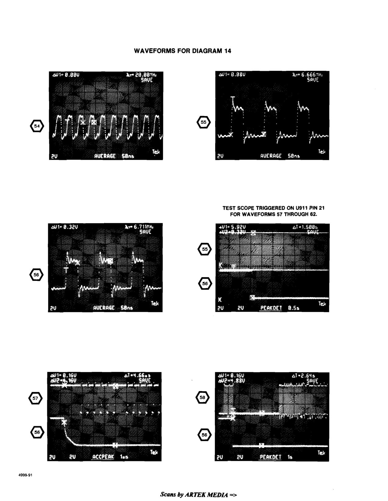


<details><summary>OCR text on this page</summary>

```
WAVEFORMS FOR DIAGRAM 14 
TEST SCOPE TRIGGERED ON U911 PIN 21 
FOR WAVEFORMS 57 THROUGH 62. 
4999-91 
Scans by ARmK MEDL4 =>
```

</details>


---

## Page 382 of 451

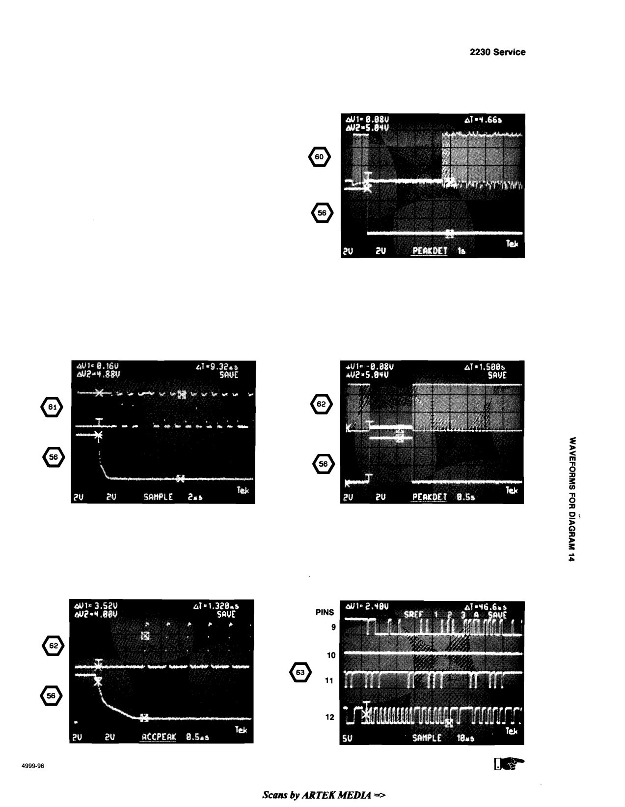


<details><summary>OCR text on this page</summary>

```
2230 Service 
Scans by ARTEK MEDLQ r>
```

</details>


---

## Page 383 of 451

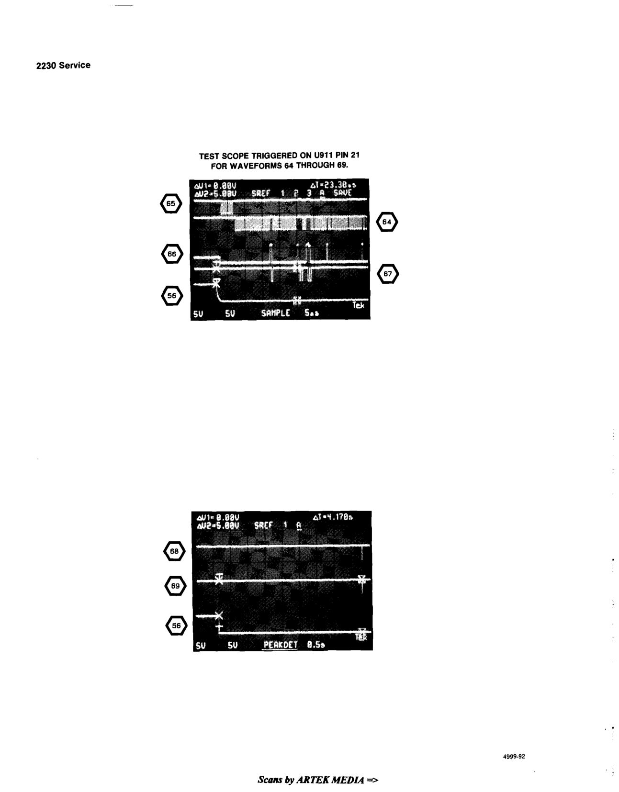


<details><summary>OCR text on this page</summary>

```
2230 Service 
TEST SCOPE TRIGGERED ON U911 PIN 21 
FOR WAVEFORMS 64 THROUGH 69. 
Scans by ARTEK MEDLQ =>
```

</details>


---

## Page 384 of 451

MICROPROCESSOR AND STORE PANEL CONTROLS DIAGRAM 14 
Scans by ARTEK MEDU => 
BOARD 
LOCATION 
7E 
7E 
7E 
6D 
6D 
6D 
6D 
6D 
6D 
6D 
6D 
6E 
8E 
8E 
7E 
6D 
6D 
6D 
6E 
4C 
4C 
4E 
4D 
4E 
5D 
58 
48 
Partial A 10 also shown on diagrams 1 1. 12, 15. 16. 17. 18 and 2 1 
ASSEMBLY 
CIRCUIT 
NUMBER 
C9107 
C9205 
C9206 
C9410 
C9411 
J6100 
J6100 
JBl00 
J8100 
J8100 
J9104 
J9 105A 
J9105B 
J9105C 
J9105D 
J9107 
J9430 
09100 
R9101 
R9102 
R9103 
R9104 
R9106 
R9107 
R9108 
R9109 
A1 0 
SCHEM 
LOCATION 
4A 
1 M 
1 M 
2E 
1G 
1 M 
8A 
3C 
5M 
6A 
5A 
7C 
5E 
8F 
6K 
5A 
1 M 
78 
48 
6B 
8F 
5A 
48 
4A 
8C 
6E 
SCHEM 
LOCATION 
8 c 
6C 
7C 
4E 
78 
6 8 
8~ 
1 M 
2J 
1 J 
2M 
2M 
1A 
1 B 
1B 
1B 
1 C 
1C 
1 E 
1 E 
1F 
1 G 
6F 
6G 
6B 
6H 
7H 
CIRCUIT 
NUMBER 
U9102B 
U9102C 
U9102D 
U9103A 
U9103B 
U9103C 
U9103D 
U9103E 
U9103F 
U9103G 
U9103H 
U9104 
U9105D 
U9105 
U9 106 
U9107A 
U9107B 
U9107C 
U9108 
U9109 
U9110 
U9111 
U9112 
U9113 
U9114 
U9301 
U9302 
BOARD 
LOCATION 
7C 
7E 
4D 
4D 
7E 
7E 
5E 
9D 
5 B 
48 
1OC 
I 
1OC 
5A 
5A 
5A 
5A 
5A 
8A 
8A 
8A 
8A 
48 
5E 
5E 
5E 
5E 
7E 
SCHEM 
LOCATION 
7K 
48 
6H 
78 
7H 
6G 
7H 
5G 
6H 
8C 
5H 
3 B 
7K 
3J 
7G 
7H 
6H 
5H 
6C 
4 J 
5J 
3D 
4F 
4L 
5F 
2K 
1 K 
BOARD 
LOCATION 
6E 
9C 
9D 
7 B 
7 8 
1 OD 
1 OD 
2D 
2D 
2D 
6E 
6D 
5E 
8E 
4E 
85 
78 
6E 
6E 
8E 
8E 
5E 
5E 
5E 
7E 
5D 
CIRCUIT 
NUMBER 
R9110 
R9112 
R9113H 
R9113 
R9114 
R9115 
R9120 
R9230 
R9301 
R9302 
R9401 
R9402 
S9401A 
59401 B 
S9401C 
S9401D 
S9401 E 
S9402A 
594028 
S9402C 
S9402D 
59403 
U9101A 
U9101B 
U9101C 
U9101D 
U9102A


---

## Page 385 of 451

A 
v 
B 
v 
C 
v 
D 
v 
E 
F 
G 
v 
H 
v 
J 
v 
K 
v 
L 
v 
M , N 
*MOMENTARY 
CONTACT SWITCH 
+5VREFC \ 
A CUR 
B CUR 
GNO 
NOTE + PART OF R 9 4 1 2 
TO/FROM 
P 6 1 0 0 
m @ 
7A 
A 2 
A 3 
ADO 
AD1 
AD2 
AD3 
AD4 
A05 
A 0 6 
A 0 7 , 
A 0 0 
\ 
A 0 1 
A 0 2 
A 0 3 
A 0 4 
A05 
A 0 6 
A 0 7 
A0 
A 1 
A2 
A 3 
A4 
A5 
A6 
A7 
TO/FROH 
A9 
P 6 1 0 0 
;;; 
4
3
1
~
 
;;: GIA 
A 1 6 
m 
e1k2 
m 
rn 
mirm 
A i B 
m 
KO 
@
a
,
 
2230 
4999-63 
M I C R O P R O C E S S O R A N D S T O R E P A N E L C O N T R O L S 
@


---

## Page 386 of 451

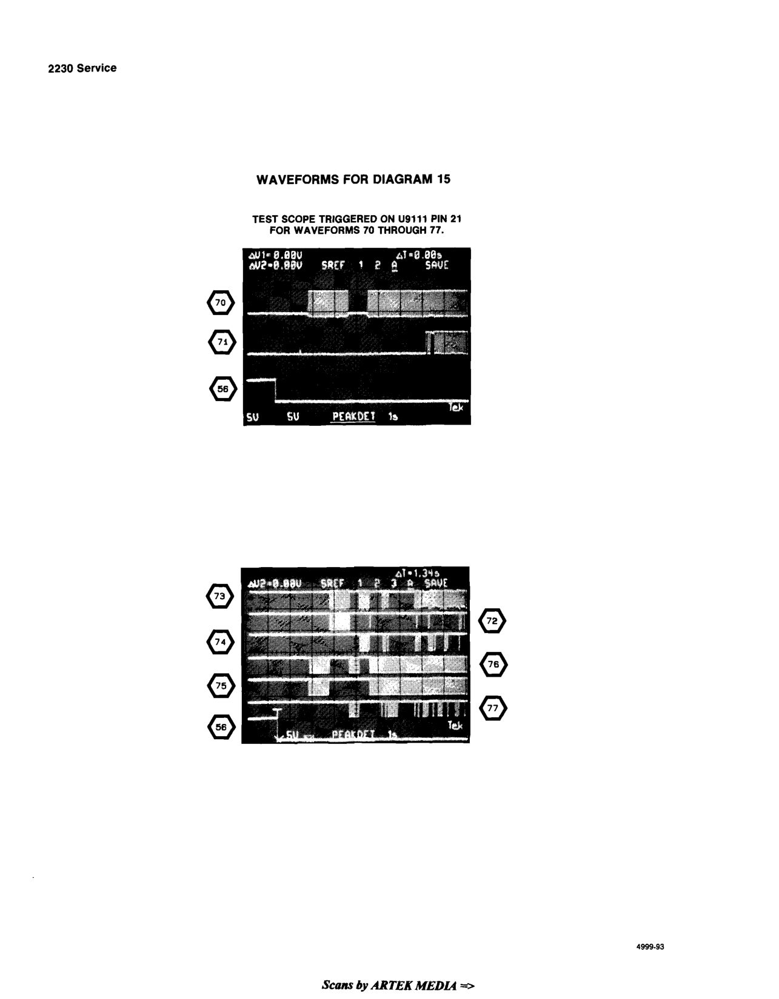


<details><summary>OCR text on this page</summary>

```
2230 Service 
WAVEFORMS FOR DIAGRAM 15 
TEST SCOPE TRIGGERED ON U9111 PIN 21 
FOR WAVEFORMS 70 THROUGH 77. 
Scans by ARTEK MEDM i>
```

</details>


---

## Page 387 of 451

DIGITAL DISPLAY DIAGRAM 15 
Scans by ARTEK MEDL4 = 
ASSEMBLY A10 
Partial A10 also shown on diagrams 1 I . 12. 14. 16, 17. IS and 21. 
CIRCUIT 
NUMBER 
U9206 
U9207 
U9208 
U9210 
U9211 
U9220 
U9231 
U9232 
U9233 
CIRCUIT 
NUMBER 
C9202 
C9210 
C9220 
J6100 
R9210 
R9211 
A9212 
R9213 
SCHEM 
LOCATION 
6D 
2G 
2H 
2G 
1 K 
1 L 
6M 
6K 
6 J 
BOARD 
LOCATION 
7 8 
1 OC 
9D 
1 OD 
1 OC 
10D 
7C 
8D 
7D 
SCHEM 
LOCATION 
3C 
5C 
5E 
3J 
8 0 
1 J 
4 M 
4K 
4J 
SCHEM 
LOCATION 
1E 
3H 
2H 
1 M 
2G 
3H 
3G 
3K 
BOARD 
LOCATION 
7C 
60 
80 
1 OC 
6C 
10C 
6C 
8D 
7D 
BOARD 
LOCATION 
8 8 
9C 
9D 
1 OD 
9C 
9C 
1 OC 
1 OC 
CIRCUIT 
NUMBER 
R9219 
R9220 
R9221 
A9222 
A9223 
R9224 
U9201 
U9202 
U9203


---

## Page 388 of 451

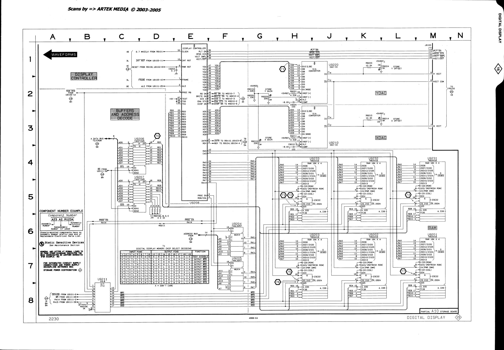


<details><summary>OCR text on this page</summary>

```
a n s by => ARTEK MEDQ 
@ 2003-2005 
FR*YE FROM U9105-1 
Static Sensitive Devices 
rn 
%v~':%mW=do 
8RID EO[R)IMTES 
01 UrrmEIl -TIC 
FDR auIf 4a 
FOA INTEBRITEO CIRCUIT 
COHECTIDW *NO PDYDl m
y
 
D E m 1 m HET*OR(S SEE: 
STmAeE PO*DI DISrnIBUTIDH @ 
X - DON 1 CARE 
FROM U9111-29 
2230 
4999-64
```

</details>


---

## Page 389 of 451

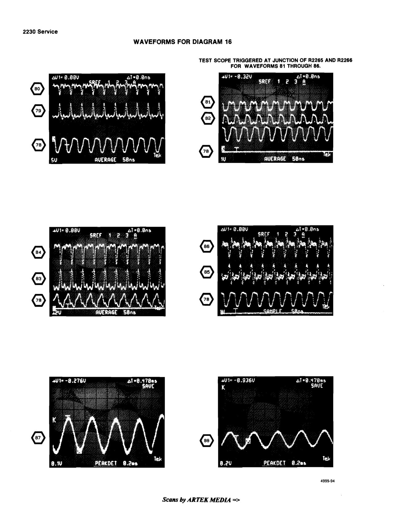


<details><summary>OCR text on this page</summary>

```
2230 Service 
WAVEFORMS FOR DIAGRAM 16 
TEST SCOPE TRIGGERED AT JUNCTION OF R2265 AND R2266 
FOR WAVEFORMS 81 THROUGH 86. 
Scans by ARmK MEDLQ =>
```

</details>


---

## Page 390 of 451

STORAGE ACQUISITION DIAGRAM 16 
Scans by AR TEK MEDLQ => 
BOARD 
LOCATION 
3J 
3J 
3J 
3J 
3L 
3L 
3L 
2K 
2L 
3K 
2L 
1J 
1J 
1J 
1 K 
1 K 
2J 
2H 
2 J 
2 J 
2J 
3J 
2J 
2J 
2J 
3J 
2K 
2K 
3G 
2 F 
4G 
2G 
2F 
1 G 
2H 
2H 
1 H 
1J 
2H 
2G 
3J 
3J 
3L 
3L 
3L 
3K 
3K 
3K 
3H 
4F 
BOARD 
LOCATION 
2J 
2 J 
2J 
3J 
3G 
3G 
4G 
3G 
3G 
3G 
3G 
3F 
2F 
2G 
2G 
1G 
2G 
2G 
2G 
2G 
2F 
2G 
2G 
2G 
3G 
3G 
3G 
2G 
1G 
4H 
3H 
3F 
1 H 
3H 
2H 
1 H 
2H 
2H 
2H 
3H 
3H 
3H 
3H 
2H 
2H 
2H 
2H 
2H 
2H 
1 H 
1J 
3J 
3 J 
3 J 
CIRCUIT 
NUMBER 
(122098 
a221 1 
a221 2 
a221 3 
R2101 
R2 102 
R2 104 
R2705 
R2 106 
R2 107 
R2108 
672109 
A21 10 
R2111 
R2112 
R2114 
R2115 
R2116 
R2117 
R2118 
R2119 
R2 120 
R2 121 
R2122 
R2 123 
R2124 
R2125 
R2126 
R2 127 
R2 128 
R2 129 
A2 130 
R2131 
R2 133 
R2137 
R2138 
R2139 
R2 140 
R2141 
R2143 
R21M 
R2145 
R2 146 
R2147 
R2 148 
R2149 
R2150 
R2151 
R2152 
R2153 
R2 154 
R2155 
R2156 
R2157 
12. 14. 15, 
BOARD 
LOCATION 
1G 
1 G 
2G 
3G 
4G 
4G 
3G 
2G 
3F 
2F 
3H 
3H 
2H 
2H 
1 H 
3L 
2L 
1 J 
1 K 
1 H 
1 H 
2J 
2H 
2 J 
2J 
2J 
3J 
2K 
2J 
1 G 
1 H 
3H 
3H 
1 G 
3G 
2H 
2G 
3G 
2H 
2H 
2H 
2H 
3H 
3H 
2H 
2H 
1 H 
3J 
1 J 
1 J 
2J 
dtagrams 11. 
ASSEMBLY 
CIRCUIT 
NUMBER 
C2101 
C2102 
C2 103 
C2 104 
C2111 
C 2 l l 2 
C2113 
C2114 
C2115 
C2116 
C2119 
C2120 
C2151 
C2152 
C2153 
C2224 
C2225 
C2226 
C2228 
C2229 
C2230 
C2233 
C2235 
C2236 
C2237 
C2238 
C2239 
C2241 
C2242 
CR2101 
CR2102 
CR2103 
CR2104 
CR2111 
CR2112 
CR2203 
J2111 
J2112 
U 1 3 7 
L2139 
02101 
a2102 
a2103 
(12104 
a 2 105 
a 2 106 
a 2 107 
a2150 
a2207 
02208 
Q2209A 
Part,&/ A10 
CIRCUIT 
NUMBER 
R2257 
R2258 
R2259 
R2260 
R2265 
R2266 
R2266 
R2267 
R2268 
R2269 
R2270 
R2274 
R2275 
R2276 
R2277 
R2278 
R2279 
R2281 
R2286 
R2287 
R2289 
R2290 
R2291 
R2292 
R2293 
R2295 
R2296 
R2297 
RT2 101 
RT2 102 
RTZ 103 
RT2111 
RT2112 
RT2113 
RT2 131 
RT2 132 
T2201 
T2202 
T2203 
U2101 
U2202A 
U2202B 
U2203A 
U2203B 
U2203C 
U2204 
U2205 
U2206 
W2lOl 
W2103 
SCHEM 
LOCATION 
2J 
3K 
2K 
6G 
48 
38 
3C 
4C 
3C 
3 0 
4D 
4 8 
28 
28 
28 
2C 
2C 
3C 
2 0 
2 0 
2 0 
28 
28 
28 
48 
38 
48 
5 0 
5D 
4C 
5C 
4 0 
3F 
6D 
4F 
3F 
3 F 
3 F 
3 F 
5F 
5F 
5G 
4F 
3G 
2G 
1 G 
2H 
2H 
2H 
2H 
3H 
1 F 
1 G 
1 G 
17. 18 and21 
A 1 0 
SCHEM 
LOCATION 
2C 
2C 
2C 
4 0 
4C 
4C 
4C 
2D 
48 
28 
6D 
5F 
2G 
2H 
3H 
7 0 
7E 
5J 
7H 
4H 
4J 
4G 
2J 
1 J 
2K 
4H 
6F 
8K 
3J 
5D 
5D 
5C 
5C 
2D 
4D 
1 J 
2A 
3A 
3F 
3F 
3F 
4F 
4G 
5G 
2G 
2H 
3H 
1 H 
7H 
7J 
2J 
also shown on 
SCHEM 
LOCATION 
6G 
6G 
6G 
6G 
7D 
1 J 
7 0 
8D 
8D 
8F 
7E 
7H 
7H 
7J 
7H 
7H 
5J 
4J 
1 J 
2J 
3J 
3J 
3K 
2K 
2 K 
3L 
7K 
7K 
4C 
4 0 
4C 
2C 
2D 
2C 
4F 
1 G 
5J 
6H 
3J 
1 E 
1G 
6G 
7F 
7F 
8E 
1 L 
2M 
3M 
1 H 
5C


---

## Page 391 of 451

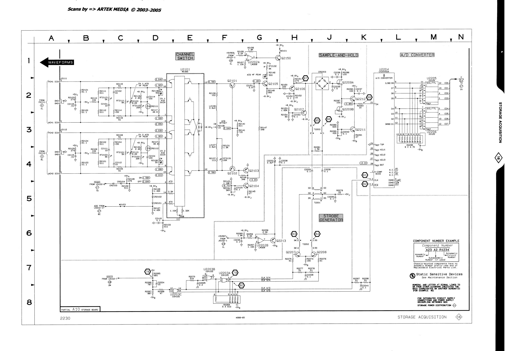


<details><summary>OCR text on this page</summary>

```
Scans by => ARTEK MEDU 0 
2003-2005
```

</details>


---

## Page 392 of 451

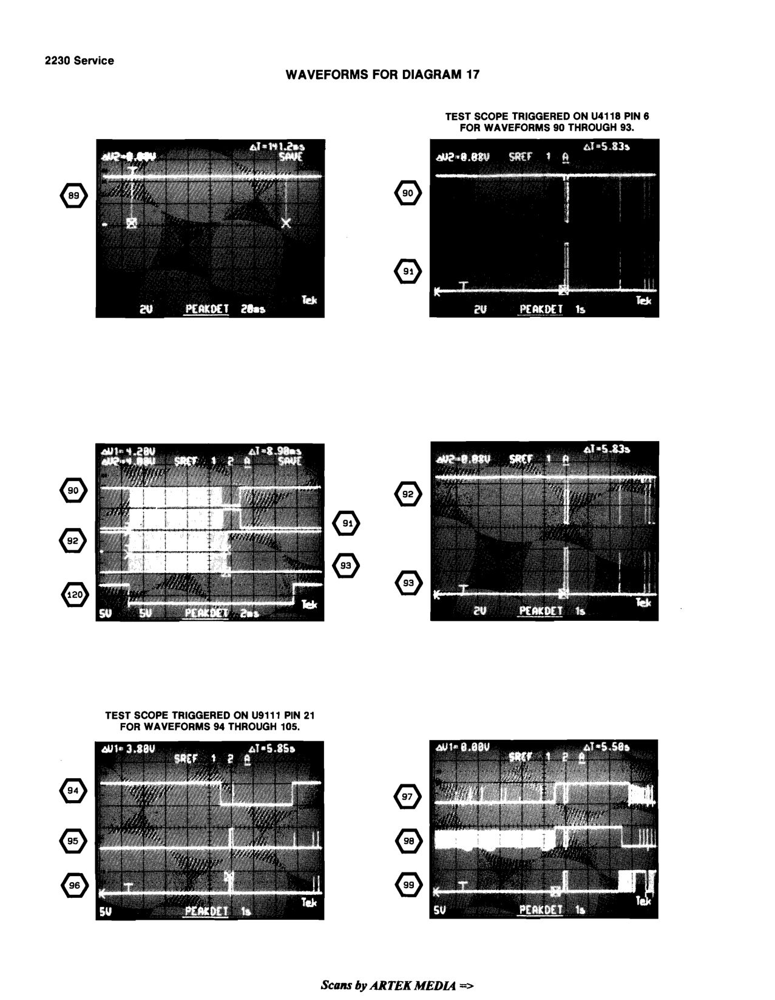


<details><summary>OCR text on this page</summary>

```
2230 Service 
WAVEFORMS FOR DIAGRAM 17 
TEST SCOPE TRIGGERED ON U4118 PIN 6 
FOR WAVEFORMS 90 THROUGH 93. 
TEST SCOPE TRIGGERED ON U9111 PIN 21 
FOR WAVEFORMS 94 THROUGH 105. 
Scans by AR TEK MEDL4 =>
```

</details>


---

## Page 393 of 451

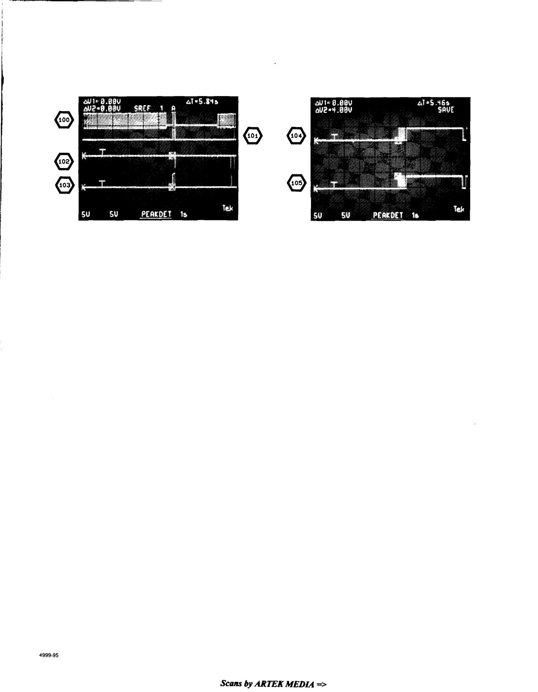


<details><summary>OCR text on this page</summary>

```
Scam by A R Z K MEDU =>
```

</details>


---

## Page 394 of 451

ACQUlSlTlOnl MEMORY DIAGRAM 17 
Scans by AR TEK MEDL4 - 
ASSEMBLY A 1 0 
CIRCUIT 
SCHEM 
BOARD 
NUMBER 
LOCATION LOCATION 
U3416B 
5G 
5H 
U3416C 
5H 
5H 
U3416D 
6H 
5H 
U3416E 
7H 
5H 
U3416F 
7H 
5H 
U3417 
5H 
5H 
U3418 
3L 
5G 
U3420A 
5L 
5G 
U3420B 
8A 
5G 
U3420C 
5G 
5G 
U3420D 
5L 
5G 
U3421 
2M 
BG 
U3422 
3M 
8H 
U3423 
5K 
6G 
U3424 
6K 
6G 
U3425 
7K 
6F 
U3426A 
5L 
5G 
U3426B 
5K 
5G 
U3426C 
6K 
5G 
U3426D 
1 A 
5G 
U3427 
6M 
7G 
U3428 
7M 
7F 
U4101C 
6F 
5M 
U4103A 
6D 
7L 
U4104B 
58 
7L 
U4122C 
6G 
9H 
CIRCUIT 
SCHEM 
BOARD 
NUMBER 
LOCATION LOCATION 
R3102 
7C 
3L 
R3104 
48 
5M 
R3105 
5C 
4M 
R3232 
1 C 
4J 
R3234 
2C 
7J 
R3301 
6F 
4K 
R3307 
6F 
6K 
R3310 
78 
6G 
R3417 
5H 
5H 
R3423 
5J 
6G 
R4212 
2G 
1 OL 
R4227 
2C 
9K 
U3101A 
5B 
4M 
U3101B 
5D 
4M 
U3102.4 
7G 
3L 
U3102B 
7E 
3L 
U3103A 
6D 
4L 
U3103B 
5D 
4L 
U3104A 
78 
3L 
U3104B 
78 
3L 
U3104C 
7C 
3L 
U3104D 
78 
3L 
U3105A 
7D 
2L 
U3105B 
7C 
2L 
U3106A 
6B 
6M 
U3106B 
6B 
6M 
Partial A10 also shown on diagrams 11. 12. 14, 15, 16, 18 and 21. 
CIRCUIT 
SCHEM 
BOARD 
NUMBER 
LOCATION LOCATION 
U3112A 
7F 
6K 
U3112D 
7G 
6K 
U3229 
1 B 
4K 
U3230 
28 
7K 
U3231 
38 
5K 
U3232 
1 C 
4J 
U3233 
3E 
5J 
U3234 
2C 
7J 
U3235 
2E 
7J 
U3236 
1 K 
4J 
U3237 
3K 
5J 
U3238 
2K 
7H 
U3239 
4K 
8H 
U3306A 
6E 
4K 
U3306B 
6F 
4K 
U3307A 
6F 
5K 
U3307B 
2H 
5K 
U3308A 
3G 
5 L 
U3308B 
BJ 
5L 
U3308C 
7F 
5L 
U3308D 
2G 
5L 
U3309 
2G 
4L 
U3310 
8B 
5F 
U3313A 
2J 
5L 
U3313B 
2J 
5L 
U3313D 
7F 
5L 
U3416A 
5G 
5H


---

## Page 395 of 451

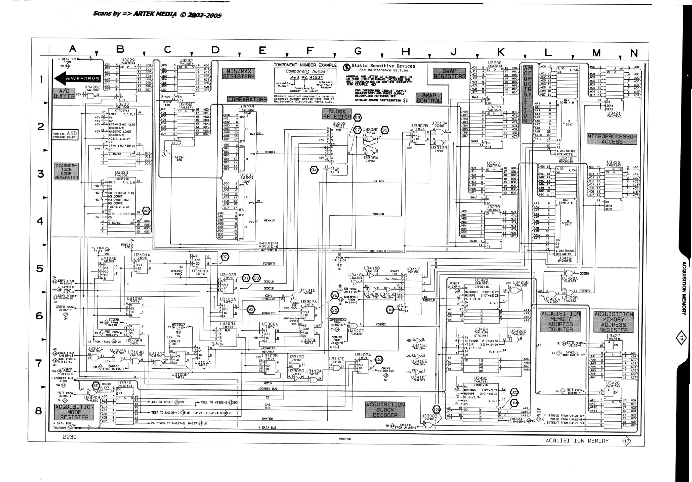


<details><summary>OCR text on this page</summary>

```
4999-66 
ACQUISITION MEMORY 6 
I I
```

</details>


---

## Page 396 of 451

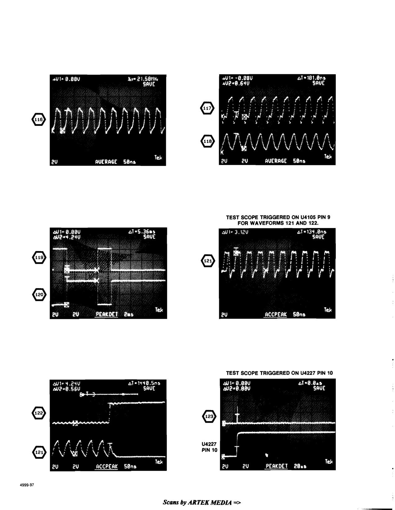


<details><summary>OCR text on this page</summary>

```
TEST SCOPE TRIGGERED ON U4105 PIN 9 
FOR WAVEFORMS 121 AND 122. 
TEST SCOPE TRIGGERED ON U4227 PIN 10 
Scans by ARTEK MEDLQ r>
```

</details>


---

## Page 397 of 451

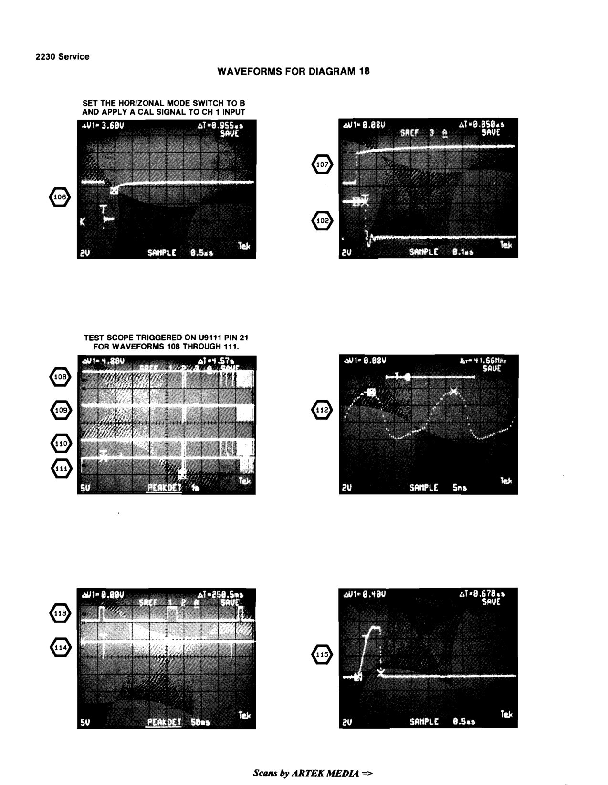


<details><summary>OCR text on this page</summary>

```
2230 Service 
WAVEFORMS FOR DIAGRAM 18 
SET THE HORIZONAL MODE SWITCH TO B 
AND APPLY A CAL SIGNAL TO CH 1 INPUT 
TEST SCOPE TRIGGERED ON U9111 PIN 21 
FOR WAVEFORMS 108 THROUGH 111. 
Scans by A R E K MEDLQ =>
```

</details>


---

## Page 398 of 451

DIGITAL TIMEBASE DIAGRAM 18 
Scans by ARTEK MEDL4 r> 
BOARD 
LOCATION 
1 OJ 
9J 
9J 
9J 
9J 
9J 
1 OJ 
1 OJ 
9H 
9H 
9H 
9G 
9H 
8M 
8M 
6M 
6M 
7M 
7M 
7M 
7M 
9K 
9K 
9K 
9L 
9L 
9L 
8J 
9J 
9J 
9L 
9L 
9K 
6L 
SCHEM 
LOCATION 
4M 
4 8 
2M 
4M 
4M 
5M 
6K 
6H 
8B 
7B 
78 
7L 
8L 
4K 
4L 
4G 
4H 
5H 
2E 
1 E 
5C 
1C 
1 F 
1 C 
2D 
1 E 
2H 
1 K 
1M 
1 M 
1J 
1 J 
1 D 
2A 
CHASSIS MOUNTED PARTS 
SCHEM 
LOCATION 
2G 
2G 
2H 
1 H 
2M 
3D 
3E 
4D 
6M 
4E 
6 M 
2A 
3B 
4K 
3E 
5J 
5J 
5H 
1H 
6J 
5H 
5C 
5D 
5E 
6F 
6G 
6G 
5B 
8B 
7B 
6A 
5A 
8E 
8G 
7H 
3C 
16. 17 and21. 
ASSEMBLY 
CIRCUIT 
NUMBER 
C4101 
C4115 
C4201 
C4202 
C4203 
J 4 1 M 
04203 
04204 
04205 
04207 
04227 
R4101 
R4102 
R4103 
R4104 
R4105 
R4106 
R4107 
R4108 
R4110 
R4115 
1741 19 
R4201 
R4202 
R4203 
R4204 
R4205 
R4206 
R4207 
R4208 
R4209 
R4210 
R4211 
R4213 
Partial A10 
P4104 
BOARD 
LOCATION 
6L 
9F 
1 OL 
1 OK 
1 OL 
6L 
1 OL 
1 OL 
1 OL 
1 OL 
9K 
6M 
6M 
9L 
9M 
1 OK 
9G 
1 OH 
7L 
6K 
BF 
8J 
1 OJ 
1 OK 
1 OK 
9L 
1 OL 
1 OL 
1 OL 
1 OK 
9L 
1 OK 
1 OK 
1 OL 
diagrams 11. 
A1 0 
SCHEM 
LOCATION 
2A 
7D 
2G 
1F 
2F 
2A 
1G 
1G 
2G 
2F 
2C 
2A 
2A 
5K 
5L 
4L 
7D 
6H 
5C 
28 
7D 
5A 
1B 
2E 
2F 
1G 
1G 
1 H 
1 H 
1 E 
1 F 
2G 
2G 
1 H 
also shown on 
BOARD 
LOCATION 
1 OL 
1 OL 
1 OM 
1 OM 
9J 
6K 
6K 
5L 
5M 
5M 
5M 
7K 
7K 
7L 
7L 
9M 
9M 
8L 
8L 
8L 
8L 
7K 
7K 
7L 
7L 
8K 
8L 
8K 
9H 
9H 
9H 
9H 
9G 
8F 
9H 
1OJ 
CIRCUIT 
NUMBER 
R4214 
R4215 
R4216 
R4217 
R4220 
U3112B 
U3112C 
U3113C 
U4101A 
U4101B 
U4101D 
U4102A 
U4102B 
U4103B 
U4104A 
U4105A 
U4105B 
U4106A 
U4106B 
U4106C 
U4106D 
U4107 
U4108 
U4109 
U4110 
U4111 
U4112 
U4113 
U4114A 
U4114B 
U4114C 
U4114D 
U4115 
U4116 
U4117 
U4118A 
12. 14, 15, 
1A 
CIRCUIT 
NUMBER 
U4118B 
U4119 
U4120A 
U41208 
U4120C 
U4120D 
U4121A 
U4121B 
U4122A 
U4122B 
U4122D 
U4123 
U4124 
U4125A 
U4125B 
U4126A 
U4126B 
U4127A 
U41278 
U4127C 
U4127D 
U4226A 
U4226B 
U4227 
U4228A 
U42288 
U4229 
U4230 
U4231A 
U4231B 
U4232A 
U4232B 
W4201 
Y4100 
CHASSIS


---

## Page 399 of 451

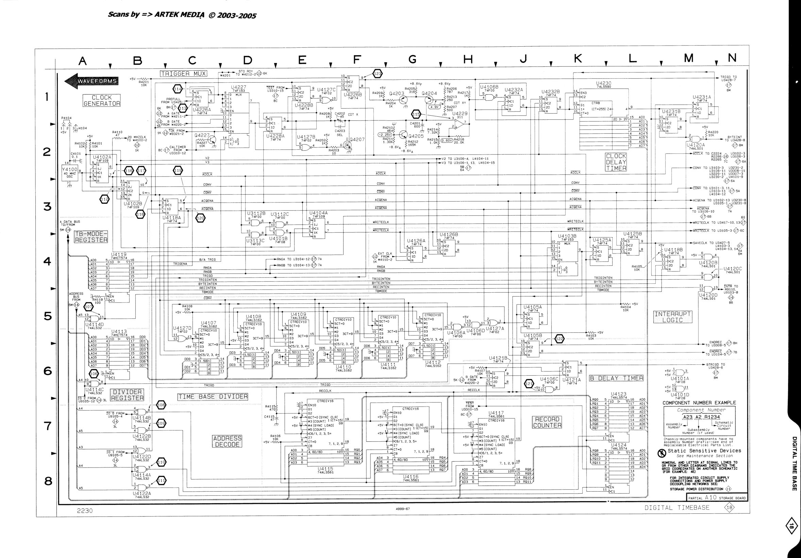


<details><summary>OCR text on this page</summary>

```
Scans by => ARTEK MEDIA 0 
2003-2005 
W9:TEiLK 
-3 u341i-:'3. 
Assembly 
Number F-e'lx--sei 
end a ' 
P e p : a c e a b l e E : e i + - l r a l 
P a r t s L l s r 
Static Sensitive Devices 
FOR 
COHNECTIDNS 
INTEGRATED 
A M CIRCUIT 
POWER SUPPLY 
SUPPLY 
OECWPLING NEWOMS SEE:
```

</details>


---

## Page 400 of 451

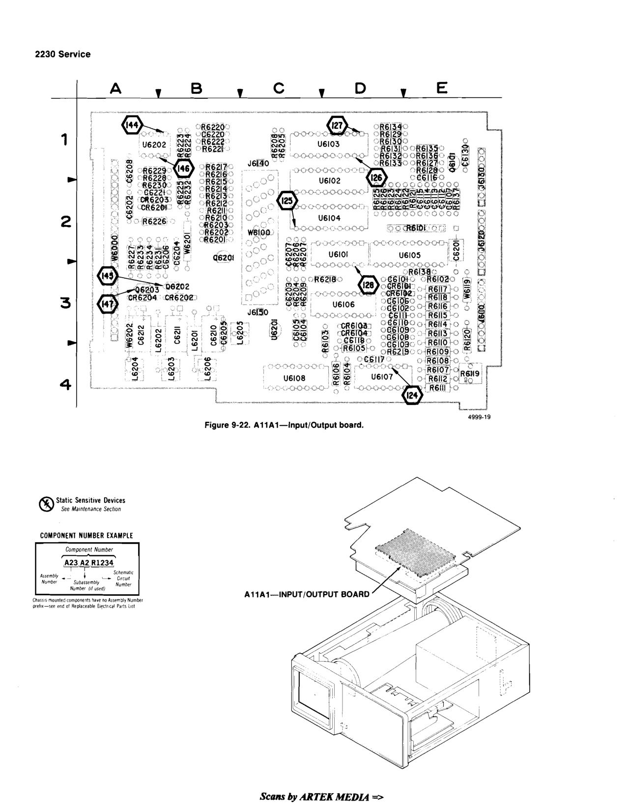


<details><summary>OCR text on this page</summary>

```
2230 Service 
Static Sensltlve Devices 
See Ma~ntenance Section 
COMPONENT NUMBER EXAMPLE 
Component Number - 
A23A2R1234 
- S c h e m d t ! c 
nssembly * - 
1 , 
C,,C",( 
Number 
Subassembly 
Number (il used) 
Chasss mounted components have no b i e m b l y Number 
prefix-sep end of Replaceable Eiectrcal Parts L~st 
Scans by ARTEK M E N =>
```

</details>


---

## Page 401 of 451

A1 1A1-INPUT/OUTPUT 
BOARD 
Scans by ARTEK MEDL4 
SCHEM 
NUMBER 
2 1 
21 
21 
21 
21 
21 
21 
2 1 
2 1 
21 
21 
21 
2 1 
2 1 
2 1 
2 1 
19 
19 
19 
19 
2 1 
19 
21 
19 
2 1 
19 
2 1 
19 
2 1 
19 
21 
19 
19 
19 
19 
21 
19 
2 1 
2 1 
2 1 
2 1 
20 
20 
20 
20 
20 
20 
21 
19 
20 
21 
19 
2 1 
21 
CIRCUIT 
NUMBER 
C6101 
C6102 
C6103 
C6104 
C6105 
C6106 
C6107 
C6108 
C6109 
C6110 
C6111 
C6112 
C6113 
C6114 
C6115 
C6116 
C6117 
C6118 
C6130 
C6201 
C6202 
C6203 
C6204 
C6205 
C6206 
C6207 
C6208 
C6210 
C6211 
C6212 
C6220 
C6221 
CR6101 
CR6102 
CR6103 
CR6104 
CR6201 
CR6202 
CR6203 
CR6204 
J6110 
J6120 
J6130 
J6 140 
J6150 
L6201 
L6202 
L6203 
L6204 
L6205 
L6206 
061 01 
06201 
06202 
06203 
R6101 
SCHEM 
NUMBER 
19 
19 
19 
19 
19 
19 
19 
19 
19 
19 
19 
19 
19 
19 
19 
19 
19 
19 
19 
21 
21 
21 
21 
21 
21 
21 
21 
21 
21 
21 
21 
21 
19 
19 
19 
19 
21 
21 
21 
21 
19 
19 
19 
21 
21 
21 
21 
21 
21 
21 
21 
19 
19 
21 
21 
19 
CIRCUIT 
NUMBER 
R6102 
R6102 
R6103 
R6104 
R6105 
R6106 
R6107 
R6108 
R6109 
R6110 
R6111 
R6112 
R6113 
R61 14 
R6115 
R6116 
R6117 
R61 18 
R6119 
R6120 
R6121 
R6122 
R6123 
R6124 
R6125 
R6126 
R6127 
R6128 
R6129 
R6130 
R6131 
R6132 
R6133 
R6134 
R6135 
R6136 
R6137 
R6138 
R6201 
R6202 
A6203 
R6204 
A6205 
A6206 
A6207 
R6208 
R6209 
R6210 
R6211 
R6212 
R6213 
R6214 
R6215 
R6216 
R6217 
R6218 
SCHEM 
NUMBER 
19 
19 
19 
19 
19 
19 
19 
19 
19 
19 
19 
19 
19 
19 
19 
19 
19 
19 
19 
19 
19 
19 
19 
19 
19 
19 
19 
19 
19 
19 
19 
19 
19 
19 
19 
19 
19 
19 
20 
20 
20 
19 
19 
19 
19 
19 
19 
19 
19 
19 
19 
19 
19 
19 
19 
19 
CIRCUIT 
NUMBER 
R6219 
R6220 
R6221 
R6222 
A6223 
A6224 
R6225 
R6226 
R6227 
R6228 
R6229 
R6230 
R6231 
R6232 
R6233 
R6234 
U6101 
U6101 
U6101 
U6101 
U6101 
U6102 
U6102 
U6103 
U6103 
U6104 
U6104 
U6105 
U6105 
U6106 
U6106 
U6107 
U6107 
U6107 
U6107 
U6107 
U6108 
U6108 
U6201 
U6202 
U6202 
W6000 
W6000 
W6000 
W6000 
W6000 
W6000 
W6000 
W6100 
W6100 
W6100 
W61 19 
W6201 
W6202


---

## Page 402 of 451

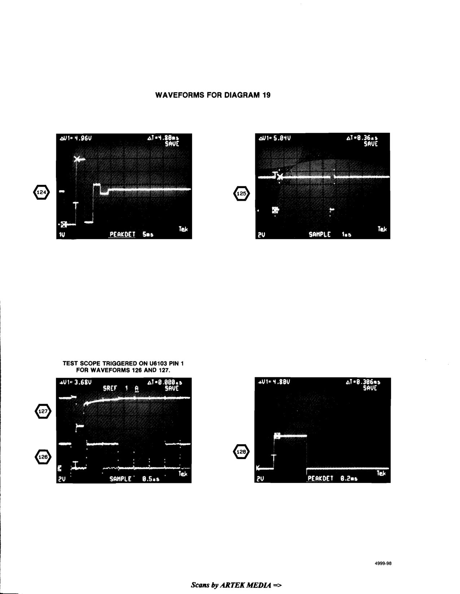


<details><summary>OCR text on this page</summary>

```
WAVEFORMS FOR DIAGRAM 19 
TEST SCOPE TRIGGERED ON U6103 PIN 1 
FOR WAVEFORMS 126 AND 127. 
Scans by ARTEK MEDL4 =>
```

</details>


---

## Page 403 of 451

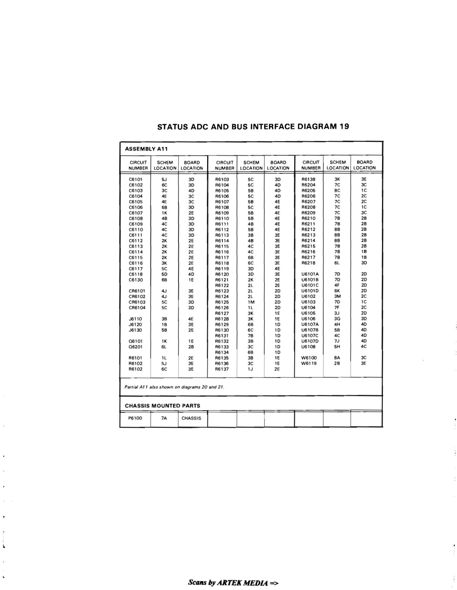


---

## Page 404 of 451

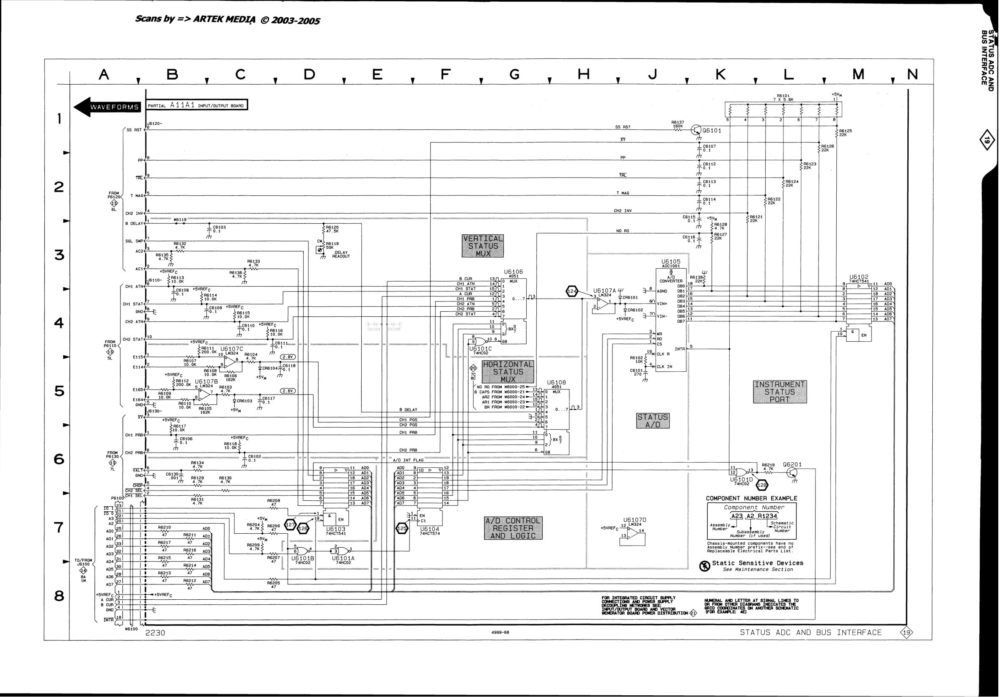


<details><summary>OCR text on this page</summary>

```
Sans by => ARTEK MEDm 0 
2003-2005 
COMPONENT NUMBER EXAMPLE 
Chass.1~-mounted components have no 
I 
I 
wsioo . 2230 
4999-68 
STATUS ADC AND BUS INTERFACE 
@ 
1
```

</details>


---

## Page 405 of 451

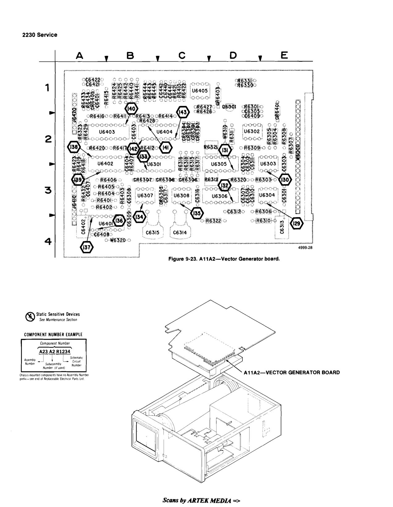


<details><summary>OCR text on this page</summary>

```
2230 Service 
-*-.-,,-,,------,"----"-a 
Figure 9-23. A11 AS-Vector 
Generator board. 
Static Sensitive Devices 
See Marntenance Secbon 
COMPONENT NUMBER EXAMPLE 
Component Number 
I 
m
y
 
1 L 
s
c
~
~
~
 
1 
Number 
Subassembly 
Number 
Number it1 used) 
I 
I 
Charis-mountedcamponentr have no Arsernbly Number 
preflr-see 
end of Replaceable Eletlrica Parts Llst 
GENERATOR BOARD 
Scans by ARZEK MEDLQ =>
```

</details>


---

## Page 406 of 451

A1 1A2-VECTOR 
GENERATOR BOARD 
Scans by ARlEK MEDM => 
CIRCUIT 
NUMBER 
C6301 
C6302 
C6303 
C6304 
C6305 
C6306 
C6307 
C6308 
C6309 
C6310 
C6311 
C6312 
C6313 
C6314 
C6315 
C6316 
C6317 
C6401 
C6402 
C6403 
C6404 
C6407 
C6408 
C6409 
C6421 
C6422 
C6440 
C6441 
C6442 
CR6301 
CR6302 
CR6303 
CR63M 
CR6305 
CR6306 
CR6307 
CR6307 
CR6308 
CR6401 
CR6403 
CR6405 
J6410 
J6420 
06301 
R6301 
R6303 
R6304 
R6305 
R6306 
R6307 
SCHEM 
NUMBER 
21 
21 
21 
21 
21 
21 
21 
21 
21 
2 0 
2 0 
2 0 
21 
2 0 
20 
20 
20 
20 
2 0 
21 
21 
2 0 
2 0 
21 
20 
2 0 
2 0 
2 0 
2 0 
2 0 
2 0 
2 0 
2 0 
2 0 
2 0 
2 0 
2 0 
20 
20 
20 
20 
20 
20 
20 
21 
2 0 
2 0 
2 0 
2 0 
2 0 
CIRCUIT 
NUMBER 
R6308 
R6309 
R6310 
R6311 
R6311 
R6312 
R6315 
R6316 
R6317 
R6318 
R6320 
R6321 
R6322 
R6323 
R6330 
R6331 
R6401 
R6402 
R6403 
R 6 4 M 
R 6 4 M 
R6405 
R6406 
R6407 
R6410 
R6411 
R6412 
R6413 
R6414 
R6415 
R6416 
R6417 
R6418 
R6419 
R6420 
R6421 
R6422 
R6423 
R6424 
R6425 
R6426 
R6427 
R6428 
R6429 
R6432 
R6433 
R6434 
R6440 
R6441 
R6442 
SCHEM 
NUMBER 
2 0 
2 0 
2 0 
2 0 
2 0 
2 0 
2 0 
2 0 
2 0 
2 0 
2 0 
2 0 
2 0 
20 
2 0 
2 0 
2 0 
20 
2 0 
2 0 
2 0 
2 0 
2 0 
2 0 
21 
2 0 
2 0 
2 0 
2 0 
2 0 
2 0 
2 0 
2 0 
2 0 
2 0 
2 0 
2 0 
2 0 
2 0 
2 0 
2 0 
2 0 
2 0 
2 0 
2 0 
2 0 
2 0 
2 0 
20 
2 0 
CIRCUIT 
NUMBER 
R6443 
R6444 
R6445 
U6301 
U6301 
U6301 
U6301 
U6302 
U6303 
U6303 
U6304 
U6304 
U6305 
U6305 
U6306 
U6306 
U6307 
U6307 
U6308 
U6308 
U6401 
U6401 
U6401 
U6401 
U6401 
U6402 
U6402 
U6402 
U6402 
U6402 
U6403 
U6403 
U6403 
U6403 
U6404 
U6404 
U6404 
U6404 
U6405 
U6405 
U6405 
W6000 
W6000 
W6000 
W6000 
W6000 
W6000 
W6000 
W6310 
W6320 
SCHEM 
NUMBER 
20 
20 
20 
20 
20 
20 
21 
21 
20 
21 
2 0 
2 1 
20 
2 1 
20 
2 1 
20 
2 1 
20 
2 1 
20 
20 
20 
20 
20 
20 
20 
20 
20 
20 
20 
20 
20 
20 
20 
20 
20 
2 1 
20 
2 1 
21 
20 
20 
20 
2 0 
20 
20 
2 1 
20 
20


---

## Page 407 of 451

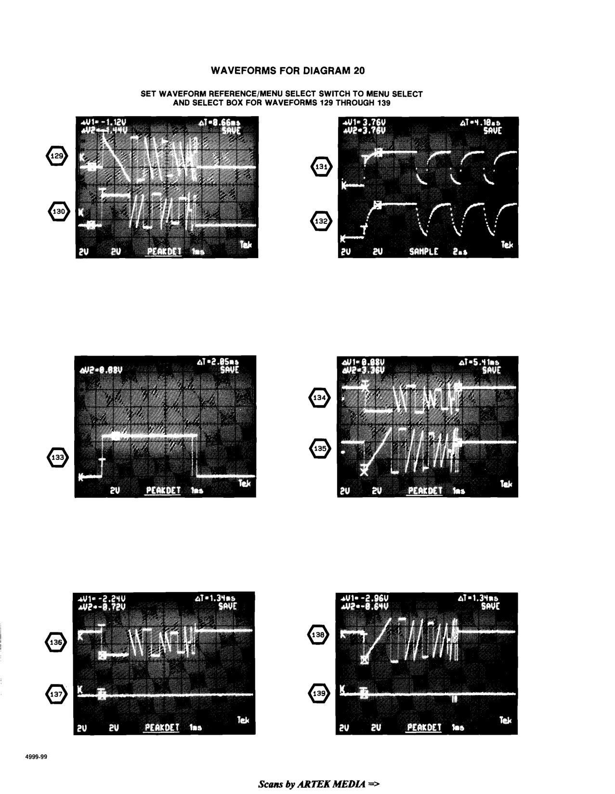


<details><summary>OCR text on this page</summary>

```
WAVEFORMS FOR DIAGRAM 20 
SET WAVEFORM REFERENCEIMENU SELECT SWITCH TO MENU SELECT 
AND SELECT BOX FOR WAVEFORMS 129 THROUGH 139 
4999-99 
Scans by ARlEK MEDL4 =>
```

</details>


---

## Page 408 of 451

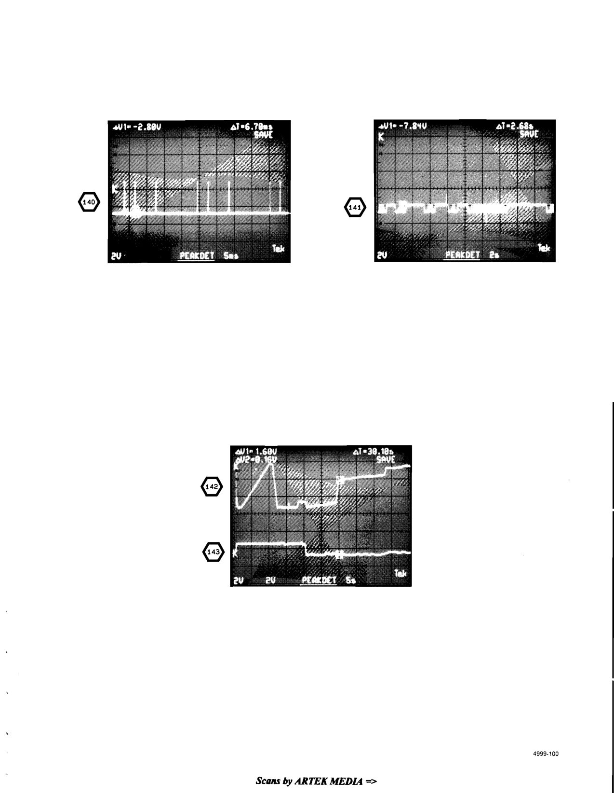


---

## Page 409 of 451

VECTOR GENERATOR DIAGRAM 20 
Scans 6y ARTEK MEDLQ => 
C6312 
C6314 
C6315 
C6316 
C6317 
C6401 
C6402 
C6407 
C6408 
C6421 
C6422 
C6440 
C6441 
C6442 
CR6301 
CR6302 
CR6303 
CR6304 
CR6305 
CR6306 
CR6307 
CR6307 
CR6308 
CR6401 
CR6403 
CR6405 
J6410 
J6420 
06301 
R6303 
R6304 
R6305 
R6306 
R6307 
R6308 
R6309 
R6310 
Parfral A1 2 
4F 
3J 
1J 
3J 
1J 
4H 
4M 
3K 
1K 
6K 
6K 
7G 
7L 
8G 
2G 
4G 
1 G 
3G 
2J 
3J 
1 H 
1J 
3J 
8L 
5H 
4M 
1 M 
5M 
5E 
1 E 
2D 
3D 
3E 
3E 
1 E 
2E 
3E 
also shown on 
CHASSIS MOUNTED PARTS 
3D 
3C 
3C 
3C 
3C 
1A 
3A 
3A 
4A 
1 A 
1A 
1 C 
1 C 
1 C 
2C 
2C 
2C 
2C 
3C 
3C 
3C 
3C 
3C 
2E 
2D 
2A 
4A 
2A 
1 D 
3E 
2E 
2E 
3E 
2E 
2E 
2D 
4E 
dfagram 21 
P6100 
R6312 
R6315 
R6316 
R6317 
R6318 
R6320 
R6321 
R6322 
R6323 
R6330 
R6331 
R6401 
R6402 
R6403 
R6404 
R6404 
R6405 
R6406 
R6407 
R6411 
A641 2 
R6413 
R6414 
R6415 
R6416 
R6417 
R641 B 
R6419 
R6420 
R6421 
R6422 
R6423 
R6424 
R6425 
R6426 
R6427 
R6428 
R6429 
1B 
CHASSIS 
3G 
2G 
3G 
1 G 
3G 
4F 
1 G 
2G 
5 L 
5E 
5H 
2K 
2K 
2K 
3D 
4K 
4K 
4K 
4G 
5H 
5H 
5K 
5J 
4H 
4H 
5J 
4L 
5L 
4J 
6G 
7G 
4M 
8L 
8L 
5H 
5H 
5K 
3 L 
R6432 
3 L 
3A 
R6433 
6K 
1A 
R6434 
3C 
3C 
3C 
3C 
3C 
3D 
2C 
4 0 
2A 
1 D 
1 D 
3A 
3A 
3B 
3 B 
3 8 
3 8 
38 
3B 
28 
2B 
28 
2C 
1 B 
2A 
28 
3A 
3A 
2A 
1 C 
1 C 
3A 
1 B 
1 B 
2C 
1 C 
28 
2A 
W6000 
W6310 
W6320 
R6442 
R6443 
R6444 
R6445 
U6301A 
U6301B 
U6301C 
U6303 
U6304 
U6305 
U6306 
U6307 
U6308 
U6401A 
U6401B 
U6401C 
U6401D 
U6401 E 
U6402A 
U6402B 
U6402C 
U6402D 
U6402E 
U6403B 
U6403C 
U6403D 
U6403E 
U6404A 
U6404B 
U6404C 
U6405A 
W6000 
W6000 
W6000 
W6000 
W6000 
8C 
6H 
6J 
3E 
2D 
4B 
BG 
7G 
7L 
8G 
3H 
5D 
1H 
2E 
3E 
1 F 
3F 
2J 
3J 
2K 
2K 
2K 
2K 
2L 
4K 
4K 
3K 
3K 
5L 
7F 
7G 
4J 
5J 
5K 
6K 
6J 
7G 
2C 
3C 
4C 
5C 
7C 
1 8 
1 8 
18 
1 B 
38 
38 
3B 
3E 
3E 
3D 
3D 
38 
3C 
48 
48 
4B 
4B 
4B 
38 
38 
3B 
3B 
38 
28 
28 
2B 
2B 
2C 
2C 
2C 
1C 
3E 
3E 
3E 
3E 
3E


---

## Page 410 of 451

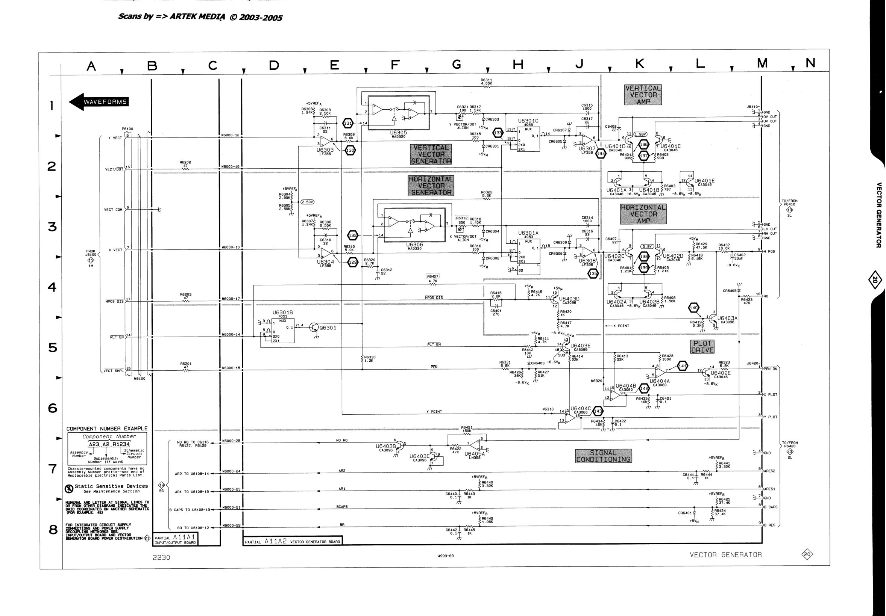


<details><summary>OCR text on this page</summary>

```
- 
W f l s by => ARTEK MEDU (9 2003-2005 
2230 
4999-69 
VECTOR GENERATOR
```

</details>


---

## Page 411 of 451

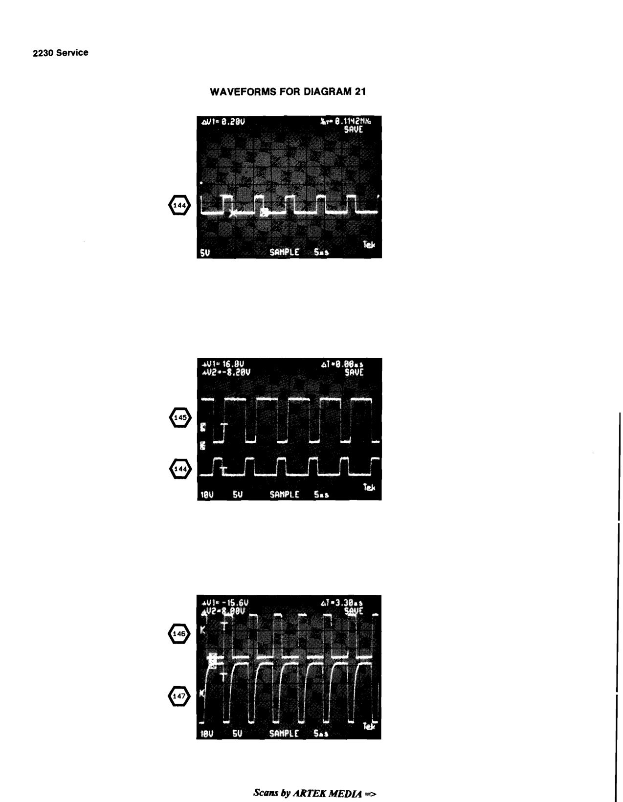


<details><summary>OCR text on this page</summary>

```
2230 Service 
WAVEFORMS FOR DIAGRAM 21 
Scans by ARTEK MEDIA ==.
```

</details>


---

## Page 412 of 451

INPUT/OUTPUT&VECTORGENERATORBOARDS 
POWER DISTRIBUTION DIAGRAM 21 
Scans 6y ARTEK MEDL4 => 
C6206 
C6207 
C6208 
C6210 
C6211 
C6212 
C6220 
C6221 
CR6201 
CR6202 
CR6203 
CR6204 
J6140 
J6150 
3C 
4G 
4H 
5B 
4E 
5G 
5C 
5E 
5D 
4D 
5F 
5F 
4 8 
4 8 
Partial A 1 1 also shown on d,agrams 19 and 2 0 
ASSEMBLY A1 2 
2 8 
2C 
1A 
3 8 
3 B 
3A 
1 B 
2A 
2B 
3 8 
2A 
3B 
1 C 
3C 
C6301 
C6302 
C6303 
C6304 
C6305 
C6306 
C6307 
C6308 
C6309 
C6313 
L6206 
06202 
06203 
R6219 
R6220 
R6221 
R6222 
R6223 
R6224 
R6225 
R6226 
R6227 
R6228 
R6229 
R6230 
5K 
4N 
5N 
5K 
5K 
5K 
1L 
4L 
1 J 
3E 
3D 
3D 
3B 
3C 
2C 
1C 
1 C 
3E 
7K 
2K 
2K 
7K 
2L 
3K 
6K 
6L 
3K 
6K 
Parlral A12 also shown on diagram 2 0 
CHASSIS MOUNTED PARTS 
2 J 
5D 
5F 
2E 
4C 
4D 
5D 
4D 
4D 
5D 
5E 
5E 
4E 
4E 
5E 
P6 100 
4 8 
3 8 
3A 
4D 
1 B 
1 B 
1 B 
1 B 
1 B 
2B 
2A 
2A 
2A 
1A 
2A 
3E 
3D 
3E 
3D 
2D 
3D 
3D 
3B 
4 8 
3E 
3A 
6L 
4K 
4K 
2K 
1 L 
5K 
2K 
4L 
C6403 
C6404 
C6409 
R6301 
R6410 
U6301 
U6302 
U6303 
CHASSIS 
U6101 
U6 102 
U6 103 
U6 104 
U6 105 
U6 106 
U6 107 
U6108 
U6201 
U6202B 
U6202 
W6000 
W6100 
W6201 
W6202 
2B 
3B 
2 0 
1 D 
1 C 
3B 
2E 
3E 
4H 
4H 
4H 
5H 
1 F 
5J 
5 B 
5J 
4G 
4E 
5C 
1 J 
6B 
1 H 
2 J 
U6304 
U6305 
U6306 
U6307 
U6308 
U6404 
U6405B 
U6405 
W6000 
2D 
2C 
1 C 
2C 
2 0 
3 0 
4 0 
4C 
3C 
1 B 
1 B 
3A 
3C 
2 8 
3A


---

## Page 413 of 451

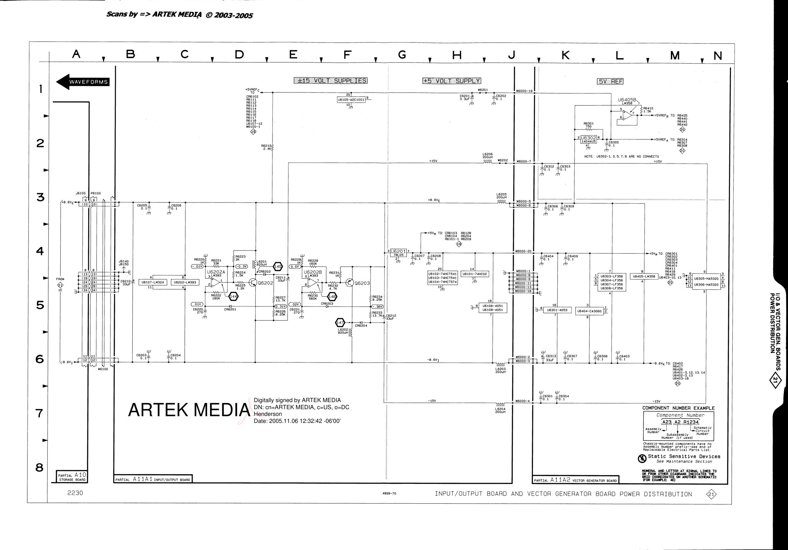


<details><summary>OCR text on this page</summary>

```
ARTEK MEDIA
Digitally signed by ARTEK MEDIA 
DN: cn=ARTEK MEDIA, c=US, o=DC 
Henderson 
Date: 2005.11.06 12:32:42 -06'00'
```

</details>


---

## Page 414 of 451

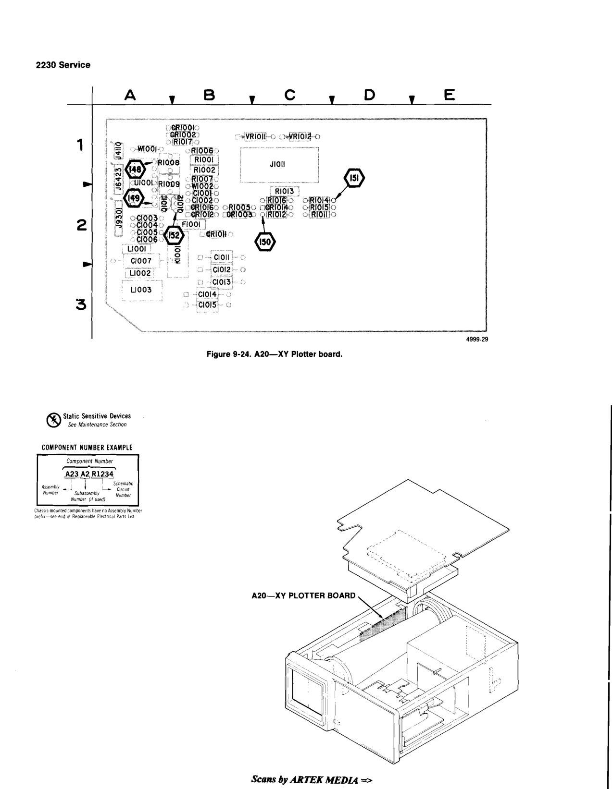


<details><summary>OCR text on this page</summary>

```
2230 Service 
Figure 9-24. A2O-XY 
Plotter board. 
Static Sensitive Devices 
See Ma~ntenance Secbon 
COMPONENT NUMBER EXAMPLE 
Component Number - 
A23A2R1234 
y T S c h e m a b c 
~ssemblv _ J 
1 - c,,~~,, 
Number 
Subasirmbly 
Number (!l used) 
Charrlr-mounledcomponents have na Assembly Number 
prelx-see 
end ol ReplaceaMe Eleclr~cal Parti L,sl 
Scans by ARmK MEDM =>
```

</details>


---

## Page 415 of 451

APO-XY 
PLOTTER BOARD 
Scans by ARTEK MEDIA => 
CIRCUIT 
NUMBER 
R1012 
R1013 
R1014 
R1015 
R1016 
R1017 
UlCOl 
UlOOl 
U l c o l 
UlOOl 
UlOOl 
V R l O l l 
VR1012 
WlOOl 
W l 0 0 2 
CIRCUIT 
NUMBER 
ClOOl 
C1002 
C1003 
C l OW 
C1005 
C1006 
C1007 
C l O l l 
C1012 
C1013 
C1014 
C1015 
CRlOOl 
CR1002 
CR 1003 
CRlOll 
CR1012 
CIRCUIT 
NUMBER 
CR1014 
CR1016 
FlOOl 
J l O l l 
J4110 
J6423 
J9301 
KlOOl 
LlOOl 
L1002 
L1003 
01011 
(11012 
RlOOl 
R1002 
R1005 
R l O l l 
SCHEM 
NUMBER 
22 
22 
22 
22 
22 
22 
22 
22 
22 
22 
22 
22 
22 
22 
22 
- 
SCHEM 
NUMBER 
22 
22 
22 
22 
22 
2 2 
22 
22 
22 
22 
22 
22 
22 
22 
22 
22 
22 
SCHEM 
NUMBER 
2 2 
2 2 
2 2 
2 2 
22 
2 2 
2 2 
2 2 
2 2 
2 2 
2 2 
22 
2 2 
2 2 
2 2 
2 2 
2 2


---

## Page 416 of 451

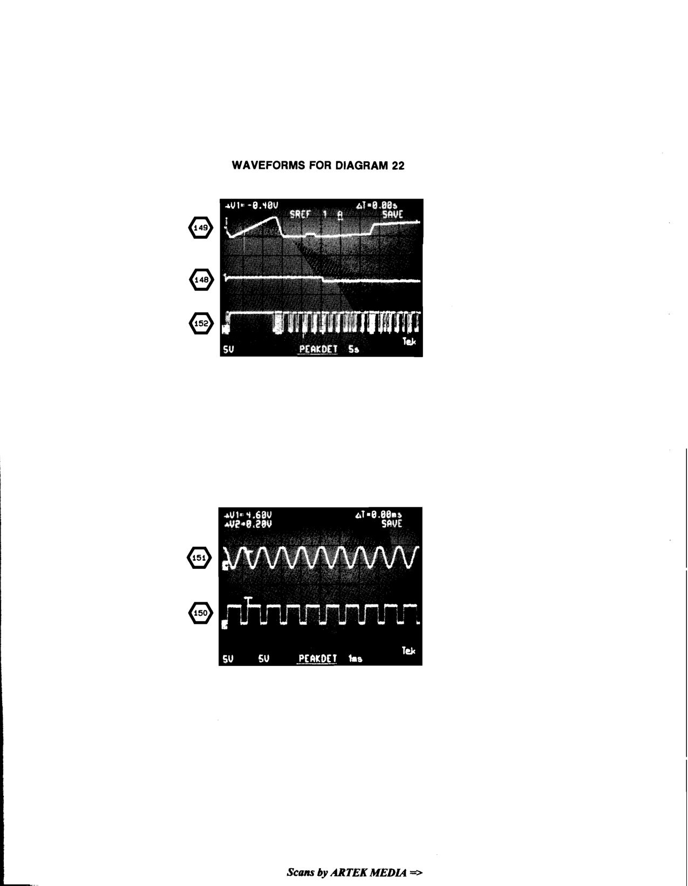


<details><summary>OCR text on this page</summary>

```
WAVEFORMS FOR DIAGRAM 22 
Scans by ARTEK MEDLQ =>
```

</details>


---

## Page 417 of 451

XY PLOTTER BOARD DIAGRAM 22 
Scans by ARmK MEDL4 => 
ASSEMBLY A 2 0 
BOARD 
LOCATION 
2C 
2C 
2C 
2C 
2C 
1 6 
1 A 
1 A 
1 A 
1 A 
1 A 
1 C 
1 C 
1A 
2 6 
SCHEM 
LOCATION 
1 6 
3E 
1 D 
1 C 
1 C 
1 6 
1C 
2 6 
2 6 
3 6 
4C 
3D 
3C 
3 6 
3 6 
CIRCUIT 
NUMBER 
ClOOl 
C1002 
C1003 
C1004 
C1005 
C1006 
C1007 
C l O l l 
C1012 
C1013 
C1014 
C1015 
CRlOOl 
CR1002 
CR1003 
C R l O l l 
CR1012 
CR1014 
CR1016 
BOARD 
LOCATION 
2 6 
1 C 
1A 
1A 
2A 
2 6 
2A 
3A 
3A 
2A 
2 6 
1 6 
1 6 
2 6 
2C 
CIRCUIT 
NUMBER 
R1012 
R1013 
R1014 
R1015 
R1016 
R1017 
UlOOlA 
UlOOlB 
UlOOlC 
UlOOlD 
U l 001 
V R l O l l 
VR1012 
W l 001 
W 1 002 
SCHEM 
LOCATION 
38 
2 6 
4C 
4 0 
4D 
2 6 
3 6 
4 6 
4 6 
4 6 
4 6 
3 6 
3D 
3C 
2C 
2D 
1 C 
3E 
2C 
CIRCUIT 
NUMBER 
FlOOl 
J l O l l 
J4110 
J6423 
J9301 
K I W I 
LlOOl 
L1002 
L1003 
0101 1 
0101 2 
R l OOl 
R1W2 
R 1 W 5 
R l 01 1 
BOARD 
LOCATION 
2 6 
2 6 
2A 
2A 
2A 
2A 
2A 
2 6 
3 6 
3 6 
3 6 
3 6 
1 6 
1 6 
2 6 
2 6 
2 6 
2C 
2 6 
SCHEM 
LOCATION 
1 E 
1 F 
1 6 
1 6 
3 6 
2D 
4 6 
46 
3 6 
1 6 
2C 
3E 
2E 
2C 
1 D


---

## Page 418 of 451

- -- 
- - 
&ns by => ARTEK MEDq 0 
2003-2005 
Component Number 
8 
\ 
A23 A2 R1234 
Schematic 
Assemb I 
y L T ' 
Number 
Circuit. 
Subas embly 
Number 
Number f i f used) 
A 
1 
B 
1 
C 
1 
D 
1 
E 
1 
F 
1 
G 
1 
H 
m 
m 
COMPONENT NUMBER EXAMPLE 
Chassis-mounted components have no 
Assembly Number prefix--see 
end o f 
Replaceable E l e c t r i c a l P a r t s L i s t . 
Static Sensitive Devices 
See Maintenance S e c t i o n 
NUMERAL AND LETTER AT SIGNAL LINES TO 
OR FROM OTHER DIA6RAMS INOICATES THE 
GRID COORDINATES ON ANOTHER SCHEMATIC 
-8.6VQ TO: R1015 
(FOR EXAMPLE: 4E) 
2230 
4999-7 1 
X Y PLOTTER BOARD 
X < 
m 
5 
;;t 
a 
cD o 
5 
0


---

## Page 419 of 451

2230 Service 
4999-30 
Figure 9-25. A21-RS-232 
Option board. 
A21- 
RS-232 OPTION BOARD 
Static Sensitive Devices 
See Maintenance Section 
COMPONENT NUMBER EXAMPLE 
Component Number 
I 
,A23,%= 
Schematic 
Assembly _ - 
t , 
clicuif 
Number 
Subassembly 
Number 
Number (rf used) 
C l 001 
23 
CRlOOl 
2 3 
R1212 
23 
U1234 
23 
C1002 
23 
CR1002 
2 3 
R1213 
23 
U1234 
23 
C1003 
23 
CR1003 
2 3 
R1214 
23 
U1234 
23 
C1015 
23 
FlOOl 
23 
R1245 
23 
U1242 
23 
I 
C1221 I ;: 
1 0 1 1 I :; I ,246 
I 
;2 I U1242 I 
23 
C1222 
J1212 
R1248 
U1243 
23 
C1232 
23 
C1235 
a1011 
U1222 
V R l O l l 
23


---

## Page 420 of 451

RS-232 OPTION BOARD DIAGRAM 2 3 
Scans by ARTEK MEDL4 => 
BOARD 
LOCATION 
18 
2D 
3D 
3D 
2D 
1 E 
3E 
1 E 
3G 
3G 
1 J 
1 J 
1 J 
3J 
3G 
1 J 
1 J 
3J 
3K 
1 D 
1 A 
1A 
1A 
1 A 
1A 
2F 
BOARD 
LOCATION 
3F 
3F 
3F 
3F 
3F 
3G 
3G 
3G 
3G 
1G 
1G 
1H 
1 H 
1J 
1J 
3H 
3H 
3H 
3H 
3H 
3H 
3H 
3H 
1 J 
1J 
1 C 
1 C 
CIRCUIT 
NUMBER 
U1234A 
U1234B 
U1234C 
U1234D 
U1234 
U1235 
U1235 
U 1236 
U1236 
U1241 
U1241 
U1242 
U1242 
U1243 
U1243 
U1244A 
U12448 
U1244D 
U1244E 
U1244F 
U 1244 
U1245 
U1245 
U1251 
U1251 
V R l O l l 
VR1012 
1 E 
1 E 
1E 
2E 
3F 
I A 
28 
I K 
I G 
3J 
SCHEM 
LOCATION 
6F 
3 J 
6D 
4 8 
8F 
5E 
7F 
6G 
8F 
28 
8E 
I F 
7 0 
3F 
7C 
6D 
6D 
3K 
5C 
3G 
8F 
6E 
8E 
1 H 
7D 
8L 
8K 
SCHEM 
LOCATION 
8K 
BL 
7 M 
8 M 
7K 
1 L 
3L 
8D 
8D 
7M 
7M 
3M 
1 M 
4C 
1D 
2D 
7J 
7J 
8 J 
7 M 
8B 
8 8 
78 
I 
CIRCUIT 
NUMBER 
CR1003 
CRlOll 
CR1012 
CR1014 
CR1016 
CR1221 
CR1222 
CR1223 
CR1224 
FlOOl 
J1011 
J1212 
J1214 
J1216 
J1222 
J1251 
J4110 
J6423 
J9301 
K l OOl 
LlOOl 
L l 002 
L1003 
ASSEMBLY 
CIRCUIT 
NUMBER 
ClO01 
Cl002 
C 1003 
C1004 
ClOOS 
C1006 
C 1007 
C l O l l 
C1012 
C1013 
C1014 
C1015 
C1221 
C1222 
C1223 
C1224 
C1225 
C1226 
C1227 
C1228 
C1229 
C1231 
C1232 
C1233 
C1234 
C1235 
C1236 
C1237 
1L 
1 L 
4K 
3K 
8D 
8K 
8K 
48 
1 A 
2G 
BOARD 
LOCATION 
28 
28 
28 
2C 
28 
2E 
2E 
3F 
3F 
28 
1 C 
2C 
3C 
1 K 
2E 
2K 
1 A 
1A 
2A 
28 
2A 
3A 
3A 
A21 
SCHEM 
LOCATION 
8K 
@J 
88 
8C 
8C 
7J 
78 
8B 
8B 
88 
8B 
78 
3K 
7C 
7C 
1 J 
3K 
3K 
2K 
3K 
2K 
7C 
7C 
7C 
8D 
8D 
2K 
7C 
I 
I 
I 
I 
I 
I 
I 
I 
a 
1 
BOARD 
LOCATION 
28 
28 
2A 
2A 
2 A 
2A 
2A 
28 
3 8 
3 8 
3 8 
3 8 
2E 
1 F 
2F 
2E 
2E 
2E 
2E 
2E 
3E 
2F 
1 G 
1 G 
3F 
3F 
3E 
3F 
2F 
2F 
2F 
3F 
3F 
3F 
3F 
2F 
2F 
1G 
1G 
1G 
1G 
PBlOO 
7L 
7K 
5K 
8L 
8L 
7K 
7M 
7L 
8 M 
7M 
7L 
7 L 
CIRCUIT 
NUMBER 
R1017 
R1212 
R1213 
R1214 
R1221 
R1222 
131223 
R1224 
R1234 
R1235 
R1243 
R1244 
R1245 
R1246 
R1248 
R1251 
R1252 
R1253 
R1255 
S l 2 2 l 
UlOOlA 
UlOOlB 
UlOOlC 
UlOOlD 
U l 001 
U1222 
0101 1 
0101 2 
01221 
RlOOl 
Rl OO2 
RlOO5 
R l O l l 
R1012 
R1013 
R1014 
R1015 
R1016 
C1237 
C1238 
C1239 
CI 240 
C1242 
C1243 
CI 244 
C1251 
C1252 
C1253 
CRlOOl 
CR1002 
CHASSIS 
VR1221 
VR1222 
VR1223 
VR1224 
VR1232 
WlOOl 
W l OO2 
W1216 
W8101 
Y1251 
SCHEM 
LOCATION 
7L 
2K 
2K 
3K 
5L 
5L 
4J 
5K 
5 8 
6C 
4 8 
3 8 
3 8 
5E 
6E 
4 8 
4 8 
2E 
2G 
5M 
7L 
7K 
7J 
8K 
8C 
6H 
1A 
2A 
28 
1E 
1 B 
1 B 
2B 
2C 
2C 
2C 
2C 
2C 
2C 
8D 
2K 
1 J 
7C 
7C 
7C 
7C 
7C 
2G 
3G 
8L 
8K 
MOUNTED 
CHASSIS 
3F 
3E 
3E 
3G 
1 J 
3J 
3G 
1 K 
3K 
3K 
1 B 
1 B 
PARTS 
U1222 
U1223 
U1223 
U1224 
U1224 
U1225 
U1225 
U1231 
U1231 
U1232A 
U1232 
U1233 
U1233 
7E 
5H 
8E 
2J 
8 0 
1 J 
8D 
1 8 
8E 
3J 
7F 
3 8 
8E


---

## Page 421 of 451

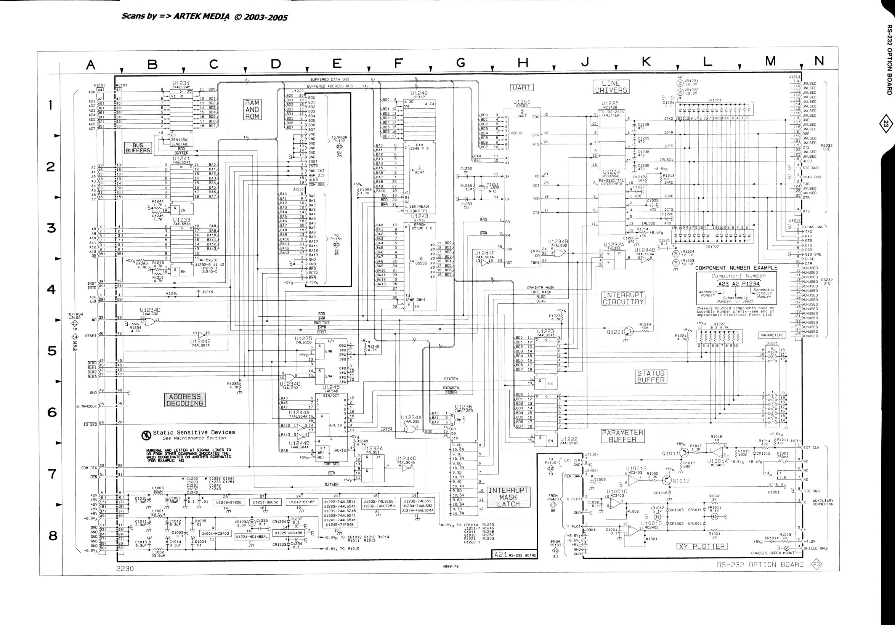


<details><summary>OCR text on this page</summary>

```
Scans by => ARTEK MEDIA 0 2003-2005 
Static Sensitive Devices 
See Maintenance Sectlo" 
WERV AH1 LETTER AT S I W U LINES TO 
OR F R M OTHER DIAGRUIS ImICATES M E 
H I D CCQWINATES CU ANOTHER SCHEMATIC 
(FOR m
E
:
 4El 
-+5vN 
TO 
CR1014 
R1223 
R1011 
R1213 
-a sv, 
T O ~ 1 0 1 5 
4999-72 
r.1 2 - 2 '2 '- 
2230 
..c GP:I311 
ECLRC @ 
, 
~ 
-- 
~ 
~ 
--
```

</details>


---

## Page 422 of 451

2230 Service 
Figure 9-26. A22-GPIB 
Option board. 
Static Sensitive Devices 
See Ma~ntenance Sectron 
COMPONENT NUMBER EXAMPLE 
A22-GPIB 
OPTION BOARD 
Component Number - 
A23A2R1234 
Assembly TTThemt8c 
Number 
Subassembiy 
, & ~ ~ ~ r 
Number (11 used) 
CIRCUIT 
SCHEM 
NUMBER 
NUMBER 
Cl 001 
24 
C1002 
24 
C1003 
24 
C1004 
24 
C1005 
24 
C1006 
24 
C 1007 
24 
ClOll 
24 
C1012 
24 
C1013 
24 
C1014 
24 
C1015 
24 
C1321 
24 
C1322 
24 
C1323 
24 
C1331 
24 
C1332 
24 
C1333 
24 
C1334 
24 
C1335 
24 
C1342 
24 
C1343 
24 
C1351 
24 
CRlOOl 
24 
CR1002 
24 
CR1003 
24 
CRlOl 1 
24 
CR1012 
24 
CR1014 
24 
CR1016 
24 
CR1321 
24 
CR1322 
24 
CIRCUIT 
SCHEM 
NUMBER 
NUMBER 
FlOOl 
24 
J l O l l 
24 
J1314 
24 
J1316 
24 
J1322 
24 
J1351 
24 
J4110 
24 
J6423 
24 
J9301 
24 
KlOOl 
24 
Ll00l 
2 4 
L1002 
24 
L1003 
24 
01011 
24 
01012 
24 
RlOOl 
24 
R1002 
24 
R1005 
24 
R l O l l 
24 
R1012 
24 
R1013 
24 
A1014 
24 
R1015 
24 
R1016 
24 
R1017 
24 
R1321 
24 
R1322 
24 
R1323 
24 
R1335 
24 
R1341 
24 
R1342 
24 
1 
R1343 
24 
U1335 
U1335 
U1335 
U1336 
U1336 
U1336 
U1336 
U1336 
U1341 
U1341 
U1342 
U1342 
u1343 
U1343 
U1344 
U1344 
U1344 
U1344 
U1344 
u1344 
U1345 
U1345 
U1351 
U1351 
VRlOll 
VR1012 
VR1321 
WlOOl 
W 1002 
W1316 
W1324 
W8101 
Chars! mounted components have no Assembly Number 
prefx-see 
end of Replaceable Electrca Parts Llst


---

## Page 423 of 451

GPlB OPTION BOARD DIAGRAM 24 
Scans by ARTEK M
.
 
=> 
SCHEM 
LOCATION 
6J 
7F 
50 
5 0 
4 8 
58 
7F 
2C 
8E 
1G 
7E 
3G 
7D 
5E 
6E 
6F 
3H 
7F 
8D 
5E 
8E 
1J 
7C 
8L 
8K 
4L 
8J 
8J 
4C 
6J 
1 A 
BOARD 
LOCATION 
1 J 
1 J 
3J 
3J 
1J 
1J 
1 K 
1 D 
1 A 
1 A 
1 A 
1A 
1 A 
2F 
2 F 
2F 
2F 
3F 
3F 
3F 
3F 
2F 
2F 
1 G 
1 G 
2G 
2G 
3F 
3F 
3F 
3F 
3F 
3G 
BOARD 
LOCATION 
3G 
3G 
3G 
3G 
3G 
3G 
3G 
2G 
2G 
2H 
2H 
2J 
2J 
3H 
3H 
3H 
3H 
3H 
3H 
3H 
3H 
2J 
2J 
1 C 
1 C 
1 E 
1A 
2 8 
1 K 
2E 
1 G 
SCHEM 
LOCATION 
38 
3 8 
6J 
6E 
48 
3 8 
4H 
5M 
7L 
7J 
7J 
8J 
BC 
6K 
7E 
5K 
7E 
2K 
7E 
1 K 
8E 
1 C 
8E 
6F 
7F 
3C 
BE 
7E 
2K 
7D 
6H 
7F 
5C 
CHASSIS MOUNTED PARTS 
CIRCUIT 
NUMBER 
U1335B 
U1335 
U1336A 
U1336B 
U1336C 
U1336D 
U1336 
U1341 
U1341 
U 1342 
U1342 
U1343 
U1343 
U1344A 
U1344B 
U1344C 
U1344D 
U1344E 
U1344F 
U1345 
U1345 
U1351 
U1351 
V R l O l l 
VR1012 
VR1321 
WlOOl 
W1002 
W1316 
W1324 
W8101 
ASSEMBLY 
CIRCUIT 
NUMBER 
ClOO1 
C1002 
C1003 
C1004 
C1005 
C1006 
C1007 
C l O l l 
C1012 
C1013 
C1014 
C1015 
C1321 
C1322 
C1323 
C1331 
C1332 
C1333 
C1334 
C1335 
C1342 
C1343 
C1351 
CRlOOl 
CR1002 
CR1003 
C R l O l l 
CR1012 
CR1014 
CR1016 
CR1321 
CR1322 
PB 100 
BOARD 
LOCATION 
28 
2 B 
2A 
2A 
2A 
2A 
2A 
28 
38 
3 8 
3 8 
38 
2E 
1 F 
2F 
2F 
2G 
2G 
3F 
3F 
1J 
3J 
1 J 
18 
18 
2 8 
2 8 
28 
2C 
28 
2E 
2E 
A22 
SCHEM 
LOCATION 
8J 
8J 
8C 
8C 
8C 
7H 
78 
8B 
8B 
8B 
BB 
78 
4L 
7C 
7C 
7C 
7C 
7C 
7C 
7C 
7C 
7C 
7C 
8K 
8K 
8K 
8K 
7L 
8M 
7K 
1 M 
4M 
1A 
CIRCUIT 
NUMBER 
JlO11 
J1314 
J1316 
J1322 
J1351 
J4110 
J6423 
J9301 
K l OOl 
LlOOl 
L1002 
L1003 
0101 1 
0101 2 
R1 001 
R1002 
R1m5 
R l O l l 
R1012 
R1013 
R1014 
R1015 
R1016 
R1017 
R1321 
R1322 
R1323 
R1335 
R1341 
R1342 
CHASSIS 
SCHEM 
LOCATION 
7 M 
1 M 
4C 
1 E 
2E 
7H 
7H 
6H 
7 M 
8B 
8B 
78 
7K 
7K 
8L 
8L 
7J 
7 M 
7K 
8M 
7L 
7L 
7L 
7K 
5 L 
4M 
4L 
7D 
58 
58 
BOARD 
LOCATION 
1C 
3C 
1 K 
2E 
2K 
1A 
1 A 
2A 
2 8 
2A 
3A 
3A 
2A 
28 
1 B 
1 B 
28 
2C 
2C 
2C 
2C 
2C 
2C 
1 B 
2D 
1 E 
3E 
3G 
3G 
3G 
CIRCUIT 
NUMBER 
R1344 
R1345 
R1346 
R1348 
R1351 
R1352 
R1353 
51321 
UlOOlA 
UlOOlB 
UlOOlC 
UlOOlD 
UlOOl 
U1322 
U1322 
U1323 
U1323 
U1324 
U1324 
U1325 
U1325 
U1331 
U1331 
U1332 
U1332 
U1333 
U1333 
U1334A 
U1334B 
U1334C 
U1334D 
U1334 
U1335A


---

## Page 424 of 451

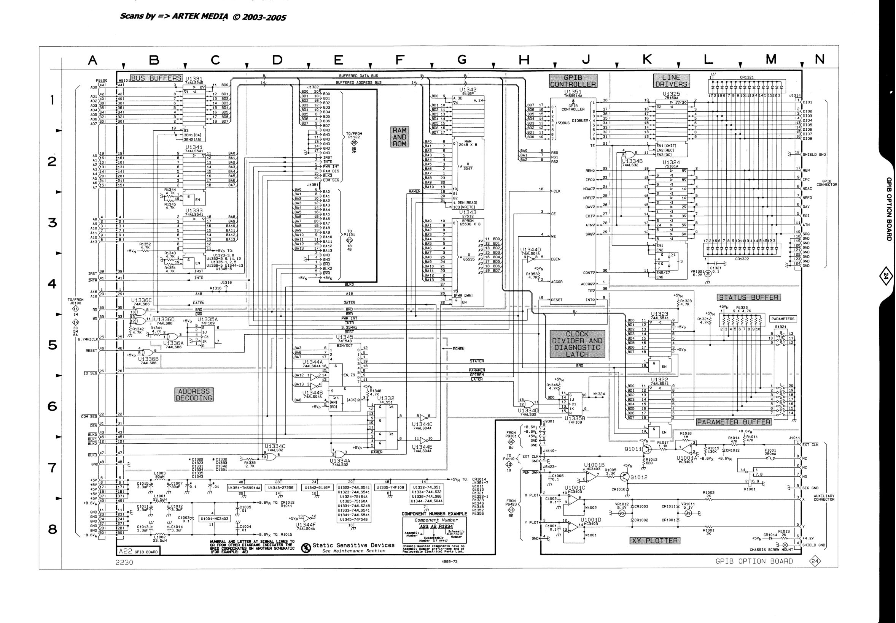


<details><summary>OCR text on this page</summary>

```
a n s by => ARTEK MED- 
0 
2003-2005 
2230 
4999-73 
G P I B OPTION BOARD 
@
```

</details>


---

## Page 425 of 451

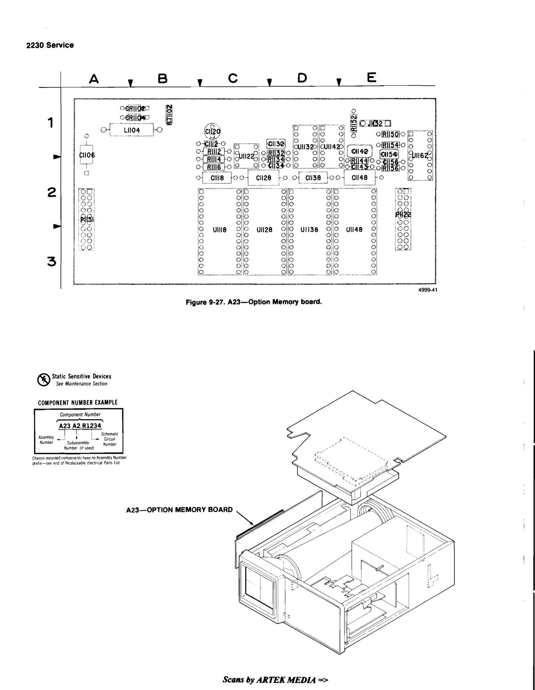


<details><summary>OCR text on this page</summary>

```
2230 Service 
Figure 9-27. A23-Option 
Memory board. 
Static Sensitive Devices 
See Marntenance Sectron 
COMPONENT NUMBER EXAMPLE 
Arrembiy 
Number (11 used) 
- 
Charslr mounted components have no knembly Numbel 
prelir-see 
end oiReplareable ilectrlcal Parts Llsl 
MEMORY 
Scans by ARmK MEDLQ =>
```

</details>


---

## Page 426 of 451

A23-OPTION 
MEMORY BOARD 
Scans by ARTEK MEDLP r> 
I 
CIRCUIT 
NUMBER 
U1132 
U1132 
U1132 
U1138 
U1138 
U1142 
U1142 
U1142 
U1148 
U1148 
U1162 
U1162 
SCHEM 
NUMBER 
25 
2 5 
25 
25 
2 5 
25 
25 
25 
2 5 
25 
25 
25 
, 
2 5 
25 
CIRCUIT 
NUMBER 
CR1104 
J1152 
L1104 
PI122 
P I 122 
P I 151 
P1151 
R11 12 
R11 14 
R1116 
R1132 
R1132 
171134 
R l l M 
SCHEM 
NUMBER 
25 
25 
25 
25 
25 
25 
25 
25 
25 
25 
25 
25 
CIRCUIT 
NUMBER 
C1106 
C1112 
C1118 
C1120 
C1128 
C1132 
C1134 
C1138 
C1142 
C1143 
C1148 
C1154 
C1156 
CR1102 
SCHEM 
NUMBER 
25 
25 
25 
25 
25 
25 
25 
25 
25 
25 
25 
25 
25 
25 
CIRCUIT 
NUMBER 
R1150 
R1152 
R1154 
R1156 
RT1102 
U1118 
U1118 
U1122 
U1128 
U1 128 
U1132 
U1132 
U1132 
SCHEM 
NUMBER 
25 
25 
25 
25 
25 
25 
25 
25 
25 
25 
25 
25 
25 
U l l 3 2 
1 
25


---

## Page 427 of 451

OPTION MEMORY DIAGRAM 25 
Scans by ARTEK MEDLQ - 
ASSEMBLY A 2 3 
CIRCUIT 
NUMBER 
C1106 
C1112 
C l l l 8 
C1120 
C1128 
C1132 
C1134 
C1138 
C1142 
C1143 
C1148 
C1154 
C1156 
CR1102 
CR1104 
J1152 
L1104 
SCHEM 
LOCATION 
1B 
1 D 
1 F 
1 C 
2E 
2G 
1 F 
2E 
3H 
1 F 
2 0 
3K 
1 F 
2C 
2C 
2 8 
1 B 
CHASSIS MOUNTED PARTS 
BOARD 
LOCATION 
1 A 
1 C 
2C 
1 C 
2C 
1 D 
2D 
2 D 
1 E 
2 E 
2E 
1 E 
2 E 
1 B 
1 B 
1 E 
1A 
B T l l O l 
CIRCUIT 
NUMBER 
P1122 
P I 1 2 2 
P I 151 
P I 151 
R1112 
R l l l 4 
R1116 
R1132 
R1132 
A1 134 
R1 144 
R1150 
R1 152 
R1154 
R1156 
RT1102 
U l l l B 
U1118 
2A 
SCHEM 
LOCATION 
2 M 
6B 
1 8 
4 8 
1 C 
1C 
2C 
2G 
2G 
1 G 
3H 
1 K 
1 K 
3J 
3 K 
3 8 
3F 
6 M 
2A 
CHASSIS 
P I 1 5 2 
CHASSIS 
BOARD 
LOCATION 
2E 
2E 
2 A 
2A 
1 C 
2C 
2C 
1 D 
1 0 
2D 
2E 
1 E 
1 E 
1 E 
2E 
1 B 
3C 
3C 
CIRCUIT 
NUMBER 
U1122 
U1128 
U1128 
U1 132B 
U1132C 
U1 132D 
U1132D 
U1132E 
U1132F 
U1132 
U1138 
U1138 
U1142A 
U1142B 
U1142 
U1 148 
U1148 
U1162 
U1162 
SCHEM 
LOCATION 
1 E 
3 E 
6K 
2G 
3H 
3J 
3K 
3 J 
3K 
3F 
3 D 
6H 
2K 
2K 
1 F 
3 D 
6F 
1 F 
5C 
BOARD 
LOCATION 
2C 
3C 
3C 
1 D 
1 D 
1 D 
I D 
1 D 
1 D 
1 D 
3D 
3 D 
1 D 
1 D 
1 D 
3E 
3E 
1 E 
1 E


---

## Page 428 of 451

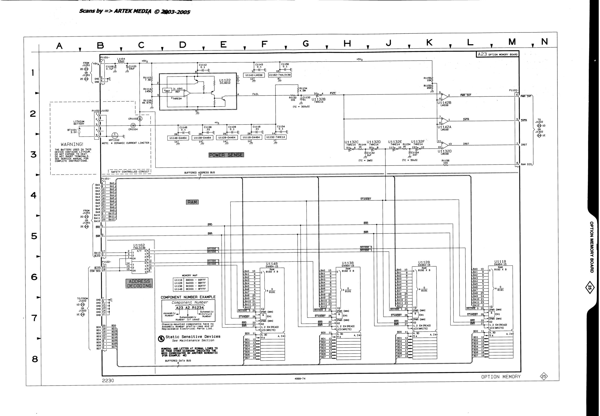


<details><summary>OCR text on this page</summary>

```
WARNING! 
THE BATTERY USED I N T H I S 
DEVICE CONTAINS L I T H I U M . 
DO NOT EXPOSE TO HEAT 
DO NOT SHORT TERMINALS. 
SEE SERVICE MANUAL FOR 
COMPLETE INSTRUCTIONS. 
---------- 
COMPONENT NUMBER EXAMPLE 
Static Sensitive Devices 
See Maintenance Section 
I 
I 
4999-74 
OPTION MEMORY 
2230 
0
```

</details>


---

## Page 429 of 451

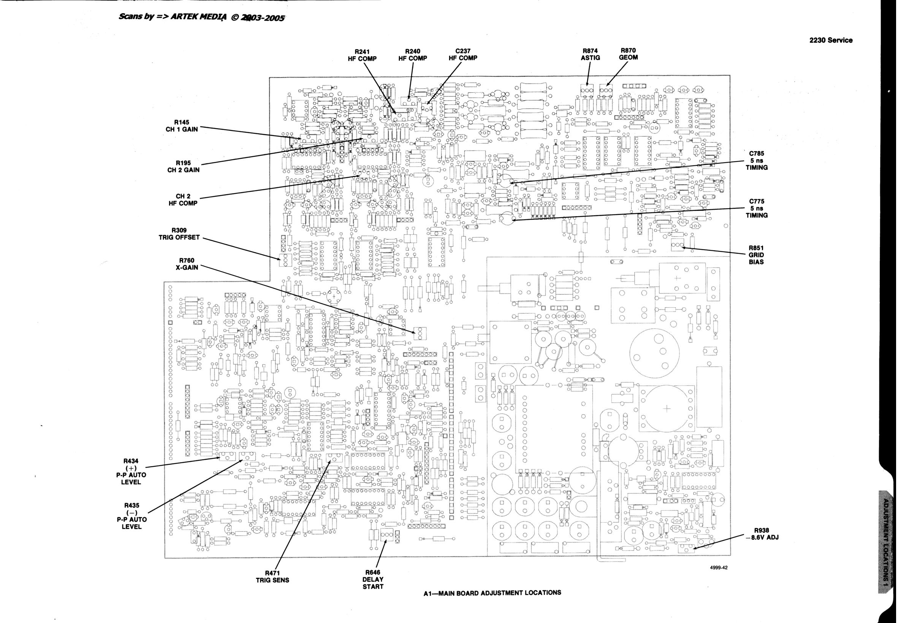


<details><summary>OCR text on this page</summary>

```
2230 Service 
A1-MAIN 
BOARD ADJUSTMENT LOCATIONS
```

</details>


---

## Page 430 of 451

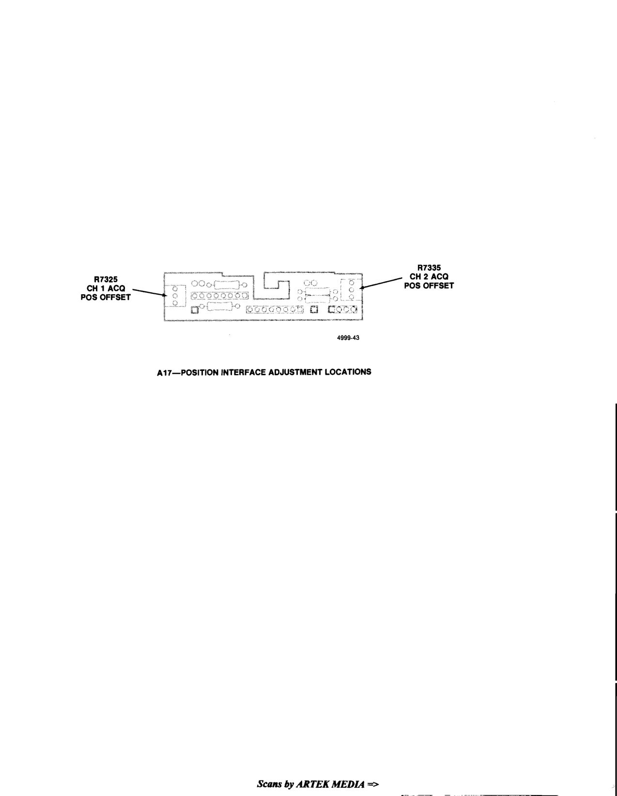


<details><summary>OCR text on this page</summary>

```
R7335 
R7325 
CH 2 ACQ 
CH 1 ACQ 
POS OFFSET 
POS OFFSET 
A17-POSITION 
INTERFACE ADJUSTMENT LOCATIONS 
Scans by ARTEK MEDLQ =
```

</details>


---

## Page 431 of 451

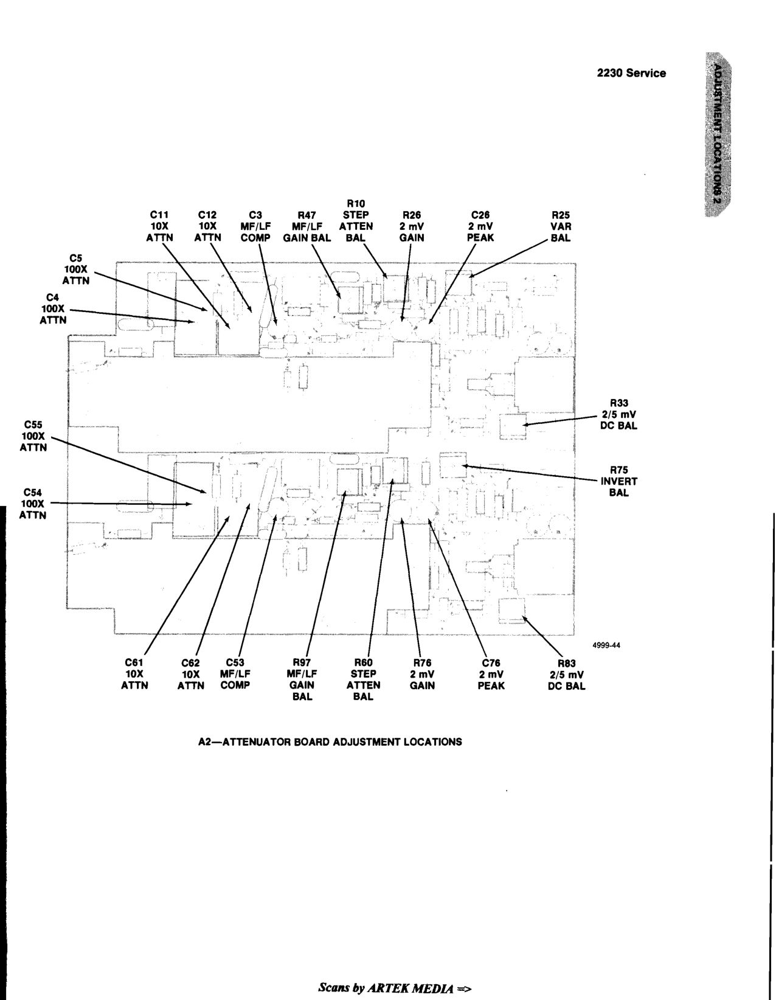


<details><summary>OCR text on this page</summary>

```
2230 Service 
ATTN 
ATTN 
COMP 
GAIN 
ATTEN 
GAIN 
PEAK 
DC BAL 
BAL 
BAL 
A2-ATTENUATOR 
BOARD ADJUSTMENT LOCATIONS 
Scans by ARTEK MEDL4 -
```

</details>


---

## Page 432 of 451

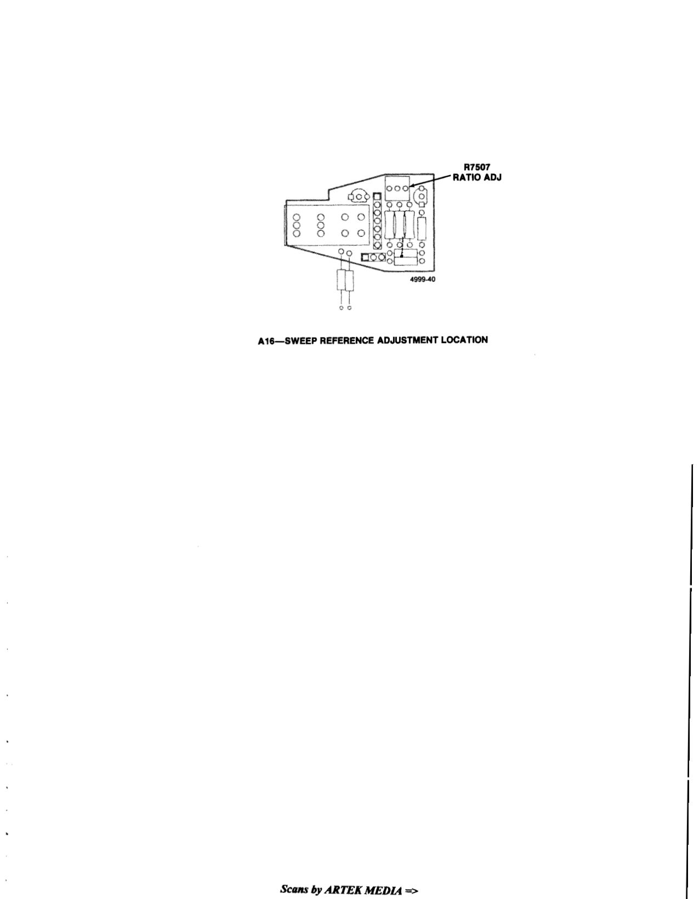


<details><summary>OCR text on this page</summary>

```
' RATIO ADJ 
A16-SWEEP 
REFERENCE ADJUSTMENT LOCATION 
Scans by ARTEK MEDLP =>
```

</details>


---

## Page 433 of 451

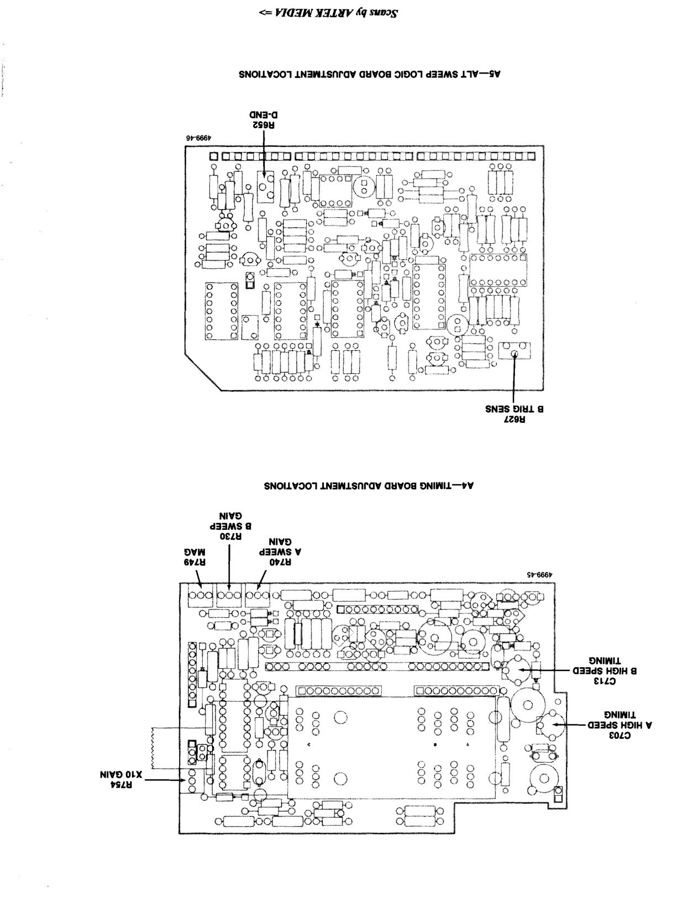


<details><summary>OCR text on this page</summary>

```
SNOILV~I L N ~ W L S ~ P ~ V 
auvoa 31001 d 3 3 ~ s 
nv-sv 
NlVO 
d33MS 9 
SPLU 
OPLU 
NlVO OLX 
PS LU
```

</details>


---

## Page 434 of 451

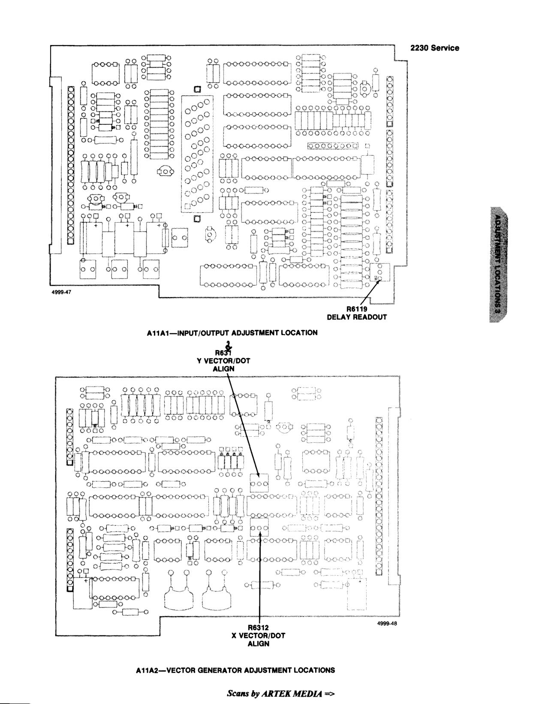


<details><summary>OCR text on this page</summary>

```
2230 Service 
R6119 
DELAY READOUT 
A1 1 A1 -1NPUTIOUTPUT ADJUSTMENT LOCATION 
R6 A 
Y VECTORIDOT 
ALIGN 
,-- 
ALIGN 
A11 A2-VECTOR 
GENERATOR ADJUSTMENT LOCATIONS 
Scans by ARTEK MEDLA r>
```

</details>


---

## Page 435 of 451

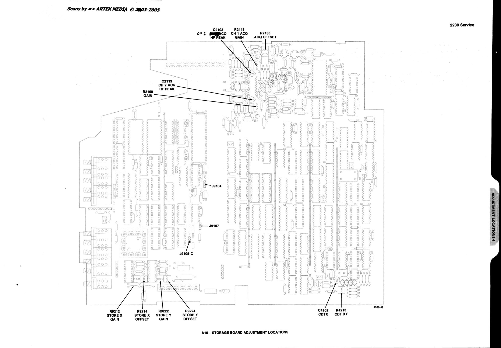


<details><summary>OCR text on this page</summary>

```
2230 Service
```

</details>


---

## Page 436 of 451

S e c t i o n 10 - 2230 S e r v i c e 
REPLACEABLE 
MECHANICAL PARTS 
PARTS ORDERING INFORMATION 
Replacement parts are available f r o m o r through y o u r local 
Tektronix. Inc. Field Office o r representative. 
Changes t o Tektronix instruments a r e sometimes m a d e t o 
accommodate improved components as they b e c o m e available. 
a n d lo g i v e y o u t h e benefit o f t h e latest circuit improvements 
developed in o u r engineering department. It i s lherefore 
important, w h e n ordering parts, t o include the following 
information in y o u r order: Part number, instrument t y p e o r 
number, serial number, a n d modification n u m b e r if applicable. 
If a part y o u have ordered h a s b e e n replaced w i t h a n e w o r 
improved part, y o u r local Tektronix. Inc. Field Office o r 
representative will contact y o u concerning a n y c h a n g e in part 
number. 
C h a n g e information, if any, is located a t t h e rear o f this 
manual. 
ITEM NAME 
In t h e Parts List, a n l t e m N a m e is separated f r o m t h e 
description b y a c o l o n (:). Because of space limitations, a n I t e m 
N a m e m a y sometimes appear a s incomplete. F o r further l t e m 
N a m e identification, t h e U.S. Federal Cataloging H a n d b o o k H6-1 
c a n b e utilized where possible. 
FIGURE AND INDEX NUMBERS 
INDENTATION SYSTEM 
T h i s mechanical parts list is indented t o indicate item 
relationships. Following is a n example o f t h e indentation system 
used in the description column. 
1 2 3 4 5 
N a m e 8 Description 
Assembly a n d l o r C o m p o n e n t 
Attaching parts l o r Assembly a n d l o r C o m p o n e n l 
"" END ATTACHING PARTS "" 
Detail Part 01 Assembly and/or C o m p o n e n t 
Attaching parts lor D e t a i l Part 
"" END ATTACHING PARTS "" 
Parts 01 Detail Part 
Attaching parts lor Parts 01 Detail Part 
"" END ATTACHING PARTS "" 
Attaching Parts always appear in t h e same indentation a s 
t h e item it mounts, while t h e detail parts are indented t o t h e right. 
Indented items are part of, a n d included with, the next higher 
indentation. 
A n a c h l n g parts m u s t be purchased separately, unless o l h e m l s e 
specified. 
Items in this section are referenced b y figure a n d index 
n u m b e r s t o the illustrations. 
ABBREVIATIONS 
a 
ACTR 
ADPTR 
ALIGN 
AL 
ASSEM 
ASSY 
ATTEN 
AWG 
80 
BRKT 
BUS 
BRZ 
BSHG 
CAB 
CAP 
CER 
CHAS 
CKT 
COMP 
CONN 
c o v 
CPLG 
CRT 
DEG 
DWR 
INCH 
NUMBER SIZE 
ACTUATOR 
ADAPTER 
ALIGNMENT 
ALUMINUM 
ASSEMBLE0 
ASSEMBLY 
ATTENUATOR 
AMERICAN WlRE GAGE 
BOARD 
BRACKET 
BRASS 
BRONZE 
BUSHING 
CABINET 
CAPACITOR 
CERAMIC 
CHASSIS 
CIRCUIT 
COMPOSITION 
CONNECTOR 
COVER 
COUPLING 
CATHODE RAY TUBE 
DEGREE 
DRAWER 
ELCTRN 
ELEC 
ELCTLT 
ELEM 
EPL 
EOPT 
EXT 
FIL 
FLEX 
FLH 
FLTR 
FR 
FSTNR 
FT 
FXD 
GSKT 
HDL 
HEX 
HEX HD 
HEX SOC 
HLCPS 
HLEXT 
HV 
IC 
10 
IDENT 
IMPLR 
ELECTRON 
ELECTRICAL 
ELECTROLYTIC 
ELEMENT 
ELECTRICAL PARTS LIST 
EQUIPMENT 
EXTERNAL 
FlLLlSTER HEAD 
FLEXIBLE 
FLAT HEAD 
FILTER 
FRAME or FRONT 
FASTENER 
FOOT 
FIXED 
GASKET 
HANDLE 
HEXAGON 
HEXAGONAL HEAD 
HEXAGONAL SOCKET 
HELICAL COMPRESSION 
HELICAL EXTENSION 
HIGH VOLTAGE 
INTEGRATED CIRCUIT 
INSIDE DIAMETER 
IDENTIFICATION 
IMPELLER 
IN 
INCH 
INCAND 
INCANDESCENT 
INSUL 
INSULATOR 
INTL 
INTERNAL 
LPHLDR 
LAMPHOLDER 
MACH 
MACHINE 
MECH 
MECHANICAL 
MTG 
MOUNTING 
NIP 
NIPPLE 
NON WlRE NOT WlRE WOUND 
OBD 
ORDER BY DESCRIPTION 
OD 
OUTSIDE DIAMETER 
OVH 
OVALHEAD 
PH BRZ 
PHOSPHOR BRONZE 
PL 
PLAIN or PLATE 
PLSTC 
PLASTIC 
PN 
PART NUMBER 
PNH 
PAN HEAD 
PWR 
POWER 
RCPT 
RECEPTACLE 
RES 
RESISTOR 
RGD 
RIGID 
RLF 
RELIEF 
RTNR 
RETAINER 
SCH 
SOCKET HEAD 
SCOPE 
OSCILLOSCOPE 
SCR 
SCREW 
SE 
SINGLE END 
SECT 
SECTION 
SEMICOND SEMICONDUCTOR 
SHLD 
SHIELD 
SHLDR 
SHOULDERED 
SKT 
SOCKET 
SL 
SLIDE 
SLFLKG 
SELF-LOCKING 
SLVG 
SLEEVING 
SPR 
SPRING 
SO 
SOU ARE 
SST 
STAINLESS STEEL 
STL 
STEEL 
SW 
SWITCH 
T 
TUBE 
TERM 
TERMINAL 
THD 
THREAD 
THK 
THICK 
TNSN 
TENSION 
TPG 
TAPPING 
TRH 
TRUSS HEAD 
V 
VOLTAGE 
VAR 
VARIABLE 
W/ 
WITH 
WSHR 
WASHER 
XFMR 
TRANSFORMER 
XSTR 
TRANSISTOR 
Scans by ARTEK MEDL4 =>


---

## Page 437 of 451

Rsplacsabls Mechanical Parts - 2230 Service 
CROSS INDEX - MFR. CODE NUMBER TO MANUFACTURER 
Mfr. 
Code 
01536 
Citv. State. Z ~ D 
Code 
RDCKFORD I1 61108 
Manufacturer 
TMTRON INC 
CAMCAR OIV 
S M S PROOUCTS UNIT 
PMOUIT CORP 
RICHCO P U S T I C CO 
BURNOY CORP 
FREEHAY CORP 
THERMALWY CO INC 
BEWEN CORP 
ELECTRONIC OIV 
CHOMERICS INC 
SPECIALTY CONNECTOR CO INC 
Address 
17301 RIOGELRrm 
5825 N TRIPP AVE 
RICHRROS M E 
9 3 0 1 ALLEN OR 
a 2 1 n v n i i n VIM LRNE 
P 0 BOX 34829 
2200 US HHY 27 SOUTH 
P 0 BOX 1980 
n o~ffiorc COURT 
26M ENORESS P U C E 
BEWEN CORP 
MCGRRR-EDISON CO 
P 0 BOX 0 
MOO S BATAVIA AVE 
502 ELIRTH CITY P U Z A 
GENEVA I L 60134 
ST W U I S MO 63178 
BUSSMW MFG OIV 
FISCHER SPECIAL MFG CO 
ILLINOIS TOOL HORKS INC 
SHAKEPROOF OIVISION 
TEKTRONIX INC 
ELECTRICAL SPECIALITY CO SUBSIOIARY 
OF BEWEN CORP 
MICRODOT MANUFACTURIffi INC 
GREER-CENTRRL OIV 
ELCO INDUSTRIES INC 
MICROOOT Mffi INC CENTRAL SCRER- 
K E M E OIV 
SOISTROW Mffi CO INC 
TMTRON INC 
CWCAR D I V 
FELLER ASA ADOLF ffi 
C/O W E 1 COMPONENTS CORP 
SCHURTER AG H 
C/O P M E L COMWNMTS CORP 
NORTHWEST FL\STMER SALES INC 
H SCHURTER OG OIST PRNEL COMPONENTS 
PARSONS MFG CORP 
PATELEC-CM (ITALY) 
CAMCAR/TMTRON 
P 0 BOX 14460 
446 MORGRN ST 
ST CHARLES ROAD 
4900 S W GRIFFITH OR 
P 0 BOX 500 
213 E HARRIS AVE 
SOUTH S M FRMCISCO Cll 94080 
TROY M I 48090 
3221 n BIG BELIVER RO 
ROCKFORD 11 61101 
KEENE NH 03431 
701 SOMORA AVE 
600 18TH AVE 
GLEMRLE Ul 91201 
ROCKFORD 11 61101 
SMTA ROSA CA 95901 
3 5 5 TESCONI CIRCLE 
2015 SECONO STREET 
BERKELEY Ul 94170 
7923 SH CIRRUS ORIVE 
2015 SECOND STREET 
1055 OBRIEN 
10156 TORINO 
5 1 6 18TH AVE 
BEllVERTON OR 97005 
BERKELEY CA 94170 
MENU PARK CLI 94025 
vn~cwniw 
62145s ITALY 
ROCKFORO 11 61101


---

## Page 438 of 451

Replaceable Mechanical Parts - 2230 Service 
Fig. 6 
Index 
No. 
1-1 
-2 
-3 
Tektronix 
Serial/A.bembly No. 
Part No. 
Fffective 
D w n t 
644-0536-00 
437-0331-01 
367-0289-00 
Mfr. 
Code Mfr. Part No. 
80009 644-0536-00 
80009 437-0331-01 
80009 367-0289-00 
12345 
Name L Descri~tion 
CMINET ASSY: 
.CMINET ,SCOPE:M/FEET 
.WLE,CARRYIN:l3.855,SST 
(ATTACH IN PARTS) 
.SCRM,Tffi,TF:B-16 
X 0.562L,PUSTITE 
[EM ATTACHIN PARTS] 
- , 
(ATTACHIN PARTS) 
SCRM,LlllCHINE:6-32 
X 0.875,PNH,STL 
(EM ATTACHIN PARTS) 
LIIIRKER,IOENT:MKO 
TEK 2230 OCTL STOR SCOPE 
LIIIRKER,IOMT:MKO 2230 OCTL STOR SCOPE 
(OPTION 10,12 ONLY) 
SHLD,IMPWSION:FILTER,BWE 2211/2213/2215 
CUSHION ,CRT:POLYURETHLY(E 
KNOB:GRAY,O.l4 
10 X 0.28 00 X 0.32 H 
KNOB:WVE GRAY,O.O81 
I 0 X 0.28 00 X 0.32 H 
(8 Iwrmsrn) 
KNOB:LT GY,O.OBl 
I 0 X 0.28 00 X 0.32 H 
(HF REJECT SWITCH) 
KNOB:GRAY 0.5 00 X 0.531 H PLSTC 
PUSH 8UTTON:IVORY GY ,O.l86 SO X 0.48 H 
MTDKION SHAFT:8.805 
L,II/KNOB,PUSTIC 
KNOB:GRIIY,CIIL,O.l27 
10 X 0.392 00 X 0.4 H 
KNOB:GY,VOLTS/OIV,O.72 
00,0.79 
HWO.25 O I A 
WSH BUTTON:GRAY,0.227 
00 X 0.3 
PIN,STR,HWE0:0.075 
O I A X 1.27 L,AL 
MTDKION SMFT:0.312 00 X 1.58 L,AL 
COm,RCPT,ELEC:BNC 
(SEE JBlOO,J9510 REPL) 
(nnnctinui MRTS) 
NUT,PLllIN,HO:O.5-28 
X 0.562 HM,BRS CO PL 
TERMIWL,Wi:O.515 
IO,PMIN,STL 
CO PL 
WLISHER,LDCK:O.521 
IO,INT,0.025 
THK,SST 
(EM ATTACHIN PMTS) 
KNOB:WE0 GRIIY,CAL,O.OB3 
X 0.45 X 0.456 
~:GY,TIMWOIV,0.127 
X 0.855 X 0.844 
KNOB:GY,TIMWOIV,O.127 
X 0.855 X 0.844 
SETSCRM:5-40 X 0.125,STL 
KNOB:CLERR,0.252 
10 X 1.2 00 X 0.383 H 
PUSH 8UTTON:IVORY GY.1.445 
H,POLYCIIRBONLITE 
W:0.252 X 0.581 X 0.612 II/SET SCRM 
KNOB:GY,0.172 
10 X 0.41 00 X 0.496 H II/BAR 
KNOB:GY,0.127 
10 X 0.392 00 X 0.466 H 
MSHER,FUT:O.25 
10 X 0.375 00 X O.OZ,STL 
CO))I,RCPT,ELEC: 
(SEE 59376 REPL) 
TERIIIWL,Wi:0.391 
IO,WCKIN,BRS 
CO PL 
PINEL, FRONT: 
SUBPINEL, FRONT: 
COVER,RERR:II/LIIIRKERS 
SCRM,llllCHINE:6-32 
X 0.625,PNH ,STL 
~nnmnui 
PARTS) 
SCRM,TPG,TR:6-32 
X 0.437 TAPTITE,PNH,STL 
(EM ATTACHIN MRTS) 
RERR COVER INCLUDES: 
.LIIIRKER,IOENT:WO 
CLIUTION 
LIIIRKER,IOMT:LIKD 
CllUTION 
(MITE0 K I N W ONLY) 
LIIIRKER,IOMT:HKO 
CLIUTION 
(sowv/TEK ONLY) 
COVER,FIN:AUIYIMIII 
83385 OROER 8Y OESCR 
80009 220-0497-00 
80009 210-0241-00 
24931 OROER BY OESCR 
80009 366-0576-00 
80009 366-1840-03 
80009 366-1840-04 
TKO392 OROER BY OESCR 
80009 366-1850-00 
80009 366-0574-00 
80009 366-2020-01 
80009 366-2049-01 
80009 366-1146-00 
12327 OROER BY OESCR 
12327 OROER BY OESCR 
80009 333-3161-00 
80009 386-4850-02 
80009 M0-2538-09 
93907 OROER BY OESCR 
83385 OROER BY OESCR 
Scans by ARTEK MEDU =>


---

## Page 439 of 451

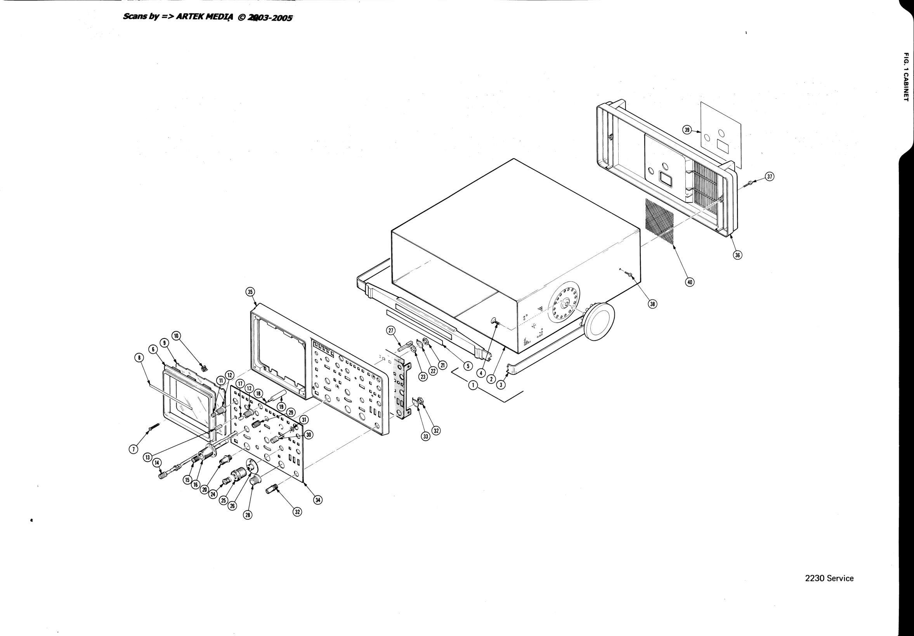


<details><summary>OCR text on this page</summary>

```
2230 Service
```

</details>


---

## Page 440 of 451

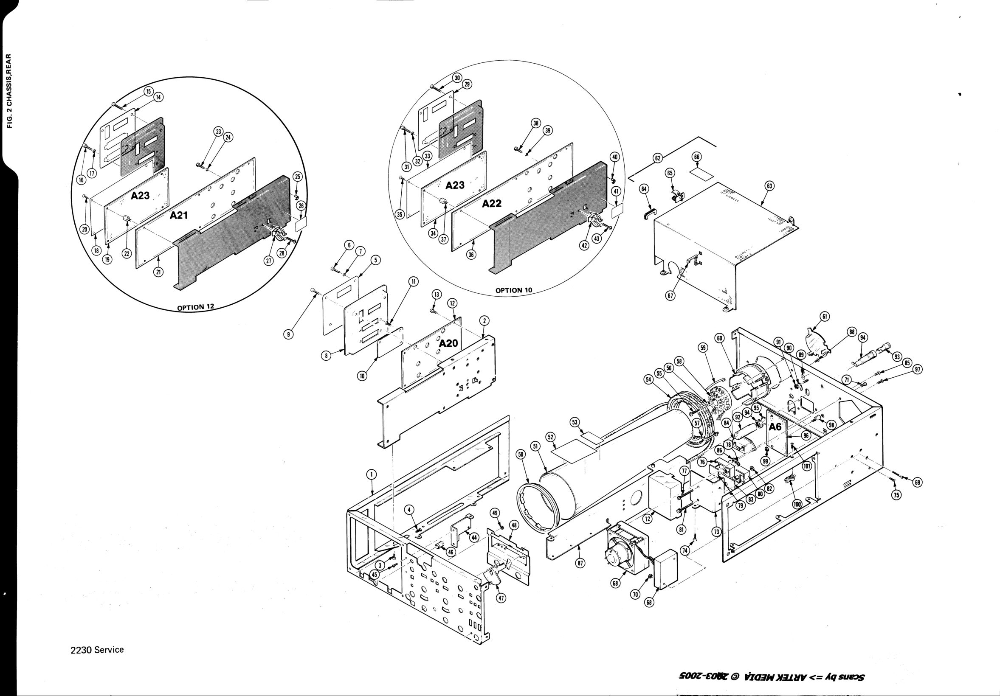


---

## Page 441 of 451

Replaceable Mechanical Parts - 2230 Service 
Fig. 8 
Index 
Tektronix 
No. 
Part No. 
2-1 
441-1571-00 
-2 
441-1591-00 
Serial/Assembly No. 
Effective 
Dscont 
Qty 
1 
1 
Mfr. 
Code Mfr. Part No. 
80009 441-1571-00 
80009 441-1591-00 
12345 
Name 8 Descri~tion 
CHLISSIS ,SCOPE: FRONT, L FRWE 
CHISIS,SCOPE:SIOE 
(LITTLICHIK PLIRTS) 
SCR,LISSM HSHR:4-40 X O.ZS,PNH,STL,TORX 
T9 
SCRM,MCHINE:4-40 
X 0.312,FLH,CO 
PL,T-9 
(END LITTLICHIW PLIRTS) 
OVERWY ,PRNEL:SIOE,PWTTER 
ST0 
SPLICER,WST:0.2 
L,4-4O,STEEL,O.l88 
HEX 
HLISHER,WCK:O.l15 
IO,SPLIT,O.O25 
THK 
SUBPRNEL,SIOE: 
(LITTLICHIK PLIRTS) 
SCRM,MCHINE:4-40 
X O.S,PNH,STL 
(EN0 LITTLICHIW PLIRTS) 
SPLICER,PWTE:0.05 
X 2.148 X 0.7,LIWLIINULI 
(LITTLICHIW PLIRTS) 
SCRM,HOCHINE:4-40 
X 0.5,FLH,100 
Dffi ST 
(EN0 LITTLICHIK PLIRTS) 
CKT BD LISSY:X-Y 
PLOTTER (SEE KXl RWL) 
(LITTLICHIW PRRTS) 
SCR,LISSM RSHR:44O X O.ZS,PNH,STL,TORX 
T9 
(EN0 LITTLICHIW PLIRTS) 
OPTION 12 ONLY 
OVERUY ,PMEL:SIOE 
RS232 
SCRM,WCHINE:4-40 
X O.S,PNH,STL 
SPIICER,WST:0.2 
L,4-40,STEEL,0.188 
HEX 
MSHER,WCK:O.115 
IO,SPLIT,O.OZS 
THK 
INsUL,CKT 80: WLYCLIReoNnTE 
CIRCUIT 80 LISSY:OPT MEMORY (SEE LIZ3 REPL) 
(LITTLICHIW PIIRTS) 
SCRM,WINE:4-40 
X 0.312,FLH.CO 
PL,T-9 
(EN0 LITTLICHIW PLIRTS) 
CKT 80 LISSY:RS-232 
OR GPIB(SEE W 1 , Z RWL) 
(LITTLICHIL PLIRTS) 
SPICER,WST:0.43 
L.4-40 
INT/EXT,LIL,O.25 
HEX 
(EN0 LITTLICHIL PLIRTS) 
SPIICER,WST:O.K 
L,4-40,8RS,0.25 
HEX 
MSHER,WCK:#lO 
SPLIT,O.O47 
THK,SI BRZ 
CWIP,CILE:O.062 
OILI,PWSTIC 
WRKER, 1DENT:MKD CMlTION,BLITTERY 
RTNR ,CLIPLICITOR:0.625 
OILI,STEEL 
(LITTLICHIL PIIRTS) 
SCR,LISSM EHR:4-40 X O.ZS,#(H,STL,TORX 
T9 
(EN0 LITTLICHIK PLIRTS) 
01536 
OROER BY OESCR 
80009 
211-0379-00 
83486 OROER BY OESCR 
01536 OROER BY OESCR 
80009 
129-1085-00 
86928 OROER BY OESCR 
80009 343-0088-00 
80009 334-6221-00 
80009 
344-01 16-00 
01536 ORDER BY OESCR 
OPTION 10 ONLY 
OVERUY ,PnNEL:SIDE,GPIB 
SCRM,WCHINE:4-40 
X O.S,PNH,STL 
SWU2,WST:O.K 
L,4-40,8RS,0.25 
HEX 
MSHER, WCK:#lO SPLIT,0.047 
THK,SI BRZ 
INsUL,CKT 80: WLYCLIRBONOTE 
CIRCUIT 80 LISSY:OPT MEMORY (SEE W 3 RWL) 
(LITTLICHIW PLIRTS) 
SCRM,MCHINE:4-40 
X O.JlZ,FLH,CD 
PL,T-9 
(W 
LITTLICHIW PLIRTS) 
CKT BOE LISSY:RS-232 
OR GPIB(SEE LU1,22 RWL 
(LITTLICHIW PLIRTS) 
SPLICER,WST:0.43 
L,4-40 
INT/€XT,LIL,O.ZS 
HEX 
(END LITTLICHIW PLIRTS) 
SPLICER,WST:O.K 
L,4-40,BRS,0.25 
HEX 
HLISHER,WCK:#lO SPLIT,O.W7 
THK,SI BRZ 
CWIP,CILE:0.062 
DILI,PWSTIC 
WRKER,IOENT:MKD 
CNJTION,BLITTERY 
SCR,LISSM HSHR:4-40 X O.ZS,#(H,STL,TORX 
T9 
RTNR,C/JPIICITOR:O.GK 
OILI,STEEL 
80009 
334-5963-00 
83486 318-OW-40416X 
80009 
129-1085-00 
86928 OROER BY OESCR 
80009 
342-0743-00 
80009 
129-1085-00 
86928 
ORDER BY OESCR 
80009 
343-0088-00 
80009 
334-6221-00 
01536 OROER BY OESCR 
80009 
344-01 16-00 
Scans by AR TEK MEDU


---

## Page 442 of 451

Replaceable Mechanical Parts - 2230 Service 
Fig. 8 
Index 
No. 
- 
2- 
-43 
Tektronix 
Serial/Assembly No. 
Part No. 
Effective 
Dscont 
Mfr. 
Code Mfr. Part No. 
Qtv 
12345 
Name 8 Wscridion 
(ATTACHIN PARTS) 
1 
SCR,ASSM HSHR:4-40 
X O.ZS,PNH,STL,TORX 
T9 
(EN0 ATTACHIN PARTS) 
01536 OROER BY DESCR 
BRKT .CHAS MTG: FRONT STORME 
(ATTACHIN PARTS) 
SCRM,TPG,TR:6-32 
X 0.25 TYPE TT,FILH,STL 
[EN0 ATTACHIN PARTS) 
83385 OROER BY DESCR 
SPAC~,SLENE:O.~~ L X 0 . k ID,AL 
LNER,SHITCH:ACbNO-DC,PLIISTIC 
BRACKET,GROUND:AUIIlINUM 
(ATTACHIN PARTS) 
NUT,PL,ASSM 
M:4-40 X 0.25,STL 
CO PL 
(END ATTACHING PARTS) 
SUPPORT ,SHIELD:CRT, 
FRONT ,PUSTIC 
SHIELD,ELEC:CRT ,STEEL 
MARKER,IDENT:MKD 
HARNIN,CRT VOLTMES 
MRKER,IDENT:MKD 
H I VACUUM 
DEMY LINE: (SEE DL9210 REPL) 
(ATTACHIN WRTS) 
SCRM,TPG,TR:6-32 
X 0.437 TAPTITE,PNH,STL 
(END ATTACHIN PARTS) 
OEMY LINE ASSMBLY INCLUOES: 
.STRAP,TIW)M,E:6.125 
L,NYLON 
.STRAP,TIW)M,E:8.0 
L X 0.1 H,NYLON 
SKT,PL-IN 
ELEK:CRT SOCKET ASSY 
(CRT SKT I S SUBPART OF A1 M I N BOARD ASSY) 
SPRIN,GROU(D:PLIITO 
WUNT,RESILIENT:CRT,REIIR 
CAP,CRT S0CKET:MTURAL LEXM 
SHIEU) ASSMBLY :POHER SUPPLY 
(ATTACHIN MRTS) 
SCR,ASSM IISHR:4-40 
X 0.437,PNH,STL,T9 
(END ATTACHIN PARTS) 
wnm SHIEU) 
ASSMBLY 
INCLUOES: 
.GRWET,PMSTIC:SIL 
GY ,U SHLIPE,O.52 
ID 
.CLIP,ELECTRICAL:RIY)OE,0.72 
O0,NYLON 
.WLIRKER,IOMT:MKO 
CAUTION 
CLIP,CIRCUIT 80:PMSTIC 
FLYI ,TUBELUIIAL: (SEE 89965 REPL) 
( ATTACHIN MRTS) 
SCRM,WLICHINE:4-40 
X 0.75,FLH,lW 
DEG,STL 
NUT,PL,ASSM 
M:4-40 X O.25,STL 
W PL 
SCRM,TPG,TR:4-40 
X 0.5,TYPE 
TT,PNH,STL 
(END ATTACH IN WRTS) 
COVER,CKT BD:LINE FILTER 
(SUBPART OF A6 MI FILTER BOARD) 
BRACKET,HEIIT SK:AWLIIHIM 
( ATTACHIN PARTS) 
SCR,ASSM IISHR:4-40 X 0.437,PNH,STL,TS 
SCRDI,WLICHINE:4-40 
X 0.25,FLH 
100 DEG,STL 
NUT,PL,ASSM 
HA:4-40 X 0.25,STL 
W PL 
(END ATTACHIN WRTS) 
RETAINER ,XSTR: 
( ATTACHIN PUTS) 
SCRM,WCHINE:4-40 
X 0.312,FLH,W 
PL,T-9 
NUT,PL,ASSM 
HA:4-40 X O.25,STL 
CD PL 
(EN0 ATTACHIN WRTS) 
83385 ORDER BY OESCR 
06383 
PLCl .SI-S8 
80009 346-0128-00 
80009 
136-0030-00 
01536 ORDER BY DESCR 
01536 OROER BY DESCR 
93907 OROER BY DESCR 
78189 211-041600-00 
IN~U~~T~R,PMTE:TR~SISTOR,CERLYIIC 
RETAINER .XSTR: 
(a~ina~m 
PORTS) 
SCRM,LIIICHINE:4-40 
X 0.312,FLH,CD 
PL,T-9 
NUT,PMIN,HM:6-32 
X 0.312,BRS 
CO PL 
(EN0 ATTACHIN MRTS) 
INSUMTDR,PLIITE:HEIIT 
SINK,AUMINII 
LINE FILTER ASSY:(SEE 
F I B 0 1 REPL) 
Scans by ARTEK MEDU =>


---

## Page 443 of 451

Replaceable Mechanical Part8 - 2230 Service 
Fig. (L 
Index 
Tektronlx 
Serial/Assembly No. 
No. 
Part No. 
Effective 
Dscont 
Mfr. - 
12345 
Name (L Descridion 
[ ATTACHIM WRTS) 
SCRM,WCHINE:4-40 
X O.375,FLH,CO 
PL,T-9 
NUT,PUIN,HM:0.25-32 
X 0.312.8RS 
CD P L 
(EM ATTACHING WRTS) 
SUPPORT, CHASS I 
S : 
(ATTACHIM PARTS) 
SCRM,TPG,TR:6-32 
X 0.25 TYPE TT,FILH ,STL 
(EM ATTACHIM PORTS) 
WRKER, 1DENT:MARKOD GROUNO S W O L 
TWIIIML,UKi:O.l46 
IO,WCKIM,8RZ 
T I N P L 
(ATTACHING PARTS) 
NUT,PL,ASSM 
M:6-32 
X 0.312,STL 
CO PL 
[EM ATTACHIM PARTS1 
83385 OROER BY OESCR 
COVER ;NSE 
LELIO: 
CAP,NSEHOU)ER:3# 
N S E S 
8OOY .NSEHOU)ER:3# 
L 5 X MLPl N S E S 
80009 200-1388-01 
S3629 
FEK 0 3 1 1666 
TKO861 0 3 1 1653 (FEU) 
24931 OROER BY DESCR 
MsH~R,wcK:o.~~I 
ID,INT,0.025 
THK,SST 
CKT BO ASSY: MI FILTER (SEE A6 REPL) 
(ATTACHIM PARTS) 
SCRM,MACHINE:4-40 
X 0.312,FLH,CO 
PL,T-9 
(EM ATTACHIM PARTS) 
MI FILTER BOARD ASS W L Y INCUOES: 
.SPOCER,WST:0.485 
L,4-40 
I N T / M T ,STL 
(ATTACHIM PARTS) 
.NUT,PL,ASSM 
llll:4-40 
X 0.25,STL 
CO P L 
(EM ATTACHIM PARTS) 
HINGE,CKT B0ARD:ll.B 
L,PUSTIC 
(ATTACHIM WRTS) 
SCR,ASSM HSHR:4-40 
X 0.437,PNH,STL,T9 
SCR,ASSM HSHR:4-40 
X 0.5,W,STL,T9 
(EM A T T K H I M PARTS) 
CMSSIS,SWPE:RELIR 
01536 OROER BY OESCR 
01536 OROER BY OESCR 
Scans by AR TEK MEDLQ =>


---

## Page 444 of 451

Replaceable Mechanical Parts - 2230 Service 
Flg. 8 
Index 
No. 
- 
3-1 
-2 
Tektronix 
Part No. 
377-0512-01 
- .--- ----- 
Serial/Assembly No. 
Effective 
Dscont 
Qty 
5 
1 
Mfr. 
Code Mfr. Part No. 
80009 
377-0512-01 
12345 
Name 8 Description 
INSERT,Km)B:0.172 
10 X 0.28 00 X 0.64,NYL 
CKT BO ASSY:FRONT PRNEL (SEE A3 RWL) 
( ATTACHIM PARTS) 
SCR,ASSM ffiHR:4-40 
X O.K,PHH,STL,TORX 
T9 
(EN0 ATTACHIM RRTS) 
PUSH BUTT0N:BUCK ,OFF 
EXTENSION SHAFf:12.544 
L,PUSTIC 
CKT BO ASSY:MAIN (SEE A1 REPL) 
.COVER ,WHER SH:B~CK,WLYCARBONilTE 
.SNITCH, PUSH: (SEE S901 REPL) 
.SPACER,VAR 
RES:0.3 
X 0.615 X O.SS,PLSTC 
CKT 80 ASSY:ALT SHEEP (SEE LH REPL) 
SPRCER,WST:0.485 
L,4-40 
INT/MT,STL 
SHIEU1,ELEC:POHER 
SUPPLY ,LOHER,PUSTIC,H/W 
RKER 
SH IELO ,ELEC: WHER SUPPLY, LONER PUSTIC 
WRKER, 1DENT:MKD CAUTION 
SPRCER,WST:0.685 
L,4-40 
INT/EXT,AL 
[ATTACHIM RRTS) 
NUT,PL,ASSM 
Hfk4-40 X O.K,STL 
CD PL 
(EN0 ATTACHIM PRRTS) 
SHI ELO ,ELEC:SH 
BD ,BOTTOM 
(ATTACHIM PARTS) 
SCR,ASSM HSHR:4-40 X O.K,PHH,STL,TORX 
T9 
(EN0 ATTACHIM PARTS) 
SHI ELO,ATTEM:TOP 
(ATTACHIM RRTS) 
SCR,ASSM ffiHR:4-40 
X O.K,PNH,STL,TORX 
T9 
SCR,RSSM llSHR:4-40 
X O.S,PNH,STL,T9 
SCRDI,ICHINE:4-40 
X l.Z,PHH,STL 
[EM ATTACHIM RRTS) 
CKT BD ASSY:LOGIC (SEE Al4,PlS REPL) 
(ATTACHIM PARTS) 
SCR,ASSM llSHR:4-40 
X O.ZS,PNH,STL,TORX 
T9 
(END ATTACHIM PARTS) 
SPACER,WST:0.966 
L,4-40 
L 3 EN0,AL 
(ATTRCHIM PLIRTS) 
SCR,ASSM HSHR:4-40 X O.ZS.PHH,STL,TORX 
T9 
(EM ATTACHIM PARTS) 
CKT BO ASSY:ATTENMTOR 
(SEE IU REPL) 
(ATTACHIM PARTS) 
SCR,ASSM HSHR:4-40 X 0.75,PHH ,STL,TORX 
OR 
(EN0 ATTACHIM PARTS) 
ATTWATOR BOAR0 ASSMBLY INCLUDES: 
.SH ASSY:ACTUATOR ,COUPLIM (SEE S l ,S51 REPL) 
..WT,PLIIIN,HM:4-40 
X O.lW,BRS 
CO PL 
. .BEIIRI#,CLYI 
SW:EN0,0.6 
OIA 
..ROLLER,DETENT:O.lK 
00 X 0.16,SST 
..SPRIM,FUT:0.7 
X 0.125,CU 
BE GRN CLR 
. .ACTUATOR, CLYI SW: AC-GND-OC 
.BEIIRIM,CLYI 
SH:CENTER,O.6 
DIA 
(ATTKHIM PARTS) 
.SCR,RSSM HSHR:4-40 X O.ZS,PHH,STL,TORX 
T9 
(EN0 ATTRCHIM PARTS) 
.5H ASSY:KTUnTOR,V/OIV 
(SEE Sl0,SM) REPL) 
. . 
ACTMTOR ,CLYI SH:ATTEMlUJTOR 
..WT,PUIN,HM:4-40 
X O.lB8,BRS 
CD PL 
..SPRIM,FUT:0.7 
X 0.125,tll 
BE GRN CLR 
..SPRIM,FUT:0.7 
X 0.125,CU 
BE RE0 CLR 
..ROLLER,DETENT:O.l25 
OD X 0.16,SST 
. .CPLG,SHAFT,RGO:O.l27 
ID,PLIISTIC 
. .BWRIM,CLYI 
SH:ENO,O.6 
DIA 
.SPRCER.SLEEVE:0.738 
L X 0.13 10.8RS 
01536 OROER BY OESCR 
01536 ORDER BY DESCR 
01536 ORDER BY DESCR 
01536 ORDER BY DESCR 
93907 ORDER BY DESCR 
01536 OROER BY OESCR 
80009 
129-0988-00 
01536 ORDER BY OESCR 
01536 OROER BY DESCR 
01536 OROER BY OESCR 
.RETAINI% 
,CONT:RBS 
GRAY 
(ATTACHIM PARTS) 
.SCR,ASSM llSHR:4-40 
X O.K,PHH,STL,TORX 
T9 
(EM ATTACHIM MRTS) 
ORDER BY DESCR 
Scans by AR TEK MEDU =>


---

## Page 445 of 451

Replaceable Mechanical Parts - 2230 Service 
Fig. 8 
Index 
No. 
3-44 
-45 
-46 
-47 
Tektronix 
Part No. 
376-0051-01 
361-1300-00 
361-1191-00 
---- ---- 
Serial/Assembly No. 
Eff ctive 
Dswnt 
2 
.CPUi,SHOFT,FLM:O.l27 
I D X 0.375 O0,OELRIN 
2 
.SPOCER,BERRING:O.115 
I0 X 0.2 00,BROSS 
1 
SPLLCER,CKT B0:O.UZ 
X 0.125 X 0.25, 
1 
CKT BO OSSY:TIMIffi (SEE 04 REPL) 
(OTTOCHING PORTS) 
3 
SCR,OSSEMHSHR:4-40XO.ZS,PNH,STL,TORXT9 
(EM OTTOCHING PORTS) 
1 
CKT 00 OSSY:SIEEP REFERMCE (SEE 016 REPL) 
1 
CKT BO OSSY:SIP INTERFOCE (SEE 013 REPL) 
1 
CO OSSY,SP,ELEC:2,26 
flW,4.0 L,l-2 
(FROM 01 TO wnm ON LIGHT) 
1 
BRAIO,nIRE:24 STRMOS,36 A&,TIWED 
COPPER 
1 
MSHER,FUT:0.13 
I0 X 0.375 OD X O.Ol,NYUIN 
3 
CLIP,GROUNO:CU%E 
1 
INSUUTOR ,PUTE:TRMSISTOR 
(WER CR970) 
Scans by ARTEK MEDL4 => 
Mfr. 
Code Mfr. Part No, 
80009 376-0051-01 
80009 361-1300-00 
80009 361-1191-00 
01536 ORDER BY OESCR 
70903 5112R424/36 
83309 
OROER BY OESCR 
80009 344-0367-00 
18565 69-11-8805-1674


---

## Page 446 of 451

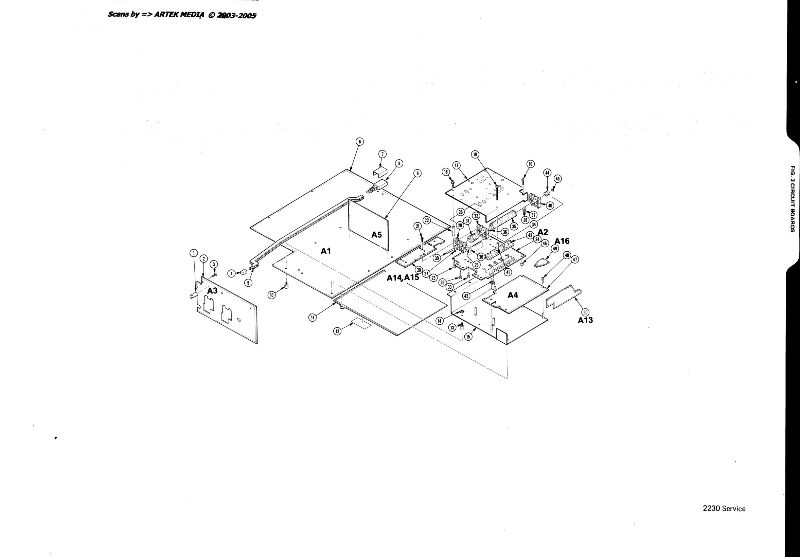


<details><summary>OCR text on this page</summary>

```
Sans by => AREK NED@ @ ajp3-200f 
2230 Service
```

</details>


---

## Page 447 of 451

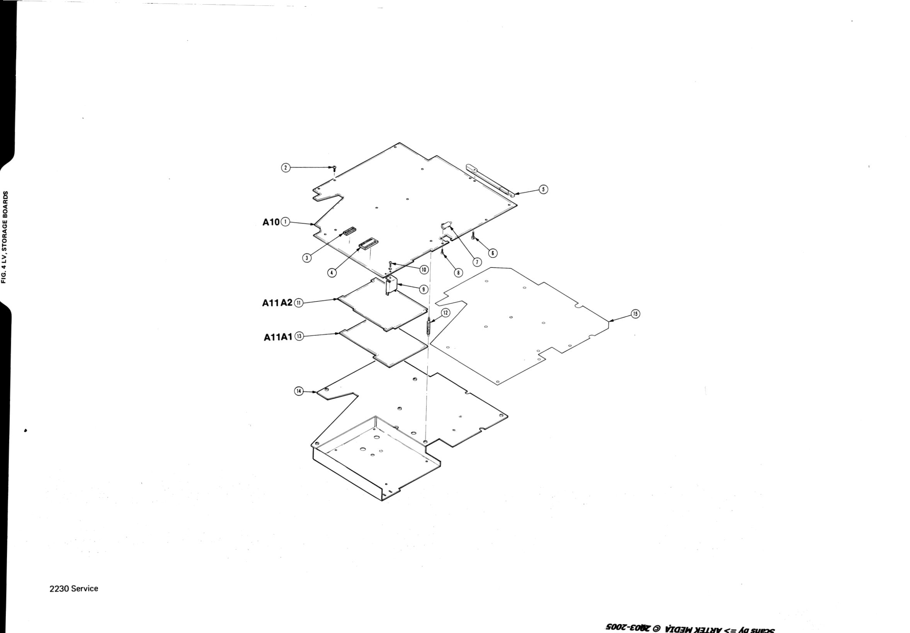


<details><summary>OCR text on this page</summary>

```
2230 Service
```

</details>


---

## Page 448 of 451

Replaceable Mechanical Parts - 2230 Service 
Fig. (L 
Index 
Tektronix 
Serial/Assembly No. 
No. 
Part No. 
Fffective 
Dscont 
4-1 
----- ---- 
12345 
Name 8 Description 
CKT BO RSSY:STORLIGE (SEE 010 REPL) 
(LITTACHING PLIRTS) 
SCR,LISSM HSHR:4-40 
X O.ZS,PNH,STL,TORX 
T9 
(END LITTLICHING PLIRTS) 
STORLIGE 80LIRO LISSWLY INCLUDES: 
.SCR,LISSM 
HSHR:4-40 X 0.437,PNH,STL,T9 
.SKT,PL-IN 
ELEK:MICROCIRCUIT,Ze 
D I P 
.SKT,PL-IN 
ELEK:MICROCIRCUIT,40 
D I P 
. INSULLITOR,DISK:TR~SISTOR,NYLON 
R€fIIINER,CKT 
80:PLLISTIC 
(ATTLICHING PRRTS) 
SCR,LISSM HSHR:4-40XD.312,PNH,STL,TS 
TORX 
(END LITTLICHING PLIRTS) 
HINGE,CKT BOLIRD:11.6 
L,PLLISTIC 
(ATTRCHING PLIRTS) 
SCRM,WCHINE:4-40 
X 0.25,FLH 
100 DEG,STL 
SCRM,LII)CHINE:4-40 
X 0.312,FLH ,100 DEG,STL 
[END LITTACHING PARTS) 
SPACER ,BRLICKEI: CHROMTE 
(nnnctirffi PLIRTS) 
SCR,ASSM KHR:4-40 
X 0.25,PNH,STL,TORX 
T9 
(END LITTACHING PLIRTS) 
CKT 8 0 ASSY:VECTOR GEN (SEE A1182 REPL) 
SPLICER ,CKT B0:0.375 
THK,WLYCRRBONCtTE BLllCK 
CKT BD ASSY:IN/OUT 
(SEE L I l l Q l REPL) 
CMSSIS,SCDPE:CKT 
BO 
INSUL,CKT 80: WLYCLIRBONLITE 
Mfr. 
Code Mfr. Part No, 
01536 OROER BY DESCR 
01536 OROER BY OESCR 
09922 OIL828P-108 
09922 0 1 L840P-108 
13103 
7717-1% 
80009 343-1098-00 
01536 
ORDER BY DESCR 
93907 ORDER 8Y OESCR 
83385 OROER BY OESCR 
01536 
OROER BY DESCR 
Scans by ARTEK MEDL4 =z


---

## Page 449 of 451

Replaceable Mechanical Parts - 2230 Service 
Flg. 8 
Index 
Tektronix 
No. 
Part No. 
5- 
Serial/Assembly No. 
Effective 
Dscont 
a& 12345 
Name 8 Descri~tion 
STWDIRD LICCESMRI ES 
PROBE,VOLTffiE:P6122,1.5 
METER ,lOX H/LICC 
FUSE,CLIRTRIMiE:31G,2R,250V,SLOH 
8LOM 
CONNECTOR IISSY:9 PIN ,MLILE H/HLIRDIIIE 
CRELE LISSY,MR,:3 
HIRE.98.0 
L,H/RTCWG CONN 
CWP,U)OP:0.25 
I0,PLLISTIC 
SCRM,TPG,TR:6-32 
X 0.437 TLIPTITE,PNH,STL 
HLISHER,FLRT:O.l5 
ID X 0.375 00 X 0.032 
MUCH ,LICCESSORY: 
WLIL,TECH:OPR,2230 
WAL,TECH:USERS GUIOE.2230 
OPTIONLIL LICCESSORIES 
COMPONENT KIT:NROPER)( 
.CLP,FUSEHOU)ER:5 
X 20bW FUSES 
.CILE ISSY,PHR,:3 
X 0.7W SO,ZMV,98.0 
L 
COMPONENT K1T:UNITED KINGDOM 
.CLIP,NSEHOU)ER:5 
X 2OMM FUSES 
.CILE LISSY ,MR, :3 X 0.7W SO ,240V ,98.0 L 
COMPONENT K1T:LIUSTRLILIRN 
.CLIP,FUSEHOU)ER:5 
X 20bW FUSES 
.CMLE LISSY,PHR,:3,18 
LI)IC,240V,98.0 
L 
COMPONENT K1T:NORTH MERICW 
.CLIP,FUSEHOU)ER:5 
X 20bW FUSES 
.CILE 
ASSY,PHR,:~,I~ 
m,240~,98.0 L 
COWWENT K1T:SIIISS 
.CLIP,FUSEHOU)ER:5 
X 20m FUSES 
.WLE LISSY,MR,:3.0 
X 0.75,6LI,240V,2.5W 
L 
TIP ,PROBE:H/LICTUATOR 
LIOLIPTER ,RLICK: 
VISOR,CRT: 
CLISE,CIIRRYING:24.5 
X 16.5 X 11.5 
COVER ,PROT:HLITERPROOF VINYL 
STRLIP,CRRRY 1NG:MKD TEKTRONIX 
MLUlULIL,TECH:SERVICE,2230 
Mfr. 
Code Mfr. Part No. 
MDXZ 
131-3579-00 
CH8352, FH-8352 
E4 CLERR ROUND 
ORDER BY DESCR 
OROER BY OESCR 
016-0677-02 
070-4998-00 
070-5370-00 
80009 020-0859-00 
TKO861 FEK 031 .I663 
S3109 ORDER BY OESCR 
80009 020-0860-00 
TKO861 FEK 031.1663 
TK1373 A25UK-R1 
80009 020-0861-00 
TKO861 FEK 031.1663 
s 3 i m ORDER BY DacR 
80009 020-0862-00 
TKO861 FEK 031 .I663 
70903 OROER BY OESCR 
80009 020-0863-00 
TKO861 FEK 031.1663 
S3109 OROER BY DESCR 
80009 013-0191-00 
80009 016-1003-00 
80009 016-0566-00 
TK1336 ORDER BY OESCR 
80009 016-0848-00 
80009 346-0199-00 
80009 070-499940 
Scans by AR TEK MEDLQ *


---

## Page 450 of 451

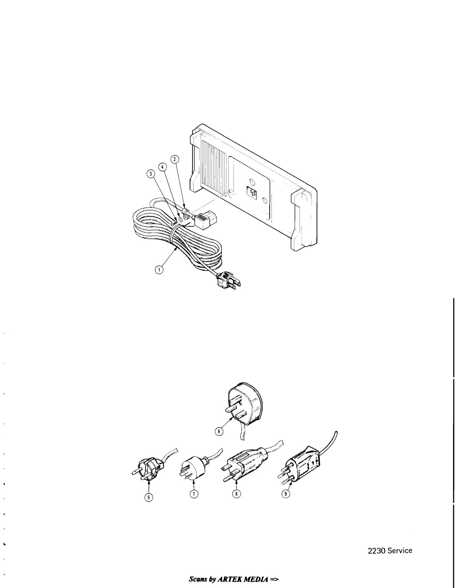


<details><summary>OCR text on this page</summary>

```
2230 Service 
Scans by ARTEK MEDM =>
```

</details>


---

## Page 451 of 451

At Tektronix, we continually strive to keep up with latest electronic developments 
by adding circuit and component improvements to our instruments as soon as they 
are developed and tested. 
Sometimes, due to printing and shipping requirements, we can't get these 
changes immediately into printed manuals. Hence, your manual may contain new 
change information on following pages. 
A single change may affect several sections. Since the change information sheets 
are carried in the manual until all changes are permanently entered, some 
duplication may occur. If no such change pages appear following this page, your 
manual is correct as printed. 
Scans by ARTEK MEDLQ =>
